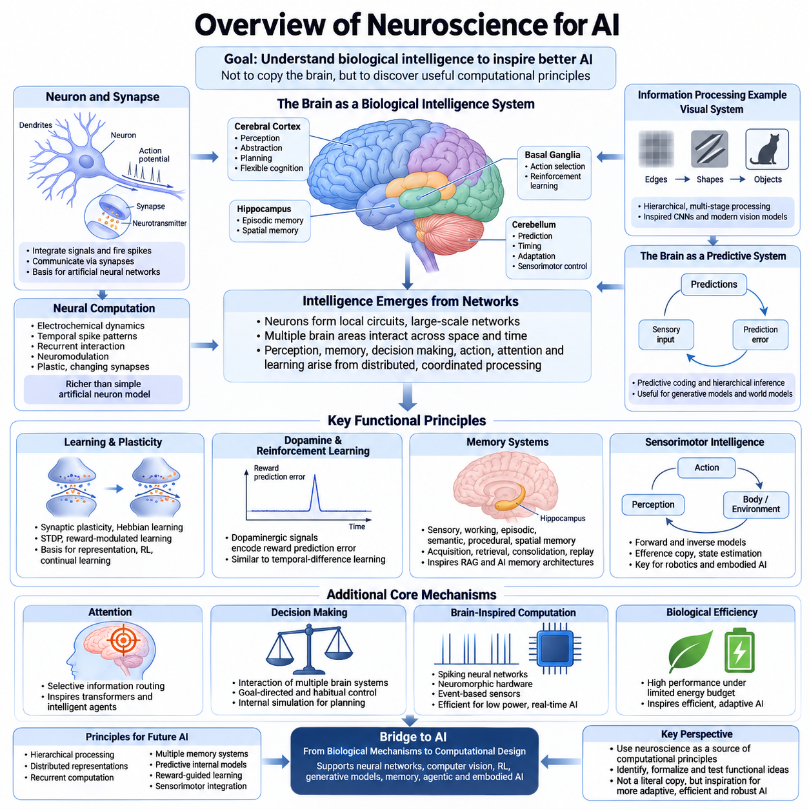
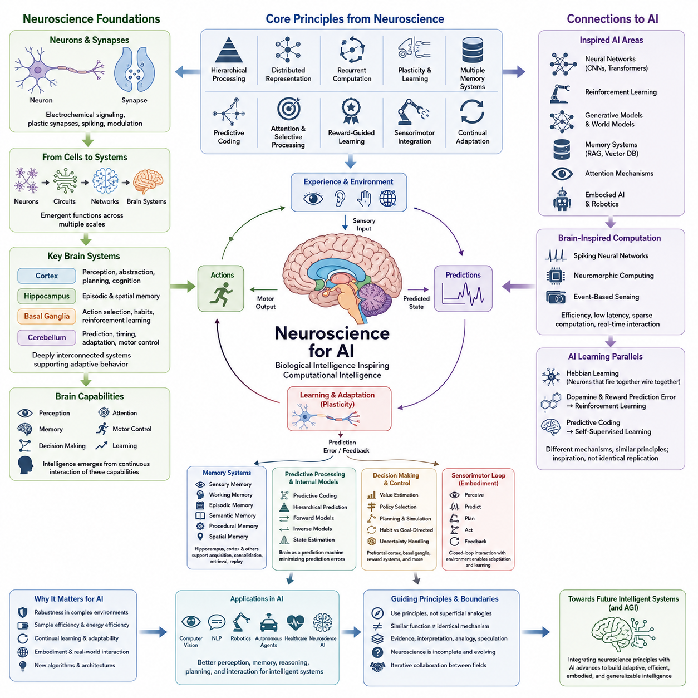
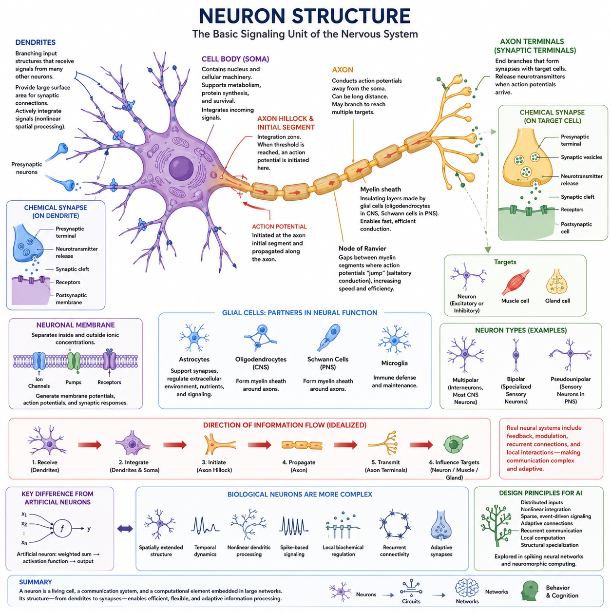
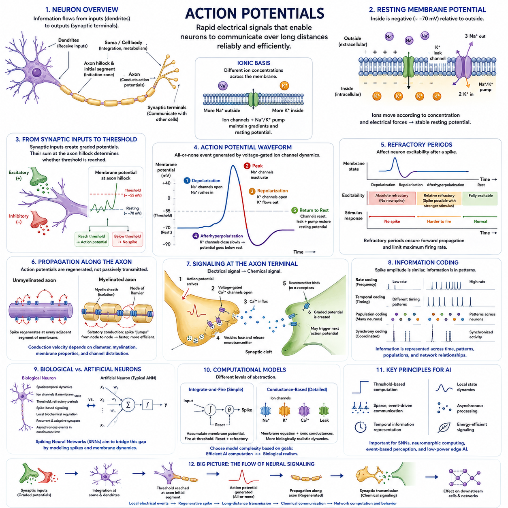
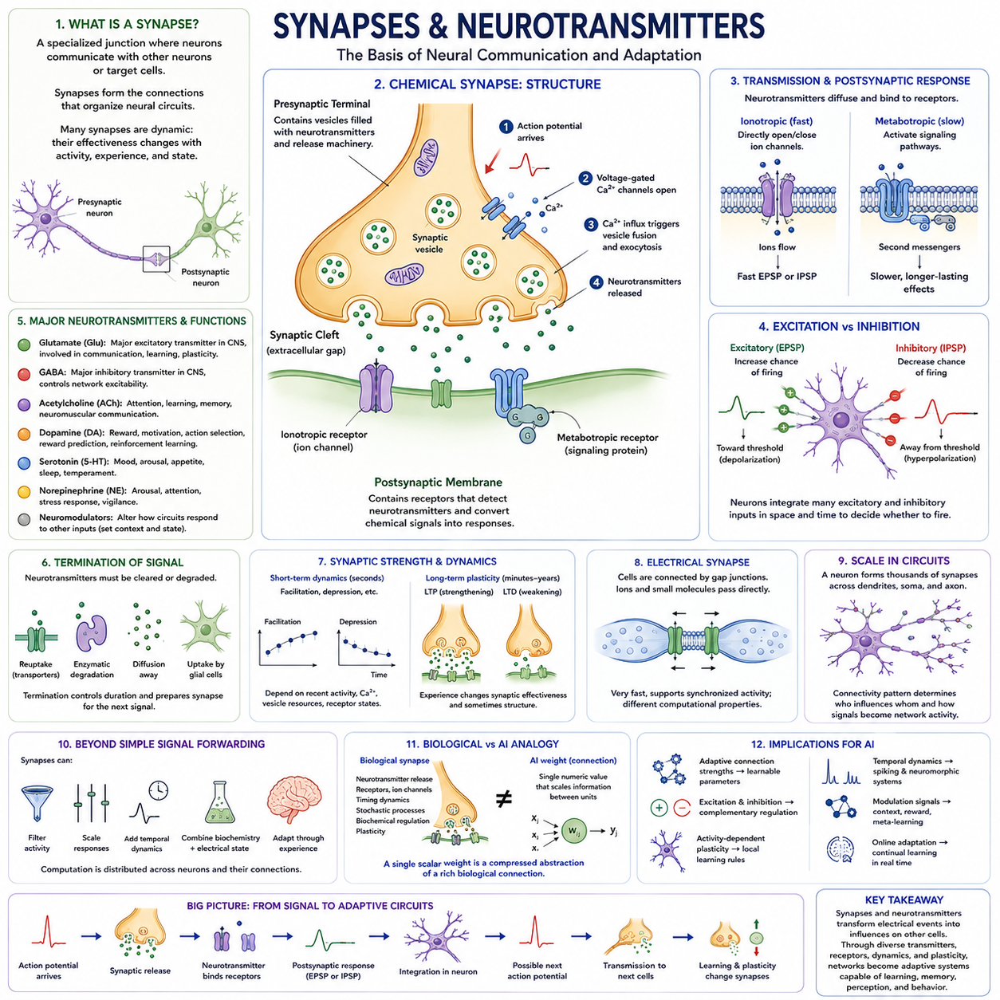
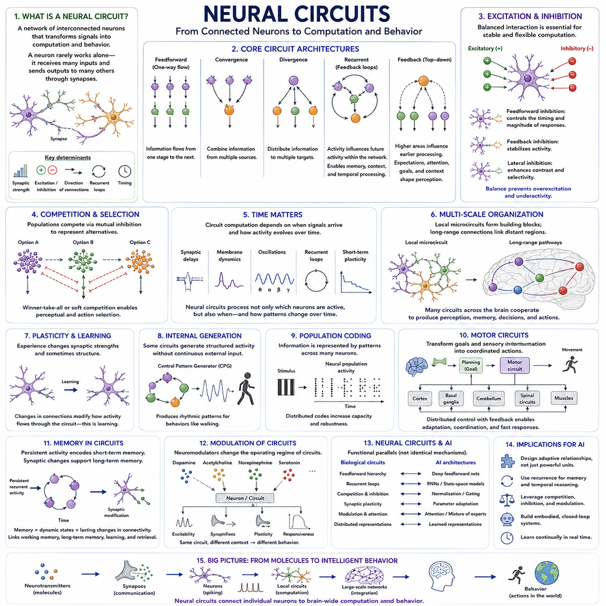
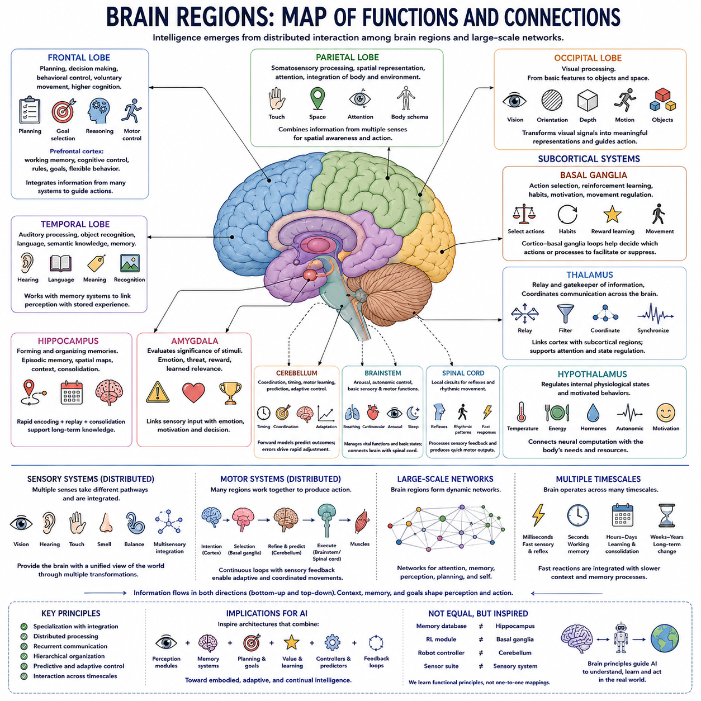
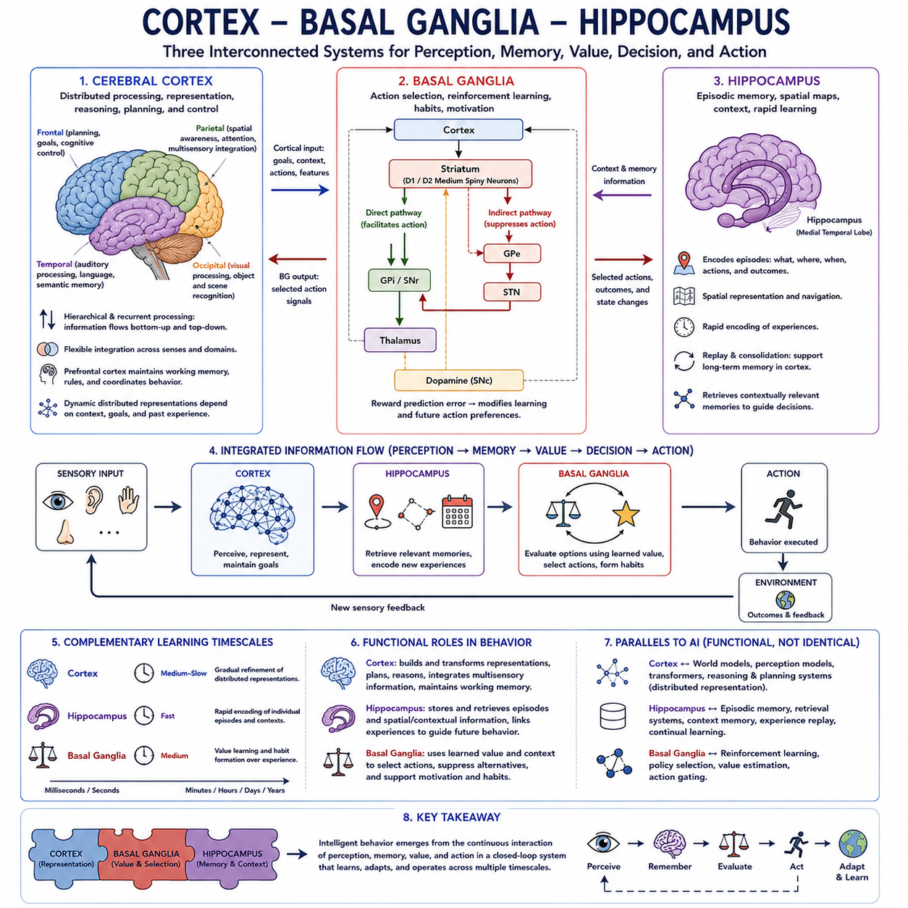
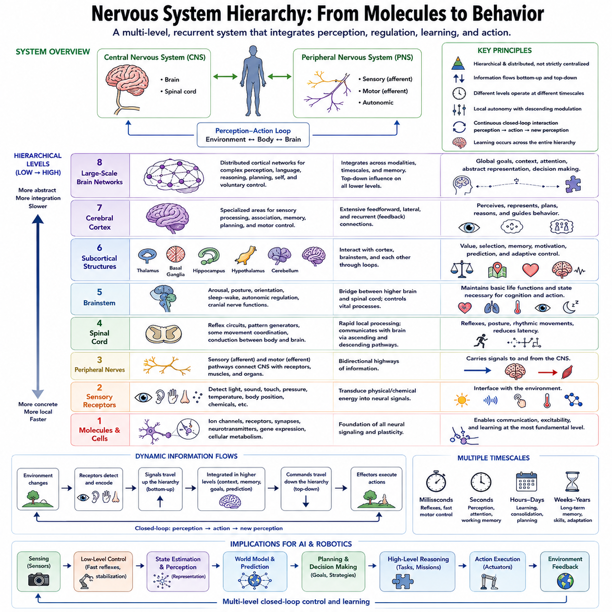
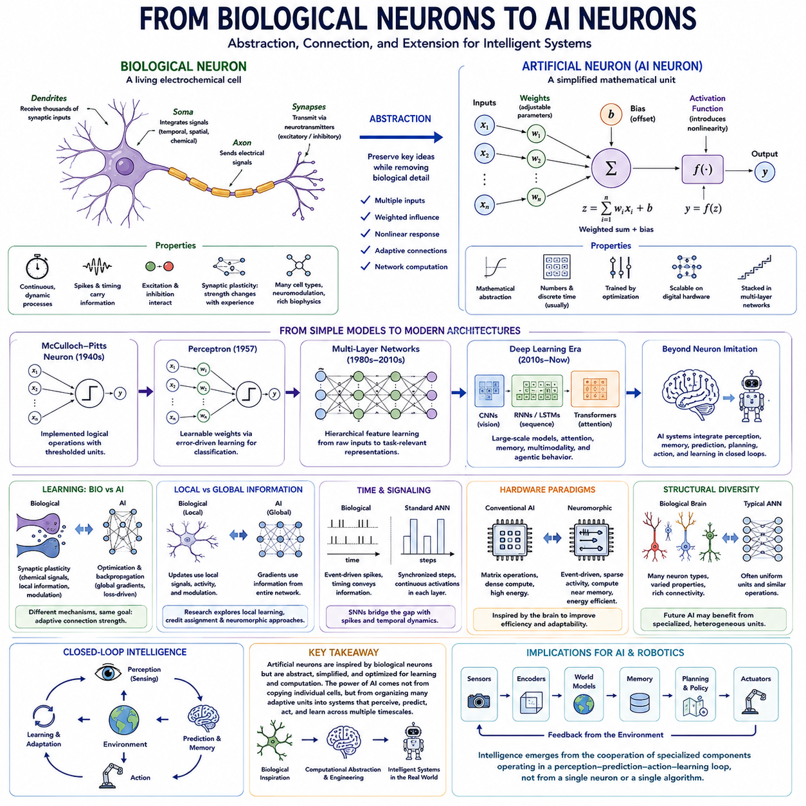

**Volume 44 Neuroscience for AI**

# Chapter 01. Neurons and Brain Systems

## 01.00 Overview of Neuroscience for AI

{width="7.268055555555556in" height="7.268055555555556in"}

{width="7.268055555555556in" height="7.268055555555556in"}

신경과학(Neuroscience)은 신경계(Nervous System)가 환경을 감지하고, 정보를 변환하며, 경험으로부터 학습하고, 기억을 저장하며, 행동을 선택하고 조절하는 방식을 연구함으로써 지능(Intelligence)에 대한 생물학적 관점을 제공합니다. 인공지능(Artificial Intelligence, AI)에서 신경과학의 가치는 뇌(Brain)를 문자 그대로 복제하는 데 있는 것이 아니라, 생물학적 지능(Biological Intelligence)이 에너지, 시간, 불확실성, 제한된 자원이라는 강한 제약 아래에서도 적응적 계산(Adaptive Computation)을 수행하는 실제 사례를 제공한다는 데 있습니다.

신경계(Nervous System)는 기본적으로 시냅스(Synapse)를 통해 연결된 뉴런(Neuron)으로 구성되지만, 지능(Intelligence)은 상대적으로 단순한 수많은 세포가 상호작용하는 과정에서 출현합니다. 개별 뉴런은 수상돌기(Dendrite)를 통해 들어오는 신호를 통합하고 내부의 전기적 상태를 변화시키며, 활동전위(Action Potential)와 신경전달물질(Neurotransmitter)에 의해 매개되는 시냅스 전달(Synaptic Transmission)을 통해 다른 뉴런과 통신합니다. 이러한 분산 구조(Distributed Organization)는 인공신경망(Artificial Neural Network)을 이해하는 중요한 개념적 기반을 제공합니다.

생물학적 뉴런(Biological Neuron)은 단순화된 인공 뉴런(Artificial Neuron)과 상당히 다릅니다. 신경 통신(Neural Communication)은 전기화학적 동역학(Electrochemical Dynamics), 시간적 스파이크 패턴(Temporal Spike Pattern), 순환적 상호작용(Recurrent Interaction), 신경조절(Neuromodulation), 지속적으로 변화하는 시냅스 특성(Synaptic Properties)을 통해 이루어집니다. 반면 인공 뉴런은 일반적으로 이러한 메커니즘을 가중합(Weighted Summation)과 비선형 활성화(Nonlinear Activation) 같은 수치 연산으로 단순화합니다. 이러한 추상화는 계산적으로 유용하지만 생물학적 신경 계산(Biological Neural Computation)의 일부만을 표현합니다.

뇌의 지능(Intelligence)은 개별 뉴런 수준만으로는 충분히 이해할 수 없습니다. 뉴런은 국소 신경회로(Local Neural Circuit)를 형성하고, 신경회로는 더 큰 기능적 네트워크(Functional Network)에 참여하며, 이러한 네트워크는 피질(Cortical) 및 피질하(Subcortical) 구조 전반에서 상호작용합니다. 따라서 지각(Perception), 기억(Memory), 의사결정(Decision Making), 운동 제어(Motor Control), 주의(Attention), 학습(Learning)은 하나의 중앙집중형 계산 모듈이 아니라 다양한 해부학적·시간적 규모에 걸쳐 분산된 처리의 협력으로 출현합니다.

서로 다른 뇌 영역(Brain Region)은 전문화된 기능을 담당하면서도 깊게 상호 연결되어 있습니다. 대뇌피질(Cerebral Cortex)은 정교한 감각 처리(Sensory Processing), 추상화(Abstraction), 계획(Planning), 유연한 인지(Flexible Cognition)를 지원하고, 해마계(Hippocampal System)는 일화 기억(Episodic Memory)과 공간 기억(Spatial Memory)에 밀접하게 관련됩니다. 기저핵(Basal Ganglia)은 행동 선택(Action Selection)과 강화 관련 학습(Reinforcement-related Learning)에 참여하며, 소뇌(Cerebellum)는 예측(Prediction), 타이밍(Timing), 적응(Adaptation), 정밀한 감각운동 제어(Sensorimotor Control)에 기여합니다.

시각계(Visual System)는 신경과학(Neuroscience)과 현대 인공지능(Modern AI)을 연결하는 가장 명확한 사례 가운데 하나입니다. 생물학적 시각(Biological Vision)은 망막 신호(Retinal Signal)를 점진적으로 구조화된 처리 단계를 통해 변환하여 국소적인 감각 패턴이 에지(Edge), 형태(Shape), 객체(Object), 움직임(Motion), 공간적 관계(Spatial Relationship), 행동(Action)의 표현으로 발전하도록 합니다. 이러한 계층적 구조(Hierarchical Organization)는 합성곱 신경망(Convolutional Neural Network, CNN)의 중요한 원리에 영향을 주었으며, 생물학적 시각과 현대 비전 트랜스포머(Vision Transformer, ViT)를 비교할 때에도 중요한 의미를 갖습니다.

뇌의 학습(Learning)은 경험을 통해 신경계의 반응과 연결을 변화시키는 능력인 가소성(Plasticity)에 크게 의존합니다. 시냅스 가소성(Synaptic Plasticity), 헤브 학습(Hebbian Learning), 스파이크 타이밍 의존 가소성(Spike-Timing-Dependent Plasticity, STDP), 보상 조절 학습(Reward-Modulated Learning), 신경조절 신호(Neuromodulatory Signal)는 생물학적 학습이 여러 상호작용 메커니즘을 통해 이루어진다는 사실을 보여줍니다. 이러한 메커니즘은 표현 학습(Representation Learning), 강화학습(Reinforcement Learning), 지속학습(Continual Learning), 기존 역전파(Backpropagation)의 대안 등을 연구하는 데 유용한 기준을 제공합니다.

도파민 관련 학습(Dopamine-related Learning)은 신경과학과 강화학습(Reinforcement Learning)의 연결을 이해하는 데 특히 중요합니다. 도파민 활성(Dopaminergic Activity)은 기대한 결과와 실제로 얻은 결과의 차이를 나타내는 보상 예측 오차(Reward Prediction Error)와 관련되어 있습니다. 이 원리는 예측 오차를 사용하여 가치 추정(Value Estimate)과 정책(Policy)을 갱신하는 시간차 학습(Temporal-Difference Learning)과 개념적인 유사성을 가지며, 생물학적 관찰이 정확한 동일성을 의미하지 않으면서도 계산 이론(Computational Theory)에 영감을 줄 수 있음을 보여줍니다.

기억(Memory)은 뇌과학(Brain Science)과 인공지능을 연결하는 또 하나의 주요 영역입니다. 인간의 기억은 하나의 균질한 저장 메커니즘이 아니라 감각 기억(Sensory Memory), 작업 기억(Working Memory), 일화 기억(Episodic Memory), 의미 기억(Semantic Memory), 절차 기억(Procedural Memory), 공간 기억(Spatial Memory) 등으로 구성됩니다. 해마(Hippocampus), 피질계(Cortical System), 기타 신경 구조는 기억의 획득(Acquisition), 인출(Retrieval), 공고화(Consolidation), 재생(Replay)에 서로 다른 방식으로 참여합니다. 이러한 구조는 외부 메모리(External Memory), 벡터 데이터베이스(Vector Database), 검색 증강 생성(Retrieval-Augmented Generation, RAG), 인공지능 에이전트(AI Agent)의 메모리 아키텍처(Memory Architecture)와 비교할 수 있는 기반을 제공합니다.

뇌는 단순히 입력되는 감각 정보를 수동적으로 처리하는 시스템이 아니라 예측 시스템(Predictive System)으로도 연구되고 있습니다. 예측 부호화(Predictive Coding)는 신경계가 감각 상태(Sensory State)에 대한 기대를 지속적으로 생성하고, 예측 오차(Prediction Error)를 이용하여 내부 표현(Internal Representation)을 갱신한다고 설명합니다. 계층적 예측 처리(Hierarchical Predictive Processing)는 이러한 원리를 여러 수준으로 확장하여 지각과 추론(Inference)을 연결하며, 생성 모델(Generative Model), 월드 모델(World Model), 상태 예측(State Prediction)을 이해하는 데 유용한 관점을 제공합니다.

감각운동 지능(Sensorimotor Intelligence)에서는 행동이 신체와 환경을 어떻게 변화시킬지를 유기체가 예상해야 하므로 예측(Prediction)이 특히 중요합니다. 순방향 모델(Forward Model)은 현재 상태(Current State)와 행동(Action)으로부터 미래의 감각 또는 신체 상태를 추정하고, 역모델(Inverse Model)은 원하는 결과와 이를 달성하기 위한 적절한 행동을 연결합니다. 원심성 복사(Efference Copy), 감각 피드백(Sensory Feedback), 상태 추정(State Estimation), 소뇌 예측(Cerebellar Prediction)은 체화 인공지능(Embodied AI)과 행동 조건부 월드 모델(Action-Conditioned World Model)에 활용할 수 있는 중요한 메커니즘을 보여줍니다.

신경과학은 또한 지능적 행동(Intelligent Behavior)이 지속적인 지각-행동 루프(Perception-Action Loop)에서 출현한다는 점을 강조합니다. 유기체는 단순히 세계를 지각하고 답을 계산한 뒤 멈추는 것이 아니라, 자신의 행동을 통해 환경을 변화시키고 새로운 관측(Observation)을 만들어 이후의 의사결정을 수정합니다. 이러한 폐루프 구조(Closed-Loop Structure)는 지각, 내부 상태 추정(Internal State Estimation), 예측, 계획, 제어(Control), 학습이 실제 환경의 불확실성 아래에서 지속적으로 작동해야 하는 로보틱스(Robotics)와 체화 인공지능에서 특히 중요합니다.

주의(Attention)는 생물학적 지능이 제한된 계산 자원(Computational Resource)을 관리하는 방법을 보여줍니다. 신경계는 이용 가능한 모든 신호를 동일한 우선순위로 처리할 수 없기 때문에 현재의 목표, 기대, 행동 요구와 관련된 정보를 선택적으로 강화합니다. 기계 주의(Machine Attention)와 생물학적 주의(Biological Attention)는 동일한 메커니즘은 아니지만, 선택적 정보 라우팅(Selective Information Routing)이라는 더 넓은 원리는 트랜스포머(Transformer), 멀티모달 모델(Multimodal Model), 메모리 시스템(Memory System), 지능형 에이전트(Intelligent Agent)의 핵심 개념이 되었습니다.

의사결정(Decision Making) 역시 하나의 범용 알고리즘이 아니라 여러 시스템의 상호작용에서 출현합니다. 전전두엽 피질(Prefrontal Cortex), 기저핵 회로(Basal Ganglia Circuit), 보상 시스템(Reward System), 기억, 감각 증거(Sensory Evidence), 내부 신체 상태(Internal Bodily State)가 불확실성 아래의 선택에 기여합니다. 목표 지향 행동(Goal-Directed Behavior)은 습관적 제어(Habitual Control)와 공존할 수 있으며, 계획은 가능한 미래에 대한 내부 시뮬레이션(Internal Simulation)을 포함할 수 있습니다. 이러한 메커니즘은 강화학습, 계획 시스템(Planning System), 자율 인공지능 에이전트(Autonomous AI Agent)를 이해하는 데 유용한 관점을 제공합니다.

뇌 영감 계산(Brain-Inspired Computation)은 이러한 아이디어를 기존 인공신경망을 넘어 확장합니다. 스파이킹 신경망(Spiking Neural Network, SNN)은 이산적인 시간 이벤트(Temporal Event)를 통해 정보를 표현하려 하고, 뉴로모픽 프로세서(Neuromorphic Processor)는 신경 계산에 더욱 적합한 하드웨어 구조를 추구하며, 이벤트 기반 센서(Event-Based Sensor)는 전체 장면을 반복적으로 샘플링하는 대신 변화 자체를 포착합니다. 이러한 접근법은 인공지능 시스템이 낮은 지연시간(Low Latency), 제한된 전력, 희소 신호(Sparse Signal), 지속적인 상호작용 환경에서 동작해야 할 때 특히 중요합니다.

생물학적 지능의 가장 두드러진 특징 가운데 하나는 효율성(Efficiency)입니다. 뇌는 제한된 에너지 예산(Energy Budget) 안에서 지각, 기억, 예측, 학습, 추론(Reasoning), 운동 조정(Motor Coordination)을 수행하면서 변화하는 조건에 지속적으로 적응합니다. 반면 현대 인공지능은 대규모 데이터셋(Dataset), 가속기(Accelerator), 계산 규모 확장(Computational Scaling)을 통해 높은 성능을 달성하는 경우가 많습니다. 따라서 생물학적 효율성(Biological Efficiency)의 어떤 원리를 실용적인 기계 지능(Machine Intelligence)으로 변환할 수 있는가는 중요한 연구 과제가 됩니다.

따라서 신경과학에서 인공지능으로의 연결은 피상적인 해부학적 유사성(Anatomical Analogy)을 찾는 것이 아니라 계산 원리(Computational Principle)를 발견하는 과정으로 이해해야 합니다. CNN은 디지털 시각피질(Digital Visual Cortex)이 아니며, 트랜스포머는 생물학적 주의의 구현체가 아니고, 벡터 데이터베이스는 인공 해마(Artificial Hippocampus)가 아니며, 강화학습 알고리즘은 도파민 회로(Dopaminergic Circuit)의 복제품이 아닙니다. 생산적인 접근법은 기능적 원리(Functional Principle)를 식별하고 이를 계산적으로 형식화한 뒤 인공 시스템의 성능 향상 여부를 실험적으로 검증하는 것입니다.

이러한 관점은 신경과학을 신경망(Neural Network), 컴퓨터 비전(Computer Vision), 강화학습, 생성 모델링(Generative Modeling), 메모리 시스템, 에이전틱 인공지능(Agentic AI), 체화 지능(Embodied Intelligence)을 포함한 현대 인공지능의 폭넓은 기반과 연결합니다. 따라서 전체 인공지능 지식 체계에서 신경과학은 독립된 생물학적 분야라기보다 생물학적 메커니즘(Biological Mechanism)과 계산적 설계(Computational Design)를 연결하는 가교 역할을 합니다.

미래 지능 시스템(Future Intelligent System)에서는 신경과학으로부터 도출되는 여러 원리가 특히 중요합니다. 여기에는 계층적 처리(Hierarchical Processing), 분산 표현(Distributed Representation), 순환 계산(Recurrent Computation), 적응적 가소성(Adaptive Plasticity), 다중 기억 시스템(Multiple Memory Systems), 예측적 내부 모델(Predictive Internal Model), 선택적 주의(Selective Attention), 보상 기반 학습(Reward-Guided Learning), 감각운동 통합(Sensorimotor Integration), 지속적 적응(Continual Adaptation)이 포함됩니다. 이들의 중요성은 생물학적 세부 구조를 그대로 재현하는 데 있는 것이 아니라 복잡한 환경에서 강건한 지능(Robust Intelligence)을 가능하게 한 아키텍처 전략(Architectural Strategy)을 보여준다는 데 있습니다.

신경과학은 인공지능을 해석할 때 필요한 중요한 경계도 제공합니다. 유사한 계산 기능(Computational Function)이 동일한 메커니즘을 의미하는 것은 아니며, 성공적인 공학적 추상화(Engineering Abstraction)가 뇌가 동일한 알고리즘으로 작동한다는 사실을 증명하지도 않습니다. 생물학적 연구 결과는 여전히 불완전하며 일부는 논쟁의 대상입니다. 따라서 신경과학 기반 인공지능(Neuroscience-Inspired AI)에서는 확립된 신경과학적 증거(Neural Evidence), 계산적 해석(Computational Interpretation), 공학적 유추(Engineering Analogy), 지능이나 의식(Consciousness)에 관한 추측적 주장을 명확하게 구분해야 합니다.

종합하면 신경과학은 뉴런과 시냅스에서 시작하여 신경회로, 뇌 시스템, 기억, 예측, 행동, 주의, 적응적 행동에 이르는 다중 규모 관점(Multiscale Perspective)에서 지능을 이해할 수 있도록 합니다. 이러한 관점은 신경 구조(Neural Structure), 시각 계층(Visual Hierarchy), 뇌 학습(Brain Learning), 예측 부호화, 뇌 영감 계산, 생물학적 기억(Biological Memory), 의사결정 시스템(Decision System), 내부 모델(Internal Model), 의식, 그리고 이들이 미래 인공지능 및 범용인공지능(Artificial General Intelligence, AGI) 아키텍처에 기여할 가능성을 체계적으로 살펴보기 위한 기반을 제공합니다.

## 01.01 Neuron Structure

{width="7.268055555555556in" height="7.268055555555556in"}

뉴런(Neuron)은 신경계(Nervous System)의 기본적인 신호 전달 단위로서 정보를 수신하고, 통합하고, 변환하며, 전달하도록 특화되어 있습니다. 뉴런은 크기, 형태, 연결성(Connectivity), 기능에서 매우 다양하지만 대부분 세포체(Cell Body), 수상돌기(Dendrite), 축삭(Axon), 시냅스 말단(Synaptic Terminal)으로 구성되는 공통적인 구조를 갖습니다. 이러한 구조는 정보가 신경회로(Neural Circuit)를 통해 전달되도록 하면서 고도로 분산된 생물학적 계산(Biological Computation)을 가능하게 합니다.

세포체(Cell Body), 즉 소마(Soma)는 핵(Nucleus)과 뉴런을 유지하는 데 필요한 대부분의 세포 기구(Cellular Machinery)를 포함합니다. 세포체는 단백질 합성(Protein Synthesis), 대사(Metabolism), 세포막 유지(Membrane Maintenance), 장기적인 생존에 필요한 여러 생물학적 과정을 지원합니다. 또한 뉴런의 여러 부분에서 전달되는 전기 신호(Electrical Signal)를 통합하는 데 참여하므로 생물학적 유지의 중심이면서 동시에 신경 정보 처리(Neural Information Processing)의 중요한 구성 요소입니다.

수상돌기(Dendrite)는 주로 다른 뉴런으로부터 신호를 수신하는 가지 형태의 돌기입니다. 나무처럼 분기된 구조는 시냅스 연결(Synaptic Connection)이 형성될 수 있는 표면적을 크게 증가시켜 하나의 뉴런이 여러 정보원으로부터 동시에 정보를 수집할 수 있도록 합니다. 수상돌기 구조는 단순한 수동적 배선(Passive Wiring)이 아니며, 서로 다른 가지에서 복잡한 전기적·생화학적 행동(Electrical and Biochemical Behavior)이 나타나 입력 신호가 세포체에 도달하기 전에 결합되는 방식에 영향을 줄 수 있습니다.

수상돌기를 따라 위치하는 시냅스(Synapse)는 뉴런 사이의 통신 지점을 제공합니다. 많은 화학적 시냅스(Chemical Synapse)에서는 시냅스전 뉴런(Presynaptic Neuron)이 방출한 신경전달물질(Neurotransmitter)이 시냅스후막(Postsynaptic Membrane)의 수용체(Receptor)에 결합하여 전기적 상태를 변화시킵니다. 수용체, 신경전달물질, 국소 신경회로의 특성에 따라 이러한 신호는 수신 뉴런이 활동전위(Action Potential)를 생성할 가능성을 증가시키거나 감소시켜 유연한 흥분(Excitation)과 억제(Inhibition)를 가능하게 합니다.

따라서 수상돌기 나무(Dendritic Tree)는 공간적으로 분산된 입력 시스템(Spatially Distributed Input System)으로 작동합니다. 서로 다른 위치에 도달하는 신호는 신호의 강도, 타이밍(Timing), 세포체로부터의 거리, 다른 입력과의 상호작용에 따라 서로 다른 영향을 미칠 수 있습니다. 이는 입력을 일반적으로 하나의 가중합(Weighted Sum)으로 결합한 후 활성화 함수(Activation Function)를 적용하는 수치 값으로 표현하는 단순화된 인공 뉴런(Artificial Neuron)과의 중요한 차이를 보여줍니다.

축삭둔덕(Axon Hillock)과 인접한 축삭 초기분절(Axon Initial Segment)은 신호 통합(Signal Integration)과 신호 전달(Signal Transmission) 사이의 중요한 전환 영역을 형성합니다. 뉴런 전체에서 축적된 전기적 활동은 이 영역의 막전위(Membrane Potential)에 영향을 줍니다. 적절한 생리적 조건에 도달하면 활동전위(Action Potential)가 시작될 수 있습니다. 이를 통해 복잡한 국소 입력 활동이 다른 뉴런이나 표적 세포(Target Cell)까지 정보를 전달할 수 있는 전파성 전기 사건(Propagating Electrical Event)으로 변환됩니다.

축삭(Axon)은 활동전위(Action Potential)를 세포체로부터 멀리 전달하는 특수한 돌기입니다. 축삭은 국소 신경회로(Local Neural Circuit) 내부의 짧은 거리를 연결할 수도 있고, 신경계의 서로 다른 영역을 연결하기 위해 훨씬 긴 거리를 이동할 수도 있습니다. 하나의 축삭은 여러 가지로 분기될 수도 있으므로 하나의 뉴런이 다수의 표적에 신호를 분배하고 여러 상호 연결된 신경 경로(Neural Pathway)에 동시에 참여할 수 있습니다.

많은 축삭은 특수한 신경교세포(Glial Cell)에 의해 형성되는 절연 구조인 미엘린(Myelin)으로 둘러싸여 있습니다. 미엘린은 랑비에 결절(Node of Ranvier)이라고 불리는 노출 영역 사이에서 빠른 신호 전도를 가능하게 함으로써 전기 신호가 축삭을 따라 효율적으로 전달되도록 합니다. 이러한 구조는 신경 통신을 단순한 전선을 통한 연속적인 전류 흐름으로 이해하는 것과 달리 생물학적 구조 자체가 신호 전달 속도, 신뢰성(Reliability), 에너지 효율(Energy Efficiency)에 강한 영향을 준다는 사실을 보여줍니다.

축삭 가지의 끝에는 축삭 말단(Axon Terminal)이 있으며, 이는 시냅스 말단(Synaptic Terminal) 또는 시냅스전 말단(Presynaptic Terminal)이라고도 합니다. 활동전위가 이 구조에 도달하면 신경전달물질(Neurotransmitter)이 시냅스 틈(Synaptic Cleft)으로 방출될 수 있습니다. 이러한 화학적 전달물질(Chemical Messenger)은 다른 뉴런, 근육세포(Muscle Cell), 분비샘(Gland)의 수용체에 영향을 주며 하나의 세포 내부에서 전달되던 전기 신호를 세포 사이의 화학적 통신(Chemical Communication) 과정으로 변환합니다.

시냅스(Synapse)는 기능적으로 시냅스전 구성 요소(Presynaptic Component), 시냅스 틈(Synaptic Cleft)이라고 불리는 좁은 세포외 공간(Extracellular Gap), 그리고 수용체와 관련 분자 기구를 포함하는 시냅스후 구성 요소(Postsynaptic Component)로 이루어집니다. 이러한 구조는 신경 통신을 매우 적응적으로 만듭니다. 시냅스 강도(Synaptic Strength)는 활동과 경험에 따라 변화할 수 있으므로 두 뉴런 사이의 연결은 단순한 고정 통신 채널이 아니라 변화 가능한 계산적 관계(Computational Relationship)라고 할 수 있습니다.

뉴런 구조(Neuronal Structure)는 뉴런 기능(Neuronal Function)과 밀접하게 관련되어 있습니다. 감각 뉴런(Sensory Neuron)은 감각 수용체(Sensory Receptor)에서 신경 처리 시스템으로 정보를 전달하도록 구성되고, 운동 뉴런(Motor Neuron)은 근육으로 명령을 전달하며, 중간뉴런(Interneuron)은 국소 또는 분산 신경회로 내에서 뉴런들을 연결합니다. 이들의 서로 다른 형태(Morphology)는 서로 다른 계산 및 통신 요구사항을 반영하며, 생물학적 지능(Biological Intelligence)이 부분적으로 구조적 전문화(Structural Specialization)에 의존한다는 사실을 보여줍니다.

뉴런은 일반적으로 다극성(Multipolar), 양극성(Bipolar), 거짓단극성(Pseudounipolar)과 같은 형태학적 패턴(Morphological Pattern)에 따라 분류할 수 있습니다. 다극성 뉴런(Multipolar Neuron)은 여러 개의 수상돌기와 하나의 축삭을 가지며 중추신경계(Central Nervous System)에 널리 분포합니다. 양극성 및 거짓단극성 형태는 특수한 감각 경로(Sensory Pathway)에서 나타납니다. 이러한 차이는 모든 종류의 신경 계산을 담당하는 하나의 보편적인 뉴런 형태가 존재하지 않는다는 사실을 보여줍니다.

뉴런은 또한 고립된 계산 요소로 작동하는 것이 아니라 신경교세포(Glial Cell)와 긴밀하게 협력합니다. 성상교세포(Astrocyte)는 세포외 환경 조절(Extracellular Regulation)과 시냅스 환경(Synaptic Environment)에 기여하고, 희소돌기아교세포(Oligodendrocyte)와 슈반세포(Schwann Cell)는 신경계의 서로 다른 영역에서 미엘린화(Myelination)를 담당하며, 미세아교세포(Microglia)는 면역 및 유지 기능에 참여합니다. 따라서 신경 계산은 통신, 대사, 보호, 적응을 지원하는 더 광범위한 세포 생태계(Cellular Ecosystem)에 의존합니다.

뉴런막(Neuronal Membrane)은 세포 내부와 외부의 서로 다른 이온 농도(Ion Concentration)를 분리하기 때문에 이러한 구조에서 핵심적인 역할을 합니다. 세포막에 존재하는 이온 채널(Ion Channel), 펌프(Pump), 수용체(Receptor)는 전하를 띤 입자의 이동을 조절합니다. 이러한 메커니즘은 신경 신호 전달을 가능하게 하는 막전위(Membrane Potential)를 생성하며, 활동전위, 시냅스 반응(Synaptic Response), 다양한 형태의 신경 계산을 위한 생리학적 기반(Physiological Foundation)을 제공합니다.

따라서 뉴런은 단순히 인공신경망(Artificial Neural Network)의 노드(Node)에 대응하는 생물학적 요소로 이해해서는 안 됩니다. 뉴런은 공간적으로 확장되고 시간에 따라 동적으로 변화하는 시스템으로서, 수상돌기가 입력을 처리하고 세포막 메커니즘(Membrane Mechanism)이 전기적 상태를 조절하며 축삭이 신호를 전달하고 시냅스가 다른 세포와의 통신을 제어합니다. 정보 처리는 수학적으로 정의된 하나의 지점이 아니라 이러한 여러 구조에 걸쳐 이루어집니다.

이러한 차이는 신경과학(Neuroscience)을 인공신경망과 연결하여 이해할 때 특히 중요합니다. 일반적인 인공 뉴런은 수치 입력을 받아 학습된 가중치(Learned Weight)를 적용하고 이를 결합한 후 활성화 함수를 통해 출력을 생성합니다. 생물학적 뉴런은 이러한 추상화에 영감을 주었지만, 실제 뉴런은 추가적으로 시간적 동역학(Temporal Dynamics), 비선형 수상돌기 처리(Nonlinear Dendritic Processing), 스파이크 기반 신호 전달(Spike-Based Signaling), 국소 생화학적 조절(Local Biochemical Regulation), 순환 연결(Recurrent Connectivity), 지속적으로 적응하는 시냅스를 가지고 있습니다.

정보 흐름의 방향은 뉴런의 작동을 이해하기 위한 유용한 첫 번째 근사(Approximation)를 제공합니다. 신호는 주로 수상돌기를 통해 수신되고, 수상돌기와 세포체 구조에서 통합되며, 축삭 초기분절 근처에서 활동전위로 변환되고, 축삭을 따라 전파된 후 시냅스 말단을 통해 전달됩니다. 그러나 실제 신경계에는 피드백(Feedback), 조절(Modulation), 순환 경로(Recurrent Pathway), 국소 상호작용(Local Interaction)이 존재하기 때문에 생물학적 통신은 이러한 단순한 흐름보다 훨씬 복잡합니다.

더 큰 규모에서 개별 뉴런은 서로 연결되어 신경회로(Neural Circuit)를 형성하고, 신경회로는 다시 결합하여 광범위한 기능적 네트워크(Functional Network)를 구성합니다. 따라서 뉴런 구조의 계산적 중요성은 연결성(Connectivity)을 함께 고려할 때 더욱 명확해집니다. 수상돌기의 분기는 가능한 입력 관계를 결정하고, 축삭의 분기는 출력의 분배를 결정하며, 시냅스 조직(Synaptic Organization)은 지각(Perception), 학습(Learning), 기억(Memory), 행동(Action) 과정에서 특정 뉴런들이 서로에게 미치는 영향의 강도를 결정합니다.

인공지능 연구(AI Research)에서 뉴런 구조는 생물학적 구조를 문자 그대로 복제하지 않고도 여러 유용한 설계 원리(Design Principle)를 제공합니다. 분산 입력(Distributed Input), 비선형 통합(Nonlinear Integration), 희소 이벤트 기반 신호 전달(Sparse Event-Driven Signaling), 적응형 연결(Adaptive Connection), 순환 통신(Recurrent Communication), 국소 계산(Local Computation), 구조적 전문화는 획일적인 계산 아키텍처(Computational Architecture)에 대한 대안을 제시합니다. 스파이킹 신경망(Spiking Neural Network, SNN)과 뉴로모픽 컴퓨팅(Neuromorphic Computing)은 기존 인공신경망보다 이러한 특성의 일부를 더욱 직접적으로 탐구합니다.

따라서 뉴런 구조(Neuron Structure)를 이해하는 것은 활동전위(Action Potential), 시냅스(Synapse), 신경전달물질(Neurotransmitter), 신경회로(Neural Circuit), 뇌 영역(Brain Region), 학습 메커니즘(Learning Mechanism)을 연구하기 위한 생물학적 기반을 확립합니다. 뉴런은 동시에 살아 있는 세포(Living Cell)이자 통신 시스템(Communication System)이며, 훨씬 더 큰 네트워크에 포함된 계산 요소(Computational Element)입니다. 이러한 여러 역할을 함께 이해하는 것은 생물학적 지능의 능력뿐만 아니라 인공지능에서 사용하는 단순화된 뉴런 모델(Simplified Neuron Model)의 한계를 이해하는 데 필수적입니다.

## 01.02 Action Potentials [w/Code]

{width="7.268055555555556in" height="7.268055555555556in"}

활동전위(Action Potential)는 뉴런(Neuron)의 세포막을 가로지르는 전위(Electrical Potential)가 빠르고 일시적으로 변화하는 현상으로, 정보가 점차 약해지지 않으면서 장거리를 이동할 수 있도록 합니다. 수상돌기(Dendrite)와 시냅스(Synapse)에서 발생하는 신호는 대체로 국소적이고 단계적으로 변화하지만, 활동전위는 축삭 초기분절(Axon Initial Segment)에서 멀리 떨어진 시냅스 말단(Synaptic Terminal)까지 신경 활동을 안정적으로 전달하는 재생적 메커니즘(Regenerative Mechanism)을 제공하므로 신경 통신(Neural Communication)의 핵심 요소입니다.

뉴런은 전하를 띤 이온(Ion)이 세포막 안팎에 불균등하게 분포하기 때문에 안정막전위(Resting Membrane Potential)를 유지합니다. 나트륨 이온(Sodium Ion)은 세포 외부에 상대적으로 많이 존재하고, 칼륨 이온(Potassium Ion)은 세포 내부에 상대적으로 많이 존재합니다. 선택적 막 투과성(Selective Membrane Permeability), 이온 채널(Ion Channel), 나트륨-칼륨 펌프(Sodium-Potassium Pump)가 함께 이러한 농도 기울기(Concentration Gradient)를 유지하여 빠른 신경 신호가 발생할 수 있는 전기적 상태를 형성합니다.

안정 상태에서 뉴런막(Neuronal Membrane)은 일부 이온에 대해 다른 이온보다 높은 투과성을 가지며, 특히 누출 채널(Leak Channel)을 통한 칼륨의 이동이 중요합니다. 이온은 농도 기울기와 전기적 힘(Electrical Force)의 영향을 동시에 받으므로 이러한 이동을 통해 전기화학적 균형(Electrochemical Balance)이 형성됩니다. 그 결과 뉴런 내부는 일반적으로 세포외 환경보다 음전위를 가지며, 이 안정막전위는 흥분성 입력(Excitatory Input)과 억제성 입력(Inhibitory Input)이 신경 활동을 변화시킬 수 있는 안정적인 기준 상태를 제공합니다.

시냅스 입력(Synaptic Input)은 단계전위(Graded Potential)라고 불리는 국소적인 막전위 변화를 발생시킵니다. 흥분성 입력은 일반적으로 막전위를 발화(Firing)에 유리한 상태로 이동시키는 반면, 억제성 입력은 이러한 변화를 방해하는 방향으로 작용합니다. 이 신호들은 수상돌기와 세포체(Soma)를 통해 전달되면서 크기와 타이밍이 통합됩니다. 따라서 활동전위의 발생 여부는 공간적·시간적으로 분산된 수많은 입력의 결합된 영향에 의해 결정됩니다.

축삭 초기분절(Axon Initial Segment)은 전압 개폐성 이온 채널(Voltage-Gated Ion Channel)이 높은 밀도로 존재하며 활동전위가 시작되는 주요 위치이기 때문에 특히 중요합니다. 탈분극(Depolarization)이 임계값(Threshold)에 도달하면 전압 개폐성 나트륨 채널(Voltage-Gated Sodium Channel)이 빠르게 열립니다. 나트륨 이온이 뉴런 내부로 유입되면서 추가적인 탈분극이 발생하고, 양성 피드백(Positive Feedback)을 통해 더 많은 나트륨 채널이 열리면서 활동전위의 상승 단계(Rising Phase)가 형성됩니다.

이러한 빠른 탈분극은 활동전위가 갖는 재생적 특성(Regenerative Nature)을 보여줍니다. 일단 임계값을 넘으면 활동전위는 최초 자극의 강도에 비례하여 증가하는 것이 아니라 세포막의 이온 채널 동역학(Channel Dynamics)에 따라 진행됩니다. 이러한 특성을 일반적으로 전부 아니면 전무 원리(All-or-None Principle)라고 하며, 충분히 강한 입력은 완전한 활동전위를 발생시키지만 임계값 이하의 입력은 동일한 활동전위의 작은 형태를 발생시키지 않습니다.

활동전위가 정점(Peak)에 가까워지면 전압 개폐성 나트륨 채널은 불활성화(Inactivation)되고 전압 개폐성 칼륨 채널(Voltage-Gated Potassium Channel)은 점차 열립니다. 이후 칼륨 이온이 뉴런 외부로 이동하면서 막전위가 다시 음의 방향으로 변화합니다. 이러한 재분극(Repolarization) 단계는 강한 탈분극 상태를 종료하고 세포막이 회복될 수 있도록 준비시키며, 이온 채널의 정밀한 시간적 조절이 특징적인 활동전위 파형(Waveform)을 생성한다는 사실을 보여줍니다.

칼륨 채널은 재분극 이후에도 잠시 열린 상태로 남아 있을 수 있기 때문에 막전위가 안정 상태보다 더 음의 값으로 내려갈 수 있습니다. 이러한 단계를 후과분극(Afterhyperpolarization)이라고 합니다. 이후 이온 채널이 초기 상태로 복귀하고 세포막의 기본적인 조절 메커니즘이 다음 신호 전달에 필요한 균형을 다시 형성하면서 막전위는 점차 정상적인 안정 상태로 돌아갑니다. 따라서 전체 활동전위 주기는 정밀하게 조절되는 막전도도(Membrane Conductance)의 시간적 변화에 의존합니다.

활동전위가 발생한 이후 뉴런은 새로운 활동전위를 생성할 수 있는 능력이 일시적으로 변화하는 불응기(Refractory Period)에 들어갑니다. 절대 불응기(Absolute Refractory Period)에서는 나트륨 채널의 불활성화로 인해 자극의 강도와 관계없이 새로운 활동전위를 발생시킬 수 없습니다. 상대 불응기(Relative Refractory Period)에서는 새로운 스파이크(Spike)가 발생할 수 있지만, 세포막과 이온 채널이 안정 상태로 완전히 회복되지 않았기 때문에 일반적으로 더 강한 자극이 필요합니다.

불응기는 뉴런의 최대 발화율(Maximum Firing Rate)을 제한하고 활동전위가 축삭을 따라 한 방향으로 전파되도록 돕기 때문에 중요한 계산적 역할(Computational Role)을 수행합니다. 이동하는 활동전위 바로 뒤의 영역은 일시적으로 흥분성이 감소하지만 앞쪽 영역은 여전히 탈분극될 준비가 되어 있습니다. 이러한 비대칭성(Asymmetry)은 순방향 신호 전달을 지원하며 전기 신호가 단순히 세포체 방향으로 역전파될 가능성을 감소시킵니다.

활동전위는 활성화된 영역에서 발생한 국소 전류(Local Electrical Current)가 인접한 축삭막(Axonal Membrane)을 탈분극시키면서 전파됩니다. 인접한 세포막이 임계값에 도달하면 해당 영역의 전압 개폐성 나트륨 채널이 열리고 새로운 활동전위가 발생합니다. 따라서 신호는 지속적으로 약해지는 전압의 형태로 수동 전달되는 것이 아니라 축삭을 따라 반복적으로 재생되며, 이를 통해 상당한 생물학적 거리에서도 신뢰성 높은 통신이 가능합니다.

무수 축삭(Unmyelinated Axon)에서는 이러한 재생 과정이 인접한 세포막 영역을 따라 순차적으로 진행됩니다. 반면 유수 축삭(Myelinated Axon)에서는 축삭 표면의 대부분이 미엘린(Myelin)에 의해 전기적으로 절연됩니다. 전압 개폐성 채널은 랑비에 결절(Node of Ranvier)이라고 불리는 노출 영역에 집중되어 있으며, 활동전위는 주로 이러한 결절에서 다시 생성됩니다. 이러한 구조는 훨씬 빠르고 에너지 효율적인 신호 전도를 가능하게 합니다.

연속된 랑비에 결절 사이에서 전기적 활동이 이동하는 것처럼 나타나는 현상을 도약 전도(Saltatory Conduction)라고 합니다. 전류는 미엘린 아래에서 빠르게 확산되어 다음 랑비에 결절에서 새로운 활동전위를 발생시킵니다. 전도 속도(Conduction Velocity)는 축삭 직경(Axon Diameter), 미엘린화 정도(Degree of Myelination), 세포막 특성(Membrane Properties), 이온 채널 분포(Channel Distribution) 등 여러 구조적·생리학적 특성에 의해 결정되며, 이는 신경 신호 전달 성능이 뉴런의 구조와 밀접하게 연결되어 있음을 보여줍니다.

하나의 뉴런에서 발생하는 활동전위는 일반적으로 비슷한 진폭(Amplitude)을 가지므로 자극의 강도는 개별 스파이크의 크기를 비례적으로 증가시키는 방식으로 주로 표현되지 않습니다. 대신 신경계는 발화 빈도(Firing Frequency), 정밀한 스파이크 타이밍(Spike Timing), 시간적 패턴(Temporal Pattern), 집단 활동(Population Activity), 동기화(Synchronization), 여러 뉴런 사이의 관계를 통해 정보를 부호화할 수 있습니다. 따라서 생물학적 신호 전달은 연속적으로 변화하는 하나의 스칼라 값(Scalar Value)만을 사용하는 시스템과 근본적으로 다릅니다.

따라서 더 강하거나 지속적인 흥분성 입력은 각각의 스파이크 진폭을 크게 증가시키기보다는 뉴런이 활동전위를 발생시키는 빈도를 높일 수 있습니다. 빈도 부호화(Rate Coding)는 발화 빈도를 통해 정보를 표현하고, 시간 부호화(Temporal Coding)는 스파이크가 발생하는 정확한 시점이나 패턴을 중요하게 다룹니다. 생물학적 신경계는 이러한 전략들을 결합하여 사용할 수 있으며, 이를 통해 여러 시간적 규모와 뉴런 집단 수준에서 정보를 표현할 수 있습니다.

활동전위가 축삭 말단(Axon Terminal)에 도달하면 전기적 활동은 다른 세포에 영향을 줄 수 있는 신호로 변환됩니다. 탈분극은 전압 개폐성 칼슘 채널(Voltage-Gated Calcium Channel)을 열어 칼슘 이온(Calcium Ion)이 시냅스전 말단(Presynaptic Terminal)으로 유입되도록 합니다. 이러한 칼슘 유입은 신경전달물질을 포함한 소포(Vesicle)가 시냅스전막(Presynaptic Membrane)과 융합하도록 촉진하여 신경전달물질이 시냅스 틈(Synaptic Cleft)으로 방출되게 하며, 전기적 신호 전달을 화학적 통신(Chemical Communication)과 연결합니다.

방출된 신경전달물질(Neurotransmitter)은 시냅스후 세포(Postsynaptic Cell)의 이온 채널이나 세포내 신호 전달 과정(Intracellular Signaling Process)을 변화시켜 새로운 단계전위를 발생시킬 수 있으며, 이러한 단계전위는 다시 다른 활동전위의 발생에 기여할 수 있습니다. 따라서 신경 통신은 시냅스 입력의 통합, 임계 조건에 따른 스파이크 생성, 축삭을 통한 스파이크 전파, 시냅스 전달을 통한 하위 세포(Downstream Cell)에 대한 영향이라는 반복적인 과정으로 이루어집니다.

활동전위는 또한 생물학적 뉴런을 단순하고 정적인 수학 함수(Static Mathematical Function)로 취급해서는 안 되는 이유를 보여줍니다. 신경 신호 전달은 시간에 따라 진행되며 세포막 상태(Membrane State), 임계값, 이온 채널 동역학, 불응기, 과거 스파이크 이력(Spike History), 시냅스 맥락(Synaptic Context), 세포 구조(Cellular Structure)에 의존합니다. 따라서 뉴런의 출력은 동적인 시스템(Dynamic System)이 생성하는 시간적 사건의 연속이지, 동시에 입력된 값들로부터 계산되는 하나의 수치적 활성값(Numerical Activation)이 아닙니다.

이러한 차이는 생물학적 신경 신호 전달과 일반적인 인공신경망(Artificial Neural Network)을 비교할 때 특히 중요합니다. 대부분의 인공신경망은 뉴런의 출력을 동기화된 계산 단계(Synchronized Computational Step)에서 평가되는 연속적인 수치 활성값으로 표현합니다. 반면 생물학적 뉴런은 주로 연속적인 시간(Continuous Time)에서 발생하는 비동기적 사건(Asynchronous Event)을 통해 통신합니다. 스파이킹 신경망(Spiking Neural Network, SNN)은 스파이크와 세포막 동역학을 명시적으로 표현함으로써 이러한 시간적·이벤트 기반 특성을 구현하려고 합니다.

활동전위의 단순화된 계산 모델(Computational Model)은 모든 생물학적 이온 채널을 그대로 재현할 필요는 없습니다. 적분-발화 뉴런(Integrate-and-Fire Neuron)과 같은 모델은 막전위의 누적을 표현하고 임계값에 도달하면 스파이크를 생성한 후 상태를 초기화하며 불응기 동작을 적용합니다. 더욱 생물학적으로 상세한 모델은 이온 전도도(Ionic Conductance)를 명시적으로 기술할 수 있으며, 효율적인 인공지능 계산이 목적인지 생리학적 사실성(Physiological Realism)이 목적인지에 따라 서로 다른 추상화 수준을 선택할 수 있습니다.

인공지능(Artificial Intelligence)의 관점에서 활동전위는 임계값 기반 계산(Threshold-Based Computation), 희소 이벤트 기반 통신(Sparse Event-Driven Communication), 시간적 정보 표현(Temporal Information Representation), 국소 상태 동역학(Local State Dynamics), 비동기 처리(Asynchronous Processing), 에너지 효율적 신호 전달(Energy-Efficient Signaling)과 같은 여러 유용한 원리를 제시합니다. 이러한 개념은 의미 있는 사건이 발생할 때 중심적으로 계산을 수행할 수 있는 스파이킹 신경망, 뉴로모픽 컴퓨팅(Neuromorphic Computing), 이벤트 기반 지각(Event-Based Perception), 저전력 엣지 인공지능(Low-Power Edge AI)에서 특히 중요합니다.

그러나 인공지능과의 유추(Analogy)는 신중하게 사용해야 합니다. 스파이크는 단순한 이진 활성값(Binary Activation)이 아니며, 인공적인 임계값 유닛(Threshold Unit) 역시 완전한 생물학적 뉴런을 의미하지 않습니다. 실제 활동전위는 복잡한 세포 구조와 신경망 내부에서 상호작용하는 이온 메커니즘(Ionic Mechanism)에 의해 발생합니다. 따라서 신경과학은 생물학적 용어를 관련성이 낮은 계산 연산에 직접 대응시키기보다 기능적 원리(Functional Principle)를 신중하게 추상화할 때 인공지능에 가장 유용하게 활용될 수 있습니다.

활동전위(Action Potential)를 이해하는 것은 시냅스(Synapse), 신경전달물질(Neurotransmitter), 신경회로(Neural Circuit), 스파이크 타이밍(Spike Timing), 학습(Learning), 뇌 영감 계산(Brain-Inspired Computation)을 연구하기 위한 기반을 제공합니다. 활동전위는 미세한 이온 채널 동역학(Ion-Channel Dynamics)을 대규모 신경망의 통신과 연결하여 생물학적 시스템이 국소적인 전기적 변화를 신뢰성 있고 시간적으로 구조화된 신호로 변환하는 방법을 보여줍니다. 인공지능의 관점에서는 동적이고 희소하며 분산되고 에너지 효율을 고려하는 정보 처리 방식의 강력한 사례를 제공합니다.

## 01.03 Synapses and Neurotransmitters [w/Code]

{width="7.268055555555556in" height="7.268055555555556in"}

시냅스(Synapse)는 뉴런(Neuron)이 다른 뉴런이나 표적 세포(Target Cell)와 통신하는 특수한 접합부로서, 신경회로(Neural Circuit)를 구성하는 기능적 연결을 형성합니다. 시냅스는 시냅스전 뉴런(Presynaptic Neuron)의 활동을 시냅스후 세포(Postsynaptic Cell)의 변화로 변환하여 신호가 신경망(Network)을 통해 전달되는 방식을 결정합니다. 고정된 전기 배선과 달리 많은 시냅스는 활동, 경험, 생리적 상태에 따라 효율성이 변화할 수 있는 동적인 연결(Dynamic Connection)입니다.

일반적인 화학적 시냅스(Chemical Synapse)는 시냅스전 말단(Presynaptic Terminal), 시냅스 틈(Synaptic Cleft), 시냅스후막(Postsynaptic Membrane)이라는 세 가지 주요 기능적 구성 요소로 이루어집니다. 시냅스전 말단에는 신경전달물질(Neurotransmitter)이 들어 있는 소포(Vesicle)와 이를 방출하기 위한 분자 기구가 존재합니다. 시냅스 틈은 미세한 세포외 공간을 형성하며, 시냅스후막에는 방출된 신경전달물질을 감지하여 화학적 신호를 세포 반응으로 변환하는 수용체(Receptor)가 존재합니다.

화학적 시냅스 전달(Chemical Synaptic Transmission)은 일반적으로 활동전위(Action Potential)가 시냅스전 축삭 말단(Presynaptic Axon Terminal)에 도달하면서 시작됩니다. 탈분극(Depolarization)은 전압 개폐성 칼슘 채널(Voltage-Gated Calcium Channel)을 열어 칼슘 이온(Calcium Ion)이 말단 내부로 유입되도록 합니다. 세포 내 칼슘 농도가 증가하면 시냅스 소포(Synaptic Vesicle)가 시냅스전막과 상호작용하여 정밀하게 조절되는 소포 융합(Vesicle Fusion)과 세포외배출(Exocytosis)을 통해 신경전달물질을 시냅스 틈으로 방출합니다.

방출된 신경전달물질 분자는 시냅스 틈을 가로질러 확산(Diffusion)한 뒤 시냅스후막에 존재하는 특정 수용체와 선택적으로 결합합니다. 이러한 수용체 결합은 세포막을 통한 이온 흐름을 변화시키거나 세포내 생화학적 신호 전달 경로(Intracellular Biochemical Signaling Pathway)를 활성화할 수 있습니다. 따라서 시냅스후 반응(Postsynaptic Response)은 단순히 신경전달물질의 존재 여부뿐만 아니라 수용체 유형, 세포막 상태, 세포 환경, 그리고 전달이 발생하는 국소 신경회로의 특성에 따라 달라집니다.

이온성 수용체(Ionotropic Receptor)는 이온 채널을 직접 제어하여 비교적 빠른 시냅스후 반응을 발생시킬 수 있습니다. 신경전달물질이 이러한 수용체에 결합하면 채널의 투과성(Channel Permeability)이 변화하면서 이온이 시냅스후막을 통과합니다. 관련된 이온의 종류와 세포막 조건에 따라 발생하는 시냅스후 전위(Postsynaptic Potential)는 뉴런을 활동전위 발생에 필요한 임계값(Threshold)에 가까워지게 하거나 반대로 멀어지게 할 수 있습니다.

대사성 수용체(Metabotropic Receptor)는 이온 채널을 직접 여는 대신 중간 단계의 생화학적 신호 전달 메커니즘을 통해 세포 활동에 영향을 줍니다. 이러한 효과는 비교적 느리게 나타날 수 있지만 더 오랫동안 지속되면서 이온 채널, 효소(Enzyme), 유전자 발현(Gene Expression), 기타 세포 과정에 영향을 미칠 수 있습니다. 따라서 시냅스 통신은 빠른 전기적 반응에서 느리고 지속적인 세포 조절(Cellular Modulation)에 이르기까지 여러 시간적 규모에서 작동합니다.

흥분성 시냅스후 전위(Excitatory Postsynaptic Potential, EPSP)는 뉴런이 발화 임계값에 도달할 가능성을 높이는 반면, 억제성 시냅스후 전위(Inhibitory Postsynaptic Potential, IPSP)는 일반적으로 그 가능성을 낮추거나 발화를 억제하는 방향으로 세포막 상태를 안정화합니다. 하나의 뉴런은 지속적으로 많은 흥분성 입력과 억제성 입력을 수신하며, 이들의 공간적·시간적 통합(Spatial and Temporal Integration)이 변화하는 세포막 상태를 결정하고 궁극적으로 활동전위의 발생 여부에 영향을 줍니다.

신경전달물질(Neurotransmitter)은 세포 사이에서 정보를 전달하거나 조절하기 위해 사용되는 화학적 신호 분자(Chemical Signaling Molecule)입니다. 주요 신경전달물질 시스템에는 글루탐산(Glutamate), 감마아미노뷰티르산(Gamma-Aminobutyric Acid, GABA), 아세틸콜린(Acetylcholine), 도파민(Dopamine), 세로토닌(Serotonin), 노르에피네프린(Norepinephrine) 등이 있습니다. 이들의 기능은 단순히 흥분이나 억제로 구분할 수 없으며, 수용체 아형(Receptor Subtype), 신경 경로, 세포 환경, 농도, 다른 신호 메커니즘과의 상호작용에 크게 의존합니다.

글루탐산(Glutamate)은 중추신경계(Central Nervous System)의 주요 흥분성 신경전달물질로서 신경 통신, 학습, 가소성(Plasticity)에 광범위하게 관여합니다. GABA는 주요 억제성 신경전달물질로서 신경망의 흥분성(Network Excitability)을 조절하는 데 기여합니다. 흥분(Excitation)과 억제(Inhibition)의 상호작용은 안정적인 신경 계산(Neural Computation)에 필수적이며, 통제되지 않은 활동을 방지하면서 지각, 기억, 의사결정, 행동에 필요한 충분한 반응성을 유지하도록 합니다.

아세틸콜린(Acetylcholine)은 주의(Attention), 학습(Learning), 기억(Memory), 신경근 통신(Neuromuscular Communication)을 포함한 여러 신경계 기능에 관여합니다. 도파민(Dopamine)은 보상 관련 학습(Reward-Related Learning), 동기(Motivation), 행동 선택(Action Selection), 보상 예측(Reward Prediction) 과정과 밀접하게 관련됩니다. 세로토닌과 노르에피네프린은 각성(Arousal), 주의, 행동 조절(Behavioral Regulation), 반응성과 같은 상태에 영향을 미치는 광범위한 조절 시스템에 참여하며, 신경 계산이 국소 신호뿐 아니라 전역적 신호(Global Signal)의 영향도 받는다는 사실을 보여줍니다.

신경조절물질(Neuromodulator)은 다른 입력에 대한 뉴런과 신경회로의 반응 방식을 변화시킬 수 있다는 점에서 단순한 지점 간 신호 전달(Point-to-Point Transmission)과 개념적으로 다릅니다. 조절 신호(Modulatory Signal)는 특정한 즉각적 메시지만을 전달하기보다 흥분성, 시냅스 효율성(Synaptic Effectiveness), 학습 조건, 신경망 상태(Network State)를 조정할 수 있습니다. 이를 통해 생물학적 신경계는 행동 목표와 생리적 조건에 따라 동일한 신경회로가 서로 다르게 동작할 수 있는 맥락 의존적 제어(Context-Sensitive Control)를 구현합니다.

신경전달물질 신호는 시냅스가 지속적으로 정확하게 작동할 수 있도록 종료되거나 조절되어야 합니다. 방출된 분자는 운반체 매개 재흡수(Transporter-Mediated Reuptake), 효소적 분해(Enzymatic Degradation), 확산, 주변 세포에 의한 흡수 등을 통해 제거될 수 있습니다. 이러한 메커니즘은 신경전달물질 작용의 지속 시간과 공간적 범위를 제어하고 이후의 통신을 위해 시냅스 상태를 복원하므로, 신뢰성 있는 신호 전달에서는 방출만큼이나 신호 종료(Termination)가 중요합니다.

시냅스 강도(Synaptic Strength)는 시냅스전 활동이 시냅스후 세포에 얼마나 효과적으로 영향을 미치는지를 나타냅니다. 이는 신경전달물질 방출 확률(Release Probability), 소포 가용성(Vesicle Availability), 수용체 수, 수용체 민감도(Receptor Sensitivity), 세포막 특성, 이전 활동 등 여러 요인의 영향을 받습니다. 따라서 유사한 시냅스전 스파이크를 받는 두 시냅스도 매우 다른 시냅스후 효과를 생성할 수 있으며, 생물학적 신경망은 매우 이질적이고 적응적인 연결 특성을 갖게 됩니다.

단기 시냅스 동역학(Short-Term Synaptic Dynamics)은 최근 활동에 따라 신호 전달을 일시적으로 증가시키거나 감소시킬 수 있습니다. 반복적인 시냅스전 발화는 칼슘 농도, 소포 자원, 수용체 반응이 변화하면서 촉진(Facilitation), 억압(Depression), 기타 일시적인 변화를 발생시킬 수 있습니다. 따라서 시냅스는 일종의 국소 시간 상태(Local Temporal State)를 가지며, 현재의 반응이 현재 입력 스파이크뿐만 아니라 최근 통신 이력에도 영향을 받을 수 있습니다.

더 긴 시간 규모에서는 시냅스 가소성(Synaptic Plasticity)을 통해 경험에 따라 연결 강도와 경우에 따라 구조 자체가 변화할 수 있습니다. 장기강화(Long-Term Potentiation, LTP)와 장기억제(Long-Term Depression, LTD)는 시냅스 효율성이 지속적으로 증가하거나 감소하는 대표적인 사례입니다. 이러한 과정은 학습과 기억의 생물학적 기반을 구성하며 이후의 헤브 학습(Hebbian Learning)과 스파이크 타이밍 의존 가소성(Spike-Timing-Dependent Plasticity, STDP) 같은 주제로 자연스럽게 연결됩니다.

활동의 타이밍(Timing)은 시냅스 변화에서 특히 중요할 수 있습니다. 시냅스전 발화와 시냅스후 발화 사이의 시간적 관계는 특정 연결이 강화되거나 약화되는 방식에 영향을 줄 수 있습니다. 이러한 시간 민감성(Temporal Sensitivity)은 생물학적 학습을 스칼라 연결 가중치(Scalar Connection Weight)의 순간적인 조정만으로 항상 충분히 표현할 수 없음을 보여주며, 신경 적응(Neural Adaptation)이 활동 이력, 시간적 관계, 생화학적 상태, 신경회로 환경에 의존한다는 사실을 나타냅니다.

전기적 시냅스(Electrical Synapse)는 또 다른 형태의 통신을 제공하며 화학적 시냅스와 근본적으로 다릅니다. 전기적 시냅스는 특수한 세포간 채널(Intercellular Channel)을 통해 세포를 연결하여 전류와 작은 분자가 인접한 세포 사이를 직접 이동하도록 합니다. 따라서 전기적 신호 전달은 매우 빠르게 이루어질 수 있고 동기화된 활동(Synchronized Activity)을 지원할 수 있지만, 신경전달물질을 이용하는 화학적 전달과는 서로 다른 계산 및 조절 특성을 갖습니다.

시냅스는 각각 고립된 연결 지점으로 이해해서는 안 됩니다. 하나의 뉴런은 수상돌기(Dendrite), 세포체(Soma), 기타 세포 영역에 분산된 매우 많은 시냅스 상호작용에 참여할 수 있습니다. 이러한 연결 패턴(Connectivity Pattern)은 어떤 뉴런들이 서로 영향을 주고받는지와 국소 신호가 어떻게 조정된 신경망 활동으로 발전하는지를 결정합니다. 따라서 시냅스는 신경회로와 더 큰 기능적 네트워크(Functional Network)가 출현할 수 있도록 하는 기본적인 관계 구조(Relational Structure)를 제공합니다.

정보 처리(Information Processing)의 관점에서 시냅스는 단순한 신호 전달 이상의 기능을 수행합니다. 시냅스는 활동을 필터링하고, 반응의 크기를 조절하며, 시간적 동역학을 도입하고, 국소적인 생화학적 조건과 전기적 상태를 결합하며, 경험을 통해 자체적인 효율성을 변화시킬 수 있습니다. 따라서 신경계는 모든 처리를 뉴런의 세포체 내부에 집중시키는 것이 아니라 뉴런과 뉴런 사이의 연결 전반에 계산을 분산시킵니다.

생물학적 시냅스와 인공신경망 가중치(Artificial Neural-Network Weight)의 유추는 유용하지만 완전하지 않습니다. 인공 가중치는 일반적으로 계산 단위 사이에서 전달되는 정보를 조절하는 수치적 파라미터(Numerical Parameter)를 의미합니다. 반면 생물학적 시냅스는 신경전달물질 방출, 수용체, 이온 채널, 시간적 동역학, 확률적 과정(Stochastic Process), 생화학적 조절, 가소성을 포함합니다. 따라서 하나의 스칼라 가중치는 인공신경망에 영감을 준 실제 생물학적 연결을 매우 압축하여 추상화한 표현이라고 할 수 있습니다.

그럼에도 불구하고 시냅스는 인공지능(Artificial Intelligence)을 위한 강력한 원리를 제공합니다. 적응 가능한 연결 강도는 학습 가능한 파라미터(Learnable Parameter)와 유사하며, 흥분과 억제는 상호보완적인 신호 조절 방식을 제시하고, 활동 의존적 가소성(Activity-Dependent Plasticity)은 국소 학습 규칙(Local Learning Rule)에 영감을 줍니다. 시간적 시냅스 동역학은 또한 동기화된 행렬 연산(Matrix Operation)에만 의존하지 않고 이벤트의 타이밍에 따라 통신과 적응이 이루어지는 스파이킹 신경망(Spiking Neural Network)과 뉴로모픽 시스템(Neuromorphic System)에 중요한 영감을 제공합니다.

시냅스 계산(Synaptic Computation)은 생물학적 연결이 유기체가 작동하는 동안에도 변화할 수 있기 때문에 지속적이고 적응적인 지능(Continual and Adaptive Intelligence)과 특히 밀접한 관련이 있습니다. 학습을 위해 신경계가 환경과의 상호작용을 중단하고 별도의 전역 최적화(Global Optimization)를 수행할 필요는 없습니다. 이러한 특성은 온라인 학습(Online Learning), 국소 가소성(Local Plasticity), 지속적 적응(Continual Adaptation), 계산이 이루어지는 위치 가까이에서 연결을 변경할 수 있는 하드웨어 아키텍처(Hardware Architecture)에 대한 연구에 영감을 줍니다.

인공지능의 관점에서 신경전달물질과 신경조절 시스템(Neuromodulatory System)은 학습과 계산이 맥락 의존적 제어 신호(Context-Dependent Control Signal)를 활용할 수 있다는 가능성도 제시합니다. 보상(Reward), 불확실성(Uncertainty), 새로움(Novelty), 행동 상태(Behavioral State), 작업 관련성(Task Relevance)과 같은 요소가 특정 구성 요소의 학습이나 반응 방식을 변화시킬 수 있습니다. 이러한 개념은 생물학적 조절을 강화학습(Reinforcement Learning), 적응형 라우팅(Adaptive Routing), 게이팅(Gating), 메타학습(Meta-Learning), 동적 제어 가소성(Dynamically Controlled Plasticity)과 같은 계산 개념으로 연결합니다.

따라서 시냅스(Synapse)와 신경전달물질(Neurotransmitter)을 이해하는 것은 개별 뉴런의 신호 전달과 집단적 신경 계산(Collective Neural Computation)을 연결하는 가교를 제공합니다. 활동전위는 축삭을 따라 사건을 전달하고, 시냅스는 이러한 사건이 하위 세포에 미치는 영향을 결정하며, 신경전달물질은 그 효과를 전달하거나 조절하고, 가소성은 경험을 통해 이러한 관계를 변화시킵니다. 이러한 메커니즘들이 결합되면서 뉴런의 네트워크는 학습, 기억, 지각, 행동이 가능한 적응형 신경회로(Adaptive Neural Circuit)로 변화합니다.

## 01.04 Neural Circuits [w/Code]

{width="7.268055555555556in" height="7.268055555555556in"}

신경회로(Neural Circuit)는 서로 연결된 뉴런(Neuron)으로 구성된 조직화된 네트워크로서, 개별 세포의 신호를 협력적인 계산(Computation)과 행동(Behavior)으로 변환합니다. 하나의 뉴런은 거의 독립적으로 작동하지 않으며, 여러 세포로부터 입력을 받고 시냅스(Synapse)를 통해 다시 많은 세포로 출력을 전달합니다. 이렇게 형성된 연결 패턴(Connectivity Pattern)은 정보가 통합되고, 증폭되고, 억제되고, 저장되고, 전달되며, 최종적으로 지각(Perception), 의사결정(Decision Making), 행동(Action)으로 변환되는 방식을 결정합니다.

신경회로의 계산적 특성(Computational Property)은 회로를 구성하는 뉴런뿐만 아니라 뉴런들이 서로 어떻게 연결되어 있는지에 따라 결정됩니다. 시냅스 강도(Synaptic Strength), 흥분(Excitation)과 억제(Inhibition), 연결 방향(Connection Direction), 순환 경로(Recurrent Pathway), 시간적 관계(Temporal Relationship)가 함께 회로 동역학(Circuit Dynamics)을 결정합니다. 따라서 유사한 종류의 뉴런으로 구성된 두 회로라도 연결 패턴과 시냅스 특성이 다르게 구성되면 매우 다른 기능을 수행할 수 있습니다.

순방향 회로(Feedforward Circuit)는 정보를 주로 하나의 처리 단계에서 다음 단계로 전달합니다. 감각계(Sensory System)는 입력 신호를 점차 구조화된 표현(Representation)으로 변환하기 위해 순방향 구조를 자주 사용합니다. 초기 단계의 뉴런은 비교적 단순한 특징(Feature)에 반응할 수 있으며, 하위 단계의 뉴런 집단은 이러한 반응을 더욱 복잡한 패턴으로 통합합니다. 이러한 원리는 다층 인공신경망(Multilayer Artificial Neural Network)에 영향을 준 생물학적 계층적 정보 처리(Hierarchical Information Processing)의 대표적인 사례입니다.

수렴(Convergence)은 여러 뉴런이 더 적은 수의 하위 뉴런에 입력을 제공하는 구조입니다. 이러한 조직은 서로 다른 정보원으로부터 전달된 정보를 하나의 통합된 표현이나 의사결정으로 결합할 수 있게 합니다. 발산(Divergence)은 반대의 패턴으로서 하나의 뉴런이나 뉴런 집단의 활동이 여러 표적으로 확산됩니다. 수렴과 발산을 함께 사용함으로써 신경계는 분산된 증거(Distributed Evidence)를 통합하면서 동시에 관련 정보를 여러 경로로 전달할 수 있습니다.

순환 회로(Recurrent Circuit)는 신경 활동이 동일한 네트워크 내부의 이후 활동에 다시 영향을 미칠 수 있도록 하는 피드백 연결(Feedback Connection)을 포함합니다. 정보를 한 번만 처리하는 대신 순환 연결(Recurrent Connectivity)은 최초 입력이 변화하거나 사라진 이후에도 지속될 수 있는 내부 동역학(Internal Dynamics)을 형성합니다. 이러한 회로는 시간적 통합(Temporal Integration), 작업 기억(Working Memory), 상태 유지(State Maintenance), 예측(Prediction), 순차 처리(Sequential Processing), 지각과 행동 사이의 지속적인 상호작용에서 중요합니다.

피드백 연결은 또한 상위 또는 하위 단계의 신경계가 이전 처리 단계에 영향을 줄 수 있도록 합니다. 따라서 감각 해석(Sensory Interpretation)이 반드시 순수한 상향식(Bottom-Up) 방향으로만 진행되는 것은 아닙니다. 기대(Expectation), 주의(Attention), 목표(Goal), 기억(Memory), 맥락 정보(Contextual Information)는 입력 신호에 대한 반응을 변화시킬 수 있습니다. 순방향 증거와 피드백 영향 사이의 이러한 상호작용은 계층적 추론(Hierarchical Inference)과 맥락 의존적 처리(Context-Dependent Processing)를 이해하는 중요한 생물학적 관점을 제공합니다.

흥분성 뉴런(Excitatory Neuron)과 억제성 뉴런(Inhibitory Neuron)은 함께 회로의 행동을 조절합니다. 흥분성 연결은 일반적으로 하위 뉴런이 활성화될 가능성을 증가시키는 반면, 억제성 연결은 활동을 억제하거나 제한합니다. 안정적인 신경 계산을 위해서는 이러한 영향 사이의 정교한 조정이 필요합니다. 과도한 흥분은 불안정한 활동을 발생시킬 수 있고, 지나친 억제는 유용한 신호 전달을 차단할 수 있으므로 흥분-억제 균형(Excitation-Inhibition Balance)은 기능적 신경회로의 기본적인 특성입니다.

억제 회로(Inhibitory Circuit)는 단순히 활동을 감소시키는 것보다 훨씬 복잡한 계산을 수행할 수 있습니다. 순방향 억제(Feedforward Inhibition)는 반응의 지속 시간이나 크기를 제한할 수 있고, 피드백 억제(Feedback Inhibition)는 뉴런이 강하게 활성화된 이후 활동을 안정화할 수 있습니다. 측면 억제(Lateral Inhibition)는 경쟁하는 표현 사이의 대비(Contrast)를 강화할 수 있습니다. 이러한 메커니즘을 통해 억제는 정규화(Normalization), 경쟁(Competition), 선택성(Selectivity), 시간적 정밀도(Temporal Precision), 효율적인 신경 활동 배분에 기여합니다.

신경회로에서는 서로 다른 뉴런 집단이 대안적인 해석, 행동 또는 상태를 표현하는 경쟁적 동역학(Competitive Dynamics)이 자주 나타납니다. 상호 억제(Mutual Inhibition)를 통해 하나의 뉴런 집단이 경쟁하는 다른 집단을 억제하면서 승자독식(Winner-Take-All) 또는 완화된 경쟁(Soft Competition) 형태의 행동을 만들 수 있습니다. 이러한 메커니즘은 하나의 중앙집중형 의사결정 장치 없이도 분산된 신경 활동으로 비교적 명확한 결정을 생성할 수 있음을 보여줍니다.

신경회로의 활동은 시간(Time)에 의해서도 크게 영향을 받습니다. 동시에 도착하는 신호는 수 밀리초 또는 그 이상의 간격을 두고 도착하는 신호와 서로 다른 결과를 만들 수 있습니다. 시냅스 지연(Synaptic Delay), 세포막 동역학(Membrane Dynamics), 진동(Oscillation), 순환 루프(Recurrent Loop), 단기 시냅스 가소성(Short-Term Synaptic Plasticity)은 신경 계산 내부에 시간적 구조를 형성합니다. 따라서 신경회로는 어떤 뉴런이 활성화되는지만이 아니라 언제 활성화되고 그 패턴이 시간에 따라 어떻게 변화하는지도 처리합니다.

진동 활동(Oscillatory Activity)은 시간에 걸쳐 분산된 뉴런 집단을 조정하는 하나의 메커니즘을 제공합니다. 신경 진동(Neural Oscillation)은 여러 주파수 범위에서 나타나며 흥분, 억제, 순환 연결, 세포 고유 특성(Intrinsic Cellular Property) 사이의 상호작용을 반영할 수 있습니다. 정확한 계산적 역할은 신경계에 따라 달라질 수 있지만, 동기화(Synchronization)와 위상 관계(Phase Relationship)는 뉴런 집단 사이의 통신을 조정하고 시간적으로 구조화된 처리를 조직하는 데 기여할 수 있습니다.

신경회로는 여러 공간적 규모(Spatial Scale)에서 작동합니다. 국소 미세회로(Local Microcircuit)는 가까운 뉴런들을 연결하여 특수한 계산을 수행하는 반면, 장거리 경로(Long-Range Pathway)는 멀리 떨어진 뇌 영역을 더 큰 기능적 네트워크(Functional Network)로 연결합니다. 따라서 시각 정보를 이용한 움직임과 같은 행동은 감각 회로, 연합 영역(Association Area), 기억 시스템, 의사결정 회로, 운동 계획 영역(Motor Planning Region), 운동 제어 경로(Motor Control Pathway)가 하나의 통합된 분산 시스템으로 작동하면서 이루어질 수 있습니다.

시냅스 가소성(Synaptic Plasticity)이 경험을 통해 연결성을 변화시킬 수 있기 때문에 신경회로의 기능은 영구적으로 고정되어 있지 않습니다. 시냅스 강도의 변화는 활동이 네트워크를 통해 전파되는 방식을 수정하여 반복되는 패턴, 보상(Reward), 오류(Error), 환경적 요구에 회로가 적응하도록 합니다. 따라서 학습(Learning)은 경험이 뉴런 사이의 관계를 변화시키고 결과적으로 미래의 정보 처리를 변화시키는 회로 동역학의 수정 과정으로 이해할 수 있습니다.

일부 신경회로는 지속적인 외부 입력이 없어도 구조화된 활동을 생성할 수 있습니다. 중앙 패턴 생성기(Central Pattern Generator, CPG)는 대표적인 사례로서 보행(Locomotion)과 같은 반복적인 행동에 필요한 리듬 패턴(Rhythmic Pattern)을 생성합니다. 이러한 회로의 존재는 신경망이 단순히 감각 자극에 반응하는 수동적인 시스템이 아니라 조직화된 행동 시퀀스(Organized Sequence)를 스스로 생성할 수 있는 내부 동역학 구조를 가질 수 있음을 보여줍니다.

감각 회로(Sensory Circuit)는 뉴런 집단이 환경 정보를 표현하기 위해 어떻게 협력하는지를 보여줍니다. 개별 뉴런은 특정 자극 특성에 선택적으로 반응할 수 있지만, 의미 있는 지각은 일반적으로 여러 뉴런 집단에 분산된 활동 패턴에 의존합니다. 집단 부호화(Population Coding)는 여러 뉴런 사이의 관계를 통해 정보를 표현함으로써 표현 능력(Representational Capacity)을 높이고 특정 개념이나 신호를 하나의 뉴런에만 의존하여 표현하는 것을 방지합니다.

운동 회로(Motor Circuit)는 감각 정보, 내부 목표, 추정된 신체 상태(Estimated Body State)를 협력적인 행동으로 변환합니다. 하나의 중앙 명령 장치가 모든 근육 움직임을 지정하는 대신, 운동 제어는 피질(Cortical), 피질하(Subcortical), 소뇌(Cerebellar), 척수(Spinal), 말초 회로(Peripheral Circuit) 사이의 상호작용을 통해 출현합니다. 이러한 분산 아키텍처(Distributed Architecture)는 피드백 보정(Feedback Correction), 적응, 협응(Coordination), 빠른 반응을 지원하면서 상위 수준의 목표가 하위 수준의 제어 과정에 영향을 미칠 수 있도록 합니다.

회로 구성(Circuit Organization)은 기억(Memory)을 이해하는 데에도 특히 중요합니다. 지속적인 순환 활동(Persistent Recurrent Activity)은 정보를 일시적으로 유지할 수 있으며, 더 장기적인 시냅스 변화는 미래의 입력에 대한 회로의 반응 방식을 변화시킬 수 있습니다. 따라서 기억은 동적인 신경 상태(Dynamic Neural State)와 연결성의 구조적 또는 기능적 변화 모두를 포함합니다. 이러한 관점은 작업 기억, 장기 기억(Long-Term Memory), 학습, 인출(Retrieval)을 서로 다른 형태의 네트워크 수준 계산(Network-Level Computation)과 연결합니다.

신경조절 시스템(Neuromodulatory System)은 전체 신경회로의 작동 상태(Operating Regime)를 변화시킬 수 있습니다. 도파민(Dopamine), 아세틸콜린(Acetylcholine), 노르에피네프린(Norepinephrine), 세로토닌(Serotonin), 기타 조절 신호는 뉴런의 흥분성, 시냅스 효율성, 가소성, 특정 입력에 대한 반응성을 변화시킬 수 있습니다. 따라서 동일한 해부학적 회로라도 행동 맥락, 주의, 보상 기대(Reward Expectation), 각성(Arousal), 내부 상태(Internal State)에 따라 서로 다르게 동작할 수 있습니다.

신경회로와 인공신경망(Artificial Neural Network)의 관계는 개념적으로 중요하지만 직접적인 동일성으로 이해해서는 안 됩니다. 인공신경망 역시 가중 연결(Weighted Connection), 계층(Layer), 순환 구조(Recurrence), 어텐션(Attention), 학습된 표현(Learned Representation)을 통해 계산 단위를 조직합니다. 그러나 생물학적 신경회로는 스파이크(Spike), 다양한 세포 유형, 생화학적 조절(Biochemical Modulation), 이질적인 시냅스(Heterogeneous Synapse), 연속 시간 동역학(Continuous-Time Dynamics), 구조적 가소성(Structural Plasticity), 신체와의 복잡한 상호작용을 통해 작동합니다.

생물학적 순방향 회로는 심층 순방향 네트워크(Deep Feedforward Network)와 개념적인 유사성을 가지며, 순환 신경회로는 내부 상태를 유지한다는 점에서 순환 계산 아키텍처(Recurrent Computational Architecture)와 유사한 특성을 보입니다. 경쟁과 억제는 정규화, 게이팅(Gating), 선택 메커니즘(Selection Mechanism)과 비교할 수 있으며, 시냅스 가소성은 파라미터 적응(Parameter Adaptation)과 연결할 수 있습니다. 이러한 비교는 인공 아키텍처가 생물학적 메커니즘을 그대로 재현한다는 의미가 아니라 기능적 추상화(Functional Abstraction)로 이해할 때 유용합니다.

현대 인공지능(Modern AI)은 개별 뉴런 수준의 단순한 추상화보다 신경회로 수준의 원리와 유사한 아키텍처를 점점 더 많이 활용하고 있습니다. 순환 신경망(Recurrent Network)은 상태를 유지하고, 어텐션 메커니즘(Attention Mechanism)은 정보를 선택적으로 전달하며, 전문가 혼합(Mixture-of-Experts, MoE) 시스템은 전문화된 계산 경로를 활성화하고, 멀티모달 아키텍처(Multimodal Architecture)는 서로 다른 정보원의 신호를 통합합니다. 메모리 모듈(Memory Module)과 월드 모델(World Model)은 계산을 시간적으로 더욱 확장하여 과거 상태가 예측과 미래 행동에 영향을 미칠 수 있도록 합니다.

신경회로는 지능적 행동이 지속적인 폐루프 상호작용(Closed-Loop Interaction)을 필요로 한다는 점에서 체화 인공지능(Embodied AI)과 피지컬 인공지능(Physical AI)에 특히 중요합니다. 감각 신호는 내부 표현과 행동에 영향을 주어야 하며, 행동은 다시 환경을 변화시키고 새로운 감각 입력을 생성합니다. 생물학적 신경회로는 이러한 지각-행동 루프(Perception-Action Loop) 안에서 자연스럽게 작동하며, 지각, 예측, 계획(Planning), 제어(Control), 기억, 학습을 지속적으로 통합하는 로봇을 설계하기 위한 유용한 원리를 제공합니다.

인공지능 연구(AI Research)의 관점에서 신경회로가 제공하는 가장 중요한 교훈은 지능(Intelligence)이 개별 계산 단위만으로 형성되는 것이 아니라 조직화된 상호작용(Organized Interaction)으로부터 출현한다는 점입니다. 연결성, 순환 구조, 경쟁, 전문화(Specialization), 조절(Modulation), 시간적 동역학, 가소성이 네트워크가 수행할 수 있는 능력을 결정합니다. 따라서 인공지능의 발전은 개별 구성 요소의 성능을 높이는 것만큼이나 계산 구성 요소 사이의 적응적인 관계를 설계하는 데 의존할 수 있습니다.

신경회로(Neural Circuit)를 이해하는 것은 뉴런, 활동전위(Action Potential), 시냅스, 신경전달물질(Neurotransmitter)에서 더 큰 뇌 시스템(Brain System)으로 나아가기 위한 연결고리를 제공합니다. 개별 스파이크는 연결성을 통해 의미를 갖고, 시냅스 상호작용은 회로 조직을 통해 계산으로 변화하며, 여러 회로가 협력하여 지각, 기억, 의사결정, 예측, 행동을 생성합니다. 따라서 신경회로는 세포 수준 신경과학(Cellular Neuroscience)과 고급 인공지능 아키텍처에 영감을 주는 시스템 수준 지능(System-Level Intelligence)을 연결하는 핵심적인 중간 규모(Intermediate Scale)를 나타냅니다.

## 01.05 Brain Regions

{width="7.268055555555556in" height="7.268055555555556in"}

뇌(Brain)는 지각(Perception), 기억(Memory), 감정(Emotion), 의사결정(Decision Making), 운동(Movement), 생리적 조절(Physiological Regulation)의 서로 다른 측면을 전문적으로 담당하는 상호작용하는 영역들로 구성됩니다. 이러한 영역들은 고립된 모듈(Isolated Module)로 작동하지 않습니다. 대신 지능(Intelligence)은 피질계(Cortical System)와 피질하계(Subcortical System) 사이의 분산된 통신을 통해 출현하며, 대규모 신경망(Large-Scale Neural Network)은 감각 입력, 내부 상태, 기억, 목표, 행동을 통합하면서 지속적으로 정보를 교환합니다.

대뇌피질(Cerebral Cortex)은 대뇌(Cerebrum)의 고도로 접힌 외부층을 형성하며 유연한 인지(Flexible Cognition)와 관련된 다양한 기능을 지원합니다. 대뇌피질의 조직은 감각 처리(Sensory Processing), 운동 제어(Motor Control), 언어(Language), 주의(Attention), 계획(Planning), 추론(Reasoning), 추상적 표현(Abstract Representation)을 포함합니다. 대뇌피질은 균일한 계산 표면으로 작동하는 것이 아니라 서로 다른 연결 패턴과 기능적 전문화(Functional Specialization)를 가진 영역들이 더 광범위한 네트워크에 참여하여 작업 요구에 따라 동적으로 협력합니다.

전두엽(Frontal Lobe)은 계획, 행동 제어(Behavioral Control), 수의적 운동(Voluntary Movement), 의사결정, 고차원 인지(Higher-Order Cognition)와 밀접하게 관련되어 있습니다. 후방 영역에는 중요한 운동 영역(Motor Area)이 존재하고, 보다 앞쪽 영역은 더 긴 시간 규모에 걸쳐 목표와 행동을 조직하는 데 관여합니다. 전두엽 시스템은 감각, 기억, 감정, 동기(Motivation) 과정에서 전달되는 정보를 통합하여 행동이 즉각적인 자극에 의해서만 결정되지 않고 맥락(Context)에 따라 선택될 수 있도록 합니다.

전전두엽 피질(Prefrontal Cortex)은 작업 기억(Working Memory), 인지 제어(Cognitive Control), 계획, 규칙 표현(Rule Representation), 목표 지향 행동(Goal-Directed Behavior)에 특히 중요합니다. 현재 목표와 충돌하는 반응을 억제하면서 작업과 관련된 정보를 유지하도록 돕습니다. 전전두엽 영역은 하나의 중앙집중형 실행 제어기(Executive Controller)로 작동하기보다 감각 피질(Sensory Cortex), 기억 시스템, 기저핵(Basal Ganglia), 기타 구조와 광범위하게 상호작용하여 변화하는 조건에서 유연한 행동을 조정합니다.

두정엽(Parietal Lobe)은 체성감각 처리(Somatosensory Processing), 공간 표현(Spatial Representation), 주의, 신체와 주변 환경에 대한 정보 통합에 기여합니다. 여러 감각 정보원으로부터 전달되는 신호를 결합하여 객체 위치(Object Location), 신체 구성(Body Configuration), 움직임, 공간적 관계(Spatial Relationship)를 추정하도록 지원합니다. 효과적인 행동을 위해서는 외부 관측과 신체의 위치 및 상태를 지속적으로 연결해야 하므로 이러한 기능은 체화 지능(Embodied Intelligence)에 특히 중요합니다.

측두엽(Temporal Lobe)은 청각 처리(Auditory Processing), 객체 인식(Object Recognition), 언어 관련 기능, 의미 지식(Semantic Knowledge), 기억에 광범위하게 관여합니다. 특히 내측 측두엽 구조(Medial Temporal Structure)와의 상호작용은 지각과 저장된 경험을 연결하는 데 중요합니다. 고차원 측두엽 영역은 단순한 감각 특징을 감지하는 것을 넘어 의미 있는 패턴을 인식하는 데 기여하며, 피질 처리가 점차 추상적인 표현으로 발전하는 과정을 보여줍니다.

후두엽(Occipital Lobe)은 시각 처리(Visual Processing)에 관여하는 주요 피질 영역을 포함합니다. 망막(Retina)에서 시작된 신호는 중간 신경 구조를 거쳐 시각피질(Visual Cortex)에 도달하며, 이곳에서 방향(Orientation), 형태(Shape), 색상(Color), 움직임(Motion), 깊이(Depth), 객체, 공간적 구성(Spatial Organization)과 관련된 표현으로 점진적으로 변환됩니다. 이후 시각 처리는 객체 인식과 시각 유도 행동(Visually Guided Action)을 지원하는 측두엽 및 두정엽 경로와 상호작용합니다.

내측 측두엽(Medial Temporal Lobe)에 위치한 해마(Hippocampus)는 특정 형태의 기억을 형성하고 조직하는 데 핵심적인 역할을 합니다. 해마는 일화 기억(Episodic Memory), 공간 표현, 맥락적 관계(Contextual Relationship), 새롭게 획득한 정보의 공고화(Consolidation)와 밀접하게 관련되어 있습니다. 모든 기억을 영구적으로 저장하는 장소라기보다 분산된 피질 시스템과 상호작용하면서 경험을 조직하고 이후의 인출(Retrieval)을 지원합니다.

해마의 기능은 개별 경험을 빠르게 부호화(Encoding)하면서 더 느리게 학습하는 분산 표현(Distributed Representation)과 상호작용하는 것의 가치를 보여준다는 점에서 인공지능(Artificial Intelligence, AI)에 특히 흥미롭습니다. 재생(Replay)과 공고화 과정은 최근 경험이 장기적인 지식에 영향을 미칠 수 있는 메커니즘을 제시합니다. 이러한 원리는 일화 기억 시스템(Episodic Memory System), 경험 재생(Experience Replay), 외부 메모리(External Memory), 검색 메커니즘(Retrieval Mechanism), 지속학습(Continual Learning) 아키텍처와 개념적으로 연결됩니다.

편도체(Amygdala)는 자극의 생물학적·행동적 중요성을 평가하는 데 관여하며, 특히 사건이 감정, 위협(Threat), 보상(Reward), 학습된 중요성(Learned Relevance)과 연관될 때 중요한 역할을 합니다. 편도체는 감각 시스템, 기억 구조, 자율신경 조절(Autonomic Regulation), 의사결정 관련 회로와 상호작용합니다. 이러한 기능은 생물학적 지능이 정보를 단순히 추상적인 정확성만으로 평가하는 것이 아니라 목표, 생존, 미래 행동에 대한 중요성에 따라서도 평가한다는 점을 보여줍니다.

기저핵(Basal Ganglia)은 행동 선택(Action Selection), 강화 관련 학습(Reinforcement-Related Learning), 습관 형성(Habit Formation), 동기, 운동 조절(Movement Regulation)에 관여하는 서로 연결된 피질하 구조들로 구성됩니다. 기저핵 회로는 피질 및 시상(Thalamus) 시스템과 광범위하게 상호작용합니다. 모든 행동을 직접 생성하기보다 맥락, 학습된 가치(Learned Value), 현재 상태에 따라 어떤 후보 행동이나 인지 과정이 촉진되거나 억제되어야 하는지를 조절하는 데 기여합니다.

기저핵의 기능과 강화학습(Reinforcement Learning)의 관계는 계산신경과학(Computational Neuroscience)과 인공지능 분야에서 상당한 관심을 받아 왔습니다. 도파민 관련 신호(Dopamine-Related Signal)는 보상 예측 오차(Reward Prediction Error)와 연관되어 있으며, 피질-기저핵 루프(Cortico-Basal-Ganglia Loop)는 경험을 통해 행동 선호도(Action Preference)를 수정하는 메커니즘을 제공합니다. 이러한 관계는 정확한 동일성을 의미하지 않지만 가치 학습(Value Learning), 정책 선택(Policy Selection), 적응형 의사결정 시스템(Adaptive Decision System)에 생물학적 영감을 제공합니다.

시상(Thalamus)은 흔히 주요 중계 구조(Relay Structure)로 설명되지만 그 역할은 단순히 감각 정보를 전달하는 것보다 훨씬 넓습니다. 시상은 피질과 피질하 영역 사이의 통신에 참여하며 어떤 신호가 효과적으로 전달되거나 조정되는지에 영향을 줄 수 있습니다. 시상과 대뇌피질 사이의 상호 연결(Reciprocal Connection)은 주의, 감각 처리, 상태 조절(State Regulation), 대규모 통신에 기여하므로 시상은 분산 신경 계산(Distributed Neural Computation)의 중요한 구성 요소입니다.

시상하부(Hypothalamus)는 에너지 균형(Energy Balance), 체온(Temperature), 내분비 활동(Endocrine Activity), 자율신경 반응(Autonomic Response), 동기화된 행동(Motivated Behavior)을 포함한 기본적인 내부 생리 상태를 조절하는 데 기여합니다. 시상하부는 신경 계산을 유기체의 생물학적 요구와 연결합니다. 이는 체화 인공지능에서 지능적 행동이 외부 관측과 명시적 목표뿐만 아니라 자원, 제약(Constraint), 필요, 운영 조건(Operational Condition)을 나타내는 내부 변수의 영향도 받는다는 중요한 원리를 보여줍니다.

소뇌(Cerebellum)는 고도로 조직화된 신경회로를 포함하며 협응(Coordination), 타이밍(Timing), 운동 학습(Motor Learning), 예측(Prediction), 적응 제어(Adaptive Control)에 기여합니다. 소뇌는 의도된 행동, 감각 피드백(Sensory Feedback), 진행 중인 움직임과 관련된 정보를 받아 실제 결과와 예상 결과의 차이가 이후 제어에 영향을 미치도록 합니다. 전통적으로 운동 기능과 주로 관련된 것으로 이해되었지만, 다른 뇌 시스템과의 상호작용을 통해 보다 광범위한 예측 및 인지 기능과도 관련되는 것으로 이해되고 있습니다.

소뇌의 조직은 로보틱스(Robotics)와 피지컬 인공지능(Physical AI)에 특히 유용한 개념을 제공합니다. 순방향 모델(Forward Model)은 운동 명령(Motor Command)의 결과를 추정할 수 있으며, 예측 오차는 실제 결과가 예상 결과와 다를 때 빠른 적응을 지원할 수 있습니다. 이는 상태 추정(State Estimation), 예측 제어(Predictive Control), 시스템 식별(System Identification), 적응 보정(Adaptive Correction)에 기반한 공학적 접근법과 유사하지만, 생물학적 소뇌의 메커니즘은 이러한 계산적 추상화보다 훨씬 복잡합니다.

뇌간(Brainstem)은 뇌와 척수(Spinal Cord)를 연결하며 각성(Arousal), 자율신경 조절, 감각 처리, 기본적인 운동 기능에 필수적인 시스템을 포함합니다. 호흡(Breathing), 심혈관 활동(Cardiovascular Activity), 자세(Posture), 방향 설정(Orientation), 수면-각성 상태(Sleep-Wake State), 기타 기본적인 과정의 조절에 관여합니다. 이러한 기능은 지능적 행동이 고차원 인지 아래에서 지속적으로 작동하는 조절 계층(Regulatory Layer)에 의존하며, 인지가 신체 제어와 독립적으로 작동하지 않는다는 사실을 보여줍니다.

척수(Spinal Cord)는 뇌와 신체 사이의 단순한 수동적 통신 케이블 이상의 역할을 합니다. 척수에는 반사(Reflex)를 조정하고 리듬성 및 패턴화된 움직임(Rhythmic and Patterned Movement)에 기여할 수 있는 국소 회로(Local Circuit)가 존재합니다. 상위 뇌 영역에서 보다 정교한 처리가 완료되기 전에도 감각 피드백이 척수 수준에서 운동 출력에 영향을 줄 수 있습니다. 이러한 계층적 조직(Hierarchical Organization)은 빠른 국소 반응을 가능하게 하면서도 상위 시스템이 더 광범위한 목표에 따라 행동을 수정할 수 있도록 합니다.

감각 시스템(Sensory System) 자체도 전문화된 경로와 뇌 영역에 걸쳐 분산되어 있습니다. 시각, 청각, 체성감각(Somatosensory), 전정감각(Vestibular), 후각(Olfactory) 등의 신호는 통합된 행동에 기여하기 전에 여러 단계의 변환을 거칩니다. 다중감각 통합(Multisensory Integration)은 이러한 정보 흐름을 결합하여 지각이 서로 고립된 센서 채널이 아니라 여러 감각 양식(Modality) 사이의 관계를 반영하도록 하며, 이는 멀티모달 인공지능(Multimodal AI) 시스템에 강력한 생물학적 유사성을 제공합니다.

운동 제어(Motor Control) 역시 하나의 운동 중추에서 발생하는 것이 아니라 여러 영역의 협력을 통해 출현합니다. 운동피질(Motor Cortex)과 전운동피질(Premotor Cortex), 기저핵, 소뇌, 뇌간, 척수 회로, 감각 피드백 경로, 말초 시스템(Peripheral System)이 지속적으로 상호작용합니다. 상위 수준에서는 의도(Intention)와 목표를 표현할 수 있으며, 하위 수준에서는 점차 즉각적인 제어 요구를 관리함으로써 적응적 신체 행동을 위한 계층적이면서도 강하게 상호 연결된 아키텍처를 형성합니다.

대규모 뇌 네트워크(Large-Scale Brain Network)는 해부학적으로 떨어져 있는 영역들을 기능적 시스템으로 연결하며, 인지적 요구(Cognitive Demand)에 따라 그 활동이 변화합니다. 주의, 기억, 지각, 계획, 자기 지향적 인지(Self-Directed Cognition)는 여러 영역에 분산된 협력적 활동 패턴을 포함합니다. 하나의 복잡한 인지 기능을 하나의 해부학적 위치에만 할당하면 실제 행동을 생성하는 데 필요한 동적인 상호작용을 간과할 수 있으므로 이러한 네트워크 관점(Network Perspective)은 매우 중요합니다.

뇌 영역들은 서로 다른 시간 규모(Timescale)에서도 작동합니다. 감각 경로는 변화하는 입력에 빠르게 반응할 수 있고, 운동 회로는 움직임을 지속적으로 조정하며, 작업 기억 시스템은 수 초 동안 정보를 유지하고, 학습 메커니즘은 훨씬 긴 기간에 걸쳐 행동을 변화시킵니다. 빠른 반응과 더 느린 맥락적·동기적·기억적 과정을 통합함으로써 생물학적 시스템은 장기적인 행동 일관성(Behavioral Coherence)을 잃지 않으면서 환경 변화에 신속하게 대응할 수 있습니다.

인공지능의 관점에서 뇌의 조직은 전문화되면서도 상호 연결된 계산 구성 요소(Computational Component)의 유용성을 제시합니다. 지각 모듈(Perception Module), 기억 시스템, 계획 메커니즘(Planning Mechanism), 가치 추정(Value Estimation), 예측 모델(Predictive Model), 저수준 제어기(Low-Level Controller)는 서로 다른 역할을 수행하면서 구조화된 인터페이스(Structured Interface)를 통해 정보를 교환할 수 있습니다. 이러한 원리는 모듈형 인공지능(Modular AI), 전문가 혼합(Mixture-of-Experts, MoE), 에이전트 시스템(Agent System), 계층적 강화학습(Hierarchical Reinforcement Learning), 통합 로보틱스 아키텍처(Integrated Robotics Architecture)에서 나타납니다.

그러나 인공지능 구성 요소를 특정 뇌 영역에 직접 대응시키는 것은 오해를 일으킬 수 있습니다. 메모리 데이터베이스(Memory Database)는 해마가 아니며, 강화학습 모듈은 기저핵이 아니고, 로봇 제어기(Robot Controller)는 소뇌가 아닙니다. 생산적인 비교는 전문화(Specialization), 분산 처리(Distributed Processing), 계층적 조직, 순환 통신(Recurrent Communication), 예측 제어, 맥락적 조절(Contextual Modulation), 여러 시간 규모에 걸친 상호작용과 같은 기능적 원리(Functional Principle)에 있습니다.

따라서 뇌 영역(Brain Region)을 이해하는 것은 신경과학(Neuroscience)을 국소 신경회로(Local Neural Circuit) 수준에서 시스템 수준 지능(System-Level Intelligence)으로 확장합니다. 피질 영역은 감각 및 인지 정보를 변환하고, 해마 시스템은 경험을 조직하며, 기저핵은 선택과 학습에 기여하고, 소뇌 회로는 예측과 적응을 지원하며, 피질하 구조는 내부 상태를 조절합니다. 이러한 영역들의 협력적 상호작용은 전문화된 구성 요소들이 결합하여 어떻게 유연하고 적응적이며 체화된 지능(Embodied Intelligence)을 생성할 수 있는지를 보여줍니다.

## 01.06 Cortex Basal Ganglia Hippocampus

{width="7.268055555555556in" height="7.268055555555556in"}

대뇌피질(Cerebral Cortex), 기저핵(Basal Ganglia), 해마(Hippocampus)는 지능적 행동(Intelligent Behavior)에 상호보완적인 기능을 제공하는 세 가지 긴밀하게 연결된 신경 시스템(Neural System)입니다. 대뇌피질은 분산된 지각(Perception), 표현(Representation), 추론(Reasoning), 계획(Planning)을 지원하고, 기저핵은 행동 선택(Action Selection)과 강화 관련 적응(Reinforcement-Related Adaptation)에 기여하며, 해마는 일화적·공간적·맥락적 기억(Episodic, Spatial, and Contextual Memory)을 조직합니다. 이들의 상호작용은 지각, 기억, 가치(Value), 의사결정(Decision), 행동(Action)을 연결합니다.

대뇌피질(Cerebral Cortex)은 대뇌(Cerebrum)의 고도로 접힌 외부층을 형성하며 광범위하게 상호 연결된 뉴런(Neuron)의 네트워크를 포함합니다. 서로 다른 피질 영역(Cortical Area)은 감각 처리(Sensory Processing), 운동 제어(Motor Control), 언어(Language), 공간 추론(Spatial Reasoning), 주의(Attention), 고차원 인지(Higher Cognition)를 전문적으로 담당하지만, 이러한 영역들은 지속적으로 서로 통신합니다. 따라서 피질 지능(Cortical Intelligence)은 모든 지각이나 추론을 담당하는 하나의 중앙집중적 위치가 아니라 분산 처리(Distributed Processing)를 통해 출현합니다.

피질 조직(Cortical Organization)은 정보가 비교적 저수준의 감각 표현에서 점차 추상적인 표현으로 진행될 수 있기 때문에 흔히 계층적(Hierarchical)이라고 설명됩니다. 예를 들어 시각 처리(Visual Processing)는 국소적인 패턴을 형태, 객체, 공간적 관계, 의미 있는 범주와 관련된 표현으로 변환할 수 있습니다. 그러나 피질 처리에는 광범위한 순환 연결(Recurrent Connection)과 피드백 연결(Feedback Connection)이 존재하여 맥락(Context), 기억, 주의, 기대(Expectation)가 초기 처리 과정에 영향을 줄 수 있으므로 순수한 순방향(Feedforward) 과정만으로 이루어지지는 않습니다.

대뇌피질은 또한 서로 다른 감각 양식(Sensory Modality)과 인지 영역(Cognitive Domain)의 정보를 유연하게 통합합니다. 연합 영역(Association Region)은 시각, 청각, 체성감각(Somatosensation), 기억, 내부 목표(Internal Goal)에서 발생하는 정보를 결합합니다. 이러한 통합을 통해 유기체는 각각의 감각 신호를 독립적으로 처리하는 것이 아니라 더 넓은 맥락에 따라 관측을 해석할 수 있습니다. 이러한 분산 통합(Distributed Integration)은 이질적인 정보원을 결합하는 멀티모달 인공지능(Multimodal AI) 시스템에 중요한 생물학적 관점을 제공합니다.

전전두엽 피질(Prefrontal Cortex)은 작업 기억(Working Memory), 계획, 인지 제어(Cognitive Control), 규칙 표현(Rule Representation), 목표 지향 행동(Goal-Directed Behavior)에 크게 기여합니다. 진행 중인 작업과 관련된 정보를 유지하면서 감각 영역, 기억 시스템, 행동 선택 회로(Action-Selection Circuit) 사이의 상호작용을 조정할 수 있습니다. 전전두엽 피질은 고립된 실행 처리기(Executive Processor)로 작동하기보다 변화하는 증거, 목표, 예상 결과(Expected Outcome), 내부 상태(Internal State)에 따라 행동을 지속적으로 갱신하는 순환 네트워크에 참여합니다.

피질 표현(Cortical Representation)은 고정된 상징적 기록(Symbolic Record)이 아니라 동적으로 변화합니다. 뉴런 집단(Neural Population)은 작업, 맥락, 이전 활동, 다른 영역과의 상호작용에 따라 의미가 달라지는 분산 패턴(Distributed Pattern)을 통해 정보를 부호화할 수 있습니다. 따라서 동일한 감각 입력이라도 현재의 목표나 기억에 따라 서로 다른 행동 결과를 만들 수 있습니다. 이러한 맥락 민감성(Context Sensitivity)은 생물학적 인지를 서로 독립적인 특징 추출(Feature Extraction) 단계의 단순한 연속으로 축소할 수 없는 이유를 보여줍니다.

기저핵(Basal Ganglia)은 행동 선택, 강화 관련 학습(Reinforcement-Related Learning), 습관 형성(Habit Formation), 동기(Motivation), 운동 조절(Movement Regulation)에 관여하는 서로 연결된 피질하 핵(Subcortical Nuclei)으로 구성됩니다. 주요 구성 요소에는 선조체(Striatum)와 이와 연관된 창백핵(Pallidal), 시상하핵(Subthalamic), 중뇌(Midbrain) 구조가 포함됩니다. 이러한 구성 요소들은 피질 및 시상(Thalamic) 영역과 순환 루프(Recurrent Loop)를 형성하여 가능한 행동, 목표, 결과, 학습된 가치에 관한 정보가 행동 선택에 영향을 미치도록 합니다.

기저핵 회로(Basal Ganglia Circuitry)를 이해하는 유용한 기능적 관점은 어떤 후보 행동이나 인지 과정(Cognitive Process)을 촉진하고 어떤 것을 억제할 것인지를 조절하는 데 기여한다는 것입니다. 여러 가능성이 동시에 경쟁할 수 있으며, 기저핵 경로는 각각이 선택될 상대적 가능성을 변화시키는 데 기여합니다. 이는 하나의 중앙집중형 스위치가 존재한다는 의미가 아니며, 행동 선택은 피질 표현, 기저핵 경로, 시상 통신(Thalamic Communication), 지속적인 감각 피드백 사이의 상호작용을 통해 출현합니다.

직접 경로(Direct Pathway)와 간접 경로(Indirect Pathway)의 구분은 기저핵에서 촉진(Facilitation)과 억제(Suppression)를 이해하기 위한 단순화된 프레임워크를 제공합니다. 이들의 상호작용은 특정 행동과 관련된 피질 활동이 진행될 가능성을 증가시키거나 감소시킬 수 있습니다. 추가적인 경로와 조절 메커니즘(Modulatory Mechanism)으로 인해 실제 생물학적 시스템은 훨씬 복잡하지만, 조절된 경쟁(Regulated Competition)이라는 보다 광범위한 원리는 대안적 행동 사이의 적응적 선택(Adaptive Selection)을 이해하는 데 유용합니다.

도파민(Dopamine)은 기저핵 기능에서 중요한 조절 역할을 하며 보상 관련 학습(Reward-Related Learning)과 밀접하게 관련되어 있습니다. 도파민성 활동(Dopaminergic Activity)의 변화는 예상된 결과와 실제로 얻어진 결과 사이의 차이를 반영할 수 있으며, 이는 일반적으로 보상 예측 오차(Reward Prediction Error)의 관점에서 논의됩니다. 이러한 신호는 피질-선조체 회로(Corticostriatal Circuit)의 가소성(Plasticity)에 영향을 주어 미래의 행동 선호도를 변화시키며 경험, 기대 가치(Expected Value), 학습, 이후의 행동 선택을 연결할 수 있습니다.

이러한 관계는 인공지능의 강화학습(Reinforcement Learning)과 중요한 개념적 유사성을 갖습니다. 인공 에이전트(Artificial Agent)는 상태(State)와 행동을 평가하고, 피드백을 수신하며, 가치 추정(Value Estimate)이나 정책(Policy)을 갱신하여 점진적으로 선택을 개선합니다. 기저핵 회로는 행동 선택과 학습이 긴밀하게 결합될 수 있다는 생물학적 근거를 제공합니다. 그러나 강화학습 알고리즘은 기저핵 메커니즘을 직접 구현한 것이 아니라 계산적 추상화(Computational Abstraction)로 이해해야 합니다.

해마(Hippocampus)는 이와는 다르지만 상호보완적인 계산 능력(Computational Capability)을 제공합니다. 내측 측두엽(Medial Temporal Lobe)에 위치한 해마는 일화 기억(Episodic Memory), 공간 표현(Spatial Representation), 맥락적 관계(Contextual Relationship), 경험으로부터의 빠른 학습(Rapid Learning)과 밀접하게 관련되어 있습니다. 피질 학습이 분산 표현의 점진적인 수정을 포함할 수 있는 반면, 해마 시스템은 사건, 위치, 객체, 맥락 사이의 관계를 빠르게 부호화하여 개별 경험이 미래의 행동에 영향을 줄 수 있도록 합니다.

해마 및 관련 내측 측두엽 시스템과 연관된 공간 표현은 신경 활동이 유기체와 환경 사이의 관계를 어떻게 부호화할 수 있는지를 보여줍니다. 장소 관련 및 공간적으로 구조화된 신경 반응(Spatially Structured Neural Response)은 내비게이션(Navigation)과 맥락 기억(Contextual Memory)에 유용한 내부 표현(Internal Representation)을 제공합니다. 이러한 메커니즘은 효과적인 행동을 위해 무엇이 발생했는지뿐만 아니라 어디에서, 어떤 상황에서 발생했는지를 기억해야 한다는 점에서 체화 지능(Embodied Intelligence)에 특히 중요합니다.

일화 기억(Episodic Memory)은 경험을 서로 분리된 사실이 아니라 사건 사이의 구조화된 관계(Structured Relationship)로 표현할 수 있도록 합니다. 기억된 하나의 에피소드(Episode)는 감각 관측(Sensory Observation), 위치(Location), 시간적 맥락(Temporal Context), 행동, 결과를 서로 연결할 수 있습니다. 이러한 관계적 조직(Relational Organization)은 유사한 상황이 다시 나타났을 때 과거 경험이 의사결정을 안내할 수 있도록 합니다. 인공지능에서는 단순히 구분되지 않은 과거 데이터를 저장하는 것이 아니라 맥락적으로 관련된 경험을 검색할 수 있는 기억 시스템의 중요성을 시사합니다.

해마는 또한 분산된 피질 기억 표현(Distributed Cortical Memory Representation)과 광범위하게 상호작용합니다. 새롭게 획득한 경험은 빠르게 부호화된 후 재생(Replay)되거나 재활성화(Reactivation)되어 장기적인 공고화(Consolidation)에 기여할 수 있습니다. 시간이 지나면서 지식은 점차 분산된 피질 네트워크에 의해 더 많이 지원될 수 있습니다. 빠른 일화 학습과 느린 표현 학습(Slow Representation Learning)의 이러한 상호작용은 빠른 적응(Fast Adaptation)과 안정적인 장기 지식(Long-Term Knowledge)을 결합하기 위한 강력한 개념적 모델을 제공합니다.

재생(Replay)은 원래의 사건이 더 이상 발생하고 있지 않은 상황에서도 저장된 경험이 학습에 영향을 줄 수 있기 때문에 인공지능의 관점에서 특히 흥미롭습니다. 강화학습은 경험 재생(Experience Replay)을 이용하여 최적화 과정에서 이전의 상태 전이(Transition)를 다시 활용하며, 지속학습(Continual Learning) 시스템은 망각(Forgetting)을 줄이기 위해 이전 사례를 다시 학습할 수 있습니다. 이러한 공학적 메커니즘은 해마의 재생과 동일하지 않지만, 두 경우 모두 과거 경험을 다시 처리하는 것의 계산적 가치를 보여줍니다.

대뇌피질, 기저핵, 해마는 서로 독립된 하위 시스템(Subsystem)으로 작동하지 않고 상호작용합니다. 피질 네트워크는 감각 정보, 목표, 가능한 행동을 표현하고, 해마 시스템은 맥락적·일화적 정보를 제공하며, 기저핵 회로는 학습된 가치와 선택 메커니즘(Selection Mechanism)에 기여합니다. 이들의 순환적 상호작용(Recurrent Interaction)을 통해 현재의 관측은 기억을 이용하여 해석되고, 예상되는 결과에 따라 평가되며, 적응적인 선택으로 변환될 수 있습니다.

목표를 향한 내비게이션(Navigation)을 예로 들 수 있습니다. 피질 시스템은 시각 및 공간 정보를 처리하고 작업 목표를 유지하며, 해마 시스템은 장소와 이전 경험에 대한 표현을 제공하고, 기저핵 회로는 학습된 가치와 현재 조건에 따라 행동 선택에 기여합니다. 이동으로 환경이 변화하면 새로운 감각 정보가 시스템에 입력되고, 기억과 가치 추정이 갱신되며, 지속적인 지각-행동 루프(Perception-Action Loop) 안에서 다음 행동이 선택됩니다.

이러한 조직은 지능적 행동에 여러 형태의 학습이 필요하다는 사실을 보여줍니다. 피질 가소성(Cortical Plasticity)은 분산 표현을 점진적으로 개선할 수 있고, 해마 메커니즘은 특정 경험을 빠르게 부호화할 수 있으며, 기저핵 학습은 보상과 결과에 따라 행동 선호도를 수정할 수 있습니다. 이러한 상호보완적인 학습 체계(Learning Regime)를 결합함으로써 생물학적 시스템은 축적된 지식을 보존하면서 새로운 사건과 변화하는 환경 조건에 지속적으로 대응할 수 있습니다.

세 시스템은 서로 다르지만 중첩되는 시간 규모(Timescale)에서도 작동합니다. 피질 활동은 즉각적인 감각 증거를 표현하고 작업 관련 정보를 유지할 수 있으며, 기저핵 회로는 진행 중인 선택에 영향을 주면서 행동 가치(Action Value)를 점진적으로 학습할 수 있고, 해마 시스템은 개별 에피소드를 빠르게 부호화하여 이후의 공고화에 참여하도록 할 수 있습니다. 따라서 지능은 빠른 상태 처리(Fast State Processing), 중간 수준의 행동 적응(Behavioral Adaptation), 장기적인 지식 형성(Long-Term Knowledge Formation)을 조정하는 데 의존합니다.

인공지능의 관점에서 이러한 아키텍처는 표현, 기억, 선택 기능을 분리하면서도 긴밀하게 연결하는 방법을 제시합니다. 지각 시스템(Perception System)이나 월드 모델(World Model)은 구조화된 표현을 구성할 수 있고, 일화 기억은 중요한 경험을 보존하며, 가치 또는 정책 메커니즘(Value or Policy Mechanism)은 행동을 선택할 수 있습니다. 이러한 구성 요소 사이의 순환적인 정보 교환은 에이전트가 다음 행동을 결정할 때 과거 경험과 예측된 결과를 함께 활용할 수 있도록 합니다.

현대 인공지능(Modern AI)은 이미 이러한 기능의 일부와 유사한 구조를 포함하고 있습니다. 트랜스포머(Transformer)와 멀티모달 모델(Multimodal Model)은 분산 표현을 구성하고, 검색 및 기억 시스템(Retrieval and Memory System)은 이전 정보에 접근할 수 있도록 하며, 강화학습 메커니즘은 행동 선택을 최적화합니다. 월드 모델은 미래 상태를 예측할 수 있고, 계획 시스템(Planning System)은 가능한 궤적(Trajectory)을 평가할 수 있습니다. 이러한 능력을 지속적으로 작동하는 에이전트에 통합하면 지각, 기억, 예측, 가치, 행동이 지속적으로 상호작용하는 인공지능 아키텍처로 발전할 수 있습니다.

이러한 비교는 해부학적 동일성(Anatomical Equivalence)이 아니라 기능적 비교(Functional Comparison)의 수준에서 유지해야 합니다. 트랜스포머는 대뇌피질이 아니며, 벡터 데이터베이스(Vector Database)는 해마가 아니고, 액터-크리틱 알고리즘(Actor-Critic Algorithm)은 기저핵이 아닙니다. 생물학적 시스템은 순환적 세포 네트워크(Recurrent Cellular Network), 다양한 신경전달물질(Neurotransmitter), 신경조절(Neuromodulation), 구조적 가소성(Structural Plasticity), 진동(Oscillation), 신체와의 지속적인 상호작용을 포함합니다. 따라서 인공지능은 생물학적 동일성을 주장하지 않으면서 이러한 조직 원리를 활용할 수 있습니다.

체화 인공지능(Embodied AI)과 피지컬 인공지능(Physical AI)의 관점에서는 이러한 세 시스템의 결합에서 얻을 수 있는 교훈이 특히 중요합니다. 동적인 환경에서 작동하는 로봇은 현재 조건에 대한 풍부한 표현, 이전 경험에 대한 기억, 대안적 행동을 평가하는 메커니즘, 결과에 따른 지속적인 갱신을 필요로 합니다. 대뇌피질과 유사한 분산 표현, 해마에서 영감을 받은 일화 기억, 기저핵에서 영감을 받은 적응적 선택(Adaptive Selection)을 통합한 시스템은 자율 행동(Autonomous Behavior)을 위한 유용한 개념적 아키텍처를 제공할 수 있습니다.

종합하면 대뇌피질(Cerebral Cortex), 기저핵(Basal Ganglia), 해마(Hippocampus)는 전문화된 신경 시스템들이 어떻게 협력하여 유연한 지능(Flexible Intelligence)을 생성하는지를 보여줍니다. 대뇌피질은 분산 표현을 구성하고 변환하며, 해마는 경험과 맥락을 빠르게 조직하고, 기저핵은 학습된 가치와 선택을 연결하는 데 기여합니다. 이들의 상호작용은 인공지능에도 적용할 수 있는 보다 광범위한 원리를 보여줍니다. 즉, 강건한 지능(Robust Intelligence)은 지각, 기억, 학습, 평가(Evaluation), 행동이 하나의 통합된 적응형 시스템(Integrated Adaptive System)으로 작동할 때 출현합니다.

## 01.07 Nervous System Hierarchy

{width="7.268055555555556in" height="7.268055555555556in"}

신경계(Nervous System)는 여러 공간적·시간적·기능적 수준에 걸쳐 신호를 변환하는 상호작용 구조의 계층(Hierarchy)으로 조직되어 있습니다. 이러한 계층은 분자 및 세포 과정(Molecular and Cellular Process)에서 국소 신경회로(Local Neural Circuit)를 거쳐 대규모 뇌 네트워크(Large-Scale Brain Network)와 협력적 행동(Coordinated Behavior)까지 확장됩니다. 상위 수준은 더 넓은 맥락(Context)과 목표(Goal)를 통합할 수 있으며, 하위 수준은 빠른 감지, 조절, 제어를 제공하여 엄격한 중앙집중형 구조가 아닌 분산형 아키텍처(Distributed Architecture)를 형성합니다.

가장 넓은 해부학적 수준에서 신경계는 중추신경계(Central Nervous System, CNS)와 말초신경계(Peripheral Nervous System, PNS)로 구분할 수 있습니다. 중추신경계는 주로 뇌(Brain)와 척수(Spinal Cord)로 구성되며, 말초신경계는 이러한 구조를 감각 수용체(Sensory Receptor), 근육(Muscle), 장기(Organ), 기타 조직과 연결합니다. 이들은 함께 외부 세계, 신체 내부 상태, 진행 중인 행동에 관한 정보가 지속적으로 교환되는 경로를 형성합니다.

말초신경계(Peripheral Nervous System)는 신경 계산(Neural Computation)과 신체 사이의 인터페이스(Interface)를 제공합니다. 감각 경로(Sensory Pathway)는 수용체에서 중추신경계 방향으로 정보를 전달하며, 운동 경로(Motor Pathway)는 근육과 기타 효과기(Effector)를 향해 명령을 전달합니다. 이러한 양방향 구조(Bidirectional Organization)는 환경 변화가 신경 활동에 영향을 주고, 신경 활동이 행동을 생성하며, 행동이 다시 새로운 감각적 결과를 만들어 내는 기본적인 지각-행동 루프(Perception-Action Loop)를 형성합니다.

감각 수용체(Sensory Receptor)는 물리적 또는 화학적 사건을 신경 신호(Neural Signal)로 변환하기 때문에 이러한 계층의 중요한 하위 수준을 차지합니다. 빛(Light), 소리(Sound), 기계적 압력(Mechanical Pressure), 온도(Temperature), 신체 위치(Body Position), 화학 물질(Chemical Substance)은 특수한 수용체 메커니즘을 통해 감지됩니다. 따라서 신경계는 외부 세계 자체를 직접 받아들이는 것이 아니라 특정한 민감도(Sensitivity), 범위(Range), 한계(Limitation)를 가진 생물학적 센서가 생성한 부호화 신호(Encoded Signal)를 받아들입니다.

감각 신호(Sensory Signal)는 말초신경(Peripheral Nerve), 척수 또는 뇌간(Brainstem), 시상 경로(Thalamic Pathway), 피질 시스템(Cortical System)을 거치면서 점진적으로 변환됩니다. 각 단계에서 신경회로는 정보를 필터링(Filter), 결합(Combine), 증폭(Amplify), 억제(Suppress), 재구성(Reorganize)할 수 있습니다. 따라서 감각 처리는 단순히 수용체에서 뇌로 신호를 전달하는 과정이 아니라 지각과 행동에 유용한 표현(Representation)을 점진적으로 구성하는 일련의 계산 과정입니다.

척수(Spinal Cord)는 말초 감각과 상위 뇌 시스템 사이의 중요한 중간 수준을 형성합니다. 척수에는 정교한 피질 처리(Cortical Processing)를 요구하지 않고도 반사(Reflex)를 생성하고 움직임의 일부를 조정할 수 있는 신경회로가 존재합니다. 따라서 빠른 국소 반응(Local Response)이 발생하는 동시에 감각 정보는 상위 수준으로 전달될 수 있습니다. 이러한 조직은 반응 지연(Response Latency)을 줄이고 신경계의 여러 계층에 제어 기능을 분산시킵니다.

반사 회로(Reflex Circuit)는 비교적 국소적인 처리만으로도 유용한 행동이 어떻게 발생할 수 있는지를 보여줍니다. 감각 사건은 의식적인 지각이나 의도적인 계획이 완료되기 전에 중간뉴런(Interneuron)과 운동뉴런(Motor Neuron)을 활성화하여 근육 활동을 빠르게 변화시킬 수 있습니다. 동시에 상위 뇌 시스템은 많은 반사 경로에 영향을 줄 수 있으며, 이는 계층적 제어(Hierarchical Control)가 하위와 상위 수준을 완전히 분리하는 것이 아니라 국소적 자율성(Local Autonomy)과 하향식 조절(Descending Modulation)을 결합한다는 것을 보여줍니다.

뇌간(Brainstem)은 또 하나의 필수적인 계층을 형성하며 생물학적 시스템이 지속적으로 작동하는 데 필요한 여러 과정을 조정합니다. 뇌간은 각성(Arousal), 자세(Posture), 방향 설정(Orientation), 자율신경 조절(Autonomic Regulation), 수면-각성 제어(Sleep-Wake Control), 기본적인 감각 및 운동 기능에 관여합니다. 고차원 인지 시스템(Higher Cognitive System)은 이러한 하위 조절 과정에 의존하며, 정교한 지능이 지속적으로 유지되는 생리적·행동적 기반 위에서 작동한다는 점을 보여줍니다.

자율신경계(Autonomic Nervous System)는 서로 상호작용하는 교감신경 경로(Sympathetic Pathway)와 부교감신경 경로(Parasympathetic Pathway), 그리고 관련 신경 시스템을 통해 내부 장기와 생리적 과정을 조절합니다. 이러한 메커니즘은 심혈관 활동(Cardiovascular Activity), 소화(Digestion), 에너지 사용(Energy Use), 기타 내부 상태에 영향을 줍니다. 따라서 신경계의 계층은 외부 환경과의 상호작용뿐만 아니라 내부 상태(Internal State)의 조절도 포함하며, 인지(Cognition)를 유기체의 운영 상태(Operational Condition)와 연결합니다.

더 높은 수준에서는 피질하 구조(Subcortical Structure)가 감각 처리, 내부 상태, 학습(Learning), 기억(Memory), 행동을 연결하는 전문화된 기능을 수행합니다. 시상(Thalamus)은 신경 시스템 사이의 통신과 조정에 참여하고, 기저핵(Basal Ganglia)은 행동 선택(Action Selection)과 강화 관련 학습(Reinforcement-Related Learning)에 기여하며, 해마(Hippocampus)는 일화적·맥락적 기억(Episodic and Contextual Memory)을 지원하고, 시상하부(Hypothalamus)는 신경 처리와 생리적 조절 및 동기 행동(Motivated Behavior)을 연결합니다.

소뇌(Cerebellum)는 감각 및 운동 경로와 상호작용하면서 타이밍(Timing), 예측(Prediction), 협응(Coordination), 적응적 보정(Adaptive Correction)을 지원하는 고도로 조직화된 시스템을 형성합니다. 소뇌는 의도된 행동과 관련된 정보와 감각적 결과를 비교하여 이후의 행동을 조정하는 데 기여할 수 있습니다. 이는 계층적 제어에서 모든 세부 계산을 최고 수준의 인지 계층이 담당할 필요가 없으며, 전문화된 하위 시스템이 빠른 예측 계산을 병렬적으로 수행할 수 있음을 보여줍니다.

대뇌피질(Cerebral Cortex)은 대규모 통합(Large-Scale Integration)의 중요한 수준을 차지하며 복잡한 지각, 표현, 계획, 언어(Language), 추론(Reasoning), 수의적 제어(Voluntary Control)를 지원합니다. 서로 다른 피질 영역은 전문화된 처리 능력을 가지면서 광범위한 순방향(Feedforward), 측면(Lateral), 순환 연결(Recurrent Connection)을 통해 통신합니다. 상위 피질 처리는 여러 감각 양식(Modality)과 더 긴 시간 규모의 정보를 통합하여 즉각적인 감각 사건을 맥락, 기억, 목표에 따라 해석할 수 있도록 합니다.

피질 계층(Cortical Hierarchy)은 정보가 항상 저수준 감각 영역에서 고차원 인지 방향으로만 이동하는 단순한 단방향 사슬로 이해해서는 안 됩니다. 피드백 연결(Feedback Connection)은 뇌 전체에 광범위하게 존재합니다. 상위 수준의 기대(Expectation), 주의(Attention), 기억, 행동 목표(Behavioral Goal)는 초기 처리 단계의 활동을 변화시킬 수 있으며, 이를 통해 상향식 감각 증거(Bottom-Up Sensory Evidence)와 하향식 맥락 영향(Top-Down Contextual Influence)이 지속적으로 상호작용합니다.

운동 조직(Motor Organization) 역시 계층적 구조를 나타냅니다. 상위 수준은 목표, 의도(Intention), 행동 전략(Action Strategy)을 표현할 수 있으며, 중간 수준의 시스템은 움직임을 조직하고 하위 회로는 근육 활성화(Muscle Activation), 자세, 빠른 보정을 조절합니다. 감각 피드백은 이러한 과정을 지속적으로 수정합니다. 따라서 운동 행동은 피질 영역, 기저핵, 소뇌, 뇌간, 척수 회로, 말초신경, 근육, 환경 사이의 협력적 상호작용을 통해 출현합니다.

계층적 운동 제어(Hierarchical Motor Control)는 상위 인지 시스템이 움직임의 모든 저수준 세부 사항을 직접 계산할 필요가 없기 때문에 높은 효율성을 제공합니다. 하나의 목표가 설정되면 하위 및 중간 수준 시스템이 많은 즉각적인 제어 요구를 관리할 수 있습니다. 이러한 원리는 상위 수준이 장기적인 의사결정에 집중하는 동안 더 빠른 하위 시스템이 안정화(Stabilization)와 보정(Correction)을 처리할 수 있도록 하며, 서로 다른 시간 규모에서 작동하는 여러 중첩 제어 루프(Nested Control Loop)를 형성합니다.

신경계에는 표현(Representation)의 기능적 계층(Functional Hierarchy)도 존재합니다. 초기 감각 처리는 비교적 국소적인 특성을 강조할 수 있으며, 이후 단계에서는 점차 복잡한 관계, 객체(Object), 맥락, 행동적 의미(Behavioral Meaning)를 표현할 수 있습니다. 그러나 이러한 표현은 경직된 순차 구조를 형성하는 것이 아니라 분산되고 상호작용하는 형태로 유지됩니다. 순환 처리(Recurrent Processing)는 상위 수준의 표현이 저수준 신호가 해석되는 방식에 영향을 줄 수 있도록 합니다.

시간적 계층(Temporal Hierarchy)도 마찬가지로 중요합니다. 일부 신경 과정은 수 밀리초(Millisecond) 내에 작동하는 반면, 다른 과정은 수 초, 수 분, 수 일 또는 훨씬 긴 기간에 걸쳐 정보를 통합합니다. 반사와 감각 반응에는 빠른 처리가 필요하고, 작업 기억(Working Memory)은 중간 시간 동안 정보를 유지하며, 학습 메커니즘은 장기간의 경험을 통해 신경 시스템을 변화시킵니다. 이러한 시간 규모의 조정을 통해 즉각적인 반응성과 지속적인 목표 및 축적된 지식이 공존할 수 있습니다.

학습(Learning)은 하나의 특정 뇌 영역에서만 발생하는 것이 아니라 신경계 계층 전체에서 이루어집니다. 시냅스 가소성(Synaptic Plasticity)은 국소 연결을 변화시키고, 신경회로는 반응 패턴을 적응시키며, 기억 시스템은 경험을 조직하고, 강화 관련 메커니즘은 미래의 선택을 변화시킵니다. 따라서 서로 다른 수준에서의 학습은 저수준 감각운동 행동(Sensorimotor Behavior)과 고차원 표현 모두를 변화시킬 수 있으며, 전체 지각-행동 시스템에 걸친 적응(Adaptation)을 만들어 냅니다.

신경계의 계층은 또한 강한 순환성(Recurrent Property)을 갖습니다. 신경계가 생성한 행동은 신체와 환경을 변화시키고, 그 결과 새로운 감각 입력이 발생하기 때문입니다. 지각은 행동에 영향을 주고, 행동은 미래의 지각을 변화시키며, 그 결과는 기억과 학습을 다시 수정합니다. 따라서 지능은 감지에서 시작하여 하나의 출력으로 영구적으로 종료되는 순차적 파이프라인(Sequential Pipeline)이 아니라 폐루프 과정(Closed-Loop Process)에서 출현합니다.

이러한 조직은 체화 지능(Embodied Intelligence)에 중요한 의미를 갖습니다. 생물학적 유기체는 빠른 국소 제어기(Local Controller)를 더 느린 계획 시스템(Planning System), 내부 상태 조절, 예측 메커니즘(Predictive Mechanism), 기억, 학습과 결합합니다. 서로 다른 계층은 서로 다른 책임을 가지면서도 지속적으로 연결되어 있습니다. 이러한 아키텍처를 통해 즉각적인 외란(Disturbance)에서도 행동의 안정성을 유지하면서 변화하는 목표, 환경, 장기적 경험에 적응할 수 있습니다.

인공지능(Artificial Intelligence)은 생물학적 해부학 구조를 직접 복제하지 않으면서도 유사한 계층적 원리를 적용할 수 있습니다. 저수준 제어기(Low-Level Controller)는 빠른 액추에이터 동역학(Actuator Dynamics)을 관리하고, 지각 시스템(Perception System)은 환경 표현(Environmental Representation)을 구성하며, 월드 모델(World Model)은 미래 상태를 예측하고, 계획 모듈(Planning Module)은 대안을 평가하며, 고수준 추론 시스템(High-Level Reasoning System)은 목표를 유지할 수 있습니다. 정보는 엄격한 순차 처리 파이프라인이 아니라 상위와 하위 방향으로 모두 흐를 수 있습니다.

계층적 강화학습(Hierarchical Reinforcement Learning)은 이러한 원리의 하나의 계산적 사례를 제공합니다. 상위 수준 정책(High-Level Policy)은 목표, 기술(Skill), 행동 모드(Behavioral Mode)를 선택할 수 있으며, 하위 수준 정책(Low-Level Policy)은 이를 실행하는 데 필요한 세부 행동을 결정할 수 있습니다. 이러한 분해(Decomposition)는 의사결정의 복잡성을 줄이고 재사용 가능한 행동을 가능하게 합니다. 생물학적 신경계는 서로 다른 수준이 피드백을 받고 경험을 통해 적응할 때 이러한 계층이 특히 강력해질 수 있음을 보여줍니다.

피지컬 인공지능(Physical AI)과 로보틱스(Robotics)는 실제 환경이 서로 다른 시간 규모에서 변화하기 때문에 다수준 제어(Multi-Level Control)의 이점을 특히 크게 얻을 수 있습니다. 운동 안정화(Motor Stabilization)는 밀리초 수준의 반응을 요구할 수 있고, 장애물 회피(Obstacle Avoidance)는 빠른 국소 계획을 요구하며, 내비게이션(Navigation)은 수 초 또는 수 분 단위로 작동하고, 임무 추론(Mission Reasoning)은 훨씬 긴 시간 범위에서 수행될 수 있습니다. 모든 결정을 하나의 계산 계층에서 처리하려 하면 불필요한 지연, 복잡성, 취약성(Fragility)이 증가할 수 있습니다.

생물학적 계층은 서로 다른 수준 사이의 통신이 지연되거나 일시적으로 불가능한 상황에서도 유지되는 자율성(Graceful Autonomy)의 중요성도 시사합니다. 상위 시스템이 가능한 경우 더 넓은 지침을 제공하는 동안 국소 회로는 필수적인 기능을 계속 수행할 수 있습니다. 로보틱스에서는 이와 유사한 아키텍처를 통해 상위 계획, 클라우드 서비스(Cloud Service), 중앙집중형 조정(Centralized Coordination)이 즉시 응답하지 못하더라도 안정화, 충돌 회피(Collision Avoidance), 기본적인 안전 기능을 로컬에서 유지할 수 있습니다.

그러나 계층(Hierarchy)이라는 용어가 지능이 오직 최상위 수준에만 존재한다는 의미로 이해되어서는 안 됩니다. 감각 수용체, 척수 회로, 뇌간 시스템, 피질하 구조, 피질 네트워크를 포함하여 신경계 전체에서 중요한 계산이 수행됩니다. 생물학적 지능은 계층적이면서 동시에 분산된 시스템으로 이해하는 것이 더 적절하며, 여러 수준에서 전문화된 처리가 수행되고 광범위한 양방향 상호작용(Bidirectional Interaction)을 통해 서로 연결됩니다.

따라서 신경계 계층(Nervous System Hierarchy)을 이해하는 것은 뉴런(Neuron)과 신경회로를 지각, 기억, 의사결정, 행동과 연결하는 시스템 수준의 프레임워크(System-Level Framework)를 제공합니다. 생물학적 지능은 국소적 자율성, 전문화된 하위 시스템(Specialized Subsystem), 계층적 추상화(Hierarchical Abstraction), 순환 피드백(Recurrent Feedback), 다중 시간 규모(Multiple Timescales), 지속적인 적응(Continuous Adaptation)을 결합합니다. 인공지능의 관점에서 이러한 원리는 하나의 거대한 단일 지능(Monolithic Intelligence)에 의존하기보다 지각, 기억, 예측, 계획, 제어가 상호작용하는 여러 계층에 걸쳐 협력하는 아키텍처의 중요성을 제시합니다.

## 01.08 From Biological Neurons to AI Neurons [w/Code]

{width="7.268055555555556in" height="7.268055555555556in"}

생물학적 뉴런(Biological Neuron)은 인공신경망(Artificial Neural Network)의 초기 개념적 기반에 영감을 주었지만, 두 시스템의 관계는 직접적인 복제가 아니라 추상화(Abstraction)에 기반합니다. 생물학적 뉴런은 수상돌기(Dendrite), 세포체(Soma), 축삭(Axon), 시냅스(Synapse), 이온 채널(Ion Channel), 복잡한 분자 과정(Molecular Process)을 포함하는 살아 있는 전기화학적 시스템(Electrochemical System)입니다. 인공 뉴런(Artificial Neuron)은 이러한 복잡성을 수치 입력을 받아 변환하고 출력을 생성하는 수학적 단위(Mathematical Unit)로 단순화합니다.

생물학적 뉴런은 수상돌기 구조와 세포체 전체에 분포된 수천 개의 시냅스 연결(Synaptic Connection)을 통해 신호를 수신합니다. 이러한 신호는 강도(Strength), 타이밍(Timing), 위치(Location), 생화학적 맥락(Biochemical Context)에 따라 달라질 수 있습니다. 흥분성(Excitatory) 및 억제성(Inhibitory) 영향은 활동전위(Action Potential)가 생성되기 전에 세포막 동역학(Membrane Dynamics)과 상호작용합니다. 따라서 신경 계산(Neural Computation)은 하나의 순간적인 산술 연산이 아니라 연속적인 물리적 과정으로부터 발생합니다.

인공 뉴런(Artificial Neuron)은 이러한 과정을 단순화된 수학적 모델(Mathematical Model)로 표현합니다. 입력값(Input Value)은 가중치(Weight)라고 하는 조정 가능한 파라미터와 곱해지고, 편향(Bias)과 결합된 후 활성화 함수(Activation Function)를 통과합니다. 그 결과로 생성된 출력은 다시 다른 인공 뉴런의 입력이 될 수 있습니다. 이러한 추상화는 여러 입력이 서로 다른 연결 강도에 따라 하나의 계산 단위에 영향을 준다는 일반적인 개념을 유지하면서 대부분의 생물학적 메커니즘은 제거합니다.

인공신경망의 가중치(Weight)는 생물학적 시냅스가 갖는 서로 다른 효율성과 개념적으로 관련됩니다. 강한 인공 가중치는 입력이 수신 단위에 더 큰 영향을 미치도록 하고, 약한 가중치는 더 작은 영향을 발생시킵니다. 그러나 생물학적 시냅스 강도(Synaptic Strength)는 신경전달물질 방출(Neurotransmitter Release), 수용체 특성(Receptor Property), 세포 상태(Cellular State), 타이밍, 가소성(Plasticity), 기타 많은 과정에 의존하므로 수치적 가중치는 생물학적 현상을 매우 압축한 기능적 유사성(Functional Analogy)에 불과합니다.

편향 항(Bias Term)은 인공 뉴런이 언제 그리고 얼마나 강하게 반응할 것인지에 영향을 주는 조정 가능한 오프셋(Adjustable Offset)을 제공합니다. 이는 때때로 생물학적 발화 임계값(Firing Threshold)이나 고유 흥분성(Intrinsic Excitability)과 느슨하게 비교되지만 그 대응 관계는 완전하지 않습니다. 생물학적 뉴런은 하나의 고정된 오프셋에 의존하는 것이 아니라 최근 활동, 신경조절(Neuromodulation), 이온 채널 동작, 세포 조건에 따라 변화하는 동적 임계값(Dynamic Threshold)과 세포막 특성을 갖습니다.

활성화 함수(Activation Function)는 인공신경망에 비선형성(Nonlinearity)을 도입합니다. 비선형 변환이 없다면 여러 계산 계층을 쌓더라도 제한적인 선형 변환(Linear Transformation)과 동일한 수준에 머물게 됩니다. 시그모이드(Sigmoid), 하이퍼볼릭 탄젠트(Hyperbolic Tangent), ReLU(Rectified Linear Unit), 그리고 이들의 현대적 변형은 네트워크가 점점 복잡한 매핑(Mapping)을 구성할 수 있도록 합니다. 생물학적 뉴런도 비선형적인 반응을 보이지만, 이러한 반응은 훨씬 풍부한 전기적·화학적·공간적·시간적 메커니즘으로부터 발생합니다.

초기의 인공 뉴런 모델(Artificial Neuron Model)은 가중 입력(Weighted Input)과 임계값 기반 출력(Thresholded Output)의 관계를 강조했습니다. 맥컬록-피츠 뉴런(McCulloch-Pitts Neuron)은 단순화된 뉴런 형태의 단위가 논리 연산(Logical Operation)을 구현할 수 있음을 보여주었으며, 신경 활동과 계산 사이의 중요한 개념적 연결을 확립했습니다. 이후의 모델은 학습 가능한 파라미터(Learnable Parameter)를 도입하여 인공 네트워크가 수동으로 지정된 논리적 연결에만 의존하지 않고 데이터로부터 행동을 변화시킬 수 있도록 했습니다.

퍼셉트론(Perceptron)은 분류 오류(Classification Error)에 따라 연결 가중치를 조정하는 학습 메커니즘(Learning Mechanism)을 제공함으로써 이러한 개념을 확장했습니다. 이는 단순한 뉴런에서 영감을 받은 계산 단위로 구성된 시스템이 사례로부터 결정 경계(Decision Boundary)를 학습할 수 있음을 보여주었습니다. 하나의 퍼셉트론은 표현 능력에 상당한 한계를 갖지만, 가중 입력, 적응형 파라미터(Adaptive Parameter), 학습 규칙(Learning Rule), 데이터 기반 계산(Data-Driven Computation) 사이의 기본적인 관계를 확립했습니다.

인공 뉴런은 다층 네트워크(Multilayer Network)로 구성될 때 훨씬 강력해집니다. 초기 계층은 원시 입력(Raw Input)을 중간 표현(Intermediate Representation)으로 변환할 수 있으며, 더 깊은 계층은 이러한 표현을 결합하여 작업과 점점 더 관련성이 높은 특징(Task-Relevant Feature)을 구성합니다. 이러한 구조는 생물학적 감각 시스템의 계층적 처리(Hierarchical Processing)와 폭넓은 개념적 유사성을 갖지만, 현대 심층신경망(Deep Neural Network)을 실제 피질 조직(Cortical Organization)의 문자 그대로의 모델로 해석해서는 안 됩니다.

학습(Learning)은 생물학적 뉴런과 인공 뉴런 사이의 또 다른 중요한 연결점을 형성합니다. 생물학적 신경 시스템은 시냅스 가소성(Synaptic Plasticity)이라고 통칭되는 메커니즘을 통해 시냅스 관계를 변화시킵니다. 인공신경망은 최적화 알고리즘(Optimization Algorithm)을 통해 수치적 파라미터를 변경합니다. 따라서 두 시스템 모두 경험을 통해 연결 효율성을 적응시키지만, 구현 방식, 필요한 정보, 시간적 동작, 물리적 기반(Physical Substrate)은 근본적으로 다릅니다.

역전파(Backpropagation)는 많은 인공신경망에서 지배적으로 사용되는 학습 메커니즘입니다. 네트워크가 출력을 생성하면 손실 함수(Loss Function)가 원하는 목표와의 차이를 측정하고, 그래디언트(Gradient)는 손실을 줄이기 위해 파라미터가 어떻게 변화해야 하는지를 나타냅니다. 이후 최적화 알고리즘이 여러 계층의 가중치를 갱신합니다. 생물학적 뇌가 표준적인 역전파를 동일한 형태로 구현한다고 알려져 있지는 않으므로, 역전파는 직접적인 생물학적 메커니즘이라기보다 공학적 해결 방법(Engineering Solution)으로 이해해야 합니다.

국소 학습(Local Learning)과 전역 학습(Global Learning)의 차이는 특히 중요합니다. 생물학적 시냅스 변화는 개별 세포와 시냅스 주변에서 이용할 수 있는 정보와 조절 신호(Modulatory Signal), 네트워크 활동(Network Activity)에 크게 의존합니다. 반면 기존 딥러닝(Deep Learning)은 전체 계산 그래프(Computational Graph)에서 도출된 정보를 사용하여 그래디언트를 계산할 수 있습니다. 이러한 차이는 생물학적으로 타당한 학습(Biologically Plausible Learning), 국소 학습 규칙, 뉴로모픽 컴퓨팅(Neuromorphic Computing), 대안적 신용 할당 메커니즘(Credit-Assignment Mechanism)에 대한 연구를 촉진합니다.

시간(Time) 역시 생물학적 뉴런과 많은 기존 인공 뉴런을 구분하는 중요한 요소입니다. 생물학적 뉴런은 타이밍 자체가 중요한 정보를 전달할 수 있는 이벤트(Event)를 통해 통신하는 반면, 표준적인 인공 네트워크는 흔히 동기화된 계산 단계(Synchronized Computational Step)에서 수치적 활성값 배열을 처리합니다. 순환신경망(Recurrent Network)과 시간 모델(Temporal Model)은 내부 상태(Internal State)를 도입하지만, 시간에 대한 표현은 생물학적 신경계에서 발견되는 연속적이고 이벤트 구동적인 동역학(Event-Driven Dynamics)을 추상화한 것입니다.

스파이킹 신경망(Spiking Neural Network, SNN)은 생물학적 신경 계산의 시간적 특성을 더 많이 유지하려고 시도합니다. 뉴런 활동을 연속적인 활성값으로만 표현하는 대신 스파이킹 모델은 시간에 분산된 이산 이벤트(Discrete Event)를 통해 통신합니다. 정보는 스파이크 빈도(Spike Rate), 타이밍, 시간적 패턴(Temporal Pattern)에 의존할 수 있습니다. 이러한 모델은 기존 신경망, 계산신경과학(Computational Neuroscience), 이벤트 구동형 뉴로모픽 하드웨어(Event-Driven Neuromorphic Hardware)를 연결하는 가교를 제공합니다.

뉴로모픽 컴퓨팅(Neuromorphic Computing)은 생물학적 영감을 하드웨어 아키텍처(Hardware Architecture)까지 확장합니다. 기존 AI 가속기(AI Accelerator)는 주로 행렬 계산에 최적화된 메모리 및 처리 구조를 이용하여 고밀도 수치 연산(Dense Numerical Operation)을 수행합니다. 반면 뉴로모픽 시스템은 이벤트 구동 통신(Event-Driven Communication), 국소 상태(Local State), 희소 활성화(Sparse Activation), 메모리 인접 계산(Computation Near Memory)을 탐구합니다. 그 목적은 반드시 뇌를 정확하게 복제하는 것이 아니라 효율성과 적응적 처리를 향상시킬 수 있는 원리를 활용하는 것입니다.

에너지 효율성(Energy Efficiency)은 생물학적 지능과 인공지능 사이의 가장 큰 차이 가운데 하나를 보여줍니다. 뇌는 엄격한 에너지 제약(Energy Constraint) 아래에서 지속적으로 작동하면서 지각, 기억, 예측, 학습, 제어를 수행합니다. 반면 대규모 인공신경망은 상당한 계산 및 메모리 자원(Computational and Memory Resource)을 필요로 할 수 있습니다. 따라서 생물학적 뉴런은 희소 계산(Sparse Computation), 이벤트 구동 처리, 국소 적응(Local Adaptation), 효율적인 메모리, 특수 목적 AI 하드웨어(Specialized AI Hardware)에 관한 연구에 영감을 제공합니다.

또 다른 중요한 차이는 구조적 다양성(Structural Diversity)입니다. 인공신경망은 흔히 유사한 수학적 연산을 기반으로 하는 매우 많은 계산 단위를 사용합니다. 반면 생물학적 신경계에는 형태(Morphology), 전기생리학적 특성(Electrophysiological Property), 신경전달물질(Neurotransmitter), 연결 패턴, 기능이 서로 다른 다양한 뉴런 유형이 존재합니다. 이러한 이질성(Heterogeneity)은 미래의 AI 시스템이 균일한 처리 단위에만 의존하기보다 계산 구성 요소 사이에 더 높은 수준의 전문화(Specialization)를 도입함으로써 이점을 얻을 수 있음을 시사합니다.

생물학적 뉴런은 단순한 단방향 처리 사슬이 아니라 순환 신경회로(Recurrent Neural Circuit) 안에서 작동합니다. 피드백(Feedback), 측면 연결(Lateral Connection), 억제(Inhibition), 조절(Modulation), 순환 활동(Recurrent Activity)은 지속적으로 신경 반응을 변화시킵니다. 인공지능 역시 순환신경망, 잔차 연결(Residual Connection), 어텐션 메커니즘(Attention Mechanism), 게이팅(Gating), 메모리 모듈(Memory Module), 반복 추론(Iterative Inference)과 같은 계산 원리를 점차 도입하면서 가장 단순한 순방향 인공 뉴런 모델을 넘어 발전해 왔습니다.

딥러닝의 발전은 생물학적 영감(Biological Inspiration)이 유용하기 위해 반드시 생물학적으로 충실할 필요는 없다는 사실을 보여줍니다. 합성곱 신경망(Convolutional Network)은 시각 처리의 원리에서, 순환신경망은 시간적 상태와 피드백에서, 어텐션 메커니즘은 선택적 정보 처리(Selective Information Processing)에서 영향을 받았습니다. 이러한 아키텍처는 생물학적 아이디어를 최적화, 디지털 하드웨어(Digital Hardware), 대규모 데이터에 적합한 계산적 추상화로 변환했기 때문에 성공할 수 있었습니다.

현대의 트랜스포머 아키텍처(Transformer Architecture)는 구현 수준에서 인공지능이 생물학적 뉴런의 네트워크와 유사해야 한다는 생각을 더욱 약화시킵니다. 트랜스포머는 어텐션(Attention), 행렬 연산(Matrix Operation), 정규화(Normalization), 잔차 경로(Residual Pathway), 학습된 표현(Learned Representation)에 크게 의존합니다. 각각의 계산 요소를 특정 생물학적 뉴런에 명확하게 대응시키기는 어렵습니다. 그럼에도 분산 표현과 맥락 의존적 상호작용(Context-Dependent Interaction)은 네트워크 기반 지능(Network-Based Intelligence)과 관련된 보다 광범위한 원리를 유지합니다.

체화 인공지능(Embodied AI)과 피지컬 인공지능(Physical AI)의 관점에서 생물학적 뉴런은 개별 인공 계산 단위의 구조를 넘어서는 영감을 제공합니다. 생물학적 지능은 지속적인 폐루프 상호작용(Closed-Loop Interaction) 안에서 감지(Sensing), 내부 상태, 기억, 예측, 행동, 학습을 통합합니다. 따라서 더 중요한 생물학적 교훈은 하나의 수학적 뉴런이 하나의 생물학적 세포를 얼마나 정확히 닮았는가보다 수많은 적응형 단위가 여러 시간 규모에서 어떻게 협력하는가에 있을 수 있습니다.

예를 들어 로봇(Robot)은 시각 인코더(Visual Encoder), 언어 모델(Language Model), 월드 모델(World Model), 기억 시스템(Memory System), 강화학습 정책(Reinforcement-Learning Policy), 모션 플래너(Motion Planner), 저수준 제어기(Low-Level Controller)를 결합할 수 있습니다. 이러한 구성 요소 가운데 어느 것도 개별적으로 생물학적 뉴런에 해당하지 않지만, 이들이 협력적으로 조직되면 신경계에서 발견되는 원리를 반영할 수 있습니다. 지능은 지각-예측-행동-학습 루프(Perception-Prediction-Action-Learning Loop) 안에서 작동하는 전문화된 구성 요소 사이의 통신을 통해 출현합니다.

따라서 생물학적 뉴런에서 인공 뉴런으로의 발전은 일련의 추상화 과정(Abstraction Process)으로 이해할 수 있습니다. 복잡한 전기화학적 세포는 단순화된 수학적 단위에 영감을 주었고, 이러한 단위는 적응형 네트워크(Adaptive Network)를 형성했으며, 다층 네트워크는 계층적 표현 학습(Hierarchical Representation Learning)을 가능하게 했습니다. 이후 현대 아키텍처는 어텐션, 기억, 멀티모달리티(Multimodality), 예측, 에이전트적 행동(Agentic Behavior)으로 확장되었습니다. 각 단계는 선택된 계산 원리를 유지하면서 공학적 목표에 불필요한 생물학적 세부 사항을 제거했습니다.

이러한 추상화 과정은 신경과학(Neuroscience)과 인공지능이 동일한 학문으로 수렴하지 않으면서도 계속 서로에게 영향을 줄 수 있는 이유를 설명합니다. 신경과학은 생물학적 신경계가 실제로 어떻게 작동하는지를 연구하는 반면, 인공지능은 지능적 기능을 수행할 수 있는 계산 시스템을 개발합니다. 신경과학은 유용한 조직 원리(Organizational Principle)를 밝혀낼 수 있고, 인공지능은 계산적 아이디어를 시험하기 위한 모델을 제공할 수 있지만, 기능의 유사성이 메커니즘의 동일성(Equivalence of Mechanism)을 의미하지는 않습니다.

따라서 생물학적 뉴런(Biological Neuron)에서 인공지능 뉴런(AI Neuron)으로의 전환을 이해하려면 두 시스템 사이의 연결성과 차이점을 동시에 유지해야 합니다. 인공 뉴런은 생물학적 영감으로부터 분산 입력(Distributed Input), 가중된 영향(Weighted Influence), 비선형 변환(Nonlinear Transformation), 적응형 연결성(Adaptive Connectivity), 네트워크 계산(Network Computation)의 개념을 계승했습니다. 그러나 현대 인공지능은 단순한 뉴런 모방을 훨씬 넘어 학습, 확장성(Scalability), 하드웨어 효율성(Hardware Efficiency), 점점 더 복잡해지는 지능적 행동에 최적화된 수학적 추상화를 활용하는 방향으로 발전하고 있습니다.
