**Volume 44 Neuroscience for AI**


# Chapter 02. Visual Cortex and Hierarchy

##  

## 02.00 Visual System Overview

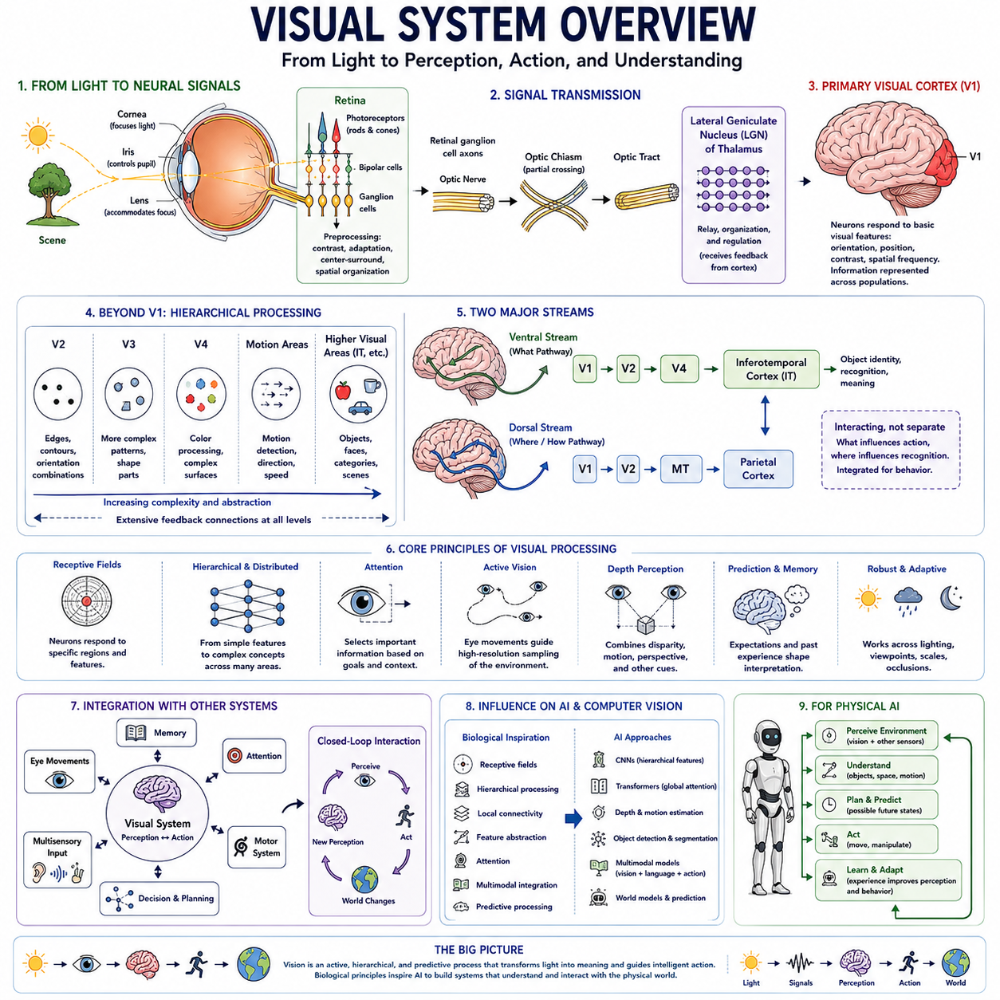{width="7.268055555555556in" height="7.268055555555556in"}

The human visual system is a distributed biological information-processing architecture that transforms patterns of light into representations useful for perception, recognition, spatial understanding, attention, and action. Vision is not produced by the eyes alone. It emerges from coordinated processing across the retina, optic pathways, thalamus, visual cortex, and multiple association areas that continuously interact with memory, attention, expectations, and motor systems.

Visual processing begins when light reflected or emitted by objects enters the eye through the cornea. The cornea performs much of the initial optical focusing, while the lens dynamically adjusts focus so that light can form an image on the retina. The iris controls the size of the pupil and therefore regulates the amount of incoming light. These optical components prepare physical signals for conversion into neural information rather than directly producing visual perception.

The retina is a specialized neural tissue containing photoreceptors and several layers of interconnected neurons. Rods are highly sensitive to low levels of illumination and contribute strongly to vision under dim conditions, while cones support color vision and high spatial resolution. Their distribution across the retina is not uniform, allowing different retinal regions to provide different combinations of sensitivity, detail, and visual coverage.

Phototransduction converts incoming light into changes in neural activity. Photoreceptors contain light-sensitive molecules whose responses alter cellular electrical states when photons are absorbed. These responses influence bipolar cells and subsequently retinal ganglion cells through interconnected retinal circuitry. The retina therefore performs substantial preprocessing before visual signals leave the eye, demonstrating that biological sensing already contains computation at the sensor level.

Retinal processing includes mechanisms for contrast enhancement, adaptation, spatial organization, and sensitivity to changes in illumination. Horizontal and amacrine cells contribute to interactions across neighboring retinal pathways, while center-surround receptive-field organization emphasizes local differences rather than absolute brightness alone. Such processing improves sensitivity to boundaries and spatial variation, allowing later neural systems to receive structured signals rather than an unprocessed image.

Axons from retinal ganglion cells form the optic nerve, carrying visual information toward the brain. At the optic chiasm, fibers are partially reorganized so that information from corresponding portions of the visual field can be directed toward appropriate cerebral hemispheres. This anatomical arrangement supports coordinated processing of the left and right visual fields and illustrates how sensory pathways reorganize information according to functional spatial relationships.

A major destination of retinal signals is the lateral geniculate nucleus of the thalamus. The lateral geniculate nucleus is not merely a passive relay between the retina and visual cortex. It participates in organizing and regulating visual information while receiving extensive feedback from cortical regions. Visual transmission therefore reflects interactions between incoming sensory evidence and ongoing brain state rather than a strictly one-directional transfer of data.

From the thalamus, visual signals reach the primary visual cortex, commonly called V1, in the occipital lobe. V1 contains neurons responsive to structured properties of visual input such as orientation, spatial position, contrast, and spatial frequency. Information is represented across populations of neurons rather than reconstructed as a literal internal photograph, establishing a foundation for increasingly complex visual representations in subsequent cortical processing.

Visual processing beyond V1 involves multiple interconnected cortical areas, including V2, V3, V4, motion-sensitive regions, and higher association areas. As information moves through these networks, neural representations can become sensitive to increasingly complex properties such as contours, surfaces, color relationships, motion patterns, object structure, and spatial organization. Extensive feedback connections simultaneously allow later processing stages to influence earlier ones.

A widely used framework distinguishes ventral and dorsal visual processing streams. The ventral stream extends toward temporal cortical regions and is strongly associated with identifying objects, shapes, faces, and meaningful visual categories. It is often described as a pathway concerned with determining what is being observed, although its actual biological functions involve distributed interactions that are considerably richer than this simplified description.

The dorsal stream extends toward parietal regions and contributes strongly to spatial processing, motion perception, visually guided behavior, and relationships between objects and the body. It is frequently characterized as supporting where or how information. This pathway is especially important for embodied behavior because an organism must estimate locations, movement, orientation, and reachable relationships in order to interact effectively with its environment.

The ventral and dorsal streams are not independent visual systems. Object identity can influence action, while spatial context and movement can influence recognition. Effective perception therefore depends on communication among visual pathways and other brain systems. Biological vision combines information about what an object is, where it is, how it is moving, and what actions may be possible rather than solving each problem in complete isolation.

Receptive fields provide a fundamental concept for understanding visual computation. A neuron\'s response depends on stimulation within a particular region of sensory space, and receptive-field properties differ across levels of the visual hierarchy. Early receptive fields may respond to relatively simple local structures, while higher-level neurons can integrate information across larger regions and become sensitive to more complex visual configurations.

Hierarchical processing allows local visual information to contribute to increasingly abstract representations. Edges and orientations can participate in representations of contours and surfaces, which in turn contribute to representations of objects and scenes. However, biological vision should not be understood as a rigid sequence of feature detectors. Recurrent connections, contextual interactions, attention, and prior knowledge continually influence how visual signals are interpreted.

Visual attention helps allocate limited processing resources toward information that is currently relevant. Attention can be influenced by salient sensory events as well as goals, expectations, and task requirements. Consequently, two identical visual scenes may produce different patterns of neural processing depending on what an observer is attempting to detect or accomplish. Perception is therefore an active selection process rather than uniform analysis of every available signal.

Eye movements further demonstrate the active nature of vision. The eyes continually perform saccades, fixations, and other movements that change which parts of the environment receive high-resolution processing. The fovea provides particularly detailed vision over a relatively small region, so visual behavior depends on repeatedly directing this region toward informative locations. Perception emerges through coordinated sensing and action rather than from a single static image.

Depth perception is constructed from multiple sources of information. Binocular disparity provides differences between the images received by the two eyes, while motion, perspective, occlusion, shading, relative size, and learned environmental regularities provide additional cues. The brain combines these signals to estimate three-dimensional structure, demonstrating how useful world representations can emerge through fusion of multiple uncertain measurements.

Motion perception similarly depends on specialized processing distributed across visual pathways. Changes in local image patterns can provide evidence about object motion, self-motion, and environmental dynamics. Motion-sensitive cortical systems integrate information across space and time, while vestibular and motor signals can help distinguish movement of external objects from movement caused by the observer. Vision is therefore closely integrated with other sensory and action systems.

Visual perception is strongly influenced by memory and prediction. Previous experience provides knowledge about objects, scenes, regularities, and likely events, allowing ambiguous sensory evidence to be interpreted according to context. Top-down signals can influence visual processing when expectations or task goals are relevant. This interaction between sensory evidence and internal models provides an important biological foundation for predictive approaches to perception.

The visual system must also remain effective despite enormous variation in illumination, viewpoint, distance, scale, partial occlusion, and object appearance. Biological perception develops forms of invariance that allow relevant identities and relationships to remain relatively stable despite these transformations. Such robustness is essential because the retinal image changes continuously even when the underlying object or environment remains the same.

Biological vision strongly influenced the development of computer vision and artificial neural networks. Concepts such as receptive fields, hierarchical processing, local connectivity, and increasingly complex feature representations contributed to convolutional neural networks. CNNs transformed raw pixels through successive computational layers and became highly effective for image classification, detection, segmentation, and other visual tasks, although they remain engineering abstractions rather than biological replicas.

Modern computer vision increasingly uses transformer-based architectures and multimodal models. Vision Transformers divide images into representations that interact through attention mechanisms, enabling information to be integrated across distant spatial regions. Multimodal systems further connect visual representations with language, actions, depth, sensor measurements, and other information, expanding machine vision from isolated image recognition toward broader environmental understanding.

For physical AI, visual perception must extend beyond recognizing objects. An embodied agent needs information about geometry, free space, obstacles, motion, affordances, uncertainty, and possible future states. Visual information may therefore be integrated with LiDAR, radar, depth cameras, proprioception, inertial measurements, and memory. This resembles the biological principle that vision participates in a larger multisensory perception-action system.

The biological visual system also illustrates the importance of feedback and closed-loop interaction. Perception guides eye movements and actions, those actions change incoming sensory information, and new observations update perception and memory. Artificial agents can adopt a similar architecture in which visual encoders, world models, memory, planning, and control continuously exchange information rather than treating vision as a one-time preprocessing stage.

Understanding the visual system therefore provides AI with principles extending from sensor-level preprocessing to hierarchical representation, attention, prediction, multimodal integration, and action. Biological vision demonstrates that robust perception is distributed, recurrent, context dependent, and actively coupled to behavior. These principles provide a foundation for developing AI systems that do more than classify images and instead construct useful representations for intelligent interaction with dynamic environments.

인간의 시각 시스템(Human Visual System)은 빛의 패턴을 지각(Perception), 인식(Recognition), 공간 이해(Spatial Understanding), 주의(Attention), 행동(Action)에 유용한 표현(Representation)으로 변환하는 분산형 생물학적 정보 처리 아키텍처(Distributed Biological Information-Processing Architecture)입니다. 시각(Vision)은 눈만으로 만들어지는 것이 아닙니다. 망막(Retina), 시각 경로(Optic Pathway), 시상(Thalamus), 시각피질(Visual Cortex), 여러 연합 영역(Association Area)이 기억(Memory), 주의, 기대(Expectation), 운동 시스템(Motor System)과 지속적으로 상호작용하면서 협력적으로 처리한 결과로 출현합니다.

시각 처리는 물체에서 반사되거나 방출된 빛이 각막(Cornea)을 통해 눈으로 들어오면서 시작됩니다. 각막은 초기 광학 초점 형성(Optical Focusing)의 상당 부분을 담당하며, 수정체(Lens)는 빛이 망막에 상을 형성하도록 초점을 동적으로 조절합니다. 홍채(Iris)는 동공(Pupil)의 크기를 조절하여 유입되는 빛의 양을 제어합니다. 이러한 광학 구성 요소(Optical Component)는 직접적으로 시각적 지각을 생성하는 것이 아니라 물리적 신호가 신경 정보(Neural Information)로 변환될 수 있도록 준비합니다.

망막(Retina)은 광수용체(Photoreceptor)와 여러 층의 상호 연결된 뉴런(Neuron)을 포함하는 특수한 신경 조직(Neural Tissue)입니다. 간상세포(Rod)는 낮은 조도에 매우 민감하여 어두운 환경에서의 시각에 크게 기여하며, 원추세포(Cone)는 색각(Color Vision)과 높은 공간 해상도(Spatial Resolution)를 지원합니다. 이들은 망막 전체에 균일하게 분포하지 않으므로 서로 다른 망막 영역은 감도(Sensitivity), 세부 정보(Detail), 시야 범위(Visual Coverage)의 서로 다른 조합을 제공합니다.

광변환(Phototransduction)은 들어오는 빛을 신경 활동(Neural Activity)의 변화로 변환합니다. 광수용체는 빛에 민감한 분자를 포함하고 있으며, 광자(Photon)가 흡수되면 이러한 분자의 반응이 세포의 전기적 상태(Cellular Electrical State)를 변화시킵니다. 이러한 반응은 서로 연결된 망막 회로를 통해 양극세포(Bipolar Cell)에 영향을 주고 이후 망막신경절세포(Retinal Ganglion Cell)에 전달됩니다. 따라서 망막은 시각 신호가 눈을 떠나기 전에 상당한 전처리(Preprocessing)를 수행하며, 생물학적 감지 단계 자체에 이미 계산(Computation)이 포함되어 있음을 보여줍니다.

망막 처리(Retinal Processing)에는 대비 강화(Contrast Enhancement), 적응(Adaptation), 공간적 조직(Spatial Organization), 조도 변화에 대한 민감성과 관련된 메커니즘이 포함됩니다. 수평세포(Horizontal Cell)와 무축삭세포(Amacrine Cell)는 인접한 망막 경로 사이의 상호작용에 기여하며, 중심-주변 수용장(Center-Surround Receptive Field) 구조는 절대적인 밝기만이 아니라 국소적인 차이를 강조합니다. 이러한 처리는 경계(Boundary)와 공간적 변화에 대한 민감도를 높여 이후의 신경 시스템이 처리되지 않은 원시 이미지가 아니라 구조화된 신호를 받을 수 있도록 합니다.

망막신경절세포의 축삭(Axon)은 시신경(Optic Nerve)을 형성하여 시각 정보를 뇌 방향으로 전달합니다. 시신경교차(Optic Chiasm)에서는 신경섬유가 부분적으로 재구성되어 시야(Visual Field)의 대응 영역에서 전달되는 정보가 적절한 대뇌 반구(Cerebral Hemisphere)로 전달될 수 있습니다. 이러한 해부학적 구조는 좌우 시야의 협력적인 처리를 지원하며, 감각 경로가 기능적인 공간 관계(Spatial Relationship)에 따라 정보를 재구성하는 방식을 보여줍니다.

망막 신호의 주요 도착지 가운데 하나는 시상에 위치한 외측슬상핵(Lateral Geniculate Nucleus, LGN)입니다. 외측슬상핵은 단순히 망막과 시각피질 사이에서 정보를 전달하는 수동적 중계기(Passive Relay)가 아닙니다. 시각 정보를 조직하고 조절하는 데 참여하며 피질 영역으로부터 광범위한 피드백(Feedback)을 받습니다. 따라서 시각 정보의 전달은 단순한 단방향 데이터 전송이 아니라 유입되는 감각 증거(Sensory Evidence)와 현재 뇌 상태(Brain State) 사이의 상호작용을 반영합니다.

시상에서 전달된 시각 신호는 후두엽(Occipital Lobe)에 위치한 일차시각피질(Primary Visual Cortex), 일반적으로 V1이라고 불리는 영역에 도달합니다. V1에는 방향(Orientation), 공간적 위치(Spatial Position), 대비(Contrast), 공간 주파수(Spatial Frequency)와 같은 구조화된 시각 입력 특성에 반응하는 뉴런이 존재합니다. 정보는 문자 그대로의 내부 사진으로 재구성되는 것이 아니라 뉴런 집단(Neural Population)에 걸쳐 표현되며, 이후 피질 처리에서 점차 복잡해지는 시각 표현의 기반을 형성합니다.

V1 이후의 시각 처리는 V2, V3, V4, 움직임에 민감한 영역(Motion-Sensitive Region), 고차원 연합 영역(Higher Association Area)을 포함하는 여러 상호 연결된 피질 영역에서 이루어집니다. 정보가 이러한 네트워크를 통과하면서 신경 표현은 윤곽(Contour), 표면(Surface), 색상 관계(Color Relationship), 움직임 패턴(Motion Pattern), 객체 구조(Object Structure), 공간적 구성과 같은 점차 복잡한 특성에 민감해질 수 있습니다. 동시에 광범위한 피드백 연결을 통해 이후 처리 단계가 초기 처리 단계에 영향을 줄 수 있습니다.

널리 사용되는 시각 처리 프레임워크는 복측 시각 경로(Ventral Visual Stream)와 배측 시각 경로(Dorsal Visual Stream)를 구분합니다. 복측 경로는 측두엽 피질 영역(Temporal Cortical Region) 방향으로 확장되며 객체, 형태, 얼굴(Face), 의미 있는 시각 범주(Visual Category)를 식별하는 것과 밀접하게 관련되어 있습니다. 흔히 무엇을 보고 있는지를 판단하는 경로로 설명되지만, 실제 생물학적 기능은 이러한 단순한 설명보다 훨씬 풍부한 분산 상호작용(Distributed Interaction)을 포함합니다.

배측 시각 경로(Dorsal Visual Stream)는 두정엽 영역(Parietal Region) 방향으로 확장되며 공간 처리(Spatial Processing), 운동 지각(Motion Perception), 시각 유도 행동(Visually Guided Behavior), 객체와 신체 사이의 관계를 처리하는 데 크게 기여합니다. 흔히 어디(Where) 또는 어떻게(How)에 관한 정보를 지원하는 경로로 설명됩니다. 유기체가 환경과 효과적으로 상호작용하려면 위치, 움직임, 방향, 도달 가능한 관계(Reachable Relationship)를 추정해야 하므로 이 경로는 체화 행동(Embodied Behavior)에 특히 중요합니다.

복측 경로와 배측 경로는 서로 독립적인 시각 시스템이 아닙니다. 객체의 정체성(Object Identity)은 행동에 영향을 줄 수 있으며, 공간적 맥락과 움직임은 객체 인식에 영향을 줄 수 있습니다. 따라서 효과적인 지각은 시각 경로와 다른 뇌 시스템 사이의 통신에 의존합니다. 생물학적 시각은 객체가 무엇인지, 어디에 있는지, 어떻게 움직이고 있는지, 어떤 행동이 가능한지를 완전히 분리된 문제로 해결하는 대신 이러한 정보를 함께 결합합니다.

수용장(Receptive Field)은 시각 계산(Visual Computation)을 이해하기 위한 기본적인 개념을 제공합니다. 하나의 뉴런 반응은 감각 공간(Sensory Space)의 특정 영역에서 발생하는 자극에 따라 달라지며, 수용장의 특성은 시각 계층(Visual Hierarchy)의 수준에 따라 서로 다릅니다. 초기 단계의 수용장은 비교적 단순하고 국소적인 구조에 반응할 수 있지만, 고차원 뉴런은 더 넓은 영역의 정보를 통합하여 보다 복잡한 시각적 구성(Visual Configuration)에 민감하게 반응할 수 있습니다.

계층적 처리(Hierarchical Processing)는 국소적인 시각 정보가 점차 추상적인 표현(Abstract Representation)에 기여할 수 있도록 합니다. 에지(Edge)와 방향은 윤곽과 표면의 표현에 참여할 수 있으며, 이러한 표현은 다시 객체와 장면(Scene)의 표현에 기여할 수 있습니다. 그러나 생물학적 시각을 경직된 특징 검출기(Feature Detector)의 순차적 구조로 이해해서는 안 됩니다. 순환 연결(Recurrent Connection), 맥락적 상호작용(Contextual Interaction), 주의, 사전 지식(Prior Knowledge)은 시각 신호가 해석되는 방식에 지속적으로 영향을 줍니다.

시각적 주의(Visual Attention)는 제한된 처리 자원(Processing Resource)을 현재 중요한 정보에 할당하도록 돕습니다. 주의는 두드러진 감각 사건(Salient Sensory Event)뿐만 아니라 목표, 기대, 작업 요구사항(Task Requirement)의 영향을 받을 수 있습니다. 따라서 동일한 시각 장면이라도 관찰자가 무엇을 탐지하거나 수행하려고 하는지에 따라 서로 다른 신경 처리 패턴을 생성할 수 있습니다. 지각은 이용 가능한 모든 신호를 균일하게 분석하는 것이 아니라 능동적 선택 과정(Active Selection Process)입니다.

안구 운동(Eye Movement)은 시각의 능동적 특성을 더욱 분명하게 보여줍니다. 눈은 단속운동(Saccade), 고정(Fixation), 기타 움직임을 지속적으로 수행하여 환경의 어떤 부분이 높은 해상도로 처리되는지를 변화시킵니다. 중심와(Fovea)는 비교적 작은 영역에 대해 특히 세밀한 시각을 제공하기 때문에 시각 행동은 이 영역을 정보 가치가 높은 위치로 반복적으로 이동시키는 과정에 의존합니다. 따라서 지각은 하나의 정적인 이미지가 아니라 감지(Sensing)와 행동의 협력적인 과정을 통해 출현합니다.

깊이 지각(Depth Perception)은 여러 정보원으로부터 구성됩니다. 양안 시차(Binocular Disparity)는 두 눈에 들어오는 이미지 사이의 차이를 제공하며, 움직임(Motion), 원근(Perspective), 가림(Occlusion), 음영(Shading), 상대적 크기(Relative Size), 학습된 환경적 규칙성(Environmental Regularity)도 추가적인 단서를 제공합니다. 뇌는 이러한 신호를 결합하여 3차원 구조(Three-Dimensional Structure)를 추정하며, 이는 여러 불확실한 측정값의 융합(Fusion)을 통해 유용한 세계 표현(World Representation)이 형성될 수 있음을 보여줍니다.

운동 지각(Motion Perception) 역시 시각 경로 전체에 분산된 전문화된 처리에 의존합니다. 국소 이미지 패턴(Local Image Pattern)의 변화는 객체 운동(Object Motion), 자기 운동(Self-Motion), 환경 동역학(Environmental Dynamics)에 관한 증거를 제공할 수 있습니다. 움직임에 민감한 피질 시스템은 공간과 시간에 걸쳐 정보를 통합하며, 전정 신호(Vestibular Signal)와 운동 신호(Motor Signal)는 외부 객체의 움직임과 관찰자의 움직임으로 발생한 변화를 구분하는 데 도움을 줄 수 있습니다. 따라서 시각은 다른 감각 및 행동 시스템과 긴밀하게 통합되어 있습니다.

시각적 지각(Visual Perception)은 기억(Memory)과 예측(Prediction)의 강한 영향을 받습니다. 이전 경험은 객체, 장면, 규칙성, 발생 가능성이 높은 사건에 관한 지식을 제공하여 모호한 감각 증거(Ambiguous Sensory Evidence)를 맥락에 따라 해석할 수 있도록 합니다. 기대나 작업 목표가 중요한 경우 하향식 신호(Top-Down Signal)가 시각 처리에 영향을 줄 수 있습니다. 감각 증거와 내부 모델(Internal Model) 사이의 이러한 상호작용은 지각에 대한 예측적 접근법(Predictive Approach)의 중요한 생물학적 기반을 제공합니다.

시각 시스템은 조명(Illumination), 시점(Viewpoint), 거리(Distance), 크기(Scale), 부분 가림(Partial Occlusion), 객체 외형(Object Appearance)이 크게 변화하더라도 효과적으로 작동해야 합니다. 생물학적 지각은 이러한 변환에도 관련된 객체의 정체성과 관계가 비교적 안정적으로 유지될 수 있도록 일종의 불변성(Invariance)을 형성합니다. 망막 이미지가 지속적으로 변화하더라도 실제 객체나 환경은 동일하게 유지될 수 있으므로 이러한 강건성(Robustness)은 필수적입니다.

생물학적 시각(Biological Vision)은 컴퓨터 비전(Computer Vision)과 인공신경망(Artificial Neural Network)의 발전에 큰 영향을 주었습니다. 수용장, 계층적 처리, 국소 연결(Local Connectivity), 점차 복잡해지는 특징 표현(Feature Representation)과 같은 개념은 합성곱 신경망(Convolutional Neural Network, CNN)의 발전에 기여했습니다. CNN은 연속적인 계산 계층을 통해 원시 픽셀(Raw Pixel)을 변환하여 이미지 분류(Image Classification), 객체 검출(Object Detection), 분할(Segmentation) 등의 시각 작업에서 높은 성능을 보였지만 생물학적 시스템을 그대로 복제한 것은 아닙니다.

현대 컴퓨터 비전(Modern Computer Vision)은 점차 트랜스포머 기반 아키텍처(Transformer-Based Architecture)와 멀티모달 모델(Multimodal Model)을 활용하고 있습니다. 비전 트랜스포머(Vision Transformer, ViT)는 이미지를 여러 표현으로 나누고 이를 어텐션 메커니즘(Attention Mechanism)을 통해 상호작용시켜 공간적으로 멀리 떨어진 영역의 정보를 통합할 수 있도록 합니다. 멀티모달 시스템은 시각 표현을 언어(Language), 행동(Action), 깊이(Depth), 센서 측정값(Sensor Measurement), 기타 정보와 연결하여 기계 시각(Machine Vision)을 독립적인 이미지 인식에서 보다 광범위한 환경 이해(Environmental Understanding)로 확장합니다.

피지컬 인공지능(Physical AI)에서 시각적 지각은 단순한 객체 인식을 넘어야 합니다. 체화 에이전트(Embodied Agent)는 기하 구조(Geometry), 자유 공간(Free Space), 장애물(Obstacle), 움직임, 행동가능성(Affordance), 불확실성(Uncertainty), 가능한 미래 상태(Future State)에 관한 정보를 필요로 합니다. 따라서 시각 정보는 라이다(LiDAR), 레이더(Radar), 깊이 카메라(Depth Camera), 고유수용감각(Proprioception), 관성 측정(Inertial Measurement), 기억과 통합될 수 있습니다. 이는 시각이 더 큰 다중감각 지각-행동 시스템(Multisensory Perception-Action System)에 참여한다는 생물학적 원리와 유사합니다.

생물학적 시각 시스템은 피드백과 폐루프 상호작용(Closed-Loop Interaction)의 중요성도 보여줍니다. 지각은 안구 운동과 행동을 안내하고, 이러한 행동은 들어오는 감각 정보를 변화시키며, 새로운 관측은 다시 지각과 기억을 갱신합니다. 인공 에이전트(Artificial Agent) 역시 시각 인코더(Visual Encoder), 월드 모델(World Model), 기억, 계획(Planning), 제어(Control)가 지속적으로 정보를 교환하는 유사한 아키텍처를 적용하여 시각을 일회성 전처리 단계로만 다루지 않을 수 있습니다.

따라서 시각 시스템(Visual System)을 이해하는 것은 센서 수준 전처리(Sensor-Level Preprocessing)에서 계층적 표현(Hierarchical Representation), 주의, 예측, 멀티모달 통합(Multimodal Integration), 행동에 이르는 다양한 원리를 인공지능에 제공합니다. 생물학적 시각은 강건한 지각이 분산적(Distributed)이고, 순환적(Recurrent)이며, 맥락 의존적(Context-Dependent)이고, 행동과 능동적으로 결합되어 있음을 보여줍니다. 이러한 원리는 단순히 이미지를 분류하는 수준을 넘어 동적인 환경(Dynamic Environment)과 지능적으로 상호작용하기 위한 유용한 표현을 구성하는 인공지능 시스템을 개발하는 기반을 제공합니다.

##  

## 02.01 Retina and Early Vision [w/Code]

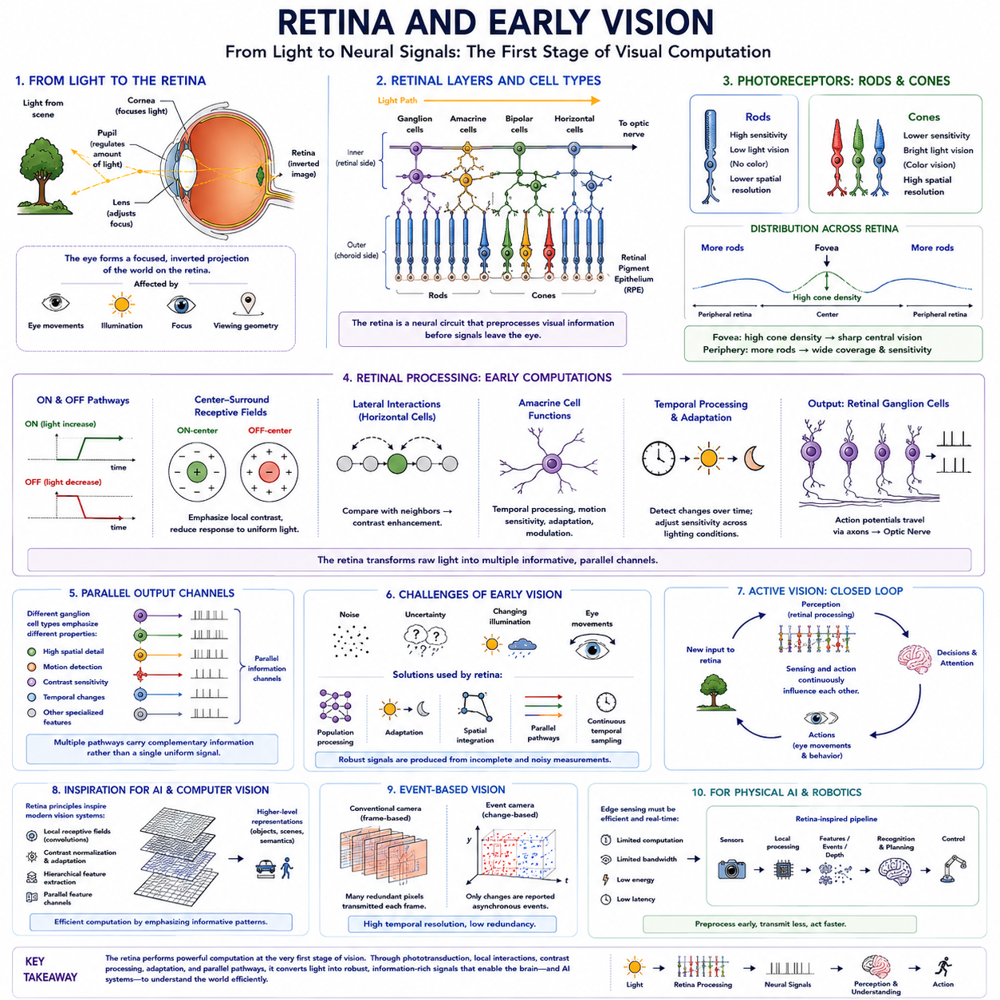{width="7.268055555555556in" height="7.268055555555556in"}

The retina is not merely a passive surface that records incoming light but a sophisticated neural processing system that performs the first stages of visual computation. Located at the back of the eye, it converts patterns of photons into structured neural signals while extracting information about contrast, spatial relationships, color, and temporal change. Early vision therefore begins before signals reach the brain's cortical visual areas.

Light entering the eye passes through the cornea, pupil, and lens before reaching the retina. The optical system focuses a spatial pattern of illumination onto retinal tissue, creating an inverted projection of the external scene. This projection is continuously affected by eye movements, illumination, focus, and viewing geometry, so the nervous system must operate on signals that vary even when objects in the environment remain unchanged.

The retina contains several interacting layers of specialized cells rather than a simple array of independent light sensors. Major components include photoreceptors, horizontal cells, bipolar cells, amacrine cells, and retinal ganglion cells. These cell populations form local neural circuits that transform incoming optical information before transmitting it through the optic nerve, making the retina an example of computation occurring directly at the sensory interface.

Photoreceptors provide the initial conversion from electromagnetic energy into biological signals. Rods and cones contain photopigments that respond when photons are absorbed, initiating biochemical processes that alter the electrical state of the cell. This mechanism, known as phototransduction, transforms variations in light intensity into changes that downstream retinal neurons can process and eventually represent as patterns of neural activity.

Rods are highly sensitive photoreceptors that support vision under low-light conditions. They can respond when relatively little light is available, making them important for nighttime and dim-environment perception. Their neural organization favors sensitivity over fine spatial detail and color discrimination. Rod-based vision therefore demonstrates a fundamental sensory tradeoff in which increased sensitivity can be obtained at the cost of spatial precision.

Cones operate most effectively under brighter illumination and provide the foundation for high-resolution and color vision. Human vision uses different cone classes with different spectral sensitivities, allowing neural circuits to compare responses across wavelength ranges. Color perception does not arise because individual cones directly identify colors; rather, it emerges from comparisons among populations of receptors and subsequent neural processing.

Photoreceptor distribution varies substantially across the retina. The fovea contains a particularly high density of cones and supports detailed central vision, whereas peripheral retinal regions contain proportionally more rods and provide greater sensitivity to low illumination and broad visual coverage. As a result, visual resolution is not uniform across the visual field, and eye movements are required to position important information near high-resolution retinal regions.

Bipolar cells form an important intermediate pathway between photoreceptors and retinal ganglion cells. Rather than simply forwarding receptor values, different bipolar pathways respond differently to increases and decreases in illumination. ON and OFF pathways allow retinal circuits to represent light increments and decrements separately, providing an efficient mechanism for detecting changes and local structure instead of encoding only absolute illumination values.

Horizontal cells create interactions among neighboring photoreceptor pathways and contribute strongly to lateral processing. Through these connections, the response associated with one retinal location can depend on illumination in surrounding regions. This organization supports contrast enhancement and contributes to center-surround receptive fields, illustrating how local neural interactions can transform raw sensor measurements into more informative representations of spatial variation.

Center-surround receptive fields are a central principle of early visual processing. A retinal neuron may respond differently when light stimulates the center of its receptive field compared with its surrounding region. ON-center and OFF-center organizations emphasize differences between nearby areas. This reduces sensitivity to uniform illumination while increasing sensitivity to boundaries, local contrast, and spatial transitions that often correspond to meaningful structure in visual scenes.

The importance of contrast demonstrates that biological vision does not simply attempt to preserve every pixel-like measurement reaching the retina. Uniform regions contain substantial redundant information, whereas boundaries and changes often provide more useful evidence about objects and surfaces. Retinal processing therefore performs an early form of information transformation that emphasizes differences and relationships rather than producing a literal copy of the optical image.

Amacrine cells introduce additional complexity into retinal computation. They participate in interactions among bipolar and ganglion cell pathways and contribute to temporal processing, motion sensitivity, adaptation, and modulation of retinal signals. Numerous amacrine cell types perform different functions, showing that early vision depends on heterogeneous specialized circuits rather than a single uniform processing operation repeated across the retina.

Temporal processing is essential because natural vision involves continuous change. Objects move, observers move, illumination varies, and the eyes repeatedly shift their direction. Retinal circuits respond not only to spatial patterns but also to how signals change over time. Sensitivity to temporal transitions helps the visual system detect movement and new events while reducing unnecessary responses to conditions that remain stable.

Adaptation allows retinal processing to operate across an enormous range of environmental illumination. Visual sensitivity changes when moving from bright sunlight into darkness or from darkness into a brightly illuminated environment. Photoreceptors and retinal circuits adjust their responses according to prevailing conditions, preventing the system from operating with one fixed sensitivity level that would be ineffective across the full range of natural lighting.

Retinal ganglion cells form the principal output pathway from the retina to the brain. They integrate signals produced by preceding retinal circuits and generate action potentials that travel along their axons. These axons collectively form the optic nerve. Because ganglion cells transmit already transformed information, the brain receives multiple structured visual channels rather than an untouched representation of the original light distribution.

Different populations of retinal ganglion cells emphasize different properties of visual information. Some pathways are particularly sensitive to spatial detail, others to temporal changes, contrast, or other stimulus characteristics. Parallel processing therefore begins very early in vision. Instead of forcing all visual information through one homogeneous representation, the nervous system maintains specialized channels that can support different downstream computational requirements.

The concept of receptive fields provides an important bridge from retinal biology to computational models of vision. Each retinal neuron responds to information within a particular spatial region, and its output reflects a structured transformation of that region. Later visual neurons combine signals from earlier receptive fields, creating progressively larger and more complex representations. This principle strongly influenced the development of hierarchical artificial vision systems.

Early visual processing also demonstrates the importance of local connectivity. Retinal neurons primarily interact with particular nearby cells rather than communicating equally with every neuron in the retina. Local structure allows computations such as contrast comparison to be performed efficiently and repeatedly across visual space. Similar principles later became important in computer vision architectures where spatial locality is used to extract reusable visual patterns.

The retina performs a form of efficient coding by transforming highly redundant sensory input into signals that emphasize informative variation. Natural scenes often contain strong correlations between neighboring locations, making direct transmission of every measurement inefficient. By emphasizing differences, adapting to background conditions, and dividing information among specialized pathways, retinal circuits use limited neural communication resources more effectively.

Noise and uncertainty are unavoidable at the earliest stages of vision. Photon arrival is variable, receptor responses are imperfect, and environmental illumination can change dramatically. Retinal circuits must therefore produce useful signals from incomplete and noisy measurements. Biological vision achieves robustness through population processing, adaptation, spatial integration, parallel pathways, and continuous temporal sampling rather than assuming that sensory input is perfectly reliable.

Early vision cannot be understood entirely as a feedforward process. Although information travels from photoreceptors through retinal circuits toward ganglion cells and the brain, visual processing operates within a larger recurrent system involving eye movements, attention, expectations, and changing behavior. The organism actively controls where it looks, altering future retinal input and creating a closed loop between sensory processing and action.

These principles have strongly influenced artificial computer vision. Convolutional filters can detect local patterns such as edges and textures, while normalization mechanisms help models operate across changing input distributions. Hierarchical networks combine simple local representations into increasingly complex features. These methods are not direct replicas of retinal circuits, but they reflect the computational value of locality, contrast, adaptation, and structured feature extraction.

Event-based vision provides another connection between biological early vision and artificial sensing. Conventional cameras repeatedly capture complete image frames, including large regions that may not have changed. Event cameras instead report local brightness changes asynchronously, reducing redundant transmission and providing high temporal resolution. Although their operation differs from biological retinas, they demonstrate the engineering value of emphasizing visual change rather than repeatedly transmitting static information.

For physical AI and robotics, retina-inspired principles are valuable because edge perception must operate under limited computation, bandwidth, energy, and latency. Sensor-level preprocessing can extract important information before transmitting large quantities of raw data to higher-level systems. Local contrast processing, event detection, adaptive sensing, and parallel visual pathways can therefore contribute to efficient real-time perception in embodied agents.

A robotic visual system can similarly separate early perception from higher-level interpretation. Cameras and local processors may perform image correction, feature extraction, motion detection, depth estimation, or event filtering before representations reach object recognition, world models, planning, and control systems. This hierarchical organization reduces unnecessary information flow while preserving signals that are useful for subsequent decision making.

The retina and early visual system therefore illustrate a fundamental principle of intelligent perception: sensing and computation are deeply interconnected. Biological vision begins transforming information immediately at the sensory boundary through phototransduction, adaptation, local interaction, contrast enhancement, parallel processing, and temporal filtering. For AI, these mechanisms demonstrate how efficient perception can emerge by converting raw measurements into structured representations before higher-level reasoning begins.

망막(Retina)은 들어오는 빛을 단순히 기록하는 수동적인 표면이 아니라 시각 계산(Visual Computation)의 초기 단계를 수행하는 정교한 신경 처리 시스템(Neural Processing System)입니다. 눈의 뒤쪽에 위치한 망막은 광자(Photon)의 패턴을 구조화된 신경 신호(Neural Signal)로 변환하면서 대비(Contrast), 공간적 관계(Spatial Relationship), 색상(Color), 시간적 변화(Temporal Change)에 관한 정보를 추출합니다. 따라서 초기 시각(Early Vision)은 신호가 뇌의 피질 시각 영역(Cortical Visual Area)에 도달하기 전부터 시작됩니다.

눈으로 들어온 빛은 망막에 도달하기 전에 각막(Cornea), 동공(Pupil), 수정체(Lens)를 통과합니다. 광학 시스템(Optical System)은 조명의 공간적 패턴을 망막 조직에 초점을 맞추어 외부 장면의 역상(Inverted Projection)을 형성합니다. 이러한 투영은 안구 운동(Eye Movement), 조명(Illumination), 초점(Focus), 관찰 기하 구조(Viewing Geometry)의 영향을 지속적으로 받기 때문에 신경계는 환경의 객체가 변하지 않더라도 계속 변화하는 신호를 처리해야 합니다.

망막은 단순히 독립적인 광센서가 배열된 구조가 아니라 여러 층의 특수화된 세포(Specialized Cell)가 상호작용하는 구조를 갖습니다. 주요 구성 요소에는 광수용체(Photoreceptor), 수평세포(Horizontal Cell), 양극세포(Bipolar Cell), 무축삭세포(Amacrine Cell), 망막신경절세포(Retinal Ganglion Cell)가 포함됩니다. 이러한 세포 집단은 시신경(Optic Nerve)을 통해 정보를 전달하기 전에 입력된 광학 정보를 변환하는 국소 신경회로(Local Neural Circuit)를 형성하므로, 망막은 감각 인터페이스(Sensory Interface)에서 직접 계산이 이루어지는 대표적인 사례입니다.

광수용체(Photoreceptor)는 전자기 에너지(Electromagnetic Energy)를 생물학적 신호(Biological Signal)로 변환하는 최초의 과정을 담당합니다. 간상세포(Rod)와 원추세포(Cone)는 광자가 흡수될 때 반응하는 광색소(Photopigment)를 포함하고 있으며, 이 과정에서 세포의 전기적 상태를 변화시키는 생화학적 과정(Biochemical Process)이 시작됩니다. 광변환(Phototransduction)이라고 하는 이러한 메커니즘은 빛의 세기 변화를 하위 망막 뉴런이 처리하고 궁극적으로 신경 활동 패턴으로 표현할 수 있는 변화로 변환합니다.

간상세포(Rod)는 낮은 조도 조건에서 시각을 지원하는 매우 민감한 광수용체입니다. 상대적으로 적은 양의 빛에도 반응할 수 있기 때문에 야간 및 어두운 환경에서의 지각에 중요합니다. 간상세포의 신경 조직은 세밀한 공간적 정보(Spatial Detail)와 색상 구별(Color Discrimination)보다는 감도(Sensitivity)를 우선합니다. 따라서 간상세포 기반 시각(Rod-Based Vision)은 공간적 정밀도(Spatial Precision)를 희생하는 대신 높은 감도를 확보하는 기본적인 감각적 절충 관계(Sensory Tradeoff)를 보여줍니다.

원추세포(Cone)는 밝은 조명에서 가장 효과적으로 작동하며 고해상도 시각(High-Resolution Vision)과 색각(Color Vision)의 기반을 제공합니다. 인간의 시각은 서로 다른 분광 민감도(Spectral Sensitivity)를 갖는 여러 종류의 원추세포를 사용하며, 이를 통해 신경회로는 서로 다른 파장 범위에 대한 반응을 비교할 수 있습니다. 개별 원추세포가 색상을 직접 식별하기 때문에 색 지각(Color Perception)이 발생하는 것이 아니라, 수용체 집단 사이의 반응 비교와 이후의 신경 처리를 통해 색 지각이 출현합니다.

광수용체의 분포는 망막 전체에서 상당한 차이를 보입니다. 중심와(Fovea)는 특히 높은 밀도의 원추세포를 포함하여 세밀한 중심 시각(Central Vision)을 지원하는 반면, 주변 망막(Peripheral Retina)은 상대적으로 더 많은 간상세포를 포함하여 낮은 조도에 대한 높은 민감성과 넓은 시야 범위(Visual Coverage)를 제공합니다. 따라서 시각 해상도(Visual Resolution)는 전체 시야에서 균일하지 않으며, 중요한 정보를 고해상도 망막 영역 근처에 위치시키기 위해 안구 운동이 필요합니다.

양극세포(Bipolar Cell)는 광수용체와 망막신경절세포 사이에서 중요한 중간 경로(Intermediate Pathway)를 형성합니다. 양극세포의 서로 다른 경로는 단순히 수용체의 값을 전달하는 것이 아니라 조명의 증가와 감소에 서로 다르게 반응합니다. ON 경로(ON Pathway)와 OFF 경로(OFF Pathway)는 망막 회로가 빛의 증가와 감소를 각각 표현할 수 있도록 하며, 절대적인 조명값만을 부호화하는 대신 변화와 국소 구조(Local Structure)를 효율적으로 탐지하는 메커니즘을 제공합니다.

수평세포(Horizontal Cell)는 인접한 광수용체 경로 사이에 상호작용을 형성하며 측면 처리(Lateral Processing)에 크게 기여합니다. 이러한 연결을 통해 하나의 망막 위치에서 발생하는 반응은 주변 영역의 조명 상태에 따라 달라질 수 있습니다. 이러한 구조는 대비 강화(Contrast Enhancement)를 지원하고 중심-주변 수용장(Center-Surround Receptive Field)의 형성에 기여하며, 국소적인 신경 상호작용이 원시 센서 측정값(Raw Sensor Measurement)을 공간적 변화에 대한 보다 유용한 표현으로 변환할 수 있음을 보여줍니다.

중심-주변 수용장(Center-Surround Receptive Field)은 초기 시각 처리의 핵심 원리입니다. 하나의 망막 뉴런은 수용장 중심부에 빛이 자극될 때와 주변 영역이 자극될 때 서로 다르게 반응할 수 있습니다. ON-중심(ON-Center)과 OFF-중심(OFF-Center) 구조는 인접한 영역 사이의 차이를 강조합니다. 이는 균일한 조명에 대한 민감성을 줄이는 동시에 시각 장면의 의미 있는 구조와 대응하는 경우가 많은 경계(Boundary), 국소 대비(Local Contrast), 공간적 전이(Spatial Transition)에 대한 민감성을 증가시킵니다.

대비(Contrast)의 중요성은 생물학적 시각이 망막에 도달하는 모든 픽셀과 유사한 측정값을 단순히 보존하려는 것이 아님을 보여줍니다. 균일한 영역에는 상당한 중복 정보(Redundant Information)가 포함되어 있는 반면, 경계와 변화는 객체와 표면에 관한 더 유용한 증거를 제공하는 경우가 많습니다. 따라서 망막 처리는 광학 이미지를 문자 그대로 복사하는 것이 아니라 차이와 관계를 강조하는 초기 형태의 정보 변환(Information Transformation)을 수행합니다.

무축삭세포(Amacrine Cell)는 망막 계산(Retinal Computation)에 추가적인 복잡성을 제공합니다. 이들은 양극세포와 신경절세포 경로 사이의 상호작용에 참여하며 시간적 처리(Temporal Processing), 운동 민감도(Motion Sensitivity), 적응(Adaptation), 망막 신호의 조절(Modulation)에 기여합니다. 다양한 종류의 무축삭세포가 서로 다른 기능을 수행한다는 사실은 초기 시각이 하나의 균일한 처리 연산을 망막 전체에 반복하는 방식이 아니라 이질적이고 전문화된 회로(Heterogeneous Specialized Circuit)에 의존한다는 것을 보여줍니다.

시간적 처리(Temporal Processing)는 자연적인 시각 환경이 지속적으로 변화하기 때문에 필수적입니다. 객체는 움직이고, 관찰자도 움직이며, 조명은 변화하고, 눈은 반복적으로 시선을 이동합니다. 망막 회로는 공간적 패턴뿐만 아니라 신호가 시간에 따라 어떻게 변화하는지에도 반응합니다. 시간적 전이(Temporal Transition)에 대한 민감성은 시각 시스템이 움직임과 새로운 사건을 탐지하는 동시에 안정적으로 유지되는 조건에 대한 불필요한 반응을 줄이는 데 도움을 줍니다.

적응(Adaptation)은 망막 처리가 매우 넓은 범위의 환경 조명에서 작동할 수 있도록 합니다. 밝은 햇빛에서 어두운 장소로 이동하거나 어둠에서 밝게 조명된 환경으로 이동하면 시각 민감도(Visual Sensitivity)가 변화합니다. 광수용체와 망막 회로는 현재의 환경 조건에 따라 반응을 조정하며, 이를 통해 자연환경의 전체 조명 범위에서 효과적이지 못한 하나의 고정된 감도 수준으로 시스템이 작동하는 것을 방지합니다.

망막신경절세포(Retinal Ganglion Cell)는 망막에서 뇌로 전달되는 주요 출력 경로(Output Pathway)를 형성합니다. 이들은 앞선 망막 회로에서 생성된 신호를 통합하고 축삭을 따라 전달되는 활동전위(Action Potential)를 생성합니다. 이러한 축삭들이 모여 시신경(Optic Nerve)을 형성합니다. 신경절세포는 이미 변환된 정보를 전달하므로 뇌는 원래의 빛 분포가 그대로 보존된 표현이 아니라 여러 종류의 구조화된 시각 채널(Structured Visual Channel)을 전달받습니다.

서로 다른 망막신경절세포 집단은 시각 정보의 서로 다른 특성을 강조합니다. 일부 경로는 공간적 세부 정보에 특히 민감하고, 다른 경로는 시간적 변화, 대비 또는 기타 자극 특성에 더 민감합니다. 따라서 병렬 처리(Parallel Processing)는 시각의 매우 초기 단계부터 시작됩니다. 신경계는 모든 시각 정보를 하나의 균질한 표현으로 처리하는 대신 서로 다른 하위 계산 요구사항을 지원할 수 있는 전문화된 채널을 유지합니다.

수용장(Receptive Field)의 개념은 망막 생물학과 시각의 계산 모델(Computational Model)을 연결하는 중요한 가교를 제공합니다. 각각의 망막 뉴런은 특정 공간 영역의 정보에 반응하며, 그 출력은 해당 영역에 대한 구조화된 변환(Structured Transformation)을 반영합니다. 이후 단계의 시각 뉴런은 초기 수용장으로부터 전달된 신호를 결합하여 점차 더 넓고 복잡한 표현을 생성합니다. 이러한 원리는 계층적 인공 시각 시스템(Hierarchical Artificial Vision System)의 발전에 큰 영향을 주었습니다.

초기 시각 처리는 국소 연결(Local Connectivity)의 중요성도 보여줍니다. 망막 뉴런은 망막에 존재하는 모든 뉴런과 동일하게 통신하는 것이 아니라 주로 특정한 인접 세포들과 상호작용합니다. 국소 구조(Local Structure)를 통해 대비 비교와 같은 계산을 시각 공간 전체에서 효율적이고 반복적으로 수행할 수 있습니다. 이와 유사한 원리는 이후 공간적 국소성(Spatial Locality)을 이용하여 재사용 가능한 시각 패턴을 추출하는 컴퓨터 비전(Computer Vision) 아키텍처에서도 중요하게 활용되었습니다.

망막은 매우 중복적인 감각 입력을 정보 가치가 높은 변화를 강조하는 신호로 변환함으로써 일종의 효율적 부호화(Efficient Coding)를 수행합니다. 자연 장면(Natural Scene)은 인접한 위치 사이에 강한 상관관계가 존재하는 경우가 많기 때문에 모든 측정값을 직접 전달하는 것은 비효율적입니다. 망막 회로는 차이를 강조하고, 배경 조건에 적응하며, 정보를 전문화된 여러 경로로 분리함으로써 제한된 신경 통신 자원(Neural Communication Resource)을 보다 효율적으로 활용합니다.

잡음(Noise)과 불확실성(Uncertainty)은 시각의 가장 초기 단계부터 피할 수 없는 요소입니다. 광자의 도달은 변동성을 가지며, 수용체의 반응은 완벽하지 않고, 환경 조명은 크게 변화할 수 있습니다. 따라서 망막 회로는 불완전하고 잡음이 포함된 측정값으로부터 유용한 신호를 생성해야 합니다. 생물학적 시각은 감각 입력이 완벽하게 신뢰할 수 있다고 가정하지 않고 집단 처리(Population Processing), 적응, 공간적 통합(Spatial Integration), 병렬 경로, 지속적인 시간적 샘플링(Temporal Sampling)을 통해 강건성(Robustness)을 확보합니다.

초기 시각(Early Vision)을 완전한 순방향 처리(Feedforward Processing)만으로 이해할 수는 없습니다. 정보는 광수용체에서 망막 회로와 신경절세포를 거쳐 뇌로 이동하지만, 시각 처리는 안구 운동, 주의(Attention), 기대(Expectation), 변화하는 행동을 포함하는 더 큰 순환 시스템(Recurrent System) 안에서 작동합니다. 유기체는 어디를 바라볼 것인지 능동적으로 제어하고, 이를 통해 미래의 망막 입력을 변화시키며 감각 처리와 행동 사이에 폐루프(Closed Loop)를 형성합니다.

이러한 원리는 인공 컴퓨터 비전(Artificial Computer Vision)에 큰 영향을 주었습니다. 합성곱 필터(Convolutional Filter)는 에지(Edge), 텍스처(Texture)와 같은 국소 패턴을 탐지할 수 있으며, 정규화 메커니즘(Normalization Mechanism)은 모델이 변화하는 입력 분포에서 작동할 수 있도록 지원합니다. 계층적 네트워크(Hierarchical Network)는 단순한 국소 표현을 결합하여 점차 복잡한 특징을 생성합니다. 이러한 방법은 망막 회로를 직접 복제한 것은 아니지만 국소성, 대비, 적응, 구조화된 특징 추출(Structured Feature Extraction)의 계산적 가치를 반영합니다.

이벤트 기반 비전(Event-Based Vision)은 생물학적 초기 시각과 인공 감지(Artificial Sensing)를 연결하는 또 다른 사례를 제공합니다. 기존 카메라는 변화하지 않은 넓은 영역까지 포함하여 전체 이미지 프레임(Image Frame)을 반복적으로 촬영합니다. 반면 이벤트 카메라(Event Camera)는 국소적인 밝기 변화를 비동기적으로 보고하여 중복 데이터 전송을 줄이고 높은 시간 해상도(Temporal Resolution)를 제공합니다. 생물학적 망막과 동작 방식은 다르지만 정적인 정보를 반복적으로 전달하기보다 시각적 변화를 강조하는 공학적 가치를 보여줍니다.

피지컬 인공지능(Physical AI)과 로보틱스(Robotics)에서 망막에서 영감을 받은 원리는 엣지 지각(Edge Perception)이 제한된 계산량, 대역폭(Bandwidth), 에너지, 지연시간(Latency) 조건에서 작동해야 하기 때문에 매우 유용합니다. 센서 수준 전처리(Sensor-Level Preprocessing)는 대량의 원시 데이터를 상위 시스템으로 전달하기 전에 중요한 정보를 추출할 수 있습니다. 따라서 국소 대비 처리, 이벤트 탐지(Event Detection), 적응형 감지(Adaptive Sensing), 병렬 시각 경로는 체화 에이전트(Embodied Agent)의 효율적인 실시간 지각(Real-Time Perception)에 기여할 수 있습니다.

로봇 시각 시스템(Robotic Visual System)도 이와 유사하게 초기 지각과 고차원 해석(Higher-Level Interpretation)을 분리할 수 있습니다. 카메라와 로컬 프로세서(Local Processor)는 표현이 객체 인식(Object Recognition), 월드 모델(World Model), 계획(Planning), 제어(Control) 시스템에 도달하기 전에 이미지 보정(Image Correction), 특징 추출(Feature Extraction), 운동 탐지(Motion Detection), 깊이 추정(Depth Estimation), 이벤트 필터링(Event Filtering)을 수행할 수 있습니다. 이러한 계층적 조직은 이후 의사결정에 유용한 신호를 보존하면서 불필요한 정보 흐름을 줄입니다.

따라서 망막(Retina)과 초기 시각 시스템(Early Visual System)은 지능적 지각(Intelligent Perception)의 근본적인 원리를 보여줍니다. 즉, 감지(Sensing)와 계산(Computation)은 서로 긴밀하게 연결되어 있습니다. 생물학적 시각은 광변환(Phototransduction), 적응, 국소 상호작용(Local Interaction), 대비 강화, 병렬 처리, 시간적 필터링(Temporal Filtering)을 통해 감각 경계에서부터 즉시 정보를 변환하기 시작합니다. 인공지능의 관점에서 이러한 메커니즘은 고차원 추론(Higher-Level Reasoning)이 시작되기 전에 원시 측정값을 구조화된 표현으로 변환함으로써 효율적인 지각을 구현할 수 있음을 보여줍니다.

##  

## 02.02 LGN and Visual Pathways

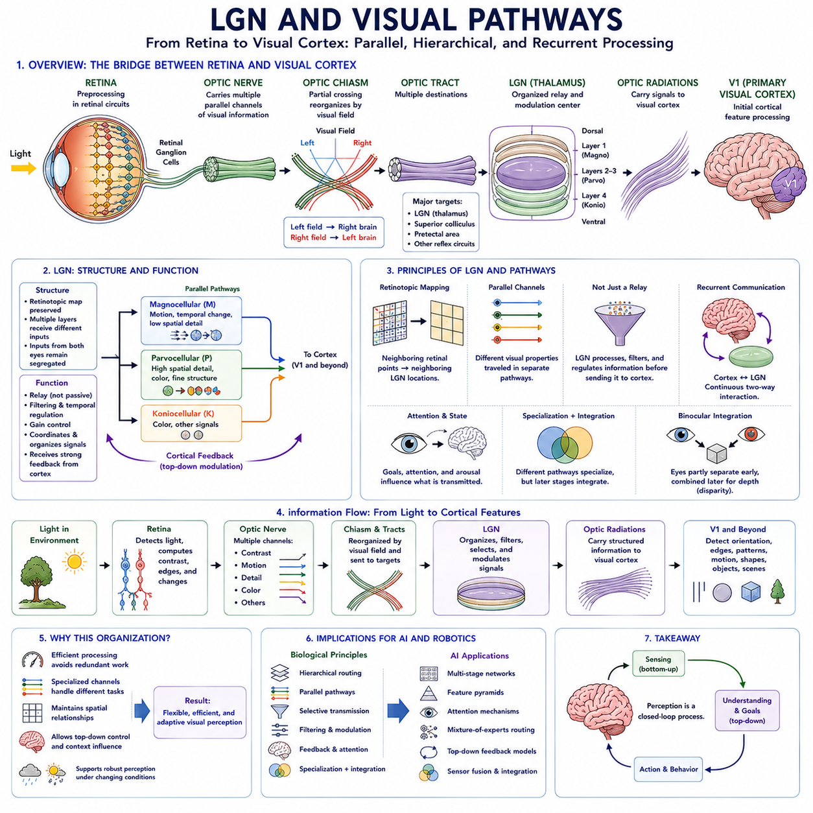{width="7.268055555555556in" height="7.268055555555556in"}

The lateral geniculate nucleus, or LGN, is a major thalamic structure positioned between the retina and the primary visual cortex. It receives organized visual signals from retinal ganglion cells and distributes them toward cortical visual areas while also receiving extensive feedback from the cortex. Within the chapter structure, it forms the critical bridge between retinal preprocessing and cortical feature extraction.

Visual information leaving the retina travels through the axons of retinal ganglion cells, which collectively form the optic nerve. These axons carry multiple parallel channels containing information about contrast, spatial detail, temporal change, and other visual properties. The optic nerve therefore does not transmit a raw image but carries structured neural signals already transformed by retinal circuits.

The optic nerves from the two eyes meet at the optic chiasm, where some retinal fibers cross to the opposite side of the brain. This partial crossing reorganizes visual information according to visual-field location rather than according to which eye received the light. As a result, information from the left visual field is primarily directed toward the right hemisphere, while the right visual field is primarily directed toward the left hemisphere.

After the optic chiasm, visual fibers continue through the optic tracts toward several brain targets. A major destination is the LGN of the thalamus, although other pathways contribute to functions such as eye movements, orientation, and reflexive visual behavior. This branching demonstrates that vision is distributed across several neural routes rather than relying on a single pathway from the retina to visual cortex.

The LGN preserves an orderly representation of visual space. Neighboring retinal locations tend to project to corresponding neighboring regions, maintaining a retinotopic organization that helps preserve spatial relationships in the visual field. This structured mapping enables later cortical systems to process spatially organized visual information without reconstructing spatial relationships from completely unordered signals.

The LGN contains multiple layers that receive different categories of retinal input. Magnocellular pathways are particularly associated with temporal changes, motion-related information, and relatively coarse spatial structure, whereas parvocellular pathways provide stronger support for fine spatial detail and color-related information. Additional koniocellular pathways contribute other visual signals, creating several parallel channels for cortical processing.

These pathways should not be interpreted as completely independent systems. Visual perception ultimately depends on interactions among many channels, and their signals converge and influence one another at later stages. Nevertheless, parallel organization allows specialized information to remain available long enough for different downstream circuits to emphasize motion, form, color, contrast, or spatial detail according to computational requirements.

The LGN is sometimes described as a visual relay, but this description can underestimate its function. It does not simply forward every retinal spike unchanged toward the cortex. LGN neurons participate in filtering, temporal regulation, gain control, and coordination of visual signals. Their responses are influenced by the current state of the nervous system, demonstrating that sensory transmission itself can be dynamically regulated.

An important feature of the LGN is that it receives substantial feedback from the visual cortex. Cortical signals can influence how thalamic visual information is transmitted, meaning that communication between the thalamus and cortex is strongly recurrent. Visual processing therefore involves continuous interaction between incoming sensory evidence and higher-level neural activity rather than a purely bottom-up sequence.

Attention and behavioral state can also influence thalamocortical processing. When particular regions or visual features become relevant to current behavior, neural systems can modify how incoming information is prioritized or transmitted. This suggests that early visual pathways are embedded within a broader cognitive system in which sensory processing can depend on goals, attention, arousal, and ongoing activity.

From the LGN, visual information travels primarily through optic radiations toward the primary visual cortex, or V1, in the occipital lobe. The organization of these pathways continues to preserve visual-field relationships. V1 receives these structured inputs and performs additional transformations that produce neural responses sensitive to orientation, contrast, spatial position, and spatial frequency.

The transition from the LGN to V1 therefore represents more than movement between anatomical structures. It marks a progression from retinal and thalamic representations toward cortical feature processing. Information that initially reflects local luminance differences and parallel retinal channels becomes integrated into increasingly structured representations that support edges, contours, shapes, motion, and eventually object and scene understanding.

Binocular information becomes increasingly important across these pathways. Although signals from the two eyes remain partly separated at early stages, cortical circuits can combine corresponding information from both eyes. Differences between the two retinal images provide binocular disparity cues that contribute to depth perception. The visual system thus progressively integrates initially separated sensory channels into richer representations of three-dimensional space.

Visual pathways also preserve a balance between specialization and integration. Separate channels carry different forms of information, but higher stages combine these signals to support coherent perception. Such an architecture reduces the need for every neural pathway to compute every property simultaneously and allows specialized processing to coexist with later multimodal and contextual integration.

The LGN and visual pathways demonstrate that biological sensory systems use hierarchical communication without relying on a simple one-way hierarchy. Retina, thalamus, and cortex participate in feedforward signaling, but cortical feedback, attention, recurrent interactions, and state-dependent modulation continuously reshape information flow. Hierarchy in biological vision is therefore structured, distributed, and recurrent at the same time.

This organization provides useful concepts for artificial vision systems. Early processing stages can preserve specialized feature channels, intermediate modules can filter or regulate information, and higher layers can combine local signals into increasingly abstract representations. Similar principles appear in multi-stage neural networks, feature pyramids, attention mechanisms, hierarchical encoders, and architectures that selectively route information between computational stages.

However, an artificial feature map should not be treated as a direct equivalent of an LGN layer, and a deep-network stage is not a literal model of the thalamus. Biological visual pathways operate through spikes, recurrent thalamocortical loops, diverse cell types, neuromodulation, and continuous interaction with behavior. The useful comparison lies in computational principles such as structured routing, parallel channels, filtering, hierarchy, and feedback.

For physical AI, these principles are relevant when visual information must move efficiently from sensors toward increasingly complex perception systems. Camera or event-sensor outputs may first pass through preprocessing and filtering, then through feature extraction, fusion, world modeling, and planning modules. Maintaining specialized pathways for motion, depth, appearance, or uncertainty can reduce unnecessary computation while preserving task-relevant information.

Visual processing in robots can also benefit from feedback between high-level interpretation and earlier perception. A planner expecting an obstacle, manipulator, or target object can influence where sensing resources or attention should be concentrated. This resembles the broader thalamocortical principle that perception is not merely driven by incoming data but can be dynamically shaped by task context and behavioral goals.

The LGN and associated visual pathways therefore illustrate how the nervous system transforms retinal outputs into organized cortical inputs through spatial mapping, parallel channels, selective transmission, and recurrent feedback. This stage connects retinal computation with the V1 mechanisms examined next in the visual hierarchy, where orientation, edges, and increasingly structured visual features become central topics.

외측슬상핵(Lateral Geniculate Nucleus, LGN)은 망막(Retina)과 일차시각피질(Primary Visual Cortex) 사이에 위치하는 주요 시상(Thalamus) 구조입니다. 외측슬상핵은 망막신경절세포(Retinal Ganglion Cell)로부터 조직화된 시각 신호를 받아 피질 시각 영역(Cortical Visual Area)으로 전달하는 동시에 대뇌피질(Cortex)로부터 광범위한 피드백(Feedback)을 받습니다. 전체 구조에서 이는 망막 전처리(Retinal Preprocessing)와 피질 특징 추출(Cortical Feature Extraction)을 연결하는 핵심적인 가교 역할을 합니다.

망막을 떠나는 시각 정보는 망막신경절세포의 축삭(Axon)을 통해 전달되며, 이러한 축삭들이 모여 시신경(Optic Nerve)을 형성합니다. 이 축삭들은 대비(Contrast), 공간적 세부 정보(Spatial Detail), 시간적 변화(Temporal Change), 기타 시각 특성에 관한 정보를 포함하는 여러 병렬 채널(Parallel Channel)을 전달합니다. 따라서 시신경은 원시 이미지(Raw Image)를 그대로 전달하는 것이 아니라 망막 회로에 의해 이미 변환된 구조화된 신경 신호(Structured Neural Signal)를 전달합니다.

두 눈에서 나온 시신경은 시신경교차(Optic Chiasm)에서 만나며, 이곳에서 일부 망막 신경섬유가 반대쪽 뇌로 교차합니다. 이러한 부분 교차(Partial Crossing)는 어느 눈에서 빛을 받았는지가 아니라 시야 위치(Visual-Field Location)를 기준으로 시각 정보를 재구성합니다. 그 결과 좌측 시야의 정보는 주로 우측 대뇌반구(Right Hemisphere)로 전달되고, 우측 시야의 정보는 주로 좌측 대뇌반구(Left Hemisphere)로 전달됩니다.

시신경교차를 지난 뒤 시각 신경섬유는 시삭(Optic Tract)을 따라 여러 뇌 영역으로 전달됩니다. 주요 목적지 가운데 하나가 시상의 외측슬상핵이지만, 다른 경로들은 안구 운동(Eye Movement), 방향 설정(Orientation), 반사적 시각 행동(Reflexive Visual Behavior)과 같은 기능에도 관여합니다. 이러한 분기는 시각이 망막에서 시각피질로 이어지는 하나의 단일 경로가 아니라 여러 신경 경로에 분산되어 있음을 보여줍니다.

외측슬상핵은 시각 공간(Visual Space)의 질서 있는 표현을 유지합니다. 서로 인접한 망막 위치는 대체로 서로 인접한 외측슬상핵 영역으로 투사되어 망막위상적 조직(Retinotopic Organization)을 유지합니다. 이러한 구조화된 매핑(Mapping)은 이후의 피질 시스템이 완전히 무질서한 신호로부터 공간 관계를 다시 구성하지 않고도 공간적으로 조직된 시각 정보를 처리할 수 있도록 합니다.

외측슬상핵은 서로 다른 종류의 망막 입력을 받는 여러 층(Layer)을 포함합니다. 대세포 경로(Magnocellular Pathway)는 특히 시간적 변화, 움직임 관련 정보(Motion-Related Information), 비교적 거친 공간 구조(Coarse Spatial Structure)와 관련되고, 소세포 경로(Parvocellular Pathway)는 세밀한 공간 정보(Fine Spatial Detail)와 색상 관련 정보(Color-Related Information)를 더 강하게 지원합니다. 추가적으로 코니오세포 경로(Koniocellular Pathway)는 다른 종류의 시각 신호를 전달하여 피질 처리를 위한 여러 병렬 채널을 형성합니다.

이러한 경로들을 완전히 독립적인 시스템으로 이해해서는 안 됩니다. 실제 시각적 지각(Visual Perception)은 여러 채널 사이의 상호작용에 의존하며, 이들의 신호는 이후 단계에서 서로 수렴(Convergence)하고 영향을 주고받습니다. 그럼에도 병렬적 조직(Parallel Organization)은 서로 다른 하위 회로가 계산 요구에 따라 움직임, 형태(Form), 색상, 대비, 공간적 세부 정보를 강조할 수 있도록 특수화된 정보를 충분히 유지합니다.

외측슬상핵은 때때로 시각 중계기(Visual Relay)로 설명되지만, 이러한 표현만으로는 실제 기능을 충분히 설명하기 어렵습니다. 외측슬상핵은 모든 망막 스파이크(Spike)를 변형 없이 그대로 피질로 전달하는 것이 아닙니다. 외측슬상핵 뉴런은 필터링(Filtering), 시간적 조절(Temporal Regulation), 이득 조절(Gain Control), 시각 신호의 조정(Coordination)에 참여합니다. 또한 그 반응은 현재 신경계 상태의 영향을 받으며, 감각 정보 전달 자체가 동적으로 조절될 수 있음을 보여줍니다.

외측슬상핵의 중요한 특징 가운데 하나는 시각피질로부터 상당한 양의 피드백을 받는다는 점입니다. 피질 신호(Cortical Signal)는 시상의 시각 정보가 어떻게 전달되는지에 영향을 줄 수 있으며, 이는 시상과 피질 사이의 통신이 강한 순환 구조(Recurrent Structure)를 가진다는 것을 의미합니다. 따라서 시각 처리는 단순한 상향식(Bottom-Up) 정보 흐름이 아니라 유입되는 감각 증거와 상위 수준의 신경 활동이 지속적으로 상호작용하는 과정입니다.

주의(Attention)와 행동 상태(Behavioral State) 역시 시상-피질 처리(Thalamocortical Processing)에 영향을 줄 수 있습니다. 특정 위치나 시각 특징이 현재 행동에 중요해지면 신경계는 해당 정보가 우선적으로 처리되거나 전달되는 방식을 조절할 수 있습니다. 이는 초기 시각 경로가 고립된 감각 처리 시스템이 아니라 목표, 주의, 각성(Arousal), 현재 활동의 영향을 받는 더 광범위한 인지 시스템(Cognitive System)에 포함되어 있음을 보여줍니다.

외측슬상핵에서 나온 시각 정보는 주로 시방사(Optic Radiation)를 통해 후두엽(Occipital Lobe)의 일차시각피질, 즉 V1으로 전달됩니다. 이러한 경로의 조직은 시야의 공간적 관계를 계속 유지합니다. V1은 구조화된 입력을 받아 방향(Orientation), 대비, 공간적 위치(Spatial Position), 공간 주파수(Spatial Frequency)에 민감한 신경 반응을 추가로 생성합니다.

따라서 외측슬상핵에서 V1으로의 전환은 단순한 해부학적 구조 사이의 이동만을 의미하지 않습니다. 이는 망막 및 시상 수준의 표현에서 피질 특징 처리(Cortical Feature Processing)로 발전하는 중요한 단계입니다. 초기에는 국소적인 휘도 차이(Local Luminance Difference)와 병렬 망막 채널을 반영하던 정보가 점차 통합되어 에지(Edge), 윤곽(Contour), 형태(Shape), 움직임(Motion), 그리고 궁극적으로 객체 및 장면 이해(Object and Scene Understanding)를 지원하는 구조화된 표현으로 발전합니다.

양안 정보(Binocular Information)는 이러한 경로를 따라 진행하면서 점차 중요해집니다. 초기 단계에서는 두 눈에서 전달된 신호가 부분적으로 분리되어 있지만, 피질 회로는 양쪽 눈에서 들어온 대응 정보를 결합할 수 있습니다. 두 망막 이미지 사이의 차이는 양안 시차(Binocular Disparity)에 관한 단서를 제공하여 깊이 지각(Depth Perception)에 기여합니다. 따라서 시각 시스템은 처음에는 분리된 감각 채널을 점차 통합하여 더 풍부한 3차원 공간 표현(Three-Dimensional Spatial Representation)을 구성합니다.

시각 경로는 전문화(Specialization)와 통합(Integration) 사이의 균형도 유지합니다. 서로 다른 채널은 서로 다른 유형의 정보를 전달하지만, 이후 단계는 이러한 신호를 결합하여 일관된 지각(Coherent Perception)을 지원합니다. 이러한 아키텍처는 모든 신경 경로가 모든 시각적 특성을 동시에 계산할 필요를 줄이고, 전문화된 처리와 이후의 멀티모달(Multimodal) 및 맥락적 통합(Contextual Integration)이 함께 존재할 수 있도록 합니다.

외측슬상핵과 시각 경로는 생물학적 감각 시스템이 단순한 단방향 계층구조에 의존하지 않으면서도 계층적 통신(Hierarchical Communication)을 사용한다는 사실을 보여줍니다. 망막, 시상, 피질은 순방향 신호 전달(Feedforward Signaling)에 참여하지만, 피질 피드백(Cortical Feedback), 주의, 순환 상호작용(Recurrent Interaction), 상태 의존적 조절(State-Dependent Modulation)은 지속적으로 정보 흐름을 변화시킵니다. 따라서 생물학적 시각의 계층은 동시에 구조화되고, 분산되며, 순환적입니다.

이러한 조직은 인공 시각 시스템(Artificial Vision System)에 유용한 개념을 제공합니다. 초기 처리 단계는 특수화된 특징 채널(Feature Channel)을 유지할 수 있고, 중간 모듈(Intermediate Module)은 정보를 필터링하거나 조절할 수 있으며, 상위 계층은 국소 신호를 점차 추상적인 표현으로 결합할 수 있습니다. 유사한 원리는 다단계 신경망(Multi-Stage Neural Network), 특징 피라미드(Feature Pyramid), 어텐션 메커니즘(Attention Mechanism), 계층적 인코더(Hierarchical Encoder), 계산 단계 사이에서 정보를 선택적으로 전달하는 아키텍처에서 나타납니다.

그러나 인공 특징맵(Artificial Feature Map)을 외측슬상핵의 특정 층과 직접 동일시해서는 안 되며, 딥러닝 네트워크의 한 단계도 시상을 문자 그대로 모델링한 것은 아닙니다. 생물학적 시각 경로는 스파이크, 순환적 시상-피질 루프(Recurrent Thalamocortical Loop), 다양한 세포 유형, 신경조절(Neuromodulation), 행동과의 지속적인 상호작용을 통해 작동합니다. 유용한 비교는 구조화된 라우팅(Structured Routing), 병렬 채널, 필터링, 계층, 피드백과 같은 계산 원리에서 찾을 수 있습니다.

피지컬 인공지능(Physical AI)에서는 시각 정보가 센서에서 점차 복잡한 지각 시스템으로 효율적으로 전달되어야 하므로 이러한 원리가 특히 중요합니다. 카메라(Camera)나 이벤트 센서(Event Sensor)의 출력은 먼저 전처리와 필터링을 거친 뒤 특징 추출(Feature Extraction), 센서 융합(Fusion), 월드 모델링(World Modeling), 계획(Planning) 모듈로 전달될 수 있습니다. 움직임, 깊이, 외형(Appearance), 불확실성(Uncertainty)을 위한 특수화된 경로를 유지하면 작업 관련 정보를 보존하면서 불필요한 계산을 줄일 수 있습니다.

로봇의 시각 처리 역시 고차원 해석(Higher-Level Interpretation)과 초기 지각 사이의 피드백을 활용할 수 있습니다. 계획기(Planner)가 장애물, 조작 대상(Manipulator Target), 특정 객체의 존재를 예상하고 있다면 센싱 자원(Sensing Resource)이나 주의를 어디에 집중할지 조절할 수 있습니다. 이는 지각이 단순히 들어오는 데이터에 의해 결정되는 것이 아니라 작업 맥락(Task Context)과 행동 목표(Behavioral Goal)에 의해 동적으로 형성될 수 있다는 보다 넓은 시상-피질 원리와 유사합니다.

따라서 외측슬상핵(LGN)과 관련 시각 경로(Visual Pathway)는 신경계가 공간적 매핑(Spatial Mapping), 병렬 채널, 선택적 전달(Selective Transmission), 순환 피드백(Recurrent Feedback)을 통해 망막 출력을 조직화된 피질 입력(Cortical Input)으로 변환하는 방식을 보여줍니다. 이 단계는 망막 계산과 다음 단계의 V1 메커니즘을 연결하며, 이후 시각 계층에서는 방향, 에지, 점차 구조화되는 시각 특징(Visual Feature)이 핵심적인 주제로 발전합니다.

##  

## 02.03 V1 Edge and Orientation Detection [w/Code]

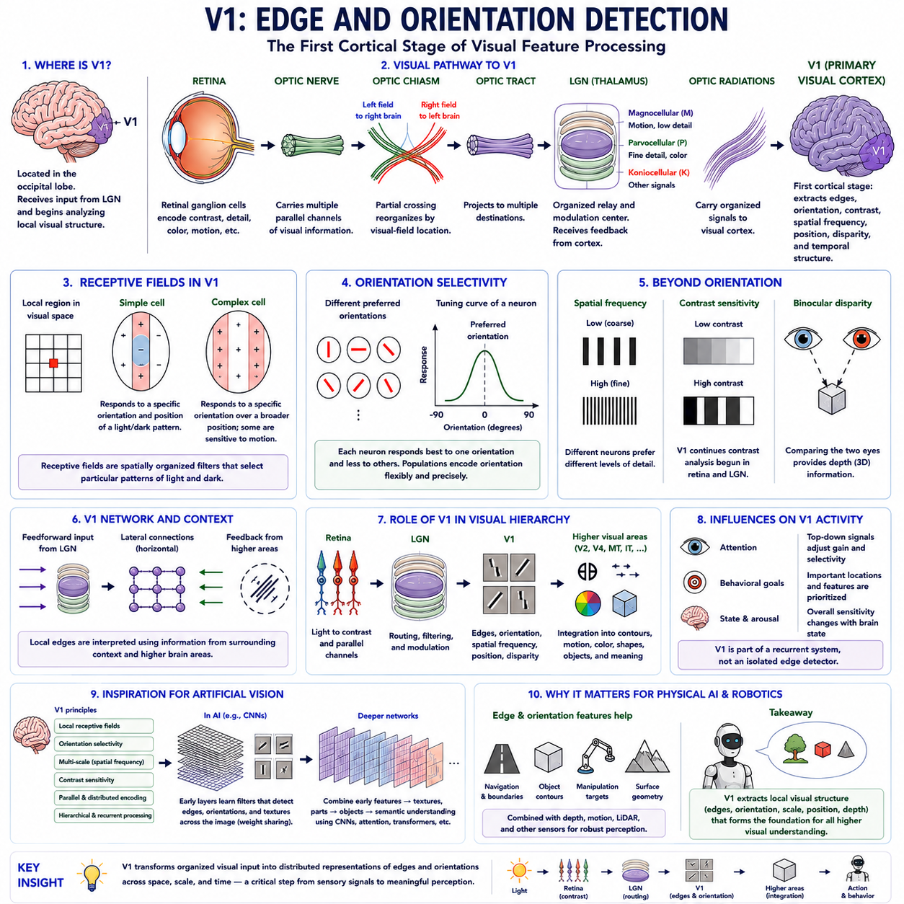{width="7.268055555555556in" height="7.268055555555556in"}

The primary visual cortex, commonly called V1, represents the first major cortical stage of visual processing. Located in the occipital lobe, V1 receives highly organized input from the lateral geniculate nucleus and transforms it into representations of local visual structure. Rather than encoding complete objects directly, V1 emphasizes fundamental properties such as edges, orientation, contrast, position, and spatial frequency.

Visual information reaching V1 retains the retinotopic organization established in earlier visual pathways. Neighboring locations in the visual field are generally represented by neighboring cortical regions, creating a spatial map of incoming information. This organization allows local visual relationships to remain available during cortical processing while enabling different neural populations to analyze specific portions of the visual scene in parallel.

The concept of a receptive field remains central to understanding V1 computation. Each V1 neuron responds preferentially to stimulation within a particular region of visual space, but its response depends on more than simple illumination. Many neurons are sensitive to specific arrangements of light and dark, allowing them to respond selectively to oriented boundaries, lines, bars, or edges appearing within their receptive fields.

Edge detection is important because boundaries frequently indicate changes between surfaces, objects, textures, illumination conditions, or depth regions. A visual system that responds strongly to such transitions can represent important scene structure without preserving every luminance value equally. V1 therefore continues the transformation begun in the retina, moving from local contrast signals toward more structured descriptions of visual geometry.

Orientation selectivity is one of the best-known properties of neurons in V1. Particular neurons may respond strongly when an edge or elongated stimulus appears at a preferred orientation, such as vertical, horizontal, or diagonal, while responding less strongly to other orientations. Populations of differently tuned neurons collectively provide a distributed representation of local orientation across the visual field.

Orientation-selective responses can emerge through the structured combination of earlier visual inputs. Signals originating from retinal and LGN receptive fields can converge onto cortical neurons in spatial arrangements that favor particular orientations. When appropriately positioned inputs become active together, the receiving neuron responds strongly to an aligned visual pattern. This illustrates how more complex features can emerge by combining simpler representations.

Simple cells provide a classical example of orientation-sensitive processing in V1. Their receptive fields contain spatially organized excitatory and inhibitory regions, making their responses dependent on both the orientation and position of a stimulus. A properly aligned edge or bar can activate the receptive field effectively, whereas shifting or rotating the same pattern may substantially reduce the neuronal response.

Complex cells exhibit greater tolerance to the exact position of an oriented feature within their receptive fields. They can respond to an edge with a preferred orientation across a broader local region and may also show sensitivity to movement direction. Functionally, this provides a degree of spatial invariance, allowing relevant visual structure to remain detectable despite small changes in where the feature appears.

The distinction between simple and complex cells illustrates a broader principle of hierarchical visual processing. Neural circuits can combine outputs from earlier units to produce representations that are simultaneously more complex and more tolerant of variation. Repeated across multiple stages, this principle can support progression from local contrast and edges toward contours, shapes, surfaces, objects, and eventually meaningful visual categories.

V1 contains neurons tuned not only to orientation but also to spatial frequency. Spatial frequency describes how rapidly visual intensity changes across space and can distinguish broad structures from fine patterns. Different neural populations therefore provide information at multiple spatial scales. Combining coarse and fine visual information helps the nervous system represent both large structural organization and detailed local features.

Contrast strongly influences V1 responses because cortical neurons receive signals that have already undergone substantial contrast-sensitive processing in the retina and LGN. V1 further analyzes these signals according to orientation, spatial scale, and location. Consequently, cortical representation is increasingly concerned with relationships and structure rather than absolute brightness, supporting robust perception under varying illumination conditions.

Orientation information is distributed across populations rather than being represented by a single detector for each possible edge. Individual neurons possess tuning curves, responding most strongly near preferred orientations while still responding to nearby orientations with reduced strength. Population activity can therefore encode visual orientation with greater flexibility and precision than would be possible through strictly binary feature detectors.

V1 organization includes systematic relationships among neurons with different response properties. Nearby cortical neurons may share related preferences, while orientation preferences vary across local cortical organization. Combined with retinotopic mapping, this creates a structured representation in which spatial location and feature selectivity coexist. Visual information is therefore represented simultaneously according to where a feature occurs and what local properties it possesses.

Processing in V1 is not exclusively feedforward. Although LGN signals provide important bottom-up input, V1 receives extensive feedback from higher visual and cortical areas. Horizontal connections within the cortex also link neurons across nearby regions. These recurrent and lateral interactions allow context surrounding a local edge or orientation to influence neural responses, making feature processing dependent on broader visual structure.

Context is important because an isolated local edge can be ambiguous. The same local pattern might belong to an object boundary, texture, shadow, or background structure. Interactions across cortical regions allow information from neighboring features to support contour integration and contextual interpretation. Early cortical vision therefore provides structured evidence that later stages can combine rather than making complete object-level decisions independently.

V1 also processes information from both eyes. Neural circuits can compare and combine corresponding visual signals, and some neurons exhibit sensitivity to binocular disparity. Because the two eyes observe the world from slightly different positions, disparities between their images contain information about relative depth. Thus, early cortical feature processing contributes not only to edge representation but also to construction of three-dimensional spatial information.

Temporal properties remain important in V1 because natural visual input continuously changes. Some neurons respond differently depending on temporal frequency, motion, or changes in local visual patterns. Although specialized motion processing becomes particularly important in later visual areas, V1 supplies essential local orientation and temporal signals from which more sophisticated motion representations can subsequently be constructed.

Attention can influence activity even at relatively early cortical stages. When a particular location or feature becomes behaviorally relevant, top-down signals can modify the gain or effectiveness of visual responses. V1 should therefore not be regarded as an isolated edge-processing module. Its computations occur within a recurrent brain system in which sensory evidence, attention, context, and behavioral goals interact.

The computational principles observed in V1 strongly influenced artificial computer vision. Local receptive fields and orientation-sensitive feature extraction contributed to the conceptual development of convolutional neural networks. Early CNN layers frequently learn filters that respond to edges, gradients, orientations, textures, and related local patterns, producing representations that resemble some functional principles of early cortical visual processing.

Convolution provides an efficient engineering mechanism for applying learned local filters across an image. A filter that detects a useful edge or texture can be reused at many spatial locations through weight sharing. Biological V1 does not implement digital convolution in the mathematical sense, but both systems demonstrate the computational value of local receptive fields and repeated extraction of structured spatial features.

Deeper artificial vision networks extend this principle by combining early features into progressively more complex representations. Edge-like responses can contribute to textures and contours, which can support parts and object-level representations. Modern networks may use convolution, attention, transformers, or hybrid architectures, but hierarchical feature construction remains an important strategy for transforming raw sensory input into useful semantic representations.

For physical AI, edge and orientation information remains valuable even when sophisticated deep visual models are available. Boundaries help identify obstacles, surfaces, structural geometry, traversable regions, object contours, and manipulation targets. When combined with depth, motion, LiDAR, and other sensor information, local visual structure contributes to robust geometric understanding required for navigation and interaction.

V1 also provides an important lesson about distributed representation. Intelligent perception does not require each neuron or computational unit to represent a complete object or concept. Useful environmental understanding can emerge when many specialized units encode complementary properties and later systems integrate their activity. This principle extends naturally to AI architectures composed of multiple feature channels, attention modules, and hierarchical representations.

Another important lesson is the relationship between specialization and invariance. Orientation-selective neurons provide precise sensitivity to local structure, while subsequent combinations can increase tolerance to changes in position, scale, viewpoint, or appearance. Artificial vision faces the same requirement: it must preserve information needed to distinguish important structures while becoming insensitive to variations that should not change their meaning.

V1 edge and orientation processing therefore represents a major transition from organized sensory transmission toward cortical feature extraction. Retinal contrast processing and LGN routing provide structured inputs, while V1 transforms them into distributed representations of orientation, edges, spatial frequency, position, disparity, and temporal structure. These representations form an essential foundation for the progressively richer visual processing performed by higher cortical areas.

일차시각피질(Primary Visual Cortex), 일반적으로 V1이라고 불리는 영역은 시각 처리(Visual Processing)의 첫 번째 주요 피질 단계(Cortical Stage)를 나타냅니다. 후두엽(Occipital Lobe)에 위치한 V1은 외측슬상핵(Lateral Geniculate Nucleus, LGN)으로부터 고도로 조직화된 입력을 받아 국소적인 시각 구조(Local Visual Structure)의 표현으로 변환합니다. V1은 완전한 객체를 직접 부호화하기보다는 에지(Edge), 방향(Orientation), 대비(Contrast), 위치(Position), 공간 주파수(Spatial Frequency)와 같은 기본적인 특성을 강조합니다.

V1에 도달하는 시각 정보는 이전 시각 경로에서 형성된 망막위상적 조직(Retinotopic Organization)을 유지합니다. 시야(Visual Field)에서 서로 인접한 위치는 일반적으로 서로 인접한 피질 영역에 표현되어 유입되는 정보의 공간적 지도(Spatial Map)를 형성합니다. 이러한 조직을 통해 국소적인 시각 관계가 피질 처리 과정에서도 유지되는 동시에 서로 다른 뉴런 집단(Neural Population)이 시각 장면의 특정 영역을 병렬적으로 분석할 수 있습니다.

수용장(Receptive Field)의 개념은 V1의 계산을 이해하는 데 여전히 핵심적인 역할을 합니다. 각각의 V1 뉴런은 시각 공간의 특정 영역에서 발생하는 자극에 선택적으로 반응하지만, 그 반응은 단순한 조명만으로 결정되지 않습니다. 많은 뉴런은 빛과 어둠의 특정한 배열에 민감하기 때문에 수용장 내부에 나타나는 특정 방향의 경계(Boundary), 선(Line), 막대(Bar), 에지에 선택적으로 반응할 수 있습니다.

에지 검출(Edge Detection)이 중요한 이유는 경계가 표면(Surface), 객체(Object), 텍스처(Texture), 조명 조건(Illumination Condition), 깊이 영역(Depth Region) 사이의 변화를 나타내는 경우가 많기 때문입니다. 이러한 전이에 강하게 반응하는 시각 시스템은 모든 휘도값(Luminance Value)을 동일하게 보존하지 않고도 중요한 장면 구조(Scene Structure)를 표현할 수 있습니다. 따라서 V1은 망막에서 시작된 변환을 계속 진행하여 국소 대비 신호를 보다 구조화된 시각적 기하 표현(Visual Geometry Representation)으로 발전시킵니다.

방향 선택성(Orientation Selectivity)은 V1 뉴런에서 가장 잘 알려진 특성 가운데 하나입니다. 특정 뉴런은 수직(Vertical), 수평(Horizontal), 대각선(Diagonal)과 같은 선호 방향(Preferred Orientation)의 에지나 길쭉한 자극이 나타날 때 강하게 반응하고, 다른 방향에서는 상대적으로 약하게 반응할 수 있습니다. 서로 다른 방향에 조율된 뉴런 집단은 시야 전체의 국소 방향을 분산 표현(Distributed Representation) 방식으로 나타냅니다.

방향 선택적 반응(Orientation-Selective Response)은 초기 시각 입력이 구조적으로 결합되면서 형성될 수 있습니다. 망막과 외측슬상핵의 수용장에서 시작된 신호가 특정 방향을 선호하는 공간적 배열로 피질 뉴런에 수렴(Convergence)할 수 있습니다. 적절하게 배치된 입력이 동시에 활성화되면 해당 뉴런은 정렬된 시각 패턴(Aligned Visual Pattern)에 강하게 반응합니다. 이는 단순한 표현을 결합함으로써 더 복잡한 특징(Feature)이 출현할 수 있음을 보여줍니다.

단순세포(Simple Cell)는 V1에서 방향에 민감한 처리의 고전적인 사례를 제공합니다. 단순세포의 수용장에는 공간적으로 조직된 흥분성 영역(Excitatory Region)과 억제성 영역(Inhibitory Region)이 존재하므로 반응은 자극의 방향과 위치 모두에 영향을 받습니다. 적절하게 정렬된 에지나 막대는 수용장을 효과적으로 활성화하지만, 동일한 패턴의 위치를 이동하거나 회전시키면 뉴런의 반응이 크게 감소할 수 있습니다.

복합세포(Complex Cell)는 수용장 내부에서 방향 특징의 정확한 위치에 대해 더 높은 허용성(Tolerance)을 나타냅니다. 복합세포는 더 넓은 국소 영역에서 선호 방향을 가진 에지에 반응할 수 있으며, 일부는 운동 방향(Direction of Motion)에 대한 민감성도 나타냅니다. 기능적으로 이는 일정 수준의 공간적 불변성(Spatial Invariance)을 제공하여 특징의 위치가 조금 변하더라도 중요한 시각 구조를 계속 탐지할 수 있도록 합니다.

단순세포와 복합세포의 차이는 계층적 시각 처리(Hierarchical Visual Processing)의 보다 광범위한 원리를 보여줍니다. 신경회로는 이전 단계의 출력들을 결합하여 더 복잡하면서 동시에 변화에 더 높은 허용성을 갖는 표현을 생성할 수 있습니다. 이러한 원리가 여러 단계에서 반복되면 국소 대비와 에지에서 윤곽(Contour), 형태(Shape), 표면, 객체, 그리고 궁극적으로 의미 있는 시각 범주(Visual Category)로 발전하는 과정을 지원할 수 있습니다.

V1에는 방향뿐만 아니라 공간 주파수(Spatial Frequency)에 조율된 뉴런도 존재합니다. 공간 주파수는 시각적 밝기가 공간에 따라 얼마나 빠르게 변화하는지를 나타내며, 넓고 거친 구조와 세밀한 패턴을 구분할 수 있습니다. 따라서 서로 다른 뉴런 집단은 여러 공간적 규모(Spatial Scale)의 정보를 제공합니다. 거친 시각 정보와 세밀한 시각 정보를 결합하면 신경계는 대규모 구조적 조직과 세부적인 국소 특징을 모두 표현할 수 있습니다.

대비(Contrast)는 V1의 반응에 강한 영향을 미칩니다. 피질 뉴런은 이미 망막과 외측슬상핵에서 상당한 대비 민감 처리(Contrast-Sensitive Processing)를 거친 신호를 입력으로 받기 때문입니다. V1은 이러한 신호를 방향, 공간적 규모, 위치에 따라 추가로 분석합니다. 결과적으로 피질 표현(Cortical Representation)은 절대적인 밝기보다 관계와 구조를 점점 더 중요하게 처리하며, 변화하는 조명 조건에서도 강건한 지각(Robust Perception)을 지원합니다.

방향 정보(Orientation Information)는 가능한 각각의 에지를 담당하는 하나의 검출기(Detector)에 의해 표현되는 것이 아니라 뉴런 집단 전체에 분산되어 표현됩니다. 개별 뉴런은 조율 곡선(Tuning Curve)을 가지며 선호 방향 근처에서 가장 강하게 반응하지만, 인접한 방향에도 감소된 강도로 반응합니다. 따라서 집단 활동(Population Activity)은 엄격한 이진 특징 검출기(Binary Feature Detector)보다 더 유연하고 정밀하게 시각적 방향을 부호화할 수 있습니다.

V1의 조직에는 서로 다른 반응 특성을 갖는 뉴런 사이의 체계적인 관계가 포함됩니다. 서로 가까이 위치한 피질 뉴런은 관련된 선호 특성을 공유할 수 있으며, 방향 선호도(Orientation Preference)는 국소적인 피질 조직에 따라 변화합니다. 이러한 구조가 망막위상적 매핑(Retinotopic Mapping)과 결합되면서 공간적 위치와 특징 선택성(Feature Selectivity)이 함께 존재하는 구조화된 표현이 만들어집니다. 따라서 시각 정보는 특징이 어디에서 발생했는지와 어떤 국소적 특성을 갖는지를 동시에 표현합니다.

V1의 처리는 순방향(Feedforward) 과정에만 국한되지 않습니다. 외측슬상핵 신호가 중요한 상향식 입력(Bottom-Up Input)을 제공하지만, V1은 상위 시각 영역과 다른 피질 영역으로부터 광범위한 피드백을 받습니다. 피질 내부의 수평 연결(Horizontal Connection) 역시 인접 영역의 뉴런을 연결합니다. 이러한 순환적·측면적 상호작용(Recurrent and Lateral Interaction)을 통해 국소 에지나 방향 주변의 맥락(Context)이 뉴런 반응에 영향을 줄 수 있으며, 특징 처리가 더 넓은 시각 구조에 의존하도록 만듭니다.

맥락(Context)이 중요한 이유는 고립된 하나의 국소 에지만으로는 그 의미가 모호할 수 있기 때문입니다. 동일한 국소 패턴이 객체의 경계, 텍스처, 그림자(Shadow), 배경 구조(Background Structure)의 일부일 수 있습니다. 피질 영역 사이의 상호작용은 인접 특징으로부터 전달되는 정보를 활용하여 윤곽 통합(Contour Integration)과 맥락적 해석(Contextual Interpretation)을 지원합니다. 따라서 초기 피질 시각은 완전한 객체 수준의 판단을 독립적으로 수행하기보다 이후 단계가 결합할 수 있는 구조화된 증거(Structured Evidence)를 제공합니다.

V1은 양쪽 눈에서 전달되는 정보도 처리합니다. 신경회로는 대응하는 시각 신호를 비교하고 결합할 수 있으며, 일부 뉴런은 양안 시차(Binocular Disparity)에 대한 민감성을 나타냅니다. 두 눈은 약간 서로 다른 위치에서 세계를 관찰하기 때문에 두 이미지 사이의 시차에는 상대적 깊이(Relative Depth)에 관한 정보가 포함됩니다. 따라서 초기 피질 특징 처리는 에지 표현뿐만 아니라 3차원 공간 정보(Three-Dimensional Spatial Information)의 구성에도 기여합니다.

자연적인 시각 입력은 지속적으로 변화하기 때문에 시간적 특성(Temporal Property)도 V1에서 중요합니다. 일부 뉴런은 시간 주파수(Temporal Frequency), 움직임, 국소 시각 패턴의 변화에 따라 서로 다른 반응을 나타냅니다. 전문화된 운동 처리(Motion Processing)는 이후의 시각 영역에서 더욱 중요해지지만, V1은 보다 정교한 운동 표현을 구성하는 데 필요한 핵심적인 국소 방향 및 시간 신호를 제공합니다.

주의(Attention)는 비교적 초기 피질 단계에서도 활동에 영향을 줄 수 있습니다. 특정 위치나 특징이 행동적으로 중요해지면 하향식 신호(Top-Down Signal)가 시각 반응의 이득(Gain)이나 효율성을 조절할 수 있습니다. 따라서 V1을 고립된 에지 처리 모듈(Edge-Processing Module)로 간주해서는 안 됩니다. V1의 계산은 감각 증거(Sensory Evidence), 주의, 맥락, 행동 목표(Behavioral Goal)가 상호작용하는 순환적 뇌 시스템 안에서 수행됩니다.

V1에서 관찰되는 계산 원리(Computational Principle)는 인공 컴퓨터 비전(Artificial Computer Vision)의 발전에 큰 영향을 주었습니다. 국소 수용장(Local Receptive Field)과 방향에 민감한 특징 추출은 합성곱 신경망(Convolutional Neural Network, CNN)의 개념적 발전에 기여했습니다. CNN의 초기 계층은 흔히 에지, 그래디언트(Gradient), 방향, 텍스처 및 관련 국소 패턴에 반응하는 필터(Filter)를 학습하며, 이는 초기 피질 시각 처리의 일부 기능적 원리와 유사한 표현을 생성합니다.

합성곱(Convolution)은 학습된 국소 필터(Local Filter)를 이미지 전체에 적용할 수 있는 효율적인 공학적 메커니즘을 제공합니다. 유용한 에지나 텍스처를 검출하는 필터는 가중치 공유(Weight Sharing)를 통해 여러 공간적 위치에서 재사용될 수 있습니다. 생물학적 V1이 수학적 의미의 디지털 합성곱(Digital Convolution)을 구현하는 것은 아니지만, 두 시스템 모두 국소 수용장과 구조화된 공간 특징의 반복적 추출이 갖는 계산적 가치를 보여줍니다.

더 깊은 인공 시각 네트워크(Artificial Vision Network)는 초기 특징을 점차 복잡한 표현으로 결합함으로써 이러한 원리를 확장합니다. 에지와 유사한 반응은 텍스처와 윤곽 형성에 기여할 수 있고, 이러한 표현은 다시 부분(Part) 및 객체 수준 표현(Object-Level Representation)을 지원할 수 있습니다. 현대 네트워크는 합성곱, 어텐션(Attention), 트랜스포머(Transformer), 하이브리드 아키텍처(Hybrid Architecture)를 사용할 수 있지만, 원시 감각 입력을 유용한 의미 표현(Semantic Representation)으로 변환하는 계층적 특징 구성(Hierarchical Feature Construction)은 여전히 중요한 전략입니다.

피지컬 인공지능(Physical AI)에서는 정교한 딥러닝 시각 모델(Deep Visual Model)을 사용할 수 있는 경우에도 에지와 방향 정보가 여전히 중요합니다. 경계는 장애물(Obstacle), 표면, 구조적 기하(Structural Geometry), 주행 가능 영역(Traversable Region), 객체 윤곽(Object Contour), 조작 대상(Manipulation Target)을 식별하는 데 도움을 줍니다. 깊이, 움직임, 라이다(LiDAR), 기타 센서 정보와 결합하면 국소적인 시각 구조는 내비게이션(Navigation)과 상호작용에 필요한 강건한 기하학적 이해(Geometric Understanding)에 기여합니다.

V1은 분산 표현(Distributed Representation)의 중요성에 관한 핵심적인 교훈도 제공합니다. 지능적인 지각을 위해 각각의 뉴런이나 계산 단위가 완전한 객체 또는 개념을 표현할 필요는 없습니다. 수많은 전문화된 단위가 상호보완적인 특성을 부호화하고 이후 시스템이 이들의 활동을 통합하면 유용한 환경 이해(Environmental Understanding)가 출현할 수 있습니다. 이러한 원리는 여러 특징 채널(Feature Channel), 어텐션 모듈(Attention Module), 계층적 표현으로 구성된 AI 아키텍처에도 자연스럽게 확장됩니다.

또 다른 중요한 교훈은 전문화(Specialization)와 불변성(Invariance)의 관계입니다. 방향 선택적 뉴런은 국소 구조에 대해 정밀한 민감성을 제공하는 반면, 이후 단계에서 이러한 신호가 결합되면 위치, 크기(Scale), 시점(Viewpoint), 외형(Appearance)의 변화에 대한 허용성이 증가할 수 있습니다. 인공 시각도 동일한 요구를 갖습니다. 즉, 중요한 구조를 구분하는 데 필요한 정보는 보존하면서 그 의미를 변화시키지 않는 변형에는 민감하지 않도록 만들어야 합니다.

따라서 V1의 에지 및 방향 처리(Edge and Orientation Processing)는 조직화된 감각 전달(Organized Sensory Transmission)에서 피질 특징 추출(Cortical Feature Extraction)로 넘어가는 중요한 전환 단계를 나타냅니다. 망막의 대비 처리와 외측슬상핵의 라우팅(Routing)은 구조화된 입력을 제공하며, V1은 이를 방향, 에지, 공간 주파수, 위치, 시차(Disparity), 시간적 구조(Temporal Structure)의 분산 표현으로 변환합니다. 이러한 표현은 이후의 고차원 피질 영역(Higher Cortical Area)에서 수행되는 점차 풍부하고 복잡한 시각 처리의 핵심적인 기반을 형성합니다.

##  

## 02.04 Ventral Stream Object Recognition [w/Code]

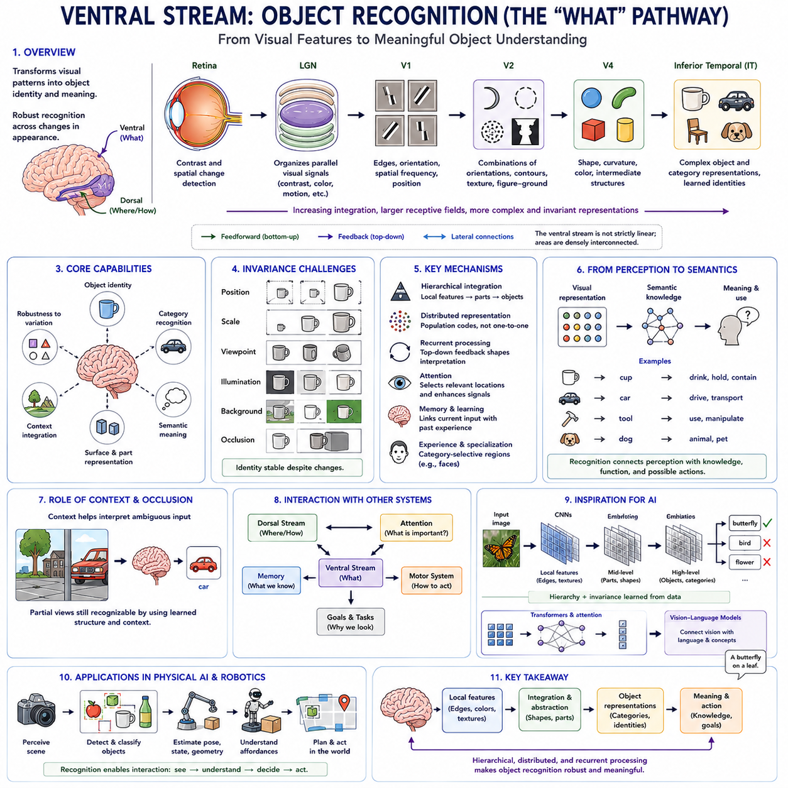{width="7.268055555555556in" height="7.268055555555556in"}

The ventral visual stream is a major cortical pathway involved in transforming visual patterns into representations that support object recognition, identification, and semantic interpretation. Often described as the "what" pathway, it extends from early visual cortex toward regions of the temporal lobe. Its processing progressively integrates local visual features into representations that allow organisms to recognize objects despite substantial changes in appearance.

Object recognition begins with representations generated by earlier visual stages. The retina emphasizes contrast and spatial change, the lateral geniculate nucleus organizes parallel visual signals, and V1 extracts properties such as edges, orientation, spatial frequency, and position. The ventral stream builds upon these relatively local features, combining them across increasingly larger regions of visual space to represent more complex structures.

Visual information progresses from V1 through interconnected cortical areas including V2 and V4 toward regions of inferior temporal cortex. This pathway should not be understood as a strictly sequential chain because extensive feedforward, lateral, and feedback connections exist between visual areas. Nevertheless, the progression provides a useful framework for understanding how representations can develop from local visual features toward increasingly complex object-related information.

V2 receives structured signals from V1 and participates in integrating local features into larger visual configurations. Neural responses can reflect combinations of orientations, contours, boundaries, textures, and figure-ground relationships. Such processing helps connect isolated edge signals into structures that may correspond to surfaces or object boundaries, providing an intermediate representation between elementary visual features and more complex forms.

V4 contributes strongly to processing shape, curvature, color, and intermediate-level visual structure. Rather than simply detecting individual edges, neural populations in this region can respond to combinations of features that describe more complex portions of objects. These representations provide information useful for distinguishing forms while maintaining sensitivity to visual properties that remain important for object identity.

As information progresses toward inferior temporal cortex, receptive fields generally become larger and neural responses can become sensitive to increasingly complex visual configurations. Some neurons respond selectively to particular combinations of shapes or object-related features. At the population level, these responses create distributed representations that can distinguish among many object categories without requiring one neuron to uniquely represent every possible object.

The inferior temporal cortex is particularly important for high-level object recognition. Neural activity in this region can reflect complex forms, object categories, and learned visual identities. Recognition emerges from patterns of activity across populations rather than from a simple lookup mechanism. These distributed codes allow multiple visual properties to contribute simultaneously to the representation of an object.

A fundamental challenge for object recognition is invariance. The retinal image of the same object changes when its position, size, orientation, illumination, background, or viewing angle changes. A useful recognition system must preserve enough information to distinguish different objects while becoming tolerant to transformations that do not alter identity. Ventral-stream processing progressively develops representations with increased tolerance to many such variations.

Position tolerance allows an object to remain recognizable when it appears at different locations in the visual field. Early visual neurons respond to relatively restricted spatial regions, whereas later ventral-stream representations can integrate information across larger receptive fields. This progression reduces dependence on exact retinal coordinates while preserving structural information needed to distinguish one object from another.

Scale variation presents a similar challenge. An object can produce dramatically different retinal image sizes depending on viewing distance, yet its identity remains stable. Hierarchical visual processing combines information across spatial scales and levels of abstraction, allowing higher representations to become less dependent on exact image dimensions. Recognition therefore depends on relationships among features rather than simply matching fixed pixel patterns.

Viewpoint variation is especially difficult because three-dimensional objects can produce very different two-dimensional projections when observed from different directions. Experience with objects and categories allows visual systems to associate multiple appearances with stable identities. Ventral processing therefore combines current sensory evidence with learned regularities, enabling recognition across a range of familiar and sometimes unfamiliar viewpoints.

Color and texture provide additional evidence for object recognition but are rarely sufficient alone. The same shape may appear under different illumination, and similar colors can occur across unrelated objects. Ventral visual processing integrates shape, contour, color, texture, and contextual information so that recognition can remain robust when individual cues become unreliable. Object identity emerges from combinations of complementary visual evidence.

Figure-ground organization is important because objects must often be separated perceptually from complex backgrounds. Boundaries, texture differences, depth cues, continuity, and contextual relationships can help determine which visual regions belong together. Ventral-stream processing interacts with other visual systems to organize these signals into candidate objects and surfaces rather than treating every local feature as an independent element.

Occlusion creates another major recognition problem. Natural objects are frequently hidden partially behind other objects or environmental structures. Humans can often recognize an object even when only a subset of its features is visible. This ability suggests that visual representations use learned structural relationships and contextual information to infer likely object identity from incomplete sensory evidence rather than requiring complete visual templates.

Visual recognition is strongly influenced by attention. Complex scenes may contain many potential objects, but processing resources can be selectively directed toward behaviorally relevant locations or features. Attention can enhance particular representations and reduce competition among alternatives. Consequently, object recognition is not completely independent of goals; what an observer seeks can influence which visual information becomes dominant during processing.

Memory is equally important because recognition requires relationships between current sensory input and previously learned representations. Repeated experience modifies neural responses so that familiar visual patterns become associated with stable categories, identities, and meanings. Ventral-stream processing therefore interacts with memory systems, allowing visual patterns to become connected with knowledge about what objects are and how they have been encountered before.

Semantic knowledge extends recognition beyond visual categorization. Identifying a pattern as a cup, vehicle, animal, or tool can activate information about expected properties, functions, relationships, and possible actions. Visual recognition therefore provides an interface between sensory representations and broader conceptual knowledge. The meaning of an object is not contained solely in its pixels but emerges through interaction between perception and learned internal representations.

Faces provide an important example of specialized high-level visual processing. Regions within ventral temporal cortex show strong responses to faces and related configurations, supporting rapid discrimination of socially important visual information. Similar category-selective patterns have been observed for other classes of stimuli. Such specialization demonstrates how experience, biological relevance, and cortical organization can shape high-level visual representations.

The ventral stream does not operate independently from the dorsal visual stream. Object identity can influence how an organism acts, while spatial position and action possibilities can influence how an object is interpreted. Communication between ventral, dorsal, memory, attention, and motor systems allows recognition to participate in behavior rather than functioning as an isolated classification process.

Recurrent processing is important throughout object recognition. Higher cortical areas can send feedback toward earlier visual regions, influencing interpretation of ambiguous or incomplete input. Context, expectations, and prior knowledge can therefore shape the processing of lower-level features. Recognition emerges from interaction between bottom-up sensory evidence and top-down information rather than from a purely feedforward sequence.

The ventral stream strongly influenced the development of hierarchical computer vision. Convolutional neural networks demonstrated that local features learned in early layers can be progressively combined into textures, shapes, parts, and object-level representations. Although CNN layers should not be treated as literal equivalents of biological visual areas, both systems illustrate the computational power of hierarchical feature construction.

Deep neural networks also demonstrate how invariance can emerge through learned representations. Training across diverse examples allows models to recognize categories despite changes in position, scale, illumination, background, and appearance. Pooling, convolution, normalization, augmentation, and learned nonlinear transformations can increase tolerance to variation while preserving discriminative information required for classification or detection.

Modern vision transformers extend object recognition by using attention to model relationships among visual regions over large spatial distances. Rather than relying only on local convolutional operations, these architectures can dynamically integrate information across an image. Hierarchical and transformer-based approaches therefore provide different engineering strategies for constructing increasingly abstract representations from distributed visual evidence.

Multimodal AI further extends the recognition problem by connecting visual representations with language. Vision-language models can associate objects and scenes with textual concepts, descriptions, relationships, and instructions. This creates representations that move beyond closed-set visual classification toward semantic interpretation, retrieval, reasoning, and interaction, reflecting the broader relationship between biological recognition and conceptual knowledge.

For physical AI, recognizing an object is only one part of understanding it. A robot must often estimate identity together with position, orientation, state, geometry, motion, and possible interactions. Recognition may need to distinguish not merely that an object is a container, for example, but whether it is open, reachable, movable, occupied, fragile, or relevant to the current task.

Object representations can therefore connect perception with affordances, world models, planning, and control. A recognized door suggests possibilities such as opening or passing through it, while a recognized tool implies characteristic manipulation strategies. Physical AI benefits when visual recognition produces representations that support action and prediction rather than terminating at category labels.

The ventral visual stream ultimately demonstrates how hierarchical, distributed, recurrent processing can transform local visual features into stable object representations. By integrating edges, contours, shapes, color, texture, context, attention, and memory, the visual system achieves recognition across substantial variation and uncertainty. These principles provide an important biological foundation for AI systems seeking robust object understanding rather than simple image classification.

복측 시각 경로(Ventral Visual Stream)는 시각 패턴(Visual Pattern)을 객체 인식(Object Recognition), 식별(Identification), 의미적 해석(Semantic Interpretation)을 지원하는 표현(Representation)으로 변환하는 데 관여하는 주요 피질 경로(Cortical Pathway)입니다. 흔히 '무엇(What)' 경로라고 설명되며, 초기 시각피질(Early Visual Cortex)에서 측두엽(Temporal Lobe) 영역으로 이어집니다. 이 경로는 국소적인 시각 특징(Local Visual Feature)을 점진적으로 통합하여 외형이 크게 변하더라도 객체를 인식할 수 있는 표현을 형성합니다.

객체 인식은 이전 시각 단계에서 생성된 표현을 기반으로 시작됩니다. 망막(Retina)은 대비(Contrast)와 공간적 변화(Spatial Change)를 강조하고, 외측슬상핵(Lateral Geniculate Nucleus, LGN)은 병렬 시각 신호(Parallel Visual Signal)를 조직하며, V1은 에지(Edge), 방향(Orientation), 공간 주파수(Spatial Frequency), 위치(Position)와 같은 특성을 추출합니다. 복측 경로는 이러한 비교적 국소적인 특징을 기반으로 더 넓은 시각 공간에 걸쳐 결합하여 더욱 복잡한 구조를 표현합니다.

시각 정보는 V1에서 V2와 V4를 포함하는 상호 연결된 피질 영역을 거쳐 하측두피질(Inferior Temporal Cortex) 영역으로 진행합니다. 시각 영역 사이에는 광범위한 순방향(Feedforward), 측면(Lateral), 피드백(Feedback) 연결이 존재하기 때문에 이러한 경로를 엄격한 순차적 처리 사슬로 이해해서는 안 됩니다. 그럼에도 이러한 진행 과정은 국소적인 시각 특징에서 점차 복잡한 객체 관련 정보(Object-Related Information)로 표현이 발전하는 방식을 이해하는 데 유용한 프레임워크를 제공합니다.

V2는 V1으로부터 구조화된 신호를 받아 국소 특징을 더 큰 시각적 구성(Visual Configuration)으로 통합하는 데 참여합니다. 신경 반응(Neural Response)은 방향, 윤곽(Contour), 경계(Boundary), 텍스처(Texture), 전경-배경 관계(Figure-Ground Relationship)의 조합을 반영할 수 있습니다. 이러한 처리는 서로 분리된 에지 신호를 표면이나 객체 경계에 해당할 수 있는 구조로 연결하여 기본적인 시각 특징과 더 복잡한 형태 사이의 중간 표현(Intermediate Representation)을 제공합니다.

V4는 형태(Shape), 곡률(Curvature), 색상(Color), 중간 수준의 시각 구조(Intermediate-Level Visual Structure)를 처리하는 데 크게 기여합니다. 개별 에지를 단순히 검출하는 대신 이 영역의 뉴런 집단(Neural Population)은 객체의 보다 복잡한 부분을 설명하는 특징의 조합에 반응할 수 있습니다. 이러한 표현은 객체 정체성(Object Identity)에 중요한 시각 특성에 대한 민감성을 유지하면서 서로 다른 형태를 구별하는 데 유용한 정보를 제공합니다.

정보가 하측두피질 방향으로 진행함에 따라 수용장(Receptive Field)은 일반적으로 더 넓어지고 신경 반응은 점차 복잡한 시각적 구성에 민감해질 수 있습니다. 일부 뉴런은 특정한 형태의 조합이나 객체 관련 특징에 선택적으로 반응합니다. 집단 수준에서 이러한 반응은 각각의 가능한 객체를 하나의 뉴런이 독립적으로 표현할 필요 없이 다양한 객체 범주(Object Category)를 구별할 수 있는 분산 표현(Distributed Representation)을 형성합니다.

하측두피질(Inferior Temporal Cortex)은 특히 고차원 객체 인식(High-Level Object Recognition)에 중요합니다. 이 영역의 신경 활동은 복잡한 형태, 객체 범주, 학습된 시각적 정체성(Learned Visual Identity)을 반영할 수 있습니다. 인식은 단순한 조회 메커니즘(Lookup Mechanism)이 아니라 뉴런 집단 전체의 활동 패턴으로부터 출현합니다. 이러한 분산 부호(Distributed Code)를 통해 여러 시각적 특성이 하나의 객체 표현에 동시에 기여할 수 있습니다.

객체 인식의 근본적인 과제 가운데 하나는 불변성(Invariance)입니다. 동일한 객체라도 위치, 크기, 방향, 조명(Illumination), 배경(Background), 관찰 각도(Viewing Angle)가 달라지면 망막 이미지가 변화합니다. 유용한 인식 시스템은 서로 다른 객체를 구별하는 데 필요한 충분한 정보를 유지하면서 객체의 정체성을 변화시키지 않는 변환에는 높은 허용성을 가져야 합니다. 복측 경로의 처리는 이러한 다양한 변화에 점차 높은 허용성을 갖는 표현을 형성합니다.

위치 허용성(Position Tolerance)은 객체가 시야의 서로 다른 위치에 나타나더라도 계속 인식될 수 있도록 합니다. 초기 시각 뉴런은 비교적 제한된 공간 영역에 반응하지만, 복측 경로의 이후 표현은 더 넓은 수용장에 걸쳐 정보를 통합할 수 있습니다. 이러한 발전은 정확한 망막 좌표(Retinal Coordinate)에 대한 의존성을 줄이면서 서로 다른 객체를 구별하는 데 필요한 구조적 정보를 보존합니다.

크기 변화(Scale Variation)도 유사한 문제를 제기합니다. 객체는 관찰 거리에 따라 망막에서 매우 다른 이미지 크기를 형성할 수 있지만 그 정체성은 유지됩니다. 계층적 시각 처리(Hierarchical Visual Processing)는 여러 공간적 규모와 추상화 수준(Level of Abstraction)의 정보를 결합하여 상위 표현이 정확한 이미지 크기에 덜 의존하도록 합니다. 따라서 인식은 고정된 픽셀 패턴(Pixel Pattern)을 단순히 일치시키기보다 특징 사이의 관계에 의존합니다.

시점 변화(Viewpoint Variation)는 3차원 객체(Three-Dimensional Object)가 서로 다른 방향에서 관찰될 때 매우 다른 2차원 투영(Two-Dimensional Projection)을 만들 수 있기 때문에 특히 어려운 문제입니다. 객체와 범주에 대한 경험을 통해 시각 시스템은 여러 외형을 안정적인 정체성과 연결할 수 있습니다. 따라서 복측 처리는 현재의 감각 증거(Sensory Evidence)를 학습된 규칙성(Learned Regularity)과 결합하여 익숙한 시점뿐만 아니라 일부 새로운 시점에서도 객체를 인식할 수 있도록 합니다.

색상과 텍스처는 객체 인식에 추가적인 증거를 제공하지만 일반적으로 이것만으로 충분하지는 않습니다. 동일한 형태도 서로 다른 조명 아래에서는 다르게 보일 수 있으며, 서로 관련이 없는 객체들이 유사한 색상을 가질 수도 있습니다. 복측 시각 처리는 형태, 윤곽, 색상, 텍스처, 맥락 정보(Contextual Information)를 통합하여 개별 단서(Cue)의 신뢰성이 낮아지더라도 강건한 인식(Robust Recognition)을 유지합니다. 객체의 정체성은 서로 보완적인 시각 증거의 조합으로부터 출현합니다.

전경-배경 조직(Figure-Ground Organization)은 복잡한 배경으로부터 객체를 지각적으로 분리해야 하기 때문에 중요합니다. 경계, 텍스처 차이, 깊이 단서(Depth Cue), 연속성(Continuity), 맥락적 관계(Contextual Relationship)는 어떤 시각 영역이 하나의 객체에 속하는지를 판단하는 데 도움을 줄 수 있습니다. 복측 경로의 처리는 다른 시각 시스템과 상호작용하여 각각의 국소 특징을 독립적인 요소로 처리하는 대신 이러한 신호를 잠재적인 객체와 표면으로 조직합니다.

가림(Occlusion)은 객체 인식에서 또 다른 주요 문제를 발생시킵니다. 자연환경에서는 객체의 일부가 다른 객체나 환경 구조 뒤에 가려지는 경우가 많습니다. 인간은 객체 특징의 일부만 보이더라도 해당 객체를 인식할 수 있는 경우가 많습니다. 이러한 능력은 시각 표현이 완전한 시각 템플릿(Visual Template)을 요구하기보다 학습된 구조적 관계와 맥락 정보를 활용하여 불완전한 감각 증거로부터 가능성이 높은 객체 정체성을 추론한다는 것을 보여줍니다.

시각 인식(Visual Recognition)은 주의(Attention)의 강한 영향을 받습니다. 복잡한 장면에는 수많은 잠재적 객체가 존재할 수 있지만, 처리 자원(Processing Resource)은 행동적으로 중요한 위치나 특징을 향해 선택적으로 집중될 수 있습니다. 주의는 특정 표현을 강화하고 여러 대안 사이의 경쟁을 감소시킬 수 있습니다. 따라서 객체 인식은 목표(Goal)와 완전히 독립적이지 않으며, 관찰자가 무엇을 찾고 있는지가 처리 과정에서 어떤 시각 정보가 우세해지는지에 영향을 줄 수 있습니다.

인식은 현재의 감각 입력과 이전에 학습된 표현 사이의 관계를 필요로 하므로 기억(Memory) 역시 중요합니다. 반복적인 경험은 신경 반응을 변화시켜 익숙한 시각 패턴이 안정적인 범주, 정체성, 의미와 연결되도록 합니다. 따라서 복측 경로의 처리는 기억 시스템(Memory System)과 상호작용하여 시각 패턴이 객체가 무엇인지, 그리고 이전에 어떻게 경험되었는지에 관한 지식과 연결될 수 있도록 합니다.

의미 지식(Semantic Knowledge)은 인식을 단순한 시각적 범주화를 넘어 확장합니다. 어떤 패턴을 컵, 차량, 동물, 도구로 식별하면 예상되는 특성, 기능(Function), 관계(Relationship), 가능한 행동(Possible Action)에 관한 정보가 활성화될 수 있습니다. 따라서 시각 인식은 감각 표현과 보다 광범위한 개념 지식(Conceptual Knowledge) 사이의 인터페이스를 제공합니다. 객체의 의미는 픽셀 자체에만 포함되는 것이 아니라 지각과 학습된 내부 표현(Internal Representation)의 상호작용을 통해 출현합니다.

얼굴(Face)은 전문화된 고차원 시각 처리의 중요한 사례를 제공합니다. 복측 측두피질(Ventral Temporal Cortex)의 특정 영역은 얼굴과 관련된 시각적 구성에 강하게 반응하며 사회적으로 중요한 시각 정보를 빠르게 구별하는 것을 지원합니다. 다른 종류의 자극에서도 이와 유사한 범주 선택적 패턴(Category-Selective Pattern)이 관찰되었습니다. 이러한 전문화는 경험, 생물학적 중요성(Biological Relevance), 피질 조직(Cortical Organization)이 고차원 시각 표현을 형성할 수 있음을 보여줍니다.

복측 경로는 배측 시각 경로(Dorsal Visual Stream)와 독립적으로 작동하지 않습니다. 객체의 정체성은 유기체가 어떻게 행동하는지에 영향을 줄 수 있으며, 공간적 위치와 행동 가능성(Action Possibility)은 객체가 어떻게 해석되는지에 영향을 줄 수 있습니다. 복측 경로, 배측 경로, 기억, 주의, 운동 시스템(Motor System) 사이의 통신을 통해 인식은 고립된 분류 과정으로 작동하는 대신 실제 행동에 참여합니다.

순환 처리(Recurrent Processing)는 객체 인식 전반에서 중요합니다. 상위 피질 영역(Higher Cortical Area)은 초기 시각 영역으로 피드백을 전달하여 모호하거나 불완전한 입력의 해석에 영향을 줄 수 있습니다. 따라서 맥락(Context), 기대(Expectation), 사전 지식(Prior Knowledge)은 하위 수준 특징의 처리 방식을 변화시킬 수 있습니다. 인식은 순수한 순방향 처리 과정이 아니라 상향식 감각 증거(Bottom-Up Sensory Evidence)와 하향식 정보(Top-Down Information)의 상호작용으로부터 출현합니다.

복측 시각 경로는 계층적 컴퓨터 비전(Hierarchical Computer Vision)의 발전에 큰 영향을 주었습니다. 합성곱 신경망(Convolutional Neural Network, CNN)은 초기 계층에서 학습된 국소 특징이 점차 텍스처, 형태, 부분(Part), 객체 수준 표현(Object-Level Representation)으로 결합될 수 있음을 보여주었습니다. CNN 계층을 생물학적 시각 영역과 문자 그대로 동일시해서는 안 되지만, 두 시스템 모두 계층적 특징 구성(Hierarchical Feature Construction)의 계산적 능력을 보여줍니다.

심층신경망(Deep Neural Network)은 학습된 표현을 통해 불변성이 어떻게 형성될 수 있는지도 보여줍니다. 다양한 사례를 이용한 학습은 모델이 위치, 크기, 조명, 배경, 외형의 변화에도 불구하고 범주를 인식할 수 있도록 합니다. 풀링(Pooling), 합성곱(Convolution), 정규화(Normalization), 데이터 증강(Augmentation), 학습된 비선형 변환(Learned Nonlinear Transformation)은 분류나 검출에 필요한 판별 정보(Discriminative Information)를 유지하면서 변화에 대한 허용성을 높일 수 있습니다.

현대의 비전 트랜스포머(Vision Transformer)는 어텐션(Attention)을 사용하여 공간적으로 멀리 떨어진 시각 영역 사이의 관계를 모델링함으로써 객체 인식을 확장합니다. 이러한 아키텍처는 국소적인 합성곱 연산에만 의존하는 대신 이미지 전체에 걸쳐 정보를 동적으로 통합할 수 있습니다. 따라서 계층적 접근법과 트랜스포머 기반 접근법은 분산된 시각 증거로부터 점차 추상적인 표현을 구성하는 서로 다른 공학적 전략을 제공합니다.

멀티모달 인공지능(Multimodal AI)은 시각 표현을 언어(Language)와 연결함으로써 인식 문제를 더욱 확장합니다. 비전-언어 모델(Vision-Language Model)은 객체와 장면을 텍스트 개념(Textual Concept), 설명(Description), 관계, 지시(Instruction)와 연결할 수 있습니다. 이를 통해 폐쇄형 시각 분류(Closed-Set Visual Classification)를 넘어 의미적 해석, 검색(Retrieval), 추론(Reasoning), 상호작용을 지원하는 표현을 생성하며, 이는 생물학적 인식과 개념 지식 사이의 더 광범위한 관계를 반영합니다.

피지컬 인공지능(Physical AI)에서 객체를 인식하는 것은 객체를 이해하기 위한 과정의 일부에 불과합니다. 로봇(Robot)은 흔히 객체의 정체성과 함께 위치, 방향, 상태(State), 기하 구조(Geometry), 움직임(Motion), 가능한 상호작용(Possible Interaction)을 추정해야 합니다. 예를 들어 어떤 객체가 단순히 용기(Container)라는 사실뿐만 아니라 열려 있는지, 접근 가능한지(Reachable), 이동 가능한지(Movable), 내용물이 있는지, 깨지기 쉬운지(Fragile), 현재 작업과 관련이 있는지를 구별해야 할 수 있습니다.

따라서 객체 표현(Object Representation)은 지각을 행동가능성(Affordance), 월드 모델(World Model), 계획(Planning), 제어(Control)와 연결할 수 있습니다. 인식된 문(Door)은 열거나 통과할 수 있는 가능성을 제시하며, 인식된 도구(Tool)는 특정한 조작 전략(Manipulation Strategy)을 암시합니다. 피지컬 인공지능은 시각 인식이 단순한 범주 레이블(Category Label)에서 종료되지 않고 행동과 예측을 지원하는 표현을 생성할 때 더 큰 이점을 얻을 수 있습니다.

궁극적으로 복측 시각 경로(Ventral Visual Stream)는 계층적(Hierarchical), 분산적(Distributed), 순환적(Recurrent) 처리를 통해 국소적인 시각 특징이 안정적인 객체 표현(Stable Object Representation)으로 변환될 수 있음을 보여줍니다. 시각 시스템은 에지, 윤곽, 형태, 색상, 텍스처, 맥락, 주의, 기억을 통합하여 상당한 변화와 불확실성에도 객체를 인식합니다. 이러한 원리는 단순한 이미지 분류를 넘어 강건한 객체 이해(Robust Object Understanding)를 추구하는 인공지능 시스템을 위한 중요한 생물학적 기반을 제공합니다.

##  

## 02.05 Dorsal Stream Motion and Action [w/Code]

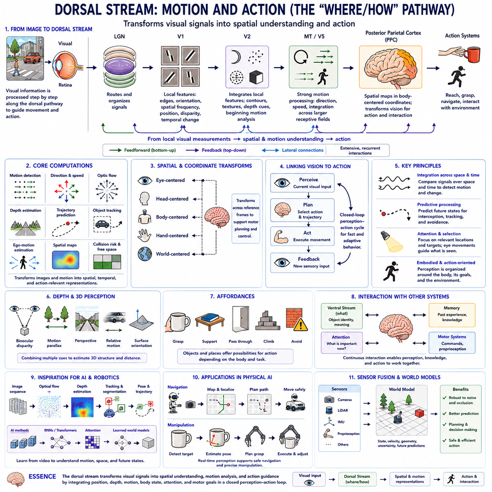{width="7.268055555555556in" height="7.268055555555556in"}

The dorsal visual stream is a major cortical pathway that transforms visual information into representations useful for spatial perception, motion analysis, and visually guided action. Often described as the "where" or "how" pathway, it extends from early visual cortex toward posterior parietal regions. Rather than focusing primarily on stable object identity, it emphasizes where things are, how they move, and how the body can interact with them.

The dorsal stream begins with visual signals that have already undergone substantial processing in the retina, lateral geniculate nucleus, and primary visual cortex. V1 provides information about local edges, orientation, position, spatial frequency, disparity, and temporal change. Dorsal-stream circuits combine these signals to estimate movement, spatial relationships, depth, trajectories, and action-relevant properties of the surrounding environment.

Visual information progresses through interconnected cortical regions that include V1, V2, motion-sensitive areas such as MT/V5, and posterior parietal cortex. This organization is not a simple one-way processing chain because feedforward, lateral, and feedback connections continuously exchange information. Nevertheless, the pathway provides a useful framework for understanding the transformation from local visual measurements toward spatially organized representations for behavior.

Area MT, also known as V5, plays a particularly important role in visual motion processing. Neurons in this region can respond selectively to the direction and speed of moving stimuli. By integrating local motion signals across larger receptive fields, MT contributes to estimating coherent movement patterns that cannot be reliably determined from isolated visual features alone.

Motion perception requires comparing visual information across both space and time. A single static image can indicate where an edge is located but cannot directly reveal its trajectory. Neural circuits therefore integrate temporally changing signals to estimate displacement, direction, and velocity. This temporal integration allows the visual system to distinguish stationary structures from moving objects and to predict how visual relationships are evolving.

Local motion measurements can be ambiguous because an individual edge often provides insufficient information about the complete movement of an object. This problem is related to the aperture problem, in which motion observed through a limited receptive field can have multiple possible interpretations. Dorsal-stream processing reduces this ambiguity by integrating motion evidence across multiple locations and visual features.

Optic flow provides another important source of information for the dorsal stream. When an observer moves through the environment, the pattern of visual motion across the retina changes systematically. Expansion, contraction, rotation, and translation within this flow can provide information about heading, self-motion, relative depth, and environmental structure. The brain can therefore use visual motion not only to track objects but also to estimate its own movement.

Depth perception is closely connected with dorsal-stream processing. Binocular disparity, motion parallax, perspective, relative motion, and other visual cues provide information about the three-dimensional arrangement of the environment. Combining these signals allows spatial representations to extend beyond two-dimensional image coordinates toward estimates of distance, surface orientation, and relative position.

The posterior parietal cortex plays a central role in connecting visual perception with action. Neural representations in parietal regions can reflect object location relative to the eyes, head, body, or limbs. Such coordinate transformations are essential because a target initially represented in retinal coordinates must eventually be related to the physical coordinate systems required for reaching, grasping, locomotion, and other actions.

Visually guided reaching illustrates this transformation clearly. Seeing an object does not directly specify the motor commands needed to touch it. The nervous system must estimate the target position, account for body configuration, select an appropriate movement, and continuously correct the trajectory. Dorsal-stream processing provides spatial information that can be integrated with proprioception and motor signals to support this process.

Grasping requires even richer action-oriented representations. The visual system must estimate properties such as object position, size, orientation, shape, and accessible surfaces so that the hand can approach with an appropriate configuration. Recognition of an object's semantic category may be useful, but successful grasping can depend more immediately on geometric properties that determine where and how contact should occur.

This distinction helps explain why the dorsal stream is often called the "how" pathway rather than simply the "where" pathway. Spatial localization is important, but its broader function is closely related to transforming visual information into forms that support interaction. Perception becomes organized around potential movements, body geometry, environmental constraints, and the continuously changing relationship between an agent and its surroundings.

Action-oriented perception must operate rapidly because the environment and the body can change while movement is occurring. Visual feedback can reveal deviations between intended and actual trajectories, allowing corrective actions to be generated. This creates a closed perception-action loop in which sensing influences movement and movement immediately changes subsequent sensory input.

Predictive processing is valuable within this loop because neural delays make purely reactive control insufficient for many fast behaviors. Estimating where a moving object will be moments later can support interception, avoidance, or tracking. The dorsal stream therefore contributes not only to representing current spatial conditions but also to anticipating how relevant relationships may evolve over short time horizons.

Attention interacts strongly with dorsal-stream processing. Spatial attention can prioritize particular locations, moving targets, or regions relevant to an upcoming action. Eye movements and shifts of attention alter the information available for subsequent processing. As a result, perception is active rather than passive: the nervous system continuously selects information according to current goals and behavioral requirements.

The dorsal and ventral streams perform different but complementary computations. The ventral stream emphasizes object identity and semantic interpretation, whereas the dorsal stream emphasizes spatial relationships and action. In natural behavior these pathways interact extensively. Recognizing a cup can activate knowledge about its function, while dorsal processing estimates where the cup is and how the hand should approach it.

This interaction is especially important for affordances, which describe possibilities for action provided by objects and environments. A handle may afford grasping, a flat surface may afford placement, and an opening may afford passage. Affordances depend partly on object properties and partly on the capabilities of the acting body, linking visual perception with geometry, motor control, and task context.

Dorsal-stream representations are therefore closely related to embodied perception. Spatial information is meaningful because it is expressed relative to an organism capable of moving and acting. Distance, direction, reachability, collision risk, and navigability become important because they constrain behavior. This differs from visual analysis that treats the scene only as an image requiring classification.

The pathway also illustrates the importance of multiple reference frames. Visual information begins largely in eye-centered coordinates, while actions may require head-centered, body-centered, hand-centered, or world-related representations. Neural systems can transform information among these frames so that sensory observations become compatible with motor planning and control.

These biological principles have important parallels in artificial vision and robotics. Optical-flow estimation, visual odometry, depth estimation, motion segmentation, object tracking, pose estimation, and trajectory prediction all transform image sequences into spatial and temporal representations. Although these algorithms are not direct replicas of dorsal-stream biology, they address related computational problems involving movement and action.

Modern deep learning systems can learn motion representations from video rather than processing each frame independently. Temporal convolution, recurrent networks, transformers, attention mechanisms, and learned optical-flow models can integrate information across time. Such approaches allow AI systems to represent dynamic events, estimate trajectories, and predict future states rather than treating visual perception as static image recognition.

For physical AI, dorsal-stream principles are especially important because robots must perceive while moving through real environments. An autonomous mobile robot needs to estimate free space, obstacles, relative motion, traversability, collision risk, and possible paths. A manipulator must estimate target pose, reachability, contact geometry, and motion constraints. These requirements make spatial and action-oriented perception fundamental to embodied intelligence.

Sensor fusion can extend this capability beyond vision alone. Cameras provide rich appearance and motion information, while LiDAR, radar, IMU, proprioception, and depth sensors contribute complementary measurements. Combining these signals can produce more reliable estimates of ego-motion, object motion, geometry, and spatial relationships, particularly when individual sensors become uncertain or degraded.

World models can build upon dorsal-like representations by maintaining estimates of how objects, agents, and the robot itself change over time. Instead of representing only the current frame, a world model can encode state, velocity, spatial relationships, uncertainty, and possible future trajectories. This provides a bridge from dynamic perception toward prediction, planning, and decision making.

Closed-loop control is where these representations ultimately become behaviorally useful. Perception estimates the current situation, planning selects an action, control executes movement, and new sensory observations reveal the consequences. The cycle then repeats continuously. Intelligence in this setting emerges not from perception alone but from the repeated interaction between sensing, prediction, action, and environmental feedback.

The dorsal visual stream therefore demonstrates how vision can be transformed from sensory representation into a system for motion understanding and action guidance. By integrating spatial position, depth, temporal change, optic flow, body state, attention, and motor requirements, it supports rapid interaction with a dynamic world. For physical AI, these principles provide a biological foundation for connecting perception directly with prediction, planning, and control.

배측 시각 경로(Dorsal Visual Stream)는 시각 정보(Visual Information)를 공간 지각(Spatial Perception), 운동 분석(Motion Analysis), 시각 유도 행동(Visually Guided Action)에 유용한 표현(Representation)으로 변환하는 주요 피질 경로(Cortical Pathway)입니다. 흔히 '어디(Where)' 또는 '어떻게(How)' 경로라고 설명되며, 초기 시각피질(Early Visual Cortex)에서 후두정엽 영역(Posterior Parietal Region)으로 이어집니다. 안정적인 객체 정체성(Object Identity)에 주로 집중하기보다 객체가 어디에 있고, 어떻게 움직이며, 신체가 어떻게 상호작용할 수 있는지를 강조합니다.

배측 경로는 망막(Retina), 외측슬상핵(Lateral Geniculate Nucleus, LGN), 일차시각피질(Primary Visual Cortex)에서 이미 상당한 처리를 거친 시각 신호로부터 시작됩니다. V1은 국소 에지(Local Edge), 방향(Orientation), 위치(Position), 공간 주파수(Spatial Frequency), 시차(Disparity), 시간적 변화(Temporal Change)에 관한 정보를 제공합니다. 배측 경로의 회로는 이러한 신호를 결합하여 주변 환경의 움직임, 공간적 관계(Spatial Relationship), 깊이(Depth), 궤적(Trajectory), 행동 관련 특성(Action-Relevant Property)을 추정합니다.

시각 정보는 V1, V2, MT/V5와 같은 운동 민감 영역(Motion-Sensitive Area), 후두정피질(Posterior Parietal Cortex)을 포함하는 상호 연결된 피질 영역을 통해 진행합니다. 순방향(Feedforward), 측면(Lateral), 피드백(Feedback) 연결이 지속적으로 정보를 교환하기 때문에 이러한 조직은 단순한 단방향 처리 사슬이 아닙니다. 그럼에도 이 경로는 국소적인 시각 측정값에서 행동을 위한 공간적으로 조직된 표현으로 변환되는 과정을 이해하는 데 유용한 프레임워크를 제공합니다.

MT 영역(Area MT)은 V5라고도 하며 시각적 운동 처리(Visual Motion Processing)에서 특히 중요한 역할을 합니다. 이 영역의 뉴런은 움직이는 자극의 방향(Direction)과 속도(Speed)에 선택적으로 반응할 수 있습니다. MT는 더 넓은 수용장(Receptive Field)에 걸쳐 국소적인 운동 신호를 통합함으로써 개별적인 시각 특징만으로는 신뢰성 있게 결정하기 어려운 일관된 움직임 패턴(Coherent Movement Pattern)을 추정하는 데 기여합니다.

운동 지각(Motion Perception)을 위해서는 공간과 시간에 걸쳐 시각 정보를 비교해야 합니다. 하나의 정적인 이미지(Static Image)는 에지가 어디에 위치하는지를 나타낼 수 있지만 그 궤적을 직접적으로 보여주지는 못합니다. 따라서 신경회로는 시간에 따라 변화하는 신호를 통합하여 변위(Displacement), 방향, 속도(Velocity)를 추정합니다. 이러한 시간적 통합(Temporal Integration)을 통해 시각 시스템은 정지된 구조와 움직이는 객체를 구별하고 시각적 관계가 어떻게 변화하는지를 예측할 수 있습니다.

개별 에지는 객체 전체의 움직임을 판단하기에 충분한 정보를 제공하지 못하는 경우가 많기 때문에 국소 운동 측정(Local Motion Measurement)은 모호할 수 있습니다. 이러한 문제는 제한된 수용장을 통해 관찰된 움직임이 여러 가지 가능한 해석을 가질 수 있는 개구 문제(Aperture Problem)와 관련됩니다. 배측 경로의 처리는 여러 위치와 시각 특징에서 얻은 운동 증거(Motion Evidence)를 통합하여 이러한 모호성을 줄입니다.

광학 흐름(Optic Flow)은 배측 경로에 또 다른 중요한 정보원을 제공합니다. 관찰자가 환경 속을 이동하면 망막 전체에서 나타나는 시각적 움직임 패턴이 체계적으로 변화합니다. 이러한 흐름에서 나타나는 팽창(Expansion), 수축(Contraction), 회전(Rotation), 이동(Translation)은 진행 방향(Heading), 자기 운동(Self-Motion), 상대적 깊이(Relative Depth), 환경 구조(Environmental Structure)에 관한 정보를 제공할 수 있습니다. 따라서 뇌는 시각적 움직임을 객체 추적뿐만 아니라 자신의 이동을 추정하는 데에도 활용할 수 있습니다.

깊이 지각(Depth Perception)은 배측 경로의 처리와 밀접하게 연결됩니다. 양안 시차(Binocular Disparity), 운동 시차(Motion Parallax), 원근(Perspective), 상대 운동(Relative Motion), 기타 시각 단서는 환경의 3차원적 배치(Three-Dimensional Arrangement)에 관한 정보를 제공합니다. 이러한 신호를 결합하면 공간적 표현은 2차원 이미지 좌표를 넘어 거리(Distance), 표면 방향(Surface Orientation), 상대적 위치(Relative Position)에 대한 추정으로 확장될 수 있습니다.

후두정피질(Posterior Parietal Cortex)은 시각적 지각과 행동(Action)을 연결하는 데 중심적인 역할을 합니다. 두정엽 영역의 신경 표현(Neural Representation)은 눈, 머리, 신체 또는 팔다리를 기준으로 한 객체 위치를 반영할 수 있습니다. 이러한 좌표 변환(Coordinate Transformation)은 처음에 망막 좌표(Retinal Coordinate)로 표현된 목표를 뻗기(Reaching), 잡기(Grasping), 이동(Locomotion), 기타 행동에 필요한 물리적 좌표계와 연결해야 하기 때문에 필수적입니다.

시각 유도 뻗기(Visually Guided Reaching)는 이러한 변환을 명확하게 보여줍니다. 객체를 보는 것만으로는 그것을 만지는 데 필요한 운동 명령(Motor Command)이 직접 결정되지 않습니다. 신경계는 목표 위치를 추정하고, 신체 구성(Body Configuration)을 고려하며, 적절한 움직임을 선택하고, 궤적을 지속적으로 보정해야 합니다. 배측 경로의 처리는 이 과정을 지원하기 위해 고유수용감각(Proprioception) 및 운동 신호(Motor Signal)와 통합될 수 있는 공간 정보를 제공합니다.

잡기(Grasping)는 더욱 풍부한 행동 지향 표현(Action-Oriented Representation)을 필요로 합니다. 손이 적절한 형태로 접근할 수 있도록 시각 시스템은 객체의 위치, 크기(Size), 방향, 형태(Shape), 접근 가능한 표면(Accessible Surface) 등의 특성을 추정해야 합니다. 객체의 의미적 범주(Semantic Category)를 인식하는 것도 유용하지만, 성공적인 잡기는 접촉이 어디에서 어떻게 이루어져야 하는지를 결정하는 기하학적 특성(Geometric Property)에 더욱 직접적으로 의존할 수 있습니다.

이러한 차이는 배측 경로가 단순히 '어디(Where)' 경로가 아니라 '어떻게(How)' 경로라고도 불리는 이유를 설명하는 데 도움이 됩니다. 공간적 위치 파악(Spatial Localization)은 중요하지만, 보다 광범위한 기능은 시각 정보를 상호작용을 지원하는 형태로 변환하는 것과 밀접하게 관련됩니다. 지각은 잠재적 움직임(Potential Movement), 신체 기하(Body Geometry), 환경적 제약(Environmental Constraint), 에이전트와 주변 환경 사이의 지속적으로 변화하는 관계를 중심으로 조직됩니다.

행동 지향적 지각(Action-Oriented Perception)은 움직임이 진행되는 동안 환경과 신체가 변화할 수 있으므로 빠르게 작동해야 합니다. 시각 피드백(Visual Feedback)은 의도한 궤적과 실제 궤적 사이의 차이를 보여주어 보정 행동(Corrective Action)을 생성할 수 있도록 합니다. 이를 통해 감지가 움직임에 영향을 주고 움직임이 즉시 이후의 감각 입력을 변화시키는 폐루프 지각-행동(Closed Perception-Action Loop)이 형성됩니다.

신경 지연(Neural Delay)으로 인해 순수한 반응형 제어(Reactive Control)만으로는 많은 빠른 행동을 충분히 처리하기 어렵기 때문에 이러한 루프에서는 예측 처리(Predictive Processing)가 중요합니다. 움직이는 객체가 잠시 후 어디에 위치할지를 추정하면 가로채기(Interception), 회피(Avoidance), 추적(Tracking)을 지원할 수 있습니다. 따라서 배측 경로는 현재의 공간 상태를 표현할 뿐만 아니라 관련 관계가 짧은 시간 범위에서 어떻게 변화할지를 예측하는 데에도 기여합니다.

주의(Attention)는 배측 경로의 처리와 강하게 상호작용합니다. 공간적 주의(Spatial Attention)는 특정 위치, 움직이는 목표, 또는 예정된 행동과 관련된 영역에 우선순위를 부여할 수 있습니다. 안구 운동(Eye Movement)과 주의의 이동은 이후 처리에 이용할 수 있는 정보를 변화시킵니다. 따라서 지각은 수동적인 과정이 아니라 신경계가 현재 목표와 행동 요구사항에 따라 정보를 지속적으로 선택하는 능동적인 과정입니다.

배측 경로와 복측 시각 경로(Ventral Visual Stream)는 서로 다르지만 상호보완적인 계산을 수행합니다. 복측 경로는 객체의 정체성과 의미적 해석(Semantic Interpretation)을 강조하는 반면, 배측 경로는 공간적 관계와 행동을 강조합니다. 자연스러운 행동에서는 두 경로가 광범위하게 상호작용합니다. 컵을 인식하면 그 기능에 관한 지식이 활성화될 수 있으며, 동시에 배측 처리는 컵의 위치와 손이 어떻게 접근해야 하는지를 추정합니다.

이러한 상호작용은 객체와 환경이 제공하는 행동 가능성을 의미하는 행동유도성(Affordance)에서 특히 중요합니다. 손잡이(Handle)는 잡기 가능성을 제공하고, 평평한 표면은 물체를 놓을 가능성을 제공하며, 개구부(Opening)는 통과할 가능성을 제공할 수 있습니다. 행동유도성은 부분적으로 객체의 특성에 의존하고 부분적으로 행동하는 신체의 능력에 의존하므로 시각적 지각을 기하, 운동 제어(Motor Control), 작업 맥락(Task Context)과 연결합니다.

따라서 배측 경로의 표현은 체화된 지각(Embodied Perception)과 밀접한 관련이 있습니다. 공간 정보는 움직이고 행동할 수 있는 유기체를 기준으로 표현되기 때문에 의미를 갖습니다. 거리, 방향, 도달 가능성(Reachability), 충돌 위험(Collision Risk), 이동 가능성(Navigability)은 행동을 제약하기 때문에 중요해집니다. 이는 장면을 단순히 분류해야 하는 이미지로만 취급하는 시각 분석과 차이가 있습니다.

이 경로는 다중 기준 좌표계(Multiple Reference Frame)의 중요성도 보여줍니다. 시각 정보는 주로 눈 중심 좌표(Eye-Centered Coordinate)에서 시작하지만 행동에는 머리 중심(Head-Centered), 신체 중심(Body-Centered), 손 중심(Hand-Centered), 또는 세계 기준(World-Related) 표현이 필요할 수 있습니다. 신경계는 이러한 기준 좌표 사이에서 정보를 변환하여 감각 관측(Sensory Observation)이 운동 계획(Motor Planning) 및 제어와 호환될 수 있도록 합니다.

이러한 생물학적 원리는 인공 시각(Artificial Vision)과 로보틱스(Robotics)에서도 중요한 대응 관계를 갖습니다. 광학 흐름 추정(Optical-Flow Estimation), 비주얼 오도메트리(Visual Odometry), 깊이 추정(Depth Estimation), 운동 분할(Motion Segmentation), 객체 추적(Object Tracking), 자세 추정(Pose Estimation), 궤적 예측(Trajectory Prediction)은 모두 이미지 시퀀스(Image Sequence)를 공간적·시간적 표현으로 변환합니다. 이러한 알고리즘은 배측 경로의 생물학적 구조를 직접 복제하지는 않지만 움직임과 행동에 관한 유사한 계산 문제를 다룹니다.

현대 딥러닝 시스템(Deep Learning System)은 각각의 프레임을 독립적으로 처리하는 대신 비디오(Video)로부터 운동 표현(Motion Representation)을 학습할 수 있습니다. 시간적 합성곱(Temporal Convolution), 순환신경망(Recurrent Network), 트랜스포머(Transformer), 어텐션 메커니즘(Attention Mechanism), 학습 기반 광학 흐름 모델(Learned Optical-Flow Model)은 시간에 걸쳐 정보를 통합할 수 있습니다. 이러한 접근법을 통해 AI 시스템은 시각 지각을 정적인 이미지 인식으로 제한하지 않고 동적 사건(Dynamic Event)을 표현하고 궤적과 미래 상태(Future State)를 예측할 수 있습니다.

피지컬 인공지능(Physical AI)에서는 로봇이 실제 환경에서 이동하면서 지각해야 하기 때문에 배측 경로의 원리가 특히 중요합니다. 자율이동로봇(Autonomous Mobile Robot)은 자유 공간(Free Space), 장애물(Obstacle), 상대 운동, 주행 가능성(Traversability), 충돌 위험, 가능한 경로(Path)를 추정해야 합니다. 조작기(Manipulator)는 목표 자세(Target Pose), 도달 가능성, 접촉 기하(Contact Geometry), 운동 제약(Motion Constraint)을 추정해야 합니다. 이러한 요구사항으로 인해 공간 및 행동 지향적 지각은 체화 지능(Embodied Intelligence)의 핵심 요소가 됩니다.

센서 융합(Sensor Fusion)은 이러한 능력을 시각만을 사용하는 수준 이상으로 확장할 수 있습니다. 카메라는 풍부한 외형(Appearance) 및 운동 정보를 제공하고, 라이다(LiDAR), 레이더(Radar), 관성측정장치(Inertial Measurement Unit, IMU), 고유수용감각, 깊이 센서(Depth Sensor)는 상호보완적인 측정값을 제공합니다. 이러한 신호를 결합하면 개별 센서가 불확실하거나 성능이 저하되는 상황에서도 자기 운동, 객체 운동, 기하 구조, 공간적 관계를 더욱 신뢰성 있게 추정할 수 있습니다.

월드 모델(World Model)은 객체, 에이전트(Agent), 로봇 자체가 시간에 따라 어떻게 변화하는지를 추정하여 배측 경로와 유사한 동적 표현(Dynamic Representation)을 더욱 확장할 수 있습니다. 현재 프레임만을 표현하는 대신 월드 모델은 상태(State), 속도, 공간적 관계, 불확실성(Uncertainty), 가능한 미래 궤적(Future Trajectory)을 부호화할 수 있습니다. 이는 동적 지각(Dynamic Perception)에서 예측, 계획(Planning), 의사결정(Decision Making)으로 이어지는 연결고리를 제공합니다.

폐루프 제어(Closed-Loop Control)는 이러한 표현이 궁극적으로 행동에 유용하게 활용되는 단계입니다. 지각은 현재 상황을 추정하고, 계획은 행동을 선택하며, 제어(Control)는 움직임을 실행하고, 새로운 감각 관측은 그 결과를 보여줍니다. 이후 이 과정은 지속적으로 반복됩니다. 이러한 환경에서 지능(Intelligence)은 지각만으로 발생하는 것이 아니라 감지(Sensing), 예측(Prediction), 행동(Action), 환경 피드백(Environmental Feedback)의 반복적인 상호작용을 통해 출현합니다.

따라서 배측 시각 경로(Dorsal Visual Stream)는 시각이 감각 표현(Sensory Representation)에서 운동 이해(Motion Understanding)와 행동 유도(Action Guidance)를 위한 시스템으로 어떻게 변환될 수 있는지를 보여줍니다. 공간적 위치, 깊이, 시간적 변화, 광학 흐름, 신체 상태(Body State), 주의, 운동 요구사항(Motor Requirement)을 통합함으로써 동적인 세계와의 빠른 상호작용을 지원합니다. 피지컬 인공지능의 관점에서 이러한 원리는 지각을 예측, 계획, 제어와 직접 연결하는 중요한 생물학적 기반을 제공합니다.

##  

## 02.06 Hierarchical Feature Representation

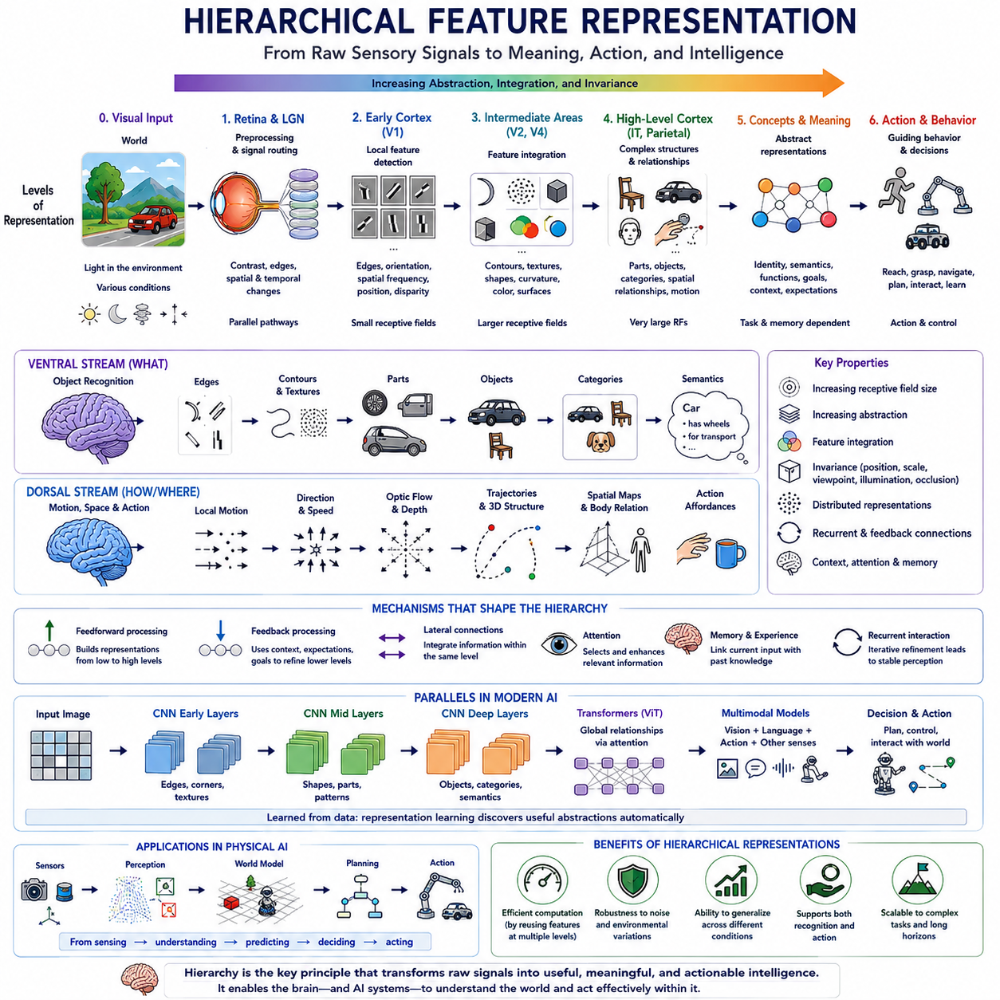{width="7.268055555555556in" height="7.268055555555556in"}

Hierarchical feature representation describes how visual systems progressively transform raw sensory signals into increasingly structured and abstract internal representations. Within the visual hierarchy, early stages preserve local information such as contrast, position, edges, and orientation, while later cortical stages integrate these features into contours, surfaces, parts, objects, spatial relationships, and behaviorally meaningful concepts.

The hierarchy begins with optical input reaching the retina, where photoreceptors and retinal circuits convert light into neural signals and emphasize contrast, spatial differences, and temporal changes. The lateral geniculate nucleus organizes these signals into parallel pathways before they reach cortex. Thus, representation does not begin with complete objects; it begins with distributed measurements that preserve useful local structure.

In primary visual cortex, or V1, neural populations respond selectively to properties such as edge orientation, spatial frequency, contrast, position, and binocular disparity. These responses provide a vocabulary of elementary visual features. Individual neurons represent only limited aspects of a scene, but populations jointly encode many complementary properties, creating a distributed representation from which more complex visual structure can be constructed.

Higher visual areas combine outputs from earlier stages across increasingly large receptive fields. V2 can integrate local orientations and boundaries into contours, textures, and figure-ground relationships, while V4 contributes to more complex shape, curvature, color, and surface representations. Such processing illustrates a general hierarchical principle: later representations depend on combinations and transformations of features available at earlier levels.

As information progresses through the ventral stream toward inferior temporal cortex, representations become increasingly associated with object structure, category, and identity. Local edges can contribute to contours, contours can define parts, and combinations of parts can support object representations. The hierarchy therefore moves from concrete sensory measurements toward increasingly abstract descriptions that are less dependent on exact pixel-level appearance.

The dorsal visual stream develops a complementary hierarchy emphasizing space, motion, depth, and action. Local visual changes are integrated into estimates of direction, velocity, optic flow, object trajectories, and three-dimensional relationships. Posterior parietal systems further transform these representations into coordinates relevant to reaching, grasping, navigation, and other actions, demonstrating that hierarchical representation can serve both recognition and control.

A critical property of hierarchical representation is increasing receptive-field size. Early neurons respond to relatively small portions of visual space, whereas later neurons can integrate evidence across broader regions. Larger receptive fields make it possible to represent relationships among multiple features, but they also reduce dependence on the precise retinal location of each feature, supporting more stable recognition across position changes.

Hierarchical processing also contributes to invariance. The same object can vary dramatically with viewpoint, scale, illumination, background, or partial occlusion. Higher representations can preserve identity-relevant relationships while becoming less sensitive to transformations that should not change meaning. Robust perception therefore requires a balance between retaining discriminative detail and discarding irrelevant variations.

Abstraction does not mean that lower-level information simply disappears. Fine spatial details, color, motion, depth, and local boundaries may remain important depending on the task. Biological visual processing maintains multiple parallel channels and interactions across levels, allowing higher representations to access detailed information when needed. Hierarchy is therefore better understood as progressive integration rather than irreversible compression into one symbolic description.

Visual representations are distributed across populations of neurons rather than stored as single explicit symbols. A particular object or feature can correspond to a pattern of activity across many neurons, while individual neurons may participate in representing multiple related stimuli. Distributed coding provides flexible representational capacity and allows similarity between stimuli to be reflected in partially overlapping neural activation patterns.

The visual hierarchy is also strongly recurrent. Feedforward signals carry sensory evidence toward higher cortical areas, while feedback connections transmit contextual expectations, attention, memory, and task information toward earlier stages. Lateral connections link neighboring representations within a level. Consequently, the representation of a visual stimulus can evolve through repeated interaction rather than being produced by a single forward pass.

Context can substantially change how the same local feature is interpreted. A line segment may belong to an object boundary, texture, shadow, or background pattern depending on surrounding information. Higher-level representations can help resolve such ambiguity by providing constraints derived from the broader scene. Hierarchical perception therefore combines bottom-up evidence with top-down interpretation to produce coherent visual understanding.

Attention introduces another form of hierarchical control. Behavioral goals can prioritize particular locations, objects, or visual attributes and modify processing across multiple levels. Instead of allocating equal computational resources to every available stimulus, the nervous system selectively enhances information that is currently relevant. Representation is therefore task dependent as well as stimulus dependent.

Memory further influences the hierarchy by connecting current sensory patterns with previously learned structures. Experience allows combinations of features to become associated with familiar objects, scenes, categories, and meanings. Recognition therefore depends not only on extracting features from the current image but also on relating those features to representations shaped by previous encounters and accumulated knowledge.

Hierarchical feature representation strongly influenced modern computer vision. Convolutional neural networks typically transform pixels through successive layers in which early filters detect edges and textures, intermediate layers represent shapes and parts, and deeper layers support object-level and semantic representations. This broad progression resembles functional principles of biological vision without implying that artificial layers directly reproduce particular cortical areas.

Deep networks learn these representations from data rather than relying entirely on manually engineered features. Optimization adjusts large numbers of parameters so that intermediate features become useful for solving a task. This shift from explicit feature engineering toward representation learning is one of the central achievements of deep learning, allowing systems to discover useful abstractions automatically from large datasets.

Modern transformer-based vision systems extend hierarchical representation through attention. Visual patches or tokens can interact across long spatial distances, allowing models to capture relationships that may be difficult to represent through strictly local operations. Hybrid architectures can combine local feature extraction with global attention, producing representations that integrate fine spatial structure with broader contextual information.

Multimodal systems extend the hierarchy beyond vision alone. Visual features can be aligned with language, depth, sound, motion, proprioception, or action representations so that higher-level internal states encode relationships across modalities. An object can therefore be represented not only by appearance but also by its name, location, function, physical properties, and possible interactions.

For physical AI, hierarchical representations provide a bridge from raw sensing to intelligent action. Cameras, LiDAR, radar, depth sensors, and proprioception generate low-level measurements; perception systems organize them into geometry, objects, motion, and free space; world models integrate these features into persistent state representations; and planners use them to predict outcomes and select actions.

The appropriate level of representation depends on the task and timescale. Low-level control may require precise geometry and velocity, navigation may require objects and traversable regions, and high-level reasoning may require semantic categories, goals, and relationships. Effective embodied systems therefore benefit from maintaining multiple representational levels rather than forcing all information into a single universal abstraction.

Hierarchical feature representation ultimately demonstrates how meaningful perception can emerge through progressive integration of distributed information. From contrast and edges to shapes, objects, motion, spatial relationships, semantics, and action possibilities, each level organizes information for increasingly complex computation. For AI, the central lesson is that intelligence depends not merely on detecting features, but on constructing adaptable representations across levels of abstraction, context, and behavior.

계층적 특징 표현(Hierarchical Feature Representation)은 시각 시스템(Visual System)이 원시 감각 신호(Raw Sensory Signal)를 점진적으로 더욱 구조화되고 추상적인 내부 표현(Internal Representation)으로 변환하는 방식을 설명합니다. 시각 계층(Visual Hierarchy)의 초기 단계는 대비(Contrast), 위치(Position), 에지(Edge), 방향(Orientation)과 같은 국소 정보를 보존하며, 이후의 피질 단계(Cortical Stage)는 이러한 특징을 통합하여 윤곽(Contour), 표면(Surface), 부분(Part), 객체(Object), 공간적 관계(Spatial Relationship), 행동적으로 의미 있는 개념(Behaviorally Meaningful Concept)을 형성합니다.

계층 구조는 광학 입력(Optical Input)이 망막(Retina)에 도달하면서 시작되며, 이곳에서 광수용체(Photoreceptor)와 망막 회로(Retinal Circuit)는 빛을 신경 신호(Neural Signal)로 변환하고 대비, 공간적 차이(Spatial Difference), 시간적 변화(Temporal Change)를 강조합니다. 외측슬상핵(Lateral Geniculate Nucleus, LGN)은 이러한 신호가 피질에 도달하기 전에 병렬 경로(Parallel Pathway)로 조직합니다. 따라서 표현은 완전한 객체에서 시작되는 것이 아니라 유용한 국소 구조를 보존하는 분산된 측정값(Distributed Measurement)에서 시작됩니다.

일차시각피질(Primary Visual Cortex), 즉 V1에서 뉴런 집단(Neural Population)은 에지 방향(Edge Orientation), 공간 주파수(Spatial Frequency), 대비, 위치, 양안 시차(Binocular Disparity)와 같은 특성에 선택적으로 반응합니다. 이러한 반응은 기본적인 시각 특징(Elementary Visual Feature)의 어휘를 제공합니다. 개별 뉴런은 장면의 제한된 측면만을 표현하지만, 뉴런 집단은 여러 상호보완적인 특성을 공동으로 부호화하여 더 복잡한 시각 구조를 구성할 수 있는 분산 표현(Distributed Representation)을 형성합니다.

상위 시각 영역(Higher Visual Area)은 점차 넓어지는 수용장(Receptive Field)에 걸쳐 초기 단계의 출력을 결합합니다. V2는 국소 방향과 경계를 통합하여 윤곽, 텍스처(Texture), 전경-배경 관계(Figure-Ground Relationship)를 형성할 수 있으며, V4는 더욱 복잡한 형태(Shape), 곡률(Curvature), 색상(Color), 표면 표현(Surface Representation)에 기여합니다. 이러한 처리는 이후 단계의 표현이 이전 수준에서 이용 가능한 특징의 조합과 변환에 의존한다는 일반적인 계층적 원리를 보여줍니다.

정보가 복측 시각 경로(Ventral Visual Stream)를 따라 하측두피질(Inferior Temporal Cortex) 방향으로 진행함에 따라 표현은 점차 객체 구조(Object Structure), 범주(Category), 정체성(Identity)과 관련됩니다. 국소 에지는 윤곽 형성에 기여하고, 윤곽은 부분을 정의하며, 여러 부분의 조합은 객체 표현(Object Representation)을 지원할 수 있습니다. 따라서 계층 구조는 구체적인 감각 측정값에서 정확한 픽셀 수준 외형(Pixel-Level Appearance)에 대한 의존성이 낮은 더욱 추상적인 설명으로 발전합니다.

배측 시각 경로(Dorsal Visual Stream)는 공간(Space), 움직임(Motion), 깊이(Depth), 행동(Action)을 강조하는 상호보완적인 계층 구조를 형성합니다. 국소적인 시각 변화는 방향, 속도(Velocity), 광학 흐름(Optic Flow), 객체 궤적(Object Trajectory), 3차원 관계(Three-Dimensional Relationship)에 대한 추정으로 통합됩니다. 후두정엽 시스템(Posterior Parietal System)은 이러한 표현을 뻗기(Reaching), 잡기(Grasping), 내비게이션(Navigation), 기타 행동에 필요한 좌표로 추가 변환하여 계층적 표현이 인식과 제어 모두에 활용될 수 있음을 보여줍니다.

계층적 표현의 핵심적인 특성 가운데 하나는 수용장 크기(Receptive-Field Size)의 증가입니다. 초기 뉴런은 시각 공간의 비교적 작은 부분에 반응하는 반면, 이후의 뉴런은 더 넓은 영역에 걸쳐 증거를 통합할 수 있습니다. 더 큰 수용장은 여러 특징 사이의 관계를 표현할 수 있게 하는 동시에 각 특징의 정확한 망막 위치(Retinal Location)에 대한 의존성을 줄여 위치 변화에도 더욱 안정적인 인식을 지원합니다.

계층적 처리는 불변성(Invariance)의 형성에도 기여합니다. 동일한 객체라도 시점(Viewpoint), 크기(Scale), 조명(Illumination), 배경(Background), 부분적인 가림(Partial Occlusion)에 따라 크게 달라질 수 있습니다. 상위 표현은 객체 정체성과 관련된 관계를 보존하면서 의미를 변화시키지 않는 변환에 대한 민감성을 줄일 수 있습니다. 따라서 강건한 지각(Robust Perception)을 위해서는 판별에 필요한 세부 정보를 유지하면서 관련 없는 변화를 제거하는 균형이 필요합니다.

추상화(Abstraction)가 하위 수준의 정보가 단순히 사라진다는 것을 의미하지는 않습니다. 세밀한 공간 정보, 색상, 움직임, 깊이, 국소 경계(Local Boundary)는 작업에 따라 여전히 중요할 수 있습니다. 생물학적 시각 처리는 여러 병렬 채널과 계층 사이의 상호작용을 유지하여 필요한 경우 상위 표현이 세부 정보에 접근할 수 있도록 합니다. 따라서 계층 구조는 하나의 상징적 설명(Symbolic Description)으로 되돌릴 수 없이 압축되는 과정이라기보다 점진적인 통합(Progressive Integration)으로 이해하는 것이 적절합니다.

시각 표현은 하나의 명시적인 기호에 저장되는 것이 아니라 뉴런 집단 전체에 분산되어 있습니다. 특정 객체나 특징은 여러 뉴런에 걸친 활동 패턴(Activity Pattern)에 대응할 수 있으며, 개별 뉴런은 서로 관련된 여러 자극을 표현하는 데 참여할 수 있습니다. 분산 부호화(Distributed Coding)는 유연한 표현 능력을 제공하며, 자극 사이의 유사성이 부분적으로 중첩되는 신경 활성 패턴을 통해 반영될 수 있도록 합니다.

시각 계층은 또한 강한 순환 구조(Recurrent Structure)를 갖습니다. 순방향 신호(Feedforward Signal)는 감각 증거(Sensory Evidence)를 상위 피질 영역으로 전달하고, 피드백 연결(Feedback Connection)은 맥락적 기대(Contextual Expectation), 주의(Attention), 기억(Memory), 작업 정보(Task Information)를 초기 단계로 전달합니다. 측면 연결(Lateral Connection)은 동일한 계층 내부의 인접한 표현을 연결합니다. 따라서 시각 자극의 표현은 한 번의 순방향 전달만으로 생성되는 것이 아니라 반복적인 상호작용을 통해 발전할 수 있습니다.

맥락(Context)은 동일한 국소 특징이 어떻게 해석되는지를 크게 변화시킬 수 있습니다. 하나의 선분(Line Segment)은 주변 정보에 따라 객체 경계, 텍스처, 그림자(Shadow), 배경 패턴(Background Pattern)의 일부가 될 수 있습니다. 상위 수준의 표현은 더 넓은 장면에서 얻은 제약 조건(Constraint)을 제공하여 이러한 모호성을 해결하는 데 도움을 줄 수 있습니다. 따라서 계층적 지각(Hierarchical Perception)은 상향식 증거(Bottom-Up Evidence)와 하향식 해석(Top-Down Interpretation)을 결합하여 일관된 시각적 이해(Coherent Visual Understanding)를 생성합니다.

주의는 또 다른 형태의 계층적 제어(Hierarchical Control)를 제공합니다. 행동 목표(Behavioral Goal)는 특정 위치, 객체, 시각적 속성(Visual Attribute)에 우선순위를 부여하고 여러 계층에 걸쳐 처리 방식을 조절할 수 있습니다. 신경계는 이용 가능한 모든 자극에 동일한 계산 자원(Computational Resource)을 할당하는 대신 현재 중요한 정보만 선택적으로 강화합니다. 따라서 표현은 자극 의존적(Stimulus Dependent)일 뿐만 아니라 작업 의존적(Task Dependent)이기도 합니다.

기억은 현재의 감각 패턴을 이전에 학습된 구조와 연결함으로써 계층 구조에 추가적인 영향을 줍니다. 경험(Experience)을 통해 특징의 조합은 익숙한 객체, 장면(Scene), 범주, 의미(Meaning)와 연결될 수 있습니다. 따라서 인식(Recognition)은 현재 이미지에서 특징을 추출하는 것뿐만 아니라 이러한 특징을 이전 경험과 축적된 지식(Accumulated Knowledge)에 의해 형성된 표현과 연결하는 과정에도 의존합니다.

계층적 특징 표현은 현대 컴퓨터 비전(Computer Vision)의 발전에 큰 영향을 주었습니다. 합성곱 신경망(Convolutional Neural Network, CNN)은 일반적으로 픽셀(Pixel)을 연속적인 계층을 통해 변환하며, 초기 필터는 에지와 텍스처를 검출하고 중간 계층은 형태와 부분을 표현하며 더 깊은 계층은 객체 수준 및 의미적 표현(Semantic Representation)을 지원합니다. 이러한 전반적인 진행은 인공 계층이 특정 피질 영역을 직접 재현한다는 의미 없이 생물학적 시각의 기능적 원리와 유사성을 보여줍니다.

심층신경망(Deep Neural Network)은 전적으로 수작업으로 설계된 특징(Hand-Engineered Feature)에 의존하는 대신 데이터로부터 이러한 표현을 학습합니다. 최적화(Optimization)는 많은 수의 파라미터(Parameter)를 조정하여 중간 특징이 주어진 작업을 해결하는 데 유용하도록 만듭니다. 명시적인 특징 공학(Feature Engineering)에서 표현 학습(Representation Learning)으로의 이러한 전환은 딥러닝(Deep Learning)의 핵심적인 성과 가운데 하나이며, 대규모 데이터셋으로부터 유용한 추상화를 자동으로 발견할 수 있도록 합니다.

현대의 트랜스포머 기반 시각 시스템(Transformer-Based Vision System)은 어텐션(Attention)을 통해 계층적 표현을 확장합니다. 시각 패치(Visual Patch) 또는 토큰(Token)은 공간적으로 멀리 떨어진 영역과 상호작용하여 엄격한 국소 연산만으로 표현하기 어려운 관계를 포착할 수 있습니다. 하이브리드 아키텍처(Hybrid Architecture)는 국소 특징 추출(Local Feature Extraction)과 전역 어텐션(Global Attention)을 결합하여 세밀한 공간 구조와 더 넓은 맥락 정보를 통합하는 표현을 생성할 수 있습니다.

멀티모달 시스템(Multimodal System)은 계층 구조를 시각 영역을 넘어 확장합니다. 시각 특징은 언어(Language), 깊이, 소리(Sound), 움직임, 고유수용감각(Proprioception), 행동 표현(Action Representation)과 정렬될 수 있으며, 이를 통해 상위 수준의 내부 상태(Internal State)가 여러 모달리티(Modality) 사이의 관계를 부호화할 수 있습니다. 따라서 객체는 외형뿐만 아니라 이름, 위치, 기능(Function), 물리적 특성(Physical Property), 가능한 상호작용(Possible Interaction)을 포함하여 표현될 수 있습니다.

피지컬 인공지능(Physical AI)에서 계층적 표현은 원시 센싱(Raw Sensing)과 지능적 행동(Intelligent Action)을 연결하는 가교를 제공합니다. 카메라(Camera), 라이다(LiDAR), 레이더(Radar), 깊이 센서(Depth Sensor), 고유수용감각은 저수준 측정값(Low-Level Measurement)을 생성하고, 지각 시스템(Perception System)은 이를 기하 구조(Geometry), 객체, 움직임, 자유 공간(Free Space)으로 조직하며, 월드 모델(World Model)은 이러한 특징을 지속적인 상태 표현(Persistent State Representation)으로 통합하고, 계획기(Planner)는 이를 사용하여 결과를 예측하고 행동을 선택합니다.

적절한 표현 수준(Representation Level)은 작업과 시간 규모(Timescale)에 따라 달라집니다. 저수준 제어(Low-Level Control)는 정밀한 기하와 속도를 필요로 할 수 있고, 내비게이션은 객체와 주행 가능 영역(Traversable Region)을 필요로 하며, 고차원 추론(High-Level Reasoning)은 의미적 범주(Semantic Category), 목표(Goal), 관계를 필요로 할 수 있습니다. 따라서 효과적인 체화 시스템(Embodied System)은 모든 정보를 하나의 보편적인 추상화(Universal Abstraction)에 강제로 통합하기보다 여러 표현 수준을 동시에 유지함으로써 이점을 얻을 수 있습니다.

궁극적으로 계층적 특징 표현(Hierarchical Feature Representation)은 분산된 정보를 점진적으로 통합함으로써 의미 있는 지각(Meaningful Perception)이 어떻게 출현할 수 있는지를 보여줍니다. 대비와 에지에서 형태, 객체, 움직임, 공간적 관계, 의미론(Semantics), 행동 가능성(Action Possibility)에 이르기까지 각 계층은 점차 복잡한 계산을 수행할 수 있도록 정보를 조직합니다. 인공지능(AI)의 관점에서 핵심적인 교훈은 지능이 단순히 특징을 검출하는 데 있는 것이 아니라 추상화 수준(Level of Abstraction), 맥락, 행동에 걸쳐 적응 가능한 표현(Adaptable Representation)을 구성하는 데 있다는 것입니다.

##  

## 02.07 CNN and Visual Cortex [w/Code]

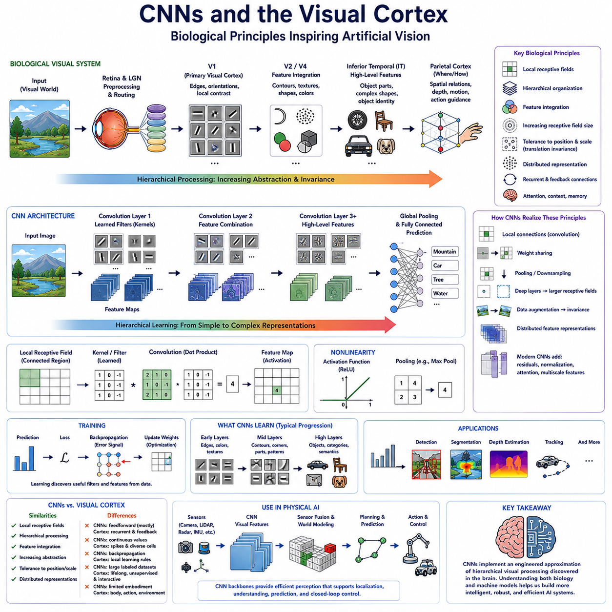{width="7.268055555555556in" height="7.268055555555556in"}

Convolutional neural networks, or CNNs, are artificial neural architectures designed to process spatially structured data such as images. Their development was strongly influenced by principles discovered in biological visual systems, particularly local receptive fields and hierarchical feature processing in the visual cortex. CNNs are not computational replicas of the brain, but they demonstrate how several biologically inspired principles can become effective engineering mechanisms for artificial vision.

The connection between CNNs and biological vision begins with receptive fields. Neurons in early visual cortex respond primarily to stimuli appearing within restricted regions of visual space rather than receiving equivalent information from the entire visual field. CNNs adopt a related principle by connecting convolutional units to local regions of an input or previous feature map, allowing spatial patterns to be analyzed through localized computations.

Research on the primary visual cortex revealed neurons that respond selectively to properties such as edges, orientations, spatial frequencies, and local contrast. Simple and complex cells demonstrated how increasingly structured responses could emerge from combinations of earlier visual signals. These observations contributed to the idea that visual recognition could be constructed hierarchically by combining relatively simple features into progressively more complex representations.

A convolution operation applies a small learnable filter, or kernel, across different spatial locations of an input. At each location, the filter computes a response determined by the local pattern and its learned parameters. The resulting feature map indicates where particular structures occur. During training, filters can become sensitive to useful patterns such as edges, gradients, corners, textures, or more complex combinations of earlier features.

Weight sharing distinguishes convolutional networks from densely connected architectures. The same convolutional filter is reused across many spatial positions instead of learning a completely separate detector for every image location. This dramatically reduces the number of parameters while introducing translation-related regularity. A useful visual pattern learned in one part of an image can therefore also be detected when it appears elsewhere.

Local connectivity and weight sharing together encode an inductive bias appropriate for images. Nearby pixels usually have stronger structural relationships than arbitrarily distant pixels, and many visual patterns can occur at multiple positions. CNNs exploit these assumptions directly within their architecture. This reduces the amount of learning required compared with systems that begin without any structural assumptions about spatial organization.

CNNs normally contain multiple layers that progressively transform feature representations. Early layers often respond to relatively simple structures such as oriented edges and color transitions. Intermediate layers can combine these responses into textures, contours, corners, repeated patterns, or object parts. Deeper layers can represent increasingly task-specific structures associated with objects, categories, scenes, or other semantic information.

This progression provides an important conceptual parallel with hierarchical processing in the visual cortex. V1 emphasizes relatively local visual properties, while later ventral-stream regions integrate information across larger receptive fields and increasingly complex configurations. CNNs similarly increase effective receptive-field size through successive layers, allowing deeper units to combine information originating from progressively larger portions of an image.

Pooling has historically been another important component of CNN architectures. Operations such as max pooling summarize responses within local neighborhoods, reducing spatial resolution while preserving prominent feature activations. This can increase tolerance to small translations and reduce computational requirements. The idea is functionally related to the broader biological principle that higher visual representations can become less sensitive to exact feature position.

Modern CNNs do not rely exclusively on pooling to achieve spatial abstraction. Strided convolutions, learned downsampling, residual connections, normalization, and multiscale feature architectures can control how resolution changes across a network. These mechanisms allow designers to balance spatial precision against increasingly abstract representation, which is particularly important when tasks require both recognition and accurate localization.

As CNN depth increases, the effective receptive field of a neuron can encompass a large portion of the original image. A unit in an early layer may depend on only a small local patch, whereas a deeper unit can indirectly integrate information from many earlier regions. This hierarchical expansion enables relationships among distant features to influence higher-level representations without requiring every early unit to connect globally.

Feature maps provide distributed representations rather than explicit symbolic descriptions. A CNN does not normally contain a single unit that states that an image contains a particular concept in a human-readable form. Instead, information is encoded across activation patterns in many channels and spatial locations. Subsequent layers transform these distributed patterns until they become useful for classification, detection, segmentation, or other tasks.

Nonlinear activation functions are essential because repeated linear convolutions alone would remain equivalent to a single linear transformation. Functions such as the rectified linear unit introduce nonlinear responses between layers, enabling networks to construct complex decision boundaries and feature combinations. Biological neurons use much richer dynamics, but both biological and artificial systems depend on nonlinear transformation to build complex representations.

Training determines which visual features a CNN actually develops. During supervised learning, predictions are compared with target labels and errors are propagated backward through the network using backpropagation. Optimization algorithms adjust convolutional filters and other parameters to reduce the loss function. The hierarchy of useful features therefore emerges through repeated parameter updates rather than being manually specified in advance.

Representation learning is one of the major advantages of CNNs over traditional hand-engineered computer vision pipelines. Earlier systems often depended on designers explicitly specifying edge descriptors, texture operators, keypoint representations, or shape features. CNNs can learn many useful intermediate representations directly from data, allowing feature extraction and task-specific decision functions to be optimized together.

Data augmentation helps CNNs learn robustness to visual variation. Training images can be transformed through cropping, scaling, flipping, color modification, geometric changes, or other operations while preserving appropriate labels. Exposure to such variation encourages networks to represent task-relevant properties while reducing sensitivity to changes that should not alter the intended interpretation.

CNNs have been extended beyond image classification into object detection, semantic segmentation, instance segmentation, depth estimation, pose estimation, tracking, and many other visual tasks. These applications require different balances between abstraction and spatial precision. Detection and segmentation systems, for example, often combine deep semantic features with higher-resolution representations so that objects can be identified while their locations and boundaries remain accurately represented.

Multiscale processing is particularly important because objects can appear at dramatically different sizes. Feature pyramid architectures combine information from several network depths so that fine spatial resolution and high-level semantics can be used together. This resembles the general principle that biological vision maintains information across multiple spatial scales rather than compressing all visual processing into one fixed resolution.

Despite conceptual similarities, CNNs and biological visual cortex differ fundamentally in many respects. CNNs typically use continuous numerical activations, synchronous layer operations, backpropagation, and large labeled datasets. Biological cortex operates through spikes, recurrent circuits, diverse cell types, neuromodulation, continuous adaptation, and interaction with the body and environment. The analogy is therefore computational rather than anatomically exact.

Another major difference concerns connectivity. Traditional CNNs are dominated by feedforward computation during inference, whereas biological visual cortex contains extensive lateral and feedback connections. Higher cortical regions can influence earlier processing through attention, expectations, and context. Recurrent neural networks, attention mechanisms, and feedback architectures attempt to introduce some related computational capabilities into artificial systems.

CNNs also possess limitations in modeling long-range relationships. Local convolution is highly effective for extracting nearby spatial patterns, but relationships between distant image regions may require many successive layers before information can interact. Attention-based architectures address this limitation by allowing distant visual elements to communicate more directly, contributing to the emergence of vision transformers and hybrid convolution-attention models.

Vision transformers approach image representation differently by dividing images into patches or tokens and using self-attention to model relationships among them. CNNs provide strong locality and translation-related inductive biases, whereas transformers can flexibly capture global relationships. Modern vision systems increasingly combine these approaches, using convolution for efficient local processing and attention for broader contextual integration.

For physical AI, CNNs remain valuable because local visual processing can be computationally efficient and suitable for edge hardware. Robots require real-time perception of obstacles, objects, surfaces, people, terrain, and manipulation targets under limited energy and latency constraints. Convolutional backbones can convert camera input into compact feature maps that support multiple downstream perception and control functions.

CNN features can also participate in multimodal sensor fusion. Image representations may be combined with LiDAR, radar, depth, IMU, proprioception, or language information to produce richer environmental models. The resulting representations can support localization, object understanding, free-space estimation, trajectory prediction, world modeling, planning, and closed-loop control rather than terminating at image classification.

The relationship between CNNs and visual cortex therefore illustrates how neuroscience can inspire artificial intelligence without requiring literal biological imitation. Local receptive fields, hierarchical integration, distributed representation, increasing abstraction, and tolerance to spatial variation became powerful principles in artificial vision. At the same time, differences in recurrence, learning, embodiment, and biological dynamics reveal opportunities for future architectures beyond conventional CNNs.

Understanding CNNs through the visual cortex ultimately highlights a broader principle of AI design: useful representations can emerge by repeatedly transforming local information into progressively larger and more meaningful structures. Biological vision achieves this through interacting neural circuits, while CNNs implement an engineered mathematical approximation of hierarchical feature processing. Their comparison provides a foundation for understanding both modern computer vision and future neuroscience-inspired AI.

합성곱 신경망(Convolutional Neural Network, CNN)은 이미지와 같이 공간적으로 구조화된 데이터(Spatially Structured Data)를 처리하도록 설계된 인공신경망 아키텍처(Artificial Neural Architecture)입니다. 그 발전은 생물학적 시각 시스템(Biological Visual System)에서 발견된 원리, 특히 국소 수용장(Local Receptive Field)과 시각피질(Visual Cortex)의 계층적 특징 처리(Hierarchical Feature Processing)에서 큰 영향을 받았습니다. CNN은 뇌의 계산 구조를 그대로 복제한 것은 아니지만, 생물학적으로 영감을 받은 여러 원리가 인공 시각(Artificial Vision)을 위한 효과적인 공학적 메커니즘으로 구현될 수 있음을 보여줍니다.

CNN과 생물학적 시각 사이의 연결은 수용장(Receptive Field)에서 시작됩니다. 초기 시각피질(Early Visual Cortex)의 뉴런은 전체 시야(Visual Field)에서 동일한 정보를 입력받는 것이 아니라 제한된 시각 공간 영역에 나타나는 자극에 주로 반응합니다. CNN은 이와 관련된 원리를 적용하여 합성곱 유닛(Convolutional Unit)을 입력 또는 이전 특징맵(Feature Map)의 국소 영역과 연결함으로써 공간 패턴(Spatial Pattern)을 국소적인 계산을 통해 분석할 수 있도록 합니다.

일차시각피질(Primary Visual Cortex)에 대한 연구에서는 에지(Edge), 방향(Orientation), 공간 주파수(Spatial Frequency), 국소 대비(Local Contrast)와 같은 특성에 선택적으로 반응하는 뉴런이 발견되었습니다. 단순세포(Simple Cell)와 복합세포(Complex Cell)는 초기 시각 신호의 조합으로부터 점차 구조화된 반응이 형성될 수 있음을 보여주었습니다. 이러한 관찰은 비교적 단순한 특징을 점차 복잡한 표현으로 결합함으로써 시각 인식(Visual Recognition)을 계층적으로 구성할 수 있다는 개념의 발전에 기여했습니다.

합성곱 연산(Convolution Operation)은 작은 학습 가능한 필터(Filter), 즉 커널(Kernel)을 입력의 서로 다른 공간적 위치에 적용합니다. 각 위치에서 필터는 국소 패턴과 학습된 파라미터(Parameter)에 따라 반응값을 계산합니다. 그 결과 생성되는 특징맵은 특정 구조가 어디에 존재하는지를 나타냅니다. 학습 과정에서 필터는 에지, 그래디언트(Gradient), 코너(Corner), 텍스처(Texture), 또는 이전 특징의 더욱 복잡한 조합과 같은 유용한 패턴에 민감해질 수 있습니다.

가중치 공유(Weight Sharing)는 합성곱 신경망을 완전연결 아키텍처(Fully Connected Architecture)와 구별하는 중요한 특성입니다. 이미지의 각 위치마다 완전히 별도의 검출기(Detector)를 학습하는 대신 동일한 합성곱 필터를 여러 공간적 위치에서 재사용합니다. 이는 파라미터 수를 크게 줄이면서 이동과 관련된 규칙성(Translation-Related Regularity)을 도입합니다. 따라서 이미지의 한 영역에서 학습된 유용한 시각 패턴을 다른 위치에 나타날 때에도 검출할 수 있습니다.

국소 연결(Local Connectivity)과 가중치 공유는 함께 이미지에 적합한 귀납적 편향(Inductive Bias)을 제공합니다. 인접한 픽셀(Pixel)은 임의로 멀리 떨어진 픽셀보다 강한 구조적 관계를 갖는 경우가 많으며, 많은 시각 패턴은 여러 위치에서 나타날 수 있습니다. CNN은 이러한 가정을 아키텍처에 직접 반영합니다. 이를 통해 공간 구조에 관한 아무런 가정 없이 시작하는 시스템과 비교하여 필요한 학습량을 줄일 수 있습니다.

CNN은 일반적으로 특징 표현(Feature Representation)을 점진적으로 변환하는 여러 계층(Layer)을 포함합니다. 초기 계층은 방향성을 가진 에지와 색상 전이(Color Transition) 같은 비교적 단순한 구조에 반응하는 경우가 많습니다. 중간 계층은 이러한 반응을 텍스처, 윤곽(Contour), 코너, 반복 패턴(Repeated Pattern), 객체 부분(Object Part)으로 결합할 수 있습니다. 더 깊은 계층은 객체, 범주(Category), 장면(Scene), 기타 의미 정보(Semantic Information)와 관련된 점차 작업 특화된 구조를 표현할 수 있습니다.

이러한 진행 과정은 시각피질의 계층적 처리(Hierarchical Processing)와 중요한 개념적 유사성을 제공합니다. V1은 비교적 국소적인 시각 특성을 강조하는 반면, 이후의 복측 시각 경로(Ventral Visual Stream) 영역은 더 넓은 수용장과 더욱 복잡한 구성에 걸쳐 정보를 통합합니다. CNN 역시 연속적인 계층을 통해 유효 수용장(Effective Receptive Field)의 크기를 증가시키며, 더 깊은 유닛이 이미지의 점차 넓은 영역에서 시작된 정보를 결합할 수 있도록 합니다.

풀링(Pooling)은 전통적으로 CNN 아키텍처의 또 다른 중요한 구성 요소였습니다. 최대 풀링(Max Pooling)과 같은 연산은 국소 영역의 반응을 요약하여 두드러진 특징 활성화(Feature Activation)를 유지하면서 공간 해상도(Spatial Resolution)를 감소시킵니다. 이는 작은 위치 이동에 대한 허용성을 높이고 계산 요구량을 줄일 수 있습니다. 이러한 개념은 상위 시각 표현이 특징의 정확한 위치에 점차 덜 민감해질 수 있다는 보다 광범위한 생물학적 원리와 기능적으로 관련됩니다.

현대 CNN은 공간적 추상화(Spatial Abstraction)를 달성하기 위해 풀링에만 의존하지 않습니다. 스트라이드 합성곱(Strided Convolution), 학습 기반 다운샘플링(Learned Downsampling), 잔차 연결(Residual Connection), 정규화(Normalization), 다중 스케일 특징 아키텍처(Multiscale Feature Architecture)는 네트워크 전체에서 해상도가 어떻게 변화하는지를 조절할 수 있습니다. 이러한 메커니즘은 특히 인식과 정확한 위치 추정(Localization)이 모두 필요한 작업에서 공간적 정밀성과 점차 추상적인 표현 사이의 균형을 조절할 수 있도록 합니다.

CNN의 깊이(Depth)가 증가하면 뉴런의 유효 수용장은 원본 이미지의 상당히 넓은 영역을 포함할 수 있습니다. 초기 계층의 유닛은 작은 국소 패치(Local Patch)에만 의존할 수 있지만, 더 깊은 유닛은 여러 초기 영역의 정보를 간접적으로 통합할 수 있습니다. 이러한 계층적 확장(Hierarchical Expansion)을 통해 모든 초기 유닛이 전역적으로 연결될 필요 없이 멀리 떨어진 특징 사이의 관계가 상위 수준의 표현에 영향을 줄 수 있습니다.

특징맵(Feature Map)은 명시적인 상징적 설명(Symbolic Description)이 아니라 분산 표현(Distributed Representation)을 제공합니다. CNN에는 일반적으로 이미지가 특정 개념을 포함한다고 사람이 읽을 수 있는 형태로 명시하는 하나의 유닛이 존재하지 않습니다. 대신 정보는 여러 채널(Channel)과 공간적 위치에 걸친 활성화 패턴(Activity Pattern)에 부호화됩니다. 이후 계층은 이러한 분산 패턴을 분류(Classification), 검출(Detection), 분할(Segmentation), 기타 작업에 유용한 형태가 될 때까지 계속 변환합니다.

비선형 활성화 함수(Nonlinear Activation Function)는 반복되는 선형 합성곱(Linear Convolution)만으로는 전체 네트워크가 하나의 선형 변환과 동등해지기 때문에 필수적입니다. 정류 선형 유닛(Rectified Linear Unit, ReLU)과 같은 함수는 계층 사이에 비선형 반응을 도입하여 네트워크가 복잡한 결정 경계(Decision Boundary)와 특징 조합을 구성할 수 있도록 합니다. 생물학적 뉴런은 훨씬 더 풍부한 동역학(Dynamics)을 사용하지만, 생물학적 시스템과 인공 시스템 모두 복잡한 표현을 구성하기 위해 비선형 변환에 의존합니다.

학습(Training)은 CNN이 실제로 어떤 시각 특징을 형성하는지를 결정합니다. 지도학습(Supervised Learning)에서는 예측값을 목표 레이블(Target Label)과 비교하고 오차(Error)를 역전파(Backpropagation)를 통해 네트워크 뒤쪽으로 전달합니다. 최적화 알고리즘(Optimization Algorithm)은 손실함수(Loss Function)를 줄이도록 합성곱 필터와 기타 파라미터를 조정합니다. 따라서 유용한 특징의 계층은 사전에 수작업으로 지정되는 것이 아니라 반복적인 파라미터 업데이트를 통해 출현합니다.

표현 학습(Representation Learning)은 전통적인 수작업 특징 기반 컴퓨터 비전(Hand-Engineered Computer Vision)과 비교했을 때 CNN이 제공하는 주요 장점 가운데 하나입니다. 초기 시스템은 설계자가 에지 기술자(Edge Descriptor), 텍스처 연산자(Texture Operator), 키포인트 표현(Keypoint Representation), 형태 특징(Shape Feature)을 명시적으로 정의해야 하는 경우가 많았습니다. CNN은 데이터로부터 많은 유용한 중간 표현을 직접 학습하여 특징 추출과 작업별 의사결정 함수를 함께 최적화할 수 있습니다.

데이터 증강(Data Augmentation)은 CNN이 시각적 변화에 대한 강건성(Robustness)을 학습하도록 지원합니다. 학습 이미지는 적절한 레이블을 유지하면서 자르기(Cropping), 크기 조절(Scaling), 뒤집기(Flipping), 색상 변경(Color Modification), 기하학적 변환(Geometric Transformation), 기타 연산을 통해 변형될 수 있습니다. 이러한 변화에 노출되면 네트워크는 작업에 중요한 특성을 표현하면서 의도된 해석을 변경하지 않는 변화에 대한 민감성을 줄이도록 학습할 수 있습니다.

CNN은 이미지 분류를 넘어 객체 검출(Object Detection), 의미론적 분할(Semantic Segmentation), 인스턴스 분할(Instance Segmentation), 깊이 추정(Depth Estimation), 자세 추정(Pose Estimation), 추적(Tracking), 기타 다양한 시각 작업으로 확장되었습니다. 이러한 응용 분야는 추상화와 공간적 정밀성 사이에서 서로 다른 균형을 요구합니다. 예를 들어 검출 및 분할 시스템은 객체를 식별하면서 위치와 경계를 정확하게 표현하기 위해 깊은 의미 특징과 고해상도 표현을 결합하는 경우가 많습니다.

객체는 매우 다양한 크기로 나타날 수 있기 때문에 다중 스케일 처리(Multiscale Processing)가 특히 중요합니다. 특징 피라미드 아키텍처(Feature Pyramid Architecture)는 여러 네트워크 깊이에서 얻은 정보를 결합하여 세밀한 공간 해상도와 고차원 의미 정보(High-Level Semantic Information)를 함께 사용할 수 있도록 합니다. 이는 생물학적 시각이 모든 시각 처리를 하나의 고정된 해상도로 압축하지 않고 여러 공간적 규모에 걸쳐 정보를 유지한다는 일반적인 원리와 유사합니다.

개념적인 유사성에도 불구하고 CNN과 생물학적 시각피질은 여러 측면에서 근본적으로 다릅니다. CNN은 일반적으로 연속적인 수치 활성화(Continuous Numerical Activation), 동기화된 계층 연산(Synchronous Layer Operation), 역전파, 대규모 레이블 데이터셋(Labeled Dataset)을 사용합니다. 생물학적 피질은 스파이크(Spike), 순환 회로(Recurrent Circuit), 다양한 세포 유형(Cell Type), 신경조절(Neuromodulation), 지속적인 적응(Continuous Adaptation), 신체 및 환경과의 상호작용을 통해 작동합니다. 따라서 두 시스템 사이의 유사성은 해부학적으로 정확한 대응이 아니라 계산적 유사성(Computational Analogy)으로 이해해야 합니다.

또 다른 주요 차이는 연결 구조(Connectivity)에 있습니다. 전통적인 CNN은 추론(Inference) 과정에서 순방향 계산(Feedforward Computation)이 지배적인 반면, 생물학적 시각피질에는 광범위한 측면 연결과 피드백 연결이 존재합니다. 상위 피질 영역은 주의(Attention), 기대(Expectation), 맥락(Context)을 통해 초기 처리에 영향을 줄 수 있습니다. 순환신경망(Recurrent Neural Network), 어텐션 메커니즘(Attention Mechanism), 피드백 아키텍처(Feedback Architecture)는 이와 관련된 일부 계산 능력을 인공 시스템에 도입하려는 접근법입니다.

CNN은 장거리 관계(Long-Range Relationship)를 모델링하는 데에도 한계를 갖습니다. 국소 합성곱(Local Convolution)은 인접한 공간 패턴을 추출하는 데 매우 효과적이지만, 이미지에서 멀리 떨어진 영역 사이의 관계를 처리하려면 정보가 상호작용하기 전에 많은 연속 계층을 통과해야 할 수 있습니다. 어텐션 기반 아키텍처(Attention-Based Architecture)는 멀리 떨어진 시각 요소가 보다 직접적으로 상호작용할 수 있도록 하여 이러한 한계를 보완하며, 비전 트랜스포머(Vision Transformer)와 합성곱-어텐션 하이브리드 모델(Convolution-Attention Hybrid Model)의 발전에 기여했습니다.

비전 트랜스포머는 이미지를 패치(Patch) 또는 토큰(Token)으로 나누고 자기어텐션(Self-Attention)을 이용해 이들 사이의 관계를 모델링하는 다른 방식으로 이미지 표현에 접근합니다. CNN은 강한 국소성(Locality)과 이동 관련 귀납적 편향을 제공하는 반면, 트랜스포머는 전역적 관계(Global Relationship)를 유연하게 포착할 수 있습니다. 현대의 시각 시스템은 효율적인 국소 처리를 위한 합성곱과 더 넓은 맥락 통합(Contextual Integration)을 위한 어텐션을 결합하면서 두 접근법을 점차 함께 활용하고 있습니다.

피지컬 인공지능(Physical AI)에서 CNN은 국소 시각 처리가 계산적으로 효율적이며 엣지 하드웨어(Edge Hardware)에 적합할 수 있기 때문에 여전히 중요한 가치를 갖습니다. 로봇(Robot)은 제한된 에너지와 지연시간(Latency) 조건에서 장애물(Obstacle), 객체, 표면(Surface), 사람, 지형(Terrain), 조작 대상(Manipulation Target)을 실시간으로 인식해야 합니다. 합성곱 백본(Convolutional Backbone)은 카메라 입력을 여러 후속 지각 및 제어 기능을 지원하는 압축된 특징맵으로 변환할 수 있습니다.

CNN 특징은 멀티모달 센서 융합(Multimodal Sensor Fusion)에도 활용될 수 있습니다. 이미지 표현은 라이다(LiDAR), 레이더(Radar), 깊이(Depth), 관성측정장치(Inertial Measurement Unit, IMU), 고유수용감각(Proprioception), 언어(Language) 정보와 결합되어 더욱 풍부한 환경 모델(Environmental Model)을 생성할 수 있습니다. 이러한 표현은 이미지 분류에서 종료되지 않고 위치추정(Localization), 객체 이해(Object Understanding), 자유 공간 추정(Free-Space Estimation), 궤적 예측(Trajectory Prediction), 월드 모델링(World Modeling), 계획(Planning), 폐루프 제어(Closed-Loop Control)를 지원할 수 있습니다.

따라서 CNN과 시각피질(Visual Cortex)의 관계는 신경과학(Neuroscience)이 생물학적 구조를 문자 그대로 모방하지 않고도 인공지능에 영감을 제공할 수 있음을 보여줍니다. 국소 수용장, 계층적 통합(Hierarchical Integration), 분산 표현, 증가하는 추상화(Increasing Abstraction), 공간적 변화에 대한 허용성(Tolerance to Spatial Variation)은 인공 시각에서 강력한 원리가 되었습니다. 동시에 순환성(Recurrence), 학습, 체화(Embodiment), 생물학적 동역학(Biological Dynamics)의 차이는 기존 CNN을 넘어서는 미래 아키텍처의 가능성을 보여줍니다.

궁극적으로 시각피질을 통해 CNN을 이해하면 인공지능 설계(AI Design)의 보다 광범위한 원리를 확인할 수 있습니다. 즉, 국소적인 정보를 반복적으로 변환하여 점차 더 크고 의미 있는 구조를 형성함으로써 유용한 표현이 출현할 수 있습니다. 생물학적 시각은 상호작용하는 신경회로(Neural Circuit)를 통해 이를 구현하는 반면, CNN은 계층적 특징 처리의 공학적·수학적 근사(Engineered Mathematical Approximation)를 구현합니다. 두 시스템의 비교는 현대 컴퓨터 비전과 미래의 신경과학 기반 인공지능(Neuroscience-Inspired AI)을 이해하기 위한 중요한 기반을 제공합니다.

##  

## 02.08 ViT and Biological Vision [w/Code]

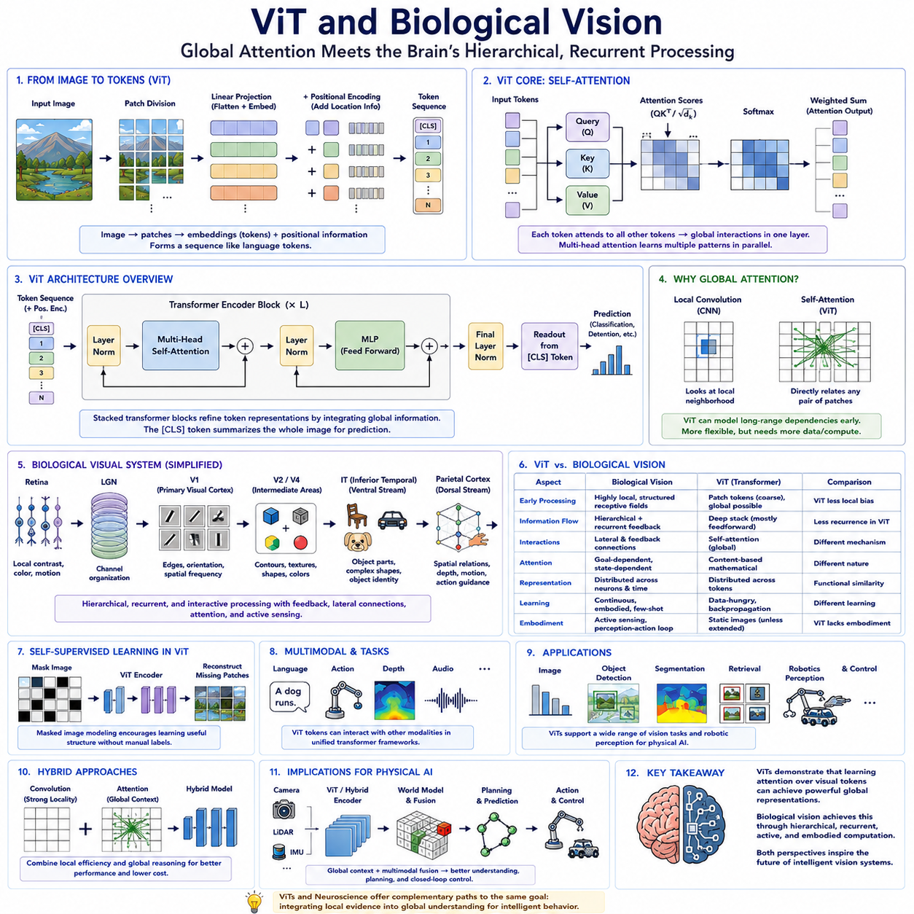{width="7.268055555555556in" height="7.268055555555556in"}

Vision Transformers, or ViTs, represent images as sequences of visual patches rather than relying primarily on local convolutional filters. Within the neuroscience-oriented structure, they provide a useful contrast with CNN-inspired visual processing by emphasizing global interactions among image regions through attention, while remaining an engineering abstraction rather than a biological model of vision.

A ViT begins by dividing an input image into fixed-size patches. Each patch is flattened or projected into a numerical embedding that becomes a visual token. These tokens form a sequence similar to the token sequences processed by language transformers. The transformation replaces the traditional assumption that visual features must initially be extracted through repeated local convolutional operations.

Because patch tokens alone do not indicate where they originated, positional information must be added to their embeddings. Positional encodings allow the model to distinguish patches appearing at different locations and preserve spatial relationships. Without this information, self-attention would treat the input primarily as an unordered collection of visual tokens rather than as a structured two-dimensional scene.

The central computation in a ViT is self-attention. Each token generates query, key, and value representations, and attention scores determine how strongly information from other tokens should influence its updated representation. Unlike a small convolution kernel, which initially examines a local neighborhood, self-attention can directly establish relationships between spatially distant image regions within a layer.

Multi-head self-attention extends this mechanism by learning several interaction patterns in parallel. Different attention heads can emphasize different relationships among patches, allowing the representation to capture complementary aspects of visual structure. Repeated transformer layers progressively refine these interactions, combining visual evidence across the image into representations useful for recognition and other downstream tasks.

This global communication provides one important distinction between ViTs and conventional CNNs. CNNs possess strong locality and translation-related inductive biases because filters are shared across nearby spatial regions. Standard ViTs impose weaker assumptions about locality and instead learn relationships through attention. This greater flexibility can be powerful, but historically it also made original ViTs more dependent on large-scale training data.

Biological visual systems provide a very different architecture. Early vision begins with highly local and structured processing in the retina, LGN, and V1, where contrast, orientation, spatial frequency, position, and temporal properties are represented through specialized neural circuits. Higher cortical areas then integrate increasingly broad spatial relationships while extensive feedback and lateral connections continually modify processing.

For this reason, self-attention should not be interpreted as a direct artificial equivalent of biological attention. Biological attention involves distributed interactions among sensory, thalamic, cortical, memory, and control systems and can alter neural processing according to goals and behavioral state. Transformer attention is a mathematical mechanism that computes content-dependent interactions among artificial representations.

Nevertheless, ViTs share some broad functional principles with biological vision. Both can integrate information across multiple locations, create distributed representations, and allow the interpretation of one region to depend on information elsewhere. Context is therefore important in both systems. A local visual pattern can acquire different significance depending on surrounding objects, spatial relationships, and the broader scene.

Receptive-field behavior provides another useful comparison. Early biological neurons have relatively restricted receptive fields, whereas higher visual regions integrate information across broader areas. In a ViT, attention can produce effectively global interactions much earlier. Modern hierarchical and window-based vision transformers often reintroduce locality and multiscale structure, combining local computation with progressively wider information exchange.

The comparison also highlights recurrence. Biological vision contains extensive top-down feedback, lateral interaction, eye movements, and repeated perception-action cycles. A standard ViT typically processes an image through a fixed stack of transformer blocks during one inference pass. Although repeated transformer layers perform iterative transformations, this should not be equated with the continuous recurrent dynamics of the biological visual system.

Representation learning is central to both CNNs and ViTs, but ViTs often emphasize relationships among tokens rather than fixed local filter structures. Early layers can represent visual patterns and spatial relationships, while deeper layers develop increasingly task-relevant representations. With sufficient training, such representations can support classification, detection, segmentation, retrieval, and transfer to many other visual tasks.

Self-supervised learning has strengthened the role of transformer-based vision. Masked-image modeling can remove large portions of an image and train a model to reconstruct or predict missing information, encouraging the network to learn structural regularities without requiring manual labels for every example. This provides a computational connection to the broader idea that useful visual representations can emerge by predicting hidden or incomplete sensory information.

Vision transformers also provide an important bridge toward multimodal artificial intelligence. Visual tokens can interact with language, actions, depth, audio, and other tokenized representations within related transformer architectures. This allows models to move beyond isolated image classification toward visual question answering, image-language alignment, semantic reasoning, instruction following, and representations that connect perception with knowledge.

For physical AI, global visual context can be valuable when an agent must reason about relationships among objects, free space, obstacles, goals, and potential actions. ViT-based encoders can provide visual representations to world models, planners, or vision-language-action systems. However, robotic deployment also requires attention to latency, memory, energy consumption, temporal processing, and reliable integration with other sensors.

Hybrid architectures can combine the complementary advantages of convolution and attention. Convolution provides efficient local processing and strong spatial inductive bias, while attention enables flexible long-range interaction and contextual integration. Similar engineering strategies can combine multiscale feature hierarchies, local windows, global tokens, and cross-modal attention to construct efficient representations for complex visual environments.

The biological comparison ultimately emphasizes differences as strongly as similarities. The brain uses spikes, specialized cell types, recurrent circuits, neuromodulation, active sensing, continuous learning, and tightly coupled perception-action loops. ViTs use matrix operations, learned embeddings, self-attention, optimization through backpropagation, and digital hardware. Their usefulness does not depend on reproducing biological mechanisms exactly.

ViTs and biological vision therefore illustrate two different ways of solving the problem of integrating local evidence into global understanding. Neuroscience demonstrates hierarchical, recurrent, active, and highly specialized visual computation, while ViTs demonstrate that learned attention over distributed visual tokens can achieve powerful global representation. Comparing them reveals design principles for AI without confusing functional inspiration with biological equivalence.

비전 트랜스포머(Vision Transformer, ViT)는 주로 국소적인 합성곱 필터(Local Convolutional Filter)에 의존하는 대신 이미지를 일련의 시각 패치(Visual Patch)로 표현합니다. 신경과학(Neuroscience) 중심의 구조에서 ViT는 어텐션(Attention)을 통해 이미지 영역 사이의 전역적 상호작용(Global Interaction)을 강조한다는 점에서 CNN 기반 시각 처리와 유용한 대비를 제공합니다. 그러나 ViT는 생물학적 시각(Biological Vision)의 직접적인 모델이 아니라 공학적 추상화(Engineering Abstraction)로 이해해야 합니다.

ViT는 입력 이미지(Input Image)를 고정된 크기의 패치(Fixed-Size Patch)로 나누는 것에서 시작합니다. 각각의 패치는 평탄화(Flattening)되거나 수치적 임베딩(Numerical Embedding)으로 투영되어 시각 토큰(Visual Token)이 됩니다. 이러한 토큰은 언어 트랜스포머(Language Transformer)가 처리하는 토큰 시퀀스(Token Sequence)와 유사한 형태의 시퀀스를 구성합니다. 이러한 변환은 시각 특징이 반드시 반복적인 국소 합성곱 연산을 통해 먼저 추출되어야 한다는 전통적인 가정을 대체합니다.

패치 토큰 자체에는 원래 이미지의 어느 위치에서 생성되었는지에 관한 정보가 포함되어 있지 않기 때문에 위치 정보(Positional Information)를 임베딩에 추가해야 합니다. 위치 인코딩(Positional Encoding)은 모델이 서로 다른 위치에 나타나는 패치를 구별하고 공간적 관계(Spatial Relationship)를 유지할 수 있도록 합니다. 이러한 정보가 없다면 자기어텐션(Self-Attention)은 입력을 구조화된 2차원 장면(Structured Two-Dimensional Scene)이 아니라 주로 순서가 없는 시각 토큰의 집합으로 처리하게 됩니다.

ViT의 핵심 계산은 자기어텐션(Self-Attention)입니다. 각각의 토큰은 쿼리(Query), 키(Key), 값(Value) 표현을 생성하며, 어텐션 점수(Attention Score)는 다른 토큰의 정보가 해당 토큰의 갱신된 표현에 얼마나 강하게 영향을 줄 것인지를 결정합니다. 작은 합성곱 커널(Convolution Kernel)이 처음에는 국소적인 주변 영역만을 조사하는 것과 달리 자기어텐션은 하나의 계층 내에서 공간적으로 멀리 떨어진 이미지 영역 사이의 관계를 직접 형성할 수 있습니다.

다중 헤드 자기어텐션(Multi-Head Self-Attention)은 여러 상호작용 패턴(Interaction Pattern)을 병렬적으로 학습함으로써 이러한 메커니즘을 확장합니다. 서로 다른 어텐션 헤드(Attention Head)는 패치 사이의 서로 다른 관계를 강조할 수 있으므로 표현은 시각 구조의 상호보완적인 측면을 포착할 수 있습니다. 반복되는 트랜스포머 계층(Transformer Layer)은 이러한 상호작용을 점진적으로 정제하여 이미지 전체의 시각적 증거를 인식 및 기타 후속 작업(Downstream Task)에 유용한 표현으로 결합합니다.

이러한 전역적 통신(Global Communication)은 ViT와 전통적인 CNN 사이의 중요한 차이점 가운데 하나입니다. CNN은 필터가 인접한 공간 영역에 걸쳐 공유되기 때문에 강한 국소성(Locality)과 이동 관련 귀납적 편향(Translation-Related Inductive Bias)을 갖습니다. 표준 ViT는 국소성에 대해 상대적으로 약한 가정을 적용하고 대신 어텐션을 통해 관계를 학습합니다. 이러한 높은 유연성은 강력할 수 있지만, 역사적으로 초기 ViT가 대규모 학습 데이터에 더욱 크게 의존하게 만든 요인이기도 합니다.

생물학적 시각 시스템(Biological Visual System)은 이와 매우 다른 아키텍처를 갖습니다. 초기 시각(Early Vision)은 망막(Retina), 외측슬상핵(Lateral Geniculate Nucleus, LGN), V1에서 고도로 국소적이고 구조화된 처리로 시작되며, 여기에서 대비(Contrast), 방향(Orientation), 공간 주파수(Spatial Frequency), 위치(Position), 시간적 특성(Temporal Property)이 전문화된 신경회로(Neural Circuit)를 통해 표현됩니다. 이후의 상위 피질 영역은 점차 넓은 공간적 관계를 통합하며, 광범위한 피드백 및 측면 연결(Feedback and Lateral Connection)이 처리 과정을 지속적으로 조절합니다.

이러한 이유로 자기어텐션을 생물학적 주의(Biological Attention)의 직접적인 인공적 대응물로 해석해서는 안 됩니다. 생물학적 주의는 감각(Sensory), 시상(Thalamic), 피질(Cortical), 기억(Memory), 제어 시스템(Control System) 사이에 분산된 상호작용을 포함하며 목표(Goal)와 행동 상태(Behavioral State)에 따라 신경 처리를 변화시킬 수 있습니다. 반면 트랜스포머 어텐션(Transformer Attention)은 인공 표현 사이의 콘텐츠 의존적 상호작용(Content-Dependent Interaction)을 계산하는 수학적 메커니즘입니다.

그럼에도 ViT는 생물학적 시각과 몇 가지 광범위한 기능적 원리(Functional Principle)를 공유합니다. 두 시스템 모두 여러 위치에 걸친 정보를 통합하고, 분산 표현(Distributed Representation)을 생성하며, 하나의 영역에 대한 해석이 다른 영역의 정보에 영향을 받도록 할 수 있습니다. 따라서 두 시스템 모두에서 맥락(Context)은 중요합니다. 국소적인 시각 패턴은 주변 객체, 공간적 관계, 더 넓은 장면(Scene)에 따라 서로 다른 의미를 가질 수 있습니다.

수용장(Receptive Field)의 특성도 유용한 비교를 제공합니다. 초기 생물학적 뉴런은 비교적 제한된 수용장을 갖는 반면, 상위 시각 영역은 더 넓은 영역의 정보를 통합합니다. ViT에서는 어텐션을 통해 훨씬 초기 단계에서도 사실상 전역적인 상호작용(Global Interaction)을 생성할 수 있습니다. 현대의 계층적 비전 트랜스포머(Hierarchical Vision Transformer)와 윈도우 기반 비전 트랜스포머(Window-Based Vision Transformer)는 국소성과 다중 스케일 구조(Multiscale Structure)를 다시 도입하여 국소 계산과 점진적으로 넓어지는 정보 교환을 결합하는 경우가 많습니다.

이러한 비교는 순환성(Recurrence)의 차이도 강조합니다. 생물학적 시각에는 광범위한 하향식 피드백(Top-Down Feedback), 측면 상호작용(Lateral Interaction), 안구 운동(Eye Movement), 반복적인 지각-행동 순환(Perception-Action Cycle)이 존재합니다. 표준 ViT는 일반적으로 한 번의 추론 과정(Inference Pass)에서 고정된 트랜스포머 블록(Transformer Block)의 스택을 통해 이미지를 처리합니다. 반복되는 트랜스포머 계층이 순차적인 변환을 수행하기는 하지만 이를 생물학적 시각 시스템의 지속적인 순환 동역학(Recurrent Dynamics)과 동일하게 보아서는 안 됩니다.

표현 학습(Representation Learning)은 CNN과 ViT 모두에서 핵심적이지만, ViT는 고정된 국소 필터 구조보다 토큰 사이의 관계를 강조하는 경우가 많습니다. 초기 계층은 시각 패턴과 공간적 관계를 표현할 수 있으며, 더 깊은 계층은 점차 작업과 관련된 표현(Task-Relevant Representation)을 형성합니다. 충분한 학습을 통해 이러한 표현은 분류(Classification), 검출(Detection), 분할(Segmentation), 검색(Retrieval), 기타 다양한 시각 작업을 지원할 수 있습니다.

자기지도학습(Self-Supervised Learning)은 트랜스포머 기반 시각의 역할을 더욱 강화했습니다. 마스크 이미지 모델링(Masked-Image Modeling)은 이미지의 상당 부분을 제거하고 모델이 누락된 정보를 복원하거나 예측하도록 학습하여 모든 사례에 수작업 레이블(Manual Label)을 요구하지 않고 구조적 규칙성(Structural Regularity)을 학습하도록 합니다. 이는 숨겨지거나 불완전한 감각 정보를 예측함으로써 유용한 시각 표현을 형성할 수 있다는 보다 광범위한 개념과 계산적으로 연결됩니다.

비전 트랜스포머는 멀티모달 인공지능(Multimodal Artificial Intelligence)으로 발전하기 위한 중요한 연결고리도 제공합니다. 시각 토큰은 관련된 트랜스포머 아키텍처에서 언어(Language), 행동(Action), 깊이(Depth), 오디오(Audio), 기타 토큰화된 표현(Tokenized Representation)과 상호작용할 수 있습니다. 이를 통해 모델은 독립적인 이미지 분류를 넘어 시각 질의응답(Visual Question Answering), 이미지-언어 정렬(Image-Language Alignment), 의미적 추론(Semantic Reasoning), 지시 수행(Instruction Following), 지각과 지식을 연결하는 표현으로 확장될 수 있습니다.

피지컬 인공지능(Physical AI)에서는 에이전트(Agent)가 객체, 자유 공간(Free Space), 장애물(Obstacle), 목표(Goal), 가능한 행동(Possible Action) 사이의 관계를 추론해야 할 때 전역적인 시각 맥락(Global Visual Context)이 유용할 수 있습니다. ViT 기반 인코더(Encoder)는 월드 모델(World Model), 계획기(Planner), 비전-언어-행동 시스템(Vision-Language-Action System)에 시각 표현을 제공할 수 있습니다. 그러나 로봇에 실제로 적용하려면 지연시간(Latency), 메모리(Memory), 에너지 소비(Energy Consumption), 시간적 처리(Temporal Processing), 다른 센서와의 신뢰성 높은 통합도 함께 고려해야 합니다.

하이브리드 아키텍처(Hybrid Architecture)는 합성곱(Convolution)과 어텐션의 상호보완적인 장점을 결합할 수 있습니다. 합성곱은 효율적인 국소 처리와 강한 공간적 귀납적 편향(Spatial Inductive Bias)을 제공하고, 어텐션은 유연한 장거리 상호작용(Long-Range Interaction)과 맥락적 통합(Contextual Integration)을 가능하게 합니다. 이와 유사한 공학적 전략은 다중 스케일 특징 계층(Multiscale Feature Hierarchy), 국소 윈도우(Local Window), 전역 토큰(Global Token), 교차 모달 어텐션(Cross-Modal Attention)을 결합하여 복잡한 시각 환경을 위한 효율적인 표현을 구성할 수 있습니다.

생물학적 시각과의 비교는 궁극적으로 유사성만큼이나 차이점을 강조합니다. 뇌는 스파이크(Spike), 전문화된 세포 유형(Specialized Cell Type), 순환 회로(Recurrent Circuit), 신경조절(Neuromodulation), 능동적 감지(Active Sensing), 지속 학습(Continuous Learning), 긴밀하게 결합된 지각-행동 루프(Perception-Action Loop)를 사용합니다. 반면 ViT는 행렬 연산(Matrix Operation), 학습된 임베딩(Learned Embedding), 자기어텐션, 역전파(Backpropagation)를 통한 최적화(Optimization), 디지털 하드웨어(Digital Hardware)를 사용합니다. ViT의 유용성은 생물학적 메커니즘을 정확하게 재현하는 데 의존하지 않습니다.

따라서 ViT와 생물학적 시각은 국소적인 증거(Local Evidence)를 전역적인 이해(Global Understanding)로 통합하는 문제를 해결하는 서로 다른 두 가지 방식을 보여줍니다. 신경과학은 계층적(Hierarchical), 순환적(Recurrent), 능동적(Active), 고도로 전문화된 시각 계산(Visual Computation)을 보여주는 반면, ViT는 분산된 시각 토큰에 대한 학습된 어텐션이 강력한 전역 표현(Global Representation)을 형성할 수 있음을 보여줍니다. 두 시스템의 비교는 기능적 영감(Functional Inspiration)과 생물학적 동등성(Biological Equivalence)을 혼동하지 않으면서 인공지능 설계를 위한 중요한 원리를 제공합니다.

##  

## 02.09 Temporal Visual Processing [w/Code]

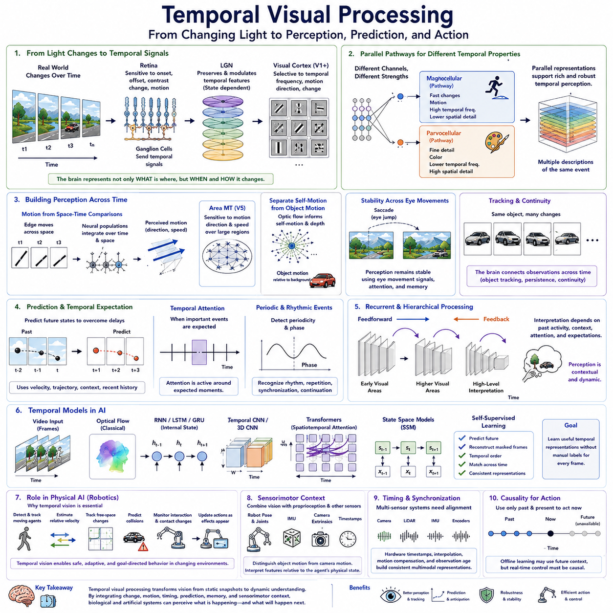{width="7.268055555555556in" height="7.268055555555556in"}

Temporal visual processing refers to the ability of the visual system to represent how sensory information changes over time rather than treating perception as a sequence of independent static images. The nervous system continuously integrates current visual input with recent activity, allowing it to detect motion, establish temporal order, maintain continuity, and anticipate how objects and scenes are likely to evolve.

Visual signals already contain temporal structure at the retinal level. Photoreceptors and retinal circuits respond differently to sustained illumination, rapid changes, onset, offset, and variations in contrast. Retinal ganglion cells therefore transmit not only information about spatial patterns but also signals reflecting when visual conditions change, providing later visual pathways with temporally organized sensory evidence.

Different visual channels emphasize different temporal properties. Magnocellular-related pathways are particularly sensitive to rapid changes, motion, and relatively high temporal frequencies, whereas other pathways preserve finer spatial and chromatic information. Parallel processing allows the brain to retain multiple descriptions of a visual event instead of forcing spatial detail, color, motion, and timing into one uniform representation.

The lateral geniculate nucleus does more than pass retinal signals directly to cortex. Its organized pathways preserve temporal characteristics while cortical feedback and state-dependent modulation influence signal transmission. When information reaches primary visual cortex, neural populations can respond selectively to temporal frequency, motion direction, changing contrast, and combinations of spatial and temporal structure.

Temporal integration requires an appropriate observation window. If neural responses were determined only by instantaneous input, motion and temporal relationships could not be estimated reliably. If information were integrated for too long, rapidly changing events would become blurred together. Biological vision therefore operates across multiple temporal scales, balancing sensitivity to rapid transitions with stability across short intervals.

Motion perception emerges from comparisons of visual information across both space and time. An edge appearing at one location and shortly afterward at another provides evidence about displacement and direction. Neural populations integrate such changing patterns to estimate motion rather than explicitly storing every previous retinal image, producing compact representations of dynamic visual relationships.

Area MT, also called V5, is strongly associated with visual motion processing. Neurons in this region can exhibit selectivity for motion direction and speed while integrating evidence across larger receptive fields than many early visual neurons. Such integration helps transform ambiguous local motion measurements into more coherent estimates of how surfaces, objects, or larger visual patterns are moving.

Temporal processing is essential for distinguishing object motion from changes produced by observer movement. Walking, turning the head, or moving the eyes causes widespread transformations across the retinal image even when the environment remains stationary. Optic flow and other structured motion patterns can therefore provide information about self-motion, heading, depth, and the relative movement of objects.

Eye movements create an especially important challenge because visual input changes whenever the eyes shift. Yet perception usually remains stable rather than appearing to jump with every saccade. Neural systems combine visual evidence with information related to eye movements, attention, and previous state, helping maintain a coherent representation of the environment across discontinuous sensory samples.

Temporal continuity also contributes to object tracking. An object may change position, orientation, scale, illumination, or visibility while remaining the same physical entity. By connecting observations across time, the visual system can maintain identity despite these changes. This capability prepares the conceptual foundation for object persistence and object continuity, which extend beyond motion estimation into stable representations of enduring entities.

Prediction is closely connected to temporal vision because sensory processing and motor responses involve unavoidable delays. Estimating only where an object was when light reached the retina may be insufficient for rapid interaction. Neural processing can exploit velocity, trajectory, context, and recent history to anticipate likely future states, supporting interception, avoidance, tracking, and coordinated action.

Temporal expectation can also influence perception. When events occur with regular timing, the nervous system can become sensitive to when relevant information is likely to appear. Attention can therefore operate not only spatially but temporally, prioritizing processing around expected moments. Timing becomes part of perceptual organization rather than merely an external property measured after recognition.

Repeated or periodic visual events introduce another form of temporal structure. Biological motion, walking, rotating machinery, blinking signals, and environmental rhythms contain patterns that unfold over characteristic timescales. Detecting periodicity allows the visual system to distinguish structured dynamics from random variation and can provide information about phase, repetition, synchronization, and likely continuation.

Temporal visual processing is inherently recurrent. Feedforward signals rapidly propagate visual evidence through cortical hierarchies, but lateral and feedback connections allow earlier and later representations to interact over time. Consequently, the interpretation of a frame can depend on preceding activity, contextual expectations, attention, and higher-level hypotheses rather than being determined exclusively by instantaneous bottom-up input.

Memory and temporal perception are closely connected but operate across different scales. Very short sensory traces help integrate rapidly changing visual input, while working memory can preserve task-relevant information over longer intervals. Longer-term memory supplies learned expectations about objects, actions, and event sequences. Temporal vision therefore exists within a broader hierarchy of memory and prediction.

Artificial vision faces the same fundamental limitation as static perception: a single image cannot directly reveal how the scene is changing. Video models introduce time by processing sequences of frames, enabling estimation of motion, trajectories, interactions, and events. The representation must preserve enough spatial detail to identify relevant entities while also encoding how those entities evolve across successive observations.

Optical flow provides a classical computational representation of temporal change by estimating apparent image motion between frames. Modern neural models can learn motion features directly from data rather than relying exclusively on explicitly calculated flow. Nevertheless, the underlying problem remains similar: useful dynamic perception requires relating visual evidence at different times rather than analyzing every frame independently.

Recurrent neural networks and related sequence models introduced explicit internal state into artificial temporal vision. A hidden state summarizes information from earlier observations and influences processing of the current input. This allows a model to represent temporal dependencies without retaining every previous frame directly, although information can be lost when long histories are compressed into a limited state.

Temporal convolution offers another strategy by applying learned operations across neighboring frames or feature sequences. Three-dimensional convolutions can jointly process spatial and temporal dimensions, enabling local motion patterns to be learned directly. Such models naturally encode short-range temporal structure, although representing very long dependencies may require deeper networks, larger windows, or additional sequence mechanisms.

Transformers provide a different approach by allowing visual tokens from different times to interact through attention. Spatial attention can model relationships within a frame, while temporal attention can connect features across frames. Joint spatiotemporal attention can represent both dimensions simultaneously, but computational requirements grow rapidly as the number of frames and visual tokens increases.

State space models provide another approach to long visual sequences by maintaining a learned state that evolves as new observations arrive. Their computational characteristics can make them attractive for long-duration video and robotics streams. Rather than comparing every token directly with every other token, they can progressively update compact temporal representations while preserving information considered important for future processing.

Self-supervised learning is particularly suitable for temporal vision because video naturally provides supervisory structure. Models can predict future representations, reconstruct masked frames, determine temporal order, match corresponding regions across time, or learn representations that remain consistent as objects move. Such objectives allow useful temporal features to emerge without requiring detailed manual labels for every frame.

For physical AI, temporal vision is indispensable because robots operate in continuously changing environments. A mobile robot must distinguish static obstacles from moving agents, estimate relative velocity, track free-space changes, and anticipate collisions. A manipulator must follow object motion, monitor interaction progress, detect contact-related changes, and update its actions as the visual consequences of movement become observable.

Temporal perception becomes more reliable when vision is combined with proprioception and other sensors. A stationary object can move across an image because the camera itself moved. Robot pose, joint state, IMU measurements, camera extrinsics, and synchronized timestamps help distinguish environmental motion from sensor motion. Visual features should therefore be interpreted relative to the physical state of the observing agent.

Sensor timing is especially important in embodied systems because different modalities operate at different rates and experience different delays. Cameras, LiDAR, IMUs, encoders, and control signals may correspond to different physical moments unless carefully synchronized. Hardware timestamps, interpolation, motion compensation, and observation-age information help construct temporally consistent multimodal representations.

Temporal models used for action must also respect causality. During real-time operation, a system cannot use future observations to decide an action that must occur now. Offline representation learning may exploit both past and future context, but deployment requires causal processing or an explicit separation between prediction and unavailable future evidence. This distinction is essential when transferring video models into closed-loop control.

Temporal visual processing therefore transforms vision from static pattern recognition into dynamic state estimation. By integrating change, motion, continuity, timing, prediction, memory, and sensorimotor context, biological and artificial systems can represent not merely what exists in a scene but what is happening and what may happen next. This capability forms a critical bridge from visual perception toward world models, prediction, planning, and intelligent action.

시간적 시각 처리(Temporal Visual Processing)는 지각을 서로 독립적인 정적 이미지(Static Image)의 연속으로 다루는 것이 아니라 감각 정보가 시간에 따라 어떻게 변화하는지를 표현하는 시각 시스템(Visual System)의 능력을 의미합니다. 신경계(Nervous System)는 현재의 시각 입력을 최근의 활동과 지속적으로 통합하여 움직임(Motion)을 검출하고, 시간적 순서(Temporal Order)를 형성하며, 연속성(Continuity)을 유지하고, 객체와 장면(Scene)이 앞으로 어떻게 변화할 가능성이 있는지를 예측할 수 있도록 합니다.

시각 신호는 이미 망막(Retina) 수준에서 시간적 구조(Temporal Structure)를 포함합니다. 광수용체(Photoreceptor)와 망막 회로(Retinal Circuit)는 지속적인 조명(Sustained Illumination), 빠른 변화, 시작(Onset), 종료(Offset), 대비(Contrast)의 변화에 서로 다르게 반응합니다. 따라서 망막신경절세포(Retinal Ganglion Cell)는 공간 패턴(Spatial Pattern)에 관한 정보뿐만 아니라 시각 조건이 언제 변화하는지를 반영하는 신호도 전달하여 이후 시각 경로에 시간적으로 조직된 감각 증거(Sensory Evidence)를 제공합니다.

서로 다른 시각 채널(Visual Channel)은 서로 다른 시간적 특성을 강조합니다. 대세포 관련 경로(Magnocellular-Related Pathway)는 특히 빠른 변화, 움직임, 비교적 높은 시간 주파수(Temporal Frequency)에 민감한 반면, 다른 경로는 보다 세밀한 공간 및 색채 정보(Chromatic Information)를 유지합니다. 병렬 처리(Parallel Processing)를 통해 뇌는 공간적 세부 정보, 색상, 움직임, 타이밍을 하나의 균일한 표현으로 강제로 통합하지 않고 하나의 시각 사건(Visual Event)에 대한 여러 종류의 표현을 동시에 유지할 수 있습니다.

외측슬상핵(Lateral Geniculate Nucleus, LGN)은 망막 신호를 단순히 피질로 전달하는 것 이상의 역할을 합니다. 외측슬상핵의 조직화된 경로는 시간적 특성을 유지하며, 피질 피드백(Cortical Feedback)과 상태 의존적 조절(State-Dependent Modulation)은 신호가 전달되는 방식에 영향을 줍니다. 정보가 일차시각피질(Primary Visual Cortex)에 도달하면 뉴런 집단(Neural Population)은 시간 주파수, 운동 방향(Motion Direction), 변화하는 대비, 공간적·시간적 구조의 조합에 선택적으로 반응할 수 있습니다.

시간적 통합(Temporal Integration)을 위해서는 적절한 관찰 시간 창(Observation Window)이 필요합니다. 신경 반응이 순간적인 입력만으로 결정된다면 움직임과 시간적 관계를 신뢰성 있게 추정하기 어렵습니다. 반대로 정보를 지나치게 오랫동안 통합하면 빠르게 변화하는 사건들이 서로 흐려질 수 있습니다. 따라서 생물학적 시각은 여러 시간 규모(Timescale)에서 작동하며, 빠른 전이에 대한 민감성과 짧은 구간 동안의 안정성을 균형 있게 유지합니다.

운동 지각(Motion Perception)은 공간과 시간에 걸친 시각 정보의 비교를 통해 발생합니다. 하나의 에지(Edge)가 한 위치에 나타난 뒤 잠시 후 다른 위치에 나타나면 변위(Displacement)와 방향에 대한 증거가 제공됩니다. 뉴런 집단은 각각의 이전 망막 이미지를 명시적으로 모두 저장하는 대신 이러한 변화 패턴을 통합하여 움직임을 추정하고 동적인 시각 관계(Dynamic Visual Relationship)의 압축된 표현을 생성합니다.

MT 영역(Area MT), 즉 V5는 시각적 운동 처리(Visual Motion Processing)와 강하게 관련되어 있습니다. 이 영역의 뉴런은 움직임의 방향과 속도(Speed)에 선택성을 나타낼 수 있으며, 많은 초기 시각 뉴런보다 넓은 수용장(Receptive Field)에 걸쳐 증거를 통합합니다. 이러한 통합은 모호한 국소 운동 측정(Local Motion Measurement)을 표면, 객체, 더 큰 시각 패턴이 어떻게 움직이는지에 관한 보다 일관된 추정으로 변환하는 데 도움을 줍니다.

시간적 처리는 객체의 실제 움직임과 관찰자의 움직임 때문에 발생하는 변화도 구분해야 합니다. 걷기, 머리 돌리기, 안구 운동(Eye Movement)은 환경 자체가 정지해 있더라도 망막 이미지 전체에 광범위한 변화를 일으킵니다. 따라서 광학 흐름(Optic Flow)과 기타 구조화된 운동 패턴은 자기 운동(Self-Motion), 진행 방향(Heading), 깊이(Depth), 객체의 상대적 움직임(Relative Movement)에 관한 정보를 제공할 수 있습니다.

안구 운동은 눈이 이동할 때마다 시각 입력이 변화하기 때문에 특히 중요한 문제를 발생시킵니다. 그러나 일반적으로 지각은 매번 단속운동(Saccade)이 발생할 때마다 장면이 점프하는 것처럼 느껴지지 않고 안정적으로 유지됩니다. 신경 시스템은 시각 증거를 안구 운동 관련 정보, 주의(Attention), 이전 상태(Previous State)와 결합하여 불연속적인 감각 샘플(Sensory Sample) 사이에서도 환경의 일관된 표현을 유지하도록 돕습니다.

시간적 연속성(Temporal Continuity)은 객체 추적(Object Tracking)에도 기여합니다. 하나의 객체는 동일한 물리적 개체로 유지되면서 위치, 방향, 크기(Scale), 조명(Illumination), 가시성(Visibility)이 변할 수 있습니다. 시각 시스템은 시간에 걸쳐 관측을 연결함으로써 이러한 변화에도 객체 정체성(Object Identity)을 유지할 수 있습니다. 이러한 능력은 운동 추정을 넘어 지속적으로 존재하는 개체의 안정적인 표현을 다루는 객체 지속성(Object Persistence)과 객체 연속성(Object Continuity)의 개념적 기반을 제공합니다.

감각 처리와 운동 반응에는 피할 수 없는 지연이 존재하기 때문에 예측(Prediction)은 시간적 시각과 밀접하게 연결됩니다. 빛이 망막에 도달했을 때 객체가 어디에 있었는지만 추정하는 것은 빠른 상호작용에 충분하지 않을 수 있습니다. 신경 처리는 속도, 궤적(Trajectory), 맥락(Context), 최근의 이력(Recent History)을 활용하여 미래 상태(Future State)를 예측하고, 가로채기(Interception), 회피(Avoidance), 추적, 협응 행동(Coordinated Action)을 지원할 수 있습니다.

시간적 기대(Temporal Expectation) 역시 지각에 영향을 줄 수 있습니다. 사건이 일정한 타이밍으로 발생하면 신경계는 중요한 정보가 언제 나타날 가능성이 높은지에 민감해질 수 있습니다. 따라서 주의는 공간적으로뿐만 아니라 시간적으로도 작동할 수 있으며, 예상되는 시점 주변에서 처리를 우선할 수 있습니다. 타이밍(Timing)은 인식이 끝난 뒤 별도로 측정되는 외부 특성이 아니라 지각 조직(Perceptual Organization)의 일부가 됩니다.

반복적 또는 주기적인 시각 사건은 또 다른 형태의 시간적 구조를 제공합니다. 생물학적 운동(Biological Motion), 걷기, 회전하는 기계, 깜박이는 신호, 환경적 리듬(Environmental Rhythm)은 특정한 시간 규모에서 전개되는 패턴을 포함합니다. 주기성(Periodicity)을 검출하면 시각 시스템은 구조화된 동역학(Structured Dynamics)과 무작위 변화를 구분할 수 있으며, 위상(Phase), 반복(Repetition), 동기화(Synchronization), 이후의 지속 가능성에 관한 정보를 얻을 수 있습니다.

시간적 시각 처리는 본질적으로 순환적(Recurrent)입니다. 순방향 신호(Feedforward Signal)는 시각 증거를 피질 계층을 따라 빠르게 전달하지만, 측면 및 피드백 연결(Lateral and Feedback Connection)은 초기 표현과 후기 표현이 시간에 따라 상호작용할 수 있도록 합니다. 따라서 하나의 프레임(Frame)에 대한 해석은 순간적인 상향식 입력만으로 결정되는 것이 아니라 이전 활동, 맥락적 기대, 주의, 상위 수준의 가설(Higher-Level Hypothesis)에 의존할 수 있습니다.

기억(Memory)과 시간적 지각(Temporal Perception)은 서로 긴밀하게 연결되지만 서로 다른 시간 규모에서 작동합니다. 매우 짧은 감각 흔적(Sensory Trace)은 빠르게 변화하는 시각 입력을 통합하는 데 도움을 주고, 작업 기억(Working Memory)은 작업 관련 정보를 더 긴 시간 동안 유지할 수 있습니다. 장기 기억(Long-Term Memory)은 객체, 행동, 사건 시퀀스(Event Sequence)에 대한 학습된 기대를 제공합니다. 따라서 시간적 시각은 더 넓은 기억 및 예측 계층(Hierarchy of Memory and Prediction) 안에서 작동합니다.

인공 시각(Artificial Vision) 역시 정적 지각과 동일한 근본적인 한계를 갖습니다. 하나의 이미지만으로는 장면이 어떻게 변화하고 있는지를 직접적으로 알 수 없습니다. 비디오 모델(Video Model)은 프레임 시퀀스(Frame Sequence)를 처리함으로써 시간을 도입하고, 움직임, 궤적, 상호작용(Interaction), 사건(Event)을 추정할 수 있도록 합니다. 이러한 표현은 관련 개체를 식별하는 데 필요한 충분한 공간 정보를 유지하는 동시에 개체가 연속적인 관측에서 어떻게 변화하는지도 부호화해야 합니다.

광학 흐름(Optical Flow)은 프레임 사이의 겉보기 이미지 운동(Apparent Image Motion)을 추정함으로써 시간적 변화를 표현하는 고전적인 계산 방식입니다. 현대 신경 모델(Neural Model)은 명시적으로 계산된 광학 흐름에만 의존하지 않고 데이터로부터 운동 특징(Motion Feature)을 직접 학습할 수 있습니다. 그럼에도 핵심 문제는 동일합니다. 유용한 동적 지각(Dynamic Perception)을 위해서는 각 프레임을 독립적으로 분석하는 것이 아니라 서로 다른 시점의 시각 증거를 연결해야 합니다.

순환신경망(Recurrent Neural Network, RNN)과 관련 시퀀스 모델(Sequence Model)은 인공 시간 시각에 명시적인 내부 상태(Internal State)를 도입했습니다. 은닉 상태(Hidden State)는 이전 관측의 정보를 요약하고 현재 입력의 처리에 영향을 줍니다. 이를 통해 모델은 모든 이전 프레임을 직접 유지하지 않고도 시간적 의존성(Temporal Dependency)을 표현할 수 있지만, 긴 이력을 제한된 상태로 압축할 경우 일부 정보가 손실될 수 있습니다.

시간적 합성곱(Temporal Convolution)은 인접한 프레임이나 특징 시퀀스에 학습된 연산을 적용하는 또 다른 전략을 제공합니다. 3차원 합성곱(Three-Dimensional Convolution, 3D Convolution)은 공간과 시간 차원을 함께 처리하여 국소적인 운동 패턴을 직접 학습할 수 있도록 합니다. 이러한 모델은 단거리 시간 구조(Short-Range Temporal Structure)를 자연스럽게 부호화하지만, 매우 긴 의존성을 표현하려면 더 깊은 네트워크, 더 넓은 시간 창, 추가적인 시퀀스 메커니즘이 필요할 수 있습니다.

트랜스포머(Transformer)는 서로 다른 시점의 시각 토큰(Visual Token)이 어텐션(Attention)을 통해 상호작용할 수 있도록 하는 다른 접근법을 제공합니다. 공간 어텐션(Spatial Attention)은 하나의 프레임 내부 관계를 모델링하고, 시간 어텐션(Temporal Attention)은 프레임 사이의 특징을 연결할 수 있습니다. 시공간 공동 어텐션(Joint Spatiotemporal Attention)은 두 차원을 동시에 표현할 수 있지만 프레임 수와 시각 토큰 수가 증가할수록 계산 요구량이 빠르게 증가합니다.

상태 공간 모델(State Space Model)은 새로운 관측이 들어올 때마다 변화하는 학습된 상태를 유지함으로써 긴 시각 시퀀스를 처리하는 또 다른 방법을 제공합니다. 이러한 모델의 계산 특성은 장시간 비디오와 로보틱스 스트림(Robotics Stream)에 유리할 수 있습니다. 모든 토큰을 다른 모든 토큰과 직접 비교하는 대신 미래 처리에 중요하다고 판단되는 정보를 유지하면서 압축된 시간 표현을 점진적으로 갱신할 수 있습니다.

비디오는 자연스럽게 학습 신호를 제공하기 때문에 자기지도학습(Self-Supervised Learning)은 시간적 시각에 특히 적합합니다. 모델은 미래 표현(Future Representation)을 예측하거나, 마스킹된 프레임(Masked Frame)을 복원하거나, 시간적 순서를 판단하거나, 시간에 걸쳐 대응하는 영역을 일치시키거나, 객체가 이동하더라도 일관되게 유지되는 표현을 학습할 수 있습니다. 이러한 목표는 모든 프레임에 상세한 수작업 레이블을 제공하지 않고도 유용한 시간적 특징을 형성할 수 있도록 합니다.

피지컬 인공지능(Physical AI)에서 시간적 시각은 로봇이 지속적으로 변화하는 환경에서 작동하기 때문에 필수적입니다. 자율이동로봇(Autonomous Mobile Robot)은 정적 장애물과 이동 에이전트(Moving Agent)를 구분하고, 상대 속도(Relative Velocity)를 추정하며, 자유 공간(Free Space)의 변화를 추적하고, 충돌 가능성을 예측해야 합니다. 조작기(Manipulator)는 객체 움직임을 따라가고, 상호작용 진행 상태를 모니터링하며, 접촉 관련 변화를 탐지하고, 움직임의 시각적 결과가 나타나는 대로 행동을 갱신해야 합니다.

시간적 지각은 시각을 고유수용감각(Proprioception) 및 다른 센서와 결합할 때 더욱 신뢰성 있게 작동합니다. 카메라 자체가 움직이면 정지된 객체도 이미지 안에서는 이동할 수 있습니다. 로봇 자세(Robot Pose), 관절 상태(Joint State), 관성측정장치(Inertial Measurement Unit, IMU), 카메라 외부 파라미터(Camera Extrinsics), 동기화된 타임스탬프(Synchronized Timestamp)는 환경의 운동과 센서 자체의 운동을 구분하는 데 도움을 줍니다. 따라서 시각 특징은 관찰하는 에이전트의 물리적 상태와 관련하여 해석되어야 합니다.

서로 다른 모달리티(Modality)는 서로 다른 주기로 동작하고 서로 다른 지연을 경험할 수 있기 때문에 체화 시스템(Embodied System)에서 센서 타이밍(Sensor Timing)은 특히 중요합니다. 카메라, 라이다(LiDAR), IMU, 인코더(Encoder), 제어 신호(Control Signal)는 정밀하게 동기화하지 않으면 서로 다른 실제 시점을 나타낼 수 있습니다. 하드웨어 타임스탬프(Hardware Timestamp), 보간(Interpolation), 운동 보상(Motion Compensation), 관측 경과 시간(Observation Age) 정보는 시간적으로 일관된 멀티모달 표현(Multimodal Representation)을 구성하는 데 도움을 줍니다.

행동(Action)을 위해 사용되는 시간 모델은 인과성(Causality)도 준수해야 합니다. 실시간 운영 중에는 현재 수행해야 하는 행동을 결정하기 위해 미래의 관측을 사용할 수 없습니다. 오프라인 표현 학습(Offline Representation Learning)에서는 과거와 미래의 맥락을 모두 활용할 수 있지만, 실제 배치(Deployment)에서는 인과적 처리(Causal Processing)를 사용하거나 예측(Prediction)과 실제로 이용할 수 없는 미래 증거를 명확하게 분리해야 합니다. 이러한 구분은 비디오 모델을 폐루프 제어(Closed-Loop Control)에 적용할 때 필수적입니다.

따라서 시간적 시각 처리(Temporal Visual Processing)는 시각을 정적인 패턴 인식(Static Pattern Recognition)에서 동적 상태 추정(Dynamic State Estimation)으로 확장합니다. 변화, 움직임, 연속성, 타이밍, 예측, 기억, 감각운동 맥락(Sensorimotor Context)을 통합함으로써 생물학적 시스템과 인공 시스템은 장면에 무엇이 존재하는지만이 아니라 현재 무엇이 일어나고 있으며 다음에 무엇이 일어날 수 있는지를 표현할 수 있습니다. 이러한 능력은 시각 지각을 월드 모델(World Model), 예측, 계획(Planning), 지능적 행동(Intelligent Action)으로 연결하는 핵심적인 가교를 형성합니다.

##  

## 02.10 Object Persistence and Object Continuity [w/Code]

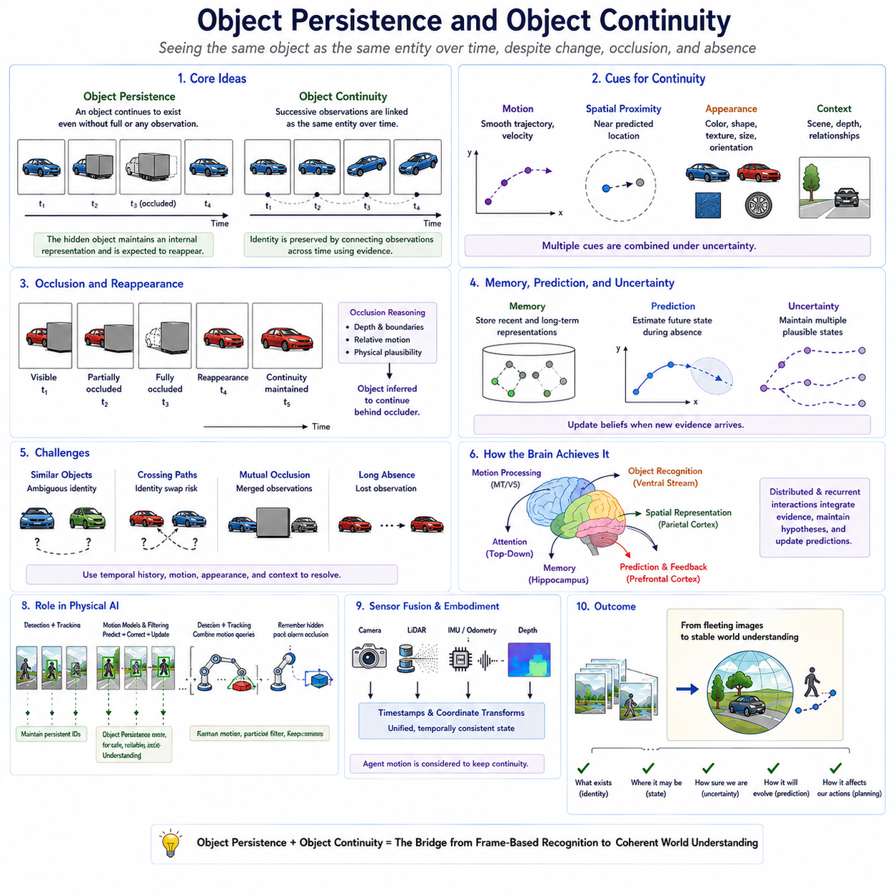{width="7.268055555555556in" height="7.268055555555556in"}

Object persistence and object continuity describe the ability of a perceptual system to represent a physical object as the same enduring entity while its sensory appearance changes over time. Objects move, rotate, become partially hidden, leave the field of view, or undergo changes in illumination and scale, yet biological vision usually maintains a stable interpretation of their identity rather than treating every observation as a new object.

Visual perception therefore requires more than recognizing patterns within individual images. The nervous system must connect observations across time and determine whether changing sensory signals originate from an existing object or from a different entity. This process transforms momentary visual measurements into temporally extended representations that support stable perception of a dynamic physical world.

Object persistence refers broadly to the representation that an object continues to exist even when direct sensory evidence becomes weak, incomplete, or temporarily unavailable. An object passing behind another object does not normally cease to exist perceptually. Instead, the visual system can maintain an internal representation of the hidden object and expect it to reappear in a physically plausible location.

Object continuity concerns the relationships that connect successive observations of an object through time. Position, velocity, appearance, shape, trajectory, and contextual information provide evidence that an object observed at one moment corresponds to an object observed later. Continuity therefore provides the temporal association mechanism required to preserve identity across changing sensory observations.

Motion is one of the strongest cues for establishing continuity. When an object follows a smooth trajectory, observations at neighboring moments can be linked according to expected displacement and velocity. Abruptly assigning the identity to a distant unrelated object would violate ordinary motion constraints. Temporal prediction therefore narrows the range of plausible correspondences between observations.

Spatial proximity also contributes to object correspondence. An observation appearing near the predicted location of a previously tracked object is generally more likely to represent the same entity than an otherwise similar observation appearing far away. Proximity alone is insufficient, however, because objects can cross paths, move rapidly, or temporarily disappear, requiring additional evidence from motion and appearance.

Visual appearance provides another important source of identity information. Color, texture, shape, size, orientation, and learned object features can help distinguish multiple entities occupying the same environment. Because appearance changes with viewpoint, illumination, deformation, and occlusion, robust continuity depends on representations that tolerate natural variation while preserving identity-relevant characteristics.

Occlusion demonstrates why persistence cannot depend exclusively on continuous sensory visibility. When one object moves behind another, its image may disappear partially or completely. The visual system can infer that the hidden entity remains present and can maintain expectations about its trajectory. Reappearance consistent with those expectations strengthens the interpretation that the same object persisted throughout the invisible interval.

The geometry of occlusion provides useful evidence about physical continuity. Boundaries, depth relationships, and motion can indicate whether an object is moving behind an occluding surface rather than disappearing from existence. Such reasoning reflects an important transition from image-based representation toward scene-based representation, in which perceptual interpretation incorporates assumptions about objects occupying a persistent three-dimensional environment.

Object permanence is closely related to these ideas and refers to the understanding that objects continue to exist when they are not directly perceived. In biological cognition, this capability develops through interaction between perception, memory, prediction, and experience. For artificial intelligence, an analogous capability requires maintaining internal state beyond the information immediately visible in the current sensor frame.

Memory is therefore essential for object persistence. Recent visual observations can be retained long enough to bridge short interruptions, while longer-lived representations may preserve information about entities that remain relevant after extended absence. Memory must also be selective because continuously storing every sensory detail would be inefficient. Useful systems preserve information most relevant to identity, state, and future interaction.

Prediction complements memory by estimating how an object\'s state may evolve during periods of incomplete observation. Position and velocity can support short-term trajectory extrapolation, while learned dynamics can capture more complex behavior. Prediction does not guarantee that an object will follow the expected path, but it provides a prior hypothesis that can be updated when new sensory evidence becomes available.

Persistence also depends on uncertainty. A temporarily hidden object may have several plausible future locations, particularly when it can change direction or interact with the environment. Rather than representing one predicted state with absolute confidence, a robust system can maintain uncertainty over possible states and reduce or revise that uncertainty as additional observations arrive.

Attention influences which objects receive persistent representation. Dynamic environments can contain more entities than a perceptual system can track with equal precision. Behavioral relevance, potential danger, task goals, novelty, and expected interaction can determine which objects receive greater processing resources. Persistence is therefore connected not only to sensory evidence but also to goal-directed selection.

Object continuity becomes challenging when multiple visually similar objects interact. Two pedestrians wearing similar clothing or several identical containers moving near one another can produce ambiguous correspondences. Identity must then be inferred from combinations of trajectory, spatial history, appearance, interaction patterns, and contextual constraints rather than from a single distinguishing feature.

The correspondence problem becomes especially difficult when objects cross, overlap, or mutually occlude one another. During such events, observations can become merged or temporarily unavailable. Maintaining separate internal representations prevents the perceptual system from unnecessarily exchanging identities when objects reappear. Temporal history therefore acts as an important constraint on current interpretation.

Biological vision solves these problems through distributed and recurrent processing rather than through one isolated tracking mechanism. Motion processing, object recognition, spatial representation, attention, working memory, and prediction interact across cortical systems. Feedback can preserve hypotheses when bottom-up evidence is ambiguous, while new sensory input can correct predictions that no longer match the environment.

This illustrates a broader principle of perception: sensory observations and physical objects are not identical. An image contains transient measurements produced by objects, lighting, viewpoint, sensor position, and occlusion. Perception must infer the underlying entities that generated those measurements. Object persistence is therefore an example of latent-state estimation, where stable causes are inferred from changing observations.

Artificial computer vision addresses object continuity through tracking systems that associate detections across video frames. A detector may identify candidate objects independently in each image, while a tracker estimates which detections correspond to previously observed entities. The system assigns persistent identities so that an object\'s trajectory and history can be maintained beyond individual frames.

Classical tracking methods often combine motion models with probabilistic state estimation. A predicted position is compared with incoming measurements, and observations that satisfy spatial or motion constraints can update the tracked state. Kalman filtering and related approaches illustrate how prediction and measurement correction can maintain an estimate despite noise and brief periods of missing information.

Modern multi-object tracking adds learned appearance representations to motion-based association. Neural embeddings can characterize object appearance so that detections with similar identity-related features can be matched across frames. Combining appearance and motion is particularly useful when objects move unpredictably, temporarily disappear, or occupy crowded environments where spatial proximity alone creates ambiguous associations.

Re-identification extends continuity across longer interruptions. An object may leave the camera view and later return, or it may appear in another camera. Re-identification models attempt to determine whether a newly observed entity corresponds to one previously represented. This requires more persistent identity features than short-term tracking because motion continuity may no longer provide sufficient evidence.

Transformer-based tracking can represent objects as persistent queries or tokens that interact with successive visual observations. Instead of independently detecting every frame and performing association afterward, object representations can persist internally while being updated by new evidence. This provides a computational approach in which identity and observation become explicitly linked through temporal representation.

World models extend object persistence beyond conventional visual tracking. An object-centered world representation can maintain estimated position, velocity, semantic identity, physical properties, uncertainty, and relationships even when the object is temporarily unobserved. Such representations allow an intelligent agent to reason about the state of the environment rather than only the contents of the latest camera image.

For physical AI, persistence is essential because actions frequently depend on entities that are not continuously visible. A mobile robot may need to remember a pedestrian hidden behind a vehicle, while a manipulator may need to track an object temporarily obscured by its own arm. Treating temporarily invisible objects as nonexistent can lead to unsafe planning and inconsistent behavior.

Sensor fusion can strengthen object continuity by providing complementary observations. An object poorly visible in a camera may remain detectable by LiDAR or radar, while motion information from multiple sensors can improve state estimation. Reliable timestamps and coordinate transformations are necessary so that observations from different modalities refer consistently to the same physical entity and temporal state.

Embodied agents introduce an additional challenge because their own movement changes sensory observations. Camera motion can cause large image displacement even when an object remains stationary in the world. Robot pose, ego-motion estimation, depth, and geometric transformations allow observations to be expressed in more stable world-centered or object-centered coordinates, improving persistence across agent motion.

Persistent object representations ultimately connect perception with prediction, reasoning, planning, and action. An intelligent system must understand not only what is visible now but which entities continue to exist, where they may be, how confidently their states are known, and how they may influence future events. Object persistence and continuity therefore form a fundamental bridge from frame-based visual recognition toward temporally coherent world understanding.

객체 지속성(Object Persistence)과 객체 연속성(Object Continuity)은 물리적 객체의 감각적 외형(Sensory Appearance)이 시간에 따라 변화하더라도 지각 시스템(Perceptual System)이 이를 동일하게 지속되는 개체(Enduring Entity)로 표현하는 능력을 설명합니다. 객체는 이동하고, 회전하며, 부분적으로 가려지고, 시야(Field of View)를 벗어나거나, 조명과 크기가 변화할 수 있지만 생물학적 시각(Biological Vision)은 일반적으로 각각의 관측을 새로운 객체로 처리하지 않고 안정적인 정체성(Identity)을 유지합니다.

따라서 시각 지각(Visual Perception)은 개별 이미지 내부의 패턴을 인식하는 것 이상의 능력을 필요로 합니다. 신경계(Nervous System)는 시간에 걸쳐 관측을 연결하고 변화하는 감각 신호가 기존 객체에서 발생한 것인지 아니면 다른 개체에서 발생한 것인지를 판단해야 합니다. 이러한 과정은 순간적인 시각 측정값(Visual Measurement)을 시간적으로 확장된 표현(Temporally Extended Representation)으로 변환하여 동적인 물리적 세계에 대한 안정적인 지각을 지원합니다.

객체 지속성(Object Persistence)은 직접적인 감각 증거(Sensory Evidence)가 약해지거나, 불완전하거나, 일시적으로 이용할 수 없게 되더라도 객체가 계속 존재한다는 표현을 광범위하게 의미합니다. 다른 객체 뒤로 지나가는 객체가 일반적으로 지각적으로 존재하지 않게 되는 것은 아닙니다. 대신 시각 시스템은 가려진 객체에 대한 내부 표현(Internal Representation)을 유지하고 물리적으로 타당한 위치에서 다시 나타날 것으로 예상할 수 있습니다.

객체 연속성(Object Continuity)은 시간에 따라 객체에 대한 연속적인 관측을 연결하는 관계를 의미합니다. 위치(Position), 속도(Velocity), 외형(Appearance), 형태(Shape), 궤적(Trajectory), 맥락 정보(Contextual Information)는 한 시점에서 관측된 객체가 이후 시점에서 관측된 객체와 동일한 개체인지 판단하는 증거를 제공합니다. 따라서 연속성은 변화하는 감각 관측에서도 정체성을 유지하는 데 필요한 시간적 연관 메커니즘(Temporal Association Mechanism)을 제공합니다.

움직임(Motion)은 연속성을 형성하는 가장 강력한 단서 가운데 하나입니다. 객체가 부드러운 궤적을 따라 이동하면 인접한 시점의 관측을 예상되는 변위(Displacement)와 속도에 따라 연결할 수 있습니다. 정체성을 갑자기 멀리 떨어진 관련 없는 객체에 할당하는 것은 일반적인 운동 제약(Motion Constraint)을 위반하게 됩니다. 따라서 시간적 예측(Temporal Prediction)은 관측 사이에서 가능한 대응 관계(Correspondence)의 범위를 좁혀 줍니다.

공간적 근접성(Spatial Proximity)도 객체 대응에 기여합니다. 이전에 추적하던 객체의 예측 위치 근처에 나타난 관측은 일반적으로 멀리 떨어진 곳에서 나타난 유사한 관측보다 동일한 개체일 가능성이 높습니다. 그러나 객체가 서로의 경로를 교차하거나, 빠르게 이동하거나, 일시적으로 사라질 수 있기 때문에 근접성만으로는 충분하지 않으며 움직임과 외형에서 얻는 추가적인 증거가 필요합니다.

시각적 외형(Visual Appearance)은 정체성 정보를 제공하는 또 다른 중요한 원천입니다. 색상(Color), 텍스처(Texture), 형태, 크기(Size), 방향(Orientation), 학습된 객체 특징(Learned Object Feature)은 동일한 환경에 존재하는 여러 개체를 구별하는 데 도움을 줄 수 있습니다. 외형은 시점(Viewpoint), 조명(Illumination), 변형(Deformation), 가림(Occlusion)에 따라 변화하므로 강건한 연속성을 위해서는 자연스러운 변화를 허용하면서 정체성과 관련된 특성을 유지하는 표현이 필요합니다.

가림(Occlusion)은 지속성이 연속적인 감각적 가시성(Sensory Visibility)에만 의존할 수 없는 이유를 보여줍니다. 하나의 객체가 다른 객체 뒤로 이동하면 이미지에서 부분적으로 또는 완전히 사라질 수 있습니다. 시각 시스템은 가려진 개체가 계속 존재한다고 추론하고 그 궤적에 대한 기대를 유지할 수 있습니다. 이후 객체가 이러한 기대와 일치하는 방식으로 다시 나타나면 보이지 않았던 시간 동안에도 동일한 객체가 지속되었다는 해석이 강화됩니다.

가림의 기하학(Geometry of Occlusion)은 물리적 연속성에 관한 유용한 증거를 제공합니다. 경계(Boundary), 깊이 관계(Depth Relationship), 움직임은 객체가 존재 자체에서 사라지는 것이 아니라 가리는 표면(Occluding Surface) 뒤로 이동하고 있는지를 나타낼 수 있습니다. 이러한 추론은 지각적 해석이 객체가 지속적으로 존재하는 3차원 환경에 대한 가정을 포함하는 이미지 기반 표현(Image-Based Representation)에서 장면 기반 표현(Scene-Based Representation)으로의 중요한 전환을 보여줍니다.

객체 영속성(Object Permanence)은 이러한 개념과 밀접하게 관련되며 객체가 직접적으로 지각되지 않을 때에도 계속 존재한다는 이해를 의미합니다. 생물학적 인지(Biological Cognition)에서 이러한 능력은 지각, 기억(Memory), 예측(Prediction), 경험(Experience)의 상호작용을 통해 발달합니다. 인공지능(Artificial Intelligence)에서 이와 유사한 능력을 구현하려면 현재 센서 프레임(Current Sensor Frame)에 즉시 보이는 정보 이상으로 내부 상태(Internal State)를 유지해야 합니다.

따라서 기억은 객체 지속성을 위해 필수적입니다. 최근의 시각 관측을 짧은 중단 구간을 연결할 수 있을 만큼 유지할 수 있으며, 더 장기적인 표현은 오랜 시간 동안 보이지 않더라도 여전히 중요한 개체에 대한 정보를 보존할 수 있습니다. 모든 감각적 세부 정보를 지속적으로 저장하는 것은 비효율적이기 때문에 기억은 선택적이어야 합니다. 유용한 시스템은 정체성, 상태(State), 미래 상호작용(Future Interaction)에 가장 중요한 정보를 보존합니다.

예측은 불완전한 관측 기간 동안 객체의 상태가 어떻게 변화할 수 있는지를 추정함으로써 기억을 보완합니다. 위치와 속도는 단기적인 궤적 외삽(Trajectory Extrapolation)을 지원할 수 있으며, 학습된 동역학(Learned Dynamics)은 더욱 복잡한 행동을 표현할 수 있습니다. 예측은 객체가 반드시 예상 경로를 따를 것이라고 보장하지는 않지만 새로운 감각 증거가 제공될 때 갱신할 수 있는 사전 가설(Prior Hypothesis)을 제공합니다.

지속성은 불확실성(Uncertainty)에도 의존합니다. 일시적으로 가려진 객체는 특히 방향을 변경하거나 환경과 상호작용할 수 있는 경우 여러 개의 가능한 미래 위치를 가질 수 있습니다. 강건한 시스템은 하나의 예측 상태를 절대적으로 확신하기보다 가능한 여러 상태에 대한 불확실성을 유지하고 추가 관측이 제공됨에 따라 그 불확실성을 줄이거나 수정할 수 있습니다.

주의(Attention)는 어떤 객체가 지속적인 표현을 제공받는지에 영향을 줍니다. 동적 환경(Dynamic Environment)에는 지각 시스템이 동일한 정밀도로 추적할 수 있는 것보다 더 많은 개체가 존재할 수 있습니다. 행동 관련성(Behavioral Relevance), 잠재적 위험(Potential Danger), 작업 목표(Task Goal), 신규성(Novelty), 예상되는 상호작용은 어떤 객체에 더 많은 처리 자원(Processing Resource)을 할당할 것인지 결정할 수 있습니다. 따라서 지속성은 감각 증거뿐만 아니라 목표 지향적 선택(Goal-Directed Selection)과도 연결됩니다.

여러 개의 시각적으로 유사한 객체가 상호작용하면 객체 연속성을 유지하는 것이 어려워집니다. 비슷한 옷을 입은 두 명의 보행자나 서로 가까이 이동하는 여러 개의 동일한 컨테이너(Container)는 모호한 대응 관계를 생성할 수 있습니다. 이 경우 정체성은 하나의 구별되는 특징에만 의존하지 않고 궤적, 공간적 이력(Spatial History), 외형, 상호작용 패턴(Interaction Pattern), 맥락적 제약(Contextual Constraint)의 조합으로부터 추론해야 합니다.

객체가 서로 교차하거나, 겹치거나, 상호 가림(Mutual Occlusion)이 발생하면 대응 문제(Correspondence Problem)는 특히 어려워집니다. 이러한 사건 동안 관측은 서로 합쳐지거나 일시적으로 이용할 수 없게 될 수 있습니다. 개별적인 내부 표현을 유지하면 객체가 다시 나타났을 때 지각 시스템이 불필요하게 객체의 정체성을 서로 바꾸는 것을 방지할 수 있습니다. 따라서 시간적 이력(Temporal History)은 현재의 해석에 중요한 제약 조건으로 작용합니다.

생물학적 시각은 하나의 독립적인 추적 메커니즘이 아니라 분산되고 순환적인 처리(Distributed and Recurrent Processing)를 통해 이러한 문제를 해결합니다. 운동 처리(Motion Processing), 객체 인식(Object Recognition), 공간 표현(Spatial Representation), 주의, 작업 기억(Working Memory), 예측이 여러 피질 시스템(Cortical System)에 걸쳐 상호작용합니다. 상향식 증거(Bottom-Up Evidence)가 모호할 때 피드백(Feedback)은 가설을 유지할 수 있으며, 새로운 감각 입력은 환경과 더 이상 일치하지 않는 예측을 수정할 수 있습니다.

이는 지각의 보다 광범위한 원리를 보여줍니다. 감각 관측(Sensory Observation)과 물리적 객체(Physical Object)는 동일한 것이 아닙니다. 이미지는 객체, 조명, 시점, 센서 위치(Sensor Position), 가림에 의해 생성되는 일시적인 측정값을 포함합니다. 지각은 이러한 측정값을 생성한 근본적인 개체를 추론해야 합니다. 따라서 객체 지속성은 변화하는 관측으로부터 안정적인 원인(Stable Cause)을 추론하는 잠재 상태 추정(Latent-State Estimation)의 한 사례입니다.

인공 컴퓨터 비전(Artificial Computer Vision)은 비디오 프레임(Video Frame)에 걸쳐 검출 결과를 연관시키는 추적 시스템(Tracking System)을 통해 객체 연속성을 처리합니다. 검출기(Detector)는 각각의 이미지에서 후보 객체를 독립적으로 식별할 수 있으며, 추적기(Tracker)는 어떤 검출 결과가 이전에 관측된 개체와 대응하는지를 추정합니다. 시스템은 지속적인 정체성(Persistent Identity)을 할당하여 개별 프레임을 넘어 객체의 궤적과 이력을 유지할 수 있도록 합니다.

전통적인 추적 방법(Classical Tracking Method)은 운동 모델(Motion Model)과 확률적 상태 추정(Probabilistic State Estimation)을 결합하는 경우가 많습니다. 예측된 위치를 새로운 측정값과 비교하고 공간 또는 운동 제약을 만족하는 관측을 사용하여 추적 상태(Tracked State)를 갱신할 수 있습니다. 칼만 필터링(Kalman Filtering)과 관련 접근법은 잡음(Noise)과 짧은 정보 누락 기간에도 예측과 측정 보정(Measurement Correction)을 통해 상태 추정값을 유지할 수 있음을 보여줍니다.

현대의 다중 객체 추적(Multi-Object Tracking)은 운동 기반 연관(Motion-Based Association)에 학습된 외형 표현(Learned Appearance Representation)을 추가합니다. 신경 임베딩(Neural Embedding)은 객체의 외형을 특징화하여 정체성과 관련된 특징이 유사한 검출 결과를 프레임 사이에서 연결할 수 있도록 합니다. 외형과 움직임을 결합하는 것은 객체가 예측하기 어렵게 이동하거나, 일시적으로 사라지거나, 공간적 근접성만으로 모호한 연관 관계가 발생하는 혼잡한 환경(Crowded Environment)에서 특히 유용합니다.

재식별(Re-Identification)은 더 긴 관측 중단에 걸쳐 연속성을 확장합니다. 객체가 카메라 시야(Camera View)를 벗어났다가 나중에 다시 나타나거나 다른 카메라에 나타날 수 있습니다. 재식별 모델(Re-Identification Model)은 새롭게 관측된 개체가 이전에 표현된 개체와 동일한지 판단하려고 합니다. 운동 연속성만으로는 충분한 증거를 제공하지 못할 수 있으므로 단기 추적보다 더욱 지속적인 정체성 특징(Persistent Identity Feature)이 필요합니다.

트랜스포머 기반 추적(Transformer-Based Tracking)은 객체를 연속적인 시각 관측과 상호작용하는 지속적 쿼리(Persistent Query) 또는 토큰(Token)으로 표현할 수 있습니다. 각각의 프레임에서 독립적으로 객체를 검출한 후 나중에 연관 작업을 수행하는 대신 객체 표현 자체가 내부적으로 지속되면서 새로운 증거에 의해 갱신될 수 있습니다. 이는 정체성과 관측이 시간적 표현(Temporal Representation)을 통해 명시적으로 연결되는 계산적 접근법을 제공합니다.

월드 모델(World Model)은 객체 지속성을 기존의 시각 추적보다 더욱 확장합니다. 객체 중심 월드 표현(Object-Centered World Representation)은 객체가 일시적으로 관측되지 않는 동안에도 추정 위치, 속도, 의미적 정체성(Semantic Identity), 물리적 특성(Physical Property), 불확실성, 다른 객체와의 관계를 유지할 수 있습니다. 이러한 표현을 통해 지능형 에이전트(Intelligent Agent)는 최신 카메라 이미지의 내용만이 아니라 환경의 상태 자체에 대해 추론할 수 있습니다.

피지컬 인공지능(Physical AI)에서 지속성은 행동이 지속적으로 보이지 않는 개체에 의존하는 경우가 많기 때문에 필수적입니다. 자율이동로봇(Autonomous Mobile Robot)은 차량 뒤에 가려진 보행자를 기억해야 할 수 있으며, 조작기(Manipulator)는 자신의 로봇 팔에 의해 일시적으로 가려진 객체를 계속 추적해야 할 수 있습니다. 일시적으로 보이지 않는 객체를 존재하지 않는 것으로 처리하면 안전하지 않은 계획(Unsafe Planning)과 일관성 없는 행동(Inconsistent Behavior)을 초래할 수 있습니다.

센서 융합(Sensor Fusion)은 상호보완적인 관측을 제공함으로써 객체 연속성을 강화할 수 있습니다. 카메라에서 제대로 보이지 않는 객체도 라이다(LiDAR)나 레이더(Radar)에서는 계속 검출될 수 있으며, 여러 센서의 운동 정보(Motion Information)를 결합하면 상태 추정(State Estimation)을 향상시킬 수 있습니다. 서로 다른 모달리티(Modality)의 관측이 동일한 물리적 개체와 시간 상태(Temporal State)를 일관되게 참조하려면 신뢰할 수 있는 타임스탬프(Timestamp)와 좌표 변환(Coordinate Transformation)이 필요합니다.

체화 에이전트(Embodied Agent)는 자신의 움직임이 감각 관측 자체를 변화시키기 때문에 추가적인 문제를 갖습니다. 객체가 세계에서 정지해 있더라도 카메라가 움직이면 이미지에서 큰 변위가 발생할 수 있습니다. 로봇 자세(Robot Pose), 자기 운동 추정(Ego-Motion Estimation), 깊이, 기하학적 변환(Geometric Transformation)을 활용하면 관측을 더욱 안정적인 세계 중심 좌표(World-Centered Coordinate) 또는 객체 중심 좌표(Object-Centered Coordinate)로 표현할 수 있으며, 이를 통해 에이전트의 움직임이 발생하는 동안에도 지속성을 향상시킬 수 있습니다.

궁극적으로 지속적인 객체 표현(Persistent Object Representation)은 지각을 예측, 추론(Reasoning), 계획(Planning), 행동(Action)과 연결합니다. 지능형 시스템은 현재 무엇이 보이는지만 이해하는 것이 아니라 어떤 개체가 계속 존재하고 있는지, 어디에 있을 가능성이 있는지, 그 상태를 얼마나 확신할 수 있는지, 그리고 이러한 개체가 미래의 사건(Future Event)에 어떻게 영향을 줄 수 있는지를 이해해야 합니다. 따라서 객체 지속성과 객체 연속성은 프레임 기반 시각 인식(Frame-Based Visual Recognition)에서 시간적으로 일관된 세계 이해(Temporally Coherent World Understanding)로 발전하기 위한 핵심적인 가교를 형성합니다.
