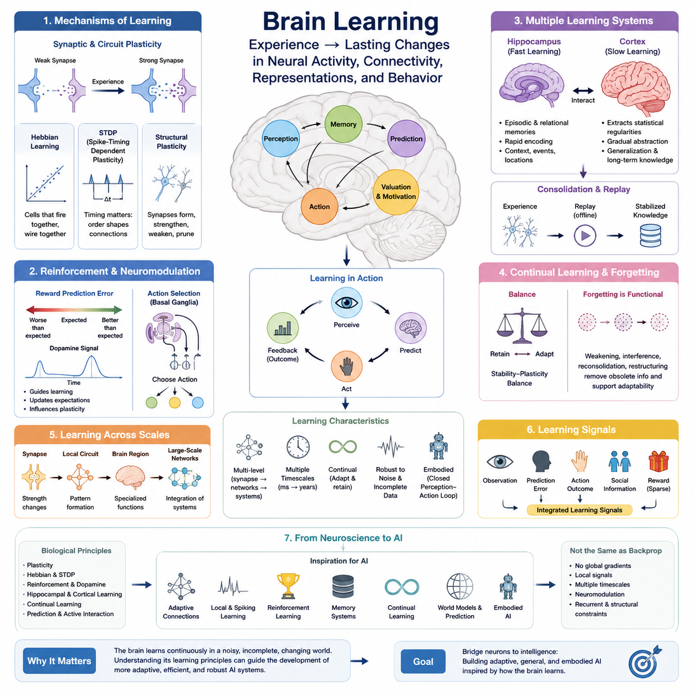
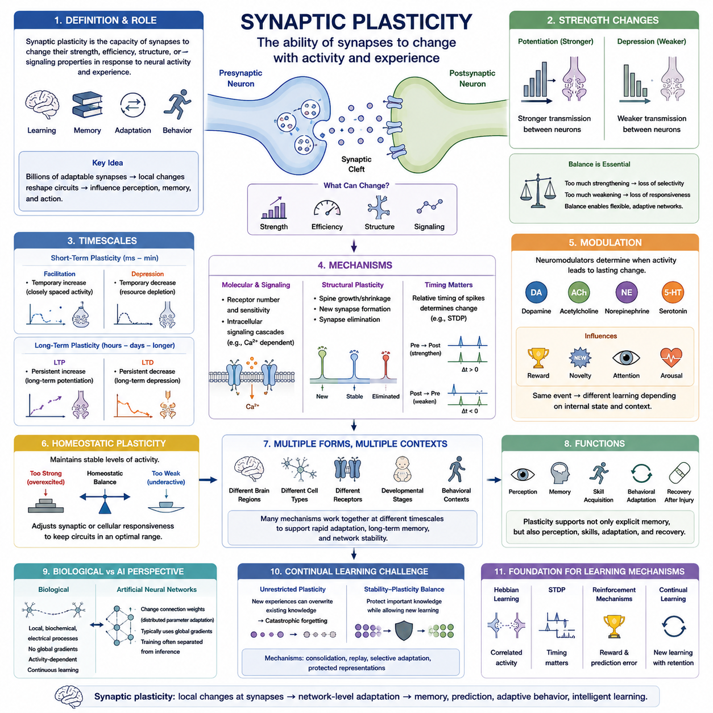
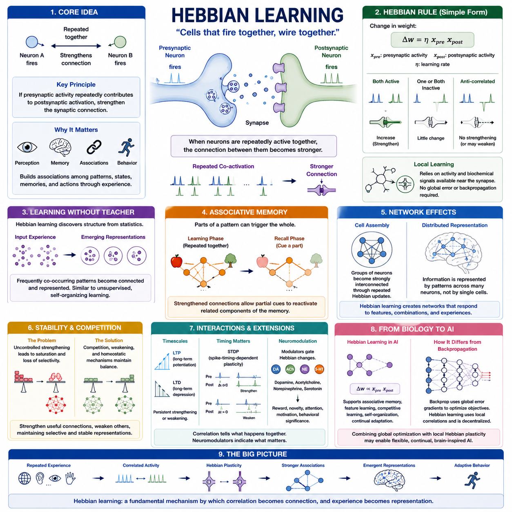
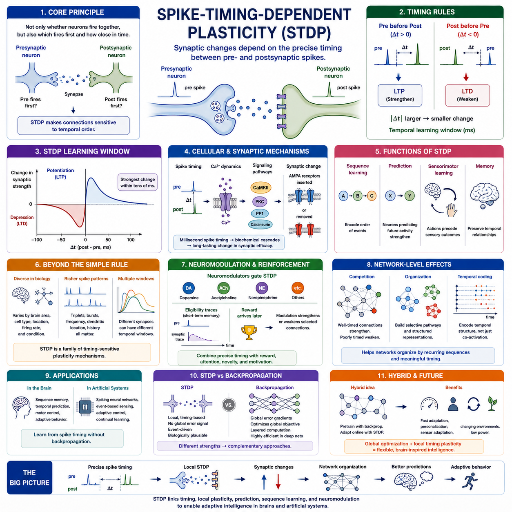
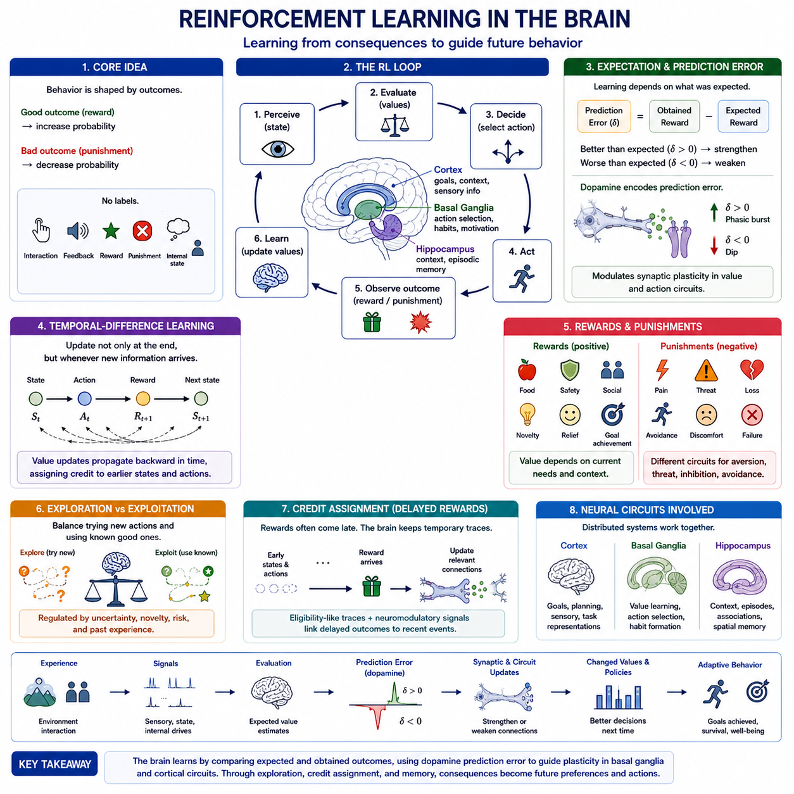
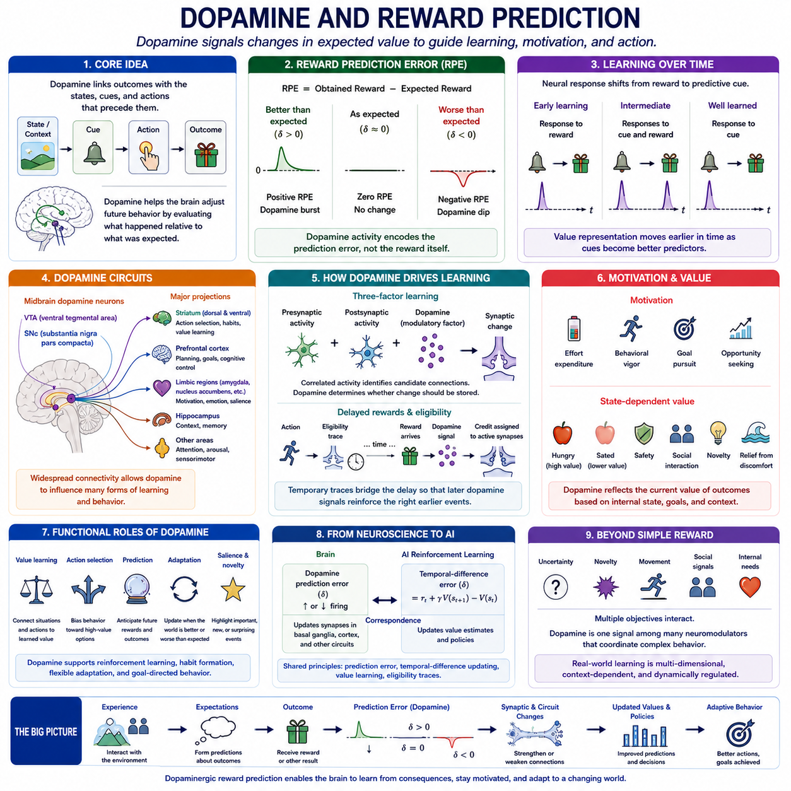
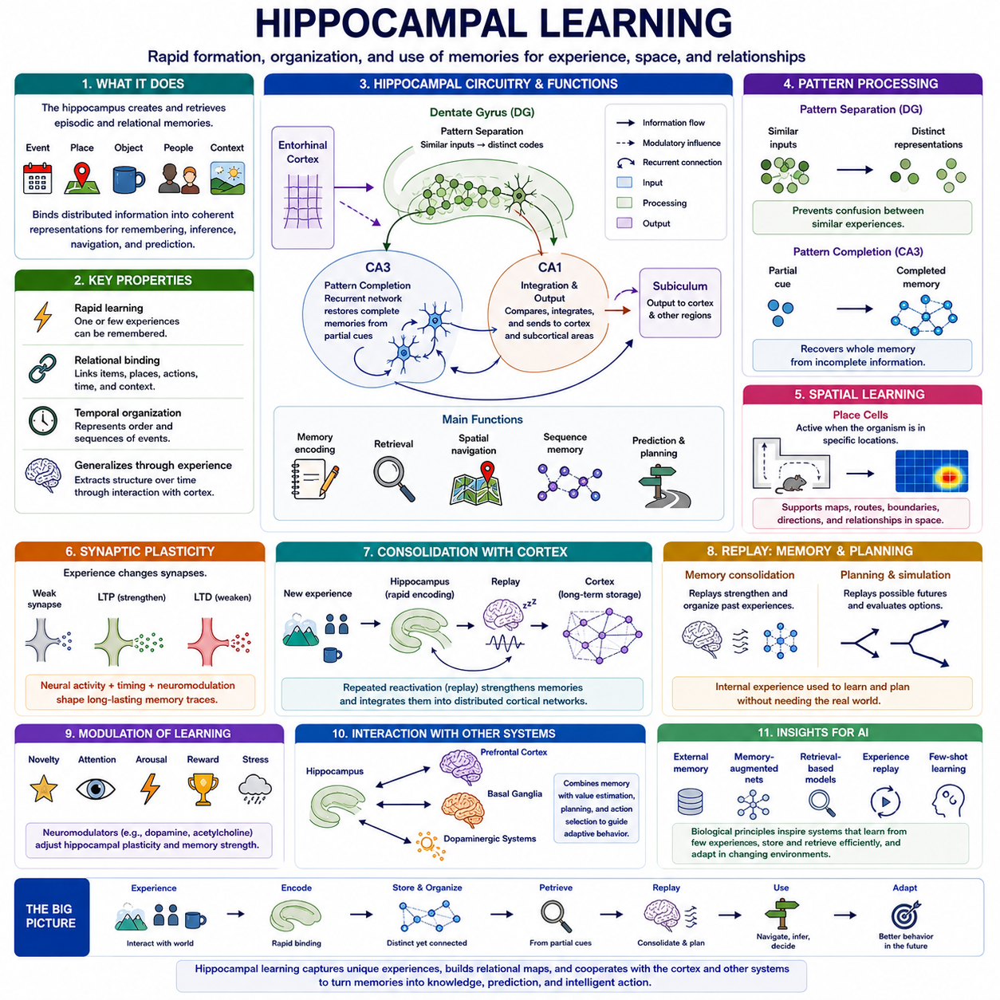
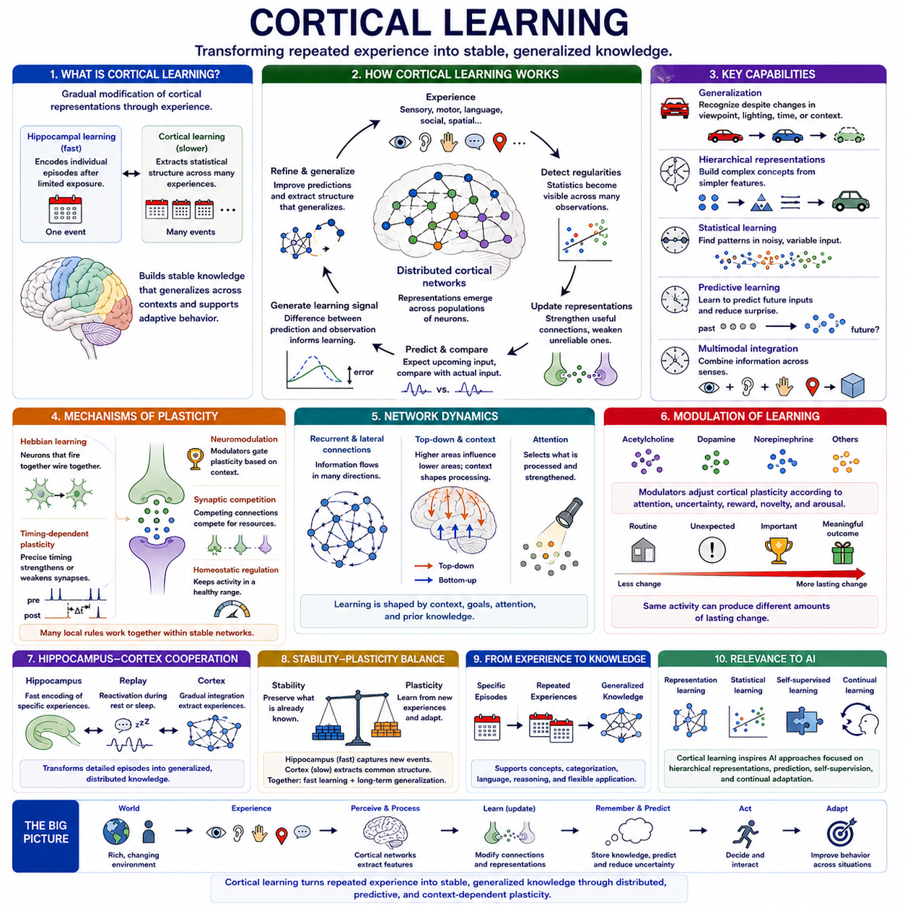
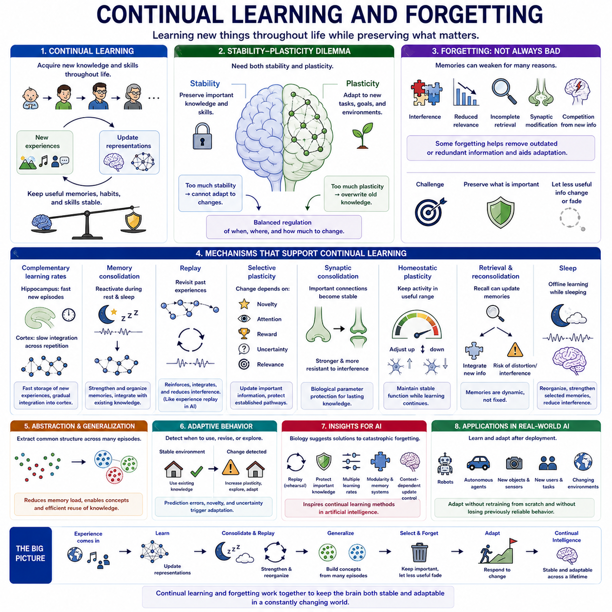
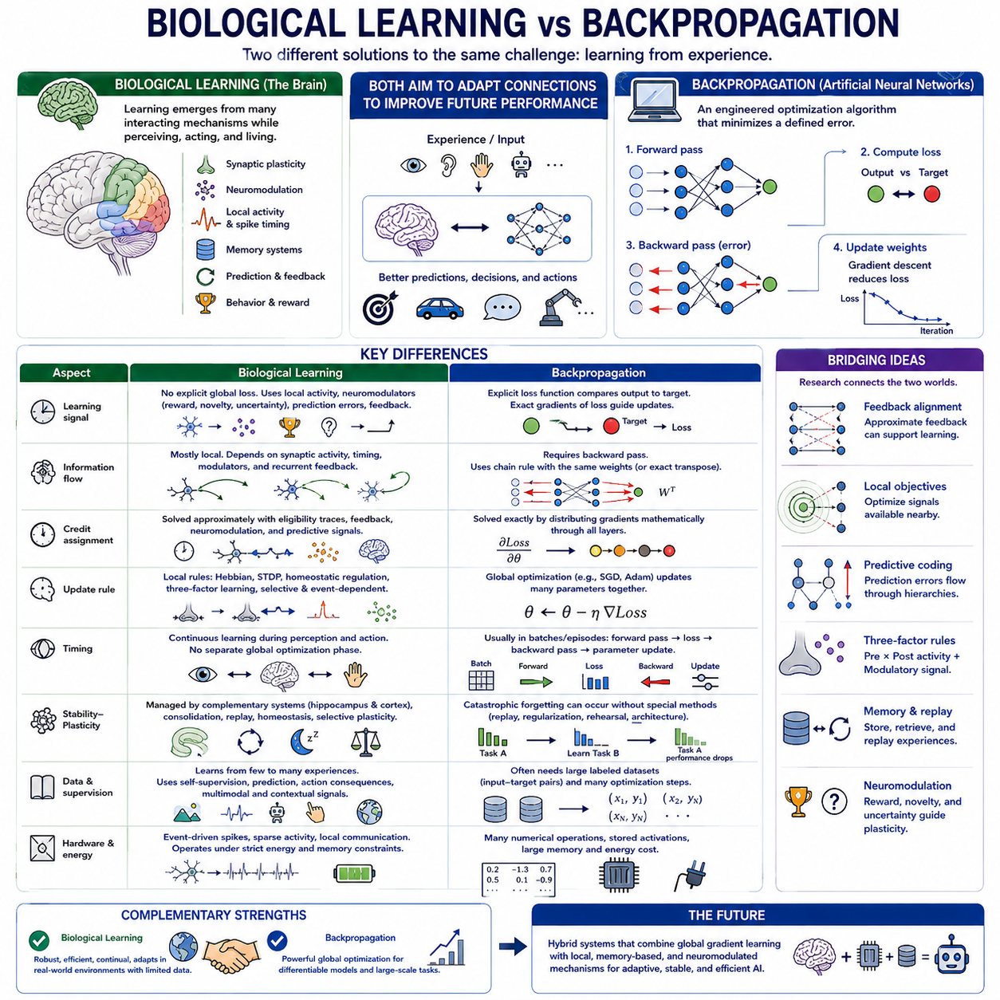

**Volume 44 Neuroscience for AI**

# Chapter 03. Learning in the Brain

## 03.00 Brain Learning Overview

{width="7.268055555555556in" height="7.268055555555556in"}

뇌 학습(Brain Learning)은 경험(Experience)을 통해 신경 활동(Neural Activity), 연결성(Connectivity), 내부 표현(Internal Representations), 행동(Behavior)에 지속적인 변화가 발생하는 생물학적 과정(Biological Processes)의 집합입니다. 뇌는 하나의 단일 학습 알고리즘(Learning Algorithm)으로 작동하는 것이 아니라, 피질(Cortical) 및 피질하(Subcortical) 시스템에 분산된 여러 학습 메커니즘(Learning Mechanisms)을 결합합니다. 이러한 메커니즘을 통해 생물은 감각적 규칙성(Sensory Regularities)을 학습하고, 사건을 예측하며, 경험을 기억하고, 기술을 습득하며, 결과를 평가하고, 변화하는 환경에 맞추어 행동을 지속적으로 적응시킬 수 있습니다.

세포 수준(Cellular Level)에서 학습은 신경 가소성(Neural Plasticity), 즉 활동이 진행됨에 따라 뉴런(Neurons)과 시냅스(Synapses)가 기능적 관계를 변화시킬 수 있는 능력에 크게 의존합니다. 시냅스 강도(Synaptic Strength)의 변화는 신호가 신경 회로(Neural Circuit)를 통해 얼마나 효과적으로 전달되는지를 바꾸며, 유사한 입력에 대한 미래의 반응을 점진적으로 재구성할 수 있습니다. 따라서 학습은 정보를 고립된 위치에 단순히 저장하는 것이 아니라, 지각(Perception), 기억(Memory), 예측(Prediction), 행동(Action)에 참여하는 뉴런 집단 사이의 분산된 상호작용 패턴을 변화시키는 과정입니다.

생물학적 학습(Biological Learning)의 기본 원리 가운데 하나는 신경 사건(Neural Events) 사이의 관계가 중요하다는 것입니다. 뉴런들이 관련된 활동에 반복적으로 함께 참여하면 이들의 연결은 강화되거나 약화되고, 안정화되거나 재구성될 수 있습니다. 헤비안 학습(Hebbian Learning)은 상관된 신경 활동(Correlated Neural Activity)을 연결성 변화와 연관시킴으로써 이러한 개념의 중요한 부분을 설명하며, 스파이크 타이밍 의존 가소성(Spike-Timing-Dependent Plasticity, STDP)은 뉴런 발화(Neuronal Firing)의 시간적 순서와 정확한 타이밍을 강조함으로써 이를 확장합니다. 이러한 메커니즘은 국소적 상호작용(Local Interactions)이 어떻게 점진적으로 유용한 표현(Representations)을 형성할 수 있는지를 보여줍니다.

뇌의 학습은 또한 본질적으로 시간적(Temporal) 특성을 갖습니다. 신경 시스템(Neural Systems)은 우연히 동시에 발생하는 사건과 밀리초(Milliseconds), 초(Seconds), 분(Minutes), 또는 훨씬 긴 시간에 걸쳐 안정적으로 전개되는 관계를 구별해야 합니다. 시간적 구조(Temporal Structure)를 학습함으로써 뇌는 순서(Sequences)를 이해하고, 결과를 예측하며, 행동을 이후의 결과와 연관시키고, 변화하는 감각 흐름(Sensory Streams)에서 규칙성을 발견할 수 있습니다. 이러한 시간적 민감성(Temporal Sensitivity)은 운동 제어(Motor Control), 언어(Language), 내비게이션(Navigation), 일화 기억(Episodic Memory), 동적 환경(Dynamic Environments)의 예측에 필수적입니다.

모든 학습을 신경 신호(Neural Signals) 사이의 상관관계만으로 설명할 수 있는 것은 아닙니다. 생물은 자신의 행동이 바람직하거나 바람직하지 않은 결과를 만들어내는지도 판단해야 합니다. 강화 관련 메커니즘(Reinforcement-Related Mechanisms)은 행동을 보상(Reward), 처벌(Punishment), 동기(Motivation), 기대(Expectation)와 연결함으로써 이러한 능력을 제공합니다. 기저핵(Basal Ganglia)과 신경조절 시스템(Neuromodulatory Systems)을 포함하는 신경 회로는 경험한 결과에 따라 미래의 행동 선택(Action Selection)을 조정하며, 적응적 의사결정(Adaptive Decision Making)과 강화학습(Reinforcement Learning)의 생물학적 기반을 형성합니다.

도파민(Dopamine)은 이러한 과정에서 특히 중요한 역할을 하지만, 그 기능은 단순히 즐거움(Pleasure)이나 보상(Reward)을 표현하는 것보다 훨씬 광범위합니다. 도파민성 활동(Dopaminergic Activity)은 기대한 결과와 실제로 얻은 결과 사이의 차이와 밀접하게 관련되며, 이는 계산적으로 보상 예측 오차(Reward Prediction Error)라는 개념으로 설명되는 경우가 많습니다. 결과가 예상보다 좋거나 나쁠 경우 이러한 신호는 가소성(Plasticity)에 영향을 주고 기대를 갱신하여, 환경과 반복적으로 상호작용하면서 행동을 개선할 수 있도록 합니다.

서로 다른 뇌 시스템(Brain Systems)은 동일한 계산을 수행하기보다는 상호보완적인 형태의 학습(Complementary Forms of Learning)에 기여합니다. 해마(Hippocampus)는 일화적 정보(Episodic Information)와 관계적 정보(Relational Information)를 빠르게 습득하는 것과 밀접하게 관련되며, 비교적 적은 경험만으로도 사건, 맥락(Contexts), 위치(Locations), 경험을 서로 연결할 수 있게 합니다. 반면 피질 시스템(Cortical Systems)은 반복된 경험에서 통계적 규칙성(Statistical Regularities)을 더 천천히 추출하고 안정화하여, 개별 기억이 처음 형성된 특정 상황을 넘어 활용할 수 있는 일반화된 표현(Generalized Representations)을 점진적으로 형성합니다.

이러한 역할 분담은 빠른 학습(Rapid Learning)과 안정적인 지식(Stable Knowledge) 사이에 중요한 균형을 만들어냅니다. 너무 빠르게 변화하는 시스템은 이전에 습득한 정보를 덮어쓸 수 있는 반면, 너무 느리게 변화하는 시스템은 환경 조건이 달라질 때 적응하지 못할 수 있습니다. 해마 시스템(Hippocampal Systems)과 피질 시스템(Cortical Systems)의 상호작용은 이러한 안정성-가소성 문제(Stability--Plasticity Problem)를 이해하는 생물학적 관점을 제공합니다. 기억 공고화(Consolidation)와 재생(Replay) 같은 과정은 경험을 반복적으로 재활성화하여 새롭게 습득한 정보를 장기간에 걸쳐 기존 표현과 통합할 수 있도록 합니다.

따라서 뇌 학습(Brain Learning)은 본질적으로 지속 학습(Continual Learning)입니다. 동물은 일반적으로 고정된 학습 단계(Training Phase)를 완료한 후 영구적으로 학습을 중단하지 않습니다. 새로운 감각적 증거(Sensory Evidence), 행동(Actions), 보상(Rewards), 사회적 상호작용(Social Interactions), 환경 변화(Environmental Changes)는 내부 모델(Internal Models)을 지속적으로 수정하며, 동시에 이전에 유용했던 지식은 계속 접근 가능한 상태로 유지되어야 합니다. 이는 기존 지식과 새로운 지식 사이의 간섭(Interference), 그리고 이후의 학습이 이전 기억을 약화시킬 가능성을 포함하는 인공지능(Artificial Intelligence)의 지속 학습 문제(Continual-Learning Problem)에 대응하는 생물학적 문제를 형성합니다.

따라서 망각(Forgetting)이 항상 생물학적 기억(Biological Memory)의 실패를 의미하는 것은 아닙니다. 선택적 약화(Selective Weakening), 간섭(Interference), 재공고화(Reconsolidation), 재구성(Restructuring)은 오래되거나 더 이상 유용하지 않은 정보를 감소시키고 계속 중요한 패턴을 강조함으로써 신경 시스템의 적응성을 유지하는 데 도움을 줄 수 있습니다. 효과적인 학습은 유지(Retention), 수정(Modification), 망각(Forgetting) 사이의 균형을 필요로 합니다. 이는 기억을 정적인 데이터베이스(Static Database)로 간주하는 것과 다르며, 생물학적 지식은 새로운 증거가 무엇을 예측하거나 기억해야 하는지를 변화시킬 때마다 표현을 수정할 수 있는 적응형 시스템(Adaptive System)에 내재되어 있습니다.

학습은 또한 여러 공간적 규모(Spatial Scales)에서 발생합니다. 시냅스 변화(Synaptic Modifications)는 개별 연결에 영향을 주고, 국소 회로(Local Circuits)는 반복되는 패턴을 구성하며, 특화된 뇌 영역(Specialized Brain Regions)은 특정 계산 기능(Computational Functions)을 지원하고, 대규모 네트워크(Large-Scale Networks)는 지각, 기억, 가치 평가(Valuation), 주의(Attention), 행동을 조정합니다. 이러한 수준들은 지속적으로 상호작용합니다. 따라서 개체 수준(Organism Level)에서 관찰되는 행동 적응(Behavioral Adaptation)은 하나의 특정 변화가 아니라 여러 신경 시스템에 분산된 많은 작은 변화로부터 나타날 수 있습니다.

또 다른 핵심 특성은 생물학적 학습이 폐쇄형 지각-행동 루프(Closed Perception--Action Loops) 안에서 이루어진다는 것입니다. 뇌는 미리 준비된 데이터셋(Dataset)을 단순히 입력받지 않습니다. 행동은 어떤 감각 정보(Sensory Information)를 얻을 수 있는지를 결정하고, 감각적 결과는 내부 상태(Internal States)를 변화시키며, 예측(Predictions)은 다음 행동을 안내하고, 그 결과는 다시 추가적인 학습 신호(Learning Signals)를 제공합니다. 따라서 학습은 세계와의 능동적 상호작용(Active Interaction)과 분리될 수 없으며, 특히 내비게이션, 조작(Manipulation), 탐색(Exploration), 운동 제어, 체화 지능(Embodied Intelligence)과 같은 영역에서 이러한 특성이 중요합니다.

뇌는 또한 일반적인 머신러닝 파이프라인(Machine-Learning Pipelines)과 근본적으로 다른 조건에서 학습합니다. 생물학적 시스템은 잡음이 많고(Noisy), 불완전하며(Incomplete), 다중모달(Multimodal)이고, 시간적으로 상관된(Temporally Correlated) 데이터를 받아들이며 모든 관측에 대해 명시적인 레이블(Explicit Labels)을 제공받는 경우는 거의 없습니다. 그럼에도 관찰(Observation), 예측(Prediction), 상호작용(Interaction), 내부 피드백(Internal Feedback), 사회적 정보(Social Information), 희소한 외부 보상(Sparse External Rewards)을 통해 유용한 규칙성을 발견합니다. 이러한 조합은 지능(Intelligence)이 완전 지도학습(Fully Supervised Learning)에만 의존하기보다는 여러 종류의 학습 신호를 통합하는 능력에 기반할 수 있음을 보여줍니다.

인공지능(AI)의 관점에서 뇌 학습은 생물학적 역전파(Biological Backpropagation)의 형태라기보다 상호보완적인 계산 원리(Computational Principles)의 집합으로 이해하는 것이 적절합니다. 시냅스 가소성(Synaptic Plasticity)은 적응 가능한 연결(Adaptive Connections)의 메커니즘을 제시하고, 헤비안 학습(Hebbian Learning)은 상관관계를 강조하며, 스파이크 타이밍 의존 가소성(STDP)은 시간적 국소성(Temporal Locality)을 도입합니다. 보상 관련 시스템은 강화학습에 대한 영감을 제공하고, 해마 과정(Hippocampal Processes)은 빠른 기억 형성(Rapid Memory Formation)을 이해하는 단서를 제공하며, 피질 학습(Cortical Learning)은 점진적 추상화(Gradual Abstraction), 일반화(Generalization), 장기 지식 조직(Long-Term Knowledge Organization)을 위한 모델을 제공합니다.

그러나 생물학적 학습(Biological Learning)과 인공적인 역전파(Backpropagation)를 직접적으로 동일한 것으로 취급해서는 안 됩니다. 역전파는 명시적으로 정의된 계산 그래프(Computational Graphs)와 목적 함수(Objective Functions)를 통해 그래디언트(Gradients)를 효율적으로 계산하는 반면, 생물학적 뉴런은 국소 활동(Local Activity), 신경조절(Neuromodulation), 순환적 상호작용(Recurrent Interactions), 구조적 제약(Structural Constraints), 그리고 여러 시간 규모에 분산된 메커니즘을 통해 학습합니다. 이러한 비교는 공학적으로 설계된 최적화(Engineered Optimization)의 효율성을 보여주는 동시에, 뇌가 표준적인 형태의 역전파를 구현하지 않고도 어떻게 강력한 학습 능력을 달성하는지에 대한 아직 해결되지 않은 질문을 드러냅니다.

이러한 차이는 미래의 적응형 인공지능(Adaptive AI)을 고려할 때 특히 중요해집니다. 인공지능 시스템에는 점점 더 지속 학습(Continual Learning), 기억 공고화(Memory Consolidation), 희소한 피드백(Sparse Feedback), 자기지도 표현 학습(Self-Supervised Representation Learning), 체화된 상호작용(Embodied Interaction), 그리고 기존 능력을 치명적으로 상실하지 않으면서 새로운 환경에 적응하는 능력이 요구되고 있습니다. 신경과학(Neuroscience)은 즉시 적용할 수 있는 완성된 공학적 설계도(Engineering Blueprint)를 제공하지는 않지만, 이러한 특성을 하나의 지속적으로 작동하는 유기체 안에서 결합하는 시스템에 대한 실험적으로 검증된 사례를 제공합니다.

따라서 뇌 학습(Brain Learning)에 대한 연구는 뉴런(Neurons)과 고차원적 지능(Higher Intelligence)을 연결하는 중요한 가교를 형성합니다. 시냅스 가소성(Synaptic Plasticity)은 경험이 어떻게 신경 회로를 변화시키는지를 설명하고, 헤비안 학습(Hebbian Learning)과 타이밍 의존 메커니즘(Timing-Dependent Mechanisms)은 국소적 적응을 설명하며, 강화 시스템(Reinforcement Systems)은 예측과 결과를 연결합니다. 해마 및 피질 시스템(Hippocampal and Cortical Systems)은 상호보완적인 학습 시간 규모(Learning Timescales)를 보여주며, 지속 학습(Continual Learning)은 유용한 지식을 보존하면서도 새로운 환경에 적응해야 하는 핵심 문제를 드러냅니다. 이러한 주제들은 이후 뇌의 학습 메커니즘과 그것이 인공지능에 제공할 수 있는 의미를 이해하기 위한 기반을 형성합니다.

## 03.01 Synaptic Plasticity [w/Code]

{width="7.268055555555556in" height="7.268055555555556in"}

시냅스 가소성(Synaptic Plasticity)은 신경 활동(Neural Activity)과 경험(Experience)의 결과로 시냅스(Synapses)의 기능적 강도(Functional Strength), 효율성(Efficiency), 구조(Structure), 또는 신호 전달 특성(Signaling Properties)이 변화할 수 있는 능력을 의미합니다. 이는 뇌가 학습하고 정보를 저장하며, 변화하는 환경에 적응하고 행동을 재구성할 수 있도록 하는 가장 기본적인 생물학적 메커니즘(Biological Mechanisms) 가운데 하나입니다. 이러한 변화는 관련된 신경 과정(Neural Process)에 따라 밀리초(Milliseconds), 분(Minutes), 시간(Hours), 일(Days), 또는 그보다 훨씬 긴 시간 규모에서 발생할 수 있습니다.

시냅스(Synapse)는 뉴런(Neurons) 사이에서 고정된 통신 채널(Communication Channel)로 작동하지 않습니다. 그 효율성은 이전의 활동(Previous Activity), 시냅스전 및 시냅스후 뉴런의 발화 타이밍(Presynaptic and Postsynaptic Firing Timing), 신경조절 신호(Neuromodulatory Signals), 수용체 가용성(Receptor Availability), 그리고 시냅스 연결 주변의 구조적 변화(Structural Changes)에 따라 달라질 수 있습니다. 신경 회로(Neural Circuits)는 이처럼 적응 가능한 수많은 연결을 포함하기 때문에, 국소적인 시냅스 변화(Local Synaptic Modifications)가 집합적으로 전체 네트워크의 정보 처리 특성을 재구성하고 지각(Perception), 기억(Memory), 행동(Action)에 영향을 줄 수 있습니다.

시냅스 가소성(Synaptic Plasticity)은 크게 뉴런 사이의 통신을 강화하거나 약화하는 방향으로 작용할 수 있습니다. 반복적인 활동이 신호 전달의 효율성을 증가시키면 특정 신경 패턴(Neural Patterns) 사이의 연관성이 더욱 강해질 수 있습니다. 반대로 전달 효율이 감소하면 이전에 지배적이었던 관계가 약화되거나 재구성될 수 있습니다. 따라서 학습은 유용한 연결을 강화하는 것뿐만 아니라 정보 가치가 낮거나 오래되었거나 새로운 경험과 일치하지 않는 연결을 선택적으로 약화시키는 과정에도 의존합니다.

단기 가소성(Short-Term Plasticity)은 비교적 짧은 시간 규모에서 시냅스 효율성을 변화시키며, 일반적으로 밀리초에서 수초 또는 수분 정도까지 지속됩니다. 촉진(Facilitation)은 시간적으로 가까운 신경 사건들이 신경전달물질(Neurotransmitter)의 방출을 증가시킬 때 일시적으로 시냅스 전달을 강화할 수 있으며, 억압(Depression)은 사용 가능한 자원이 고갈될 때 전달 효율을 일시적으로 감소시킬 수 있습니다. 이러한 메커니즘을 통해 시냅스는 시간적 정보(Temporal Information)를 동적으로 필터링하고 빠르게 변화하는 활동 패턴에 대한 신경 회로의 반응을 조절할 수 있습니다.

장기 강화(Long-Term Potentiation, LTP)는 특정한 신경 활성 패턴(Neural Activation Patterns) 이후 시냅스 강도가 지속적으로 증가하는 현상을 의미합니다. 장기 강화(LTP)는 일시적인 신경 활동이 뉴런 사이의 통신에 지속적인 변화를 만들어낼 수 있음을 보여주기 때문에 학습 및 기억(Learning and Memory)과 광범위하게 연관되어 연구되어 왔습니다. 여러 신경 회로에서 반복되거나 협응된 활성(Coordinated Activation)은 시냅스후 반응성(Postsynaptic Responsiveness)을 증가시키는 분자적 과정(Molecular Processes)을 유발하며, 궁극적으로 시냅스 연결의 물리적 구조까지 변화시킬 수 있습니다.

장기 억압(Long-Term Depression, LTD)은 특정 활동 패턴에 의해 시냅스 효율성(Synaptic Efficacy)이 지속적으로 감소하는 현상을 의미합니다. 장기 억압(LTD)은 연결을 계속 강화하기보다는 약화할 수 있는 메커니즘을 제공함으로써 장기 강화(LTP)를 보완합니다. 활성화되는 모든 시냅스가 계속 강해지기만 한다면 신경 시스템은 결국 유용한 선택성(Selectivity)을 잃을 수 있기 때문에 이러한 균형은 필수적입니다. 강화(Potentiation)와 억압(Depression)은 함께 작용하여 신경망이 유연하고 차별화된 적응형 표현(Adaptive Representations)을 유지하도록 합니다.

흥분성 시냅스(Excitatory Synapses)에서 가소성은 수용체 역학(Receptor Dynamics)과 세포 내 신호 전달(Intracellular Signaling)의 변화를 자주 포함합니다. 신경 활동은 시냅스후막(Postsynaptic Membrane)에 위치한 수용체(Receptors)의 수, 민감도(Sensitivity), 분포(Distribution)에 영향을 미쳐 시냅스후 뉴런이 이후의 입력에 얼마나 강하게 반응하는지를 변화시킬 수 있습니다. 특히 칼슘 의존적 신호 전달 경로(Calcium-Dependent Signaling Pathways)는 세포 내 칼슘(Intracellular Calcium)이 시냅스의 강화와 약화에 관련된 생화학적 연쇄반응(Biochemical Cascades)을 유발할 수 있기 때문에 여러 형태의 가소성에서 중요한 역할을 합니다.

구조적 가소성(Structural Plasticity)은 학습을 단순한 신호 전달 효율성의 변화를 넘어서는 수준으로 확장합니다. 수상돌기 가시(Dendritic Spines)는 성장하거나 축소되고, 안정화되거나 사라질 수 있으며, 새로운 시냅스 접촉(Synaptic Contacts)이 형성되거나 기존의 연결이 제거될 수도 있습니다. 이러한 구조적 변화는 학습이 신경 회로 자체를 물리적으로 재구성할 수 있음을 보여줍니다. 따라서 기능적 적응(Functional Adaptation)과 구조적 변화(Structural Modification)는 밀접하게 연결되어 있으며, 자주 사용되는 경로는 안정화되는 반면 다른 연결은 유연성을 유지하거나 점진적으로 제거될 수 있습니다.

시냅스 가소성(Synaptic Plasticity)은 신경 사건 사이의 시간적 관계(Temporal Relationship)에 크게 영향을 받습니다. 서로 연결된 뉴런들의 상대적인 활동 타이밍(Relative Timing)은 시냅스가 강화될지 또는 약화될지를 결정할 수 있습니다. 이러한 원리는 스파이크 타이밍 의존 가소성(Spike-Timing-Dependent Plasticity, STDP)에서 특히 명확하게 나타나며, 시냅스 변화는 시냅스전 및 시냅스후 스파이크(Presynaptic and Postsynaptic Spikes)의 순서와 시간 간격에 따라 달라집니다. 이러한 시간적 민감성(Timing Sensitivity)은 시간적 관계, 시퀀스(Sequences), 잠재적인 인과 구조(Causal Structure)를 학습할 수 있는 생물학적 메커니즘을 제공합니다.

가소성(Plasticity)은 국소적인 전기 활동(Local Electrical Activity)에만 의존하지 않고 신경조절 시스템(Neuromodulatory Systems)에 의해서도 조절됩니다. 도파민(Dopamine), 아세틸콜린(Acetylcholine), 노르에피네프린(Norepinephrine), 세로토닌(Serotonin)과 같은 신경조절 신호는 특정 활동 패턴이 지속적인 시냅스 변화로 이어질 것인지에 영향을 줄 수 있습니다. 이를 통해 학습은 행동적 맥락(Behavioral Context), 보상(Reward), 새로움(Novelty), 주의(Attention), 불확실성(Uncertainty), 각성(Arousal)과 연계될 수 있습니다. 따라서 동일한 감각 사건이라도 내부 상태(Internal State)와 경험의 중요성에 따라 서로 다른 수준의 학습을 유발할 수 있습니다.

또 하나의 중요한 개념은 항상성 가소성(Homeostatic Plasticity)으로, 지속적인 국소 변화에도 불구하고 신경 시스템이 안정적인 활동 수준을 유지하도록 돕습니다. 시냅스 강화가 아무런 조절 없이 계속된다면 신경 회로가 지나치게 흥분할 수 있으며, 반대로 무제한적인 약화는 회로를 반응하지 않는 상태로 만들 수 있습니다. 항상성 메커니즘(Homeostatic Mechanisms)은 시냅스 또는 세포의 반응성을 조절하여 적절한 작동 범위(Operating Range)를 유지하며, 장기적인 학습에 필수적인 유연성(Flexibility)과 안정성(Stability) 사이의 균형을 형성합니다.

따라서 시냅스 가소성(Synaptic Plasticity)은 하나의 보편적인 학습 규칙(Universal Learning Rule)이 아니라 서로 상호작용하는 여러 메커니즘의 집합으로 이해해야 합니다. 서로 다른 뇌 영역(Brain Regions), 세포 유형(Cell Types), 수용체(Receptors), 발달 단계(Developmental Stages), 행동적 맥락은 서로 다른 형태의 가소성을 나타낼 수 있습니다. 일부 메커니즘은 빠른 적응(Rapid Adaptation)을 지원하고, 다른 메커니즘은 장기 기억(Long-Term Memory)을 지원하며, 또 다른 메커니즘은 네트워크 안정성(Network Stability)을 조절합니다. 이들의 상호작용을 통해 뇌는 이전에 유용했던 지식을 보존할 수 있을 정도의 안정성을 유지하면서도 지속적으로 학습할 수 있습니다.

해마(Hippocampus)는 시냅스 가소성과 일화 기억(Episodic Memory) 및 공간 기억(Spatial Memory)의 관계가 광범위하게 연구되어 온 중요한 사례입니다. 시냅스 강도의 빠른 변화는 비교적 제한된 경험만으로도 사건(Events), 장소(Places), 맥락(Contexts) 사이의 연관성을 형성하도록 지원할 수 있습니다. 이후 피질 학습(Cortical Learning)은 더 긴 시간 규모에서 작동하여 반복적으로 나타나는 패턴을 보다 안정적이고 일반화된 표현(Generalized Representations)으로 점진적으로 통합할 수 있습니다.

가소성(Plasticity)은 감각 시스템(Sensory Systems)과 운동 시스템(Motor Systems)의 적응에도 기여합니다. 반복적인 감각 경험은 자주 접하는 특징에 대한 신경 반응(Neural Responses)을 변화시킬 수 있으며, 운동 연습(Motor Practice)은 움직임의 계획과 실행에 관여하는 신경 회로를 강화하고 재구성할 수 있습니다. 손상(Injury)이나 감각 입력의 변화 이후에도 가소성 메커니즘은 부분적인 기능 재구성(Functional Reorganization)을 가능하게 할 수 있습니다. 따라서 시냅스 가소성은 명시적 기억(Explicit Memory)뿐만 아니라 지각, 기술 습득(Skill Acquisition), 행동 적응(Behavioral Adaptation), 기능 회복(Recovery)에도 기여합니다.

인공지능(Artificial Intelligence)의 관점에서 시냅스 가소성(Synaptic Plasticity)은 분산된 파라미터 적응(Distributed Parameter Adaptation)을 통해 학습하는 생물학적 사례를 제공합니다. 인공신경망(Artificial Neural Networks) 역시 성능을 개선하기 위해 연결 가중치(Connection Weights)를 변경하지만, 생물학적 시냅스는 일반적인 전역 그래디언트 계산(Global Gradient Computation)이 아니라 국소적인 생화학적 및 전기적 과정(Local Biochemical and Electrical Processes)을 통해 작동합니다. 이러한 비교는 국소 학습 신호(Local Learning Signals), 희소 업데이트(Sparse Updates), 시간적 학습(Temporal Learning), 활동 의존적 적응(Activity-Dependent Adaptation)과 같은 대안적 학습 방식의 가능성을 보여줍니다.

생물학적 가소성(Biological Plasticity)은 정상적인 작동 과정에서도 학습이 계속된다는 점에서 일반적인 머신러닝(Machine Learning)과 차이가 있습니다. 뇌는 일반적으로 경험을 엄격하게 분리된 학습 단계(Training Phase)와 추론 단계(Inference Phase)로 나누지 않습니다. 지각(Perception), 행동(Action), 보상(Reward), 기억 형성(Memory Formation), 시냅스 변화(Synaptic Modification)는 동일한 연속적 과정에서 함께 발생할 수 있습니다. 이러한 특성은 동적 환경에서 작동하면서 처음부터 반복적으로 재학습하지 않고 새로운 상황에 적응해야 하는 지속 학습 시스템(Continual Learning Systems)과 체화 인공지능(Embodied AI)에 특히 중요합니다.

그러나 제한되지 않은 가소성(Unrestricted Plasticity)은 심각한 문제를 발생시킬 수 있습니다. 새로운 경험이 기존의 시냅스 패턴(Synaptic Patterns)을 빠르게 덮어쓴다면 이전에 학습된 정보가 손상될 수 있습니다. 따라서 생물학적 시스템에는 어떤 연결을 안정적으로 유지하고 어떤 연결을 수정 가능한 상태로 만들 것인지를 결정하는 메커니즘이 필요합니다. 이러한 안정성-가소성 균형(Stability--Plasticity Balance)은 인공신경망의 치명적 망각(Catastrophic Forgetting)과 밀접하게 관련되며, 기억 공고화(Consolidation), 재생(Replay), 선택적 적응(Selective Adaptation), 보호된 표현(Protected Representations)에 관한 연구의 중요한 동기를 제공합니다.

시냅스 가소성(Synaptic Plasticity)은 이 장의 이후 절에서 다루는 여러 학습 메커니즘(Learning Mechanisms)의 기반을 형성합니다. 헤비안 학습(Hebbian Learning)은 상관된 활동(Correlated Activity)을 강조하고, 스파이크 타이밍 의존 가소성(Spike-Timing-Dependent Plasticity)은 정밀한 시간적 관계(Temporal Relationships)를 도입하며, 강화 관련 메커니즘(Reinforcement-Related Mechanisms)은 시냅스 변화를 보상(Reward) 및 예측 오차(Prediction Error)와 연결합니다. 지속 학습(Continual Learning)은 새로운 적응과 기존 지식의 보존이 어떻게 공존할 수 있는지를 다룹니다. 이러한 메커니즘은 국소적인 시냅스 변화가 어떻게 기억(Memory), 예측(Prediction), 적응적 행동(Adaptive Behavior), 지능적 학습(Intelligent Learning)으로 확장될 수 있는지를 함께 설명합니다.

## 03.02 Hebbian Learning [w/Code]

{width="7.268055555555556in" height="7.268055555555556in"}

헤비안 학습(Hebbian Learning)은 상관된 활동(Correlated Activity)을 통해 신경 연결(Neural Connections)이 어떻게 변화할 수 있는지를 이해하기 위한 기본적인 원리입니다. 핵심 개념은 두 뉴런(Neurons)이 반복적으로 함께 활성화될 때 이들 사이의 시냅스 연결(Synaptic Connection)이 강화될 수 있다는 것입니다. 이는 반복적인 경험(Experience)이 어떻게 신경 회로(Neural Circuits)를 점진적으로 재구성하고 감각 패턴(Sensory Patterns), 내부 상태(Internal States), 기억(Memories), 행동(Actions) 사이의 연관성을 형성할 수 있는지를 설명하는 생물학적으로 타당한 관점을 제공합니다.

이 개념은 일반적으로 "함께 발화하는 세포는 함께 연결된다(Cells That Fire Together Wire Together)"라는 표현으로 요약되지만, 실제 생물학적 과정은 이보다 훨씬 복잡합니다. 시냅스전 뉴런(Presynaptic Neuron)의 활동이 시냅스후 뉴런(Postsynaptic Neuron)의 활성화에 반복적으로 기여하면 두 뉴런 사이의 연결이 더욱 효과적으로 변화할 수 있습니다. 반복적인 공동 활성화(Co-Activation)를 통해 신경망(Neural Networks)은 서로 관련된 패턴들이 미래에 다시 함께 활성화될 가능성을 높일 수 있습니다.

헤비안 학습(Hebbian Learning)은 시냅스 변화(Synaptic Modification)가 연결 자체의 주변에서 이용할 수 있는 신호에 의존할 수 있기 때문에 본질적으로 국소적(Local)입니다. 인공신경망(Artificial Neural Networks)의 일반적인 역전파(Backpropagation)와 달리 여러 계층에 걸쳐 전역 오차 그래디언트(Global Error Gradient)를 계산할 필요가 없습니다. 대신 개별 시냅스에서 시냅스전 활동(Presynaptic Activity), 시냅스후 활동(Postsynaptic Activity), 국소적인 생화학적 조건(Local Biochemical Conditions) 사이의 관계를 통해 변화가 발생할 수 있습니다.

헤비안 학습(Hebbian Learning)의 간단한 계산적 표현(Computational Representation)에서는 시냅스 가중치(Synaptic Weight)의 변화가 시냅스전 활동과 시냅스후 활동의 곱에 비례한다고 표현합니다. 두 뉴런이 모두 강하게 활성화되면 연결은 증가하는 경향을 보입니다. 하나 또는 두 뉴런 모두 활성화되지 않는다면 강화는 거의 발생하지 않습니다. 이러한 기본 규칙은 경험에서 반복적으로 나타나는 통계적 상관관계(Statistical Correlations)가 어떻게 연결 강도(Connection Strengths)에 직접 부호화될 수 있는지를 보여줍니다.

이러한 상관관계 민감성(Correlation-Sensitive Property) 때문에 헤비안 학습은 명시적인 레이블(Explicit Labels) 없이도 특징 발견(Feature Discovery)을 지원할 수 있습니다. 관련된 감각 입력(Sensory Inputs)에 반복적으로 반응하는 뉴런들은 점차 강하게 연결될 수 있으며, 이를 통해 빈번하게 나타나는 패턴이 안정적인 내부 표현(Internal Representations)을 형성할 수 있습니다. 이러한 의미에서 헤비안 메커니즘(Hebbian Mechanisms)은 외부에서 제공되는 목표값(Target Values)이 아니라 입력 활동의 통계적 특성으로부터 유용한 구조가 나타날 수 있기 때문에 비지도 학습(Unsupervised Learning) 또는 자기조직화 학습(Self-Organizing Learning)과 유사한 특성을 가집니다.

헤비안 학습(Hebbian Learning)은 특히 연상 기억(Associative Memory)을 이해하는 데 중요합니다. 여러 신경 표현(Neural Representations)이 함께 활성화되면 이들 사이의 연결이 강화되어, 이후 전체 패턴 가운데 일부만 활성화되어도 나머지 구성 요소를 다시 활성화하는 데 도움을 줄 수 있습니다. 이러한 원리는 객체(Objects)와 맥락(Contexts), 사건(Events)과 위치(Locations), 감각 단서(Sensory Cues)와 기억(Memories), 행동(Actions)과 빈번하게 연관된 상황을 연결하는 직관적인 메커니즘을 제공합니다.

네트워크 수준(Network Level)에서 반복적인 헤비안 변화(Hebbian Modification)는 서로 강하게 연결된 뉴런 집단을 형성할 수 있습니다. 이러한 협응된 집단(Coordinated Groups)은 때때로 세포 집합체(Cell Assemblies)라고 하며, 특정 특징이나 경험에 집단적으로 반응하는 분산 패턴(Distributed Patterns)을 나타냅니다. 따라서 학습은 하나의 뉴런이 전체 개념을 저장하는 방식으로 이루어질 필요가 없으며, 대신 많은 뉴런에 분산된 연결 패턴(Patterns of Connectivity)을 통해 정보가 표현될 수 있습니다.

그러나 순수한 헤비안 강화(Pure Hebbian Strengthening)는 중요한 안정성 문제(Stability Problem)를 발생시킵니다. 상관된 활성화가 발생할 때마다 시냅스 가중치가 지속적으로 증가한다면 연결 강도가 제한 없이 커져 결국 네트워크의 선택성(Network Selectivity)이 감소하고 불안정한 활동이 발생할 수 있습니다. 따라서 생물학적 학습(Biological Learning)에는 헤비안 강화를 정규화(Normalize), 제한(Constrain), 또는 상쇄(Counterbalance)하는 조절 과정(Regulatory Processes)이 필요합니다. 시냅스 약화(Synaptic Weakening)와 항상성 메커니즘(Homeostatic Mechanisms)은 신경 표현 사이의 유용한 경쟁(Competition)을 유지하는 데 도움을 줍니다.

신경 시스템(Neural Systems)은 단순히 자주 활성화되는 모든 경로를 강화하는 것이 아니라 정보 가치가 높은 패턴을 구별해야 하기 때문에 경쟁(Competition)은 중요합니다. 일부 시냅스 연결이 강해질 때 다른 연결은 그대로 유지되거나 약해질 수 있으며, 이를 통해 신경 회로가 특정 기능에 특화(Specialization)될 수 있습니다. 이러한 경쟁 과정(Competitive Process)은 뉴런이 반복적으로 나타나는 입력 조합(Input Combinations)에 점점 더 민감하게 반응하면서 관련되지 않은 활동에는 덜 반응하는 선택적 표현(Selective Representations)을 형성할 수 있도록 합니다.

헤비안 학습(Hebbian Learning)은 서로 다른 시간 규모(Timescales)에서 작동하는 시냅스 가소성 메커니즘(Synaptic Plasticity Mechanisms)과도 상호작용합니다. 장기 강화(Long-Term Potentiation, LTP)는 협응된 활동 이후 시냅스를 지속적으로 강화할 수 있으며, 장기 억압(Long-Term Depression, LTD)은 다른 활동 조건에서 연결을 약화시킬 수 있습니다. 이러한 상호보완적인 메커니즘(Complementary Mechanisms)은 상관관계 기반 학습(Correlation-Based Learning)이 기억 형성(Memory Formation)과 신경망의 적응적 재구성(Adaptive Restructuring)을 모두 지원하는 더 광범위한 시스템 안에서 작동하도록 합니다.

시간적 순서(Temporal Order)는 헤비안 원리(Hebbian Principles)에 또 다른 수준의 정밀성을 추가합니다. 단순한 상관관계는 뉴런들이 함께 활성화된다는 사실을 나타내지만, 생물학적 학습은 어떤 뉴런이 먼저 발화하는지 그리고 두 활동 사이에 얼마나 많은 시간이 존재하는지에도 의존할 수 있습니다. 스파이크 타이밍 의존 가소성(Spike-Timing-Dependent Plasticity, STDP)은 시냅스전 및 시냅스후 스파이크(Presynaptic and Postsynaptic Spikes)의 상대적 타이밍을 이용하여 연결을 강화할지 약화할지를 결정함으로써 헤비안 학습을 확장합니다.

헤비안 메커니즘(Hebbian Mechanisms)만으로는 학습된 연관성이 유용한지, 보상적인지, 또는 행동적으로 중요한지를 판단할 수 없습니다. 신경조절 신호(Neuromodulatory Signals)는 이러한 추가적인 맥락을 제공할 수 있습니다. 도파민(Dopamine)과 기타 신경조절물질(Neuromodulators)은 상관된 신경 활동이 지속적인 시냅스 변화로 이어질 것인지에 영향을 줄 수 있으며, 이를 통해 국소적인 헤비안 관계(Local Hebbian Relationships)가 보상(Reward), 새로움(Novelty), 주의(Attention), 동기(Motivation), 행동적 중요성(Behavioral Significance)과 상호작용하도록 합니다.

이러한 결합은 생물학적 학습(Biological Learning)이 단순한 상관관계 탐지(Correlation Detection)가 아니라는 것을 보여줍니다. 상관관계는 어떤 신경 사건(Neural Events)이 함께 발생하는지에 대한 정보를 제공하며, 강화 관련 신호(Reinforcement-Related Signals)는 어떤 관계가 미래의 행동에 중요한지를 나타낼 수 있습니다. 이러한 메커니즘이 함께 작동함으로써 뇌는 환경의 규칙성(Environmental Regularities)과 행동의 결과(Consequences)를 통합하고, 통계적 구조(Statistical Structure)와 행동적 가치(Behavioral Value)를 모두 반영하는 표현을 형성할 수 있습니다.

헤비안 학습(Hebbian Learning)은 피질 표현 학습(Cortical Representation Learning)을 이해하는 데에도 중요한 관점을 제공합니다. 구조화된 감각 환경(Structured Sensory Environments)에 반복적으로 노출되면 시각(Visual), 청각(Auditory), 공간(Spatial), 감각운동(Sensorimotor) 신호 사이에 상관관계가 형성됩니다. 국소 학습 메커니즘(Local Learning Mechanisms)은 이러한 반복적인 관계를 점진적으로 조직화된 신경 표현(Organized Neural Representations)으로 변환하여, 신경 회로가 환경에서 자주 나타나는 특징(Features), 특징의 조합(Combinations of Features), 규칙성(Regularities)에 특화될 수 있도록 합니다.

인공지능(Artificial Intelligence)의 관점에서 헤비안 학습(Hebbian Learning)은 전역적으로 전달되는 오차(Global Propagated Errors)가 아니라 국소적 상호작용(Local Interactions)에 기반한 대안적인 적응 모델(Adaptation Model)을 제공합니다. 인공 헤비안 규칙(Artificial Hebbian Rules)은 뉴런 활성(Neuron Activations)을 이용하여 가중치를 업데이트할 수 있으며, 연상 기억(Associative Memory), 경쟁 학습(Competitive Learning), 특징 추출(Feature Extraction), 자기조직화(Self-Organization)를 지원할 수 있습니다. 이러한 접근법은 생물학적으로 타당한 학습(Biologically Plausible Learning)이나 작동 중 지속적으로 적응해야 하는 시스템을 연구할 때 특히 중요합니다.

그러나 헤비안 학습(Hebbian Learning)과 현대 딥러닝(Modern Deep Learning)을 동일한 것으로 간주해서는 안 됩니다. 역전파(Backpropagation)는 계산 네트워크(Computational Network)를 통해 오차 정보를 전달하면서 정의된 목적 함수(Objective)를 명시적으로 최적화하는 반면, 헤비안 학습은 주로 활성화된 단위(Active Units) 사이의 통계적 관계를 강화합니다. 역전파는 많은 수의 파라미터를 전역적인 작업 목표(Global Task Objective)를 향해 효율적으로 조정할 수 있는 반면, 헤비안 규칙은 국소성(Locality), 상관관계(Correlation), 분산형 적응(Decentralized Adaptation)을 강조합니다.

이러한 접근법의 차이는 뇌 영감 인공지능(Brain-Inspired AI)에 중요한 질문을 제기합니다. 즉, 강력한 학습 시스템이 전역 최적화(Global Optimization)와 국소 적응(Local Adaptation)을 결합할 수 있는가라는 문제입니다. 하이브리드 접근법(Hybrid Approaches)은 대규모 표현 형성(Large-Scale Representation Formation)에 기존의 그래디언트 기반 학습(Gradient-Based Learning)을 사용하면서 지속적인 적응(Continual Adaptation), 기억 업데이트(Memory Updates), 맥락 민감적 행동(Context-Sensitive Behavior)을 위해 국소 가소성(Local Plasticity)을 추가할 수 있습니다. 이러한 결합은 어느 한 가지 메커니즘만 사용하는 것보다 높은 유연성을 제공할 가능성이 있습니다.

따라서 헤비안 학습(Hebbian Learning)은 시냅스 가소성(Synaptic Plasticity)과 더욱 발전된 신경 학습 메커니즘(Neural Learning Mechanisms)을 연결하는 핵심적인 가교를 형성합니다. 이는 반복적인 공동 활성화(Co-Activation)가 어떻게 연관성을 강화하는지, 경험으로부터 분산 표현(Distributed Representations)이 어떻게 형성될 수 있는지, 그리고 경쟁(Competition)과 안정화(Stabilization)가 왜 필요한지를 설명합니다. 또한 스파이크 타이밍 의존 가소성(Spike-Timing-Dependent Plasticity), 연상 기억(Associative Memory), 지속 학습(Continual Learning), 생물학적 영감을 받은 적응형 인공지능(Adaptive Artificial Intelligence)을 이해하기 위한 개념적 기반을 제공합니다.

## 03.03 STDP [w/Code]

{width="7.268055555555556in" height="7.268055555555556in"}

스파이크 타이밍 의존 가소성(Spike-Timing-Dependent Plasticity, STDP)은 시냅스전 스파이크(Presynaptic Spike)와 시냅스후 스파이크(Postsynaptic Spike) 사이의 정확한 타이밍에 따라 시냅스 강도(Synaptic Strength)가 변화하는 시냅스 가소성(Synaptic Plasticity)의 한 형태입니다. STDP는 신경 활동을 단순히 두 뉴런(Neurons)이 얼마나 강하게 활성화되는가의 문제로만 다루지 않고 시간적 순서(Temporal Order)를 포함합니다. 따라서 뉴런들이 함께 발화하는지뿐만 아니라 어떤 뉴런이 먼저 발화하고 두 스파이크가 시간적으로 얼마나 가깝게 발생하는지를 고려함으로써 상관관계 기반 학습(Correlation-Based Learning)을 확장합니다.

STDP의 기본 원리는 시냅스전 스파이크와 시냅스후 스파이크 사이의 상대적 타이밍(Relative Timing)을 통해 이해할 수 있습니다. 시냅스전 뉴런(Presynaptic Neuron)이 시냅스후 뉴런(Postsynaptic Neuron)보다 조금 먼저 발화하면 연결이 강화되는 경우가 많습니다. 반대로 시냅스후 뉴런이 시냅스전 뉴런보다 먼저 발화하면 동일한 연결이 약화될 수 있습니다. 이러한 시간적 비대칭성(Temporal Asymmetry)은 신경 회로(Neural Circuits)가 사건들 사이의 순서 관계(Ordered Relationships)에 민감해질 수 있도록 하는 국소적 메커니즘(Local Mechanism)을 제공합니다.

일반적인 표기법에서는 시냅스후 발화와 시냅스전 발화 사이의 시간 차이를 Δt로 정의합니다. 시냅스전 활동이 시냅스후 발화보다 먼저 발생하는 양의 시간 차이(Positive Timing Difference)는 흔히 장기 강화(Long-Term Potentiation, LTP)와 연관됩니다. 반대로 음의 시간 차이(Negative Timing Difference)는 장기 억압(Long-Term Depression, LTD)과 연관될 수 있습니다. 일반적으로 두 스파이크 사이의 시간 간격이 증가할수록 시냅스 변화의 크기는 감소하며, 이를 통해 특징적인 시간적 학습 윈도(Temporal Learning Window)가 형성됩니다.

이러한 학습 윈도(Learning Window)는 서로 다른 스파이크 관계가 시냅스 변화에 얼마나 강한 영향을 미치는지를 결정하기 때문에 STDP의 핵심 요소입니다. 불과 몇 밀리초(Milliseconds) 정도의 간격으로 발생한 스파이크는 상당한 변화를 만들어낼 수 있지만, 시간적으로 멀리 떨어진 스파이크는 훨씬 약한 영향을 미칠 수 있습니다. 따라서 STDP는 모든 상관관계를 동일하게 취급하지 않고 생물학적으로 의미 있는 시간 간격 안에서 발생하는 사건을 강조하는 시간 선택적 학습 메커니즘(Temporally Selective Learning Mechanism)으로 작동합니다.

STDP는 헤비안 학습(Hebbian Learning)의 확장으로 해석할 수 있습니다. 고전적인 헤비안 관점(Classical Hebbian Reasoning)은 상관된 활동(Correlated Activity)이 연결을 강화할 수 있다는 점을 강조하지만, STDP는 이러한 관계에 시간적 방향성(Temporal Direction)을 추가합니다. 하나의 뉴런이 다른 뉴런보다 지속적으로 먼저 발화한다면 첫 번째 뉴런은 두 번째 뉴런의 활성화를 예측하거나 유발하는 데 기여할 수 있습니다. 이러한 특성 때문에 STDP는 시퀀스(Sequences), 전이(Transitions), 감각운동 관계(Sensorimotor Relationships), 시간적으로 정렬된 패턴(Temporally Ordered Patterns)을 학습하는 데 특히 중요합니다.

시냅스 수준(Synaptic Level)에서 STDP는 막 탈분극(Membrane Depolarization), 신경전달물질 방출(Neurotransmitter Release), 수용체 활성화(Receptor Activation), 세포 내 신호 전달(Intracellular Signaling) 사이의 상호작용을 통해 발생합니다. 특히 칼슘 역학(Calcium Dynamics)은 여러 형태의 STDP에서 중요한 역할을 하는데, 시냅스후 뉴런으로 유입되는 칼슘의 양과 타이밍이 생화학적 경로(Biochemical Pathways)가 강화(Potentiation) 또는 억압(Depression) 가운데 어느 방향으로 진행될지를 결정하는 데 영향을 줄 수 있기 때문입니다. 따라서 밀리초 수준의 스파이크 타이밍이 훨씬 오래 지속되는 시냅스 효율성(Synaptic Efficacy)의 변화를 유발할 수 있습니다.

STDP는 필요한 정보가 시냅스 자체의 주변에서 이용될 수 있기 때문에 국소 학습 메커니즘(Local Learning Mechanism)입니다. 시냅스전 말단(Presynaptic Terminals)은 입력 스파이크에 대한 정보를 제공하고, 시냅스후 활동(Postsynaptic Activity)은 신호를 받는 뉴런에 대한 정보를 제공하며, 세포 내 생화학적 과정(Intracellular Biochemical Processes)은 그에 따른 변화를 결정합니다. 명시적인 전역 오차 신호(Global Error Signal)는 필요하지 않습니다. 이러한 국소성(Locality)은 STDP를 분산형 학습(Decentralized Learning)의 생물학적 모델이자 뉴로모픽 컴퓨팅(Neuromorphic Computing)을 위한 중요한 영감으로 만듭니다.

STDP의 시간적 민감성(Temporal Sensitivity)은 신경 회로가 지속적으로 변화하는 감각 흐름(Sensory Streams)에서 규칙성을 부호화할 수 있도록 합니다. 특정 감각 특징(Sensory Feature)이 다른 특징보다 안정적으로 먼저 나타난다면 앞선 특징을 표현하는 뉴런에서 이후 특징을 표현하는 뉴런으로 이어지는 연결이 선택적으로 변화할 수 있습니다. 이러한 경험이 반복되면 시간적 시퀀스(Temporal Sequences)를 학습하고 특정 사건 이후에 일반적으로 발생하는 사건을 예측하는 데 이러한 메커니즘이 기여할 수 있습니다.

STDP는 행동과 그에 따른 감각적 결과가 순차적으로 발생하기 때문에 감각운동 학습(Sensorimotor Learning)과도 관련이 있습니다. 움직임(Movement)과 관련된 신경 활동은 그 결과 발생하는 감각 피드백(Sensory Feedback)과 관련된 활동보다 반복적으로 먼저 발생할 수 있습니다. 따라서 타이밍 의존 가소성(Timing-Dependent Plasticity)은 운동 명령(Motor Commands), 예측된 결과(Predicted Consequences), 관찰된 결과(Observed Outcomes)를 연결하는 신경 회로의 형성에 기여할 수 있습니다. 이러한 관계는 적응형 제어(Adaptive Control), 협응(Coordination), 내부 예측 모델(Internal Predictive Models)의 형성에 중요합니다.

시냅스전 발화가 시냅스후 발화보다 먼저 발생하면 강화되고 그 반대의 경우 약화된다는 단순한 규칙이 STDP를 설명하는 데 널리 사용되지만, 생물학적 STDP(Biological STDP)는 훨씬 다양합니다. 정확한 학습 규칙(Learning Rule)은 뇌 영역(Brain Regions), 뉴런 유형(Neuron Types), 시냅스 위치(Synaptic Locations), 발화율(Firing Rates), 실험 조건(Experimental Conditions)에 따라 달라질 수 있습니다. 일부 시냅스는 서로 다른 시간적 윈도(Temporal Windows)나 여러 스파이크 사이의 비선형적 상호작용(Nonlinear Interactions)을 나타냅니다. 따라서 STDP는 하나의 보편적인 수학적 규칙이 아니라 타이밍에 민감한 가소성 메커니즘(Timing-Sensitive Plasticity Mechanisms)의 집합으로 이해해야 합니다.

반복되는 스파이크 패턴(Spike Patterns)은 서로 상호작용할 수 있으며, 이러한 현상을 고립된 두 스파이크의 관계만으로 완전히 설명할 수는 없습니다. 스파이크 삼중항(Triplets), 버스트(Bursts), 발화 빈도(Firing Frequency), 수상돌기 위치(Dendritic Location), 최근의 시냅스 이력(Recent Synaptic History)이 최종적인 가소성에 영향을 줄 수 있습니다. 이는 생물학적 학습이 단순한 두 스파이크 관계보다 더욱 풍부한 시간적 맥락(Temporal Context)에 의존한다는 것을 의미합니다. 보다 발전된 STDP 모델은 신경 회로에서 관찰되는 역학을 더욱 정확하게 표현하기 위해 이러한 추가 요소를 포함합니다.

신경조절(Neuromodulation)은 STDP의 작동 방식을 더욱 변화시킵니다. 도파민(Dopamine), 아세틸콜린(Acetylcholine), 노르에피네프린(Norepinephrine), 기타 신경조절 신호(Neuromodulatory Signals)는 특정 타이밍 관계가 지속적인 가소성으로 이어질 것인지에 영향을 줄 수 있습니다. 이를 통해 뇌는 정밀한 국소 타이밍(Local Timing)을 보상(Reward), 주의(Attention), 새로움(Novelty), 동기(Motivation), 행동적 중요성(Behavioral Relevance)에 관한 더 광범위한 정보와 결합할 수 있습니다. 따라서 중요한 사건 중에 발생하는 시간적 연관성(Temporal Association)은 중요하지 않은 맥락에서 발생하는 동일한 연관성과 다르게 학습될 수 있습니다.

이러한 상호작용은 뇌의 강화학습(Reinforcement Learning)을 이해하는 데 특히 중요합니다. 신경 사건(Neural Event)과 그 행동적 결과(Behavioral Consequence)는 좁은 STDP 윈도가 직접 연결할 수 있는 시간보다 더 멀리 떨어져 있을 수 있습니다. 개념적으로 적격성 흔적(Eligibility Traces)이라고 불리는 일시적인 시냅스 흔적(Temporary Synaptic Traces)은 이후 보상 관련 신호(Reward-Related Signal)가 도착할 때까지 최근 신경 상호작용에 대한 정보를 유지할 수 있습니다. 이후 신경조절 신호가 타이밍과 결과를 모두 기반으로 선택된 연결을 강화하거나 약화할 수 있습니다.

STDP는 신경망(Neural Networks) 내부의 경쟁(Competition)과 조직화(Organization)에도 기여합니다. 예측 가능하거나 적절한 타이밍을 갖는 활동 패턴에 지속적으로 참여하는 시냅스는 강화될 수 있는 반면, 타이밍이 부적절하거나 유용성이 낮은 연결은 약화될 수 있습니다. 시간이 지나면서 이러한 과정은 선택적 경로(Selective Pathways)와 구조화된 표현(Structured Representations)을 형성할 수 있습니다. 이러한 경쟁적 시간 학습(Competitive Temporal Learning)은 네트워크가 단순한 정적 공동 활성화 패턴이 아니라 반복되는 시퀀스에 따라 스스로 조직화하도록 지원할 수 있습니다.

기억(Memory)의 관점에서 STDP는 사건들의 동시적인 연관성뿐만 아니라 사건의 순서(Order of Events)를 부호화할 수 있는 메커니즘을 제공합니다. 많은 경험은 본질적으로 순차적입니다. 소리(Sounds)는 시간에 따라 전개되고, 움직임은 순서가 있는 행동으로 구성되며, 일화(Episodes)는 여러 사건의 시퀀스를 포함합니다. 타이밍 의존 가소성은 이러한 관계를 보존하는 신경 표현(Neural Representations)을 지원하여 시퀀스 기억(Sequence Memory), 시간적 예측(Temporal Prediction), 일화적 경험(Episodic Experience)의 조직화에 기여할 수 있습니다.

STDP는 스파이킹 신경망(Spiking Neural Networks, SNNs)과 강한 관련성을 가지는데, 이러한 모델은 이산적인 스파이크(Discrete Spikes)와 그 타이밍을 사용하여 정보를 표현하기 때문입니다. 인공 STDP 규칙(Artificial STDP Rules)은 스파이크 관계를 직접 이용하여 시냅스 가중치(Synaptic Weights)를 수정할 수 있으므로 기존의 역전파(Backpropagation) 없이도 네트워크가 학습하도록 할 수 있습니다. 이러한 시스템은 특징 학습(Feature Learning), 시간 패턴 인식(Temporal Pattern Recognition), 이벤트 기반 센싱(Event-Based Sensing), 적응형 제어(Adaptive Control) 등 정밀한 타이밍이 유용한 정보를 전달하는 다양한 작업에서 연구되고 있습니다.

뉴로모픽 컴퓨팅(Neuromorphic Computing)은 STDP와 연결되는 또 하나의 중요한 영역입니다. 이벤트 구동 처리(Event-Driven Processing)를 중심으로 설계된 하드웨어는 사건이 발생할 때만 계산을 활성화하는 스파이크 기반 표현(Spike-Based Representations)을 사용할 수 있습니다. STDP와 유사한 국소 학습 규칙(Local Learning Rules)은 신호가 처리되는 위치 가까이에서 연결을 업데이트할 수 있어 중앙집중식 그래디언트 계산(Centralized Gradient Calculation)과 대규모 메모리 전송(Large Memory Transfers)에 대한 의존성을 줄일 가능성이 있습니다. 이러한 특성은 STDP를 저전력(Low-Power), 적응형(Adaptive), 지속 학습(Continually Learning) 컴퓨팅 시스템 연구와 연결합니다.

그러나 STDP만으로는 현대 딥러닝(Modern Deep Learning)이 제공하는 작업 수준 최적화(Task-Level Optimization) 능력을 제공하지 못합니다. STDP는 수백만 또는 수십억 개의 파라미터가 복잡한 전역 목적(Global Objective)을 최소화하기 위해 어떻게 협력해야 하는지를 자연스럽게 정의하지 않습니다. 대신 STDP의 강점은 시간적 국소성(Temporal Locality), 생물학적 타당성(Biological Plausibility), 이벤트 구동 적응(Event-Driven Adaptation), 지속적인 활동으로부터 시간적 관계를 학습하는 능력에 있습니다. 이러한 차이는 STDP와 그래디언트 기반 학습(Gradient-Based Learning)이 지능적 적응(Intelligent Adaptation)의 서로 다른 측면을 다룬다는 것을 보여줍니다.

따라서 하이브리드 시스템(Hybrid Systems)은 전역 최적화(Global Optimization)와 국소적인 타이밍 의존 가소성(Local Timing-Dependent Plasticity)을 결합할 수 있습니다. 네트워크는 광범위한 표현(Broad Representations)을 획득하기 위해 역전파를 이용해 사전학습(Pretraining)할 수 있으며, 실시간 상호작용(Real-Time Interaction) 중에는 STDP와 유사한 메커니즘을 이용하여 선택된 연결을 적응시킬 수 있습니다. 이러한 아키텍처는 새로운 시간적 패턴이 나타날 때마다 전체 네트워크를 다시 학습하지 않고도 빠른 개인화(Fast Personalization), 센서 적응(Sensor Adaptation), 지속 학습(Continual Learning), 변화하는 환경 조건(Environmental Conditions)에 대한 대응을 지원할 수 있습니다.

STDP는 시냅스 가소성(Synaptic Plasticity), 헤비안 학습(Hebbian Learning), 강화 메커니즘(Reinforcement Mechanisms), 뇌 영감 컴퓨팅(Brain-Inspired Computing)을 연결하는 중요한 가교를 형성합니다. 이는 신경 사건의 정확한 순서가 연결성(Connectivity)에 어떻게 영향을 줄 수 있는지, 그리고 시간적 관계가 어떻게 신경 회로에 내재될 수 있는지를 보여줍니다. STDP는 타이밍(Timing), 국소 가소성(Local Plasticity), 예측(Prediction), 시퀀스 학습(Sequence Learning), 신경조절(Neuromodulation)을 연결함으로써 뇌와 인공 시스템 모두에서 적응형 지능(Adaptive Intelligence)을 이해하기 위한 핵심적인 생물학적 원리를 제공합니다.

## 03.04 Reinforcement Learning in the Brain [w/Code]

{width="7.268055555555556in" height="7.268055555555556in"}

뇌의 강화학습(Reinforcement Learning in the Brain)은 행동이 그 결과(Consequences)를 통해 점진적으로 형성되는 과정을 의미합니다. 유익한 결과(Beneficial Outcomes)를 가져오는 행동은 다시 반복될 가능성이 높아지고, 바람직하지 않은 결과(Unfavorable Outcomes)와 연관된 행동은 반복될 가능성이 낮아질 수 있습니다. 신경계(Nervous System)는 명시적인 레이블(Explicit Labels)이나 지시(Instructions)에 의존하기보다 상호작용(Interaction), 피드백(Feedback), 보상(Reward), 처벌(Punishment), 기대(Expectation), 내부 생리적 상태(Internal Physiological State)의 변화를 통해 학습합니다.

강화학습(Reinforcement Learning)의 핵심적인 과제 가운데 하나는 행동 선택(Action Selection)입니다. 특정 순간에 생물은 여러 가지 가능한 행동을 선택할 수 있으며, 각각의 행동은 불확실한 결과(Uncertain Consequences)와 연관될 수 있습니다. 따라서 신경 시스템(Neural Systems)은 여러 대안을 평가하고, 하나의 행동을 선택하고, 그 결과를 관찰한 후 미래의 선호도를 수정해야 합니다. 이는 지각(Perception), 가치 평가(Valuation), 의사결정(Decision), 행동(Action), 피드백(Feedback)이 지속적으로 서로 영향을 주는 폐쇄형 학습 루프(Closed Learning Loop)를 형성합니다.

기저핵(Basal Ganglia)은 행동 선택(Action Selection), 습관 형성(Habit Formation), 동기(Motivation), 가치 기반 행동(Value-Based Behavior)에 관여하기 때문에 이러한 형태의 학습과 밀접하게 연관되어 있습니다. 피질 영역(Cortical Regions)은 목표(Goals), 맥락(Context), 감각 특징(Sensory Features), 가능한 행동에 관한 정보를 제공하며, 기저핵 회로(Basal Ganglia Circuits)는 어떤 행동을 촉진하거나 억제할 것인지를 결정하는 데 기여합니다. 이들의 상호작용을 통해 이전에 경험한 결과가 유사한 상황에서 미래의 의사결정에 영향을 줄 수 있습니다.

강화학습은 실제로 받은 보상(Reward)에만 의존하는 것이 아니라 결과가 발생하기 전에 무엇을 기대했는지에도 의존합니다. 결과가 예상보다 좋다면 학습 과정은 그 결과에 앞서 있었던 행동이나 상태에 부여된 가치(Value)를 증가시켜야 합니다. 반대로 결과가 예상보다 나쁘다면 그러한 기대는 감소해야 합니다. 기대한 결과와 실제로 얻은 결과 사이의 이러한 차이는 행동과 내부 가치 추정(Internal Value Estimates)을 갱신하기 위한 강력한 신호를 제공합니다.

도파민(Dopamine)은 이러한 학습 과정, 특히 보상 예측 오차(Reward Prediction Error)와 관련된 신호와 밀접하게 연관되어 있습니다. 도파민성 활동(Dopaminergic Activity)은 가치 학습(Value Learning)과 행동 선택에 관여하는 신경 회로의 시냅스 가소성(Synaptic Plasticity)에 영향을 줄 수 있습니다. 실제 결과가 기대와 다를 경우 도파민 관련 신호는 관련된 연결의 강도를 변화시켜 특정 행동, 단서(Cues), 상태(States)가 미래 행동에 미치는 영향력을 조절할 수 있습니다.

이러한 메커니즘은 인공 강화학습(Artificial Reinforcement Learning)의 시간차 학습(Temporal-Difference Learning)과 유사합니다. 시스템은 전체 행동 에피소드(Behavioral Episode)가 끝날 때까지 기다리지 않고 새로운 정보가 미래의 예측 가치(Predicted Value)를 변화시킬 때마다 기대를 갱신할 수 있습니다. 따라서 연속적인 가치 추정(Value Estimates)을 통해 정보가 경험의 이전 단계로 역방향 전달될 수 있으며, 초기의 상태와 행동도 이후의 보상으로 안정적으로 이어지거나 바람직하지 않은 결과를 회피하도록 하기 때문에 가치를 획득할 수 있습니다.

생물학적 시스템(Biological Systems)에서 보상은 단순한 외부 보상(External Prize)보다 훨씬 광범위한 의미를 갖습니다. 음식(Food), 안전(Safety), 사회적 상호작용(Social Interaction), 새로움(Novelty), 불편함의 해소(Relief from Discomfort), 성공적인 목표 달성(Successful Goal Completion), 내부 생리적 상태의 변화가 모두 행동에 영향을 줄 수 있습니다. 따라서 실제 학습 신호(Learning Signal)는 생물의 현재 필요(Current Needs)와 맥락에 따라 달라집니다. 한 상태에서 가치 있는 결과가 다른 상태에서는 상대적으로 중요하지 않을 수 있으므로 생물학적 강화(Biological Reinforcement)는 강한 상태 의존성(State Dependence)을 가집니다.

처벌(Punishment)과 부정적인 결과(Negative Outcomes)도 적응적 행동(Adaptive Behavior)에 기여하지만, 모든 신경 메커니즘에서 단순히 보상의 반대라고 볼 수는 없습니다. 서로 다른 신경 회로가 혐오(Aversion), 위협 탐지(Threat Detection), 통증(Pain), 회피(Avoidance), 행동 억제(Behavioral Inhibition)에 관여합니다. 따라서 뇌의 강화학습은 바람직한 결과와 바람직하지 않은 결과를 모두 평가하면서 접근(Approach), 회피(Avoidance), 탐색(Exploration), 행동 제어(Behavioral Control)의 균형을 조절하는 여러 상호작용 시스템을 포함합니다.

중요한 문제 가운데 하나는 탐색-활용 상충관계(Exploration--Exploitation Tradeoff)입니다. 생물은 이전에 좋은 결과를 만들어낸 행동을 활용(Exploitation)할 수 있지만, 환경은 변화하고 기존 지식이 불완전할 수 있기 때문에 새로운 대안을 탐색(Exploration)해야 합니다. 지나친 활용은 행동을 차선의 반복적 패턴(Suboptimal Routines)에 고착시킬 수 있는 반면, 지나친 탐색은 비효율적이거나 위험할 수 있습니다. 따라서 신경 시스템은 불확실성(Uncertainty), 새로움(Novelty), 위험(Risk), 이전 경험(Previous Experience)에 따라 이러한 균형을 동적으로 조절해야 합니다.

학습은 신용 할당(Credit Assignment)에도 의존합니다. 보상은 행동이 발생한 이후 상당한 시간이 지나서 나타나는 경우가 많기 때문에 이전의 어떤 행동이 최종적인 결과를 만들어냈는지 결정하기 어려울 수 있습니다. 신경 시스템에는 결과가 확인될 때까지 최근 활성화된 상태, 행동, 시냅스에 관한 정보를 보존하는 메커니즘이 필요합니다. 적격성 흔적(Eligibility-Like Traces)과 신경조절 신호(Neuromodulatory Signals)는 지연된 결과(Delayed Outcomes)가 최근에 관여했던 신경 경로(Neural Pathways)에 선택적으로 영향을 줄 수 있는 방식을 설명하는 하나의 개념적 모델을 제공합니다.

강화 메커니즘(Reinforcement Mechanisms)은 시냅스 가소성(Synaptic Plasticity), 헤비안 학습(Hebbian Learning), 스파이크 타이밍 의존 가소성(Spike-Timing-Dependent Plasticity, STDP)과 밀접하게 상호작용합니다. 상관된 활동(Correlated Activity)은 어떤 신경 요소들이 함께 참여하는지를 식별할 수 있고, 타이밍(Timing)은 사건의 순서를 나타낼 수 있으며, 보상 관련 조절(Reward-Related Modulation)은 이러한 관계 가운데 어떤 것이 행동적으로 가치 있는지를 결정할 수 있습니다. 따라서 생물학적 학습은 국소적인 활동 패턴(Local Activity Patterns)을 결과의 중요성을 나타내는 전역적 또는 준전역적 신호(Global or Semi-Global Signals)와 결합합니다.

피질(Cortex), 기저핵(Basal Ganglia), 해마(Hippocampus), 기타 신경 시스템은 강화학습 과정에서 상호보완적인 정보(Complementary Information)를 제공합니다. 피질은 감각 상태(Sensory States), 목표(Goals), 과제 구조(Task Structure)를 표현할 수 있고, 해마는 일화(Episodes)와 맥락적 관계(Contextual Relationships)를 부호화할 수 있으며, 기저핵 회로는 가치(Values)와 행동 경향(Action Tendencies)을 학습할 수 있습니다. 현재의 지각을 기억된 경험(Remembered Experience) 및 기대되는 결과(Expected Outcomes)와 통합함으로써 뇌는 즉각적인 결과와 장기적인 결과 모두에 민감한 의사결정을 수행할 수 있습니다.

강화학습(Reinforcement Learning)은 숙고적인 행동(Deliberate Behavior)이 습관(Habits)으로 점진적으로 전환되는 과정에도 기여합니다. 학습 초기에는 행동을 수행하기 위해 상당한 주의(Attention)와 결과에 대한 평가(Evaluation of Consequences)가 필요할 수 있습니다. 성공적인 경험이 반복되면 행동 시퀀스(Action Sequences)는 점점 자동화되고 익숙한 맥락에 의해 유발될 수 있습니다. 이는 행동 효율성을 높이지만 환경 조건이 변화하여 기존에 학습된 습관이 더 이상 적절하지 않을 경우 행동의 유연성(Flexibility)을 감소시킬 수도 있습니다.

따라서 목표 지향적 제어(Goal-Directed Control)와 습관적 제어(Habitual Control)는 완전히 분리된 시스템이라기보다 상호보완적인 작동 방식으로 이해할 수 있습니다. 목표 지향적 행동은 기대되는 결과(Expected Outcomes)를 평가하고 가치가 변화하면 빠르게 적응할 수 있는 반면, 습관적 행동은 학습된 자극-반응 관계(Stimulus--Response Relationships) 또는 상태-행동 관계(State--Action Relationships)에 더 강하게 의존합니다. 적응형 지능(Adaptive Intelligence)은 효율적인 습관만으로 충분한 상황과 더욱 유연한 평가(Flexible Evaluation) 또는 계획(Planning)이 필요한 상황을 구분하는 메커니즘을 필요로 합니다.

인공지능(Artificial Intelligence)의 관점에서 뇌의 강화학습은 에이전트-환경 상호작용(Agent--Environment Interaction)에 대한 중요한 생물학적 대응 관계를 제공합니다. 인공 에이전트(Artificial Agents)는 상태(States)를 관찰하고, 행동을 선택하며, 보상을 받고, 정책(Policies)이나 가치 함수(Value Functions)를 갱신합니다. 생물학적 시스템도 이와 유사한 기능을 수행하지만 하나의 명시적으로 정의된 보상 함수(Reward Function)에 의존하기보다는 분산된 신경 회로(Distributed Neural Circuits), 신경조절(Neuromodulation), 여러 기억 시스템(Multiple Memory Systems), 내부 욕구(Internal Drives), 지속 학습(Continual Learning)을 이용합니다.

이러한 차이는 생물학적 보상 신호(Biological Reward Signals)가 흔히 희소하고(Sparse), 불확실하며(Uncertain), 맥락 의존적(Context-Dependent)이고 여러 경쟁적인 목표(Competing Objectives)의 영향을 받기 때문에 중요합니다. 뇌는 지각하고, 행동하고, 기억하고, 신체를 조절하며, 변화하는 조건에 적응하는 동시에 학습해야 합니다. 이러한 특성은 내재적 동기(Intrinsic Motivation), 계층적 강화학습(Hierarchical Reinforcement Learning), 모델 기반 강화학습(Model-Based Reinforcement Learning), 지속적 적응(Continual Adaptation), 장기적인 상호작용을 통해 학습하는 체화 에이전트(Embodied Agents)에 관한 인공지능 연구의 중요한 동기를 제공합니다.

따라서 뇌의 강화학습(Reinforcement Learning in the Brain)은 신경 가소성(Neural Plasticity)과 적응적 행동(Adaptive Behavior)을 연결합니다. 시냅스 메커니즘(Synaptic Mechanisms)은 변화할 수 있는 능력을 제공하고, 도파민 관련 신호(Dopamine-Related Signals)는 기대한 결과와 실제로 얻은 결과 사이의 차이를 표현하는 데 기여하며, 기저핵 회로(Basal Ganglia Circuits)는 가치 학습(Value Learning)과 행동 선택(Action Selection)에 관여합니다. 또한 피질 및 해마 시스템(Cortical and Hippocampal Systems)은 맥락(Context), 기억(Memory), 목표(Goals)에 관한 정보를 제공합니다. 이러한 과정들이 함께 작동함으로써 경험에서 얻어진 결과가 어떻게 미래의 행동 선호(Future Behavioral Preferences)로 점진적으로 변환되는지를 설명할 수 있습니다.

## 03.05 Dopamine and Reward Prediction [w/Code]

{width="7.268055555555556in" height="7.268055555555556in"}

도파민(Dopamine)은 학습(Learning), 동기(Motivation), 행동 선택(Action Selection), 결과 평가(Evaluation of Outcomes)에서 핵심적인 역할을 하는 신경조절물질(Neuromodulator)입니다. 흔히 도파민을 단순히 "보상 화학물질(Reward Chemical)"이라고 표현하지만, 실제 기능은 기대 가치(Expected Value), 행동적 중요성(Behavioral Relevance), 학습 기회(Learning Opportunity)의 변화를 신호화하는 분산 시스템(Distributed System)의 일부로 이해하는 것이 더욱 정확합니다. 도파민은 결과를 그에 앞서 발생한 상태(States), 단서(Cues), 행동(Actions)과 연결함으로써 뇌가 미래의 행동을 조정하도록 돕습니다.

도파민 기반 학습(Dopamine-Based Learning)의 핵심 개념은 보상 예측(Reward Prediction)입니다. 뇌는 보상이 발생한 이후에만 반응하는 것이 아니라, 이전에 나타나는 단서와 상황으로부터 보상을 예상하는 방법도 학습합니다. 특정 자극(Stimulus)이 가치 있는 결과를 안정적으로 예측하면 신경 활동(Neural Activity)은 점차 보상 자체에서 보상을 예측하는 단서(Predictive Cue) 쪽으로 이동할 수 있습니다. 이를 통해 생물은 결과가 이미 발생한 후에만 반응하는 것이 아니라 사전에 행동을 준비할 수 있습니다.

보상 예측 오차(Reward Prediction Error)는 기대했던 보상과 실제로 얻은 결과 사이의 차이를 의미합니다. 결과가 예상보다 좋으면 예측 오차(Prediction Error)는 양수(Positive)가 됩니다. 결과가 기대와 일치하면 예측 오차는 0에 가까워집니다. 반대로 기대했던 보상이 발생하지 않거나 결과가 예상보다 나쁘면 예측 오차는 음수(Negative)가 됩니다. 이러한 차이는 미래의 기대(Future Expectations)를 갱신하기 위한 효율적인 학습 신호(Teaching Signal)를 제공합니다.

도파민 활동(Dopamine Activity)의 위상성 변화(Phasic Changes)는 이러한 예측 오차 원리(Prediction-Error Principle)와 밀접하게 연관되어 있습니다. 예상하지 못했던 긍정적인 결과는 도파민성 발화(Dopaminergic Firing)를 짧게 증가시킬 수 있는 반면, 기대했던 보상이 나타나지 않거나 실망스러운 결과가 발생하면 기준 활동(Baseline Activity)에 비해 도파민 활동이 감소할 수 있습니다. 결과가 완전히 예측 가능해지면 보상 자체에 대한 반응은 감소하고, 대신 그 보상을 예측하는 단서에 더 이른 시점부터 활동이 나타날 수 있습니다.

이러한 시간적 이동(Temporal Shift)은 학습이 뇌가 결과에 얼마나 많은 가치(Value)를 부여하는지만 변화시키는 것이 아니라 그 가치가 언제 표현되는지도 변화시킨다는 점에서 중요합니다. 예측 단서(Predictive Cue)는 미래의 보상이 발생할 가능성을 나타내기 때문에 중요성을 획득합니다. 반복적인 경험을 통해 행동 시퀀스(Behavioral Sequence)에서 점점 더 앞선 사건들이 유용한 정보를 제공하게 되고, 가치 기대(Value Expectations)는 최종 결과에 앞서 발생하는 상태와 행동으로 역방향 전파될 수 있습니다.

이 과정은 인공 강화학습(Artificial Reinforcement Learning)의 시간차 학습(Temporal-Difference Learning)과 강한 개념적 연관성을 갖습니다. 시간차 학습 방법(Temporal-Difference Methods)은 연속된 시점 사이에서 미래 보상에 대한 예측이 변화할 때마다 가치 추정(Value Estimates)을 갱신합니다. 학습자는 최종 결과가 나타날 때까지 기다리는 대신 현재의 기대(Current Expectations)와 새롭게 수정된 기대(Revised Expectations)를 지속적으로 비교합니다. 도파민 관련 예측 오차 신호(Dopamine-Related Prediction-Error Signals)는 이러한 점진적 가치 갱신(Incremental Value Updating)에 대한 생물학적 대응 관계를 제공합니다.

도파민을 생성하는 뉴런(Dopamine-Producing Neurons)은 여러 중뇌 영역(Midbrain Regions), 특히 흑질 치밀부(Substantia Nigra Pars Compacta)와 복측 피개 영역(Ventral Tegmental Area, VTA)에 집중되어 있습니다. 이들의 신경 투사(Projections)는 선조체(Striatum), 전전두피질(Prefrontal Cortex), 변연계 영역(Limbic Regions), 그리고 행동 선택, 동기, 학습, 인지 제어(Cognitive Control)에 관여하는 다른 영역까지 도달합니다. 이러한 광범위한 연결성(Widespread Connectivity)을 통해 도파민은 하나의 단일 목적 보상 신호로 작동하기보다 다양한 신경 계산(Neural Computations)에 영향을 줄 수 있습니다.

선조체(Striatum)는 상태, 단서, 목표, 행동에 관한 피질 정보(Cortical Information)를 받아들이는 동시에 결과와 기대에 관련된 도파민성 신호(Dopaminergic Signals)를 받기 때문에 특히 중요합니다. 따라서 피질-선조체 회로(Corticostriatal Circuits)에서 발생하는 시냅스 변화(Synaptic Changes)는 특정 상황이나 행동을 학습된 가치(Learned Value)와 연결할 수 있습니다. 이러한 변화가 반복적인 경험을 통해 축적되면 유사한 맥락에서 어떤 행동이 선택될 가능성이 높은지를 변화시킬 수 있습니다.

도파민(Dopamine)은 시냅스 가소성(Synaptic Plasticity)에도 영향을 미칩니다. 신경 활동만으로도 어떤 뉴런과 시냅스가 특정 사건에 관여했는지를 나타낼 수 있지만, 도파민은 그러한 활동 패턴이 지속적인 변화(Persistent Changes)로 이어질 것인지에 영향을 줄 수 있습니다. 이러한 의미에서 국소적 상관관계(Local Correlations)와 스파이크 타이밍(Spike Timing)은 변화의 후보가 되는 연결을 식별하고, 도파민은 관련 사건이 가치 있었는지, 예상 밖이었는지, 중요했는지, 또는 행동적으로 의미가 있었는지에 관한 추가 정보를 제공합니다.

이러한 상호작용은 세 요인 학습(Three-Factor Learning)이라는 개념을 통해 이해할 수 있습니다. 첫 번째 요인(Factor)은 시냅스전 활동(Presynaptic Activity)을 나타내고, 두 번째 요인은 시냅스후 활동(Postsynaptic Activity)을 나타내며, 세 번째 조절 요인(Modulatory Factor)은 보상 또는 행동적 중요성에 관한 정보를 제공합니다. 이러한 프레임워크는 단순한 헤비안 학습(Hebbian Learning)을 확장합니다. 즉, 상관된 활동만으로 충분한 것이 아니라 적절한 시간적 윈도(Temporal Window) 안에서 관련된 신경조절 신호(Neuromodulatory Signal)가 도착하는지에 따라 지속적인 변화가 결정될 수 있습니다.

지연 보상(Delayed Rewards)은 결과를 발생시킨 행동이 수초 또는 수분 전에 일어났을 수 있기 때문에 추가적인 어려움을 발생시킵니다. 일시적인 분자적 또는 시냅스 상태(Temporary Molecular or Synaptic States)는 도파민 관련 피드백(Dopamine-Related Feedback)이 제공될 때까지 최근 활성화된 연결에 관한 정보를 보존할 수 있습니다. 이러한 메커니즘은 계산적으로 적격성 흔적(Eligibility Traces)이라는 개념을 사용하여 설명되는 경우가 많으며, 이를 통해 나중에 발생한 보상 신호가 이전에 발생했던 신경 사건에 선택적으로 신용(Credit)을 할당할 수 있습니다.

도파민은 동기(Motivation)와도 밀접하게 연결되어 있지만, 동기를 단순한 즐거움(Pleasure)으로 축소해서는 안 됩니다. 도파민성 시스템(Dopaminergic Systems)은 노력을 투입하려는 의지(Willingness to Expend Effort), 기회에 대한 반응성(Responsiveness to Opportunities), 행동 활력(Behavioral Vigor), 기대되는 결과를 추구하는 행동에 영향을 줄 수 있습니다. 높은 가치가 예상되는 미래 보상은 실제 보상이 획득되기 전부터 행동의 발생 가능성이나 강도를 높일 수 있으며, 이는 예측(Prediction), 동기, 행동 준비(Action Preparation)가 서로 어떻게 상호작용하는지를 보여줍니다.

보상 가치(Reward Value)는 또한 상태 의존적(State-Dependent)입니다. 음식(Food)은 생물이 배고픈 상태에서는 높은 가치를 가질 수 있지만 포만 상태(Satiety)에서는 그 가치가 크게 감소할 수 있습니다. 안전(Safety), 사회적 상호작용(Social Interaction), 새로움(Novelty), 정보(Information), 불편함의 해소(Relief from Discomfort)에서도 유사한 변화가 나타날 수 있습니다. 따라서 도파민 관련 신호는 결과가 현재 어떤 의미를 갖는지를 평가할 때 내부 생리적 상태(Internal Physiological States), 목표(Goals), 기억(Memories), 환경적 맥락(Environmental Context)을 통합하는 더 광범위한 시스템 안에서 작동합니다.

모든 도파민 신호(Dopamine Signal)를 순수한 보상 예측 오차(Pure Reward Prediction Error)로 해석해서는 안 됩니다. 도파민 활동은 새로움(Novelty), 현저성(Salience), 움직임(Movement), 불확실성(Uncertainty), 과제 구조(Task Structure)의 영향도 받을 수 있으며, 서로 다른 도파민성 뉴런 집단(Dopaminergic Populations)은 서로 다른 반응 패턴(Response Patterns)을 나타낼 수 있습니다. 보상 예측 프레임워크(Reward-Prediction Framework)는 여전히 매우 영향력 있는 설명이지만, 생물학적 도파민 시스템은 이질적(Heterogeneous)이며 더욱 광범위한 행동 및 인지 과정에 참여합니다.

이러한 다양성은 실제 세계의 학습(Real-World Learning)이 하나의 단일 목적(Objective)만을 포함하는 경우가 거의 없다는 점에서 중요합니다. 생물은 에너지(Energy), 안전, 불확실성, 사회적 맥락(Social Context), 즉각적인 기회(Immediate Opportunities), 장기 목표(Long-Term Goals)를 동시에 고려해야 합니다. 도파민성 조절(Dopaminergic Modulation)은 다른 신경조절물질(Neuromodulators) 및 신경 회로와 상호작용하면서 이러한 경쟁적인 압력(Competing Pressures) 아래에서 행동을 조정하도록 돕습니다. 따라서 뇌의 강화학습(Reinforcement Learning in the Brain)은 하나의 스칼라 보상 채널(Scalar Reward Channel)에 의해 통제되는 것이 아니라 분산된 방식으로 이루어집니다.

예측 오차(Prediction Errors)는 환경 조건(Environmental Conditions)이 변화할 때 적응(Adaptation)을 지원하기도 합니다. 익숙한 단서가 더 이상 기대했던 보상을 제공하지 않으면 반복적인 음의 예측 오차(Negative Prediction Errors)를 통해 해당 단서나 관련 행동에 부여된 가치가 감소할 수 있습니다. 반대로 예상하지 못한 가치 있는 결과는 미래의 기대를 빠르게 증가시킬 수 있습니다. 이를 통해 학습된 행동은 오래된 연관성(Outdated Associations)에 영구적으로 고정되지 않고 변화하는 조건(Changing Contingencies)에 민감하게 대응할 수 있습니다.

인공지능(Artificial Intelligence)의 관점에서 도파민에서 영감을 받은 보상 예측(Dopamine-Inspired Reward Prediction)은 신경과학(Neuroscience)과 강화학습(Reinforcement Learning)을 연결하는 가장 명확한 가교 가운데 하나를 제공합니다. 보상 예측 오차(Reward Prediction Error), 시간차 갱신(Temporal-Difference Updating), 가치 학습(Value Learning), 적격성 흔적(Eligibility Traces)과 같은 개념들은 인공지능에서 매우 밀접한 계산적 대응 개념을 가지고 있습니다. 이러한 유사성은 생물학적 학습을 형식화하는 데 도움을 주었으며, 상호작용과 지연된 피드백(Delayed Feedback)을 통해 성능을 향상시키는 에이전트(Agents)를 위한 알고리즘 개발에도 영감을 주었습니다.

그러나 인공적인 보상 신호(Artificial Reward Signals)는 일반적으로 생물학적 보상 신호보다 훨씬 단순합니다. 인공지능 에이전트(AI Agent)는 명확하게 정의된 수치적 보상(Numerical Reward)을 받을 수 있지만, 뇌는 외부 결과(External Outcomes)를 내부 욕구(Internal Drives), 기억(Memory), 불확실성, 사회적 신호(Social Signals), 생리적 요구(Physiological Needs)와 통합합니다. 이러한 차이는 미래의 적응형 인공지능(Adaptive AI)이 외재적 보상(Extrinsic Reward)을 내재적 동기(Intrinsic Motivation), 새로움, 불확실성 감소(Uncertainty Reduction), 맥락 민감적 목표(Context-Sensitive Objectives)와 결합하는 더욱 풍부한 가치 시스템(Value Systems)으로부터 도움을 받을 수 있음을 시사합니다.

따라서 도파민과 보상 예측(Dopamine and Reward Prediction)은 기대(Expectation), 결과(Outcome), 가소성(Plasticity), 동기(Motivation), 적응적 행동(Adaptive Behavior)을 연결하는 핵심 메커니즘을 형성합니다. 예측 오차(Prediction Errors)는 실제 세계가 예상보다 좋은지 또는 나쁜지를 나타내고, 도파민성 조절(Dopaminergic Modulation)은 관련 신경 회로를 갱신하는 데 기여하며, 학습된 가치(Learned Values)는 미래의 행동 선택(Future Action Selection)을 안내합니다. 이러한 과정들이 함께 작동함으로써 예상하지 못한 결과로부터 얻은 경험이 어떻게 더 정확한 예측과 시간이 지남에 따라 더욱 효과적인 행동으로 전환되는지를 설명할 수 있습니다.

## 03.06 Hippocampal Learning

{width="7.268055555555556in" height="7.268055555555556in"}

해마 학습(Hippocampal Learning)은 해마(Hippocampus)가 경험(Experiences), 사건(Events), 장소(Places), 그리고 이들 사이의 관계를 빠르게 형성하고 조직하며 검색하는 과정을 의미합니다. 내측 측두엽(Medial Temporal Lobe)에 위치한 해마는 특히 일화 기억(Episodic Memory)과 관계 기억(Relational Memory)에 중요합니다. 해마는 서로 분리된 사실을 독립적으로 저장하기보다 경험을 구성하는 분산된 요소들을 일관된 표현(Coherent Representations)으로 결합하여 이후의 기억, 추론(Inference), 내비게이션(Navigation), 예측(Prediction)을 지원합니다.

해마 학습(Hippocampal Learning)의 대표적인 특성은 정보를 빠르게 습득할 수 있는 능력입니다. 반복적인 노출(Repeated Exposure)에 의존하는 많은 형태의 피질 학습(Cortical Learning)과 달리, 의미 있는 사건은 단 한 번 또는 몇 번의 경험만으로도 기억될 수 있습니다. 이러한 빠른 부호화(Rapid Encoding)를 통해 생물은 유용한 지식을 얻기 위해 광범위한 반복을 수행하지 않고도 특이한 상황, 새로운 환경, 중요한 만남, 특정한 일화(Specific Episodes)를 기억할 수 있습니다.

해마는 내측 측두엽의 여러 구조를 통해 다수의 피질 시스템(Cortical Systems)으로부터 고도로 처리된 정보를 전달받습니다. 따라서 시각(Visual), 공간(Spatial), 청각(Auditory), 맥락(Contextual), 개념적 정보(Conceptual Information)가 해마 회로(Hippocampal Circuits)에서 수렴할 수 있습니다. 해마는 이러한 분산 입력(Distributed Inputs)을 통합함으로써 객체, 위치, 행동, 사람, 시간적 맥락(Temporal Context) 사이의 관계를 표현하고, 경험의 개별 구성 요소뿐 아니라 경험의 조직 자체를 보존하는 기억을 형성할 수 있습니다.

해마 회로(Hippocampal Circuitry)는 치아이랑(Dentate Gyrus), CA3, CA1과 같이 서로 연결된 영역을 포함하며, 각각은 정보 처리(Information Processing)와 기억 형성(Memory Formation)에 서로 다른 방식으로 기여합니다. 정보는 이러한 회로를 통과하면서 변환되며, 이를 통해 구별(Discrimination), 연관(Association), 검색(Retrieval), 비교(Comparison)가 지원됩니다. 이러한 경로의 구조는 서로 관련된 경험을 연결하는 동시에 유사하지만 서로 다른 경험을 구별할 수 있도록 하는 생물학적 아키텍처(Biological Architecture)를 제공합니다.

패턴 분리(Pattern Separation)는 해마 학습과 관련된 중요한 기능입니다. 서로 유사한 경험은 중첩되는 감각 입력(Overlapping Sensory Inputs)을 생성할 수 있지만, 뇌는 서로 다른 사건을 혼동하지 않기 위해 그 차이를 보존해야 합니다. 치아이랑(Dentate Gyrus)은 유사한 입력 패턴을 보다 구별되는 신경 표현(Neural Representations)으로 변환하는 기능과 밀접하게 연관되어 있습니다. 이러한 과정은 환경, 객체, 상황이 많은 공통 특징을 공유하더라도 각각의 기억이 고유한 특이성(Specificity)을 유지하도록 돕습니다.

패턴 완성(Pattern Completion)은 패턴 분리를 보완하는 능력을 제공합니다. 이전에 경험했던 패턴의 일부만 제공되더라도 해마 회로는 그와 관련된 더 광범위한 기억을 재구성하도록 도울 수 있습니다. 순환 연결성(Recurrent Connectivity)을 가진 CA3 영역은 이러한 기능과 자주 연관됩니다. 따라서 부분적인 감각 단서(Partial Sensory Cue), 익숙한 장소, 또는 사건의 일부 단편만으로도 원래 경험에 대한 보다 완전한 표현이 활성화될 수 있습니다.

패턴 분리(Pattern Separation)와 패턴 완성(Pattern Completion)의 결합은 중요한 계산적 균형(Computational Balance)을 형성합니다. 기억은 서로 간섭(Interference)하지 않도록 충분히 구별되어야 하지만, 동시에 불완전한 단서(Incomplete Cues)만으로도 검색할 수 있어야 합니다. 지나친 패턴 분리는 기억 검색을 어렵게 만들 수 있고, 지나친 패턴 완성은 서로 유사한 경험을 혼동하게 만들 수 있습니다. 해마 학습은 경험의 특이성을 보존하는 것과 일관된 기억을 복원하는 것 사이의 긴장을 지속적으로 조절합니다.

시냅스 가소성(Synaptic Plasticity)은 해마 학습을 지원하는 세포 수준의 메커니즘(Cellular Mechanism)을 제공합니다. 장기 강화(Long-Term Potentiation, LTP)와 장기 억압(Long-Term Depression, LTD)은 시냅스 효율성(Synaptic Efficacy)의 변화가 경험 중에 형성된 관계를 보존할 수 있기 때문에 해마 회로에서 광범위하게 연구되어 왔습니다. 협응된 신경 활동(Coordinated Neural Activity)은 선택된 경로를 강화할 수 있고, 다른 활동 패턴은 연결을 약화시킴으로써 최근 경험한 정보에 따라 네트워크의 내부 조직을 변화시킬 수 있습니다.

해마는 공간 학습(Spatial Learning)과 내비게이션(Navigation)에도 깊이 관여합니다. 신경 세포 집단(Neural Populations)은 환경 내부의 위치(Locations), 이동 경로(Trajectories), 경계(Boundaries), 방향(Directions), 공간적 관계를 표현할 수 있습니다. 특히 장소 세포(Place Cells)는 생물이 특정 위치에 있을 때 활성화되는 것으로 잘 알려져 있습니다. 다른 내비게이션 시스템과 상호작용하는 이러한 표현은 공간 기억(Spatial Memory), 경로 계획(Route Planning), 위치 추정(Localization), 장소 사이의 관계에 대한 유연한 추론(Flexible Reasoning)을 지원합니다.

해마 표현(Hippocampal Representations)은 물리적 공간에만 제한되지 않습니다. 이와 유사한 조직화 원리(Organizational Principles)는 추상적 관계(Abstract Relationships), 개념적 차원(Conceptual Dimensions), 시퀀스(Sequences), 구조화된 경험(Structured Experiences)을 표현하는 데에도 기여할 수 있습니다. 이는 해마가 요소들이 서로 어떻게 연결되어 있는지에 따라 정보를 조직하는 관계 지도(Relational Maps)를 구성하는 데 도움을 줄 수 있음을 의미합니다. 이러한 표현은 개별적인 일화를 직접 회상하는 것을 넘어 지식이 유연한 추론을 지원하도록 합니다.

시간(Time)은 해마 학습의 또 다른 중요한 차원입니다. 일화 기억(Episodic Memories)은 무엇이 발생했고 어디에서 발생했는지에 관한 정보뿐만 아니라 사건이 어떤 순서로 전개되었는지에 관한 정보도 포함합니다. 해마 활동(Hippocampal Activity)은 시간적 맥락(Temporal Context)과 시퀀스를 표현하여 동일하거나 유사한 구성 요소를 포함하지만 서로 다른 순서로 발생한 사건을 구별하도록 도울 수 있습니다. 이러한 능력은 시퀀스 기억(Sequence Memory), 예측(Prediction), 과거 경험의 재구성(Reconstruction)에 기여합니다.

해마는 기억 공고화(Memory Consolidation) 과정에서 피질(Cortex)과도 긴밀하게 상호작용합니다. 새롭게 습득된 기억은 초기에는 해마 표현에 크게 의존할 수 있지만, 반복적인 재활성화(Repeated Reactivation)를 통해 점차 분산된 피질 네트워크(Cortical Networks)에 영향을 줄 수 있습니다. 더 긴 시간 동안 여러 경험에서 나타나는 통계적 규칙성(Statistical Regularities)이 더욱 안정적인 피질 지식(Cortical Knowledge)으로 통합될 수 있습니다. 이러한 협력은 빠른 일화 학습과 일반화된 구조를 천천히 추출하는 학습을 결합하는 메커니즘을 제공합니다.

재생(Replay)은 이러한 해마-피질 상호작용(Hippocampal--Cortical Interaction)에서 중요한 과정입니다. 이전 경험과 관련된 신경 활동 패턴(Neural Activity Patterns)은 휴식(Rest), 조용한 각성 상태(Quiet Wakefulness), 수면(Sleep) 중에 다시 활성화될 수 있습니다. 재생은 기억을 강화하고 표현을 재구성하며, 원래의 외부 사건이 다시 발생하지 않더라도 피질 시스템이 경험으로부터 반복적으로 학습할 기회를 제공할 수 있습니다. 따라서 재생은 내부적으로 생성되는 학습 경험(Internally Generated Learning Experience)의 한 형태로 기능할 수 있습니다.

재생(Replay)은 기억 공고화뿐만 아니라 계획(Planning)도 지원할 수 있습니다. 신경 시퀀스(Neural Sequences)는 생물이 현재 경험하고 있는 감각 정보와 정확히 동일하지 않은 잠재적인 이동 경로나 관계를 표현할 수 있습니다. 해마 시스템은 내부적으로 표현을 재활성화하거나 재조합함으로써 미래의 가능성(Future Possibilities)을 평가하는 데 기여할 수 있습니다. 따라서 기억은 단순히 과거를 기록하는 기능에 머무르지 않고 예측과 의사결정(Decision Making)을 위한 자원으로 활용될 수 있습니다.

해마 학습은 새로움(Novelty)과 행동적 중요성(Behavioral Significance)의 영향을 크게 받습니다. 새로운 환경, 예상하지 못한 관계, 중요한 사건은 매우 익숙한 정보보다 강하게 부호화될 수 있습니다. 신경조절 시스템(Neuromodulatory Systems)은 주의(Attention), 각성(Arousal), 보상(Reward), 새로움에 따라 해마 가소성(Hippocampal Plasticity)을 변화시킬 수 있습니다. 이를 통해 모든 경험을 동일한 강도와 정밀도로 보존하는 대신 중요한 경험에 기억 자원(Memory Resources)을 선택적으로 할당할 수 있습니다.

해마는 강화학습 시스템(Reinforcement Learning Systems)과 독립적으로 작동하지 않습니다. 일화 기억은 상태(States), 행동(Actions), 맥락(Contexts), 결과(Outcomes)에 관한 정보를 보존하여 이전 경험이 미래의 의사결정에 영향을 줄 수 있도록 합니다. 해마, 전전두피질(Prefrontal Cortex), 기저핵(Basal Ganglia), 도파민성 시스템(Dopaminergic Systems) 사이의 상호작용은 특히 특정한 과거 경험에 의존하는 의사결정에서 기억을 가치 추정(Value Estimation), 계획, 행동 선택(Action Selection)과 결합할 수 있습니다.

인공지능(Artificial Intelligence)의 관점에서 해마 학습은 빠른 기억 습득(Rapid Memory Acquisition)과 경험 기반 적응(Experience-Based Adaptation)을 위한 생물학적 모델을 제공합니다. 일반적인 신경망(Conventional Neural Networks)은 많은 학습 사례(Training Examples)를 요구하는 경우가 많지만, 일화 기억 메커니즘(Episodic Memory Mechanisms)은 제한된 노출만으로도 개별 경험을 보존할 수 있습니다. 이러한 차이는 외부 메모리(External Memory), 메모리 증강 신경망(Memory-Augmented Neural Networks), 검색 기반 시스템(Retrieval-Based Systems), 경험 재생(Experience Replay), 퓨샷 학습(Few-Shot Learning)과 같은 접근법에 영감을 주었습니다.

패턴 분리(Pattern Separation)와 패턴 완성(Pattern Completion)은 계산적으로도 직접적인 의미를 가집니다. 인공 시스템(Artificial Systems)은 서로 유사한 경험을 과도한 간섭 없이 저장하는 동시에 부분적이거나 잡음이 포함된 질의(Partial or Noisy Queries)로부터 유용한 정보를 검색해야 합니다. 저장 과정에서 표현을 분리하고 검색 과정에서 관련 정보를 재구성하는 메모리 아키텍처(Memory Architectures)는 강건성(Robustness)을 향상시킬 수 있습니다. 이러한 원리는 지속 학습(Continual Learning), 체화 에이전트(Embodied Agents), 변화하는 환경에서 작동하는 시스템에 특히 중요합니다.

해마 재생(Hippocampal Replay)은 인공적인 경험 재생(Artificial Experience Replay)과 주목할 만한 유사성을 가집니다. 강화학습 에이전트(Reinforcement-Learning Agents)는 이전의 전이 경험(Transitions)을 저장하고 이후 추가적인 학습에 다시 활용함으로써 데이터 효율성(Data Efficiency)을 높이고 연속적인 경험 사이의 상관관계를 줄일 수 있습니다. 생물학적 재생(Biological Replay)은 이 공학적 기법보다 훨씬 복잡하며 동일한 것으로 간주해서는 안 되지만, 두 방식 모두 새로운 관측에만 의존하지 않고 저장된 경험으로부터 반복적으로 학습하는 것의 가치를 보여줍니다.

따라서 해마 학습(Hippocampal Learning)은 기억(Memory), 공간 인지(Spatial Cognition), 시간적 조직화(Temporal Organization), 예측(Prediction), 적응형 지능(Adaptive Intelligence)을 연결하는 중요한 가교를 제공합니다. 빠른 부호화(Rapid Encoding)는 특정 경험을 포착하고, 패턴 분리는 경험의 고유성을 보호하며, 패턴 완성은 불완전한 단서로부터 기억을 검색하도록 지원하고, 재생(Replay)은 기억 공고화와 계획에 기여합니다. 해마 기억(Hippocampal Memory)은 피질 및 강화 시스템(Cortical and Reinforcement Systems)과의 상호작용을 통해 개별적인 경험을 미래의 추론(Inference), 학습(Learning), 행동(Behavior)을 위한 자원으로 변환합니다.

## 03.07 Cortical Learning

{width="7.268055555555556in" height="7.268055555555556in"}

피질 학습(Cortical Learning)은 시간이 지남에 따라 경험(Experience)이 축적되면서 대뇌피질(Cerebral Cortex) 내부의 표현(Representations)과 연결(Connections)이 점진적으로 변화하는 과정을 의미합니다. 제한된 경험만으로도 개별적인 일화(Episodes)를 부호화할 수 있는 빠른 해마 학습(Hippocampal Learning)과 달리, 피질 학습은 일반적으로 많은 경험에 걸쳐 반복적으로 나타나는 통계적 구조(Statistical Structure)를 추출합니다. 이러한 느린 학습 과정을 통해 뇌는 특정 사건을 넘어 일반화(Generalization)되면서 변화하는 맥락과 상황에서도 활용할 수 있는 안정적인 지식(Stable Knowledge)을 발달시킬 수 있습니다.

대뇌피질(Cerebral Cortex)은 감각 정보(Sensory Information), 언어(Language), 개념(Concepts), 행동(Actions), 공간적 관계(Spatial Relationships), 고차원적 인지 기능(Higher Cognitive Functions)을 처리하는 분산 네트워크(Distributed Networks)를 포함합니다. 학습은 지식을 하나의 특정 저장 위치에 배치하는 것이 아니라 이러한 네트워크를 변화시킵니다. 표현은 뉴런 집단(Populations of Neurons)의 협응된 활동(Coordinated Activity)을 통해 형성되며, 객체(Object), 사건(Event), 개념(Concept), 행동(Action)의 서로 다른 측면이 상호작용하는 여러 피질 영역에 걸쳐 부호화될 수 있습니다.

반복적인 경험(Repeated Experience)은 여러 관찰에 걸쳐 규칙성(Regularities)이 드러날 수 있기 때문에 피질 학습에서 특히 중요합니다. 지속적으로 함께 나타나는 특징(Features)은 점진적으로 더 강한 기능적 관계(Functional Relationships)를 형성할 수 있는 반면, 신뢰성이 낮은 연관성(Unreliable Associations)은 약한 상태로 유지되거나 사라질 수 있습니다. 이러한 과정을 통해 피질 네트워크(Cortical Networks)는 잡음이 많고 변화가 큰 입력에서 안정적인 패턴을 추출하고, 개별 관찰을 우연한 세부 사항이 아니라 공통적인 구조(Common Structure)를 포착하는 표현으로 변환할 수 있습니다.

이러한 통계적 학습 능력(Statistical Learning Capability)은 일반화(Generalization)에 직접적으로 기여합니다. 생물은 정확히 동일한 감각 입력(Sensory Input)을 두 번 경험하는 경우가 거의 없지만, 관점(Viewpoint), 조명(Lighting), 위치(Location), 시간(Timing), 맥락(Context)이 달라져도 객체, 상황, 관계를 인식해야 합니다. 피질 학습은 행동적으로 중요한 정보(Behaviorally Important Information)를 보존하면서 관련성이 낮은 변화에는 덜 민감해지는 표현을 점진적으로 발달시켜 강건한 지각(Robust Perception)과 유연한 인지(Flexible Cognition)를 지원합니다.

계층적 처리(Hierarchical Processing)는 피질 조직(Cortical Organization)의 또 다른 중요한 특징입니다. 초기 감각 영역(Early Sensory Regions)은 비교적 국소적이거나 기본적인 특성을 표현하는 경향이 있는 반면, 이후의 처리 단계는 정보를 점차 복잡한 패턴으로 통합합니다. 경험 의존적 학습(Experience-Dependent Learning)을 통해 단순한 특징들의 조합이 객체, 범주(Categories), 관계, 행동, 추상적 개념(Abstract Concepts)의 표현을 지원할 수 있습니다. 이러한 계층 구조(Hierarchy)는 딥 신경망(Deep Neural Networks)의 표현 학습(Representation Learning)과 비교할 수 있는 중요한 생물학적 유사성을 제공합니다.

피질 학습(Cortical Learning)은 피질 회로 전체에서 작동하는 시냅스 가소성(Synaptic Plasticity)에 의해 지원됩니다. 반복적인 활동 패턴은 선택된 연결을 강화할 수 있으며, 다른 연결은 상호보완적인 가소성 메커니즘(Complementary Plasticity Mechanisms)을 통해 약화될 수 있습니다. 헤비안 관계(Hebbian Relationships), 타이밍 의존 효과(Timing-Dependent Effects), 신경조절(Neuromodulation), 항상성 조절(Homeostatic Regulation)이 모두 이러한 변화에 영향을 줄 수 있습니다. 따라서 학습은 하나의 보편적인 피질 학습 규칙(Universal Cortical Learning Rule)이 아니라 여러 국소적 메커니즘(Local Mechanisms)의 상호작용으로부터 나타납니다.

국소 가소성(Local Plasticity)은 네트워크 안정성(Network Stability)을 보존하는 메커니즘 안에서 작동해야 합니다. 자주 활성화되는 모든 연결의 강도가 지속적으로 증가한다면 피질 활동은 불안정해지고 표현의 선택성(Selectivity)을 잃을 수 있습니다. 항상성 가소성(Homeostatic Plasticity), 억제성 조절(Inhibitory Regulation), 시냅스 경쟁(Synaptic Competition), 정규화(Normalization)는 유용한 작동 범위(Operating Ranges)를 유지하도록 돕습니다. 이러한 과정은 피질 네트워크가 학습할 수 있을 정도로 충분한 가소성을 유지하면서도 이전에 획득한 구조를 보존할 수 있을 만큼 안정적인 상태를 유지하도록 합니다.

피질은 또한 광범위한 순환 연결(Recurrent Connections)과 측방 연결(Lateral Connections)을 포함합니다. 정보는 단순히 감각 입력에서 행동 출력으로 한 방향으로만 이동하지 않습니다. 상위 피질 영역(Higher Cortical Areas)은 하위 영역에 영향을 줄 수 있고, 인접한 뉴런 집단은 서로 상호작용하며, 순환 활동(Recurrent Activity)은 시간에 따라 표현을 유지하거나 정교화할 수 있습니다. 이러한 상호작용을 통해 학습 과정은 맥락(Context), 기대(Expectations), 주의(Attention), 기존 지식(Previous Knowledge), 여러 감각 또는 개념적 신호 사이의 관계를 포함할 수 있습니다.

예측(Prediction)은 피질 학습을 이해하기 위한 중요한 관점을 제공합니다. 신경 시스템(Neural Systems)은 특정한 미래 입력이 다른 입력보다 더 높은 확률로 발생하도록 만드는 시간적 및 공간적 규칙성(Temporal and Spatial Regularities)을 지속적으로 경험합니다. 피질 회로는 이러한 규칙성을 학습함으로써 앞으로 발생할 감각 사건(Sensory Events)에 대한 기대를 형성하고 이를 실제 관찰(Actual Observations)과 비교할 수 있습니다. 예측과 관찰 사이의 차이는 내부 표현(Internal Representations)을 수정하고 미래 예측을 향상시키기 위한 유용한 학습 신호(Learning Signals)를 제공할 수 있습니다.

이러한 예측적 관점(Predictive Perspective)은 자기지도 학습(Self-Supervised Learning)과 밀접하게 관련됩니다. 자연 환경(Natural Environment)은 모든 시각 이미지, 소리, 움직임, 사건에 명시적인 레이블(Explicit Labels)을 제공하지 않지만, 감각 흐름(Sensory Streams)은 풍부한 내부 구조(Internal Structure)를 포함합니다. 이전의 관찰을 이용하여 이후의 관찰을 예측할 수 있고, 주변 맥락으로부터 누락된 정보를 추론할 수 있으며, 서로 다른 감각 양식(Sensory Modalities)이 상호 제약을 제공할 수 있습니다. 따라서 피질 학습은 경험 자체에 포함된 관계를 지도 신호(Supervision)의 원천으로 활용할 수 있습니다.

다중모달 통합(Multimodal Integration)은 실제 세계의 경험이 하나의 감각 채널만을 통해 들어오는 경우가 거의 없기 때문에 특히 중요합니다. 시각적 외형(Visual Appearance), 소리(Sound), 촉각(Touch), 고유수용감각(Proprioception), 움직임(Movement), 공간 정보(Spatial Information)는 동일한 사건의 서로 다른 측면을 설명할 수 있습니다. 피질 네트워크는 이러한 신호 사이의 관계를 학습하여 하나의 감각 양식에서 얻은 정보가 다른 감각 양식의 해석에 영향을 줄 수 있도록 합니다. 이러한 통합은 일관된 지각(Coherent Perception)과 객체 및 상황에 대한 더욱 추상적인 표현(Abstract Representations)의 형성에 기여합니다.

피질 학습은 주의(Attention)와도 강하게 상호작용합니다. 뇌는 이용 가능한 모든 신호를 동일한 깊이로 처리할 수 없기 때문에 주의 시스템(Attentional Systems)은 목표(Goals), 새로움(Novelty), 관련성(Relevance), 행동적 요구(Behavioral Demands)에 따라 정보를 우선적으로 처리합니다. 주의는 신경 활동과 가소성을 변화시켜 선택된 정보가 미래의 표현에 영향을 줄 가능성을 높일 수 있습니다. 따라서 학습은 환경에 무엇이 존재하는지뿐만 아니라 생물이 무엇을 능동적으로 처리하는지에 의해서도 형성됩니다.

신경조절 시스템(Neuromodulatory Systems)은 행동적 맥락(Behavioral Context)에 따라 피질 가소성(Cortical Plasticity)을 추가적으로 조절합니다. 아세틸콜린(Acetylcholine), 도파민(Dopamine), 노르에피네프린(Norepinephrine), 기타 신경조절물질(Neuromodulators)과 관련된 신호는 주의, 불확실성(Uncertainty), 보상(Reward), 새로움, 각성(Arousal)에 따라 학습에 영향을 줄 수 있습니다. 이러한 메커니즘을 통해 유사한 피질 활동 패턴도 경험이 일상적인지, 예상 밖인지, 중요한지, 또는 의미 있는 결과와 연관되어 있는지에 따라 서로 다른 정도의 지속적인 변화를 만들어낼 수 있습니다.

피질 학습(Cortical Learning)은 기억 공고화(Memory Consolidation)를 통해 해마 학습(Hippocampal Learning)과 밀접하게 연결됩니다. 해마(Hippocampus)는 특정한 경험을 빠르게 부호화할 수 있는 반면, 피질 네트워크는 반복되는 경험과 재활성화(Reactivation)에 걸쳐 정보를 점진적으로 통합합니다. 해마 재생(Hippocampal Replay)은 이전 사건과 관련된 패턴을 다시 제시함으로써 피질 학습을 위한 추가적인 기회를 제공할 수 있습니다. 시간이 지나면서 이러한 상호작용은 세부적인 일화적 경험(Detailed Episodic Experiences)을 더욱 일반화되고 분산된 지식(Generalized and Distributed Knowledge)으로 변환할 수 있습니다.

이러한 상호보완적 학습 구조(Complementary Learning Arrangement)는 안정성-가소성 문제(Stability--Plasticity Problem)를 해결하는 데 도움을 줍니다. 새로운 사건이 발생할 때마다 모든 피질 표현을 빠르게 변화시키면 기존 지식이 손상될 수 있는 반면, 지나치게 느린 적응은 효과적인 학습을 방해할 수 있습니다. 빠르게 학습하는 해마 시스템(Hippocampal System)은 특정 경험을 보존하고, 더 느린 피질 메커니즘(Cortical Mechanisms)은 여러 경험에서 공통 구조를 추출할 수 있습니다. 이들의 협력을 통해 새로운 정보를 빠르게 습득하면서도 안정적인 장기 일반화(Long-Term Generalization)를 달성할 수 있습니다.

따라서 피질 학습(Cortical Learning)은 의미 기억(Semantic Knowledge)의 형성에 핵심적인 역할을 합니다. 객체, 단어(Words), 행동, 장소, 관계에 대한 반복적인 경험을 통해 공통적인 특성은 그것을 처음 경험했던 특정 일화로부터 점차 독립될 수 있습니다. 그 결과 지식은 특정 사건을 기억하는 것에서 일반적인 개념(General Concept)을 이해하는 것으로 전환될 수 있습니다. 이러한 변환은 범주화(Categorization), 언어, 추론(Reasoning), 이전 지식을 익숙하지 않은 상황에 유연하게 적용하는 능력을 지원합니다.

경험은 평생에 걸쳐 피질 표현(Cortical Representations)을 재구성할 수도 있습니다. 연습(Practice)은 감각적 구별(Sensory Discrimination)을 정교화할 수 있고, 반복적인 운동 활동(Motor Activity)은 숙련된 움직임에 관여하는 표현을 변화시킬 수 있으며, 환경의 변화는 특정 특징에 부여되는 중요성을 수정할 수 있습니다. 피질 가소성은 일반적으로 기존 지식과 생물학적 발달(Biological Development)의 제약을 받지만, 성인의 피질(Adult Cortex)도 적응(Adaptation), 전문화(Specialization), 학습을 위한 상당한 능력을 유지합니다.

인공지능(Artificial Intelligence)의 관점에서 피질 학습(Cortical Learning)은 신경망(Neural Networks)의 표현 학습(Representation Learning)과 강한 유사성을 갖습니다. 두 시스템 모두 복잡한 입력을 인식(Recognition), 예측(Prediction), 의사결정(Decision Making)을 지원하는 내부 특징(Internal Features)으로 변환합니다. 특히 계층적 표현(Hierarchical Representations), 분산 부호화(Distributed Coding), 통계적 학습(Statistical Learning), 반복적 노출(Repeated Exposure)은 중요한 공통 개념입니다. 딥러닝(Deep Learning)은 이러한 계산적 아이디어 가운데 일부를 구현하지만, 생물학적 피질 학습은 메커니즘과 작동 조건에서 근본적인 차이를 가집니다.

인공신경망(Artificial Neural Networks)은 일반적으로 명시적인 최적화 목적(Optimization Objectives)과 역전파(Backpropagation)에 의존하는 반면, 피질 시스템(Cortical Systems)은 국소 가소성(Local Plasticity), 순환 역학(Recurrent Dynamics), 신경조절(Neuromodulation), 기억 시스템과의 상호작용(Memory Interactions), 지속적인 감각 경험(Continuous Sensory Experience)을 통해 학습합니다. 또한 피질은 학습과 실제 작동을 완전히 분리하지 않고 지각과 행동을 수행하는 동시에 학습합니다. 이러한 차이는 지속 학습(Continual Learning), 자기지도 학습(Self-Supervised Learning), 국소 적응(Local Adaptation), 예측 모델(Predictive Models), 생물학적 영감 컴퓨팅(Biologically Inspired Computation)에 관한 연구의 중요한 동기를 제공합니다.

따라서 피질 학습(Cortical Learning)은 반복적인 경험을 안정적이고 일반화된 지식(Stable, Generalized Knowledge)으로 변환하는 메커니즘을 뇌에 제공합니다. 분산 표현(Distributed Representations)은 반복적으로 나타나는 구조를 부호화하고, 계층적 처리(Hierarchical Processing)는 점점 더 복잡한 추상화(Abstractions)를 형성하며, 예측과 다중모달 관계(Multimodal Relationships)는 학습 신호를 제공합니다. 또한 해마와의 상호작용(Hippocampal Interaction)은 기억 공고화를 지원합니다. 이러한 과정들이 함께 작동함으로써 개별적인 경험은 다양한 상황에서 지능적 행동(Intelligent Behavior)을 안내할 수 있는 개념(Concepts), 기대(Expectations), 기술(Skills), 지식(Knowledge)으로 점진적으로 발전할 수 있습니다.

## 03.08 Continual Learning and Forgetting [w/Code]

{width="7.268055555555556in" height="7.268055555555556in"}

뇌의 지속 학습(Continual Learning)은 평생에 걸쳐 새로운 지식과 기술을 습득하면서도 이전에 유용했던 정보를 보존하는 능력을 의미합니다. 학습(Training)과 실제 운용(Deployment)을 분리하는 많은 인공 학습 시스템과 달리, 생물학적 학습(Biological Learning)은 정상적인 행동 과정에서도 지속적으로 이루어집니다. 새로운 경험은 신경 표현(Neural Representations)을 계속 변화시키지만, 기존의 기억(Memories), 습관(Habits), 능력(Competencies)은 안정적인 지각과 행동을 지원할 수 있을 만큼 충분히 안정적으로 유지되어야 합니다.

이러한 특성은 안정성-가소성 문제(Stability--Plasticity Problem)를 발생시킵니다. 시스템은 환경, 목표, 관계가 변화할 때 적응할 수 있을 만큼 충분한 가소성(Plasticity)을 유지하면서도 여전히 유용한 지식이 파괴되지 않을 만큼 안정적이어야 합니다. 지나친 가소성은 새로운 학습이 기존 표현을 덮어쓰게 만들 수 있는 반면, 지나친 안정성(Stability)은 적응을 방해할 수 있습니다. 따라서 생물학적 학습은 신경 변화가 언제 어디에서 발생해야 하는지를 조절하는 메커니즘에 의존합니다.

망각(Forgetting)은 지속 학습의 자연스러운 결과이며 항상 실패를 의미하는 것은 아닙니다. 기억은 간섭(Interference), 관련성 감소(Reduced Relevance), 불완전한 검색(Incomplete Retrieval), 시냅스 변화(Synaptic Modification), 새로운 정보와의 경쟁 때문에 약해질 수 있습니다. 일부 망각은 오래되거나 중복된 표현을 줄임으로써 오히려 적응을 향상시킬 수 있습니다. 따라서 핵심 과제는 망각을 완전히 제거하는 것이 아니라 중요한 지식을 보존하면서 유용성이 낮은 정보가 변화하거나 사라질 수 있도록 하는 것입니다.

간섭(Interference)은 서로 다른 기억이 중첩되는 신경 자원(Neural Resources)에 의존할 때 발생합니다. 새로운 경험은 기존 표현에 기여했던 시냅스 연결(Synaptic Connections)을 변화시켜 오래된 기억을 검색하기 어렵게 만들 수 있습니다. 반대로 강하게 확립된 지식이 새로운 정보의 습득을 방해할 수도 있습니다. 이러한 현상은 생물학적 기억(Biological Memory)이 서로 독립적인 파일들의 집합이 아니라 표현들이 신경 회로를 공유하면서 서로 영향을 주는 분산 시스템(Distributed System)임을 보여줍니다.

해마(Hippocampus)와 피질(Cortex)은 상호보완적인 학습 속도(Complementary Learning Rates)를 통해 이러한 문제를 관리하는 데 도움을 줍니다. 해마는 특정 경험을 빠르게 부호화할 수 있는 반면, 피질 시스템(Cortical Systems)은 일반적으로 반복적인 노출을 통해 정보를 더욱 점진적으로 통합합니다. 이러한 분리를 통해 새로운 사건을 기존의 피질 지식(Cortical Knowledge)에 즉각적이고 광범위한 변화를 가하지 않고도 빠르게 저장할 수 있습니다. 시간이 지나면서 반복적인 상호작용을 통해 어떤 정보가 장기적인 표현에 더욱 깊이 통합될지가 결정될 수 있습니다.

기억 공고화(Memory Consolidation)는 최근에 습득된 정보를 안정화함으로써 지속 학습을 추가적으로 지원합니다. 새롭게 형성된 기억은 휴식(Rest), 조용한 각성 상태(Quiet Wakefulness), 수면(Sleep) 중에 재활성화될 수 있으며, 이를 통해 신경 패턴이 강화되거나 재구성될 수 있습니다. 공고화는 일시적인 표현에 대한 의존성을 줄이고 새로운 정보를 기존 지식과 점진적으로 통합할 수 있습니다. 이러한 과정은 뇌가 기존에 형성된 모든 신경 구조를 지속적으로 다시 작성하지 않으면서도 경험으로부터 학습할 수 있도록 돕습니다.

재생(Replay)은 원래의 사건이 종료된 이후에도 이전 경험을 내부적으로 다시 활성화할 수 있기 때문에 특히 중요합니다. 뇌는 선택된 패턴을 다시 경험함으로써 새로운 경험을 통합하는 동시에 과거 경험으로부터 계속 학습할 수 있습니다. 재생은 중요한 기억을 강화하고 여러 일화(Episodes)에 걸쳐 정보를 통합하며 간섭을 줄이는 데 기여할 수 있습니다. 이러한 원리는 인공 지속 학습(Artificial Continual Learning)과 강화학습(Reinforcement Learning)에서 사용되는 경험 재생(Experience Replay) 기법과 명확한 계산적 연관성을 가집니다.

선택적 가소성(Selective Plasticity)은 또 다른 전략을 제공합니다. 신경 시스템은 새로운 정보가 들어올 때마다 모든 연결을 동일한 정도로 변화시키지 않습니다. 가소성은 새로움(Novelty), 주의(Attention), 보상(Reward), 불확실성(Uncertainty), 행동적 관련성(Behavioral Relevance), 신경조절 상태(Neuromodulatory State)에 따라 달라질 수 있습니다. 중요하거나 예상하지 못한 사건에 관여한 연결은 더욱 쉽게 변화할 수 있는 반면, 이미 확립된 경로는 상대적으로 보호될 수 있습니다. 이러한 선택적 갱신(Selective Updating)은 불필요한 변화를 줄이고 안정적인 표현을 유지하는 데 도움을 줍니다.

시냅스 공고화(Synaptic Consolidation)는 중요한 연결을 안정화할 수도 있습니다. 특정 패턴이 반복적으로 학습되거나 중요한 결과와 연관되면 분자적 및 구조적 과정(Molecular and Structural Processes)을 통해 일부 시냅스가 이후의 변화에 더욱 강한 저항성을 가질 수 있습니다. 이는 중요한 지식을 지원하는 연결은 간섭에 덜 취약하게 만들면서 다른 연결은 새로운 정보를 학습할 수 있도록 유지하는 생물학적 형태의 파라미터 보호(Parameter Protection)라고 볼 수 있습니다.

항상성 가소성(Homeostatic Plasticity)은 신경 활동을 유용한 작동 범위(Operating Range) 안에 유지함으로써 지속 학습에 기여합니다. 반복적인 강화 또는 약화가 계속되면 신경망은 과도한 흥분(Excessive Excitation)이나 비활성 상태(Inactivity)로 이동할 수 있습니다. 항상성 메커니즘(Homeostatic Mechanisms)은 국소 학습이 계속되는 동안 시냅스 또는 세포 수준의 반응성을 조절하여 안정성을 유지합니다. 이러한 조절을 통해 신경 회로는 신뢰할 수 있는 계산에 필요한 동적 균형(Dynamic Balance)을 잃지 않으면서 적응성을 유지할 수 있습니다.

망각은 검색(Retrieval)의 영향도 받을 수 있습니다. 거의 재활성화되지 않는 기억은 접근하기 어려워질 수 있는 반면, 반복적인 회상(Recall)은 기억을 강화하거나 변화시킬 수 있습니다. 따라서 검색은 단순히 저장된 정보를 수동적으로 읽어오는 과정이 아닙니다. 재활성화된 기억은 일시적으로 수정될 수 있는 상태에 들어갈 수 있으며, 이러한 과정은 재공고화(Reconsolidation)와 관련됩니다. 이를 통해 기존 기억은 새로운 정보를 통합할 수 있지만 동시에 왜곡(Distortion)이나 간섭이 발생할 가능성도 생깁니다.

재공고화(Reconsolidation)는 장기 기억(Long-Term Memory)이 영구적으로 고정되어 있는 것이 아니라 역동적으로 변화한다는 것을 보여줍니다. 오래된 기억이 변화된 맥락에서 다시 활성화되면 새로운 정보가 기존 표현과 통합될 수 있습니다. 이러한 유연성(Flexibility)을 통해 환경이 변화하더라도 지식은 지속적으로 관련성을 유지할 수 있습니다. 그러나 동시에 기억하는 행위 자체가 기억되는 내용을 변화시킬 수 있다는 것을 의미하며, 지속 학습과 기억 유지(Memory Maintenance)가 깊이 연결된 과정임을 보여줍니다.

수면(Sleep)은 이러한 균형을 유지하는 중요한 구성 요소입니다. 수면 중 신경 활동은 최근 습득된 정보를 재구성하고 선택된 기억을 강화하며 중첩되는 경험 사이의 간섭을 줄일 수 있습니다. 서로 다른 수면 단계(Sleep Stages)는 기억 공고화와 추상화(Abstraction)에 서로 다른 방식으로 기여할 수 있습니다. 아직 많은 세부적인 메커니즘이 연구되고 있지만, 수면은 생물이 외부 환경과 능동적으로 상호작용하지 않는 동안에도 학습이 계속된다는 것을 보여줍니다.

지속 학습(Continual Learning)은 추상화(Abstraction)에도 의존합니다. 모든 경험을 서로 독립적으로 저장한다면 기억에 필요한 자원은 제한 없이 증가할 것입니다. 피질 시스템은 여러 일화에서 반복적으로 나타나는 구조를 점진적으로 추출하여 서로 관련된 많은 경험이 일반화된 개념(Generalized Concepts)의 형성에 기여하도록 합니다. 이는 정확한 일화적 저장(Episodic Storage)에 대한 의존성을 줄이고 지식을 효율적으로 재사용할 수 있도록 합니다. 따라서 일반화(Generalization)는 학습 메커니즘인 동시에 장기적인 기억 복잡성(Memory Complexity)을 관리하는 방법으로 작동합니다.

행동 수준(Behavioral Level)에서 지속 학습은 기존 지식을 언제 재사용하고 언제 수정해야 하는지를 판단하는 능력을 필요로 합니다. 익숙한 환경에서는 안정적인 습관과 기존 표현이 유용할 수 있지만, 예상하지 못한 변화가 발생하면 더 많은 탐색(Exploration)과 적응(Adaptation)이 필요합니다. 예측 오차(Prediction Errors), 새로움 신호(Novelty Signals), 불확실성은 기존 모델이 더 이상 충분하지 않음을 나타낼 수 있으며, 더 높은 가소성을 유도하여 뇌가 환경 변화에 대응하도록 도울 수 있습니다.

인공지능(Artificial Intelligence)의 관점에서 생물학적 지속 학습(Biological Continual Learning)은 일반적인 순차적 미세조정(Sequential Fine-Tuning)의 한계를 보여줍니다. 새로운 과제에 학습된 신경망은 이전 과제에 대한 성능이 빠르게 저하되는 치명적 망각(Catastrophic Forgetting)을 경험할 수 있습니다. 생물학적 시스템은 이에 대응할 수 있는 여러 가능성을 제시하며, 여기에는 재생(Replay), 선택적 가소성(Selective Plasticity), 보호된 표현(Protected Representations), 다중 학습 시간 척도(Multiple Learning Timescales), 모듈성(Modularity), 기억 시스템(Memory Systems), 맥락 의존적 갱신 조절(Context-Dependent Regulation of Updates)이 포함됩니다.

인공 지속 학습 방법(Artificial Continual Learning Methods)은 흔히 리허설(Rehearsal), 정규화(Regularization), 파라미터 분리(Parameter Isolation), 외부 메모리(External Memory), 동적 아키텍처(Dynamic Architectures)를 통해 이러한 원리를 반영합니다. 리허설은 과거의 사례를 보존하여 다시 사용하고, 정규화는 중요한 파라미터의 변화를 억제하며, 모듈형 접근법(Modular Approaches)은 서로 다른 과제나 맥락에 서로 다른 자원을 할당합니다. 이러한 메커니즘 가운데 어느 것도 뇌를 정확히 재현하는 것은 아니지만, 모두 동일한 안정성-가소성 문제의 서로 다른 측면을 해결합니다.

체화 및 적응형 인공지능(Embodied and Adaptive AI)에서는 초기 학습 단계에서 실제 세계의 모든 환경을 완전히 예상할 수 없기 때문에 지속 학습이 특히 중요합니다. 로봇(Robots)과 자율 에이전트(Autonomous Agents)는 배치(Deployment) 이후 새로운 객체, 사용자, 과제, 센서 조건(Sensor Conditions), 운영 맥락(Operating Contexts)을 만나게 됩니다. 따라서 유용한 시스템은 새로운 경험이 추가될 때마다 처음부터 다시 학습하거나 이전에 신뢰할 수 있었던 행동을 희생하지 않으면서도 지속적으로 적응할 수 있어야 합니다.

따라서 지속 학습과 망각(Continual Learning and Forgetting)은 적응형 지능(Adaptive Intelligence)을 구성하는 상호보완적인 측면으로 이해해야 합니다. 가소성(Plasticity)은 새로운 학습을 가능하게 하고, 공고화(Consolidation)는 유용한 정보를 보호하며, 재생(Replay)은 경험을 강화하고 재구성합니다. 추상화(Abstraction)는 기억의 복잡성을 줄이고, 선택적 망각(Selective Forgetting)은 더 이상 가치가 없는 정보를 제거합니다. 이러한 메커니즘이 함께 작동함으로써 생물학적 지능(Biological Intelligence)은 평생에 걸쳐 변화하는 경험 속에서도 안정성과 적응성을 동시에 유지할 수 있습니다.

## 03.09 Biological vs Backpropagation [w/Code]

{width="7.268055555555556in" height="7.268055555555556in"}

생물학적 학습(Biological Learning)과 역전파(Backpropagation)는 모두 적응형 시스템(Adaptive Systems)이 경험의 결과에 따라 내부 연결을 변화시키는 메커니즘을 설명하지만, 근본적으로 서로 다른 원리에 따라 작동합니다. 역전파는 정의된 오차(Error)를 줄이기 위해 파라미터(Parameters)가 어떻게 변화해야 하는지를 계산하는 공학적 최적화 알고리즘(Engineered Optimization Algorithm)입니다. 반면 생물학적 학습은 시냅스 가소성(Synaptic Plasticity), 신경조절(Neuromodulation), 국소 신경 활동(Local Neural Activity), 기억(Memory), 예측(Prediction), 행동 피드백(Behavioral Feedback)과 같은 여러 메커니즘의 상호작용을 통해 나타납니다.

역전파(Backpropagation)는 네트워크 출력과 원하는 결과 사이의 차이를 정량화하는 명시적 목적 함수(Objective Function) 또는 손실 함수(Loss Function)에서 시작합니다. 학습 과정에서 정보는 네트워크를 순방향(Forward)으로 이동하여 출력을 생성하고, 이후 오차 정보(Error Information)가 역방향으로 전파됩니다. 미적분학의 연쇄 법칙(Chain Rule)은 각 파라미터가 오차에 얼마나 기여했는지를 결정하며, 이를 통해 그래디언트 기반 최적화(Gradient-Based Optimization)가 많은 파라미터를 과제 성능이 향상되는 방향으로 갱신할 수 있도록 합니다.

생물학적 뇌(Biological Brain)는 이러한 형태의 표준 역전파(Standard Backpropagation)를 정확히 구현하지 않는 것으로 보입니다. 개별 시냅스(Individual Synapses)는 일반적으로 시냅스전 활동(Presynaptic Activity), 시냅스후 활동(Postsynaptic Activity), 막 상태(Membrane State), 스파이크 타이밍(Spike Timing), 신경조절 영향(Neuromodulatory Influences)과 같이 국소적으로 이용 가능한 신호에 접근합니다. 모든 하위 신경 경로를 통해 계산된 전역 손실 함수(Global Loss Function)의 정확한 미분값(Derivatives)을 전달받는 것으로 보이지는 않습니다. 이러한 차이로 인해 생물학적 신용 할당 문제(Biological Credit-Assignment Problem)가 발생합니다.

신용 할당(Credit Assignment)은 학습 시스템이 성공이나 실패에 어떤 내부 구성 요소가 책임이 있는지를 어떻게 판단하는가에 관한 문제입니다. 역전파는 계산 계층(Computational Layers)을 통해 그래디언트(Gradients)를 분배함으로써 이 문제를 수학적으로 해결합니다. 생물학적 시스템은 물리적 제약(Physical Constraints) 아래에서 작동하는 신경 메커니즘을 사용하여 이와 관련된 문제를 해결해야 합니다. 시냅스 적격성 흔적(Synaptic Eligibility Traces), 피드백 경로(Feedback Pathways), 신경조절, 국소 예측 오차(Local Prediction Errors), 순환 상호작용(Recurrent Interactions) 등이 특정 신경 사건에 학습적 중요성을 할당하는 데 기여할 수 있습니다.

두 번째 중요한 차이는 가중치 전달(Weight Transport)과 관련됩니다. 일반적인 역전파는 순방향 계산에 사용된 동일한 연결 가중치를 이용하여 역방향 신호를 계산하므로, 사실상 순방향 경로와 역방향 경로 사이에 정밀한 관계가 필요합니다. 이러한 요구사항을 생물학적 신경 회로(Biological Neural Circuits)에 직접 대응시키기는 어렵습니다. 뇌에는 광범위한 피드백 연결(Feedback Connections)이 존재하지만, 해부학적 피드백(Anatomical Feedback)이 단순히 순방향 연결의 수학적으로 정확한 전치 행렬(Transpose)을 재현하는 것은 아닙니다.

생물학적 학습은 또한 강한 국소성(Locality)과 사건 의존성(Event Dependence)을 갖습니다. 헤비안 가소성(Hebbian Plasticity)은 상관된 신경 활동 사이의 관계를 강화할 수 있으며, 스파이크 타이밍 의존 가소성(Spike-Timing-Dependent Plasticity, STDP)은 변화가 시간적 순서에 민감하도록 만들 수 있습니다. 도파민(Dopamine)과 같은 신경조절물질(Neuromodulators)은 보상(Reward), 새로움(Novelty), 불확실성(Uncertainty), 행동적 중요성(Behavioral Significance)에 관한 추가 정보를 제공할 수 있습니다. 따라서 학습은 하나의 전역적으로 계산된 그래디언트가 아니라 국소 신경 사건과 더 광범위한 맥락 신호(Contextual Signals)의 상호작용으로 발생합니다.

반면 역전파(Backpropagation)는 매우 많은 수의 파라미터를 하나의 최적화 목적(Optimization Objective)을 향해 협력하도록 조정할 수 있습니다. 출력에서 발생한 작은 오차도 이전의 여러 계층에 구조화된 갱신(Structured Updates)을 생성할 수 있으므로 최종 과제에 유용한 표현을 학습할 수 있습니다. 이러한 전역적 조정(Global Coordination)은 딥 신경망(Deep Neural Networks)이 매우 효과적인 계층적 표현(Hierarchical Representations)을 학습할 수 있는 중요한 이유 가운데 하나입니다. 순수한 국소 학습 규칙(Local Learning Rules)은 멀리 떨어진 구성 요소를 복잡한 시스템 수준 목표(System-Level Objectives)를 향해 조정하는 데 더 큰 어려움을 겪는 경우가 많습니다.

학습의 타이밍(Timing of Learning)에도 차이가 있습니다. 인공신경망(Artificial Neural Networks)은 일반적으로 사례를 처리하고, 손실을 계산하고, 그래디언트를 누적하고, 파라미터를 갱신하는 구분된 배치(Batches) 또는 에피소드(Episodes)를 이용하여 학습됩니다. 생물학적 뇌는 지각하고 행동하는 동시에 지속적으로 학습합니다. 신경 회로는 일반적으로 환경과의 상호작용을 중단한 뒤 별도의 전역 최적화 단계(Global Optimization Phase)를 수행하여 모든 시냅스를 어떻게 변화시켜야 하는지 계산할 수 없습니다.

지속적인 생물학적 학습(Continuous Biological Learning)은 안정성(Stability)에 대한 추가적인 요구를 발생시킵니다. 새로운 정보는 이전에 유용했던 지식을 파괴하지 않으면서 통합되어야 합니다. 상호보완적인 해마 및 피질 학습(Complementary Hippocampal and Cortical Learning), 재생(Replay), 공고화(Consolidation), 항상성 가소성(Homeostatic Plasticity), 선택적 가소성(Selective Plasticity), 시냅스 안정화(Synaptic Stabilization)와 같은 메커니즘은 이러한 안정성-가소성 균형(Stability--Plasticity Balance)을 관리하는 데 도움을 줍니다. 일반적인 순차적 역전파(Sequential Backpropagation)는 이 문제를 자동으로 해결하지 못하며, 변화하는 과제에 네트워크를 학습시키면 치명적 망각(Catastrophic Forgetting)이 발생할 수 있습니다.

데이터 요구량(Data Requirements)에서도 또 다른 차이가 나타납니다. 역전파를 통해 학습되는 딥러닝 시스템(Deep Learning Systems)은 대규모 데이터셋과 반복적인 최적화 과정을 요구할 수 있습니다. 인간과 동물은 특히 기존 지식(Existing Knowledge), 일화 기억(Episodic Memory), 주의(Attention), 사전 표현(Prior Representations)을 재사용할 수 있을 때 매우 적은 경험만으로도 중요한 정보를 학습할 수 있습니다. 따라서 생물학적 학습은 느린 통계적 학습(Slow Statistical Learning)과 특정 사건을 빠르게 저장하고 제한된 증거로부터 행동을 적응시키는 메커니즘을 함께 사용합니다.

생물학적 학습은 또한 대부분의 경험에 대해 명시적인 레이블(Explicit Labels) 없이 작동합니다. 시각 장면(Visual Scenes), 소리(Sounds), 움직임(Movements), 신체 상태(Bodily States), 상호작용(Interactions)은 정제된 입력-목표 쌍(Input--Target Pairs)이 아니라 연속적인 흐름으로 들어옵니다. 뇌는 시간적 연속성(Temporal Continuity), 다중모달 관계(Multimodal Relationships), 예측, 행동의 결과(Action Consequences), 환경 구조(Environmental Structure)를 학습 신호로 활용할 수 있습니다. 따라서 생물학적 학습은 지도 최적화(Supervised Optimization)에만 대응하기보다 자기지도 학습(Self-Supervised Learning), 예측 학습(Predictive Learning), 강화학습(Reinforcement Learning), 체화 학습(Embodied Learning)과 개념적으로 연결됩니다.

에너지(Energy)와 하드웨어 제약(Hardware Constraints) 역시 두 접근법을 구분합니다. 현대 하드웨어에서 수행되는 역전파는 많은 수의 수치 연산(Numerical Operations), 저장된 활성값(Stored Activations), 메모리 전송(Memory Transfers), 반복적인 파라미터 갱신(Parameter Updates)을 요구할 수 있습니다. 생물학적 신경 시스템은 이벤트 구동 스파이크(Event-Driven Spikes), 희소 활동(Sparse Activity), 국소 통신(Local Communication), 고도로 병렬화된 물리적 구조(Highly Parallel Physical Structures)를 이용합니다. 따라서 뇌는 일반적인 디지털 딥러닝 하드웨어가 전제하는 조건과 매우 다른 제약 아래에서 학습을 수행합니다.

그렇다고 생물학적 학습(Biological Learning)이 본질적으로 역전파보다 우수하다는 의미는 아닙니다. 역전파는 목적과 학습 데이터를 정의할 수 있는 경우 미분 가능한 모델(Differentiable Models)을 최적화하기 위한 매우 효과적인 방법을 제공합니다. 이를 통해 현대의 비전(Vision), 언어(Language), 음성(Speech), 제어(Control), 생성 모델링(Generative Modeling) 시스템이 발전했습니다. 반면 생물학적 학습은 심각한 에너지, 기억, 통신 제약 아래에서 변화하는 물리적 환경과 지속적으로 상호작용하면서 적응적 행동(Adaptive Behavior)을 유지해야 하는 다른 종류의 문제를 해결합니다.

마찬가지로 생물학적 타당성(Biological Plausibility)을 유용한 인공지능(Artificial Intelligence)의 필수 조건으로 간주해서는 안 됩니다. 항공기가 새의 비행을 정확하게 재현하지 않는 것처럼 인공신경망도 모든 생물학적 메커니즘을 그대로 재현할 필요는 없습니다. 신경과학(Neuroscience)이 중요한 이유는 국소 적응(Local Adaptation), 희소 처리(Sparse Processing), 다중 기억 시스템(Multiple Memory Systems), 지속 학습(Continual Learning), 예측 처리(Predictive Processing), 신경조절 제어(Neuromodulatory Control)와 같이 그래디언트 기반 최적화를 대체하기보다 보완할 수 있는 대안적 계산 원리(Computational Principles)를 보여주기 때문입니다.

여러 연구 방향은 국소적인 생물학적 학습(Local Biological Learning)과 전역 오차 기반 학습(Global Error-Driven Learning) 사이의 간극을 줄이려고 시도합니다. 피드백 정렬(Feedback Alignment)은 정확한 가중치 대칭(Weight Symmetry) 없이 근사적인 피드백 경로가 유용한 학습을 지원할 수 있는지를 연구합니다. 국소 학습 목적(Local Learning Objectives)은 서로 다른 네트워크 영역이 주변에서 이용할 수 있는 신호를 최적화하도록 합니다. 예측 부호화(Predictive Coding) 접근법은 계층적 회로를 통해 분산되는 예측 오차(Prediction Errors)가 그래디언트 기반 최적화와 기능적으로 유사한 일부 학습 역학을 만들어낼 수 있는지를 탐구합니다.

또 다른 접근법은 헤비안 가소성(Hebbian Plasticity)이나 타이밍 의존 가소성(Timing-Dependent Plasticity)을 조절 신호(Modulatory Signals)와 결합합니다. 시냅스는 시냅스전 활동과 시냅스후 활동을 국소적 요인(Local Factors)으로 사용할 수 있으며, 보상 관련 또는 오차 관련 신호가 세 번째 요인(Third Factor)으로 작용하여 변화가 지속될 것인지를 결정할 수 있습니다. 이러한 세 요인 학습 규칙(Three-Factor Learning Rules)은 모든 시냅스가 정확한 전역 그래디언트를 전달받지 않으면서도 순수한 국소 연합(Local Association)과 행동적으로 의미 있는 적응 사이를 연결할 수 있는 가능성을 제공합니다.

기억 시스템(Memory Systems)은 또 하나의 중요한 가교를 제공합니다. 역전파는 지식을 네트워크 가중치(Network Weights)에 직접 부호화하기 위해 파라미터를 변화시키는 반면, 생물학적 시스템은 시냅스 학습과 빠르게 접근할 수 있는 일화 기억(Episodic Memories)을 결합할 수 있습니다. 저장된 경험은 이후 다시 재생되거나(Replay), 검색되거나(Retrieval), 재조합되거나(Recombination), 현재의 의사결정을 안내하는 데 활용될 수 있습니다. 인공 시스템도 재생 버퍼(Replay Buffers), 검색 메커니즘(Retrieval Mechanisms), 외부 메모리(External Memory), 메모리 증강 아키텍처(Memory-Augmented Architectures)를 통해 이와 관련된 아이디어를 점차 활용하고 있습니다.

따라서 유용한 비교를 위해서는 최적화(Optimization)와 적응(Adaptation)을 구분할 필요가 있습니다. 역전파는 미분 가능한 계산 구조 전체에 걸친 전역 최적화(Global Optimization)에 뛰어난 반면, 생물학적 학습은 지속적인 상호작용 과정에서 서로 다른 시간 척도(Timescales)에 걸쳐 여러 학습 신호를 통합하는 데 뛰어납니다. 미래의 지능형 시스템(Intelligent Systems)은 어느 한쪽만 선택하기보다 강력한 표현을 위한 전역 그래디언트 학습(Global Gradient Learning)과 빠르고 지속적이며 맥락에 민감한 적응을 위한 국소 메커니즘(Local Mechanisms)을 결합함으로써 두 방식의 장점을 활용할 수 있습니다.

이러한 하이브리드 관점(Hybrid Perspective)은 특히 체화 인공지능(Embodied AI)과 피지컬 AI(Physical AI)에 중요합니다. 로봇(Robot)은 대규모 데이터셋과 역전파를 이용하여 사전학습(Pretraining)함으로써 배치 전에 강력한 지각(Perception), 언어, 예측 또는 제어 표현(Control Representations)을 획득할 수 있습니다. 실제 운용 중에는 국소 적응, 일화 기억, 강화 신호(Reinforcement Signals), 재생, 선택적 파라미터 갱신(Selective Parameter Updates)을 이용하여 전체 모델을 반복적으로 다시 학습하지 않고도 새로운 환경에 적응할 수 있습니다.

따라서 생물학적 학습(Biological Learning)과 역전파(Backpropagation)는 경험으로부터 학습한다는 일반적인 문제에 대한 서로 다른 해결 방법으로 이해해야 합니다. 역전파는 수학적 그래디언트(Mathematical Gradients)를 이용하여 정밀한 전역 신용 할당(Global Credit Assignment)을 제공하는 반면, 뇌는 분산된 가소성(Distributed Plasticity), 피드백(Feedback), 신경조절, 예측, 기억, 지속적인 상호작용(Continual Interaction)에 의존합니다. 두 접근법을 함께 이해하면 강력한 성능뿐만 아니라 효율성(Efficiency), 안정성(Stability), 적응성(Adaptability)을 동시에 갖춘 인공 시스템을 개발하는 데 활용할 수 있는 상호보완적인 원리를 발견할 수 있습니다.
