**Volume 44 Neuroscience for AI**

# Chapter 04. Predictive Coding

## 04.00 Predictive Coding Overview

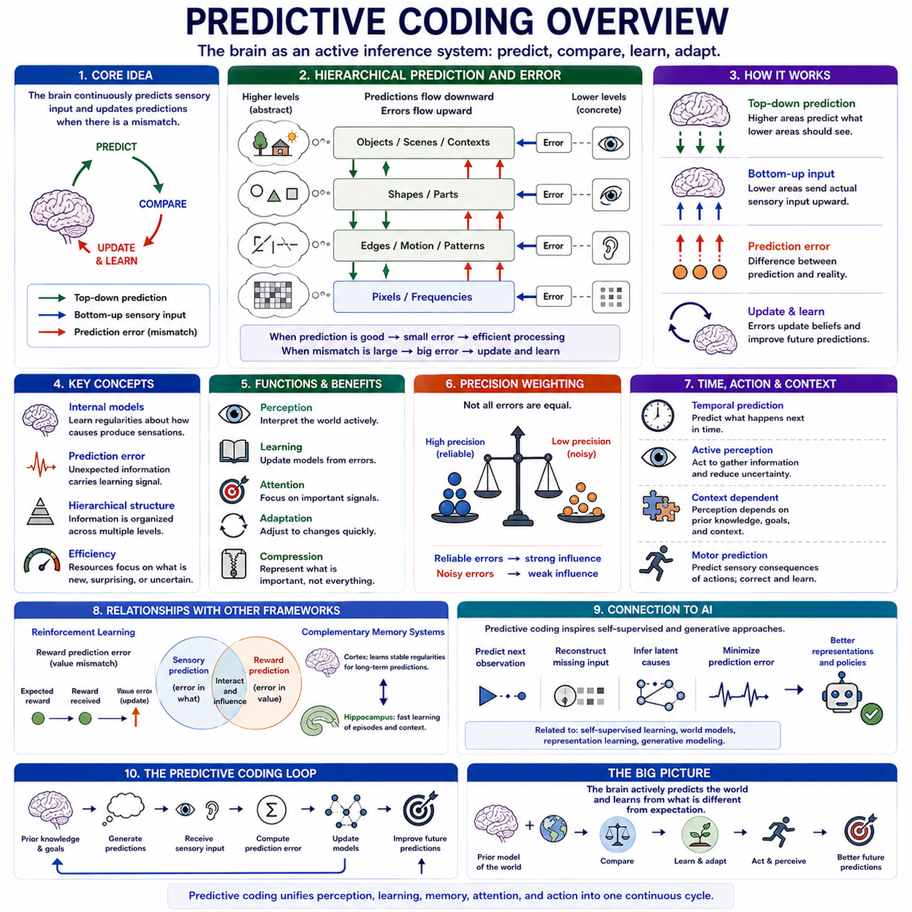{width="7.268055555555556in" height="7.268055555555556in"}

Predictive coding is a theoretical framework proposing that the brain continuously generates predictions about incoming sensory information and updates those predictions when actual input differs from expectation. Rather than processing perception as a purely feedforward transformation of external signals, the brain is viewed as an active inference system in which internal models anticipate sensory causes and prediction errors drive learning, perception, and adaptation.

The central idea is that higher levels of a neural hierarchy generate expectations about activity at lower levels. These top-down predictions are compared with incoming bottom-up signals, and the difference between the two forms a prediction error. When the prediction is accurate, little correction is required. When the mismatch is large, neural activity is adjusted so that future predictions become more consistent with observed sensory evidence.

This architecture creates a continuous loop between prediction and correction. Higher cortical regions propose interpretations of what is likely to be present in the environment, while lower regions provide information about what is actually being sensed. Prediction errors move through the hierarchy and modify internal representations. Perception therefore emerges from repeated interaction between expectations and incoming evidence rather than from passive reception of sensory data alone.

Predictive coding can be understood hierarchically because sensory information contains structure at multiple levels of abstraction. Lower levels may represent local features such as edges, frequencies, or motion, while higher levels represent objects, scenes, contexts, intentions, or more abstract relationships. Predictions generated at higher levels constrain lower-level interpretation, while unresolved errors provide information that higher levels must revise their models.

A useful consequence of this hierarchical organization is that the brain does not need to transmit every detail equally. Information that is already well predicted can be represented efficiently, while unexpected components receive greater emphasis. In this sense, prediction error functions as a form of informative residual signal. Neural processing can concentrate resources on deviations from expectation rather than repeatedly encoding everything that remains unchanged or unsurprising.

Predictive coding is closely connected with the concept of internal models. An internal model represents regularities about how causes in the world produce sensory consequences. Through repeated experience, the brain can learn that particular objects produce characteristic visual patterns, that certain actions produce expected movements, or that specific events tend to follow one another. Such models allow perception and action to be guided by expectations before complete sensory evidence becomes available.

Learning occurs when prediction errors persist. If the brain repeatedly predicts an event incorrectly, the internal model responsible for that prediction must be modified. Synaptic plasticity can gradually change the representations and connections that generate expectations, allowing predictions to become more accurate over time. Predictive coding therefore links perception and learning within the same framework: prediction supports interpretation, while error supports adaptation.

This perspective also provides a natural connection to self-supervised learning. The environment does not need to provide explicit labels for every sensory event because future input, missing information, or relationships between modalities can serve as learning targets. The brain can compare what it expected with what it actually observed. Prediction itself therefore creates a supervisory signal, allowing structured knowledge to emerge from continuous experience.

Temporal prediction is especially important because biological organisms operate in changing environments. Sensory events unfold as sequences, and actions have consequences that appear later. Predictive systems can estimate what is likely to happen next based on previous observations and current context. When the future differs from expectation, prediction errors reveal where the internal model is incomplete, outdated, or inaccurate.

Predictive coding can also explain aspects of sensory adaptation. Repeated or highly predictable stimuli may generate progressively smaller responses because they are increasingly well explained by existing expectations. Novel or surprising events can produce stronger neural responses because they generate larger prediction errors. This relationship links predictive processing with novelty detection, attention, learning priority, and adaptive allocation of neural resources.

Attention can influence predictive coding by changing the relative importance assigned to different signals. Not every prediction error should be treated equally because sensory information varies in reliability and behavioral relevance. The brain may amplify errors associated with attended, precise, or important information while reducing the influence of noisy or irrelevant signals. This introduces the concept of precision weighting into predictive processing.

Precision refers to the estimated reliability or confidence of a signal. A prediction error from a highly reliable sensory source should influence belief updating more strongly than an error from uncertain or noisy input. Similarly, strong prior expectations may dominate when sensory information is ambiguous. Perception can therefore be understood as a balance between prior predictions and sensory evidence, weighted according to their estimated reliability.

This balance helps explain why perception is context dependent. The same sensory input may be interpreted differently depending on prior knowledge, surrounding information, current goals, or expectations. Top-down predictions constrain the possible interpretations of ambiguous data, while bottom-up errors prevent expectations from becoming completely detached from reality. Accurate perception requires both useful prior structure and sufficient sensitivity to contradictory evidence.

Predictive coding is also relevant to motor control. When the brain issues a motor command, internal models can predict the sensory consequences of that action. Expected visual, proprioceptive, and tactile feedback can then be compared with actual feedback. Differences between predicted and observed consequences provide information for correcting movement and updating the internal model that connects actions with their effects.

This creates a strong relationship between predictive coding and active perception. An organism does not simply wait for sensory evidence; it can move its eyes, head, body, or limbs to obtain information that reduces uncertainty. Actions change the sensory input available to the brain, and new observations test existing predictions. Perception and action can therefore form a closed loop in which behavior actively probes the environment and improves internal models.

Predictive coding has important connections with reinforcement learning, although the two should not be treated as identical. Prediction errors in sensory processing indicate mismatches between expected and observed input, while reward prediction errors indicate differences between expected and obtained value. Both involve updating expectations from error signals, but they operate over different quantities and can interact when sensory predictions influence action selection and outcomes.

The hippocampus and cortex can contribute complementary information to predictive processing. Cortical systems gradually learn regularities that support stable expectations, while hippocampal systems can rapidly encode specific episodes and contextual relationships. Stored experiences can therefore influence what the brain predicts in familiar or partially familiar situations, while surprising observations can trigger updates to both episodic and generalized knowledge.

From an artificial intelligence perspective, predictive coding provides a biologically motivated framework for learning representations from unlabeled experience. Artificial systems can be trained to predict future observations, reconstruct missing inputs, estimate latent causes, or minimize discrepancies between generated predictions and actual data. These principles are related to self-supervised learning, world models, generative modeling, and representation learning.

Predictive coding also differs from conventional backpropagation in important ways. Backpropagation usually computes gradients from an explicit global loss through a predefined computational graph, whereas predictive coding emphasizes local prediction errors exchanged between interacting hierarchical representations. Some theoretical models investigate whether local error dynamics could approximate forms of gradient-based learning, but biological predictive coding should not be assumed to be identical to standard backpropagation.

For embodied and physical AI, predictive coding is especially relevant because intelligent agents must continually anticipate the consequences of perception and action. A robot can predict how the environment should change after movement, compare predicted sensory states with actual observations, detect unexpected events, and update its internal world model. Such capabilities support anomaly detection, adaptive control, planning, and continual learning in dynamic environments.

Predictive coding therefore provides a unified perspective connecting perception, learning, memory, attention, action, and internal models. The brain generates expectations from prior knowledge, compares them with incoming evidence, weights resulting errors according to reliability, and updates representations when predictions fail. Through this repeated cycle, experience becomes increasingly structured into models that support efficient perception, future prediction, and adaptive behavior.

## 04.01 Brain as Prediction Machine [w/Code]

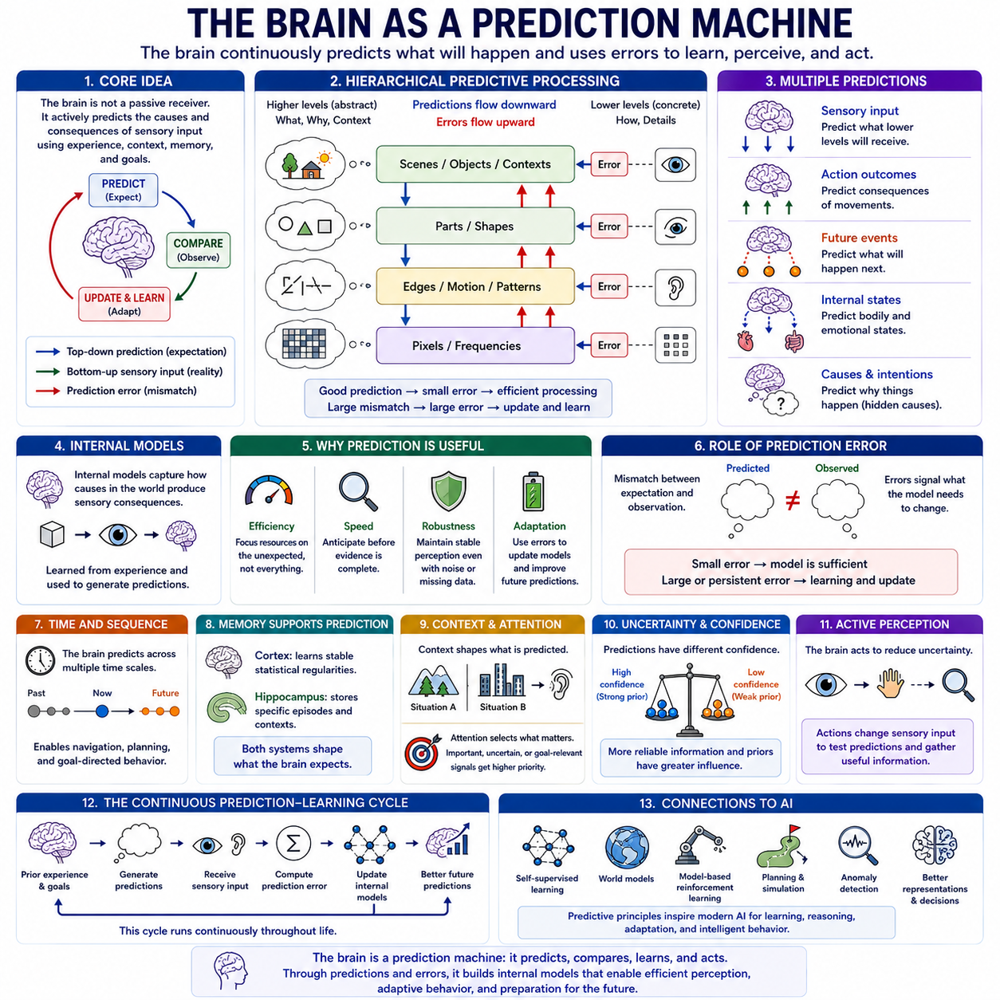{width="7.268055555555556in" height="7.268055555555556in"}

The idea of the brain as a prediction machine proposes that neural systems do not simply wait for sensory information and react after it arrives. Instead, the brain continuously anticipates what is likely to occur next, using prior experience, context, memory, and current goals. Incoming sensory signals are interpreted relative to these expectations, allowing perception and action to operate prospectively rather than as purely reactive processes.

Prediction is useful because the physical world contains regularities. Objects tend to persist, movements follow trajectories, actions produce characteristic consequences, and events often unfold in familiar sequences. By learning these patterns, the brain can estimate likely future states before complete evidence becomes available. This gives biological systems an important advantage when sensory information is delayed, noisy, incomplete, or ambiguous.

The predictive view changes the traditional interpretation of perception. In a purely bottom-up model, sensory receptors provide signals that are progressively transformed into increasingly complex representations. In a predictive system, higher-level representations also generate hypotheses about what lower-level regions should receive. Perception therefore emerges from interaction between incoming sensory evidence and internally generated expectations rather than from one-way information flow.

Internal models are central to this process. An internal model captures relationships between hidden causes in the environment and the sensory consequences those causes are expected to produce. For example, the brain can learn how an object should appear from different viewpoints or what sensory feedback should follow a movement. These learned relationships allow the system to infer causes, anticipate consequences, and maintain stable interpretations despite incomplete input.

Prediction occurs at multiple levels of abstraction. Lower neural levels may predict local patterns such as edges, motion, frequencies, or short temporal changes, while higher levels may predict objects, scenes, contexts, intentions, or task states. These levels interact hierarchically, so abstract expectations can constrain lower-level interpretation while unexpected sensory evidence can force higher-level representations to change.

A major benefit of prediction is efficient information processing. If a sensory event matches what the brain already expects, there is little need to treat the entire signal as novel information. Processing can emphasize the difference between predicted and observed input instead. In this view, unexpected or unexplained information becomes especially important because it reveals where the current internal model is incomplete or inaccurate.

Prediction errors therefore play a critical role in maintaining useful internal models. When expectation and observation differ, the mismatch provides evidence that some representation should be revised. Small errors may indicate that the current model adequately explains the input, whereas persistent or large errors can drive learning and adaptation. The brain can therefore use prediction failure as a continuous source of information about what still needs to be learned.

The predictive brain is not limited to anticipating external sensory input. It also predicts internal bodily states, action consequences, environmental transitions, and possible future outcomes. Motor systems can estimate how the body should move, perceptual systems can anticipate upcoming sensory changes, and cognitive systems can estimate likely consequences of decisions. Prediction thus provides a common computational principle across perception, action, and higher cognition.

Motor control provides a particularly clear example. When an action is generated, the brain can predict its expected sensory consequences before the feedback fully arrives. Predicted proprioceptive, visual, and tactile signals can then be compared with actual observations. If movement differs from expectation, corrective processes can modify ongoing control and update the model used for future actions.

This ability also supports the distinction between self-generated and externally generated events. Sensory changes caused by one's own movements are often predictable from motor commands, whereas unexpected changes may indicate an external cause. Predictive mechanisms can therefore help the brain interpret why sensory input changed, reducing responses to expected consequences while preserving sensitivity to events that cannot be explained by current actions.

Prediction is deeply connected to temporal processing because intelligent behavior requires estimating what will happen next. Neural systems can learn transitions among states, events, and actions across multiple timescales. Short predictions may guide immediate movement, while longer predictions can support navigation, planning, and goal-directed behavior. Temporal structure transforms perception from a sequence of isolated observations into an evolving model of the world.

Memory is essential for this predictive capability. Predictions are generated from regularities learned through previous experience, so memory provides the information needed to estimate likely future events. Cortical systems can encode stable statistical regularities, while hippocampal systems can contribute specific episodes and contextual relationships. Together, these memory systems allow both generalized knowledge and particular past experiences to shape current expectations.

Context strongly influences prediction because the same sensory signal can imply different things in different situations. A sound, movement, or visual pattern may have one interpretation in a familiar environment and another in an unfamiliar one. Higher-level representations of context constrain which predictions are plausible, narrowing the range of possible interpretations and helping the brain respond rapidly when incoming evidence is incomplete.

Attention can be interpreted partly as a mechanism that regulates which predictions and errors receive processing priority. The brain cannot devote equal computational resources to every signal. Information that is uncertain, behaviorally important, novel, or relevant to current goals may receive greater weighting. Predictive processing therefore interacts with attention by determining which discrepancies should influence perception, learning, or action most strongly.

Uncertainty is also essential because predictions differ in confidence. Some expectations are based on highly reliable experience, while others are weak or ambiguous. The brain must therefore estimate not only what is likely to happen, but how certain that prediction is. Reliable predictions can strongly shape interpretation, whereas uncertain predictions should be more easily revised when contradictory sensory evidence appears.

This leads naturally to active perception. A prediction machine does not need to remain passive while uncertainty persists. It can move the eyes, head, body, or sensors to obtain observations that distinguish among competing hypotheses. Actions can therefore be selected partly because they reveal useful information. The organism changes its sensory input in order to test predictions, reducing uncertainty through interaction with the environment.

Learning and prediction form a continuous cycle. Experience creates internal models, internal models generate predictions, sensory input tests those predictions, and resulting errors modify the models. Improved models then generate more accurate future expectations. This cycle means that learning is not separate from perception; each new interaction provides an opportunity to test and refine the system's understanding of how the world behaves.

The predictive view also connects naturally to self-supervised learning in artificial intelligence. A system can use the future, missing observations, neighboring modalities, or consequences of actions as targets without requiring human-provided labels. Predicting what comes next forces a model to extract latent regularities from data. In this sense, prediction can serve as an internally generated training signal for learning useful representations.

World models in AI follow a closely related principle. An agent can maintain an internal representation of states and transitions, use it to estimate how the environment may evolve, and compare predicted outcomes with actual observations. Errors reveal where the model needs improvement. Such systems can support simulation, planning, anomaly detection, adaptive control, and decision making, especially when direct trial-and-error interaction is costly.

However, describing the brain as a prediction machine should not imply that every neural process is reducible to one simple prediction algorithm. The brain contains multiple interacting systems for perception, memory, reinforcement, attention, action, and homeostatic regulation. Prediction provides a powerful unifying perspective, but different circuits may implement prediction and error processing through different mechanisms and at different spatial and temporal scales.

The brain-as-prediction-machine perspective therefore emphasizes intelligence as anticipatory rather than merely reactive. Internal models encode regularities from experience, hierarchical systems generate expectations, prediction errors reveal mismatches, memory provides prior structure, and action actively gathers evidence. Through this continuous cycle, the brain can reduce uncertainty, adapt to change, and use past experience to prepare for future states before they fully unfold.

## 04.02 Prediction Error [w/Code]

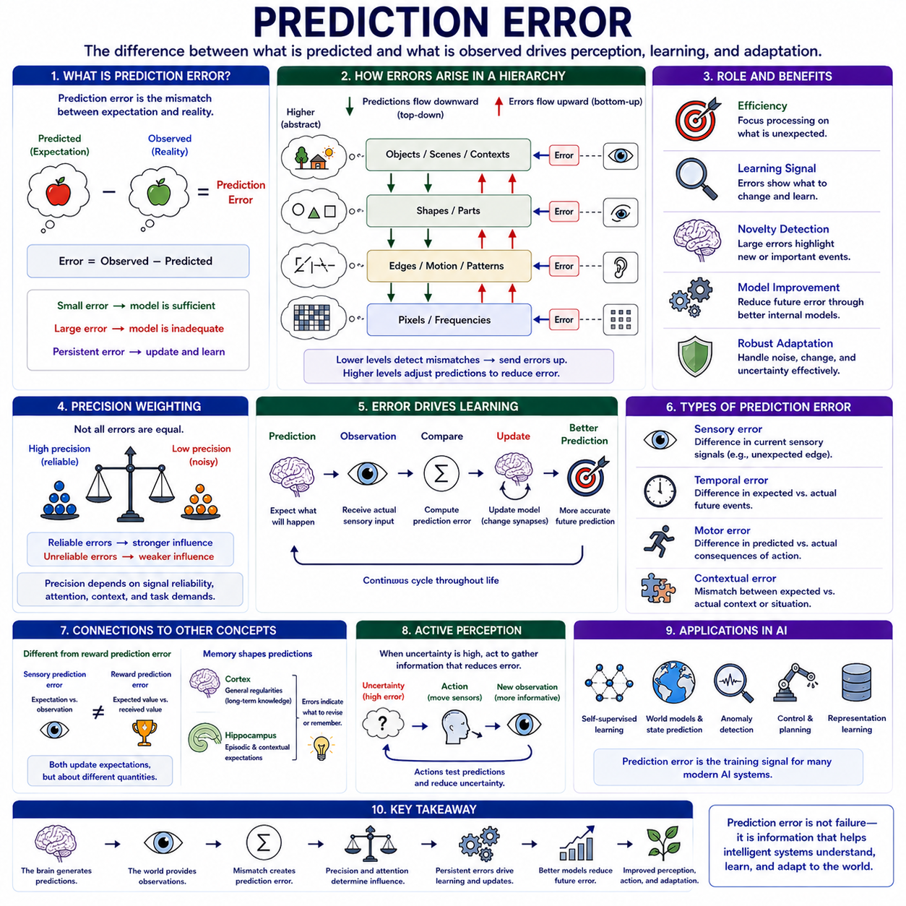{width="7.268055555555556in" height="7.268055555555556in"}

Prediction error refers to the difference between what a system expects to observe and what it actually receives. In predictive coding, this mismatch is not treated merely as failure but as informative evidence about the adequacy of an internal model. When predictions closely match sensory input, little correction is needed. When they diverge, the resulting error indicates that perception, belief, or learned structure may require revision.

The simplest computational form of prediction error can be expressed as the observed signal minus the predicted signal. The sign and magnitude of the difference provide information about how expectations differ from reality. A small error suggests that the current model explains the observation reasonably well, whereas a large or persistent error signals that some assumption, representation, or relationship encoded by the model is inaccurate.

Prediction error is central to predictive processing because the brain is assumed to generate expectations before sensory processing is complete. Higher-level representations predict patterns expected at lower levels, while sensory systems provide actual incoming evidence. The comparison between these two signals produces residual information that can propagate through the neural hierarchy and influence subsequent interpretation, attention, and learning.

This mechanism can improve efficiency because well-predicted information does not need to dominate neural processing. If most of an incoming signal is already explained by the current internal model, processing can emphasize only the unexplained component. Prediction error therefore acts conceptually like a residual signal that highlights novelty, change, inconsistency, or missing knowledge instead of repeatedly representing everything that remains predictable.

Prediction errors can arise at many levels of representation. At lower sensory levels, an error might reflect an unexpected edge, sound frequency, movement, or brightness change. At higher levels, the mismatch may concern an object, event, context, causal relationship, or intention. Predictive coding therefore treats error processing as hierarchical rather than as a single comparison performed only at the final stage of perception.

Errors generated at lower levels can influence higher-level interpretations when incoming evidence cannot be explained by existing predictions. At the same time, higher-level expectations can alter which lower-level discrepancies are meaningful. This reciprocal interaction allows perception to converge toward an interpretation that explains sensory evidence while remaining consistent with prior knowledge, context, and expectations about the structure of the environment.

Not every prediction error should have equal influence. Some sensory signals are reliable and precise, while others are noisy, ambiguous, or uncertain. Predictive processing therefore incorporates precision weighting, in which errors estimated to come from reliable information receive greater influence on belief updating. Errors associated with low-confidence signals may be down-weighted so that unstable or noisy observations do not continuously disrupt useful internal models.

Attention can interact with this weighting process by increasing the processing priority of selected error signals. A discrepancy related to an important goal, unexpected event, or attended sensory feature may receive greater influence than an equally large discrepancy in irrelevant background information. Prediction error therefore depends not only on numerical mismatch but also on estimated reliability, behavioral importance, uncertainty, and current task demands.

Persistent prediction error is particularly important for learning. A single discrepancy may be caused by temporary noise, but repeated mismatch suggests that the model systematically fails to explain experience. Synaptic plasticity and representation learning can then modify the connections responsible for generating predictions. Through repeated updates, the system reduces future error by constructing internal representations that better capture regularities in its environment.

Prediction error also helps distinguish novelty from familiarity. Familiar situations are often well represented by existing models and therefore generate relatively small unexplained residuals. Novel events violate established expectations and can generate stronger errors. This relationship provides a conceptual link among predictive coding, novelty detection, attention allocation, memory formation, and the prioritization of experiences that may require learning.

Temporal prediction error extends the same principle across time. Neural systems can predict not only current sensory input but also what should occur next. If an expected event fails to appear, or an unexpected event occurs instead, the mismatch provides information about learned state transitions. Repeated temporal errors can therefore modify expectations about sequences, trajectories, action consequences, and environmental dynamics.

Motor control also depends on prediction errors. Before or during movement, internal models can predict the sensory consequences expected from an action. Actual proprioceptive, visual, or tactile feedback can then be compared with those predictions. Differences provide signals for correcting movement and updating the forward model that links motor commands with expected outcomes, allowing future actions to become more accurate.

Prediction error is also fundamental to active perception. If the current sensory evidence cannot distinguish between competing explanations, an organism can perform actions that generate more informative observations. Moving the eyes, head, body, or sensors changes the sensory evidence available for comparison. Action can therefore be used to test predictions directly, reducing uncertainty through interaction rather than relying only on passive observation.

Sensory prediction error should be distinguished from reward prediction error. Sensory error concerns the difference between expected and observed states or signals, whereas reward prediction error concerns the difference between expected and obtained value. Both use discrepancies to update expectations, but they refer to different quantities. Their interaction can nevertheless connect perceptual learning with reinforcement learning and behavioral decision making.

Memory strongly influences prediction error because expectations depend on previously learned regularities. Cortical knowledge can provide generalized predictions based on repeated experience, while hippocampal memory can supply contextual or episode-specific expectations. A mismatch may therefore indicate either that a general model is inadequate or that the current situation differs from a remembered episode, prompting different forms of learning and updating.

Prediction errors also provide a natural source of self-supervision. An intelligent system does not require a human label to determine that its prediction was inaccurate; observation itself supplies the target. Future sensory states, hidden parts of an input, or relationships between modalities can all be predicted and compared with reality. Error minimization can therefore support representation learning from unlabeled streams of experience.

This principle has direct relevance to artificial intelligence. Predictive models can generate expected observations, compare them with real data, and use the resulting residuals to update representations. Related mechanisms appear in self-supervised learning, generative modeling, anomaly detection, state estimation, and world models. Prediction error provides a common signal indicating where an artificial model fails to capture the structure or dynamics of its environment.

In world models, prediction error can reveal weaknesses in learned state transitions. An agent may predict the next visual scene, object position, physical state, or consequence of an action and then compare the prediction with actual observations. Repeated mismatch can identify missing dynamics, incorrect assumptions, or unfamiliar situations. This makes prediction error particularly useful for continual adaptation in embodied and physical AI.

Prediction error should not be interpreted as something that intelligent systems must always reduce to zero. Some uncertainty is unavoidable because environments are stochastic, observations are noisy, and multiple futures may remain possible. Effective learning therefore requires distinguishing reducible model error from irreducible uncertainty. A robust predictive system must know when to update its model and when residual variation should simply be represented as uncertainty.

Prediction error therefore acts as a central teaching and correction signal within predictive coding. Expectations generate hypotheses about sensory input, observations test those hypotheses, precision determines how strongly discrepancies matter, and persistent errors drive changes in internal models. Through this continual comparison between prediction and reality, neural systems can improve perception, detect novelty, refine actions, learn environmental structure, and adapt to changing conditions.

## 04.03 Hierarchical Predictive Processing [w/Code]

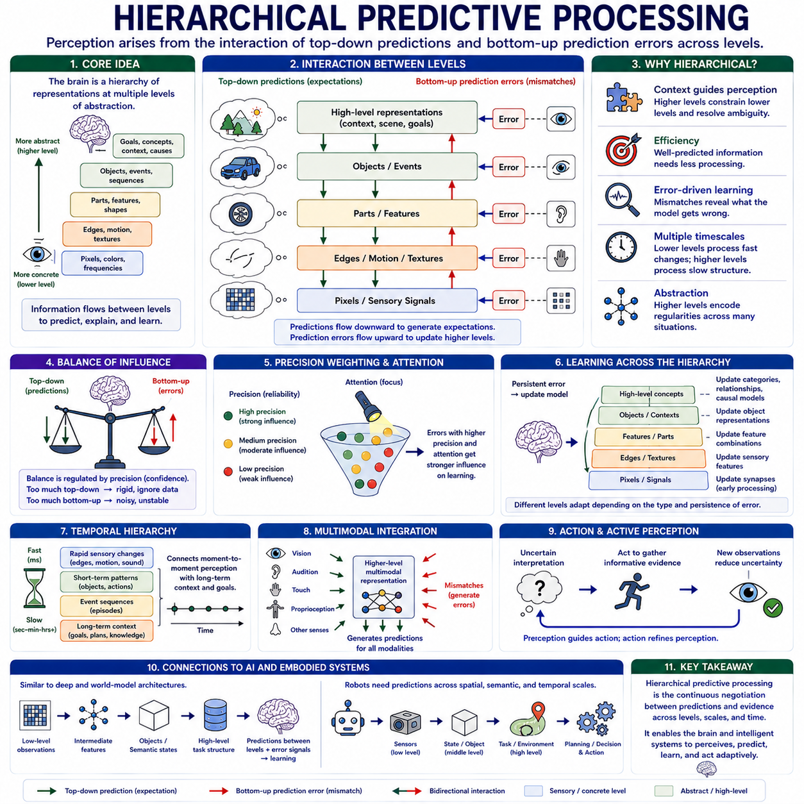{width="7.268055555555556in" height="7.268055555555556in"}

Hierarchical predictive processing describes the brain as a multilayer prediction system in which different levels represent information at different degrees of abstraction. Lower levels process relatively immediate sensory features, while higher levels represent objects, scenes, contexts, goals, and broader causal structure. Communication between these levels allows perception to combine detailed sensory evidence with increasingly abstract expectations about the world.

The hierarchy is not simply a feedforward chain that transforms raw sensory signals into progressively complex representations. Higher levels continuously generate predictions about the activity expected at lower levels. These predictions travel downward through feedback pathways, while information about mismatches between predicted and observed activity travels upward. Perception therefore emerges from recurrent exchanges between prediction and prediction error across multiple levels.

At lower levels of the hierarchy, predictions may concern relatively simple properties such as edges, orientation, brightness, frequency, texture, or local motion. These features change rapidly and remain closely connected to sensory input. Higher levels combine patterns across larger spatial and temporal ranges, allowing the system to represent objects, actions, environmental contexts, event sequences, and increasingly abstract relationships among them.

This organization allows predictions at one level to provide context for processing at the level below. If a higher-level representation predicts that a particular object is present, it can generate expectations about the shapes, textures, boundaries, or movements likely to appear in lower-level sensory representations. Incoming evidence is then evaluated relative to those expectations, making perception dependent on both sensory data and prior structure.

Prediction errors provide the complementary bottom-up signal. When lower-level observations differ from top-down expectations, the mismatch indicates that the current higher-level explanation is incomplete or inaccurate. These residual signals can propagate upward and influence increasingly abstract representations. Persistent mismatches may eventually cause the system to revise its interpretation of an object, scene, context, or broader environmental state.

Hierarchical processing is useful because uncertainty can often be resolved at different representational levels. A local visual feature may be ambiguous when considered alone but become understandable when interpreted as part of a familiar object. Similarly, an object may be ambiguous until the surrounding scene or task context is considered. Higher-level predictions constrain lower-level possibilities, allowing contextual knowledge to support efficient interpretation of incomplete or noisy signals.

However, top-down expectations cannot be allowed to dominate perception without constraint. If higher-level predictions completely overrode sensory evidence, the system could preserve incorrect interpretations despite contradictory observations. Bottom-up prediction errors provide corrective pressure by signaling when expectations fail. Effective perception therefore depends on a dynamic balance between prior predictions and evidence arriving from lower levels of the hierarchy.

Precision weighting helps regulate this balance. Prediction errors differ in reliability because sensory signals can vary in noise, ambiguity, and relevance. Errors associated with precise and reliable evidence should have greater influence on higher-level updating, whereas uncertain errors may be given less weight. The hierarchy therefore processes not only prediction and error but also estimates of confidence regarding the information being exchanged.

Attention can influence hierarchical predictive processing by modifying this effective precision. Signals related to current goals or behaviorally important events may receive increased processing priority, causing their prediction errors to exert stronger influence. Irrelevant or unreliable signals may be suppressed. Attention can therefore help determine which parts of the hierarchical prediction system should dominate perception and learning at a particular moment.

Hierarchical predictive processing also operates across multiple temporal scales. Lower levels may predict rapidly changing sensory features over milliseconds or fractions of a second, while higher levels can represent slower patterns extending across actions, events, or behavioral episodes. This temporal hierarchy allows immediate sensory changes to be interpreted within longer-term contexts, connecting moment-to-moment perception with sequences, goals, and plans.

Such temporal organization is particularly important for understanding dynamic environments. A single observation often provides insufficient information about what is happening. The brain can use previous states to predict upcoming states and evaluate whether the observed transition is expected. Higher-level representations may encode longer event structures, while lower levels track faster physical changes, allowing multiple timescales of prediction to operate simultaneously.

Memory contributes strongly to higher levels of the predictive hierarchy. Repeated experience allows cortical systems to learn stable statistical regularities, while episodic memory can provide information about specific previous situations. These stored representations generate priors about what objects, events, or outcomes are likely in the current context. Prediction errors then determine whether existing knowledge remains sufficient or should be revised.

Learning can occur throughout the hierarchy when prediction errors repeatedly reveal systematic mismatches. Lower levels may refine representations of sensory features, while higher levels may modify categories, contextual relationships, or causal models. Because errors arise at multiple representational scales, learning does not need to modify every part of the system equally. Different levels can adapt according to the type and persistence of the mismatch they encounter.

This hierarchical arrangement supports abstraction because higher levels need not preserve every detail contained in lower-level sensory representations. Instead, they can encode regularities that remain useful across many different observations. For example, numerous visual appearances can correspond to the same object identity, and many specific situations can instantiate a common concept. Prediction provides a mechanism through which these increasingly invariant representations can be tested against experience.

Multimodal processing can also be incorporated into the hierarchy. Higher-level representations may generate predictions that constrain visual, auditory, tactile, proprioceptive, and other sensory streams simultaneously. Information from one modality can therefore help resolve uncertainty in another. A coherent higher-level model explains multiple sources of sensory evidence, while inconsistent observations generate errors that indicate where the integrated interpretation requires revision.

Hierarchical predictive processing extends naturally into action. Higher levels can represent goals or desired future states, while lower levels translate these expectations into increasingly specific motor and sensory predictions. Actual movement generates proprioceptive, visual, and tactile feedback that can be compared with expected consequences. Errors at different levels can then support immediate motor correction or broader changes in action strategy.

Active perception follows from the same architecture. When competing high-level interpretations remain possible, the system can select actions that produce sensory evidence capable of distinguishing between them. Eye movements, body movements, or exploratory actions alter lower-level input and test higher-level predictions. The hierarchy therefore participates not only in interpreting sensory information but also in determining which information should be acquired next.

From an artificial intelligence perspective, hierarchical predictive processing has similarities with deep representation learning and world modeling. Artificial systems can represent low-level observations, intermediate features, objects, semantic states, and higher-level task structure at different layers. Predictions between these levels can provide learning signals, while discrepancies can identify where representations fail to capture important structure in the environment.

The approach is particularly relevant to embodied and physical AI because robots operate with information distributed across spatial, semantic, and temporal scales. A robot may need to predict pixels or sensor features at a low level, object motion at an intermediate level, and task or environmental evolution at a higher level. Organizing prediction hierarchically can help connect fast sensor processing with slower reasoning, planning, and decision making.

Hierarchical predictive processing should nevertheless be understood as a theoretical framework rather than a complete description of every neural computation. Different brain regions contain complex recurrent, lateral, and feedback connectivity, and prediction-related signals may be implemented through multiple mechanisms. The framework is valuable because it provides a common computational language for studying how bottom-up evidence and top-down knowledge can interact across levels.

Hierarchical predictive processing therefore portrays intelligent perception as continuous negotiation between abstraction and evidence. Higher levels predict the structure expected below, lower levels report mismatches, precision determines which errors matter, and learning modifies representations when discrepancies persist. Through repeated exchanges across spatial, semantic, and temporal scales, the brain can transform uncertain sensory streams into coherent models that support perception, prediction, learning, and adaptive action.

## 04.04 Perception as Inference

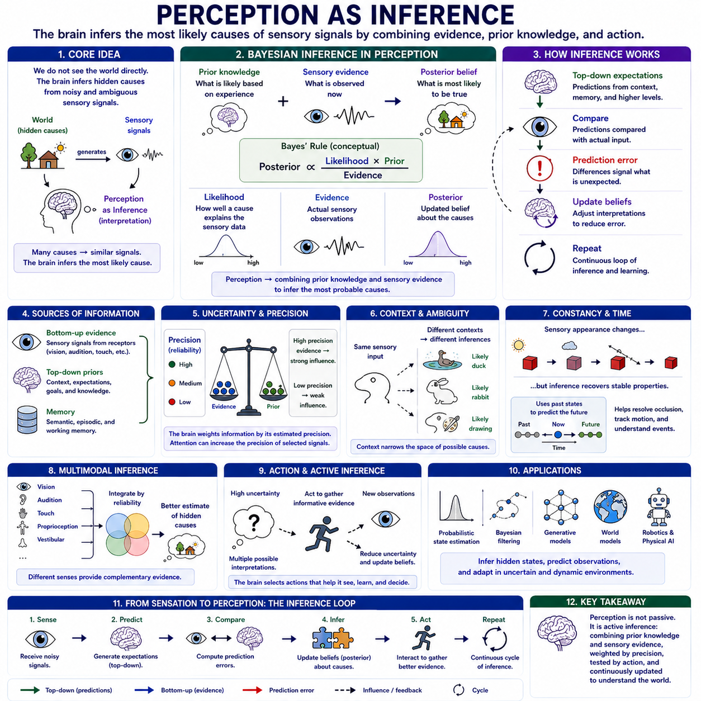{width="7.268055555555556in" height="7.268055555555556in"}

Perception as inference describes the idea that the brain does not directly recover the external world from sensory signals. Sensory receptors receive incomplete, noisy, and often ambiguous information that can be produced by many possible causes. The perceptual system must therefore infer which hidden objects, events, and environmental states most plausibly generated the available evidence, turning perception into a problem of interpretation rather than simple measurement.

This problem is often described as an inverse problem. The physical world produces sensory consequences through processes such as light reflection, sound propagation, mechanical contact, and body movement. Perception must work in the opposite direction, starting from these sensory consequences and estimating their underlying causes. Because different causes can generate similar observations, sensory evidence alone is frequently insufficient to determine a unique interpretation.

Prior knowledge helps resolve this ambiguity. Through experience, the brain learns statistical regularities about objects, environments, actions, and events. These learned regularities create expectations about what is likely to occur in a particular context. When sensory evidence is incomplete, prior knowledge can constrain the range of possible interpretations, allowing the perceptual system to select explanations that are consistent with both current input and previous experience.

This relationship is often expressed through Bayesian inference. In Bayesian terms, prior beliefs represent expectations before new evidence is observed, while the likelihood describes how compatible sensory evidence is with a possible cause. Combining prior information with the likelihood produces a posterior belief about what is most likely to be present. The framework provides a computational language for understanding how experience and evidence can jointly influence perception.

Bayesian descriptions do not necessarily imply that neurons explicitly calculate mathematical probability formulas. Rather, Bayesian inference provides a normative framework for describing how uncertain information could be combined efficiently. Neural populations may represent uncertainty and expectations through distributed activity, recurrent interactions, synaptic strengths, or other mechanisms. The important principle is that perception integrates prior structure with incoming evidence instead of relying on either source alone.

Predictive coding provides one possible mechanism for implementing aspects of perceptual inference. Higher levels of a neural hierarchy generate predictions about the sensory patterns expected at lower levels. Incoming observations are compared with these predictions, producing prediction errors when expectations and evidence differ. Repeated exchanges between predictions and errors can progressively adjust neural representations toward an interpretation that explains the sensory input.

Perception therefore involves both top-down and bottom-up information. Bottom-up signals provide evidence originating from sensory receptors, while top-down signals carry expectations derived from context, memory, and higher-level representations. Neither direction is sufficient by itself. Bottom-up processing without prior structure can leave ambiguous signals unresolved, while excessive top-down influence can preserve expectations even when sensory evidence contradicts them.

Uncertainty determines how strongly different information sources should influence inference. When sensory evidence is clear and reliable, perception should depend strongly on incoming observations. When sensory signals are noisy or ambiguous, prior knowledge can play a larger role. Conversely, highly uncertain prior expectations should be revised readily when reliable evidence appears. Perceptual inference therefore requires estimates not only of possible causes but also of confidence in those estimates.

Precision weighting provides a way to describe this regulation. Precision refers to the estimated reliability of a prediction or sensory signal. A prediction error associated with high-precision evidence should exert stronger influence on perceptual updating than an error produced by unreliable input. By weighting information according to estimated precision, the system can avoid reacting excessively to noise while remaining sensitive to observations that provide trustworthy evidence against current expectations.

Attention is closely related to this process because it can alter which sensory signals receive greater effective weight. Information relevant to current goals, threats, tasks, or uncertainties may be prioritized, increasing its influence on inference. Attention therefore does more than amplify sensory input; it can regulate which evidence is treated as sufficiently important or reliable to modify the brain\'s current interpretation of the environment.

Context provides another powerful constraint on perceptual inference. An identical sensory feature can support different interpretations depending on the surrounding scene, preceding events, or current task. Higher-level contextual representations narrow the space of plausible causes and allow ambiguous local evidence to be interpreted efficiently. This explains why perception often depends on relationships among signals rather than on isolated sensory features considered independently.

Perceptual illusions demonstrate both the power and limitations of inference. When sensory evidence is ambiguous, the perceptual system may select an interpretation that is normally reasonable given learned regularities but incorrect in an artificially constructed situation. Such illusions do not simply demonstrate defective perception. They reveal assumptions that the brain ordinarily uses successfully to infer stable properties of the world from incomplete sensory information.

Inference is also essential for perceptual constancy. The sensory appearance of an object changes with illumination, viewpoint, distance, orientation, and surrounding conditions, yet the object can still be perceived as stable. The brain must infer persistent properties behind changing sensory measurements. Object identity, size, shape, and surface characteristics can therefore remain relatively constant even though the immediate sensory representation varies substantially.

Temporal information further constrains inference. The current observation is rarely interpreted independently of what happened immediately before it. Previous states provide expectations about likely transitions, movements, and event sequences. By integrating information over time, the brain can distinguish persistent objects from transient noise, estimate trajectories, resolve temporary occlusion, and infer ongoing processes that cannot be understood from a single sensory snapshot.

Memory supplies much of the knowledge required for these inferences. Semantic memory can provide generalized knowledge about categories and relationships, while episodic memory can contribute information from specific previous experiences. Working memory can maintain currently relevant hypotheses or contextual information. Perception therefore interacts continuously with memory systems rather than functioning as an isolated stage that simply delivers completed representations to cognition.

Perception as inference also extends across multiple sensory modalities. Visual, auditory, tactile, proprioceptive, and vestibular signals may provide complementary evidence about the same underlying event. When one modality is uncertain, another can help resolve ambiguity. The brain can integrate these signals according to their reliability, constructing a more coherent estimate of environmental or bodily states than would be possible from any single sensory channel.

Action changes the inference problem because organisms can actively obtain better evidence. When sensory information is insufficient, movements of the eyes, head, hands, or body can expose new observations that distinguish competing interpretations. Perception is therefore active rather than purely passive. The system can select actions partly for their informational value, transforming uncertainty reduction into a continuous perception--action loop.

This principle is especially important for embodied intelligence. An agent operating in the physical world must infer properties that are not directly observable, including object state, traversability, hidden geometry, other agents\' intentions, or the consequences of possible actions. Reliable behavior depends on maintaining beliefs about these latent states and continuously revising them as new sensory evidence becomes available through interaction.

In artificial intelligence, perception as inference appears in probabilistic state estimation, Bayesian filtering, latent-variable models, generative models, and world models. An artificial system can maintain hypotheses about hidden states, predict observations associated with those states, and update its estimates when new measurements arrive. These mechanisms are particularly useful when sensors are noisy, observations are partial, and the environment changes over time.

For physical AI and robotics, this perspective encourages a shift from treating perception as simple object recognition toward estimating the evolving state of the world. Cameras, LiDAR, radar, proprioception, and other sensors provide partial observations rather than complete reality. A robot must integrate these measurements with previous states, learned dynamics, context, and uncertainty to infer a coherent representation that can support planning and control.

Perception as inference therefore portrays perception as an active process of constructing and testing explanations. Sensory evidence constrains possible interpretations, prior knowledge supplies expectations, precision regulates their relative influence, prediction errors reveal mismatches, memory provides learned structure, and action gathers additional evidence. Through this continuous inference process, intelligent systems transform uncertain sensory signals into useful beliefs about the hidden causes and changing states of the world.

## 04.05 Active Inference [w/Code]

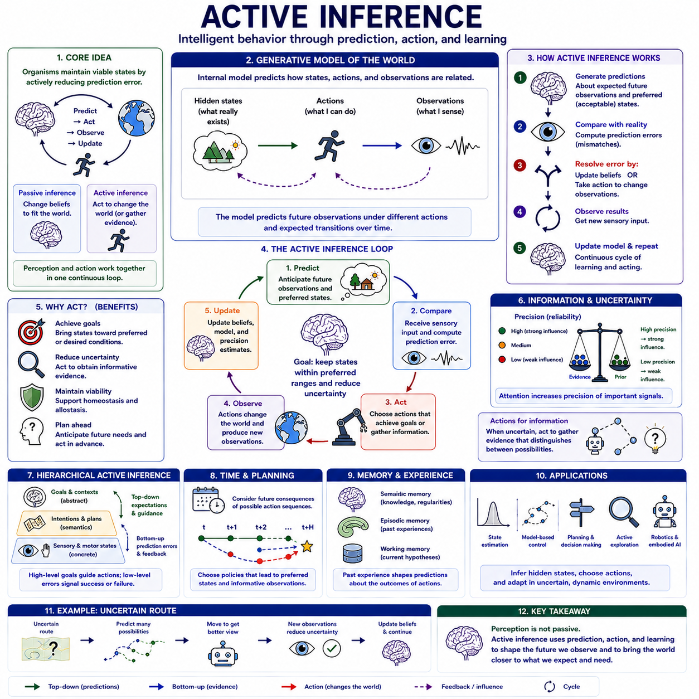{width="7.268055555555556in" height="7.268055555555556in"}

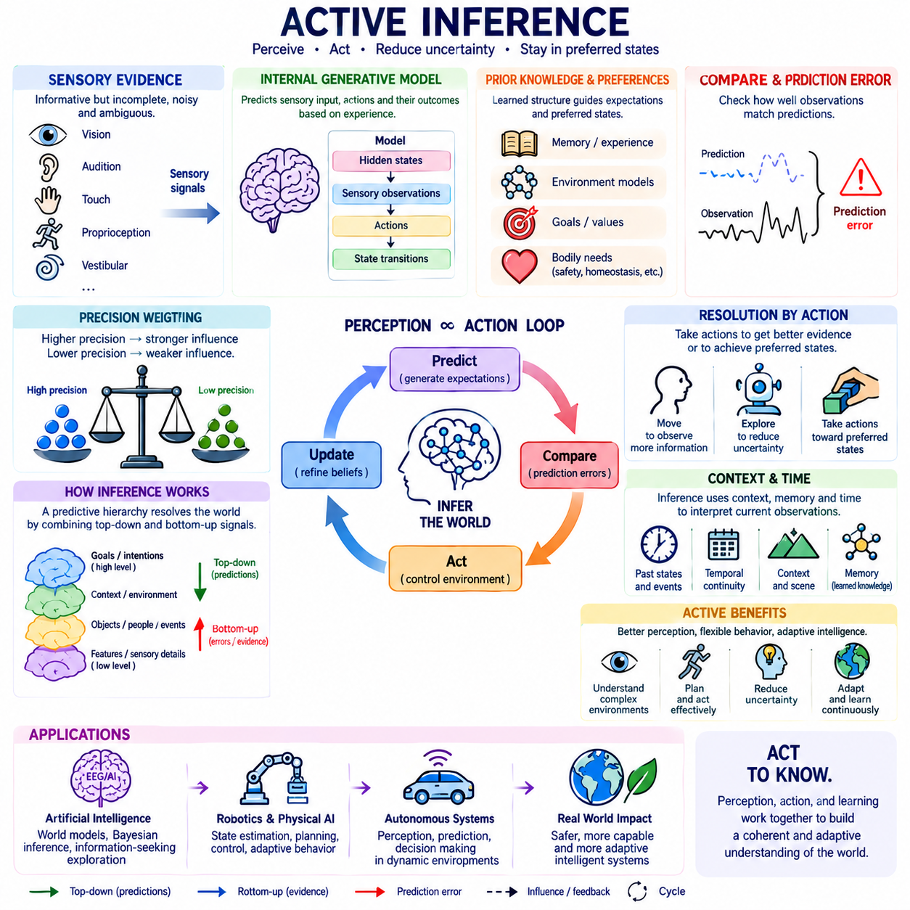{width="7.268055555555556in" height="7.268055555555556in"}

Active inference is a framework for understanding how intelligent organisms maintain viable states by continuously predicting sensory input and acting to make observations consistent with expected or preferred states. It extends predictive processing beyond perception: an organism can reduce prediction error not only by changing its internal beliefs, but also by changing the world through action. This creates a unified perception--action cycle.

The central distinction is between perceptual inference and active inference. Perceptual inference updates internal beliefs when sensory evidence differs from expectation, whereas active inference selects actions that change future sensory observations. If the world does not match an important prediction, the system can either revise its model or act so that the expected state becomes more likely to occur.

Internal generative models provide the structure needed for this process. They represent relationships among hidden environmental states, sensory observations, actions, and expected transitions over time. By using these models, the brain can predict what it should observe under different conditions and what sensory consequences are likely to follow particular actions, allowing behavior to be guided prospectively.

Prediction error remains important, but active inference changes how error can be resolved. In passive perception, mismatches primarily encourage belief updating. In active inference, some mismatches can instead motivate actions that alter sensory input. Looking toward an uncertain object, moving closer to inspect it, reaching for a desired object, or correcting body posture can all transform observations so they better satisfy predictions or reduce uncertainty.

Preferred states are therefore important because not every predicted future is equally desirable. Biological systems maintain expectations concerning bodily integrity, temperature, energy, safety, social conditions, and goal achievement. These expectations influence which future states the organism tends to seek. Action can consequently be interpreted as a process that brings sensory and physiological states toward ranges the organism expects to occupy.

Active inference also provides a perspective on homeostasis and allostasis. Homeostasis maintains important physiological variables within viable ranges, while allostasis anticipates future requirements and adjusts behavior or internal regulation before critical deviations occur. A predictive organism does not need to wait until severe imbalance develops; it can anticipate likely changes and act in advance to preserve stable functioning.

Uncertainty plays a major role because an agent often does not know exactly which hidden state is responsible for current observations. Actions can therefore be selected partly for their informational value. Turning the head, moving a sensor, approaching an object, or exploring an unfamiliar region may generate observations that distinguish between competing hypotheses. Such behavior reduces uncertainty and improves subsequent inference.

This information-seeking behavior connects active inference with active perception. Perception is not restricted to interpreting whatever information happens to arrive. The organism can control where it looks, what it touches, how it moves, and which parts of the environment it samples. Actions thereby become experiments that test internal predictions, allowing perception and behavior to cooperate in refining the model of the world.

Precision weighting helps determine which prediction errors should influence inference and action. Reliable sensory evidence should strongly challenge inaccurate predictions, whereas uncertain or noisy observations may be given less influence. Attention can modify these effective precision estimates, prioritizing signals that are relevant to goals, potential threats, novelty, or unresolved uncertainty while reducing processing devoted to less useful discrepancies.

Active inference also operates hierarchically. Higher levels may represent goals, contexts, intentions, and expected future situations, while lower levels represent immediate sensory and motor states. Higher-level expectations can therefore guide lower-level actions, and lower-level prediction errors can signal whether those actions are succeeding. This organization connects abstract goals with concrete movements and moment-to-moment sensory feedback.

Time is essential because actions are chosen for their expected future consequences rather than only their immediate effects. An agent may consider multiple possible action sequences and predict the observations associated with each one. Behavior can then favor policies expected to lead toward preferred states while also producing useful information. Planning consequently becomes closely linked to prediction over future trajectories.

Memory contributes by providing learned regularities and previous episodes from which predictions can be generated. Cortical knowledge can supply generalized expectations, while hippocampal memories can contribute context-specific experiences. Past successes and failures therefore shape beliefs about likely consequences of possible actions, enabling active inference to reuse previous experience instead of evaluating every situation entirely from the beginning.

Active inference has important similarities to reinforcement learning, but the frameworks are not identical. Reinforcement learning typically describes behavior through rewards, value functions, and policies that maximize expected return. Active inference instead emphasizes probabilistic beliefs, preferred observations, uncertainty, and prediction. Both address adaptive action selection, and practical intelligent systems may combine ideas from both perspectives.

The framework is particularly relevant to robotics and embodied AI. A robot receives incomplete observations from cameras, LiDAR, proprioception, and other sensors while continuously changing those observations through movement. It can maintain beliefs about hidden world states, predict the consequences of candidate actions, move to obtain more informative measurements, and revise its internal model when observations contradict expectations.

For example, an autonomous robot uncertain about whether a route is traversable could remain passive and accept uncertain perception, or actively move to obtain a better viewpoint. New observations can reduce uncertainty about terrain, obstacles, or geometry before committing to a trajectory. Active inference therefore suggests that intelligent sensing, exploration, state estimation, planning, and control should be treated as interacting processes rather than isolated modules.

From an artificial intelligence perspective, related principles appear in world models, model-based control, probabilistic planning, information-seeking exploration, and uncertainty-aware decision making. An artificial agent can predict future observations under alternative actions and choose actions that both achieve task objectives and improve knowledge. This is especially valuable when observations are partial and mistakes in the physical world are costly.

Active inference therefore extends the predictive brain from a system that explains observations into a system that actively shapes its future observations. Internal models generate expectations, prediction errors reveal mismatches, precision regulates their importance, actions gather evidence or produce preferred states, and new observations update beliefs. Through this continuous loop, perception, learning, planning, and action become parts of one adaptive process.

## 04.06 Free Energy Principle [w/Code]

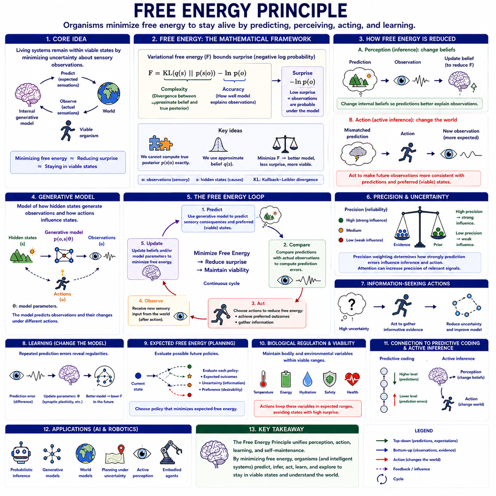{width="7.268055555555556in" height="7.268055555555556in"}

The Free Energy Principle proposes that living systems remain within a limited range of viable states by continuously reducing uncertainty about the causes of their sensory observations. In neuroscience, the principle provides a mathematical framework connecting perception, learning, action, and biological self-maintenance. It suggests that adaptive organisms maintain internal generative models that help predict the sensory consequences of hidden states in the body and environment.

The term free energy in this framework should not be confused directly with ordinary physical energy consumption. Variational free energy is a mathematical quantity that provides an upper bound on sensory surprise, where surprise refers to the negative log probability of observing a particular sensory state under a model. Because organisms cannot directly calculate the probability of every possible observation, minimizing variational free energy provides a tractable way to approximate the reduction of surprise.

Sensory surprise does not mean subjective astonishment. It describes how improbable an observation is relative to the organism\'s generative model. Biological systems that persist over time must avoid spending prolonged periods in highly improbable physiological states, such as extreme temperature or severe energy imbalance. Their organization therefore implicitly constrains the states they are likely to occupy and the sensory observations associated with those states.

A generative model represents hypotheses about hidden causes that could produce sensory observations. The brain cannot directly observe many relevant environmental or bodily states, so it must infer them from incomplete evidence. By predicting how hidden states generate observations, the system can compare expected sensory signals with actual inputs. Differences provide information that can be used to improve beliefs about the causes of current experience.

Variational inference provides the computational foundation for this process. Instead of calculating an exact posterior probability over all possible hidden causes, which may be computationally intractable, a system maintains an approximate probability distribution over hidden states. Learning and inference adjust this approximation so that it better explains observed data. Minimizing variational free energy consequently improves the correspondence between internal beliefs and sensory evidence.

Prediction error provides an intuitive bridge between free-energy minimization and predictive coding. When predicted sensory states differ from observations, prediction errors indicate that the current explanation is inadequate. Updating internal representations can reduce these discrepancies. In hierarchical predictive processing, prediction errors can arise at multiple levels, allowing sensory features, objects, contexts, and more abstract causes to be revised according to incoming evidence.

Free energy can be reduced through perception when the system changes its internal beliefs to better explain observations. This process corresponds to perceptual inference. If an unexpected sensory signal occurs, the system may revise its estimate of what caused that signal. Repeated belief updating progressively produces an interpretation that better accounts for the available evidence while remaining constrained by prior knowledge and learned environmental structure.

Free energy can also be reduced through action. Instead of changing only its beliefs, an organism can act on the environment or body so that future observations become more consistent with expected states. This provides the connection between the Free Energy Principle and active inference. Perception changes the model to fit observations, whereas action can change observations to better fit predictions associated with viable or preferred conditions.

This relationship is especially important for biological regulation. Organisms maintain variables such as temperature, energy availability, hydration, and bodily integrity within limited ranges. Expectations about these states can guide behavior before severe deviations occur. Moving toward food, avoiding danger, seeking shelter, or correcting posture can therefore be interpreted as actions that maintain expected sensory and physiological conditions required for continued viability.

Uncertainty is central to the framework because an organism must infer hidden causes from incomplete observations. Internal beliefs are therefore represented probabilistically rather than as perfectly certain conclusions. Precision describes the estimated reliability of predictions or sensory evidence and regulates their relative influence. Reliable prediction errors can strongly update beliefs, while uncertain or noisy signals may be given less influence on inference and action.

The Free Energy Principle also provides a framework for understanding exploration. Actions need not only move an organism directly toward preferred outcomes; they can also obtain information that reduces uncertainty. Looking around an obstacle, approaching an unfamiliar object, or changing viewpoint can produce observations that distinguish between competing hypotheses. Information-seeking behavior can therefore improve the generative model and support more effective future decisions.

Expected free energy extends these ideas from explaining current observations to evaluating possible future actions. An agent can consider alternative policies and estimate the uncertainty and preferred outcomes associated with each predicted trajectory. Policies can be favored when they are expected both to produce desirable observations and to reduce uncertainty about hidden states. Planning therefore combines goal-directed behavior with information gathering within a common predictive framework.

Learning occurs on a slower timescale by changing the parameters or structure of the generative model itself. Repeated prediction errors reveal statistical regularities that existing representations do not adequately capture. Synaptic plasticity and other adaptive mechanisms can then modify the model so that future observations become easier to predict. In this way, inference estimates current hidden states, action changes observations, and learning improves the model across experience.

For artificial intelligence, the framework offers conceptual links to probabilistic inference, generative modeling, world models, uncertainty-aware planning, and embodied agents. A robot can infer hidden environmental states from partial sensors, predict the consequences of actions, actively gather informative observations, and update its internal dynamics model when predictions fail. These ideas are particularly relevant when intelligent systems must operate continuously under uncertainty rather than only classify static inputs.

The Free Energy Principle is ambitious and should be understood as a theoretical framework rather than evidence that every neural computation literally performs one identical optimization algorithm. Its value lies in providing a common mathematical language connecting prediction, inference, uncertainty, action, learning, and biological regulation. Within the surrounding predictive-coding structure, it extends predictive processing toward active inference and future computational models of adaptive intelligence.

## 04.07 Predictive Coding and Generative AI [w/Code]

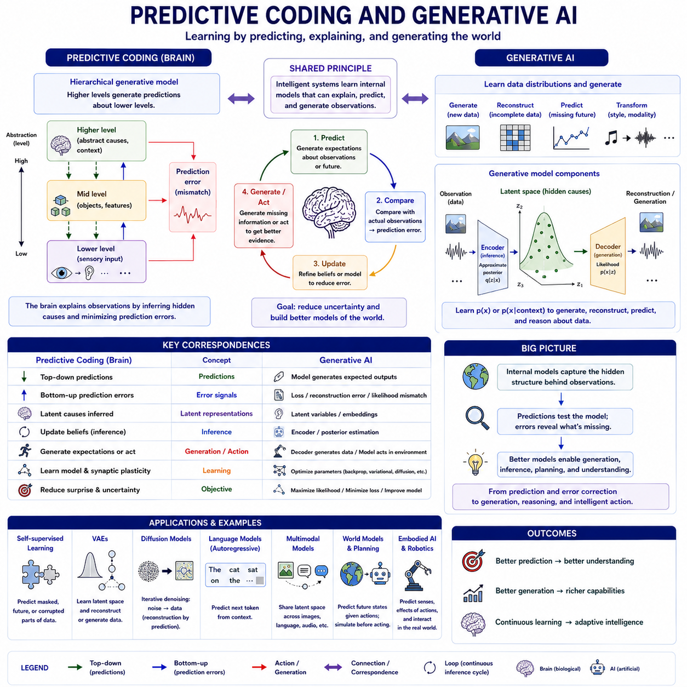{width="7.268055555555556in" height="7.268055555555556in"}

Predictive coding and generative AI share a fundamental idea: intelligent systems can learn useful representations by modeling how observations are generated rather than merely mapping inputs to fixed labels. Predictive coding describes hierarchical systems that generate expectations and correct them using prediction errors, while generative AI learns distributions that can produce, reconstruct, predict, or transform complex observations.

In predictive coding, an internal generative model attempts to explain sensory input through latent causes. Higher levels represent increasingly abstract hypotheses about the world and generate predictions for lower levels. Observations that cannot be explained produce prediction errors, which provide signals for updating representations. Learning therefore improves the model by reducing systematic differences between predicted and observed information.

Generative AI follows a related computational perspective by learning statistical structure within data. Instead of only deciding which category an observation belongs to, a generative model attempts to capture relationships that make observations probable. Once these relationships are learned, the model can generate new samples, reconstruct incomplete data, infer latent variables, predict missing information, or transform one representation into another.

The similarity becomes clearer when considering latent representations. Sensory observations such as images, sounds, or language contain enormous amounts of detail, but many variations arise from a smaller set of underlying factors. Predictive systems infer these hidden causes to explain observations. Generative models similarly learn latent or distributed representations that encode structures capable of producing many different observable patterns.

Variational autoencoders provide one explicit example of this relationship. A VAE learns a latent probability distribution from which observations can be reconstructed or generated. An encoder approximates latent causes from observed data, while a decoder models how those latent variables could generate observations. The interaction between inference and generation resembles the broader predictive-processing distinction between inferring hidden states and predicting their sensory consequences.

Prediction error also has parallels in generative-model training. A model generates an estimate of an observation or its underlying distribution and receives a learning signal based on the discrepancy between prediction and data. The exact objective differs across architectures, but the general principle remains important: mismatches reveal what the model has failed to capture, and optimization modifies parameters so future predictions better reflect statistical regularities in the training distribution.

Diffusion models illustrate this principle through iterative reconstruction. During training, data are progressively corrupted with noise and the model learns to predict information required to reverse that corruption. Generation begins from noise and repeatedly produces estimates that move toward structured samples. This is not biologically equivalent to predictive coding, but both approaches demonstrate how iterative prediction and correction can construct coherent representations from uncertain signals.

Autoregressive generative models provide another connection through temporal prediction. A language model, for example, learns to predict subsequent tokens from preceding context. Prediction errors during training modify the model so that its conditional distributions better represent patterns in language. Although the architecture and learning mechanisms differ from biological predictive coding, prediction itself becomes a powerful self-generated training objective.

This connection explains why prediction can support self-supervised learning. Future observations, masked components, corrupted inputs, or neighboring elements of a sequence can provide training targets without manually created labels. A model must discover structure that makes missing or future information predictable. Predictive objectives can therefore encourage representations of objects, semantics, temporal dependencies, contextual relationships, and latent factors.

Hierarchical representation is another important bridge. Predictive coding proposes that lower levels model relatively local sensory properties while higher levels represent increasingly abstract causes and contexts. Deep generative systems also organize transformations across multiple computational layers. Lower representations may capture local patterns, while deeper representations can encode broader structures, semantics, relationships, or dependencies spanning larger portions of the input.

Top-down generation is particularly important in this comparison. In predictive coding, higher-level hypotheses generate expectations about lower-level activity. In generative AI, latent representations or contextual states can be transformed into observable outputs such as images, text, audio, video, or other data. Both perspectives emphasize that internal representations are useful partly because they can explain or generate the observations associated with them.

However, generative AI should not be described as a direct implementation of biological predictive coding. Modern generative systems commonly rely on backpropagation, large datasets, transformer architectures, diffusion objectives, variational methods, or adversarial learning. Neural predictive processing may instead involve recurrent cortical interactions, local neural dynamics, precision weighting, and biological plasticity. The relationship is therefore conceptual and computational rather than literal.

Generative models can also be interpreted as tools for inference. If a system has learned how hidden variables generate observations, it can reason in the reverse direction and estimate hidden causes from observed evidence. This connects generative modeling with perception as inference. Recognition becomes more than assigning labels: it involves determining which internal explanation can plausibly account for the available observation.

Uncertainty makes this perspective especially valuable. A deterministic classifier may produce a single answer, whereas a probabilistic generative model can represent multiple possible explanations or futures. When observations are incomplete, several latent states may remain plausible. Maintaining distributions over possibilities allows an intelligent system to represent ambiguity rather than prematurely committing to one interpretation.

Multimodal generative AI extends this idea across different forms of information. Images, language, audio, video, actions, and sensor measurements can be modeled within shared or interacting representations. Information from one modality can constrain predictions in another. This resembles hierarchical predictive processing in which higher-level hypotheses can explain multiple sensory streams through common latent causes.

Generative prediction also provides an important foundation for world models. Instead of generating isolated samples, a model can learn how states evolve over time and how actions influence future observations. Given a current internal state and candidate action, the system can predict possible future states. Such models allow artificial agents to simulate consequences internally before interacting with the physical environment.

This transition is particularly important for embodied and physical AI. A robot must predict more than pixels or language tokens; it may need to estimate object motion, contact, geometry, traversability, human behavior, and consequences of its own actions. Generative models can represent possible future observations, while prediction errors between expected and actual outcomes can reveal where the robot\'s internal model is inaccurate.

Active perception provides another connection. If a generative model represents several possible explanations for an uncertain observation, an agent can select an action that produces information capable of distinguishing between them. Moving a camera, approaching an object, changing viewpoint, or physically interacting with the environment transforms generation and inference into an active perception--action loop rather than a passive prediction task.

Generative AI can therefore be viewed as one computational direction related to the broader principle that intelligence benefits from models capable of explaining and predicting experience. Predictive coding emphasizes prediction, hierarchical inference, and error correction, while modern generative AI provides scalable methods for learning complex distributions and generating observations. Their mechanisms differ, but both place internal modeling at the center of intelligent representation.

The connection also suggests directions beyond conventional generative systems. Future agents may combine generative models with persistent memory, uncertainty estimation, continual learning, multimodal perception, action-conditioned prediction, and online model updating. Rather than generating content only when prompted, such systems could continuously predict environmental states, compare expectations with observations, and revise internal representations through ongoing interaction.

Predictive coding and generative AI therefore meet at the idea of learning models that capture the hidden structure behind observations. Predictions test those models, discrepancies provide information for improvement, latent representations encode explanatory structure, and generation demonstrates what the model expects observations to look like. This bridge naturally leads from generative modeling toward world models, temporal prediction, embodied intelligence, and adaptive AI systems.

## 04.08 World Models and Prediction [w/Code]

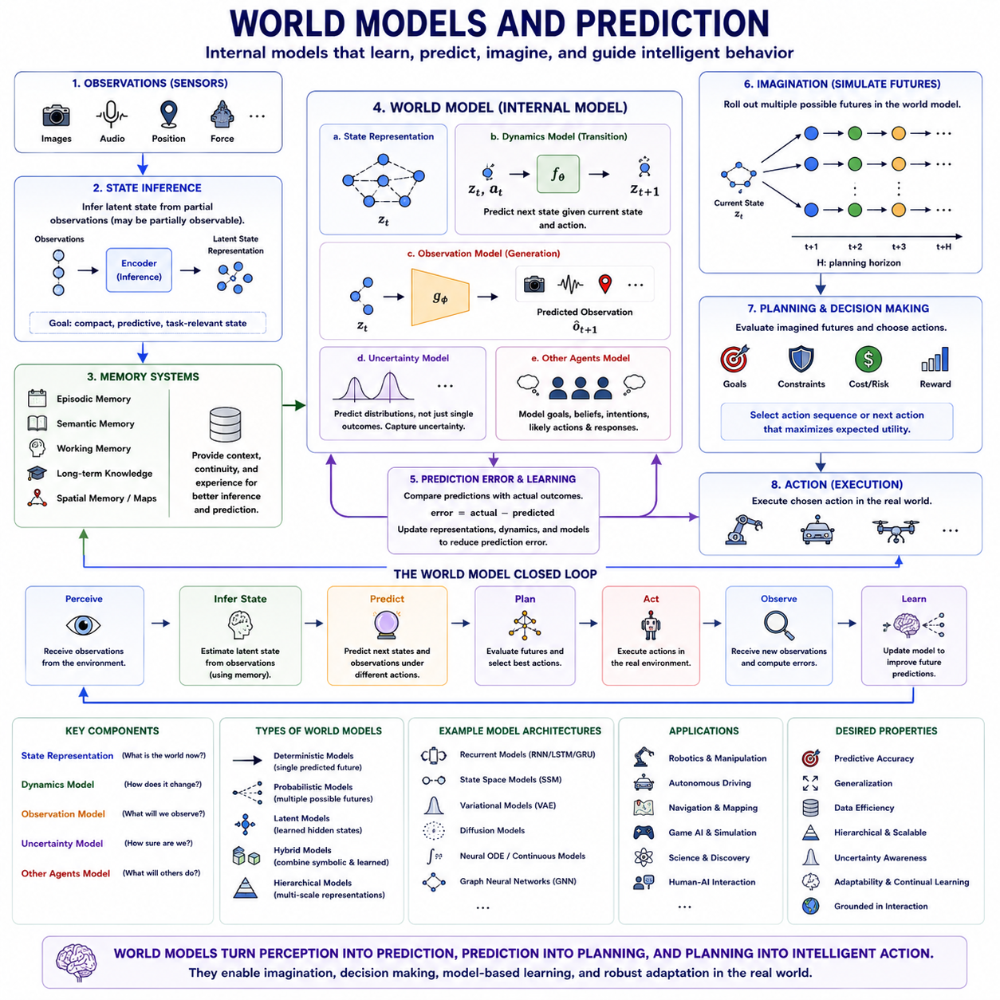{width="7.268055555555556in" height="7.268055555555556in"}

World models are internal representations that allow an intelligent system to estimate how the environment is structured and how it may change over time. Rather than reacting only to current observations, an agent can encode states, relationships, dynamics, and uncertainty, then use this model to anticipate possible futures. Prediction therefore becomes a central function connecting perception, memory, planning, and action.

A world model usually distinguishes between observations and underlying states. Sensors provide partial measurements such as images, sounds, positions, or forces, while the true state of the environment may remain only partly observable. The model must therefore infer a compact internal state that preserves information relevant to future prediction, behavior, and decision making rather than simply reproducing every sensory detail.

State representations can take several forms depending on the problem. They may be learned latent representations, geometric maps, structured symbolic descriptions, semantic representations, or combinations of these approaches. Effective representations compress complex observations while preserving information about objects, spatial relationships, motion, physical properties, goals, and other variables needed for predicting future environmental changes.

The dynamics model is the component that predicts how states evolve over time. Given a current state and possibly an action, it estimates the next state or a sequence of future states. Conceptually, this relationship can be expressed as a transition from the current state and action to a future state. Learning useful dynamics allows an agent to anticipate movement, interactions, environmental changes, and consequences before they occur.

Prediction may occur directly in observation space or within a latent state space. Predicting future images or sensor measurements can provide detailed supervision, but high-dimensional observations contain many irrelevant details. Latent prediction instead focuses on compact task-relevant structure. Many practical world models therefore combine latent dynamics with observation models that reconstruct or predict sensory signals when detailed output is required.

World models become especially powerful when they can simulate multiple possible futures. Rather than predicting only one deterministic outcome, an agent can roll out several trajectories representing alternative actions, uncertain environmental changes, or different behaviors of other agents. These imagined futures provide a computational space in which consequences can be evaluated before actions are executed in the real environment.

Uncertainty must be represented because real environments are only partially predictable. Sensor noise, hidden variables, incomplete knowledge, stochastic events, and other agents can produce several plausible futures from the same current state. Probabilistic predictions and confidence estimates allow the system to distinguish likely outcomes from uncertain possibilities and to incorporate risk into planning, control, and safety-related decisions.

Prediction error provides the primary feedback for improving a world model. After the system predicts a future state or observation, the actual outcome can be compared with the prediction. Persistent discrepancies indicate weaknesses in state representation, dynamics, observation modeling, or uncertainty estimation. Learning then modifies these components so that subsequent predictions better reflect the structure and evolution of the environment.

Prediction also connects world models with self-supervised learning. Future observations naturally provide training targets without requiring explicit human labels. An agent can predict upcoming sensor states, object motion, masked information, or action consequences and compare those predictions with later observations. Continuous interaction therefore generates its own learning signals, allowing representations and dynamics to improve from accumulated experience.

Temporal structure is fundamental because useful world models must represent more than isolated state transitions. Physical and behavioral processes unfold across different timescales, from rapid contact dynamics to object trajectories, navigation episodes, and long-term task progression. Hierarchical temporal models can connect short-term physical prediction with slower semantic events, goals, and plans, providing representations suitable for both control and reasoning.

Actions must be incorporated because an embodied agent actively changes the world it predicts. An action-conditioned model estimates how different candidate actions influence future states. The same environment can evolve differently depending on whether a robot moves, turns, grasps an object, waits, or interacts with another agent. Prediction therefore becomes counterfactual: the system can ask what would happen if different actions were selected.

Counterfactual simulation supports planning by allowing an agent to compare alternative action sequences before execution. Possible trajectories can be evaluated according to goals, cost, risk, constraints, uncertainty, or expected outcomes. The agent can then choose actions whose predicted futures are most appropriate. In this way, a world model transforms prediction from passive forecasting into a mechanism for goal-directed decision making.

Memory is closely connected with world modeling because current observations alone may not contain enough information to determine the environmental state. Previous states, episodic experiences, semantic knowledge, and learned action patterns can provide additional context. Memory enables the model to infer hidden variables, maintain object continuity, recognize recurring situations, and use previous experience to improve predictions in partially observed environments.

Models of the agent itself are also important in embodied systems. A robot must represent its body, kinematics, dynamics, sensors, energy resources, payload, capabilities, and limitations in addition to the external environment. Accurate prediction requires understanding how the agent\'s own actions interact with physical constraints. A world model therefore often contains both an environmental model and aspects of a self model.

Intelligent interaction may additionally require models of other agents. Humans, robots, or autonomous systems possess goals, beliefs, intentions, and behavioral patterns that influence future states. Predicting likely actions and responses can support cooperation, negotiation, collision avoidance, social interaction, and multi-agent coordination. The world model consequently expands from physical dynamics toward behavioral and social dynamics.

Generative modeling provides useful mechanisms for representing possible futures. A generative world model can predict observations or latent states conditioned on previous states and actions, while probabilistic generation can represent multiple plausible trajectories. This connects world modeling with generative AI, although a useful world model must emphasize temporal consistency, action consequences, and grounding in interaction rather than generation alone.

World models are particularly important for robotics and Physical AI because trial-and-error interaction with the real world can be slow, expensive, or unsafe. A robot that can simulate consequences internally can evaluate navigation paths, manipulation strategies, contacts, obstacles, and failure possibilities before acting. Prediction can therefore improve data efficiency, planning quality, adaptive control, and operational safety in dynamic environments.

A complete world-model loop integrates perception, prediction, planning, action, observation, and learning. Sensors update the internal state, the dynamics model predicts possible futures, planning selects actions, execution changes the environment, and new observations reveal prediction errors. Those errors then update representations and dynamics. The result is a closed cognitive loop in which prediction continually improves through interaction.

World models and prediction therefore provide a bridge from passive pattern recognition to adaptive intelligence. By representing hidden states, learning dynamics, modeling uncertainty, simulating alternative futures, and incorporating action consequences, an intelligent system can reason about what may happen before committing to behavior. This capability supports imagination, planning, decision making, model-based learning, control, and robust adaptation in changing environments.

## 04.09 Temporal Prediction and State Transitions [w/Code]

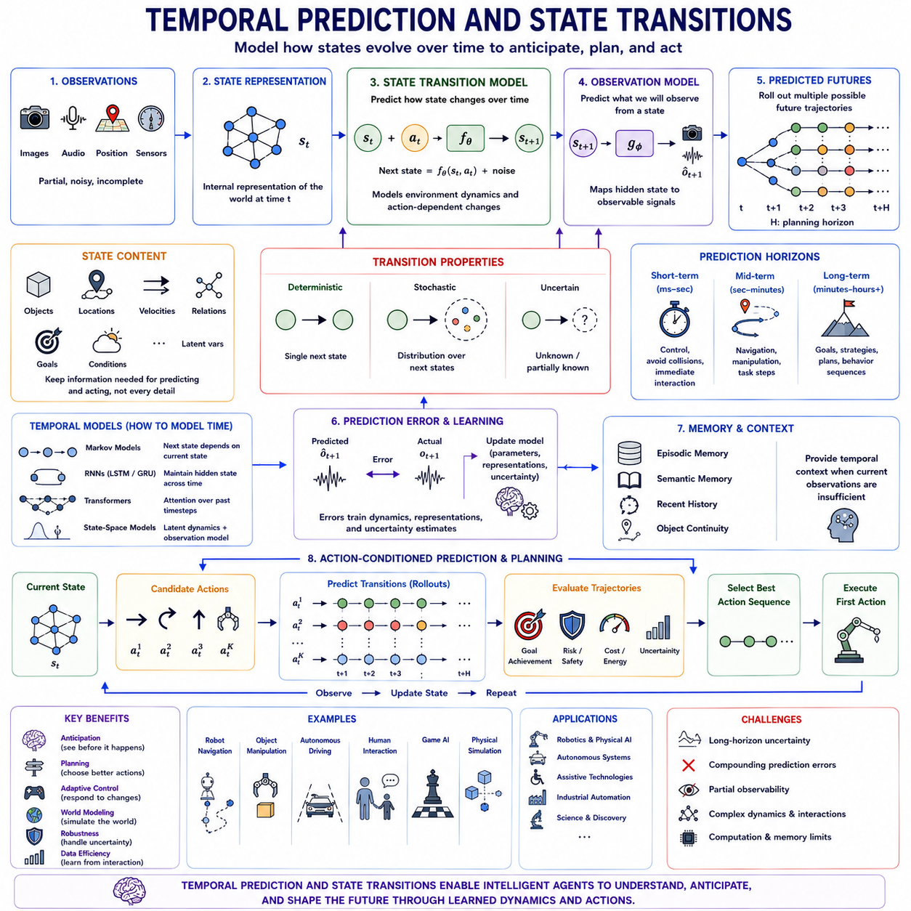{width="7.268055555555556in" height="7.268055555555556in"}

Temporal prediction allows an intelligent system to represent not only what exists at the present moment but also how states are likely to evolve through time. Instead of treating observations as isolated snapshots, the system models sequences, dependencies, and transitions between states. This temporal structure allows perception to become predictive, enabling an agent to anticipate events before they are directly observed.

A state is an internal representation of information relevant to prediction and behavior at a particular time. It may encode sensory features, object locations, velocities, relationships, goals, environmental conditions, or latent variables inferred from observations. The purpose of a useful state representation is not necessarily to preserve every detail, but to retain sufficient information for estimating how the system may evolve.

State transitions describe how one state changes into another. A transition model can be expressed conceptually as a mapping from the current state to the next state, often conditioned on an action. In embodied systems, this relationship is especially important because the future depends not only on environmental dynamics but also on what the agent does. Prediction therefore requires models of both passive change and action-dependent change.

Temporal prediction can operate across different horizons. Short-term prediction may estimate what will happen milliseconds or seconds ahead, supporting motor control, collision avoidance, and immediate interaction. Longer-term prediction may represent sequences extending across navigation, manipulation, tasks, or behavioral plans. Different horizons require different levels of abstraction because detailed predictions become increasingly uncertain as time extends into the future.

Markov models provide a simple formulation in which the next state depends primarily on the current state. This assumption can make prediction computationally manageable, but many real-world processes contain dependencies extending further into the past. A sufficiently informative state must therefore summarize relevant historical information, or the model must explicitly maintain memory capable of representing longer temporal dependencies.

Recurrent neural networks extend temporal modeling by maintaining hidden states that evolve as new observations arrive. Architectures such as LSTMs and GRUs were designed to preserve information across sequences and reduce difficulties associated with long-term dependencies. Their hidden representations can summarize previous observations, allowing future predictions to depend on temporal context rather than only the immediately preceding input.

Transformers provide another approach by using attention mechanisms to relate information across different positions in a sequence. Instead of compressing all previous information through a single recurrent state, attention can selectively access relevant elements from earlier observations. This enables models to capture long-range dependencies and relationships, although computational requirements can increase substantially as sequence length grows.

State-space models provide a structured framework for connecting hidden dynamics with observations. A latent state evolves according to a transition process, while an observation model maps that hidden state into measurable signals. This separation is useful when sensors provide incomplete or noisy evidence about the underlying system. Prediction can occur in latent space while observations continually correct estimates of the hidden state.

Prediction becomes more difficult when transitions are stochastic rather than deterministic. The same current state and action may lead to several possible future outcomes because of noise, unknown variables, environmental changes, or other agents. A probabilistic transition model therefore represents a distribution over possible next states rather than a single answer, allowing uncertainty to propagate through future predictions.

Multi-step prediction extends the transition model recursively through time. A predicted next state becomes the input for predicting a later state, producing an imagined trajectory. However, small errors can accumulate during repeated rollout, causing long-horizon predictions to drift away from reality. Robust temporal models must therefore manage uncertainty, periodically incorporate new observations, and distinguish reliable near-term predictions from increasingly uncertain distant futures.

Hierarchical temporal prediction addresses this problem by representing dynamics at multiple timescales. Lower levels may predict rapid changes such as motion, contact, or sensor variation, while higher levels represent slower events such as completing a maneuver, reaching a location, or accomplishing a task. Hierarchical abstraction reduces the need to predict every low-level detail across long horizons and supports more efficient planning.

Temporal abstraction can also represent sequences as meaningful events or skills. Instead of predicting hundreds of individual motor commands, an agent may reason about higher-level transitions such as approach, grasp, transport, and place. Each abstract state can contain lower-level controllers or predictive processes. This organization connects continuous physical dynamics with symbolic or semantic reasoning about task progression.

Prediction errors provide feedback for learning temporal dynamics. After a transition occurs, the predicted state can be compared with the actual observation or inferred state. Differences reveal where the transition model is inaccurate. Repeated errors can update model parameters, representations, or uncertainty estimates, allowing the system to learn changing dynamics from experience and improve predictions over time.

Temporal prediction is closely related to predictive coding because expectations about future sensory states can be compared with incoming observations. When events unfold as expected, little corrective information may be required. Unexpected transitions generate larger prediction errors and encourage belief or model updates. Temporal prediction therefore extends prediction from hierarchical sensory processing into the evolution of states across time.

Memory is essential when current observations do not uniquely determine the future. An object may temporarily disappear behind an obstacle, a robot may lose direct visibility of a landmark, or an interaction may depend on actions performed several seconds earlier. Maintaining temporal context allows the system to preserve object continuity, infer hidden states, and predict events despite temporary gaps in sensory information.

Action-conditioned temporal models are particularly important for planning. The agent can evaluate different candidate actions by predicting their associated state transitions. One action may move the system toward a desired state, while another may increase risk or uncertainty. By rolling out alternative action sequences internally, the agent can compare possible trajectories before selecting and executing a policy in the physical environment.

For robotics and Physical AI, state transitions must capture both environmental dynamics and the robot\'s own physical behavior. Relevant variables can include position, velocity, orientation, joint configuration, object motion, contact, terrain, and sensor observations. A useful model must predict how these variables interact under actions while remaining computationally efficient enough to support real-time perception, planning, and control.

Temporal prediction also provides a foundation for world models. A world model becomes useful for decision making when it can transform a representation of the present into plausible representations of the future. State estimation identifies where the system currently is, transition modeling predicts where it may go, and observation models estimate what it would perceive. Together these mechanisms enable internal simulation of possible future experience.

Self-supervised learning naturally supports temporal models because future experience supplies its own training targets. A system can predict the next observation, future latent state, object trajectory, or consequence of an action and later compare that prediction with reality. Large streams of unlabeled interaction data can therefore provide continuous supervision for learning representations and transition dynamics without requiring manual annotation.

Temporal prediction and state transitions ultimately provide the computational bridge between understanding the present and reasoning about the future. By representing states, learning dynamics, preserving temporal context, modeling uncertainty, and simulating action-dependent trajectories, intelligent systems can move beyond reactive behavior. These capabilities support anticipation, planning, adaptive control, world modeling, and increasingly autonomous interaction with dynamic environments.
