**Volume 44 Neuroscience for AI**

# Chapter 05. Brain Inspired Computation

## 05.00 Brain Inspired AI Overview

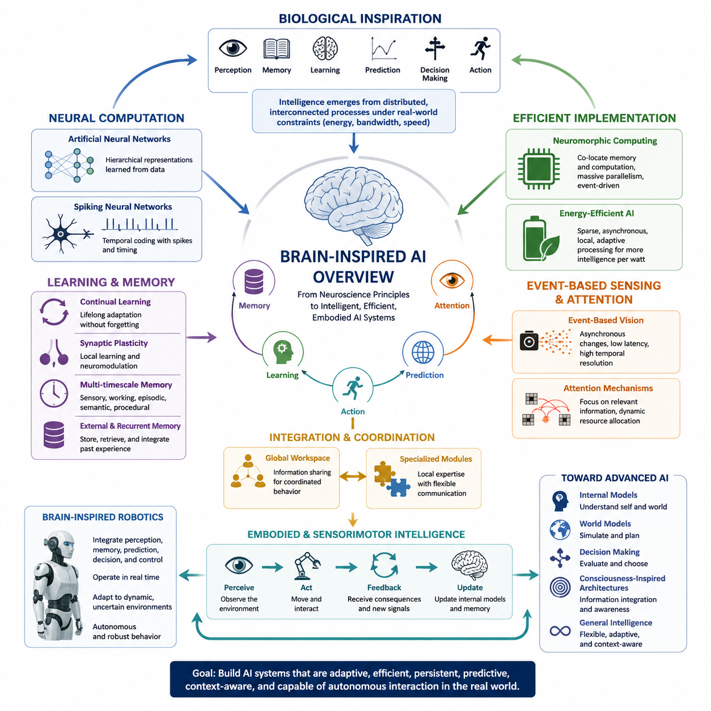{width="7.268055555555556in" height="7.268055555555556in"}

Brain-inspired artificial intelligence seeks computational principles from biological nervous systems rather than attempting to reproduce the brain literally. The brain demonstrates that perception, learning, memory, prediction, decision making, and action can emerge from distributed networks operating under severe constraints on energy, communication bandwidth, and processing speed. Brain-inspired AI therefore studies biological mechanisms as design clues for building adaptive, efficient, and autonomous computational systems.

The central idea is that intelligence arises from coordinated interactions among specialized but interconnected processes. Biological cognition does not depend on a single universal algorithm. Sensory pathways extract structured information, memory systems preserve experience, cortical networks construct representations, basal ganglia contribute to action selection, and predictive mechanisms continuously anticipate future states. Artificial systems can similarly benefit from architectures in which perception, memory, prediction, reasoning, and control cooperate rather than operate as isolated modules.

Artificial neural networks represent the most historically influential example of this translation from neuroscience to computation. Their artificial neurons are extremely simplified abstractions of biological cells, yet networks of such units demonstrate how useful representations can emerge through distributed computation. Deep neural networks extend this principle through multiple processing layers, allowing increasingly abstract features to develop from raw observations. Their success illustrates the value of hierarchical representation while also revealing how distant contemporary AI remains from biological neural computation.

Biological neurons communicate through complex temporal patterns of electrical activity rather than simply transmitting continuous scalar activation values. Spiking neural networks attempt to capture this temporal dimension by representing information through discrete spikes and their timing. Such models can exploit temporal coding, sparse activity, local interactions, and event-driven computation. They therefore provide an important bridge between computational neuroscience and AI, especially when low latency, continuous sensory processing, or energy efficiency is important.

Neuromorphic computing extends brain-inspired principles from algorithms into hardware. Conventional processors repeatedly move data between memory and computing units, producing substantial communication and energy costs. Neuromorphic architectures instead attempt to colocate memory and computation, support massive parallelism, and activate processing resources primarily when meaningful events occur. Combined with spiking neural networks, these architectures suggest computing systems whose operational characteristics differ fundamentally from conventional GPU-centered artificial intelligence.

Energy efficiency is particularly important because biological brains achieve sophisticated cognition with remarkably limited power compared with large computational infrastructures. Biological processing is sparse, asynchronous, distributed, adaptive, and strongly dependent on local communication. Brain-inspired AI investigates whether similar principles can reduce unnecessary computation. Sparse activation, conditional computation, event-driven processing, local learning, specialized accelerators, and adaptive resource allocation all reflect attempts to obtain greater intelligence per unit of computation and energy.

Event-based vision provides a concrete example of this principle. Conventional cameras repeatedly capture complete image frames even when most of the scene remains unchanged. Event cameras instead report local changes in brightness asynchronously, generating information primarily when visual events occur. This resembles aspects of biological sensory processing in which changes and contrasts are highly informative. Event-driven perception can therefore provide low latency, high temporal resolution, reduced redundant data, and potentially lower computational requirements for dynamic environments.

Attention offers another important bridge between neuroscience and artificial intelligence. Biological organisms cannot process every available stimulus with equal depth, so attention dynamically prioritizes information according to goals, relevance, novelty, and context. Artificial attention mechanisms similarly allow models to emphasize selected relationships within large information spaces. Although Transformer attention should not be interpreted as a direct implementation of biological attention, both approaches demonstrate the computational importance of selective information routing and context-dependent resource allocation.

Global workspace theories provide a broader perspective on information integration. Specialized brain processes can operate locally, while selected information becomes widely available across systems responsible for memory, planning, reasoning, and action. Brain-inspired AI can use this principle as an architectural metaphor for coordinating specialized modules. Instead of requiring every subsystem to communicate continuously with every other subsystem, a shared workspace can distribute contextually important information to components that need it for coordinated behavior.

Memory-inspired computation addresses another major limitation of purely feed-forward intelligence. Biological memory includes multiple interacting forms operating over different timescales, including short-lived sensory traces, working memory, episodic experience, semantic knowledge, and procedural skills. Artificial systems can similarly separate temporary computational state from persistent knowledge and experience. External memory, retrieval mechanisms, recurrent state, episodic stores, and learned long-term representations allow AI systems to integrate present observations with relevant information from previous interactions.

Learning in biological systems is also fundamentally continual. Organisms rarely receive a fixed dataset, train once, and then stop changing. Instead, they learn throughout their lifetime while attempting to preserve useful knowledge acquired earlier. Synaptic plasticity, consolidation, replay, contextual modulation, and complementary memory mechanisms provide inspiration for continual-learning AI. The corresponding engineering challenge is to acquire new capabilities without catastrophic forgetting while determining which information should remain stable and which representations should remain adaptable.

Prediction provides another unifying principle. Neural systems continuously use previous experience and current sensory evidence to anticipate likely states of the environment and consequences of actions. Predictive processing reduces uncertainty and allows organisms to respond before complete sensory evidence becomes available. Artificial world models follow a related computational objective by learning representations of environmental dynamics and predicting how states may evolve. Prediction can therefore connect perception, memory, planning, simulation, and action within a unified architecture.

Embodied and sensorimotor intelligence further emphasizes that cognition is shaped by interaction with the physical world. Biological intelligence developed in organisms that continuously perceive, move, manipulate objects, experience consequences, and update internal models. Brain-inspired embodied AI therefore treats action as part of intelligence rather than merely an output of cognition. Perception influences action, action changes the environment, new sensory evidence updates internal state, and this closed loop supports adaptation through continuous interaction.

Brain-inspired robotics applies these principles to autonomous machines operating under real-world constraints. Robots must integrate heterogeneous sensors, maintain estimates of themselves and their surroundings, predict motion and interaction outcomes, select actions, and react to unexpected events in real time. Hierarchical control, sensorimotor prediction, adaptive feedback, event-driven perception, memory, and reinforcement learning can provide complementary mechanisms. The goal is not a robotic copy of the nervous system but a robust architecture inspired by biological solutions to autonomy.

A major lesson from neuroscience is that intelligence may depend as much on architecture and information flow as on raw computational scale. The brain combines specialized regions, recurrent connectivity, hierarchical processing, local adaptation, memory systems, prediction, attention, and action within one continuously operating organism. Modern AI often studies these capabilities separately. Brain-inspired computation encourages their integration, suggesting that increasingly capable systems may require coordinated mechanisms for representation, memory, prediction, learning, attention, and control.

However, biological inspiration must be used carefully. Neuroscience does not provide a complete engineering specification for intelligence, and many biological mechanisms exist because of evolutionary constraints that computers do not share. Conversely, mathematically effective AI mechanisms do not need direct biological equivalents. Productive brain-inspired AI therefore extracts computational principles that can be experimentally tested rather than assuming that greater biological realism automatically produces greater artificial intelligence.

This distinction is particularly important when comparing backpropagation-based learning with biological plasticity. Modern deep learning can optimize enormous networks through global gradient information, whereas biological learning appears to rely heavily on local signals, neuromodulation, recurrent dynamics, structural constraints, and multiple interacting learning processes. Research at this boundary asks whether more local, asynchronous, predictive, or self-organizing learning mechanisms can complement conventional optimization while retaining the scalability and reliability required by modern AI.

The relationship between brain-inspired computation and contemporary foundation models is therefore complementary rather than competitive. Large neural models demonstrate powerful capabilities obtained through scale, representation learning, attention, and massive datasets. Neuroscience contributes different questions: how can systems learn continuously, operate efficiently, maintain persistent memory, prioritize relevant information, adapt online, predict consequences, and coordinate perception with physical action? These questions become increasingly important as AI moves from static datasets toward autonomous agents.

The chapter structure reflects this progression from computational abstraction toward integrated intelligent behavior. Artificial neural networks establish the connectionist foundation, spiking networks introduce temporal neural computation, and neuromorphic systems explore hardware architectures compatible with sparse event-driven processing. Energy-efficient AI and event-based vision then translate these ideas into practical computational advantages, while attention, global workspace mechanisms, and memory-inspired computation address selective processing and information integration.

Embodied and sensorimotor AI subsequently extend intelligence into continuous perception-action loops, and brain-inspired robotics combines these mechanisms in physical agents. Together, these topics form a bridge from neuroscience toward the broader themes of memory systems, decision making, internal models, world models, consciousness-inspired architectures, and general intelligence developed elsewhere in the Neuroscience for AI structure and the larger AI Bible Series.

Ultimately, brain-inspired AI is best understood as a search for transferable principles of intelligent computation. Distributed processing suggests scalable coordination, plasticity suggests adaptation, prediction supports anticipation, attention enables selective computation, memory provides temporal continuity, embodiment grounds representations in interaction, and neuromorphic principles suggest efficient implementation. Their integration offers a path toward AI systems that are not merely larger, but increasingly adaptive, efficient, persistent, context-aware, and capable of autonomous interaction with changing environments.

## 05.01 Artificial Neural Networks [w/Code]

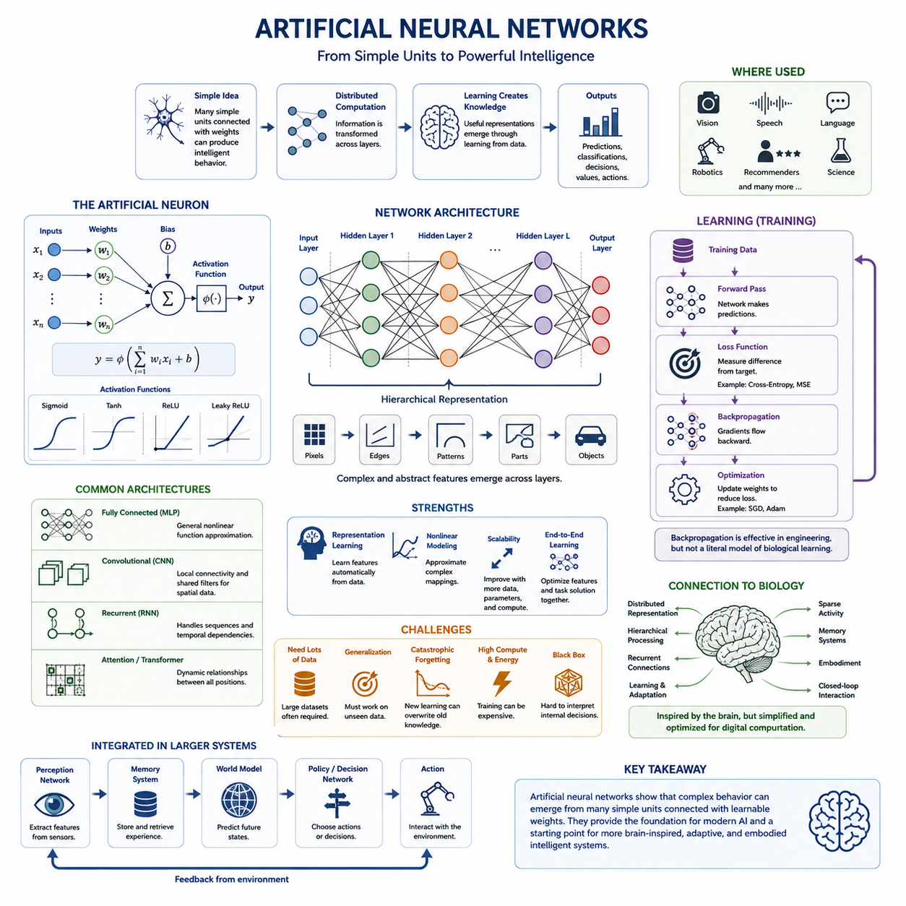{width="7.268055555555556in" height="7.268055555555556in"}

Artificial neural networks are computational models inspired by the idea that intelligence can emerge from many simple processing units connected through weighted relationships. Although artificial neurons are highly simplified compared with biological neurons, their organization captures an important principle of distributed computation. Information is transformed across layers, and useful internal representations emerge through learning rather than being completely specified by hand.

An artificial neuron typically receives multiple input values, multiplies them by adjustable weights, combines the results with a bias term, and passes the resulting signal through an activation function. This operation is mathematically simple, but when thousands or millions of such units are connected, the network can represent complex nonlinear relationships. Learning modifies the weights so that the network gradually produces outputs that better match the desired behavior.

The earliest neural network models were motivated by simplified abstractions of biological neurons and synaptic connections. These models established the idea that computation could be distributed across interconnected units rather than expressed entirely through explicit symbolic rules. Modern neural networks have evolved far beyond these early abstractions, but the underlying connectionist principle remains central: knowledge is encoded collectively in patterns of parameters and activations distributed throughout the network.

Neural networks are usually organized into an input layer, one or more hidden layers, and an output layer. The input layer receives data, while hidden layers transform the information into increasingly useful representations. The output layer converts the final internal representation into a prediction, classification, decision value, or other task-specific result. Deep neural networks extend this structure by using many hidden layers, enabling multiple stages of hierarchical feature transformation.

Hierarchical representation is one of the most important properties connecting artificial neural networks with brain-inspired computation. Early layers often respond to relatively simple patterns, while deeper layers combine them into more abstract structures. In visual systems, for example, low-level information can be transformed into edges, textures, shapes, object parts, and eventually object-level representations. This progression resembles the general idea of hierarchical processing found in biological sensory systems.

Activation functions introduce nonlinearity into neural computation. Without nonlinear transformations, multiple stacked layers would collapse into behavior equivalent to a single linear transformation and would have limited representational power. Functions such as sigmoid, hyperbolic tangent, rectified linear units, and their modern variants allow networks to approximate complex mappings. The choice of activation also influences gradient propagation, sparsity, numerical stability, and computational efficiency.

Learning in most modern artificial neural networks is based on optimization of an objective function. During training, the network produces predictions, a loss function measures the difference between predictions and desired outcomes, and an optimization algorithm adjusts parameters to reduce that loss. This process converts experience contained in training data into distributed parameter configurations. As a result, the network learns a computational mapping without requiring every intermediate rule to be explicitly programmed.

Backpropagation is the dominant mechanism used to calculate how each parameter contributes to prediction error. It applies the chain rule of calculus to propagate gradient information backward through the computational graph. Optimization methods such as stochastic gradient descent then use these gradients to update network weights. Backpropagation has enabled the scalable training of deep networks, although it should not be interpreted as a literal model of biological learning.

The biological plausibility of backpropagation remains an important issue in neuroscience-inspired AI. Biological synapses appear to depend strongly on local activity, timing, neuromodulatory signals, recurrent interactions, and structural constraints, whereas conventional backpropagation relies on precise global error gradients. This difference illustrates a broader principle: artificial neural networks were inspired by neuroscience, but modern deep learning should be viewed primarily as an engineering framework rather than a faithful simulation of the brain.

Representation learning is one of the major strengths of neural networks. Traditional machine learning often depends heavily on manually designed features, whereas neural networks can learn representations directly from raw or minimally processed data. The same training process can therefore optimize both the internal features and the final task solution. This ability is especially important in images, speech, language, robotics, and multimodal systems where useful representations are difficult to specify manually.

Different neural network architectures impose different computational structures on data. Fully connected networks provide general nonlinear mappings, convolutional networks introduce locality and shared filters, recurrent networks model sequential dependencies, and attention-based architectures dynamically relate information across positions. Although these architectures differ substantially, they all rely on learned weighted transformations. Neural networks therefore provide a common computational foundation for many major branches of modern AI.

Convolutional neural networks are particularly relevant to brain-inspired AI because their hierarchical feature extraction was historically compared with aspects of visual cortical organization. Local receptive fields and repeated feature detectors provide efficient processing of spatial structure. However, the similarity should not be overstated. Biological vision contains extensive recurrence, attention, feedback, eye movements, temporal integration, and multimodal interaction that conventional feed-forward CNNs only partially capture.

Recurrent neural networks introduce internal state and feedback connections, allowing previous activity to influence later computation. This makes them more suitable for sequences, temporal dependencies, and dynamic processes than purely feed-forward networks. Long short-term memory and gated recurrent units improve the ability to preserve information across longer intervals. Recurrent computation also connects conceptually with the widespread feedback loops present throughout biological neural systems.

Attention-based neural networks extend representation learning by allowing computation to depend dynamically on relationships among different inputs. Instead of processing all information through fixed local connections, attention mechanisms calculate which elements should influence one another more strongly in a particular context. This flexible routing of information has become central to Transformers and foundation models, demonstrating how neural computation can become increasingly context dependent and adaptive.

The success of deep neural networks also depends heavily on scale. Larger datasets, more parameters, specialized accelerators, improved optimization, and distributed computing have allowed networks to learn increasingly general representations. Yet scale alone does not reproduce the properties of biological intelligence. Neural systems also exhibit continual adaptation, sparse activity, strong memory mechanisms, energy efficiency, embodiment, and closed-loop interaction with the environment, which remain active research areas in AI.

Generalization is a central objective of neural learning. A network should not merely memorize training examples but should extract patterns that remain useful for unseen inputs. Architectural inductive biases, regularization, data diversity, augmentation, optimization strategy, and training objectives all influence generalization. From a brain-inspired perspective, the ability to form reusable abstractions from limited experience is especially important because biological learners often adapt from far fewer examples than current large-scale AI systems.

Artificial neural networks also face the problem of catastrophic forgetting when trained sequentially on changing tasks or data distributions. New learning can modify parameters that previously represented important knowledge, causing older capabilities to deteriorate. Biological systems appear to use multiple mechanisms for balancing plasticity and stability. This motivates continual-learning methods involving replay, regularization, modularization, memory systems, and selective parameter adaptation.

Sparse computation provides another connection between neural networks and biological systems. Most biological neurons are not maximally active at all times, and many neural computations involve limited subsets of the available network. Artificial systems increasingly use sparse activations, mixture-of-experts architectures, conditional routing, pruning, and selective computation to reduce unnecessary processing. These approaches can improve efficiency while preserving or increasing overall model capacity.

Neural networks can also operate as components inside larger intelligent architectures rather than functioning as complete intelligent systems by themselves. A perception network may generate structured representations, a memory system may retrieve relevant experience, a world model may predict future states, and a policy network may choose actions. This modular composition reflects the broader brain-inspired view that intelligence emerges from coordinated interaction among specialized computational processes.

In embodied AI and robotics, artificial neural networks connect sensory information directly with state estimation, prediction, planning, and control. Networks can interpret images, LiDAR, audio, tactile signals, proprioception, and other sensor streams while producing representations useful for action. When combined with feedback and learning from interaction, neural networks become part of a perception-action loop rather than isolated pattern-recognition systems.

Despite their biological origins, artificial neural networks remain abstractions optimized for digital computation. Their neurons, learning rules, memory mechanisms, timing assumptions, and communication patterns differ greatly from those of biological nervous systems. This gap should be regarded as an opportunity rather than simply a weakness. Neuroscience can continue to suggest new forms of computation, while AI can test which principles provide genuine engineering benefits.

Within brain-inspired computation, artificial neural networks therefore serve as both a historical foundation and a starting point for more advanced approaches. Spiking neural networks introduce explicit temporal events, neuromorphic systems reconsider hardware organization, memory-inspired architectures address persistence, and embodied systems integrate neural computation with action. Together, these developments extend the original connectionist idea toward adaptive systems that operate continuously in complex environments.

The broader significance of artificial neural networks lies in demonstrating that complex behavior can emerge from learned interactions among many simple units. Their greatest contribution is not that they reproduce biological neurons accurately, but that they validate distributed representation, hierarchical computation, adaptation through learning, and large-scale connectivity as powerful principles for artificial intelligence. These principles form the foundation from which many modern and brain-inspired AI architectures continue to evolve.

## 05.02 Spiking Neural Networks [w/Code]

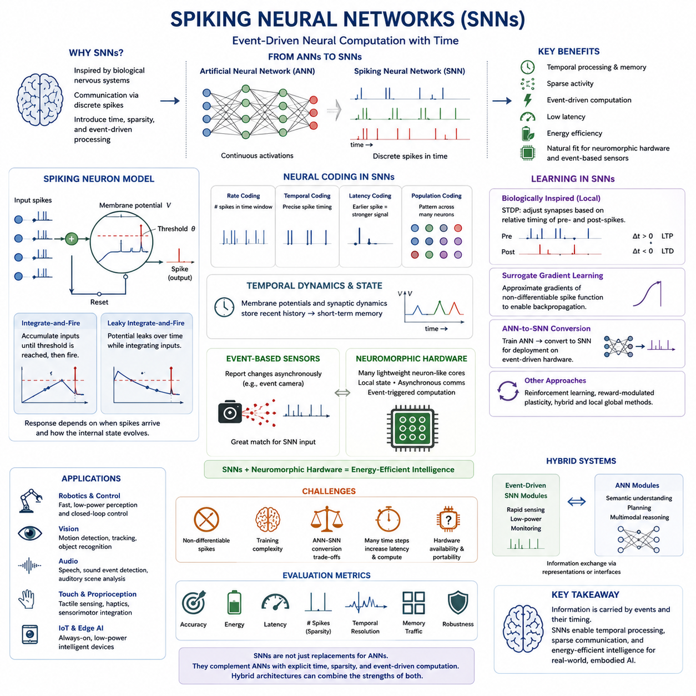{width="7.268055555555556in" height="7.268055555555556in"}

Spiking neural networks extend artificial neural computation by representing communication through discrete events called spikes rather than continuously valued activations alone. They are motivated by biological nervous systems, where neurons communicate through electrical impulses distributed across time. By making timing an explicit part of computation, SNNs introduce temporal dynamics, sparse activity, and event-driven processing into artificial intelligence.

In a conventional artificial neural network, a neuron generally receives numerical inputs, calculates a weighted sum, applies an activation function, and produces a continuous output. A spiking neuron instead maintains an internal state, commonly represented by a membrane potential. Incoming spikes modify this state over time, and when the potential reaches a threshold, the neuron generates an output spike and subsequently resets or modifies its internal state.

This temporal behavior makes a spiking neuron fundamentally different from a conventional static activation unit. Its response depends not only on the magnitude of incoming signals but also on when previous events occurred and how its internal state evolved. Consequently, time becomes part of the representation itself. Two spike sequences containing similar numbers of events can produce different responses if their temporal structures are different.

The integrate-and-fire model provides one of the simplest abstractions of spiking behavior. Incoming signals are accumulated until the membrane potential exceeds a firing threshold, at which point a spike is emitted. The leaky integrate-and-fire model extends this idea by allowing accumulated potential to decay over time. These simplified models omit much biological complexity but retain temporal integration, threshold behavior, and event generation.

Information in an SNN can be represented through several forms of neural coding. Rate coding uses the number or frequency of spikes within a time interval, while temporal coding uses precise spike timing. Other approaches can represent information through relative timing, latency, populations of neurons, or structured spike patterns. The appropriate coding strategy depends on the task, sensory source, hardware architecture, and desired balance between accuracy and computational efficiency.

Sparse activity is an important characteristic of many spiking systems. A neuron does not necessarily produce an output at every computational step; it can remain inactive until sufficient evidence accumulates. This differs from conventional dense networks in which large numbers of units may perform numerical operations for every input. When supported by appropriate hardware, sparse event-driven activity can reduce unnecessary computation and data movement.

This property makes SNNs particularly relevant to neuromorphic computing. Neuromorphic processors are designed to support large numbers of lightweight neuron-like units, local state, asynchronous communication, and event-triggered computation. Rather than repeatedly updating an entire network at fixed intervals, hardware resources can respond primarily when spikes occur. The combination of SNN algorithms and neuromorphic hardware therefore offers a potential path toward energy-efficient intelligent computation.

Event-based sensors provide a natural input source for this computational model. An event camera, for example, reports changes in local brightness rather than transmitting complete image frames at fixed rates. Its asynchronous output already resembles a stream of neural events. SNNs can process these events while preserving their temporal structure, avoiding the need to immediately convert all sensory information into conventional frame-based representations.

Such properties are attractive for robotics and autonomous systems that must react rapidly to environmental changes. Motion, collision risks, tactile contacts, acoustic events, and other dynamic signals frequently contain important temporal information. Event-driven neural processing can respond to changes as they occur instead of waiting for a complete processing frame. This creates opportunities for low-latency perception and control under strict energy and computational constraints.

Learning in SNNs presents a distinctive challenge because spikes are discrete events and the threshold operation is not conventionally differentiable. Standard backpropagation therefore cannot always be applied directly in the same manner as in ordinary deep neural networks. Several strategies have been developed, including biologically inspired local learning rules, surrogate-gradient techniques, conversion from trained artificial neural networks, and combinations of these approaches.

Spike-timing-dependent plasticity is one of the best-known biologically inspired learning mechanisms associated with SNNs. STDP changes synaptic strength according to the relative timing between presynaptic and postsynaptic spikes. Connections may be strengthened or weakened depending on which neuron fires first and on the temporal interval between their spikes. This provides a local learning mechanism in which temporal relationships directly influence synaptic adaptation.

However, biological plausibility and task performance are not identical objectives. Purely local learning rules can be attractive from a neuroscience perspective but may be difficult to scale to complex supervised tasks. Surrogate-gradient learning addresses this problem by approximating the derivative of the spike-generation function during training. This enables gradient-based optimization while preserving spiking dynamics during forward computation.

Another practical strategy is ANN-to-SNN conversion. A conventional artificial neural network can first be trained using mature deep-learning techniques and then converted into a spiking representation. This approach can preserve much of the original network\'s performance while enabling deployment on event-driven hardware. Conversion nevertheless introduces tradeoffs involving firing rates, latency, numerical precision, threshold calibration, and the number of simulation time steps required.

SNN performance must therefore be evaluated across dimensions beyond predictive accuracy. Energy consumption, spike count, latency, temporal resolution, memory traffic, hardware utilization, and robustness can all matter. A network producing fewer spikes may consume less energy but require more time to accumulate sufficient evidence. Conversely, aggressive firing can improve response speed while reducing the efficiency advantage expected from sparse computation.

The temporal nature of SNNs also provides an intrinsic form of state and short-term memory. Membrane potentials and synaptic dynamics can preserve information about recent events, allowing current responses to depend on temporal context. This characteristic is useful for sequential sensory streams, motion analysis, auditory processing, gesture recognition, and sensorimotor control. Temporal state emerges within the neural dynamics rather than requiring every historical observation to be stored explicitly.

SNNs nevertheless remain considerably less mature than conventional deep neural networks for many large-scale applications. Training tools, software ecosystems, optimization methods, benchmark standards, and hardware portability are still developing. Large Transformer and convolutional architectures benefit from highly optimized GPU infrastructure, whereas SNN performance depends strongly on whether the underlying hardware can exploit sparse asynchronous events efficiently.

This means that running a spiking model on conventional hardware does not automatically produce large energy savings. If spikes are represented using dense tensors and the complete network is repeatedly simulated at many discrete time steps, computational cost can remain substantial. The strongest efficiency advantages generally require coordination between algorithms, representations, runtime systems, sensors, communication mechanisms, and neuromorphic hardware.

SNNs should therefore not be understood simply as replacements for conventional artificial neural networks. The two computational paradigms possess different strengths. Dense deep networks provide mature optimization and excellent performance across many static and large-scale learning tasks, while SNNs provide explicit temporal dynamics, event-driven operation, sparse communication, and closer compatibility with neuromorphic architectures. Hybrid systems can exploit both approaches.

For example, a robotic architecture could use event-driven spiking modules for rapid sensory processing and low-power monitoring while conventional deep networks perform semantic interpretation, planning, or complex multimodal reasoning. Information can move between these computational domains through learned representations or intermediate interfaces. Such hybrid architectures reflect the broader principle that intelligent systems do not necessarily require one computational mechanism for every function.

From a neuroscience perspective, SNNs also provide a useful experimental bridge between biological neural dynamics and machine intelligence. They allow researchers to investigate how temporal coding, recurrent interaction, local plasticity, sparse activity, and population dynamics contribute to computation. Although simplified spiking neurons remain far from complete biological models, they preserve dimensions of neural processing that conventional activation-based networks usually abstract away.

Within brain-inspired computation, SNNs occupy an important position between artificial neural networks and neuromorphic computing. Conventional neural networks demonstrate the power of distributed learned representations, while SNNs add explicit time, spikes, internal dynamics, and event-driven communication. Neuromorphic hardware can then implement these properties more directly, connecting neural models with architectures designed around sparse and asynchronous computation.

Their importance becomes even greater when AI moves from offline data processing toward continuously operating embodied systems. A physical agent receives sensory streams over time, must detect meaningful changes, maintain internal state, and respond under constraints on power and latency. These requirements resemble the computational conditions under which biological nervous systems operate and provide a natural application space for event-driven neural computation.

Ultimately, spiking neural networks represent an alternative view of neural computation in which information is carried not only by activation magnitude but also by events and their timing. Their potential lies in combining temporal processing, sparse communication, adaptive dynamics, and energy-efficient execution. Whether they become a dominant AI paradigm or a specialized component, SNNs provide an important path toward intelligent systems that process the world continuously rather than as isolated static inputs.

## 05.03 Neuromorphic Computing [w/Code]

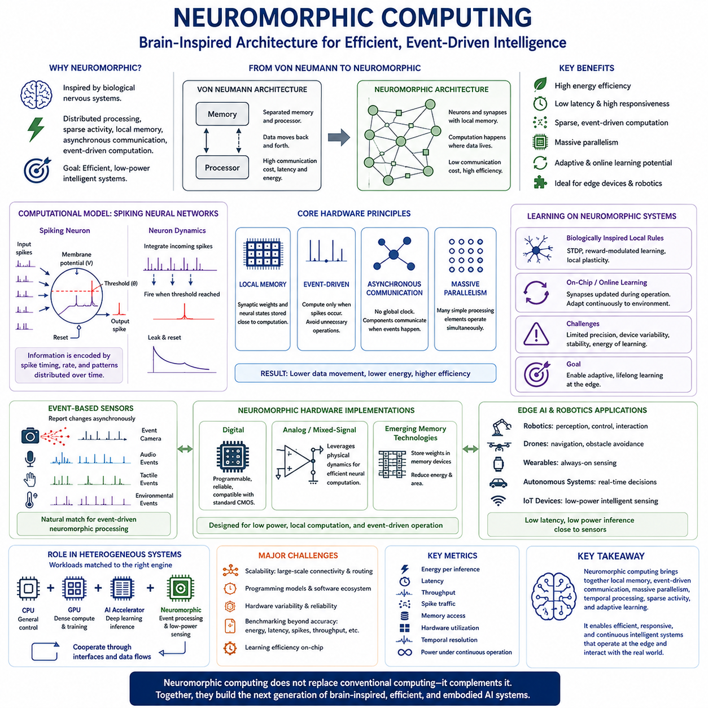{width="7.268055555555556in" height="7.268055555555556in"}

Neuromorphic computing is an approach to computer architecture inspired by the organizational and computational principles of biological nervous systems. Rather than reproducing the brain in complete biological detail, it seeks hardware mechanisms that support distributed processing, local memory, sparse activity, asynchronous communication, and event-driven computation. These properties distinguish neuromorphic systems from conventional processor architectures designed primarily for sequential numerical operations.

Conventional computing systems commonly separate processing units from memory according to the von Neumann architecture. Data must repeatedly move between memory and processors during computation, creating communication overhead, latency, and energy consumption. This limitation becomes increasingly significant for large AI workloads. Neuromorphic computing explores architectures in which computation and memory are placed closer together, reducing unnecessary data movement and enabling more localized information processing.

The biological brain provides an important conceptual contrast. Neural computation is massively distributed across interconnected neurons and synapses, and information processing occurs largely where neural state and connectivity are physically represented. There is no direct equivalent of continuously transferring every intermediate value between a centralized processor and a separate memory subsystem. Neuromorphic architectures attempt to capture aspects of this distributed organization through neuron-like processing elements and locally stored synaptic states.

Spiking neural networks provide a natural computational model for many neuromorphic systems. Instead of continuously updating dense numerical activations, spiking networks communicate using discrete events distributed over time. Neuromorphic hardware can detect these events and activate computation primarily when spikes occur. This event-driven operation potentially avoids large numbers of unnecessary calculations when input signals or internal neural states remain unchanged.

Asynchronous communication is therefore a central feature of many neuromorphic architectures. Conventional digital systems frequently coordinate computation through global clocks, whereas neuromorphic systems can allow components to communicate when relevant events occur. Individual processing elements may operate according to local state and incoming spikes rather than waiting for synchronized updates across the entire system. This can improve responsiveness while supporting sparse and irregular computational activity.

Local memory is equally important because synaptic parameters and neural states must be accessed frequently during neural computation. If these values reside far from the processing units, repeated transfers can dominate energy consumption. Neuromorphic designs therefore attempt to colocate or tightly integrate memory with computation. This principle is closely related to processing-in-memory and compute-near-memory approaches, although neuromorphic computing additionally emphasizes neural dynamics, connectivity, and event-based communication.

Energy efficiency is one of the strongest motivations for neuromorphic computing. Biological nervous systems perform continuous perception, prediction, adaptation, and motor control under extremely limited power budgets. Neuromorphic systems seek similar computational efficiency by combining sparse activation, localized communication, parallel processing, and event-triggered execution. Energy is consumed primarily when meaningful computation occurs rather than through continuous dense updates of every component.

Massive parallelism is another characteristic inherited from neural organization. Biological neurons operate simultaneously rather than executing instructions through a single sequential processing path. Neuromorphic processors similarly contain many processing elements capable of updating local neural states in parallel. This architecture is particularly suitable for workloads involving large networks of relatively simple interacting units, where computation emerges from collective dynamics rather than long sequences of complex instructions.

Neuromorphic hardware can be implemented using several technological approaches. Digital implementations provide programmability, reliability, and compatibility with established semiconductor design methods. Analog and mixed-signal architectures can exploit physical electrical dynamics to perform neural operations efficiently. Emerging memory technologies may also represent synaptic weights directly within memory devices, potentially reducing both storage requirements and the energy required for multiply-and-accumulate operations.

Event-based sensors complement neuromorphic processors particularly well. Conventional sensors often generate complete data frames at fixed intervals regardless of whether meaningful changes have occurred. Event cameras instead transmit local brightness changes asynchronously, while other event-driven sensors can encode auditory, tactile, or environmental changes in similar ways. Connecting such sensors directly to neuromorphic processors can create a continuous sensing pipeline without repeatedly constructing dense intermediate representations.

This sensor-to-computation relationship is especially relevant for edge AI. Robots, drones, wearable systems, autonomous machines, and Internet of Things devices frequently operate under strict limitations on battery capacity, thermal dissipation, computational resources, and communication bandwidth. Sending all sensor data to cloud infrastructure introduces latency and connectivity dependence. Neuromorphic processors can potentially perform low-power local inference and event detection close to where sensory information originates.

Robotics provides a particularly natural application because robots interact continuously with changing physical environments. A robot must detect motion, obstacles, contacts, sounds, and unexpected events while maintaining internal state and responding within limited time. Neuromorphic perception can process dynamic sensory streams with low latency, while spiking networks can represent temporal information and control signals. These capabilities can complement conventional processors responsible for high-level planning and semantic reasoning.

Neuromorphic systems can therefore form part of heterogeneous computing architectures rather than replacing CPUs and GPUs entirely. A GPU may remain preferable for training large foundation models or performing dense matrix operations, while a neuromorphic processor handles continuous event monitoring, temporal sensing, or low-power reflex-like control. CPUs, GPUs, neural accelerators, and neuromorphic processors can cooperate according to the computational characteristics of individual workloads.

Learning directly on neuromorphic hardware represents another important research direction. Conventional AI often trains models on powerful external computing infrastructure and deploys fixed parameters to edge devices. Brain-inspired systems instead motivate online adaptation in which learning occurs continuously during operation. Local plasticity rules, spike-timing-dependent plasticity, reward-modulated learning, and other update mechanisms can potentially modify synaptic states without requiring global gradient computation across the complete network.

However, on-chip learning introduces difficult engineering requirements. Hardware must store changing synaptic states, support learning operations, preserve numerical stability, and avoid excessive energy consumption. Learning rules must also remain effective under limited precision and hardware variability. These challenges illustrate that biological inspiration alone is insufficient; useful neuromorphic systems require careful coordination among algorithms, device technologies, circuit design, architecture, software, and application requirements.

Scalability is another major challenge. Biological brains contain enormous numbers of neurons and vastly larger numbers of synaptic connections, creating highly complex communication patterns. Artificial neuromorphic hardware cannot reproduce this connectivity without constraints. Routing spikes efficiently among processing cores therefore becomes a critical architectural problem. Communication networks must support high fan-out, sparse traffic, flexible connectivity, and low latency while avoiding excessive hardware overhead.

Software ecosystems also influence practical adoption. Conventional AI benefits from mature frameworks, optimized GPU libraries, standardized training pipelines, and extensive developer communities. Neuromorphic computing currently spans diverse hardware architectures and programming models, making portability more difficult. Effective abstractions are required so that developers can describe neural dynamics, connectivity, learning rules, and event streams without redesigning applications for every hardware platform.

Benchmarking neuromorphic systems requires metrics beyond conventional model accuracy. Energy per inference, latency, throughput, spike traffic, memory access, hardware utilization, temporal resolution, and power under continuous operation can all be important. Comparisons must also distinguish between simulations of neuromorphic algorithms on conventional processors and execution on dedicated hardware. An event-driven algorithm does not automatically become energy efficient if implemented through dense operations on unsuitable computing infrastructure.

The relationship between neuromorphic computing and conventional deep learning is therefore complementary. Deep neural networks have achieved extraordinary capabilities through dense numerical computation, large datasets, gradient optimization, and accelerator hardware. Neuromorphic computing investigates a different design space centered on temporal dynamics, sparse events, local state, distributed processing, and low-power operation. Future intelligent systems may combine these paradigms rather than choosing exclusively between them.

This combination becomes particularly important for embodied AI, where computational requirements span multiple timescales. Fast sensory reactions may require millisecond-level event processing, while semantic reasoning and planning can operate at slower rates. Neuromorphic components can provide efficient continuous perception and reactive control, while conventional neural networks or foundation models provide higher-level understanding. Such hierarchical integration resembles the broader brain-inspired principle of specialized subsystems cooperating within a unified agent.

Neuromorphic computing also challenges the assumption that progress in AI must primarily come from increasing model size and computational throughput. Biological intelligence demonstrates that architecture, communication structure, temporal dynamics, sparsity, and adaptation can be as important as raw arithmetic capacity. Neuromorphic research therefore explores whether intelligent computation can become more efficient by changing how information is represented and moved rather than simply performing more operations per second.

Within brain-inspired AI, neuromorphic computing forms a bridge between computational neuroscience, spiking neural networks, event-based sensing, and physical hardware. Artificial neural networks establish distributed representation, SNNs introduce explicit spikes and temporal dynamics, and neuromorphic architectures provide hardware capable of exploiting these properties. This progression connects algorithmic ideas with practical implementations designed for continuous, sparse, asynchronous computation.

Ultimately, neuromorphic computing represents an effort to redesign computing around principles better suited to continuously operating intelligent systems. Its long-term value may lie not in constructing literal electronic brains, but in combining local memory, event-driven communication, massive parallelism, temporal processing, sparse activity, and adaptive learning. These principles offer a path toward AI hardware that can operate efficiently at the edge while supporting responsive, persistent, and embodied interaction with the physical world.

## 05.04 Energy Efficient AI [w/Code]

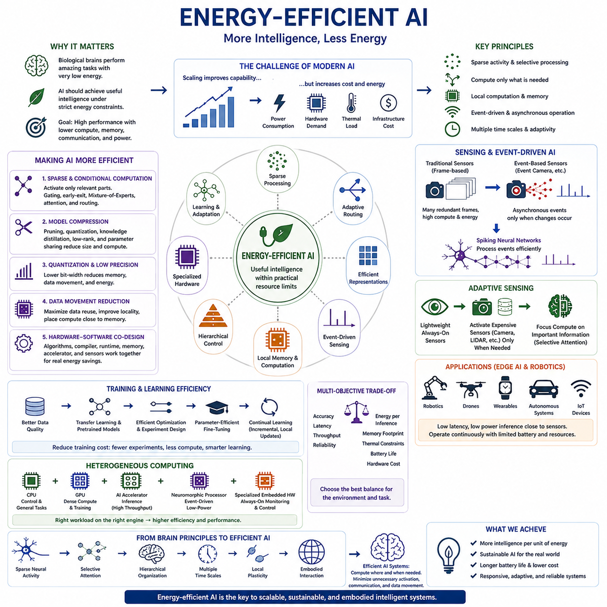{width="7.268055555555556in" height="7.268055555555556in"}

Energy-efficient AI focuses on reducing the computational, memory, communication, and power requirements of intelligent systems while preserving useful performance. The topic is especially important in brain-inspired computation because biological nervous systems achieve continuous perception, learning, prediction, and control under strict energy constraints. AI systems can adopt related principles such as sparse activity, selective processing, local computation, and event-driven operation.

Modern AI models often achieve higher capability by increasing parameter counts, training data, memory capacity, and computational throughput. This scaling strategy can improve performance, but it also increases electricity consumption, hardware requirements, thermal load, and infrastructure cost. Energy-efficient AI therefore asks how useful intelligence can be obtained with fewer operations, less data movement, reduced precision, and architectures that activate resources only when they are needed.

Data movement is frequently as important as arithmetic computation when considering energy consumption. Moving parameters and intermediate activations between processors, caches, and external memory can require substantial energy, particularly in large neural networks. Efficient systems therefore seek to maximize data reuse, improve memory locality, reduce unnecessary transfers, and place computation closer to stored information. These goals connect energy-efficient AI with neuromorphic and memory-centric architectures.

Sparse computation provides one of the strongest strategies for reducing unnecessary processing. Instead of activating every neuron, parameter, or model component for every input, a sparse system uses only the resources relevant to the current task or context. Sparse activations, pruning, conditional execution, and mixture-of-experts architectures follow this principle. Biological neural systems provide inspiration because only subsets of neural populations are strongly active during many cognitive processes.

Conditional computation extends sparsity by dynamically deciding which processing pathways should be used. A system can route simple inputs through lightweight modules while allocating greater computation to difficult or uncertain cases. Attention mechanisms, gating networks, early-exit strategies, and expert routing can all support this behavior. The objective is not simply to make every operation cheaper, but to avoid performing expensive computation when it contributes little additional information.

Model compression reduces the memory and computation required to represent and execute neural networks. Pruning removes unnecessary parameters or structures, quantization represents values with lower numerical precision, and knowledge distillation transfers useful behavior from a larger model to a smaller one. Low-rank approximations and parameter sharing can further reduce redundancy. These techniques are particularly important when deploying AI to embedded, mobile, robotic, or edge computing platforms.

Quantization can provide substantial efficiency gains because lower-precision arithmetic generally requires less memory, data movement, and computational energy than high-precision operations. Training may use relatively high precision for numerical stability, while inference can often operate with reduced precision. However, aggressive quantization may reduce accuracy or robustness, so numerical representation must be selected according to model architecture, hardware support, and application requirements.

Hardware-software co-design is essential because algorithmic efficiency does not automatically translate into lower energy consumption. A sparse model may provide little benefit if the processor executes sparse operations inefficiently, while quantization is useful only when the hardware supports low-precision arithmetic effectively. Energy-efficient AI therefore requires coordinated design across neural architecture, compiler, runtime, memory system, accelerator, sensor pipeline, and deployment environment.

Event-driven computation offers another brain-inspired approach. Instead of repeatedly processing complete inputs at fixed intervals, a system can activate computation primarily when meaningful changes occur. Event cameras and spiking neural networks illustrate this principle by representing information as asynchronous events. When combined with suitable hardware, event-driven processing can reduce redundant computation while providing rapid responses to dynamic sensory information.

Edge AI makes energy efficiency particularly important because local devices operate under limited battery capacity, cooling capability, size, weight, and cost. Robots, drones, wearable devices, autonomous sensors, and embedded systems cannot always rely on large data-center resources. Efficient local inference reduces communication with the cloud, improves responsiveness, preserves operation when connectivity is limited, and can allow intelligent functions to remain continuously active near the physical environment.

Robotics creates additional energy tradeoffs because computational power is only one part of the total energy budget. Motors, actuators, sensors, communication systems, and onboard computers all compete for limited battery resources. An AI architecture that consumes excessive power can shorten operating time even when it improves perception accuracy. Energy-aware robot design therefore considers inference quality together with latency, compute load, sensor usage, control frequency, and total mission endurance.

Adaptive sensing can further improve efficiency by avoiding continuous use of every sensor at maximum resolution or frequency. A system may operate lightweight sensors continuously and activate expensive cameras, LiDAR, or high-performance inference only when uncertainty or environmental conditions require them. This resembles selective attention in biological systems, where processing resources are directed toward information that is currently important rather than distributed uniformly across all possible inputs.

Training efficiency is also important because the energy cost of AI is not limited to deployment. Large-scale model development can require repeated experiments, extensive hyperparameter searches, long training runs, and substantial accelerator utilization. More efficient optimization, transfer learning, parameter-efficient fine-tuning, reusable pretrained representations, improved data quality, and carefully designed experiments can reduce the computational resources needed to achieve a target level of performance.

Energy-efficient learning becomes even more challenging when systems must adapt continuously. Retraining an entire model whenever new data arrives is often impractical for edge devices or autonomous machines. Incremental updates, local adaptation, selective parameter modification, memory replay, and modular learning can reduce the amount of computation required for continual learning. Brain-inspired plasticity suggests that adaptation may be more efficient when only relevant parts of a system are modified.

The relationship between accuracy and energy should therefore be understood as a multi-objective design problem. The most accurate model is not always the most useful model if it requires excessive power, memory, latency, or hardware cost. Practical systems must evaluate accuracy together with energy per inference, throughput, response time, memory footprint, thermal constraints, battery life, and reliability. The appropriate balance depends on the operational environment and consequences of errors.

Energy efficiency also depends on temporal scale. Some computational processes must operate continuously at high frequency, while others can run only when requested. Reflex-like perception and safety monitoring may require fast, lightweight processing, whereas semantic reasoning, planning, or complex generative models can execute less frequently. Hierarchical architectures can exploit these different timescales by assigning each function to a computational mechanism appropriate to its urgency and complexity.

Heterogeneous computing supports this strategy by combining CPUs, GPUs, neural accelerators, neuromorphic processors, and specialized embedded hardware. Each processor type can handle workloads suited to its strengths. Dense matrix computation may remain on GPUs or AI accelerators, while low-power event detection, sensor preprocessing, or always-on monitoring can run on specialized units. Intelligent workload allocation becomes part of the energy-efficient AI architecture itself.

From a brain-inspired perspective, efficiency is closely connected to representation and information flow. Biological systems do not process every possible signal with equal intensity, preserve every observation in full detail, or globally update every connection after every event. They use sparse representations, selective attention, hierarchical organization, local adaptation, and multiple timescales. These principles suggest that efficient intelligence may require better control over what information is processed, stored, transmitted, and ignored.

Energy-efficient AI therefore extends beyond reducing power consumption at the hardware level. It concerns how models represent knowledge, how frequently computation occurs, where data is stored, which modules are activated, how sensors are used, and how learning is performed. These decisions collectively determine whether an intelligent system can operate continuously within practical resource constraints while maintaining sufficient accuracy, responsiveness, and adaptability.

Within the broader structure of brain-inspired computation, energy-efficient AI connects artificial neural networks, spiking neural networks, neuromorphic computing, event-based vision, memory-inspired systems, and embodied intelligence. It provides an engineering principle that links these topics: useful computation should occur where and when it is needed, while unnecessary activation, communication, and data movement should be minimized.

Ultimately, energy-efficient AI seeks a transition from computational systems that gain capability mainly through greater resource consumption toward systems that use computation more intelligently. Sparse processing, adaptive routing, efficient representations, specialized hardware, local memory, event-driven sensing, and hierarchical control can work together to increase intelligence per unit of energy. This objective is essential for scalable AI and especially for autonomous systems that must operate persistently in the physical world.

## 05.05 Event Based Vision [w/Code]

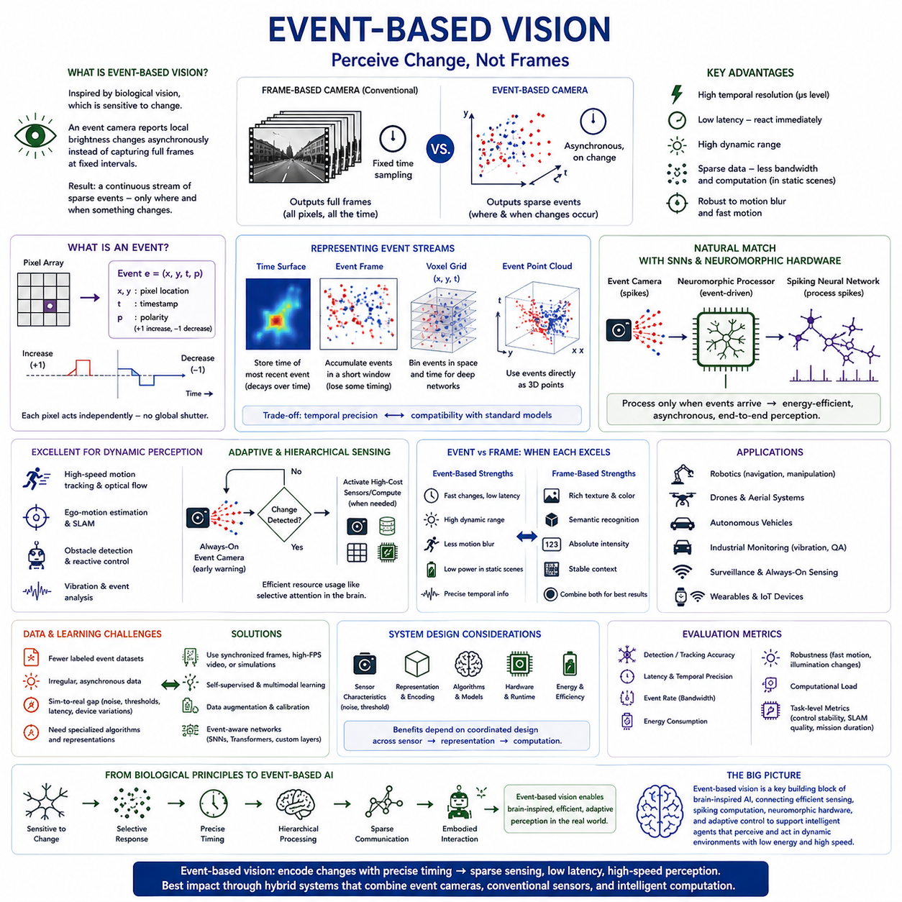{width="7.268055555555556in" height="7.268055555555556in"}

Event-based vision is a sensing and perception approach inspired by the way biological visual systems respond strongly to changes rather than repeatedly recording complete scenes. Instead of capturing full image frames at fixed intervals, an event camera reports local brightness changes asynchronously. Each event indicates that a pixel has detected a sufficient change, producing a continuous stream of sparse temporal information rather than a sequence of conventional images.

This operating principle differs fundamentally from frame-based vision. A conventional camera samples every pixel at the same time and generates complete frames even when most of the scene remains unchanged. Event-based sensors transmit information only where and when meaningful changes occur. As a result, static regions naturally generate little or no data, while moving edges, changing illumination, and rapid motion produce dense streams of events.

An individual event commonly contains the pixel location, the time of occurrence, and the polarity of the brightness change. Positive polarity indicates an increase in local intensity, while negative polarity represents a decrease. Because events are generated independently across pixels, they do not share a global exposure time. This asynchronous structure allows visual information to be represented with extremely fine temporal precision.

High temporal resolution is one of the most important advantages of event-based vision. Fast movements that may appear blurred in conventional images can produce precise event patterns because the sensor does not wait for a complete frame exposure. This property is useful for high-speed robotics, drones, autonomous machines, motion tracking, vibration analysis, and other applications where rapid environmental changes must be detected with minimal delay.

Low latency is closely related to this temporal resolution. A frame-based system typically waits until a complete image is captured, transferred, and processed before reacting. An event-based system can begin processing immediately after relevant local changes occur. For control systems operating near physical limits, such as obstacle avoidance, stabilization, interception, or manipulation, this reduction in sensing delay can significantly improve responsiveness.

Event cameras also provide a high dynamic range compared with many conventional imaging systems. Because each pixel responds to local changes rather than relying entirely on a single global exposure setting, event sensors can operate across scenes containing both bright and dark regions. This characteristic is valuable in outdoor robotics, automotive perception, tunnels, indoor-to-outdoor transitions, and environments with rapidly changing illumination.

Sparse output can reduce communication and computation when the visual environment contains limited change. Instead of transmitting millions of pixel values for every frame, the sensor sends only detected events. The resulting data rate depends on scene activity rather than being fixed by image resolution and frame rate. This can reduce redundant processing, although highly dynamic scenes may still generate large numbers of events.

The event stream does not directly resemble a conventional image, which creates new computational challenges. Many established computer vision algorithms assume dense rectangular arrays sampled at synchronized time points. Event-based algorithms must instead process irregularly timed, asynchronous data. Events can be accumulated into temporary surfaces, voxel grids, event frames, point-like representations, or processed directly as continuous streams.

Time surfaces provide one useful representation by recording information related to the most recent event at each location. Recent events can be assigned stronger values, while older events decay over time. This preserves local temporal structure and can reveal moving contours or motion patterns. Other representations accumulate events within short intervals, trading some temporal precision for compatibility with conventional neural network architectures.

Voxel representations divide space and time into structured bins, allowing event streams to be processed by convolutional or Transformer-based models. These representations provide a bridge between asynchronous sensing and standard deep learning pipelines. However, converting events into dense tensors can reduce some of the computational efficiency that motivated event-based sensing, so representation design involves a tradeoff between compatibility, information preservation, and efficiency.

Spiking neural networks provide another natural computational framework for event-based vision. Both event cameras and SNNs represent information through sparse events distributed over time. Sensor events can therefore be mapped directly or indirectly into spike-based neural processing. This close relationship makes event-based vision an important interface between sensing, spiking computation, and neuromorphic hardware within brain-inspired AI.

Neuromorphic processors can further exploit this compatibility by processing visual events asynchronously and activating computational resources only when events arrive. An event camera connected to a neuromorphic processor can potentially create an end-to-end event-driven perception pipeline. Such architectures seek to minimize unnecessary conversion between asynchronous sparse data and dense synchronous computation.

Motion estimation is a particularly suitable task because event generation is closely connected to changes caused by motion. Optical flow, feature tracking, ego-motion estimation, and object motion analysis can exploit precise event timing to infer dynamic structure. Rather than comparing complete consecutive frames, algorithms can analyze how event patterns propagate through space and time.

Event-based vision is also useful for simultaneous localization and mapping, where rapid camera movement can create severe motion blur in frame-based sensors. Event streams retain temporal information during fast rotations and translations, providing additional cues for estimating motion. In practice, event cameras are often combined with conventional cameras, inertial measurement units, or depth sensors to provide complementary information.

This multimodal combination is important because event cameras do not provide the same absolute intensity information as ordinary cameras. A static object in a perfectly static scene may produce few events even though its appearance is semantically important. Conventional images provide textures, colors, and stable visual context, while event streams provide precise temporal changes. Hybrid perception systems can therefore exploit the strengths of both sensing paradigms.

Robotics is a major application area because physical agents continuously interact with changing environments. Mobile robots can use event-based sensing for obstacle detection, rapid motion estimation, localization, and reactive control. Manipulators can detect contact-related visual changes or track fast-moving objects. Small drones can benefit from low-latency perception when stabilization and collision avoidance must occur under strict computational and energy constraints.

Autonomous vehicles and high-speed platforms can similarly benefit from event sensing in situations involving rapid relative motion or challenging illumination. However, event cameras should not be assumed to replace conventional automotive cameras entirely. Recognition of road signs, semantic scene interpretation, texture-based classification, and other tasks may still benefit strongly from frame-based imagery. Sensor fusion is therefore often more practical than complete substitution.

Event-based vision can also support always-on sensing because the sensor naturally produces little information when nothing changes. This property is attractive for edge devices, surveillance systems, wearable platforms, and low-power monitoring. A lightweight event-processing module can remain active continuously and trigger more computationally expensive perception only when meaningful activity is detected.

Adaptive sensing architectures can extend this idea further. An event camera may serve as an early-warning channel that identifies motion, novelty, or potentially important changes. The system can then activate high-resolution frame cameras, LiDAR, depth sensing, or large neural models only when additional information is required. This creates a hierarchical sensing strategy that resembles selective processing in biological systems.

Training event-based AI models presents practical difficulties because large annotated event datasets are less common than conventional image datasets. Labels may need to be transferred from synchronized frame cameras, simulated from high-frame-rate video, or collected using specialized recording setups. Self-supervised learning and multimodal supervision are therefore especially valuable because they can exploit temporal consistency and aligned sensory streams without requiring exhaustive manual annotation.

Simulation is frequently used to generate synthetic event data from conventional image sequences or virtual environments. This can provide scalable training data, but simulated events may differ from real sensor behavior because of noise, thresholds, latency, and device-specific characteristics. Effective systems must therefore address the gap between simulated and real event streams through calibration, augmentation, adaptation, or mixed-domain training.

Noise is another practical consideration. Real event sensors can generate background activity, isolated events, hot pixels, or events caused by illumination flicker rather than meaningful object motion. Filtering algorithms must distinguish informative temporal structure from sensor noise without removing weak but important signals. The appropriate strategy depends on scene dynamics, sensor characteristics, and downstream perception tasks.

Efficiency should be evaluated carefully because event-based sensing does not automatically guarantee low total computational cost. In highly dynamic scenes, event rates can become large, and inefficient software may process events one by one with substantial overhead. If event streams are repeatedly converted into dense tensors, much of the sparsity advantage can disappear. Benefits depend on coordinated sensor, representation, algorithm, runtime, and hardware design.

Evaluation therefore extends beyond conventional image accuracy. Event-based systems may be compared using detection or tracking performance together with latency, temporal precision, event rate, energy consumption, robustness to fast motion, dynamic range, and computational load. For embodied applications, system-level metrics such as control stability, collision avoidance performance, or mission duration may be more meaningful than perception accuracy alone.

From a brain-inspired perspective, event-based vision demonstrates the value of representing change rather than repeatedly encoding the complete sensory world. Biological perception is strongly sensitive to temporal variation, contrast, motion, and novelty. Although event cameras are not literal replicas of the retina, they capture the broader computational principle that sensing can be selective, asynchronous, and driven by information change.

Within brain-inspired computation, event-based vision connects energy-efficient AI, spiking neural networks, neuromorphic computing, adaptive sensing, and embodied intelligence. It moves efficiency upstream from neural computation into the sensing process itself. Instead of first generating large redundant data streams and then attempting to compress them, the sensor can reduce redundancy at the moment information is acquired.

Ultimately, event-based vision provides an alternative to the fixed-frame assumption that has dominated machine perception. By encoding local changes with precise timing, it enables sparse sensing, low-latency processing, high-speed perception, and closer integration with event-driven computation. Its greatest potential lies in hybrid intelligent systems that combine event sensing with conventional vision, neuromorphic processing, and adaptive control to support efficient continuous interaction with dynamic environments.

## 05.06 Attention and Global Workspace [w/Code]

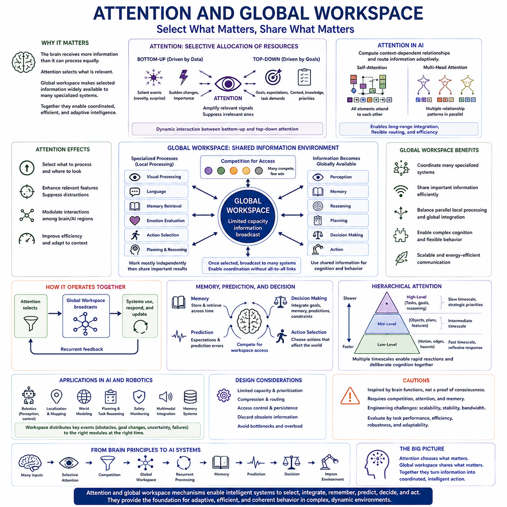{width="7.268055555555556in" height="7.268055555555556in"}

Attention and global workspace mechanisms provide a brain-inspired framework for understanding how an intelligent system can select relevant information and coordinate many specialized processes. Biological organisms continuously receive more sensory and internal information than they can process equally. Attention prioritizes selected signals, while a global workspace provides a mechanism through which important information can become broadly available to perception, memory, reasoning, planning, and action.

Attention can be understood as selective allocation of limited computational resources. Instead of processing every stimulus with identical priority, a cognitive system emphasizes information according to goals, novelty, uncertainty, salience, and current context. This selectivity improves efficiency because irrelevant information can be suppressed or processed at lower resolution while important signals receive deeper analysis. Attention therefore acts as a mechanism for controlling information flow.

Biological attention operates through several interacting mechanisms rather than a single centralized process. Bottom-up attention can be driven by unexpected or highly salient sensory events, while top-down attention reflects goals, expectations, and task requirements. These mechanisms continuously interact. A sudden movement may capture attention automatically, but a current objective can redirect processing toward another source of information that is more relevant to ongoing behavior.

Selective attention also influences representation. The same sensory input can produce different internal responses depending on what the system currently considers important. Attention can amplify relevant features, suppress competing information, and modify interactions among processing regions. This suggests that perception is not simply passive recording of the environment. Instead, sensory interpretation is dynamically shaped by behavioral objectives, prior knowledge, and internal state.

Artificial attention mechanisms adopt a related computational principle, although they should not be interpreted as direct biological replicas. In neural networks, attention calculates context-dependent relationships among representations and determines which information should contribute most strongly to subsequent computation. This mechanism allows models to dynamically route information instead of relying entirely on fixed connections or local processing pathways.

Transformer architectures demonstrate the power of this approach. Self-attention allows each token or representation to evaluate relationships with other elements in a sequence or structured input. Relevant information can therefore be integrated across long distances without requiring strictly sequential propagation. Multi-head attention extends this mechanism by allowing several relationship patterns to be represented simultaneously, supporting different forms of contextual interaction within the same layer.

However, computational attention and biological attention differ substantially. Transformer attention commonly performs large-scale numerical comparisons across representations, while biological attention emerges from recurrent neural circuits, competition, neuromodulation, sensory dynamics, and behavioral state. The useful connection lies at the functional level: both demonstrate that intelligent processing benefits from selectively emphasizing information according to context rather than treating every signal equally.

Attention also provides an important mechanism for computational efficiency. If an intelligent system can identify which sensory regions, memories, objects, or internal processes are currently relevant, it can allocate expensive computation selectively. This principle supports sparse processing, adaptive sensing, conditional computation, and hierarchical control. In embodied systems, attention can determine not only what information to process but also where sensors or actuators should be directed.

Global workspace theory addresses a complementary problem: how specialized processes can coordinate their information. Cognitive systems contain many functions that can operate partly independently, including visual processing, language, memory retrieval, emotional evaluation, action selection, and planning. A global workspace provides a conceptual shared information environment in which selected content becomes accessible to multiple specialized systems rather than remaining confined to one local process.

The workspace can be viewed as a limited-capacity communication mechanism. Many processes compete to make their information globally available, but only a subset becomes dominant at any moment. Once selected, this information can be broadcast to other components that use it for reasoning, memory formation, decision making, or action. This creates a balance between extensive parallel local processing and selective global integration.

Such an architecture avoids requiring every subsystem to communicate continuously with every other subsystem. Direct all-to-all communication would be expensive, difficult to scale, and potentially unstable. Instead, specialized modules can perform local computation and contribute important results to a shared workspace. Other modules can then access the globally available information when it becomes relevant to their own processing.

Competition is therefore closely connected to global workspace operation. Multiple representations may simultaneously seek access to limited global processing capacity. Their relative importance can depend on salience, confidence, novelty, goals, expected reward, or urgency. Attention can influence this competition by increasing the priority of selected information. In this sense, attention and global workspace mechanisms can operate together as selection and integration processes.

Recurrent processing is also important because global availability is not necessarily a single feed-forward event. Information can circulate among perception, memory, prediction, and action systems, producing repeated refinement. A sensory observation may trigger memory retrieval, retrieved knowledge may alter interpretation, and the updated interpretation may change planned action. This recurrent interaction enables context-dependent cognition that evolves over time.

Memory is particularly important to workspace-based architectures. A workspace limited to current sensory input would provide little continuity across time. Working memory can preserve currently relevant information, episodic memory can retrieve related experiences, and semantic memory can supply accumulated knowledge. Attention determines which memories should be retrieved or maintained, while the workspace enables retrieved information to influence multiple cognitive processes.

Prediction can similarly participate in the workspace. Internal models can generate expectations about likely future states, and prediction errors can compete for attention when observations differ from expectations. Important discrepancies may then be broadcast across the system, causing memory retrieval, replanning, or changes in action. This connects global workspace mechanisms with predictive processing and world-model-based intelligence.

Decision making provides another natural application. Multiple candidate actions may be generated by specialized systems using different information sources. A shared workspace can integrate current perception, goals, memories, predicted outcomes, and constraints before action selection occurs. Rather than relying on one monolithic decision algorithm, intelligent behavior can emerge from coordinated interaction among specialized components sharing selected information.

In robotics, this principle can support architectures containing perception, localization, mapping, world modeling, planning, control, safety monitoring, and task reasoning. Each subsystem can operate at its own frequency and level of abstraction. A workspace can distribute important events such as newly detected obstacles, goal changes, localization uncertainty, task failures, or predicted hazards to the modules that need them without requiring constant full-bandwidth communication.

Attention can make this architecture more efficient by determining which information deserves workspace access. A mobile robot may continuously receive cameras, LiDAR, audio, proprioception, and internal diagnostic data, but not every observation requires high-level reasoning. Routine information can remain within local processing loops, while unusual, uncertain, safety-critical, or goal-relevant events are promoted to broader processing.

Hierarchical attention can further separate computational timescales. Fast low-level attention may detect motion or hazards, intermediate mechanisms may select objects and navigation features, and slower high-level attention may prioritize tasks, goals, memories, or reasoning processes. This organization allows rapid reactions to coexist with deliberate cognition without requiring every level of the system to operate at maximum computational intensity continuously.

Global workspace ideas are also relevant to multimodal AI. Vision, language, audio, tactile information, structured knowledge, and internal state can initially be processed through specialized encoders. Selected representations can then enter a shared latent or token-based workspace where cross-modal relationships are established. Such architectures provide a computational route for integrating information that originates from fundamentally different sensory and representational domains.

Foundation models already demonstrate aspects of shared representation and attention-based integration, but a persistent global workspace suggests additional capabilities. An autonomous agent may require information that remains available across long interactions, changes dynamically with goals, incorporates external memory, and coordinates multiple models or tools. The workspace therefore becomes less like a single neural layer and more like an architectural mechanism for persistent cognitive coordination.

The concept should nevertheless be used carefully. Global workspace theory originated as a framework for explaining aspects of human cognition and consciousness, and implementing a shared communication architecture in AI does not demonstrate consciousness. Brain-inspired engineering can borrow functional principles such as competition, broadcasting, limited capacity, recurrent integration, and specialized processing without making unsupported claims about subjective experience.

Scalability also presents an engineering challenge. A global workspace can become a computational bottleneck if every subsystem attempts to publish excessive information or if all modules continuously consume every broadcast. Effective implementations therefore require prioritization, compression, routing, access control, temporal persistence, and mechanisms for discarding obsolete information. Attention becomes essential for controlling this communication burden.

Within brain-inspired AI, attention and global workspace mechanisms connect several major themes. Attention provides selective computation, memory supplies information across time, prediction identifies relevant future possibilities, and the workspace coordinates specialized processes. Embodied interaction then grounds these mechanisms in perception and action. Together they provide an architectural perspective in which intelligence emerges from controlled information sharing rather than from isolated modules alone.

Ultimately, attention and global workspace mechanisms suggest that intelligent computation requires both specialization and integration. Specialized processes allow efficient local expertise, attention determines what deserves computational priority, and a shared workspace enables selected information to influence the wider system. Their combination offers a path toward AI architectures that allocate resources dynamically, integrate multiple forms of knowledge, maintain context, and coordinate coherent behavior across perception, memory, reasoning, prediction, and action.

## 05.07 Memory Inspired Computation [w/Code]

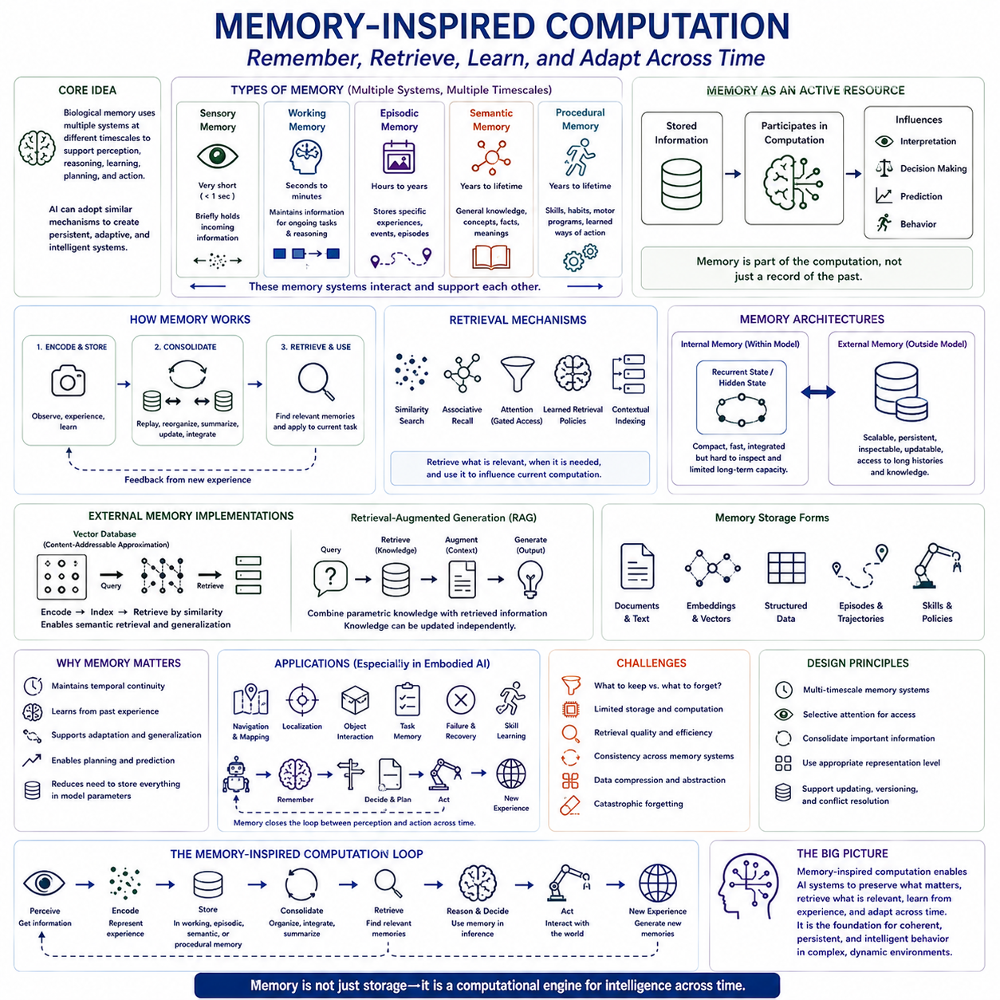{width="7.268055555555556in" height="7.268055555555556in"}

Memory-inspired computation studies how principles from biological memory can inform the design of artificial systems that preserve, retrieve, update, and reuse information across time. Biological intelligence does not depend on a single undifferentiated memory store. Instead, multiple memory systems operate at different timescales and support perception, reasoning, learning, planning, and action. AI can adopt a similar separation of functions to create more persistent and adaptive systems.

A central idea is that memory should be treated as an active computational resource rather than a passive archive. Useful memories influence current interpretation, decision making, prediction, and behavior. In artificial systems, stored information can therefore participate directly in inference by supplying relevant context, previously learned patterns, task history, or prior experience. Memory becomes part of the computation itself rather than merely a record of past events.

Biological memory is commonly understood as involving several interacting forms. Sensory memory briefly preserves incoming information, working memory maintains content needed for ongoing cognition, episodic memory stores experiences, semantic memory represents generalized knowledge, and procedural memory supports learned skills. These distinctions suggest that AI systems may benefit from multiple specialized memory mechanisms rather than one universal storage component.

Working memory provides temporary access to information that must remain available during an ongoing task. In AI, this role can be implemented through recurrent state, context windows, latent state, scratchpads, or temporary external memory. Working memory helps a system maintain goals, intermediate results, recent observations, and task constraints while performing multi-step reasoning or control. Its limited capacity also creates the need for selective retention and attention.

Episodic memory represents specific experiences associated with particular situations, events, or interactions. Artificial episodic memory can preserve previous trajectories, conversations, decisions, failures, successful actions, or environmental encounters. When a similar situation appears again, the system can retrieve relevant episodes and use them as examples. This supports adaptation from experience without requiring every useful event to be permanently encoded into model parameters.

Semantic memory represents more generalized knowledge that is not tied to one specific event. In AI systems, learned model parameters, structured knowledge bases, vector representations, databases, and symbolic knowledge can all contribute to semantic memory. Episodic experiences may gradually support the formation of generalized semantic knowledge, while semantic knowledge can help interpret new episodes. The interaction between these memory forms is therefore computationally important.

Procedural memory concerns learned ways of performing actions or skills. In artificial systems, procedural knowledge may be represented through policies, controllers, motor primitives, learned action sequences, or optimized network parameters. Unlike explicit factual memory, procedural knowledge is expressed through competent behavior. Robotics particularly depends on this distinction because knowing facts about an action is different from executing the action reliably in the physical world.

Memory consolidation provides a useful inspiration for transferring information between temporary and persistent representations. Biological systems do not necessarily preserve every experience in permanent form immediately. Important experiences can be replayed, reorganized, and integrated with existing knowledge. AI systems can similarly use replay buffers, offline learning, summarization, parameter updates, or database restructuring to transform short-term observations into longer-lasting knowledge.

Replay is especially important for learning systems that operate continuously. Previous experiences can be revisited during later training so that new learning does not completely overwrite older capabilities. This idea supports continual learning and can reduce catastrophic forgetting. Replay may involve exact stored examples, compressed representations, generated samples, or selected high-value experiences, depending on memory capacity and computational constraints.

Retrieval is as important as storage because a large memory is useful only when relevant information can be accessed efficiently. Memory-inspired AI therefore requires mechanisms for deciding what to retrieve, when to retrieve it, and how retrieved content should influence current computation. Similarity search, associative addressing, attention, learned retrieval policies, and contextual indexing provide different ways of connecting present states with stored information.

Associative memory retrieves information from partial or related cues rather than requiring an exact address. This principle is strongly connected to biological memory, where a fragment of an experience can activate a broader pattern. Artificial associative memory can support pattern completion, robust recall, contextual retrieval, and recognition under incomplete observations. Neural associative memory, vector similarity, and content-addressable memory all implement aspects of this idea.

External memory extends the capacity of a neural model beyond what can be represented in its immediate activations or fixed parameters. A neural system can write information to an external store and retrieve it later when needed. This separation allows computational models to preserve long histories without forcing all details into network weights. External memory can therefore improve persistence, interpretability, updateability, and access to task-specific knowledge.

Vector databases provide one practical implementation of external memory for modern AI. Information is encoded into vector representations, indexed, and retrieved according to similarity with a query. This enables semantic retrieval even when the stored and requested information does not share identical wording. Within memory-inspired computation, vector retrieval can be viewed as an engineering approximation of content-addressable access rather than a direct model of biological memory.

Retrieval-augmented generation extends this principle by combining parametric knowledge with externally retrieved information. A model first identifies relevant stored content and then incorporates that information into generation or reasoning. This reduces the need to encode every fact permanently in model parameters and allows knowledge to be updated independently. However, retrieval quality, indexing, memory organization, and context selection become critical components of system performance.

Recurrent neural computation provides another form of memory by allowing previous internal states to influence future processing. Recurrent neural networks, gated architectures, and state-space models maintain information through evolving hidden states. Such memory is compact and integrated directly into computation, but it can be difficult to inspect or preserve over very long intervals. External memory and recurrent state therefore provide complementary capabilities.

Attention mechanisms can act as memory access controllers. When many stored representations are available, attention determines which items should contribute most strongly to current computation. This creates a connection between memory and selective processing. Rather than retrieving all available information, a system can dynamically emphasize relevant memories according to goals, context, uncertainty, and task state, thereby reducing both computational burden and interference.

For embodied AI, memory must connect perception with action across time. A robot needs to remember previously visited locations, object interactions, task progress, failures, environmental changes, and successful control strategies. Without such memory, every situation would be treated as new. Memory allows an embodied agent to maintain temporal continuity, learn from previous encounters, and adapt its future behavior based on accumulated experience.

Spatial memory is particularly important for autonomous systems. Biological navigation depends on internal representations of locations, relationships, routes, and environmental structure. Artificial systems similarly use maps, latent spatial representations, occupancy models, semantic maps, and learned world models. Memory allows current observations to be integrated with previously explored areas, supporting localization, planning, navigation, and prediction beyond the immediately visible scene.

Memory also supports world modeling because predictions depend on information accumulated across time. A system cannot infer environmental dynamics from a single observation alone. It must preserve previous states, actions, and outcomes to estimate how the world changes. Memory therefore provides temporal context for learning transitions, object persistence, causal relationships, and action consequences, linking memory-inspired computation directly with predictive and embodied intelligence.

A major challenge is deciding what should be remembered and what should be forgotten. Unlimited storage is rarely practical, and preserving irrelevant information can make retrieval slower or introduce interference. Intelligent memory systems therefore need mechanisms for importance estimation, compression, consolidation, decay, deletion, and prioritization. Forgetting can be beneficial when it removes obsolete or low-value information while preserving knowledge that remains useful.

Another challenge is maintaining consistency between multiple memory systems. External databases may contain updated information while model parameters retain older knowledge, episodic memories may conflict with generalized semantic representations, and temporary working memory may contain uncertain observations. Effective architectures require mechanisms for confidence estimation, conflict resolution, versioning, provenance, and synchronization across memory components.

Memory efficiency also matters for edge and robotic systems with limited computation and storage. Not every sensory observation can be retained at full resolution. Systems may need to compress experiences, store selected keyframes, preserve learned features instead of raw data, or summarize sequences into structured representations. Efficient memory therefore involves both selecting important information and choosing an appropriate level of representation.

Within brain-inspired computation, memory-inspired architectures connect learning, attention, prediction, decision making, and embodiment. Memory provides temporal continuity, attention controls access, learning updates stored knowledge, prediction uses past information to anticipate future states, and action generates new experiences that return to memory. These mechanisms form a recurrent loop in which intelligent behavior continuously transforms both internal state and stored experience.

Ultimately, memory-inspired computation suggests that intelligent systems should not depend only on fixed parameters or immediate input. Persistent intelligence requires mechanisms that preserve useful experience, retrieve relevant knowledge, distinguish multiple timescales, consolidate important information, and selectively forget what is no longer valuable. Integrating working, episodic, semantic, procedural, external, and associative memory offers a path toward AI systems that remain coherent, adaptive, and capable of learning across extended interaction.

## 05.08 Embodied and Sensorimotor AI [w/Code]

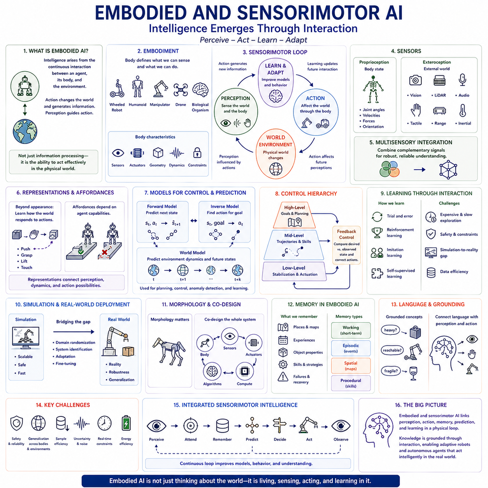{width="7.268055555555556in" height="7.268055555555556in"}

Embodied and sensorimotor AI studies intelligence as a process that emerges through continuous interaction between an agent, its body, and the physical environment. Rather than treating cognition as isolated information processing, this perspective emphasizes that perception, action, learning, and reasoning are tightly coupled. An intelligent agent understands the world partly by sensing the consequences of its own actions and adapting its behavior through repeated interaction.

Embodiment means that intelligence operates through a physical or functionally situated agent with particular sensors, actuators, geometry, dynamics, and operational constraints. The body determines what information can be perceived and what actions can be performed. A wheeled robot, humanoid, manipulator, drone, and biological organism therefore experience different action possibilities even when they occupy the same environment.

Sensorimotor intelligence focuses specifically on the relationship between sensory input and motor action. Perception provides information about the environment and the agent\'s internal state, while actions change both the environment and future sensory observations. Intelligence develops within this closed loop rather than through perception followed by action as completely independent stages. Every movement can generate new information that improves subsequent decisions.

This perception-action loop creates an important distinction between passive observation and active perception. A passive system receives whatever information is presented, whereas an embodied agent can deliberately move to acquire better information. A robot may rotate a camera, approach an object, change viewpoint, touch a surface, or manipulate an item to reduce uncertainty. Action therefore becomes a mechanism for both changing and understanding the world.

Proprioception provides information about the agent\'s own body, including joint positions, velocities, forces, orientation, and motion. Exteroceptive sensors such as cameras, LiDAR, microphones, tactile sensors, and range sensors provide information about the external environment. Effective sensorimotor intelligence requires these signals to be integrated so that external observations can be interpreted relative to the agent\'s own configuration and movement.

Multisensory integration is particularly important because no single sensor provides complete or perfectly reliable information. Vision may identify objects and geometry, tactile sensing can reveal contact properties, proprioception describes body configuration, and inertial sensing provides motion information. Combining these modalities allows an embodied system to form representations that are more robust than those produced from isolated sensory streams.

Sensorimotor representations can encode relationships between observations, actions, and their consequences. Instead of representing an object only through visual appearance, an embodied agent can learn how the object responds when pushed, grasped, lifted, or contacted. Such representations connect perception with affordances, dynamics, and action possibilities. Knowledge becomes grounded in interaction rather than existing only as abstract descriptive information.

Affordances describe opportunities for action that arise from relationships among objects, environments, tasks, and an agent\'s capabilities. A surface may be traversable for one robot but inaccessible to another, while an object may be graspable only for a manipulator with suitable geometry and force capability. Affordance learning therefore connects environmental perception with embodiment-specific possibilities for action.

Motor control converts desired behavior into physical actions while compensating for dynamics, disturbances, uncertainty, and sensor noise. Low-level controllers may regulate torque, velocity, position, or balance, while higher levels determine trajectories and task objectives. Sensorimotor AI connects these levels by allowing sensory feedback to continuously influence motor commands rather than relying entirely on predetermined open-loop action sequences.

Feedback control is fundamental because physical environments rarely behave exactly as predicted. Friction, payload changes, uneven terrain, object deformation, actuator errors, and external disturbances can cause deviations from planned behavior. By continuously comparing observed states with desired states, an embodied system can correct its actions. Learning can further improve this process by adapting control policies from accumulated experience.

Forward models provide a predictive mechanism for estimating the sensory or physical consequences of actions. Given a current state and a candidate action, a forward model predicts what may happen next. Such predictions can support planning, control, anomaly detection, and learning. When predicted outcomes differ from actual observations, prediction errors provide information that can be used to update the internal model.

Inverse models address the complementary problem of determining which action can produce a desired outcome. If an agent wants to reach a particular state, an inverse model estimates an appropriate motor command or action sequence. Forward and inverse models can operate together, allowing candidate actions to be generated and their consequences evaluated before or during execution.

World models extend these ideas beyond immediate sensorimotor transformations by representing objects, spatial relationships, environmental dynamics, and possible future states. For embodied agents, a world model should remain connected to actionable consequences. Its value lies not only in describing the environment but also in predicting how the world will evolve under different actions and how those changes affect goals, safety, and future opportunities.

Learning through interaction provides information that cannot always be obtained from static datasets. A robot can discover object properties by manipulating them, learn terrain characteristics by traversing different surfaces, and improve grasping through repeated attempts. Interaction produces causal evidence because the agent actively changes variables and observes their consequences. This can support richer learning than passive correlation alone.

Reinforcement learning provides one framework for sensorimotor adaptation by allowing agents to improve behavior through rewards and consequences. However, embodied learning is challenging because physical interaction is costly, slow, and potentially unsafe. Robots cannot perform unlimited random exploration. Practical systems therefore combine demonstrations, simulation, offline data, prior models, constrained exploration, and online adaptation.

Imitation learning can accelerate sensorimotor learning by using demonstrations from humans or other agents. Demonstrations provide examples of useful state-action relationships without requiring the learner to discover every behavior independently. However, successful imitation requires more than reproducing observed motion. The agent must adapt demonstrated behavior to differences in embodiment, environment, object position, disturbances, and task context.

Simulation provides a scalable environment for training embodied agents without exposing physical hardware to every exploratory action. Large numbers of trajectories can be generated more quickly and safely than in the real world. Nevertheless, differences in physics, sensing, contacts, materials, and actuator behavior create a simulation-to-reality gap. Domain randomization, system identification, adaptation, and real-world fine-tuning can help reduce this gap.

Morphology influences learning because the physical structure of an agent contributes directly to its behavior. Mechanical compliance, joint arrangement, wheel configuration, limb geometry, mass distribution, and actuator characteristics can simplify or complicate control. This idea is related to morphological computation, in which some functional complexity is handled through physical structure rather than being solved entirely by explicit digital computation.

Embodied intelligence therefore encourages hardware-software co-design. Sensors, actuators, mechanical structure, computing architecture, control algorithms, and learned models should not always be optimized independently. A well-designed body can reduce control complexity, appropriate sensor placement can simplify perception, and computational architecture can be organized around the timing requirements of physical interaction. Intelligence becomes a property of the complete system.

Timing is especially important because sensorimotor loops operate across multiple frequencies. Motor stabilization may require very fast updates, perception may operate at intermediate rates, and task planning or semantic reasoning may proceed more slowly. Hierarchical architectures can separate these timescales while allowing information to move between them. Fast reactive mechanisms can maintain safety while slower cognitive processes evaluate longer-term goals.

Attention also plays a role in embodied systems by determining which sensory information, objects, locations, or actions deserve computational resources. Physical agents cannot process every signal at maximum resolution continuously. Attention can guide cameras, prioritize obstacles, select manipulation targets, or trigger expensive reasoning when uncertainty increases. This connects embodied intelligence with adaptive sensing and energy-efficient computation.

Memory provides continuity across sensorimotor interaction. An agent can remember previously visited locations, failed actions, object properties, successful strategies, and changes in the environment. These memories influence future perception and behavior, allowing the system to avoid treating every encounter as entirely new. Episodic, spatial, procedural, and working memory can therefore cooperate within embodied tasks.

Language and abstract reasoning can also become grounded through sensorimotor experience. Concepts such as inside, above, heavy, reachable, slippery, or fragile have consequences for perception and action in physical environments. Connecting linguistic representations with sensory observations and motor experience can provide richer semantic grounding than learning from text alone. This is an important direction for multimodal and physically situated foundation models.

Embodied AI faces significant safety and data challenges because errors can produce physical consequences. Exploration must respect collision limits, actuator constraints, human safety, equipment protection, and operational rules. Training data can also be expensive because real-world trajectories require hardware time and supervision. Safe learning therefore depends on simulation, constraints, monitoring, uncertainty estimation, and carefully controlled real-world adaptation.

Generalization is another major challenge. A policy that succeeds with one robot, object, environment, or sensor configuration may fail when these conditions change. Robust embodied intelligence must separate transferable knowledge from embodiment-specific details while adapting to new dynamics and morphology. Modular representations, world models, multimodal learning, and few-shot adaptation can help transfer capabilities across tasks and platforms.

Within brain-inspired computation, embodied and sensorimotor AI integrates many preceding ideas into a unified interaction loop. Attention selects relevant information, memory preserves experience, predictive models anticipate consequences, energy-efficient mechanisms allocate resources, and sensorimotor learning connects perception with action. The physical environment then provides continuous feedback that updates internal representations and future behavior.

Ultimately, embodied and sensorimotor AI proposes that intelligence should be understood not only as the ability to process information but also as the ability to act effectively within an environment. Perception guides action, action changes perception, memory preserves consequences, and learning improves future interaction. This continuous cycle provides a foundation for adaptive robots and autonomous agents whose knowledge is grounded through direct engagement with the physical world.

## 05.09 Brain Inspired Robotics [w/Code]

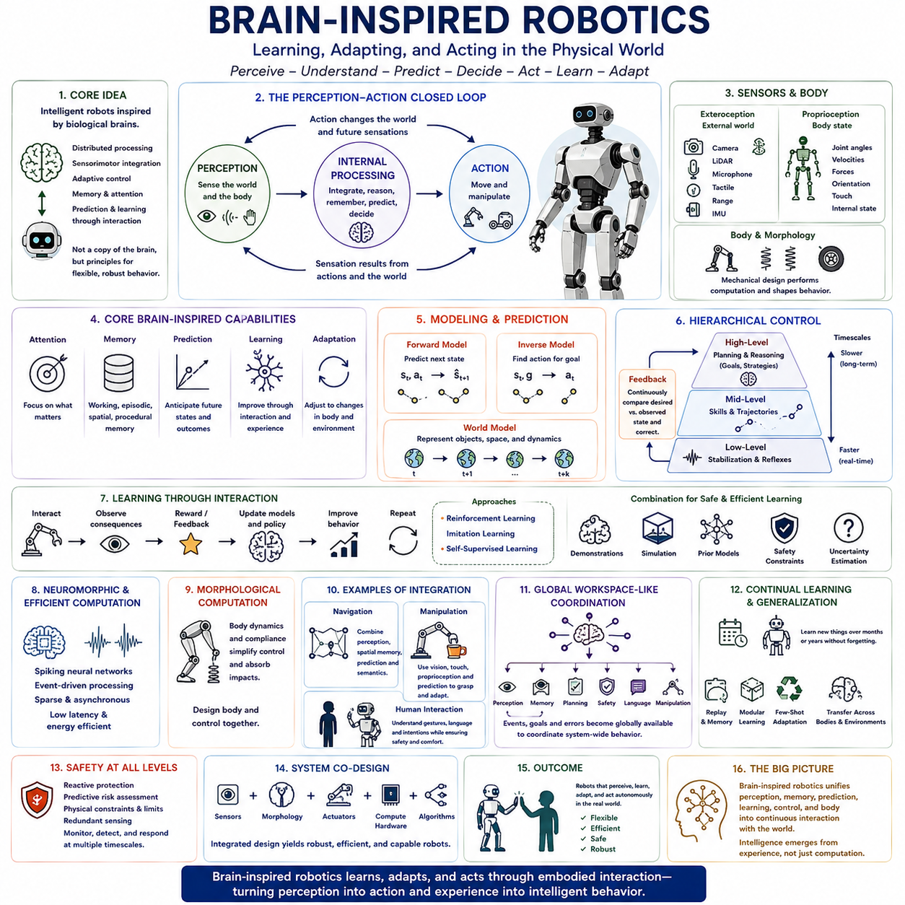{width="7.268055555555556in" height="7.268055555555556in"}

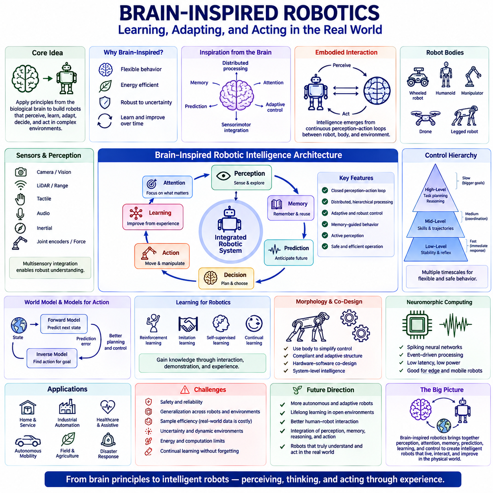{width="7.268055555555556in" height="7.268055555555556in"}

Brain-inspired robotics investigates how principles derived from biological nervous systems can guide the design of robots that perceive, learn, adapt, decide, and act efficiently in complex physical environments. Rather than reproducing the brain literally, the field extracts computational principles such as distributed processing, sensorimotor integration, adaptive control, memory, attention, prediction, and learning through interaction. These principles support robots that behave more flexibly than systems based entirely on fixed rules.

Biological organisms demonstrate that intelligent behavior can emerge from continuous coordination among perception, internal state, memory, prediction, and action. A robot designed according to this perspective does not treat sensing, planning, and control as completely isolated stages. Instead, these functions exchange information continuously within closed perception-action loops, allowing behavior to change immediately when environmental conditions, task requirements, or internal conditions change.

The nervous system provides inspiration for distributed computation because biological intelligence is not controlled by one single processing center. Different neural circuits specialize in sensory processing, motor control, memory, navigation, attention, and decision making while remaining interconnected. Brain-inspired robots can similarly use specialized modules operating at different frequencies and levels of abstraction, coordinated through shared representations and selective communication.

Sensorimotor integration forms a fundamental component of this architecture. Cameras, LiDAR, tactile sensors, microphones, inertial sensors, joint encoders, and force sensors provide complementary information about the robot and its surroundings. Motor actions then alter both the physical environment and future sensory observations. By learning these relationships, robots can develop representations that connect what they perceive with what they can physically do.

Active perception extends this principle by allowing robots to move specifically to improve their understanding of the environment. A robot may change viewpoint, approach an uncertain object, reposition a sensor, touch a surface, or manipulate an object to acquire additional evidence. Perception therefore becomes an interactive process in which actions are selected not only to accomplish external goals but also to reduce uncertainty and obtain useful information.

Attention provides a mechanism for allocating limited computational resources to information that is currently important. A robot operating in a complex environment may receive enormous amounts of sensory data, but not every signal requires equal processing. Attention can prioritize moving obstacles, humans, task-relevant objects, unexpected events, uncertain observations, or safety-critical conditions while allowing routine information to remain within lower-level processing loops.

Memory enables robots to preserve information across time rather than treating every observation as independent. Working memory can maintain current goals and recent observations, episodic memory can preserve previous interactions, spatial memory can represent explored environments, and procedural memory can retain learned skills. These complementary memory mechanisms allow experience from previous actions to influence future perception, planning, and control.

Prediction is another central brain-inspired capability. Biological agents constantly anticipate the consequences of movement and environmental change. Robots can use forward models and world models to predict future states resulting from candidate actions. Comparing predictions with actual observations generates prediction errors that can identify unexpected events, improve internal models, trigger replanning, and support adaptation when environmental dynamics differ from previous experience.

Hierarchical control reflects the organization of biological behavior across multiple temporal and functional levels. Fast control loops can maintain balance, stability, collision avoidance, or actuator regulation, while intermediate levels coordinate trajectories and skills. Slower cognitive processes can perform task planning, reasoning, and long-horizon decision making. This hierarchy prevents every problem from requiring expensive high-level reasoning while preserving rapid responses to immediate physical events.

Reflex-like mechanisms are particularly useful for safety-critical behavior. A robot should not always wait for a complete semantic interpretation before responding to an imminent collision, loss of balance, excessive force, or actuator fault. Lightweight reactive pathways can generate immediate protective responses, while higher-level systems subsequently interpret the event and modify plans. Such architectures combine rapid reaction with deliberate reasoning.

Adaptive control allows behavior to remain effective when physical conditions change. Payload, friction, terrain, actuator performance, battery state, mechanical wear, and external disturbances can alter robot dynamics. Instead of relying entirely on a fixed model, brain-inspired robots can continuously estimate changes and adapt control parameters or policies. This ability is essential for long-duration operation outside carefully controlled laboratory environments.

Learning through interaction allows robots to acquire knowledge from the consequences of their own actions. Manipulating objects can reveal weight, compliance, friction, or stability, while navigation can reveal traversability and terrain properties. Because the robot actively changes the environment and observes resulting outcomes, interaction provides information about causal relationships that may be difficult to infer from passive datasets alone.

Reinforcement learning can support this adaptation by connecting actions with rewards and future consequences, but unrestricted physical exploration is rarely practical. Real robots can damage themselves, surrounding equipment, or people. Brain-inspired robotic learning therefore benefits from combining reinforcement learning with demonstrations, offline experience, simulation, prior models, safety constraints, uncertainty estimation, and carefully controlled online adaptation.

Imitation learning provides another efficient path by allowing robots to learn from human or robot demonstrations. Demonstrations can supply useful action patterns and task structure before autonomous exploration begins. However, a robot must adapt these demonstrations to its own morphology, actuator limits, sensor configuration, and environment. Effective imitation therefore requires understanding relationships between goals and actions rather than simply reproducing recorded trajectories.

Neuromorphic computing and spiking neural networks offer hardware and computational mechanisms inspired more directly by neural information processing. Sparse spikes and event-driven computation can reduce unnecessary processing when sensory activity is limited. Combined with event cameras, these approaches can support low-latency perception and rapid reactions, particularly for mobile robots, drones, and embedded platforms operating under strict power constraints.

Energy efficiency is especially important because robotic intelligence competes with locomotion, manipulation, sensing, communication, and cooling for limited onboard energy. Brain-inspired strategies such as sparse processing, conditional computation, adaptive sensing, event-driven perception, and hierarchical activation can reduce unnecessary workload. Computationally expensive reasoning can be activated selectively while lightweight processes remain continuously available for routine operation.

Morphological computation expands brain-inspired robotics beyond neural algorithms by recognizing that the physical body itself can contribute to computation. Mechanical compliance can absorb impacts, passive dynamics can simplify locomotion, and appropriate geometry can make grasping or balancing easier. Instead of compensating for every physical complexity through software, robot morphology can be designed so that useful behavior emerges partly from mechanical structure and environmental interaction.

This principle encourages hardware-software co-design. Sensors, actuators, mechanical structures, computing hardware, neural models, and controllers can be designed as an integrated system rather than optimized independently. Sensor placement can simplify perception, compliant mechanisms can reduce control requirements, and specialized processors can support particular sensing or control loops. Intelligence therefore becomes a system-level property distributed across body, computation, and environment.

Navigation provides a clear example of brain-inspired integration. A robot can combine current sensory observations with spatial memory, internal motion estimates, learned landmarks, and predicted future states. Instead of relying exclusively on a static geometric map, navigation can incorporate semantic meaning, uncertainty, previous experience, and task objectives. Memory and prediction then allow the robot to reason beyond the region that is immediately visible.

Manipulation similarly requires integration among perception, tactile sensing, proprioception, prediction, and control. Successful grasping depends not only on recognizing an object but also on estimating its geometry, physical properties, reachable configurations, and likely response to contact. Feedback during manipulation can continuously update these estimates, allowing the robot to correct errors rather than executing a completely predetermined sequence.

Social and human-interactive robots introduce additional requirements because humans are dynamic, partially observable, and behaviorally complex. Robots must interpret gestures, motion, language, personal space, task context, and changing intentions while maintaining safety. Attention, memory, prediction, multimodal perception, and adaptive behavior can work together to support interaction that responds to human actions rather than following only predefined scripts.

A global workspace-like architecture can help coordinate these specialized processes. Perception, navigation, memory, planning, safety monitoring, manipulation, and language modules can operate locally while important information is selectively shared across the system. Unexpected obstacles, task failures, human commands, prediction errors, or safety events can become globally available and influence multiple subsystems without requiring continuous all-to-all communication.

Continual learning becomes important when robots operate for months or years in changing environments. New objects, tasks, users, layouts, and physical conditions must be learned without destroying previously acquired capabilities. Memory replay, modular learning, selective parameter updates, external memory, and consolidation can support adaptation while reducing catastrophic forgetting. Long-lived robots therefore require learning mechanisms that extend beyond one-time offline training.

Generalization across bodies and environments remains a major challenge. Skills learned by one robot may not transfer directly to another because sensor placement, kinematics, dynamics, size, strength, or mobility can differ. Brain-inspired robotics therefore benefits from separating general task knowledge from embodiment-specific control. World models, affordance representations, modular policies, and few-shot adaptation can help reuse knowledge while accommodating different physical platforms.

Safety must remain integrated throughout the architecture rather than added only after learning. Reactive protection, uncertainty estimation, physical constraints, predictive risk assessment, redundant sensing, and high-level reasoning can operate at complementary levels. Brain-inspired hierarchical organization is useful because immediate hazards can be handled locally and rapidly while complex risk situations can be escalated to slower reasoning and planning mechanisms.

Ultimately, brain-inspired robotics combines perception, attention, memory, prediction, learning, control, morphology, and action into continuous adaptive interaction with the physical world. Its goal is not to reproduce biological brains neuron by neuron, but to identify organizational principles that make biological intelligence flexible, efficient, and robust. These principles provide a foundation for autonomous robots that can learn from experience, respond to uncertainty, and develop increasingly capable behavior through sustained interaction.
