**Volume 44 Neuroscience for AI**

# Chapter 06. Neuroscience to AI Bridges

## 06.00 Bridge Overview

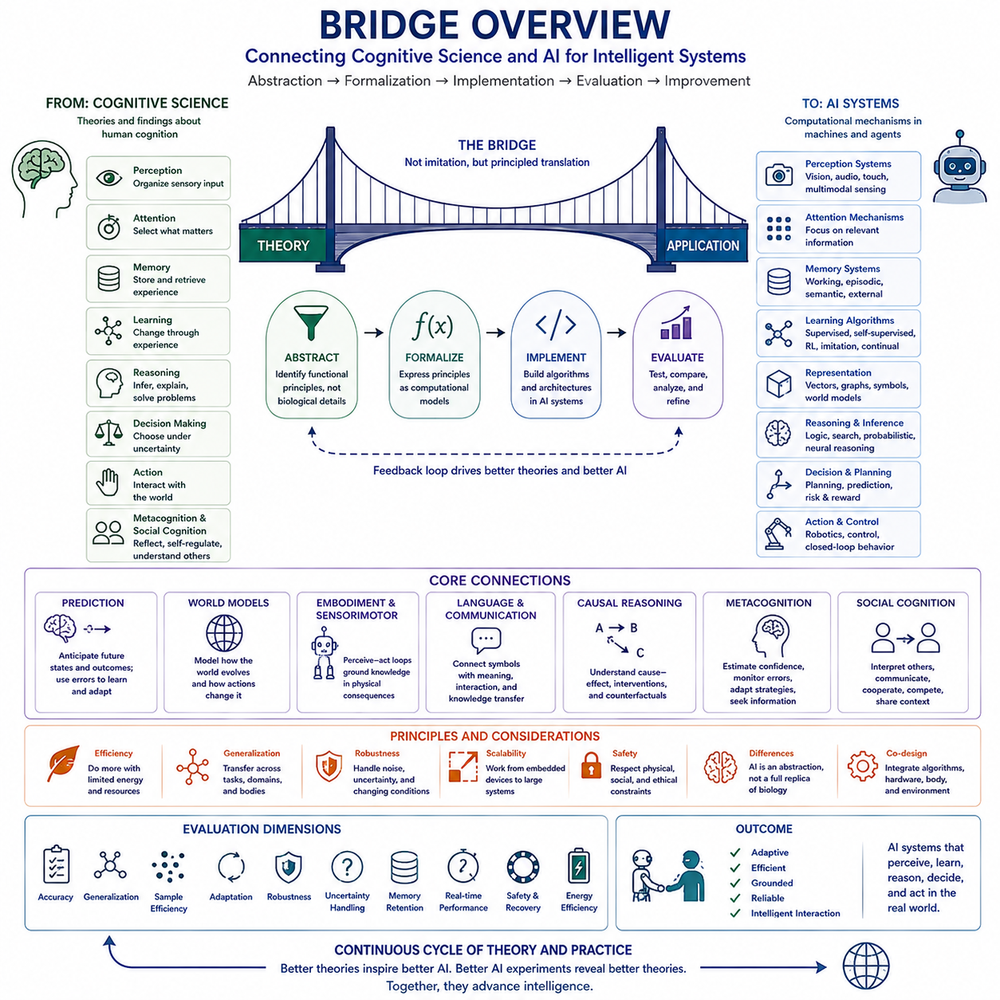{width="7.268055555555556in" height="7.268055555555556in"}

The bridge from cognitive science to artificial intelligence connects theories of human cognition with computational mechanisms that can be implemented, tested, and scaled in machines. Cognitive science provides models of perception, attention, memory, learning, reasoning, decision making, and action, while AI converts selected principles into algorithms and architectures. The bridge is therefore not simple imitation, but a process of abstraction, formalization, implementation, and empirical evaluation.

Human cognition offers an important reference because it demonstrates how intelligent behavior can emerge under severe constraints. The brain operates with limited energy, incomplete information, noisy sensory inputs, finite memory, and restricted processing capacity, yet humans can learn rapidly, generalize knowledge, reason under uncertainty, and adapt to unfamiliar situations. These characteristics motivate AI researchers to investigate computational principles that may produce similarly flexible and efficient behavior.

The relationship between cognitive science and AI is bidirectional. Cognitive theories can inspire computational architectures, but artificial systems can also serve as experimental models for examining theories of cognition. When a proposed cognitive mechanism is implemented computationally, researchers can test whether it produces the expected behavior under controlled conditions. Differences between model predictions and observed human behavior can then reveal limitations in the underlying theory.

Abstraction is essential when translating biological or psychological findings into artificial systems. AI does not need to reproduce every neuron, anatomical structure, or biochemical process to benefit from cognitive principles. Instead, researchers identify functional mechanisms such as selective attention, hierarchical representation, associative memory, predictive processing, reinforcement, working memory, or active perception and express them in computational forms appropriate for artificial agents.

Perception provides one of the clearest examples of this translation. Biological perception does not merely record sensory inputs but organizes them into meaningful representations of objects, events, spatial relationships, and possible actions. AI perception similarly attempts to transform raw images, audio, tactile signals, or other sensor streams into representations useful for recognition, prediction, reasoning, planning, and control. Modern multimodal systems extend this process across several sensory or symbolic modalities.

Attention provides another bridge between cognitive mechanisms and machine computation. Human cognitive systems cannot process every available signal with equal priority, so attention selectively allocates processing resources. Artificial attention mechanisms similarly emphasize information that is relevant to a task or context. Although machine attention is not identical to biological attention, the shared functional principle of selective information processing has become fundamental to modern neural architectures.

Memory connects present computation with information accumulated in the past. Cognitive science distinguishes working, episodic, semantic, procedural, and other forms of memory according to their functions and timescales. AI systems can translate these distinctions into temporary context, recurrent states, external memory, retrieval systems, learned parameters, experience buffers, and stored policies. Such mechanisms allow artificial agents to maintain context and reuse knowledge rather than processing every situation independently.

Learning forms another central connection because biological intelligence continuously changes through experience. Supervised learning captures relationships from labeled examples, self-supervised learning extracts structure from largely unlabeled observations, reinforcement learning connects behavior with consequences, and imitation learning transfers patterns from demonstrations. These computational approaches differ from biological learning mechanisms, but each reflects the broader cognitive principle that experience should modify future processing and behavior.

Representation determines how knowledge is internally organized and therefore strongly influences what an intelligent system can learn and generalize. Cognitive theories examine concepts, categories, schemas, mental models, spatial representations, and symbolic structures. AI explores corresponding representations through vectors, latent spaces, neural activations, graphs, symbolic structures, semantic maps, and world models. Effective representations preserve information that supports prediction, reasoning, transfer, and action.

Reasoning connects stored representations to conclusions, decisions, and plans. Classical AI emphasized explicit symbolic rules and logical inference, whereas neural approaches learn distributed patterns from data. Cognitive science suggests that human reasoning may involve multiple interacting mechanisms rather than a single universal process. This motivates hybrid approaches that combine learned representations, structured knowledge, search, memory, probabilistic inference, and explicit reasoning procedures.

Decision making under uncertainty is especially important because intelligent systems rarely possess complete knowledge about their environments. Humans combine prior experience, current evidence, expected outcomes, goals, and risk when selecting actions. Artificial systems can represent similar problems through probabilistic models, utility functions, reinforcement learning, planning, and uncertainty estimation. The cognitive perspective emphasizes that decision making is closely linked with perception, memory, attention, and prediction.

Predictive processing provides a particularly important connection between cognition and contemporary AI. Intelligent systems can use internal models to anticipate future observations, environmental states, or consequences of actions. Differences between prediction and observation provide error signals that can support learning and adaptation. In artificial agents, predictive models can contribute to representation learning, anomaly detection, planning, control, and the construction of increasingly capable world models.

World models extend prediction by representing how environments evolve across time and how actions influence future states. From a cognitive perspective, internal models allow agents to reason beyond immediate sensory information. In AI, learned world models can support simulation of possible futures, evaluation of candidate actions, long-horizon planning, and counterfactual reasoning. This creates a direct connection between cognitive models of internal simulation and autonomous decision-making systems.

Embodiment expands the bridge beyond abstract information processing. Human cognition develops through interaction between brain, body, and environment, and many concepts acquire meaning through perception and action. Embodied AI applies this principle to robots and autonomous agents whose sensors and actuators create continuous perception-action loops. Knowledge can therefore become grounded in physical consequences rather than being learned exclusively from static symbolic or textual information.

Sensorimotor learning illustrates how cognition and action become mutually dependent. Actions alter the environment and generate new sensory observations, while sensory feedback modifies subsequent actions. Artificial agents can learn these relationships through interaction, developing representations of object properties, motion, contact, terrain, and affordances. This closed-loop perspective is essential for robotics because successful intelligence must remain connected to real-time physical behavior.

Language creates another important bridge because it connects internal representations with communication, abstraction, knowledge transfer, and reasoning. Cognitive science studies how language relates to concepts, memory, perception, and social interaction, while AI develops computational language models capable of representing and generating linguistic structures. Multimodal systems increasingly connect language with images, audio, video, actions, and physical environments, moving toward more grounded forms of machine understanding.

Modern foundation models broaden this relationship by learning general representations from extremely large and diverse datasets. Their capabilities demonstrate how scale, representation learning, attention, and contextual processing can produce behaviors that span many tasks. However, cognitive comparison also exposes limitations, including weak grounding, inconsistent reasoning, limited persistent memory, uncertain causal understanding, and difficulties maintaining coherent adaptation across extended interactions.

Large language models provide a particularly useful case for examining similarities and differences between cognitive and artificial systems. They can maintain contextual information, retrieve learned associations, perform forms of reasoning, and generate structured responses, but these capabilities should not automatically be equated with human cognition. Cognitive terminology can provide useful functional analogies while careful analysis is required to distinguish computational resemblance from biological equivalence.

Causal reasoning represents an important frontier in this bridge. Statistical learning can identify regularities and correlations, but intelligent agents operating in changing environments must also understand how interventions produce consequences. Cognitive systems use experience, experimentation, prior knowledge, and counterfactual thinking to reason about causes. AI research increasingly seeks representations and learning mechanisms that distinguish causal structure from correlations that may disappear when environments change.

Metacognition provides another direction by focusing on how a system evaluates and regulates its own cognitive processes. Humans can sometimes estimate confidence, recognize uncertainty, detect errors, revise strategies, and decide when additional information is required. Artificial systems can incorporate confidence estimation, uncertainty modeling, self-evaluation, verification, monitoring, and adaptive computation. These mechanisms can improve reliability when a model encounters unfamiliar or ambiguous situations.

Social cognition extends intelligence beyond individual problem solving. Human behavior depends on interpreting other agents, predicting intentions, communicating goals, coordinating actions, and learning from social interaction. AI systems operating with humans or other autonomous agents similarly require models of agency, communication, cooperation, competition, and shared context. These capabilities become particularly important for collaborative robots and multi-agent systems.

Efficiency provides another important lesson from cognition. Biological intelligence performs sophisticated computation using limited energy and selectively activates resources according to current demands. AI systems increasingly investigate sparse computation, conditional processing, event-driven sensing, efficient memory, specialized hardware, and adaptive inference. Brain-inspired efficiency becomes particularly valuable for robots and edge systems where energy, thermal capacity, latency, and computational resources are constrained.

The bridge also reveals fundamental differences that should not be ignored. Artificial neural networks are highly simplified abstractions of biological neural systems, machine learning often requires vastly different amounts and types of data, and artificial agents may lack the developmental, social, emotional, and embodied histories that shape human cognition. Cognitive inspiration is therefore most useful when treated as a source of computational hypotheses rather than a requirement to duplicate biology.

Evaluation provides the mechanism for determining whether translated cognitive principles actually improve artificial intelligence. Models should be tested not only on average benchmark accuracy but also on generalization, adaptation, robustness, sample efficiency, uncertainty, memory retention, transfer, and behavior under changing conditions. For embodied systems, evaluation must additionally consider real-time performance, safety, energy consumption, physical interaction, and recovery from unexpected events.

Ultimately, the bridge between cognitive science and AI provides a framework for connecting theories of intelligence with computational implementation. Perception supplies structured information, attention selects what matters, memory preserves experience, learning modifies behavior, prediction anticipates future states, reasoning evaluates possibilities, and action closes the loop with the environment. Integrating these mechanisms offers a pathway toward artificial systems that are more adaptive, efficient, grounded, and capable of sustained intelligent interaction.

## 06.01 From Brain to Deep Learning [w/Code]

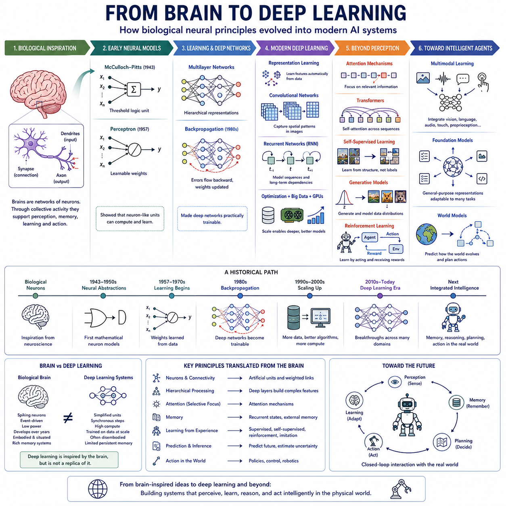{width="7.268055555555556in" height="7.268055555555556in"}

The development of deep learning can be understood as a long process of translating selected principles of biological neural computation into mathematical and computational systems. Early researchers were inspired by the observation that brains consist of large populations of interconnected neurons whose collective activity supports perception, memory, learning, and action. Artificial neural networks abstracted this idea into networks of simple computational units connected by adjustable weights.

Biological neurons receive signals through dendrites, integrate those signals within the cell, and produce electrical activity that can influence other neurons through synapses. Artificial neurons simplify this complex process into weighted inputs, aggregation, and nonlinear activation. The correspondence is highly abstract rather than biologically exact, but it established a powerful computational principle: complex functions can emerge from networks of many relatively simple interacting processing units.

The McCulloch-Pitts neuron provided an early mathematical abstraction of neural computation by representing neurons as logical threshold units. Inputs were combined and compared with a threshold to determine whether an output should be activated. Although extremely simplified, this model demonstrated that networks of neuron-like units could implement logical operations and computational functions, helping establish an intellectual connection between neuroscience, mathematics, and artificial intelligence.

The perceptron extended this direction by introducing adjustable connection weights that could be learned from examples. Instead of manually specifying every relationship between inputs and outputs, the system could modify its parameters according to prediction errors. This represented an important conceptual transition from explicitly programmed computation toward learning systems whose behavior emerges through experience and parameter adaptation.

Early neural networks nevertheless faced substantial limitations. Single-layer perceptrons could solve only restricted classes of problems, and practical methods for training large multilayer networks were not yet available. These difficulties contributed to periods in which neural approaches received less attention. The historical lesson is important: biological inspiration alone was insufficient without suitable mathematical optimization, computational resources, training data, and scalable implementation techniques.

Multilayer neural networks introduced hierarchical processing in which intermediate representations could be formed between raw input and final output. This concept loosely resembles hierarchical organization found in biological sensory systems, where information is transformed across multiple processing stages. In artificial networks, deeper layers can progressively construct representations that are useful for solving complex tasks without requiring every useful feature to be explicitly designed by humans.

Backpropagation became a crucial mechanism for making multilayer networks practically trainable. The algorithm computes how changes in network parameters influence an objective function and propagates error-related information backward through the computational graph. Gradient-based optimization can then adjust many parameters jointly. Backpropagation should not be considered a direct model of biological learning, but it provides an effective engineering solution for training artificial neural systems.

Representation learning became one of the defining advantages of neural networks. Traditional machine-learning systems often depended heavily on manually engineered features, whereas deep networks could learn useful internal representations directly from data. Images, speech, text, sensor measurements, and other inputs could be transformed through successive layers into increasingly task-relevant representations. Learning therefore began to include both feature construction and decision making within a unified system.

Convolutional neural networks demonstrated this principle particularly clearly in visual processing. Convolution exploits local spatial structure and shared parameters, allowing networks to detect patterns regardless of their exact location. Multiple layers can transform low-level visual features into progressively more complex representations. Although convolutional networks are not replicas of the visual cortex, biological studies of hierarchical visual processing contributed historically to ideas about layered feature extraction.

Recurrent neural networks addressed temporal information by allowing previous internal states to influence subsequent computation. This introduced a form of artificial memory suitable for sequences such as speech, language, control signals, and time-series data. Long short-term memory and related gated architectures improved the ability to preserve information across longer intervals, demonstrating how neural computation could extend from static pattern recognition toward temporally structured cognition.

Deep learning became practical at large scale when algorithmic advances converged with increasing computational power, large datasets, and specialized hardware. Graphics processing units enabled massive parallel numerical operations, while improved optimization techniques and initialization methods made deeper networks easier to train. The resulting progress showed that advances in artificial intelligence often emerge from interaction among conceptual ideas, mathematical methods, data availability, and computing infrastructure.

The success of deep neural networks transformed computer vision, speech recognition, natural language processing, recommendation, robotics, and scientific computing. Instead of constructing separate handcrafted rules for every problem, researchers could train models to discover statistical structure from examples. This shift made learned representations central to AI and demonstrated that sufficiently expressive networks could approximate highly complex mappings between inputs, internal representations, and outputs.

Attention mechanisms introduced another important transition by allowing neural systems to determine dynamically which information should influence computation most strongly. Rather than processing every representation with identical importance, attention computes context-dependent relationships among elements. This functional principle resembles selective information processing in cognition, although artificial attention differs substantially from biological attention in its implementation and underlying mechanisms.

Transformers expanded attention into a highly scalable architecture for learning relationships across sequences and structured data. Self-attention allows representations to interact directly according to their relevance, while multiple attention heads can capture different relationships simultaneously. Transformers became foundational for modern language models and increasingly for vision, multimodal learning, robotics, and world models, extending deep learning beyond architectures dominated by convolution and recurrence.

Self-supervised learning further changed the relationship between data and representation learning. Instead of depending entirely on manually labeled datasets, models can construct learning objectives from the structure of the data itself. Predicting masked content, future observations, missing components, or relationships among views allows large amounts of unlabeled information to contribute to training. This resembles the broader cognitive principle that useful structure can be learned from continuous experience without explicit instruction for every observation.

Deep generative models expanded neural networks from recognition toward the creation and prediction of complex data. Variational methods, autoregressive models, generative adversarial networks, and diffusion models learn distributions over observations or latent representations. These systems can generate images, language, audio, video, and other structured outputs. Generative learning also supports simulation, representation learning, uncertainty modeling, and increasingly the prediction of possible future states.

Reinforcement learning connects neural representation learning with action and consequences. A deep network can approximate policies, value functions, or environmental models while an agent learns from interaction. This combination enabled progress in games, control, navigation, manipulation, and autonomous decision making. It also reconnects deep learning with an important biological theme: intelligent behavior develops not only from observing the world but also from acting within it and experiencing outcomes.

Multimodal deep learning extends neural computation across different forms of information. Vision, language, audio, tactile signals, proprioception, and other modalities can be encoded into representations that interact within shared architectures. This allows systems to connect descriptions with observations, observations with actions, and information across sensory channels. Such integration moves artificial intelligence toward richer representations that are less dependent on a single input modality.

Foundation models represent a further scaling of this approach. Large neural networks trained on broad datasets can acquire representations reusable across many tasks. Capabilities can then be adapted through prompting, fine-tuning, retrieval, demonstrations, or additional training. Their emergence illustrates how general-purpose behavior can arise from large-scale representation learning, while also revealing limitations involving grounding, persistent memory, causal understanding, reliability, and adaptation.

The progression from early neural abstractions to modern deep learning should therefore not be interpreted as increasingly accurate simulation of the biological brain. Contemporary networks remain dramatically different from nervous systems in neuron dynamics, connectivity, learning mechanisms, energy consumption, development, embodiment, and memory organization. Their success demonstrates the value of selected neural principles, not the equivalence of artificial and biological intelligence.

These differences motivate renewed interest in brain-inspired alternatives and extensions. Spiking neural networks investigate temporal spike-based computation, neuromorphic hardware explores event-driven architectures, memory-inspired systems introduce specialized storage and retrieval, and embodied AI emphasizes closed perception-action loops. Attention, predictive processing, continual learning, active perception, and energy-efficient computation similarly draw functional inspiration from cognitive and neural systems without requiring literal biological replication.

For robotics and Physical AI, the transition from deep learning toward more integrated intelligence is especially important. A robot must combine perception, memory, prediction, planning, control, and action while operating under real-time, energy, safety, and hardware constraints. Deep networks provide powerful representation-learning components, but autonomous behavior requires these components to participate in persistent sensorimotor loops and interact with world models, memory systems, and adaptive control.

World models provide a natural continuation of deep learning by shifting emphasis from recognizing current observations toward predicting how environments evolve. Neural representations can encode objects, geometry, motion, semantics, and latent dynamics, while learned transition models estimate future states under candidate actions. This enables artificial agents to use deep learning not only for perception but also for internal simulation, planning, prediction, and adaptive decision making.

Ultimately, the path from brain-inspired neural concepts to deep learning illustrates how biological observations can become computational abstractions and then develop far beyond their original inspiration. Artificial neurons led to trainable networks, hierarchical representations led to deep architectures, and large-scale learning produced modern foundation models. The next stage increasingly reconnects these systems with memory, prediction, embodiment, efficient computation, and action, creating a broader path from deep learning toward adaptive artificial intelligence.

## 06.02 From Cortex to CNN [w/Code]

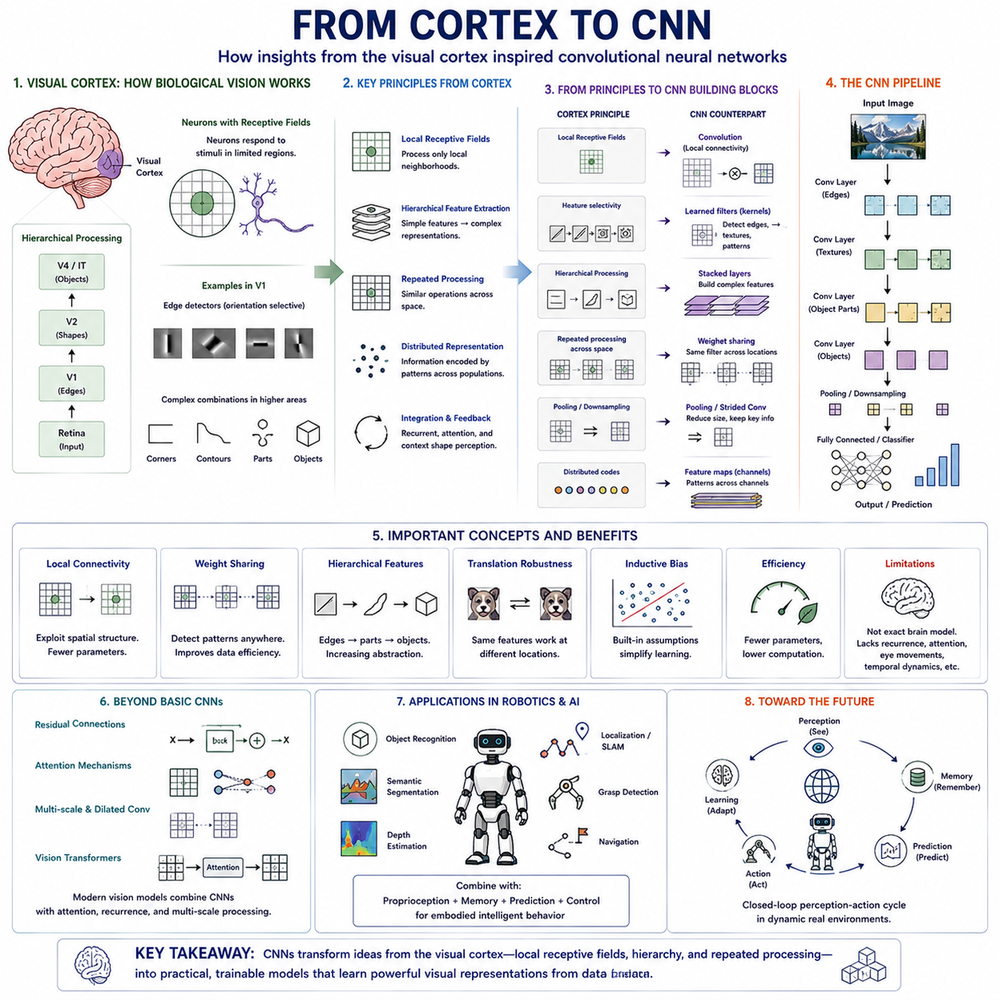{width="7.268055555555556in" height="7.268055555555556in"}

The path from visual cortex research to convolutional neural networks illustrates how observations about biological vision can be transformed into computational design principles. The cerebral cortex processes visual information through distributed populations of neurons organized into hierarchical pathways. CNNs abstract only selected ideas from this organization, especially local receptive fields, hierarchical feature extraction, and repeated processing of spatial structure.

Early neuroscience studies showed that neurons in the visual cortex respond selectively to particular patterns within limited regions of the visual field. Some cells respond strongly to oriented edges, while others become sensitive to more complex combinations of local features. These findings suggested that visual recognition could emerge from multiple processing stages in which simple structures are detected first and progressively combined into richer representations.

The concept of a receptive field is especially important in the transition from cortex to CNNs. A biological visual neuron responds primarily to stimuli within a limited region rather than to the entire visual scene. CNNs adopt a comparable computational principle by connecting convolutional units to local neighborhoods of an input. Each unit therefore analyzes only a restricted spatial region before information is integrated across deeper layers.

Local connectivity provides several advantages. Nearby pixels often contain strongly related information, so processing local neighborhoods allows a model to exploit spatial structure without requiring every neuron to connect to every input value. This reduces the number of parameters and creates a strong inductive bias toward local patterns such as edges, corners, textures, and object parts. Such biases make visual learning more computationally efficient.

Weight sharing introduces another defining property of convolutional networks. A convolutional filter is applied repeatedly across different locations in an image using the same learned parameters. This enables the network to detect a pattern regardless of where it appears. Biological visual systems do not implement exact digital weight sharing, so this mechanism should be understood as an engineering abstraction inspired by spatially repeated processing rather than a literal cortical mechanism.

Convolution performs this repeated local analysis mathematically. A small kernel moves across the input and computes weighted combinations of neighboring values, producing a feature map. Different kernels learn to respond to different spatial structures. During training, the parameters of these kernels are adjusted so that the resulting feature maps become useful for the task, allowing visual features to emerge from data rather than being manually specified.

Hierarchical processing is one of the strongest conceptual links between cortical vision and CNN architecture. Early network layers frequently learn relatively simple visual patterns, while deeper layers combine them into more complex structures. Edges can contribute to textures and contours, contours can form object parts, and combinations of object parts can support object-level representations. This hierarchy enables visual abstraction across increasing receptive-field sizes.

Pooling and spatial downsampling were introduced to reduce representation size while retaining important information. By summarizing local regions, a network can gradually increase the effective receptive field of deeper units and reduce sensitivity to small positional variations. Max pooling historically played a major role in CNNs, although modern architectures may use strided convolution, learned downsampling, or other mechanisms instead.

Translation-related robustness became a practical advantage of convolutional architectures. Because the same filters operate across many spatial positions, a learned visual feature can remain useful when its location changes. Pooling and data augmentation can further improve tolerance to shifts and transformations. However, CNNs are not automatically invariant to arbitrary translation, rotation, scale, or viewpoint changes, and robust recognition still depends on architecture and training.

The neocognitron provided an important historical step toward modern convolutional networks by introducing hierarchical layers of simple and complex units inspired by visual cortical organization. Its architecture demonstrated how local feature extraction and progressive spatial abstraction could produce increasingly complex visual representations. Although its learning procedures differed from contemporary deep learning, it helped establish architectural concepts later developed in trainable CNNs.

LeNet demonstrated how convolutional architectures could be trained effectively using gradient-based learning for practical recognition tasks. Convolution, nonlinear activation, subsampling, and trainable classification layers were combined into an end-to-end system. This showed that biologically inspired architectural principles could be integrated with backpropagation, transforming cortical inspiration into a scalable engineering framework for machine perception.

The later rise of deep CNNs depended on more than cortical inspiration. Large labeled datasets, GPU computation, improved activation functions, regularization, optimization techniques, and deeper architectures were equally important. Systems such as AlexNet showed that convolutional models could achieve major improvements in large-scale visual recognition when sufficient data and computational resources became available.

Depth allowed CNNs to build increasingly abstract visual representations. Networks such as VGG explored architectures based on repeated small convolutions, while residual networks introduced skip connections that made very deep networks easier to optimize. These developments were driven primarily by engineering requirements rather than direct neuroscience, demonstrating how brain-inspired concepts can evolve independently once incorporated into computational systems.

Residual connections nevertheless have conceptual relevance to cortical computation because biological neural systems contain extensive recurrent, lateral, and feedback connectivity rather than strictly sequential feed-forward chains. Modern vision networks increasingly include skip connections, recurrence, attention, and multi-scale pathways. These structures move beyond the simplified feed-forward hierarchy that characterized many early CNN interpretations.

Receptive fields also evolve across network depth. A unit in an early layer may depend on only a small image region, while deeper units indirectly integrate information from much larger portions of the visual field. This allows the model to move from local features toward global object structure. The effective receptive field therefore determines how spatial context becomes available to later representations and strongly influences visual reasoning.

Feature maps provide distributed representations rather than explicit symbolic descriptions. A visual concept is typically represented by patterns of activity across many channels and spatial positions rather than by one dedicated neuron. This distributed organization loosely resembles population coding in biological neural systems, where information often emerges from patterns across neural populations rather than from single isolated cells.

CNNs also demonstrate the importance of inductive bias. Their local connectivity and shared kernels encode assumptions about the spatial organization of visual data before learning begins. These assumptions dramatically reduce the search space compared with unconstrained fully connected networks. Cognitive and neuroscience perspectives similarly suggest that intelligent learning may depend on structural biases rather than beginning from completely unrestricted computation.

However, biological vision differs substantially from conventional CNNs. The visual cortex contains recurrent connections, attention, multiple interacting pathways, eye movements, temporal dynamics, predictive feedback, neuromodulation, and strong integration with memory and action. Traditional CNNs commonly process static image tensors through mostly feed-forward stages. Their similarity to cortex is therefore functional and highly selective rather than anatomically or physiologically complete.

The retina and early visual pathways also perform substantial computation before signals reach the cortex. Contrast enhancement, adaptation, temporal filtering, motion sensitivity, and efficient encoding influence the information available to cortical networks. Standard CNN pipelines generally begin with already sampled image arrays and therefore omit many preprocessing mechanisms that biological vision uses to control redundancy, dynamic range, and temporal information.

Attention extends visual processing beyond fixed convolutional receptive fields by allowing systems to emphasize particular objects, regions, or relationships according to context. Vision Transformers demonstrate that strong visual recognition can also emerge from attention-based architectures with weaker convolutional assumptions. This shows that convolution is one powerful solution to visual representation learning, but it is not the only architecture capable of hierarchical perception.

Hybrid vision architectures increasingly combine convolution and attention. Convolution can efficiently capture local structure and spatial regularity, while attention can model long-range relationships and context-dependent interactions. Such combinations resemble a broader lesson from biological vision: effective perception may require both specialized local processing and mechanisms that integrate information across distant regions and changing behavioral contexts.

For robotics and embodied AI, CNN-based perception becomes most useful when connected to action. Visual features can support object recognition, semantic segmentation, depth estimation, localization, grasp detection, navigation, and scene understanding. However, a physical agent must also combine visual representations with proprioception, memory, prediction, and control. Vision therefore becomes one component within a larger perception-action architecture.

Temporal visual understanding further exposes the limitations of static CNN processing. Real environments continuously change, and an intelligent agent must estimate motion, object persistence, trajectories, and future states. Video networks, recurrent models, temporal convolutions, attention mechanisms, and world models extend visual representation from individual frames toward dynamic scenes. This brings artificial vision closer to the continuous conditions under which biological perception operates.

The historical progression from cortex-inspired receptive fields to modern CNNs therefore represents selective translation rather than direct replication. Neuroscience contributed principles of locality, hierarchy, feature selectivity, and distributed representation, while machine learning added weight sharing, backpropagation, optimization, large datasets, and specialized hardware. Their combination produced practical visual systems whose capabilities substantially exceed those of the original abstractions.

Ultimately, the cortex-to-CNN bridge demonstrates how biological observations can become engineering biases that simplify learning. Local receptive fields encourage spatial structure, hierarchical layers support abstraction, shared filters improve efficiency, and deep representation learning transforms raw images into task-relevant features. The next step extends these principles with attention, memory, prediction, multimodal integration, and embodied action, moving visual AI from image recognition toward adaptive perception of dynamic environments.

## 06.03 From Attention to Transformer [w/Code]

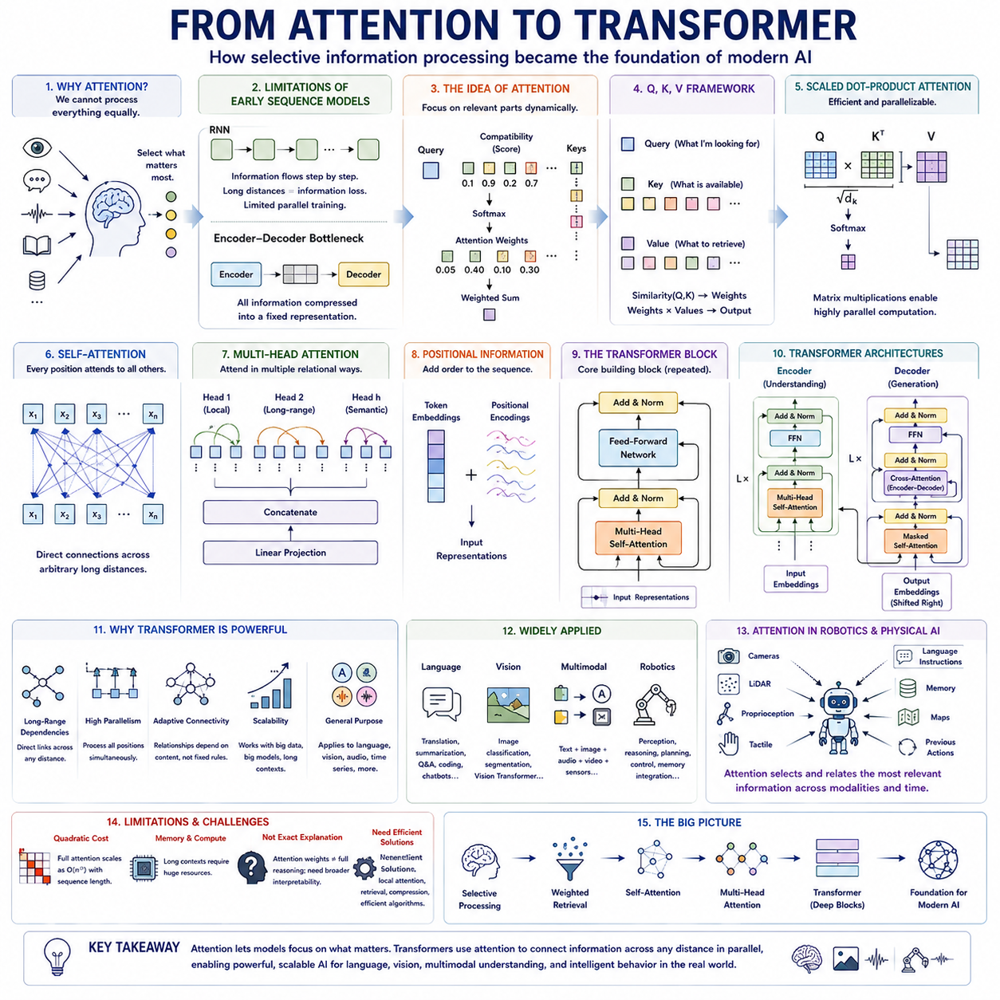{width="7.268055555555556in" height="7.268055555555556in"}

Attention provides a computational principle for selecting information according to its relevance to the current task, context, or internal state. Human cognition cannot process every sensory signal, memory, and possible action with equal priority, so attention allocates limited resources selectively. Artificial intelligence adopted a related functional idea: instead of compressing all available information uniformly, a model can dynamically determine which elements should influence its current computation most strongly.

Early neural sequence models relied heavily on recurrent neural networks, which processed information step by step while maintaining an internal hidden state. This approach was effective for language, speech, and temporal data, but long sequences created difficulties because information had to travel through many recurrent transitions. Important details from earlier positions could weaken, and sequential computation limited the degree of parallel processing available during training.

Encoder-decoder architectures exposed this limitation clearly in machine translation. An encoder processed an input sequence and compressed its information into an internal representation, while a decoder generated the output sequence. When the input became long or structurally complex, forcing all relevant information through a fixed representation created an information bottleneck. Attention emerged as a mechanism allowing the decoder to access different encoder states directly when generating each output element.

The central idea of attention is to compute relevance between a current query and a collection of available information. Instead of treating every representation equally, the system calculates compatibility scores and converts them into weights. Representations with higher relevance receive greater influence on the resulting output. This creates a dynamic information-routing mechanism whose behavior changes according to the input and computational context.

The concepts of query, key, and value provide a general formulation of this process. A query represents the information currently being sought, keys describe the information available for comparison, and values contain the content that can be retrieved or combined. Similarity between queries and keys determines attention weights, which are then used to form weighted combinations of values. This abstraction became fundamental to modern attention-based architectures.

Scaled dot-product attention provides an efficient mathematical implementation. Queries are compared with keys through dot products, the resulting scores are scaled to maintain stable numerical behavior, and a softmax function converts them into normalized attention weights. These weights determine how strongly each value contributes to the output. Because these operations can be expressed through matrix multiplication, they are highly compatible with parallel computation on modern accelerators.

Self-attention applies this mechanism within a single sequence or collection of representations. Each element generates query, key, and value representations and can therefore interact directly with other elements. A word can attend to distant words in a sentence, an image region can relate to other regions, and a robot state can connect with observations from different times. Long-range dependencies no longer need to pass through a chain of recurrent transitions.

This direct interaction changes how context is constructed. In recurrent systems, information from distant positions must propagate sequentially through intermediate hidden states. Self-attention allows relevant positions to communicate through comparatively short computational paths. The representation of each element can therefore be updated according to relationships with many other elements, enabling flexible context-dependent representations that vary with the entire input.

Multi-head attention extends this capability by performing several attention operations using different learned projections. Individual heads can specialize in different relationships, such as local dependencies, long-range associations, semantic connections, positional interactions, or task-specific patterns. Their outputs are combined into a richer representation. Multiple heads therefore allow the model to examine the same information through several learned relational perspectives simultaneously.

Attention alone does not encode sequence order automatically because its basic operations treat collections of elements largely according to their content. Positional information must therefore be introduced so that the model can distinguish different orders and relative locations. Positional encodings or learned positional representations provide this structure, enabling attention-based models to reason about sequence order, spatial arrangement, temporal distance, and other positional relationships.

The Transformer architecture emerged by organizing self-attention, feed-forward networks, residual connections, normalization, and positional information into repeated computational blocks. Instead of relying primarily on recurrence or convolution for sequence modeling, Transformers use attention as the principal mechanism for exchanging information across positions. This architecture enabled highly parallel training while retaining the ability to model relationships over long contexts.

Transformer encoders repeatedly transform input representations into increasingly contextualized states. Within each layer, self-attention allows information to move among positions, while feed-forward networks perform nonlinear transformations on individual representations. Residual connections preserve information flow across depth, and normalization helps stabilize optimization. Stacking many such layers allows progressively richer relationships and abstractions to emerge.

Transformer decoders add mechanisms needed for autoregressive generation. Masked self-attention prevents a position from using information from future output positions during training, preserving the causal structure required for sequential generation. In encoder-decoder Transformers, cross-attention also allows decoder states to retrieve information from encoder representations. These mechanisms support conditional generation tasks such as translation, summarization, and multimodal generation.

Removing recurrence created a major computational advantage. During training, many sequence positions can be processed simultaneously rather than waiting for previous recurrent states to be calculated. This parallelism maps efficiently onto GPUs and other matrix-processing hardware. Combined with large datasets and scalable optimization, it allowed Transformers to grow dramatically in model size, training data, context length, and representational capacity.

Attention also provides adaptive connectivity. Convolution uses predefined local connectivity, and recurrence follows predetermined temporal transitions, whereas attention constructs relationships dynamically according to input content. The effective computational graph can therefore change from one example to another. This flexibility enables the same architecture to model syntax, semantics, spatial relationships, temporal dependencies, object interactions, and other structures without explicitly programming each relationship.

However, artificial attention should not be equated directly with biological attention. Human attention involves perception, goals, memory, eye movements, neural competition, behavioral relevance, and multiple interacting brain systems. Transformer attention is a mathematical operation for weighted information integration. The connection is therefore functional and abstract: both emphasize selective processing, but their mechanisms, constraints, and biological interpretations differ substantially.

Transformers became especially influential in natural language processing because language contains dependencies operating across many scales. Words depend on nearby grammatical structure, distant references, discourse context, semantic relationships, and previously expressed information. Self-attention provides a flexible mechanism for representing these interactions, while deep stacking enables increasingly abstract contextual representations to emerge from large-scale language data.

Large language models extend the Transformer by combining attention-based architectures with massive self-supervised learning. Predicting tokens from context allows models to learn linguistic structure, factual associations, semantic patterns, and task-relevant representations from enormous text corpora. Scaling parameters, data, and computation has produced models capable of generation, summarization, translation, question answering, coding, and various forms of contextual reasoning.

Vision Transformers demonstrate that attention can also operate effectively on visual information. Images can be divided into patches that are represented as tokens and processed through Transformer layers. Self-attention allows distant image regions to interact directly, providing a mechanism for modeling global visual relationships. This differs from the strong locality bias of CNNs and illustrates how attention can provide a more general framework for relational processing.

Multimodal Transformers extend this framework across language, images, audio, video, sensor measurements, and other information sources. Different modalities can be converted into token-like representations and integrated through self-attention or cross-attention. This enables systems to associate words with visual objects, audio with events, observations with instructions, and sensor states with actions, creating increasingly unified representations across heterogeneous information.

For robotics and Physical AI, attention can help integrate large and asynchronous streams of sensorimotor information. A robot may need to combine cameras, LiDAR, proprioception, tactile sensing, language instructions, memory, maps, and previous actions. Attention mechanisms can prioritize task-relevant observations and establish relationships across modalities and time, helping the system focus computational resources on information that matters for current behavior.

Temporal attention is particularly useful when autonomous systems must reason over extended histories. Current observations may be ambiguous without knowledge of previous states, actions, or object trajectories. Attention can retrieve relevant events from a temporal context rather than treating all previous information equally. Combined with memory systems, this can support object persistence, activity understanding, navigation, manipulation, and long-horizon decision making.

Attention also contributes naturally to world models. Tokens or latent states can represent objects, regions, agents, actions, and environmental properties, while attention models their interactions. A world model can use these relationships to predict future states under candidate actions. Transformers can therefore move beyond passive sequence modeling toward internal representations of dynamic environments that support prediction, planning, and simulation.

Despite their strengths, standard attention mechanisms have important computational limitations. Full self-attention compares many pairs of tokens, causing memory and computation requirements to grow rapidly with sequence length. Long-context systems therefore require substantial resources. Sparse attention, local attention, hierarchical representations, compressed memory, retrieval mechanisms, and efficient attention algorithms attempt to preserve useful long-range interactions while reducing computational cost.

Attention weights also should not automatically be interpreted as complete explanations of model reasoning. A high attention value indicates strong contribution within a particular computational operation, but complex model behavior emerges through many layers, heads, nonlinear transformations, and learned representations. Understanding Transformer decisions therefore requires broader interpretability methods rather than assuming that individual attention maps directly reveal cognitive reasoning.

The progression from attention to Transformers demonstrates how a cognitive inspiration can become a general computational architecture. Selective information processing became weighted retrieval, weighted retrieval became self-attention, multiple relational views became multi-head attention, and repeated attention blocks became Transformers. Large-scale self-supervised learning then transformed this architecture into the foundation of modern language, vision, multimodal, and increasingly embodied AI systems.

Ultimately, the importance of the Transformer lies not simply in replacing recurrent networks but in providing a flexible mechanism for dynamically connecting information. Attention determines what should interact, contextual representations preserve the resulting relationships, and stacked layers progressively construct richer abstractions. When combined with memory, world models, multimodal perception, and action, this principle provides an important bridge from selective cognitive processing toward adaptive artificial intelligence operating across language and the physical world.

## 06.04 From Hippocampus to Memory Systems [w/Code]

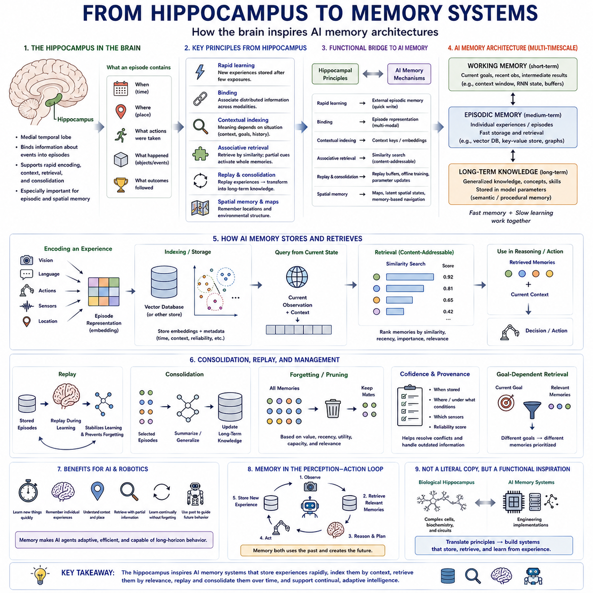{width="7.268055555555556in" height="7.268055555555556in"}

The hippocampus provides one of the clearest biological inspirations for artificial memory systems because it supports rapid encoding, contextual organization, retrieval, and consolidation of experience. In biological cognition, memory is not stored as a single undifferentiated record. Different systems operate across different timescales, with the hippocampus playing a major role in forming and retrieving episodic and spatial memories. AI memory architectures can translate these functional principles into computational mechanisms for storing and reusing experience.

The hippocampus is located within the medial temporal lobe and interacts extensively with cortical regions involved in perception, knowledge, and decision making. Rather than acting as a complete long-term archive by itself, it helps bind distributed information about events into retrievable representations. Experiences can include what happened, where it occurred, when it occurred, what actions were taken, and what outcomes followed, creating structured episodic context.

This binding function provides an important analogy for artificial memory. An AI system may receive vision, language, proprioception, action history, task state, and environmental observations through separate processing pathways. A memory mechanism can associate these elements into a coherent episode that can later be retrieved as a unit. Such binding enables experience to remain useful even when relevant information originally came from different modalities or subsystems.

Episodic memory is especially important because it preserves individual experiences rather than only generalized knowledge. A robot might remember that a particular corridor was blocked yesterday, that a certain grasp failed under a specific object orientation, or that a user previously requested a particular task. These memories can influence future behavior without requiring every event to be permanently incorporated into the model's learned parameters.

The hippocampus is also strongly associated with contextual memory. The meaning and usefulness of an experience often depend on the situation in which it occurred. Similar sensory observations can imply different actions depending on location, task, previous events, or current goals. Artificial memory systems therefore benefit from indexing information by context rather than retrieving stored records solely through exact matching.

Content-addressable retrieval provides one computational interpretation of this principle. Instead of accessing memory only through fixed numerical addresses, a system retrieves stored information according to similarity or relevance to the current state. Partial cues can activate broader stored patterns. Vector similarity search, neural associative memory, attention-based retrieval, and learned indexing mechanisms provide practical implementations of this general idea.

Pattern completion is closely related to associative retrieval. A fragment of an earlier experience can trigger reconstruction of a more complete representation. In biological memory, a familiar location, object, or contextual cue may evoke associated details that are not currently present. Artificial systems can similarly retrieve richer stored episodes from incomplete queries, allowing previous experiences to supplement limited or ambiguous observations.

Rapid learning is another defining hippocampal characteristic. New experiences can be encoded after relatively few exposures, whereas long-term cortical knowledge tends to change more gradually. This separation suggests a useful AI architecture in which an external or episodic memory stores new experiences quickly while model parameters represent slower, more consolidated knowledge. Fast memory and slow learning can therefore coexist rather than competing within the same parameter space.

This idea is closely related to complementary learning systems. A rapidly adapting memory mechanism can preserve specific experiences without immediately modifying the entire neural network, while slower optimization integrates recurring patterns into generalized representations. Such separation helps explain how artificial systems might learn new information quickly while reducing catastrophic interference with previously acquired knowledge.

Memory consolidation provides the mechanism connecting these different timescales. Experiences initially stored in a rapidly accessible memory can later be replayed, summarized, reorganized, or incorporated into longer-term representations. In AI, consolidation can involve replay buffers, offline training, periodic fine-tuning, parameter updates, knowledge distillation, or structured memory summarization. The objective is to transform useful episodes into more persistent knowledge without preserving every raw experience indefinitely.

Replay is especially important in this process. Biological research motivates the idea that previously experienced patterns can be reactivated during periods when the original event is no longer occurring. Artificial systems use experience replay to revisit stored data during learning. Replay helps stabilize training, preserves earlier experiences, and supports continual learning by preventing recent observations from dominating parameter updates completely.

Replay does not necessarily require exact storage of all previous observations. Systems can preserve selected examples, compressed latent representations, summaries, keyframes, trajectories, or generated approximations of older experiences. This creates a tradeoff between memory capacity and fidelity. Effective memory systems therefore require policies for deciding which experiences contain enough long-term value to justify preservation.

The hippocampus is also strongly associated with spatial memory and navigation. Place-related neural representations provide information about locations and environmental structure, while interactions with broader navigation circuits support cognitive maps. Artificial systems adopt related functional principles through metric maps, topological maps, semantic maps, latent spatial states, and memory-based navigation. Stored spatial context allows agents to reason beyond what is currently visible.

Spatial memory becomes particularly valuable in robotics because current sensor observations are often incomplete. Walls, occlusions, limited camera fields of view, and sensor range prevent an agent from observing the entire environment simultaneously. Memory allows current observations to be combined with previously explored regions, supporting localization, path planning, object search, and prediction of what may exist outside immediate perception.

The hippocampal indexing concept provides another useful bridge to AI. Rather than storing every component of an experience redundantly in one place, the hippocampus can be viewed functionally as providing indices that link distributed cortical representations. Artificial memory systems can adopt a similar design by storing compact keys, embeddings, identifiers, or metadata that point toward richer information located in external stores.

Vector databases provide a practical engineering implementation of such indexing. Documents, observations, episodes, images, or trajectories can be transformed into embedding vectors and organized for similarity-based retrieval. A current query is encoded into the same representation space, allowing semantically related memories to be found even when their raw forms differ. This resembles content-addressable indexing functionally, although it is not a literal simulation of hippocampal biology.

Retrieval-augmented generation extends this architecture by allowing a model to consult external memory during inference. Instead of relying only on knowledge encoded in model weights, the system retrieves relevant information and places it into the current computational context. This architecture separates long-term storage from active reasoning, making knowledge easier to update and reducing the need to repeatedly retrain the entire model when external information changes.

Internal and external memory therefore serve complementary roles in AI. Internal memory can be represented through model parameters, recurrent states, or latent activations and offers fast direct access during computation. External memory can preserve substantially larger histories and can be updated independently, but it requires explicit retrieval. Effective systems combine these forms according to the timescale, persistence, and accessibility required by each type of information.

Working memory introduces a shorter timescale than episodic storage. During reasoning or action, a system must maintain current goals, recent observations, intermediate results, and task constraints. Context windows, recurrent states, latent memory, and temporary buffers can serve this function. A broader memory architecture can therefore contain transient working memory, rapidly stored episodic memory, and slower long-term semantic or parametric knowledge.

Semantic memory differs from episodic memory because it represents generalized knowledge rather than specific experiences. Repeated encounters with individual objects, situations, and outcomes can gradually support abstraction into more general concepts. Artificial systems can similarly transform collections of episodes into learned parameters, structured knowledge, prototypes, or summarized representations, enabling knowledge transfer beyond the exact circumstances in which the original experiences occurred.

Memory retrieval must also be selective. Returning every related memory would overwhelm limited computational context and introduce irrelevant information. Retrieval systems therefore rank memories according to similarity, recency, importance, uncertainty, task relevance, or expected utility. Attention mechanisms can then determine which retrieved items should influence current reasoning most strongly, connecting memory architecture directly with selective information processing.

For autonomous agents, retrieval can become goal dependent. The same stored experience may be useful for one task and irrelevant for another. A navigation problem may prioritize spatial episodes, while manipulation may require object interaction histories and a social interaction may require previous user preferences. Learned retrieval policies can adapt memory access according to the agent's current objective rather than using one fixed similarity criterion.

Forgetting is an equally important component of memory architecture. Unlimited storage is impractical, and preserving every observation can increase retrieval cost while reducing relevance. Artificial memory systems therefore need mechanisms for decay, compression, deletion, consolidation, and priority-based retention. Forgetting should not be understood only as failure; selective removal of obsolete or low-value information can improve efficiency and prevent interference.

Memory confidence and provenance become important when retrieved experiences may be outdated, noisy, or contradictory. A stored episode should ideally preserve information about when it was acquired, under what conditions, with which sensors, and how reliable the observation was. This enables the system to distinguish recent evidence from obsolete experience and to resolve conflicts among memories rather than treating all stored records as equally trustworthy.

Continual learning strongly benefits from this separation between memory and model parameters. New experiences can first be stored externally and reused during later learning, reducing pressure to modify the network immediately after each observation. Replay and consolidation can then selectively integrate important patterns. Such architectures address the stability-plasticity problem by combining rapid acquisition with gradual long-term adaptation.

In embodied AI, memory becomes part of the perception-action loop. An agent observes the environment, retrieves relevant past experiences, evaluates current possibilities, acts, observes the consequences, and stores new episodes. Memory therefore does not merely describe the past; it influences future perception, prediction, planning, and action. Each interaction simultaneously consumes existing memory and creates potential new memory.

The functional bridge from hippocampus to AI memory systems should nevertheless be interpreted carefully. Vector databases, replay buffers, retrieval modules, and context windows are engineering mechanisms, not direct replicas of hippocampal anatomy or physiology. Their value lies in translating selected principles such as rapid encoding, contextual indexing, associative retrieval, replay, consolidation, and multiple learning timescales into computational architectures.

Ultimately, the hippocampus-to-memory-systems bridge suggests that persistent intelligence requires more than storing information inside fixed neural parameters. Artificial agents benefit from rapid episodic storage, selective retrieval, associative indexing, replay, consolidation, spatial memory, and differentiated timescales. Combined with attention, reasoning, world models, and action, these mechanisms enable AI systems to preserve experience, recover relevant context, learn continuously, and use the past to guide adaptive behavior in the future.

## 06.05 From Dopamine to RL [w/Code]

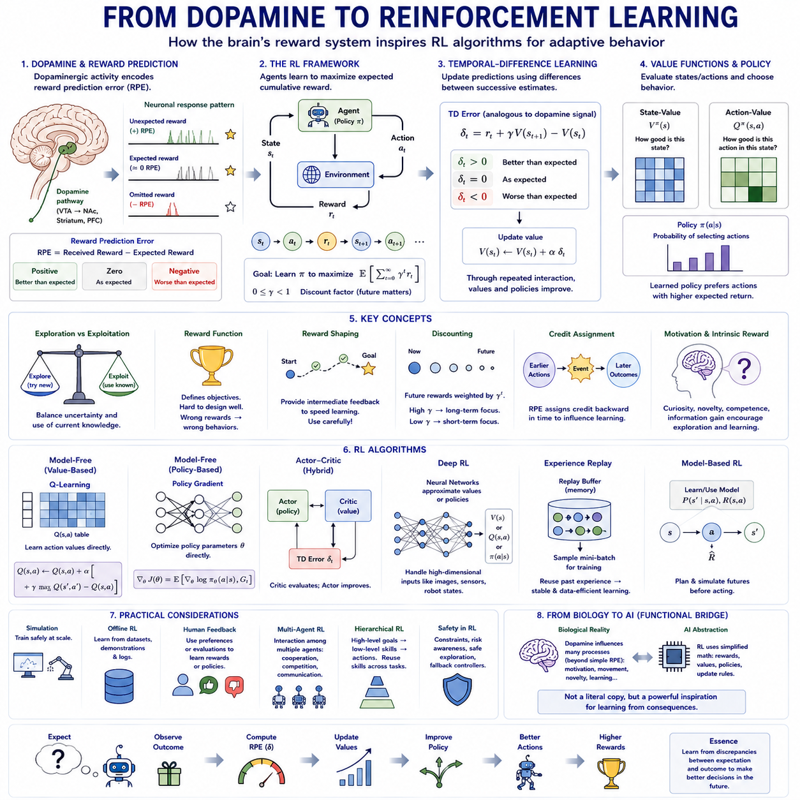{width="7.268055555555556in" height="7.268055555555556in"}

Dopamine provides one of the most influential biological inspirations for reinforcement learning because it is closely associated with reward prediction, motivation, action selection, and learning from unexpected outcomes. In the brain, dopaminergic activity changes according to differences between expected and received outcomes. Reinforcement learning translates this functional principle into mathematical mechanisms that update behavior according to reward and prediction error.

A central concept is reward prediction error, which measures the difference between what an agent expected to receive and what actually occurred. When an outcome is better than expected, the prediction error is positive; when it is worse, the error is negative. If the result matches expectation, the error approaches zero. This signal provides a compact mechanism for adjusting predictions and actions from experience.

Dopaminergic neurons are often discussed in relation to this prediction-error-like activity because their responses change as reward expectations are learned. Initially, an unexpected reward can produce a strong response. After repeated learning, activity may shift toward cues that predict the reward. If an expected reward fails to appear, activity can decrease around the expected time. These observations helped connect neuroscience with computational theories of learning.

Temporal-difference learning provides a particularly important mathematical bridge between dopamine and reinforcement learning. Instead of waiting until the end of an entire experience to evaluate success, temporal-difference methods update predictions using differences between successive value estimates. This allows learning to occur continuously as an agent moves through states, receives rewards, and forms new expectations about future outcomes.

A typical temporal-difference error compares the received reward plus the estimated value of the next state with the estimated value of the current state. The resulting error determines how strongly the current prediction should be changed. Through repeated interaction, these incremental updates allow an agent to learn which states and actions are associated with larger expected future returns.

The value function represents the expected cumulative reward associated with a state or state-action combination. Rather than describing only immediate reward, it estimates longer-term consequences. This is important because many useful behaviors require actions that provide little immediate benefit but lead to valuable outcomes later. Reinforcement learning therefore evaluates behavior across extended temporal horizons rather than only reacting to immediate feedback.

State-value functions estimate how desirable it is to occupy a particular state under a given policy. Action-value functions extend this idea by estimating the expected return associated with selecting a particular action from a state. These representations allow an agent to compare alternatives and gradually prefer actions that are expected to produce better long-term outcomes.

A policy defines how an agent selects actions. It can be deterministic, choosing one action for each state, or stochastic, assigning probabilities to multiple alternatives. Reinforcement learning modifies the policy according to accumulated experience so that actions associated with higher expected returns become more likely. The policy therefore represents learned behavior rather than a fixed set of manually programmed rules.

The distinction between exploration and exploitation is fundamental. Exploitation selects actions already believed to be useful, while exploration tries alternatives that may reveal better strategies. Too much exploitation can trap an agent in suboptimal behavior, while excessive exploration wastes resources and may introduce risk. Effective reinforcement learning balances these competing requirements according to uncertainty, experience, and task conditions.

Reward functions provide the objectives that guide reinforcement learning. They specify which outcomes should be encouraged or discouraged, but designing them is difficult because agents optimize the reward they receive rather than the designer\'s unstated intention. Poorly designed rewards can produce unintended strategies. This makes reward specification a central engineering challenge, particularly in complex autonomous and robotic systems.

Reward shaping introduces intermediate feedback to help an agent learn difficult tasks more efficiently. Instead of providing reward only when a distant final goal is achieved, partial progress can also be reinforced. However, shaping must be designed carefully because excessive or inconsistent intermediate rewards can change the task itself or encourage shortcuts that do not correspond to the intended behavior.

Discounting determines how strongly future rewards influence present decisions. A discount factor close to one gives substantial importance to delayed outcomes, whereas a smaller value emphasizes immediate rewards. This mechanism allows reinforcement-learning systems to balance short-term and long-term consequences. Biological decision making similarly exhibits sensitivity to reward timing, although the computational mechanisms are more complex than a single discount parameter.

Q-learning provides a widely used model-free reinforcement-learning method based on learning action values directly. The agent estimates the quality of selecting each action in each state and updates these estimates using observed rewards and future value predictions. Because it does not require an explicit model of environmental dynamics, Q-learning demonstrates how useful behavior can emerge directly from interaction data.

Policy-gradient methods take a different approach by optimizing policy parameters directly. Instead of learning action values and then deriving behavior from them, the system adjusts the probability of actions according to their estimated contribution to reward. This is particularly useful when actions are continuous or when the policy itself is represented by a complex neural network.

Actor-critic architectures combine value-based and policy-based learning. The actor represents the policy that chooses actions, while the critic estimates how good the current state or action is. The critic supplies an error signal that helps improve the actor. This division resembles the broader principle of separating action generation from evaluation, although it should not be interpreted as a literal mapping onto specific biological brain regions.

Deep reinforcement learning combines reinforcement-learning principles with deep neural networks. Neural networks can approximate value functions, policies, or environmental models when state spaces are too large for simple tables. This combination enables learning from high-dimensional inputs such as images, sensor streams, and complex robot states, extending reinforcement learning to problems that require learned representations.

Experience replay improves deep reinforcement learning by storing past transitions and reusing them during training. Replaying earlier experiences reduces correlations between consecutive samples and improves data efficiency. It also connects reinforcement learning with memory-inspired computation, because learning depends not only on current interaction but also on selectively revisiting previous experiences.

Model-based reinforcement learning introduces explicit or learned models of environmental dynamics. The agent predicts how states will change after actions and can evaluate possible futures before acting. This connects reinforcement learning with world models, planning, and predictive processing. Instead of learning only from direct trial and error, the agent can also learn through internal simulation.

The connection between dopamine and reinforcement learning is therefore functional rather than literal. Dopamine participates in many biological processes beyond simple reward prediction error, including motivation, movement, novelty, and learning. Likewise, reinforcement-learning algorithms use mathematically defined scalar rewards and update rules that simplify biological complexity. The bridge is useful because both emphasize learning from discrepancies between expectation and outcome.

Motivation introduces an important extension beyond reward maximization. Biological organisms act according to internal needs, context, uncertainty, novelty, and changing goals. Artificial agents may similarly require intrinsic rewards that encourage exploration, information gathering, competence, or novelty. Such mechanisms can support useful learning even when external rewards are sparse or unavailable.

Intrinsic motivation is particularly valuable in environments where manually specifying rewards for every useful behavior is impractical. Curiosity-based methods reward agents for encountering unfamiliar or difficult-to-predict situations. Other approaches reward learning progress, information gain, or the discovery of controllable states. These mechanisms encourage agents to acquire reusable knowledge rather than optimizing only immediate externally defined objectives.

For robotics, reinforcement learning offers a framework for adapting actions through physical interaction. Robots can learn locomotion, manipulation, grasping, navigation, energy management, and coordination by connecting actions with observed consequences. However, real-world exploration is expensive and potentially dangerous, so robotic reinforcement learning must account for hardware wear, safety constraints, sample efficiency, and limited operating time.

Simulation helps overcome these limitations by allowing many interactions to be generated without risking physical hardware. Reinforcement-learning policies can be trained across diverse simulated environments before being transferred to real robots. Domain randomization, system identification, adaptation, and real-world fine-tuning can then reduce differences between simulated and actual dynamics.

Offline reinforcement learning further reduces dependence on risky online exploration by learning from previously collected datasets. Demonstrations, robot logs, historical trajectories, and operational data can provide experience without requiring the current agent to generate every transition itself. This is particularly relevant for Physical AI systems where safety and data acquisition costs restrict unrestricted trial-and-error learning.

Human feedback can also become a source of reinforcement. Instead of defining all rewards through fixed numerical functions, humans can provide preferences, evaluations, corrections, or comparisons between behaviors. The resulting feedback can be used to train reward models or policies. This extends reinforcement learning toward systems that learn objectives from human judgments rather than relying entirely on manually specified reward functions.

Multi-agent reinforcement learning introduces environments where several agents learn and act simultaneously. Each agent\'s outcome depends partly on the behavior of others, producing cooperation, competition, communication, and coordination problems. These settings connect reinforcement learning with social cognition and collective intelligence while introducing additional difficulties because the environment changes as other agents learn.

Hierarchical reinforcement learning addresses complex tasks by organizing behavior at multiple levels. Higher-level policies can select goals, skills, or subroutines, while lower-level controllers execute detailed actions. This reduces the effective planning horizon and allows useful behaviors to be reused across tasks. Such hierarchical organization resembles the broader brain-inspired principle that behavior operates across multiple temporal and functional scales.

Safety remains a major challenge because maximizing expected reward does not automatically guarantee acceptable behavior. Reinforcement-learning agents require constraints, uncertainty estimation, risk-sensitive objectives, safe exploration, and fallback controllers when operating in physical environments. In robotics, catastrophic actions cannot be treated as ordinary negative examples because a single failure may damage hardware or endanger humans.

Ultimately, the bridge from dopamine to reinforcement learning shows how biological observations about reward-related learning can inspire computational mechanisms for adaptive behavior. Prediction errors update expectations, value functions represent future consequences, policies guide action, and experience modifies future decisions. When combined with deep learning, memory, world models, hierarchy, and safe interaction, reinforcement learning becomes a central mechanism for agents that learn through consequences rather than relying only on predefined behavior.

## 06.06 From Predictive Coding to Generative Models [w/Code]

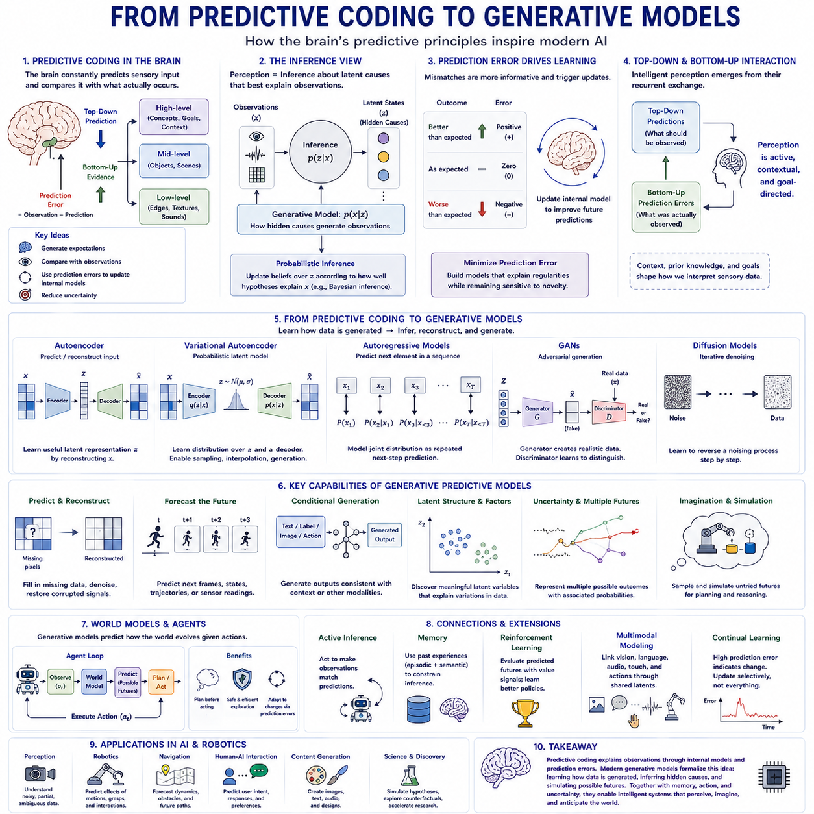{width="7.268055555555556in" height="7.268055555555556in"}

Predictive coding describes perception and cognition as an active process in which the brain continually generates expectations about incoming sensory information and compares those expectations with actual observations. Rather than processing every signal as entirely new, higher-level representations predict lower-level activity, while mismatches between prediction and observation produce prediction errors. These errors provide information for updating internal models and improving future expectations.

The central idea is that intelligent systems can reduce uncertainty by explaining sensory input through internal generative models. A generative model represents how hidden causes may produce observable data. Perception can therefore be viewed as an inference problem: given current observations, the system estimates the latent states or causes that most plausibly generated them. Prediction and perception become tightly connected because interpreting the present requires expectations about how sensory data should arise.

Hierarchical organization is important because predictions can operate at multiple levels of abstraction. Lower levels may represent edges, textures, sounds, or local motion, while higher levels represent objects, scenes, goals, or conceptual structure. Higher-level states generate expectations about lower-level patterns, and lower-level prediction errors provide evidence that can modify those higher-level interpretations. This creates a recurrent exchange between abstraction and sensory detail.

Prediction error provides the mechanism through which this hierarchy can adapt. If an observation closely matches expectation, relatively little corrective information is required. When an unexpected event occurs, the discrepancy becomes more informative and can trigger stronger updates. In computational terms, minimizing prediction error encourages the model to construct internal representations that account for regularities in the data while remaining sensitive to novel or surprising observations.

This principle connects naturally with probabilistic inference. An internal model can represent uncertainty over possible hidden states rather than committing immediately to one interpretation. Observations update these beliefs according to how well different hypotheses explain the evidence. Bayesian inference provides one formal framework for this idea, although predictive coding models may implement approximate forms of probabilistic reasoning rather than exact Bayesian computation.

The distinction between top-down prediction and bottom-up evidence is especially important. Bottom-up processing carries information from sensory observations toward higher representations, while top-down processing conveys expectations about what should be observed. Intelligent perception emerges from their interaction rather than from a purely feed-forward pipeline. This recurrent structure allows context, prior knowledge, and current goals to influence interpretation of ambiguous sensory information.

Generative models in machine learning adopt a related but broader computational objective. Instead of learning only a direct mapping from input to label, a generative model learns aspects of the probability distribution that produced the data. Once this distribution or an approximation to it is learned, the system can generate new samples, reconstruct missing information, estimate latent structure, or evaluate possible observations. This shifts AI from recognition alone toward modeling how data could be produced.

Latent-variable models provide one important implementation of this idea. Observed data are assumed to arise from underlying hidden variables that capture meaningful structure. A model can infer latent representations from observations and then use those representations to reconstruct or generate data. This separation between observed signals and hidden causes strongly resembles the predictive-coding idea that sensory input reflects deeper latent states of the environment.

Autoencoders provide a simple computational bridge. An encoder transforms high-dimensional observations into a compact latent representation, while a decoder reconstructs the original input. Training encourages the latent representation to preserve information necessary for reconstruction. Although ordinary autoencoders are not full probabilistic generative models, they illustrate how internal representations can be learned by predicting or reconstructing sensory input rather than relying only on externally provided labels.

Variational autoencoders extend this framework probabilistically. Instead of assigning each observation to one fixed latent vector, they learn distributions over latent variables. The decoder then models how latent states generate observations. Training balances reconstruction quality with regularization of the latent distribution, allowing meaningful interpolation and sampling. This creates a direct computational framework for learning hidden generative factors from data.

Autoregressive models provide another approach by factorizing complex data into sequences of conditional predictions. Each element is predicted from previously observed elements, allowing the model to represent a joint probability distribution through repeated next-step prediction. Language models are a major example, where predicting the next token from prior context leads to representations of syntax, semantics, factual associations, and long-range structure.

The success of autoregressive learning demonstrates the power of prediction as a general training signal. A system does not need explicit labels for every concept if the structure of the data itself provides targets. Predicting future tokens, frames, sensor readings, or actions can encourage the model to learn dependencies that support many downstream tasks. This connects predictive coding with self-supervised learning, where observations supervise predictions about other parts of the same data.

Generative adversarial networks introduced a different generative strategy based on competition between a generator and a discriminator. The generator attempts to produce samples resembling real data, while the discriminator tries to distinguish generated samples from actual examples. Through this adversarial interaction, the generator improves its ability to model complex data distributions. The learning mechanism differs from predictive coding, but the broader objective of constructing an internal process capable of generating plausible observations is related.

Diffusion models provide another powerful generative framework. They learn to reverse a gradual noising process that transforms structured data into noise. During generation, the model begins from noise and iteratively predicts how to remove corruption until a coherent sample emerges. This repeated denoising can be interpreted as a form of iterative inference in which the model continually refines an uncertain state toward one that better matches the learned data distribution.

Prediction is therefore not limited to forecasting the future. Generative models can predict missing information, denoise corrupted observations, reconstruct latent causes, estimate conditional distributions, or generate plausible alternatives. These different tasks share the principle that internal knowledge about data structure allows a model to infer what is likely given incomplete, uncertain, or noisy evidence.

Conditional generative models extend this ability by incorporating additional context such as class labels, text descriptions, images, sensor measurements, actions, or previous states. Instead of generating arbitrary samples, the model produces outputs consistent with the provided conditions. This is important for multimodal AI because information from one modality can constrain generation in another, such as generating images from language or predicting robot observations from actions.

Predictive models become especially important in temporal environments. A model can estimate future states from past observations and actions, allowing it to represent environmental dynamics rather than only static appearance. Video prediction, trajectory forecasting, sensor prediction, and sequence modeling all use this principle. Future prediction forces the model to capture which aspects of the current state are relevant for how the environment is likely to change.

World models extend generative prediction into an internal simulation framework for intelligent agents. A world model represents latent states and predicts how those states evolve when actions are applied. An agent can therefore evaluate possible futures without physically executing every candidate action. This creates a bridge between predictive processing, generative modeling, reinforcement learning, planning, and embodied intelligence.

In robotics and Physical AI, this capability is particularly valuable because real-world experimentation is costly and potentially unsafe. A robot equipped with a learned predictive model can simulate likely consequences of motion, manipulation, navigation, or interaction before acting. Prediction errors between expected and actual outcomes can then update the model, allowing it to adapt when terrain, objects, payload, dynamics, or environmental conditions change.

Active inference introduces a further connection between prediction and action. If an agent predicts desirable future sensory states, actions can be selected to make observations more consistent with those predictions. Under this perspective, action is not separate from prediction but participates in reducing discrepancy between expected and observed states. Although artificial implementations vary widely, the concept emphasizes a closed loop between internal models, perception, and behavior.

Uncertainty is essential because generative models often represent multiple plausible futures rather than a single deterministic outcome. The same current state may lead to several possible results depending on hidden factors or future actions. Probabilistic generative models can represent these alternatives, allowing agents to evaluate risk, ambiguity, and confidence. This is especially important for planning in dynamic or partially observable environments.

Multimodal generative models expand prediction across vision, language, audio, video, tactile information, and action. Shared latent representations can connect information that originates from different modalities, while cross-modal prediction provides a powerful learning signal. For example, language can predict visual structure, video can predict sound, and robot actions can predict future sensor states. Such models move toward integrated representations of events rather than isolated modality-specific features.

Memory also interacts strongly with generative prediction. Current observations may be insufficient to determine hidden state, so relevant previous experiences can constrain inference. Episodic memory can provide examples of similar situations, while semantic memory provides generalized knowledge. Generative models can then combine retrieved context with current observations to produce more accurate predictions about hidden causes or future states.

Prediction errors can support continual learning when environments change over time. Persistent discrepancies between expected and observed outcomes indicate that the internal model no longer matches current conditions. Rather than retraining everything continuously, a system can identify regions of high error and selectively update relevant components. This links predictive processing with anomaly detection, adaptive control, and efficient lifelong learning.

Generative models also provide a mechanism for imagination-like internal computation. By sampling possible latent states or future trajectories, a system can explore alternatives that have not yet occurred. These internal simulations can support planning, counterfactual reasoning, data augmentation, and strategy evaluation. Their usefulness depends on model accuracy because unrealistic generated futures can mislead downstream decisions.

The connection between predictive coding and modern generative AI should therefore be interpreted functionally rather than as a literal biological mapping. Predictive coding theories describe possible computational principles of neural processing, while VAEs, autoregressive models, GANs, diffusion models, and world models are engineered mathematical systems. They share themes of prediction, latent causes, uncertainty, reconstruction, and model-based inference, but their mechanisms differ substantially.

Evaluation of generative models must consider more than visual or linguistic plausibility. A model may produce convincing outputs while representing incorrect causal or physical relationships. For embodied applications, predictions should also be evaluated for temporal consistency, uncertainty calibration, physical validity, controllability, and usefulness for planning. A world model is valuable not merely when its outputs look realistic but when they support reliable decisions.

Ultimately, the bridge from predictive coding to generative models shows how the idea of explaining observations through internal predictions can become a broad computational paradigm. Prediction errors support learning, latent variables represent hidden causes, generative models reconstruct and create observations, and world models simulate possible futures. Combined with memory, action, and uncertainty, these mechanisms provide a foundation for AI systems that do more than recognize the present: they infer hidden structure, imagine alternatives, and anticipate how the world may evolve.

## 06.07 From Plasticity to Continual Learning [w/Code]

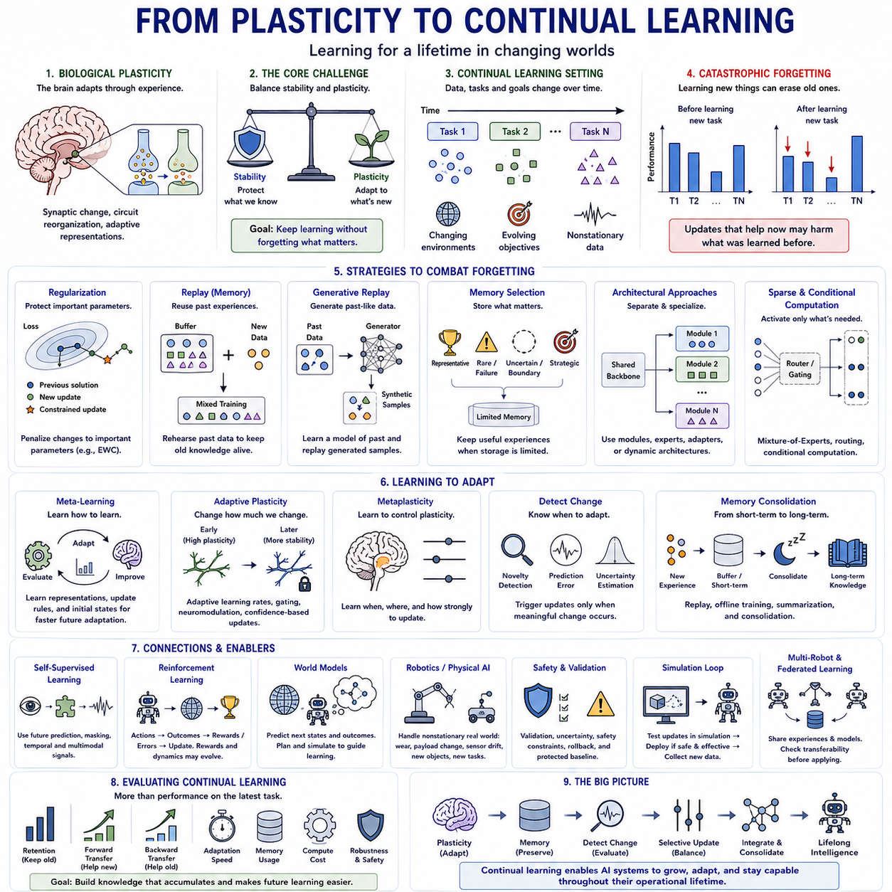{width="7.268055555555556in" height="7.268055555555556in"}

Neural plasticity refers to the capacity of biological nervous systems to modify their structure and function through experience. Synaptic strengths can change, neural circuits can reorganize, and representations can adapt as organisms encounter new environments, tasks, and information. This ability provides an important inspiration for continual learning in AI, where artificial systems must acquire new knowledge over time without repeatedly restarting training from the beginning.

Learning in biological systems is not simply the continuous replacement of old knowledge with new information. The nervous system must preserve useful capabilities while remaining sufficiently flexible to incorporate new experiences. This creates a fundamental tension between stability and plasticity. Stability protects previously acquired knowledge, whereas plasticity enables adaptation. Artificial continual learning faces the same basic challenge when model parameters must support both established capabilities and newly encountered tasks.

Conventional machine learning often assumes a relatively stationary training process. A model receives a predefined dataset, optimization is performed for many iterations, and the resulting parameters are then deployed. Continual learning changes this assumption by introducing sequentially arriving data, evolving tasks, changing environments, and potentially changing objectives. The learning system must therefore remain adaptive after deployment rather than treating training and operation as completely separate phases.

A major difficulty is catastrophic forgetting, which occurs when learning new information causes a neural network to lose previously acquired capabilities. Gradient-based optimization modifies parameters to improve performance on current data, but the same parameters may encode knowledge required for earlier tasks. If updates are performed without protecting important representations, new learning can overwrite old solutions, producing rapid degradation of previously successful behavior.

Biological plasticity suggests that learning should be selective rather than uniformly modifying every component of a system. Some neural connections may remain relatively stable, while others adapt strongly according to experience, context, novelty, or behavioral relevance. Continual-learning algorithms similarly attempt to determine which parameters, representations, memory elements, or modules should remain stable and which can be changed when new information arrives.

Regularization-based continual learning protects previous knowledge by constraining changes to parameters considered important for earlier tasks. Instead of preventing all adaptation, the learning process penalizes modifications that would strongly disturb established capabilities. Parameters with lower estimated importance remain more flexible. This creates a computational approximation of selective stability in which different parts of the model can exhibit different degrees of plasticity.

Elastic Weight Consolidation is a representative example of this strategy. After learning a task, the system estimates which parameters were particularly important for that task and discourages large changes to them during subsequent learning. New tasks can still modify less critical parameters. Although this mechanism is not a direct biological model, it demonstrates how parameter importance can regulate the balance between retaining previous knowledge and acquiring new capabilities.

Replay-based approaches address forgetting by preserving information from previous experiences and reintroducing it during later learning. A replay buffer may store selected examples, observations, trajectories, or task episodes. When the system learns from new data, older experiences are mixed into training so that optimization continues to receive evidence about previous tasks. This prevents the current data distribution from completely dominating parameter updates.

Generative replay reduces the requirement to preserve large quantities of raw historical data. Instead, a generative model learns aspects of previous data distributions and later produces synthetic examples representing earlier experiences. These generated samples can be combined with current observations during training. The approach connects continual learning with generative modeling because an internal model of past experience becomes a mechanism for preserving earlier capabilities.

Memory selection becomes important when storage is limited. A continual learner cannot necessarily retain every observation it has ever encountered, so it must decide which experiences provide the greatest future value. Representative examples, rare events, failure cases, boundary samples, uncertain observations, and strategically important episodes may deserve higher priority. Memory management therefore becomes part of the learning algorithm rather than a passive storage process.

Architectural approaches provide another strategy by allocating different computational resources to different tasks or knowledge domains. New modules, subnetworks, adapters, experts, or parameter groups can be introduced as learning progresses. This reduces interference because newly acquired capabilities do not always require extensive modification of previously established components. The challenge is controlling architectural growth while maintaining efficient knowledge sharing between modules.

Dynamic architectures can combine stability with specialization. Frequently reused representations may remain shared across many tasks, while task-specific components adapt more rapidly. Routing mechanisms can determine which modules should process particular inputs or contexts. Such systems resemble the broader principle that intelligent computation may benefit from heterogeneous components operating with different functions, learning rates, and degrees of plasticity.

Sparse activation can further reduce interference by ensuring that only a subset of the network participates strongly in each task or context. If different experiences activate partially distinct parameter groups, learning one capability is less likely to overwrite another. Mixture-of-experts architectures, conditional computation, and learned routing provide modern mechanisms for implementing this principle at large scale.

Meta-learning extends continual learning by asking a system to learn how to adapt. Instead of optimizing only for performance on individual tasks, training can shape representations, update rules, initialization states, or learning rates so that future adaptation becomes faster and less destructive. This shifts the objective from acquiring a fixed solution toward acquiring an effective learning process that can respond efficiently to unfamiliar situations.

Plasticity itself may also need to change over time. Early in learning, substantial adaptation can be useful because little knowledge has been established. Later, some representations may need to stabilize while other components remain adaptable. Adaptive learning rates, parameter-specific update rules, neuromodulatory signals, gating mechanisms, and confidence-dependent learning can provide different degrees of plasticity according to the state of the system.

The concept of metaplasticity captures this higher-order regulation. Rather than describing only changes in connection strength, metaplasticity concerns changes in the capacity or conditions for future plastic change. Computationally, this suggests that an AI system can learn not only model parameters but also when, where, and how strongly those parameters should be updated. Learning therefore becomes regulated by the history and importance of previous adaptation.

Task boundaries introduce another important distinction in continual-learning systems. Some experimental settings explicitly tell the model when one task ends and another begins, but real environments rarely provide such clean boundaries. An autonomous agent may instead experience gradual distribution shifts, unexpected situations, new objects, changing dynamics, or emerging objectives. Practical continual learning must therefore detect meaningful change from the data itself.

Distribution shift occurs when the statistical properties of incoming observations differ from those encountered during previous training. A robust continual learner should distinguish harmless variation from changes that require adaptation. Novelty detection, uncertainty estimation, prediction error, and out-of-distribution detection can provide signals indicating that existing representations no longer adequately explain the current environment.

Prediction error provides a natural connection between continual learning and predictive processing. Persistent disagreement between predicted and observed outcomes can indicate that environmental conditions have changed. Instead of updating the entire model after every unexpected event, the system can accumulate evidence, identify affected components, and selectively trigger adaptation. This can reduce unnecessary learning while preserving responsiveness to genuine change.

Continual learning is closely connected with memory consolidation. Newly acquired information may initially remain in rapidly adaptable representations or episodic memory before being integrated into more stable long-term knowledge. Replay, offline optimization, summarization, and parameter consolidation can gradually transform temporary experience into persistent representations. This separates rapid acquisition from slower structural learning and reduces immediate interference.

Self-supervised learning provides an important mechanism for continual adaptation because real-world systems cannot depend on manually labeled data throughout their operational lifetime. Future observations, masked information, temporal relationships, multimodal correspondence, and prediction targets can provide learning signals automatically. An embodied agent can therefore continue improving representations from its own stream of interaction even when explicit supervision is sparse.

Reinforcement learning adds another form of adaptation by connecting plasticity with behavioral consequences. Actions produce outcomes, outcomes generate rewards or prediction errors, and these signals determine which behaviors should change. In continual settings, however, the reward structure or environmental dynamics may themselves evolve. The agent must therefore preserve useful policies while adapting to new objectives, constraints, and operating conditions.

Continual learning is particularly important for robotics and Physical AI because physical environments are inherently nonstationary. Robot hardware wears, payload changes alter dynamics, sensors drift, lighting and weather vary, environments are rearranged, and new objects or tasks appear. A robot trained once and permanently frozen cannot easily accommodate these changes. Persistent autonomy therefore requires controlled adaptation throughout the operational lifetime.

Real-world robotic learning also imposes stricter safety requirements than many benchmark settings. An inappropriate update can degrade navigation, manipulation, balance, or collision avoidance. Continual adaptation should therefore include validation, confidence estimation, safety constraints, rollback mechanisms, and protected baseline controllers. Learning must improve capability without allowing unstable updates to compromise essential operational functions.

Simulation can provide a protected environment for evaluating proposed adaptations before deployment. New policies or model updates can first be tested against diverse simulated conditions, historical scenarios, and failure cases. Only changes satisfying predefined performance and safety criteria need to be transferred to the physical system. This creates a staged learning process connecting online experience, offline adaptation, simulation validation, and controlled deployment.

Multi-robot systems introduce another dimension because experience can be distributed across multiple agents. One robot may encounter terrain, objects, failures, or operational situations that others have not yet experienced. Shared memory and federated or distributed learning mechanisms can allow useful knowledge to propagate across the fleet. However, systems must determine whether experience from one embodiment or environment is transferable to another before applying updates.

Continual learning also requires mechanisms for evaluating whether adaptation actually improves the system. Performance on the newest task alone is insufficient because improvement may conceal degradation of earlier capabilities. Evaluation should therefore consider retention, forward transfer, backward transfer, adaptation speed, memory consumption, computational cost, robustness, and safety across the sequence of experiences encountered by the agent.

Forward transfer occurs when previously acquired knowledge accelerates learning of a new task. Backward transfer occurs when learning new information improves performance on earlier tasks. These effects represent a more ambitious objective than merely preventing forgetting. An effective lifelong learner should progressively construct reusable representations and skills so that accumulated experience makes future learning easier and ideally improves previously acquired capabilities.

The relationship between biological plasticity and artificial continual learning should be interpreted functionally rather than literally. Biological brains involve synaptic plasticity, structural change, neuromodulation, sleep, replay, homeostasis, and many interacting learning processes. Artificial systems use regularization, replay buffers, modular architectures, optimization algorithms, and external memory. The mechanisms differ, but both confront the need to adapt without destroying valuable existing knowledge.

Ultimately, the bridge from plasticity to continual learning reframes intelligence as an ongoing developmental process rather than a one-time optimization problem. Stable knowledge must coexist with adaptable representations, memory must preserve strategically useful experience, and learning mechanisms must respond selectively to meaningful change. Combined with prediction, memory, reinforcement learning, world models, and embodied interaction, continual learning provides a foundation for AI systems that can evolve throughout their operational lifetime.

## 06.08 From Neuroscience to AGI [w/Code]

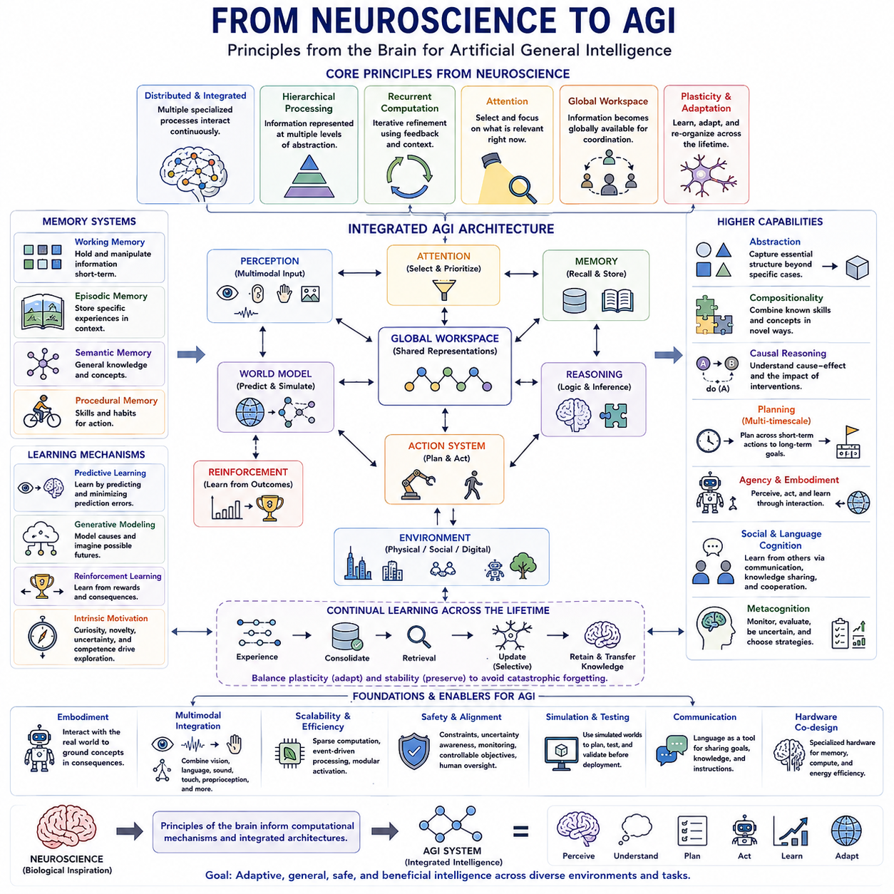{width="7.268055555555556in" height="7.268055555555556in"}

Neuroscience provides a valuable source of principles for thinking about Artificial General Intelligence because biological brains demonstrate flexible learning, perception, memory, reasoning, planning, and adaptive behavior within a single integrated system. AGI does not require copying the brain literally, but neuroscience reveals computational strategies for coordinating specialized processes while maintaining coherent behavior across changing tasks, environments, and timescales.

Human intelligence emerges from distributed networks rather than from one isolated cognitive mechanism. Perception, attention, memory, action, emotion, and decision making interact continuously through recurrent neural activity. This suggests that AGI may require an integrated architecture in which multiple specialized subsystems exchange information dynamically instead of relying on a single homogeneous model to perform every cognitive function in the same way.

Hierarchical processing provides one important bridge between neuroscience and AGI. Biological systems represent information across multiple levels, from sensory features and local patterns to objects, situations, concepts, goals, and abstract relationships. Artificial systems can similarly organize representations hierarchically so that low-level perception supports higher-level reasoning while high-level context influences how incoming information is interpreted.

Recurrent processing extends this hierarchy by allowing information to circulate rather than moving only through a feed-forward pipeline. The brain continuously revises interpretations as new sensory evidence, memories, expectations, and goals become available. AGI systems may benefit from comparable iterative computation in which intermediate hypotheses are evaluated, corrected, and refined before decisions or actions are finalized.

Attention provides a mechanism for allocating limited computational resources to information that is currently important. Biological organisms receive far more sensory and internal information than they can process equally at every moment. Selective attention prioritizes relevant signals according to goals, novelty, uncertainty, and context. Artificial attention mechanisms similarly allow models to dynamically emphasize useful information within large representations and long sequences.

Global workspace theories provide another useful architectural inspiration. Specialized processes can operate locally, while selected information becomes globally available to multiple cognitive systems. In artificial architectures, a shared workspace could allow perception, language, memory, planning, and action modules to exchange task-relevant representations. Such coordination may support flexible combinations of capabilities that were learned separately but must cooperate during complex problem solving.

Memory is essential because general intelligence requires more than processing the current input. Working memory maintains information needed for immediate reasoning, episodic memory preserves specific experiences, semantic memory represents generalized knowledge, and procedural memory supports learned skills. AGI architectures may similarly require multiple interacting memory systems rather than depending entirely on information compressed into fixed model parameters.

Memory retrieval must also be selective and context sensitive. An intelligent system should retrieve information that is relevant to the current problem while avoiding interference from unrelated experiences. Associative retrieval, similarity search, contextual cues, and learned memory access can provide mechanisms for reconstructing useful knowledge. External memory systems can further extend the effective knowledge available beyond the immediate context window of a computational model.

Learning from prediction provides another major connection. Predictive-processing theories propose that brains continually anticipate sensory input and update internal models when observations differ from expectations. Artificial systems can use prediction as a self-supervised learning signal, learning structure from language, images, video, sensor streams, and action sequences without requiring explicit human labels for every concept or situation.

Generative models extend predictive learning by representing possible causes, observations, or futures. Instead of recognizing only what is currently present, an intelligent system can reconstruct missing information, imagine alternatives, and simulate potential outcomes. This capability supports planning and counterfactual reasoning because the agent can evaluate possible situations internally before committing to actions in the external world.

World models provide a particularly important foundation for embodied AGI. A world model represents relevant entities, relationships, dynamics, and possible state transitions within an environment. By predicting how actions alter future states, an agent can plan through internal simulation. Such models connect perception with action because understanding the world includes understanding what can happen and how the agent can influence those outcomes.

Reinforcement learning contributes the ability to improve behavior from consequences. Reward prediction errors provide computational signals indicating whether outcomes were better or worse than expected. Combined with predictive models and memory, reinforcement learning allows agents to adapt policies according to experience. General intelligence, however, requires flexible objectives because useful behavior cannot be reduced to maximizing one permanently fixed reward function.

Intrinsic motivation offers mechanisms for learning when explicit external rewards are sparse. Curiosity, novelty, uncertainty reduction, information gain, and competence can encourage an agent to explore environments and acquire broadly useful knowledge. Such mechanisms may help AGI systems develop reusable representations and skills before a specific externally defined task requires them.

Neural plasticity highlights the importance of adaptation throughout an intelligent system\'s lifetime. Biological intelligence does not stop learning after an initial training period. Continual-learning systems similarly need to acquire new knowledge while retaining established capabilities. Avoiding catastrophic forgetting requires balancing plasticity for adaptation with stability for preservation, using mechanisms such as replay, consolidation, modularity, and selective parameter updates.

Meta-learning extends this idea from learning individual tasks to learning how to learn. An intelligent agent should use previous experience to improve the speed and effectiveness of future adaptation. Representations, learning rates, update mechanisms, exploration strategies, and memory policies can themselves become learned components. This allows accumulated experience to reshape not only what the system knows but also how it acquires new knowledge.

Compositionality is another important property of general intelligence. Humans can combine familiar concepts and skills in novel ways without relearning every combination independently. Artificial systems approaching AGI should similarly construct complex behaviors from reusable representations, procedures, and subgoals. Compositional architectures can improve generalization because knowledge acquired in one context can become a building block for unfamiliar problems.

Abstraction allows intelligence to operate beyond specific sensory examples. The brain can identify relationships and principles that remain useful across different situations. AGI requires representations that separate essential structure from irrelevant variation, enabling transfer across tasks, environments, modalities, and embodiments. Hierarchical representations and relational reasoning provide mechanisms for constructing increasingly general abstractions.

Causal reasoning extends beyond detecting statistical correlations. An intelligent agent operating in the world must understand how interventions can change outcomes and distinguish coincidence from mechanisms that support reliable action. Neuroscience does not provide a complete computational solution to causal intelligence, but active interaction with environments suggests that action, observation, and experimentation are important for constructing useful causal models.

Embodiment strengthens this connection because biological intelligence develops through continuous sensorimotor interaction. Perception and action are not independent processes: actions determine future observations, while sensory consequences modify subsequent behavior. Embodied AI applies this principle by allowing agents to learn concepts through interaction with physical or simulated environments rather than exclusively from static datasets.

Sensorimotor learning can ground abstract representations in consequences. Concepts such as distance, support, containment, resistance, reachability, and object permanence become meaningful when an agent observes how actions change the environment. Physical interaction therefore provides learning signals that complement language and visual data, potentially improving the connection between symbolic knowledge and real-world dynamics.

Multimodal integration is equally important because biological cognition combines vision, hearing, touch, proprioception, language, memory, and internal state. AGI systems should integrate multiple information sources into representations of common events and entities. Cross-modal prediction can strengthen these representations because each modality provides constraints that help interpret incomplete or ambiguous information in another.

Planning requires intelligence to operate across multiple timescales. Immediate sensorimotor control may require millisecond-level responses, while navigation, task execution, strategy, and long-term objectives unfold over progressively longer horizons. Hierarchical planning can organize these timescales by allowing high-level systems to establish goals while lower-level controllers translate them into executable actions.

Agency introduces a closed loop between goals, models, decisions, actions, and observations. An intelligent agent does not merely predict the world; it selects actions that change the world and then learns from the resulting consequences. This perception-action cycle distinguishes embodied agents from passive predictive systems and creates opportunities for active information gathering, experimentation, adaptation, and autonomous skill acquisition.

Social cognition provides another dimension of general intelligence. Humans learn from observation, communication, imitation, cooperation, and shared cultural knowledge. Artificial agents may similarly benefit from learning from humans and other agents rather than relying entirely on solitary trial and error. Language becomes particularly powerful in this context because it allows knowledge, goals, explanations, and procedures to be transferred efficiently.

Metacognition concerns the ability to evaluate one\'s own cognitive processes. An advanced artificial agent should estimate uncertainty, recognize insufficient knowledge, detect errors, evaluate alternative strategies, and decide when additional information is required. Such capabilities can improve reliability because the system does not need to treat every internal prediction or generated answer as equally trustworthy.

Safety becomes increasingly important as systems gain broader autonomy. Flexible learning and adaptation create possibilities for behavior that cannot be completely specified in advance. AGI architectures therefore require constraints, uncertainty awareness, monitoring, validation, controllable objectives, and mechanisms for human oversight. General capability without reliable control would not constitute a sufficient engineering solution for real-world intelligence.

Energy efficiency also provides an important lesson from neuroscience. Biological brains achieve remarkable adaptive capability under severe power and resource constraints. Future AGI systems may similarly need sparse computation, event-driven processing, modular activation, efficient memory access, and specialized hardware. Intelligence that scales only by continuously increasing computation may become difficult to deploy in autonomous and embodied systems.

No single neuroscience-inspired mechanism is likely to produce AGI independently. Attention without memory cannot maintain experience, memory without continual learning becomes static, prediction without action remains passive, and reinforcement learning without world models may require excessive interaction. The deeper lesson from neuroscience is integration: specialized mechanisms cooperate within a continuously adapting system.

This integration suggests an architecture in which perception constructs multimodal representations, attention selects relevant information, memory supplies prior experience, world models predict possible futures, reasoning evaluates alternatives, and reinforcement learning connects actions with consequences. Continual learning updates these components over time, while metacognition and safety mechanisms supervise uncertainty, adaptation, and execution.

The relationship between neuroscience and AGI should nevertheless remain scientifically cautious. Current understanding of biological intelligence is incomplete, and artificial neural networks are highly simplified abstractions rather than faithful simulations of brains. Neuroscience should therefore be treated as a source of computational principles, hypotheses, and architectural inspiration rather than as a blueprint that artificial intelligence must reproduce directly.

Ultimately, the bridge from neuroscience to AGI points toward intelligence as an integrated, adaptive, predictive, memory-rich, and action-oriented process. General intelligence requires systems that can learn continuously, transfer knowledge, construct abstractions, model possible futures, reason under uncertainty, and act toward changing goals. Combining these capabilities may provide a path from specialized AI toward increasingly general agents capable of learning and operating across diverse environments.

## 06.09 From Internal Models to AI World Models [w/Code]

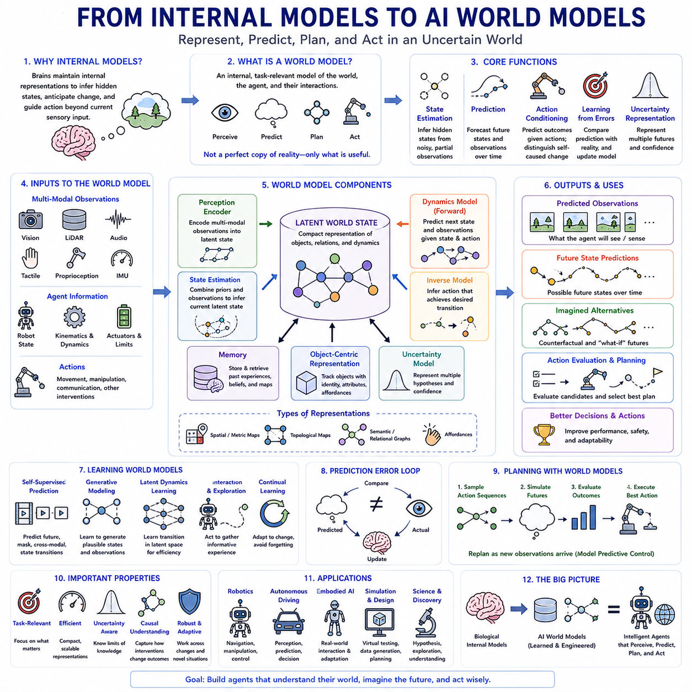{width="7.268055555555556in" height="7.268055555555556in"}

Internal models describe the brain's ability to maintain representations of the external world, the body, and ongoing interactions even when relevant information is not immediately available through the senses. Rather than responding only to current stimuli, an intelligent system can use accumulated experience to estimate hidden states, anticipate change, and evaluate possible outcomes. This principle provides a major conceptual bridge from biological cognition to AI world models.

An internal model does not need to reproduce every physical detail of reality. Its purpose is to preserve information that is useful for perception, prediction, decision making, and action. Biological organisms operate with limited sensory access and computational resources, so their representations must emphasize behaviorally relevant structure. AI world models similarly benefit from representing task-relevant states and relationships instead of attempting to reconstruct the entire environment with equal precision.

One important function of internal models is state estimation. Sensory observations are often incomplete, noisy, delayed, or ambiguous, while many important properties of the environment cannot be directly observed. An intelligent agent therefore combines current observations with prior knowledge and previous states to infer what is probably happening. AI systems implement related ideas through latent-state estimation, filtering, recurrent representations, probabilistic inference, and learned state-space models.

Latent representations are particularly useful because raw sensory data contain enormous amounts of detail. Images, LiDAR measurements, audio, tactile signals, and proprioception can be transformed into compact internal states that preserve information needed for prediction and control. A well-designed latent space can represent objects, geometry, motion, interaction possibilities, and uncertainty while reducing the computational burden associated with reasoning directly over raw sensor streams.

Internal models also support prediction across time. The current state contains information about what may happen next, but future outcomes depend on environmental dynamics and the agent's actions. A predictive model estimates transitions from one state to another, allowing the system to anticipate motion, object behavior, environmental change, and consequences of intervention. This temporal structure transforms a static representation into a model of an evolving world.

Actions are essential to world models because an autonomous agent does not merely observe its environment. It changes the environment through movement, manipulation, communication, and other interventions. An action-conditioned world model predicts how future states depend on both the current state and the selected action. This creates an internal representation of controllable dynamics and enables the agent to distinguish passive environmental change from consequences produced by its own behavior.

Forward models provide a classic example of this principle. Given the current state and an action, a forward model predicts the resulting next state or sensory consequence. In biological motor control, related mechanisms are associated with anticipating the effects of movement. In AI and robotics, forward models can predict robot motion, object displacement, contact outcomes, sensor observations, or changes in environmental state before the corresponding physical action is completed.

Inverse models address the complementary problem. Instead of predicting the consequence of an action, they estimate which action could produce a desired transition or outcome. Forward and inverse models can therefore cooperate: one proposes how actions transform states, while the other helps identify actions capable of reaching target states. Modern AI may implement these functions explicitly or learn them implicitly within policies, planners, and generative models.

Prediction errors allow internal models to improve through experience. After an action is executed, the predicted result can be compared with the actual observation. Differences reveal inaccuracies in the current representation of environmental dynamics. Repeated correction allows the model to adapt to unfamiliar objects, changing terrain, sensor drift, altered payloads, mechanical wear, or other conditions that make previous predictions less reliable.

Probabilistic world models extend prediction by representing uncertainty rather than assuming that every state transition has one deterministic outcome. Real environments contain incomplete information, stochastic events, hidden variables, and other agents whose future actions may be unknown. Representing multiple possible futures allows an AI system to estimate confidence, compare risks, and choose actions that remain useful across uncertain outcomes.

Partial observability makes memory essential. An agent rarely observes everything required to determine the complete state of its environment at one moment. Previous observations can therefore be integrated with current sensory evidence to maintain beliefs about hidden objects, locations, intentions, or dynamics. Recurrent networks, external memory, belief states, and temporal latent representations provide computational mechanisms for maintaining this continuity.

Spatial world models represent where entities exist and how they relate geometrically. Metric maps can encode distances and coordinates, topological representations can encode connectivity, and semantic maps can associate locations with objects or functional meaning. For embodied agents, these representations support localization, navigation, exploration, object search, manipulation, and reasoning about areas that are temporarily outside the current field of view.

World models can extend beyond geometry by representing semantic and relational structure. An agent may need to understand that an object is a container, that a door connects two spaces, that a tool can manipulate another object, or that particular regions impose constraints on movement. Graph representations, object-centric models, scene structures, and relational networks provide mechanisms for encoding such structured knowledge.

Object-centric world models attempt to represent environments through persistent entities rather than undifferentiated sensory features. Objects can possess identity, position, motion, attributes, affordances, and relationships with other entities. Maintaining object continuity across time can make prediction and reasoning more systematic because changes can be expressed as transformations of identifiable components rather than arbitrary changes in raw observations.

Affordances connect representation directly with possible action. An object is relevant not only because of its visual appearance but also because of what an agent can do with it. A surface may support placement, a handle may permit pulling, and an open region may permit navigation. World models that represent affordances can connect perception, physical constraints, task goals, and action planning within a common predictive framework.

Learning environmental dynamics can be performed in observation space or latent space. Directly predicting future images or sensor measurements preserves rich detail but can be computationally expensive and may devote capacity to irrelevant variation. Latent dynamics models instead predict changes in compressed representations. This can make long-horizon prediction more efficient when the latent variables retain information important for decision making.

Self-supervised learning provides a scalable way to train world models because temporal interaction naturally supplies prediction targets. A model can predict future observations, masked sensory information, state transitions, cross-modal signals, or consequences of actions without requiring manual labels for every sample. Large streams of video, robot trajectories, sensor logs, and interaction data can therefore become training material for learning environmental structure.

Generative modeling further expands world models by allowing multiple plausible states or futures to be produced. Autoregressive models, variational approaches, diffusion models, and other generative techniques can represent complex distributions rather than a single prediction. For world modeling, generation becomes useful when an agent must imagine alternatives, reconstruct unobserved information, or simulate possible trajectories before deciding how to act.

Planning emerges naturally when a world model can predict action-conditioned futures. The agent can generate candidate action sequences, simulate their possible consequences, evaluate predicted outcomes, and select a promising plan. Model predictive control repeatedly performs this process over a moving horizon, executing part of a plan and replanning when new observations arrive. This tightly couples internal simulation with real-world feedback.

Long-horizon planning introduces additional challenges because prediction errors accumulate over time. Small inaccuracies in early simulated states can produce increasingly unrealistic distant futures. Hierarchical world models can address this by representing dynamics at several temporal scales. Detailed short-term predictions may support immediate control, while abstract states, skills, or goals support reasoning over longer periods without simulating every low-level transition.

Counterfactual reasoning extends simulation beyond the future that actually occurred. An agent can ask what might have happened if a different action had been selected or if environmental conditions had been different. Such internal alternatives can support learning from failures, evaluating strategies, and improving decisions without physically repeating every possibility. Reliable counterfactual reasoning, however, requires models that capture relevant causal structure rather than surface correlations alone.

Causal world models seek to represent how interventions influence outcomes. Statistical prediction may identify patterns that are useful under familiar conditions, but autonomous agents frequently change the environment themselves. Understanding causal relationships can improve generalization when circumstances differ from training data. Interaction therefore becomes an important source of evidence because controlled actions help reveal which state changes are consequences of specific interventions.

In robotics and Physical AI, world models provide a bridge between multimodal perception and autonomous action. Cameras, LiDAR, radar, tactile sensors, proprioception, IMU, and other sources describe different aspects of the same physical environment. A shared internal state can integrate these signals, while predictive dynamics estimate how the environment and robot will evolve together after candidate actions.

World models can also incorporate the robot's own body. Effective prediction requires knowledge of kinematics, dynamics, actuator limits, contact conditions, energy constraints, payload, and sensor configuration. The internal model therefore represents not only the external environment but also the agent's embodiment. Changes in hardware or payload can alter predicted transitions, making adaptive body models important for robust physical intelligence.

Simulation and learned world models can complement each other. Physics simulators provide structured prior knowledge and controllable environments, while learned models can capture effects that are difficult to model analytically. Combining physical models with data-driven adaptation can improve prediction efficiency and generalization. The resulting hybrid models can exploit known constraints while learning residual dynamics and environment-specific behavior from experience.

World models also interact closely with reinforcement learning. Model-free reinforcement learning learns behavior primarily from experienced transitions, whereas model-based approaches use a learned or predefined dynamics model to evaluate possible futures. Internal simulation can reduce the number of costly physical interactions required for learning, making model-based methods particularly attractive for robotics where data collection can be slow, expensive, and risky.

Continual learning allows world models to remain useful as environments change. Persistent prediction errors can indicate that previously learned dynamics no longer explain current observations. New experience can then update selected components while replay and consolidation preserve established knowledge. This creates a world model that evolves throughout operation rather than remaining permanently fixed after initial training.

A useful world model must also know the limits of its knowledge. Uncertainty estimation can identify states where predictions are unreliable because the situation differs substantially from training experience. An autonomous system can respond by gathering additional information, reducing speed, selecting safer actions, requesting assistance, or switching to protected control mechanisms. Reliable uncertainty is therefore as important as prediction accuracy.

Evaluation should focus on usefulness for intelligence rather than generation quality alone. A visually convincing predicted future may still contain incorrect dynamics, impossible interactions, or misleading causal relationships. World models should therefore be evaluated for state accuracy, temporal consistency, physical validity, uncertainty calibration, controllability, planning performance, and robustness under distribution shift.

The relationship between biological internal models and AI world models is functional rather than literal. Neuroscience provides evidence that perception and action depend on prediction, state estimation, memory, and internal representations, but artificial world models use engineered mechanisms such as neural networks, state-space models, generative architectures, simulators, and external memory. The value of the analogy lies in shared computational principles rather than anatomical replication.

Ultimately, the bridge from internal models to AI world models transforms intelligence from reactive input-output mapping into predictive interaction with an evolving environment. A capable agent estimates hidden state, represents objects and relationships, predicts action-conditioned transitions, evaluates uncertainty, simulates alternatives, and updates its knowledge from prediction errors. Combined with memory, planning, reinforcement learning, and continual adaptation, world models provide a central foundation for autonomous and embodied intelligence.

## 06.10 From Cognitive Maps to Spatial AI [w/Code]

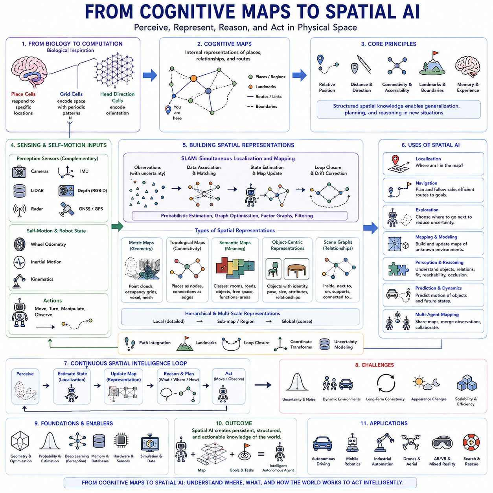{width="7.268055555555556in" height="7.268055555555556in"}

Cognitive maps describe internal representations that allow an organism to organize locations, routes, landmarks, boundaries, and relationships within an environment. Rather than storing navigation as a collection of isolated stimulus-response rules, a cognitive map provides structured knowledge about how places relate to one another. This concept offers an important bridge from biological spatial cognition to Spatial AI systems that perceive, represent, reason about, and act within physical space.

Spatial cognition requires more than knowing absolute coordinates. An intelligent agent must understand relative position, direction, distance, connectivity, accessibility, and the relationships between objects and regions. A useful spatial representation therefore combines geometric information with structural knowledge about the environment. This allows an agent to reason about locations that may not currently be visible and to select routes that have never been followed exactly before.

Research on the hippocampus and related brain systems has strongly influenced computational theories of spatial representation. Place cells are associated with particular regions of an environment, while grid cells exhibit spatially periodic firing patterns that can support representations of position and movement. Head-direction cells provide information related to orientation. Together, these mechanisms suggest that biological navigation depends on multiple complementary representations rather than a single universal spatial coordinate system.

Place-cell-like representations illustrate how specific locations can become associated with distributed neural activity. A particular pattern may become active when an organism occupies or recognizes a region, allowing experiences, objects, and events to become linked with spatial context. Artificial systems can use related concepts through learned spatial embeddings, landmark representations, map features, and latent states that encode where an agent is relative to its surroundings.

Grid-cell-inspired representations provide a different form of spatial coding. Their repeating geometric patterns have motivated computational approaches for representing position, displacement, and path integration efficiently across space. Artificial agents do not need to reproduce biological grid cells literally, but periodic and multiscale spatial representations can provide useful inductive biases for learning coordinate relationships, navigation structure, and transformations between locations.

Path integration estimates current position by accumulating information about self-motion over time. Biological organisms can use vestibular, proprioceptive, visual, and motor signals to estimate displacement even when external landmarks are temporarily unavailable. Robots perform related computations using wheel odometry, inertial measurement units, visual odometry, LiDAR odometry, and other motion estimates. Because integration errors accumulate, external observations are required to correct drift.

Landmarks provide reference points that help stabilize spatial estimates. Recognizable objects, geometric structures, visual features, or environmental boundaries can anchor an internal map and correct accumulated localization errors. Spatial AI systems similarly use feature matching, scan matching, visual recognition, GNSS, fiducial markers, or semantic landmarks to relate current observations to previously represented places.

Localization concerns estimating the agent\'s position and orientation within an existing representation of the environment. Mapping concerns constructing that representation from observations. When neither the map nor the agent\'s position is known accurately, the two problems become coupled. Simultaneous Localization and Mapping, or SLAM, addresses this interaction by estimating robot state while incrementally building and correcting a representation of the surrounding environment.

SLAM illustrates an important transition from biological inspiration to engineered Spatial AI. Sensor measurements contain uncertainty, motion estimates drift, observations may correspond incorrectly to map features, and environments may contain dynamic objects. Robust spatial estimation therefore requires continuous integration of multiple sources of evidence. Probabilistic filtering, graph optimization, factor graphs, visual-inertial estimation, and learned representations provide different mechanisms for solving this problem.

Loop closure is particularly important because an agent may return to a previously visited place after accumulating substantial localization error. Recognizing that the current location corresponds to an earlier location provides a constraint that can correct the entire estimated trajectory and map. This resembles the broader cognitive requirement of recognizing familiar places despite changes in viewpoint, time, illumination, or intervening experience.

Metric maps represent spatial relationships using measurable quantities such as coordinates, distances, and angles. Occupancy grids, point clouds, voxel maps, meshes, and geometric reconstructions provide different forms of metric representation. These maps are useful when precise motion planning, obstacle avoidance, manipulation, or physical measurement is required because they preserve detailed information about environmental geometry.

Topological maps represent environments primarily through connectivity rather than precise geometry. Locations or meaningful regions become nodes, while traversable relationships become edges. Such representations can support efficient reasoning over large environments because the agent can plan between meaningful places without maintaining detailed geometric information everywhere. Metric and topological maps can also be combined into hierarchical spatial representations.

Semantic maps add meaning to geometry and connectivity. Instead of representing only that a region is free space or that an object occupies certain coordinates, semantic mapping identifies entities and functional categories such as doors, corridors, tables, charging stations, roads, vegetation, or work areas. This allows spatial reasoning to incorporate what environmental elements are and how they may be relevant to goals.

Object-centric spatial representations extend semantic mapping by maintaining persistent identities for individual entities. An object can have position, orientation, dimensions, attributes, motion, relationships, and interaction possibilities. Tracking these properties across time allows an agent to reason about environmental changes and distinguish movement of an object from movement of the observer. Persistent object representations are therefore valuable for dynamic Spatial AI.

Scene graphs provide a structured mechanism for combining objects, regions, attributes, and relationships. Nodes can represent rooms, objects, agents, or landmarks, while edges encode relationships such as inside, adjacent to, supported by, connected to, or near. Spatial scene graphs can integrate geometric and semantic information into a representation that supports both navigation and higher-level reasoning.

Spatial AI must also represent three-dimensional structure. Autonomous systems operating in buildings, roads, industrial sites, natural terrain, or manipulation environments need information about surfaces, depth, height, traversability, obstacles, and free volume. Stereo vision, RGB-D cameras, LiDAR, radar, and learned depth estimation can provide complementary evidence for constructing 3D representations of the environment.

Bird\'s-eye-view representations provide another useful abstraction for embodied systems. Information from multiple cameras and other sensors can be transformed into a common spatial frame viewed from above. Objects, lanes, obstacles, free space, and predicted motion can then be represented consistently. BEV representations are particularly valuable for autonomous driving and mobile robotics because planning and control naturally operate in a ground-referenced spatial coordinate system.

Sensor fusion is essential because no individual sensing modality provides complete and reliable spatial information under all conditions. Cameras provide rich appearance and semantic information, LiDAR provides accurate geometric structure, radar can provide robust range and velocity measurements, and inertial sensors capture motion. Spatial AI combines these complementary signals to construct representations that remain useful when individual sensors become uncertain or degraded.

Coordinate transformations allow information from different sensors, times, and reference frames to be integrated consistently. A robot may reason simultaneously in camera coordinates, body coordinates, local map coordinates, and global world coordinates. Calibration and transformation between these frames are therefore fundamental. Learned spatial systems must also develop representations that preserve meaningful geometric relationships when viewpoints and poses change.

Spatial memory allows an agent to preserve knowledge about places beyond the current sensory field. An autonomous robot may remember where an object was observed, which corridor was blocked, where charging infrastructure is located, or which region has already been explored. Such memory transforms immediate perception into persistent environmental knowledge and enables planning over spaces larger than the current observation range.

Exploration introduces the problem of deciding where to gather new spatial information. When the environment is unknown, an agent must balance movement toward its task objective with actions that reduce uncertainty about the map. Frontier exploration, information gain, uncertainty reduction, and active perception provide mechanisms for selecting informative viewpoints and trajectories rather than passively accepting whatever observations happen to occur.

Active perception emphasizes that sensing quality depends on action. A robot can move to resolve occlusion, change viewpoint, approach an uncertain object, or reposition sensors to improve measurement. Spatial intelligence therefore forms a closed loop in which perception updates the map, the map identifies uncertainty, and action changes the observation conditions. This interaction is central to autonomous exploration and robust environmental understanding.

Navigation converts spatial representation into purposeful movement. A system identifies a goal, determines feasible routes, evaluates obstacles and constraints, and generates executable motion. Global planning may operate over maps and topological structures, while local planning responds to nearby geometry and dynamic obstacles. Effective Spatial AI integrates these levels so that abstract route selection remains compatible with immediate physical constraints.

Spatial reasoning extends beyond navigation. An agent may need to infer whether an object can fit through an opening, whether a location is reachable, whether one object blocks another, or where an unseen object is likely to be located. These tasks require geometric, relational, semantic, and sometimes physical reasoning. Spatial AI therefore connects mapping with broader world modeling rather than treating maps as passive navigation databases.

Dynamic environments introduce additional complexity because maps cannot always assume that the world is static. People, vehicles, robots, equipment, and movable objects change position over time. Spatial representations must distinguish persistent structure from transient state and may need to predict future motion. Dynamic mapping therefore connects spatial cognition with temporal prediction and action-conditioned world models.

Multi-agent systems can construct shared spatial knowledge by combining observations from several robots or sensors. Each agent may explore a different region and contribute local maps, detected objects, trajectories, or semantic information. Building a common representation requires map alignment, coordinate-frame estimation, data association, communication, and uncertainty management. Shared maps can substantially expand the spatial awareness of a robot fleet.

Spatial representations must remain adaptable because environments change. Construction, rearranged furniture, blocked passages, vegetation growth, temporary obstacles, and infrastructure modifications can make older maps inaccurate. Continual spatial learning allows an agent to identify meaningful changes, update affected regions, and preserve stable knowledge elsewhere. This prevents maps from becoming obsolete while avoiding unnecessary reconstruction of the entire environment.

Spatial AI increasingly combines explicit geometric methods with learned representations. Classical geometry provides strong constraints, interpretability, and physical consistency, while deep learning can recognize semantics, estimate depth, associate observations, and learn features robust to appearance changes. Hybrid systems can exploit both approaches, using geometric structure where reliable mathematical models exist and learned components where perception is difficult to specify manually.

World models broaden cognitive maps by representing not only where entities are located but also how they may change and interact. A spatial world model can encode geometry, objects, agents, affordances, dynamics, uncertainty, and action consequences within a common representation. This enables an autonomous agent to move beyond localization toward predicting what may happen at different places and how its actions could alter future spatial states.

For robotics and Physical AI, the transition from cognitive maps to Spatial AI is especially important because intelligent behavior must be grounded in physical space. Robots need persistent representations connecting perception, localization, mapping, prediction, planning, and control. Spatial intelligence allows sensor observations to become structured knowledge that supports safe movement, manipulation, exploration, collaboration, and long-term autonomy.

The relationship between biological cognitive maps and engineered Spatial AI should be understood functionally rather than literally. Biological navigation involves complex interactions among hippocampal, cortical, sensory, motor, and memory systems, while artificial systems use SLAM, neural networks, geometric optimization, spatial databases, and learned world models. Their implementations differ, but both address the challenge of maintaining useful spatial knowledge beyond immediate sensory input.

Ultimately, the bridge from cognitive maps to Spatial AI transforms spatial perception into persistent, structured, actionable knowledge. An intelligent agent must estimate where it is, represent what surrounds it, remember places beyond current observation, understand relationships between entities, predict spatial change, and plan actions through the environment. Combined with semantic understanding, world models, memory, and continual learning, Spatial AI becomes a fundamental capability for autonomous systems that must understand and operate within the physical world.
