**Volume 44 Neuroscience for AI**

# Chapter 07. Brain Memory and AI Memory

## 07.00 Memory System Overview

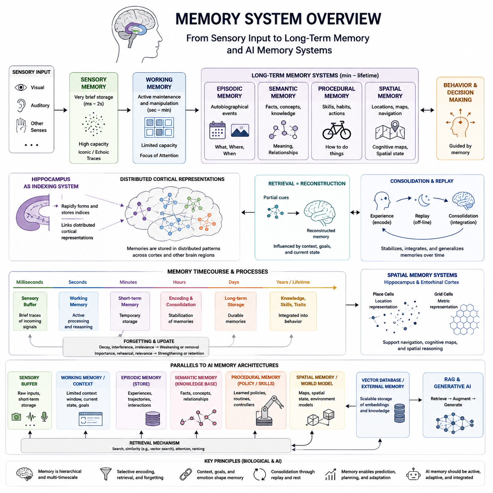{width="7.268055555555556in" height="7.268055555555556in"}

Memory is not a single storage mechanism but a coordinated system that allows biological intelligence to preserve information across multiple timescales and use past experience to guide present behavior. The brain continuously receives sensory signals, selects relevant information, maintains temporary representations, forms durable memories, and retrieves them when perception, reasoning, planning, or action requires prior knowledge.

A useful view of biological memory separates sensory memory, working memory, episodic memory, semantic memory, and procedural memory while recognizing that these systems interact continuously. Sensory memory briefly preserves incoming perceptual information, working memory maintains task-relevant representations, and long-term systems retain experiences, knowledge, skills, associations, and spatial relationships over much longer periods.

Sensory memory forms the earliest temporal buffer between the environment and higher cognitive processing. Visual, auditory, and other sensory traces can persist briefly after the original stimulus has disappeared, allowing the nervous system to integrate rapidly changing inputs into more stable perceptual representations. Rather than permanently storing everything, this mechanism provides a short-lived information reservoir from which attention can select behaviorally important signals.

Working memory provides a limited-capacity workspace in which information can be actively maintained and manipulated during ongoing cognition. It supports reasoning, language comprehension, planning, decision making, and sequential behavior by keeping relevant states available while other computations are performed. From an AI perspective, working memory resembles a dynamically managed context in which current observations, intermediate results, goals, and retrieved knowledge remain immediately accessible.

Episodic memory represents experiences as events situated within particular contexts, including information about what occurred, where it occurred, and often when it occurred. Such memories allow an organism to relate present situations to previous encounters rather than responding only from abstract knowledge. Episodic memory therefore provides an important foundation for experience-based prediction, contextual reasoning, mental simulation, and adaptive behavior in unfamiliar but structurally similar situations.

Semantic memory stores generalized knowledge that is not necessarily tied to a single remembered event. Concepts, categories, relationships, facts, meanings, and regularities can gradually become separated from the specific experiences through which they were acquired. This abstraction allows knowledge to be reused across situations and suggests an important distinction for AI between storing individual interaction histories and maintaining consolidated representations of general knowledge.

Procedural memory concerns learned skills and action patterns that can be executed without explicit reconstruction of every previous learning episode. Repeated experience can transform deliberate sequences into efficient behavioral routines, enabling actions to become faster and less cognitively demanding. For artificial agents and robots, an analogous distinction can be made between explicitly retrieving knowledge about an action and possessing a learned policy or controller that directly produces effective behavior.

The hippocampus plays a central role in the formation and organization of several forms of declarative memory, particularly episodic and relational memories. One influential computational interpretation treats the hippocampus as an indexing system that rapidly establishes associations among distributed cortical representations. Instead of storing every component of an experience independently, an index can provide access to the distributed neural activity patterns associated with a particular event or context.

Memory retrieval is therefore better understood as reconstruction than as reading an unchanged record from a fixed storage location. Partial cues can reactivate associated representations, while current goals and context influence which information becomes accessible. This property makes biological memory highly flexible, but it also means that retrieval can be incomplete or distorted. AI memory systems face related problems when selecting relevant information from large stores using imperfect queries and contextual signals.

Memory consolidation describes processes through which initially fragile representations become more stable and integrated with existing knowledge. Interactions between hippocampal and cortical systems are often considered important to this transformation, allowing rapidly acquired experiences to contribute gradually to distributed long-term representations. Consolidation illustrates that learning is not finished when information is first encoded; subsequent reorganization can determine what is retained, generalized, integrated, or forgotten.

Replay provides one possible mechanism for this continuing transformation. Patterns associated with previous experiences can be reactivated during periods when the original events are no longer occurring, supporting consolidation, learning, and potentially planning. This principle has strong parallels with experience replay in artificial learning systems, where stored transitions or trajectories are revisited to improve learning efficiency and reduce harmful interference between newly acquired and previously learned information.

Forgetting is also a functional component of memory rather than merely a system failure. A system that preserved every observation with equal strength would accumulate enormous amounts of redundant and outdated information. Biological memory selectively strengthens, reorganizes, and weakens representations according to experience and relevance. Effective AI memory similarly requires mechanisms for retention, compression, prioritization, updating, expiration, and removal rather than unrestricted accumulation of historical data.

Spatial memory demonstrates how memory can be organized around structured representations of environments. Research on hippocampal and related systems has identified mechanisms associated with locations, spatial relationships, navigation, and cognitive maps. Place cells and grid cells provide influential examples of neural representations that connect memory with spatial state. Such mechanisms are particularly relevant to embodied AI, autonomous robots, navigation systems, and world models operating in persistent environments.

Modern AI memory systems reproduce some functional aspects of biological memory without directly replicating their biological mechanisms. Neural network parameters provide slowly acquired distributed knowledge, context windows provide temporary computational state, external databases preserve persistent information, and retrieval mechanisms dynamically reactivate selected records. Vector databases extend this architecture by representing information in embedding spaces where semantically related memories can be located through similarity rather than exact symbolic matching.

Retrieval-Augmented Generation illustrates this separation between internal computation and external memory. Instead of requiring every relevant fact to remain encoded in model parameters, an AI system can retrieve information from an external knowledge store and incorporate selected evidence into its current context. This resembles biological memory only at a functional level: both systems benefit from separating persistent information storage from the limited active representations available during immediate reasoning and behavior.

The comparison also reveals important differences. Biological memories are deeply connected with perception, emotion, reward, bodily state, action, and continuous experience, whereas many current AI memory systems operate primarily on explicitly stored digital representations. Human memory can reorganize knowledge across years of interaction and use contextual cues that span multiple sensory and behavioral dimensions. Artificial systems often require engineered mechanisms for indexing, retrieval, ranking, updating, provenance, and consistency.

A more capable AI memory architecture can therefore be viewed as a hierarchy of interacting timescales rather than a single database. Immediate sensory buffers can preserve transient observations, working memory can maintain active goals and states, episodic stores can preserve experiences and trajectories, semantic stores can represent generalized knowledge, and learned policies can capture procedural competence. Retrieval and consolidation mechanisms can then move information between these functional layers according to relevance and repeated experience.

This perspective becomes especially important for autonomous agents and embodied AI systems that operate continuously rather than responding to isolated prompts. Such systems must remember previous locations, objects, people, actions, failures, successes, and environmental changes while distinguishing current state from historical experience. Memory becomes part of the perception--prediction--action loop, enabling an agent to interpret observations according to history and to anticipate consequences using knowledge accumulated over time.

Ultimately, neuroscience suggests that intelligent memory depends not simply on storing more information but on organizing information according to function, timescale, context, and future usefulness. The chapter structure therefore progresses from sensory and working memory through episodic, semantic, and procedural systems, then connects hippocampal indexing with vector databases, retrieval systems, spatial representations, cognitive maps, and consolidation through replay.

For AI, the central lesson is architectural: memory should operate as an active component of intelligence rather than as passive storage. A mature memory system must decide what to encode, what to preserve, how to represent relationships, when to retrieve information, how to integrate retrieved experience with current computation, and when knowledge should be updated or forgotten. These capabilities provide an essential bridge from neuroscience toward persistent, adaptive, context-aware artificial intelligence.

## 07.01 Sensory Memory

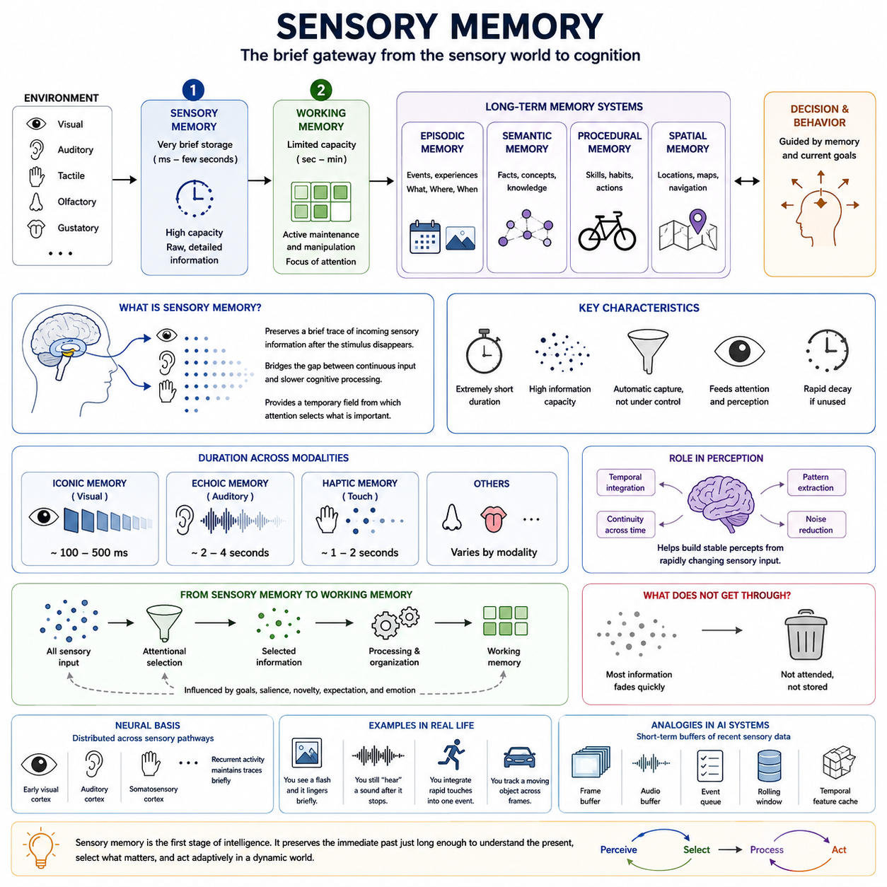{width="7.268055555555556in" height="7.268055555555556in"}

Sensory memory is the earliest stage of the memory system, preserving information from the environment for a very short period after sensory stimulation occurs. It acts as a temporary buffer between continuous sensory input and higher cognitive processing, allowing the brain to retain a brief trace of visual, auditory, tactile, and other signals even after the original stimulus has changed or disappeared.

The neuroscience structure places sensory memory at the beginning of the broader brain memory architecture, before working memory, episodic memory, semantic memory, procedural memory, hippocampal indexing, and memory consolidation. Its primary role is therefore not long-term storage, but the short-lived preservation of incoming information so that later processes have enough time to select, organize, and interpret what has just been perceived.

Without sensory memory, perception would consist of isolated instantaneous samples rather than coherent experiences extending through time. Visual scenes, speech, motion, and touch all evolve continuously, yet neural processing requires time to analyze them. A transient sensory trace bridges this gap by preserving recent input long enough for the nervous system to combine successive signals and construct more stable perceptual representations.

Different sensory modalities are associated with different forms of transient memory. Iconic memory refers primarily to short-lived visual information, while echoic memory refers to auditory traces that can remain available after a sound has ended. Related temporary traces also occur in touch and other sensory systems. These mechanisms differ in duration and representation because each sensory modality operates under different temporal and informational requirements.

Iconic memory provides a fleeting representation of the visual world. When the eyes move, objects change position, or an image disappears, recently received visual information does not vanish from processing immediately. Brief persistence supports the integration of rapidly changing visual signals and helps produce continuity across eye movements and scene transitions. It therefore contributes to the subjective experience of a stable visual environment despite constantly changing retinal input.

Echoic memory is particularly important for understanding speech and other temporally extended sounds. Spoken language unfolds sequentially, so earlier sounds must remain briefly available while later sounds arrive. This temporary auditory persistence allows the brain to integrate phonemes, words, rhythms, and acoustic patterns across time. Similar processing supports environmental sound recognition, music perception, communication, and the localization of changing auditory events.

Sensory memory typically has high information capacity but extremely short persistence compared with working memory or long-term memory. A large amount of sensory detail may briefly remain available, but most of it rapidly decays unless attention or task relevance promotes further processing. This combination of rich initial representation and rapid loss provides an efficient mechanism for coping with environments that generate far more information than cognition can actively maintain.

Attention plays a central role in determining which parts of transient sensory information proceed to deeper processing. The brain does not transfer every available sensory detail into working memory. Instead, signals associated with current goals, novelty, salience, expectation, or potential importance are preferentially selected. Sensory memory therefore provides a temporary information field from which attention can extract a limited subset for more sustained cognitive use.

This relationship illustrates an important distinction between availability and accessibility. Information may still exist briefly within a sensory representation even when it has not entered conscious awareness or active working memory. Attention can increase the probability that selected information becomes accessible for identification, comparison, decision making, or action. The rest may fade rapidly without becoming part of an explicit memory that can later be voluntarily recalled.

Sensory memory is also closely related to temporal integration. Neural systems often need to combine signals arriving over short intervals to distinguish meaningful patterns from noise. Motion perception, speech recognition, object continuity, and event detection all depend on integrating information across time rather than interpreting every instant independently. A brief memory of recent sensory states therefore contributes directly to the construction of meaningful perceptual events.

The mechanisms underlying sensory persistence are distributed across sensory pathways rather than being located in a single universal memory structure. Early and intermediate sensory regions can retain stimulus-related activity for short periods, while recurrent interactions and higher cortical processing can extend or modify those representations. Sensory memory should therefore be viewed as an emergent temporal property of perceptual processing rather than as a single anatomical storage location.

Prediction also influences what is retained and how incoming signals are interpreted. The brain continuously generates expectations about likely sensory input, and recent sensory traces provide evidence for comparing those expectations with current observations. This interaction can improve continuity and efficiency, particularly when sensory data are noisy, incomplete, or rapidly changing. Sensory memory thus participates in perception as an ongoing inference process rather than functioning only as passive storage.

Sensory memory differs fundamentally from working memory. Sensory memory preserves recently received information automatically and for very short durations, whereas working memory actively maintains a smaller amount of selected information for reasoning and task execution. Information that becomes behaviorally relevant can therefore move from transient sensory representation into a more persistent active state, forming a bridge between perception and cognition.

The transition is selective rather than a simple transfer of raw data. Sensory information may be filtered, compressed, categorized, and transformed before entering working memory. A visual input, for example, may begin as patterns of intensity and color but later become represented as an object, location, movement, or task-relevant event. Memory systems therefore interact with hierarchical perceptual representations rather than merely copying sensory signals from one storage layer to another.

For embodied intelligence, this short temporal buffering is especially important because perception and action occur continuously. A moving animal or robot must integrate camera images, sound, proprioception, inertial signals, touch, and other sensor streams while its body and environment are changing. Temporary retention of recent sensory states supports motion estimation, object tracking, sensor fusion, state estimation, and rapid reactions to events that cannot be understood from a single measurement.

Artificial systems implement similar functions through mechanisms such as frame buffers, rolling observation windows, short audio buffers, event queues, temporal feature caches, and recent sensor histories. These mechanisms are not biological sensory memory, but they serve a comparable computational purpose: preserving recent input long enough to support integration, filtering, inference, and state estimation before information is discarded or transferred into more persistent representations.

Computer vision provides a straightforward example. Processing a single image can identify spatial features, but many important properties become visible only across multiple observations. Motion direction, velocity, occlusion, object persistence, and temporal continuity require access to recent frames or intermediate representations. Short-term buffering allows an artificial perception system to compare current input with previous states and infer changes that are impossible to determine from an isolated frame.

Robotic systems face an even broader version of this requirement. Cameras may operate at one frequency, LiDAR at another, while IMUs generate measurements much more rapidly. Sensory buffering allows measurements captured at nearby times to be synchronized, aligned, and fused into a coherent estimate of the environment and robot state. Appropriate temporal windows are therefore essential for reliable perception in dynamic physical systems.

Event-based sensors demonstrate another useful analogy. Instead of storing complete frames at fixed intervals, event cameras generate asynchronous signals when local visual changes occur. Processing these events often requires temporary accumulation over carefully chosen time windows. The resulting representation preserves enough recent history to infer edges, motion, and structure while avoiding unnecessary storage of unchanged visual information, reflecting the broader principle of selective temporal persistence.

The engineering challenge is to determine how much sensory history should be preserved. Windows that are too short may lose critical temporal relationships, while excessively long windows can increase latency, computational demand, redundancy, and interference from outdated information. Effective designs therefore adapt buffering duration and resolution to the dynamics of each modality, task, environment, and downstream reasoning requirement.

Compression is also important because raw sensory streams can overwhelm storage and computation. Biological systems progressively transform signals into increasingly structured representations, while artificial systems can extract features, events, embeddings, objects, or state variables before retaining information beyond the immediate buffer. This reduces unnecessary detail while preserving aspects of experience most useful for prediction, recognition, control, or later memory formation.

Sensory memory also provides the first opportunity for deciding what should not be remembered. Most incoming information is transient, repetitive, or irrelevant to future behavior and should disappear quickly. Only a small subset contributes to working memory or longer-term representations. This selective loss is computationally valuable because an intelligent system must distinguish between information that merely occurred and information worth preserving for future use.

When sensory information is novel, important, strongly attended, or associated with significant outcomes, it has a greater chance of influencing longer-lasting memory systems. Through interaction with attention, working memory, hippocampal processing, and learning mechanisms, a transient observation can eventually contribute to episodic or semantic knowledge. The broader chapter structure explicitly develops these later stages after sensory memory, including working memory, hippocampal indexing, spatial memory, and consolidation.

Sensory memory therefore occupies a strategically important position at the boundary between the external world and internal cognition. It preserves the immediate past just long enough for the brain or artificial agent to determine what is happening now. By maintaining continuity across brief temporal gaps, it supports stable perception, attention, prediction, and action while preventing the entire sensory stream from becoming permanent memory.

For AI design, the main lesson is that intelligent memory begins before explicit long-term storage. A system needs mechanisms that preserve recent observations at appropriate temporal resolutions, coordinate multiple modalities, identify relevant changes, suppress redundant information, and promote selected signals into active processing. Sensory memory is therefore best understood as a dynamic temporal interface connecting perception with working memory, learning, decision making, and adaptive behavior.

## 07.02 Working Memory [w/Code]

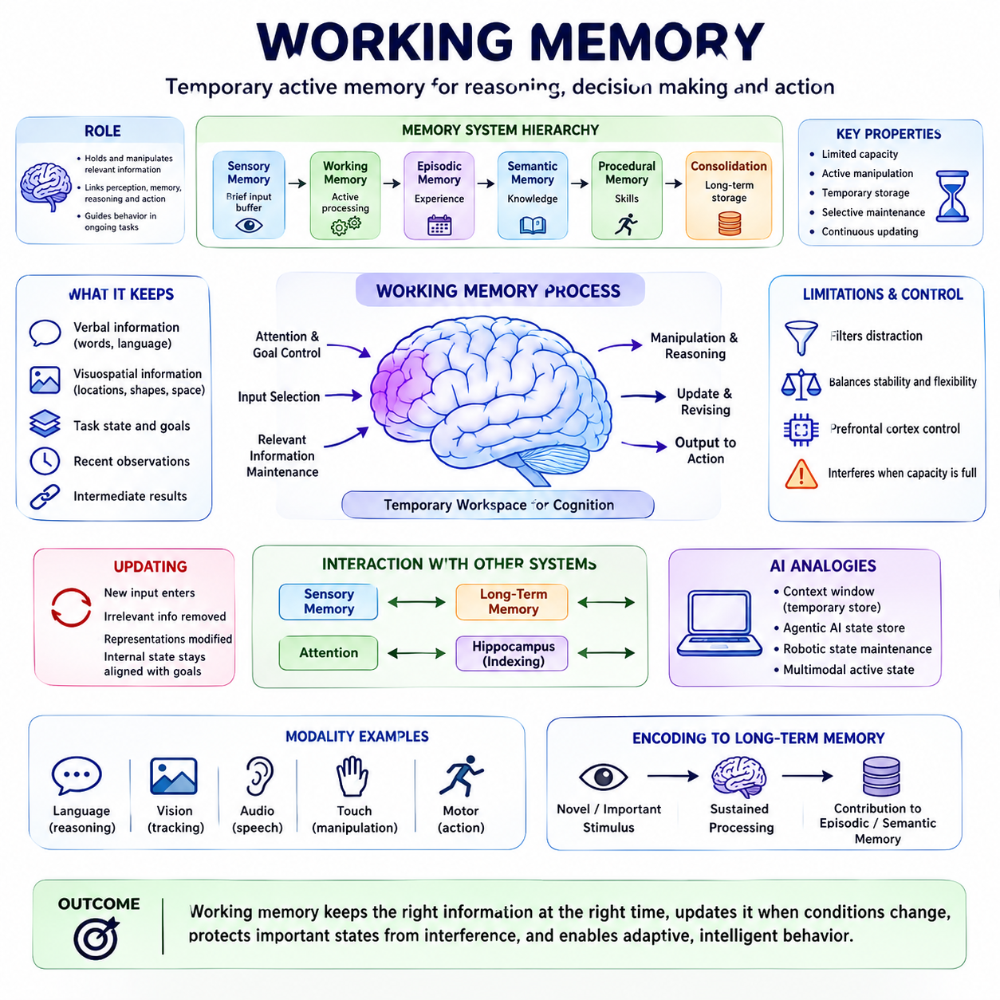{width="7.268055555555556in" height="7.268055555555556in"}

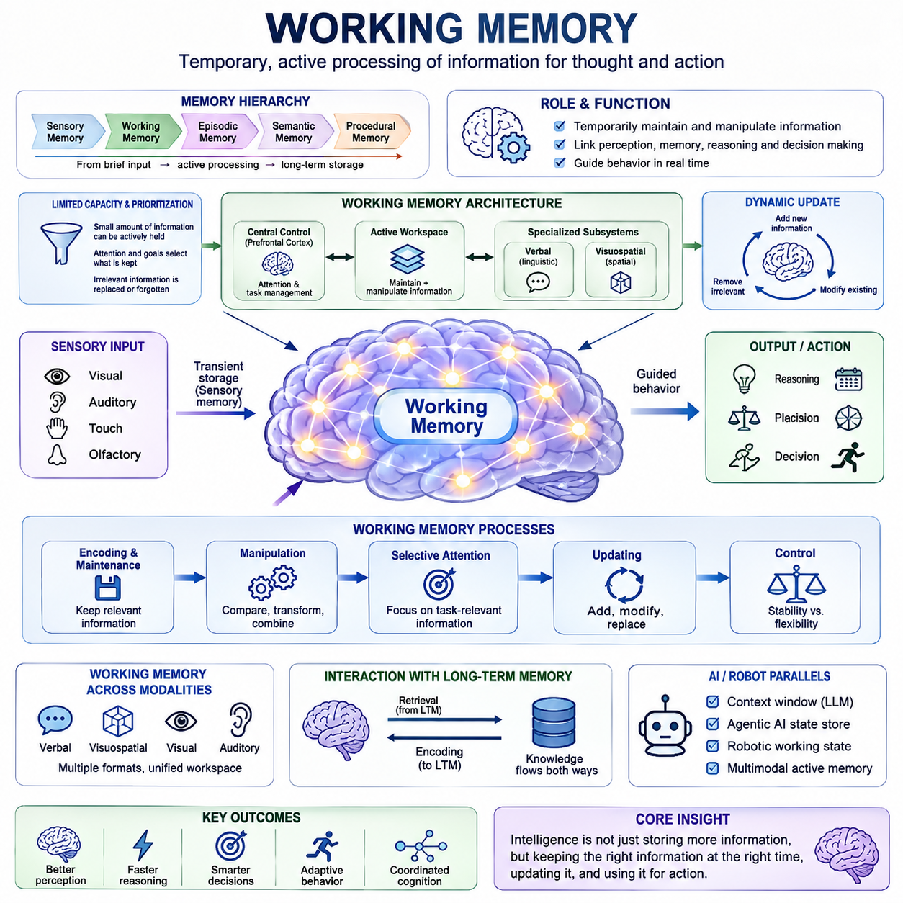{width="7.268055555555556in" height="7.268055555555556in"}

Working memory is the cognitive system that temporarily maintains and manipulates information needed for ongoing thought and behavior. Unlike sensory memory, which preserves incoming signals only briefly, working memory actively holds selected representations so that they can be compared, transformed, combined, or used to guide action. It therefore provides a temporary workspace linking perception, memory, reasoning, and decision making.

Within the broader brain memory architecture, working memory follows sensory memory and precedes longer-lasting forms such as episodic, semantic, and procedural memory. The chapter structure also connects working memory with hippocampal indexing, retrieval, spatial memory, and consolidation, emphasizing that it should not be viewed as an isolated storage component but as an active interface among multiple cognitive systems.

A defining property of working memory is its limited capacity. Only a relatively small amount of information can be actively maintained at one time, especially when the information is complex or unrelated. This limitation forces the cognitive system to prioritize what matters for the current task. Attention, task goals, expectations, and prior knowledge therefore strongly influence which representations remain active and which are displaced or forgotten.

Working memory differs from simple short-term storage because it involves manipulation as well as retention. Remembering a sequence of values for a few seconds is one function, but reorganizing those values, comparing alternatives, solving a problem, or updating an internal plan requires active computation over the retained information. Working memory is therefore better understood as temporary cognitive processing rather than as a passive holding area.

The prefrontal cortex is strongly associated with many working-memory functions, particularly when information must be maintained according to goals or rules. However, working memory is not located in a single brain region. Depending on the task, sensory, parietal, motor, and other cortical systems can participate in sustaining relevant representations. This distributed organization allows working memory to preserve task-specific information in forms closely related to perception and action.

Classic cognitive models describe working memory as containing multiple interacting components. A central control process coordinates attention and task demands, while specialized subsystems maintain different forms of information such as verbal or visuospatial content. Although such models are abstractions rather than literal anatomical maps, they emphasize that working memory combines storage, control, selective attention, and manipulation within a coordinated functional architecture.

Verbal working memory allows recently heard or internally generated linguistic information to remain available during comprehension and reasoning. Understanding a long sentence, following spoken instructions, performing mental arithmetic, or composing a response requires earlier words or intermediate results to remain active while later information is processed. Without this temporary persistence, complex language and sequential reasoning would fragment into disconnected moments.

Visuospatial working memory performs a comparable role for locations, shapes, orientations, trajectories, and spatial relationships. It allows an individual to maintain a temporary representation of where objects are located, how they are arranged, or how they might move. This function is important for navigation, mental rotation, visual search, planning physical actions, and reasoning about environments that cannot be perceived completely at a single moment.

Working memory is continuously updated rather than remaining static. New observations can enter, irrelevant information can be removed, and existing representations can be modified as the task progresses. This update process is essential because intelligent behavior requires the internal state to reflect changing circumstances. A system that retained outdated information without replacement would quickly become inconsistent with its environment and current goals.

Selective updating creates an important balance between stability and flexibility. Working memory must remain stable enough to protect useful information from distraction, yet flexible enough to incorporate meaningful changes. Excessive stability can prevent adaptation, while excessive updating can cause important goals or intermediate results to be lost. Cognitive control therefore regulates when representations should be preserved and when they should be replaced.

Attention and working memory are closely related but not identical. Attention selects information for enhanced processing, whereas working memory maintains selected information across time even when it is no longer directly available from the environment. Attention can also operate within working memory by prioritizing one active representation over others. Together, these mechanisms determine what information currently dominates cognition and influences behavior.

Working memory interacts extensively with long-term memory. Stored knowledge can be retrieved into the active workspace, where it is combined with current sensory information and task goals. Conversely, information repeatedly maintained or meaningfully processed in working memory can contribute to longer-lasting memory formation. Working memory therefore serves as an important meeting point between what is currently perceived and what has previously been learned.

The hippocampus can contribute when working-memory tasks require relational, contextual, or complex associative information, although many short-duration maintenance operations can depend primarily on cortical systems. This illustrates why divisions among memory systems are functional rather than absolute. The same task may recruit different neural mechanisms depending on whether it involves simple maintenance, relationships among items, spatial context, or integration with previous experience.

Interference is one of the major constraints on working memory. Similar representations may compete with one another, new information can displace older information, and irrelevant stimuli can consume limited processing capacity. Effective cognition therefore requires mechanisms for filtering distraction and protecting task-relevant states. These control processes become increasingly important as the complexity of reasoning or the number of competing goals increases.

Chunking helps reduce the effective burden on working memory by organizing multiple elements into meaningful higher-level units. Familiar patterns, concepts, or structures can be represented as a smaller number of integrated chunks rather than many independent details. Expertise often improves apparent working-memory performance because existing long-term knowledge allows complex information to be compressed into efficient representations rather than because biological capacity itself has dramatically increased.

Working memory also plays a central role in sequential planning. A person or agent must preserve current goals, intermediate states, constraints, and predicted consequences while evaluating possible next actions. As plans unfold, completed steps must be updated and future steps reconsidered. This makes working memory a fundamental component of reasoning systems that must maintain continuity across multiple cognitive operations rather than producing isolated responses.

Decision making similarly depends on maintaining relevant alternatives and their expected consequences. Values, risks, contextual signals, and current objectives may need to remain simultaneously accessible long enough to support comparison. When working-memory capacity is overloaded, decisions can become more dependent on simple heuristics or immediately salient information because fewer alternatives and relationships can be represented at the same time.

Working memory is especially important for embodied intelligence because physical interaction unfolds continuously. A biological organism or robot must maintain recent observations, current goals, estimated world state, ongoing actions, and expected outcomes while new sensory data continue arriving. Temporary internal representations allow the system to act according to more than the most recent sensor measurement and to preserve context across short periods of partial observation.

In artificial intelligence, the context window of a language model provides a useful but incomplete analogy to working memory. Tokens, retrieved documents, instructions, intermediate reasoning states, and conversation history can remain available during current computation. However, a context window is not equivalent to biological working memory because it lacks many of the adaptive control, selective maintenance, embodiment, and continuously regulated updating mechanisms present in cognitive systems.

Agentic AI systems often implement more explicit working-memory mechanisms. A temporary state store can maintain the current goal, plan, tool results, observations, unresolved questions, and intermediate conclusions. This information may be updated at each step while older or irrelevant details are compressed or removed. Such architectures make the distinction between active working state and persistent long-term memory much clearer than systems that simply accumulate an ever-growing interaction history.

Robotic systems provide another strong analogy. A robot can maintain a short history of object detections, estimated poses, navigation goals, task states, and recent actions while controlling behavior. These active representations support tracking, planning, manipulation, and recovery from temporary sensor loss. Working memory in this context becomes closely connected with state estimation and world modeling because the robot must maintain beliefs about conditions that are not continuously observable.

Multimodal working memory is particularly important for physical AI. Cameras, LiDAR, audio, force sensors, proprioception, and language instructions provide different types of information with different temporal characteristics. An intelligent agent must selectively maintain the aspects of each modality that remain relevant to the current task. Simply storing raw sensor data is insufficient; useful working memory requires structured, task-dependent representations that can support reasoning and control.

The architecture of artificial working memory therefore involves choices about representation, capacity, duration, update policy, and access. Some information may be stored symbolically as goals or task variables, while other information may remain as neural embeddings, object states, maps, or latent features. Effective systems often require several representational forms because language reasoning, spatial navigation, manipulation, and control depend on different types of active state.

Memory compression becomes important as tasks extend over longer sequences. If every intermediate observation remains active, the computational workspace becomes overloaded with redundant detail. Summarization, state abstraction, event extraction, and hierarchical representations can reduce this burden. The challenge is to remove information that is no longer useful while preserving dependencies that may become important later in reasoning or action.

A capable working-memory system must also know when to retrieve information from long-term memory. Current observations or goals can trigger access to episodic experiences, semantic knowledge, procedural skills, or spatial information. Retrieved material then enters the active workspace where it can influence reasoning and behavior. This interaction links working memory directly with the later chapter topics of hippocampal indexing, vector retrieval, RAG, and memory consolidation.

The distinction between working memory and long-term memory has major implications for AI system design. Frequently needed knowledge does not always need to remain permanently inside the active context, and current task state should not automatically become permanent memory. Instead, intelligent systems require controlled movement of information between temporary active representations and durable storage according to relevance, novelty, utility, and future retrieval value.

Working memory can therefore be understood as the operational center of moment-to-moment cognition. It integrates selected sensory input, retrieved knowledge, current goals, intermediate computations, and action-related information into a temporary state that can guide behavior. Its limited capacity is not simply a weakness; it creates pressure for attention, abstraction, prioritization, compression, and structured reasoning.

For AI, the central lesson is that intelligence requires more than storing large quantities of information. A capable agent must maintain the right information at the right moment, update it when conditions change, protect important states from interference, retrieve relevant knowledge when necessary, and remove information that no longer contributes to the task. Working memory provides the temporary computational foundation through which perception, memory, reasoning, planning, and action become coordinated over time.

## 07.03 Episodic Memory

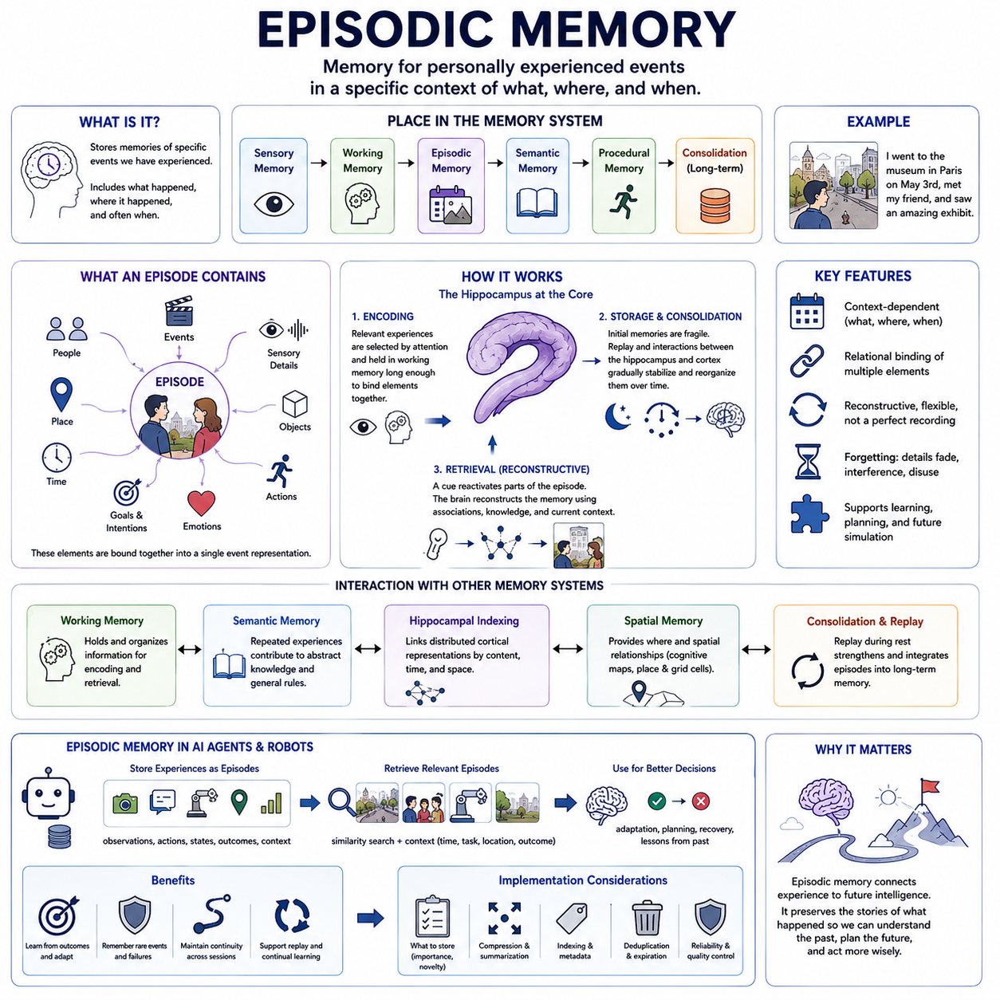{width="7.268055555555556in" height="7.268055555555556in"}

Episodic memory is the memory system that represents personally experienced events within a specific context. It preserves information about what happened, where it occurred, and often when it occurred, allowing past experiences to be reconstructed as distinct episodes rather than only as abstract facts. Within the chapter structure, it follows sensory and working memory as a major long-term memory form.

Unlike semantic memory, which stores generalized knowledge, episodic memory remains closely tied to particular experiences. Remembering that a city exists is semantic knowledge, whereas remembering a specific visit to that city is episodic. This distinction makes episodic memory especially important for experience-based reasoning because it preserves contextual details that can influence how a current situation is interpreted.

An episode typically combines multiple kinds of information into one event representation. Visual scenes, sounds, locations, actions, goals, emotional states, people, and temporal relationships may become associated with one another. This binding allows a partial cue to later reactivate a broader memory, so seeing a familiar place or object can trigger recollection of events that occurred around it.

The hippocampus plays a central role in forming and retrieving many episodic memories. It is often described as supporting relational binding among distributed cortical representations. Instead of storing an entire experience in one location, the brain can preserve different components across multiple cortical systems while hippocampal mechanisms help link those components into a retrievable episode.

This distributed organization helps explain why episodic retrieval is reconstructive rather than a literal replay of an unchanged recording. A cue can reactivate parts of a previous experience, and the brain reconstructs the event from available associations. Current goals, expectations, knowledge, and context can influence this process, which makes episodic memory flexible but also vulnerable to omission, distortion, and interference.

Temporal context is one of the defining features of episodic memory. Events are often remembered relative to other events rather than as perfectly precise timestamps. The brain can represent sequences, transitions, and temporal order, allowing experiences to be organized into narratives. This capability supports learning from the consequences of earlier actions and understanding how states evolve over time.

Spatial context is equally important. Episodic events often contain information about where an experience occurred and how objects or agents were arranged in the environment. This relationship connects episodic memory with spatial memory and cognitive maps, which are addressed later in the chapter through hippocampal indexing, place cells, grid cells, and spatial-state representations.

Encoding an episodic memory depends strongly on attention and significance. Not every experience becomes a durable episode. Events that receive sustained attention, contain novelty, relate to active goals, or carry important consequences are more likely to be encoded. Working memory contributes by maintaining relevant information long enough for relationships among objects, actions, locations, and outcomes to be integrated.

Consolidation gradually stabilizes episodic memories after initial encoding. Newly formed memories can be fragile and susceptible to interference, but interactions between hippocampal and cortical systems can strengthen and reorganize them over time. Replay is one proposed mechanism through which patterns associated with previous experiences are reactivated, helping integrate recent episodes with broader knowledge structures.

Episodic memories can also contribute to semantic memory. Repeated experiences may reveal stable patterns that become abstracted from their original contexts. After visiting many restaurants, for example, a person may acquire general knowledge about how restaurants operate without recalling every individual visit. In this way, episodic experience can provide raw material from which semantic knowledge is gradually generalized.

Forgetting is a normal part of episodic memory. Details may weaken, competing memories may interfere with one another, and experiences that are rarely retrieved may become difficult to reconstruct. This selective loss prevents the memory system from treating every event as equally important. It also supports abstraction by allowing specific details to fade while recurring structures and useful relationships remain influential.

Episodic memory is important for future-oriented cognition as well as remembering the past. Recombining elements of previous experiences can support mental simulation of possible future events. A person can imagine what might happen in a new situation by retrieving related episodes, extracting relevant relationships, and reorganizing them into a predicted scenario. Memory therefore contributes directly to planning and anticipation.

Decision making also benefits from episodic memory because previous outcomes can be compared with current situations. Instead of relying only on generalized rules, an agent can retrieve specific experiences that resemble the present context. This can be particularly useful when rare events, unusual failures, or context-dependent outcomes are poorly represented by general statistical knowledge.

In embodied intelligence, episodic memory allows an agent to remember interactions that occurred while operating in the physical world. A robot may need to remember where an object was previously observed, which route failed, what action succeeded, or how a person responded during an earlier interaction. These stored experiences can improve adaptation when similar situations are encountered again.

Artificial episodic memory can be implemented as a structured history of observations, actions, states, outcomes, and contextual metadata. Rather than storing only raw logs, an AI system can organize interactions into meaningful episodes containing task goals, environmental conditions, decisions, and results. Such event-centered organization makes later retrieval more useful than simply preserving a chronological stream of every sensor measurement.

Vector databases provide one mechanism for retrieving artificial episodes according to similarity. An episode can be represented using embeddings that summarize its semantic or multimodal content, while metadata preserves time, location, task, or outcome. A current situation can then be used as a query to locate related past experiences even when the new context does not exactly match the original stored data.

However, similarity alone is not sufficient for effective episodic retrieval. Time, causality, task relevance, spatial context, outcome quality, and reliability may all matter. A useful episodic memory system therefore requires indexing and ranking strategies that combine semantic similarity with structured contextual information. This parallels the chapter\'s later connection between hippocampal indexing, vector databases, and AI memory.

For AI agents, episodic memory is especially valuable when tasks extend across long periods or repeated interactions. An agent can preserve experiences that no longer fit inside active working memory and later retrieve them when relevant. This creates continuity across sessions and enables the system to use previous successes, failures, preferences, and environmental changes without keeping the entire interaction history permanently active.

Robotic applications make this requirement concrete. A mobile robot may store episodes describing navigation failures, obstacle encounters, localization uncertainty, charging events, docking attempts, or successful manipulation sequences. When a similar condition occurs again, retrieving the most relevant episodes can support recovery, planning, anomaly interpretation, and safer action selection.

Episodic memory can also support continual learning. Stored experiences provide examples that can be replayed during later learning, reducing the risk that new information completely overwrites previous capabilities. Episodes can be prioritized according to novelty, failure, uncertainty, or task importance, allowing learning systems to revisit experiences that contain especially useful information.

Effective artificial episodic memory therefore requires policies for what should be stored. Recording every observation indefinitely produces excessive redundancy and makes retrieval difficult. Systems need mechanisms for event segmentation, importance estimation, compression, summarization, deduplication, and expiration. The goal is not to preserve everything but to retain experiences that are likely to improve future reasoning or action.

An equally important question is how episodes should change over time. Some events may remain as detailed records, while others can be compressed or merged into generalized knowledge. Frequently repeated patterns may gradually contribute to semantic memory, while exceptional events remain individually accessible. This creates a functional division between remembering specific experiences and learning general regularities from those experiences.

Episodic memory therefore acts as a bridge between immediate experience and long-term adaptive intelligence. It transforms selected events into retrievable contextual records, links them through time and space, and makes them available for later reasoning, prediction, and planning. Its usefulness comes from preserving structured relationships rather than simply storing isolated sensory details.

For AI design, the main lesson is that intelligent agents need a memory of experience, not only a database of facts. A capable episodic system should encode meaningful events, preserve context, retrieve relevant experiences, connect actions with outcomes, support replay and learning, and gradually integrate repeated patterns into broader knowledge. These functions make episodic memory a key foundation for persistent and adaptive artificial intelligence.

## 07.04 Semantic Memory

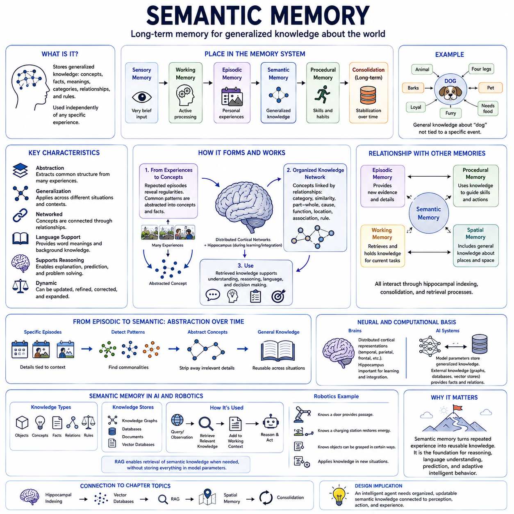{width="7.268055555555556in" height="7.268055555555556in"}

Semantic memory is the long-term memory system that stores generalized knowledge about the world, including concepts, facts, meanings, categories, relationships, and rules. Unlike episodic memory, which preserves specific personally experienced events, semantic memory represents knowledge that can be used independently of the original situation in which it was learned. It therefore provides a stable knowledge base for reasoning, language, and intelligent behavior.

Within the broader memory architecture, semantic memory follows sensory memory, working memory, and episodic memory as one of the major long-term memory systems. The chapter structure places it before procedural memory and later connects it with hippocampal indexing, vector databases, retrieval-augmented generation, spatial memory, and consolidation. This organization emphasizes that semantic knowledge emerges through interaction among multiple memory processes.

A central characteristic of semantic memory is abstraction. Repeated experiences often contain common structures that can be separated from the details of individual episodes. After encountering many examples of a category, a person can learn general properties that define or describe that category. Semantic memory therefore compresses numerous experiences into reusable representations that can support recognition, explanation, prediction, and reasoning across different situations.

This abstraction creates an important relationship between episodic and semantic memory. Episodic memory preserves specific experiences, while semantic memory captures regularities across experiences. A person may initially learn a fact within a particular event but later remember the fact without recalling the original episode. Over time, repeated experiences and consolidation can transform context-dependent memories into more generalized knowledge structures.

Semantic knowledge is not stored as isolated facts alone. Concepts are linked through networks of relationships such as category membership, similarity, part--whole structure, function, cause, location, and association. Activating one concept can therefore facilitate access to related concepts. This organization allows the memory system to move efficiently through connected knowledge rather than searching through independent records one by one.

Language depends heavily on semantic memory because understanding words requires access to their meanings and relationships. Comprehending a sentence involves more than retaining its words in working memory; the system must connect them with concepts, categories, prior knowledge, and contextual expectations. Semantic memory therefore provides much of the background knowledge required to interpret language and infer meaning beyond explicitly stated information.

Semantic memory also supports reasoning by supplying structured knowledge that can be combined with current observations. When a person encounters a new situation, generalized concepts and relationships can help identify relevant objects, predict likely consequences, and select appropriate actions. This reduces the need to solve every problem from scratch because previously learned regularities can be applied to situations that share similar structure.

The neural basis of semantic memory is distributed rather than confined to a single storage location. Different aspects of conceptual knowledge can involve multiple cortical systems depending on whether the information concerns objects, actions, language, sensory properties, or abstract relationships. Hippocampal mechanisms are particularly important during learning and integration, while increasingly consolidated knowledge can depend more strongly on distributed cortical representations.

Memory consolidation contributes to the gradual development of stable semantic knowledge. Information acquired through individual experiences can be reorganized, integrated, and generalized over time. Replay and repeated retrieval may strengthen common structures across experiences while reducing dependence on specific contextual details. This process illustrates how the brain can move from remembering individual events toward forming reusable conceptual knowledge.

Semantic memory is dynamic rather than permanently fixed. Concepts can be refined as new evidence becomes available, relationships can change, and inaccurate knowledge can be corrected or weakened. Effective semantic memory must therefore balance stability with plasticity. Knowledge should remain stable enough to support reliable reasoning while still allowing revision when new experiences reveal that previous assumptions are incomplete or incorrect.

In artificial intelligence, model parameters provide one partial analogy to semantic memory. During training, statistical regularities from large datasets become distributed across learned representations, allowing a model to reproduce facts, concepts, linguistic structures, and associations without retrieving the original training examples. This resembles generalized knowledge, although artificial neural parameters should not be treated as direct biological equivalents of cortical semantic memory.

External knowledge stores provide another form of artificial semantic memory. Knowledge graphs, structured databases, document collections, and vector databases can preserve facts and relationships independently of a model\'s internal parameters. Vector representations make it possible to retrieve conceptually related information through semantic similarity, while symbolic structures can preserve explicit relationships, provenance, and constraints that embedding-based representations may not capture clearly.

Retrieval-Augmented Generation extends this idea by allowing an AI system to retrieve semantic information from external memory when it becomes relevant to the current task. Retrieved knowledge can enter working context and participate in reasoning without requiring every fact to remain permanently encoded in model parameters. This creates a functional separation between long-term knowledge storage and the limited active information used during immediate computation.

For embodied AI and robotics, semantic memory can represent persistent knowledge about objects, places, affordances, tasks, people, and environmental rules. A robot may know that a door provides passage, a charging station restores energy, or a particular object can be grasped in specific ways even when it does not remember the original episode in which that knowledge was learned. Semantic knowledge therefore converts repeated interaction into reusable world understanding.

A mature AI memory architecture should connect semantic memory with episodic, procedural, spatial, and working memory rather than treating them as isolated modules. Episodes can provide new evidence, semantic memory can supply general knowledge, procedural memory can execute learned skills, and working memory can combine retrieved knowledge with current goals. The broader chapter structure develops these connections through hippocampal indexing, vector retrieval, RAG, spatial representations, and consolidation.

For AI design, the main lesson is that intelligence requires not only stored experiences but also generalized knowledge extracted from those experiences. Effective semantic memory should organize concepts, preserve relationships, support retrieval, integrate new evidence, and remain connected with perception and action. By transforming repeated experience into reusable knowledge, semantic memory provides one of the essential foundations for reasoning, language understanding, prediction, and adaptive artificial intelligence.

## 07.05 Procedural Memory

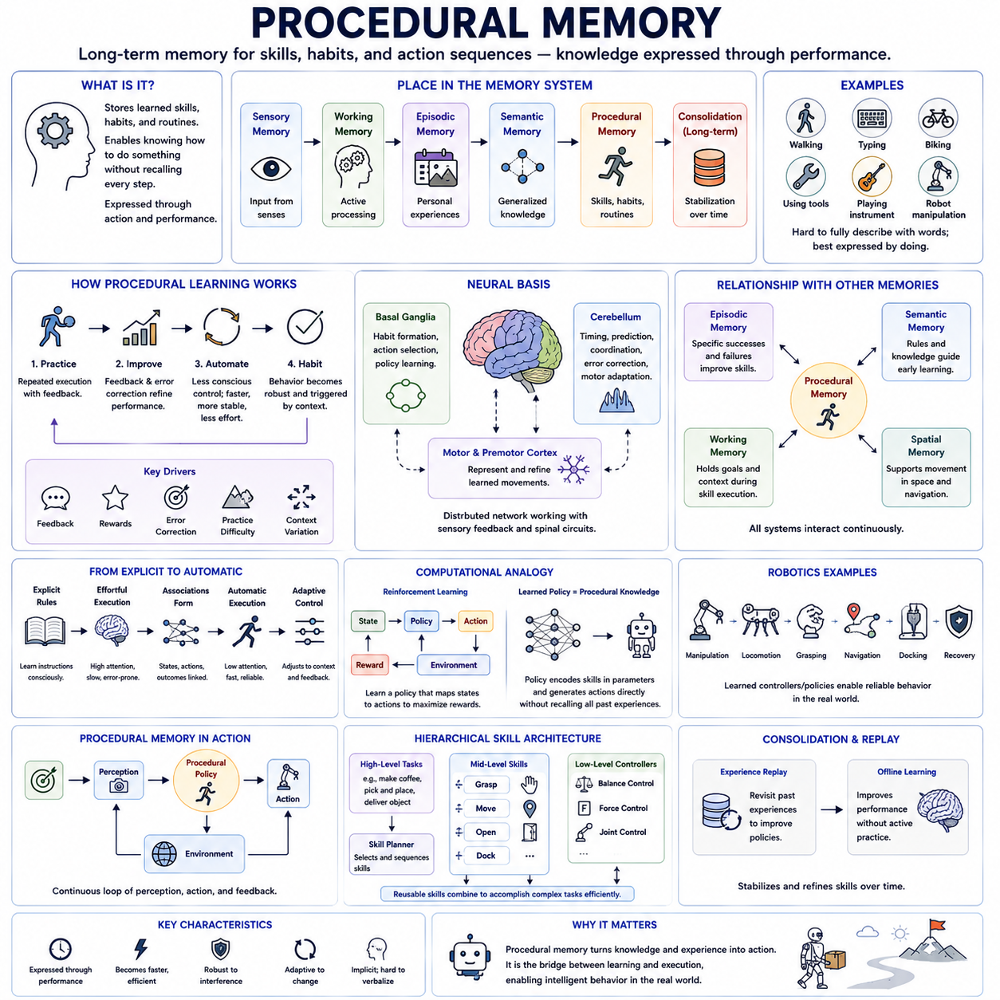{width="7.268055555555556in" height="7.268055555555556in"}

Procedural memory is the long-term memory system that supports learned skills, habits, action sequences, and behavioral routines. Unlike episodic memory, which preserves specific experiences, or semantic memory, which stores generalized knowledge, procedural memory is primarily expressed through performance. It enables an organism to know how to do something without consciously reconstructing every step or recalling the original learning episode.

Within the broader memory architecture, procedural memory follows sensory, working, episodic, and semantic memory as a distinct long-term memory function. The chapter structure places it before hippocampal indexing and later topics involving AI memory, spatial memory, and consolidation, emphasizing that procedural knowledge forms one part of an integrated memory system rather than an isolated mechanism.

Procedural memory becomes especially important when repeated practice transforms effortful actions into efficient routines. A beginner may initially perform a task by consciously monitoring each step, but repeated execution gradually reduces the need for explicit attention. The behavior becomes faster, more stable, and less cognitively demanding, allowing working memory to focus on other goals while the learned procedure continues automatically.

Common examples include walking, typing, riding a bicycle, using tools, playing a musical instrument, and performing practiced motor sequences. These abilities are difficult to describe completely through verbal rules because successful execution depends on timing, coordination, sensorimotor feedback, and continuous adjustment. Procedural memory therefore captures forms of knowledge that are expressed more effectively through action than through explicit explanation.

The neural basis of procedural learning involves several interacting brain systems rather than a single storage region. The basal ganglia are strongly associated with habit formation and action selection, while the cerebellum contributes to timing, prediction, coordination, and error correction. Motor and premotor cortical systems also participate in representing and refining learned movements, producing a distributed architecture for skilled behavior.

The basal ganglia are particularly important for gradually learning which actions should be selected in particular contexts. Repeated associations between states, actions, and outcomes can strengthen preferred behavioral patterns. With sufficient repetition, behavior may become less dependent on deliberate evaluation and more strongly controlled by established action tendencies, creating the functional transition from goal-directed behavior toward habitual performance.

The cerebellum contributes a complementary form of learning by supporting precise sensorimotor prediction and adaptation. When an action produces an unexpected result, error signals can guide adjustments in future movements. Repeated correction improves timing and coordination, allowing behavior to become increasingly accurate. This makes procedural learning closely connected with internal models, feedback control, and prediction.

Procedural memory does not require that every learned behavior become completely automatic. Skilled performance often combines automatic routines with higher-level control. A driver, athlete, or musician may execute familiar movements automatically while consciously adjusting strategy according to changing conditions. Procedural memory therefore supports efficient low-level execution while working memory and reasoning remain available for flexible supervision.

Practice is the primary mechanism through which procedural knowledge develops. Repeated experience strengthens useful action patterns and reduces variability in performance. However, effective practice is not simply repetition. Feedback, error correction, task difficulty, context variation, reward, and gradual refinement all influence what is learned. Procedural memory therefore emerges from interaction between action, consequence, and adaptation.

Reinforcement learning provides an important computational analogy. In reinforcement learning, an agent improves a policy by learning which actions produce desirable outcomes in particular states. Once learned, the policy can generate behavior directly without explicitly searching through all previous experiences. This resembles the functional role of procedural memory, although biological procedural learning involves richer neural mechanisms than a standard artificial reinforcement-learning algorithm.

A learned policy in artificial intelligence can therefore be interpreted as a form of procedural knowledge. Instead of storing explicit instructions for every possible situation, the policy maps observations or internal states to actions. Neural policies can encode complex behavioral regularities across many parameters, allowing robots or agents to execute learned skills without retrieving a symbolic description of each action sequence.

Robotics provides particularly clear examples of artificial procedural memory. Manipulation skills, locomotion patterns, grasping behaviors, navigation routines, docking procedures, and recovery actions can all be represented as learned controllers or policies. Once trained, these behaviors can be invoked when appropriate conditions occur, reducing the computational burden of generating every movement from first principles.

Procedural memory is closely connected with sensory feedback because physical skills must adapt continuously to changing conditions. A robot grasping an object may need to adjust force based on tactile feedback, while a walking robot must modify joint commands according to balance and terrain. The stored procedure therefore provides a behavioral structure, but successful execution still depends on current sensory information and state estimation.

This interaction distinguishes procedural memory from a rigid sequence of prerecorded commands. Effective procedures are often conditional and adaptive. The same skill may produce different motor outputs depending on context, object properties, body state, or environmental constraints. Procedural knowledge therefore represents not only action sequences but also policies for adapting actions to changing states.

Procedural and semantic memory can cooperate during skill learning. Early in training, a learner may rely heavily on explicit rules or instructions stored as semantic knowledge. With practice, some of these rules become embedded in action patterns that can be executed automatically. This transition reduces dependence on conscious reasoning and illustrates how different memory systems can contribute to different stages of learning.

Episodic memory can also support procedural improvement. Specific successes or failures can be remembered and later used to modify future behavior. Repeated experiences may reveal which actions work reliably, allowing individual episodes to influence policy refinement. Over time, detailed memories of individual trials may become less important as the resulting skill becomes encoded in a more stable procedural form.

Procedural memory is usually more resistant to conscious verbal inspection than semantic memory. A skilled person may perform an action accurately while being unable to explain every detail of how it is done. This property is important for AI because it highlights a distinction between systems that can describe a solution and systems that can execute it effectively. Declarative competence and behavioral competence are not necessarily identical.

For embodied AI, this distinction becomes central. A language model may explain how a robot should grasp an object, but successful manipulation requires a controller that converts perception and state estimates into coordinated motor commands. Procedural memory provides the layer through which abstract goals and semantic knowledge can become real physical behavior in a continuously changing environment.

Hierarchical skill architectures extend this idea by organizing procedures at multiple levels. Low-level controllers may manage balance, force, or joint motion, while higher-level skills represent behaviors such as grasping, walking, opening, or docking. A task planner can combine these skills into longer sequences. Such organization reduces complexity by allowing reusable procedures to serve as building blocks for more sophisticated behavior.

Skill reuse is one of the major advantages of procedural memory. Once a reliable procedure has been learned, it can be applied repeatedly and combined with other procedures. This reduces the need to relearn common behaviors for every new task. In AI and robotics, reusable skills can therefore improve sample efficiency, accelerate adaptation, and provide a foundation for compositional behavior.

However, procedural knowledge must remain adaptable. A policy that is optimized too narrowly for one environment may fail when hardware, object properties, dynamics, or task conditions change. Continual learning mechanisms are therefore needed to refine skills without destroying previously acquired capabilities. This connects procedural memory with the broader problem of stability and plasticity in adaptive AI systems.

Memory consolidation can also influence procedural learning, although the mechanisms differ from declarative memory consolidation. Performance can improve after periods without active practice, suggesting that offline processes may contribute to stabilizing learned skills. Repeated activation and refinement can gradually produce more efficient representations, reducing dependence on conscious control and making behavior more robust.

In artificial systems, experience replay can provide a related mechanism. Stored trajectories containing successful and unsuccessful actions can be revisited during training to improve a policy. Replay can increase data efficiency and help preserve previously learned behavior while incorporating new experiences. This creates a functional link between episodic storage of experiences and procedural refinement of policies.

Procedural memory should therefore not be understood as a separate repository containing fixed action scripts. It is better viewed as a distributed capability for transforming states, goals, and sensory information into effective action. Its representations are expressed through learned policies, controllers, habits, and coordinated sensorimotor patterns that can operate rapidly and with limited conscious supervision.

A mature AI memory architecture should integrate procedural memory with working, episodic, semantic, and spatial memory. Working memory maintains current goals, semantic memory provides general knowledge, episodic memory supplies relevant past experiences, spatial memory represents environmental relationships, and procedural memory executes learned behaviors. Their coordinated interaction enables an agent to convert knowledge and experience into practical action.

For AI design, the key lesson is that intelligence requires more than knowing facts or remembering experiences. An intelligent agent must also acquire reusable ways of acting. Procedural memory provides this capability by converting repeated interaction, feedback, and correction into efficient behavioral competence. It is therefore a fundamental bridge between learning and execution, and between internal knowledge and effective action in the physical world.

## 07.06 Hippocampus and Indexing [w/Code]

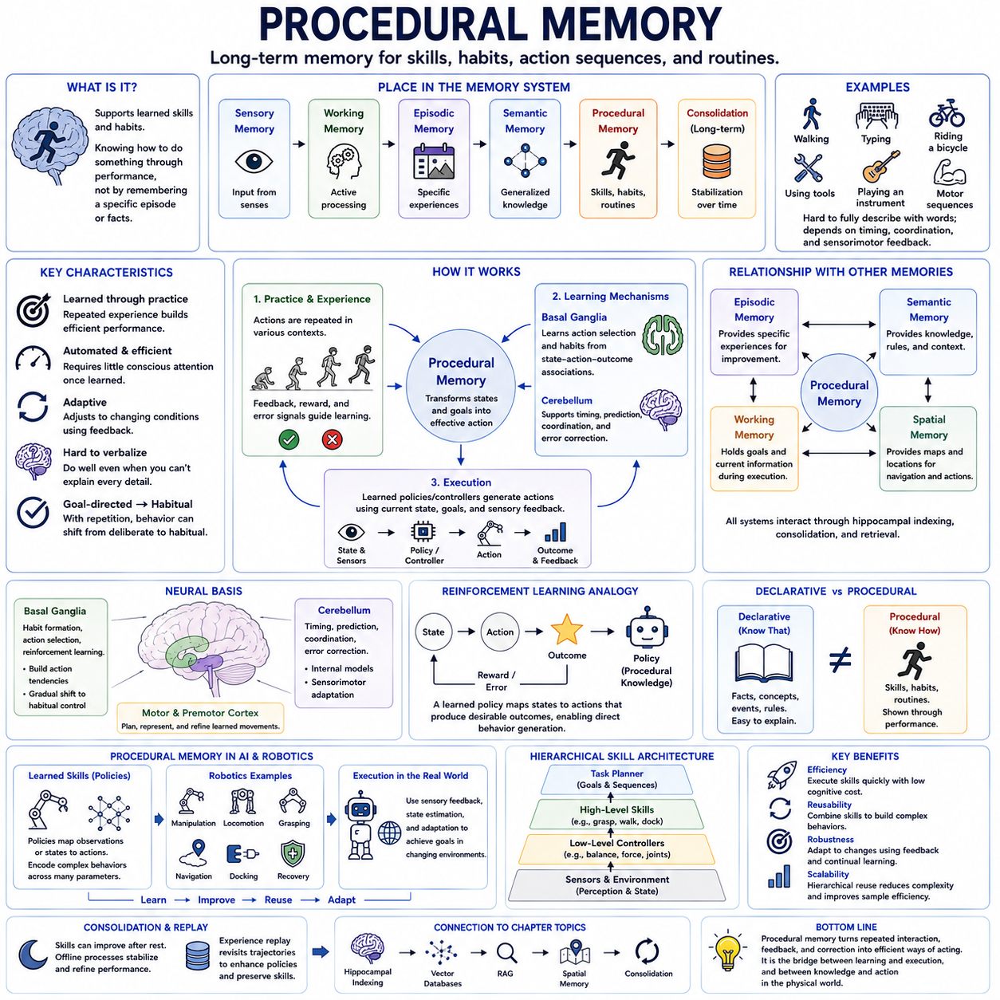{width="7.268055555555556in" height="7.268055555555556in"}

The hippocampus is a medial temporal lobe structure that plays a central role in forming, organizing, and retrieving memories of events and relationships. Rather than functioning as a simple storage container, it helps connect distributed information about objects, places, actions, time, and context. This coordinating function allows separate components of an experience to become linked into a coherent memory that can later be reconstructed.

A useful way to understand hippocampal function is through the concept of indexing. Information belonging to an experience is represented across many cortical regions, while the hippocampus establishes an associative index that links these distributed representations. Later, a partial cue can activate the hippocampal index, which helps reactivate the broader cortical pattern associated with the original experience.

Hippocampal indexing addresses a fundamental problem in memory architecture. A single event may contain visual features, sounds, spatial relationships, language, goals, actions, and emotional significance, yet these components are processed by different neural systems. The hippocampus provides a mechanism for binding these distributed elements without requiring them to be permanently copied into one centralized representation.

This mechanism is particularly important for episodic memory because an episode is defined by relationships among multiple elements. Remembering an object alone is different from remembering where it was encountered, what happened around it, and what followed afterward. Hippocampal processing helps preserve these relational structures so that an event can later be retrieved as a contextualized experience rather than as disconnected fragments.

Encoding begins when currently relevant information is selected from perception and working memory. The hippocampal system receives highly processed representations rather than simply recording raw sensory signals. Relationships among these representations can then be associated with a particular event or context. Attention, novelty, task relevance, and existing knowledge influence which information becomes strongly incorporated into a retrievable memory trace.

Retrieval reverses part of this process. A current cue may correspond to only a small portion of a previous experience, but hippocampal associations can help recover related information. This capability is often described through pattern completion, in which partial input activates a more complete stored representation. It allows a familiar place, object, person, or situation to trigger recollection of a broader event.

Memory systems must also distinguish similar experiences rather than merging them incorrectly. Pattern separation supports this requirement by creating sufficiently distinct representations for experiences that share many features. Two visits to the same location, for example, may involve nearly identical visual surroundings but different actions and outcomes. Distinguishing such episodes reduces interference and supports accurate context-dependent retrieval.

Pattern separation and pattern completion create complementary requirements. Encoding benefits from separating similar experiences so that they do not overwrite one another, whereas retrieval benefits from reconstructing a stored experience from incomplete evidence. Effective memory therefore requires a balance between preserving distinctions and recognizing similarity, a problem that is equally important in biological cognition and artificial memory architectures.

The hippocampus is also strongly associated with spatial representation. Experiences occur within environments, and memory frequently depends on relationships among locations, objects, routes, and actions. Hippocampal representations interact with broader navigation systems to organize spatial context. This connection provides a foundation for later discussions of cognitive maps, place cells, grid cells, and spatial memory in intelligent agents.

Temporal organization is another important dimension of hippocampal memory. Experiences unfold as sequences rather than isolated states, and remembering an event often requires knowledge of what happened before and after particular moments. By preserving relationships among sequential states, hippocampal mechanisms contribute to temporal context and allow memories to represent transitions, trajectories, and ordered events.

Hippocampal memory is therefore closely related to prediction. If a current situation resembles an earlier episode, retrieving the associated sequence can provide information about what may happen next. Past trajectories can guide expectations about future states and consequences. Memory becomes more than retrospective storage in this framework; it provides structured evidence that supports anticipation, planning, and adaptive decision making.

The hippocampus does not operate independently of the cortex. Newly encoded memories initially depend strongly on interactions between hippocampal and cortical systems. Through repeated reactivation and consolidation, relationships represented during experience can become increasingly integrated into distributed cortical knowledge. This allows some information to become less dependent on the original hippocampal index as generalized long-term knowledge develops.

This relationship helps connect episodic and semantic memory. Specific episodes can initially retain rich contextual information through hippocampal indexing, while repeated experiences reveal common structures that can gradually contribute to semantic knowledge. The memory architecture therefore supports movement from particular experiences toward generalized concepts without requiring every individual event to remain permanently available in full detail.

Replay provides one possible mechanism for strengthening these relationships. Patterns associated with previous experiences can be reactivated when the original event is no longer occurring. Such reactivation can reinforce important associations, support consolidation, and integrate new experiences with existing knowledge. Replay also provides a useful conceptual connection to experience replay mechanisms used in reinforcement learning and continual learning systems.

For artificial intelligence, hippocampal indexing suggests that long-term memory does not require placing every stored detail inside the active computational context. Instead, experiences can remain in external or persistent storage while compact indexes enable relevant information to be located when needed. The active reasoning system then operates on retrieved information rather than continuously carrying the entire history of previous experience.

Vector embeddings provide one computational analogy to memory indexes. An event, document, observation, or multimodal experience can be converted into a representation that captures important characteristics. Similarity search can then identify stored items related to a current query. This resembles cue-based retrieval in a limited functional sense, although biological hippocampal indexing involves relational and temporal mechanisms that are richer than simple vector similarity.

Vector databases extend this approach by storing embeddings together with associated content and metadata. Time, location, task identity, agent state, outcome, confidence, and other contextual variables can accompany each memory. Retrieval can therefore combine semantic similarity with structured filters and ranking criteria, producing a more context-sensitive memory system than nearest-neighbor similarity alone.

Retrieval-Augmented Generation provides another important connection. A language model or intelligent agent can use its current context to generate a retrieval query, access external information, and incorporate selected results into working memory. The external store functions as persistent memory, while the retrieval mechanism serves as an index connecting current cognition with relevant long-term information.

However, effective artificial indexing must address more than retrieval accuracy. The system must decide what should become a memory, how experiences should be segmented, what metadata should be attached, how duplicate memories should be handled, and when outdated information should be removed. These decisions determine whether a memory architecture remains useful as stored experience grows over long periods.

Event segmentation is especially important for embodied agents. Continuous sensor streams do not naturally arrive as clearly separated memories. A robot may therefore need to identify boundaries associated with changes in goals, locations, interactions, failures, successes, or environmental conditions. Each meaningful segment can then become an indexed episode containing observations, actions, states, and outcomes.

Multimodal indexing is required when memories contain information from cameras, LiDAR, audio, proprioception, language, maps, and actions. A useful memory index must connect these heterogeneous representations so that one modality can retrieve information associated with another. A spoken instruction, for example, might retrieve a previous visual scene, spatial location, action sequence, and resulting outcome.

For robotics, such indexing can support long-duration autonomy. A robot encountering localization failure could retrieve previous episodes from the same area, while a manipulation system could retrieve earlier attempts involving similar objects. A mobile agent could remember previously blocked routes, charging locations, docking conditions, or unusual environmental changes without maintaining all previous observations in active memory.

Indexing also enables memory to interact with planning. A current goal can retrieve relevant episodes, semantic knowledge, spatial information, and previously successful procedures. These retrieved memories can be assembled in working memory and used to evaluate possible actions. Memory retrieval therefore becomes part of an active perception--reasoning--planning loop rather than a separate archival operation.

A mature AI memory architecture may use multiple complementary indexes. Semantic embeddings can support conceptual similarity, structured metadata can support precise filtering, temporal indexes can organize sequences, spatial indexes can represent location, and relational structures can preserve connections among entities and events. Combining these mechanisms provides richer retrieval than relying on one universal similarity measure.

The hippocampal analogy also highlights the importance of selective storage. Biological memory does not permanently preserve every sensory sample, and artificial agents should not indiscriminately store everything they observe. Novelty, uncertainty, task relevance, failure, reward, and future utility can guide memory selection. Efficient indexing begins with deciding which experiences are sufficiently valuable to preserve.

The broader principle is that intelligent memory depends on relationships rather than isolated records. Experiences become useful when an agent can connect current cues with relevant past contexts, recover associated information, distinguish similar situations, and integrate retrieved knowledge with present goals. Hippocampal indexing provides a biological model for organizing this relationship between distributed storage and selective retrieval.

For AI design, the key lesson is to separate persistent memory from active cognition while connecting them through efficient, context-sensitive indexes. Episodic records, semantic knowledge, spatial representations, and procedural information can remain distributed across specialized stores, while retrieval mechanisms dynamically assemble relevant information into working memory. This architecture allows an intelligent agent to remember selectively, reason efficiently, and adapt its behavior using experience accumulated over time.

## 07.07 Vector Database and AI Memory [w/Code]

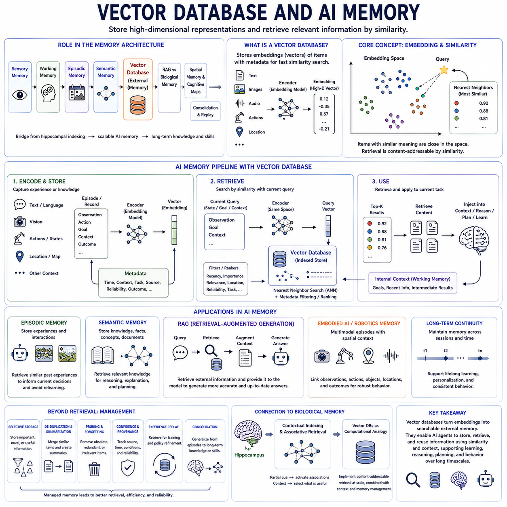{width="7.268055555555556in" height="7.268055555555556in"}

Vector databases provide an external memory mechanism for AI systems by storing high-dimensional representations that preserve semantic relationships among observations, documents, experiences, objects, and other information. Instead of locating data only through exact identifiers or keywords, they enable retrieval according to similarity in an embedding space, making them useful for memory systems that must recover relevant information from partial or approximate cues.

Within the broader memory architecture, vector databases appear after hippocampal indexing and before the comparison between retrieval-augmented generation and biological memory. This placement establishes a bridge from biological principles of contextual indexing and associative retrieval toward computational mechanisms for scalable AI memory. Later sections extend this bridge toward spatial memory, cognitive maps, and consolidation.

The central representation used by a vector database is an embedding, a numerical vector produced by an encoder that captures important properties of its input. Text, images, audio, robot observations, actions, locations, or multimodal episodes can be transformed into embeddings. Inputs with related meanings or characteristics tend to occupy nearby regions of the learned representation space, allowing similarity to become a practical retrieval signal.

This representation differs fundamentally from conventional exact-match storage. A relational database may retrieve a record because a field exactly matches a specified value, while vector search can retrieve an experience because its representation resembles the current situation. This property makes vector memory content-addressable: the system can search using what the current state means rather than requiring the precise address at which related information was originally stored.

An AI memory pipeline therefore begins with encoding. Information from language, vision, actions, sensors, location, and other contextual sources can be transformed into an episode representation. The embedding captures semantic or multimodal characteristics, while associated metadata can preserve information such as time, context, task, source, reliability, and outcome. The attached memory architecture explicitly connects these representations with vector-based storage.

Storage requires more than saving the embedding itself. Useful AI memory normally preserves the original content or a reference to it together with metadata describing when and under what circumstances the information was acquired. This separation is important because the vector primarily supports retrieval, whereas the associated record contains the richer information needed for reasoning, explanation, planning, or subsequent learning.

When a new query arrives, the current observation and context are encoded into the same or a compatible representation space. The system then compares this query vector with stored vectors and identifies nearby candidates. Similarity measures such as cosine similarity or distance metrics provide numerical estimates of representational closeness, enabling memories to be ranked according to their relationship with the current situation.

Large memory collections make exhaustive comparison expensive, so practical vector databases use indexing methods designed for efficient nearest-neighbor retrieval. Approximate nearest-neighbor search can dramatically reduce search cost while preserving useful retrieval quality. This enables an AI agent to search millions or potentially much larger collections of representations without comparing the query individually with every stored memory.

Semantic similarity, however, should not be treated as equivalent to relevance. Two memories may be conceptually similar while differing in time, task, environment, reliability, or outcome. Effective AI memory therefore combines vector similarity with contextual constraints and metadata filtering. Retrieval may additionally consider recency, importance, confidence, task relevance, spatial proximity, or previous usefulness.

This combination resembles the functional idea of contextual indexing discussed in relation to hippocampal memory. A partial cue can activate associated information, but context determines which association is useful. Vector databases provide an engineering mechanism for implementing content-addressable retrieval, yet they should be regarded as a computational analogy rather than a direct reproduction of hippocampal biology.

Vector databases are particularly suitable for artificial episodic memory. A robot or AI agent can encode individual interactions as records containing observations, actions, goals, environmental conditions, and outcomes. When a similar situation occurs later, the current state becomes a retrieval query, allowing related experiences to be recovered and incorporated into current reasoning instead of requiring the agent to relearn the situation from scratch.

They can also support semantic memory by indexing documents, concepts, facts, summaries, and structured knowledge. In this role, vector retrieval provides access to generalized information rather than individual experiences. The same underlying technology can therefore participate in different functional memory systems depending on what is stored, how records are organized, and how retrieved information is subsequently used.

Working memory and vector-based long-term memory perform complementary roles. Working memory maintains current goals, recent observations, and intermediate results, while an external vector store can preserve information far beyond the active context. When relevant information is required, retrieval transfers selected memories back into the working context, allowing a limited active workspace to operate over a much larger persistent memory.

This separation is especially important for language models because context windows are finite. Simply extending conversation history indefinitely increases computational cost and introduces irrelevant information. A memory architecture can instead extract significant information, store it externally, and retrieve only the subset relevant to the current request. This turns memory management into a process of selective encoding, storage, retrieval, and forgetting.

Retrieval-Augmented Generation uses this principle by retrieving external information before or during generation. A query is encoded, relevant records are located, and selected content is inserted into the model\'s active context. The model can then generate an answer using both its parameterized knowledge and retrieved external information. The chapter structure intentionally places vector databases immediately before RAG versus biological memory.

AI memory nevertheless extends beyond conventional document-oriented RAG. Persistent agents may store conversations, decisions, plans, failures, successful strategies, environmental observations, tool results, and task histories. Retrieval can then support continuity across long interactions and repeated sessions. In this broader architecture, a vector database becomes one component of an adaptive memory system rather than merely a document search engine.

Embodied AI introduces additional requirements because memories may contain multimodal and spatial information. A robot can associate visual observations, language instructions, proprioceptive states, actions, object identities, locations, and outcomes within a common episode. Multimodal embeddings and structured metadata can then enable retrieval from different cues, such as finding a previous manipulation experience from an object observation or task instruction.

Spatial context can be particularly valuable for robotic memory. A memory may be semantically relevant but useless if it belongs to another environment or physical configuration. Location, map region, robot pose, object position, or environmental state can therefore participate in filtering and ranking. This creates a natural connection from vector-based AI memory to the chapter\'s subsequent treatment of spatial memory and cognitive maps.

Memory quality also depends on what the system chooses to store. Recording every observation creates redundancy, increases storage requirements, and can reduce retrieval precision. Event segmentation, novelty detection, importance estimation, summarization, and deduplication can determine which experiences deserve persistent storage. Selective encoding therefore becomes as important as retrieval itself.

Forgetting and pruning are similarly necessary. Memories can become obsolete, redundant, unreliable, or irrelevant as the environment and agent change. A managed memory system may remove or compress records according to recency, utility, capacity, importance, and relevance. The attached architecture explicitly identifies forgetting and pruning as part of AI memory management rather than treating indefinite accumulation as the desired behavior.

Confidence and provenance provide another essential layer. A retrieved memory should ideally preserve information about when it was stored, where it originated, under what conditions it was observed, which sensors or sources contributed to it, and how reliable it is considered. Such metadata helps an agent resolve conflicts between memories and avoid treating outdated or uncertain information as equally trustworthy.

Repeated episodes can also be consolidated into more general representations. Instead of indefinitely retaining many nearly identical experiences, an AI system can summarize recurring patterns and update longer-term knowledge. Exceptional or high-value episodes may remain individually accessible, while common structures contribute to semantic knowledge. This creates a computational pathway from episodic storage toward generalized memory.

Experience replay further connects vector memory with learning. Stored episodes can be retrieved not only for immediate reasoning but also for offline training or policy refinement. Replaying important, rare, or failure-related experiences can improve learning efficiency and help preserve earlier capabilities. The broader architecture therefore links stored episodes, replay, consolidation, and long-term knowledge formation.

A complete AI memory architecture may consequently operate across several timescales. Short-term working memory contains current goals and recent information, episodic storage preserves individual experiences, and longer-term semantic or procedural systems capture generalized knowledge and skills. Vector databases can provide scalable storage and associative access between these layers, while retrieval policies determine which information becomes active at a particular moment.

The important engineering challenge is therefore not merely choosing a vector database. Memory performance depends on the embedding model, representation granularity, chunking or episode boundaries, metadata design, indexing strategy, retrieval criteria, ranking policy, update rules, consolidation, and forgetting. Poor representations or retrieval policies can produce irrelevant memories even when the underlying database performs nearest-neighbor search correctly.

For AI agents and robotics, the deeper lesson is that useful memory requires active management. Experiences must be encoded into meaningful representations, indexed with context, retrieved according to current goals, evaluated for reliability, and eventually consolidated, compressed, or forgotten. Vector databases provide a powerful infrastructure for this process, but intelligence emerges from the architecture that determines how stored information influences reasoning and action.

Vector databases can therefore be understood as a computational bridge between representation learning and persistent AI memory. They transform embeddings into searchable external memory and allow partial semantic cues to recover related experiences or knowledge at scale. Combined with working memory, episodic and semantic representations, contextual indexing, replay, and consolidation, they provide an important foundation for AI systems that learn from and reuse information across time.

## 07.08 RAG vs Biological Memory [w/Code]

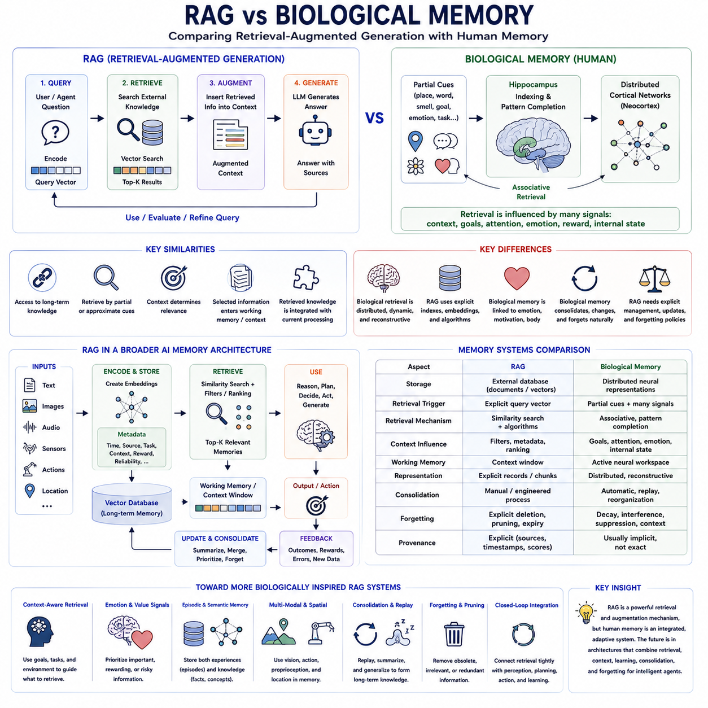{width="7.268055555555556in" height="7.268055555555556in"}

Retrieval-Augmented Generation, or RAG, is an AI architecture that combines a generative model with an external retrieval system so that relevant information can be brought into the model's active context when needed. In the chapter structure, it follows hippocampal indexing and vector databases, creating a direct point of comparison between engineered AI retrieval and the associative, context-sensitive nature of biological memory.

The basic RAG process is computationally straightforward. A query is converted into a representation, relevant information is searched from an external store, the retrieved material is inserted into the model's context, and the generative model produces an answer using both its learned parameters and the retrieved evidence. This creates a separation between persistent storage and temporary active processing.

Biological memory also separates long-term storage from moment-to-moment cognitive use, but the mechanisms are far more integrated. Human cognition can reactivate memories through partial cues such as a place, smell, word, emotion, goal, or current task. Retrieval does not depend on a single explicit query representation; instead, many neural and contextual signals jointly influence which memories become accessible.

This comparison makes RAG functionally similar to some aspects of memory retrieval without making it biologically equivalent. RAG uses engineered indexes, embeddings, metadata, and ranking algorithms, whereas biological retrieval emerges from distributed neural representations, recurrent interactions, hippocampal indexing, cortical associations, attention, emotion, and current cognitive state.

The hippocampus provides an important bridge for understanding this analogy. It is often interpreted as helping associate distributed components of an experience so that a partial cue can reactivate a broader pattern. RAG similarly attempts to retrieve stored information from incomplete or approximate queries, but it does so through explicit computational infrastructure rather than through biological associative networks.

Vector databases strengthen this analogy by enabling content-addressable retrieval. Instead of searching only for exact keywords, a RAG system can retrieve information whose embedding is semantically similar to the query. This resembles the functional idea that related memories can be activated by similar or partially overlapping cues, although vector similarity captures only a limited subset of the mechanisms used by biological memory.

Context is critical in both systems. A retrieved item may be semantically similar yet irrelevant to the current task. RAG systems therefore often combine similarity with metadata, filters, ranking, recency, and task-specific criteria. Biological memory likewise depends strongly on context, goals, attention, emotional significance, and internal state when determining which associations become behaviorally important.

Working memory provides another useful comparison. Retrieved information in a RAG system is usually placed into a limited context window where the model can use it for immediate reasoning or generation. This resembles the functional role of working memory, in which selected information becomes temporarily accessible for current cognition. In both cases, only a small subset of persistent information becomes active at one time.

However, biological working memory is actively controlled and continuously updated through interactions among multiple neural systems. A model context window is primarily an engineered computational buffer. It does not automatically possess the selective maintenance, adaptive gating, goal-dependent prioritization, and sensorimotor integration found in biological cognition, even though agent architectures can add mechanisms that approximate some of these functions.

RAG also differs from biological memory in how information is represented. Retrieved documents or records may remain relatively explicit and stable, whereas biological memories are distributed, transformed, and often reconstructed during retrieval. Human recollection does not usually reproduce an exact stored record; it rebuilds an event or concept from interacting neural representations, prior knowledge, and current context.

Reconstruction gives biological memory substantial flexibility. A single stored experience can contribute differently depending on the present situation, and elements from multiple memories can be combined during reasoning or imagination. RAG typically retrieves discrete chunks or records, after which the generative model integrates them. The integration occurs mainly after retrieval rather than being inseparable from the retrieval mechanism itself.

Biological memory also operates across multiple memory systems. Sensory memory, working memory, episodic memory, semantic memory, procedural memory, and spatial memory perform different functions while interacting continuously. The chapter structure deliberately positions RAG within this broader architecture rather than treating it as a complete artificial counterpart to human memory.

Conventional RAG most closely resembles access to semantic external memory because document collections usually contain facts, concepts, descriptions, and accumulated knowledge. However, the same architecture can be extended toward episodic memory by storing interaction histories, observations, decisions, actions, outcomes, and contextual metadata that can later be retrieved as prior experiences.

Agentic AI makes this extension particularly important. A persistent agent may need to remember previous conversations, unfinished goals, tool results, decisions, failures, successful strategies, or environmental changes. RAG-like retrieval can reactivate these records when the current situation makes them relevant, allowing the system to preserve continuity without keeping the entire interaction history inside its active context.

Embodied AI requires an even richer form of retrieval. A robot may need to recover memories involving images, locations, objects, proprioceptive states, actions, and outcomes rather than only text. Multimodal embeddings and structured metadata can make such experiences searchable, but spatial and physical context must often participate directly in retrieval to determine whether a past episode is actually applicable.

Biological memory is also tightly connected with emotion, reward, motivation, and bodily state. Events that are important, dangerous, rewarding, surprising, or emotionally significant may be encoded and retrieved differently from neutral information. Standard RAG does not possess an intrinsic equivalent of these mechanisms. Any prioritization must be explicitly designed through weighting, metadata, learning signals, or agent-level memory policies.

Another major difference concerns consolidation. Human memories can change after learning as experiences are replayed, reorganized, generalized, and integrated with existing knowledge. RAG systems typically retrieve from external stores that remain structurally unchanged unless an explicit update process modifies them. This makes memory management a separate engineering problem rather than an automatic property of the retrieval architecture.

An advanced AI memory system can reduce this gap by adding consolidation mechanisms. Repeated episodes can be summarized, similar memories merged, important experiences retained, and common patterns transformed into semantic knowledge. Such processes move the architecture beyond simple RAG and toward a more dynamic memory system in which storage itself changes as experience accumulates.

Forgetting also differs substantially. Biological forgetting can result from decay, interference, retrieval failure, reconstruction, changing context, or adaptive suppression. A RAG database does not naturally forget in this way. Stored information generally remains available until deleted, reindexed, compressed, or made inaccessible by explicit policies, so pruning and expiration must be deliberately engineered.

This difference reveals a broader principle: unlimited storage is not equivalent to good memory. Both biological and artificial systems benefit from selectivity. AI memory architectures therefore need policies for deciding what to store, what to summarize, what to prioritize, and what to remove. RAG becomes more useful when it operates inside a managed memory lifecycle rather than as unrestricted document accumulation.

RAG also has an important advantage over biological memory: provenance can be explicit. Retrieved information can preserve source identifiers, timestamps, confidence values, document locations, or version metadata. This allows an AI system to trace where information originated and potentially verify it. Human memory usually does not provide such precise and externally inspectable provenance for remembered knowledge.

At the same time, biological memory has an advantage in adaptive integration. Memory is continuously linked with perception, prediction, planning, action, reward, and self-state. Retrieval is not a separate service called only when a query is issued; it is woven into ongoing cognition. A more mature AI memory architecture would therefore use retrieval continuously within perception--reasoning--action loops rather than only during question answering.

The comparison also clarifies the role of model parameters. In a generative AI system, learned parameters provide broad distributed knowledge acquired during training, while RAG supplies external information dynamically. A loose functional analogy is that parameterized knowledge resembles slowly acquired semantic regularities, whereas retrieval provides access to more explicit and updateable external memory. The correspondence remains approximate rather than biological.

For robotics, this hybrid structure is especially attractive. Stable knowledge about common objects or behaviors may exist in model parameters or semantic stores, while recent task-specific episodes remain in external memory. The robot can retrieve a past failure or successful maneuver, combine it with current sensor information, and use the result to guide planning without permanently embedding every individual event into its model weights.

RAG therefore should not be interpreted as an artificial copy of human memory. It is better understood as one computational component that captures selected functional principles: separation of active and persistent information, content-addressable retrieval, use of partial cues, context-sensitive selection, and integration of retrieved knowledge with current processing. Biological memory performs these functions through a much richer distributed system.

The most productive comparison is consequently architectural rather than anatomical. Neuroscience suggests that intelligent memory requires selective encoding, associative retrieval, contextual control, multiple timescales, reconstruction, consolidation, replay, and forgetting. RAG primarily addresses retrieval and temporary augmentation. Other components must be added if AI memory is to approach the flexibility of biological memory.

The transition from RAG to broader AI memory therefore requires integrating vector retrieval with working memory, episodic storage, semantic knowledge, spatial representations, procedural skills, replay, and consolidation. This direction is reflected in the chapter sequence, which moves from vector databases and RAG toward spatial memory, place and grid representations, and memory consolidation.

For AI design, the central lesson is that RAG is most valuable when treated as part of an active memory architecture rather than simply as a search layer attached to a language model. Retrieval should depend on goals, context, relevance, reliability, time, and prior outcomes, while stored information should be selectively updated, consolidated, or forgotten as experience accumulates.

Biological memory therefore provides a broader design reference for future RAG systems. The goal is not to reproduce neural mechanisms literally, but to adopt useful functional principles: retrieve from partial cues, maintain context, combine multiple memory forms, reorganize experience, preserve important information, forget what is no longer useful, and connect memory directly with prediction, planning, learning, and adaptive behavior.

## 07.09 Spatial Memory and Cognitive Maps [w/Code]

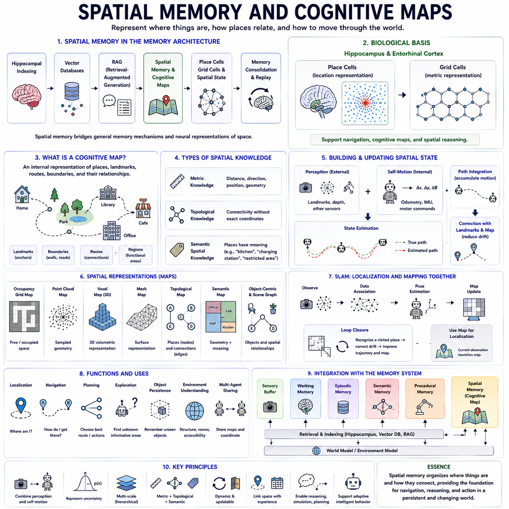{width="7.268055555555556in" height="7.268055555555556in"}

Spatial memory enables an intelligent system to represent where things are, how places relate to one another, and how an agent can move through an environment. Unlike memories centered mainly on facts or individual events, spatial memory organizes information according to locations, directions, distances, boundaries, routes, and relationships. It therefore provides a persistent spatial framework for navigation, reasoning, planning, and interaction with the physical world.

Within the broader memory architecture, spatial memory follows the discussion of hippocampal indexing, vector databases, and retrieval-augmented generation, and it precedes the detailed treatment of place cells, grid cells, and spatial state. This placement emphasizes spatial memory as a bridge between general memory mechanisms and specialized neural representations that encode location and spatial structure.

A cognitive map is an internal representation of an environment that organizes places, landmarks, routes, boundaries, and their relationships. It should not be understood simply as a literal visual map stored in the brain. Instead, it provides structured knowledge that allows an organism to determine where it is, where important locations are, how regions are connected, and which possible paths can lead toward a desired destination.

Spatial memory can encode several complementary forms of information. Metric knowledge represents quantities such as distance, direction, position, and geometry, while topological knowledge represents connectivity among places without requiring exact coordinates. Semantic spatial knowledge adds meaning by identifying locations as rooms, roads, work areas, charging stations, or other functional regions. Together, these representations create richer spatial understanding than coordinates alone.

Landmarks provide important anchors for spatial memory because recognizable features can associate perception with previously learned locations. Boundaries such as walls, corridors, roads, terrain edges, or room structures provide additional constraints on spatial organization. Routes connect remembered places through possible movements, while regions group nearby or functionally related locations. Cognitive maps can integrate these elements into coherent spatial structures.

The hippocampus and entorhinal cortex play central roles in biological spatial representation. The chapter\'s memory architecture associates these systems with place cells and grid cells, which support location and metric representation and contribute to navigation, cognitive maps, and spatial reasoning. These neural mechanisms illustrate how memory can represent not only what happened but also where an organism is situated within a structured environment.

Spatial memory must combine external perception with information about self-motion. Visual observations, landmarks, depth, and other environmental signals provide external evidence, while movement-related information helps estimate how position changes during locomotion. Integrating these sources allows an agent to maintain an estimate of its spatial state even when some landmarks temporarily disappear or sensory observations become uncertain.

Path integration is one mechanism for updating spatial state from self-motion. As an organism moves, estimates of direction and displacement can be accumulated to infer a new location relative to an earlier position. This process is useful when external references are temporarily unavailable, but small errors can accumulate over time. Landmarks and familiar environmental structures can therefore provide corrective information that reduces accumulated spatial drift.

Spatial memory is closely connected with episodic memory because experiences normally occur somewhere. Remembering an event often involves remembering the location, route, arrangement of objects, or environmental context associated with it. Conversely, revisiting a familiar place can act as a retrieval cue for previous experiences. Spatial context therefore provides an important indexing dimension through which episodic memories can be organized and recovered.

Semantic memory also interacts with spatial memory by adding meaning to places. A location can be represented not only geometrically but as a kitchen, laboratory, warehouse aisle, office, charging area, or restricted region. Such semantic labels allow an intelligent system to reason about what normally occurs at a location, which objects may be found there, and which actions are appropriate or possible within that environment.

Procedural memory contributes another complementary capability. Knowing the spatial relationship between two places does not by itself generate movement; the agent also needs skills for walking, driving, turning, avoiding obstacles, manipulating doors, or following routes. Spatial memory provides knowledge about where to go and how the environment is organized, while procedural systems provide learned capabilities for physically moving through that environment.

Working memory connects these longer-term representations with immediate behavior. During navigation, an agent may temporarily maintain its current position, destination, intermediate waypoint, nearby obstacle, and intended route. Only a small portion of the complete spatial memory needs to remain active. Relevant map information can therefore be retrieved as required and combined with current perception and goals for immediate decision making.

Spatial representations can naturally be hierarchical and multi-scale. A detailed local representation may describe nearby obstacles and objects, while an intermediate representation describes a room, corridor, or neighborhood, and a global representation captures relationships among larger regions. The related spatial-AI structure explicitly organizes representations from detailed local maps through submaps or regions toward coarser global representations.

This hierarchy improves efficiency because intelligent behavior rarely requires equal detail everywhere. Fine geometric information is important for manipulating an object or passing through a narrow opening, whereas long-distance planning may require only connectivity among regions. An agent can therefore reason at a coarse scale to choose a route and progressively activate more detailed spatial information as it approaches relevant locations.

In robotics, maps provide an engineered form of spatial memory. Occupancy grids represent free and occupied regions, point clouds preserve sampled geometry, voxel maps represent three-dimensional space, and meshes describe surfaces. Topological maps represent places as nodes and navigable connections as edges, while semantic maps associate geometry with meaningful categories. Object-centric representations and scene graphs additionally preserve entities and spatial relationships.

Simultaneous Localization and Mapping, or SLAM, tightly couples spatial memory formation with state estimation. A robot observes the environment, associates current measurements with previous observations, estimates its pose, and updates the map. Because both observations and motion estimates contain uncertainty, practical SLAM systems use probabilistic estimation, filtering, graph optimization, or related mechanisms to maintain consistent spatial representations.

Loop closure illustrates why spatial memory must extend beyond short-term state estimation. When a robot recognizes a previously visited place, the new observation can constrain earlier trajectory estimates and correct accumulated drift. The stored environment therefore becomes an active source of information for improving the robot\'s current state estimate. Spatial memory is not merely an archive of past observations; it participates continuously in perception and localization.

Cognitive maps extend beyond geometric mapping because useful spatial intelligence requires relationships and meaning. An agent may need to know that one room connects to another through a corridor, an object is inside a cabinet, a charging station is accessible through a particular entrance, or a region is temporarily blocked. Such relational structure allows spatial memory to support reasoning about accessibility, containment, proximity, and possible actions.

For embodied AI, spatial memory can become part of a broader world model. The agent must maintain representations of itself, objects, other agents, environmental structures, and their relationships. Persistent spatial state allows observations collected at different times and viewpoints to be integrated into a common representation, transforming fragmented sensor measurements into knowledge about a continuing physical world.

Spatial memory is especially important because the world is only partially observable at any moment. A robot\'s cameras and sensors reveal only a limited region, while objects may disappear behind obstacles or outside the current field of view. Memory allows the system to maintain representations of locations and objects that are not currently visible, supporting object persistence, navigation, planning, and reasoning beyond immediate perception.

Dynamic environments create an additional challenge. Objects move, doors open and close, people enter and leave, furniture changes position, and routes can become blocked. A useful cognitive map therefore cannot be completely static. The system must distinguish relatively stable spatial structure from transient state, update changing information, and preserve enough history to determine whether an observed difference represents noise, temporary change, or lasting environmental modification.

Uncertainty should consequently be represented as part of spatial memory rather than ignored. Location estimates, object positions, map correspondences, and remembered relationships can all have different levels of confidence. Probabilistic representations allow an agent to reason about uncertain spatial knowledge, seek additional observations when necessary, and avoid treating every remembered location as perfectly accurate.

Spatial memory also supports planning by allowing possible future movements to be evaluated internally before they are executed. An agent can compare alternative routes, estimate accessibility, identify obstacles, and determine intermediate goals using its internal representation. Cognitive maps therefore transform memory from passive storage into a substrate for simulation, prediction, and goal-directed behavior.

Exploration similarly depends on the relationship between memory and uncertainty. An autonomous agent can compare what it already knows with regions that remain poorly observed and select actions that acquire useful information. Spatial memory allows newly collected observations to be integrated with existing knowledge, progressively expanding and refining the internal model rather than treating each perception as an isolated event.

Multi-agent systems extend spatial memory beyond an individual agent. Multiple robots can contribute observations to shared maps, exchange information about landmarks and obstacles, and coordinate exploration across different regions. However, shared spatial memory requires alignment among coordinate systems, identification of overlapping observations, management of uncertainty, and reconciliation of conflicting or outdated environmental information.

Vector-based memory can complement explicit maps by making spatial experiences searchable through semantic and contextual similarity. A robot could retrieve episodes associated with a particular place, object, task, or environmental condition while a geometric map provides precise spatial relationships. Combining vector retrieval with metric, topological, semantic, and episodic representations creates a richer memory architecture than any single representation can provide.

The chapter\'s broader AI-memory architecture reflects this integration by associating spatial memory with maps, spatial state, and environment models while connecting it to sensory buffers, working memory, episodic memory, semantic memory, procedural skills, and retrieval mechanisms. Spatial knowledge therefore functions as one component of an interconnected memory system rather than as an isolated navigation database.

For AI design, the central lesson is that spatial intelligence requires persistent, structured, and actionable knowledge of the environment. An intelligent agent must integrate perception and self-motion, remember places and relationships, represent uncertainty, update changing environments, retrieve relevant experiences, and use spatial knowledge for reasoning and action. Cognitive maps provide the organizing principle through which these capabilities can operate across time.

Spatial memory ultimately connects memory with embodied intelligence. It allows an agent to move beyond reacting to the currently visible scene and instead reason within a persistent world containing places, objects, routes, boundaries, goals, and previous experiences. By integrating biological principles of cognitive mapping with computational mapping and memory mechanisms, spatial memory provides a foundation for autonomous agents that can understand, navigate, and adapt within complex physical environments.

## 07.10 Place Cells Grid Cells and Spatial State [w/Code]

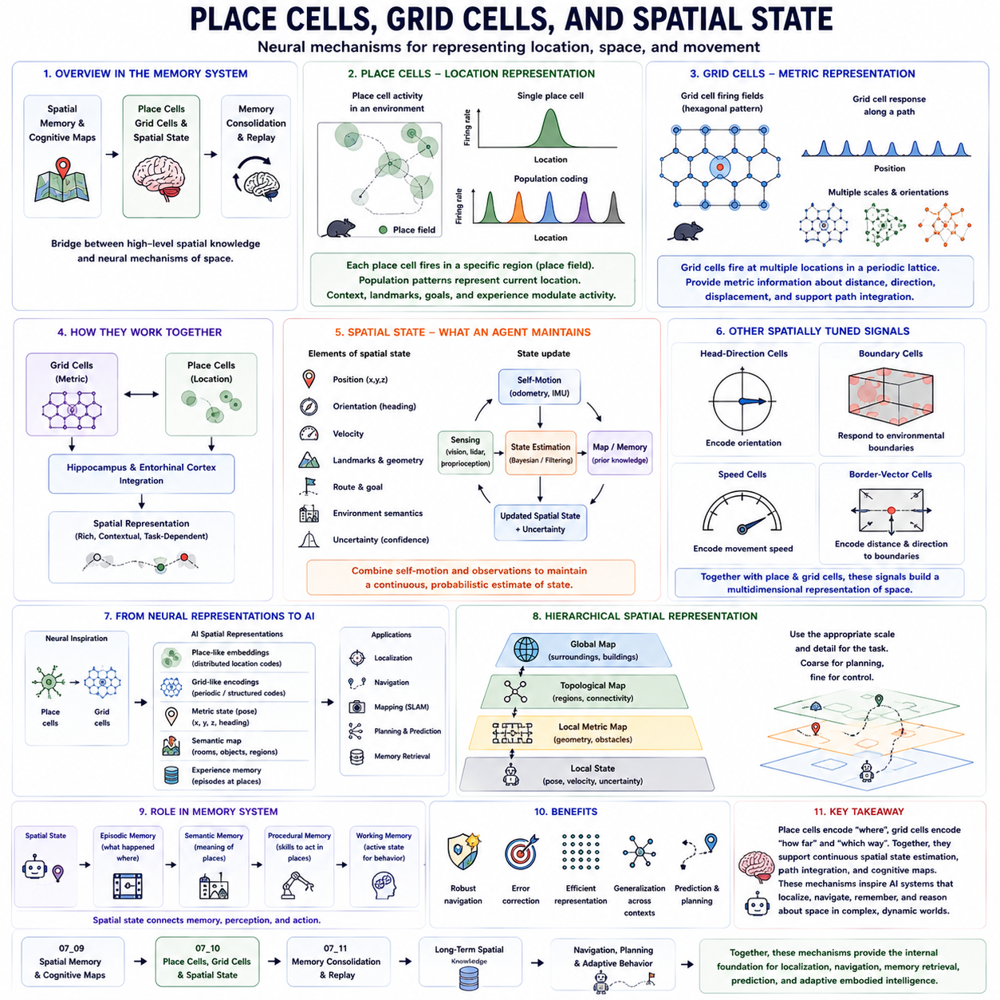{width="7.268055555555556in" height="7.268055555555556in"}

Place cells, grid cells, and spatial-state representations provide complementary mechanisms for encoding an organism's position and movement within an environment. In the chapter structure, they follow spatial memory and cognitive maps and precede memory consolidation and replay, forming a bridge between high-level spatial knowledge and neural mechanisms that represent location, geometry, motion, and navigational state.

Place cells are neurons strongly associated with the hippocampus whose activity becomes elevated when an organism occupies particular locations within an environment. A single place cell may respond most strongly within a limited region known as its place field. Across a population of cells, different fields cover different locations, allowing spatial position to be represented through distributed patterns of neural activity.

A place field should not be interpreted as a fixed Cartesian coordinate stored by one neuron. Its activity can depend on environmental landmarks, boundaries, task context, goals, previous experience, and the configuration of the surrounding space. Place-cell representations are therefore better understood as context-sensitive location codes that associate particular environmental states with distributed hippocampal activity.

When an animal moves through a familiar environment, different place cells become active in sequence as different locations are entered. These changing population patterns create a neural representation of the trajectory through space. Such sequential activation can connect spatial location with episodic experience, because events occurring along a route can become associated with the spatial states represented during movement.

Grid cells provide a different but complementary representation. They are strongly associated with the medial entorhinal cortex and exhibit firing fields distributed periodically across an environment. Rather than activating primarily at one localized region, a grid cell can become active at multiple locations arranged approximately in a hexagonal or triangular lattice, producing a repeating spatial pattern.

The periodic structure of grid-cell activity has made grid cells an influential model for metric representation. Their firing patterns can provide information related to displacement, distance, and relative position across an environment. The broader chapter architecture explicitly associates place cells with location representation and grid cells with metric representation, connecting both systems with navigation, cognitive maps, and spatial reasoning.

Different grid cells can have different spatial scales, orientations, and phases. Some exhibit relatively fine spacing between firing fields, while others operate at broader spatial scales. Populations with multiple scales can therefore provide information across different spatial resolutions, offering a possible neural basis for representing both local movement and larger environmental relationships.

Grid representations are particularly relevant to path integration because spatial state must be updated as an organism moves. Information about direction, speed, and displacement can modify internal spatial representations even when landmarks are temporarily unavailable. This allows the nervous system to estimate a new position based partly on the movement that has occurred since the previous state.

Path integration alone, however, is vulnerable to accumulated error. Small inaccuracies in estimated motion can progressively shift the internal representation away from the true position. External landmarks, boundaries, sensory observations, and familiar spatial relationships can therefore recalibrate the internal state. Effective navigation emerges from combining internally estimated movement with externally observed environmental evidence.

Place cells and grid cells should consequently be viewed as interacting components rather than competing explanations of spatial representation. Grid-like codes can contribute information about metric structure and self-motion, while place-cell populations can represent contextually meaningful locations. Interactions among hippocampal and entorhinal systems can integrate these signals into richer spatial representations used for memory and navigation.

Other spatially responsive neural populations further enrich this architecture. Head-direction cells provide information about orientation, while boundary-related cells respond to environmental borders or geometric structures. Together with place and grid representations, such signals can encode location, heading, distance, environmental constraints, and movement, forming a multidimensional description of the current spatial state.

Spatial state is broader than position alone. For an intelligent organism or robot, it may include location, orientation, velocity, surrounding geometry, nearby landmarks, current route, destination, uncertainty, and task-relevant environmental conditions. A useful spatial-state representation therefore summarizes the information required to understand where the agent is and how its situation is changing.

This concept connects neural spatial representation with state estimation in robotics. A robot rarely knows its pose perfectly from one sensor measurement. Instead, it combines camera observations, LiDAR, inertial measurements, wheel odometry, GNSS when available, and previously constructed maps. The resulting estimate corresponds functionally to an internal spatial state that is continuously revised as perception and movement unfold.

Probabilistic state estimation is particularly important because all sensing and motion estimates contain uncertainty. Rather than representing one position as unquestionably correct, an artificial system can maintain a probability distribution or confidence estimate over possible states. New observations then reduce or reshape uncertainty, while motion models predict how the state changes between observations.

Place-cell-like representations have inspired computational models in which locations are encoded through distributed activations rather than explicit coordinates alone. A learned network can develop localized spatial features that become active for particular regions or environmental configurations. Such representations may support recognition of familiar places, localization, navigation, and retrieval of location-associated experiences.

Grid-cell-like representations have similarly influenced artificial spatial models. Periodic or structured latent representations can encode continuous position and relative movement in compact forms. Their value is not that an AI system must literally reproduce biological grid cells, but that structured distributed codes may provide useful mechanisms for representing spatial continuity, translation, scale, and relational geometry.

In robot navigation, explicit metric coordinates remain valuable because control systems often require precise positions. Brain-inspired representations therefore need not replace conventional localization methods. A practical architecture can combine metric state estimates with learned latent spatial representations, allowing precise geometric control while also supporting semantic reasoning, memory retrieval, generalization, and context-sensitive navigation.

Spatial-state representation can also become hierarchical. A low-level state may describe pose, velocity, and nearby obstacles, while higher levels represent the current room, region, route segment, or semantic place. Such hierarchical organization mirrors the broader spatial-memory architecture in which detailed local maps, intermediate regions, and global structures coexist at different levels of abstraction.

This hierarchy is useful because different decisions require different spatial precision. Obstacle avoidance may depend on centimeter-scale geometry, while choosing which building or room to visit requires only coarse relational information. An intelligent system can therefore activate the level of spatial representation appropriate to the current task instead of processing the entire environment at maximum detail.

Place representations are closely connected with episodic memory because experiences occur at locations. A particular spatial state can act as an index that helps reactivate events previously associated with that place. Conversely, episodic experiences can modify the significance of locations, turning an otherwise neutral region into a remembered goal, hazard, resource location, or important transition point.

Semantic knowledge can similarly modify spatial representation. A location may become represented not merely as coordinates but as a laboratory, charging station, doorway, restricted zone, or delivery area. This means that a spatial state can contain both geometric and semantic information, allowing the agent to reason about what actions are possible or appropriate at a particular place.

Procedural memory contributes the skills required to act within these represented states. Knowing the current location and desired destination is insufficient without learned capabilities for walking, driving, turning, manipulating, or avoiding obstacles. Spatial representation therefore provides the state upon which procedural policies and controllers operate, linking memory directly with action selection.

Working memory maintains the subset of spatial state needed for immediate behavior. Current pose, goal, local obstacles, route segment, and uncertainty may remain temporarily active while broader maps and experiences stay in long-term memory. When conditions change, relevant spatial knowledge can be retrieved and inserted into this active workspace to guide navigation or planning.

For embodied AI, the central engineering problem is maintaining spatial continuity across changing observations. Sensors provide only partial views, objects become occluded, and the robot constantly changes viewpoint. A persistent spatial state allows observations from different moments to be interpreted as measurements of the same continuing environment rather than as unrelated snapshots.

Dynamic environments make this state representation more demanding. The system must distinguish changes caused by its own motion from changes caused by moving objects or environmental modifications. Stable structures such as walls may remain part of long-term spatial memory, while people, vehicles, doors, or movable objects may require rapidly updated state variables with different persistence times.

Spatial-state representations are also important for prediction. Once position, motion, environmental structure, and goals are represented, the system can predict future states under candidate actions. Navigation planning, collision avoidance, route selection, and active exploration all depend on evaluating how current spatial state may transition when the agent moves or interacts with the environment.

The same principle connects spatial memory with world models. A world model requires an internal description of the environment that can be updated through perception and transformed through imagined or executed actions. Place-like, grid-like, metric, semantic, and object-centered representations can contribute complementary information to such a model rather than forcing every spatial property into one universal encoding.

For multi-robot systems, spatial state additionally requires relationships between several agents. Each robot must estimate its own pose while potentially representing teammates, shared landmarks, unexplored areas, and communication constraints. Shared maps and relative localization can create a distributed spatial memory in which individually acquired observations contribute to a common representation of the environment.

The progression from cognitive maps to place cells, grid cells, and spatial state therefore illustrates multiple levels of explanation. Cognitive maps describe organized spatial knowledge, place cells demonstrate context-sensitive location representation, grid cells demonstrate structured metric coding, and state estimation describes how an agent continuously maintains its position and environmental relationship during movement.

For AI design, the most important lesson is not to copy individual neural cells literally but to preserve their functional principles. Spatial intelligence benefits from distributed representations, multiple scales, integration of self-motion with external cues, uncertainty correction, persistent state, contextual modulation, and interaction between geometric, semantic, episodic, and procedural knowledge.

Place cells and grid cells ultimately demonstrate that spatial memory is an active representation of an agent's relationship with its environment rather than a static stored map. By continuously combining location, movement, landmarks, geometry, context, and memory, spatial-state systems provide the internal foundation required for localization, navigation, prediction, planning, and adaptive embodied intelligence.

## 07.11 Memory Consolidation and Replay [w/Code]

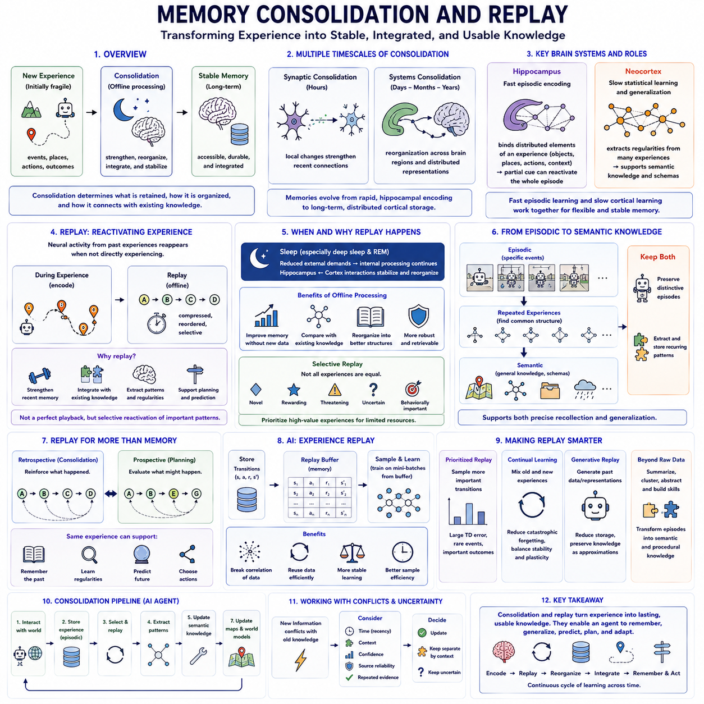{width="7.268055555555556in" height="7.268055555555556in"}

Memory consolidation is the process through which newly acquired and initially fragile memories become more stable, persistent, and integrated with existing knowledge. Rather than treating learning as complete at the moment information is encoded, consolidation emphasizes that memory continues to change after experience. Neural representations can be strengthened, reorganized, connected with prior knowledge, or transformed into more durable forms over time.

Within a broader memory system, consolidation connects short-lived experience with long-term knowledge. Sensory and working-memory processes provide immediate representations, while episodic memory preserves particular events and semantic memory captures generalized knowledge. Consolidation helps determine which elements of recent experience remain accessible, how they are reorganized, and how they become integrated with previously established memory structures.

Memory consolidation is commonly considered across multiple timescales. Synaptic consolidation refers to relatively local changes that stabilize recently modified neural connections, while systems consolidation concerns longer-term reorganization across interacting brain regions. These processes need not represent completely separate mechanisms; together they illustrate how memory can evolve from rapidly encoded traces toward more distributed and durable representations.

The hippocampus plays an important role in the rapid encoding of episodic experiences. During an event, information about objects, places, actions, temporal context, and other features may be represented across different neural systems. Hippocampal mechanisms can associate these distributed components, allowing a partial cue to later contribute to reactivation of a broader experience rather than requiring every element to be independently retrieved.

The neocortex supports slower learning of statistical regularities and generalized knowledge accumulated across many experiences. From this perspective, rapid hippocampal learning and slower cortical learning provide complementary capabilities. A system can preserve distinctive episodes without requiring immediate large-scale modification of established cortical knowledge, while repeated experience can gradually influence more stable and generalized representations.

Replay provides a mechanism through which previous experiences can be reactivated after their original occurrence. Neural activity patterns associated with earlier trajectories, events, or states may reappear during periods when the organism is no longer directly experiencing the same situation. Such reactivation provides an opportunity for recently encoded information to interact repeatedly with existing memory networks.

Replay is particularly associated with hippocampal sequential activity. Experiences that unfolded as sequences of locations or events can later be reactivated in compressed or reorganized forms. Replay therefore does not need to be understood as a literal recording that is played back exactly. Instead, it can selectively reactivate patterns that preserve important relationships among states, events, actions, and outcomes.

Sleep provides an important context for consolidation and replay because external demands are reduced while internally generated neural activity can continue. Interactions among hippocampal and cortical systems during sleep are thought to contribute to the stabilization and reorganization of recently acquired memories. Sleep therefore illustrates that learning continues through offline processing rather than occurring only during active interaction with the environment.

Offline processing can improve memory without additional exposure to the original task. Recently acquired representations can be repeatedly reactivated, compared with existing knowledge, and reorganized into structures that support later retrieval. This helps explain why consolidation is not simply passive preservation. It is an active transformation process that can change how information is represented and connected.

Replay can also support selective learning because not every experience needs to be reactivated equally. Novel, surprising, rewarding, threatening, uncertain, or behaviorally important experiences may have greater value for future behavior. A memory system that prioritizes such experiences can allocate limited replay and learning resources toward information that is especially useful for prediction, decision making, or adaptation.

Consolidation is closely related to the transition from episodic to semantic knowledge. Individual experiences preserve specific combinations of context, time, place, and events, whereas repeated experiences can reveal common structure. Through repeated integration, overlapping episodes may contribute to generalized concepts, relationships, expectations, and schemas that no longer depend on remembering one particular event.

This transformation does not require all episodic detail to disappear. Distinctive experiences can remain accessible while their common structure contributes to generalized knowledge. A mature memory system can therefore preserve exceptional episodes and simultaneously extract recurring patterns. This balance supports both precise recollection and generalization beyond previously encountered situations.

Spatial memory provides a clear example of replay and consolidation. During navigation, sequences of locations can be represented through place-related and other spatial activity. Later reactivation of spatial sequences can reinforce relationships among places and trajectories. This connects the preceding discussion of place cells, grid cells, and spatial state with the longer-term stabilization of cognitive maps and navigational knowledge.

Replay is also relevant to planning because reactivated sequences need not serve only retrospective memory. Internal sequences can support evaluation of possible routes, state transitions, or outcomes before action occurs. Memory and prediction therefore become closely connected: representations originally acquired through experience can later contribute to simulations of what may happen under alternative future actions.

The distinction between replay for consolidation and replay for planning is consequently functional rather than absolute. Reactivating a previous trajectory may strengthen memory, while reorganizing related states may support evaluation of a new route. The same stored experience can contribute to remembering the past, learning regularities, predicting consequences, and selecting future behavior.

Artificial intelligence uses a related concept in experience replay. Reinforcement-learning systems can store transitions or trajectories containing states, actions, rewards, and subsequent states. Instead of learning only from the newest interaction, the agent repeatedly samples stored experiences and uses them for additional training. This improves data reuse and reduces dependence on the temporal order in which experiences were originally collected.

Experience replay can improve learning stability because consecutive observations from an environment are often strongly correlated. Training only on immediately adjacent experiences can produce unstable or inefficient updates. Sampling from a replay memory creates a more diverse training distribution, allowing earlier and recent experiences to contribute together to parameter updates and improving the reuse of expensive interaction data.

Not every stored experience is equally informative for artificial learning. Prioritized experience replay can assign greater sampling probability to transitions associated with large prediction errors, rare events, important outcomes, or other measures of learning value. This introduces a form of selective replay in which computational resources are concentrated on experiences expected to produce particularly useful learning updates.

For continual learning, replay provides a mechanism for reducing catastrophic forgetting. When a model adapts only to new data, parameter updates can damage capabilities learned from previous tasks or environments. Reintroducing selected earlier experiences during training preserves pressure to maintain older knowledge while incorporating new information, helping the system balance plasticity with stability.

Generative replay provides another possibility when retaining all original experiences is impractical. Instead of storing every previous example, a model can generate approximations of earlier data or internal representations and combine them with new learning. This reduces direct storage requirements, although the quality of retained knowledge depends on how accurately the generative mechanism preserves important properties of earlier experience.

AI memory consolidation can extend beyond replaying raw examples. Repeated episodes can be summarized, clustered, merged, or transformed into semantic representations. Frequently recurring relationships may become structured knowledge, while successful action sequences can contribute to reusable skills. Consolidation can therefore reorganize episodic memory into semantic and procedural forms rather than merely copying records into longer-term storage.

Vector databases and external memory systems provide infrastructure for this process. Episodes can be stored with embeddings, timestamps, contextual metadata, outcomes, importance scores, and provenance. Consolidation processes can periodically retrieve related experiences, identify redundancy or recurring patterns, create summaries, update semantic knowledge, and reduce unnecessary duplication within persistent memory.

Memory consolidation also requires mechanisms for conflict resolution. New information may contradict older knowledge because the environment changed, earlier observations were inaccurate, or different contexts produced different outcomes. A useful system should not blindly merge conflicting memories. Time, context, confidence, source reliability, and repeated evidence can help determine whether knowledge should be updated, separated by context, or retained as uncertain.

For embodied AI and robotics, consolidation can transform continuous sensorimotor experience into reusable knowledge. A robot may accumulate observations of locations, objects, manipulation attempts, navigation failures, recovery behaviors, and successful strategies. Offline processing can identify recurring environmental structures, improve representations, preserve important failures, and convert repeated successful behaviors into more reliable policies or skills.

Spatial consolidation can similarly improve persistent world models. Observations collected from different viewpoints and times can be associated with stable places, objects, and environmental structures. Repeated evidence can strengthen persistent relationships, while temporary observations can be given lower persistence. This helps distinguish enduring properties of the world from transient state and sensor noise.

A practical AI consolidation architecture therefore operates across several memory layers. Recent interactions remain available in working or episodic storage, selected experiences enter replay, recurring patterns contribute to semantic knowledge, and repeated successful actions can influence procedural memory. Spatial information can simultaneously update persistent maps and world models, allowing multiple memory systems to learn from the same stream of experience.

Consolidation must also work together with forgetting. Retaining every observation indefinitely creates redundancy, increases retrieval cost, and may preserve outdated information. Low-value or duplicated experiences can be compressed or removed, while important episodes, failures, rare conditions, and useful abstractions receive greater persistence. Memory quality therefore depends on selective preservation rather than unlimited accumulation.

The stability--plasticity tradeoff captures a central challenge of consolidation. A memory system must remain plastic enough to learn new environments, tasks, and relationships while remaining stable enough to preserve valuable knowledge acquired previously. Excessive plasticity causes forgetting, whereas excessive stability prevents adaptation. Replay, selective updating, modular representations, and controlled consolidation can help balance these competing requirements.

Memory consolidation ultimately turns experience into knowledge that can survive beyond the moment in which it was acquired. Replay provides repeated opportunities to strengthen, reorganize, compare, generalize, and selectively preserve experience. In biological cognition and artificial intelligence alike, these principles connect episodic events with semantic structure, spatial knowledge, procedural capability, prediction, and future decision making.

For intelligent agents, the deeper significance of consolidation is that memory becomes an active learning process rather than a passive archive. Experiences are encoded, replayed, evaluated, reorganized, integrated, compressed, and sometimes forgotten. Through this continuing cycle, an agent can accumulate knowledge across time while adapting to new conditions, providing a foundation for persistent learning, robust memory, and increasingly capable autonomous behavior.
