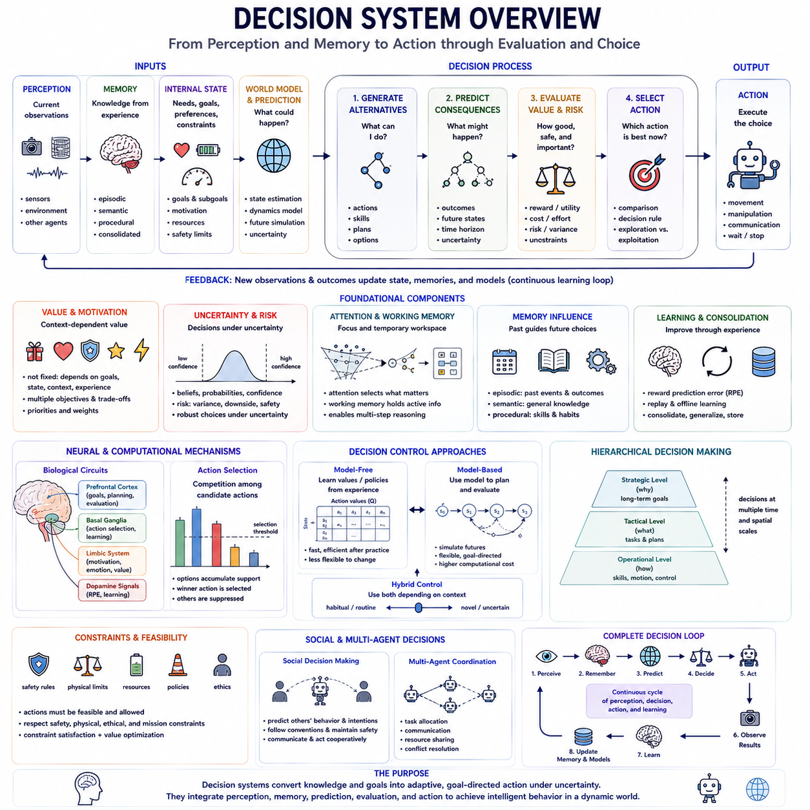
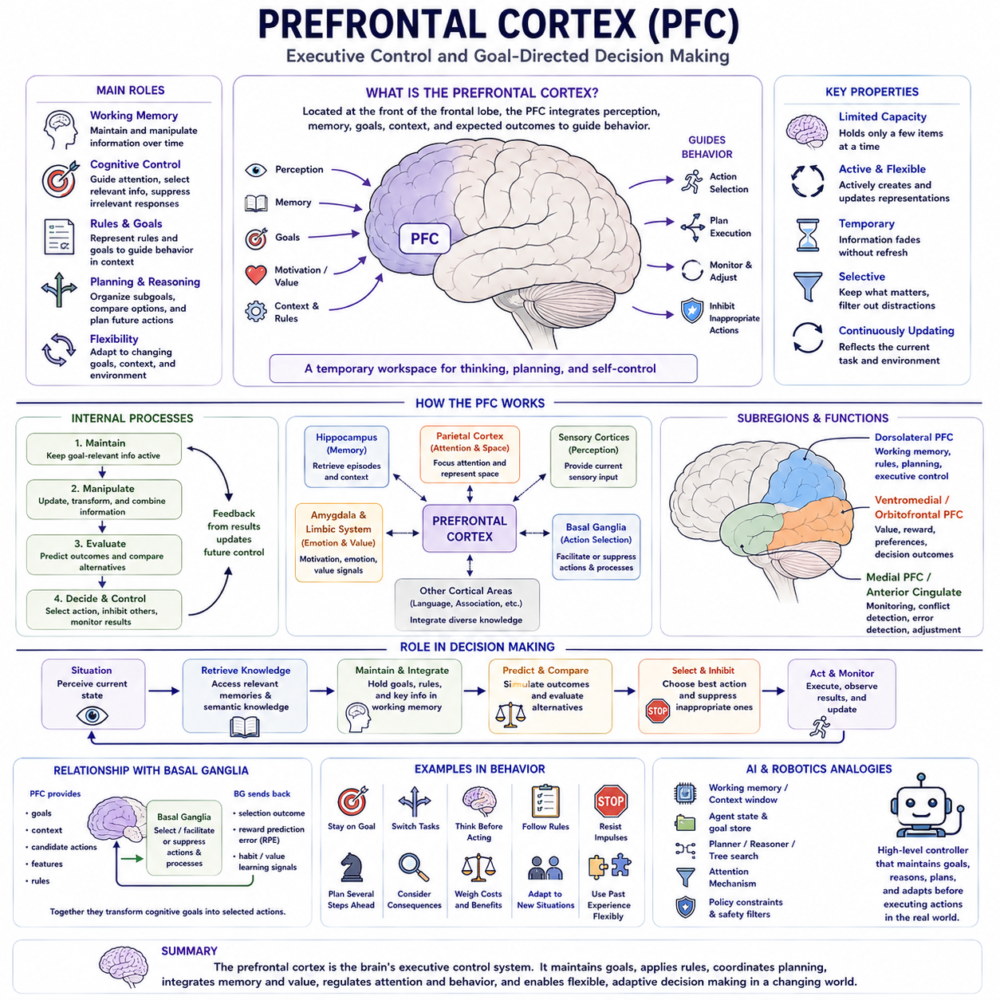
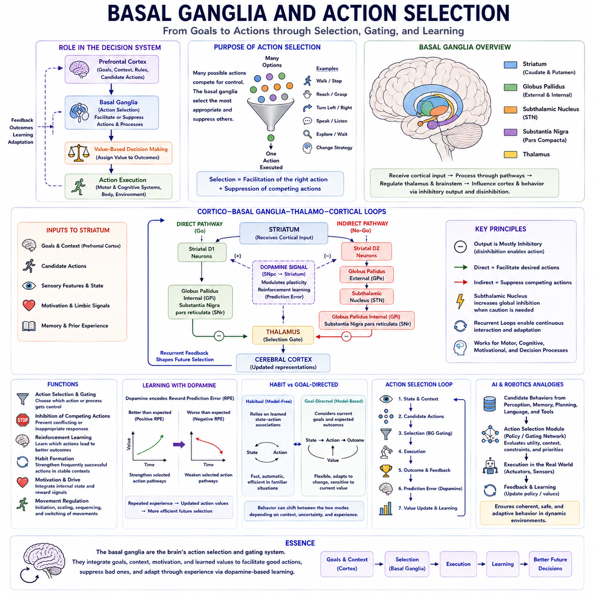
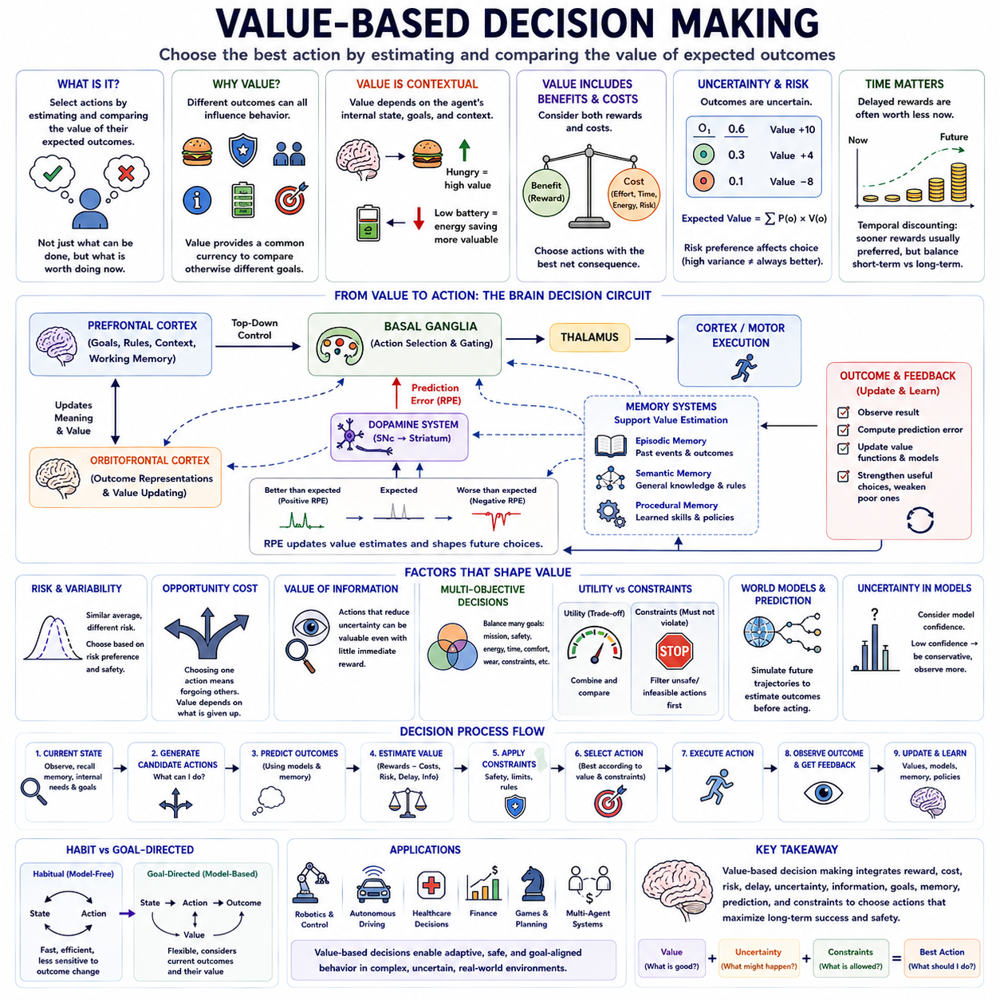
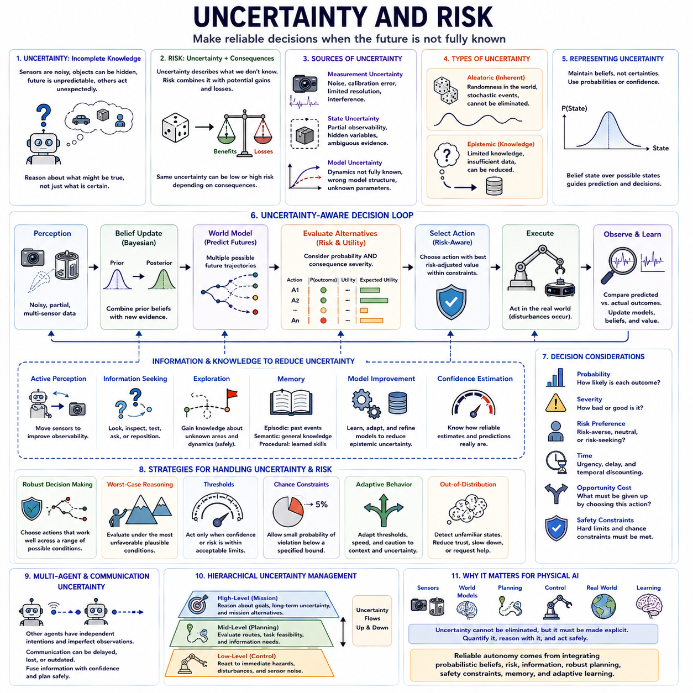
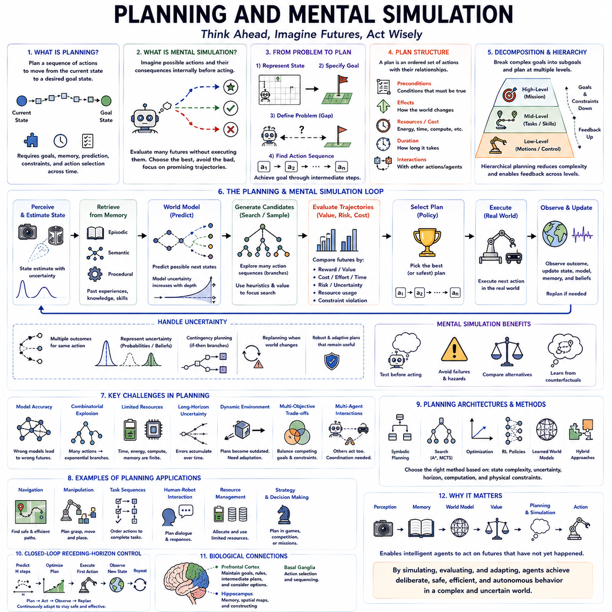
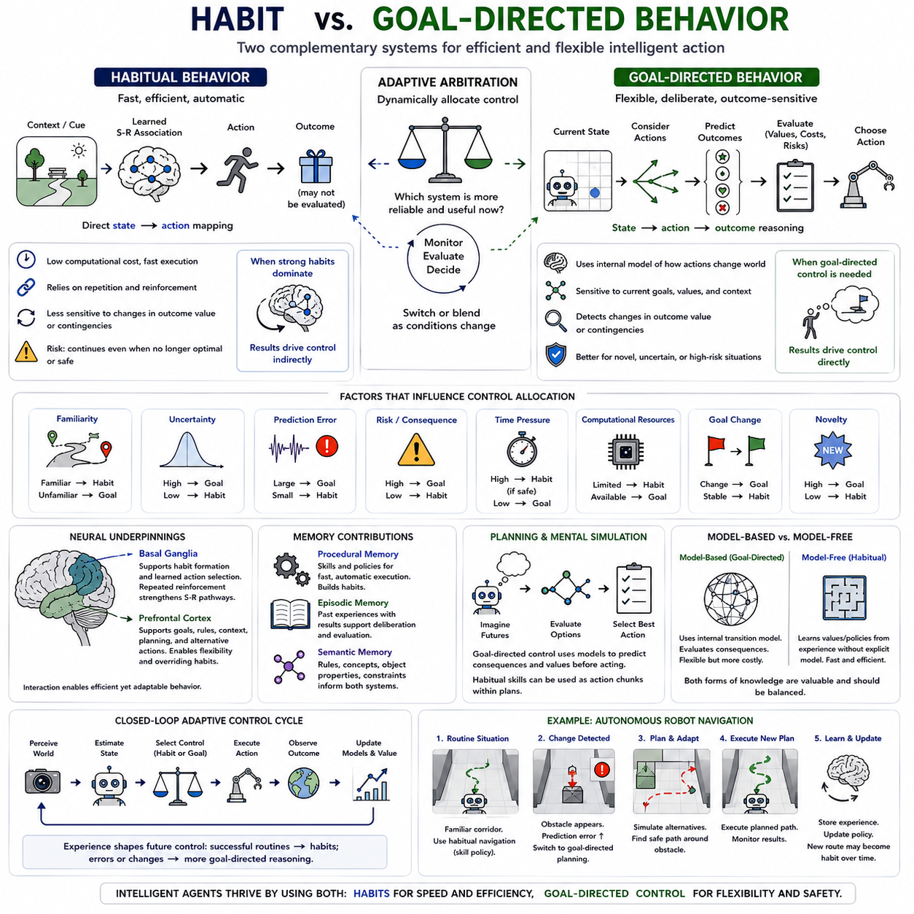
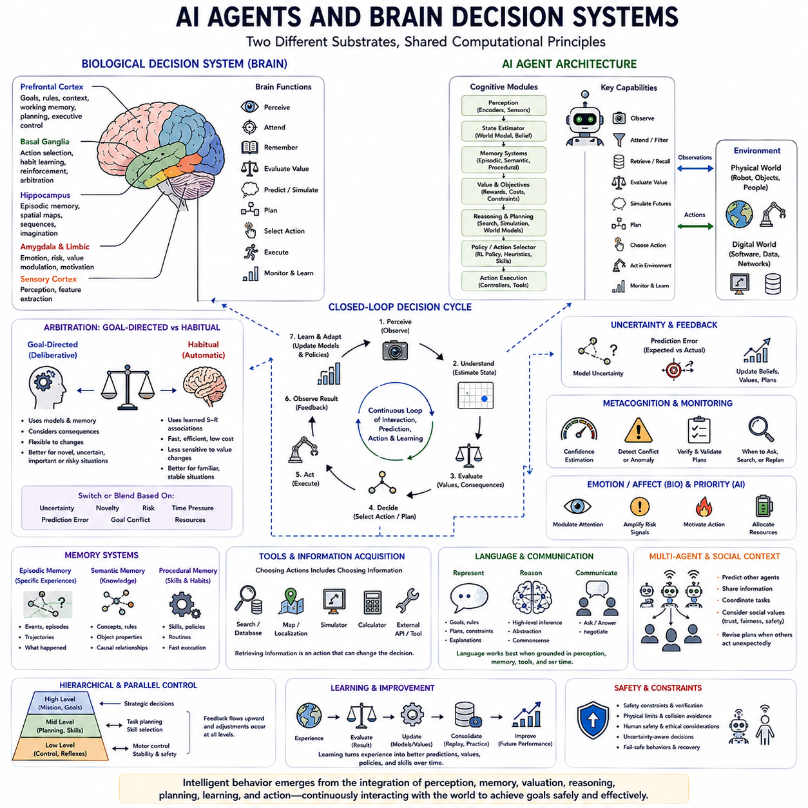

**Volume 44 Neuroscience for AI**

# Chapter 08. Brain Reasoning and Decision Making

## 08.00 Decision System Overview

{width="7.268055555555556in" height="7.268055555555556in"}

A decision system transforms perception, memory, goals, internal state, and predicted consequences into selections among possible actions. Decision making is therefore not an isolated reasoning step but a continuous control process linking what an intelligent agent perceives and remembers with what it eventually does. Effective decisions require the system to represent alternatives, estimate their consequences, evaluate their significance, and select actions appropriate to current goals and environmental conditions.

Decision systems operate between cognition and action. Perception provides information about the current environment, memory contributes knowledge derived from previous experience, and internal states specify needs, goals, preferences, and constraints. These information streams are integrated into a decision state from which possible actions can be generated and evaluated. The selected action then changes the environment, producing new observations and beginning another decision cycle.

A central requirement of decision making is the representation of alternatives. An intelligent system rarely faces only one possible response; it may continue, stop, explore, avoid, approach, communicate, manipulate, or postpone action. Decision quality depends not only on selecting correctly among known alternatives but also on constructing a useful set of candidate actions that captures meaningful possibilities without creating unnecessary computational complexity.

Evaluation assigns significance to possible states, actions, or outcomes. Biological systems may evaluate alternatives according to reward, effort, risk, novelty, uncertainty, physiological needs, social consequences, and long-term objectives. Artificial systems similarly require objective functions, utilities, costs, rewards, constraints, or learned value representations. The evaluation mechanism converts diverse consequences into information that can influence action selection.

Value is not necessarily an intrinsic property of an external object or event. The same outcome may have different significance depending on the agent\'s current state, goals, previous experience, and future expectations. A charging station, for example, becomes more valuable to a mobile robot when battery energy is low. Decision systems therefore require context-dependent value representations rather than permanently fixed rankings of all possible outcomes.

Expected consequences are particularly important when actions produce delayed effects. An action that provides an immediate benefit may create a larger future cost, while a temporarily costly action may enable a more valuable future state. Intelligent decision making must therefore consider temporal relationships among actions and outcomes. This creates a close connection between decision systems, prediction, planning, reinforcement learning, and world models.

Uncertainty is unavoidable because agents rarely possess complete information about their environments. Sensor measurements can be noisy, objects can be hidden, other agents may behave unpredictably, and future events may depend on unknown variables. A decision system must therefore operate not only over known states but also over beliefs, probabilities, confidence estimates, or alternative hypotheses about what the current situation might actually be.

Risk emerges when possible actions have uncertain outcomes with different consequences. Two actions with similar expected rewards can be very different if one has predictable results while the other includes a small probability of catastrophic failure. Decision systems therefore often need to represent not only expected value but also variability, downside consequences, safety constraints, and tolerance for uncertainty.

Decision making under uncertainty requires balancing exploitation and exploration. Exploitation selects actions that currently appear most valuable based on existing knowledge, while exploration selects actions partly to acquire information or discover potentially better alternatives. Excessive exploitation can trap an agent in incomplete knowledge, whereas excessive exploration can waste resources or create unnecessary risk. Adaptive intelligence requires a context-sensitive balance between the two.

Attention contributes to decision making by determining which information receives processing priority. Real environments contain far more sensory and remembered information than can be evaluated simultaneously. Attention can emphasize task-relevant objects, events, goals, or uncertainties while suppressing less relevant information. Decision quality therefore depends partly on selecting what should enter the decision process before selecting the final action itself.

Working memory provides an active workspace for maintaining information required during decision making. Current goals, recently observed events, candidate actions, constraints, intermediate conclusions, and predicted outcomes may need to remain temporarily accessible while alternatives are compared. Working memory therefore connects immediate perception with retrieved long-term knowledge and enables multi-step evaluation rather than purely reactive behavior.

Episodic memory allows previous decisions and their consequences to influence current choices. When an agent encounters a familiar situation, related experiences can be retrieved to determine what happened previously, which actions succeeded, and which failures should be avoided. Such memory-based decision making can reduce the need to solve every problem from the beginning and enables rapid adaptation from relatively small numbers of significant experiences.

Semantic memory contributes generalized knowledge about objects, relationships, rules, environments, and likely consequences. Instead of retrieving one specific previous episode, an agent can use accumulated knowledge such as which surfaces are traversable, which actions are dangerous, or which tools are appropriate for particular tasks. Decision systems can therefore combine specific episodic evidence with generalized semantic expectations.

Procedural memory contributes learned action policies and skills. Some decisions that initially require explicit comparison can become increasingly automatic through repeated practice. Once reliable action patterns have been learned, procedural systems can execute them efficiently without reconstructing detailed reasoning for every movement. Higher-level decision systems can then concentrate computational resources on novel, ambiguous, or strategically important choices.

Memory consolidation further improves decision systems by transforming repeated experience into stable knowledge. Successful strategies can be strengthened, recurring relationships generalized, and important failures preserved for later retrieval. Replay can reactivate previous state-action-outcome sequences and provide additional opportunities to learn value relationships without repeating every experience physically. Decision competence can therefore improve during both online interaction and offline learning.

Action selection can be understood as competition among candidate behaviors. Different alternatives accumulate support from sensory evidence, goals, expected values, habits, memories, and contextual constraints. Selection occurs when one alternative becomes sufficiently favored relative to others. This general principle appears in biological models of decision making and in artificial mechanisms ranging from utility-based selection to learned policies and optimization procedures.

Biological decision systems involve distributed interactions rather than a single decision center. Prefrontal regions contribute to goal maintenance, planning, contextual control, and evaluation of alternatives, while basal ganglia circuits are strongly associated with action selection and reinforcement-based learning. Limbic and neuromodulatory systems contribute motivational and value-related signals, allowing cognitive evaluation to interact with reward, emotion, and internal physiological state.

The basal ganglia provide an important conceptual connection between value learning and action selection. Candidate actions can be facilitated or suppressed according to learned relationships between states, actions, and outcomes. Dopamine-related learning signals contribute to updating these relationships when obtained outcomes differ from expectations. Decision systems can therefore adapt their future choices according to prediction errors generated by experience.

Reward prediction error represents the difference between an expected outcome and the outcome actually obtained. A better-than-expected result provides a positive learning signal, whereas a worse-than-expected result produces a negative one. Such errors allow value estimates to change incrementally rather than requiring complete models of every environment. This principle forms an important connection between neuroscience and reinforcement learning.

Model-free decision mechanisms learn values or policies directly from experience without explicitly predicting detailed future state transitions. They can produce fast and efficient behavior after sufficient learning but may adapt slowly when environmental structure changes. Their strengths resemble habitual or procedural control, where previously successful responses can be selected rapidly without extensive prospective simulation.

Model-based decision mechanisms instead use representations of how actions transform states and what outcomes may follow. By internally evaluating alternative future trajectories, they can adapt more flexibly to changed goals or environmental conditions. This flexibility comes at a computational cost because multiple possible futures may need to be represented, predicted, and compared before an action is selected.

Intelligent behavior can benefit from combining model-free and model-based control. Familiar, well-practiced situations may be handled efficiently by learned policies, while unfamiliar, uncertain, or high-consequence situations trigger more deliberate planning. A decision architecture can therefore allocate computational effort according to novelty, uncertainty, risk, and task importance instead of using the same decision mechanism for every situation.

Hierarchical decision making further reduces complexity by separating strategic goals from lower-level actions. A high-level system may decide to reach a destination, inspect an object, recharge, or assist another agent, while lower levels determine routes, motion primitives, and actuator commands. Decisions at different temporal and spatial scales can therefore interact without requiring one optimization process to directly evaluate every possible motor command.

For embodied AI, decisions must respect physical feasibility. An abstract action may appear desirable but remain impossible because of robot geometry, actuator limits, terrain, energy availability, payload, obstacles, or safety constraints. Decision systems must consequently interact with state estimation, motion planning, control, and physical models so that selected actions are not merely logically appropriate but executable in the real world.

World models can strengthen decision making by predicting how candidate actions may change the environment. Rather than evaluating only immediate observations, an agent can simulate future states and compare alternative action sequences internally. The quality of these decisions depends on the accuracy of the model, but uncertainty about model predictions must itself be considered to prevent confident planning based on unreliable imagined futures.

Decision systems also require mechanisms for constraint satisfaction. Safety rules, physical limits, ethical requirements, operational policies, resource budgets, and mission priorities can restrict which actions are permissible regardless of their predicted reward. This distinction is important because maximizing a single objective does not automatically produce acceptable behavior. Practical autonomy requires value optimization within explicit and learned constraints.

Multi-objective decision making becomes necessary when several goals must be satisfied simultaneously. A robot may need to maximize task completion while minimizing energy consumption, travel time, collision risk, equipment wear, and disruption to humans. These objectives may conflict, requiring prioritization, weighting, Pareto reasoning, or context-dependent tradeoffs rather than optimization of one universal scalar objective.

Social environments introduce additional complexity because decisions depend on the intentions and likely responses of other agents. Human-aware robots must predict pedestrian motion, interpret social conventions, preserve personal space, communicate intentions, and sometimes sacrifice locally optimal efficiency for predictable or cooperative behavior. Decision systems therefore increasingly require models of other agents as well as models of the physical environment.

Multi-agent decision making extends this principle to coordinated teams. Each agent may possess incomplete information and different local observations while contributing to a shared objective. Coordination requires decisions about task allocation, communication, formation, resource sharing, conflict resolution, and cooperative planning. Distributed systems must remain effective even when communication is delayed, limited, or temporarily unavailable.

A complete decision architecture therefore forms a closed perception--memory--prediction--decision--action loop. The agent estimates its current state, retrieves relevant knowledge, generates candidate actions, predicts possible outcomes, evaluates value and risk, applies constraints, selects an action, observes the result, and updates its memories and models. Decision making is consequently embedded within continuous learning rather than separated from it.

For advanced AI, the key design challenge is not merely producing a correct choice at one instant but maintaining coherent decisions across time. Goals change, information arrives incrementally, predictions fail, resources decline, and unexpected events require replanning. Robust decision systems must monitor the consequences of their own actions and revise plans when assumptions no longer match the observed world.

The decision system ultimately converts intelligence into purposeful behavior. Perception identifies the current situation, memory provides experience, world models estimate possible futures, value systems define what matters, and action mechanisms change the environment. By integrating these components under uncertainty and constraints, decision systems provide the foundation through which biological organisms, autonomous robots, and intelligent agents transform knowledge into adaptive goal-directed action.

## 08.01 Prefrontal Cortex

{width="7.268055555555556in" height="7.268055555555556in"}

The prefrontal cortex is a major cortical system for coordinating goal-directed cognition and behavior. Rather than operating as a single decision center, it participates in distributed networks that integrate perception, memory, internal goals, contextual information, and expected consequences. Within the broader decision-system architecture, it is especially associated with working memory, cognitive control, planning, rules, goals, and flexible behavior.

Located in the anterior portion of the frontal lobe, the prefrontal cortex receives and exchanges information with many cortical and subcortical systems. This extensive connectivity allows current sensory evidence to interact with remembered experience, motivational state, action possibilities, and task requirements. Its importance therefore arises less from processing one specific sensory modality than from coordinating information needed to organize behavior.

One of the central functions associated with the prefrontal cortex is working memory. Information that is no longer directly present in sensory input may need to remain actively available while an organism reasons, plans, or performs a task. The prefrontal cortex contributes to maintaining task-relevant representations and coordinating the temporary workspace that connects perception, memory, reasoning, and action.

Working-memory maintenance is selective rather than equivalent to storing every recent observation. Goals and attention determine which representations remain behaviorally relevant. A destination, rule, intermediate calculation, remembered instruction, or recently observed obstacle may need to remain active while irrelevant information is suppressed. Prefrontal control therefore helps allocate limited cognitive resources according to the requirements of the current task.

Cognitive control extends this principle beyond simple maintenance. Intelligent behavior frequently requires selecting information, suppressing inappropriate responses, switching between tasks, and adjusting behavior when circumstances change. The prefrontal cortex contributes to these control processes by maintaining representations of goals and rules that can bias processing elsewhere in the brain toward behavior that is appropriate for the current context.

Rules provide an important mechanism for flexible behavior. The same sensory stimulus can require different actions depending on instructions, context, goals, or previous events. Instead of permanently associating one stimulus with one response, prefrontal representations can help specify conditional relationships such as selecting one action under one rule and another action when the governing rule changes.

This capacity supports behavioral flexibility. Habitual responses are efficient in stable situations, but they can become inappropriate when goals or environmental conditions change. Prefrontal control can help preserve the current task structure and promote behavior consistent with newly relevant information. This establishes an important relationship with later distinctions between habitual and goal-directed decision mechanisms.

Planning requires maintaining goals while organizing intermediate actions. A desired future state may be several steps removed from the present state, requiring the system to represent subgoals, constraints, dependencies, and possible sequences. Prefrontal processing can participate in coordinating these representations so that immediate actions are evaluated not only by their local effects but also by their contribution to longer-term objectives.

The prefrontal cortex is therefore closely connected with prediction and mental simulation. When several actions are possible, decision making may require comparing their expected consequences before execution. Representations of goals and task rules can guide which possibilities deserve consideration, while information from memory and predictive systems supplies knowledge about what may happen under different candidate actions.

Such prospective processing connects the prefrontal cortex with internal models and world models. A useful decision system must represent not only the current state but also possible future states produced by actions. Prefrontal control can help organize this future-oriented reasoning by maintaining objectives, candidate plans, constraints, and intermediate results while predictions are generated and compared.

The prefrontal cortex also interacts strongly with memory systems. The hippocampus rapidly encodes episodic experiences and can retrieve contextually relevant memories, while prefrontal mechanisms can use such retrieved information to guide current reasoning and decisions. Memory is therefore not merely recalled for passive recognition; previous experiences can become active evidence for selecting present actions.

This interaction is especially important when a current situation resembles a previous one. Relevant episodes may reveal which actions succeeded, which failed, and which contextual differences matter. Prefrontal control can integrate retrieved experience with current goals rather than automatically repeating the past. This enables memory-based reasoning to remain flexible when similar situations require different responses.

Semantic knowledge also contributes to prefrontal reasoning. General knowledge about objects, rules, causal relationships, social conventions, and task structures can constrain the set of plausible actions. The prefrontal cortex can coordinate this knowledge with current working-memory contents, allowing decisions to depend simultaneously on immediate observations and information accumulated across many previous experiences.

Attention and prefrontal control are similarly intertwined. Environments contain more information than can be processed with equal priority, so task goals must influence which signals receive additional processing. Top-down control can enhance representations relevant to current objectives and reduce interference from competing information. Attention thus becomes part of the mechanism through which goals influence perception and subsequent decision making.

Response inhibition illustrates another aspect of cognitive control. A strongly activated or previously rewarded action is not necessarily appropriate in the current situation. When context, safety, rules, or changing goals indicate otherwise, the system may need to suppress the dominant response. Prefrontal networks participate in control processes that allow behavior to be withheld, redirected, or replaced by a more appropriate alternative.

However, action selection is not performed by the prefrontal cortex alone. The broader chapter architecture places the basal ganglia immediately after the prefrontal cortex, emphasizing their complementary roles. Cortical systems can provide goals, context, candidate actions, and relevant features, while cortico--basal ganglia loops contribute to facilitating or suppressing actions and processes according to learned values and contextual requirements.

The basal ganglia can therefore be viewed as an important partner in translating cognitive representations into selected behavior. Prefrontal systems may maintain what the agent is trying to achieve and which rules currently apply, while basal ganglia circuits participate in determining which candidate action or cognitive process should be facilitated. Recurrent interactions allow selection outcomes to influence subsequent cortical processing.

Value-related information also shapes prefrontal decision processes. Candidate actions cannot be compared only by their physical possibility; their expected benefits, costs, risks, effort, and relevance to current goals must also be considered. Motivational and reward-related systems provide signals that influence which outcomes matter, enabling cognitive control to operate in relation to the agent\'s needs rather than according to abstract reasoning alone.

The prefrontal cortex is not functionally uniform. Different prefrontal regions participate to different degrees in working memory, cognitive control, valuation, social cognition, monitoring, and action regulation. These functions emerge through interacting networks rather than cleanly isolated modules. Consequently, descriptions of prefrontal function should emphasize distributed specialization and connectivity instead of assigning every cognitive operation to one sharply bounded region.

Dorsolateral prefrontal regions are commonly associated with working memory, task rules, planning, and executive control. They are particularly relevant when information must remain available across delays or be manipulated during multi-step reasoning. Their activity can reflect task variables that are not immediately available in the sensory environment but remain necessary for guiding ongoing behavior.

Ventromedial and orbitofrontal regions contribute strongly to representing value, preferences, and relationships between situations and expected outcomes. These functions help connect cognitive representations with reward and motivational significance. An option that is physically available may nevertheless be rejected because its expected outcome is undesirable, costly, risky, or inconsistent with the current internal state.

Medial frontal systems contribute to monitoring behavior, detecting conflict, evaluating outcomes, and adjusting control. When competing actions are strongly activated or an outcome differs from expectation, additional control may be required. Monitoring mechanisms allow decision systems to recognize that existing strategies are insufficient and increase the resources devoted to resolving uncertainty or correcting behavior.

Prefrontal function is therefore inherently dynamic. Representations can change rapidly when task rules, goals, context, or available evidence change. The same neural populations may participate in different patterns of activity across different tasks. Such context-sensitive distributed representation is consistent with the broader cortical principle that cognition depends on recurrent processing shaped by goals and previous experience.

Recurrent connectivity is important because cognition unfolds over time. A decision may require maintaining information, receiving new evidence, revising an interpretation, comparing alternatives, and eventually committing to an action. Recurrent processing allows internal representations to persist and evolve rather than being transformed through a purely one-directional sequence from input to output.

This temporal persistence is particularly important under partial observability. The environment may not expose every task-relevant variable at the same moment. An agent may need to remember a previously observed instruction, object, location, or event while processing new information. Prefrontal working-memory mechanisms help bridge these temporal gaps so behavior can depend on information distributed across time.

Uncertainty places additional demands on prefrontal control. When evidence is incomplete or conflicting, the system may need to maintain multiple hypotheses, postpone commitment, gather more information, or reconsider an existing plan. Flexible control is therefore valuable not merely for choosing actions but also for deciding when additional reasoning, observation, memory retrieval, or exploration is required.

The same principles are important for embodied intelligence. A robot operating in a changing physical environment must maintain mission goals while reacting to immediate obstacles and unexpected events. High-level control must preserve the objective without rigidly following a plan that has become unsafe or impossible. A prefrontal-like computational function would therefore coordinate persistent goals with continuously changing state estimates.

Hierarchical control provides one useful analogy. High-level representations can encode mission objectives and task rules, intermediate levels can maintain subgoals and plans, and lower levels can execute actions through specialized controllers. Information must flow both downward and upward so that strategic goals influence action while execution failures and environmental changes trigger replanning.

Modern AI systems contain several mechanisms that are functionally analogous to limited aspects of prefrontal processing, although they should not be considered direct replicas of the brain. Agent state, context representations, recurrent networks, attention mechanisms, planning modules, scratchpads, and working-memory systems can maintain task-relevant information and coordinate multi-step computation across time.

An AI agent can, for example, maintain a representation of its current objective while retrieving relevant memories, observing environmental changes, calling specialized tools, evaluating intermediate results, and revising its plan. The functional similarity lies in coordinating information according to goals and context. The underlying computational mechanisms may nevertheless differ substantially from biological prefrontal circuits.

For Physical AI, this coordination function becomes especially important because reasoning must ultimately respect embodiment. Goals must be reconciled with battery state, actuator limits, terrain, obstacles, payload, human presence, safety policies, and mission constraints. A high-level cognitive controller must therefore integrate abstract objectives with continuously updated physical state before committing the robot to behavior.

Prefrontal-inspired AI should consequently emphasize flexible control rather than merely increasing model size or reasoning depth. Useful capabilities include persistent goal representation, selective working memory, context-dependent rules, inhibition of inappropriate actions, hierarchical planning, uncertainty monitoring, switching between strategies, and coordination with memory, prediction, value estimation, and action-selection systems.

The prefrontal cortex ultimately illustrates how intelligence can remain organized around goals while operating in a changing world. It maintains relevant information, applies contextual rules, coordinates planning, regulates competing responses, integrates memory and value, and adjusts behavior when circumstances change. In the decision architecture, it provides a critical bridge between knowing the current situation and controlling what should happen next.

## 08.02 Basal Ganglia and Action Selection [w/Code]

{width="7.268055555555556in" height="7.268055555555556in"}

The basal ganglia are a group of interconnected subcortical structures that play a central role in action selection, reinforcement learning, habit formation, motivation, and movement regulation. Within the chapter structure, they follow the prefrontal cortex and precede value-based decision making, positioning them as a critical mechanism through which goals, context, candidate actions, and learned values can influence which behaviors are facilitated or suppressed.

Action selection is necessary because an intelligent organism continuously possesses many possible actions but can execute only a limited subset at any moment. Walking, stopping, reaching, turning, speaking, waiting, or changing strategies may all compete for control. The basal ganglia contribute to resolving this competition by regulating which action-related cortical processes receive sufficient support to proceed and which remain inhibited.

The basal ganglia should not be understood as a simple command center that independently chooses behavior. They participate in recurrent cortico--basal ganglia--thalamic loops through which cortical representations enter subcortical circuits and selection-related signals return toward cortex. This organization allows goals and contextual information represented in cortical systems to interact continuously with learned action preferences and selection mechanisms.

Major components include the striatum, globus pallidus, subthalamic nucleus, substantia nigra, and associated connections with the thalamus and cerebral cortex. The striatum receives extensive cortical input and serves as a major entry point into basal ganglia circuits. Output structures regulate thalamic and brainstem targets, thereby influencing whether particular motor or cognitive processes become facilitated.

The striatum receives information representing goals, context, candidate actions, sensory features, and other task-relevant variables. This input does not necessarily describe one already selected action. Instead, multiple possibilities may be represented simultaneously. Basal ganglia circuits can transform these competing representations according to learned values and current conditions, contributing to selective gating of behavior.

A useful conceptual model distinguishes direct and indirect pathways. The direct pathway is commonly associated with facilitating selected actions by reducing inhibitory output from basal ganglia output nuclei, thereby allowing relevant thalamocortical activity to proceed. The indirect pathway contributes to suppressing competing or inappropriate actions by increasing inhibitory influence through additional circuit stages.

This facilitation--suppression organization provides a useful framework for understanding action selection. Selection does not simply mean activating the desired action; competing alternatives must also be controlled. Reliable behavior therefore depends on simultaneously increasing support for contextually appropriate processes while preventing incompatible responses from interfering with execution.

The subthalamic nucleus contributes another important component of this regulatory architecture. It can influence basal ganglia output broadly and is often associated with mechanisms that increase inhibitory control when competing alternatives or uncertain situations require additional caution. Functionally, this provides a way to delay or regulate commitment when rapid selection could produce an inappropriate action.

Basal ganglia output is largely inhibitory, making disinhibition an important concept for understanding these circuits. Candidate actions can be considered under tonic inhibitory control, with selection involving a reduction of inhibition for favored pathways. This organization creates a gating mechanism in which appropriate actions are released while alternatives remain relatively suppressed.

The thalamus forms an important part of the returning loop. Basal ganglia output influences thalamic activity, while thalamic signals project back toward cortical regions. Consequently, selection is embedded in a recurrent circuit rather than implemented as a one-way sequence. Cortical processing influences basal ganglia activity, and the resulting gating signals reshape subsequent cortical processing and behavior.

These loops are not limited to movement. Parallel cortico--basal ganglia circuits interact with motor, associative, and limbic cortical regions, allowing related principles to influence motor behavior, cognitive processes, motivation, and decision making. Action selection can therefore refer not only to selecting a physical movement but also to selecting strategies, task sets, or other processes that organize behavior.

The relationship with the prefrontal cortex is particularly important. Prefrontal systems can maintain goals, rules, context, candidate actions, and relevant features, while basal ganglia circuits contribute to facilitating or suppressing actions and processes. Together, these systems help transform cognitive goals into selected behavior rather than leaving goals as passive internal representations.

Selection must also adapt through experience. An action that repeatedly produces useful outcomes should generally become easier to select under similar conditions, while actions associated with poor outcomes should become less favored. The basal ganglia are therefore tightly connected with reinforcement learning, through which state--action--outcome relationships modify future behavioral tendencies.

Dopamine provides a major learning-related signal within this architecture. Dopaminergic neurons associated particularly with the substantia nigra pars compacta project strongly to the striatum and modulate plasticity within basal ganglia circuits. Dopamine should not be interpreted simply as a pleasure signal; its computational significance includes communicating information related to unexpected outcomes and changes in expected value.

Reward prediction error provides an important framework for understanding this learning signal. When an obtained outcome is better than expected, a positive prediction error can strengthen relationships that contributed to the successful action. When the result is worse than expected, a negative prediction error can modify those relationships in the opposite direction, progressively changing future action preferences.

Through repeated learning, the system can associate particular states or contexts with actions that tend to produce valuable outcomes. Decision making then becomes increasingly efficient because the agent does not need to reconstruct every action value from the beginning. Learned action tendencies provide a prior structure that can rapidly bias competition among candidate behaviors.

This mechanism connects the basal ganglia with procedural memory. Skills and habits develop through repeated state--action--outcome experience, gradually allowing behavior to become faster and less dependent on deliberate reasoning. The broader memory architecture therefore associates basal ganglia function with habit formation, action selection, and reinforcement learning.

Habit formation demonstrates both the strength and limitation of learned action selection. Repeatedly successful behavior can become efficient and automatic, reducing cognitive demand. However, a strongly learned response can become inappropriate when goals or environmental conditions change. Flexible intelligence consequently requires interaction between habitual mechanisms and systems capable of goal-directed control.

Goal-directed action depends more strongly on current outcomes and their present value. Habitual action depends more strongly on previously learned associations between states and responses. These modes should not be viewed as completely separate systems; behavior can shift between them depending on experience, uncertainty, novelty, task demands, and the stability of the environment.

The basal ganglia therefore contribute to the stability--flexibility balance of decision making. Stable learned policies allow familiar situations to be handled efficiently, while cortical control can intervene when circumstances require reconsideration. An effective decision architecture benefits from preserving well-learned behavior without allowing previous learning to dominate situations in which it is no longer appropriate.

Action selection also depends on motivation. The value of an action changes with internal state and current goals. Seeking food, conserving energy, avoiding danger, or pursuing a learned reward can become more or less important depending on physiological and contextual conditions. Limbic-related basal ganglia circuits allow motivational information to influence which behaviors gain selection priority.

Movement regulation provides a particularly visible expression of basal ganglia function. Voluntary movement requires selecting intended motor programs while preventing competing movements from disrupting execution. The basal ganglia interact with motor and premotor cortical systems to influence initiation, scaling, sequencing, and switching among actions, while other systems such as the cerebellum contribute prediction, timing, coordination, and error correction.

This division of labor is useful for understanding brain-inspired robotics. The basal ganglia are more closely associated with deciding which behavior or policy should gain control, whereas the cerebellum is strongly associated with predicting and refining how movement unfolds. Motor cortical and spinal systems then participate in representing and executing the selected behavior through physical effectors.

Selection operates hierarchically as well. At a high level, an agent may choose between exploration, navigation, manipulation, charging, or waiting. At intermediate levels, it may select routes, skills, or movement primitives. At lower levels, control systems determine detailed motor commands. Basal-ganglia-inspired gating principles can therefore be applied across multiple levels rather than only to individual muscle movements.

Context is essential because the same action can be desirable in one state and inappropriate in another. Reaching may be useful when an object is accessible but unsafe when an obstacle blocks the arm. A learned selection mechanism must therefore condition action preferences on relevant state representations instead of assigning one fixed value to an action independent of circumstances.

Uncertainty further affects selection. When the system has strong evidence that one alternative is preferable, rapid commitment may be appropriate. When several alternatives have similar support or the potential consequences are severe, additional information gathering or delayed commitment may be beneficial. Selection mechanisms must therefore interact with confidence, risk, and monitoring processes rather than maximizing learned value blindly.

In reinforcement-learning terms, action selection can be expressed through a policy that maps states or observations to probabilities or preferences over actions. Experience modifies the policy or underlying value estimates according to rewards and prediction errors. This provides a computational analogy to basal ganglia function, although artificial policies should not be treated as literal replicas of biological circuits.

Actor--critic architectures provide another useful functional analogy. An actor represents or selects behavior, while a critic estimates value and generates learning signals based on differences between expected and obtained outcomes. Basal ganglia and dopaminergic systems have strongly influenced such computational interpretations, linking neuroscience with algorithms for adaptive decision making and control.

For AI agents, basal-ganglia-inspired selection can be implemented as a gating layer between candidate behaviors and execution. Perception, memory, planning, and language systems may propose several actions, while a selection mechanism evaluates their learned utility, context, constraints, and current priorities. Only sufficiently supported actions are allowed to control downstream processes.

This approach becomes especially valuable in embodied AI, where simultaneous execution of incompatible behaviors can create physical failure. A robot cannot safely turn left and right at the same instant, manipulate two unreachable objects with one gripper, or continue forward while an emergency stop requires immediate inhibition. Explicit action gating therefore converts cognitive alternatives into physically coherent behavior.

Safety can be incorporated as an additional inhibitory mechanism. Even when a candidate action has high expected reward, collision risk, actuator limits, energy constraints, human proximity, or operational rules may require suppression. Brain-inspired action selection therefore suggests architectures in which reward-driven facilitation operates together with strong constraint-based inhibition rather than relying on reward maximization alone.

Multi-agent robotics introduces another layer of competition and coordination. Candidate actions must account not only for one robot\'s state but also for teammates, shared resources, communication, and collective goals. Selection mechanisms can combine local action values with team-level constraints, enabling individual agents to choose behaviors that remain compatible with coordinated group activity.

Learning must continue after selection because the outcome provides evidence about whether the chosen action was appropriate. The cycle can be represented as state and context, candidate actions, selection, execution, outcome, prediction error, and value update. This recurrent loop gradually changes future selection preferences and connects action selection directly with continual adaptation.

Memory can strengthen this process by providing examples beyond immediate reinforcement. Episodic memory can retrieve previous successes or failures in similar situations, semantic memory can provide rules and constraints, and procedural memory can supply learned policies. The basal ganglia can therefore be understood as part of a broader decision network in which multiple memory systems influence competition among possible behaviors.

World models add prospective information to this architecture. Instead of relying exclusively on previously learned action values, an agent can predict the consequences of candidate actions and feed expected outcomes into the selection process. This allows model-based planning and model-free learned preferences to cooperate, combining flexible simulation with efficient experience-based action tendencies.

The progression toward value-based decision making follows naturally from this mechanism. Once candidate actions can be selectively facilitated or suppressed, the next question is how their expected outcomes acquire values that permit meaningful comparison. The chapter therefore places value-based decision making immediately after basal ganglia and action selection, connecting neural gating mechanisms with broader principles of utility, reward, cost, and preference.

For AI design, the important lesson is not to reproduce every anatomical pathway literally but to preserve the functional principles of selective gating, competition, inhibition, reinforcement-driven adaptation, context dependence, and recurrent feedback. These principles provide a useful architecture for transforming many possible actions into one coherent behavior while continuously learning from the consequences.

The basal ganglia ultimately illustrate that intelligent behavior requires both selection and suppression. Goals and plans alone cannot control an agent unless one behavior is granted access to execution while incompatible alternatives are restrained. By integrating cortical context with learned values, dopamine-related learning, recurrent gating, and behavioral feedback, basal ganglia circuits provide a biological model for converting decision possibilities into adaptive action.

## 08.03 Value Based Decision Making [w/Code]

{width="7.268055555555556in" height="7.268055555555556in"}

Value-based decision making is the process of selecting among possible actions by estimating and comparing the value of their expected outcomes. It extends action selection beyond simple stimulus-response mappings because alternatives may differ in reward, cost, effort, risk, delay, and relevance to current goals. An intelligent system must therefore determine not only what actions are possible, but which outcome is presently worth pursuing.

Value provides a common decision variable through which otherwise different alternatives can be compared. Food, safety, social interaction, information, energy conservation, or progress toward a goal may have very different physical properties, yet each can influence behavior. Neural and artificial decision systems therefore require mechanisms that transform heterogeneous consequences into representations that support meaningful comparison and choice.

Value should not be understood as a permanent property attached to an object or action. It depends on the relationship between an outcome and the current state of the agent. Food becomes more valuable when an organism is hungry, while energy-efficient behavior becomes more important to a robot when battery capacity is low. Value is therefore dynamic, contextual, and closely coupled to goals and internal state.

Decision value can incorporate both benefits and costs. An action may produce a desirable outcome while requiring substantial energy, time, physical effort, computational resources, or opportunity cost. Rational selection therefore requires considering net consequences rather than reward alone. A highly rewarding outcome may be rejected when the associated cost is sufficiently large relative to available alternatives.

Expected value becomes necessary when outcomes are uncertain. An action may produce several possible consequences, each associated with a different probability and value. Decision systems can combine these possibilities by considering both how desirable each outcome would be and how likely it is to occur. This allows choices to reflect probabilistic expectations rather than assuming that one predicted future is guaranteed.

Expected value alone, however, does not fully capture risk sensitivity. Two alternatives can have similar average expected returns while differing substantially in variability and potential loss. An agent operating in a safety-critical environment may prefer a predictable moderate outcome over a higher-variance alternative that includes a small probability of severe failure. Value-based decisions can therefore depend on risk preferences and safety constraints.

Temporal delay also changes value. A reward available immediately may be preferred over an equivalent reward available much later, a phenomenon commonly described through temporal discounting. However, effective long-term behavior requires avoiding excessive preference for immediate benefits. Decision systems must balance short-term value with delayed consequences when current actions influence future opportunities, resources, or goals.

This temporal dimension connects value-based decision making directly with reinforcement learning. An action can be valuable not only because of its immediate reward but also because it moves the agent into a state from which valuable future outcomes become available. Value functions therefore estimate cumulative future consequences rather than evaluating each action exclusively according to what happens immediately after execution.

State value represents the expected future return associated with being in a particular state, whereas action value represents the expected return associated with performing a particular action in that state. These representations allow an agent to compare possibilities before execution. By learning how states and actions relate to future outcomes, decision systems can progressively improve behavior through accumulated experience.

Reward prediction error provides a central learning mechanism for updating value estimates. When an outcome is better than expected, the corresponding positive prediction error indicates that previous expectations were too low. When the outcome is worse than expected, a negative prediction error indicates that expectations were too high. Repeated updates gradually align predicted values with experienced consequences.

Dopamine-related neural signaling is strongly associated with this learning framework. Dopaminergic activity can reflect differences between expected and obtained outcomes, contributing to plasticity in circuits involved in reinforcement learning and action selection. Dopamine should therefore not be reduced to a simple representation of pleasure; it participates in adaptive learning about changes in expected value and behavioral significance.

The basal ganglia provide an important interface between learned value and action selection. Candidate actions can acquire different levels of support based on their previously learned consequences and current context. Actions associated with favorable outcomes may become easier to facilitate, while alternatives associated with poor outcomes may remain inhibited. Value learning can therefore progressively reshape future behavioral competition.

The prefrontal cortex contributes complementary capabilities by maintaining goals, contextual rules, working-memory contents, and representations of possible outcomes. A previously rewarding action may no longer be desirable when goals change. Prefrontal control allows current objectives and contextual information to modify the significance of learned values, supporting flexible decisions rather than automatic repetition of historically successful behavior.

The orbitofrontal cortex is particularly relevant to representations linking situations, options, and expected outcomes. Such representations allow value to change when the meaning of an outcome changes. If an outcome becomes less desirable because of satiation, changing goals, or altered environmental conditions, flexible decision systems should update behavior even before extensive relearning through repeated failure.

This distinction helps separate goal-directed behavior from habitual behavior. Goal-directed decisions depend strongly on representations of current outcomes and their present value, whereas habits depend more strongly on learned state-response relationships. Goal-directed behavior is flexible but computationally demanding, while habitual behavior can be fast and efficient but less sensitive to changes in outcome value.

Intelligent decision systems benefit from combining both mechanisms. Familiar situations with stable consequences can be handled efficiently through previously learned policies, while novel, uncertain, or changing situations may require explicit evaluation of expected outcomes. The balance between habitual and deliberative control can itself depend on uncertainty, experience, available computation, and the importance of the decision.

Value-based decision making also requires comparison among competing alternatives. Neural decision processes can accumulate evidence supporting different options until one becomes sufficiently favored. The rate of accumulation can depend on sensory evidence, remembered outcomes, expected value, uncertainty, and current goals. Choice therefore emerges dynamically from competition rather than necessarily from one instantaneous calculation.

Choice thresholds provide a way to regulate the tradeoff between speed and accuracy. A low threshold allows rapid decisions but increases the possibility of selecting an inferior option before sufficient evidence has accumulated. A higher threshold allows more evidence to be considered but delays action. Decision systems can adjust thresholds according to urgency, risk, uncertainty, and the consequences of making an error.

Opportunity cost further complicates valuation because selecting one action often prevents another from being executed. Time spent pursuing one goal cannot simultaneously be devoted to another incompatible goal. The value of an action therefore depends partly on what must be abandoned or postponed when that action is selected. Efficient agents must consider alternatives rather than evaluating each option independently.

Information itself can possess value. An action that produces little immediate external reward may be useful because it reduces uncertainty and improves future decisions. Looking around a corner, inspecting an unfamiliar object, requesting clarification, or exploring an unknown route can provide information that changes later action values. This creates a direct connection between valuation and active information gathering.

The value of information is particularly important under partial observability. When the current state is uncertain, committing immediately to a task action may be inferior to first obtaining another observation. A sophisticated decision system can therefore compare actions that directly pursue external goals with actions whose primary purpose is improving the quality of the internal state estimate.

Multi-objective decisions require valuation across several dimensions simultaneously. A robot may need to complete a mission quickly while conserving battery power, minimizing collision risk, reducing mechanical wear, preserving human comfort, and respecting operational constraints. These objectives cannot always be reduced naturally to one physical quantity, requiring explicit tradeoffs or structured preference mechanisms.

Scalar utility functions provide one approach by converting several objectives into a weighted combined value. Although computationally convenient, fixed weights may be insufficient when priorities change with context. Safety may dominate during human interaction, energy efficiency may become critical at low battery levels, and mission completion may dominate under time pressure. Adaptive weighting can therefore be essential.

Constraint-based decision making provides another approach. Instead of assigning every consideration a tradeable numerical value, some requirements can define boundaries that actions must not violate. Collision avoidance, actuator limits, restricted areas, or mandatory safety rules may eliminate candidate actions before reward comparison occurs. Value optimization then operates only within the remaining feasible action set.

This distinction is crucial for embodied AI because physical consequences cannot always be repaired through later learning. A simulated agent may tolerate many failed trials, while a physical robot can damage hardware, injure people, or lose mission capability through one unsafe action. Value-based Physical AI therefore requires explicit integration of utility, uncertainty, physical feasibility, and safety constraints.

World models extend valuation from learned associations toward prospective evaluation. If an agent can predict how actions transform the current state, it can simulate possible future trajectories and estimate their consequences before acting. This supports model-based decision making, where value is assigned not merely from historical experience but also from internally predicted futures.

Model accuracy becomes critical in this setting. A predicted trajectory can appear highly valuable because the world model overlooks an obstacle, underestimates uncertainty, or incorrectly predicts another agent\'s behavior. Decision systems should therefore consider confidence in predictions as part of valuation. Uncertain imagined outcomes may need conservative treatment, additional observation, or alternative planning.

Episodic memory contributes concrete evidence to value estimation. When a current situation resembles a previous experience, the system can retrieve what actions were taken and what consequences followed. Particularly significant successes, failures, hazards, or rare events can influence current decisions even when they are insufficiently frequent to dominate statistical learning.

Semantic memory provides generalized expectations accumulated across many experiences. Instead of recalling one specific event, an agent can know that certain surfaces are hazardous, particular objects are valuable, or specific actions usually require high energy. Semantic knowledge therefore supplies priors that shape valuation before direct experience with the exact current situation is available.

Procedural memory contributes learned policies that embody previous value-based learning. Once repeated decisions consistently favor similar actions, the resulting behavior can become proceduralized and executed with reduced deliberation. Memory consolidation and replay can further strengthen useful state-action-value relationships while preserving important failures that should continue to influence future choices.

Social decision making introduces values that depend on other agents. Cooperation, fairness, predictability, reputation, communication, and the welfare of others can influence which actions are considered desirable. Human-compatible autonomous systems therefore require value representations that extend beyond immediate task efficiency and account for the consequences of behavior within shared environments.

Multi-agent systems add collective value and coordination. An action that appears optimal for one robot independently may reduce overall team performance by creating congestion, duplicating work, consuming shared resources, or interfering with another agent. Decision making can therefore incorporate both local utility and team-level objectives so individual choices contribute to coordinated behavior.

For AI engineering, value-based decision making can be implemented through reward models, value functions, utility estimators, cost functions, learned preferences, constraints, and planning objectives. No single representation is universally sufficient. Practical systems often combine learned values with explicit engineering rules, safety limits, predictive models, memory, and hierarchical control.

Hierarchical valuation can reduce complexity by evaluating decisions at different levels of abstraction. A high-level controller may compare mission goals, an intermediate planner may compare routes or skills, and lower-level systems may evaluate motion alternatives. Each layer can operate with values appropriate to its temporal and physical scale while remaining constrained by higher-level objectives.

The complete value-based decision loop begins with the current state, goals, internal needs, and remembered experience. Candidate actions are generated, their possible consequences are predicted, values and costs are estimated, uncertainty and constraints are considered, and one action is selected. The resulting outcome then produces new evidence that updates memory, predictive models, and future value estimates.

Value-based decision making ultimately provides the mechanism through which an intelligent agent converts the question of what can be done into the more consequential question of what should be done. By integrating reward, cost, risk, delay, uncertainty, information, goals, memory, prediction, and constraints, it connects action selection with adaptive behavior and provides a foundation for increasingly autonomous biological and artificial intelligence.

## 08.04 Uncertainty and Risk [w/Code]

{width="7.268055555555556in" height="7.268055555555556in"}

Uncertainty is a fundamental condition of decision making because intelligent agents rarely possess complete and perfectly accurate information about themselves or their environments. Sensors are noisy, objects can be hidden, future events are not fully predictable, and other agents may behave unexpectedly. A decision system must therefore reason about what might be true rather than assuming that its internal representation exactly matches reality.

Risk emerges when uncertainty is combined with consequences. Uncertainty describes incomplete knowledge about states, events, or outcomes, whereas risk concerns the potential gains and losses associated with those uncertain possibilities. An agent may be uncertain about whether an obstacle exists, but the corresponding risk depends on what could happen if it chooses to move forward despite that uncertainty.

This distinction is important because uncertainty does not always imply significant danger. A robot may be uncertain about the color of a distant object without affecting its mission, while a small uncertainty about whether a human is standing behind an occlusion can be operationally critical. Decision systems therefore need to consider both the degree of uncertainty and the importance of the consequences connected to it.

Uncertainty can arise from several sources. Measurement uncertainty originates from imperfect sensors, calibration errors, limited resolution, environmental interference, and noise. State uncertainty occurs when observations provide only incomplete evidence about the actual condition of the world. Model uncertainty arises when the agent\'s internal representation of environmental dynamics does not accurately describe how states will evolve.

Another useful distinction separates aleatoric uncertainty from epistemic uncertainty. Aleatoric uncertainty reflects variability inherent in the environment, such as unpredictable disturbances or stochastic events that cannot be completely eliminated through additional knowledge. Epistemic uncertainty results from limited knowledge, insufficient observations, or incomplete models and can potentially be reduced by collecting more data or improving the model.

This distinction matters because different uncertainties require different responses. If uncertainty is primarily epistemic, an agent may benefit from exploration, additional sensing, memory retrieval, or model improvement. If uncertainty is largely aleatoric, gathering more observations may provide limited benefit, and the system may instead need robust policies that remain effective across multiple possible outcomes.

Partial observability is a major source of uncertainty for intelligent agents. Important variables may be temporarily hidden, outside the sensor field of view, or impossible to measure directly. The system must then maintain a belief about the hidden state by integrating current observations with previous observations, memory, dynamics, and contextual knowledge rather than relying exclusively on instantaneous sensory input.

A belief state provides a representation of uncertainty over possible states of the world. Instead of asserting that the environment is definitely in one state, the system can maintain several hypotheses with different probabilities or confidence levels. Decision making can then operate over this distribution, allowing actions to reflect both the most likely interpretation and plausible alternatives.

Bayesian reasoning provides a general framework for updating beliefs as new evidence becomes available. Prior beliefs represent what the system expected before receiving a new observation, while likelihood information describes how compatible that observation is with different hypotheses. Combining these sources produces an updated posterior belief that can guide subsequent prediction and decision making.

Probabilistic reasoning is particularly useful when sensor evidence is ambiguous. A robot may combine camera observations, LiDAR measurements, radar, localization estimates, and map information to determine whether a region is traversable. Each source may contain uncertainty, but their combined evidence can produce a more reliable estimate than treating any single measurement as perfectly correct.

Confidence estimation provides another way to represent uncertainty. A perception system can output not only a classification or state estimate but also an indication of how reliable that estimate is. Downstream decision systems can use confidence to determine whether immediate action is appropriate or whether additional sensing, slower motion, human confirmation, or alternative planning is required.

Calibration is important because confidence values are useful only when they correspond reasonably well to actual reliability. A system that reports high confidence when frequently incorrect can be more dangerous than one that openly represents uncertainty. Well-calibrated uncertainty allows decision mechanisms to distinguish between strong evidence and predictions that should be treated cautiously.

Risk assessment combines uncertain outcomes with their potential severity. A low-probability event may still require substantial attention when its consequences are catastrophic. Conversely, a high-probability event with negligible consequences may require little intervention. Risk-sensitive decision making therefore cannot depend only on the probability of failure; it must also consider the magnitude of possible harm.

Expected utility provides one framework for comparing uncertain alternatives. Possible outcomes are assigned probabilities and utilities, and the system evaluates actions according to the probability-weighted value of those outcomes. This enables rational comparison across uncertain choices, but practical systems may need additional mechanisms because equal expected utilities can conceal very different distributions of risk.

Risk preferences describe how an agent treats such distributions. A risk-neutral system primarily considers expected outcomes, while a risk-averse system gives greater importance to avoiding severe losses or variability. Risk-seeking behavior may accept greater uncertainty in exchange for potentially larger gains. Appropriate risk preference depends strongly on mission context and the consequences of failure.

Safety-critical Physical AI generally requires risk-sensitive rather than purely reward-maximizing behavior. An autonomous vehicle, industrial robot, medical robot, or heavy mobile platform should not accept a small probability of catastrophic harm simply because the average predicted reward is high. Hard safety constraints and conservative decision rules may therefore override otherwise attractive actions.

Thresholds can provide simple mechanisms for managing risk. An action may be prohibited when collision probability exceeds a specified limit, localization confidence falls below an acceptable level, or predicted mechanical load approaches a safety boundary. Such thresholds translate uncertain estimates into operational decisions, although poorly chosen thresholds can produce either excessive caution or unsafe behavior.

Chance constraints provide a more probabilistic extension of this idea. Instead of requiring a constraint to hold under every imaginable condition, the system can require that the probability of violating it remain below an acceptable level. This approach is useful when absolute guarantees are impossible but quantified uncertainty allows risk to be bounded during planning and control.

Robust decision making addresses uncertainty by seeking actions that perform acceptably across a range of plausible conditions. Rather than optimizing behavior for one predicted state, robust methods consider variations in model parameters, disturbances, sensor errors, or environmental conditions. The resulting action may sacrifice some nominal performance in exchange for greater reliability when predictions are imperfect.

Worst-case reasoning represents a particularly conservative form of robust decision making. The system evaluates how an action would perform under the most unfavorable plausible conditions and chooses accordingly. This can be valuable in high-consequence situations but may become excessively cautious if extremely unlikely scenarios dominate every decision. Practical autonomy therefore requires an appropriate definition of plausible worst cases.

Uncertainty also influences the speed of decision making. When one alternative has clearly superior evidence, rapid action may be appropriate. When alternatives have similar values or evidence is weak, additional deliberation can improve decision quality. Decision thresholds can therefore adapt according to confidence, urgency, available time, and the cost of making an incorrect choice.

The value of information becomes important when uncertainty can be reduced before commitment. An agent may inspect an object, change viewpoint, request clarification, perform a diagnostic test, or move to obtain better sensor coverage. These actions may provide little immediate task reward, yet they can be valuable because the resulting information improves later decisions and reduces risk.

Active perception applies this principle directly to embodied systems. Instead of treating sensing as a passive process, the robot deliberately selects movements that improve observability. Turning a camera, repositioning around an obstacle, adjusting distance, or approaching from another direction can reduce ambiguity. Perception and action therefore become coupled through uncertainty reduction.

Exploration similarly trades immediate performance for knowledge. An agent operating in an unfamiliar environment may choose actions that reveal new states, dynamics, or rewards. Exploration can reduce epistemic uncertainty and improve future decisions, but uncontrolled exploration can create physical risk. Safe exploration therefore requires balancing information gain against potential harm and resource consumption.

Memory can reduce uncertainty by providing evidence from previous experience. Episodic memory may retrieve a similar situation and its outcome, while semantic memory can supply generalized knowledge about environments, objects, and hazards. However, remembered information can itself become uncertain when environments change, making recency, context, provenance, and confidence important properties of memory retrieval.

World models introduce uncertainty about predicted futures. A model may simulate how an environment changes after a candidate action, but its predictions become less reliable when the state is unfamiliar or the prediction horizon becomes longer. Decision systems should therefore propagate uncertainty through predicted trajectories rather than treating every simulated future state as equally trustworthy.

Long-horizon prediction is especially challenging because small state or model errors can accumulate across successive transitions. Several futures may become plausible even when the current state estimate is relatively precise. Planning systems can represent multiple trajectories, probability distributions, ensembles, or confidence bounds to avoid committing prematurely to one imagined future.

Model uncertainty becomes particularly important when an AI system encounters out-of-distribution conditions. A learned model may produce confident predictions even though the current environment differs substantially from its training experience. Detecting unfamiliar states and reducing confidence can prevent the decision system from treating unsupported predictions as reliable knowledge.

Out-of-distribution detection can therefore function as part of risk management. When observations fall outside familiar operating conditions, the system may reduce speed, increase sensing, switch to a conservative controller, request human assistance, or enter a safe state. Recognizing the limits of learned competence is a central requirement for reliable autonomous behavior.

Uncertainty also arises from other agents. Humans, vehicles, robots, and adversarial agents possess independent intentions that cannot be observed perfectly. Predicting their behavior requires maintaining multiple possible future actions rather than assuming one deterministic trajectory. Social and multi-agent decision systems must therefore combine physical uncertainty with uncertainty about intentions and interactions.

In multi-robot systems, communication creates additional uncertainty. Messages can be delayed, lost, inconsistent, or based on outdated local observations. A robot should not assume that another agent\'s reported state remains perfectly current. Distributed autonomy requires confidence-aware information fusion and decision mechanisms capable of operating safely when communication quality deteriorates.

Risk can accumulate across hierarchical decision levels. A high-level mission decision may appear acceptable while lower-level navigation encounters terrain, localization, energy, or collision uncertainties that make execution unsafe. Information about uncertainty must therefore flow upward as well as downward so that strategic plans can be revised when physical execution becomes unreliable.

Uncertainty-aware hierarchical control can assign different responsibilities to different levels. High-level planning may reason about mission alternatives and long-term uncertainty, intermediate planning may evaluate routes and task feasibility, and low-level control may respond rapidly to disturbances and immediate hazards. Together these layers allow uncertainty to be managed at appropriate temporal and spatial scales.

Learning from failure is essential for improving risk estimates. When an unexpected event occurs, the system can compare predicted and observed outcomes, identify which assumptions were incorrect, and update models or confidence estimates. Near misses can also provide valuable evidence because they reveal dangerous conditions without requiring catastrophic failure to occur before learning.

Replay and memory consolidation can preserve rare but safety-critical experiences. Ordinary data may overwhelmingly represent successful operation, causing rare hazards to have little influence on learning. Prioritized replay can repeatedly expose learning systems to important failures, unusual conditions, and high-risk transitions so that their consequences remain represented in future decisions.

Simulation provides another mechanism for studying risk without exposing physical systems to every dangerous condition. Rare failures, sensor degradation, extreme terrain, communication loss, or unexpected obstacles can be generated virtually. However, simulation itself introduces model uncertainty, so policies trained in simulation must account for the gap between simulated dynamics and the real world.

For Physical AI, uncertainty should be represented throughout the complete perception--prediction--decision--action loop. Perception produces uncertain state estimates, world models generate uncertain futures, decision systems compare risk-sensitive alternatives, planners apply safety constraints, controllers respond to disturbances, and observed outcomes update both knowledge and confidence.

The objective is therefore not to eliminate uncertainty, which is generally impossible, but to make it explicit and operationally useful. An intelligent system should know when evidence is strong, when predictions are unreliable, when more information is valuable, when conservative behavior is appropriate, and when the uncertainty exceeds the level at which autonomous action can safely continue.

Uncertainty and risk ultimately define the boundary between merely selecting a high-value action and making a reliable decision in the real world. By integrating probabilistic beliefs, confidence, consequence severity, information gathering, robust planning, safety constraints, memory, and adaptive learning, decision systems can act effectively even when the world is only partially known and the future remains uncertain.

## 08.05 Planning and Mental Simulation [w/Code]

{width="7.268055555555556in" height="7.268055555555556in"}

Planning is the process of organizing actions before execution so that an agent can move from its current state toward a desired future state. It requires more than selecting the action with the highest immediate value because many goals can only be achieved through coordinated sequences of intermediate steps. Effective planning therefore connects goals, memory, prediction, constraints, and action selection across time.

Mental simulation complements planning by allowing possible actions and their consequences to be evaluated internally before they are performed in the external world. Instead of learning exclusively through physical trial and error, an intelligent system can construct hypothetical futures, compare them, reject undesirable possibilities, and select promising trajectories. This capability transforms prediction into a practical mechanism for prospective decision making.

Planning begins with a representation of the current state and a representation of the desired goal state. The difference between these states defines a problem that must be resolved through action. However, the current state is rarely represented perfectly, and goals may contain multiple conditions or priorities. Planning must therefore operate over structured representations rather than simple start-to-finish mappings.

A plan consists of actions whose effects progressively transform the state of the agent and environment. Each action introduces preconditions, expected effects, resource requirements, duration, and possible interactions with other actions. Planning involves discovering sequences in which these relationships remain compatible, allowing later actions to become possible because earlier actions created the necessary conditions.

Intermediate states are essential because complex goals are rarely reachable through one direct action. A robot asked to retrieve an object may first need to localize itself, identify the object, navigate toward it, position its body, prepare a manipulator, grasp the object, and transport it. Planning organizes these dependencies into a coherent sequence that can eventually satisfy the higher-level objective.

Subgoals reduce complexity by decomposing a large objective into smaller and more manageable problems. Rather than searching directly across every possible low-level action sequence, an agent can reason about meaningful intermediate objectives such as reaching a location, acquiring a resource, opening access, or completing a prerequisite task. Hierarchical decomposition therefore makes planning more computationally tractable.

Hierarchical planning represents decisions at several levels of abstraction. High-level planning can determine mission objectives and major task phases, intermediate planning can select skills or routes, and low-level planning can generate detailed motions and control actions. Information must flow between these levels because high-level goals constrain execution while lower-level feasibility can require strategic replanning.

Planning depends fundamentally on an internal model of how actions change the world. If an agent cannot estimate the consequences of an action, it cannot reliably determine whether that action contributes to a goal. Transition models represent how the current state and an action produce a subsequent state, providing the predictive structure required to evaluate possible sequences before execution.

World models generalize this capability by representing objects, agents, spatial relationships, dynamics, and potentially semantic or causal structure. Given a candidate action, a world model can predict possible future states. Planning can then repeatedly apply these predictions to construct imagined trajectories extending from the present toward alternative futures.

Mental simulation can therefore be understood as internally rolling a model forward through time. The agent begins with its current state estimate, considers a possible action, predicts the next state, then considers another action from that imagined state. Repeating this process creates hypothetical trajectories that can be evaluated without physically executing every candidate sequence.

The usefulness of simulation depends strongly on model accuracy. If the internal model incorrectly represents dynamics, object properties, environmental constraints, or other agents, simulated futures can become misleading. Planning systems should therefore represent prediction uncertainty and avoid treating internally generated trajectories as guaranteed descriptions of what will actually occur.

Prediction uncertainty generally increases with simulation depth. Small errors in the current state or transition model can accumulate over many imagined steps, causing long-horizon futures to diverge substantially. Practical planners must balance the benefits of looking farther ahead against declining confidence, computational cost, and the possibility that environmental changes will invalidate detailed predictions.

Branching creates another computational challenge. If several actions are possible at every simulated state, the number of potential future trajectories can grow exponentially with planning depth. Exhaustively evaluating every sequence quickly becomes impossible. Intelligent planning therefore requires mechanisms for focusing computation on promising branches while discarding unlikely, irrelevant, unsafe, or low-value alternatives.

Search algorithms provide one family of mechanisms for navigating this space of possible futures. States can be represented as nodes and actions as transitions, allowing planning to search for a path from the current state toward a goal. Heuristics can estimate which states appear closer or more valuable, directing computational resources toward regions of the search space that are more likely to contain useful plans.

Value information can further guide planning. Rather than treating every candidate trajectory equally, an agent can estimate reward, cost, risk, effort, time, or future opportunity associated with different paths. Planning then becomes closely connected with value-based decision making because candidate futures are compared according to their predicted consequences rather than simply whether they reach a nominal goal.

Planning under uncertainty requires reasoning about multiple possible futures rather than one deterministic trajectory. Sensor ambiguity, stochastic dynamics, incomplete models, and unpredictable agents can cause the same action to produce different outcomes. A robust plan must therefore remain useful across plausible variations or include contingency actions that respond appropriately when the expected future does not occur.

Contingency planning explicitly represents alternative branches. Instead of prescribing one rigid sequence, a plan can specify what to do if particular observations or outcomes arise. This produces conditional policies in which future actions depend on information obtained during execution. Planning thereby becomes a continuing interaction between prediction, observation, decision, and adaptation.

Replanning is essential in dynamic environments because even a well-designed plan can become obsolete. Obstacles move, resources become unavailable, goals change, communication fails, or predictions prove incorrect. An intelligent agent must compare observed states with expected states and revise its plan when the discrepancy becomes operationally significant.

This creates a closed-loop view of planning. The agent plans, executes part of the plan, observes the resulting state, compares it with predictions, updates its internal representation, and plans again when necessary. Such receding-horizon behavior avoids relying on a complete long-term sequence that was calculated once and then followed blindly despite changing conditions.

Model predictive control provides a related engineering principle. A system predicts several future steps, optimizes an action sequence over a limited horizon, executes only the immediate portion, receives new observations, and repeats the optimization. This approach combines prospective simulation with continuous feedback, making it particularly useful when dynamics and disturbances require frequent correction.

Memory contributes strongly to efficient planning. Episodic memory can retrieve previous situations and the plans that succeeded or failed within them. Semantic memory can provide generalized knowledge about objects, environments, rules, and causal relationships. Procedural memory can supply reusable skills that allow the planner to reason in terms of meaningful actions instead of reconstructing low-level behavior from scratch.

Previous plans can therefore function as templates rather than fixed scripts. When a new problem resembles an earlier one, an agent can retrieve a relevant solution and adapt it to current conditions. This reduces search cost while preserving flexibility. Failure memories are equally important because they can prevent the planner from repeatedly exploring trajectories already known to produce undesirable outcomes.

Planning and working memory are closely related because intermediate goals, candidate actions, constraints, and predicted consequences must remain available during deliberation. A complex plan may require comparing several branches while retaining the original objective. Limited working-memory capacity therefore creates pressure for abstraction, external memory, structured representations, and hierarchical decomposition.

The prefrontal cortex provides an important biological connection to these capabilities. Prefrontal systems contribute to maintaining goals, rules, intermediate representations, and task context while alternative actions are considered. Their interaction with memory, basal ganglia, value systems, and predictive mechanisms helps organize behavior across multiple steps rather than allowing immediate stimuli alone to determine action.

The hippocampus also contributes to prospective cognition. Neural mechanisms involved in representing remembered experiences and spatial sequences can participate in constructing or evaluating possible future trajectories. This relationship illustrates an important principle: memory and imagination are not completely separate functions because remembered structures can be recombined to support predictions about situations that have not yet occurred.

Spatial navigation provides a clear example of planning through simulation. An agent can represent its current location, destination, obstacles, and possible routes, then evaluate alternative paths before moving. Cognitive maps support this process by providing relational structure that allows shortcuts, detours, and novel routes to be considered even when the exact trajectory has not previously been experienced.

Mental simulation extends beyond physical navigation. An agent can simulate task sequences, social interactions, resource usage, manipulation outcomes, or strategic choices. The underlying principle remains similar: construct hypothetical state transitions, evaluate their consequences, and use the comparison to guide behavior before irreversible commitment occurs.

Counterfactual reasoning is closely related to mental simulation. After an event, an agent can consider what might have happened if a different action had been selected. Such comparisons can reveal missed opportunities, unsafe alternatives, or better strategies. Counterfactual simulation can therefore improve learning even when the alternative action was never physically executed.

Simulation can also support safety by testing candidate actions internally before granting them access to execution. A robot can reject a trajectory predicted to cause collision, exceed actuator limits, destabilize the platform, violate a restricted zone, or create unacceptable proximity to humans. Internal prediction thus becomes a protective layer between action generation and physical behavior.

However, simulation-based safety is only as reliable as the models and uncertainty estimates supporting it. A trajectory predicted to be safe may still fail when unmodeled conditions occur. Practical systems therefore combine predictive safety evaluation with hard constraints, reactive controllers, monitoring, emergency behaviors, and conservative margins rather than depending on simulation alone.

Planning often involves multiple objectives that compete with one another. A robot may need to minimize travel time while conserving energy, avoiding hazards, maintaining communication, reducing mechanical wear, and completing mission priorities. The planner must therefore evaluate trajectories according to structured utility or constraints rather than optimizing a single simplistic performance measure.

Resource awareness is particularly important for embodied intelligence. Every plan consumes time, energy, computation, actuator lifetime, storage, communication bandwidth, or other finite resources. A theoretically successful plan may be operationally poor if it exhausts the battery before completion or requires computational resources unavailable on the robot. Planning must therefore respect both physical and computational feasibility.

Multi-agent planning introduces additional complexity because the future depends on actions selected by other agents. Robots may cooperate, compete for shared resources, exchange information, divide tasks, or unintentionally interfere with one another. Planning must therefore consider joint states and possible interactions rather than treating each agent as an independent object following a fixed trajectory.

Communication can reduce multi-agent uncertainty but also creates constraints. Shared intentions and planned trajectories can improve coordination, yet communication may be delayed, unavailable, or outdated. Robust multi-robot planning should therefore exploit communication when available while retaining sufficient local autonomy to continue safely when information exchange deteriorates.

Modern AI systems implement planning through many different mechanisms, including symbolic planners, search algorithms, reinforcement-learning policies, tree search, optimization, learned world models, and combinations of these methods. The appropriate architecture depends on state complexity, prediction horizon, uncertainty, computational resources, and whether actions must satisfy strict physical constraints.

Learned world models create the possibility of planning directly within latent representations. Instead of predicting every future sensory detail, a model can represent task-relevant state variables in a compact latent space and simulate their evolution. This can reduce computational cost while preserving information necessary for estimating value, feasibility, uncertainty, and progress toward goals.

Generative models can further represent multiple plausible futures rather than producing only one prediction. When environmental evolution is inherently ambiguous, sampling alternative trajectories can expose several possible consequences of the same action. Planning can then compare these possibilities and select behavior that performs acceptably across the predicted distribution.

For Physical AI, planning and mental simulation form a bridge between cognition and physical execution. Perception estimates the current world, memory supplies previous knowledge, world models predict consequences, value systems evaluate possible futures, planning organizes actions, and controllers execute them. Feedback from the real environment then updates the entire cycle.

The central engineering challenge is to perform enough simulation to improve decisions without allowing planning itself to become too slow. Real-time robots operate under deadlines imposed by motion and environmental change. Effective architectures therefore allocate computation selectively, using fast learned policies for familiar situations and deeper simulation when novelty, uncertainty, risk, or strategic importance justifies additional reasoning.

Planning and mental simulation ultimately allow intelligence to act on futures that have not yet happened. By internally constructing possible trajectories, evaluating their value and risk, organizing intermediate goals, and revising behavior through feedback, an agent can move beyond reactive behavior toward deliberate, adaptive, and increasingly autonomous control of its interaction with the world.

## 08.06 Habit vs Goal Directed Behavior [w/Code]

{width="7.268055555555556in" height="7.268055555555556in"}

Habitual behavior and goal-directed behavior represent two complementary modes of action control that allow intelligent agents to balance efficiency with flexibility. Habitual behavior relies strongly on previously learned associations between situations and responses, whereas goal-directed behavior evaluates actions according to their expected consequences and current goals. Adaptive intelligence requires both mechanisms and the ability to shift between them as conditions change.

Goal-directed behavior is organized around explicit representations of desired outcomes. Before selecting an action, the agent considers what the action is expected to produce and whether that outcome remains valuable under the current circumstances. This makes goal-directed control sensitive to changes in goals, environmental conditions, internal needs, costs, risks, and available alternatives, allowing behavior to be modified rapidly when circumstances change.

Habitual behavior develops when particular actions are repeatedly performed in similar contexts and consistently produce acceptable outcomes. Through repetition, control can gradually shift from deliberate evaluation toward learned state--response relationships. Once established, a familiar cue or context can trigger an appropriate action with relatively little explicit evaluation of its consequences, reducing the cognitive and computational effort required for routine behavior.

The distinction can be expressed as different relationships among states, actions, and outcomes. Goal-directed control emphasizes state--action--outcome relationships because actions are evaluated through their predicted consequences. Habitual control places greater emphasis on state--action associations, allowing familiar situations to activate previously reinforced responses directly. These mechanisms can coexist rather than operating as completely independent systems.

Outcome devaluation provides an important way to distinguish the two forms of control. Suppose an action previously produced an outcome that was highly valuable, but the value of that outcome later decreases. Goal-directed behavior should rapidly reduce selection of the action because the predicted consequence is no longer desirable. A strong habit may continue producing the same response because its control depends less directly on the current value of the outcome.

Contingency degradation provides another distinction. If an action no longer reliably causes the outcome that originally reinforced it, goal-directed control can detect the changed causal relationship and adjust behavior. Habitual responses may persist longer because they are supported by previously learned associations. Flexibility therefore depends partly on whether the system continues to represent the causal consequences of its actions.

Goal-directed behavior requires an internal model capable of representing how actions transform states and lead to outcomes. The agent can use this model to compare alternatives before acting, making goal-directed control closely related to model-based decision making. Planning and mental simulation extend this process across multiple steps by evaluating sequences of actions and their possible future consequences.

Habitual control is more closely related to model-free learning because behavior can be guided by values or policies acquired through repeated experience without explicitly simulating future state transitions during every decision. This makes execution fast and computationally inexpensive. However, the resulting efficiency comes with reduced sensitivity to sudden changes that have not yet been incorporated through new experience.

The contrast between model-based and model-free control should not be treated as an exact biological equivalence to goal-directed and habitual behavior. Nevertheless, the computational distinction is useful. Model-based systems evaluate predicted consequences using an internal transition structure, whereas model-free systems cache useful action tendencies from experience. Intelligent behavior can exploit both forms of knowledge depending on context and available resources.

The basal ganglia are strongly involved in learned action selection and habit formation. Repeated reinforcement can strengthen pathways associated with successful actions, allowing familiar contexts to increasingly bias selection toward previously useful responses. Different corticostriatal circuits contribute to flexible and habitual forms of behavior, illustrating how action control can shift as experience accumulates and tasks become familiar.

The prefrontal cortex contributes strongly to goal-directed control by maintaining goals, rules, contextual information, and intermediate task representations. When familiar responses are inappropriate, prefrontal mechanisms can support alternative actions based on current objectives. This interaction between cortical control and learned action-selection mechanisms allows behavior to remain efficient without becoming completely dominated by automatic responses.

Habit formation provides significant computational advantages. Repeatedly solving a familiar decision from first principles would consume unnecessary time and cognitive resources. Once a reliable solution has been learned, proceduralized control can execute it rapidly while higher-level systems allocate resources to novel or difficult problems. Habit therefore represents an efficient compression of repeated successful decision processes into reusable behavioral policies.

This efficiency is especially important when actions must occur quickly. A system that performs extensive planning before every movement may respond too slowly for real-time interaction. Familiar sensorimotor behaviors, navigation routines, manipulation skills, and operational procedures can therefore benefit from automatic control. Fast habitual mechanisms provide immediate responses while slower deliberative mechanisms remain available when additional reasoning becomes necessary.

However, habits create vulnerability when environments change. A response that was repeatedly successful under previous conditions may become inefficient, unsafe, or inappropriate after goals, rules, physical conditions, or task requirements change. Because habitual control can continue operating from established associations, intelligent systems require mechanisms that detect when automatic behavior is no longer producing expected results.

Prediction error can provide one signal for such detection. When the outcome produced by a familiar action repeatedly differs from expectation, confidence in the existing behavior should decrease. Unexpected obstacles, declining rewards, increasing costs, or violated assumptions can indicate that the current policy is no longer appropriate. These discrepancies can trigger increased monitoring, learning, or transition toward goal-directed control.

Uncertainty also influences the balance between habitual and goal-directed behavior. Familiar environments with predictable dynamics favor efficient reuse of learned policies, while unfamiliar or ambiguous situations increase the value of explicit evaluation. An intelligent agent can therefore allocate more computational resources to planning when uncertainty rises and rely more heavily on cached behavior when confidence in familiar policies is high.

Risk provides another reason to shift control. Even a familiar behavior may deserve deliberate evaluation when the consequences of failure become severe. A mobile robot may normally execute a well-learned navigation routine automatically, but the same route may require additional planning when humans enter the area, localization confidence decreases, or environmental conditions become hazardous. Control strategy should therefore depend on consequence severity as well as familiarity.

Time pressure can produce the opposite effect. When immediate action is necessary, extensive goal-directed evaluation may be impossible. Fast learned policies can provide useful responses when deliberation would take too long. Adaptive control must therefore balance the benefits of careful evaluation against the cost of delayed action, selecting a mode of decision making appropriate to the available time.

Computational resources also influence arbitration. Mental simulation, tree search, trajectory evaluation, and world-model prediction can be expensive, especially when the action space and prediction horizon are large. Habitual policies provide an efficient alternative for situations that have already been solved repeatedly. The system can reserve expensive planning computation for decisions where it is likely to produce meaningful improvement.

Arbitration refers to the mechanism that determines how much control should be assigned to habitual and goal-directed systems. Rather than choosing one permanently, an adaptive agent can estimate which mechanism is more reliable or useful in the current situation. Familiarity, uncertainty, prediction error, risk, novelty, computational cost, urgency, and goal changes can all influence this allocation.

A hierarchical architecture can apply this distinction at multiple levels. High-level mission selection may remain strongly goal-directed, while lower-level locomotion and manipulation skills operate habitually. A robot may deliberately decide to inspect a particular location but execute walking, obstacle avoidance, or grasping through well-learned procedures. This combination reduces planning complexity while preserving strategic flexibility.

Procedural memory is closely connected to habitual control because repeated behaviors can become stored as reusable skills and policies. Instead of explicitly reconstructing every action sequence, the system retrieves and executes learned procedures. This allows previously acquired experience to influence behavior efficiently and provides continuity between memory, reinforcement learning, and action selection.

Episodic memory can support goal-directed behavior by retrieving previous situations in which similar choices produced specific consequences. These memories provide concrete evidence for evaluating current alternatives. A rare failure that is not strongly represented in a habitual policy may still be recalled during deliberation and substantially alter the estimated value or risk of a candidate action.

Semantic memory can provide generalized knowledge that modifies both systems. Rules, object properties, environmental constraints, and learned relationships can influence goal-directed evaluation while also shaping which habitual policies are considered appropriate. Memory systems therefore provide different forms of experience that help determine whether a familiar response should be reused or reconsidered.

Planning naturally favors goal-directed control because it evaluates possible futures before committing to action. World models can predict how candidate actions transform the environment, while value systems assess the desirability of resulting states. When circumstances are novel or important, mental simulation can temporarily replace automatic execution with deeper evaluation of possible consequences.

Habitual behavior can also accelerate planning by supplying reusable action chunks. A planner does not need to reason about every motor command when a complete navigation, grasping, docking, or manipulation skill can be treated as one abstract action. Habit and planning are therefore not necessarily competitors; learned procedures can become building blocks that make higher-level goal-directed reasoning more efficient.

This relationship is important for Physical AI because robots must operate continuously under limited computation, energy, and time. Performing deep planning for every action would be inefficient, while relying entirely on fixed policies would make the system fragile when conditions change. A practical architecture can use learned skills for routine execution and activate deeper reasoning when novelty, uncertainty, or risk exceeds acceptable levels.

For example, an autonomous mobile robot may normally follow a familiar corridor using a learned navigation policy. If the corridor becomes blocked, the habitual policy may no longer be appropriate. The system can detect the unexpected condition, suspend the routine behavior, activate map-based or world-model-based planning, identify an alternative route, and later learn from the successful adaptation.

Manipulation provides a similar example. A robot may use a well-practiced grasping policy for familiar objects under normal conditions. If an object has an unusual shape, uncertain pose, fragile material, or unexpected weight, automatic execution may become risky. Goal-directed evaluation can then incorporate perception, object properties, predicted outcomes, and safety constraints before selecting or modifying the grasp.

Human behavior also demonstrates that habits can be beneficial or problematic depending on context. Automatic routines reduce cognitive workload and support fluent performance, but they can persist even when people consciously recognize that conditions have changed. Intelligent artificial systems should therefore treat automation not simply as greater competence, but as a control mode that requires monitoring and mechanisms for interruption.

Interruptibility is particularly important in safety-critical systems. A habitual policy should not continue merely because it has already begun. New sensor evidence, emergency signals, human intervention, or detected constraint violations must be capable of suppressing the current behavior. Fast inhibitory mechanisms can therefore coexist with automatic policies to prevent efficiency from compromising safety.

Safe habits can be constructed by limiting the conditions under which learned policies are allowed to operate. A policy may be activated only when localization confidence, environmental familiarity, sensor quality, predicted risk, and hardware status remain within validated ranges. Outside this operating envelope, control can transition toward conservative planning, fallback behavior, or human supervision.

Continual learning allows habitual policies to evolve as experience accumulates. Successful repeated adaptations can gradually become new routines, reducing the need for deliberation in situations that were once unfamiliar. Conversely, policies that repeatedly produce poor outcomes should weaken or be revised. The boundary between habit and goal-directed control therefore changes continuously with learning.

Replay and memory consolidation can contribute to this transition. Important experiences can be replayed to strengthen successful state--action relationships or preserve failures that should inhibit future behavior. Through repeated offline or online learning, decisions that initially required expensive planning can become increasingly efficient, effectively transferring knowledge from deliberative problem solving into procedural control.

This creates a useful learning cycle for autonomous agents. Novel situations first trigger goal-directed reasoning and simulation. Successful solutions are stored in memory and reused when similar situations recur. Repetition strengthens efficient policies, allowing behavior to become increasingly automatic. When prediction errors or contextual changes appear, control can shift back toward deliberation and adaptation.

Multi-agent systems require additional caution because a behavior that became habitual in one social configuration may fail when other agents change their strategies. Team roles, communication availability, traffic patterns, and shared-resource conditions can alter the value of previously successful policies. Habitual coordination therefore requires continuous monitoring of the assumptions under which cooperative routines were learned.

The same principle applies to human--robot interaction. A robot may learn efficient interaction patterns for familiar users or environments, but automatic behavior must remain sensitive to human intent, proximity, uncertainty, and changing social context. Goal-directed supervisory mechanisms can prevent learned interaction routines from being applied rigidly when circumstances demand different behavior.

In AI engineering, the distinction can be implemented through hybrid architectures combining reactive policies, reinforcement learning, planning, world models, memory, and supervisory control. Fast policy networks can handle familiar situations, while planning modules evaluate unfamiliar or high-risk cases. An arbitration mechanism determines when control should remain automatic and when deeper reasoning should be activated.

A useful design objective is therefore not to eliminate habits but to make them appropriately conditional. Efficient intelligence depends on transforming repeated successful reasoning into reusable behavior while retaining the ability to reconsider that behavior when evidence changes. Habitual competence without flexibility becomes rigidity, while permanent deliberation without proceduralization becomes computationally inefficient.

Habit and goal-directed behavior ultimately describe a fundamental tradeoff between efficiency and adaptability. Habit allows experience to be compressed into fast, reusable action policies, while goal-directed control uses current goals, predicted outcomes, memory, and world models to reconsider what should be done. Intelligent autonomy emerges when a system can exploit both modes and reliably determine when to switch between them.

## 08.07 AI Agents and Brain Decision Systems [w/Code]

{width="7.268055555555556in" height="7.268055555555556in"}

AI agents and biological decision systems share a fundamental computational problem: they must transform incomplete observations, internal states, goals, memories, and predicted consequences into actions. Although artificial and neural systems operate through very different physical mechanisms, comparing their functional organization reveals common principles such as perception--action loops, value evaluation, memory-guided reasoning, planning, learning, and adaptive control.

The brain does not contain a single centralized decision module that independently determines every action. Decision making emerges from interactions among distributed neural systems responsible for perception, memory, valuation, executive control, action selection, emotion, and motor execution. Information circulates continuously among these systems, allowing decisions to reflect both immediate sensory conditions and knowledge accumulated through previous experience.

AI agents can similarly be understood as distributed decision architectures rather than isolated prediction models. An agent receives observations from an environment, constructs or updates an internal state, evaluates possible actions, selects an action, observes the resulting consequences, and modifies future behavior. This repeated perception--decision--action cycle provides the basic structure through which artificial agents interact adaptively with changing environments.

The prefrontal cortex provides an important biological reference for executive control. It contributes to maintaining goals, task rules, contextual information, working-memory contents, and alternative courses of action. These functions resemble supervisory components in AI agents that maintain task objectives, coordinate specialized modules, determine priorities, and regulate when deeper reasoning or planning should replace routine behavior.

The basal ganglia provide another important comparison because they participate in action selection, reinforcement learning, and the regulation of competing behavioral alternatives. Candidate actions can receive different levels of support according to learned value and current context. In artificial agents, policy selection, action-value estimation, reinforcement-learning mechanisms, or arbitration modules can perform functionally related roles without reproducing the biological circuitry itself.

Dopaminergic signaling illustrates how decision systems can learn from discrepancies between expectation and experience. Reward prediction errors provide information about whether outcomes were better or worse than expected, enabling value estimates and future action preferences to change. Reinforcement-learning agents use mathematically related error signals to update value functions, policies, or models from interaction experience.

The hippocampus contributes memory and relational structure to decision making. Previous episodes, spatial relationships, and sequences can provide information for evaluating current situations and imagining future possibilities. AI agents can implement related functions through episodic memory stores, vector retrieval, structured databases, maps, trajectories, or experience buffers that make previous interactions available during current reasoning.

Semantic knowledge also influences decisions by providing generalized information that extends beyond individual experiences. Humans can use concepts, rules, object properties, causal relationships, and social knowledge when evaluating unfamiliar situations. AI agents similarly benefit from pretrained representations, knowledge bases, language models, world knowledge, and structured memory that allow prior information to constrain and guide new decisions.

Working memory provides temporary access to information needed during ongoing reasoning. Goals, intermediate results, relevant observations, candidate plans, and constraints must remain available while a complex decision unfolds. Artificial agents require comparable temporary computational workspaces, such as context windows, scratch representations, state buffers, or structured task memories, to preserve information across multi-step reasoning processes.

Perception supplies the state information upon which decisions depend, but neither biological nor artificial systems receive perfectly complete descriptions of the world. Sensory noise, occlusion, ambiguity, and limited observation create uncertainty. Decision systems must therefore combine current evidence with prior knowledge, memory, prediction, and confidence estimates to construct a useful internal representation of the situation.

Attention helps manage the enormous amount of potentially available information. Biological attention prioritizes sensory signals, memories, goals, and internal representations according to current relevance. AI agents similarly require mechanisms that select which observations, retrieved memories, tools, tokens, objects, or environmental features deserve computational resources, preventing decision processes from treating every piece of information as equally important.

Value systems determine why one possible outcome should be preferred over another. Biological decisions can reflect reward, effort, danger, physiological needs, social consequences, and long-term objectives. Artificial agents may represent preferences through reward functions, utility models, cost functions, learned evaluators, constraints, or human-provided objectives. In both cases, action selection requires some mechanism for distinguishing desirable futures from undesirable ones.

Goal-directed decision making depends on evaluating actions through their expected consequences. Biological systems can use internal models and memory to consider what may happen before acting. Model-based AI agents similarly use transition models, simulators, search procedures, or learned world models to generate possible futures and compare candidate actions according to predicted value, feasibility, uncertainty, and risk.

Habitual behavior provides a complementary mode of control. Frequently repeated actions can become efficient responses that require less deliberation, allowing cognitive resources to be allocated elsewhere. AI agents can achieve similar efficiency through learned policies, cached actions, reusable skills, procedural memory, or reactive controllers. Familiar situations can then be handled rapidly without reconstructing a complete plan every time.

Adaptive intelligence requires arbitration between these modes. Deep planning is unnecessary for every familiar action, while automatic policies may fail in novel or dangerous situations. Both biological organisms and advanced AI agents benefit from mechanisms that allocate more reasoning when uncertainty, novelty, prediction error, risk, or goal conflict increases and rely on efficient learned behavior when conditions remain familiar and predictable.

Mental simulation provides another major connection between biological cognition and agentic AI. Humans can imagine alternative actions and possible consequences without physically performing them. Artificial agents equipped with world models can similarly simulate candidate trajectories internally. Such prospective computation allows failures to be rejected, opportunities to be identified, and plans to be evaluated before resources or physical actions are committed.

However, internal simulation introduces its own uncertainty. Imagined futures depend on the accuracy of the models used to generate them, and prediction errors can accumulate as the simulation horizon increases. Both biological and artificial decision systems therefore need mechanisms that limit confidence in distant predictions, incorporate feedback, and revise plans when observations diverge from expectations.

Closed-loop control is essential because intelligent decisions cannot end when an action is selected. After acting, the system must observe what actually happened and compare the result with what was expected. Prediction errors, environmental changes, and unexpected consequences then modify subsequent decisions. Intelligence therefore emerges from continuous cycles of sensing, prediction, action, observation, and learning.

Emotion and affect provide biological mechanisms that rapidly influence attention, valuation, memory, and action readiness. Artificial agents do not need biological emotions to perform decision making, but functionally related control variables can prioritize urgent conditions, amplify safety concerns, modify risk tolerance, or redirect computational resources. The comparison is functional rather than a claim that artificial systems experience emotional states.

Metacognition adds another level of control by allowing a system to evaluate aspects of its own reasoning. Humans can recognize uncertainty, conflict, unfamiliarity, or insufficient knowledge and alter their strategy accordingly. AI agents can approximate such functionality through confidence estimation, uncertainty monitoring, verification, self-evaluation, consistency checking, or policies that determine when external information or additional computation is required.

Tool use extends an agent\'s effective decision capability beyond its internal model. Humans use external artifacts, instruments, written records, and other people to overcome limitations in memory and computation. AI agents can similarly invoke search systems, databases, calculators, simulators, software tools, sensors, and specialized models. Decision making then includes not only choosing environmental actions but also choosing useful cognitive operations.

Memory retrieval itself can therefore become an action. An agent deciding what to do may first determine that additional information is needed, retrieve a relevant episode, query semantic knowledge, inspect a map, or search an external database. The retrieved information modifies the internal state and may change the preferred action. Agentic reasoning thus includes information acquisition as part of the decision process.

Language provides a powerful mechanism for representing goals, rules, plans, explanations, and abstract relationships. In humans, language interacts with broader cognitive systems rather than replacing perception, memory, or action control. Language-model-based agents likewise become more capable when linguistic reasoning is connected with persistent memory, grounded perception, world models, tools, planning systems, and mechanisms for physical or digital action.

Large language models can provide high-level reasoning and semantic knowledge within an agent architecture, but next-token prediction alone does not constitute a complete autonomous decision system. Persistent goals, environmental state tracking, memory, action interfaces, feedback, verification, and safety mechanisms are required to transform a language model from a conversational predictor into a component of an adaptive agent.

Embodied AI makes this distinction especially important because physical actions have irreversible consequences. A robot cannot treat every generated action proposal as executable. Candidate actions must be checked against geometric feasibility, dynamics, hardware limits, collision risk, human safety, energy availability, and environmental uncertainty. Cognitive reasoning must therefore connect with lower-level perception, planning, and control systems.

Hierarchical control provides an effective architecture for integrating these capabilities. A high-level agent may interpret goals and select tasks, an intermediate system may generate plans and choose reusable skills, and lower-level controllers may execute trajectories and stabilize physical behavior. Feedback from lower levels can invalidate high-level assumptions, requiring plans or even mission objectives to be reconsidered.

Brain decision systems are also highly parallel. Perception, memory retrieval, valuation, motor preparation, and monitoring can proceed simultaneously rather than as one strictly sequential algorithm. Artificial agent architectures can benefit from comparable modularity, allowing specialized processes to operate concurrently while coordination mechanisms integrate their outputs into coherent behavior.

Multi-agent interaction further expands the decision problem. Humans reason about other individuals\' goals, intentions, knowledge, and likely actions. Artificial agents operating with humans or other robots must similarly predict interactions, communicate intentions, negotiate shared resources, coordinate tasks, and revise plans when another agent behaves unexpectedly. Decision making therefore becomes relational rather than purely individual.

Social decision systems also require values that extend beyond immediate individual reward. Cooperation, trust, fairness, predictability, safety, and shared objectives can influence which actions are acceptable. Human-compatible AI agents require mechanisms that represent constraints and preferences associated with other people rather than optimizing only narrow task performance or short-term reward.

Learning allows the architecture to improve across repeated interactions. Successful decisions can strengthen reusable policies, unexpected outcomes can update world models, important episodes can enter memory, and repeated planning solutions can become proceduralized skills. The decision system therefore changes not only its current action but also the internal structures that determine future decisions.

Replay and consolidation can further transform experience into durable decision competence. Important trajectories can be revisited after execution, allowing value estimates, predictive models, and policies to improve without repeating every physical event. Rare failures can receive additional learning emphasis, while successful strategies can gradually become efficient procedures available for future situations.

An integrated AI agent can therefore be described as a continuous cognitive control loop. Perception estimates the world, attention prioritizes relevant information, memory supplies previous knowledge, world models predict possible futures, value mechanisms evaluate alternatives, planning organizes actions, policies provide efficient skills, and monitoring determines whether execution remains consistent with goals and safety constraints.

No single brain region corresponds directly to a modern AI module, and no AI architecture should be interpreted as a literal digital copy of the brain. The useful comparison exists at the level of computational functions and system organization. Biological intelligence demonstrates how specialized processes can cooperate dynamically, while AI engineering provides alternative mechanisms for implementing related capabilities in software and machines.

The comparison also highlights an important limitation of purely feedforward intelligence. Systems that simply map an input to an output cannot easily maintain goals, reconsider assumptions, retrieve relevant experience, simulate alternatives, detect their own uncertainty, or adapt plans through feedback. Agentic intelligence requires recurrent interaction among state estimation, memory, evaluation, prediction, action, and learning.

For Physical AI, these principles converge in autonomous systems that must continuously perceive, remember, predict, decide, act, and learn while remaining grounded in physical reality. Brain-inspired functional organization suggests that robust autonomy is unlikely to emerge from one monolithic algorithm. Instead, intelligence can arise from coordinated subsystems operating across different timescales and levels of abstraction.

AI agents and brain decision systems ultimately illustrate the same broad principle: adaptive behavior requires more than producing an answer to a stimulus. An intelligent system must maintain goals, integrate memory with current evidence, evaluate uncertainty and value, anticipate consequences, select and execute actions, observe their effects, and use experience to improve future decisions.
