**Volume 44 Neuroscience for AI**


# Chapter 09. Internal Models and Sensorimotor Prediction

##  

## 09.00 Internal Model Overview

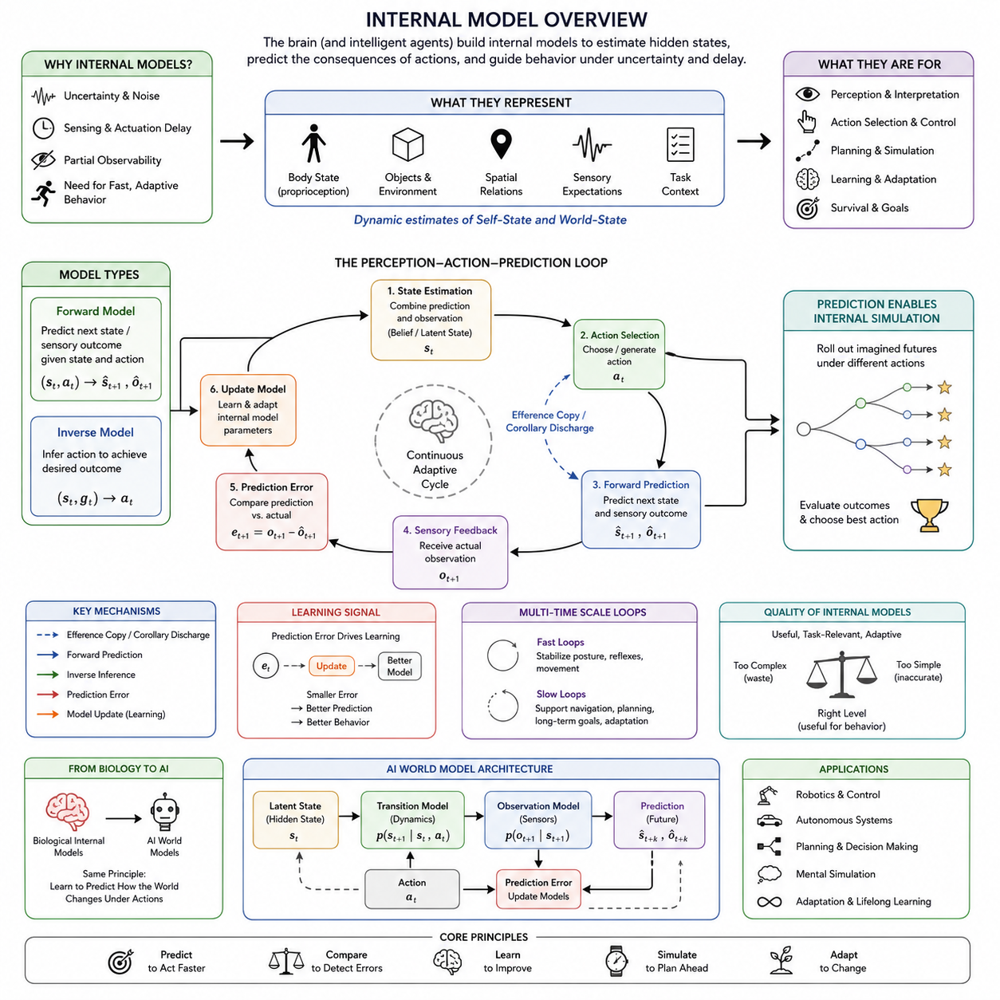{width="7.268055555555556in" height="7.268055555555556in"}

Internal models are neural representations that allow the brain to estimate hidden states, predict the consequences of actions, and regulate behavior before sensory feedback fully arrives. Rather than reacting only to current sensory input, the nervous system continuously constructs estimates of the body and environment. These estimates provide an internal reference against which incoming observations can be interpreted and future states anticipated.

The need for internal models arises because biological perception and action operate under uncertainty, noise, and delay. Sensory signals require time to reach and be processed by the brain, while motor commands also take time to produce physical consequences. A purely reactive controller would therefore respond to outdated information. Internal prediction compensates for these delays by estimating what the body and environment are likely to be doing now and what they may do next.

An internal model does not need to reproduce every physical detail of reality. Instead, it represents information relevant to perception, control, planning, and survival. The brain may maintain estimates of limb position, velocity, balance, external objects, spatial relationships, expected sensory outcomes, and task context. These representations combine into dynamically updated self-state and world-state estimates that support coherent interaction with a changing environment.

A fundamental distinction is between forward models and inverse models. A forward model predicts the consequences of a candidate action: given the current state and a motor command, it estimates the next state or resulting sensory signals. An inverse model addresses the complementary problem by determining which action is likely to produce a desired outcome. Together, these mechanisms provide a computational bridge between goals, actions, predictions, and observed consequences.

Forward prediction becomes particularly important when feedback is delayed or incomplete. When the brain issues a motor command, information related to that command can be internally copied and used to anticipate its expected sensory consequences. This mechanism is commonly associated with efference copy and corollary discharge. By comparing predicted sensory effects with actual sensory input, the nervous system can distinguish expected self-generated changes from unexpected events requiring correction or attention.

The cerebellum is strongly associated with predictive aspects of sensorimotor control. Through repeated experience, neural circuits can learn relationships among motor commands, body dynamics, environmental conditions, and subsequent sensory consequences. Prediction errors provide information for updating these relationships. As learning improves the internal model, movements can become faster, smoother, and more accurate because control increasingly depends on anticipation rather than waiting for delayed feedback.

Internal models therefore participate in a continuous perception-action loop. The nervous system estimates the current state, generates or selects an action, predicts its consequences, receives sensory feedback, measures discrepancies, and updates its estimates. This cycle occurs repeatedly across multiple temporal scales. Fast loops can stabilize posture and movement, while slower loops can support navigation, manipulation, task planning, adaptation, and more extended sequences of goal-directed behavior.

State estimation is essential because the true physical state of the organism is rarely available directly. Sensory measurements provide partial and noisy evidence, while internal predictions provide expectations derived from previous states and actions. Combining prediction with observation produces a more reliable estimate than either source alone. Conceptually, this resembles probabilistic filtering and state estimation methods used in control theory, robotics, autonomous systems, and modern embodied artificial intelligence.

Sensorimotor prediction extends this principle from estimating current conditions to forecasting future sensory experience. Moving the eyes, head, hand, or entire body changes the sensory stream in systematic ways. An internal model can predict these action-dependent transformations and prepare the perceptual system for them. Perception is consequently intertwined with action: what an organism expects to perceive depends partly on what it intends to do and how its body will change the observations it receives.

Action-conditioned prediction provides an especially important connection between neuroscience and artificial intelligence. Predicting future observations without considering actions describes only how a scene might evolve passively. An intelligent agent must instead estimate how alternative actions would alter future states. The predictive problem therefore becomes conditional: from a current internal state and a possible action, estimate the resulting future state, observation, reward, risk, or task-relevant consequence.

Once an internal model can predict action-dependent futures, it can also support internal simulation. Instead of executing every candidate behavior physically, the system can evaluate hypothetical action sequences internally. Multiple possible trajectories can be rolled forward, their expected outcomes compared, and promising actions selected before physical execution. This transforms prediction from a mechanism for motor compensation into a foundation for planning, deliberation, mental simulation, and goal-directed decision making.

Internal simulation also helps explain how intelligence can extend beyond immediate stimulus-response behavior. A system capable of representing states that are not currently observed can reason about possible futures, alternative actions, and counterfactual outcomes. Such simulation remains constrained by the accuracy of the learned internal model: prediction errors accumulate over long horizons, and unfamiliar conditions can produce unreliable imagined trajectories. Effective intelligence therefore requires both simulation and continual correction from reality.

The internal-model perspective also connects naturally with predictive coding. Both emphasize that neural processing involves expectations and discrepancies rather than passive transmission of sensory information. However, internal models in sensorimotor systems place particular emphasis on action, body dynamics, and state transitions. Predictions are not merely about what sensory input should appear, but about how intentional actions transform the relationship among the agent, its body, and the surrounding world.

This perspective provides a major bridge toward AI world models, which the book structure explicitly develops from biological internal models toward computational world modeling. An artificial agent can learn latent representations of its own state and environment, transition models that predict future states, observation models that connect latent states with sensory data, and action-conditioned dynamics that describe how interventions alter future trajectories.

In robotics and embodied AI, these capabilities are especially valuable because an intelligent system must operate under many of the same constraints faced by biological organisms: partial observability, uncertain sensors, actuator dynamics, communication delays, changing environments, and limited opportunities for trial and error. Learned internal models can complement conventional estimation and control by predicting dynamics that are difficult to specify analytically and by adapting those predictions from accumulated experience.

Modern world models expand the internal-model concept across richer sensory and temporal domains. Images, depth, LiDAR, proprioception, language, object relationships, task states, and actions can be compressed into structured or latent representations from which future states are predicted. Generative models, recurrent networks, transformers, state-space models, and other architectures can implement different parts of this process. The central principle remains prediction of how states evolve under possible actions.

A useful distinction is that an internal model is not equivalent to a static memory of the world. Memory provides information derived from previous experience, whereas an operational internal model uses such information to estimate current hidden states and predict transitions. Likewise, perception identifies or estimates what exists now, while predictive modeling estimates what will happen next. Intelligent behavior emerges from the integration of memory, perception, prediction, action selection, feedback, and continual updating.

The quality of an internal model should therefore be judged by its usefulness for behavior rather than by reconstruction accuracy alone. A representation that preserves every visual detail may be computationally expensive while failing to encode variables important for control. Conversely, a compact latent state capturing geometry, motion, affordances, uncertainty, and action consequences may provide a powerful basis for planning. Biological intelligence suggests that useful prediction is selective, hierarchical, task-dependent, and continuously adapted.

Internal models ultimately provide a common computational language connecting neuroscience, control, cognition, robotics, and world-model research. They explain how an intelligent system can move beyond immediate reactions by maintaining estimates of hidden states, anticipating sensory consequences, predicting state transitions, evaluating possible actions, and correcting itself through prediction error. This framework prepares the transition from biological sensorimotor prediction to increasingly general artificial world models and embodied intelligent agents.

내부 모델(Internal Models)은 뇌가 숨겨진 상태(Hidden States)를 추정하고, 행동(Action)의 결과를 예측하며, 감각 피드백(Sensory Feedback)이 완전히 도착하기 전에 행동을 조절할 수 있도록 하는 신경 표현(Neural Representations)입니다. 신경계(Nervous System)는 현재의 감각 입력(Sensory Input)에 단순히 반응하는 것이 아니라 신체와 환경의 상태를 지속적으로 추정합니다. 이러한 추정은 들어오는 관측(Observations)을 해석하고 미래 상태(Future States)를 예상하기 위한 내부 기준을 제공합니다.

내부 모델(Internal Models)이 필요한 이유는 생물학적 지각(Perception)과 행동(Action)이 불확실성(Uncertainty), 잡음(Noise), 지연(Delay)이 존재하는 환경에서 작동하기 때문입니다. 감각 신호(Sensory Signals)가 뇌에 도달하고 처리되는 데에는 시간이 필요하며, 운동 명령(Motor Commands)이 실제 물리적 결과를 발생시키는 데에도 시간이 걸립니다. 따라서 순수한 반응형 제어기(Reactive Controller)는 이미 과거가 된 정보에 대응하게 됩니다. 내부 예측(Internal Prediction)은 신체와 환경이 현재 어떤 상태에 있을 가능성이 높은지, 그리고 다음에 어떻게 변화할지를 추정함으로써 이러한 지연을 보상합니다.

내부 모델(Internal Model)은 현실의 모든 물리적 세부 사항을 그대로 재현할 필요가 없습니다. 대신 지각(Perception), 제어(Control), 계획(Planning), 생존(Survival)에 필요한 정보를 표현합니다. 뇌는 팔다리의 위치와 속도, 균형, 외부 객체(External Objects), 공간적 관계(Spatial Relationships), 예상되는 감각 결과(Expected Sensory Outcomes), 작업 맥락(Task Context) 등을 추정할 수 있습니다. 이러한 표현들은 동적으로 갱신되는 자기 상태(Self-State)와 세계 상태(World-State)의 추정으로 결합되어 변화하는 환경과의 일관된 상호작용을 지원합니다.

가장 기본적인 구분은 순방향 모델(Forward Models)과 역방향 모델(Inverse Models)입니다. 순방향 모델은 후보 행동(Candidate Action)의 결과를 예측합니다. 즉, 현재 상태(Current State)와 운동 명령(Motor Command)이 주어졌을 때 다음 상태(Next State) 또는 그 결과로 발생할 감각 신호(Sensory Signals)를 추정합니다. 반대로 역방향 모델은 원하는 결과(Desired Outcome)를 만들어내기 위해 어떤 행동이 필요한지를 결정합니다. 이 두 메커니즘은 목표(Goals), 행동(Actions), 예측(Predictions), 관측된 결과(Observed Consequences)를 연결하는 계산적 다리(Computational Bridge)를 제공합니다.

순방향 예측(Forward Prediction)은 피드백(Feedback)이 지연되거나 불완전할 때 특히 중요합니다. 뇌가 운동 명령(Motor Command)을 내보낼 때 해당 명령과 관련된 정보가 내부적으로 복사되어 예상되는 감각 결과를 미리 예측하는 데 사용될 수 있습니다. 이러한 메커니즘은 일반적으로 원심성 복사(Efference Copy) 및 수반 방출(Corollary Discharge)과 관련됩니다. 신경계는 예측된 감각 효과(Predicted Sensory Effects)와 실제 감각 입력(Actual Sensory Input)을 비교함으로써 예상된 자기 생성 변화(Self-Generated Changes)와 수정이나 주의가 필요한 예상치 못한 사건(Unexpected Events)을 구별할 수 있습니다.

소뇌(Cerebellum)는 감각운동 제어(Sensorimotor Control)의 예측적 측면과 밀접하게 관련되어 있습니다. 반복적인 경험을 통해 신경 회로(Neural Circuits)는 운동 명령(Motor Commands), 신체 동역학(Body Dynamics), 환경 조건(Environmental Conditions), 이후 발생하는 감각 결과(Sensory Consequences) 사이의 관계를 학습할 수 있습니다. 예측 오류(Prediction Errors)는 이러한 관계를 갱신하기 위한 정보를 제공합니다. 학습을 통해 내부 모델(Internal Model)이 향상되면 제어가 지연된 피드백을 기다리기보다 예측에 점차 의존하게 되므로 움직임은 더욱 빠르고 부드러우며 정확해질 수 있습니다.

따라서 내부 모델(Internal Models)은 지속적인 지각-행동 루프(Perception-Action Loop)에 참여합니다. 신경계는 현재 상태를 추정하고, 행동을 생성하거나 선택하고, 그 결과를 예측하고, 감각 피드백(Sensory Feedback)을 수신하고, 차이(Discrepancies)를 측정한 뒤 자신의 추정치를 갱신합니다. 이러한 순환은 다양한 시간 척도(Temporal Scales)에서 반복적으로 수행됩니다. 빠른 루프(Fast Loops)는 자세와 움직임을 안정화할 수 있으며, 느린 루프(Slower Loops)는 내비게이션(Navigation), 조작(Manipulation), 작업 계획(Task Planning), 적응(Adaptation), 장시간의 목표 지향 행동(Goal-Directed Behavior)을 지원할 수 있습니다.

상태 추정(State Estimation)은 생물체의 실제 물리적 상태(True Physical State)를 직접적으로 알 수 있는 경우가 거의 없기 때문에 필수적입니다. 감각 측정(Sensory Measurements)은 부분적이고 잡음이 포함된 증거를 제공하며, 내부 예측(Internal Predictions)은 이전 상태와 행동에서 도출된 기대를 제공합니다. 예측과 관측을 결합하면 어느 한쪽만 사용하는 것보다 더욱 신뢰할 수 있는 상태 추정치를 얻을 수 있습니다. 개념적으로 이는 제어 이론(Control Theory), 로보틱스(Robotics), 자율 시스템(Autonomous Systems), 현대 체화 인공지능(Embodied Artificial Intelligence)에서 사용되는 확률적 필터링(Probabilistic Filtering) 및 상태 추정 방법과 유사합니다.

감각운동 예측(Sensorimotor Prediction)은 이러한 원리를 현재 상태의 추정에서 미래의 감각 경험(Future Sensory Experience)을 예측하는 영역으로 확장합니다. 눈, 머리, 손 또는 신체 전체를 움직이면 감각 스트림(Sensory Stream)이 체계적으로 변화합니다. 내부 모델(Internal Model)은 이러한 행동 의존적 변환(Action-Dependent Transformations)을 예측하고 지각 시스템(Perceptual System)이 이에 대비하도록 할 수 있습니다. 따라서 지각은 행동과 밀접하게 연결되며, 생물체가 무엇을 지각할 것으로 예상하는지는 부분적으로 무엇을 하려는지와 신체 움직임이 관측을 어떻게 변화시키는지에 따라 결정됩니다.

행동 조건부 예측(Action-Conditioned Prediction)은 신경과학(Neuroscience)과 인공지능(Artificial Intelligence)을 연결하는 특히 중요한 개념입니다. 행동을 고려하지 않고 미래 관측(Future Observations)을 예측하는 것은 장면이 수동적으로 어떻게 변화할 수 있는지만 설명합니다. 지능형 에이전트(Intelligent Agent)는 서로 다른 행동들이 미래 상태를 어떻게 변화시키는지도 추정해야 합니다. 따라서 예측 문제는 현재 내부 상태(Current Internal State)와 가능한 행동(Possible Action)로부터 미래 상태, 관측, 보상(Reward), 위험(Risk), 작업 관련 결과(Task-Relevant Consequence)를 추정하는 조건부 문제로 확장됩니다.

내부 모델(Internal Model)이 행동에 의존하는 미래를 예측할 수 있게 되면 내부 시뮬레이션(Internal Simulation)도 지원할 수 있습니다. 시스템은 모든 후보 행동(Candidate Behaviors)을 실제로 수행하는 대신 가상의 행동 시퀀스(Hypothetical Action Sequences)를 내부적으로 평가할 수 있습니다. 여러 가능한 궤적(Trajectories)을 미래로 전개하고 예상 결과를 비교한 뒤 실제 실행 전에 유망한 행동을 선택할 수 있습니다. 이를 통해 예측은 단순한 운동 보상(Motor Compensation) 메커니즘을 넘어 계획(Planning), 숙고(Deliberation), 정신적 시뮬레이션(Mental Simulation), 목표 지향적 의사결정(Goal-Directed Decision Making)의 기반으로 확장됩니다.

내부 시뮬레이션(Internal Simulation)은 또한 지능이 즉각적인 자극-반응 행동(Stimulus-Response Behavior)을 넘어설 수 있는 방법을 설명하는 데 도움을 줍니다. 현재 관측되지 않는 상태를 표현할 수 있는 시스템은 가능한 미래(Possible Futures), 대안 행동(Alternative Actions), 반사실적 결과(Counterfactual Outcomes)에 대해 추론할 수 있습니다. 그러나 이러한 시뮬레이션은 학습된 내부 모델의 정확성에 의해 제한됩니다. 장기 예측에서는 예측 오류가 누적되며 익숙하지 않은 조건에서는 상상된 궤적(Imagined Trajectories)의 신뢰성이 떨어질 수 있습니다. 따라서 효과적인 지능에는 시뮬레이션뿐 아니라 현실로부터의 지속적인 수정(Continual Correction)이 필요합니다.

내부 모델 관점(Internal-Model Perspective)은 예측 부호화(Predictive Coding)와도 자연스럽게 연결됩니다. 두 접근 모두 신경 처리가 감각 정보를 수동적으로 전달하는 것이 아니라 기대(Expectations)와 차이(Discrepancies)를 활용한다는 점을 강조합니다. 그러나 감각운동 시스템(Sensorimotor Systems)의 내부 모델은 특히 행동(Action), 신체 동역학(Body Dynamics), 상태 전이(State Transitions)를 강조합니다. 예측은 단순히 어떤 감각 입력이 나타나야 하는가에 관한 것이 아니라 의도적인 행동이 에이전트(Agent), 신체(Body), 주변 세계(Surrounding World)의 관계를 어떻게 변화시키는가에 관한 것입니다.

이러한 관점은 인공지능 세계 모델(AI World Models)로 연결되는 중요한 다리를 제공하며, 전체 구성에서도 생물학적 내부 모델(Biological Internal Models)에서 계산적 세계 모델링(Computational World Modeling)으로의 확장을 명시적으로 다룹니다. 인공 에이전트(Artificial Agent)는 자신의 상태와 환경에 대한 잠재 표현(Latent Representations), 미래 상태를 예측하는 전이 모델(Transition Models), 잠재 상태와 감각 데이터를 연결하는 관측 모델(Observation Models), 그리고 개입이 미래 궤적을 어떻게 변화시키는지 설명하는 행동 조건부 동역학(Action-Conditioned Dynamics)을 학습할 수 있습니다.

로보틱스(Robotics)와 체화 인공지능(Embodied AI)에서는 이러한 능력이 특히 중요합니다. 지능형 시스템(Intelligent System)은 부분 관측 가능성(Partial Observability), 불확실한 센서(Uncertain Sensors), 액추에이터 동역학(Actuator Dynamics), 통신 지연(Communication Delays), 변화하는 환경(Changing Environments), 제한된 시행착오 기회(Limited Opportunities for Trial and Error)와 같은 생물체와 유사한 제약 조건에서 작동해야 하기 때문입니다. 학습된 내부 모델은 분석적으로 명시하기 어려운 동역학을 예측하고 축적된 경험을 통해 이러한 예측을 적응시킴으로써 기존의 상태 추정 및 제어 방법을 보완할 수 있습니다.

현대의 세계 모델(World Models)은 내부 모델(Internal Model)의 개념을 더욱 풍부한 감각 및 시간 영역으로 확장합니다. 이미지(Images), 깊이(Depth), 라이다(LiDAR), 고유수용감각(Proprioception), 언어(Language), 객체 관계(Object Relationships), 작업 상태(Task States), 행동(Actions) 등을 구조화된 표현(Structured Representations)이나 잠재 표현(Latent Representations)으로 압축하고, 이를 이용해 미래 상태를 예측할 수 있습니다. 생성 모델(Generative Models), 순환 신경망(Recurrent Networks), 트랜스포머(Transformers), 상태 공간 모델(State-Space Models) 등은 이 과정의 서로 다른 부분을 구현할 수 있으며, 핵심 원리는 가능한 행동 아래에서 상태가 어떻게 변화하는지를 예측하는 것입니다.

여기서 중요한 점은 내부 모델(Internal Model)이 세계에 대한 정적인 기억(Static Memory)과 동일하지 않다는 것입니다. 기억(Memory)은 과거 경험에서 얻은 정보를 제공하지만, 실제로 작동하는 내부 모델은 이러한 정보를 이용하여 현재의 숨겨진 상태를 추정하고 상태 전이(State Transitions)를 예측합니다. 마찬가지로 지각(Perception)은 현재 무엇이 존재하는지를 식별하거나 추정하는 반면, 예측 모델링(Predictive Modeling)은 다음에 무엇이 일어날지를 추정합니다. 지능적 행동(Intelligent Behavior)은 기억, 지각, 예측, 행동 선택(Action Selection), 피드백(Feedback), 지속적인 갱신(Continual Updating)의 통합을 통해 나타납니다.

따라서 내부 모델(Internal Model)의 품질은 단순한 재구성 정확도(Reconstruction Accuracy)가 아니라 행동에 얼마나 유용한가를 기준으로 평가해야 합니다. 모든 시각적 세부 정보를 보존하는 표현은 계산 비용이 매우 높으면서도 제어에 중요한 변수를 제대로 표현하지 못할 수 있습니다. 반대로 기하학(Geometry), 움직임(Motion), 행동유도성(Affordances), 불확실성(Uncertainty), 행동 결과(Action Consequences)를 포착하는 압축된 잠재 상태(Compact Latent State)는 계획을 위한 강력한 기반이 될 수 있습니다. 생물학적 지능(Biological Intelligence)은 유용한 예측이 선택적이고, 계층적이며, 작업 의존적이고, 지속적으로 적응한다는 점을 시사합니다.

궁극적으로 내부 모델(Internal Models)은 신경과학(Neuroscience), 제어(Control), 인지(Cognition), 로보틱스(Robotics), 세계 모델 연구(World-Model Research)를 연결하는 공통의 계산적 언어(Computational Language)를 제공합니다. 내부 모델은 지능형 시스템이 숨겨진 상태를 지속적으로 추정하고, 감각 결과를 예상하며, 상태 전이를 예측하고, 가능한 행동들을 평가하고, 예측 오류(Prediction Error)를 통해 스스로를 수정함으로써 즉각적인 반응을 넘어설 수 있는 방법을 설명합니다. 이러한 프레임워크는 생물학적 감각운동 예측(Biological Sensorimotor Prediction)에서 더욱 일반적인 인공지능 세계 모델(Artificial World Models)과 체화 지능형 에이전트(Embodied Intelligent Agents)로 확장하기 위한 개념적 기반을 제공합니다.

##  

## 09.01 Self State and World State

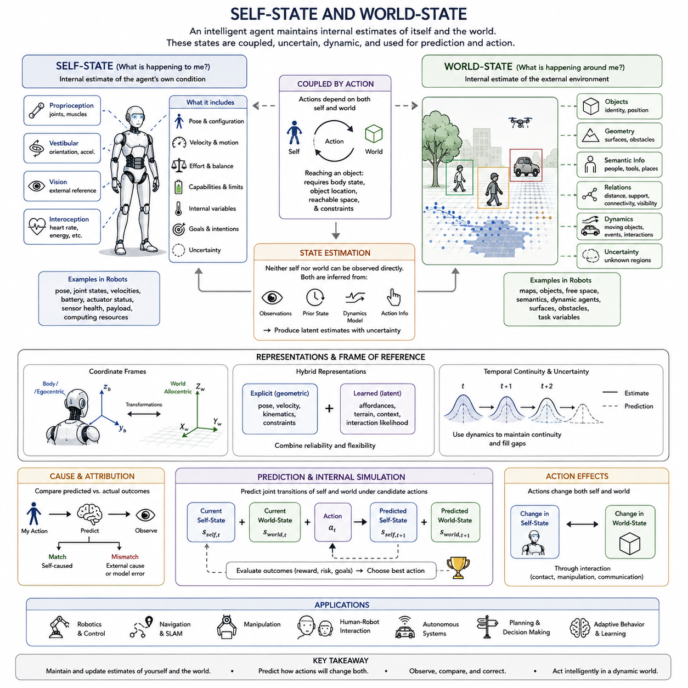{width="7.268055555555556in" height="7.268055555555556in"}

Intelligent behavior depends on maintaining an internal distinction between the state of the self and the state of the surrounding world. Self-state describes the agent's own condition, including body configuration, motion, orientation, internal variables, capabilities, and current goals. World-state describes external objects, spatial relationships, environmental dynamics, other agents, and task-relevant conditions that influence future action.

In biological systems, self-state is constructed from multiple information sources rather than from a single sensor. Proprioception provides information about joint position and muscle state, vestibular signals contribute orientation and acceleration, vision supplies external references, and internal physiological signals indicate bodily condition. The brain combines these signals into a continuously updated estimate of where the body is, how it is moving, and what actions are currently possible.

Self-state is therefore more than a geometric description of body position. It also includes dynamic and functional properties such as velocity, balance, effort, fatigue, contact conditions, uncertainty, and action readiness. A useful internal representation must capture variables that influence control and decision making. In artificial agents, analogous variables may include robot pose, joint configuration, battery level, actuator limits, sensor health, payload condition, or computational resource availability.

World-state represents the external situation in which the agent is embedded. It may include the locations and identities of objects, obstacles, surfaces, people, tools, goals, hazards, and navigable regions. It can also encode relationships such as distance, containment, support, connectivity, visibility, ownership, or potential interaction. These relations are often more useful for intelligent behavior than raw sensory measurements alone.

The distinction between self-state and world-state is conceptually important, but the two are tightly coupled. A visual object has meaning partly because of its position relative to the observer, while the effect of an action depends on both the agent's body configuration and the surrounding environment. Reaching for an object, for example, requires knowledge of object location, arm state, body posture, reachable space, and possible collisions within one coordinated representation.

Because sensory information is incomplete and noisy, neither self-state nor world-state can usually be observed directly. Both must be estimated from partial evidence. The nervous system combines current observations with prior states, expected dynamics, and action information to construct latent estimates. This process allows the agent to maintain continuity even when objects are temporarily hidden, sensors are unreliable, or rapid movements make immediate feedback insufficient.

A self-state estimate can be interpreted as an internal answer to the question, "What is happening to me now?" It includes where the agent is, what configuration it has, how it is moving, and which constraints currently apply. A world-state estimate answers the complementary question, "What is happening around me?" It describes external entities, their relationships, current environmental conditions, and relevant changes that may affect future outcomes.

Coordinate frames play a major role in organizing these representations. Some information can be encoded in body-centered or egocentric coordinates, where locations are represented relative to the agent. Other information can be represented in world-centered or allocentric coordinates, where positions remain stable despite the agent's movement. Effective spatial intelligence often requires transformations between these reference frames so that perception, memory, navigation, and action remain consistent.

Self-state is especially important for predicting the sensory consequences of movement. If the agent knows its current pose and issues an action, an internal model can estimate how the body will change and how the sensory stream should change as a result. Without an adequate estimate of self-state, prediction errors may be incorrectly attributed to the external environment even when they arise from self-generated motion or inaccurate body estimation.

World-state supports complementary predictions about environmental evolution. External objects may move, disappear from view, interact with one another, or respond to the agent's actions. A useful world-state representation must therefore be dynamic rather than purely static. It should encode not only what exists, but also how entities may change over time and how those changes depend on physical interactions, other agents, and intentional actions.

The separation of self and world is also important for causal reasoning. An observed change may have been generated by the agent's own action, by another actor, or by independent environmental dynamics. Comparing predicted action consequences with actual observations can help determine which changes are self-caused and which are externally caused. This ability is fundamental for robust perception, control, adaptation, and interaction with other agents.

In robotics, self-state estimation is commonly associated with variables such as position, orientation, velocity, joint states, actuator status, and uncertainty. These variables are obtained by integrating information from encoders, IMUs, cameras, LiDAR, GNSS, force sensors, and other sources. World-state estimation extends this representation toward maps, objects, free space, semantic classes, dynamic agents, surfaces, obstacles, and task-specific environmental variables.

Modern embodied AI systems increasingly represent self-state and world-state in learned latent spaces. Instead of manually specifying every state variable, neural models can compress multimodal observations into internal representations that preserve information useful for prediction and action. The challenge is ensuring that these latent states retain physically meaningful structure, temporal consistency, uncertainty information, and variables required for downstream control or planning.

A strong internal state representation often combines explicit and learned components. Geometric quantities such as pose or velocity may remain explicitly estimated because they have clear physical meaning, while complex properties such as object affordances, interaction likelihood, terrain type, or social context may be represented through learned features. Hybrid representations can therefore combine the reliability of structured state estimation with the flexibility of neural representation learning.

Temporal continuity is another essential property. Self-state at one moment constrains possible self-states at the next moment, and world-state generally evolves according to physical and task-dependent regularities. Internal models exploit these constraints to reject implausible interpretations and fill temporary gaps in observation. A representation that changes unpredictably from frame to frame is difficult to use for planning, even if individual observations are accurately encoded.

Uncertainty should also be treated as part of state rather than as an afterthought. An agent may know its orientation precisely while being uncertain about its global position, or it may confidently identify an object while remaining uncertain about its velocity. Representing uncertainty helps the system decide whether to act, gather more information, slow down, request assistance, or maintain multiple hypotheses about possible environmental states.

For planning, self-state and world-state must eventually be projected into possible future configurations. A candidate action changes the self-state directly and may also change the world-state through interaction. Internal simulation can therefore be described as predicting joint transitions of the form from current self and world conditions, together with an action, toward future self and world conditions. This joint perspective is central to model-based control and embodied intelligence.

The distinction also clarifies why an AI world model cannot be only a visual prediction system. Predicting future images may capture aspects of environmental change, but effective action requires knowledge of which changes correspond to the agent itself, which belong to external entities, and how actions couple the two. Explicitly or implicitly separating self-state from world-state makes action-conditioned prediction more structured and behaviorally useful.

For autonomous agents, a useful world model should therefore maintain a persistent representation of "me within the world," not merely an isolated map of external reality. Intelligence emerges from continually estimating both sides of this relationship, predicting how actions transform them, observing what actually happens, and updating the model when expectations fail. This creates a closed loop connecting perception, state estimation, prediction, control, and learning.

The self-state and world-state framework provides the foundation for the remaining internal-model mechanisms in this chapter. Forward models predict how these states will change under action, inverse models select actions that can produce desired state transitions, efference-copy mechanisms support prediction of self-generated consequences, and sensory feedback corrects accumulated errors. Together, these processes transform raw observations into an actionable internal representation of an embodied agent operating within a dynamic world.

지능적 행동(Intelligent Behavior)은 자기 상태(Self-State)와 주변 세계 상태(World-State)를 내부적으로 구분하여 유지하는 능력에 의존합니다. 자기 상태는 신체 구성(Body Configuration), 움직임(Motion), 방향(Orientation), 내부 변수(Internal Variables), 능력(Capabilities), 현재 목표(Current Goals)를 포함한 에이전트(Agent) 자신의 상태를 나타냅니다. 세계 상태는 외부 객체(External Objects), 공간적 관계(Spatial Relationships), 환경 동역학(Environmental Dynamics), 다른 에이전트(Other Agents), 그리고 미래 행동에 영향을 미치는 작업 관련 조건(Task-Relevant Conditions)을 나타냅니다.

생물학적 시스템(Biological Systems)에서 자기 상태(Self-State)는 하나의 센서가 아니라 여러 정보원(Information Sources)을 통해 구성됩니다. 고유수용감각(Proprioception)은 관절 위치와 근육 상태에 관한 정보를 제공하고, 전정 감각(Vestibular Signals)은 방향과 가속도 정보를 제공하며, 시각(Vision)은 외부 기준을 제공합니다. 또한 내부 생리 신호(Internal Physiological Signals)는 신체 상태를 나타냅니다. 뇌는 이러한 신호들을 결합하여 신체가 어디에 있고, 어떻게 움직이고 있으며, 현재 어떤 행동이 가능한지를 지속적으로 추정합니다.

따라서 자기 상태(Self-State)는 단순히 신체 위치를 기하학적으로 기술하는 것 이상의 의미를 갖습니다. 여기에는 속도(Velocity), 균형(Balance), 노력(Effort), 피로(Fatigue), 접촉 조건(Contact Conditions), 불확실성(Uncertainty), 행동 준비 상태(Action Readiness)와 같은 동적이고 기능적인 특성도 포함됩니다. 유용한 내부 표현(Internal Representation)은 제어와 의사결정에 영향을 미치는 변수들을 포착해야 합니다. 인공 에이전트(Artificial Agents)에서는 로봇 자세(Robot Pose), 관절 구성(Joint Configuration), 배터리 수준(Battery Level), 액추에이터 한계(Actuator Limits), 센서 상태(Sensor Health), 페이로드 상태(Payload Condition), 계산 자원 가용성(Computational Resource Availability) 등이 이에 해당할 수 있습니다.

세계 상태(World-State)는 에이전트가 존재하는 외부 상황(External Situation)을 표현합니다. 여기에는 객체(Objects), 장애물(Obstacles), 표면(Surfaces), 사람(People), 도구(Tools), 목표(Goals), 위험 요소(Hazards), 이동 가능 영역(Navigable Regions)의 위치와 정체성이 포함될 수 있습니다. 또한 거리(Distance), 포함 관계(Containment), 지지 관계(Support), 연결성(Connectivity), 가시성(Visibility), 소유 관계(Ownership), 잠재적 상호작용(Potential Interaction)과 같은 관계도 표현할 수 있습니다. 이러한 관계는 원시 감각 측정(Raw Sensory Measurements) 자체보다 지능적 행동에 더 유용한 경우가 많습니다.

자기 상태(Self-State)와 세계 상태(World-State)의 구분은 개념적으로 중요하지만 두 상태는 서로 긴밀하게 결합되어 있습니다. 시각적 객체(Visual Object)의 의미는 부분적으로 관찰자와의 상대적 위치에 의해 결정되며, 행동의 효과는 에이전트의 신체 구성과 주변 환경 모두에 의존합니다. 예를 들어 객체를 잡기 위해 손을 뻗는 행동에는 객체 위치(Object Location), 팔 상태(Arm State), 신체 자세(Body Posture), 도달 가능 공간(Reachable Space), 잠재적 충돌(Possible Collisions)에 관한 지식이 하나의 조정된 표현으로 통합되어야 합니다.

감각 정보(Sensory Information)는 불완전하고 잡음이 포함되어 있기 때문에 자기 상태(Self-State)와 세계 상태(World-State) 어느 것도 일반적으로 직접 관측할 수 없습니다. 두 상태 모두 부분적인 증거(Partial Evidence)를 바탕으로 추정해야 합니다. 신경계는 현재 관측(Current Observations)을 이전 상태(Prior States), 예상 동역학(Expected Dynamics), 행동 정보(Action Information)와 결합하여 잠재 상태 추정치(Latent State Estimates)를 구성합니다. 이를 통해 객체가 일시적으로 가려지거나 센서의 신뢰성이 떨어지거나 빠른 움직임으로 즉각적인 피드백이 충분하지 않은 경우에도 상태의 연속성을 유지할 수 있습니다.

자기 상태 추정(Self-State Estimate)은 내부적으로 "지금 나에게 무슨 일이 일어나고 있는가?"라는 질문에 답하는 것으로 이해할 수 있습니다. 여기에는 에이전트가 어디에 있는지, 어떤 구성을 가지고 있는지, 어떻게 움직이고 있는지, 현재 어떤 제약 조건이 적용되고 있는지가 포함됩니다. 세계 상태 추정(World-State Estimate)은 이와 상호보완적인 "내 주변에서는 무슨 일이 일어나고 있는가?"라는 질문에 답합니다. 즉, 외부 개체(External Entities), 이들 사이의 관계, 현재 환경 조건(Environmental Conditions), 미래 결과에 영향을 줄 수 있는 관련 변화(Relevant Changes)를 설명합니다.

좌표계(Coordinate Frames)는 이러한 표현을 구성하는 데 중요한 역할을 합니다. 일부 정보는 위치를 에이전트 기준으로 표현하는 신체 중심(Body-Centered) 또는 자기중심 좌표(Egocentric Coordinates)로 부호화할 수 있습니다. 다른 정보는 에이전트가 움직이더라도 위치가 안정적으로 유지되는 세계 중심(World-Centered) 또는 타자중심 좌표(Allocentric Coordinates)로 표현할 수 있습니다. 효과적인 공간 지능(Spatial Intelligence)을 위해서는 지각, 기억, 내비게이션, 행동의 일관성을 유지할 수 있도록 이러한 기준 좌표계 사이의 변환이 필요합니다.

자기 상태(Self-State)는 움직임에 따른 감각 결과(Sensory Consequences)를 예측하는 데 특히 중요합니다. 에이전트가 자신의 현재 자세(Current Pose)를 알고 특정 행동을 실행하면 내부 모델(Internal Model)은 신체가 어떻게 변화하고 그 결과 감각 스트림(Sensory Stream)이 어떻게 달라질지를 추정할 수 있습니다. 자기 상태를 적절히 추정하지 못하면 실제로는 자기 생성 움직임(Self-Generated Motion)이나 부정확한 신체 상태 추정에서 발생한 예측 오류(Prediction Errors)를 외부 환경의 변화로 잘못 해석할 수 있습니다.

세계 상태(World-State)는 환경 변화(Environmental Evolution)에 관한 상호보완적 예측을 지원합니다. 외부 객체(External Objects)는 이동하거나 시야에서 사라지거나 서로 상호작용하거나 에이전트의 행동에 반응할 수 있습니다. 따라서 유용한 세계 상태 표현(World-State Representation)은 단순히 정적(Static)이어서는 안 되며 동적(Dynamic)이어야 합니다. 무엇이 존재하는지를 나타내는 것뿐만 아니라 개체들이 시간에 따라 어떻게 변화할 수 있는지, 그리고 그러한 변화가 물리적 상호작용(Physical Interactions), 다른 에이전트, 의도적 행동(Intentional Actions)에 어떻게 의존하는지도 표현해야 합니다.

자기(Self)와 세계(World)를 구분하는 것은 인과 추론(Causal Reasoning)에서도 중요합니다. 관측된 변화(Observed Change)는 에이전트 자신의 행동에 의해 발생했을 수도 있고, 다른 행위자(Other Actor)에 의해 발생했을 수도 있으며, 독립적인 환경 동역학(Environmental Dynamics)에 의해 발생했을 수도 있습니다. 예측된 행동 결과(Predicted Action Consequences)와 실제 관측을 비교하면 어떤 변화가 자기 원인(Self-Caused)이고 어떤 변화가 외부 원인(Externally Caused)인지 판단하는 데 도움이 됩니다. 이러한 능력은 강건한 지각(Robust Perception), 제어(Control), 적응(Adaptation), 다른 에이전트와의 상호작용에 필수적입니다.

로보틱스(Robotics)에서 자기 상태 추정(Self-State Estimation)은 일반적으로 위치(Position), 방향(Orientation), 속도(Velocity), 관절 상태(Joint States), 액추에이터 상태(Actuator Status), 불확실성(Uncertainty) 등의 변수와 관련됩니다. 이러한 변수들은 엔코더(Encoders), 관성측정장치(IMUs), 카메라(Cameras), 라이다(LiDAR), 위성항법시스템(GNSS), 힘 센서(Force Sensors) 등의 정보를 통합하여 얻습니다. 세계 상태 추정(World-State Estimation)은 이러한 표현을 지도(Maps), 객체(Objects), 자유 공간(Free Space), 의미 클래스(Semantic Classes), 동적 에이전트(Dynamic Agents), 표면(Surfaces), 장애물(Obstacles), 작업별 환경 변수(Task-Specific Environmental Variables)로 확장합니다.

현대 체화 인공지능(Embodied AI) 시스템은 자기 상태(Self-State)와 세계 상태(World-State)를 학습된 잠재 공간(Learned Latent Spaces)에서 표현하는 방향으로 발전하고 있습니다. 모든 상태 변수를 사람이 직접 지정하는 대신 신경 모델(Neural Models)이 다중모달 관측(Multimodal Observations)을 예측과 행동에 유용한 내부 표현으로 압축할 수 있습니다. 여기서 중요한 과제는 이러한 잠재 상태(Latent States)가 물리적으로 의미 있는 구조, 시간적 일관성(Temporal Consistency), 불확실성 정보(Uncertainty Information), 그리고 후속 제어 및 계획에 필요한 변수들을 유지하도록 하는 것입니다.

강력한 내부 상태 표현(Internal State Representation)은 명시적 구성요소(Explicit Components)와 학습된 구성요소(Learned Components)를 결합하는 경우가 많습니다. 자세(Pose)나 속도(Velocity)와 같은 기하학적 양은 명확한 물리적 의미를 가지므로 명시적으로 추정할 수 있는 반면, 객체 행동유도성(Object Affordances), 상호작용 가능성(Interaction Likelihood), 지형 유형(Terrain Type), 사회적 맥락(Social Context)과 같은 복잡한 특성은 학습된 특징(Learned Features)으로 표현할 수 있습니다. 따라서 하이브리드 표현(Hybrid Representations)은 구조화된 상태 추정의 신뢰성과 신경 표현 학습(Neural Representation Learning)의 유연성을 결합할 수 있습니다.

시간적 연속성(Temporal Continuity) 또한 필수적인 특성입니다. 한 시점의 자기 상태(Self-State)는 다음 시점에 가능한 자기 상태를 제한하며, 세계 상태(World-State)는 일반적으로 물리적이고 작업 의존적인 규칙성(Task-Dependent Regularities)에 따라 변화합니다. 내부 모델(Internal Models)은 이러한 제약을 이용하여 비현실적인 해석을 제거하고 관측이 일시적으로 누락된 부분을 보완합니다. 각각의 관측을 정확하게 부호화하더라도 프레임(Frame)마다 표현이 예측 불가능하게 변화한다면 계획(Planning)에 활용하기 어렵습니다.

불확실성(Uncertainty) 역시 부수적인 요소가 아니라 상태(State)의 일부로 취급해야 합니다. 에이전트는 자신의 방향은 정확히 알고 있지만 전역 위치(Global Position)에 대해서는 불확실할 수 있으며, 객체의 정체는 확실히 알고 있지만 속도에 대해서는 불확실할 수 있습니다. 불확실성을 표현하면 시스템이 즉시 행동할 것인지, 추가 정보를 수집할 것인지, 속도를 줄일 것인지, 도움을 요청할 것인지, 또는 가능한 여러 환경 상태에 대한 복수 가설(Multiple Hypotheses)을 유지할 것인지 결정하는 데 도움이 됩니다.

계획(Planning)을 위해서는 자기 상태(Self-State)와 세계 상태(World-State)를 결국 가능한 미래 구성(Future Configurations)으로 투영해야 합니다. 후보 행동(Candidate Action)은 자기 상태를 직접 변화시키며 상호작용을 통해 세계 상태도 변화시킬 수 있습니다. 따라서 내부 시뮬레이션(Internal Simulation)은 현재의 자기 상태와 세계 상태 그리고 행동으로부터 미래의 자기 상태와 세계 상태로 이어지는 결합 전이(Joint Transitions)를 예측하는 과정으로 설명할 수 있습니다. 이러한 결합 관점(Joint Perspective)은 모델 기반 제어(Model-Based Control)와 체화 지능(Embodied Intelligence)의 핵심입니다.

이러한 구분은 인공지능 세계 모델(AI World Model)이 단순한 시각 예측 시스템(Visual Prediction System)에 머물러서는 안 되는 이유도 명확하게 보여줍니다. 미래 이미지(Future Images)를 예측하면 환경 변화의 일부 측면을 포착할 수 있지만, 효과적인 행동을 위해서는 어떤 변화가 에이전트 자체에 해당하고 어떤 변화가 외부 개체에 속하며 행동이 이 둘을 어떻게 연결하는지를 알아야 합니다. 자기 상태(Self-State)와 세계 상태(World-State)를 명시적으로 또는 암묵적으로 분리하면 행동 조건부 예측(Action-Conditioned Prediction)을 더욱 구조적이고 행동에 유용하게 만들 수 있습니다.

따라서 자율 에이전트(Autonomous Agents)를 위한 유용한 세계 모델(World Model)은 외부 현실에 대한 고립된 지도만 유지하는 것이 아니라 "세계 속의 나(Me Within the World)"에 대한 지속적인 표현(Persistent Representation)을 유지해야 합니다. 지능(Intelligence)은 이러한 관계의 양쪽을 지속적으로 추정하고, 행동이 두 상태를 어떻게 변화시킬지를 예측하고, 실제로 발생한 결과를 관측하며, 예상이 빗나갔을 때 모델을 갱신하는 과정에서 나타납니다. 이를 통해 지각(Perception), 상태 추정(State Estimation), 예측(Prediction), 제어(Control), 학습(Learning)이 연결된 폐루프(Closed Loop)가 형성됩니다.

자기 상태(Self-State)와 세계 상태(World-State) 프레임워크는 이 장에서 이어지는 내부 모델 메커니즘(Internal-Model Mechanisms)의 기반을 제공합니다. 순방향 모델(Forward Models)은 행동에 따라 이러한 상태들이 어떻게 변화할지를 예측하고, 역방향 모델(Inverse Models)은 원하는 상태 전이(Desired State Transitions)를 만들어낼 수 있는 행동을 선택합니다. 원심성 복사(Efference Copy) 메커니즘은 자기 생성 결과(Self-Generated Consequences)의 예측을 지원하며, 감각 피드백(Sensory Feedback)은 누적된 오류를 수정합니다. 이러한 과정들은 원시 관측(Raw Observations)을 동적인 세계 안에서 행동하는 체화 에이전트(Embodied Agent)의 실행 가능한 내부 표현(Actionable Internal Representation)으로 변환합니다.

##  

## 09.02 Forward Models [w/Code]

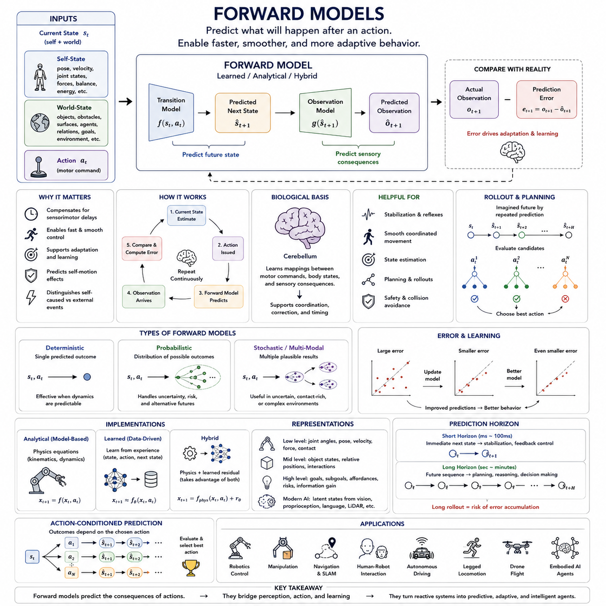{width="7.268055555555556in" height="7.268055555555556in"}

Forward models are internal predictive mechanisms that estimate what will happen after an action is issued. Given a current state and a motor command, a forward model predicts the next state of the body, the environment, or the expected sensory consequences. In biological systems, this capability allows the nervous system to anticipate change before delayed feedback arrives, making movement and perception faster, more stable, and more adaptive.

The basic computational idea can be expressed as a transition from the current state and action to a predicted future state. If the current internal state is represented as s_t and the selected action as a_t, the forward model estimates a future state such as ŝ_t+1. It may also predict a future observation ô_t+1. The model therefore captures how actions transform states and how those transformed states are expected to appear through the sensory system.

Forward models are especially valuable because neural and physical systems contain unavoidable delays. Motor commands require time to produce muscle contraction and body movement, while sensory signals require additional time to return to the brain. If control depended only on the most recent incoming measurement, behavior would always lag behind reality. Predictive estimation reduces this delay by internally computing likely consequences before complete feedback becomes available.

In sensorimotor control, a copy of the outgoing motor command can be provided to the forward model. This internal signal is closely associated with efference copy and corollary discharge. Rather than waiting to observe what the action eventually caused, the nervous system uses information about the command itself to generate an expectation. The resulting prediction can then be compared with actual sensory feedback when it arrives.

This comparison produces prediction error, one of the most important signals for adaptation. If the predicted sensory consequence closely matches the observed outcome, the current internal model is supported. If the two differ significantly, the discrepancy suggests that the model, state estimate, environment, or action execution was inaccurate. Repeated prediction errors can therefore drive learning and progressively improve the system's estimate of body and environmental dynamics.

Forward prediction also helps distinguish self-generated sensory events from externally generated events. When an agent moves its eyes, head, limbs, or entire body, large changes can appear in the sensory stream even though the external world itself has not changed in the same way. Predicting the expected effects of self-motion allows the nervous system to discount or interpret these changes correctly rather than treating every sensory variation as an independent external event.

The effectiveness of a forward model depends strongly on the quality of the current state estimate. Predicting the consequence of an action requires knowledge of the state from which that action begins. The same motor command can produce very different outcomes depending on posture, velocity, contact conditions, load, terrain, or surrounding obstacles. Forward modeling is therefore tightly coupled with self-state and world-state estimation rather than operating as an isolated mechanism.

A useful forward model can predict more than one type of variable. It may estimate joint position, body pose, velocity, force, contact state, balance, visual change, tactile feedback, or object movement. At higher levels, it may predict whether an action will achieve a subgoal, create a collision risk, reveal new information, or modify the relationship between the agent and another object. Prediction can therefore exist across multiple levels of abstraction.

The cerebellum is frequently discussed as an important biological structure related to forward predictive control. Through experience, cerebellar circuits can learn systematic relationships among motor commands, body states, and resulting sensory consequences. Such learned mappings support rapid correction and coordination. Rather than controlling movement only after errors become visible, predictive mechanisms allow corrective tendencies to begin before large deviations fully develop.

Forward models also contribute to smooth and coordinated movement. Complex actions require many body components to change simultaneously, and feedback from each component may arrive at different times. Predicting how one part of the movement should evolve relative to another allows the system to maintain temporal coordination. This principle is important in reaching, walking, balance, eye movement, manipulation, and other behaviors requiring tightly synchronized control.

Prediction can operate over multiple temporal horizons. A short-horizon forward model may predict the immediate next state within milliseconds or fractions of a second, supporting stabilization and low-level control. Longer-horizon models can predict sequences of future states across seconds or more. These longer predictions are increasingly useful for planning, navigation, manipulation, and evaluating alternative behaviors before physical execution.

Extending prediction beyond one step naturally leads to rollout. The predicted next state can be treated as the input state for another forward prediction, generating a sequence of imagined future states. Repeated application creates an internal trajectory. Such rollouts allow an agent to estimate where a sequence of actions may lead without first executing the entire sequence in the real environment, connecting sensorimotor prediction directly to planning.

However, multi-step rollout introduces an important limitation: prediction error can accumulate. Even a small error in one predicted state becomes part of the input for the next prediction, causing imagined trajectories to gradually diverge from reality. Long-horizon planning therefore requires uncertainty estimation, periodic correction from observations, robust representations, or methods that avoid excessive reliance on precise frame-by-frame prediction.

Forward models can be deterministic or probabilistic. A deterministic model produces a single predicted outcome for a given state and action. This can be effective when system dynamics are highly predictable. In uncertain environments, however, the same action may lead to several plausible outcomes. Probabilistic forward models represent distributions or multiple hypotheses, allowing the agent to reason about uncertainty, risk, and alternative future possibilities.

In robotics, the classical form of a forward model may be derived directly from physical equations describing kinematics and dynamics. Given actuator commands, such models calculate expected changes in position, orientation, velocity, force, or joint configuration. These analytic models can be highly reliable when system parameters are known, but their accuracy may degrade when friction, payload, terrain, contact, wear, or unmodeled interactions become significant.

Learned forward models provide an alternative or complementary approach. Neural networks can learn state-transition relationships directly from recorded experience. By observing tuples of current state, action, and resulting next state, a model can approximate dynamics that may be difficult to describe analytically. This is particularly useful for deformable objects, contact-rich manipulation, complex terrain, human interaction, and systems with unknown or changing physical properties.

Hybrid models combine explicit physics with learned residual prediction. A conventional dynamics model can provide a physically grounded baseline, while a learned component estimates systematic errors or unmodeled effects. This approach can preserve interpretability and stability while adding flexibility. In embodied AI, such combinations are attractive because they exploit known structure without assuming that all real-world dynamics can be captured by fixed equations.

Modern AI world models generalize the idea of forward modeling beyond conventional control variables. Instead of predicting only joint angles or robot pose, they may predict future latent representations constructed from vision, depth, language, proprioception, LiDAR, or multimodal sensor streams. The transition model receives the current latent state and action and predicts how the internal representation is expected to evolve over time.

Action conditioning is critical in these models. A predictor that ignores action may learn statistical temporal patterns, but it cannot properly represent controllable dynamics. An embodied agent must distinguish between what will happen if it turns left, moves forward, grasps an object, waits, or interacts with another agent. Forward modeling therefore provides the mechanism through which a world model becomes useful for intervention rather than passive forecasting.

Forward models can also support planning by evaluating candidate actions. Multiple possible actions can be supplied to the predictive model, producing multiple possible future trajectories. The agent can then compare predicted outcomes according to goal achievement, reward, safety, energy consumption, collision probability, or other criteria. Action selection becomes a process of choosing the future that appears most desirable before committing to costly physical behavior.

The relationship between forward models and inverse models is complementary. A forward model answers, "If I perform this action from this state, what will happen?" An inverse model answers, "Given a desired outcome, what action should I perform?" Forward models are especially useful for testing candidate actions, while inverse models provide direct action generation. Intelligent motor behavior can combine both mechanisms rather than depending exclusively on either one.

Forward prediction is also closely connected to active inference and predictive processing. An agent does not merely predict what the world will do independently of itself; it predicts observations conditioned on its own possible actions. Action and perception are therefore linked through expected consequences. Prediction errors can update internal beliefs, while action can change the world so that future observations become more consistent with desired or expected states.

For artificial agents, the most useful forward model is not necessarily the model that reproduces every sensory detail most accurately. Prediction should preserve variables relevant to behavior. A compact model that correctly predicts collision, reachability, object motion, terrain response, or task success may be more valuable than one that generates visually perfect future images while missing action-relevant structure. Behavioral usefulness is therefore a central evaluation criterion.

Forward models ultimately transform action from a purely reactive command into a predictive intervention. By estimating future self-state, world-state, and sensory consequences before they fully occur, the system gains the ability to compensate for delay, detect unexpected events, adapt its dynamics model, simulate alternatives, and plan ahead. This mechanism forms one of the key foundations connecting biological motor control with model-based robotics, embodied AI, and modern world models.

순방향 모델(Forward Models)은 행동(Action)이 실행된 이후 어떤 일이 발생할지를 추정하는 내부 예측 메커니즘(Internal Predictive Mechanisms)입니다. 현재 상태(Current State)와 운동 명령(Motor Command)이 주어지면 순방향 모델은 신체, 환경 또는 예상되는 감각 결과(Expected Sensory Consequences)의 다음 상태(Next State)를 예측합니다. 생물학적 시스템(Biological Systems)에서 이러한 능력은 지연된 피드백(Delayed Feedback)이 도착하기 전에 신경계가 변화를 예상하도록 하여 움직임과 지각을 더욱 빠르고 안정적이며 적응적으로 만듭니다.

기본적인 계산 개념은 현재 상태와 행동으로부터 예측된 미래 상태(Predicted Future State)로의 전이(Transition)로 표현할 수 있습니다. 현재 내부 상태(Current Internal State)를 s_t, 선택된 행동(Selected Action)을 a_t라고 하면 순방향 모델은 ŝ_t+1과 같은 미래 상태를 추정합니다. 또한 미래 관측(Future Observation) ô_t+1을 예측할 수도 있습니다. 따라서 이 모델은 행동이 상태를 어떻게 변화시키는지, 그리고 변화된 상태가 감각 시스템(Sensory System)을 통해 어떻게 나타날지를 포착합니다.

순방향 모델(Forward Models)은 신경계와 물리적 시스템에 피할 수 없는 지연(Delay)이 존재하기 때문에 특히 중요합니다. 운동 명령(Motor Commands)이 근육 수축과 신체 움직임을 만들어내기까지 시간이 필요하며, 감각 신호(Sensory Signals)가 다시 뇌로 돌아오는 데에도 추가적인 시간이 필요합니다. 제어가 가장 최근에 들어온 측정값에만 의존한다면 행동은 항상 실제 상황보다 늦게 반응하게 됩니다. 예측적 추정(Predictive Estimation)은 완전한 피드백이 도착하기 전에 예상되는 결과를 내부적으로 계산함으로써 이러한 지연을 줄입니다.

감각운동 제어(Sensorimotor Control)에서는 외부로 전달되는 운동 명령의 복사본이 순방향 모델(Forward Model)에 제공될 수 있습니다. 이러한 내부 신호는 원심성 복사(Efference Copy) 및 수반 방출(Corollary Discharge)과 밀접하게 관련되어 있습니다. 신경계는 행동이 실제로 어떤 결과를 만들어냈는지를 기다리는 대신 명령 자체에 관한 정보를 이용하여 기대 결과(Expectation)를 생성합니다. 이렇게 생성된 예측은 실제 감각 피드백(Actual Sensory Feedback)이 도착했을 때 서로 비교될 수 있습니다.

이러한 비교는 적응(Adaptation)을 위한 가장 중요한 신호 중 하나인 예측 오류(Prediction Error)를 생성합니다. 예측된 감각 결과(Predicted Sensory Consequence)가 관측된 결과와 거의 일치하면 현재의 내부 모델(Internal Model)이 타당하다는 것을 의미합니다. 두 결과가 크게 다르면 모델, 상태 추정(State Estimate), 환경 또는 행동 실행(Action Execution) 중 일부가 부정확했을 가능성을 나타냅니다. 따라서 반복적으로 발생하는 예측 오류는 학습을 유도하고 신체 및 환경 동역학(Environmental Dynamics)에 대한 시스템의 추정 능력을 점진적으로 향상시킬 수 있습니다.

순방향 예측(Forward Prediction)은 자기 생성 감각 사건(Self-Generated Sensory Events)과 외부에서 생성된 사건(Externally Generated Events)을 구별하는 데에도 도움을 줍니다. 에이전트가 눈, 머리, 팔다리 또는 신체 전체를 움직이면 외부 세계 자체가 동일한 방식으로 변하지 않았더라도 감각 스트림(Sensory Stream)에는 큰 변화가 나타날 수 있습니다. 자기 움직임(Self-Motion)에 따른 예상 효과를 예측하면 신경계는 모든 감각 변화를 독립적인 외부 사건으로 해석하지 않고 이러한 변화를 적절히 보정하거나 해석할 수 있습니다.

순방향 모델(Forward Model)의 효과는 현재 상태 추정(Current State Estimate)의 품질에 크게 의존합니다. 행동의 결과를 예측하려면 그 행동이 어떤 상태에서 시작되는지를 알아야 합니다. 동일한 운동 명령이라도 자세(Posture), 속도(Velocity), 접촉 조건(Contact Conditions), 하중(Load), 지형(Terrain), 주변 장애물(Surrounding Obstacles)에 따라 매우 다른 결과를 만들어낼 수 있습니다. 따라서 순방향 모델링(Forward Modeling)은 독립적으로 작동하는 메커니즘이 아니라 자기 상태(Self-State) 및 세계 상태(World-State) 추정과 긴밀하게 결합되어 있습니다.

유용한 순방향 모델(Forward Model)은 한 가지 종류의 변수만 예측하는 것이 아닙니다. 관절 위치(Joint Position), 신체 자세(Body Pose), 속도(Velocity), 힘(Force), 접촉 상태(Contact State), 균형(Balance), 시각적 변화(Visual Change), 촉각 피드백(Tactile Feedback), 객체 움직임(Object Movement) 등을 추정할 수 있습니다. 더 높은 수준에서는 행동이 하위 목표(Subgoal)를 달성할지, 충돌 위험(Collision Risk)을 발생시킬지, 새로운 정보를 제공할지, 또는 에이전트와 다른 객체 사이의 관계를 변화시킬지도 예측할 수 있습니다. 따라서 예측은 여러 추상화 수준(Levels of Abstraction)에서 이루어질 수 있습니다.

소뇌(Cerebellum)는 순방향 예측 제어(Forward Predictive Control)와 관련된 중요한 생물학적 구조로 자주 논의됩니다. 경험을 통해 소뇌 회로(Cerebellar Circuits)는 운동 명령, 신체 상태(Body States), 그리고 그 결과로 발생하는 감각 결과 사이의 체계적인 관계를 학습할 수 있습니다. 이러한 학습된 대응 관계는 빠른 수정과 협응(Coordination)을 지원합니다. 오류가 완전히 나타난 이후에만 움직임을 제어하는 것이 아니라 예측 메커니즘(Predictive Mechanisms)을 이용하여 큰 편차가 발생하기 전에 수정 동작을 시작할 수 있습니다.

순방향 모델(Forward Models)은 부드럽고 협응된 움직임(Smooth and Coordinated Movement)에도 기여합니다. 복잡한 행동에서는 여러 신체 구성요소가 동시에 변화해야 하며 각 구성요소로부터의 피드백은 서로 다른 시점에 도착할 수 있습니다. 움직임의 한 부분이 다른 부분과 비교하여 어떻게 변화해야 하는지를 예측하면 시스템은 시간적 협응(Temporal Coordination)을 유지할 수 있습니다. 이러한 원리는 손 뻗기(Reaching), 보행(Walking), 균형 유지(Balance), 안구 운동(Eye Movement), 조작(Manipulation) 등 정밀하게 동기화된 제어가 필요한 행동에서 중요합니다.

예측(Prediction)은 여러 시간 범위(Temporal Horizons)에 걸쳐 작동할 수 있습니다. 단기 순방향 모델(Short-Horizon Forward Model)은 밀리초 또는 수분의 일 초 이내의 즉각적인 다음 상태를 예측하여 안정화와 저수준 제어(Low-Level Control)를 지원할 수 있습니다. 장기 모델(Longer-Horizon Models)은 수초 이상의 미래 상태 시퀀스(Future State Sequences)를 예측할 수 있습니다. 이러한 장기 예측은 계획(Planning), 내비게이션(Navigation), 조작(Manipulation), 실제 실행 전에 대안 행동을 평가하는 과정에서 점점 더 중요해집니다.

예측을 한 단계 이상으로 확장하면 자연스럽게 롤아웃(Rollout)으로 이어집니다. 예측된 다음 상태를 다시 새로운 순방향 예측의 입력 상태로 사용하여 상상된 미래 상태(Imagined Future States)의 연속적인 시퀀스를 생성할 수 있습니다. 이러한 과정을 반복하면 내부 궤적(Internal Trajectory)이 형성됩니다. 롤아웃을 이용하면 에이전트가 전체 행동 시퀀스를 실제 환경에서 먼저 수행하지 않고도 그 행동들이 어디로 이어질지를 추정할 수 있으므로 감각운동 예측과 계획이 직접적으로 연결됩니다.

그러나 다단계 롤아웃(Multi-Step Rollout)은 예측 오류(Prediction Error)가 누적될 수 있다는 중요한 한계를 갖습니다. 한 번의 예측에서 발생한 작은 오류도 다음 예측의 입력에 포함되기 때문에 상상된 궤적(Imagined Trajectory)은 점차 현실에서 벗어날 수 있습니다. 따라서 장기 계획(Long-Horizon Planning)을 위해서는 불확실성 추정(Uncertainty Estimation), 실제 관측을 통한 주기적인 수정(Periodic Correction), 강건한 표현(Robust Representations), 또는 지나치게 정밀한 프레임 단위 예측에 대한 의존성을 줄이는 방법이 필요합니다.

순방향 모델(Forward Models)은 결정론적(Deterministic)일 수도 있고 확률론적(Probabilistic)일 수도 있습니다. 결정론적 모델은 특정 상태와 행동에 대해 하나의 예측 결과를 생성하며, 시스템 동역학이 매우 예측 가능한 경우 효과적일 수 있습니다. 그러나 불확실한 환경에서는 동일한 행동이 여러 가지 가능한 결과를 만들어낼 수 있습니다. 확률론적 순방향 모델(Probabilistic Forward Models)은 분포(Distributions) 또는 복수 가설(Multiple Hypotheses)을 표현하여 에이전트가 불확실성, 위험(Risk), 다양한 미래 가능성에 대해 추론할 수 있도록 합니다.

로보틱스(Robotics)에서 전통적인 순방향 모델(Forward Model)은 운동학(Kinematics)과 동역학(Dynamics)을 설명하는 물리 방정식으로부터 직접 구성될 수 있습니다. 액추에이터 명령(Actuator Commands)이 주어지면 이러한 모델은 위치(Position), 방향(Orientation), 속도, 힘 또는 관절 구성(Joint Configuration)의 예상 변화를 계산합니다. 시스템 파라미터가 알려져 있다면 이러한 해석적 모델(Analytic Models)은 높은 신뢰성을 제공하지만 마찰(Friction), 페이로드(Payload), 지형, 접촉(Contact), 마모(Wear), 모델링되지 않은 상호작용(Unmodeled Interactions)이 중요해지면 정확도가 저하될 수 있습니다.

학습 기반 순방향 모델(Learned Forward Models)은 이러한 접근법의 대안 또는 보완 방법을 제공합니다. 신경망(Neural Networks)은 기록된 경험으로부터 상태 전이(State-Transition) 관계를 직접 학습할 수 있습니다. 현재 상태, 행동, 그 결과로 발생한 다음 상태의 튜플(Tuples)을 관측함으로써 분석적으로 표현하기 어려운 동역학을 근사할 수 있습니다. 이러한 접근법은 변형 가능한 객체(Deformable Objects), 접촉이 많은 조작(Contact-Rich Manipulation), 복잡한 지형, 인간과의 상호작용(Human Interaction), 알려지지 않았거나 변화하는 물리적 특성을 가진 시스템에서 특히 유용합니다.

하이브리드 모델(Hybrid Models)은 명시적 물리 모델(Explicit Physics)과 학습된 잔차 예측(Learned Residual Prediction)을 결합합니다. 기존 동역학 모델은 물리적으로 타당한 기준선(Physically Grounded Baseline)을 제공하고, 학습된 구성요소는 체계적인 오류 또는 모델링되지 않은 효과를 추정할 수 있습니다. 이러한 접근법은 해석 가능성(Interpretability)과 안정성(Stability)을 유지하면서 유연성을 추가할 수 있습니다. 체화 인공지능(Embodied AI)에서는 알려진 구조를 활용하면서도 현실 세계의 모든 동역학을 고정된 방정식으로 표현할 수 있다고 가정하지 않기 때문에 이러한 결합 방식이 유용합니다.

현대 인공지능 세계 모델(AI World Models)은 순방향 모델링(Forward Modeling)의 개념을 전통적인 제어 변수 이상으로 일반화합니다. 관절 각도(Joint Angles)나 로봇 자세만 예측하는 대신 시각(Vision), 깊이(Depth), 언어(Language), 고유수용감각(Proprioception), 라이다(LiDAR), 다중모달 센서 스트림(Multimodal Sensor Streams)으로부터 구성된 미래 잠재 표현(Future Latent Representations)을 예측할 수 있습니다. 전이 모델(Transition Model)은 현재 잠재 상태(Current Latent State)와 행동을 입력받아 내부 표현이 시간에 따라 어떻게 변화할지를 예측합니다.

이러한 모델에서는 행동 조건화(Action Conditioning)가 매우 중요합니다. 행동을 무시하는 예측기는 통계적인 시간 패턴(Statistical Temporal Patterns)을 학습할 수 있지만 제어 가능한 동역학(Controllable Dynamics)을 제대로 표현할 수 없습니다. 체화 에이전트(Embodied Agent)는 왼쪽으로 회전하거나, 앞으로 이동하거나, 객체를 잡거나, 기다리거나, 다른 에이전트와 상호작용할 때 각각 어떤 일이 발생할지를 구별해야 합니다. 따라서 순방향 모델링은 세계 모델(World Model)이 수동적인 미래 예측을 넘어 실제 개입(Intervention)에 유용해지도록 만드는 핵심 메커니즘을 제공합니다.

순방향 모델(Forward Models)은 후보 행동(Candidate Actions)을 평가함으로써 계획(Planning)을 지원할 수도 있습니다. 여러 가능한 행동을 예측 모델에 입력하면 여러 가능한 미래 궤적(Future Trajectories)을 생성할 수 있습니다. 이후 에이전트는 목표 달성(Goal Achievement), 보상(Reward), 안전성(Safety), 에너지 소비(Energy Consumption), 충돌 확률(Collision Probability) 등의 기준에 따라 예측 결과를 비교할 수 있습니다. 행동 선택(Action Selection)은 비용이 큰 실제 행동을 실행하기 전에 가장 바람직해 보이는 미래를 선택하는 과정으로 변화합니다.

순방향 모델(Forward Models)과 역방향 모델(Inverse Models)은 상호보완적인 관계를 갖습니다. 순방향 모델은 "이 상태에서 이 행동을 수행하면 어떤 일이 일어날 것인가?"라는 질문에 답합니다. 반면 역방향 모델은 "원하는 결과를 얻으려면 어떤 행동을 수행해야 하는가?"라는 질문에 답합니다. 순방향 모델은 후보 행동을 시험하는 데 특히 유용하며, 역방향 모델은 직접적인 행동 생성(Action Generation)을 제공합니다. 지능적인 운동 행동(Intelligent Motor Behavior)은 어느 하나에만 의존하기보다 두 메커니즘을 결합할 수 있습니다.

순방향 예측(Forward Prediction)은 능동 추론(Active Inference) 및 예측 처리(Predictive Processing)와도 밀접하게 연결됩니다. 에이전트는 세계가 자신과 무관하게 어떻게 변화할지만 예측하는 것이 아니라 자신이 수행할 수 있는 행동에 따라 어떤 관측이 나타날지를 예측합니다. 따라서 행동과 지각(Action and Perception)은 예상 결과(Expected Consequences)를 통해 연결됩니다. 예측 오류는 내부 믿음(Internal Beliefs)을 갱신할 수 있으며, 행동은 미래 관측이 원하는 상태 또는 예상 상태와 더욱 일치하도록 세계를 변화시킬 수 있습니다.

인공 에이전트(Artificial Agents)에게 가장 유용한 순방향 모델(Forward Model)이 반드시 모든 감각적 세부 사항을 가장 정확하게 재현하는 모델인 것은 아닙니다. 예측은 행동에 필요한 변수들을 보존해야 합니다. 충돌(Collision), 도달 가능성(Reachability), 객체 움직임(Object Motion), 지형 반응(Terrain Response), 작업 성공(Task Success)을 정확하게 예측하는 압축된 모델(Compact Model)은 시각적으로 완벽한 미래 이미지를 생성하지만 행동과 관련된 구조를 놓치는 모델보다 더 가치가 있을 수 있습니다. 따라서 행동적 유용성(Behavioral Usefulness)은 순방향 모델을 평가하는 핵심 기준입니다.

궁극적으로 순방향 모델(Forward Models)은 행동(Action)을 단순한 반응적 명령(Reactive Command)에서 예측적 개입(Predictive Intervention)으로 변화시킵니다. 시스템은 미래의 자기 상태(Self-State), 세계 상태(World-State), 감각 결과(Sensory Consequences)가 실제로 완전히 발생하기 전에 이를 추정함으로써 지연을 보상하고, 예상하지 못한 사건을 탐지하고, 동역학 모델(Dynamics Model)을 적응시키고, 대안 행동을 시뮬레이션하며, 미래를 계획할 수 있습니다. 이러한 메커니즘은 생물학적 운동 제어(Biological Motor Control)를 모델 기반 로보틱스(Model-Based Robotics), 체화 인공지능(Embodied AI), 현대 세계 모델(Modern World Models)과 연결하는 핵심 기반 가운데 하나입니다.

##  

## 09.03 Inverse Models [w/Code]

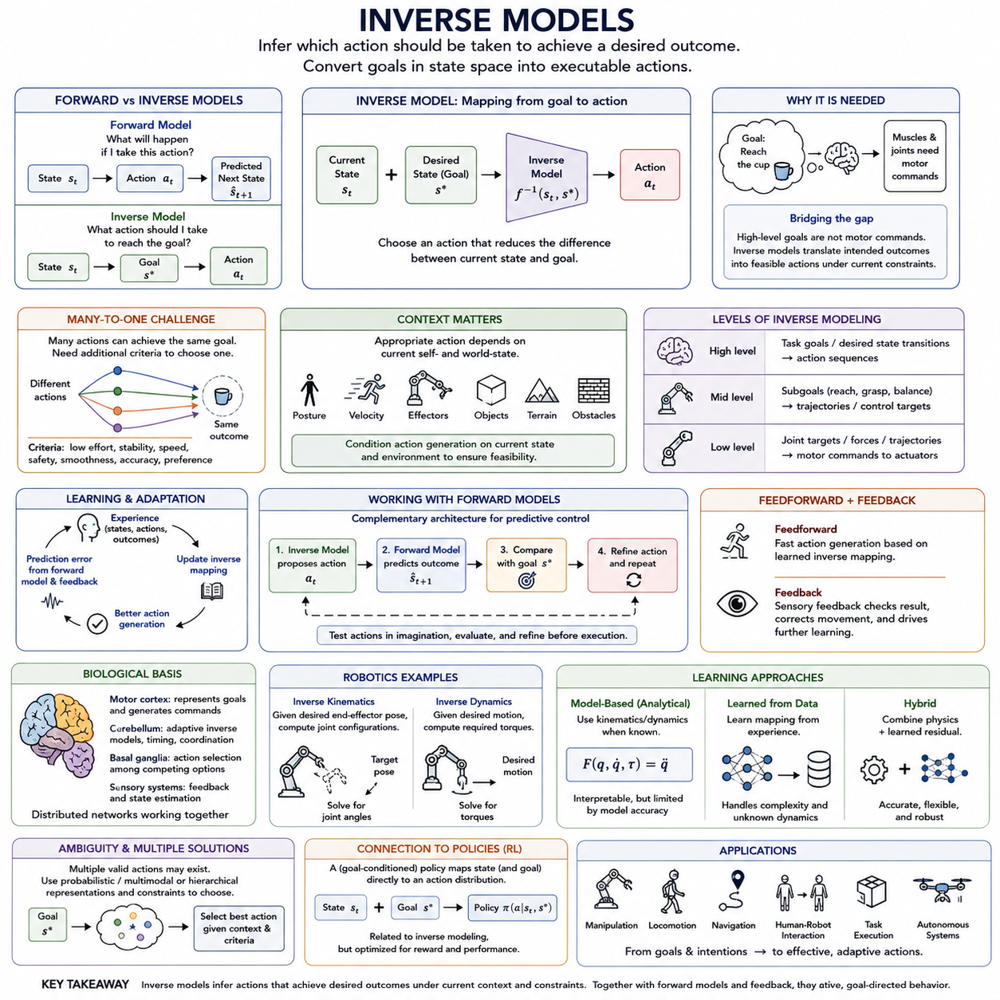{width="7.268055555555556in" height="7.268055555555556in"}

Inverse models are internal computational mechanisms that infer which action should be produced to achieve a desired outcome. Whereas a forward model predicts the consequence of an action, an inverse model begins with the current state and a target state and estimates an appropriate motor command or action. This distinction places inverse models at the center of goal-directed sensorimotor control and action generation.

The basic inverse problem can be expressed as a mapping from the current state and desired future state to an action. If the current state is represented by s_t and the desired state by s\*, an inverse model estimates an action a_t capable of reducing the difference between them. In this sense, the model converts an intention expressed in state space into a command that can influence the body or environment.

This computation is necessary because goals are usually specified differently from motor commands. A person may intend to place a hand on an object, maintain balance, or move toward a location, but muscles and joints must receive detailed control signals. The nervous system therefore requires mechanisms that transform desired consequences into coordinated patterns of action while respecting the current configuration and physical constraints of the body.

The inverse problem is often more difficult than forward prediction because multiple actions can produce the same or similar outcome. A hand can reach a location through different joint configurations, and a mobile agent may reach a destination through multiple trajectories. This many-to-one relationship means that inverse modeling frequently requires additional criteria such as effort, stability, speed, safety, smoothness, accuracy, or learned preference.

Context is therefore essential for selecting among alternative solutions. The action appropriate for a desired outcome depends on posture, velocity, available effectors, obstacles, terrain, object properties, and task requirements. An inverse model cannot simply associate one goal with one fixed command. It must condition action generation on the agent's current self-state and relevant world-state so that the selected behavior is feasible in the present situation.

Inverse models can operate at different levels of abstraction. At a low level, they may transform a desired joint position, force, or trajectory into motor commands. At an intermediate level, they may determine how an arm should move to grasp an object or how the body should shift to maintain balance. At higher levels, related inverse computations can map task goals or desired state transitions into coordinated action sequences.

This hierarchical interpretation is useful because complex behavior cannot usually be generated as one enormous transformation from abstract intention to individual actuator commands. A high-level goal can first be decomposed into subgoals, which are then translated into trajectories, control targets, and finally motor commands. Inverse computations can therefore participate at several stages, connecting increasingly concrete representations of what the system wants to achieve.

Learning is particularly important because accurate inverse mappings are difficult to specify in advance. During development and practice, an organism experiences relationships among commands, movements, and outcomes. Repeated interaction allows the nervous system to improve mappings from desired consequences to effective actions. Successful commands can be reinforced, while systematic errors provide evidence that the action-generating mapping needs to be modified.

Forward models provide an important mechanism for training and evaluating inverse models. After an inverse model proposes an action, a forward model can predict the consequence of that action before or during execution. The predicted state can then be compared with the desired state. If the predicted result is inadequate, the action can be modified. Forward and inverse models can therefore form a complementary predictive-control architecture rather than functioning independently.

This relationship can support internal action testing. Instead of physically executing every possible motor command, an inverse model can generate candidate actions and a forward model can simulate their likely consequences. Candidate outcomes can be evaluated against goals and constraints, allowing unsuitable actions to be rejected internally. Such interaction provides a computational bridge from basic sensorimotor control toward planning and mental simulation.

Inverse models are also closely related to feedforward control. Once a reliable relationship between a desired movement and the required motor command has been learned, an appropriate command can be generated rapidly without waiting for extensive sensory correction. This is valuable for movements that must occur faster than feedback loops can fully compensate. Skilled actions can therefore become smooth and efficient through predictive and learned action generation.

Feedback nevertheless remains essential because inverse models are never perfectly accurate. Body dynamics can change with fatigue, injury, load, or posture, while environmental properties such as friction and resistance can vary unexpectedly. Sensory feedback reveals whether the generated action actually produced the intended result. The controller can then correct the ongoing movement and use accumulated errors to improve future action generation.

The cerebellum is frequently associated with adaptive internal models involved in predictive motor control, timing, coordination, and error-driven learning. More broadly, inverse action generation should not be interpreted as the function of a single isolated brain region. Goal-directed movement emerges from interactions among cortical motor areas, cerebellar circuits, basal ganglia, sensory systems, and other networks that jointly represent goals, select actions, predict consequences, and correct errors.

The basal ganglia provide a particularly relevant complementary function because producing a movement requires not only computing possible commands but also selecting among competing actions. Value, context, learned habits, and expected consequences can influence which candidate behavior is permitted or favored. Inverse modeling therefore intersects with the broader problem of action selection, while remaining conceptually focused on converting desired outcomes into actions.

In robotics, inverse kinematics provides a clear mathematical example of an inverse problem. Given a desired end-effector position and orientation, the system determines joint configurations capable of achieving that pose. Inverse dynamics extends the problem by determining forces or torques required to generate a desired motion. These engineered methods illustrate the same general direction of computation: from desired physical consequences toward commands.

Classical inverse models can be constructed analytically when the robot's geometry and dynamics are well characterized. Such models provide interpretable and physically grounded solutions, but real environments often introduce uncertainties that are difficult to capture exactly. Contact, friction, flexible materials, payload changes, actuator nonlinearities, and complex terrain can make purely analytic inverse mappings inaccurate or computationally demanding.

Learned inverse models address this difficulty by acquiring action mappings from data. A neural model can observe states, goals, actions, and outcomes and learn which actions tend to produce particular state transitions. Demonstrations from humans or other controllers can provide supervised examples, while reinforcement learning and trial-and-error interaction can improve policies according to task success, reward, safety, or efficiency.

However, direct inverse learning contains an ambiguity problem when several valid actions correspond to the same desired result. A model trained to average incompatible solutions may produce an action that is not itself useful. Probabilistic, multimodal, hierarchical, or policy-based representations can better preserve multiple candidate solutions. Additional context and constraints can then determine which solution is appropriate for the current situation.

Modern embodied AI generalizes inverse modeling beyond traditional motor equations. An agent may receive a goal expressed as a target state, object configuration, waypoint, task instruction, or language command and must infer actions that move the world toward that goal. The inverse problem consequently becomes a central component of manipulation, navigation, locomotion, human-robot interaction, and autonomous task execution.

This perspective also reveals a connection between inverse models and policies in reinforcement learning. A policy maps a state, and sometimes a goal, directly to an action distribution. Functionally, a goal-conditioned policy can perform an inverse-like computation by determining which actions are appropriate for achieving a desired condition. The concepts are not identical, but both address the fundamental problem of converting state and objective information into behavior.

World models can reduce the burden placed on a purely direct inverse mapping. Rather than requiring one network to know the correct action for every possible goal and situation, an agent can combine an action generator with a predictive world model. Candidate actions can be proposed, simulated, compared, and refined. This architecture allows action generation to benefit from explicit reasoning about future consequences and uncertainty.

Inverse models also contribute to adaptation when the body or environment changes. If an actuator weakens, a payload is added, or the geometry of an available tool changes, previously learned commands may no longer produce the desired result. Prediction and sensory error can reveal this mismatch, allowing the inverse mapping to be recalibrated. Adaptive action generation is therefore essential for robust embodied intelligence operating outside fixed laboratory conditions.

For artificial intelligence, the most useful interpretation of an inverse model is not simply a mathematical inversion of a forward model. Real systems may be nonlinear, partially observable, stochastic, and non-invertible, with many actions leading to similar outcomes. An inverse model is better understood as a mechanism for inferring useful actions under goals and constraints, potentially representing several valid solutions rather than a single exact inverse.

Forward and inverse models consequently answer complementary questions within the same internal-model framework. Forward models ask what is likely to happen if a particular action is taken, while inverse models ask what action could produce a desired change. Combined with state estimation, sensory feedback, action selection, and learning, these mechanisms create a closed predictive-control loop connecting intention, action, consequence, error, and adaptation.

Ultimately, inverse models transform desired outcomes into executable behavior. They allow an embodied system to move from representing where it wants to be toward determining what it should do next. When integrated with forward prediction and feedback, inverse modeling supports rapid control, skilled movement, planning, adaptation, and goal-directed autonomy, providing an important bridge from biological sensorimotor intelligence to robotics and intelligent AI agents.

역방향 모델(Inverse Models)은 원하는 결과(Desired Outcome)를 달성하기 위해 어떤 행동(Action)을 생성해야 하는지를 추론하는 내부 계산 메커니즘(Internal Computational Mechanisms)입니다. 순방향 모델(Forward Model)이 어떤 행동의 결과를 예측하는 반면, 역방향 모델은 현재 상태(Current State)와 목표 상태(Target State)에서 시작하여 적절한 운동 명령(Motor Command) 또는 행동을 추정합니다. 이러한 차이는 역방향 모델을 목표 지향적 감각운동 제어(Goal-Directed Sensorimotor Control)와 행동 생성(Action Generation)의 중심에 위치시킵니다.

기본적인 역문제(Inverse Problem)는 현재 상태와 원하는 미래 상태(Desired Future State)에서 행동으로 이어지는 매핑(Mapping)으로 표현할 수 있습니다. 현재 상태를 s_t, 원하는 상태를 s\*로 표현하면 역방향 모델은 두 상태의 차이를 줄일 수 있는 행동 a_t를 추정합니다. 이러한 의미에서 역방향 모델은 상태 공간(State Space)에서 표현된 의도(Intention)를 신체나 환경에 영향을 줄 수 있는 명령으로 변환합니다.

이러한 계산이 필요한 이유는 목표(Goals)가 일반적으로 운동 명령(Motor Commands)과는 다른 방식으로 표현되기 때문입니다. 사람은 손을 어떤 물체 위에 놓거나, 균형을 유지하거나, 특정 위치로 이동하려는 의도를 가질 수 있지만 실제로는 근육과 관절에 상세한 제어 신호(Control Signals)가 전달되어야 합니다. 따라서 신경계는 원하는 결과를 현재 신체 구성(Current Body Configuration)과 물리적 제약 조건(Physical Constraints)을 고려한 조정된 행동 패턴으로 변환하는 메커니즘을 필요로 합니다.

역문제(Inverse Problem)는 여러 행동이 동일하거나 유사한 결과를 만들어낼 수 있기 때문에 순방향 예측(Forward Prediction)보다 더 어려운 경우가 많습니다. 손은 여러 관절 구성(Joint Configurations)을 통해 동일한 위치에 도달할 수 있으며, 이동 에이전트(Mobile Agent)도 여러 경로(Trajectories)를 통해 같은 목적지에 도달할 수 있습니다. 이러한 다대일 관계(Many-to-One Relationship)는 역방향 모델링에 노력(Effort), 안정성(Stability), 속도(Speed), 안전성(Safety), 부드러움(Smoothness), 정확도(Accuracy), 학습된 선호(Learned Preference)와 같은 추가적인 기준이 필요함을 의미합니다.

따라서 대안적인 해법(Alternative Solutions) 가운데 하나를 선택하기 위해서는 맥락(Context)이 필수적입니다. 원하는 결과에 적합한 행동은 자세(Posture), 속도(Velocity), 사용 가능한 효과기(Effector), 장애물(Obstacles), 지형(Terrain), 객체 특성(Object Properties), 작업 요구사항(Task Requirements)에 따라 달라집니다. 역방향 모델은 하나의 목표를 하나의 고정 명령(Fixed Command)에 단순히 연결할 수 없으며, 현재 자기 상태(Self-State)와 관련된 세계 상태(World-State)에 조건부로 행동을 생성해야 합니다.

역방향 모델(Inverse Models)은 서로 다른 추상화 수준(Levels of Abstraction)에서 작동할 수 있습니다. 낮은 수준에서는 원하는 관절 위치(Joint Position), 힘(Force), 궤적(Trajectory)을 운동 명령으로 변환할 수 있습니다. 중간 수준에서는 객체를 잡기 위해 팔을 어떻게 움직일지 또는 균형을 유지하기 위해 신체를 어떻게 이동할지를 결정할 수 있습니다. 더 높은 수준에서는 작업 목표(Task Goals)나 원하는 상태 전이(Desired State Transitions)를 조정된 행동 시퀀스(Action Sequences)로 매핑할 수 있습니다.

이러한 계층적 해석(Hierarchical Interpretation)은 복잡한 행동이 하나의 거대한 변환을 통해 추상적인 의도에서 개별 액추에이터 명령까지 직접 생성되기 어렵다는 점에서 유용합니다. 상위 수준 목표(High-Level Goal)는 먼저 하위 목표(Subgoals)로 분해되고, 이후 궤적(Trajectories), 제어 목표(Control Targets), 최종적인 운동 명령으로 단계적으로 변환될 수 있습니다. 따라서 역방향 계산(Inverse Computations)은 시스템이 원하는 결과를 점점 더 구체적인 형태로 변환하는 여러 단계에 참여할 수 있습니다.

정확한 역방향 매핑(Inverse Mappings)은 사전에 완벽하게 지정하기 어렵기 때문에 학습(Learning)이 특히 중요합니다. 발달과 연습 과정에서 생물체는 명령(Commands), 움직임(Movements), 결과(Outcomes) 사이의 관계를 경험합니다. 반복적인 상호작용은 신경계가 원하는 결과에서 효과적인 행동으로 이어지는 매핑을 개선하도록 합니다. 성공적인 명령은 강화될 수 있으며, 체계적인 오류(Systematic Errors)는 행동 생성 매핑을 수정해야 한다는 증거를 제공합니다.

순방향 모델(Forward Models)은 역방향 모델(Inverse Models)을 훈련하고 평가하는 데 중요한 메커니즘을 제공합니다. 역방향 모델이 행동을 제안한 이후 순방향 모델은 실행 전이나 실행 중에 해당 행동의 결과를 예측할 수 있습니다. 이후 예측된 상태(Predicted State)를 원하는 상태(Desired State)와 비교할 수 있습니다. 예측 결과가 충분하지 않다면 행동을 수정할 수 있으므로 순방향 모델과 역방향 모델은 독립적으로 작동하기보다 상호보완적인 예측 제어 구조(Predictive-Control Architecture)를 구성할 수 있습니다.

이러한 관계는 내부 행동 시험(Internal Action Testing)을 가능하게 합니다. 가능한 모든 운동 명령을 실제로 실행하는 대신 역방향 모델이 후보 행동(Candidate Actions)을 생성하고 순방향 모델이 그 결과를 내부적으로 시뮬레이션할 수 있습니다. 각 후보 결과를 목표 및 제약 조건과 비교하여 적절하지 않은 행동은 실제 실행 전에 제거할 수 있습니다. 이러한 상호작용은 기본적인 감각운동 제어에서 계획(Planning)과 정신적 시뮬레이션(Mental Simulation)으로 이어지는 계산적 다리(Computational Bridge)를 제공합니다.

역방향 모델(Inverse Models)은 피드포워드 제어(Feedforward Control)와도 밀접하게 연결됩니다. 원하는 움직임과 필요한 운동 명령 사이의 신뢰할 수 있는 관계를 학습하면 광범위한 감각 보정(Sensory Correction)을 기다리지 않고도 적절한 명령을 빠르게 생성할 수 있습니다. 이는 피드백 루프(Feedback Loops)가 완전히 보정하기 어려울 만큼 빠르게 수행되어야 하는 움직임에서 특히 중요합니다. 따라서 숙련된 행동(Skilled Actions)은 예측적이고 학습된 행동 생성을 통해 더욱 부드럽고 효율적으로 수행될 수 있습니다.

그럼에도 불구하고 역방향 모델(Inverse Models)이 항상 완벽한 것은 아니기 때문에 피드백(Feedback)은 여전히 필수적입니다. 신체 동역학(Body Dynamics)은 피로(Fatigue), 부상(Injury), 하중(Load), 자세 변화에 따라 달라질 수 있으며, 마찰(Friction)이나 저항(Resistance)과 같은 환경적 특성도 예상치 못하게 변화할 수 있습니다. 감각 피드백은 생성된 행동이 실제로 의도한 결과를 만들었는지를 알려주며, 제어기는 진행 중인 움직임을 수정하고 누적된 오류를 이용해 이후의 행동 생성을 개선할 수 있습니다.

소뇌(Cerebellum)는 예측 운동 제어(Predictive Motor Control), 타이밍(Timing), 협응(Coordination), 오류 기반 학습(Error-Driven Learning)에 관여하는 적응적 내부 모델(Adaptive Internal Models)과 자주 연관됩니다. 그러나 역방향 행동 생성(Inverse Action Generation)은 하나의 고립된 뇌 영역의 기능으로 이해해서는 안 됩니다. 목표 지향적 움직임은 운동 피질 영역(Cortical Motor Areas), 소뇌 회로(Cerebellar Circuits), 기저핵(Basal Ganglia), 감각 시스템(Sensory Systems), 기타 네트워크 간의 상호작용을 통해 형성됩니다.

기저핵(Basal Ganglia)은 가능한 명령을 계산하는 것뿐 아니라 경쟁하는 행동들 가운데 하나를 선택해야 한다는 점에서 특히 중요한 상호보완적 기능을 제공합니다. 가치(Value), 맥락(Context), 학습된 습관(Learned Habits), 예상 결과(Expected Consequences)는 어떤 후보 행동이 허용되거나 우선시되는지에 영향을 줄 수 있습니다. 따라서 역방향 모델링은 원하는 결과를 행동으로 변환하는 데 초점을 두면서도 더 넓은 행동 선택(Action Selection) 문제와 연결됩니다.

로보틱스(Robotics)에서 역기구학(Inverse Kinematics)은 역문제의 명확한 수학적 예시를 제공합니다. 원하는 말단 효과기(End-Effector)의 위치와 방향이 주어지면 시스템은 해당 자세를 달성할 수 있는 관절 구성을 계산합니다. 역동역학(Inverse Dynamics)은 원하는 움직임을 발생시키기 위해 필요한 힘 또는 토크(Force or Torque)를 계산하는 문제로 확장됩니다. 이러한 공학적 방법은 원하는 물리적 결과에서 명령으로 이어지는 동일한 기본 계산 방향을 보여줍니다.

로봇의 기하학(Geometry)과 동역학(Dynamics)이 충분히 알려져 있다면 전통적인 역방향 모델은 해석적으로 구성할 수 있습니다. 이러한 모델은 해석 가능하고 물리적 기반이 명확한 해법을 제공하지만 현실 환경에서는 정확하게 모델링하기 어려운 불확실성이 자주 발생합니다. 접촉(Contact), 마찰, 유연한 재료(Flexible Materials), 페이로드 변화(Payload Changes), 액추에이터 비선형성(Actuator Nonlinearities), 복잡한 지형은 순수한 해석적 역방향 매핑의 정확성을 떨어뜨리거나 계산량을 증가시킬 수 있습니다.

학습 기반 역방향 모델(Learned Inverse Models)은 데이터를 통해 행동 매핑을 학습함으로써 이러한 어려움을 해결합니다. 신경 모델(Neural Model)은 상태(States), 목표(Goals), 행동(Actions), 결과(Outcomes)를 관측하면서 특정 상태 전이를 만들어내는 행동을 학습할 수 있습니다. 인간 또는 다른 제어기의 시연(Demonstrations)은 지도 학습 예시를 제공할 수 있으며, 강화학습(Reinforcement Learning)과 시행착오 상호작용(Trial-and-Error Interaction)은 작업 성공(Task Success), 보상(Reward), 안전성(Safety), 효율성(Efficiency)에 따라 정책을 개선할 수 있습니다.

하지만 동일한 원하는 결과에 여러 유효한 행동이 대응할 수 있기 때문에 직접적인 역방향 학습(Direct Inverse Learning)에는 모호성(Ambiguity) 문제가 존재합니다. 서로 양립하지 않는 여러 해법을 단순 평균한 모델은 실제로 유용하지 않은 행동을 생성할 수 있습니다. 확률론적(Probabilistic), 다중모달(Multimodal), 계층적(Hierarchical), 정책 기반(Policy-Based) 표현은 여러 후보 해법을 더욱 잘 유지할 수 있으며, 추가적인 맥락과 제약 조건을 이용해 현재 상황에 적절한 해법을 선택할 수 있습니다.

현대 체화 인공지능(Embodied AI)은 역방향 모델링(Inverse Modeling)을 전통적인 운동 방정식 이상으로 일반화합니다. 에이전트는 목표 상태(Target State), 객체 구성(Object Configuration), 웨이포인트(Waypoint), 작업 지시(Task Instruction), 언어 명령(Language Command)으로 표현된 목표를 입력받고 그 목표를 향해 세계를 변화시키는 행동을 추론해야 할 수 있습니다. 따라서 역문제는 조작(Manipulation), 내비게이션(Navigation), 이동(Locomotion), 인간-로봇 상호작용(Human-Robot Interaction), 자율 작업 수행(Autonomous Task Execution)의 핵심 구성요소가 됩니다.

이러한 관점은 역방향 모델(Inverse Models)과 강화학습의 정책(Policies) 사이의 연결도 보여줍니다. 정책은 상태(State), 경우에 따라 목표(Goal)를 입력받아 행동 분포(Action Distribution)로 매핑합니다. 기능적으로 목표 조건부 정책(Goal-Conditioned Policy)은 원하는 상태를 달성하기 위해 어떤 행동이 적절한지를 결정한다는 점에서 역방향 계산과 유사한 역할을 수행할 수 있습니다. 두 개념이 완전히 동일한 것은 아니지만 상태와 목표 정보를 행동으로 변환한다는 근본적인 문제를 공유합니다.

세계 모델(World Models)은 순수한 직접 역방향 매핑(Direct Inverse Mapping)에 부과되는 부담을 줄일 수 있습니다. 하나의 네트워크가 모든 가능한 목표와 상황에서 정확한 행동을 알고 있어야 하는 대신 에이전트는 행동 생성기(Action Generator)와 예측 세계 모델(Predictive World Model)을 결합할 수 있습니다. 후보 행동을 생성하고, 시뮬레이션하고, 비교하고, 수정함으로써 행동 생성 과정에 미래 결과(Future Consequences)와 불확실성(Uncertainty)에 대한 명시적인 추론을 포함할 수 있습니다.

역방향 모델(Inverse Models)은 신체 또는 환경이 변화했을 때 적응(Adaptation)하는 데에도 기여합니다. 액추에이터 성능이 약해지거나, 페이로드가 추가되거나, 사용하는 도구의 기하학이 변하면 이전에 학습된 명령으로는 더 이상 원하는 결과를 만들지 못할 수 있습니다. 예측 및 감각 오류(Prediction and Sensory Error)는 이러한 불일치를 드러내며 역방향 매핑을 다시 보정할 수 있도록 합니다. 따라서 적응적 행동 생성(Adaptive Action Generation)은 고정된 실험실 조건을 벗어난 환경에서 작동하는 강건한 체화 지능(Robust Embodied Intelligence)에 필수적입니다.

인공지능(Artificial Intelligence)에서 역방향 모델(Inverse Model)을 가장 유용하게 이해하는 방법은 단순히 순방향 모델의 수학적 역함수(Mathematical Inverse)로 보는 것이 아닙니다. 실제 시스템은 비선형(Nonlinear), 부분 관측 가능(Partially Observable), 확률적(Stochastic), 비가역적(Non-Invertible)일 수 있으며 여러 행동이 비슷한 결과를 만들어낼 수 있습니다. 따라서 역방향 모델은 하나의 정확한 역해법보다 목표와 제약 조건 아래에서 유용한 행동을 추론하고 여러 유효한 해법을 표현할 수 있는 메커니즘으로 이해하는 것이 더 적절합니다.

결국 순방향 모델(Forward Models)과 역방향 모델(Inverse Models)은 동일한 내부 모델 프레임워크(Internal-Model Framework) 안에서 서로 보완적인 질문에 답합니다. 순방향 모델은 특정 행동을 취하면 어떤 일이 발생할 가능성이 높은지를 묻는 반면, 역방향 모델은 원하는 변화를 만들어내기 위해 어떤 행동을 해야 하는지를 묻습니다. 이들은 상태 추정(State Estimation), 감각 피드백(Sensory Feedback), 행동 선택(Action Selection), 학습과 결합되어 의도(Intention), 행동, 결과(Consequence), 오류(Error), 적응을 연결하는 폐쇄형 예측 제어 루프(Closed Predictive-Control Loop)를 형성합니다.

궁극적으로 역방향 모델(Inverse Models)은 원하는 결과(Desired Outcomes)를 실제로 실행 가능한 행동(Executable Behavior)으로 변환합니다. 체화 시스템(Embodied System)이 자신이 어디에 도달하고 싶은지를 표현하는 단계에서 다음에 무엇을 해야 하는지를 결정하는 단계로 넘어갈 수 있도록 합니다. 순방향 예측(Forward Prediction)과 피드백이 결합되면 역방향 모델링은 빠른 제어, 숙련된 움직임, 계획, 적응, 목표 지향적 자율성(Goal-Directed Autonomy)을 지원하며 생물학적 감각운동 지능(Biological Sensorimotor Intelligence)을 로보틱스와 지능형 인공지능 에이전트(Intelligent AI Agents)로 연결하는 중요한 다리를 제공합니다.

##  

## 09.04 Efference Copy and Corollary Discharge [w/Code]

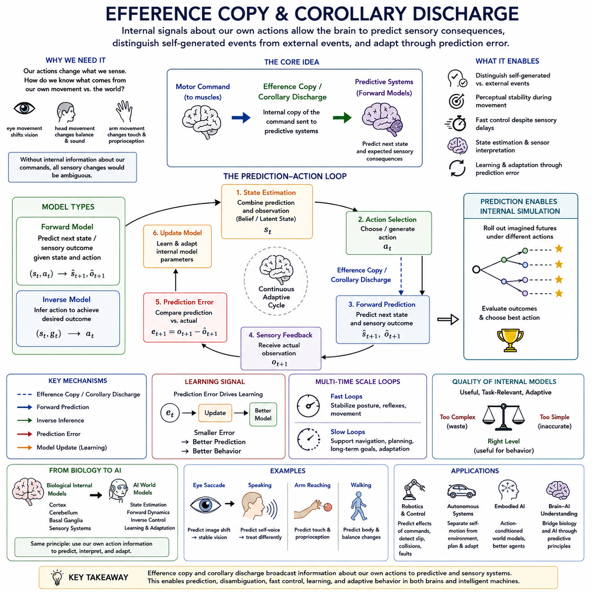{width="7.268055555555556in" height="7.268055555555556in"}

Efference copy and corollary discharge are neural mechanisms that allow the nervous system to predict the sensory consequences of its own actions. When a motor command is generated, information related to that command can be internally transmitted to sensory or predictive systems. This provides an advance estimate of how perception should change because of self-generated movement rather than because of external events.

The central problem addressed by these mechanisms is that action itself changes sensory input. Moving the eyes shifts the visual image, moving the head changes vestibular and auditory signals, and moving a limb alters proprioceptive and tactile feedback. Without information about outgoing motor commands, the nervous system would have difficulty determining whether a sensory change was produced by the external world or by its own behavior.

Efference copy is commonly described as an internal copy or representation of an outgoing motor command. The original command is sent toward muscles or other effectors, while related information is routed internally to predictive circuits. This copy is not another physical movement command. Its functional role is to provide the nervous system with information about what action is being initiated so that expected consequences can be computed.

Corollary discharge refers more broadly to signals derived from motor activity that modify or prepare sensory processing. The terms efference copy and corollary discharge are often used closely together, although they can emphasize somewhat different aspects of the same computational principle. Both concern the internal communication of action-related information from motor systems toward circuits that interpret or predict sensory consequences.

Within an internal-model framework, efference copy can serve as an input to a forward model. The current estimated state and a representation of the motor command are combined to predict the next state and expected sensory observation. If the current state is s_t and the action is a_t, the predictive system can estimate ŝ_t+1 and ô_t+1 before the actual sensory consequences have been fully observed.

When real sensory feedback arrives, the nervous system can compare it with the predicted sensory consequence. A close match indicates that the observed change is consistent with the agent\'s own action. A mismatch produces prediction error, signaling that something unexpected occurred. The difference may reflect an external disturbance, inaccurate state estimation, an incorrect internal dynamics model, or unsuccessful execution of the intended action.

This comparison provides a mechanism for distinguishing self-generated events from externally generated events. If turning the head causes the visual field to shift exactly as predicted, much of that visual motion can be attributed to self-motion. If an object moves differently from the expected pattern, the discrepancy may indicate independent motion in the environment. Such attribution is essential for stable perception during continuous movement.

Eye movements provide a particularly intuitive example. The retinal image changes rapidly every time the eyes move, yet the visual world is generally perceived as relatively stable. Action-related signals allow visual processing systems to anticipate part of the sensory transformation associated with eye movement. The brain therefore interprets retinal change in relation to predicted self-motion rather than assuming that the entire external world has suddenly moved.

Similar principles apply to touch and proprioception. When a person actively moves a hand across a surface, the resulting tactile and joint signals are partly predictable from the motor command. The nervous system can compare these expectations with incoming feedback to estimate contact, resistance, slipping, or unexpected obstacles. Prediction allows sensory information to be interpreted in the context of what the body was attempting to do.

Auditory processing can also depend on predictions of self-generated consequences. Actions such as speaking produce strong sensory signals generated by the organism itself. Internal action-related information can alter how expected self-produced sounds are processed. The important computational idea is not simply suppression, but contextual interpretation: expected sensory consequences can be treated differently from surprising signals that may carry new external information.

These mechanisms therefore contribute to sensory stability rather than merely reducing sensory intensity. The nervous system must preserve useful information while avoiding confusion between changes caused by the self and changes caused by the world. Corollary discharge can prepare sensory circuits for expected transformations, allowing perception to remain coherent even while the body continuously moves and modifies its own sensory inputs.

Efference copy is also important for fast control because sensory feedback is delayed. A controller that waited for every physical consequence to be measured before estimating what had happened would react too slowly for many forms of movement. By using an internal copy of the command, the system can predict the evolving body state before delayed feedback arrives and can begin preparing corrections or subsequent actions in advance.

This predictive process does not eliminate the need for sensory feedback. Predictions can be wrong because the environment may change or because the body may respond differently than expected. Feedback remains necessary for correcting estimates and adapting the internal model. Efference copy and sensory observation therefore operate together: one provides expectation based on intended action, while the other provides evidence about what actually occurred.

Repeated mismatches between predicted and observed consequences can drive learning. If a particular motor command repeatedly produces a different result from the one expected, the internal model should be updated. Through experience, the system can improve its estimates of body dynamics, actuator effectiveness, environmental interaction, and sensory transformation. Prediction error thus connects efference-copy mechanisms directly with adaptation.

This relationship becomes especially important when body dynamics change. Fatigue, growth, injury, added load, tool use, or altered environmental conditions can modify the consequences of familiar commands. Previously accurate predictions may become unreliable. By comparing expected effects with actual feedback, the nervous system can detect these changes and recalibrate the relationship among commands, state transitions, and sensory consequences.

Efference-copy mechanisms also support state estimation. The agent\'s current state cannot always be inferred accurately from delayed or noisy sensors alone. Action information provides an additional constraint: if a known command was recently executed, the state estimator can predict how the body should have evolved. Observations can then correct this prediction, producing a more reliable estimate than either action information or sensory feedback alone.

In computational terms, this resembles prediction-correction architectures widely used in control and robotics. A model predicts the next state using the previous state and control input, while sensors provide measurements used to correct the prediction. Biological mechanisms are more complex than any single engineering algorithm, but the shared principle is powerful: knowledge of one\'s own actions improves estimation of hidden states.

For robotics, an analogous architecture can route issued actuator commands or planned control signals into a forward dynamics model. The model predicts changes in pose, velocity, joint configuration, contact, or expected sensor measurements. Encoders, IMUs, cameras, force sensors, LiDAR, and other observations then provide evidence for comparison. Discrepancies can reveal disturbances, wheel slip, collisions, actuator faults, or modeling errors.

This idea extends naturally to embodied AI and learned world models. When an artificial agent takes an action, the internal model should know which change was deliberately initiated. An action-conditioned world model can predict how latent self-state and world-state should evolve after that intervention. The agent can then separate predictable consequences of its own action from unexpected changes that require additional attention or replanning.

Action-conditioned prediction also prevents a world model from confusing correlation with controllability. Observing that states change over time is not enough. The model should learn how specific actions cause particular transformations. An internal representation of the chosen action plays a role analogous to efference copy by informing the predictive model about the intervention whose consequences it should expect.

Corollary-discharge principles are also relevant to active perception. An agent often changes its sensors intentionally by moving a camera, turning its body, repositioning a manipulator, or approaching an object. The resulting observations depend on both the environment and the sensing action. Predicting these changes helps maintain continuity across viewpoints and allows the agent to distinguish new information from changes caused simply by sensor motion.

The same principle can support anomaly detection. If an observed result differs substantially from the predicted effect of an issued command, the discrepancy may signal an external disturbance or system fault. In robotics, such a mismatch could indicate unexpected contact, degraded traction, actuator failure, payload movement, or a dynamic obstacle. Prediction error therefore becomes both a learning signal and an operational monitoring signal.

Efference copy and corollary discharge should not be interpreted as isolated mechanisms operating independently from the rest of cognition. They interact with forward models, state estimation, sensory processing, motor control, attention, and learning. Their importance comes from connecting intention and action with perception, allowing sensory systems to interpret observations in light of what the organism itself has just attempted to do.

Ultimately, these mechanisms provide a solution to a fundamental problem of embodied intelligence: an acting system constantly changes the data it receives. By internally communicating information about its own commands, predicting their consequences, and comparing those predictions with actual observations, the system can maintain perceptual stability, estimate state, detect unexpected events, adapt internal models, and control behavior efficiently. This principle directly connects biological sensorimotor prediction with robotics and action-conditioned AI world models.

원심성 복사(Efference Copy)와 수반 방출(Corollary Discharge)은 신경계(Nervous System)가 자신의 행동으로 인해 발생할 감각적 결과(Sensory Consequences)를 예측할 수 있도록 하는 신경 메커니즘(Neural Mechanisms)입니다. 운동 명령(Motor Command)이 생성되면 해당 명령과 관련된 정보가 감각 시스템(Sensory Systems)이나 예측 시스템(Predictive Systems)으로 내부적으로 전달될 수 있습니다. 이를 통해 외부 사건(External Events)이 아니라 자기 생성 움직임(Self-Generated Movement)으로 인해 지각(Perception)이 어떻게 변화할지를 미리 추정할 수 있습니다.

이러한 메커니즘이 해결하는 핵심 문제는 행동(Action) 자체가 감각 입력(Sensory Input)을 변화시킨다는 것입니다. 눈을 움직이면 시각 이미지(Visual Image)가 이동하고, 머리를 움직이면 전정 감각(Vestibular Signals)과 청각 신호(Auditory Signals)가 변하며, 팔다리를 움직이면 고유수용감각(Proprioceptive Feedback)과 촉각 피드백(Tactile Feedback)이 달라집니다. 외부로 전달되는 운동 명령에 관한 정보가 없다면 신경계는 감각 변화가 외부 세계에 의해 발생한 것인지 자신의 행동에 의해 발생한 것인지 판단하기 어려워집니다.

원심성 복사(Efference Copy)는 일반적으로 외부로 전달되는 운동 명령의 내부 복사본(Internal Copy) 또는 내부 표현(Internal Representation)으로 설명됩니다. 원래의 명령은 근육이나 다른 효과기(Effectors)로 전달되는 동시에 관련 정보가 내부적으로 예측 회로(Predictive Circuits)로 전달됩니다. 이러한 복사본은 또 하나의 물리적 운동 명령이 아닙니다. 그 기능은 어떤 행동이 시작되고 있는지를 신경계에 알려 예상되는 결과를 계산할 수 있도록 하는 것입니다.

수반 방출(Corollary Discharge)은 운동 활동(Motor Activity)에서 파생되어 감각 처리(Sensory Processing)를 수정하거나 준비시키는 신호를 보다 폭넓게 의미합니다. 원심성 복사(Efference Copy)와 수반 방출이라는 용어는 서로 밀접하게 사용되는 경우가 많지만 동일한 계산 원리의 서로 다른 측면을 강조할 수 있습니다. 두 개념 모두 운동 시스템(Motor Systems)에서 감각 결과를 해석하거나 예측하는 회로로 행동 관련 정보(Action-Related Information)를 내부적으로 전달하는 것과 관련됩니다.

내부 모델 프레임워크(Internal-Model Framework)에서 원심성 복사(Efference Copy)는 순방향 모델(Forward Model)의 입력으로 사용될 수 있습니다. 현재 추정 상태(Current Estimated State)와 운동 명령의 표현(Representation of the Motor Command)을 결합하여 다음 상태(Next State)와 예상되는 감각 관측(Expected Sensory Observation)을 예측합니다. 현재 상태가 s_t이고 행동이 a_t라면 예측 시스템은 실제 감각 결과가 완전히 관측되기 전에 ŝ_t+1과 ô_t+1을 추정할 수 있습니다.

실제 감각 피드백(Real Sensory Feedback)이 도착하면 신경계는 이를 예측된 감각 결과(Predicted Sensory Consequence)와 비교할 수 있습니다. 두 결과가 거의 일치하면 관측된 변화가 에이전트 자신의 행동과 일치한다는 것을 의미합니다. 반대로 불일치(Mismatch)가 발생하면 예측 오류(Prediction Error)가 생성되어 예상하지 못한 사건이 발생했음을 나타냅니다. 이러한 차이는 외부 교란(External Disturbance), 부정확한 상태 추정(Inaccurate State Estimation), 잘못된 내부 동역학 모델(Internal Dynamics Model), 또는 의도된 행동의 실행 실패로 인해 발생할 수 있습니다.

이러한 비교는 자기 생성 사건(Self-Generated Events)과 외부 생성 사건(Externally Generated Events)을 구별할 수 있는 메커니즘을 제공합니다. 머리를 돌렸을 때 시야가 예측한 것과 정확히 일치하는 방식으로 이동한다면 이러한 시각적 움직임의 상당 부분을 자기 움직임(Self-Motion)에 의한 것으로 판단할 수 있습니다. 반대로 어떤 객체가 예상 패턴과 다르게 움직인다면 그 차이는 환경 내에서 독립적으로 발생한 움직임을 의미할 수 있습니다. 이러한 귀인(Attribution)은 지속적으로 움직이는 상황에서도 안정적인 지각을 유지하기 위해 필수적입니다.

안구 운동(Eye Movements)은 특히 직관적인 사례를 제공합니다. 눈이 움직일 때마다 망막 이미지(Retinal Image)는 빠르게 변화하지만 일반적으로 우리는 시각적 세계를 비교적 안정된 것으로 지각합니다. 행동 관련 신호(Action-Related Signals)는 시각 처리 시스템(Visual Processing Systems)이 안구 운동과 관련된 감각 변환(Sensory Transformation)의 일부를 미리 예상하도록 합니다. 따라서 뇌는 망막의 변화를 외부 세계 전체가 갑자기 움직인 것으로 해석하지 않고 예측된 자기 움직임과 연관하여 해석합니다.

유사한 원리는 촉각(Touch)과 고유수용감각(Proprioception)에도 적용됩니다. 사람이 손을 표면 위에서 능동적으로 움직이면 그 결과 발생하는 촉각 신호와 관절 신호(Joint Signals)의 일부는 운동 명령을 통해 예측할 수 있습니다. 신경계는 이러한 예상과 실제로 들어오는 피드백을 비교하여 접촉(Contact), 저항(Resistance), 미끄러짐(Slipping), 예상하지 못한 장애물(Unexpected Obstacles)을 추정할 수 있습니다. 예측은 신체가 무엇을 시도하고 있었는지라는 맥락 안에서 감각 정보를 해석할 수 있도록 합니다.

청각 처리(Auditory Processing) 역시 자기 생성 결과(Self-Generated Consequences)에 대한 예측에 의존할 수 있습니다. 말하기(Speaking)와 같은 행동은 생물체 자체에서 발생하는 강한 감각 신호를 만들어냅니다. 내부 행동 관련 정보는 예상되는 자기 생성 소리(Self-Produced Sounds)가 처리되는 방식을 변화시킬 수 있습니다. 여기서 중요한 계산적 개념은 단순한 억제(Suppression)가 아니라 맥락적 해석(Contextual Interpretation)이며, 예상되는 감각 결과를 새로운 외부 정보를 포함할 가능성이 있는 놀라운 신호와 다르게 처리할 수 있다는 것입니다.

따라서 이러한 메커니즘은 단순히 감각 강도(Sensory Intensity)를 감소시키는 것이 아니라 감각 안정성(Sensory Stability)에 기여합니다. 신경계는 유용한 정보를 유지하면서 자기 자신에 의해 발생한 변화와 세계에 의해 발생한 변화를 혼동하지 않아야 합니다. 수반 방출(Corollary Discharge)은 예상되는 변환에 감각 회로(Sensory Circuits)를 미리 준비시켜 신체가 지속적으로 움직이며 자신의 감각 입력을 변화시키는 상황에서도 일관된 지각을 유지하도록 합니다.

원심성 복사(Efference Copy)는 감각 피드백에 지연이 존재하기 때문에 빠른 제어(Fast Control)에서도 중요합니다. 모든 물리적 결과가 측정될 때까지 기다린 후 어떤 일이 발생했는지를 추정하는 제어기는 많은 움직임에서 지나치게 느리게 반응하게 됩니다. 시스템은 명령의 내부 복사본을 사용하여 지연된 피드백이 도착하기 전에 변화 중인 신체 상태(Body State)를 예측하고 수정 행동(Corrective Actions)이나 후속 행동(Subsequent Actions)을 미리 준비할 수 있습니다.

이러한 예측 과정이 감각 피드백(Sensory Feedback)의 필요성을 제거하는 것은 아닙니다. 환경이 변화하거나 신체가 예상과 다르게 반응할 수 있기 때문에 예측은 틀릴 수 있습니다. 피드백은 상태 추정치를 수정하고 내부 모델(Internal Model)을 적응시키기 위해 여전히 필요합니다. 따라서 원심성 복사와 감각 관측(Sensory Observation)은 함께 작동하며, 하나는 의도된 행동에 기반한 기대(Expectation)를 제공하고 다른 하나는 실제로 무엇이 발생했는지에 대한 증거를 제공합니다.

예측 결과와 관측 결과 사이의 반복적인 불일치는 학습(Learning)을 유도할 수 있습니다. 특정 운동 명령이 예상과 다른 결과를 반복적으로 만들어낸다면 내부 모델을 갱신해야 합니다. 경험을 통해 시스템은 신체 동역학(Body Dynamics), 액추에이터 효과(Actuator Effectiveness), 환경과의 상호작용(Environmental Interaction), 감각 변환(Sensory Transformation)에 대한 추정 능력을 개선할 수 있습니다. 따라서 예측 오류(Prediction Error)는 원심성 복사 메커니즘을 적응(Adaptation)과 직접 연결합니다.

이러한 관계는 신체 동역학이 변화할 때 특히 중요해집니다. 피로(Fatigue), 성장(Growth), 부상(Injury), 추가 하중(Added Load), 도구 사용(Tool Use), 변화된 환경 조건(Altered Environmental Conditions)은 익숙한 명령의 결과를 변화시킬 수 있습니다. 이전에는 정확했던 예측이 더 이상 신뢰할 수 없게 될 수 있습니다. 신경계는 예상 결과와 실제 피드백을 비교하여 이러한 변화를 탐지하고 명령, 상태 전이(State Transitions), 감각 결과 사이의 관계를 재보정(Recalibration)할 수 있습니다.

원심성 복사(Efference Copy) 메커니즘은 상태 추정(State Estimation)도 지원합니다. 에이전트의 현재 상태(Current State)는 지연되거나 잡음이 있는 센서만으로 항상 정확하게 추론할 수 있는 것은 아닙니다. 행동 정보(Action Information)는 추가적인 제약 조건을 제공합니다. 최근에 알려진 명령이 실행되었다면 상태 추정기는 신체가 어떻게 변화했을지를 예측할 수 있습니다. 이후 실제 관측을 이용해 이 예측을 수정하면 행동 정보나 감각 피드백 중 어느 하나만 사용하는 것보다 더 신뢰성 높은 상태 추정을 얻을 수 있습니다.

계산적인 관점에서 이는 제어(Control)와 로보틱스(Robotics)에서 널리 사용되는 예측-보정 구조(Prediction-Correction Architectures)와 유사합니다. 모델은 이전 상태(Previous State)와 제어 입력(Control Input)을 이용하여 다음 상태를 예측하고, 센서는 이러한 예측을 수정하기 위한 측정값을 제공합니다. 생물학적 메커니즘은 하나의 공학 알고리즘보다 훨씬 복잡하지만 핵심 원리는 동일합니다. 즉, 자신의 행동에 대한 지식이 숨겨진 상태(Hidden States)의 추정 능력을 향상시킵니다.

로보틱스(Robotics)에서는 이와 유사한 구조를 통해 실행된 액추에이터 명령(Actuator Commands)이나 계획된 제어 신호(Planned Control Signals)를 순방향 동역학 모델(Forward Dynamics Model)에 입력할 수 있습니다. 모델은 자세(Pose), 속도(Velocity), 관절 구성(Joint Configuration), 접촉(Contact), 예상 센서 측정(Expected Sensor Measurements)의 변화를 예측합니다. 이후 엔코더(Encoders), 관성측정장치(IMUs), 카메라(Cameras), 힘 센서(Force Sensors), 라이다(LiDAR) 등의 관측을 비교하여 외부 교란, 바퀴 미끄러짐(Wheel Slip), 충돌(Collisions), 액추에이터 고장(Actuator Faults), 모델링 오류(Modeling Errors)를 탐지할 수 있습니다.

이러한 개념은 체화 인공지능(Embodied AI)과 학습 기반 세계 모델(Learned World Models)로 자연스럽게 확장됩니다. 인공 에이전트가 행동을 수행하면 내부 모델은 어떤 변화가 의도적으로 시작된 것인지 알고 있어야 합니다. 행동 조건부 세계 모델(Action-Conditioned World Model)은 이러한 개입 이후 잠재 자기 상태(Latent Self-State)와 세계 상태(World-State)가 어떻게 변화해야 하는지를 예측할 수 있습니다. 이후 에이전트는 자신의 행동으로 발생한 예측 가능한 결과와 추가적인 주의 또는 재계획(Replanning)이 필요한 예상하지 못한 변화를 구분할 수 있습니다.

행동 조건부 예측(Action-Conditioned Prediction)은 세계 모델이 상관관계(Correlation)를 제어 가능성(Controllability)과 혼동하지 않도록 하는 데에도 중요합니다. 단순히 상태가 시간에 따라 변화한다는 것을 관측하는 것만으로는 충분하지 않습니다. 모델은 특정 행동이 특정 변환을 어떻게 발생시키는지를 학습해야 합니다. 선택된 행동의 내부 표현은 예측 모델에 어떤 개입의 결과를 예상해야 하는지를 알려준다는 점에서 원심성 복사와 유사한 역할을 수행합니다.

수반 방출(Corollary Discharge)의 원리는 능동 지각(Active Perception)과도 관련됩니다. 에이전트는 카메라를 움직이거나, 몸을 돌리거나, 매니퓰레이터(Manipulator)의 위치를 변경하거나, 객체에 접근함으로써 의도적으로 자신의 센서를 변화시키는 경우가 많습니다. 그 결과로 나타나는 관측은 환경뿐만 아니라 감지 행동(Sensing Action)에 의해서도 결정됩니다. 이러한 변화를 예측하면 서로 다른 시점(Viewpoints) 사이의 연속성을 유지하고 단순한 센서 움직임에 의해 발생한 변화와 실제 새로운 정보를 구별할 수 있습니다.

동일한 원리는 이상 탐지(Anomaly Detection)도 지원할 수 있습니다. 관측된 결과가 실행된 명령의 예측 효과와 크게 다르다면 이러한 차이는 외부 교란이나 시스템 고장(System Fault)을 나타낼 수 있습니다. 로보틱스에서는 예상하지 못한 접촉, 접지력 저하(Degraded Traction), 액추에이터 고장, 페이로드 이동(Payload Movement), 동적 장애물(Dynamic Obstacle) 등이 이러한 불일치를 발생시킬 수 있습니다. 따라서 예측 오류는 학습 신호인 동시에 운영 상태 감시 신호(Operational Monitoring Signal)가 됩니다.

원심성 복사(Efference Copy)와 수반 방출(Corollary Discharge)은 나머지 인지 과정과 독립적으로 작동하는 고립된 메커니즘으로 이해해서는 안 됩니다. 이들은 순방향 모델(Forward Models), 상태 추정(State Estimation), 감각 처리(Sensory Processing), 운동 제어(Motor Control), 주의(Attention), 학습과 상호작용합니다. 이들의 중요성은 의도(Intention)와 행동을 지각과 연결하여 감각 시스템이 생물체 자신이 방금 무엇을 시도했는지를 고려해 관측을 해석할 수 있도록 한다는 데 있습니다.

궁극적으로 이러한 메커니즘은 체화 지능(Embodied Intelligence)의 근본적인 문제에 대한 해결책을 제공합니다. 행동하는 시스템은 자신의 행동을 통해 자신이 받는 데이터를 끊임없이 변화시킵니다. 시스템은 자신의 명령에 관한 정보를 내부적으로 전달하고, 그 결과를 예측하며, 이러한 예측을 실제 관측과 비교함으로써 지각적 안정성(Perceptual Stability)을 유지하고, 상태를 추정하며, 예상하지 못한 사건을 탐지하고, 내부 모델을 적응시키며, 행동을 효율적으로 제어할 수 있습니다. 이러한 원리는 생물학적 감각운동 예측(Biological Sensorimotor Prediction)을 로보틱스 및 행동 조건부 인공지능 세계 모델(Action-Conditioned AI World Models)과 직접적으로 연결합니다.

##  

## 09.05 Cerebellum and Predictive Motor Control [w/Code]

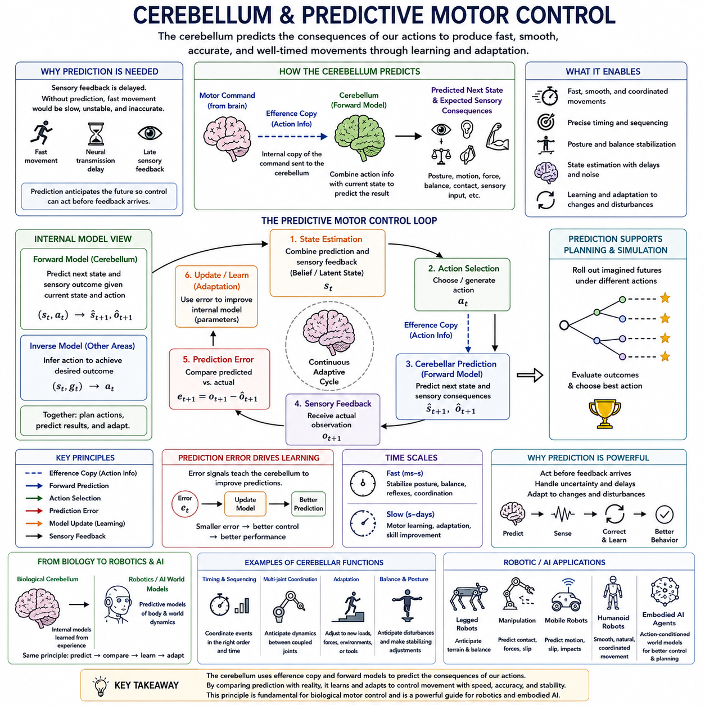{width="7.268055555555556in" height="7.268055555555556in"}

The cerebellum is a major neural structure associated with coordination, timing, motor learning, and predictive control. Rather than waiting for sensory feedback to reveal whether a movement was successful, cerebellar circuits can use internal information about current state and motor commands to anticipate expected consequences. This predictive capability helps the nervous system generate fast, smooth, and accurately coordinated behavior.

Predictive motor control is necessary because biological feedback is delayed. Signals from muscles, joints, skin, vision, and the vestibular system require time to reach and be processed by the brain. If every correction depended exclusively on newly arriving sensory information, rapid movements would become unstable or inaccurate. The cerebellum helps compensate for this delay by estimating how the body is likely to evolve before complete feedback becomes available.

Within an internal-model interpretation, the cerebellum is often associated with forward prediction. Information related to a motor command can be combined with an estimate of current body state to predict the next state and expected sensory consequences. This prediction can include changes in joint configuration, velocity, force, balance, contact, or sensory input, allowing control mechanisms to operate on anticipated rather than purely observed conditions.

Efference copy provides an important source of information for such prediction. When motor systems generate a command, an internal representation of that command can be transmitted toward predictive circuits. The cerebellum can use this action-related information together with sensory context to estimate the likely result. When actual feedback later arrives, predicted and observed consequences can be compared, producing information about the accuracy of the internal model.

Prediction error is central to cerebellar learning. If an expected movement differs from what actually occurs, the discrepancy provides a teaching signal indicating that the predictive mapping requires adjustment. Repeated experience can progressively reduce systematic errors by modifying relationships among states, motor commands, and sensory outcomes. Motor learning can therefore be viewed as continual calibration of predictions about how actions affect the body and environment.

This mechanism becomes particularly visible during adaptation. When a familiar action begins to produce unusual consequences because of altered load, force, visual feedback, or environmental conditions, previously learned predictions become inaccurate. Initial movements may contain substantial error, but repeated practice allows the nervous system to recalibrate. The resulting improvement illustrates how predictive models can adapt when the relationship between commands and consequences changes.

The cerebellum also contributes strongly to timing. Coordinated behavior requires different muscles, joints, and sensory events to occur in appropriate temporal relationships. Walking, reaching, grasping, speaking, and maintaining balance all depend on precise sequences rather than isolated commands. Predictive timing allows the system to prepare upcoming components of an action instead of controlling each event only after the previous one has completed.

This temporal coordination is especially important for multi-joint movement. Moving one joint generates mechanical effects that influence other joints, and these interactions must be anticipated to produce an accurate trajectory. A predictive controller can estimate such interaction dynamics and prepare compensatory commands before unwanted deviations become large. Cerebellar processing therefore supports coordination by incorporating expected consequences of coupled body dynamics.

Predictive motor control does not mean that the cerebellum operates without sensory feedback. Prediction and feedback serve complementary functions. Prediction provides a rapid estimate of what should be happening, while sensory signals provide evidence about what actually happened. Combining the two allows the nervous system to maintain fast control while still correcting unexpected disturbances, modeling errors, or environmental changes.

State estimation is closely connected to this process. Because sensory measurements may be noisy or delayed, the nervous system must infer the body's current state rather than simply read it directly. A predictive model can propagate the previous state forward using information about recent motor commands. Incoming proprioceptive, vestibular, tactile, and visual signals can then correct that estimate, producing a continuously updated representation for subsequent control.

The cerebellum can therefore be understood as part of a larger closed-loop architecture linking motor planning, action, prediction, observation, and learning. Cortical and subcortical systems contribute goals and motor commands, predictive mechanisms estimate their consequences, sensory systems report actual outcomes, and error signals support correction and adaptation. Effective behavior emerges from interaction among these systems rather than from one structure acting independently.

Fast predictive control is important for posture and balance because disturbances can develop more quickly than delayed feedback alone can compensate. Anticipatory mechanisms can prepare stabilizing adjustments when voluntary movement is expected to disturb the body. For example, moving a limb may shift the center of mass, requiring coordinated changes elsewhere. Predictive control allows such compensatory responses to begin before instability becomes severe.

Similar principles apply to skilled actions. Repeated practice can transform movements that initially require considerable conscious correction into rapid and coordinated behaviors. As predictions become more accurate, control depends less on slow corrective processing and more on learned expectations about action consequences. This helps explain why practiced movements can become smoother, more consistent, and less computationally demanding during execution.

The predictive role of the cerebellum also provides a useful bridge to robotics. Robotic controllers similarly benefit from estimating future states before sensor feedback arrives. A forward dynamics model can receive the current robot state and actuator command and predict future pose, velocity, force, contact, or balance. Real measurements can then correct the prediction, while repeated discrepancies can be used to adapt parameters or learned models.

For legged robots and mobile systems, this principle is particularly valuable under rapidly changing dynamics. Terrain irregularities, payload changes, wheel slip, impacts, or contact transitions can produce deviations from nominal behavior. A predictive controller can anticipate expected motion and compare it with measured outcomes. Significant differences can trigger rapid correction while also providing information for longer-term adaptation of the internal dynamics model.

Modern embodied AI can generalize this idea beyond conventional motor variables. A learned predictive model may estimate future latent self-state and world-state from multimodal observations and actions. Instead of representing only joint dynamics, the internal model may capture object interaction, terrain response, contact events, or task progress. Cerebellar-inspired prediction therefore connects low-level motor control with richer action-conditioned world modeling.

However, biological inspiration should not imply that artificial systems must reproduce cerebellar anatomy directly. The engineering lesson is functional: intelligent control benefits from combining action-conditioned prediction, delayed sensory correction, error-driven learning, and continuous adaptation. Neural networks, state-space models, physics-based models, probabilistic estimators, or hybrid architectures can implement these principles in different computational forms.

A useful artificial architecture may combine explicit physical dynamics with learned residual models. Known kinematic and dynamic relationships provide a stable baseline, while learned components capture friction, compliance, contact uncertainty, payload effects, and other difficult-to-model phenomena. Prediction errors generated during operation can update the learned components, creating an adaptive predictive controller that mirrors the functional logic of biological motor learning.

The cerebellar perspective also emphasizes that prediction should operate across multiple time scales. Very short-horizon predictions support immediate stabilization and coordination, while longer predictions can support movement sequencing and preparation. In advanced robotic systems, similar hierarchical prediction can connect fast actuator control with slower trajectory planning, navigation, manipulation, and task-level decision making.

Ultimately, the cerebellum illustrates how intelligence can use prediction to overcome delay and uncertainty in embodied action. By learning relationships among current state, motor commands, expected sensory consequences, and observed outcomes, predictive control can anticipate change instead of merely reacting to it. This principle provides a foundational connection between biological motor coordination, adaptive control, robotics, and action-conditioned AI world models.

소뇌(Cerebellum)는 협응(Coordination), 타이밍(Timing), 운동 학습(Motor Learning), 예측 제어(Predictive Control)와 관련된 주요 신경 구조(Neural Structure)입니다. 소뇌 회로(Cerebellar Circuits)는 감각 피드백(Sensory Feedback)을 통해 움직임의 성공 여부가 확인될 때까지 기다리는 대신, 현재 상태(Current State)와 운동 명령(Motor Commands)에 관한 내부 정보를 사용하여 예상되는 결과(Expected Consequences)를 미리 예측할 수 있습니다. 이러한 예측 능력은 신경계가 빠르고 부드러우며 정확하게 협응된 행동을 생성하도록 지원합니다.

예측 운동 제어(Predictive Motor Control)가 필요한 이유는 생물학적 피드백(Biological Feedback)에 지연(Delay)이 존재하기 때문입니다. 근육, 관절, 피부, 시각(Vision), 전정 시스템(Vestibular System)에서 발생한 신호가 뇌에 도달하고 처리되기까지 시간이 필요합니다. 모든 수정 동작(Correction)이 새롭게 도착하는 감각 정보에만 의존한다면 빠른 움직임은 불안정하거나 부정확해질 수 있습니다. 소뇌는 완전한 피드백이 도착하기 전에 신체가 어떻게 변화할 가능성이 있는지를 추정함으로써 이러한 지연을 보상하는 데 도움을 줍니다.

내부 모델(Internal Model)의 관점에서 소뇌(Cerebellum)는 흔히 순방향 예측(Forward Prediction)과 관련됩니다. 운동 명령과 관련된 정보를 현재 신체 상태(Current Body State)의 추정치와 결합하여 다음 상태(Next State)와 예상되는 감각 결과(Expected Sensory Consequences)를 예측할 수 있습니다. 이러한 예측에는 관절 구성(Joint Configuration), 속도(Velocity), 힘(Force), 균형(Balance), 접촉(Contact), 감각 입력(Sensory Input)의 변화가 포함될 수 있으며, 이를 통해 제어 메커니즘은 단순히 관측된 상태가 아니라 예상되는 상태를 기반으로 작동할 수 있습니다.

원심성 복사(Efference Copy)는 이러한 예측을 위한 중요한 정보원을 제공합니다. 운동 시스템(Motor Systems)이 명령을 생성하면 해당 명령의 내부 표현(Internal Representation)이 예측 회로(Predictive Circuits)로 전달될 수 있습니다. 소뇌는 이러한 행동 관련 정보(Action-Related Information)를 감각적 맥락(Sensory Context)과 함께 사용하여 예상되는 결과를 추정할 수 있습니다. 이후 실제 피드백(Actual Feedback)이 도착하면 예측 결과와 관측 결과를 비교하여 내부 모델의 정확성에 관한 정보를 얻을 수 있습니다.

예측 오류(Prediction Error)는 소뇌 학습(Cerebellar Learning)의 핵심 요소입니다. 예상했던 움직임과 실제 발생한 움직임이 다르다면 그 차이는 예측 매핑(Predictive Mapping)을 조정해야 한다는 교육 신호(Teaching Signal)를 제공합니다. 반복적인 경험을 통해 상태(States), 운동 명령, 감각 결과(Sensory Outcomes) 사이의 관계를 수정함으로써 체계적인 오류(Systematic Errors)를 점진적으로 줄일 수 있습니다. 따라서 운동 학습은 행동이 신체와 환경에 어떤 영향을 미치는지에 관한 예측을 지속적으로 보정하는 과정으로 이해할 수 있습니다.

이러한 메커니즘은 적응(Adaptation) 과정에서 특히 명확하게 나타납니다. 하중(Load), 힘(Force), 시각 피드백(Visual Feedback), 환경 조건(Environmental Conditions)이 변화하여 익숙한 행동이 평소와 다른 결과를 만들어내면 기존에 학습된 예측이 부정확해집니다. 초기 움직임에서는 상당한 오류가 발생할 수 있지만 반복적인 연습을 통해 신경계는 이를 다시 보정할 수 있습니다. 이러한 성능 향상은 명령과 결과 사이의 관계가 변화할 때 예측 모델(Predictive Models)이 어떻게 적응할 수 있는지를 보여줍니다.

소뇌(Cerebellum)는 타이밍(Timing)에도 중요한 역할을 합니다. 협응된 행동(Coordinated Behavior)을 수행하려면 서로 다른 근육, 관절, 감각 사건(Sensory Events)이 적절한 시간적 관계(Temporal Relationships) 속에서 발생해야 합니다. 보행(Walking), 손 뻗기(Reaching), 잡기(Grasping), 말하기(Speaking), 균형 유지(Maintaining Balance)는 모두 개별적인 명령이 아니라 정확한 시퀀스(Precise Sequences)에 의존합니다. 예측적 타이밍(Predictive Timing)을 통해 시스템은 이전 동작이 완전히 끝난 뒤 다음 동작을 제어하는 대신 앞으로 필요한 행동 요소를 미리 준비할 수 있습니다.

이러한 시간적 협응(Temporal Coordination)은 다관절 운동(Multi-Joint Movement)에서 특히 중요합니다. 하나의 관절을 움직이면 다른 관절에도 영향을 미치는 기계적 효과(Mechanical Effects)가 발생하며, 정확한 궤적(Trajectory)을 생성하려면 이러한 상호작용을 미리 예상해야 합니다. 예측 제어기(Predictive Controller)는 이러한 상호작용 동역학(Interaction Dynamics)을 추정하고 원하지 않는 편차가 커지기 전에 보상 명령(Compensatory Commands)을 준비할 수 있습니다. 따라서 소뇌 처리는 서로 결합된 신체 동역학(Coupled Body Dynamics)의 예상 결과를 고려함으로써 협응을 지원합니다.

예측 운동 제어(Predictive Motor Control)가 소뇌가 감각 피드백 없이 작동한다는 것을 의미하는 것은 아닙니다. 예측(Prediction)과 피드백(Feedback)은 서로 보완적인 기능을 수행합니다. 예측은 현재 어떤 일이 일어나고 있어야 하는지에 대한 빠른 추정치를 제공하고, 감각 신호(Sensory Signals)는 실제로 어떤 일이 발생했는지에 대한 증거를 제공합니다. 이 둘을 결합하면 신경계는 빠른 제어를 유지하면서도 예상하지 못한 교란(Unexpected Disturbances), 모델링 오류(Modeling Errors), 환경 변화(Environmental Changes)를 수정할 수 있습니다.

상태 추정(State Estimation)은 이러한 과정과 밀접하게 연결되어 있습니다. 감각 측정(Sensory Measurements)에는 잡음(Noise)이나 지연이 존재할 수 있으므로 신경계는 신체의 현재 상태를 단순히 직접 읽는 것이 아니라 추론해야 합니다. 예측 모델은 최근의 운동 명령에 관한 정보를 이용하여 이전 상태(Previous State)를 미래로 전파할 수 있습니다. 이후 고유수용감각(Proprioceptive), 전정 감각(Vestibular), 촉각(Tactile), 시각 신호(Visual Signals)를 이용하여 이러한 추정치를 수정함으로써 이후의 제어에 필요한 지속적으로 갱신되는 표현을 생성할 수 있습니다.

따라서 소뇌(Cerebellum)는 운동 계획(Motor Planning), 행동(Action), 예측(Prediction), 관측(Observation), 학습(Learning)을 연결하는 더 큰 폐루프 구조(Closed-Loop Architecture)의 일부로 이해할 수 있습니다. 피질 및 피질하 시스템(Cortical and Subcortical Systems)은 목표와 운동 명령 생성에 기여하고, 예측 메커니즘은 그 결과를 추정하며, 감각 시스템은 실제 결과를 보고하고, 오류 신호(Error Signals)는 수정과 적응을 지원합니다. 효과적인 행동은 하나의 구조가 독립적으로 작동하는 것이 아니라 이러한 시스템들의 상호작용을 통해 나타납니다.

빠른 예측 제어(Fast Predictive Control)는 교란이 지연된 피드백만으로 보상할 수 있는 속도보다 빠르게 진행될 수 있기 때문에 자세(Posture)와 균형(Balance) 유지에서 중요합니다. 자발적인 움직임(Voluntary Movement)이 신체의 안정성을 방해할 것으로 예상되면 예측 메커니즘이 안정화 조정(Stabilizing Adjustments)을 미리 준비할 수 있습니다. 예를 들어 팔다리를 움직이면 무게중심(Center of Mass)이 이동하여 다른 신체 부위의 협응된 변화가 필요할 수 있습니다. 예측 제어를 이용하면 불안정성이 심각해지기 전에 이러한 보상 반응을 시작할 수 있습니다.

유사한 원리는 숙련된 행동(Skilled Actions)에도 적용됩니다. 반복적인 연습은 처음에는 상당한 의식적 수정(Conscious Correction)이 필요했던 움직임을 빠르고 협응된 행동으로 변화시킬 수 있습니다. 예측의 정확도가 향상되면 제어는 느린 수정 처리(Slow Corrective Processing)에 덜 의존하고 행동 결과에 대한 학습된 기대(Learned Expectations)에 더 많이 의존하게 됩니다. 이를 통해 숙련된 움직임은 실행 과정에서 더욱 부드럽고 일관되며 계산적으로 효율적으로 수행될 수 있습니다.

소뇌의 예측적 역할(Predictive Role)은 로보틱스(Robotics)와 연결되는 유용한 개념적 다리도 제공합니다. 로봇 제어기(Robotic Controllers) 역시 센서 피드백이 도착하기 전에 미래 상태(Future States)를 추정함으로써 이점을 얻을 수 있습니다. 순방향 동역학 모델(Forward Dynamics Model)은 현재 로봇 상태와 액추에이터 명령(Actuator Command)을 입력받아 미래 자세(Pose), 속도, 힘, 접촉, 균형을 예측할 수 있습니다. 이후 실제 측정값을 이용해 예측을 수정하고 반복적으로 발생하는 차이를 활용하여 파라미터 또는 학습 모델을 적응시킬 수 있습니다.

보행 로봇(Legged Robots)과 이동 시스템(Mobile Systems)에서는 빠르게 변화하는 동역학 조건 때문에 이러한 원리가 특히 중요합니다. 지형 불규칙성(Terrain Irregularities), 페이로드 변화(Payload Changes), 바퀴 미끄러짐(Wheel Slip), 충격(Impacts), 접촉 전이(Contact Transitions)는 정상적인 동작에서 편차를 발생시킬 수 있습니다. 예측 제어기는 예상되는 움직임을 미리 계산하고 실제 측정 결과와 비교할 수 있습니다. 큰 차이가 발생하면 빠른 수정 동작을 시작하는 동시에 내부 동역학 모델의 장기적인 적응을 위한 정보를 제공할 수 있습니다.

현대 체화 인공지능(Embodied AI)은 이러한 개념을 전통적인 운동 변수(Conventional Motor Variables) 이상으로 일반화할 수 있습니다. 학습된 예측 모델(Learned Predictive Model)은 다중모달 관측(Multimodal Observations)과 행동으로부터 미래의 잠재 자기 상태(Latent Self-State)와 세계 상태(World-State)를 추정할 수 있습니다. 내부 모델은 관절 동역학뿐만 아니라 객체 상호작용(Object Interaction), 지형 반응(Terrain Response), 접촉 사건(Contact Events), 작업 진행 상태(Task Progress)까지 포착할 수 있습니다. 따라서 소뇌에서 영감을 받은 예측(Cerebellar-Inspired Prediction)은 저수준 운동 제어(Low-Level Motor Control)와 더욱 풍부한 행동 조건부 세계 모델링(Action-Conditioned World Modeling)을 연결합니다.

그러나 생물학적 영감(Biological Inspiration)이 인공 시스템이 소뇌의 해부학적 구조를 직접적으로 재현해야 한다는 것을 의미하지는 않습니다. 공학적으로 중요한 교훈은 기능적 원리(Functional Principle)에 있습니다. 지능적 제어(Intelligent Control)는 행동 조건부 예측(Action-Conditioned Prediction), 지연된 감각 보정(Delayed Sensory Correction), 오류 기반 학습(Error-Driven Learning), 지속적인 적응(Continuous Adaptation)을 결합함으로써 향상될 수 있습니다. 신경망(Neural Networks), 상태 공간 모델(State-Space Models), 물리 기반 모델(Physics-Based Models), 확률적 추정기(Probabilistic Estimators), 하이브리드 구조(Hybrid Architectures) 등을 통해 이러한 원리를 다양한 계산 형태로 구현할 수 있습니다.

유용한 인공 시스템 구조(Artificial Architecture)는 명시적인 물리 동역학(Explicit Physical Dynamics)과 학습된 잔차 모델(Learned Residual Models)을 결합할 수 있습니다. 알려진 운동학적 및 동역학적 관계(Kinematic and Dynamic Relationships)는 안정적인 기준선(Stable Baseline)을 제공하고, 학습된 구성요소는 마찰(Friction), 유연성(Compliance), 접촉 불확실성(Contact Uncertainty), 페이로드 효과(Payload Effects), 기타 모델링하기 어려운 현상을 포착합니다. 운용 중 발생하는 예측 오류를 이용해 학습 구성요소를 갱신하면 생물학적 운동 학습의 기능적 논리와 유사한 적응형 예측 제어기(Adaptive Predictive Controller)를 구성할 수 있습니다.

소뇌적 관점(Cerebellar Perspective)은 예측이 여러 시간 척도(Time Scales)에 걸쳐 작동해야 한다는 점도 강조합니다. 매우 짧은 시간 범위의 예측은 즉각적인 안정화(Stabilization)와 협응을 지원하며, 더 긴 시간 범위의 예측은 움직임 시퀀싱(Movement Sequencing)과 준비(Preparation)를 지원할 수 있습니다. 고급 로봇 시스템에서도 이와 유사한 계층적 예측(Hierarchical Prediction)을 통해 빠른 액추에이터 제어(Fast Actuator Control)를 상대적으로 느린 궤적 계획(Trajectory Planning), 내비게이션(Navigation), 조작(Manipulation), 작업 수준 의사결정(Task-Level Decision Making)과 연결할 수 있습니다.

궁극적으로 소뇌(Cerebellum)는 체화된 행동(Embodied Action)에서 발생하는 지연과 불확실성을 지능이 예측을 통해 어떻게 극복할 수 있는지를 보여줍니다. 현재 상태(Current State), 운동 명령(Motor Commands), 예상되는 감각 결과(Expected Sensory Consequences), 실제 관측 결과(Observed Outcomes) 사이의 관계를 학습함으로써 예측 제어는 단순히 변화가 발생한 후 반응하는 것이 아니라 변화가 일어나기 전에 이를 예상할 수 있습니다. 이러한 원리는 생물학적 운동 협응(Biological Motor Coordination), 적응 제어(Adaptive Control), 로보틱스(Robotics), 행동 조건부 인공지능 세계 모델(Action-Conditioned AI World Models)을 연결하는 핵심적인 기반을 제공합니다.

##  

## 09.06 Sensorimotor Prediction [w/Code]

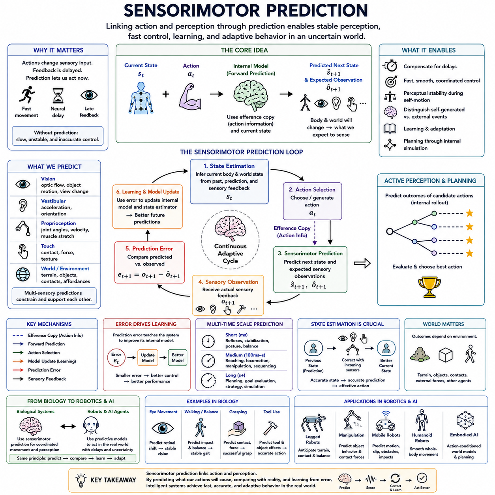{width="7.268055555555556in" height="7.268055555555556in"}

Sensorimotor prediction refers to the ability of an embodied system to anticipate how its sensory inputs and bodily state will change as a consequence of its own actions. Instead of treating perception and movement as separate processes, the nervous system continuously links motor commands with expected sensory outcomes. This predictive relationship allows behavior to remain stable, coordinated, and responsive despite delays and uncertainty in sensory feedback.

Every voluntary movement changes the sensory information available to the organism. Turning the head modifies visual, vestibular, and auditory signals, while reaching toward an object changes proprioceptive, visual, and tactile input. Sensorimotor prediction estimates these transformations before they are completely observed, allowing the nervous system to interpret incoming signals according to the action that produced them rather than as unrelated environmental changes.

A basic predictive relationship can be represented using the current state, action, and expected future observation. Given an estimated state s_t and an action a_t, an internal model predicts a future state ŝ_t+1 and an expected sensory observation ô_t+1. The prediction therefore describes both how the body and environment are expected to evolve and how those changes should appear through the available sensory channels.

This capability is necessary because biological sensing and control contain unavoidable delays. Motor commands require time to affect muscles and joints, while resulting sensory signals require additional time to reach and be processed by the nervous system. A purely reactive controller would always operate on information describing the recent past. Prediction compensates for this delay by providing an estimate of what is probably happening now or what will happen next.

Efference copy provides an important mechanism for generating sensorimotor predictions. When a motor command is issued, information representing that command can also be transmitted internally to predictive circuits. Combined with the estimated current state, this action information allows a forward model to calculate expected changes. The system therefore possesses an internal expectation before the physical consequences of the action have been fully measured.

When sensory feedback becomes available, predicted and observed signals can be compared. The resulting prediction error indicates whether events unfolded as expected. A small error suggests that the current state estimate and internal dynamics model remain appropriate, whereas a large error may indicate an unexpected disturbance, inaccurate model, changed environment, unsuccessful action, or previously unknown interaction requiring additional processing.

Prediction error therefore provides more than a measure of immediate control accuracy. Repeated discrepancies can act as learning signals that modify the internal model itself. If a particular action consistently produces sensory consequences different from those predicted, the system can update its representation of the relationship among state, action, and outcome. Sensorimotor prediction consequently supports both moment-to-moment control and long-term adaptation.

One important function of sensorimotor prediction is distinguishing self-generated sensory change from externally generated change. When an agent moves, much of the resulting sensory variation is caused by that movement. If the predicted transformation matches the observation, the change can be attributed partly to self-action. Deviations from the expected pattern can then receive greater significance as possible evidence of independent events in the environment.

This principle contributes to perceptual stability during eye and head movements. The visual image projected onto the retina changes substantially during self-motion, yet the external world is normally perceived as relatively stable. Predictions related to eye, head, and body motion help sensory systems interpret visual changes within the context of the observer's own movement, preventing self-generated transformations from being mistaken for equivalent movement of the world.

Sensorimotor prediction is equally important during physical interaction. When a hand approaches and contacts an object, the nervous system can anticipate changes in position, resistance, force, and tactile sensation. If the expected contact fails to occur, the object may not be where predicted. If resistance is unexpectedly high or low, the object's properties may differ from the current model. Action therefore becomes a method for testing predictions about the world.

This relationship makes sensorimotor prediction closely connected to active perception. Perception is not restricted to passively receiving sensory information; an agent can move specifically to obtain better observations. It may turn its head, reposition its hand, approach an object, or change viewpoint. Predicting the sensory consequences of these movements allows the agent to interpret the newly acquired information while maintaining continuity across changing perspectives.

Accurate prediction depends on reliable self-state estimation. The consequences of a motor command depend on the configuration from which it begins. The same command can produce different outcomes depending on posture, velocity, balance, contact state, load, or available support. Sensorimotor prediction must therefore operate together with continuously updated estimates of the body rather than relying only on the nominal action command.

World-state estimation is similarly important because action consequences depend on environmental conditions. A step onto stable ground differs from a step onto a slippery surface, while pushing a rigid object differs from pushing a movable one. Predictive control must incorporate relevant properties of terrain, objects, obstacles, and interaction partners. Sensorimotor prediction consequently links internal models of the self with internal models of the surrounding world.

Prediction can occur across multiple sensory modalities. Visual systems may anticipate optic flow or object displacement, proprioceptive systems may predict joint configuration, vestibular systems may anticipate acceleration, and tactile systems may predict contact. Rather than operating independently, these predictions can constrain one another. Multisensory consistency provides stronger evidence about the current state and can expose errors that would remain ambiguous within a single modality.

Prediction also operates across multiple temporal scales. Very short predictions support reflex-like stabilization, posture, balance, and rapid coordination. Predictions extending hundreds of milliseconds or seconds can support reaching, locomotion, manipulation, and movement sequencing. Longer internal simulations can evaluate alternative trajectories and task outcomes. Sensorimotor prediction therefore forms a continuum from immediate control to increasingly deliberative planning.

In locomotion, predictive mechanisms can anticipate how upcoming actions will affect balance, momentum, and contact. Walking or running requires preparation for future foot placement before complete information about each previous step has been processed. Uneven terrain further increases the importance of prediction because contact conditions can change rapidly. Expected consequences provide a reference against which unexpected slipping, impact, or instability can be detected.

Manipulation presents a similarly demanding prediction problem. Grasping and moving objects requires anticipating not only the robot or body state but also the behavior of the manipulated object. Shape, mass, friction, compliance, and contact geometry influence the sensory consequences of an action. Predictive models allow the controller to prepare appropriate forces and trajectories while using observed deviations to refine estimates of object properties.

Sensorimotor prediction naturally connects biological control with robotics. A robot can use its current estimated pose, velocity, joint state, and actuator commands to predict future motion and expected sensor measurements. Encoders, cameras, IMUs, force sensors, tactile sensors, and LiDAR can then provide observations for comparison. Unexpected discrepancies can trigger state correction, replanning, fault detection, or adaptation of the robot's dynamics model.

This architecture becomes especially valuable when robots operate under changing conditions. Payload variation, tire slip, actuator wear, deformable terrain, contact uncertainty, or external forces can invalidate a fixed model. Continuous comparison between predicted and measured consequences reveals these changes. A robot can therefore adapt its internal representation rather than assuming that dynamics learned during calibration will remain permanently accurate.

Modern embodied AI extends sensorimotor prediction from explicit physical variables into learned latent representations. Multimodal observations can be encoded into a compact internal state, and an action-conditioned transition model can predict how that representation will evolve. The predicted latent state may summarize motion, objects, contacts, affordances, or task progress without requiring every future sensory pixel to be generated explicitly.

Such latent prediction is important for world models because behavior requires predictions that preserve action-relevant structure. A visually detailed future image is not necessarily useful if the model fails to predict collision, reachability, balance, object displacement, or task success. Sensorimotor intelligence therefore favors representations that capture controllable relationships between action and consequence, even when irrelevant sensory details are compressed or omitted.

Prediction can also support planning through internal rollout. Candidate actions are applied to the predictive model to generate possible future states, and these simulated outcomes can be evaluated before physical execution. Multiple trajectories can be compared according to safety, reward, stability, energy, or goal achievement. Sensorimotor prediction thereby develops from a mechanism for compensating feedback delay into a foundation for model-based decision making.

Uncertainty must remain part of this process because real sensorimotor systems are not perfectly predictable. Noise, partial observability, unknown dynamics, and external agents can produce several plausible future outcomes. Probabilistic predictions or confidence estimates allow the controller to recognize when its internal simulation is unreliable. The agent can then behave more cautiously, gather additional information, or rely more heavily on incoming sensory evidence.

Ultimately, sensorimotor prediction creates a continuous loop linking state estimation, action, expected consequence, sensory observation, prediction error, and learning. The agent predicts what its action should cause, observes what actually occurs, and uses the difference to correct both behavior and internal models. This cycle transforms perception and action into an integrated predictive process and provides a fundamental bridge from biological motor intelligence to adaptive robotics, embodied AI, and action-conditioned world models.

감각운동 예측(Sensorimotor Prediction)은 체화 시스템(Embodied System)이 자신의 행동(Action)으로 인해 감각 입력(Sensory Inputs)과 신체 상태(Bodily State)가 어떻게 변화할지를 미리 예상하는 능력을 의미합니다. 신경계는 지각(Perception)과 움직임(Movement)을 분리된 과정으로 다루기보다 운동 명령(Motor Commands)과 예상되는 감각 결과(Expected Sensory Outcomes)를 지속적으로 연결합니다. 이러한 예측 관계를 통해 감각 피드백에 지연과 불확실성이 존재하더라도 행동을 안정적이고 협응되며 반응성 있게 유지할 수 있습니다.

모든 자발적 움직임(Voluntary Movement)은 생물체가 이용할 수 있는 감각 정보를 변화시킵니다. 머리를 돌리면 시각(Visual), 전정 감각(Vestibular), 청각 신호(Auditory Signals)가 변하고, 객체를 향해 손을 뻗으면 고유수용감각(Proprioceptive), 시각, 촉각 입력(Tactile Input)이 달라집니다. 감각운동 예측은 이러한 변환이 완전히 관측되기 전에 미리 추정함으로써, 신경계가 들어오는 신호를 독립적인 환경 변화가 아니라 해당 신호를 발생시킨 행동의 맥락 안에서 해석하도록 합니다.

기본적인 예측 관계는 현재 상태(Current State), 행동(Action), 예상되는 미래 관측(Expected Future Observation)을 이용하여 표현할 수 있습니다. 추정된 상태를 s_t, 행동을 a_t라고 할 때 내부 모델(Internal Model)은 미래 상태 ŝ_t+1과 예상 감각 관측 ô_t+1을 예측합니다. 따라서 이러한 예측은 신체와 환경이 어떻게 변화할지를 설명할 뿐만 아니라, 그 변화가 사용 가능한 감각 채널(Sensory Channels)을 통해 어떻게 나타날지도 함께 기술합니다.

이러한 능력이 필요한 이유는 생물학적 감지(Biological Sensing)와 제어(Control)에 피할 수 없는 지연(Delay)이 존재하기 때문입니다. 운동 명령이 근육과 관절에 영향을 미치기까지 시간이 필요하고, 그 결과로 발생한 감각 신호가 신경계에 도달하여 처리되기까지도 추가적인 시간이 필요합니다. 순수한 반응형 제어기(Reactive Controller)는 항상 최근 과거를 나타내는 정보에 기반하여 작동하게 됩니다. 예측은 현재 어떤 일이 일어나고 있을 가능성이 높은지 또는 다음에 어떤 일이 일어날지를 추정함으로써 이러한 지연을 보상합니다.

원심성 복사(Efference Copy)는 감각운동 예측을 생성하기 위한 중요한 메커니즘을 제공합니다. 운동 명령이 실행될 때 해당 명령을 나타내는 정보가 내부적으로 예측 회로(Predictive Circuits)에 함께 전달될 수 있습니다. 이 행동 정보(Action Information)를 현재 상태 추정치와 결합하면 순방향 모델(Forward Model)이 예상되는 변화를 계산할 수 있습니다. 따라서 시스템은 행동의 물리적 결과가 완전히 측정되기 전에 이미 내부적인 기대(Internal Expectation)를 갖게 됩니다.

감각 피드백(Sensory Feedback)이 이용 가능해지면 예측된 신호와 실제 관측된 신호를 비교할 수 있습니다. 그 결과 발생하는 예측 오류(Prediction Error)는 사건이 예상한 대로 진행되었는지를 나타냅니다. 작은 오류는 현재 상태 추정과 내부 동역학 모델(Internal Dynamics Model)이 적절하다는 것을 의미하지만, 큰 오류는 예상하지 못한 교란(Unexpected Disturbance), 부정확한 모델, 변화된 환경, 행동 실패, 또는 추가적인 처리가 필요한 알려지지 않은 상호작용을 의미할 수 있습니다.

따라서 예측 오류(Prediction Error)는 단순히 즉각적인 제어 정확도를 측정하는 지표 이상으로 작용합니다. 반복적인 불일치는 내부 모델 자체를 수정하는 학습 신호(Learning Signal)가 될 수 있습니다. 특정 행동이 지속적으로 예측과 다른 감각 결과를 만들어낸다면 시스템은 상태, 행동, 결과 사이의 관계에 대한 내부 표현을 갱신할 수 있습니다. 그러므로 감각운동 예측은 순간적인 제어뿐만 아니라 장기적인 적응(Long-Term Adaptation)도 지원합니다.

감각운동 예측의 중요한 기능 가운데 하나는 자기 생성 감각 변화(Self-Generated Sensory Change)와 외부 생성 변화(Externally Generated Change)를 구분하는 것입니다. 에이전트가 움직이면 그 결과 발생하는 감각 변화의 상당 부분은 자신의 움직임으로 인해 발생합니다. 예측된 변환과 실제 관측이 일치한다면 해당 변화는 부분적으로 자기 행동(Self-Action)에 의해 발생한 것으로 해석할 수 있습니다. 반대로 예상 패턴에서 벗어난 변화는 환경에서 독립적으로 발생한 사건일 가능성이 높기 때문에 더 중요한 의미를 가질 수 있습니다.

이러한 원리는 눈과 머리가 움직이는 동안 지각적 안정성(Perceptual Stability)을 유지하는 데 기여합니다. 자기 움직임(Self-Motion) 중에는 망막(Retina)에 투영되는 시각 이미지가 크게 변화하지만 외부 세계는 일반적으로 비교적 안정적으로 지각됩니다. 눈, 머리, 신체 움직임과 관련된 예측은 감각 시스템이 관찰자의 움직임이라는 맥락 안에서 시각 변화를 해석하도록 하여 자기 생성 변환을 외부 세계 전체의 움직임으로 잘못 인식하지 않도록 합니다.

감각운동 예측(Sensorimotor Prediction)은 물리적 상호작용(Physical Interaction)에서도 매우 중요합니다. 손이 객체에 접근하여 접촉할 때 신경계는 위치(Position), 저항(Resistance), 힘(Force), 촉각 감각(Tactile Sensation)의 변화를 예상할 수 있습니다. 예상한 접촉이 발생하지 않는다면 객체의 위치가 예측과 다를 수 있고, 저항이 예상보다 크거나 작다면 객체 특성(Object Properties)이 현재 모델과 다를 수 있습니다. 이처럼 행동은 세계에 대한 예측을 시험하는 방법으로도 기능합니다.

이러한 관계 때문에 감각운동 예측은 능동 지각(Active Perception)과 밀접하게 연결됩니다. 지각은 단순히 감각 정보를 수동적으로 받아들이는 과정에 제한되지 않으며, 에이전트는 더 나은 관측을 얻기 위해 의도적으로 움직일 수 있습니다. 머리를 돌리거나, 손의 위치를 바꾸거나, 객체에 접근하거나, 시점을 변경할 수 있습니다. 이러한 움직임의 감각적 결과를 예측하면 시점이 변하더라도 연속성을 유지하면서 새롭게 획득한 정보를 해석할 수 있습니다.

정확한 예측은 신뢰성 높은 자기 상태 추정(Self-State Estimation)에 의존합니다. 운동 명령의 결과는 행동이 시작되는 신체 구성에 따라 달라집니다. 동일한 명령이라도 자세(Posture), 속도(Velocity), 균형(Balance), 접촉 상태(Contact State), 하중(Load), 사용 가능한 지지(Support)에 따라 서로 다른 결과를 만들 수 있습니다. 따라서 감각운동 예측은 명목상의 행동 명령만 이용하는 것이 아니라 지속적으로 갱신되는 신체 상태 추정과 함께 작동해야 합니다.

세계 상태 추정(World-State Estimation)도 마찬가지로 중요합니다. 행동의 결과는 환경 조건(Environmental Conditions)에 따라 달라지기 때문입니다. 안정적인 지면을 밟는 것과 미끄러운 표면을 밟는 것은 다르며, 단단한 객체를 미는 것과 이동 가능한 객체를 미는 것도 서로 다른 결과를 만듭니다. 예측 제어(Predictive Control)는 지형(Terrain), 객체(Objects), 장애물(Obstacles), 상호작용 상대(Interaction Partners)의 관련 특성을 포함해야 합니다. 따라서 감각운동 예측은 자기 자신에 대한 내부 모델과 주변 세계에 대한 내부 모델을 연결합니다.

예측은 여러 감각 양식(Sensory Modalities)에 걸쳐 이루어질 수 있습니다. 시각 시스템은 광학 흐름(Optic Flow)이나 객체 이동(Object Displacement)을 예상하고, 고유수용감각 시스템은 관절 구성을 예측하며, 전정 시스템은 가속도(Acceleration)를 예상하고, 촉각 시스템은 접촉(Contact)을 예측할 수 있습니다. 이러한 예측은 독립적으로 작동하기보다 서로를 제약할 수 있으며, 다중감각 일관성(Multisensory Consistency)은 현재 상태에 대한 더 강한 증거를 제공하고 단일 감각 양식에서는 모호할 수 있는 오류를 발견하도록 합니다.

예측은 여러 시간 척도(Temporal Scales)에 걸쳐 작동합니다. 매우 짧은 시간 범위의 예측은 반사적 안정화(Reflex-Like Stabilization), 자세(Posture), 균형(Balance), 빠른 협응을 지원합니다. 수백 밀리초에서 수초에 이르는 예측은 손 뻗기(Reaching), 이동(Locomotion), 조작(Manipulation), 움직임 시퀀싱(Movement Sequencing)을 지원할 수 있습니다. 더 긴 내부 시뮬레이션(Internal Simulation)은 대안 궤적과 작업 결과를 평가할 수 있습니다. 따라서 감각운동 예측은 즉각적인 제어에서 숙고적 계획(Deliberative Planning)까지 이어지는 연속적인 체계를 형성합니다.

이동(Locomotion) 과정에서 예측 메커니즘은 앞으로 수행할 행동이 균형, 운동량(Momentum), 접촉에 어떤 영향을 미칠지를 예상할 수 있습니다. 걷거나 달릴 때에는 이전 단계에 대한 모든 정보가 완전히 처리되기 전에 다음 발 위치(Foot Placement)를 준비해야 합니다. 불규칙한 지형에서는 접촉 조건이 빠르게 변화하므로 예측의 중요성이 더욱 커집니다. 예상 결과는 미끄러짐(Slipping), 충격(Impact), 불안정성(Instability)과 같은 예상하지 못한 사건을 탐지하기 위한 기준으로 사용됩니다.

조작(Manipulation)도 마찬가지로 복잡한 예측 문제를 포함합니다. 객체를 잡고 움직이려면 로봇이나 신체의 상태뿐 아니라 조작 대상 객체의 행동도 예상해야 합니다. 형상(Shape), 질량(Mass), 마찰(Friction), 유연성(Compliance), 접촉 기하(Contact Geometry)는 행동의 감각 결과에 영향을 줍니다. 예측 모델은 적절한 힘과 궤적을 미리 준비할 수 있도록 하며 실제 관측과의 차이를 이용해 객체 특성에 대한 추정치를 수정할 수 있습니다.

감각운동 예측은 생물학적 제어와 로보틱스(Robotics)를 자연스럽게 연결합니다. 로봇은 현재 추정된 자세(Pose), 속도, 관절 상태(Joint State), 액추에이터 명령(Actuator Commands)을 이용해 미래 움직임과 예상 센서 측정을 예측할 수 있습니다. 이후 엔코더(Encoders), 카메라(Cameras), 관성측정장치(IMUs), 힘 센서(Force Sensors), 촉각 센서(Tactile Sensors), 라이다(LiDAR)의 관측을 비교에 사용할 수 있습니다. 예상하지 못한 차이는 상태 수정, 재계획(Replanning), 고장 탐지(Fault Detection), 동역학 모델의 적응을 유도할 수 있습니다.

이러한 구조는 로봇이 변화하는 조건에서 작동할 때 특히 유용합니다. 페이로드 변화(Payload Variation), 타이어 미끄러짐(Tire Slip), 액추에이터 마모(Actuator Wear), 변형 가능한 지형(Deformable Terrain), 접촉 불확실성(Contact Uncertainty), 외력(External Forces)은 고정된 모델을 더 이상 정확하지 않게 만들 수 있습니다. 예측된 결과와 실제 측정 결과를 지속적으로 비교하면 이러한 변화를 발견할 수 있으며, 로봇은 초기 보정 시 학습한 동역학이 영구적으로 유지된다고 가정하지 않고 내부 표현을 적응시킬 수 있습니다.

현대 체화 인공지능(Embodied AI)은 감각운동 예측을 명시적인 물리 변수에서 학습된 잠재 표현(Learned Latent Representations)으로 확장합니다. 다중모달 관측(Multimodal Observations)을 압축된 내부 상태(Compact Internal State)로 부호화하고, 행동 조건부 전이 모델(Action-Conditioned Transition Model)을 이용해 해당 표현이 어떻게 변화할지를 예측할 수 있습니다. 예측된 잠재 상태는 미래의 모든 센서 픽셀을 직접 생성하지 않더라도 움직임, 객체, 접촉, 행동유도성(Affordances), 작업 진행 상태(Task Progress)를 요약할 수 있습니다.

이러한 잠재 예측(Latent Prediction)은 세계 모델(World Models)에서 중요합니다. 행동을 위해서는 행동 관련 구조(Action-Relevant Structure)를 보존하는 예측이 필요하기 때문입니다. 시각적으로 세밀한 미래 이미지를 생성하더라도 충돌(Collision), 도달 가능성(Reachability), 균형, 객체 이동(Object Displacement), 작업 성공(Task Success)을 제대로 예측하지 못한다면 행동에는 큰 도움이 되지 않을 수 있습니다. 따라서 감각운동 지능은 불필요한 감각 세부 사항을 압축하거나 생략하더라도 행동과 결과 사이의 제어 가능한 관계(Controllable Relationships)를 포착하는 표현을 중요하게 다룹니다.

예측은 내부 롤아웃(Internal Rollout)을 통해 계획(Planning)을 지원할 수도 있습니다. 후보 행동(Candidate Actions)을 예측 모델에 적용하여 가능한 미래 상태를 생성하고, 이러한 시뮬레이션 결과를 실제 실행 전에 평가할 수 있습니다. 여러 궤적을 안전성(Safety), 보상(Reward), 안정성(Stability), 에너지(Energy), 목표 달성(Goal Achievement) 기준으로 비교할 수 있습니다. 이를 통해 감각운동 예측은 단순히 피드백 지연을 보상하는 메커니즘에서 모델 기반 의사결정(Model-Based Decision Making)의 기반으로 확장됩니다.

실제 감각운동 시스템은 완벽하게 예측 가능하지 않기 때문에 불확실성(Uncertainty)도 이 과정의 일부로 유지해야 합니다. 잡음(Noise), 부분 관측 가능성(Partial Observability), 알려지지 않은 동역학(Unknown Dynamics), 외부 에이전트(External Agents)는 여러 가능한 미래 결과를 만들어낼 수 있습니다. 확률적 예측(Probabilistic Predictions)이나 신뢰도 추정(Confidence Estimates)을 이용하면 내부 시뮬레이션이 신뢰할 수 없는 상황을 인식할 수 있으며, 이때 에이전트는 더 신중하게 행동하거나 추가 정보를 수집하거나 실제 감각 증거에 더 크게 의존할 수 있습니다.

궁극적으로 감각운동 예측(Sensorimotor Prediction)은 상태 추정(State Estimation), 행동(Action), 예상 결과(Expected Consequence), 감각 관측(Sensory Observation), 예측 오류(Prediction Error), 학습(Learning)을 연결하는 지속적인 루프를 형성합니다. 에이전트는 자신의 행동이 어떤 결과를 만들어야 하는지를 예측하고 실제로 무엇이 발생했는지를 관측한 뒤, 그 차이를 이용해 행동과 내부 모델 모두를 수정합니다. 이러한 순환은 지각과 행동을 하나의 통합된 예측 과정으로 변화시키며 생물학적 운동 지능(Biological Motor Intelligence)을 적응형 로보틱스(Adaptive Robotics), 체화 인공지능(Embodied AI), 행동 조건부 세계 모델(Action-Conditioned World Models)과 연결하는 핵심적인 기반을 제공합니다.

##  

## 09.07 State Estimation and Sensory Feedback [w/Code]

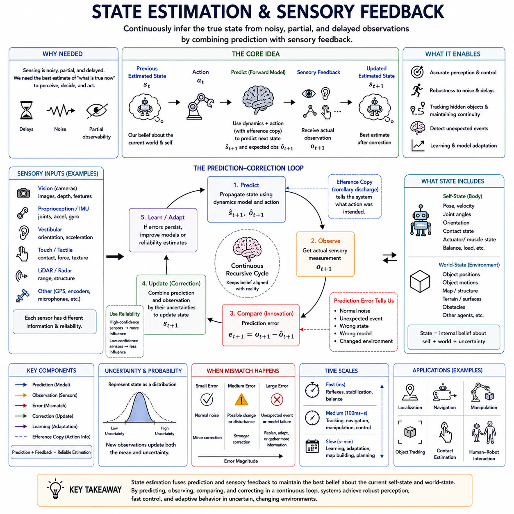{width="7.268055555555556in" height="7.268055555555556in"}

State estimation is the process by which a biological or artificial agent infers its current condition from incomplete, noisy, and delayed information. The true state of the body and environment is rarely available through direct observation. Instead, the system must combine previous state estimates, internal predictions, motor information, and incoming sensory evidence to construct a continuously updated representation suitable for perception and control.

This requirement arises because sensory measurements are not identical to the underlying physical state. Vision provides projections of the world rather than direct object states, proprioception reflects joint and muscle conditions with uncertainty, and vestibular signals encode aspects of motion and orientation. Each sensory channel therefore supplies partial evidence, and state estimation integrates these observations into a coherent internal description.

A useful distinction can be made between observation and state. An observation is the sensory information available at a particular moment, whereas a state is an internal representation intended to summarize variables needed to explain the past and predict the future. The state may include body pose, velocity, joint configuration, contact conditions, external objects, environmental structure, task context, and uncertainty about these quantities.

Because observations arrive over time, state estimation is inherently temporal. The estimate at one moment provides a prior for the next moment, while internal dynamics specify how that state is expected to evolve. A newly received observation does not create the state estimate from nothing. Instead, it modifies an existing prediction, producing continuity even when individual sensory measurements are ambiguous, noisy, or temporarily unavailable.

Forward models play an important role in this process. Given a previous estimated state and information about an action, a forward model predicts how the state should change. This produces a prior estimate of the next state before complete sensory feedback arrives. The prediction can then be compared with actual observations, allowing the system to correct accumulated errors while retaining the advantages of rapid predictive control.

Sensory feedback provides the complementary source of information. Prediction tells the system what should be happening according to its internal model, while feedback reports evidence about what actually happened. Neither source is sufficient by itself. Prediction without feedback can drift away from reality, whereas feedback without prediction can be delayed, noisy, ambiguous, and insufficient for rapid control. Reliable estimation emerges from their continuous combination.

This interaction can be understood as a prediction-correction cycle. The system begins with an estimated state, predicts the next state using its dynamics and recent actions, receives new sensory evidence, evaluates the difference between prediction and observation, and updates its estimate. The corrected state then becomes the starting point for another prediction. State estimation is therefore an ongoing recursive process rather than a one-time measurement operation.

Prediction error provides important information within this cycle. If observed sensory input differs from the expected observation, the discrepancy indicates that some aspect of the current estimate or predictive model may be inaccurate. The system can use this error to correct its state estimate immediately, while persistent patterns of error can support slower adaptation of the internal model itself.

Not every prediction error should produce the same amount of correction. Sensory signals differ in reliability, and predictions also carry uncertainty. When a sensory measurement is highly reliable, the system should generally allow it to influence the state estimate strongly. When that measurement is noisy or ambiguous, prior prediction may deserve greater weight. Effective state estimation therefore requires reasoning about confidence as well as about measured values.

This principle is closely related to probabilistic inference. Instead of representing the state as a perfectly known point, an estimator can represent uncertainty over possible states. New observations modify that uncertainty according to their reliability and consistency with prior expectations. Such representations allow the system to distinguish between knowing that something is unlikely and simply lacking sufficient information to determine what is happening.

Multisensory integration strengthens state estimation because different sensors provide complementary constraints. Vision can provide rich information about external geometry, proprioception can indicate body configuration, vestibular signals can constrain orientation and acceleration, and touch can reveal contact. When several modalities support the same interpretation, confidence increases. When they disagree, the system must determine which signals are currently more trustworthy.

Sensory reliability is not fixed. Vision may become unreliable in darkness or occlusion, proprioception may become less informative for some external relationships, and tactile information is available only during contact. A robust estimator should therefore adapt the relative influence of different sensory channels according to context. Flexible sensory weighting allows the internal state to remain useful as environmental and bodily conditions change.

Biological state estimation also benefits from efference copy. Information about a recently issued motor command provides evidence about how the body should have changed even before delayed sensory feedback is available. A forward model can propagate the previous state using this action information, creating a predicted current state. Incoming sensory signals subsequently correct the estimate, linking motor intention directly with perception.

This mechanism is especially important during rapid movement. If the nervous system relied exclusively on sensory signals describing earlier body states, control would continually lag behind the movement being controlled. Predictive state estimation allows the system to maintain an approximation of the present despite neural delays. Feedback then prevents this internally propagated estimate from diverging indefinitely from the actual body and environment.

Self-state estimation includes more than spatial position. Depending on the behavior, the relevant state may include orientation, velocity, joint configuration, muscle or actuator condition, balance, contact, load, and action readiness. The purpose of the estimate is not to reconstruct every physical variable in maximum detail, but to preserve information required for successful prediction, decision making, and control.

World-state estimation extends the same principle to the environment. An agent must infer where objects are, whether they are moving, which surfaces are traversable, what obstacles exist, and how external entities relate to the agent. Because parts of the environment may be occluded or temporarily outside the sensory field, the internal state must preserve information across time rather than representing only what is immediately visible.

Object persistence illustrates this temporal requirement. When an object disappears behind an obstacle, its sensory observation may temporarily vanish even though the object continues to exist. A state estimator can maintain a hypothesis about its hidden position and motion based on previous observations and expected dynamics. When the object becomes visible again, new sensory evidence can confirm or correct the maintained estimate.

State estimation therefore supports perceptual continuity. The sensory stream changes whenever the agent moves, objects become occluded, illumination changes, or individual sensors become unreliable. A persistent internal state prevents cognition from treating each observation as an unrelated snapshot. Instead, observations are interpreted as evidence about a continuously evolving world containing a continuously evolving embodied agent.

In robotics, this computational problem appears explicitly in localization, navigation, manipulation, and control. A robot may combine wheel encoders, IMUs, cameras, LiDAR, GNSS, joint sensors, force sensors, and tactile measurements to estimate its state. Each sensor provides different information and different error characteristics, making sensor fusion essential for producing a representation reliable enough for autonomous behavior.

Classical estimation techniques formalize prediction and correction mathematically. Kalman filtering and related methods propagate a state estimate through a dynamics model and then update it using sensor measurements. Nonlinear and non-Gaussian problems may require extended, unscented, particle-based, or other probabilistic approaches. The specific algorithm varies, but the underlying principle remains the integration of model-based prediction with sensory evidence.

Modern embodied AI can learn parts of this estimation process rather than relying entirely on manually defined state variables. Neural encoders can transform high-dimensional multimodal observations into compact latent states, while recurrent or state-space models preserve information over time. Action-conditioned transition models can then predict how those latent states evolve, allowing learned representations to participate in the same prediction-correction logic.

However, a learned latent state must remain useful for behavior. Compressing observations is not sufficient if the resulting representation loses information about collision risk, object motion, contact, reachability, balance, or task progress. State estimation should preserve variables that support future prediction and action. This requirement connects representation learning directly with the functional demands of embodied intelligence.

Sensory feedback also plays a critical role in detecting unexpected events. When actual measurements deviate substantially from predictions, the difference may indicate wheel slip, external force, object movement, actuator degradation, unexpected contact, or another environmental change. Feedback therefore does more than correct ordinary estimation noise; it provides evidence that the assumptions underlying the current internal state may no longer be valid.

Persistent discrepancies can trigger adaptation at a deeper level. Immediate feedback may correct the current state, but repeated prediction errors suggest that the transition model, sensor model, or uncertainty assumptions themselves should change. This creates two interacting timescales: fast correction keeps the estimate aligned with reality, while slower learning improves the models used to generate future estimates.

Ultimately, state estimation and sensory feedback form the grounding mechanism of predictive control. Internal models allow an agent to anticipate its evolving self-state and world-state, while sensory evidence continually constrains those predictions against reality. By repeatedly predicting, observing, comparing, and correcting, an embodied system maintains a usable belief about the present and provides the state representation required for subsequent action-conditioned prediction, planning, and adaptive behavior.

상태 추정(State Estimation)은 생물학적 또는 인공 에이전트(Artificial Agent)가 불완전하고 잡음이 있으며 지연된 정보로부터 자신의 현재 상태(Current Condition)를 추론하는 과정입니다. 신체와 환경의 실제 상태(True State)는 직접적인 관측을 통해 완전히 얻을 수 있는 경우가 드뭅니다. 대신 시스템은 이전 상태 추정(Previous State Estimates), 내부 예측(Internal Predictions), 운동 정보(Motor Information), 새롭게 들어오는 감각 증거(Sensory Evidence)를 결합하여 지각과 제어에 적합한 지속적으로 갱신되는 표현을 구성해야 합니다.

이러한 과정이 필요한 이유는 감각 측정(Sensory Measurements)이 실제 물리적 상태(Physical State) 그 자체와 동일하지 않기 때문입니다. 시각(Vision)은 객체의 상태를 직접 제공하는 대신 세계의 투영(Projection)을 제공하며, 고유수용감각(Proprioception)은 불확실성이 포함된 관절과 근육 상태를 반영하고, 전정 신호(Vestibular Signals)는 움직임과 방향의 일부 특성을 부호화합니다. 따라서 각각의 감각 채널(Sensory Channel)은 부분적인 증거만을 제공하며, 상태 추정은 이러한 관측을 일관된 내부 기술(Internal Description)로 통합합니다.

관측(Observation)과 상태(State)는 유용하게 구분할 수 있습니다. 관측은 특정 순간에 이용할 수 있는 감각 정보를 의미하는 반면, 상태는 과거를 설명하고 미래를 예측하는 데 필요한 변수들을 요약하기 위한 내부 표현(Internal Representation)입니다. 상태에는 신체 자세(Body Pose), 속도(Velocity), 관절 구성(Joint Configuration), 접촉 조건(Contact Conditions), 외부 객체(External Objects), 환경 구조(Environmental Structure), 작업 맥락(Task Context), 그리고 이러한 변수들에 대한 불확실성(Uncertainty)이 포함될 수 있습니다.

관측은 시간에 따라 연속적으로 들어오기 때문에 상태 추정(State Estimation)은 본질적으로 시간적(Temporal)인 과정입니다. 한 시점의 추정치는 다음 시점의 사전 정보(Prior)를 제공하며, 내부 동역학(Internal Dynamics)은 해당 상태가 어떻게 변화할 것으로 예상되는지를 규정합니다. 새롭게 들어온 관측이 상태 추정치를 처음부터 다시 생성하는 것이 아니라 기존 예측을 수정합니다. 이를 통해 개별 감각 측정이 모호하거나 잡음이 있거나 일시적으로 이용할 수 없는 경우에도 연속성(Continuity)을 유지할 수 있습니다.

순방향 모델(Forward Models)은 이러한 과정에서 중요한 역할을 합니다. 이전에 추정된 상태와 행동(Action)에 관한 정보가 주어지면 순방향 모델은 상태가 어떻게 변화할지를 예측합니다. 이를 통해 완전한 감각 피드백(Sensory Feedback)이 도착하기 전에 다음 상태에 대한 사전 추정(Prior Estimate)을 생성할 수 있습니다. 이후 예측을 실제 관측과 비교함으로써 시스템은 빠른 예측 제어(Predictive Control)의 장점을 유지하면서 누적된 오류를 수정할 수 있습니다.

감각 피드백(Sensory Feedback)은 이에 상호보완적인 정보원을 제공합니다. 예측(Prediction)은 내부 모델에 따라 어떤 일이 일어나고 있어야 하는지를 알려주는 반면, 피드백은 실제로 어떤 일이 발생했는지에 대한 증거를 제공합니다. 어느 하나만으로는 충분하지 않습니다. 피드백이 없는 예측은 현실에서 점차 벗어날 수 있으며, 예측이 없는 피드백은 지연되고 잡음이 있으며 모호할 수 있어 빠른 제어에 충분하지 않을 수 있습니다. 신뢰할 수 있는 상태 추정은 이 둘의 지속적인 결합을 통해 형성됩니다.

이러한 상호작용은 예측-보정 순환(Prediction-Correction Cycle)으로 이해할 수 있습니다. 시스템은 추정된 상태에서 시작하여 동역학과 최근 행동을 이용해 다음 상태를 예측하고, 새로운 감각 증거를 받아들인 뒤 예측과 관측 사이의 차이를 평가하여 상태 추정치를 갱신합니다. 이렇게 수정된 상태는 다시 다음 예측의 출발점이 됩니다. 따라서 상태 추정은 일회성 측정 작업이 아니라 지속적으로 반복되는 재귀적 과정(Recursive Process)입니다.

예측 오류(Prediction Error)는 이러한 순환 과정에서 중요한 정보를 제공합니다. 관측된 감각 입력이 예상된 관측과 다르다면 이러한 차이는 현재 추정치 또는 예측 모델(Predictive Model)의 일부가 부정확할 가능성을 나타냅니다. 시스템은 이 오류를 이용해 현재 상태 추정치를 즉시 수정할 수 있으며, 지속적으로 나타나는 오류 패턴은 내부 모델 자체를 보다 느린 시간 척도에서 적응시키는 데 활용될 수 있습니다.

모든 예측 오류가 동일한 정도의 보정(Correction)을 유발해야 하는 것은 아닙니다. 감각 신호는 서로 다른 신뢰성(Reliability)을 가지며 예측에도 불확실성이 존재합니다. 감각 측정의 신뢰성이 높다면 일반적으로 해당 측정이 상태 추정에 강한 영향을 미치도록 해야 합니다. 반대로 측정값에 잡음이 많거나 모호하다면 기존 예측에 더 높은 가중치를 부여할 수 있습니다. 따라서 효과적인 상태 추정을 위해서는 측정값뿐 아니라 신뢰도(Confidence)에 대한 추론도 필요합니다.

이러한 원리는 확률적 추론(Probabilistic Inference)과 밀접하게 관련됩니다. 상태를 완벽하게 알려진 하나의 점으로 표현하는 대신 추정기는 가능한 상태들에 대한 불확실성을 표현할 수 있습니다. 새로운 관측은 그 신뢰성과 기존 예상과의 일관성에 따라 이러한 불확실성을 수정합니다. 이러한 표현을 통해 시스템은 어떤 상황이 가능성이 낮다는 것과 단순히 무슨 일이 발생하고 있는지 판단할 정보가 부족한 상황을 구별할 수 있습니다.

다중감각 통합(Multisensory Integration)은 서로 다른 센서들이 상호보완적인 제약 조건을 제공하기 때문에 상태 추정을 강화합니다. 시각은 외부 기하 구조(External Geometry)에 관한 풍부한 정보를 제공하고, 고유수용감각은 신체 구성을 나타내며, 전정 신호는 방향과 가속도(Acceleration)를 제한하고, 촉각(Touch)은 접촉 정보를 제공합니다. 여러 감각 양식이 동일한 해석을 지지하면 신뢰도가 높아지며, 서로 일치하지 않을 경우 시스템은 현재 어떤 신호를 더 신뢰해야 하는지를 결정해야 합니다.

감각의 신뢰성(Sensory Reliability)은 고정되어 있지 않습니다. 어둠이나 가림(Occlusion)이 존재하면 시각의 신뢰성이 낮아질 수 있고, 고유수용감각은 일부 외부 관계를 파악하는 데 충분하지 않을 수 있으며, 촉각 정보는 접촉이 발생할 때만 이용할 수 있습니다. 따라서 강건한 추정기(Robust Estimator)는 상황에 따라 서로 다른 감각 채널의 상대적인 영향력을 조정해야 합니다. 유연한 감각 가중치(Sensory Weighting)는 환경과 신체 조건이 변화하더라도 내부 상태를 유용하게 유지하도록 합니다.

생물학적 상태 추정(Biological State Estimation)은 원심성 복사(Efference Copy)의 도움도 받습니다. 최근 실행된 운동 명령에 관한 정보는 지연된 감각 피드백이 도착하기 전에도 신체가 어떻게 변화했어야 하는지를 추정할 수 있는 증거를 제공합니다. 순방향 모델은 이러한 행동 정보를 이용해 이전 상태를 전파하여 예측된 현재 상태(Predicted Current State)를 생성할 수 있습니다. 이후 들어오는 감각 신호가 추정치를 수정하면서 운동 의도(Motor Intention)와 지각이 직접 연결됩니다.

이러한 메커니즘은 빠른 움직임(Rapid Movement)에서 특히 중요합니다. 신경계가 과거의 신체 상태를 나타내는 감각 신호에만 의존한다면 제어는 항상 실제 움직임보다 뒤처지게 됩니다. 예측적 상태 추정(Predictive State Estimation)을 이용하면 신경 지연(Neural Delays)이 존재하더라도 현재 상태에 가까운 근사치를 유지할 수 있습니다. 이후 피드백은 내부적으로 전파된 추정치가 실제 신체와 환경에서 무한정 벗어나지 않도록 수정합니다.

자기 상태 추정(Self-State Estimation)은 단순한 공간적 위치 이상을 포함합니다. 행동에 따라 관련 상태에는 방향(Orientation), 속도, 관절 구성, 근육 또는 액추에이터 상태(Actuator Condition), 균형(Balance), 접촉(Contact), 하중(Load), 행동 준비 상태(Action Readiness)가 포함될 수 있습니다. 상태 추정의 목적은 모든 물리 변수를 최대한 상세하게 복원하는 것이 아니라 성공적인 예측, 의사결정(Decision Making), 제어에 필요한 정보를 보존하는 것입니다.

세계 상태 추정(World-State Estimation)은 동일한 원리를 환경으로 확장합니다. 에이전트는 객체가 어디에 있는지, 움직이고 있는지, 어떤 표면이 이동 가능한지, 어떤 장애물이 존재하는지, 외부 개체가 자신과 어떤 관계에 있는지를 추론해야 합니다. 환경의 일부가 가려지거나 일시적으로 감각 범위(Sensory Field) 밖에 존재할 수 있으므로 내부 상태는 현재 즉시 보이는 것만 표현하는 것이 아니라 시간에 걸쳐 정보를 유지해야 합니다.

객체 지속성(Object Persistence)은 이러한 시간적 요구사항을 잘 보여줍니다. 객체가 장애물 뒤로 사라지면 객체가 계속 존재하고 있음에도 감각 관측은 일시적으로 사라질 수 있습니다. 상태 추정기는 이전 관측과 예상 동역학(Expected Dynamics)을 바탕으로 숨겨진 위치와 움직임에 대한 가설(Hypothesis)을 유지할 수 있습니다. 객체가 다시 보이게 되면 새로운 감각 증거를 통해 유지하고 있던 추정치를 확인하거나 수정할 수 있습니다.

따라서 상태 추정(State Estimation)은 지각적 연속성(Perceptual Continuity)을 지원합니다. 에이전트가 움직이거나, 객체가 가려지거나, 조명(Illumination)이 변하거나, 개별 센서의 신뢰성이 낮아지면 감각 스트림(Sensory Stream)은 계속 변화합니다. 지속적인 내부 상태(Persistent Internal State)는 인지 시스템이 각각의 관측을 서로 관련 없는 독립적인 스냅샷(Snapshot)으로 처리하지 않도록 합니다. 대신 관측은 지속적으로 변화하는 체화 에이전트와 세계에 관한 증거로 해석됩니다.

로보틱스(Robotics)에서는 이러한 계산 문제가 위치 추정(Localization), 내비게이션(Navigation), 조작(Manipulation), 제어에서 명시적으로 나타납니다. 로봇은 휠 엔코더(Wheel Encoders), 관성측정장치(IMUs), 카메라(Cameras), 라이다(LiDAR), 위성항법시스템(GNSS), 관절 센서(Joint Sensors), 힘 센서(Force Sensors), 촉각 측정(Tactile Measurements)을 결합하여 자신의 상태를 추정할 수 있습니다. 각 센서는 서로 다른 정보와 오류 특성(Error Characteristics)을 제공하므로 자율 행동에 충분히 신뢰할 수 있는 표현을 생성하려면 센서 융합(Sensor Fusion)이 필수적입니다.

전통적인 추정 기법(Classical Estimation Techniques)은 예측과 보정을 수학적으로 공식화합니다. 칼만 필터링(Kalman Filtering)과 관련된 방법은 동역학 모델을 통해 상태 추정치를 전파한 뒤 센서 측정값을 이용하여 이를 갱신합니다. 비선형(Nonlinear) 또는 비가우시안(Non-Gaussian) 문제에서는 확장형(Extended), 무향형(Unscented), 파티클 기반(Particle-Based) 또는 기타 확률적 접근법을 사용할 수 있습니다. 구체적인 알고리즘은 달라지지만 모델 기반 예측과 감각 증거를 통합한다는 기본 원리는 동일합니다.

현대 체화 인공지능(Embodied AI)은 사람이 정의한 상태 변수에만 전적으로 의존하지 않고 이러한 추정 과정의 일부를 학습할 수 있습니다. 신경 인코더(Neural Encoders)는 고차원의 다중모달 관측(Multimodal Observations)을 압축된 잠재 상태(Latent States)로 변환할 수 있으며, 순환 모델(Recurrent Models)이나 상태 공간 모델(State-Space Models)은 시간에 걸쳐 정보를 유지할 수 있습니다. 행동 조건부 전이 모델(Action-Conditioned Transition Models)은 이러한 잠재 상태가 어떻게 변화하는지를 예측하여 학습된 표현이 동일한 예측-보정 논리(Prediction-Correction Logic)에 참여하도록 합니다.

그러나 학습된 잠재 상태(Learned Latent State)는 실제 행동에 유용해야 합니다. 관측을 압축하는 것만으로는 충분하지 않으며, 그 결과 생성된 표현이 충돌 위험(Collision Risk), 객체 움직임(Object Motion), 접촉, 도달 가능성(Reachability), 균형, 작업 진행 상태(Task Progress)에 관한 정보를 잃어버린다면 문제가 됩니다. 상태 추정은 미래 예측과 행동을 지원하는 변수들을 보존해야 하며, 이러한 요구사항은 표현 학습(Representation Learning)을 체화 지능(Embodied Intelligence)의 기능적 요구와 직접 연결합니다.

감각 피드백(Sensory Feedback)은 예상하지 못한 사건을 탐지하는 데에도 중요한 역할을 합니다. 실제 측정값이 예측에서 크게 벗어나면 그 차이는 바퀴 미끄러짐(Wheel Slip), 외력(External Force), 객체 움직임, 액추에이터 성능 저하(Actuator Degradation), 예상하지 못한 접촉(Unexpected Contact), 기타 환경 변화를 나타낼 수 있습니다. 따라서 피드백은 일반적인 추정 잡음(Estimation Noise)을 수정하는 것뿐 아니라 현재 내부 상태의 기반이 되는 가정이 더 이상 유효하지 않을 가능성을 알려주는 증거도 제공합니다.

지속적인 불일치(Persistent Discrepancies)는 더 깊은 수준의 적응(Adaptation)을 유발할 수 있습니다. 즉각적인 피드백은 현재 상태를 수정할 수 있지만 반복적인 예측 오류는 전이 모델(Transition Model), 센서 모델(Sensor Model), 불확실성에 관한 가정 자체를 변경해야 한다는 것을 의미합니다. 이에 따라 두 가지 상호작용하는 시간 척도(Time Scales)가 형성됩니다. 빠른 보정(Fast Correction)은 추정치를 현실에 맞추고, 더 느린 학습(Slower Learning)은 미래 상태 추정에 사용되는 모델 자체를 개선합니다.

궁극적으로 상태 추정(State Estimation)과 감각 피드백(Sensory Feedback)은 예측 제어(Predictive Control)를 현실에 연결하는 기반 메커니즘(Grounding Mechanism)을 형성합니다. 내부 모델은 에이전트가 변화하는 자기 상태(Self-State)와 세계 상태(World-State)를 예상하도록 하며, 감각 증거는 이러한 예측이 현실에서 벗어나지 않도록 지속적으로 제약합니다. 체화 시스템은 예측하고, 관측하고, 비교하고, 수정하는 과정을 반복함으로써 현재에 대한 유용한 내부 믿음(Internal Belief)을 유지하고, 이후의 행동 조건부 예측(Action-Conditioned Prediction), 계획(Planning), 적응적 행동(Adaptive Behavior)에 필요한 상태 표현을 제공합니다.

##  

## 09.08 Action Conditioned Prediction [w/Code]

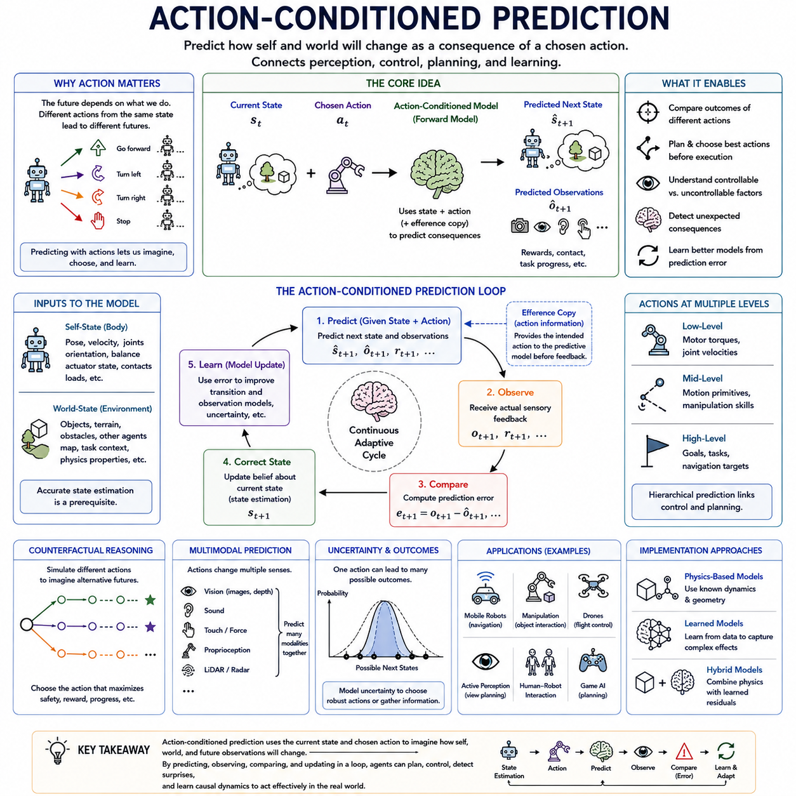{width="7.268055555555556in" height="7.268055555555556in"}

Action-conditioned prediction is the process of predicting how an agent and its environment will change as a consequence of a particular action. Rather than forecasting the future only from the current state, the predictive system explicitly includes the selected action as a causal input. This enables an internal model to distinguish between futures produced by different interventions and forms a central mechanism connecting perception, control, planning, and learning.

A general action-conditioned transition can be expressed as a relationship in which the current state s_t and action a_t determine a predicted future state ŝ_t+1. The model may additionally predict a future observation ô_t+1, reward, contact event, task progress, or other action-relevant quantities. The essential principle is that predictions depend not only on what the world currently looks like, but also on what the agent chooses to do.

This distinction is fundamental for embodied intelligence because the future is partly controlled by the agent. A stationary observer may attempt to predict how external events evolve naturally, but an embodied agent continuously intervenes through locomotion, manipulation, gaze shifts, communication, and other actions. Its predictive model must therefore represent both autonomous environmental dynamics and transformations caused by deliberate intervention.

Different actions applied to the same state can generate very different futures. From an identical robot pose, accelerating forward, turning left, turning right, or stopping will produce different trajectories and sensor observations. During manipulation, pushing, pulling, lifting, rotating, or releasing an object generates different state transitions. Action-conditioned prediction preserves these alternatives instead of averaging them into a single uncontrolled forecast.

The idea is closely related to biological internal models. Motor systems generate commands that influence the body, while efference copy provides predictive circuits with information about the intended action. A forward model can combine this action information with the estimated current state to anticipate sensory and motor consequences. Action-conditioned prediction generalizes this principle into a computational framework applicable to biological control, robotics, and artificial intelligence.

Accurate state estimation is therefore an important prerequisite. The effect of an action depends on the state from which it begins. Applying the same steering command at different velocities, executing the same joint command from different configurations, or pushing objects with different contact states can produce substantially different outcomes. Prediction must condition simultaneously on both the selected action and a sufficiently informative representation of the current situation.

Self-state and world-state both contribute to this representation. Self-state may include pose, velocity, joint configuration, balance, actuator condition, or contact status, while world-state may describe objects, terrain, obstacles, other agents, and task context. Action-conditioned prediction connects these representations by estimating how an intervention by the agent changes both itself and the surrounding environment over time.

Sensory consequences are an important part of the predicted future. Moving a camera changes the visual field, walking changes optic flow and proprioception, and touching an object produces tactile and force signals. Predicting these action-dependent observations allows an agent to anticipate what its sensors should report. Actual sensory feedback can then be compared with predicted observations to determine whether the action unfolded as expected.

The resulting prediction error provides a powerful signal for correction and learning. If the observed consequence differs from the predicted consequence, the current state estimate, action execution, environmental model, or transition dynamics may be inaccurate. Small discrepancies may require ordinary state correction, while persistent or large discrepancies can indicate changed dynamics, unexpected contact, actuator degradation, external disturbance, or previously unmodeled environmental behavior.

Action-conditioned prediction therefore supports learning causal relationships rather than merely temporal correlations. If a model observes that one state tends to follow another without considering the intervening action, it may fail to understand why the transition occurred. Including actions explicitly allows the system to learn which transformations are controllable and which arise independently. This distinction is essential for agents that must reason about the consequences of their own choices.

Controllability is particularly important for decision making. An intelligent agent should distinguish between aspects of the future that can be changed through action and those that cannot. Action-conditioned models can reveal which state dimensions respond predictably to specific interventions. This knowledge supports the development of affordances, reachable-state representations, and policies that focus computational resources on outcomes the agent can meaningfully influence.

Action-conditioned prediction naturally enables counterfactual reasoning. Before executing an action, the agent can ask what would happen if it selected one candidate rather than another. Each candidate action can be propagated through the predictive model, producing alternative future states. Comparing these imagined consequences allows the agent to evaluate safety, progress, energy consumption, stability, collision risk, or expected reward without physically testing every possibility.

Extending this process across several steps creates an internal rollout. The predicted state resulting from one action becomes the starting point for another simulated action, producing a sequence of possible future states. Multiple action sequences can therefore be explored internally. This transforms a one-step predictive mechanism into a foundation for trajectory optimization, model predictive control, model-based reinforcement learning, and deliberative planning.

Prediction horizon becomes an important design consideration in such systems. Short-horizon predictions can often estimate immediate dynamics accurately and are useful for stabilization, collision avoidance, and contact control. Longer horizons are valuable for navigation and task planning but accumulate uncertainty and modeling error. Practical systems therefore benefit from hierarchical prediction in which different models or representations operate across different temporal scales.

Uncertainty must be represented because a single action does not always lead to one deterministic outcome. Friction may vary, objects may move unpredictably, sensors may be noisy, and other agents may respond differently. A probabilistic action-conditioned model can represent several plausible futures or estimate confidence in its predictions. Decision mechanisms can then prefer robust actions or gather additional information when uncertainty becomes excessive.

Multimodal prediction extends the framework beyond a single sensory channel. An action may simultaneously change visual appearance, depth, proprioception, force, sound, and tactile contact. Predicting several modalities provides complementary evidence about the expected consequence. If most predicted signals agree with observation while one sensor deviates strongly, the discrepancy may help identify sensor failure or a localized modeling problem.

In robotics, action-conditioned prediction can be implemented using analytical dynamics, learned models, or hybrid approaches. Physics-based models provide structured predictions when geometry and dynamics are known, while learned models can capture friction, compliance, actuator nonlinearities, complex contacts, and other effects that are difficult to specify analytically. Hybrid models can combine physical priors with learned residual corrections for improved robustness.

Mobile robots provide a clear example. Given estimated pose, velocity, terrain condition, and a steering or velocity command, the model can predict future motion and sensor observations. Comparing prediction with wheel encoders, IMU, GNSS, cameras, or LiDAR can reveal wheel slip or external disturbance. Candidate commands can also be simulated before execution to select trajectories that avoid obstacles while maintaining stability and efficiency.

Manipulation requires even richer action-conditioned models because actions can modify external objects directly. A robot must predict how grasping, pushing, pulling, rotating, or releasing will alter object pose, contact, force, and surrounding geometry. Successful prediction therefore requires representations of both robot dynamics and object interaction. Prediction errors can subsequently refine estimates of mass, friction, compliance, and other physical properties.

Modern world models generalize this concept by learning action-conditioned transitions in latent space. High-dimensional observations from cameras, LiDAR, proprioception, language, or other modalities can be encoded into compact latent states. A transition model receives the latent state and selected action and predicts a future latent representation. The system can therefore reason about future consequences without reconstructing every sensory detail at every prediction step.

The quality of the latent representation is crucial. A useful model should preserve information needed to distinguish consequences that matter for action, including collision, reachability, balance, object displacement, contact, task completion, and uncertainty. Predicting visually plausible futures is insufficient if the internal representation loses these control-relevant relationships. Action-conditioned world models must therefore be optimized for decision usefulness as well as predictive accuracy.

Action representations themselves may exist at several levels. Low-level actions can describe torque, velocity, or joint commands, while intermediate actions may represent motion primitives or manipulation skills. High-level actions can correspond to navigation goals, grasp commands, or task-level behaviors. Hierarchical systems can condition predictions at each level, connecting rapid physical dynamics with slower semantic and task-level changes.

This hierarchical structure creates a bridge between motor control and cognitive planning. At the lowest level, action-conditioned prediction estimates immediate physical consequences. At intermediate levels, it predicts trajectories, contacts, and object transformations. At higher levels, it can estimate progress toward goals and the consequences of selecting different skills. A unified predictive architecture can therefore connect actuator control with increasingly abstract decision making.

Action-conditioned prediction also supports active perception because sensing itself can be treated as an action. Moving a camera, changing viewpoint, approaching an object, or repositioning a manipulator alters the observations that will become available. A predictive model can estimate which sensing action is likely to reduce uncertainty or reveal task-relevant information. The agent can then choose actions not only to change the world but also to improve its knowledge of the world.

Ultimately, action-conditioned prediction converts an internal model from a passive forecasting mechanism into an instrument for intelligent control. By predicting how alternative actions transform self-state, world-state, and future observations, an agent can compare possibilities before acting, detect unexpected consequences afterward, and improve its model through prediction error. This creates a continuous loop linking state estimation, action, prediction, sensory feedback, planning, and learning, forming a foundational mechanism for adaptive robotics, embodied AI, and predictive world models.

행동 조건부 예측(Action-Conditioned Prediction)은 특정 행동(Action)의 결과로 에이전트와 환경이 어떻게 변화할지를 예측하는 과정입니다. 현재 상태(Current State)만으로 미래를 예측하는 대신, 예측 시스템은 선택된 행동을 인과적 입력(Causal Input)으로 명시적으로 포함합니다. 이를 통해 내부 모델(Internal Model)은 서로 다른 개입(Interventions)에 의해 만들어지는 미래를 구분할 수 있으며, 지각(Perception), 제어(Control), 계획(Planning), 학습(Learning)을 연결하는 핵심 메커니즘을 형성합니다.

일반적인 행동 조건부 전이(Action-Conditioned Transition)는 현재 상태 s_t와 행동 a_t가 예측된 미래 상태 ŝ_t+1을 결정하는 관계로 표현할 수 있습니다. 모델은 추가적으로 미래 관측(Future Observation) ô_t+1, 보상(Reward), 접촉 사건(Contact Event), 작업 진행 상태(Task Progress), 또는 기타 행동 관련 변수(Action-Relevant Quantities)를 예측할 수도 있습니다. 핵심 원리는 예측이 현재 세계가 어떤 모습인지에만 의존하는 것이 아니라 에이전트가 무엇을 선택하여 행동하는지에도 의존한다는 것입니다.

이러한 구분은 체화 지능(Embodied Intelligence)에서 근본적으로 중요합니다. 미래는 부분적으로 에이전트에 의해 제어되기 때문입니다. 정지된 관찰자(Stationary Observer)는 외부 사건이 자연적으로 어떻게 변화하는지를 예측할 수 있지만, 체화 에이전트(Embodied Agent)는 이동(Locomotion), 조작(Manipulation), 시선 이동(Gaze Shifts), 의사소통(Communication), 기타 행동을 통해 지속적으로 세계에 개입합니다. 따라서 예측 모델은 자율적인 환경 동역학(Environmental Dynamics)과 의도적인 개입으로 발생하는 변환을 모두 표현해야 합니다.

동일한 상태에 서로 다른 행동을 적용하면 매우 다른 미래가 만들어질 수 있습니다. 동일한 로봇 자세(Robot Pose)에서도 전진 가속, 좌회전, 우회전, 정지는 서로 다른 궤적(Trajectories)과 센서 관측(Sensor Observations)을 만들어냅니다. 조작에서는 밀기(Pushing), 당기기(Pulling), 들어 올리기(Lifting), 회전(Rotating), 놓기(Releasing)가 서로 다른 상태 전이(State Transitions)를 생성합니다. 행동 조건부 예측은 이러한 대안들을 하나의 통제되지 않은 예측으로 평균화하지 않고 개별적으로 보존합니다.

이 개념은 생물학적 내부 모델(Biological Internal Models)과 밀접하게 관련됩니다. 운동 시스템(Motor Systems)은 신체에 영향을 미치는 명령을 생성하고, 원심성 복사(Efference Copy)는 의도된 행동에 관한 정보를 예측 회로(Predictive Circuits)에 제공합니다. 순방향 모델(Forward Model)은 이러한 행동 정보와 추정된 현재 상태를 결합하여 감각 및 운동 결과(Sensory and Motor Consequences)를 예상할 수 있습니다. 행동 조건부 예측은 이러한 원리를 생물학적 제어, 로보틱스(Robotics), 인공지능(Artificial Intelligence)에 적용할 수 있는 계산 프레임워크(Computational Framework)로 일반화합니다.

따라서 정확한 상태 추정(State Estimation)은 중요한 전제 조건입니다. 행동의 효과는 해당 행동이 어떤 상태에서 시작되는지에 따라 달라집니다. 서로 다른 속도에서 동일한 조향 명령(Steering Command)을 적용하거나, 서로 다른 관절 구성(Joint Configurations)에서 동일한 관절 명령을 실행하거나, 서로 다른 접촉 상태(Contact States)의 객체를 밀면 상당히 다른 결과가 발생할 수 있습니다. 따라서 예측은 선택된 행동과 현재 상황을 충분히 표현하는 상태 표현(State Representation) 모두를 동시에 조건으로 사용해야 합니다.

자기 상태(Self-State)와 세계 상태(World-State)는 모두 이러한 표현에 기여합니다. 자기 상태에는 자세(Pose), 속도(Velocity), 관절 구성, 균형(Balance), 액추에이터 상태(Actuator Condition), 접촉 상태(Contact Status)가 포함될 수 있으며, 세계 상태는 객체(Objects), 지형(Terrain), 장애물(Obstacles), 다른 에이전트(Other Agents), 작업 맥락(Task Context)을 기술할 수 있습니다. 행동 조건부 예측은 에이전트의 개입이 자신과 주변 환경 모두를 시간에 따라 어떻게 변화시키는지를 추정함으로써 이러한 표현들을 연결합니다.

감각 결과(Sensory Consequences)는 예측된 미래의 중요한 부분입니다. 카메라를 움직이면 시야(Visual Field)가 변하고, 걸으면 광학 흐름(Optic Flow)과 고유수용감각(Proprioception)이 변하며, 객체를 만지면 촉각 및 힘 신호(Tactile and Force Signals)가 발생합니다. 이러한 행동 의존적 관측(Action-Dependent Observations)을 예측하면 에이전트는 자신의 센서가 무엇을 보고해야 하는지를 미리 예상할 수 있습니다. 이후 실제 감각 피드백(Sensory Feedback)을 예측된 관측과 비교하여 행동이 예상대로 진행되었는지를 판단할 수 있습니다.

그 결과 발생하는 예측 오류(Prediction Error)는 보정(Correction)과 학습을 위한 강력한 신호를 제공합니다. 관측된 결과가 예측된 결과와 다르다면 현재 상태 추정, 행동 실행(Action Execution), 환경 모델(Environmental Model), 전이 동역학(Transition Dynamics) 중 일부가 부정확할 수 있습니다. 작은 차이는 일반적인 상태 보정이 필요하다는 것을 의미할 수 있지만, 지속적이거나 큰 차이는 변화된 동역학, 예상하지 못한 접촉, 액추에이터 성능 저하(Actuator Degradation), 외부 교란(External Disturbance), 또는 기존에 모델링되지 않은 환경 행동을 나타낼 수 있습니다.

따라서 행동 조건부 예측은 단순한 시간적 상관관계(Temporal Correlations)가 아니라 인과 관계(Causal Relationships)의 학습을 지원합니다. 모델이 개입하는 행동을 고려하지 않고 한 상태 다음에 다른 상태가 나타나는 것만 관측한다면 해당 전이가 왜 발생했는지를 이해하지 못할 수 있습니다. 행동을 명시적으로 포함하면 시스템은 어떤 변환이 제어 가능(Controllable)하고 어떤 변화가 독립적으로 발생하는지를 학습할 수 있습니다. 이러한 구분은 자신의 선택이 가져올 결과를 추론해야 하는 에이전트에게 필수적입니다.

제어 가능성(Controllability)은 의사결정(Decision Making)에서 특히 중요합니다. 지능형 에이전트는 행동을 통해 변화시킬 수 있는 미래의 요소와 그렇지 않은 요소를 구별해야 합니다. 행동 조건부 모델은 특정 개입에 예측 가능하게 반응하는 상태 차원(State Dimensions)을 파악할 수 있습니다. 이러한 지식은 행동유도성(Affordances), 도달 가능한 상태 표현(Reachable-State Representations), 그리고 에이전트가 실제로 영향을 줄 수 있는 결과에 계산 자원을 집중하는 정책(Policies)의 개발을 지원합니다.

행동 조건부 예측은 자연스럽게 반사실적 추론(Counterfactual Reasoning)을 가능하게 합니다. 행동을 실행하기 전에 에이전트는 하나의 후보 행동 대신 다른 후보를 선택하면 어떤 일이 발생할지를 내부적으로 평가할 수 있습니다. 각각의 후보 행동(Candidate Action)을 예측 모델을 통해 전개하여 서로 다른 미래 상태를 생성할 수 있습니다. 이러한 상상된 결과를 비교하면 모든 가능성을 실제로 시험하지 않고도 안전성(Safety), 진행 정도(Progress), 에너지 소비(Energy Consumption), 안정성(Stability), 충돌 위험(Collision Risk), 예상 보상(Expected Reward)을 평가할 수 있습니다.

이 과정을 여러 단계로 확장하면 내부 롤아웃(Internal Rollout)이 형성됩니다. 하나의 행동으로부터 예측된 상태가 다음 시뮬레이션 행동의 시작 상태가 되어 가능한 미래 상태들의 시퀀스를 생성합니다. 따라서 여러 행동 시퀀스(Action Sequences)를 내부적으로 탐색할 수 있습니다. 이를 통해 단일 단계 예측 메커니즘이 궤적 최적화(Trajectory Optimization), 모델 예측 제어(Model Predictive Control), 모델 기반 강화학습(Model-Based Reinforcement Learning), 숙고적 계획(Deliberative Planning)의 기반으로 확장됩니다.

이러한 시스템에서는 예측 시간 범위(Prediction Horizon)가 중요한 설계 요소가 됩니다. 단기 예측(Short-Horizon Prediction)은 즉각적인 동역학을 비교적 정확하게 추정할 수 있어 안정화(Stabilization), 충돌 회피(Collision Avoidance), 접촉 제어(Contact Control)에 유용합니다. 장기 예측(Longer-Horizon Prediction)은 내비게이션과 작업 계획에 중요하지만 불확실성과 모델링 오류가 누적됩니다. 따라서 실제 시스템에서는 서로 다른 모델이나 표현이 서로 다른 시간 척도에서 작동하는 계층적 예측(Hierarchical Prediction)이 유용합니다.

하나의 행동이 항상 하나의 결정론적 결과(Deterministic Outcome)로 이어지는 것은 아니므로 불확실성(Uncertainty)을 표현해야 합니다. 마찰(Friction)은 변할 수 있고, 객체는 예상하지 못하게 움직일 수 있으며, 센서에는 잡음이 있고, 다른 에이전트가 서로 다르게 반응할 수 있습니다. 확률적 행동 조건부 모델(Probabilistic Action-Conditioned Model)은 여러 가능한 미래를 표현하거나 예측의 신뢰도(Confidence)를 추정할 수 있습니다. 이를 통해 의사결정 메커니즘은 보다 강건한 행동을 선택하거나 불확실성이 지나치게 커질 경우 추가 정보를 수집할 수 있습니다.

다중모달 예측(Multimodal Prediction)은 이러한 프레임워크를 하나의 감각 채널 이상으로 확장합니다. 하나의 행동은 시각적 모습(Visual Appearance), 깊이(Depth), 고유수용감각, 힘, 소리(Sound), 촉각 접촉(Tactile Contact)을 동시에 변화시킬 수 있습니다. 여러 감각 양식을 함께 예측하면 예상되는 결과에 대해 상호보완적인 증거를 얻을 수 있습니다. 대부분의 예측 신호가 실제 관측과 일치하지만 특정 센서만 크게 벗어난다면 센서 고장(Sensor Failure)이나 국소적인 모델링 문제를 파악하는 데 도움이 될 수 있습니다.

로보틱스에서는 행동 조건부 예측을 해석적 동역학(Analytical Dynamics), 학습 기반 모델(Learned Models), 또는 하이브리드 접근법(Hybrid Approaches)을 통해 구현할 수 있습니다. 물리 기반 모델(Physics-Based Models)은 기하학과 동역학이 알려진 경우 구조화된 예측을 제공하며, 학습 기반 모델은 마찰, 유연성(Compliance), 액추에이터 비선형성(Actuator Nonlinearities), 복잡한 접촉 등 해석적으로 표현하기 어려운 효과를 포착할 수 있습니다. 하이브리드 모델은 물리적 사전 지식(Physical Priors)과 학습된 잔차 보정(Learned Residual Corrections)을 결합하여 강건성을 향상시킬 수 있습니다.

이동 로봇(Mobile Robots)은 이를 명확하게 보여주는 사례입니다. 추정된 자세, 속도, 지형 상태와 조향 또는 속도 명령이 주어지면 모델은 미래 움직임과 센서 관측을 예측할 수 있습니다. 이러한 예측을 휠 엔코더(Wheel Encoders), 관성측정장치(IMU), 위성항법시스템(GNSS), 카메라, 라이다(LiDAR)와 비교하면 바퀴 미끄러짐(Wheel Slip)이나 외부 교란을 탐지할 수 있습니다. 또한 실행 전에 후보 명령을 시뮬레이션하여 장애물을 회피하면서 안정성과 효율성을 유지하는 궤적을 선택할 수 있습니다.

조작(Manipulation)은 행동이 외부 객체를 직접 변화시키기 때문에 더욱 풍부한 행동 조건부 모델을 요구합니다. 로봇은 잡기(Grasping), 밀기, 당기기, 회전, 놓기와 같은 행동이 객체 자세(Object Pose), 접촉, 힘, 주변 기하 구조(Surrounding Geometry)를 어떻게 변화시킬지를 예측해야 합니다. 따라서 성공적인 예측을 위해서는 로봇 동역학뿐 아니라 객체 상호작용(Object Interaction)에 대한 표현도 필요합니다. 이후 예측 오류를 이용하여 질량(Mass), 마찰, 유연성 등의 물리적 특성에 대한 추정치를 개선할 수 있습니다.

현대 세계 모델(World Models)은 잠재 공간(Latent Space)에서 행동 조건부 전이(Action-Conditioned Transitions)를 학습함으로써 이러한 개념을 일반화합니다. 카메라, 라이다, 고유수용감각, 언어(Language), 기타 감각 양식에서 얻은 고차원 관측을 압축된 잠재 상태(Latent State)로 부호화할 수 있습니다. 전이 모델(Transition Model)은 잠재 상태와 선택된 행동을 입력받아 미래 잠재 표현(Future Latent Representation)을 예측합니다. 따라서 모든 예측 단계에서 모든 감각 세부 정보를 재구성하지 않고도 미래 결과를 추론할 수 있습니다.

잠재 표현(Latent Representation)의 품질은 매우 중요합니다. 유용한 모델은 충돌(Collision), 도달 가능성(Reachability), 균형, 객체 이동(Object Displacement), 접촉, 작업 완료(Task Completion), 불확실성과 같이 행동의 결과를 구분하는 데 필요한 정보를 보존해야 합니다. 내부 표현이 이러한 제어 관련 관계(Control-Relevant Relationships)를 잃어버린다면 시각적으로 그럴듯한 미래를 예측하는 것만으로는 충분하지 않습니다. 따라서 행동 조건부 세계 모델은 예측 정확도뿐 아니라 의사결정 유용성(Decision Usefulness)을 고려하여 최적화되어야 합니다.

행동 표현(Action Representations) 자체도 여러 수준으로 구성될 수 있습니다. 저수준 행동(Low-Level Actions)은 토크(Torque), 속도, 관절 명령을 나타낼 수 있으며, 중간 수준 행동은 운동 프리미티브(Motion Primitives)나 조작 기술(Manipulation Skills)을 표현할 수 있습니다. 고수준 행동(High-Level Actions)은 내비게이션 목표(Navigation Goals), 파지 명령(Grasp Commands), 작업 수준 행동(Task-Level Behaviors)에 해당할 수 있습니다. 계층적 시스템은 각 수준에서 예측을 행동에 조건화함으로써 빠른 물리적 동역학과 상대적으로 느린 의미적 및 작업 수준 변화를 연결할 수 있습니다.

이러한 계층 구조(Hierarchical Structure)는 운동 제어(Motor Control)와 인지적 계획(Cognitive Planning) 사이의 연결을 형성합니다. 가장 낮은 수준에서 행동 조건부 예측은 즉각적인 물리적 결과를 추정합니다. 중간 수준에서는 궤적, 접촉, 객체 변환(Object Transformations)을 예측합니다. 더 높은 수준에서는 목표를 향한 진행 정도와 서로 다른 기술(Skills)을 선택했을 때의 결과를 추정할 수 있습니다. 따라서 통합된 예측 구조(Unified Predictive Architecture)는 액추에이터 제어에서 점점 더 추상적인 의사결정까지 연결할 수 있습니다.

행동 조건부 예측은 감지(Sensing) 자체를 하나의 행동으로 취급할 수 있기 때문에 능동 지각(Active Perception)도 지원합니다. 카메라를 움직이거나, 시점을 변경하거나, 객체에 접근하거나, 매니퓰레이터(Manipulator)의 위치를 바꾸면 이후 이용할 수 있는 관측이 달라집니다. 예측 모델은 어떤 감지 행동(Sensing Action)이 불확실성을 줄이거나 작업 관련 정보를 드러낼 가능성이 높은지를 추정할 수 있습니다. 따라서 에이전트는 세계를 변화시키기 위한 행동뿐 아니라 세계에 대한 자신의 지식을 향상시키기 위한 행동도 선택할 수 있습니다.

궁극적으로 행동 조건부 예측(Action-Conditioned Prediction)은 내부 모델을 수동적인 미래 예측 메커니즘(Passive Forecasting Mechanism)에서 지능적 제어(Intelligent Control)를 위한 도구로 변화시킵니다. 에이전트는 대안 행동들이 자기 상태(Self-State), 세계 상태(World-State), 미래 관측(Future Observations)을 어떻게 변화시킬지를 예측함으로써 행동하기 전에 가능성을 비교하고, 행동 이후에는 예상하지 못한 결과를 탐지하며, 예측 오류를 통해 자신의 모델을 개선할 수 있습니다. 이는 상태 추정(State Estimation), 행동, 예측, 감각 피드백(Sensory Feedback), 계획, 학습을 연결하는 지속적인 루프를 형성하며 적응형 로보틱스(Adaptive Robotics), 체화 인공지능(Embodied AI), 예측 세계 모델(Predictive World Models)의 핵심적인 기반 메커니즘을 제공합니다.

##  

## 09.09 Internal Simulation and Mental Rollout [w/Code]

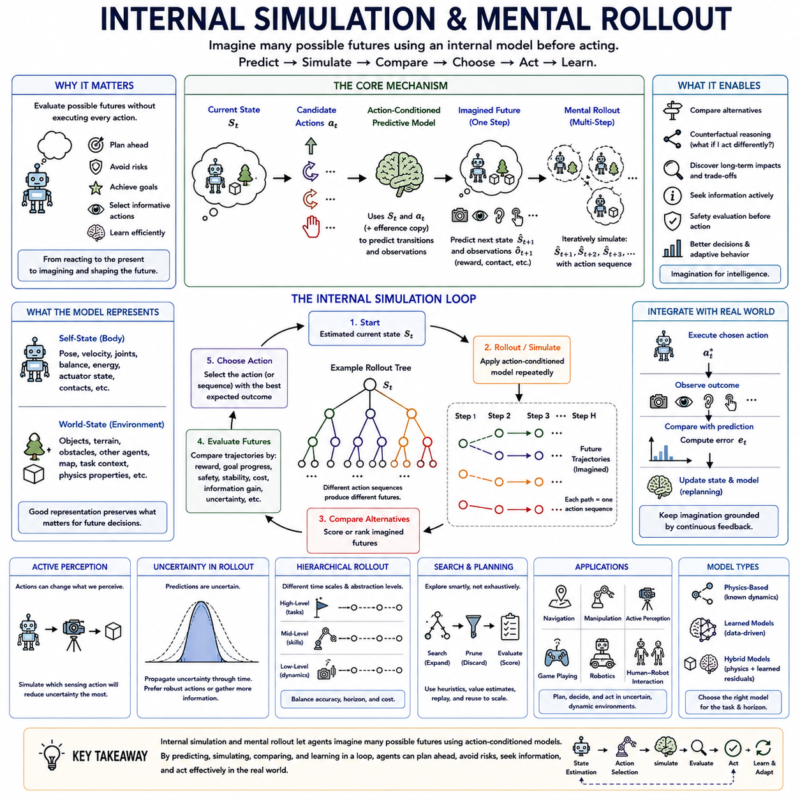{width="7.268055555555556in" height="7.268055555555556in"}

Internal simulation is the ability of an intelligent system to evaluate possible future events without physically executing every candidate action. Using an internal model of itself and the surrounding world, the system can generate hypothetical state transitions and examine their consequences. Mental rollout extends this process across multiple future steps, transforming immediate prediction into an internal sequence of imagined actions, states, observations, and outcomes.

The basic mechanism begins with an estimated current state and a candidate action. An action-conditioned predictive model estimates the next state that would result if the action were executed. Instead of immediately applying that action to the physical world, the predicted state can remain inside the internal model. Another hypothetical action can then be applied to this predicted state, allowing the system to construct progressively longer simulated futures.

A rollout can therefore be represented as a sequence such as s_t, a_t, ŝ_t+1, a_t+1, ŝ_t+2, and so forth. Each predicted state becomes the starting condition for the next internal transition. The resulting trajectory represents one possible future generated under a particular sequence of actions. Alternative action sequences can produce different trajectories, enabling the system to compare multiple futures before committing to physical behavior.

This capability transforms prediction into planning. One-step prediction answers the question of what is likely to happen immediately after an action, whereas internal simulation asks what may happen after a sequence of decisions. By extending prediction through time, an agent can evaluate whether an apparently useful immediate action eventually leads toward a goal, creates future risk, consumes excessive resources, or limits later choices.

Mental rollout is closely connected to biological internal models. The nervous system can use learned relationships among state, action, and consequence to anticipate movements before their full sensory outcomes occur. At higher levels of cognition, similar predictive principles can support imagined action sequences. The important computational idea is that learned models can be used offline or prospectively, not only to explain events that have already occurred.

Internal simulation depends strongly on the quality of state representation. A rollout can only preserve consequences represented within its internal state. If collision risk, balance, object position, available energy, contact state, or task progress is absent from the representation, the simulation may generate plausible but behaviorally useless futures. Effective mental rollout therefore requires states that preserve variables relevant to subsequent decisions.

Self-state and world-state must evolve together during simulation. A mobile robot moving forward changes its own pose while simultaneously changing its relationship to obstacles and destinations. A manipulator pushing an object changes joint configuration, contact conditions, and object pose. Internal rollout must capture these coupled transitions so that simulated actions reflect interactions between the embodied agent and its environment rather than treating them independently.

Sensory consequences can also be included in imagined trajectories. A predicted movement may generate expected visual observations, proprioceptive signals, tactile contact, force, sound, or other sensory information. This is especially important when future decisions depend on what the agent expects to perceive after moving. Simulation can therefore predict not only how the world changes, but also what information may become available in future states.

This property connects mental rollout with active perception. An agent may internally compare actions according to how much useful information they are expected to reveal. Turning a camera, moving around an obstacle, approaching an uncertain object, or touching a surface can produce observations that reduce uncertainty. The best simulated action may therefore be one that improves knowledge rather than immediately changing the task state toward the final goal.

Alternative futures form the basis of counterfactual reasoning. Instead of asking only what will happen, the system can ask what would happen if it acted differently. Several candidate actions can be simulated from the same initial state and extended into separate branches. Their consequences can then be compared according to safety, reward, stability, efficiency, uncertainty, task completion, or other criteria relevant to the agent.

As the number of possible actions and rollout depth increase, the number of potential futures can grow rapidly. Exhaustively simulating every possible sequence becomes computationally impractical. Intelligent rollout therefore requires selective search. The system may prioritize promising actions, discard clearly unsafe branches, reuse previously computed states, or apply learned value estimates that approximate the long-term quality of a future without simulating every remaining step.

Prediction horizon creates another important tradeoff. Short rollouts usually preserve higher physical accuracy because errors have less time to accumulate. Long rollouts provide information about delayed consequences but become increasingly uncertain as predicted states are repeatedly used as inputs for further prediction. Effective systems must balance the strategic value of looking farther ahead against the decreasing reliability and increasing computational cost of distant predictions.

Hierarchical simulation provides one solution to this problem. Fine-grained models can predict milliseconds or short physical intervals for immediate control, while more abstract representations predict motion segments, skills, or task-level outcomes over longer horizons. The system does not need to simulate every actuator command across an entire mission. Different levels of abstraction can instead represent future behavior at temporal resolutions appropriate to their decisions.

For example, a low-level rollout may evaluate torque, balance, contact, or wheel traction over a short interval. An intermediate rollout may predict a trajectory around an obstacle or the result of a manipulation skill. A higher-level simulation may compare sequences such as approach, grasp, transport, and place. Hierarchical mental rollout thereby connects physical dynamics with semantic goals while controlling computational complexity.

Uncertainty is fundamental because imagined futures are predictions rather than observations. Model errors, sensor uncertainty, unknown environmental dynamics, and actions of other agents can cause the actual future to differ from the simulated one. Internal simulation should therefore represent confidence or multiple plausible outcomes rather than assuming that every rollout describes exactly what will happen.

Probabilistic rollout can propagate this uncertainty through future transitions. An action may produce a distribution of possible next states rather than a single state, and uncertainty can increase as the simulation extends farther into the future. Planning can then favor actions that perform acceptably across several plausible outcomes instead of selecting a trajectory that succeeds only under one highly specific prediction.

Simulation must also be grounded continuously by sensory feedback. Once an action is physically executed, actual observations can be compared with the state predicted during rollout. Differences reveal where the internal simulation was inaccurate. The system can correct its current state estimate, replan from the newly observed condition, and potentially update the predictive model so that future simulations better reflect real dynamics.

This creates a receding relationship between imagination and action. The agent predicts several steps ahead, chooses an action based on those simulated futures, executes only part of the plan, observes the result, and then simulates again. Such repeated replanning prevents long internal trajectories from being followed blindly when reality diverges from expectation. Prediction remains prospective while sensory feedback continuously reconnects it to the physical world.

Model predictive control provides a clear engineering example of this principle. A controller predicts future system behavior under candidate control sequences, evaluates their expected cost, selects a favorable sequence, and executes only the immediate control portion. At the next cycle, the process is repeated using an updated state estimate. Mental rollout generalizes this logic beyond conventional control variables toward richer representations of embodied behavior.

Model-based reinforcement learning similarly uses learned dynamics to imagine experience before or alongside physical interaction. A model can generate predicted trajectories from candidate policies or actions, allowing the agent to estimate future reward without executing every possibility in the environment. This can improve data efficiency, although poor models can also introduce systematic errors when imagined experience differs substantially from reality.

Modern world models extend internal simulation into learned latent spaces. High-dimensional sensory observations can be encoded into compact internal states, after which action-conditioned transition models generate future latent states. Rollouts can occur within this compressed representation instead of synthesizing complete camera images, point clouds, and sensor streams at every step. This can substantially reduce the computational burden of predicting action-relevant futures.

Latent simulation must nevertheless preserve causal and controllable structure. A compact representation is useful only if simulated actions produce meaningful changes corresponding to possible physical outcomes. The model should retain relationships involving collision, object permanence, contact, motion, reachability, affordances, task progress, and other factors needed for decision making. Compression should remove irrelevant detail without destroying the structure required for planning.

Internal simulation also provides a mechanism for safety evaluation. Before performing a potentially risky action, an agent can examine simulated trajectories for collision, instability, excessive force, unreachable states, or other undesirable outcomes. Candidate behaviors that violate safety constraints can be rejected before execution. This does not guarantee safety, because models remain imperfect, but it provides an additional predictive layer beyond purely reactive protection.

In multi-agent environments, rollout becomes more complex because future states depend on the responses of other agents. A robot may need to predict how humans, vehicles, or other robots could react to its behavior. Internal simulation may therefore contain several possible interaction trajectories rather than a single deterministic future. Planning must account for both the agent\'s own controllable actions and uncertain responses generated by others.

Ultimately, internal simulation and mental rollout allow intelligence to move from reacting to the present toward evaluating possible futures. By repeatedly applying action-conditioned models to internally predicted states, an agent can imagine trajectories, compare alternatives, anticipate delayed consequences, evaluate uncertainty, and choose actions before committing them to the physical world. Combined with sensory feedback and continual model correction, this mechanism forms a bridge from predictive internal models to planning, reasoning, adaptive control, model-based learning, and embodied AI.

내부 시뮬레이션(Internal Simulation)은 지능형 시스템(Intelligent System)이 모든 후보 행동(Candidate Action)을 물리적으로 실행하지 않고도 가능한 미래 사건을 평가하는 능력입니다. 시스템은 자기 자신과 주변 세계에 대한 내부 모델(Internal Model)을 사용하여 가상의 상태 전이(Hypothetical State Transitions)를 생성하고 그 결과를 검토할 수 있습니다. 정신적 롤아웃(Mental Rollout)은 이 과정을 여러 미래 단계로 확장하여 즉각적인 예측을 상상된 행동, 상태, 관측, 결과가 이어지는 내부 시퀀스(Internal Sequence)로 변환합니다.

기본적인 메커니즘은 추정된 현재 상태(Current State)와 후보 행동(Candidate Action)에서 시작됩니다. 행동 조건부 예측 모델(Action-Conditioned Predictive Model)은 해당 행동이 실행될 경우 발생할 다음 상태를 추정합니다. 이 행동을 즉시 물리적 세계에 적용하는 대신 예측된 상태를 내부 모델 안에 유지할 수 있습니다. 이후 또 다른 가상의 행동을 이 예측 상태에 적용함으로써 시스템은 점차 더 긴 시뮬레이션 미래(Simulated Futures)를 구성할 수 있습니다.

따라서 롤아웃(Rollout)은 s_t, a_t, ŝ_t+1, a_t+1, ŝ_t+2와 같은 시퀀스로 표현할 수 있습니다. 각각의 예측 상태(Predicted State)는 다음 내부 전이(Internal Transition)의 시작 조건이 됩니다. 그 결과 생성된 궤적(Trajectory)은 특정 행동 시퀀스(Action Sequence)에 의해 만들어질 수 있는 하나의 가능한 미래를 나타냅니다. 서로 다른 행동 시퀀스는 서로 다른 궤적을 생성할 수 있으므로 시스템은 실제 행동을 결정하기 전에 여러 미래를 비교할 수 있습니다.

이러한 능력은 예측(Prediction)을 계획(Planning)으로 확장합니다. 단일 단계 예측(One-Step Prediction)은 하나의 행동 직후에 어떤 일이 일어날 가능성이 높은지를 답하지만, 내부 시뮬레이션은 일련의 의사결정 이후 어떤 일이 발생할지를 평가합니다. 예측을 시간적으로 확장함으로써 에이전트는 당장 유용해 보이는 행동이 궁극적으로 목표에 도달하는지, 미래 위험을 만드는지, 지나치게 많은 자원을 소비하는지, 또는 이후의 선택을 제한하는지를 평가할 수 있습니다.

정신적 롤아웃(Mental Rollout)은 생물학적 내부 모델(Biological Internal Models)과 밀접하게 연결됩니다. 신경계는 상태(State), 행동(Action), 결과(Consequence) 사이에서 학습된 관계를 이용하여 움직임의 완전한 감각 결과가 나타나기 전에 이를 예상할 수 있습니다. 더 높은 수준의 인지에서는 유사한 예측 원리가 상상된 행동 시퀀스를 지원할 수 있습니다. 중요한 계산적 개념은 학습된 모델이 이미 발생한 사건을 설명하는 데만 사용되는 것이 아니라 오프라인(Offline) 또는 미래지향적(Prospective)으로도 사용될 수 있다는 것입니다.

내부 시뮬레이션은 상태 표현(State Representation)의 품질에 크게 의존합니다. 롤아웃은 내부 상태에 표현되어 있는 결과만을 유지할 수 있습니다. 충돌 위험(Collision Risk), 균형(Balance), 객체 위치(Object Position), 사용 가능한 에너지(Available Energy), 접촉 상태(Contact State), 작업 진행 상태(Task Progress)가 표현에 포함되지 않는다면 시뮬레이션은 그럴듯하지만 행동에는 유용하지 않은 미래를 생성할 수 있습니다. 따라서 효과적인 정신적 롤아웃에는 이후 의사결정에 필요한 변수를 보존하는 상태가 필요합니다.

자기 상태(Self-State)와 세계 상태(World-State)는 시뮬레이션 과정에서 함께 변화해야 합니다. 이동 로봇(Mobile Robot)이 전진하면 자신의 자세(Pose)가 변하는 동시에 장애물 및 목적지와의 관계도 변화합니다. 매니퓰레이터(Manipulator)가 객체를 밀면 관절 구성(Joint Configuration), 접촉 조건(Contact Conditions), 객체 자세(Object Pose)가 함께 변합니다. 내부 롤아웃은 이러한 결합된 전이(Coupled Transitions)를 포착하여 시뮬레이션된 행동이 체화 에이전트와 환경의 상호작용을 반영하도록 해야 합니다.

감각 결과(Sensory Consequences) 역시 상상된 궤적(Imagined Trajectories)에 포함될 수 있습니다. 예측된 움직임은 예상되는 시각 관측(Visual Observations), 고유수용감각 신호(Proprioceptive Signals), 촉각 접촉(Tactile Contact), 힘(Force), 소리(Sound), 기타 감각 정보를 생성할 수 있습니다. 이는 미래의 의사결정이 이동 이후 무엇을 지각할 것으로 예상하는지에 의존할 때 특히 중요합니다. 따라서 시뮬레이션은 세계가 어떻게 변화하는지뿐만 아니라 미래 상태에서 어떤 정보를 얻을 수 있을지도 예측할 수 있습니다.

이러한 특성은 정신적 롤아웃을 능동 지각(Active Perception)과 연결합니다. 에이전트는 어떤 행동이 유용한 정보를 얼마나 많이 제공할 것으로 예상되는지를 기준으로 내부적으로 행동을 비교할 수 있습니다. 카메라를 돌리거나, 장애물 주변으로 이동하거나, 불확실한 객체에 접근하거나, 표면을 만지는 행동은 불확실성을 감소시키는 관측을 만들어낼 수 있습니다. 따라서 가장 좋은 시뮬레이션 행동은 최종 목표를 향해 즉각적으로 작업 상태를 변화시키는 행동이 아니라 지식을 향상시키는 행동일 수도 있습니다.

대안적 미래(Alternative Futures)는 반사실적 추론(Counterfactual Reasoning)의 기반을 형성합니다. 시스템은 단순히 무엇이 발생할지를 묻는 대신 다르게 행동했다면 어떤 일이 발생할지를 평가할 수 있습니다. 동일한 초기 상태에서 여러 후보 행동을 시뮬레이션하고 각각을 서로 다른 분기(Branches)로 확장할 수 있습니다. 이후 안전성(Safety), 보상(Reward), 안정성(Stability), 효율성(Efficiency), 불확실성(Uncertainty), 작업 완료(Task Completion) 등 에이전트에게 중요한 기준을 사용하여 그 결과를 비교할 수 있습니다.

가능한 행동의 수와 롤아웃 깊이(Rollout Depth)가 증가하면 잠재적인 미래의 수는 빠르게 증가할 수 있습니다. 가능한 모든 시퀀스를 완전하게 시뮬레이션하는 것은 계산적으로 현실적이지 않습니다. 따라서 지능적인 롤아웃에는 선택적 탐색(Selective Search)이 필요합니다. 시스템은 가능성이 높은 행동을 우선적으로 평가하고, 명백히 위험한 분기를 제거하며, 이전에 계산된 상태를 재사용하거나, 남아 있는 모든 단계를 시뮬레이션하지 않고 미래의 장기적인 품질을 근사하는 학습된 가치 추정(Learned Value Estimates)을 사용할 수 있습니다.

예측 시간 범위(Prediction Horizon)는 또 다른 중요한 절충 관계(Tradeoff)를 만듭니다. 짧은 롤아웃은 오류가 누적될 시간이 적기 때문에 일반적으로 높은 물리적 정확성을 유지합니다. 긴 롤아웃은 지연된 결과(Delayed Consequences)에 대한 정보를 제공하지만 예측 상태가 다시 다음 예측의 입력으로 반복 사용되면서 불확실성이 증가합니다. 효과적인 시스템은 더 먼 미래를 바라보는 전략적 가치와 장거리 예측의 신뢰성 감소 및 계산 비용 증가 사이에서 균형을 유지해야 합니다.

계층적 시뮬레이션(Hierarchical Simulation)은 이러한 문제에 대한 하나의 해결책을 제공합니다. 세밀한 모델(Fine-Grained Models)은 즉각적인 제어를 위해 밀리초 또는 짧은 물리적 시간 간격을 예측할 수 있으며, 보다 추상적인 표현(Abstract Representations)은 더 긴 시간 범위에서 움직임 구간(Motion Segments), 기술(Skills), 작업 수준 결과(Task-Level Outcomes)를 예측할 수 있습니다. 시스템은 전체 임무 동안 모든 액추에이터 명령을 일일이 시뮬레이션할 필요 없이 의사결정에 적합한 시간 해상도(Temporal Resolution)를 사용하여 미래 행동을 표현할 수 있습니다.

예를 들어 저수준 롤아웃(Low-Level Rollout)은 짧은 시간 동안 토크(Torque), 균형, 접촉, 바퀴 접지력(Wheel Traction)을 평가할 수 있습니다. 중간 수준 롤아웃(Intermediate Rollout)은 장애물을 우회하는 궤적이나 조작 기술의 결과를 예측할 수 있습니다. 고수준 시뮬레이션(High-Level Simulation)은 접근(Approach), 파지(Grasp), 운반(Transport), 배치(Place)와 같은 시퀀스를 비교할 수 있습니다. 이러한 계층적 정신 롤아웃은 계산 복잡성을 제어하면서 물리적 동역학(Physical Dynamics)과 의미적 목표(Semantic Goals)를 연결합니다.

상상된 미래는 관측이 아니라 예측이기 때문에 불확실성(Uncertainty)은 근본적인 요소입니다. 모델 오류(Model Errors), 센서 불확실성(Sensor Uncertainty), 알려지지 않은 환경 동역학(Unknown Environmental Dynamics), 다른 에이전트의 행동은 실제 미래가 시뮬레이션된 미래와 달라지도록 만들 수 있습니다. 따라서 내부 시뮬레이션은 모든 롤아웃이 정확하게 발생할 것이라고 가정하기보다 신뢰도(Confidence) 또는 여러 가능한 결과(Multiple Plausible Outcomes)를 표현해야 합니다.

확률적 롤아웃(Probabilistic Rollout)은 이러한 불확실성을 미래 전이로 전달할 수 있습니다. 하나의 행동은 단일 상태가 아니라 가능한 다음 상태들의 분포(Distribution)를 생성할 수 있으며, 시뮬레이션이 더 먼 미래로 확장될수록 불확실성이 증가할 수 있습니다. 따라서 계획 시스템은 하나의 매우 구체적인 예측에서만 성공하는 궤적보다 여러 가능한 결과에서 적절한 성능을 유지하는 행동을 선호할 수 있습니다.

시뮬레이션은 감각 피드백(Sensory Feedback)을 통해 지속적으로 현실에 기반해야 합니다. 행동이 실제로 실행되면 실제 관측을 롤아웃 과정에서 예측했던 상태와 비교할 수 있습니다. 그 차이는 내부 시뮬레이션이 어디에서 부정확했는지를 보여줍니다. 시스템은 현재 상태 추정(State Estimate)을 수정하고 새롭게 관측된 조건에서 다시 계획하며, 미래의 시뮬레이션이 실제 동역학을 더 정확하게 반영하도록 예측 모델 자체를 갱신할 수도 있습니다.

이를 통해 상상(Imagination)과 행동(Action) 사이에 반복적으로 갱신되는 관계가 형성됩니다. 에이전트는 여러 단계를 미리 예측하고, 시뮬레이션된 미래를 바탕으로 행동을 선택하며, 계획의 일부만 실행한 뒤 결과를 관측하고 다시 시뮬레이션합니다. 이러한 반복적 재계획(Replanning)은 현실이 예상과 달라졌을 때 긴 내부 궤적을 그대로 따라가는 것을 방지합니다. 예측은 미래지향적으로 유지되는 동시에 감각 피드백을 통해 지속적으로 물리적 세계와 다시 연결됩니다.

모델 예측 제어(Model Predictive Control)는 이러한 원리를 보여주는 명확한 공학적 사례입니다. 제어기는 후보 제어 시퀀스(Candidate Control Sequences)에 따른 미래 시스템 행동을 예측하고 예상 비용(Expected Cost)을 평가한 뒤 유리한 시퀀스를 선택하고 그중 즉각적으로 필요한 제어 부분만 실행합니다. 다음 주기에서는 갱신된 상태 추정을 사용하여 동일한 과정을 반복합니다. 정신적 롤아웃은 이러한 논리를 전통적인 제어 변수에서 보다 풍부한 체화 행동(Embodied Behavior)의 표현으로 일반화합니다.

모델 기반 강화학습(Model-Based Reinforcement Learning) 역시 학습된 동역학(Learned Dynamics)을 사용하여 물리적 상호작용 이전 또는 그와 병행하여 경험을 상상합니다. 모델은 후보 정책(Candidate Policies)이나 행동으로부터 예측된 궤적을 생성하여 환경에서 모든 가능성을 직접 실행하지 않고도 미래 보상을 추정하도록 할 수 있습니다. 이는 데이터 효율성(Data Efficiency)을 향상시킬 수 있지만, 상상된 경험이 현실과 크게 다를 경우 부정확한 모델이 체계적인 오류(Systematic Errors)를 유발할 수도 있습니다.

현대 세계 모델(World Models)은 내부 시뮬레이션을 학습된 잠재 공간(Learned Latent Spaces)으로 확장합니다. 고차원 감각 관측(High-Dimensional Sensory Observations)을 압축된 내부 상태(Compact Internal States)로 부호화한 뒤 행동 조건부 전이 모델(Action-Conditioned Transition Models)을 사용하여 미래 잠재 상태(Future Latent States)를 생성할 수 있습니다. 따라서 매 단계마다 완전한 카메라 이미지, 포인트 클라우드(Point Clouds), 센서 스트림(Sensor Streams)을 생성하지 않고도 압축된 표현 안에서 롤아웃을 수행할 수 있으며, 이를 통해 행동 관련 미래를 예측하는 계산 부담을 크게 줄일 수 있습니다.

그러나 잠재 시뮬레이션(Latent Simulation)은 인과적이고 제어 가능한 구조(Causal and Controllable Structure)를 보존해야 합니다. 압축된 표현은 시뮬레이션된 행동이 실제 가능한 물리적 결과에 대응하는 의미 있는 변화를 생성할 때만 유용합니다. 모델은 충돌(Collision), 객체 지속성(Object Permanence), 접촉(Contact), 움직임(Motion), 도달 가능성(Reachability), 행동유도성(Affordances), 작업 진행 상태 등 의사결정에 필요한 관계를 유지해야 합니다. 압축은 계획에 필요한 구조를 파괴하지 않으면서 관련성이 낮은 세부 사항을 제거해야 합니다.

내부 시뮬레이션은 안전성 평가(Safety Evaluation)를 위한 메커니즘도 제공합니다. 잠재적으로 위험한 행동을 실행하기 전에 에이전트는 시뮬레이션 궤적에서 충돌, 불안정성(Instability), 과도한 힘(Excessive Force), 도달 불가능한 상태(Unreachable States), 기타 바람직하지 않은 결과를 검사할 수 있습니다. 안전 제약 조건(Safety Constraints)을 위반하는 후보 행동은 실행 전에 제거할 수 있습니다. 모델이 완벽하지 않기 때문에 안전을 보장할 수는 없지만, 순수한 반응형 보호(Reactive Protection)를 넘어서는 추가적인 예측 계층을 제공합니다.

다중 에이전트 환경(Multi-Agent Environments)에서는 미래 상태가 다른 에이전트의 반응에 의존하기 때문에 롤아웃이 더욱 복잡해집니다. 로봇은 인간(Humans), 차량(Vehicles), 다른 로봇(Other Robots)이 자신의 행동에 어떻게 반응할지를 예측해야 할 수 있습니다. 따라서 내부 시뮬레이션은 하나의 결정론적 미래가 아니라 여러 가능한 상호작용 궤적(Interaction Trajectories)을 포함할 수 있습니다. 계획 과정에서는 에이전트 자신의 제어 가능한 행동뿐 아니라 다른 개체가 만들어내는 불확실한 반응도 함께 고려해야 합니다.

궁극적으로 내부 시뮬레이션(Internal Simulation)과 정신적 롤아웃(Mental Rollout)은 지능이 현재에 단순히 반응하는 수준에서 벗어나 가능한 미래를 평가할 수 있도록 합니다. 에이전트는 행동 조건부 모델(Action-Conditioned Models)을 내부적으로 예측된 상태에 반복 적용함으로써 궤적을 상상하고, 대안을 비교하며, 지연된 결과를 예상하고, 불확실성을 평가한 뒤 물리적 세계에 행동을 실행하기 전에 선택할 수 있습니다. 감각 피드백과 지속적인 모델 보정(Continual Model Correction)을 결합하면 이러한 메커니즘은 예측적 내부 모델(Predictive Internal Models)을 계획, 추론(Reasoning), 적응 제어(Adaptive Control), 모델 기반 학습(Model-Based Learning), 체화 인공지능(Embodied AI)으로 연결하는 핵심적인 기반을 형성합니다.

##  

## 09.10 From Biological Internal Models to World Models [w/Code]

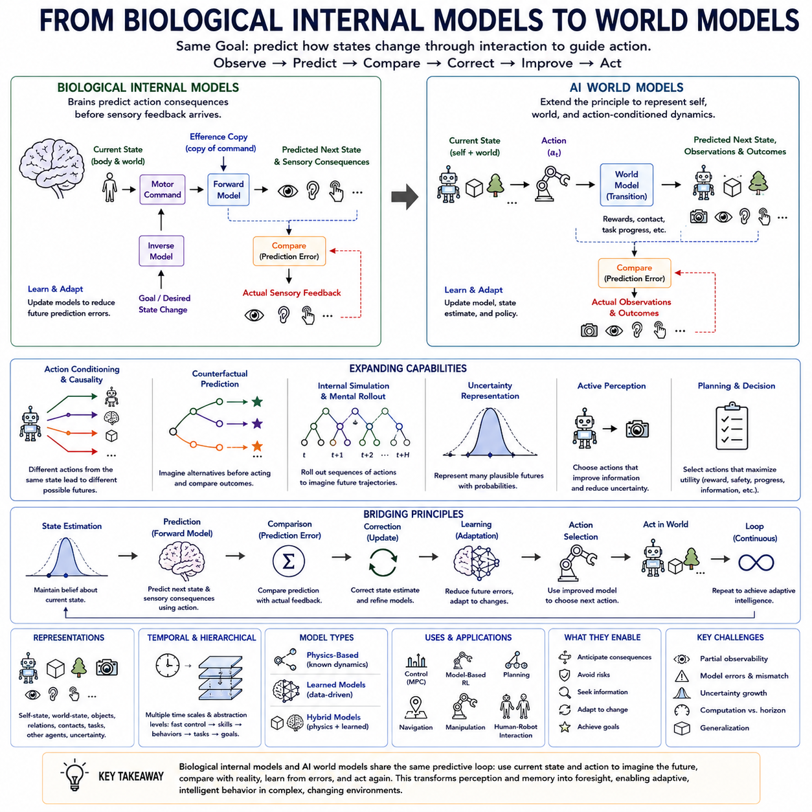{width="7.268055555555556in" height="7.268055555555556in"}

Biological internal models provide a useful foundation for understanding modern computational world models because both systems attempt to predict how states evolve through interaction. In biological control, internal models connect current body state, motor commands, and expected sensory consequences. In artificial intelligence, world models generalize this principle by learning representations of an agent, its environment, and the transitions produced by actions.

The biological perspective begins with the problem of embodied control. An organism cannot wait until every sensory consequence of an action has been observed before deciding what to do next. Neural delays, uncertain observations, and rapidly changing physical dynamics require prediction. Internal models allow the nervous system to estimate future states from current conditions and intended actions, providing an anticipatory mechanism that complements delayed sensory feedback.

Forward models illustrate this predictive principle clearly. Given an estimated current state and a motor command, a forward model predicts the state and sensory consequences expected after the command is executed. Efference copy supplies information about the outgoing action, while sensory feedback later provides evidence about what actually occurred. Comparing prediction and observation produces prediction errors that can support correction, adaptation, and learning.

Inverse models address the complementary relationship between desired outcomes and actions. Instead of predicting what an action will cause, an inverse model estimates which action is likely to produce a desired state transition. Forward and inverse relationships therefore connect goals, actions, and consequences. Together they provide a conceptual architecture in which an embodied system can select actions, anticipate their effects, observe results, and refine future behavior.

The cerebellum provides an important biological example of predictive motor computation. Cerebellar mechanisms are associated with coordination, timing, adaptation, and the prediction of action consequences. By using current state information and signals related to motor commands, predictive circuits can compensate for feedback delays and prepare corrections before errors become large. Repeated discrepancies between expected and observed outcomes can progressively recalibrate internal mappings.

Sensorimotor prediction extends these principles beyond isolated motor commands. Every action modifies the sensory stream: eye movement changes retinal input, locomotion changes optic flow and proprioception, and manipulation changes visual, tactile, and force signals. An internal predictive system can anticipate these transformations, helping distinguish sensory changes generated by the agent itself from changes produced independently by the external environment.

State estimation provides the continuously updated representation required by such prediction. Because the true physical state cannot usually be observed directly, biological systems combine previous estimates, action information, internal dynamics, and sensory evidence. Prediction propagates the state forward, while feedback corrects the estimate. This prediction-correction process maintains a practical belief about the present despite noise, ambiguity, occlusion, and sensory delay.

A world model can be understood as a broader computational extension of this same principle. Rather than modeling only body dynamics or immediate sensory consequences, a world model attempts to represent relevant aspects of both self-state and world-state. It may encode the agent, objects, spatial relationships, motion, contact, terrain, other agents, task context, and uncertainty, depending on what information is required for prediction and decision making.

The transition from biological internal models to AI world models therefore involves an expansion of representational scope. A motor forward model may primarily estimate how a body changes after a command, whereas a world model may predict how an entire interaction scene evolves. Actions can modify the agent, objects, relationships, observations, and task progress simultaneously. The predictive problem becomes one of modeling coupled agent-environment dynamics.

Action conditioning remains central during this expansion. A useful world model should not merely forecast what is likely to happen next from temporal correlations. It should represent how different actions lead to different possible futures. Given the same current state, moving, stopping, grasping, pushing, observing, or communicating may create distinct transitions. Explicit action conditioning allows the model to represent intervention, controllability, and causal consequences.

This property enables counterfactual prediction. If several actions are possible, the model can estimate what would happen under each alternative before any of them is physically executed. The agent can compare these imagined futures according to reward, safety, stability, energy, information gain, or task completion. Prediction thus changes from a mechanism for anticipating immediate sensory consequences into a computational substrate for decision making.

Extending action-conditioned prediction repeatedly produces internal simulation and mental rollout. A predicted future state becomes the starting point for another hypothetical action, allowing sequences of imagined transitions to be generated. Different action sequences create alternative trajectories through possible futures. This mechanism provides a direct conceptual bridge from biological predictive control to model predictive control, model-based reinforcement learning, and planning with learned world models.

Modern world models often perform these predictions in latent representations rather than directly reproducing every future sensory signal. Cameras, LiDAR, proprioception, touch, language, and other observations can be encoded into compact internal states. An action-conditioned transition model then predicts how these latent states evolve. This approach allows the system to preserve behaviorally important structure while avoiding the computational expense of reconstructing every sensory detail.

The usefulness of a latent world model depends on what its representation preserves. A compact state that produces visually convincing predictions may still be inadequate if it loses information about collision, contact, object persistence, reachability, balance, affordances, or task progress. Biological internal models suggest a functional criterion: representations should preserve information needed to predict consequences and support successful action rather than simply reconstruct observations.

World models also inherit the biological requirement for continuous grounding through feedback. Predictions generated internally can drift because learned dynamics are incomplete and environments change. After an action is executed, real observations must constrain the predicted state. Differences between prediction and observation can correct the current estimate, trigger replanning, reveal unexpected events, and provide learning signals for improving the predictive model itself.

Prediction error therefore remains a unifying concept across biological and artificial systems. In biological control, errors between expected and observed consequences can recalibrate sensorimotor mappings. In robotics and AI, similar discrepancies can identify inaccurate dynamics, wheel slip, unexpected contact, object movement, actuator degradation, or environmental change. Persistent errors can motivate adaptation of the model rather than repeated correction of individual states alone.

Uncertainty also becomes increasingly important as predictive scope expands. Immediate motor consequences may sometimes be estimated relatively accurately, but complex environments contain partial observability, unknown dynamics, stochastic interactions, and other agents. A world model should therefore represent confidence or multiple plausible futures. Planning can then consider robust actions instead of treating one internally generated trajectory as a guaranteed description of reality.

Hierarchical prediction provides another bridge between biological control and artificial world modeling. Fast predictive processes can support immediate balance, contact, and actuator control, while slower processes represent trajectories, skills, objects, and task-level consequences. Artificial systems can similarly use different temporal and representational scales, connecting low-level dynamics with navigation, manipulation, semantic reasoning, and long-horizon planning.

Active perception further broadens the role of internal models. Actions do not only change the physical world; they can also change what information becomes available. Moving a camera, approaching an object, changing viewpoint, or making contact can reduce uncertainty. A world model can predict these informational consequences and select actions that improve future state estimation, integrating perception and control into the same predictive framework.

For robotics, this perspective encourages hybrid architectures rather than a strict choice between physical modeling and learned prediction. Known kinematics and dynamics can provide structured priors, probabilistic estimators can maintain state and uncertainty, and learned models can capture complex interactions that are difficult to specify analytically. Together they can create predictive systems that remain physically grounded while adapting to real operational conditions.

World models also extend beyond the immediate sensorimotor loop by representing semantic and task-related structure. An embodied agent may need to understand not only where an object will move but whether it remains usable, reachable, relevant to a goal, or associated with a particular task. Prediction can therefore progress from physical state transitions toward increasingly abstract consequences while remaining anchored to actions and observations.

This progression does not imply that artificial world models reproduce the biological brain directly. Biological mechanisms provide computational principles rather than mandatory engineering blueprints. Prediction from state and action, comparison with sensory evidence, uncertainty-aware estimation, error-driven adaptation, hierarchical timescales, and internal simulation can be implemented using neural networks, state-space models, probabilistic methods, physics engines, or hybrid systems.

The deepest continuity between biological internal models and AI world models lies in their role as models for action rather than passive descriptions of reality. An intelligent system benefits from representing the world in ways that reveal what can happen, what its actions can change, what observations should follow, and which futures are preferable. Prediction becomes valuable because it enables the agent to prepare, compare, choose, and adapt before consequences are fully realized.

Ultimately, the path from biological internal models to world models represents an expansion from predictive sensorimotor control toward predictive embodied intelligence. Forward models, efference copy, sensory feedback, state estimation, and prediction error provide foundational principles, while action-conditioned latent dynamics, internal rollout, uncertainty modeling, and hierarchical planning extend them into modern AI. Together they describe an architecture in which an agent continuously estimates the present, imagines possible futures, acts, observes the consequences, and improves its model through experience.

생물학적 내부 모델(Biological Internal Models)은 현대의 계산적 세계 모델(Computational World Models)을 이해하는 데 유용한 기반을 제공합니다. 두 시스템 모두 상호작용(Interaction)을 통해 상태(State)가 어떻게 변화하는지를 예측하려고 하기 때문입니다. 생물학적 제어(Biological Control)에서 내부 모델은 현재 신체 상태(Current Body State), 운동 명령(Motor Commands), 예상되는 감각 결과(Expected Sensory Consequences)를 연결합니다. 인공지능(Artificial Intelligence)에서 세계 모델(World Models)은 이러한 원리를 일반화하여 에이전트, 환경, 행동에 의해 발생하는 상태 전이(State Transitions)의 표현을 학습합니다.

생물학적 관점은 체화 제어(Embodied Control)의 문제에서 시작됩니다. 생물체는 다음 행동을 결정하기 전에 모든 감각적 행동 결과가 관측될 때까지 기다릴 수 없습니다. 신경 지연(Neural Delays), 불확실한 관측(Uncertain Observations), 빠르게 변화하는 물리 동역학(Physical Dynamics)은 예측을 필요로 합니다. 내부 모델(Internal Models)은 신경계가 현재 조건과 의도된 행동(Intended Actions)으로부터 미래 상태(Future States)를 추정할 수 있도록 하며, 지연된 감각 피드백(Sensory Feedback)을 보완하는 선제적 메커니즘(Anticipatory Mechanism)을 제공합니다.

순방향 모델(Forward Models)은 이러한 예측 원리를 명확하게 보여줍니다. 추정된 현재 상태와 운동 명령이 주어지면 순방향 모델은 명령 실행 이후 예상되는 상태와 감각 결과를 예측합니다. 원심성 복사(Efference Copy)는 외부로 전달되는 행동에 관한 정보를 제공하고, 이후 감각 피드백은 실제로 발생한 결과에 관한 증거를 제공합니다. 예측과 관측을 비교하면 예측 오류(Prediction Errors)가 발생하며, 이는 보정(Correction), 적응(Adaptation), 학습(Learning)을 지원할 수 있습니다.

역모델(Inverse Models)은 원하는 결과(Desired Outcomes)와 행동 사이의 상호보완적인 관계를 다룹니다. 하나의 행동이 어떤 결과를 발생시킬지를 예측하는 대신, 역모델은 원하는 상태 전이(Desired State Transition)를 만들어낼 가능성이 높은 행동을 추정합니다. 따라서 순방향 관계와 역방향 관계는 목표(Goals), 행동(Actions), 결과(Consequences)를 연결합니다. 이들은 함께 체화 시스템이 행동을 선택하고, 그 효과를 예상하며, 결과를 관측하고, 미래 행동을 개선할 수 있는 개념적 구조(Conceptual Architecture)를 제공합니다.

소뇌(Cerebellum)는 예측적 운동 계산(Predictive Motor Computation)의 중요한 생물학적 사례를 제공합니다. 소뇌 메커니즘(Cerebellar Mechanisms)은 협응(Coordination), 타이밍(Timing), 적응, 행동 결과의 예측과 관련되어 있습니다. 예측 회로는 현재 상태 정보와 운동 명령 관련 신호를 사용하여 피드백 지연을 보상하고 오류가 커지기 전에 수정 동작(Corrections)을 준비할 수 있습니다. 예상 결과와 관측 결과 사이의 반복적인 차이는 내부 매핑(Internal Mappings)을 점진적으로 재보정(Recalibration)할 수 있습니다.

감각운동 예측(Sensorimotor Prediction)은 이러한 원리를 개별 운동 명령 이상으로 확장합니다. 모든 행동은 감각 스트림(Sensory Stream)을 변화시킵니다. 눈의 움직임은 망막 입력(Retinal Input)을 변화시키고, 이동(Locomotion)은 광학 흐름(Optic Flow)과 고유수용감각(Proprioception)을 변화시키며, 조작(Manipulation)은 시각, 촉각(Tactile), 힘 신호(Force Signals)를 변화시킵니다. 내부 예측 시스템은 이러한 변환을 예상함으로써 에이전트 자신의 행동에 의해 생성된 감각 변화와 외부 환경에서 독립적으로 발생한 변화를 구분하도록 지원할 수 있습니다.

상태 추정(State Estimation)은 이러한 예측에 필요한 지속적으로 갱신되는 표현을 제공합니다. 실제 물리적 상태(True Physical State)는 일반적으로 직접 관측할 수 없기 때문에 생물학적 시스템은 이전 추정치(Previous Estimates), 행동 정보(Action Information), 내부 동역학(Internal Dynamics), 감각 증거(Sensory Evidence)를 결합합니다. 예측은 상태를 미래로 전파하고 피드백은 추정치를 보정합니다. 이러한 예측-보정 과정(Prediction-Correction Process)은 잡음(Noise), 모호성(Ambiguity), 가림(Occlusion), 감각 지연(Sensory Delay)이 존재하더라도 현재에 대한 실용적인 믿음(Belief)을 유지하도록 합니다.

세계 모델(World Model)은 이러한 동일한 원리를 보다 광범위하게 계산적으로 확장한 것으로 이해할 수 있습니다. 세계 모델은 신체 동역학이나 즉각적인 감각 결과만을 모델링하는 대신 자기 상태(Self-State)와 세계 상태(World-State)의 관련 측면을 모두 표현하려고 합니다. 예측과 의사결정에 어떤 정보가 필요한지에 따라 에이전트, 객체(Objects), 공간적 관계(Spatial Relationships), 움직임(Motion), 접촉(Contact), 지형(Terrain), 다른 에이전트(Other Agents), 작업 맥락(Task Context), 불확실성(Uncertainty)을 부호화할 수 있습니다.

따라서 생물학적 내부 모델에서 인공지능 세계 모델로의 전환은 표현 범위(Representational Scope)의 확장을 포함합니다. 운동 순방향 모델(Motor Forward Model)은 주로 명령 이후 신체가 어떻게 변화하는지를 추정할 수 있지만, 세계 모델은 전체 상호작용 장면(Interaction Scene)이 어떻게 변화하는지를 예측할 수 있습니다. 행동은 에이전트, 객체, 관계, 관측, 작업 진행 상태(Task Progress)를 동시에 변화시킬 수 있습니다. 따라서 예측 문제는 서로 결합된 에이전트-환경 동역학(Coupled Agent-Environment Dynamics)을 모델링하는 문제로 확장됩니다.

행동 조건화(Action Conditioning)는 이러한 확장 과정에서도 핵심적인 요소로 유지됩니다. 유용한 세계 모델은 시간적 상관관계(Temporal Correlations)만을 기반으로 다음에 발생할 가능성이 높은 사건을 단순히 예측해서는 안 됩니다. 서로 다른 행동이 서로 다른 가능한 미래로 어떻게 이어지는지를 표현해야 합니다. 동일한 현재 상태에서도 이동, 정지, 파지(Grasping), 밀기(Pushing), 관측(Observing), 의사소통(Communicating)은 서로 다른 상태 전이를 만들어낼 수 있습니다. 명시적인 행동 조건화는 모델이 개입(Intervention), 제어 가능성(Controllability), 인과적 결과(Causal Consequences)를 표현할 수 있도록 합니다.

이러한 특성은 반사실적 예측(Counterfactual Prediction)을 가능하게 합니다. 여러 행동이 가능하다면 모델은 실제로 행동을 실행하기 전에 각각의 대안에서 어떤 일이 발생할지를 추정할 수 있습니다. 에이전트는 이러한 상상된 미래(Imagined Futures)를 보상(Reward), 안전성(Safety), 안정성(Stability), 에너지(Energy), 정보 이득(Information Gain), 작업 완료(Task Completion) 등의 기준으로 비교할 수 있습니다. 따라서 예측은 즉각적인 감각 결과를 예상하는 메커니즘에서 의사결정을 위한 계산적 기반(Computational Substrate)으로 확장됩니다.

행동 조건부 예측(Action-Conditioned Prediction)을 반복적으로 확장하면 내부 시뮬레이션(Internal Simulation)과 정신적 롤아웃(Mental Rollout)이 만들어집니다. 예측된 미래 상태는 또 다른 가상의 행동(Hypothetical Action)을 위한 시작점이 되어 상상된 상태 전이의 시퀀스를 생성할 수 있습니다. 서로 다른 행동 시퀀스는 가능한 미래를 통과하는 서로 다른 궤적(Trajectories)을 만들어냅니다. 이러한 메커니즘은 생물학적 예측 제어(Biological Predictive Control)를 모델 예측 제어(Model Predictive Control), 모델 기반 강화학습(Model-Based Reinforcement Learning), 학습된 세계 모델을 이용한 계획(Planning)과 직접적으로 연결하는 개념적 다리를 제공합니다.

현대 세계 모델은 모든 미래 감각 신호를 직접 재현하는 대신 잠재 표현(Latent Representations)에서 이러한 예측을 수행하는 경우가 많습니다. 카메라, 라이다(LiDAR), 고유수용감각, 촉각(Touch), 언어(Language), 기타 관측을 압축된 내부 상태(Compact Internal States)로 부호화할 수 있습니다. 이후 행동 조건부 전이 모델(Action-Conditioned Transition Model)은 이러한 잠재 상태가 어떻게 변화하는지를 예측합니다. 이를 통해 모든 감각적 세부 사항을 재구성하는 계산 비용을 피하면서 행동에 중요한 구조를 보존할 수 있습니다.

잠재 세계 모델(Latent World Model)의 유용성은 해당 표현이 무엇을 보존하는지에 따라 결정됩니다. 시각적으로 설득력 있는 예측을 생성하는 압축 상태라 하더라도 충돌(Collision), 접촉, 객체 지속성(Object Persistence), 도달 가능성(Reachability), 균형(Balance), 행동유도성(Affordances), 작업 진행 상태에 관한 정보를 잃어버린다면 충분하지 않을 수 있습니다. 생물학적 내부 모델은 기능적 기준(Functional Criterion)을 제시합니다. 표현은 단순히 관측을 재구성하기보다 결과를 예측하고 성공적인 행동을 지원하는 데 필요한 정보를 보존해야 합니다.

세계 모델은 피드백을 통한 지속적인 현실 기반화(Continuous Grounding)라는 생물학적 요구사항도 계승합니다. 내부적으로 생성된 예측은 학습된 동역학이 불완전하고 환경이 변화하기 때문에 현실에서 벗어날 수 있습니다. 행동이 실행된 이후 실제 관측은 예측된 상태를 제약해야 합니다. 예측과 관측의 차이는 현재 추정치를 수정하고, 재계획(Replanning)을 유발하며, 예상하지 못한 사건을 발견하고, 예측 모델 자체를 개선하기 위한 학습 신호를 제공할 수 있습니다.

따라서 예측 오류(Prediction Error)는 생물학적 시스템과 인공 시스템을 연결하는 통합적인 개념으로 유지됩니다. 생물학적 제어에서는 예상 결과와 관측 결과 사이의 오류가 감각운동 매핑(Sensorimotor Mappings)을 재보정할 수 있습니다. 로보틱스(Robotics)와 인공지능에서는 유사한 차이를 통해 부정확한 동역학, 바퀴 미끄러짐(Wheel Slip), 예상하지 못한 접촉, 객체 움직임(Object Movement), 액추에이터 성능 저하(Actuator Degradation), 환경 변화를 식별할 수 있습니다. 지속적인 오류는 개별 상태를 반복적으로 수정하는 것을 넘어 모델 자체의 적응을 요구할 수 있습니다.

예측 범위(Predictive Scope)가 확대될수록 불확실성(Uncertainty)도 더욱 중요해집니다. 즉각적인 운동 결과는 비교적 정확하게 추정할 수 있는 경우가 있지만, 복잡한 환경에는 부분 관측 가능성(Partial Observability), 알려지지 않은 동역학(Unknown Dynamics), 확률적 상호작용(Stochastic Interactions), 다른 에이전트가 존재합니다. 따라서 세계 모델은 신뢰도(Confidence) 또는 여러 가능한 미래(Multiple Plausible Futures)를 표현해야 합니다. 이를 통해 계획 시스템은 하나의 내부 생성 궤적을 확정된 현실로 간주하지 않고 보다 강건한 행동(Robust Actions)을 고려할 수 있습니다.

계층적 예측(Hierarchical Prediction)은 생물학적 제어와 인공 세계 모델링을 연결하는 또 다른 다리를 제공합니다. 빠른 예측 과정은 즉각적인 균형, 접촉, 액추에이터 제어를 지원할 수 있으며, 더 느린 과정은 궤적, 기술(Skills), 객체, 작업 수준 결과(Task-Level Consequences)를 표현할 수 있습니다. 인공 시스템도 이와 유사하게 서로 다른 시간적 및 표현적 척도(Temporal and Representational Scales)를 사용하여 저수준 동역학을 내비게이션(Navigation), 조작, 의미적 추론(Semantic Reasoning), 장기 계획(Long-Horizon Planning)과 연결할 수 있습니다.

능동 지각(Active Perception)은 내부 모델의 역할을 더욱 확장합니다. 행동은 물리적 세계만 변화시키는 것이 아니라 어떤 정보를 얻을 수 있는지도 변화시킬 수 있습니다. 카메라를 움직이거나, 객체에 접근하거나, 시점을 변경하거나, 접촉하면 불확실성을 줄일 수 있습니다. 세계 모델은 이러한 정보적 결과(Informational Consequences)를 예측하고 미래 상태 추정을 향상시키는 행동을 선택할 수 있으며, 이를 통해 지각과 제어를 하나의 예측 프레임워크(Predictive Framework) 안에 통합할 수 있습니다.

로보틱스의 관점에서 이러한 접근은 물리적 모델링(Physical Modeling)과 학습 기반 예측(Learned Prediction) 가운데 하나만을 선택하기보다 하이브리드 구조(Hybrid Architectures)를 활용하도록 유도합니다. 알려진 운동학(Kinematics)과 동역학은 구조화된 사전 지식(Structured Priors)을 제공하고, 확률적 추정기(Probabilistic Estimators)는 상태와 불확실성을 유지하며, 학습 모델(Learned Models)은 해석적으로 명시하기 어려운 복잡한 상호작용을 포착할 수 있습니다. 이들을 결합하면 물리적으로 현실에 기반하면서 실제 운용 조건에 적응하는 예측 시스템을 구성할 수 있습니다.

세계 모델은 의미적 구조(Semantic Structure)와 작업 관련 구조(Task-Related Structure)를 표현함으로써 즉각적인 감각운동 루프(Sensorimotor Loop)를 넘어 확장됩니다. 체화 에이전트는 객체가 어디로 움직일지를 이해하는 것뿐만 아니라 해당 객체가 계속 사용 가능한지, 도달 가능한지, 목표와 관련되어 있는지, 특정 작업과 연관되어 있는지를 이해해야 할 수 있습니다. 따라서 예측은 행동과 관측에 계속 기반하면서 물리적 상태 전이에서 점점 더 추상적인 결과(Abstract Consequences)로 확장될 수 있습니다.

이러한 발전이 인공 세계 모델이 생물학적 뇌를 직접 재현한다는 의미는 아닙니다. 생물학적 메커니즘은 반드시 따라야 하는 공학적 설계도(Engineering Blueprint)가 아니라 계산 원리(Computational Principles)를 제공합니다. 상태와 행동을 기반으로 한 예측, 감각 증거와의 비교, 불확실성을 고려한 추정(Uncertainty-Aware Estimation), 오류 기반 적응(Error-Driven Adaptation), 계층적 시간 척도(Hierarchical Timescales), 내부 시뮬레이션은 신경망(Neural Networks), 상태 공간 모델(State-Space Models), 확률적 방법(Probabilistic Methods), 물리 엔진(Physics Engines), 하이브리드 시스템 등 다양한 방식으로 구현할 수 있습니다.

생물학적 내부 모델과 인공지능 세계 모델 사이의 가장 근본적인 연속성은 이들이 현실을 수동적으로 기술하는 모델이 아니라 행동을 위한 모델(Models for Action)이라는 데 있습니다. 지능형 시스템은 어떤 일이 발생할 수 있는지, 자신의 행동이 무엇을 변화시킬 수 있는지, 어떤 관측이 뒤따라야 하는지, 어떤 미래가 더 바람직한지를 드러내는 방식으로 세계를 표현함으로써 이점을 얻습니다. 예측은 결과가 완전히 실현되기 전에 에이전트가 준비하고, 비교하고, 선택하고, 적응할 수 있도록 하기 때문에 가치가 있습니다.

궁극적으로 생물학적 내부 모델(Biological Internal Models)에서 세계 모델(World Models)로 이어지는 발전은 예측적 감각운동 제어(Predictive Sensorimotor Control)에서 예측적 체화 지능(Predictive Embodied Intelligence)으로의 확장을 의미합니다. 순방향 모델(Forward Models), 원심성 복사(Efference Copy), 감각 피드백(Sensory Feedback), 상태 추정(State Estimation), 예측 오류(Prediction Error)는 기반 원리를 제공하며, 행동 조건부 잠재 동역학(Action-Conditioned Latent Dynamics), 내부 롤아웃(Internal Rollout), 불확실성 모델링(Uncertainty Modeling), 계층적 계획(Hierarchical Planning)은 이를 현대 인공지능으로 확장합니다. 이들은 함께 에이전트가 현재를 지속적으로 추정하고, 가능한 미래를 상상하며, 행동하고, 그 결과를 관측하고, 경험을 통해 자신의 모델을 개선하는 통합 구조를 형성합니다.
