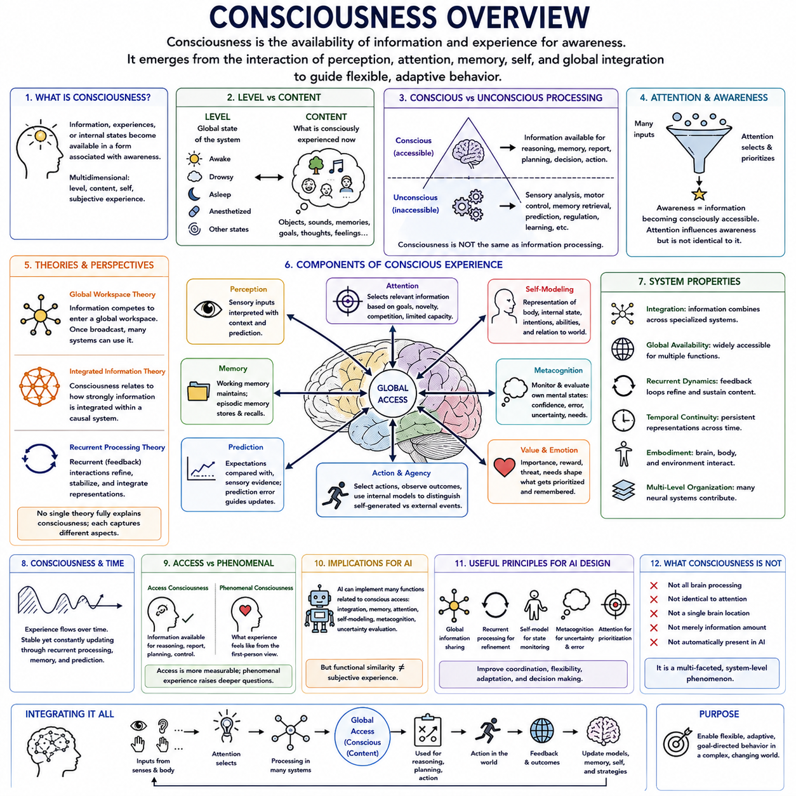
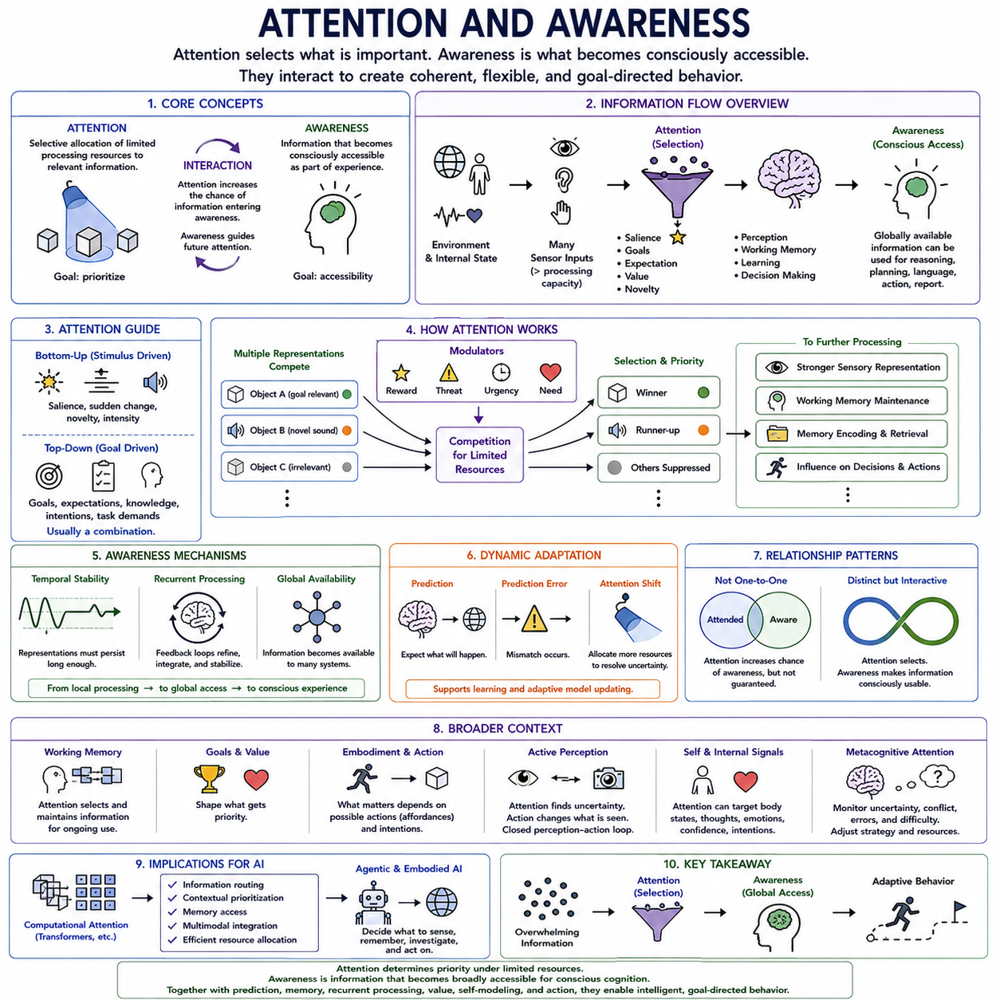
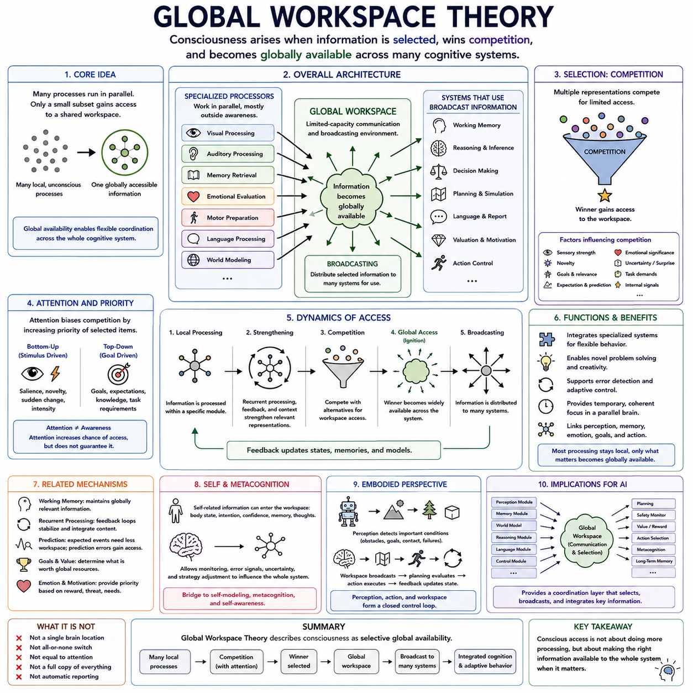
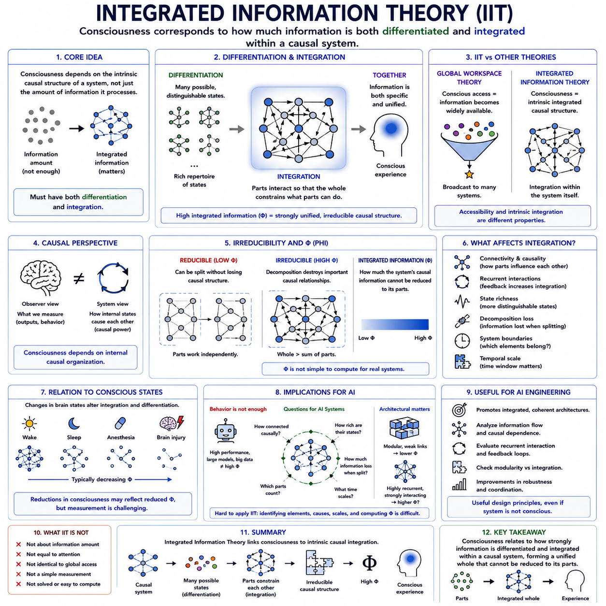
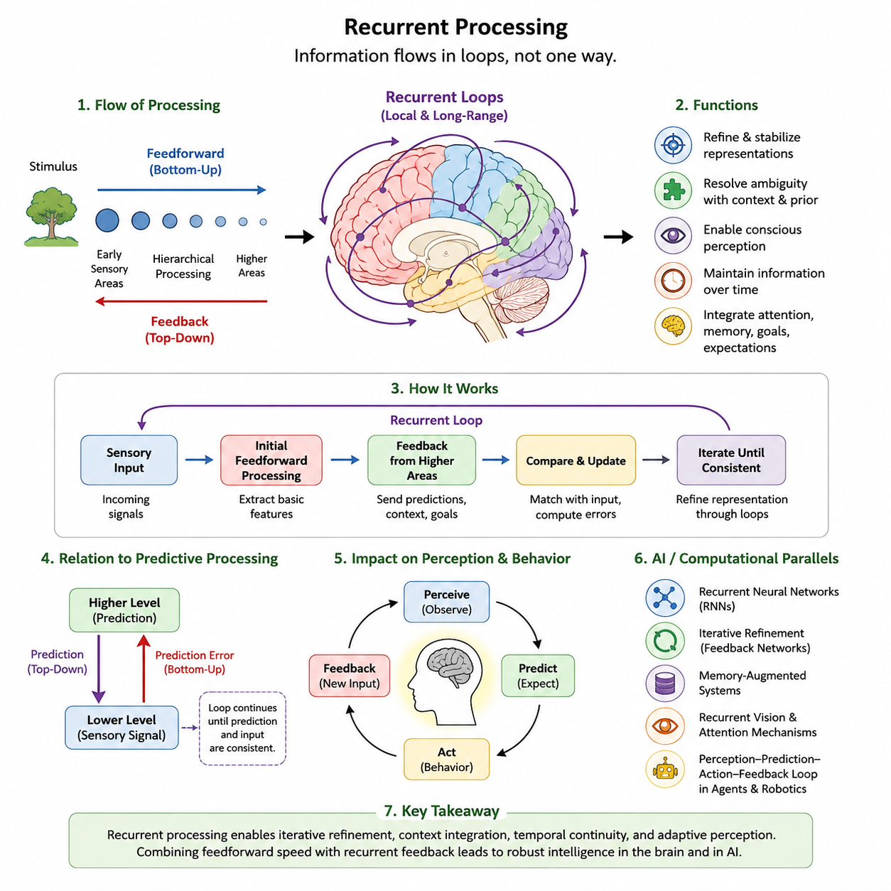
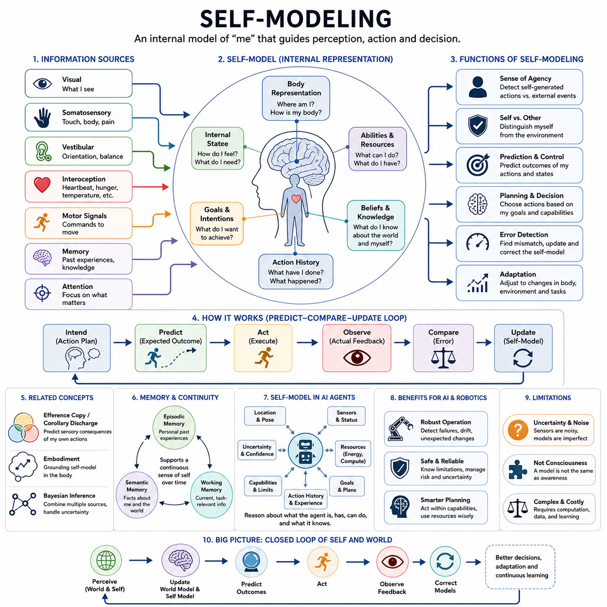
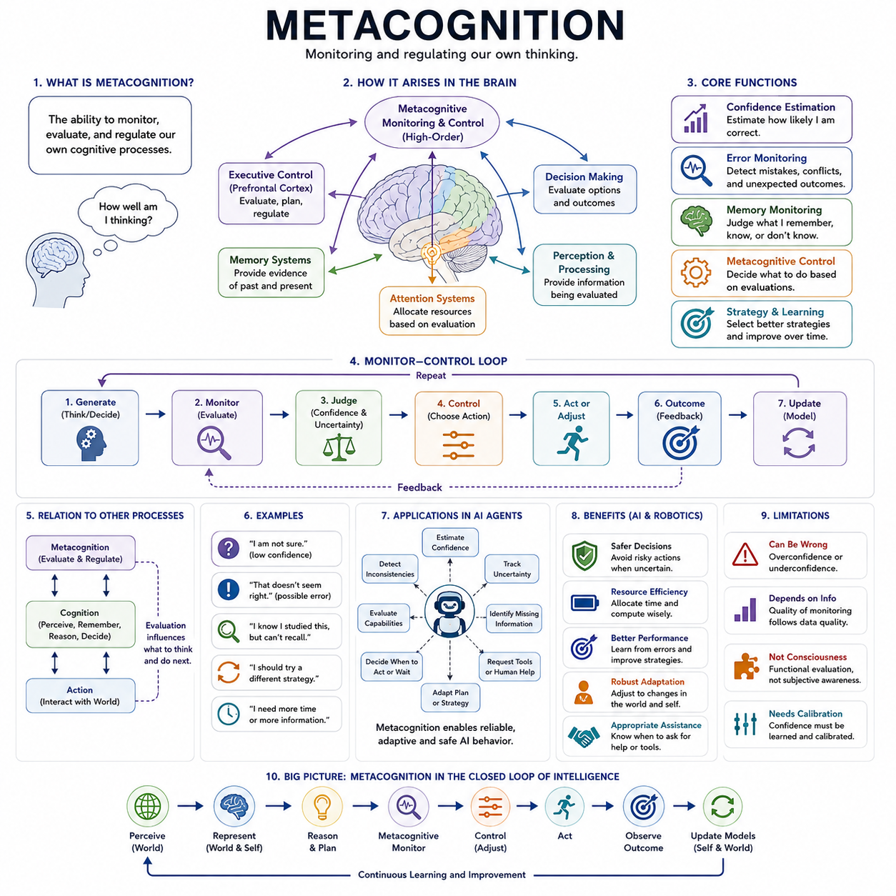
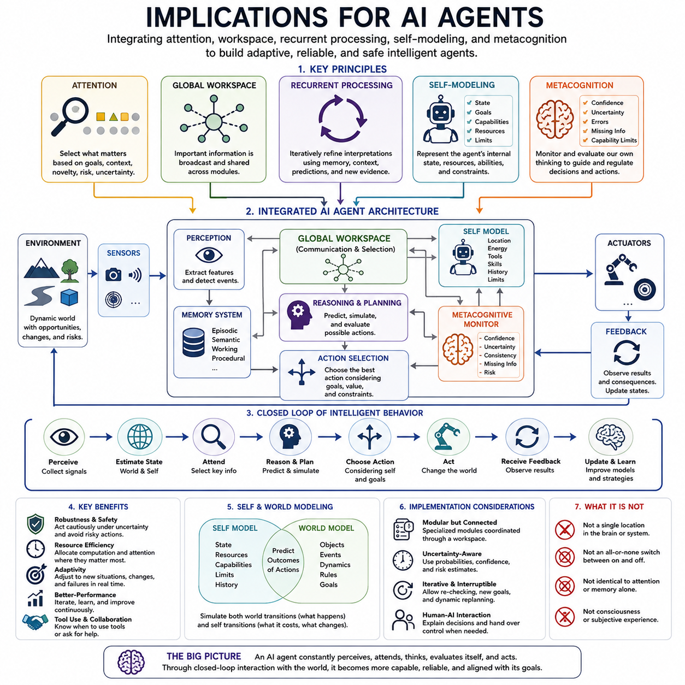

**Volume 44 Neuroscience for AI**

# Chapter 10. Consciousness Attention and Global Workspace

## 10.00 Consciousness Overview

{width="7.268055555555556in" height="7.268055555555556in"}

의식(Consciousness)은 넓은 의미에서 정보(Information), 경험(Experiences), 또는 내부 상태(Internal States)가 자각(Awareness)과 관련된 형태로 이용 가능해지는 상태를 의미합니다. 신경과학(Neuroscience)에서 이 용어는 각성(Wakefulness)과 지각적 자각(Perceptual Awareness)에서 자기 인식(Self-Awareness)과 주관적 경험(Subjective Experience)에 이르기까지 서로 관련되지만 구별 가능한 여러 현상을 포함합니다. 이러한 현상들이 서로 다른 메커니즘에 의존할 수 있기 때문에 의식은 하나의 독립적인 뇌 기능이라기보다 다차원적 문제(Multidimensional Problem)로 다루는 것이 적절합니다.

의식의 수준(Level of Consciousness)과 의식의 내용(Content of Consciousness)은 기본적으로 구분할 수 있습니다. 수준은 생물체가 깨어 있는지, 잠들어 있는지, 마취되어 있는지, 또는 다른 반응 상태에 있는지를 의미하는 반면, 내용은 특정 순간에 무엇을 의식적으로 경험하는지를 의미합니다. 사람은 깨어 있는 상태를 유지하면서도 서로 다른 시각적 객체, 소리, 기억, 목표, 생각이 의식에 들어왔다가 사라질 수 있으며, 이는 전역적 상태(Global State)와 구체적인 의식 내용이 서로 관련되어 있지만 동일하지는 않다는 것을 보여줍니다.

또 다른 중요한 구분은 의식과 일반적인 정보 처리(Information Processing)를 분리하는 것입니다. 신경계는 감각 분석(Sensory Analysis), 운동 조절(Motor Regulation), 기억 인출(Memory Retrieval), 예측(Prediction), 생리적 제어(Physiological Control)를 지속적으로 수행하지만, 이러한 모든 과정이 의식적으로 접근 가능한 것은 아닙니다. 따라서 의식은 단순히 신경 계산(Neural Computation)이 일어나고 있다는 의미가 아닙니다. 과학적 문제는 일부 정보가 유연한 인지(Flexible Cognition)를 위해 광범위하게 이용 가능해지는 반면, 다른 정보는 국소적 또는 무의식적으로 처리되는 이유를 밝히는 것입니다.

주의(Attention)는 의식과 밀접하게 관련되어 있지만 두 개념을 동일하게 취급해서는 안 됩니다. 주의는 관련성(Relevance), 목표(Goals), 새로움(Novelty), 경쟁(Competition), 제한된 처리 용량(Limited Processing Capacity)에 따라 정보를 선택적으로 우선 처리합니다. 자각(Awareness)은 선택된 정보가 의식적으로 접근 가능한지와 관련됩니다. 주의는 무엇이 자각에 도달하는지에 강한 영향을 미칠 수 있지만, 실험적 및 이론적 연구는 선택(Selection)과 의식적 경험(Conscious Experience)이 구별 가능한 인지적 측면임을 시사합니다.

의식적 지각(Conscious Perception)은 단순한 감각 등록(Sensory Registration)과도 다릅니다. 개인이 자극을 의식적으로 보고하지 못하는 상황에서도 감각 수용기(Sensory Receptors)와 초기 신경 경로(Early Neural Pathways)는 자극에 반응할 수 있습니다. 의식적 접근(Conscious Access)은 선택된 표현이 충분히 안정화되고, 통합되거나, 전역적으로 접근 가능해져 추론(Reasoning), 기억(Memory), 의사결정(Decision Making), 의도적 행동(Intentional Behavior)에 영향을 줄 수 있도록 하는 추가적인 처리 과정과 관련되는 것으로 볼 수 있습니다. 따라서 의식은 감각 입력만의 특성이 아니라 시스템 수준의 현상(System-Level Phenomenon)입니다.

이러한 접근을 설명하는 영향력 있는 프레임워크 가운데 하나가 전역 작업공간 이론(Global Workspace Theory)입니다. 이 관점에서는 많은 전문화된 처리 과정(Specialized Processes)이 대부분 의식 밖에서 작동하면서 제한된 용량의 전역 작업공간(Global Workspace)에 들어갈 수 있는 정보를 경쟁적으로 또는 협력적으로 생성합니다. 선택된 정보가 전역적으로 이용 가능해지면 기억, 추론, 평가(Evaluation), 계획(Planning), 언어(Language), 행동(Action)을 담당하는 여러 시스템이 이를 활용할 수 있습니다. 따라서 의식적 접근은 정보의 광범위한 이용 가능성(Broad Information Availability)과 연관됩니다.

전역 작업공간 관점(Global Workspace Perspective)은 의식을 담당하는 하나의 해부학적 중심(Anatomical Center)보다 통합(Integration)과 협응(Coordination)을 강조합니다. 시각 처리, 기억, 정서적 평가(Emotional Evaluation), 목표, 행동 계획은 서로 다른 신경 시스템에 분산되어 있을 수 있습니다. 전역적으로 이용 가능한 표현(Global Representation)은 이러한 전문화된 과정들을 조정하여 하나의 하위 시스템에서 발견된 정보가 여러 다른 시스템에 영향을 미치도록 하며, 좁은 범위의 자동적 반응을 넘어서는 유연한 행동을 지원할 수 있습니다.

통합 정보 이론(Integrated Information Theory)은 다른 방향에서 의식에 접근합니다. 이 이론은 시스템이 독립적인 구성 요소들로 환원할 수 없는 정보적 특성을 가진 통합된 인과 구조(Integrated Causal Structure)를 어느 정도 형성하는지를 강조합니다. 이러한 관점에서 의식은 단순히 처리되는 정보의 양과 연결되는 것이 아니라 정보가 시스템 내부에서 얼마나 강하게 통합되어 있는지와 관련됩니다. 이 프레임워크는 전역적 접근성(Global Accessibility)을 강조하는 이론과는 서로 다른 질문을 다룹니다.

재귀 처리 이론(Recurrent Processing Theory)은 신경 처리 계층(Neural Processing Hierarchies) 내부에서 발생하는 재귀적 상호작용(Recurrent Interactions)을 특히 중요하게 봅니다. 초기 순방향 활동(Feedforward Activity)은 감각 정보를 뇌 전체로 빠르게 전달할 수 있지만, 재귀 신호(Recurrent Signals)는 상위 및 하위 처리 수준이 반복적으로 상호작용하도록 합니다. 이러한 피드백은 지각 표현(Perceptual Representations)을 안정화하고, 정교화하며, 맥락화하고, 통합할 수 있습니다. 따라서 의식적 지각은 단일 방향의 계산 과정이 아니라 동적인 재귀 처리(Dynamic Recurrent Processing)와 관련됩니다.

이러한 이론들을 자동적으로 서로 교환 가능한 설명으로 간주해서는 안 됩니다. 전역 작업공간 접근(Global Workspace Approaches)은 광범위한 이용 가능성을 강조하고, 통합 정보 접근(Integrated Information Approaches)은 내재적 인과 통합(Intrinsic Causal Integration)을 강조하며, 재귀 처리 접근(Recurrent Processing Approaches)은 의식적 지각과 관련된 피드백 동역학(Feedback Dynamics)을 강조합니다. 각각은 의식과 관련될 수 있는 서로 다른 특성을 강조하며, 신경과학은 이러한 제안된 메커니즘이 실험적 관측과 어떻게 연결되는지를 계속 연구하고 있습니다.

자기 모델링(Self-Modeling)은 의식에 또 다른 차원을 추가합니다. 지능형 생물체는 외부 객체뿐만 아니라 자신의 신체, 내부 상태, 의도(Intentions), 능력(Capabilities), 환경과의 관계에 대한 표현도 유지합니다. 자기 자신에 관한 정보가 지각, 기억, 행동과 통합되면 시스템은 자기 관련 사건(Self-Related Events)과 외부 사건을 구별하고 시간에 걸쳐 연속성을 유지할 수 있습니다. 이러한 표현은 보다 명시적인 형태의 자기 인식(Self-Awareness)을 위한 중요한 기반을 제공합니다.

그러나 자기 인식(Self-Awareness)은 기본적인 지각적 의식(Perceptual Consciousness)과 구별해야 합니다. 생물체는 자신을 경험의 주체로 명시적으로 추론하지 않더라도 감각적 내용을 경험할 가능성이 있습니다. 더 높은 형태의 의식은 자신의 정신 상태(Mental States), 의도, 확신도(Confidence), 지식(Knowledge)을 표현하는 능력을 포함할 수 있습니다. 여기에는 인지 시스템이 자신의 정보 처리 과정의 일부를 감시하고 평가하는 메타인지(Metacognition)가 포함됩니다.

메타인지(Metacognition)는 기억이 신뢰할 만한지, 의사결정이 불확실한지, 오류가 발생했는지, 추가 정보가 필요한지 등을 판단하는 기능을 지원합니다. 이러한 능력은 의식을 감시(Monitoring) 및 제어(Control)와 연결합니다. 자신의 인지 상태(Cognitive State)의 일부를 표현할 수 있는 시스템은 전략을 조정하고, 결정을 재검토하며, 주의를 다르게 배분하거나, 확신이 충분하지 않을 때 추가적인 증거를 탐색할 수 있습니다.

기억(Memory) 역시 의식적 경험과 깊이 연결되어 있습니다. 작업 기억(Working Memory)은 현재 진행 중인 추론과 행동에 필요한 정보를 유지할 수 있으며, 일화 기억(Episodic Memory)은 이전 경험이 현재의 자각과 미래 계획에 영향을 미치도록 합니다. 의식적 내용은 기억으로 부호화될 수 있고, 기억은 이후 의식적인 회상(Conscious Recollection)으로 다시 나타날 수 있습니다. 그러나 상당한 학습, 인출, 행동적 영향이 명시적인 의식적 회상 없이도 발생할 수 있으므로 기억과 의식은 서로 구별됩니다.

의식의 시간적 연속성(Temporal Continuity)은 정적인 내부 그림이 아니라 지속적으로 변화하는 신경 활동(Neural Activity)에서 발생합니다. 지각, 기억, 목표, 감정(Emotions), 신체 상태(Body State), 기대(Expectations)는 시간에 따라 변화하지만 경험은 비교적 일관된 것으로 느껴지는 경우가 많습니다. 재귀 처리, 작업 기억, 예측 메커니즘(Predictive Mechanisms), 지속적인 상태 표현(Persistent State Representations)은 개별 감각 입력과 인지 내용이 계속 변화하는 동안 이러한 연속성을 유지하는 데 기여할 수 있습니다.

예측 처리(Predictive Processing)는 또 다른 중요한 연결점을 제공합니다. 뇌는 감각 입력에 대한 기대(Expectations)를 지속적으로 생성하고 이를 들어오는 증거와 비교합니다. 따라서 의식적 내용은 단순한 상향식 감각 데이터(Bottom-Up Sensory Data)뿐만 아니라 사전 지식(Prior Knowledge), 맥락(Context), 주의, 예측 오류(Prediction Error)에 의해 형성된 해석을 반영할 수 있습니다. 지각은 신경계가 감각 신호의 원인에 대한 가설을 구성하고 갱신하는 능동적 추론 과정(Active Inference Process)이 됩니다.

체화(Embodiment)는 의식적 처리를 뇌, 신체, 환경 사이의 관계에 더욱 강하게 기반하도록 합니다. 내수용감각 신호(Interoceptive Signals)는 내부 생리 상태(Physiological Conditions)를 전달하고, 고유수용감각(Proprioception)은 신체 구성을 표현하며, 외부 감각(External Senses)은 주변 사건을 기술합니다. 이러한 정보 흐름은 목표 및 행동과 상호작용합니다. 따라서 의식적 경험은 고립된 정보 처리 장치 내부에서 발생하는 것이 아니라 지속적으로 자신을 조절하고 세계에서 행동하는 생물체 안에서 발생합니다.

행위 주체성(Agency)은 이러한 체화 관점과 밀접하게 관련됩니다. 생물체는 단순히 사건을 지각하는 것이 아니라 행동을 선택하고 그 결과를 관측합니다. 내부 모델(Internal Models), 원심성 복사(Efference Copy), 상태 추정(State Estimation), 감각운동 예측(Sensorimotor Prediction)은 자기 생성 변화(Self-Generated Changes)와 외부에서 생성된 사건을 구별하는 데 도움을 줍니다. 이러한 메커니즘은 독립적으로 변화하는 세계 안에서 행동의 원천으로 존재하는 에이전트에 대한 일관된 표현(Coherent Representation)에 기여합니다.

감정(Emotion)과 가치(Value) 역시 어떤 정보가 행동적으로 중요해지는지에 영향을 미칩니다. 위협(Threat), 보상(Reward), 새로움, 신체적 필요(Bodily Need), 동기적 관련성(Motivational Relevance)은 주의, 기억, 의사결정, 행동 선택(Action Selection)을 변화시킬 수 있습니다. 따라서 의식적 접근은 생물학적 중요성(Biological Significance)에 따라 정보의 우선순위를 결정하는 시스템 안에 포함되어 있습니다. 인지는 단순히 중립적인 표현의 흐름이 아니라 생물체에게 무엇이 중요한지에 의해 지속적으로 형성됩니다.

따라서 의식의 신경적 기반(Neural Basis of Consciousness)은 하나의 뇌 영역만을 통해 이해하기 어려울 가능성이 높습니다. 피질(Cortical) 및 피질하 시스템(Subcortical Systems)은 각성(Arousal), 감각 처리, 주의, 기억, 가치 평가(Valuation), 자기 표현(Self-Representation), 행동 제어에 기여합니다. 과학적 연구는 다양한 수준과 내용의 의식적 처리와 체계적으로 대응하는 신경 메커니즘과 활동 패턴을 규명하는 데 초점을 맞춥니다.

특히 어려운 문제 가운데 하나는 접근 의식(Access Consciousness)과 현상적 의식(Phenomenal Consciousness)의 관계입니다. 접근 의식은 추론, 보고(Reporting), 계획, 행동 제어에 이용할 수 있는 정보와 관련됩니다. 현상적 의식은 주관적 경험 그 자체, 즉 경험하는 시스템의 관점에서 어떤 경험이 어떻게 느껴지는가와 관련됩니다. 전자는 행동적 및 계산적 연구(Computational Investigation)를 통해 비교적 접근하기 쉽지만, 후자는 보다 근본적인 설명 및 측정 문제(Measurement Problems)를 제기합니다.

이러한 구분은 인공지능을 논의할 때 특히 중요합니다. 인공지능 시스템은 정보를 통합하고, 기억을 유지하며, 주의를 할당하고, 자신의 상태를 모델링하고, 불확실성을 추론하며, 내부 변수(Internal Variables)를 보고할 수 있습니다. 이러한 기능은 의식적 접근과 관련된 계산적 특성(Computational Properties)과 유사할 수 있습니다. 그러나 기능적 유사성(Functional Similarity)만으로 주관적 경험의 존재가 입증되는 것은 아니며, 높은 수준의 행동적 정교함을 기계가 현상적 의식을 가지고 있다는 증거로 자동적으로 해석해서는 안 됩니다.

그럼에도 인공지능 공학(AI Engineering)의 관점에서 의식에 관한 신경과학 이론은 인공 시스템이 실제로 의식을 가진다고 주장하지 않더라도 유용한 아키텍처 원리(Architectural Principles)를 제공할 수 있습니다. 전역적 정보 공유(Global Information Sharing)는 전문화된 모듈 사이의 협응을 향상시킬 수 있고, 재귀 처리는 반복적인 정교화(Iterative Refinement)를 지원하며, 자기 모델링은 상태 감시(State Monitoring)를 개선할 수 있습니다. 또한 메타인지는 시스템이 불확실성과 오류를 평가하는 데 도움을 줄 수 있습니다. 이러한 메커니즘은 그 계산적 기능 자체로 유용할 수 있습니다.

에이전트형 인공지능(Agentic AI)과 체화 인공지능(Embodied AI)은 이러한 원리를 특히 중요하게 만듭니다. 자율 에이전트(Autonomous Agent)는 시간에 걸쳐 지각, 기억, 세계 모델(World Models), 목표, 계획, 행동, 피드백을 결합해야 합니다. 하나의 하위 시스템에서 발견된 정보가 여러 다른 시스템에 영향을 미쳐야 할 수 있으며, 제한된 계산 자원(Computational Resources)은 선택적인 우선순위 설정을 요구합니다. 주의와 전역 작업공간 개념에서 영감을 받은 아키텍처는 이러한 분산된 능력을 조정하는 메커니즘을 제공할 수 있습니다.

동시에 의식이 불필요한 공학적 가정(Engineering Assumption)이 되어서는 안 됩니다. 생물학적 생물체와 인공 시스템 모두에서 많은 지능적 행동(Intelligent Behaviors)은 전문화된 무의식적 또는 자동적 메커니즘을 통해 발생할 수 있습니다. 인공지능에서 실용적인 질문은 의식 자체를 반드시 재현해야 하는지가 아니라, 전역적 접근(Global Access), 통합(Integration), 자기 감시(Self-Monitoring), 유연한 제어(Flexible Control), 메타인지와 같이 의식적 인지와 관련된 어떤 계산 기능이 측정 가능한 이점을 제공하는지를 파악하는 것입니다.

따라서 의식(Consciousness)은 지각(Perception), 주의(Attention), 기억(Memory), 예측(Prediction), 자기 모델링(Self-Modeling), 메타인지(Metacognition), 의사결정(Decision Making), 행동(Action)이 교차하는 지점에 위치합니다. 의식을 인지 과정에서 분리된 최종 단계로 보는 대신, 정보가 선택되고, 통합되고, 유지되고, 전역적으로 공유되며, 평가되고, 적응적 행동(Adaptive Behavior)에 사용되는 보다 광범위한 아키텍처의 일부로 연구할 수 있습니다. 이러한 관점은 이후의 절에서 주의와 자각(Attention and Awareness), 전역 작업공간 이론(Global Workspace Theory), 통합 정보 이론(Integrated Information Theory), 재귀 처리(Recurrent Processing), 자기 모델링, 메타인지, 그리고 이들이 인공지능 에이전트(AI Agents)에 제공하는 시사점을 살펴보기 위한 기반을 제공합니다.

## 10.01 Attention and Awareness [w/Code]

{width="7.268055555555556in" height="7.268055555555556in"}

주의(Attention)와 자각(Awareness)은 서로 밀접하게 관련된 인지(Cognition)의 구성 요소이지만, 서로 다른 기능을 의미합니다. 주의는 제한된 처리 자원(Limited Processing Resources)을 현재 중요한 정보에 선택적으로 할당하는 과정과 관련되는 반면, 자각은 정보가 의식적으로 접근 가능한 상태(Consciously Accessible State)가 되는 것과 관련됩니다. 이들의 상호작용을 통해 생물학적 시스템은 중요한 신호에 우선순위를 부여하면서 진행 중인 경험에 대한 일관된 표현을 유지할 수 있습니다.

신경계(Nervous System)는 매 순간 동일한 깊이로 처리할 수 있는 양보다 훨씬 많은 감각 정보(Sensory Information)를 받아들입니다. 시각적 장면에는 수많은 객체가 존재하고, 서로 다른 여러 출처에서 소리가 동시에 들어오며, 내부 신호(Internal Signals)는 신체 상태를 지속적으로 전달합니다. 주의는 일부 정보의 처리를 강화하는 동시에 현재 목표와 관련성이 낮은 정보와의 경쟁을 줄이는 선택 메커니즘(Selection Mechanism)을 제공합니다.

선택적 주의(Selective Attention)는 외부 자극(External Stimuli) 또는 내부 목표(Internal Goals)에 의해 유도될 수 있습니다. 상향식 주의(Bottom-Up Attention)는 갑작스러운 움직임, 예상하지 못한 소리, 강한 대비, 새로움(Novelty)과 같이 두드러진 사건에 의해 유발됩니다. 하향식 주의(Top-Down Attention)는 기대(Expectations), 의도(Intentions), 학습된 지식(Learned Knowledge), 작업 요구사항(Task Requirements)에 따라 조절됩니다. 일상적인 인지는 예상하지 못한 환경 사건과 내부적으로 유지되는 목표 사이의 균형을 조정하면서 이러한 영향들을 함께 결합합니다.

주의(Attention)는 정보의 여러 차원에 걸쳐 작동할 수 있습니다. 공간적 주의(Spatial Attention)는 특정 위치를 우선시하고, 객체 기반 주의(Object-Based Attention)는 관련 객체를 선택하며, 특징 기반 주의(Feature-Based Attention)는 색상이나 움직임과 같은 특성을 강조합니다. 또한 감각 양식 특이적 주의(Modality-Specific Attention)는 시각, 청각 또는 다른 감각 채널을 우선시할 수 있습니다. 이러한 형태들은 주의가 하나의 단순한 필터가 아니라 정보 처리를 제어하기 위한 여러 메커니즘의 집합임을 보여줍니다.

주의의 효과는 신경 처리(Neural Processing)의 여러 단계에서 나타날 수 있습니다. 우선순위가 높은 정보는 강화된 감각 표현(Sensory Representation)을 얻거나, 작업 기억(Working Memory)에 진입하기 위한 경쟁에서 우위를 가지거나, 장기 기억(Long-Term Memory)에 더 효과적으로 부호화되거나, 의사결정(Decision Making)에 더 큰 영향을 미칠 수 있습니다. 따라서 주의는 무엇이 탐지되는지만 변화시키는 것이 아니라 선택된 정보가 이후의 인지와 행동에 얼마나 강하게 영향을 미치는지도 변화시킵니다.

자각(Awareness)은 보다 구체적으로 정보가 의식적 경험(Conscious Experience)의 일부로 이용 가능해지는 것과 관련됩니다. 감각 신호는 반드시 의식적으로 지각되지 않더라도 신경 처리에 영향을 줄 수 있습니다. 반대로 자각에 도달한 정보는 흔히 유지되고, 보고되며, 기억과 비교되고, 목표에 따라 평가되며, 추론(Reasoning)이나 의도적 행동(Intentional Action)에 유연하게 사용될 수 있습니다. 따라서 의식적 접근 가능성(Conscious Accessibility)은 단순한 감각 등록(Sensory Registration) 이상의 의미를 가집니다.

이러한 구분은 주의와 자각이 서로 완벽하게 일치하지 않기 때문에 중요합니다. 주의는 정보가 자각에 들어갈 가능성을 자주 높이지만, 어떤 정보에 주의를 기울인다고 해서 반드시 의식적 지각(Conscious Perception)이 보장되는 것은 아닙니다. 마찬가지로 연구자들은 최소한의 주의만으로 제한적인 형태의 의식적 경험이 발생할 수 있는지를 계속 연구하고 있습니다. 따라서 두 요소의 관계는 엄격하게 동일한 것이 아니라 상호작용적(Interactive)입니다.

경쟁(Competition)은 주의 선택(Attentional Selection)을 이해하는 하나의 방법을 제공합니다. 여러 감각 표현과 내부 표현(Internal Representations)이 제한된 처리 용량을 놓고 동시에 경쟁할 수 있습니다. 목표, 새로움, 보상(Reward), 위협(Threat), 강한 감각적 증거와 관련된 신호에는 더 높은 우선순위가 부여될 수 있습니다. 이러한 경쟁을 통해 주의는 어떤 표현이 작업 기억, 의사결정 시스템, 그리고 잠재적으로 의식적 자각에 영향을 줄 만큼 충분한 처리를 받을지를 결정하는 데 도움을 줍니다.

작업 기억(Working Memory)은 이러한 관계와 강하게 연결되어 있습니다. 주의는 정보를 일시적으로 유지하도록 선택하여 원래의 자극이 사라진 이후에도 해당 정보가 이용 가능하도록 할 수 있습니다. 이렇게 유지된 정보는 추론, 비교, 계획(Planning), 행동 선택(Action Selection)에 참여할 수 있습니다. 또한 작업 요구사항이 변화함에 따라 주의는 작업 기억 내부에서도 여러 유지된 표현 가운데 하나를 다른 것보다 우선시할 수 있습니다.

기대(Expectation)는 시스템이 발생 가능성이 높거나 중요한 정보에 미리 대비하도록 함으로써 주의 처리를 변화시킵니다. 생물체가 특정 위치에서 사건이 발생할 것으로 예상하거나 특정 감각적 특징을 예측한다면, 실제 사건이 발생하기 전부터 해당 가능성을 우선하도록 처리 과정이 편향될 수 있습니다. 따라서 주의는 예측 처리(Predictive Processing)와 상호작용하며, 사전 지식(Prior Knowledge)과 현재 목표가 들어오는 증거를 해석하고 우선순위를 정하는 방식에 영향을 미치도록 합니다.

사건이 기대를 위반하면 예측 오류(Prediction Error)가 주의를 새로운 대상으로 전환할 수 있습니다. 예상하지 못한 움직임, 익숙하지 않은 소리, 놀라운 결과는 현재 내부 모델(Internal Model)이 불완전하거나 부정확하다는 신호가 될 수 있습니다. 이러한 불일치에 추가적인 처리 자원을 할당하면 시스템은 상태 추정(State Estimation), 환경 해석(Environmental Interpretation), 행동 전략(Behavioral Strategy)을 수정해야 하는지를 판단할 수 있습니다. 따라서 주의는 적응적 모델 갱신(Adaptive Model Updating)을 지원합니다.

자각(Awareness)은 시간적 안정성(Temporal Stability)에도 의존합니다. 신경 표현(Neural Representations)은 초기 감각 활성화 직후 사라지는 대신 다른 인지 과정과 상호작용할 수 있을 만큼 충분히 오래 유지되어야 하는 경우가 많습니다. 신경 집단 사이의 재귀 처리(Recurrent Processing)는 선택된 표현을 강화하고, 정교화하며, 안정화할 수 있습니다. 따라서 이러한 재귀적 상호작용(Recurrent Interactions)은 지각 정보가 어떻게 의식적으로 접근 가능해지는지를 설명하려는 이론에서 중요한 요소가 되었습니다.

재귀 처리(Recurrent Processing)는 순수한 순방향 처리 연쇄(Feedforward Cascade)와 다릅니다. 순방향 신호(Feedforward Signals)는 초기 감각 시스템에서 더 높은 처리 수준으로 정보를 빠르게 전달할 수 있지만, 피드백(Feedback)은 맥락적 정보와 상위 수준 정보를 초기 표현에 다시 반영할 수 있도록 합니다. 반복적인 상호작용은 모호성을 해결하고, 국소적 특징을 통합하며, 기대를 반영하고, 관련 정보를 유지하여 감각 처리에서 자각으로의 전환에 기여할 수 있습니다.

전역적 이용 가능성(Global Availability)은 의식적 접근(Conscious Access)에 대한 또 다른 관점을 제공합니다. 전문화된 하위 시스템(Specialized Subsystem)에만 머무르는 정보는 전역적으로 이용 가능하지 않더라도 국소적 처리에 영향을 줄 수 있습니다. 선택된 정보가 기억, 언어(Language), 추론, 가치 평가(Valuation), 계획, 행동 시스템에 이용 가능해지면 더욱 유연한 방식으로 행동에 영향을 줄 수 있습니다. 주의는 표현이 더 넓게 분배되도록 우선순위를 부여함으로써 이러한 전환에 기여할 수 있습니다.

전역 작업공간 관점(Global Workspace Perspective)은 경쟁과 방송(Broadcasting)을 통해 이러한 개념을 공식화합니다. 전문화된 처리 시스템(Specialized Processors)은 병렬적으로 작동하며, 특히 중요한 정보가 제한된 전역 작업공간(Global Workspace)에 접근하게 됩니다. 일단 그곳에 표현되면 해당 정보는 여러 인지 시스템으로 방송될 수 있습니다. 주의는 어떤 표현이 우선순위를 얻을지를 결정하는 데 기여하며, 전역적 이용 가능성은 의식적 접근에 대한 기능적 해석(Functional Interpretation)을 제공합니다.

그러나 자각(Awareness)을 행동적 보고(Behavioral Report)만으로 환원해서는 안 됩니다. 경험을 보고하려면 경험 자체를 생성한 메커니즘 외에도 언어, 기억, 의사결정, 운동 출력(Motor Output)이 필요합니다. 따라서 연구자들은 의식적 지각과 관련된 신경 활동을 해당 지각을 설명하거나 보고하는 데 필요한 처리 과정과 구별하려고 합니다. 이러한 구분은 언어적으로 보고할 수 없는 생물체나 시스템을 연구할 때 특히 중요합니다.

주의 자체도 명시적인 자각(Explicit Awareness)을 필요로 하지 않고 작동할 수 있습니다. 의식적으로 보고되지 않은 자극도 방향 전환(Orientation), 반응 준비(Response Preparation), 이후의 정보 처리에 영향을 미칠 수 있습니다. 자동적 주의 포착(Automatic Attentional Capture)은 의도적인 평가 이전에 발생할 수 있으며, 학습된 신호는 처리 과정을 빠르게 편향시킬 수 있습니다. 이러한 현상은 정교한 선택 메커니즘이 명시적인 의식적 접근 수준 아래에서도 작동할 수 있음을 보여줍니다.

주의와 자각의 관계는 목표(Goals)와 가치(Value)의 영향도 받습니다. 위험, 보상, 새로움, 사회적 관련성(Social Relevance), 즉각적인 신체적 필요(Bodily Needs)와 관련된 정보는 우선적으로 처리될 수 있습니다. 따라서 정서 및 동기 시스템(Emotional and Motivational Systems)은 주의와 상호작용하여 어떤 정보가 희소한 계산 자원(Computational Resources)을 받을 가치가 있는지를 결정합니다. 자각은 단순히 감각 자극의 강도만으로 발생하는 것이 아니라 이러한 광범위한 우선순위 구조 안에서 형성됩니다.

체화된 행동(Embodied Action)은 주의 선택을 더욱 형성합니다. 환경을 이동하는 생물체는 자신이 수행할 수 있는 행동과 관련된 정보를 우선적으로 처리해야 합니다. 이동 경로상의 장애물, 잡을 수 있는 객체, 접근하는 사람, 불안정한 표면은 생물체가 무엇을 하려고 하는지 또는 무엇을 할 수 있는지에 따라 중요해질 수 있습니다. 따라서 주의는 행동유도성(Affordances), 행동 계획(Action Planning), 미래 상호작용에 대한 예측과 연결됩니다.

능동 지각(Active Perception)은 이러한 연결을 특히 명확하게 보여줍니다. 에이전트는 감각 정보를 수동적으로 받아들이기만 하는 것이 아니라 눈, 머리, 신체 또는 센서를 움직여 더 유용한 증거를 획득할 수 있습니다. 주의는 불확실하거나 작업과 관련된 영역을 식별할 수 있으며, 행동은 이후 처리에 사용할 수 있는 감각 입력 자체를 변화시킵니다. 따라서 지각, 주의, 행동은 서로 독립적인 순차 단계가 아니라 폐루프(Closed Loop)를 형성합니다.

자기 관련 정보(Self-Related Information) 역시 주의의 대상이 될 수 있습니다. 내부 신체 신호(Internal Bodily Signals), 의도, 기억, 확신도(Confidence), 감정 상태(Emotional States), 진행 중인 생각은 인지 자원이 이들에 집중될 때 자각으로 들어올 수 있습니다. 이는 지각적 자각(Perceptual Awareness)에서 자기 인식(Self-Awareness)과 메타인지(Metacognition)로 이어지는 연결을 형성합니다. 따라서 주의는 외부 감각 객체뿐 아니라 인지 시스템 내부에서 생성된 표현도 선택할 수 있습니다.

메타인지적 주의(Metacognitive Attention)는 시스템이 자신의 처리 과정 일부를 감시하도록 합니다. 의사결정에 대한 불확실성, 대안들 사이의 충돌(Conflict), 오류의 인식, 정보 인출의 어려움 등이 인지적으로 중요한 대상이 될 수 있습니다. 이러한 내부 신호가 우선순위를 받으면 시스템은 결정을 재검토하고, 추가적인 증거를 탐색하며, 전략을 수정하거나, 어려운 문제에 더 많은 처리 자원을 할당할 수 있습니다.

주의는 필연적으로 제한된 자원(Limited Resources)의 제약을 받습니다. 이용 가능한 모든 신호를 최대 정밀도로 처리하는 것은 생물학적으로 비용이 많이 들고 계산적으로 비효율적입니다. 선택적 할당(Selective Allocation)은 가장 높은 행동적 가치(Behavioral Value)를 제공할 것으로 예상되는 곳에 자원을 집중함으로써 이러한 문제를 해결합니다. 이러한 원리는 주의가 의식 연구뿐 아니라 효율적인 지각, 학습, 의사결정 이론에서도 핵심적인 이유를 설명합니다.

이러한 개념은 인공지능(Artificial Intelligence)에도 직접적인 시사점을 제공합니다. 현대 인공지능 시스템은 관련 정보에 가중치를 부여하기 위해 계산적 주의 메커니즘(Computational Attention Mechanisms)을 자주 사용하지만, 이러한 메커니즘을 생물학적 주의(Biological Attention) 또는 의식적 자각(Conscious Awareness)과 자동적으로 동일시해서는 안 됩니다. 공학적 중요성은 선택적 정보 라우팅(Selective Information Routing), 맥락적 우선순위 설정(Contextual Prioritization), 기억 접근(Memory Access), 다중모달 통합(Multimodal Integration), 계산 자원의 효율적인 할당에 있습니다.

에이전트형 인공지능(Agentic AI)과 체화 인공지능(Embodied AI)은 이러한 원리를 신경망 내부의 어텐션 계층(Attention Layers)을 넘어 확장할 수 있습니다. 자율 시스템(Autonomous System)은 어떤 센서 스트림을 높은 해상도로 처리할지, 어떤 객체를 추적할지, 어떤 기억을 검색할지, 어떤 불확실성을 조사할지, 어떤 작업에 즉각적으로 자원을 투입할지를 결정해야 할 수 있습니다. 이때 주의는 지각, 기억, 세계 모델링(World Modeling), 계획, 행동을 조정하는 아키텍처 메커니즘(Architectural Mechanism)이 됩니다.

자각에서 영감을 받은 아키텍처(Awareness-Inspired Architectures) 역시 현상학적 의미보다는 기능적 관점에서 고려할 수 있습니다. 전역적으로 중요하다고 선택된 정보는 추론, 계획, 기억, 감시(Monitoring), 제어를 담당하는 여러 모듈에서 이용 가능하도록 만들 수 있습니다. 이러한 전역적 접근성(Global Accessibility)은 인공 시스템이 주관적 경험(Subjective Experience)을 가진다고 가정하지 않더라도 협응과 유연한 행동을 향상시킬 수 있습니다. 기능적 접근(Functional Access)과 현상적 의식(Phenomenal Consciousness)은 개념적으로 구분되어야 합니다.

궁극적으로 주의(Attention)와 자각(Awareness)은 지능적 정보 처리(Intelligent Information Processing)의 상호보완적인 측면을 설명합니다. 주의는 제한된 자원 아래에서 어떤 신호에 우선순위를 부여할지를 결정하는 반면, 자각은 어떤 정보가 의식적 인지(Conscious Cognition) 안에서 광범위하게 접근 가능해지는지와 관련됩니다. 예측(Prediction), 기억(Memory), 재귀 처리(Recurrent Processing), 가치(Value), 자기 모델링(Self-Modeling), 행동(Action)과의 상호작용은 생물학적 시스템이 압도적인 정보 흐름을 일관되고 유연하며 목표 지향적인 행동(Goal-Directed Behavior)으로 변환하는 방식을 이해하기 위한 기반을 제공합니다.

## 10.02 Global Workspace Theory [w/Code]

{width="7.268055555555556in" height="7.268055555555556in"}

전역 작업공간 이론(Global Workspace Theory)은 정보가 서로 전문화된 인지 시스템(Cognitive Systems) 전반에서 광범위하게 이용 가능해지는 기능적 아키텍처(Functional Architecture)로 의식을 설명합니다. 모든 신경 과정(Neural Processes)이 의식적이라고 가정하는 대신, 이 이론은 많은 연산이 국소적이고 무의식적으로 이루어진다고 봅니다. 소수의 정보만이 공유 작업공간(Shared Workspace)에 접근하여 기억(Memory), 추론(Reasoning), 의사결정(Decision Making), 언어(Language), 계획(Planning), 자발적 행동(Voluntary Action)에 영향을 미칠 수 있습니다.

이 이론은 뇌에 동시에 작동하는 수많은 전문화된 처리 과정(Specialized Processes)이 존재한다는 관찰에서 출발했습니다. 시각 인식(Visual Recognition), 청각 분석(Auditory Analysis), 기억 인출(Memory Retrieval), 정서적 평가(Emotional Evaluation), 운동 준비(Motor Preparation), 언어 처리는 부분적으로 독립적으로 진행될 수 있습니다. 이러한 전문화는 계산 효율성(Computational Efficiency)을 제공하지만, 지능적 행동에는 필요할 때 하나의 하위 시스템에서 생성된 정보를 다른 시스템에서도 사용할 수 있도록 하는 조정 메커니즘이 필요합니다.

전역 작업공간(Global Workspace)은 이러한 조정 메커니즘(Coordination Mechanism)을 제공합니다. 이는 하나의 저장 위치나 독립된 뇌 영역이라기보다 제한된 용량의 통신 환경(Limited-Capacity Communication Environment)으로 이해할 수 있습니다. 작업공간에 들어온 정보는 여러 전문화된 처리 시스템에서 전역적으로 접근 가능해집니다. 따라서 지각 사건(Perceptual Event), 기억된 사실, 현재 목표(Current Goal), 탐지된 오류(Detected Error)가 처음 해당 정보를 생성하지 않았던 시스템에도 영향을 미칠 수 있으며, 이를 통해 인지 영역 전반의 유연한 통합이 가능해집니다.

여기서 중요한 구분은 국소 처리(Local Processing)와 전역적 이용 가능성(Global Availability)입니다. 국소 처리 시스템은 중간 표현(Intermediate Representations)이 의식적으로 접근 가능해지지 않더라도 정교한 연산을 수행할 수 있습니다. 시각 시스템은 특징을 분석하고, 언어 시스템은 의미를 활성화하며, 운동 시스템은 자각 밖에서 반응을 준비할 수 있습니다. 정보가 제한된 국소 처리에서 벗어나 인지 아키텍처 전반에서 광범위하게 이용 가능한 상태가 될 때 기능적으로 의식적 접근(Conscious Access)과 연결됩니다.

전역 작업공간은 제한된 용량을 가지므로 모든 표현이 동시에 접근할 수는 없습니다. 여러 표현은 감각적 강도(Sensory Strength), 새로움(Novelty), 현재 목표, 정서적 중요성(Emotional Significance), 기대(Expectations), 불확실성(Uncertainty), 작업 관련성(Task Relevance)과 같은 요소에 따라 선택되기 위해 경쟁합니다. 주의(Attention)는 선택된 정보의 우선순위를 높여 이러한 경쟁에 강한 영향을 미치지만, 주의와 의식적 접근은 개념적으로 구별되는 과정입니다.

경쟁(Competition)은 시스템이 희소한 전역 처리 자원(Global Processing Resources)을 선택적으로 할당하도록 합니다. 갑작스러운 소리는 잠재적 위험을 나타내기 때문에 일시적으로 우위를 차지할 수 있으며, 작업과 관련된 시각적 객체는 현재 목표를 수행하는 데 필요하기 때문에 높은 우선순위를 얻을 수 있습니다. 내부 표현 역시 경쟁할 수 있으며, 회상된 기억, 해결되지 않은 문제, 의도(Intention), 예측 오류(Prediction Error), 신체 신호(Bodily Signal)는 새로운 외부 자극이 없어도 전역적으로 중요한 정보가 될 수 있습니다.

하나의 표현이 작업공간에 접근하면 방송(Broadcasting)이 핵심적인 작동 방식이 됩니다. 선택된 정보는 이를 사용할 수 있는 여러 시스템으로 분배됩니다. 기억 메커니즘은 관련 지식을 부호화하거나 인출하고, 계획 시스템은 미래 행동을 평가하며, 언어 시스템은 설명을 구성하고, 가치 평가 메커니즘(Valuation Mechanisms)은 중요성을 추정하며, 운동 시스템은 반응을 준비할 수 있습니다. 따라서 전역 방송(Global Broadcasting)은 선택된 정보를 공유된 인지 자원(Shared Cognitive Resource)으로 변환합니다.

이러한 아키텍처는 의식적 인지(Conscious Cognition)와 관련된 유연성을 설명하는 데 도움을 줍니다. 자동적 처리 과정(Automatic Processes)은 전문화된 경로를 통해 익숙한 상황을 효율적으로 처리할 수 있지만, 새로운 상황에서는 여러 하위 시스템 사이에서 정보가 이동해야 하는 경우가 많습니다. 지각이 기억, 추론, 목표, 계획과 상호작용해야 할 때 전역적 이용 가능성은 이전까지 분리되어 있던 능력들이 협력하도록 합니다. 따라서 의식적 접근은 유연한 협응(Flexible Coordination)을 지원하는 메커니즘으로 기능적으로 이해할 수 있습니다.

작업 기억(Working Memory)은 전역 작업공간 처리와 밀접하게 관련되어 있습니다. 전역적으로 중요한 정보는 처음 나타난 순간 이후에도 일정 시간 유지되어야 하는 경우가 많기 때문입니다. 일시적 유지(Temporary Maintenance)는 추론, 비교, 계획, 의사결정이 진행되는 동안 선택된 표현이 계속 이용 가능하도록 합니다. 그러나 작업 기억과 전역 작업공간을 동일한 것으로 간주해서는 안 됩니다. 작업공간은 광범위한 접근성(Broad Accessibility)을 강조하는 반면, 작업 기억은 정보의 일시적 유지와 조작을 강조합니다.

주의(Attention)는 또 하나의 밀접하게 관련되지만 구별되는 메커니즘입니다. 주의는 중요할 것으로 예상되는 표현이 경쟁에서 우위를 갖도록 편향시켜 작업공간에 진입할 가능성을 높일 수 있습니다. 하향식 주의(Top-Down Attention)는 목표와 기대를 반영하고, 상향식 주의(Bottom-Up Attention)는 두드러지거나 예상하지 못한 사건에 반응합니다. 따라서 전역 작업공간 이론은 선택적 주의(Selective Attention)를 더 광범위한 정보 이용 가능성과 연결하면서도 모든 주의 대상이 반드시 의식적으로 접근 가능해진다고 가정하지 않습니다.

작업공간 접근의 시간적 동역학(Temporal Dynamics)도 중요합니다. 하나의 표현은 국소적 활동(Local Activity)으로 시작하여 재귀 처리(Recurrent Processing)를 통해 강화되고, 경쟁에서 다른 대안들을 이긴 다음 광범위한 이용 가능성을 획득할 수 있습니다. 이러한 전환은 때때로 점화(Ignition)라고 표현되며, 상대적으로 제한된 처리에서 분산된 시스템 전반의 협응된 활동으로 비선형적 전환(Nonlinear Shift)이 발생함을 강조합니다. 따라서 의식적 접근은 영구적으로 활성화된 상태라기보다 동적인 사건(Dynamic Event)으로 이해할 수 있습니다.

재귀적 상호작용(Recurrent Interactions)은 이러한 전환 과정에서 정보를 안정화하는 데 도움을 줄 수 있습니다. 순방향 감각 처리(Feedforward Sensory Processing)는 잠재적으로 중요한 내용을 빠르게 식별할 수 있으며, 처리 수준 사이의 피드백은 관련 표현을 강화하고 맥락 정보를 통합할 수 있습니다. 활동이 충분히 안정되고 영향력이 커지면 보다 광범위한 인지적 협응에 참여할 수 있습니다. 따라서 전역 작업공간 관점과 재귀 처리 관점은 정보가 의식적으로 접근 가능해지는 과정의 상호보완적인 측면을 설명합니다.

예측(Prediction) 역시 작업공간 경쟁을 형성합니다. 내부 모델(Internal Models)은 앞으로 발생할 감각 사건, 행동 결과(Action Outcomes), 작업 상태(Task States)에 대한 기대를 지속적으로 생성합니다. 예측과 일치하는 정보는 광범위한 전역 자원을 요구하지 않고 효율적으로 처리될 수 있지만, 중요한 예측 오류는 주의를 끌고 작업공간에 접근할 수 있습니다. 예상하지 못한 사건은 현재 모델, 계획, 또는 해석을 수정해야 한다는 신호가 될 때 전역적으로 중요한 정보가 됩니다.

이러한 관계는 전역 작업공간과 적응 제어(Adaptive Control)를 연결합니다. 중요한 불일치가 전역적으로 이용 가능해지면 여러 시스템이 함께 대응할 수 있습니다. 상태 추정(State Estimation)은 수정되고, 기억은 관련 경험을 검색하며, 계획 시스템은 대안을 생성하고, 가치 평가 시스템은 위험을 재평가하며, 행동 제어 시스템은 진행 중인 행동을 중단할 수 있습니다. 방송은 국소적으로 탐지된 문제가 시스템 수준의 협응된 적응(System-Level Adaptation)을 유발하도록 합니다.

목표(Goals) 역시 작업공간 접근에 강한 영향을 미칩니다. 일반적으로 중요하지 않은 표현이라도 현재 작업을 수행하는 데 필요하면 전역적으로 중요한 정보가 될 수 있습니다. 특정 객체를 찾거나, 특정 소리를 기다리거나, 내비게이션 위험(Navigation Hazard)을 감시하는 것은 지각 정보의 경쟁 우선순위를 변화시킵니다. 따라서 작업공간은 단순히 감각적 현저성(Sensory Salience)에 의해 구동되는 것이 아니라 내부적으로 유지되는 목표에 의해 지속적으로 형성됩니다.

감정(Emotion)과 가치(Value)는 추가적인 우선순위 신호를 제공합니다. 보상(Reward), 위협(Threat), 사회적 중요성(Social Significance), 신체적 필요(Bodily Needs)와 관련된 사건은 지각, 기억, 의사결정, 행동 사이의 빠른 협응을 요구할 수 있기 때문에 우선적으로 접근할 수 있습니다. 따라서 전역적 이용 가능성은 정보적 관련성뿐 아니라 행동적 중요성(Behavioral Significance)도 반영합니다. 이 아키텍처는 의식적 처리를 순수하게 추상적인 계산으로 취급하지 않고 인지와 동기 시스템(Motivational Systems)을 통합합니다.

자기 관련 정보(Self-Related Information)도 전역 작업공간에 진입할 수 있습니다. 신체 상태, 의도, 확신도(Confidence), 불확실성, 기억, 현재 진행 중인 인지 활동에 대한 표현이 광범위하게 접근 가능해질 수 있습니다. 이러한 정보가 추론과 제어에 영향을 미칠 수 있게 되면 시스템은 자신의 일부 측면을 감시할 수 있는 메커니즘을 갖게 됩니다. 이는 전역적 접근에서 자기 모델링(Self-Modeling), 메타인지(Metacognition), 보다 명시적인 자기 인식(Self-Awareness)으로 이어지는 개념적 연결을 제공합니다.

메타인지적 처리(Metacognitive Processing)는 특히 전역적 이용 가능성의 이점을 얻습니다. 하나의 하위 시스템에서 생성된 오류 신호(Error Signal)가 계획, 주의, 기억 인출, 전략 선택(Strategy Selection)에 영향을 미쳐야 할 수 있습니다. 마찬가지로 의사결정에 대한 불확실성은 추가적인 증거 수집을 유발하거나 행동을 지연시킬 수 있습니다. 내부 감시 신호(Internal Monitoring Signals)를 방송하면 국소적인 성능 평가가 전체 인지 시스템의 협응된 조정으로 확장될 수 있습니다.

전역 작업공간 이론은 대규모 병렬 처리(Massively Parallel Processing)를 수행하는 뇌에서 나타나는 비교적 직렬적인 특성(Serial Characteristics)을 이해하는 방법도 제공합니다. 수많은 무의식적 과정은 동시에 작동할 수 있지만, 전역적으로 접근 가능한 내용은 상대적으로 제한적이고 선택적입니다. 따라서 이 아키텍처는 병렬적 전문화(Parallel Specialization)와 좁은 범위의 협응 메커니즘을 결합합니다. 이를 통해 국소적으로는 높은 계산 처리량을 유지하면서 여러 기능이 상호작용해야 할 때 일관된 시스템 수준 제어를 유지할 수 있습니다.

이 이론은 작업공간이 생물체나 환경 내부에서 발생하는 모든 것에 대한 완전한 표현을 포함해야 한다고 요구하지 않습니다. 현재의 협응 요구에 중요한 정보만 전역적으로 이용 가능해지면 됩니다. 세부적인 감각 계산, 저수준 운동 제어(Low-Level Motor Control), 일상적인 학습 절차는 특별한 상황으로 인해 더 광범위한 개입이 필요하지 않는 한 작업공간 밖에 남아 있을 수 있습니다. 따라서 의식적 접근은 모든 정보를 보여주는 내부 화면이 아니라 본질적으로 선택적인 구조입니다.

체화(Embodiment)의 관점에서 작업공간의 내용은 지각과 행동에 밀접하게 연결될 수 있습니다. 로봇이나 생물체는 여러 하위 시스템의 협응이 필요한 장애물, 목표 객체(Target Object), 내비게이션 목표(Navigation Goal), 예상하지 못한 접촉(Unexpected Contact), 실패 예측(Failure Prediction)에 전역적 우선순위를 부여할 수 있습니다. 지각은 관련 조건을 식별하고, 작업공간은 이를 분배하며, 계획 시스템은 대응 방법을 평가하고, 행동 시스템은 선택된 행동을 실행하며, 피드백은 공유 상태(Shared State)를 갱신합니다.

이러한 아키텍처는 인공지능(Artificial Intelligence)에 중요한 시사점을 제공하지만, 계산적 전역 작업공간(Computational Global Workspace)을 자동적으로 인공 의식(Artificial Consciousness)으로 해석해서는 안 됩니다. 인공지능 시스템은 지각, 기억, 세계 모델링(World Modeling), 추론, 계획, 언어, 제어를 위한 전문화된 모듈을 포함할 수 있습니다. 공유 통신 메커니즘(Shared Communication Mechanism)은 중요한 표현을 이러한 모듈에 선택적으로 노출시켜 정보가 처음 생성된 하위 시스템의 경계를 넘어 이동하도록 할 수 있습니다.

이러한 아키텍처는 에이전트형 인공지능(Agentic AI)을 위한 실용적인 협응 계층(Coordination Layer)을 제공할 수 있습니다. 지각 시스템은 새롭게 탐지된 위험을 방송하고, 기억 시스템은 관련된 이전 경험을 방송하며, 세계 모델은 위험도가 높은 예측 미래(Predicted Future)를 방송하고, 메타인지적 감시 시스템은 불확실성을 방송할 수 있습니다. 경쟁하는 신호들은 추가적인 처리에 제한된 계산 자원을 할당하기 전에 목표, 긴급성(Urgency), 확신도, 예상 가치(Expected Value)에 따라 우선순위가 결정될 수 있습니다.

체화 인공지능(Embodied AI)에서 전역 작업공간 개념은 세계 모델(World Models) 및 내부 시뮬레이션(Internal Simulation)을 보완할 수 있습니다. 세계 모델은 내부적으로 수많은 가능한 예측을 생성할 수 있지만, 그중 일부만 시스템 전체의 행동에 영향을 미칠 필요가 있습니다. 위험한 시뮬레이션 궤적(Simulated Trajectory), 예상하지 못한 상태 전이(State Transition), 또는 매우 유망한 계획은 전역적 우선순위를 획득하여 계획, 안전(Safety), 기억, 제어 모듈에서 이용 가능해질 수 있습니다. 선택적 방송(Selective Broadcasting)은 모든 내부 계산이 전역 자원을 소비하는 것을 방지합니다.

따라서 전역 작업공간 이론(Global Workspace Theory)의 공학적 가치는 전문화(Specialization)와 선택적 통합(Selective Integration)을 결합하는 데 있습니다. 전문화된 모듈은 효율적이고 상당 부분 자율적으로 유지될 수 있으며, 전역적으로 중요한 정보는 필요할 때 아키텍처의 경계를 넘어 전달될 수 있습니다. 주의는 우선순위를 결정하고, 경쟁은 접근을 제한하며, 방송은 협응을 가능하게 하고, 작업 기억은 관련 내용을 유지하며, 피드백은 새로운 증거에 따라 시스템이 행동을 수정하도록 합니다.

궁극적으로 전역 작업공간 이론(Global Workspace Theory)은 인지를 광범위한 국소 처리(Local Processing)와 제한된 전역적 접근성(Global Accessibility)의 상호작용으로 설명합니다. 대부분의 계산은 전문화되고 무의식적인 상태로 유지될 수 있지만, 유연한 협응이 필요할 때 선택된 표현은 광범위하게 이용 가능해집니다. 이러한 원리는 주의(Attention), 자각(Awareness), 작업 기억(Working Memory), 예측(Prediction), 자기 감시(Self-Monitoring), 추론(Reasoning), 행동(Action)을 연결하며, 의식적 접근(Conscious Access)에 대한 주요 이론적 설명인 동시에 통합 지능 시스템(Integrated Intelligent Systems)을 위한 유용한 아키텍처적 비유를 제공합니다.

## 10.03 Integrated Information Theory

{width="7.268055555555556in" height="7.268055555555556in"}

통합 정보 이론(Integrated Information Theory)은 의식(Consciousness)이 단순히 시스템이 처리하는 정보의 양이 아니라 시스템의 내재적 인과 구조(Intrinsic Causal Structure)와 관련되어 있다고 제안합니다. 장의 구조에서 이 이론은 전역 작업공간 이론(Global Workspace Theory) 다음에 위치하고 재귀 처리(Recurrent Processing)에 앞서 다루어지며, 전역적 방송(Global Broadcasting)의 변형이 아니라 의식에 대한 독립적인 이론적 관점으로 자리 잡습니다.

핵심적인 개념은 의식적인 시스템이 동시에 분화된 정보(Differentiated Information)와 통합(Integration)을 가져야 한다는 것입니다. 분화(Differentiation)는 시스템이 서로 구별 가능한 많은 내부 상태(Internal States)를 가질 수 있음을 의미하며, 통합은 이러한 상태들이 서로 독립적인 구성 요소가 아니라 상호 연결된 하나의 전체에 속한다는 것을 의미합니다. 따라서 의식은 풍부하게 구체적이면서 동시에 환원 불가능하게 통합된 정보와 연관됩니다.

서로 독립적인 처리 시스템들의 단순한 집합은 많은 양의 정보를 포함할 수 있지만 이러한 요구조건을 충족하지 못할 수 있습니다. 각 구성 요소가 독립적으로 작동하고 다른 구성 요소들의 인과적 조직(Causal Organization)을 변화시키지 않은 채 분리될 수 있다면 시스템은 강한 통합을 갖지 못합니다. 통합 정보 이론은 전체의 상태가 상호작용하는 구성 요소들이 수행할 수 있는 것을 제약하고 영향을 미치는 인과 관계(Causal Relationships)를 시스템이 형성하는지에 초점을 맞춥니다.

이러한 강조점은 통합 정보 이론을 정보 이용 가능성(Information Availability)을 통해 의식적 접근(Conscious Access)을 정의하는 이론들과 근본적으로 구별합니다. 전역 작업공간 이론은 선택된 정보가 전문화된 인지 시스템(Specialized Cognitive Systems)에 광범위하게 이용 가능해지는지를 질문합니다. 반면 통합 정보 이론은 물리적 시스템이 자신의 내재적 관점(Intrinsic Perspective)에서 통합된 인과적 조직을 가지는지를 질문합니다. 따라서 두 프레임워크는 동일한 설명을 제공하기보다 의식의 서로 다른 후보 특성을 탐구합니다.

통합 정보 이론에서 중요한 개념 가운데 하나는 인과적 힘(Causal Power)입니다. 시스템은 외부 관찰자(External Observer)가 출력에서 측정할 수 있는 것만으로 특징지어지는 것이 아니라, 내부 상태가 인과적 상호작용을 통해 가능한 과거 및 미래 상태를 어떻게 제약하는지에 의해서도 특징지어집니다. 두 시스템이 유사한 관찰 가능한 행동을 만들어내더라도 서로 다른 내부 인과 조직을 가질 수 있습니다. 통합 정보 이론은 의식을 고려할 때 이러한 내부 조직을 이론적으로 중요하게 취급합니다.

이 이론은 또한 환원 불가능성(Irreducibility)을 강조합니다. 시스템의 인과 구조를 크게 손실하지 않고 시스템을 독립적인 부분으로 분할할 수 있다면 통합 정도는 제한적입니다. 시스템을 분해했을 때 전체 시스템 수준에서만 존재하던 중요한 인과 관계가 파괴된다면 그 조직은 더욱 강하게 통합되어 있다고 볼 수 있습니다. 따라서 의식은 정보적 특성을 개별 구성 요소들로 완전히 환원할 수 없는 인과 구조와 연관됩니다.

통합 정보(Integrated Information)는 일반적으로 파이(Phi), 즉 Φ라는 기호를 사용하여 논의됩니다. 단순화된 설명에서 Φ는 시스템에 의해 생성된 인과 정보(Causal Information)가 각각의 구성 요소들이 독립적으로 생성한 정보로 어느 정도까지 환원될 수 없는지를 나타냅니다. 완전한 수학적 프레임워크(Mathematical Framework)는 이러한 직관적인 설명보다 훨씬 복잡하며, 현실적인 대규모 시스템에서 통합 정보를 계산하는 것은 상당한 개념적·계산적 어려움을 제기합니다.

통합 정보 이론은 의식적 경험(Conscious Experience)에 귀속되는 특성에서 출발하여 이를 물리적 시스템에 요구되는 특성과 연결하려고 합니다. 경험은 특정한 관점에서 존재하고, 구조화된 구별(Structured Distinctions)을 포함하며, 여러 측면을 하나의 통합된 전체로 결합하고, 특정 순간에 다른 대안적 경험들을 배제하는 것으로 보입니다. 이 이론은 물리적 시스템이 이러한 경험적 특성을 가지는 이유를 설명할 수 있는 대응되는 인과 원리(Causal Principles)를 찾으려고 합니다.

통일성(Unity)은 이러한 프레임워크에서 특히 중요합니다. 시각적 장면, 소리, 기억, 신체 상태, 정서적 반응(Emotional Response)은 서로 구별되는 구성 요소를 포함할 수 있지만, 의식적 경험은 흔히 완전히 독립적인 여러 흐름이 아니라 하나로 통합된 순간처럼 나타납니다. 통합 정보 이론은 이러한 통일성을 기반이 되는 인과 조직이 분화된 정보를 환원 불가능한 구조(Irreducible Structure)로 결합하는 관계를 포함해야 한다는 근거로 해석합니다.

동시에 통합만으로는 충분하지 않습니다. 모든 구성 요소가 동일하게 행동하는 시스템은 강하게 상호 연결되어 있을 수 있지만 분화된 정보는 거의 포함하지 않을 수 있습니다. 풍부한 의식적 경험(Rich Conscious Experience)은 통합된 전체 안에서 수많은 가능한 구별을 필요로 합니다. 따라서 통합 정보 이론은 분화와 통합을 결합하여, 가능한 상태의 풍부한 레퍼토리(Repertoire)와 상태 사이의 강한 인과 관계를 동시에 갖는 시스템을 중요하게 봅니다.

이러한 관점은 신경 조직(Neural Organization)을 바라보는 방식을 변화시킵니다. 중요한 질문은 단순히 얼마나 많은 뉴런이 활성화되는지, 얼마나 많은 데이터가 처리되는지, 행동이 얼마나 복잡해 보이는지가 아니라 신경 요소들이 서로 어떻게 인과적으로 상호작용하는가입니다. 강한 재귀 신경망(Highly Recurrent Networks)은 활동이 여러 상호작용 방향을 통해 다른 활동에 영향을 주고 이를 제약할 수 있기 때문에 거의 독립적인 순방향 경로(Feedforward Pathways)의 집합보다 더욱 풍부한 통합 구조를 잠재적으로 형성할 수 있습니다.

따라서 통합 정보 이론은 재귀 처리(Recurrent Processing)와 개념적인 연결점을 가지고 있지만 두 이론은 서로 구별되어야 합니다. 재귀적 상호작용(Recurrent Interactions)은 신경 집단 사이에 피드백(Feedback)을 생성함으로써 인과적 상호의존성(Causal Interdependence)을 증가시킬 수 있으며, 통합 정보 이론은 통합된 인과 구조와 의식에 대해 보다 광범위한 주장을 제시합니다. 이어지는 재귀 처리 이론(Recurrent Processing Theory)은 의식적 지각(Conscious Perception)에 관여하는 피드백 동역학(Feedback Dynamics)에 보다 구체적으로 초점을 맞춥니다.

이 이론은 시스템 경계(System Boundaries)에 관한 어려운 문제도 제기합니다. 어떤 물리적 요소가 관련된 통합 시스템에 속하는지를 결정하는 것은 항상 명확하지 않습니다. 뇌는 신체 및 환경과 지속적으로 상호작용하지만, 통합 정보 이론은 최대한 통합된 구조(Maximally Integrated Structure)를 형성하는 부분집합을 식별하기 위해 인과적 조직을 분석해야 합니다. 따라서 적절한 공간적 및 시간적 척도(Spatial and Temporal Scales)를 정의하는 것이 중요한 이론적 문제가 됩니다.

측정(Measurement)은 또 다른 주요 과제입니다. 생물학적 뇌는 엄청난 수의 상호작용 요소를 포함하기 때문에 완전한 인과 구조를 직접 평가하는 것은 매우 어렵습니다. 따라서 실제 신경과학에서는 복잡성(Complexity), 연결성(Connectivity), 섭동 반응(Perturbational Responses), 정보 통합 등을 실험적으로 측정할 수 있는 근사 지표를 활용합니다. 이러한 측정값은 통합 정보 이론의 일부 측면과 관련될 수 있지만 반드시 이론의 완전한 형식적 수량(Formal Quantities)을 직접 측정하는 것은 아닙니다.

상관관계(Correlation)와 인과관계(Causation)의 구분은 여기에서 특히 중요합니다. 두 신경 영역이 강하게 상관된 활동을 나타내더라도 인과적으로는 약하게 통합되어 있을 수 있으며, 반대로 단순한 통계적 상관관계가 크지 않더라도 인과적 상호작용은 존재할 수 있습니다. 통합 정보 이론은 물리적 조직 자체가 생성하는 인과적 제약(Causal Constraints)에 초점을 맞추기 때문에 단순한 수동적 관측(Passive Observation)보다 개입(Interventions)과 섭동(Perturbations)에 더 큰 이론적 중요성을 부여합니다.

각성(Waking), 수면(Sleep), 마취(Anesthesia), 신경학적 장애(Neurological Disruption)에 따른 의식 변화는 이러한 관점을 연구하기 위한 중요한 맥락을 제공합니다. 서로 다른 전역 상태(Global States)는 신경 집단 사이의 유효 연결성(Effective Connectivity), 분화, 상호작용을 변화시킬 수 있습니다. 통합 정보 이론은 의식 능력의 감소가 인과 동역학(Causal Dynamics)의 풍부함 또는 통합성 감소와 대응하는지를 질문하도록 하지만, 경험적 평가는 신중한 조작적 정의(Operational Definitions)와 독립적인 측정을 필요로 합니다.

인공지능(Artificial Intelligence)의 관점에서 통합 정보 이론은 중요한 개념적 주의점을 제시합니다. 높은 작업 성능(Task Performance), 정교한 언어 생성(Language Generation), 많은 파라미터 수(Parameter Counts), 광범위한 정보 처리만으로는 이론적 의미에서의 통합 정보가 자동적으로 성립하지 않습니다. 인공지능 시스템은 매우 뛰어난 기능적 행동을 나타내면서도 생물학적 신경 시스템과 매우 다른 내부 인과 조직을 가질 수 있습니다. 따라서 행동 능력(Behavioral Capability)과 의식은 서로 분리된 문제로 남습니다.

이 이론은 또한 기계 의식(Machine Consciousness)을 논의할 때 계산 규모(Computational Scale) 자체보다 아키텍처 구조(Architectural Structure)가 더 중요할 가능성을 제기합니다. 제한된 인터페이스를 통해 연결된 모듈의 집합은 내부 상태가 서로를 상호 제약하는 조밀한 재귀 시스템(Dense Recurrent System)과 인과적으로 다릅니다. 그러나 현대 인공지능에 통합 정보 이론을 적용하려면 적절한 요소, 인과 메커니즘(Causal Mechanisms), 시간 척도, 시스템 경계를 식별하는 것이 기술적으로나 철학적으로 어렵기 때문에 상당한 주의가 필요합니다.

인공지능 공학(AI Engineering)의 관점에서 기계가 의식적이라고 주장하지 않더라도 통합 정보 이론은 유용한 아이디어를 제공할 수 있습니다. 이 이론은 설계자가 통합(Integration), 모듈성(Modularity), 정보 흐름(Information Flow), 인과적 의존성(Causal Dependence), 재귀적 상호작용, 시스템 분해(System Decomposition)를 검토하도록 유도합니다. 이러한 개념은 공학적 목표가 의식 자체가 아니라 강건성(Robustness)과 지능적 협응(Intelligent Coordination)인 경우에도 아키텍처가 하나의 협응된 전체로 작동하는지 또는 느슨하게 연결된 하위 시스템으로 작동하는지를 평가하는 데 도움을 줄 수 있습니다.

통합 정보 이론은 또한 전역 작업공간 관점(Global Workspace Perspective)을 유용한 비교 프레임워크(Comparative Framework)로 보완합니다. 전역 작업공간 아키텍처는 선택된 정보를 전문화된 여러 모듈에 이용 가능하도록 만드는 것을 강조하는 반면, 통합 정보 접근은 시스템의 인과 구조가 내재적으로 통합되어 있는지를 질문합니다. 인공 아키텍처는 강한 인과적 통합 없이도 광범위한 전역 방송을 구현할 수 있으며, 이는 기능적 접근성(Functional Accessibility)과 내재적 조직(Intrinsic Organization)을 동일시해서는 안 되는 이유를 보여줍니다.

궁극적으로 통합 정보 이론(Integrated Information Theory)은 의식(Consciousness)을 내재적 인과 조직(Intrinsic Causal Organization)의 문제로 재구성합니다. 정보는 단순히 존재하거나 전달되기 때문에 중요한 것이 아니라, 분화된 상태들이 하나의 통합된 시스템을 형성하는 환원 불가능한 인과 관계 네트워크(Irreducible Network of Causal Relationships)에 참여하기 때문에 중요합니다. 이 프레임워크가 궁극적으로 완전한 의식 이론을 제공하는지에 대해서는 여전히 논쟁이 있지만, 접근(Access), 주의(Attention), 방송(Broadcasting), 재귀 처리(Recurrent Processing)를 중심으로 하는 이론들과 구별되는 엄밀한 개념적 관점을 제공합니다.

## 10.04 Recurrent Processing [w/Code]

{width="7.268055555555556in" height="7.268055555555556in"}

순환 처리(Recurrent Processing)는 감각 입력(Sensory Input)에서 행동 출력(Behavioral Output)으로 단순히 한 방향으로 진행되는 순방향 처리(Feedforward Processing)가 아니라, 서로 연결된 뇌 영역(Brain Regions) 사이에서 신경 신호(Neural Signals)가 반복적으로 교환되는 과정을 의미합니다. 초기 자극이 감각 경로(Sensory Pathways)를 활성화한 이후에도 신경 활동은 피드백 연결(Feedback Connections)을 통해 이전 처리 단계로 되돌아가 후속 처리 단계와 상호작용할 수 있습니다. 이러한 순환 루프(Recurrent Loops)는 표상(Representations)을 점진적으로 정교화하고 안정화하며 더 넓은 신경 맥락(Neural Context) 안에서 해석하도록 합니다.

시각 시스템(Visual System)에서는 최초의 순방향 처리(Feedforward Sweep)를 통해 가장자리(Edges), 방향성(Orientation), 움직임(Motion), 색상(Color), 대략적인 객체 구조(Object Structure)와 같은 특징을 빠르게 추출할 수 있습니다. 이후 순환적 상호작용(Recurrent Interactions)은 상위 시각 영역(Higher Visual Areas)과 초기 피질 영역(Early Cortical Regions)을 연결하여 맥락 정보(Contextual Information)와 사전 기대(Prior Expectations)가 해석 과정에 영향을 미치게 합니다. 따라서 지각(Perception)은 단순한 계층적 특징 추출(Hierarchical Feature Extraction)이 아니라 시각 계층(Visual Hierarchy)의 여러 수준 사이에서 지속되는 상호작용을 통해 형성됩니다.

순환 처리 이론(Recurrent Processing Theory)은 순환적 신경 활동(Recurrent Neural Activity)이 특히 의식적 지각 경험(Conscious Perceptual Experience)에 중요하다고 설명합니다. 어떤 자극은 의식적 자각(Awareness)에 도달하지 않더라도 순방향 경로(Feedforward Pathways)를 통해 행동에 영향을 줄 정도로 처리될 수 있습니다. 그러나 신경 활동이 감각 영역(Sensory Regions)과 관련 피질 네트워크(Cortical Networks)에서 순환적으로 이루어지면 표상이 더욱 안정되고 통합될 수 있으며, 이는 지각 처리가 의식적 경험(Conscious Experience)으로 발전하는 가능한 메커니즘을 제공합니다.

국소 순환(Local Recurrence)은 인접한 뉴런(Neurons)과 미세회로(Microcircuits)의 상호작용을 통해 하나의 피질 영역(Cortical Area) 내부에서 발생할 수 있으며, 장거리 순환(Long-Range Recurrence)은 분산된 피질 및 피질하 시스템(Cortical and Subcortical Systems)을 연결합니다. 두 형태는 서로 다른 공간적·시간적 규모(Spatial and Temporal Scales)에서 작동합니다. 국소 루프(Local Loops)는 특징을 선명하게 하거나 모호성을 해결하고, 장거리 피드백(Long-Range Feedback)은 주의(Attention), 기억(Memory), 목표(Goals), 기대(Expectations), 과제 맥락(Task Context)을 변화하는 감각 정보의 해석에 통합할 수 있습니다.

순환 처리(Recurrent Processing)는 모호하거나 불완전한 감각 입력(Sensory Input)을 해결하는 자연스러운 메커니즘도 제공합니다. 입력된 증거가 여러 가능한 해석을 동시에 지지하는 경우, 상위 수준 표상(Higher-Level Representations)은 맥락(Context)과 기존 지식(Prior Knowledge)에 부합하는 가설(Hypotheses)을 강화하도록 하위 수준 처리에 피드백을 전달할 수 있습니다. 이후 상향식 증거(Bottom-Up Evidence)가 이러한 가설을 확인하거나 수정하면서 지각은 반복적인 과정을 통해 현재 상황에 대한 일관된 해석으로 수렴하게 됩니다.

이러한 메커니즘은 예측 처리(Predictive Processing)와 밀접하게 관련되어 있지만 두 개념이 완전히 동일한 것은 아닙니다. 예측 프레임워크(Predictive Frameworks)에서는 상위 수준이 하위 수준의 활동에 대한 기대 또는 예측(Predictions)을 생성하고, 실제 입력과의 불일치가 예측 오류(Prediction Errors)를 발생시켜 계층 구조를 통해 전달된다고 설명합니다. 순환 연결성(Recurrent Connectivity)은 예측, 오류, 갱신된 표상이 반복적으로 순환하면서 현재 상황에 대해 충분히 일관된 해석에 도달할 수 있도록 하는 생물학적 통신 구조(Biological Communication Structure)를 제공합니다.

주의(Attention)는 어떤 신경 표상(Neural Representations)이 지속적인 계산 자원(Computational Resources)을 받을 것인지를 결정함으로써 순환 처리에 강력한 영향을 미칠 수 있습니다. 처음에는 약했던 감각 신호도 하향식 주의(Top-Down Attention)가 관련 특징을 증폭하고 경쟁 활동을 억제하면 행동적으로 중요한 정보가 될 수 있습니다. 따라서 순환적 상호작용은 동일한 감각 입력이라도 목표(Goals), 기대(Expectations), 불확실성(Uncertainty), 기억(Memory), 주변 환경 맥락(Environmental Context)에 따라 서로 다른 지각 결과가 나타날 수 있는 이유를 설명하는 데 도움을 줍니다.

순환 동역학(Recurrent Dynamics)은 지각이 시간의 흐름 속에서 전개된다는 점에서도 중요합니다. 신경 시스템(Neural Systems)은 이전 상태(Previous States)에 대한 정보를 유지하면서 지속적으로 들어오는 새로운 감각 증거를 통합해야 합니다. 피드백 루프(Feedback Loops)는 일시적 표상(Transient Representations)을 유지하고 연속적인 관찰을 연결하며, 객체가 부분적으로 가려지거나 감각 신호가 변동하는 상황에서도 시간적 연속성(Temporal Continuity)을 지원할 수 있습니다. 따라서 순환 처리는 안정적인 객체 지각(Object Perception), 작업 기억(Working Memory), 추적(Tracking), 순차적 의사결정(Sequential Decision Making)과 밀접하게 관련됩니다.

인공지능(AI)의 관점에서 순환 처리는 지능적 지각(Intelligent Perception)이 항상 단 한 번의 순방향 계산(Forward Computation)으로 구현될 필요가 없음을 시사합니다. 순환 신경망(Recurrent Neural Networks), 반복적 정제 아키텍처(Iterative Refinement Architectures), 피드백 네트워크(Feedback Networks), 기억 증강 시스템(Memory-Augmented Systems), 순환 시각 모델(Recurrent Vision Models)은 중간 표상이 이후 처리 과정에 다시 영향을 미치도록 합니다. 이러한 메커니즘은 추론(Inference)을 일회성 패턴 인식(One-Pass Pattern Recognition)에서 내부 표상을 반복적으로 갱신하는 동적 과정(Dynamic Process)으로 변화시킬 수 있습니다.

현대의 주의 기반 시스템(Attention-Based Systems) 역시 개별 계층 자체가 생물학적 순환 회로(Biological Recurrent Circuits)가 아니더라도 계산적 수준(Computational Level)에서 순환성을 나타낼 수 있습니다. 인공지능 에이전트(AI Agent)는 관찰(Observations)에 반복적으로 주의를 기울이고, 기억(Memory)을 검색하며, 잠재 상태(Latent State)를 갱신하고, 예측(Predictions)을 평가하며, 후보 행동(Candidate Actions)을 다시 검토할 수 있습니다. 이러한 반복 계산(Iterative Computation)은 정보가 최초 인코딩(Encoding) 이후 고정되지 않고 변화하는 내부 상태(Internal State)를 기반으로 반복적으로 재검토된다는 순환 처리의 기능적 원리와 유사합니다.

체화 인공지능(Embodied AI)과 로보틱스(Robotics)에서는 지각과 행동이 지속적으로 서로를 변화시키기 때문에 순환성이 특히 중요합니다. 로봇은 환경(Environment)을 관찰하고, 세계 상태(World State)를 갱신하며, 가능한 결과를 예측하고, 행동(Action)을 수행한 뒤 새로운 감각 증거를 받아 내부 표상을 수정합니다. 따라서 순환적 지각(Recurrent Perception)은 지각--예측--행동--피드백 루프(Perception--Prediction--Action--Feedback Loop)로 확장될 수 있으며, 이를 통해 내비게이션(Navigation), 조작(Manipulation), 적응(Adaptation), 불확실성 환경에서의 강건한 행동(Robust Behavior)을 지원할 수 있습니다.

순환 처리(Recurrent Processing)는 신경과학(Neuroscience)과 월드 모델(World Model) 아키텍처를 연결하는 중요한 개념적 다리도 제공합니다. 월드 모델을 정적인 표상(Static Representation)으로 취급하는 대신, 지능형 시스템(Intelligent System)은 예측 상태(Predicted States)와 실제 관찰(Observations)을 반복적으로 비교하고 잠재 표상(Latent Representation)을 수정할 수 있습니다. 기억은 관련된 과거 정보를 유지하고, 주의는 중요한 신호를 선택하며, 예측은 미래 상태(Future States)를 추정함으로써 단절된 분류 결과의 연속이 아니라 지속적으로 갱신되는 내부 모델(Internal Model)을 형성할 수 있습니다.

그러나 순환성(Recurrence) 자체를 의식(Consciousness)이나 일반 지능(General Intelligence)과 동일시해서는 안 됩니다. 순환 계산(Recurrent Computation)은 비교적 전문화된 기능을 수행하는 다양한 생물학적 시스템과 인공 시스템에서 나타납니다. 그 중요성은 정보가 지속되고, 상호작용하며, 경쟁하고, 반복적으로 정제될 수 있도록 한다는 데 있습니다. 어떤 형태의 순환 패턴(Recurrent Patterns)이 의식적 자각에 필요한지, 정보가 얼마나 넓게 전파되어야 하는지, 그리고 순환성이 주의, 기억, 전역적 조정(Global Coordination)과 어떻게 상호작용하는지는 여전히 중요한 연구 문제입니다.

신경과학 기반 인공지능(Neuroscience-Inspired AI)의 관점에서 더 넓은 교훈은 지능(Intelligence)이 표상의 깊이(Representational Depth)뿐만 아니라 반복적 계산(Iterative Computation)에도 크게 의존할 수 있다는 것입니다. 순방향 처리(Feedforward Processing)는 속도를 제공하고, 순환 처리(Recurrent Processing)는 정제(Refinement), 시간적 통합(Temporal Integration), 맥락적 수정(Contextual Correction), 적응적 상태 유지(Adaptive State Maintenance)를 제공합니다. 두 원리를 결합하면 초기 가설을 빠르게 생성한 뒤 피드백을 통해 지속적으로 수정하는 시스템을 구축할 수 있으며, 이는 지각, 추론(Reasoning), 월드 모델링(World Modeling), 자율 에이전트(Autonomous Agents)를 위한 강력한 아키텍처 원리가 될 수 있습니다.

## 10.05 Self Modeling [w/Code]

{width="7.268055555555556in" height="7.268055555555556in"}

자기 모델링(Self-Modeling)은 인지 시스템(Cognitive System)이 자기 자신에 대한 내부 표상(Internal Representation)을 구성하고 유지하며 지속적으로 갱신하는 능력을 의미합니다. 뇌는 외부 세계(External World)의 객체와 사건만 표상하는 것이 아니라 자신의 신체, 내부 상태(Internal States), 목표, 능력, 믿음, 현재 수행 중인 행동에 관한 정보도 추적합니다. 이러한 내부 모델(Internal Model)은 자기(Self)와 환경(Environment)을 구분하고 비교적 안정적인 행위 주체성(Agency)을 중심으로 행동을 조직하기 위한 기준을 제공합니다.

생물학적 자기 모델(Biological Self-Model)은 하나의 특정 뇌 영역(Brain Region)에 존재하지 않습니다. 감각(Sensory), 운동(Motor), 기억(Memory), 내수용 감각(Interoceptive), 주의(Attentional), 실행 기능(Executive Systems) 사이의 상호작용을 통해 형성됩니다. 시각과 체성감각(Somatosensory Signals)은 신체 정보를 제공하고, 전정 감각(Vestibular Information)은 방향과 균형에 기여하며, 내수용 감각(Interoception)은 내부 생리 상태를 반영하고, 운동 시스템은 행동 결과를 예측합니다. 이러한 정보의 통합을 통해 유기체를 체화된 행위자(Embodied Agent)로 표현하는 표상이 지속적으로 갱신됩니다.

자기 모델링의 중요한 구성 요소 가운데 하나는 신체 표상(Body Representation)입니다. 뇌는 직접적인 감각 정보가 불완전한 상황에서도 신체 위치, 팔다리 구성(Limb Configuration), 방향, 신체 경계에 대한 추정치를 유지합니다. 고유수용감각(Proprioception), 촉각(Touch), 시각(Vision), 전정 신호(Vestibular Signals)가 결합되어 움직임과 상호작용을 지원하는 신체 도식(Body Schema)을 구성합니다. 이러한 표상은 지속적으로 갱신되기 때문에 자세 변화, 도구 사용, 환경적 제약, 예상하지 못한 외부 교란에 적응할 수 있습니다.

자기 모델링은 행위 주체감(Sense of Agency), 즉 어떤 행동이 자기 자신으로부터 발생했다는 경험과 밀접하게 관련됩니다. 운동 시스템(Motor Systems)은 의도된 움직임이 만들어낼 것으로 예상되는 감각적 결과(Sensory Consequences)를 예측하고 이를 실제 피드백(Actual Feedback)과 비교할 수 있습니다. 예측 결과와 관찰 결과가 일치하면 시스템은 해당 사건을 자신의 행동으로 귀속할 수 있습니다. 반대로 큰 불일치는 외부 원인, 행동 실행 오류(Execution Error), 또는 부정확한 내부 모델을 의미할 수 있습니다.

자기 생성 신호(Self-Generated Signals)와 외부에서 생성된 신호(Externally Generated Signals)의 구분은 원심성 복사(Efference Copy)와 수반 방전(Corollary Discharge) 같은 메커니즘에 의해 지원됩니다. 운동 명령(Motor Commands)의 복사본을 사용하여 외부 피드백이 도착하기 전에 앞으로 발생할 감각 변화를 예측할 수 있습니다. 이를 통해 신경계는 자신의 행동에서 발생하는 예측 가능한 결과를 억제하면서 예상하지 못한 사건에는 민감하게 반응할 수 있습니다. 따라서 자기 모델링은 신체와 환경에 대한 직접적인 관찰뿐 아니라 예측(Prediction)에도 의존합니다.

기억(Memory)은 자기 모델에 또 하나의 중요한 계층을 제공합니다. 일화 기억(Episodic Memory)은 현재 경험을 개인적으로 경험한 과거 사건과 연결하며, 의미 기억(Semantic Memory)은 능력, 관계, 목표, 환경적 규칙성에 관한 보다 안정적인 지식을 유지할 수 있습니다. 작업 기억(Working Memory)은 현재 상황과 관련된 정보를 일시적으로 유지합니다. 이러한 시스템을 통해 자기는 단순한 물리적 신체가 아니라 시간적 연속성(Temporal Continuity)을 가진 행위자(Agent)로 표상될 수 있습니다.

자기 모델링은 현재 상태(Current State)와 목표 상태(Desired State)의 관계를 표상함으로써 목표 지향적 행동(Goal-Directed Behavior)을 지원합니다. 인지 시스템은 자신이 무엇을 알고 있는지, 무엇을 수행할 수 있는지, 어디에 위치하는지, 어떤 자원을 사용할 수 있는지, 그리고 자신의 행동이 미래 조건을 어떻게 변화시킬 수 있는지를 추정할 수 있습니다. 이에 따라 계획(Planning)은 외부 객체에 대해서만 추론하는 것이 아니라 가능한 자기 상태(Self-States)와 세계 상태(World States) 사이의 전이를 시뮬레이션하는 과정이 됩니다.

자기 모델(Self-Model)은 본질적으로 불확실하며 지속적으로 수정되어야 합니다. 감각 잡음(Sensory Noise), 불완전한 관찰(Incomplete Observations), 지연된 피드백(Delayed Feedback), 변화하는 환경, 내부 예측 오류는 모두 자기 상태에 대한 추정을 부정확하게 만들 수 있습니다. 따라서 뇌는 여러 정보원을 결합하고 신체 상태, 행동 효과, 환경 내 위치에 관한 믿음을 반복적으로 갱신합니다. 이러한 관점에서 자기 모델링은 베이지안 추론(Bayesian Inference), 예측 처리(Predictive Processing), 상태 추정(State Estimation)과 밀접하게 연결됩니다.

주의(Attention)는 특정 순간에 자기 모델의 어떤 부분이 계산적으로 중요해질 것인지를 결정합니다. 일상적인 행동에서는 많은 신체 및 운동 과정이 의식적 자각(Conscious Awareness)의 외부에서 처리될 수 있습니다. 그러나 오류, 위협, 익숙하지 않은 과제, 상충하는 신호가 나타나면 주의는 관련된 내부 정보를 우선적으로 처리할 수 있습니다. 이러한 유연한 계산 자원(Computational Resources)의 할당을 통해 시스템은 모든 내부 변수를 항상 최대 수준으로 표현하지 않으면서도 필요한 순간 자신의 상태를 점검할 수 있습니다.

자기 모델링은 메타인지(Metacognition)로 연결되는 중요한 기반을 제공하지만 두 개념을 동일하게 취급해서는 안 됩니다. 자기 모델은 자신의 신체, 상태, 목표, 능력을 표상하면서도 자신의 추론 품질을 명시적으로 평가하지 않을 수 있습니다. 메타인지는 신뢰도(Confidence), 불확실성(Uncertainty), 기억의 신뢰성(Memory Reliability), 의사결정 품질(Decision Quality)과 같은 인지 과정에 대한 고차원적 모니터링(Higher-Order Monitoring)을 추가합니다. 따라서 충분히 풍부한 자기 모델은 메타인지 과정이 작동할 수 있는 정보적 기반을 제공할 수 있습니다.

인공지능(Artificial Intelligence)의 관점에서 자기 모델링은 자율 에이전트(Autonomous Agent)가 환경 모델(Environment Model)뿐만 아니라 자신의 운영 상태(Operational State)에 대한 명시적 또는 잠재적 표상(Explicit or Latent Representation)을 유지해야 한다는 것을 시사합니다. 이러한 표상에는 위치, 사용 가능한 센서, 계산 자원(Computational Resources), 배터리 상태(Battery State), 현재 목표, 행동 이력(Action History), 불확실성, 기억 내용, 추정된 능력 등이 포함될 수 있습니다. 이를 통해 에이전트는 자신의 능력이 무제한이며 완벽하게 신뢰할 수 있다고 가정하는 대신 실제로 어떤 행동이 실행 가능한지를 판단할 수 있습니다.

로보틱스(Robotics)에서 자기 모델링은 물리적 에이전트(Physical Agent)가 변화하는 기계적·환경적 조건에서 동작하기 때문에 특히 중요합니다. 로봇은 세계 모델(World Model)을 유지하는 동시에 자신의 자세(Pose), 관절 상태(Joint States), 적재량(Payload), 가용 에너지(Available Energy), 센서 신뢰성(Sensor Reliability), 액추에이터 성능(Actuator Performance), 잠재적 손상(Possible Damage)을 추정할 수 있습니다. 예측 결과와 실제 관찰 결과를 비교하면 휠 슬립(Wheel Slip), 캘리브레이션 드리프트(Calibration Drift), 액추에이터 성능 저하, 예상하지 못한 접촉, 동역학 변화를 감지하여 심각한 고장이 발생하기 전에 적응할 수 있습니다.

더 발전된 인공지능 에이전트(AI Agents)는 자기 모델을 이용하여 자신의 추론과 행동이 가져올 결과를 예측할 수 있습니다. 에이전트는 현재 정보가 충분한지, 필요한 도구(Tool)를 사용할 수 있는지, 추가 관찰이 필요한지, 또는 불확실성이 자율 실행(Autonomous Execution)을 수행하기에 지나치게 높은지를 추정할 수 있습니다. 따라서 자기 모델링은 에이전트 자신의 한계(Limitations)를 의사결정 과정에 포함함으로써 계획, 오류 복구(Error Recovery), 자원 관리(Resource Management), 신뢰도 추정(Confidence Estimation), 더욱 안전한 상호작용을 지원할 수 있습니다.

그러나 자기 모델(Self-Model)을 구성한다는 사실 자체가 의식(Consciousness), 주관적 경험(Subjective Experience), 인간과 같은 자기 인식(Self-Awareness)을 의미하지는 않습니다. 많은 제어 시스템(Control Systems)은 반성적 자각(Reflective Awareness)을 가지지 않으면서도 자신의 상태에 대한 내부 추정치를 유지합니다. 자기 모델링의 공학적 가치는 지능형 시스템에 자신에 관한 구조화된 정보(Structured Information)를 제공하고 이를 지각, 예측, 계획, 적응 과정에 활용할 수 있게 한다는 데 있습니다. 더 정교한 형태는 메타인지를 지원할 수 있지만 기능적 자기 표상(Functional Self-Representation)과 의식적 자아(Conscious Selfhood)는 서로 구별되는 개념입니다.

신경과학 기반 인공지능(Neuroscience-Inspired AI)의 관점에서 자기 모델링은 세계 상태(World State)와 자기 상태(Self-State)를 지속적으로 함께 추정하는 아키텍처를 제안합니다. 지각(Perception)은 두 표상을 갱신하고, 기억은 시간적 연속성을 제공하며, 예측 모델(Predictive Models)은 행동의 결과를 예상하고, 행동은 환경을 변화시키며, 피드백(Feedback)은 오류를 수정합니다. 이러한 폐쇄 루프(Closed Loop)는 주변 세계에 무엇이 존재하는지만 표상하는 것이 아니라 변화하는 세계 안에서 자신의 위치, 능력, 제약 조건(Constraints), 역할까지 함께 이해하는 에이전트를 형성합니다.

## 10.06 Metacognition [w/Code]

{width="7.268055555555556in" height="7.268055555555556in"}

메타인지(Metacognition)는 인지 시스템(Cognitive System)이 자신의 인지 과정(Cognitive Processes)을 모니터링하고 조절하는 능력을 의미합니다. 시스템은 단순히 지각하고, 기억하고, 추론하거나 행동하는 데 그치지 않고 이러한 과정이 얼마나 잘 작동하고 있는지에 대해서도 판단합니다. 정보가 신뢰할 만한지, 기억이 불확실한지, 의사결정이 어려운지, 또는 행동하기 전에 추가적인 처리가 필요한지를 스스로 추정할 수 있습니다.

뇌에서 메타인지는 하나의 독립된 기능이 아니라 실행 제어(Executive Control), 기억(Memory), 주의(Attention), 의사결정(Decision-Making), 모니터링 시스템(Monitoring Systems) 사이의 상호작용을 통해 형성됩니다. 전전두엽 영역(Prefrontal Regions)은 진행 중인 인지 활동을 평가하는 데 특히 중요하며, 감각 및 기억 시스템은 평가 대상이 되는 증거를 제공합니다. 그 결과 하위 수준의 지각, 추론, 행동의 품질을 평가할 수 있는 고차원적 과정(Higher-Order Process)이 형성됩니다.

메타인지의 핵심 요소 가운데 하나는 신뢰도 추정(Confidence Estimation)입니다. 지각적 판단이나 의사결정을 내린 이후 뇌는 해당 판단이 정확할 가능성을 추정할 수 있습니다. 신뢰도는 신호 품질(Signal Quality), 불확실성(Uncertainty), 사전 지식(Prior Knowledge), 상충하는 증거(Conflicting Evidence), 내부 표상(Internal Representation)의 안정성에 영향을 받습니다. 이러한 추정은 시스템이 행동을 확정할지, 추가 정보를 탐색할지, 또는 의사결정을 연기할지를 결정하는 데 활용될 수 있습니다.

메타인지는 오류 모니터링(Error Monitoring)도 지원합니다. 신경 시스템(Neural Systems)은 예상된 결과(Expected Outcomes)와 실제 결과를 비교하여 수행 결과가 의도에서 벗어났는지를 감지할 수 있습니다. 잘못된 반응, 예상하지 못한 결과, 내부적 충돌(Internal Conflict)은 추가적인 처리와 행동 수정을 유발할 수 있습니다. 무엇인가 잘못되었을 가능성을 인식하는 이러한 능력은 언제 수정과 전략 변경이 필요한지를 결정하기 때문에 적응적 학습(Adaptive Learning)에 필수적입니다.

기억 모니터링(Memory Monitoring)은 메타인지의 또 다른 중요한 측면입니다. 사람은 자신이 확실하게 기억하는 정보, 익숙하게 느껴지지만 불확실한 정보, 그리고 검색할 수 없는 정보를 어느 정도 구별할 수 있습니다. 이러한 판단은 시스템이 기억 검색을 계속할지, 외부 정보에 의존할지, 또는 전략을 변경할지에 영향을 줍니다. 따라서 메타인지는 단순히 정보를 저장하고 검색하는 것을 넘어 기억 자원(Memory Resources)이 어떻게 사용될지를 조절하는 데 도움을 줍니다.

메타인지적 제어(Metacognitive Control)는 모니터링(Monitoring)과 함께 작동합니다. 모니터링은 현재 인지 상태(Current Cognitive State)를 추정하고, 제어는 그 추정 결과를 바탕으로 무엇을 할 것인지를 결정합니다. 신뢰도가 낮으면 시스템은 더 많은 주의를 할당하고, 추가적인 증거를 조사하며, 가정을 재검토하거나 행동을 연기할 수 있습니다. 반대로 신뢰도가 높고 증거가 일관되면 처리를 더 일찍 종료하여 시간과 계산 자원(Computational Resources)을 절약할 수 있습니다.

주의(Attention)는 인지 모니터링이 처리 자원의 방향을 조절할 수 있기 때문에 메타인지와 밀접하게 연결됩니다. 시스템이 과제의 특정 부분에서 불확실성을 감지하면 관련 신호에 더 많은 주의를 할당하면서 다른 부분에 대한 처리 노력을 줄일 수 있습니다. 이에 따라 인지 과정이 초기 결과를 생성하고, 메타인지가 이를 평가하며, 주의 제어(Attentional Control)가 평가 결과에 따라 이후 처리를 수정하는 피드백 루프(Feedback Loop)가 형성됩니다.

메타인지는 학습 전략 선택(Learning Strategy Selection)에도 기여합니다. 학습자는 특정 개념을 이해하지 못했거나, 기억이 약하거나, 특정 문제 해결 전략(Problem-Solving Strategy)이 효과적이지 않다는 것을 인식할 수 있습니다. 이러한 인식은 추가적인 연습, 기억 검색, 대안적 표상(Alternative Representations), 새로운 전략의 사용으로 이어질 수 있습니다. 따라서 효과적인 학습은 정보를 습득하는 것뿐만 아니라 무엇을 학습했고 무엇을 아직 학습하지 못했는지를 추정하는 능력에도 의존합니다.

자기 모델링(Self-Modeling)은 메타인지의 중요한 기반을 제공합니다. 자기 모델(Self-Model)은 에이전트의 상태, 능력, 목표, 한계를 표상하는 반면, 메타인지는 해당 모델 내부에서 작동하는 인지 과정의 신뢰성과 품질을 평가합니다. 이러한 구분은 중요합니다. "내가 무엇을 할 수 있는가"를 표상하는 것과 "내가 그것을 정확하게 수행할 수 있다고 얼마나 확신하는가"를 추정하는 것은 서로 다른 문제입니다. 메타인지는 자기 표상(Self-Representation)에 평가와 조절 기능을 추가합니다.

메타인지는 내부 불확실성(Internal Uncertainty)에 대한 추론으로도 이해할 수 있습니다. 시스템은 모든 내부 표상을 동일하게 신뢰할 수 있다고 취급하는 대신 자신의 믿음과 의사결정에 신뢰도, 모호성(Ambiguity), 예상 오류(Expected Error)에 대한 추정치를 연결합니다. 이를 통해 행동은 단순히 예측된 결과에만 의존하는 것이 아니라 해당 예측의 신뢰성이 어느 정도인지에 따라서도 달라질 수 있으며, 더욱 신중하고 적응적인 의사결정 정책(Decision Policies)을 형성할 수 있습니다.

인공지능(Artificial Intelligence)의 관점에서 메타인지는 지능형 에이전트(Intelligent Agent)가 단순히 예측이나 행동을 생성하는 데 그치지 않고 자신의 출력 품질(Output Quality)을 모니터링해야 한다는 것을 시사합니다. 인공지능 시스템은 신뢰도를 추정하고, 불일치(Inconsistencies)를 감지하고, 누락된 정보를 식별하고, 불확실성을 추적하거나, 현재 과제가 자신의 능력 범위를 넘어서는지를 평가할 수 있습니다. 이러한 메커니즘은 언제 자율 행동(Autonomous Action)이 적절하며 언제 추가 추론이나 외부 지원이 필요한지를 판단하는 데 도움을 줄 수 있습니다.

인공지능 에이전트(AI Agents)에서 메타인지 처리는 명시적인 제어 루프(Control Loop)를 형성할 수 있습니다. 에이전트는 먼저 후보 해석(Candidate Interpretation), 계획 또는 행동을 생성한 다음 신뢰도, 위험(Risks), 가정(Assumptions), 사용 가능한 증거를 평가합니다. 결과가 충분하지 않으면 추가 기억을 검색하고, 다른 도구(Tool)를 호출하고, 추가 관찰을 수집하고, 계획을 수정하거나 인간의 지원(Human Assistance)을 요청할 수 있습니다. 이를 통해 추론은 단일 단계 처리(Single-Pass Process)에서 모니터링되고 적응적으로 변화하는 계산 과정으로 전환됩니다.

메타인지는 물리적 행동이 되돌릴 수 없는 결과를 초래할 수 있기 때문에 로보틱스(Robotics)와 체화 인공지능(Embodied AI)에서 특히 중요합니다. 로봇이 높은 위치 추정 불확실성(Localization Uncertainty), 신뢰할 수 없는 지각, 부족한 배터리, 낮은 객체 인식 신뢰도를 감지한다면 위험한 행동을 실행하기 전에 자신의 행동을 수정할 수 있습니다. 속도를 낮추거나, 센서 위치를 변경하거나, 추가 관찰을 수행하거나, 더 안전한 경로를 선택하거나, 인간 운영자(Human Operator)에게 제어권을 넘길 수 있습니다.

따라서 실용적인 메타인지 아키텍처(Metacognitive Architecture)는 과제 추론(Task Reasoning)과 불확실성 추정(Uncertainty Estimation), 신뢰도 보정(Confidence Calibration), 오류 감지(Error Detection), 자기 모델링(Self-Modeling), 기억 모니터링(Memory Monitoring), 행동 조절(Action Regulation)을 결합할 수 있습니다. 이러한 구성 요소가 인간의 의식(Consciousness)을 재현할 필요는 없습니다. 공학적 목적은 인공지능 시스템이 자신의 내부 과정이 현재 과제를 수행하기에 충분히 신뢰할 수 있는지를 평가하고, 그렇지 않은 경우 적절한 수정 행동(Corrective Actions)을 선택할 수 있도록 하는 것입니다.

그러나 메타인지적 판단(Metacognitive Judgments) 자체도 잘못될 수 있습니다. 인간은 과도한 자신감(Overconfidence)을 가지거나 지나치게 낮은 자신감을 보이거나 중요한 오류를 인식하지 못할 수 있으며, 인공지능 시스템 역시 제대로 보정되지 않은 신뢰도 추정치를 생성할 수 있습니다. 따라서 메타인지 계층(Metacognitive Layer)을 오류가 없는 감독자(Infallible Supervisor)로 취급해서는 안 되며 평가와 보정이 필요합니다. 자기 모니터링(Self-Monitoring)의 품질은 사용 가능한 정보와 불확실성이 얼마나 정확하게 표현되는지에 따라 달라집니다.

신경과학 기반 인공지능(Neuroscience-Inspired AI)의 관점에서 메타인지는 지각, 기억, 추론, 행동이 후보 상태(Candidate States)를 생성하고 고차원적 모니터링(Higher-Order Monitoring)이 그 신뢰성을 평가하여 이후 처리를 조절하는 계층적 구조를 제안합니다. 이를 자기 모델링(Self-Modeling), 순환 처리(Recurrent Processing), 주의(Attention)와 결합하면 세계를 표상하고, 자기 자신을 표상하며, 자신의 인지 품질을 평가하고, 불확실성, 오류, 변화하는 목표에 따라 행동을 적응시킬 수 있는 에이전트를 구성할 수 있습니다.

## 10.07 Implications for AI Agents [w/Code]

{width="7.268055555555556in" height="7.268055555555556in"}

인공지능 에이전트(Artificial Intelligence Agents)는 단순히 개별적인 출력을 생성하는 모델이 아니라 지각(Perception), 기억(Memory), 추론(Reasoning), 계획(Planning), 행동(Action), 피드백(Feedback)을 지속적으로 결합하는 시스템으로 이해할 수 있습니다. 앞서 살펴본 주의(Attention), 전역 작업공간(Global Workspace), 순환 처리(Recurrent Processing), 자기 모델링(Self-Modeling), 메타인지(Metacognition)의 관점은 이러한 메커니즘들이 하나의 통합된 에이전트 아키텍처(Integrated Agent Architecture)로 결합될 수 있음을 보여줍니다.

주의(Attention)는 인공지능 에이전트가 목표, 맥락(Context), 새로움(Novelty), 위험(Risk), 불확실성(Uncertainty)에 따라 정보를 선택할 수 있는 메커니즘을 제공합니다. 실제 환경에서는 에이전트가 동시에 처리할 수 있는 것보다 훨씬 많은 감각 및 내부 정보가 발생할 수 있습니다. 선택적 주의(Selective Attention)는 관련 객체, 기억, 관찰, 지시를 우선적으로 처리하면서 가치가 낮은 정보를 억제하여 제한된 계산 자원(Computational Resources)을 동적으로 할당할 수 있도록 합니다.

전역 작업공간(Global Workspace)의 관점은 중요한 정보가 하나의 하위 시스템 내부에 고립되지 않고 여러 전문화된 모듈(Specialized Modules)에서 이용 가능해야 한다는 것을 시사합니다. 지각 모듈(Perception Module)이 장애물을 감지하더라도 효과적인 행동을 위해서는 해당 정보가 계획, 기억, 안전 모니터링(Safety Monitoring), 언어(Language), 행동 선택(Action Selection)으로 전달되어야 할 수 있습니다. 따라서 공유 작업공간(Shared Workspace)은 분산된 인지 기능을 연결하는 조정 메커니즘(Coordination Mechanism)을 제공합니다.

순환 처리(Recurrent Processing)는 에이전트의 인지가 항상 지각에서 행동으로 이어지는 단 한 번의 처리 과정으로 구현되어서는 안 된다는 것을 시사합니다. 초기 해석은 기억, 맥락, 예측(Predictions), 새롭게 획득된 증거를 이용하여 다시 검토될 수 있습니다. 에이전트는 불확실성이 감소하거나 수용 가능한 의사결정에 도달할 때까지 내부 표상(Internal Representation)을 반복적으로 갱신할 수 있습니다. 이러한 반복적 계산(Iterative Computation)은 관찰이 모호하거나 불완전하거나 동적으로 변화하는 상황에서 강건한 행동(Robust Behavior)을 지원합니다.

자기 모델링(Self-Modeling)은 에이전트가 외부 세계와 함께 자신의 상태를 표상할 수 있도록 함으로써 이러한 아키텍처를 확장합니다. 관련 변수에는 위치(Location), 센서(Sensors), 사용 가능한 도구(Tools), 에너지(Energy), 계산 자원, 현재 목표(Current Goals), 행동 이력(Action History), 능력(Capabilities), 운영상의 한계(Operational Limitations) 등이 포함될 수 있습니다. 이에 따라 의사결정은 이상적으로 무엇을 해야 하는가뿐만 아니라 특정 에이전트가 실제로 무엇을 안전하고 신뢰성 있게 수행할 수 있는가까지 반영할 수 있습니다.

메타인지(Metacognition)는 에이전트 자신의 추론을 모니터링하고 조절하는 기능을 추가합니다. 에이전트는 신뢰도(Confidence)를 추정하고, 일관되지 않은 증거를 식별하고, 누락된 정보를 감지하며, 계획이 자신의 능력을 초과한다는 사실을 인식하거나 추가적인 추론이 필요한지를 판단할 수 있습니다. 시스템은 생성된 모든 답변이나 행동을 동일하게 신뢰하는 대신 불확실성 추정(Uncertainty Estimation)을 이용하여 실행, 재검토, 추가 증거 수집, 지원 요청 가운데 적절한 대응을 선택할 수 있습니다.

이러한 메커니즘을 함께 고려하면 전문화된 모듈이 지각, 기억 검색(Memory Retrieval), 월드 모델링(World Modeling), 예측, 추론, 제어(Control)를 수행하고, 조정 메커니즘이 어떤 정보를 전역적으로 중요하게 다룰 것인지를 결정하는 계층형 아키텍처(Layered Architecture)를 구성할 수 있습니다. 주의는 중요한 신호를 선택하고, 순환 계산(Recurrent Computation)은 이를 정교화하며, 자기 모델은 운영 맥락(Operational Context)을 제공하고, 메타인지는 최종 해석이나 계획이 충분히 신뢰할 수 있는지를 평가합니다.

기억(Memory)은 지능형 에이전트가 현재의 관찰을 과거 경험과 연결해야 하기 때문에 특히 중요합니다. 일화 기억(Episodic Memory)은 특정 상호작용을 보존하고, 의미 기억(Semantic Memory)은 일반화된 지식을 조직하며, 작업 기억(Working Memory)은 과제와 관련된 정보를 유지하고, 절차 기억(Procedural Memory)은 학습된 행동을 지원할 수 있습니다. 따라서 기억 검색은 진행 중인 인지 과정과 분리된 독립적인 데이터베이스 연산이 아니라 현재의 목표와 맥락에 따라 수행되어야 합니다.

월드 모델(World Models)은 환경이 시간에 따라 어떻게 변화할 수 있는지를 표상함으로써 기억을 보완합니다. 에이전트는 내부 시뮬레이션(Internal Simulation)을 사용하여 후보 행동을 물리적으로 실행하기 전에 평가할 수 있습니다. 월드 모델을 자기 모델(Self-Model)과 결합하면 세계 상태 전이(World-State Transitions)와 에이전트 상태 전이(Agent-State Transitions)를 동시에 예측할 수 있으며, 여기에는 에너지 소비, 위험, 불확실성, 자원 요구사항, 특정 의사결정 이후 미래 행동의 실행 가능성 등이 포함됩니다.

체화 인공지능(Embodied AI)과 로보틱스(Robotics)에서는 이러한 원리들이 자연스럽게 폐쇄형 지각--예측--행동 루프(Closed Perception--Prediction--Action Loop)를 형성합니다. 센서는 관찰 정보를 제공하고, 상태 추정(State Estimation)은 세계와 로봇의 표상을 구성하며, 계획은 가능한 미래를 예측하고, 행동은 물리적 환경을 변화시키며, 피드백은 그 결과를 보여줍니다. 순환적 갱신(Recurrent Updating)을 통해 로봇은 작동 중 발생하는 위치 추정 오류, 예상하지 못한 접촉, 변화하는 동역학(Dynamics), 센서 고장, 부정확한 예측을 수정할 수 있습니다.

불확실성과 능력의 한계를 핵심 정보로 취급하면 동일한 아키텍처에서 안전성(Safety)도 형성될 수 있습니다. 신뢰할 수 없는 지각이나 불충분한 증거를 감지한 에이전트는 자신의 추정이 확실한 것처럼 행동해서는 안 됩니다. 대신 속도를 낮추고, 추가 관찰을 수집하고, 보수적인 행동(Conservative Action)을 선택하고, 대체 센서를 사용하고, 제약 조건(Constraint)을 검증하거나, 도구를 요청하고, 예상 위험이 허용 가능한 수준을 초과하면 인간에게 의사결정을 넘길 수 있습니다.

자원 관리(Resource Management) 역시 중요한 시사점입니다. 생물학적 인지는 심각한 에너지와 처리 능력의 제약 아래 작동하며, 실제 인공지능 에이전트 역시 계산량(Compute), 기억 용량, 통신(Communication), 지연시간(Latency), 전력(Power)의 한계를 가집니다. 주의와 메타인지적 제어(Metacognitive Control)는 비용이 높은 추론을 필요한 경우에만 할당하고 일상적인 상황에서는 더 빠른 처리를 사용하도록 할 수 있습니다. 이를 통해 신속한 반응과 심층적 숙고(Deep Deliberation) 사이의 적응적 균형을 형성할 수 있습니다.

이러한 개념들은 더욱 강력한 도구 활용 인공지능 에이전트(Tool-Using AI Agents)의 구현도 지원합니다. 에이전트는 고정된 규칙만으로 도구를 호출하는 대신 정보가 부족한지, 어떤 도구가 불확실성을 감소시킬 수 있는지, 검색된 증거가 충분한지, 그 결과를 신뢰할 수 있는지를 추론할 수 있습니다. 이에 따라 도구 사용(Tool Use)은 단순한 외부 함수 호출이 아니라 계획, 관찰, 평가, 수정으로 이루어진 인지 제어 루프(Cognitive Control Loop)의 일부가 됩니다.

그러나 주의(Attention), 순환 처리(Recurrent Processing), 자기 모델링(Self-Modeling), 메타인지(Metacognition), 작업공간 형태의 조정(Workspace-Like Coordination)을 포함한다고 해서 인공지능 시스템이 의식(Consciousness)을 갖게 된다는 의미는 아닙니다. 이러한 메커니즘은 주관적 경험(Subjective Experience) 없이도 기능적인 공학 구성 요소(Engineering Components)로 구현될 수 있습니다. 실용적 가치는 인간의 의식을 재현하는 것이 아니라 통합, 적응적 제어, 불확실성 관리, 오류 복구(Error Recovery), 전문화된 프로세스 사이의 조정을 향상시키는 데 있습니다.

더 넓은 관점에서 미래의 인공지능 에이전트는 여러 전문화된 능력을 지속적인 폐쇄 루프 상호작용(Closed-Loop Interaction)을 통해 통합하는 아키텍처에서 큰 이점을 얻을 수 있습니다. 지각은 증거를 구성하고, 주의는 중요한 것을 선택하며, 작업공간은 정보를 조정하고, 기억은 경험을 제공하며, 월드 모델과 자기 모델은 예측을 지원하고, 메타인지는 신뢰성을 평가하며, 행동은 새로운 피드백을 생성합니다. 따라서 지능(Intelligence)은 표상(Representation), 평가(Evaluation), 개입(Intervention), 학습(Learning)이 지속적으로 순환하는 과정으로 이해할 수 있습니다.
