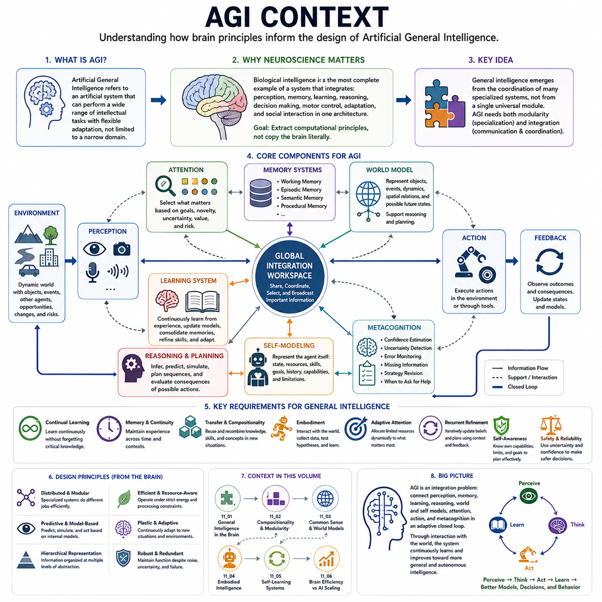
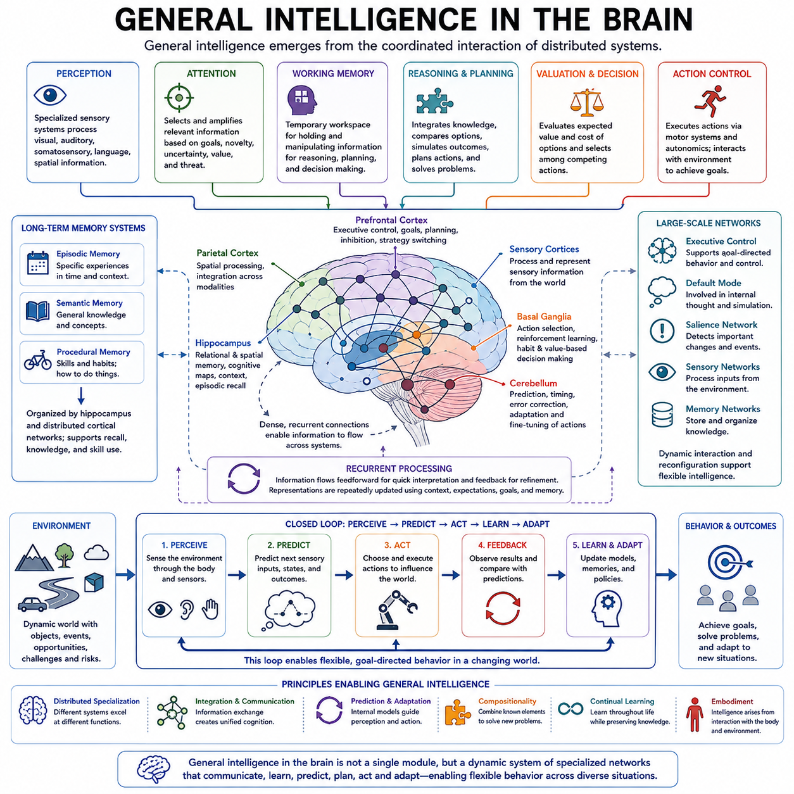
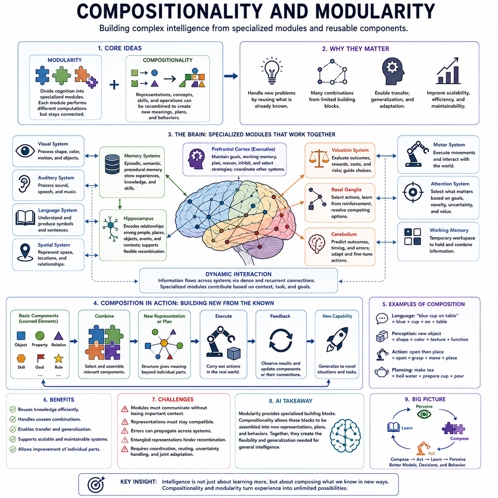
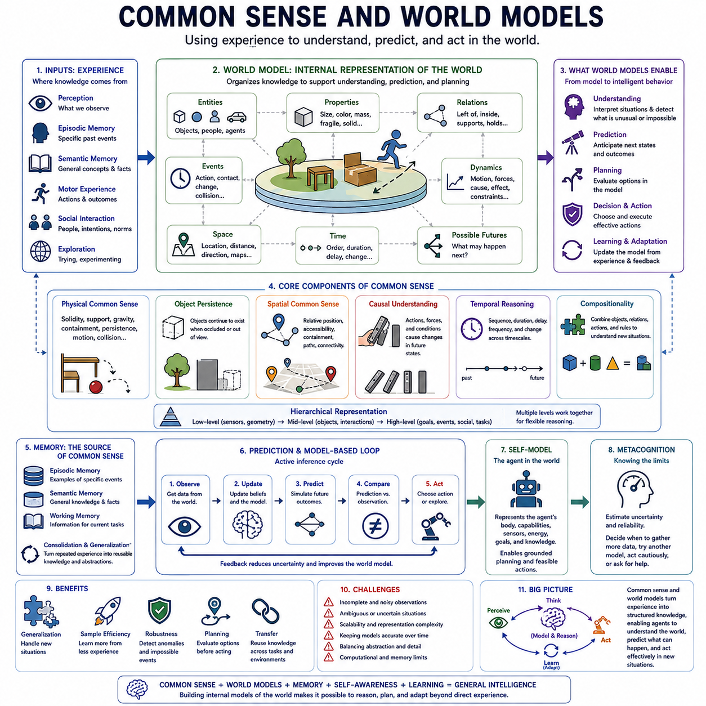
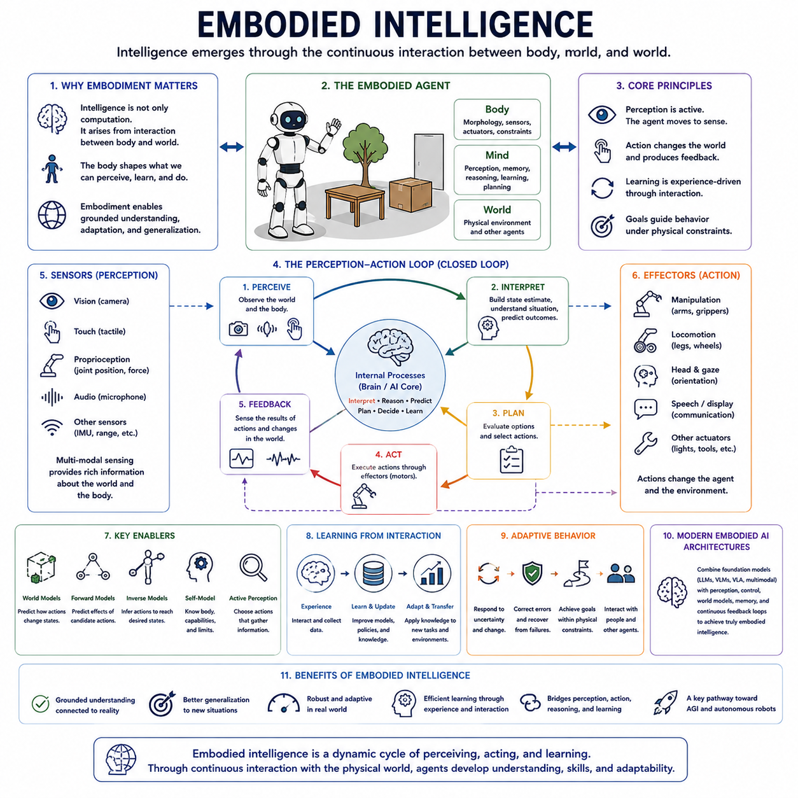
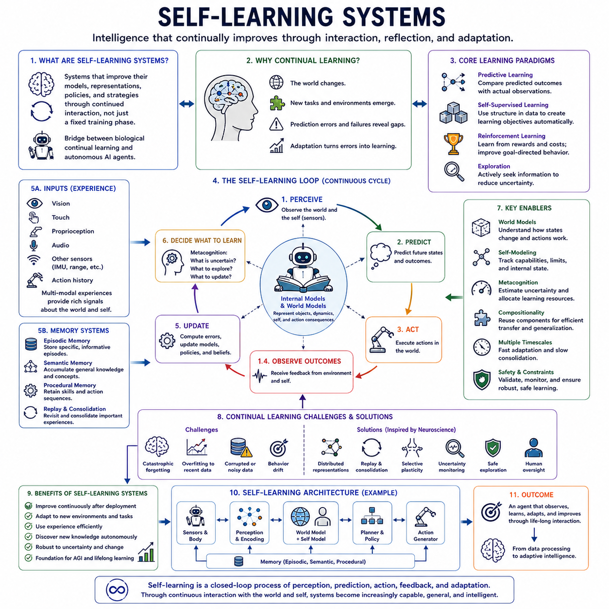
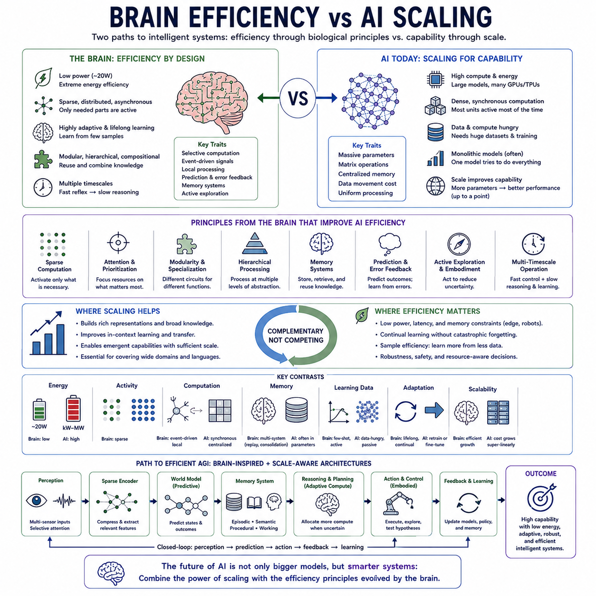
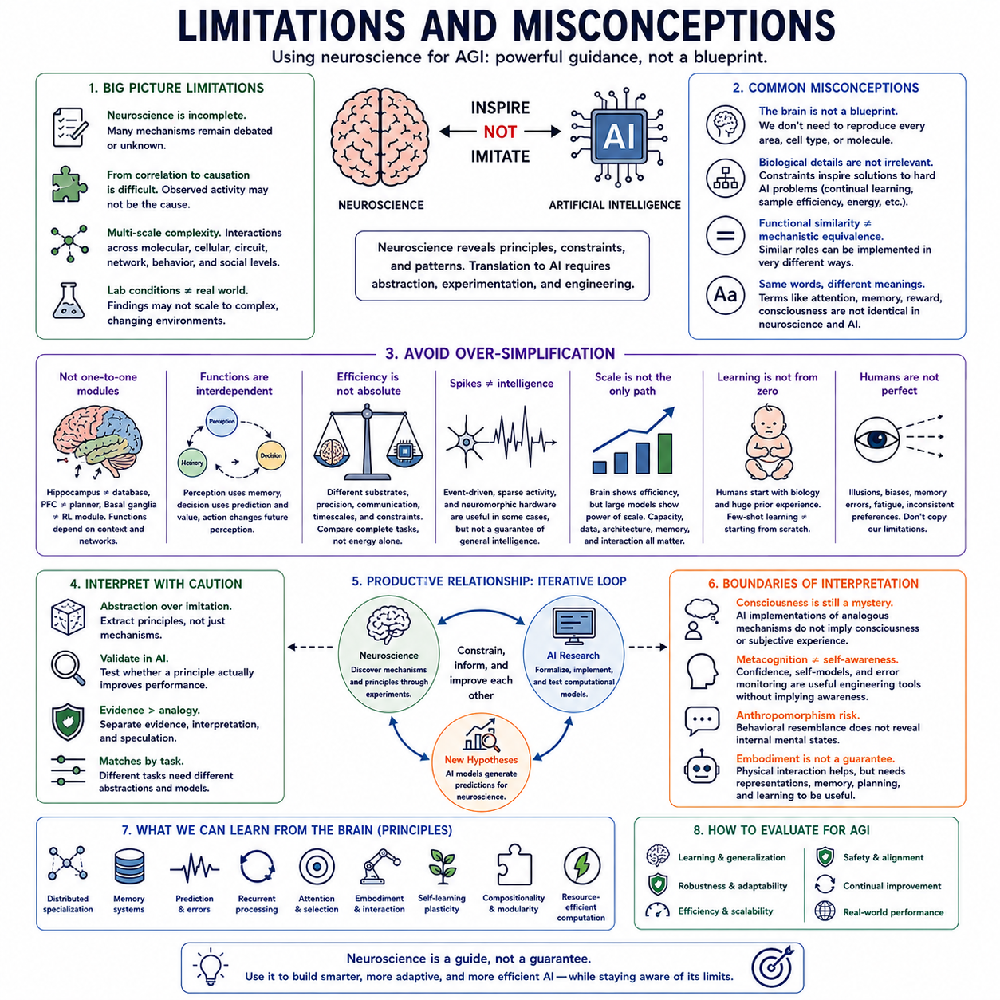

**Volume 44 Neuroscience for AI**

# Chapter 11. Neuroscience for AGI

## 11.00 AGI Context

{width="7.268055555555556in" height="7.268055555555556in"}

Artificial General Intelligence (AGI) refers to the idea of an artificial system capable of performing a broad range of intellectual tasks with flexible adaptation rather than operating within a narrowly defined domain. In the structure of this volume, AGI is examined from a neuroscience perspective, following earlier discussions of neurons, learning, predictive processing, memory, internal models, consciousness-related mechanisms, and AI-agent architectures.

The neuroscience context is important because biological intelligence provides the most complete existing example of a system that combines perception, memory, learning, reasoning, decision making, motor control, adaptation, and social interaction within one architecture. The goal is not to copy the brain literally, but to identify computational principles that may explain how many specialized mechanisms cooperate to produce flexible and general behavior.

Human intelligence is highly distributed rather than controlled by a single universal reasoning module. Visual systems process complex sensory structure, memory systems preserve different forms of experience, prefrontal networks support planning and control, basal ganglia contribute action selection, and sensorimotor systems coordinate interaction with the environment. General intelligence emerges from coordination among these specialized systems rather than from eliminating specialization.

This observation suggests that AGI may require both modularity and integration. Specialized components can perform perception, language, spatial reasoning, memory retrieval, prediction, planning, and motor control efficiently, while shared mechanisms allow information to move between them. Such an architecture differs from a collection of independent AI models because representations, goals, uncertainty, and feedback must remain coordinated across multiple functions.

Learning is another central requirement for general intelligence. Biological organisms do not rely exclusively on one fixed training phase followed by permanent deployment. They continually acquire knowledge from interaction, update internal models, consolidate important memories, refine skills, and adapt behavior when environments change. AGI therefore raises the problem of continual learning while preserving previously acquired capabilities and avoiding destructive interference between old and new knowledge.

Memory is equally fundamental because general intelligence requires continuity across time. Working memory maintains information required for ongoing tasks, episodic memory preserves specific experiences, semantic memory organizes generalized knowledge, and procedural memory supports learned skills. The preceding structure of the neuroscience volume treats these memory systems as distinct but interacting mechanisms, providing an important foundation for considering integrated artificial memory.

Predictive processing and internal models provide another bridge toward AGI. Intelligent behavior requires more than reacting to current observations; an agent must estimate hidden states, predict how situations may evolve, and evaluate the consequences of possible actions. Internal models allow the system to represent both the environment and its own interaction with it, supporting simulation, planning, anticipation, and correction when predictions disagree with observations.

World models extend this principle by allowing an artificial agent to maintain structured representations of objects, events, dynamics, spatial relationships, and possible future states. A sufficiently capable world model should support reasoning across multiple domains rather than merely forecasting raw sensory signals. General intelligence therefore depends on representations that capture useful regularities at several levels, from immediate perception to abstract concepts and long-term causal structure.

Embodiment also matters in the neuroscience framing of AGI. Biological intelligence developed through continuous interaction between perception and action, where organisms learn what sensory signals mean partly through their consequences for behavior. An embodied agent can actively gather information, manipulate objects, test hypotheses, and learn physical regularities. This creates a closed learning loop in which cognition is grounded in interaction rather than remaining entirely detached from the environment.

Attention provides a mechanism for operating under limited processing capacity. General intelligence does not require processing every available signal with equal depth. Instead, relevant information must be selected according to goals, novelty, uncertainty, expected value, and potential risk. Attention can therefore coordinate perception, memory, reasoning, and action by dynamically determining which representations should receive computational priority at a particular moment.

Recurrent processing adds iterative refinement. Initial interpretations may be incomplete or incorrect, especially in ambiguous environments. Information can be repeatedly reconsidered using context, memory, predictions, and feedback until a more coherent representation is formed. For AGI, this suggests that flexible reasoning may require repeated internal computation rather than relying exclusively on a single feedforward transformation from input to output.

Self-modeling introduces the representation of the agent itself into this architecture. A generally capable system should know, at least functionally, what resources it possesses, what actions it can perform, what information it lacks, what goals it is pursuing, and what limitations constrain its behavior. Such a self-model can support planning by ensuring that candidate actions are evaluated relative to the agent\'s actual capabilities rather than an idealized unlimited system.

Metacognition extends self-modeling by monitoring the reliability of cognition itself. An intelligent system may need to estimate confidence, detect contradictions, identify missing information, reconsider ineffective strategies, or recognize when external assistance is required. This ability becomes increasingly important as an agent operates across unfamiliar tasks, because generality necessarily exposes the system to situations for which its internal models may be incomplete or uncertain.

General intelligence also requires compositionality and transfer. Knowledge acquired in one context should be reusable in another without retraining an entire system from the beginning. Concepts, skills, causal relationships, and action primitives can potentially be recombined into new solutions. The subsequent structure of the volume therefore connects the AGI context directly to compositionality and modularity, common sense and world models, embodied intelligence, and self-learning systems.

Brain efficiency provides an additional constraint on AGI design. Biological brains achieve broad adaptability under strict limitations of energy, communication bandwidth, memory access, and processing speed. This suggests that general intelligence may depend not only on increasing model scale but also on selective computation, distributed representation, sparse activity, adaptive memory access, and efficient coordination among specialized subsystems.

At the same time, neuroscience should not be treated as a complete engineering specification for AGI. Biological mechanisms evolved under constraints very different from modern computing systems, and many aspects of cognition remain scientifically unresolved. The relevant objective is therefore to extract useful principles without assuming that every neural mechanism must be reproduced. Brain-inspired design should be evaluated by functional value, scalability, reliability, and compatibility with artificial hardware.

Within this context, AGI can be understood as an integration problem as much as a scaling problem. A generally intelligent system must connect learning, memory, prediction, world modeling, self-modeling, reasoning, attention, action, and metacognitive regulation within an adaptive closed loop. The following sections therefore examine how modularity, common sense, embodiment, self-learning, and brain efficiency may contribute to architectures capable of increasingly general and autonomous intelligence.

## 11.01 General Intelligence in the Brain

{width="7.268055555555556in" height="7.268055555555556in"}

General intelligence in the brain does not appear to arise from a single anatomical location or one universal cognitive mechanism. Instead, it emerges from coordinated interactions among distributed neural systems responsible for perception, memory, attention, reasoning, valuation, action, and learning. The brain achieves flexible behavior by integrating specialized computations while maintaining communication across multiple spatial and temporal scales.

The cerebral cortex provides a major substrate for this distributed intelligence. Different cortical regions specialize in processing visual, auditory, somatosensory, linguistic, spatial, and executive information, yet these areas are densely interconnected. Higher association regions combine information from multiple modalities, enabling the brain to move from isolated sensory features toward abstract representations that can support planning, conceptual reasoning, and context-dependent behavior.

The prefrontal cortex is particularly important for flexible cognition because it supports working memory, goal maintenance, planning, inhibition, strategy selection, and behavioral adaptation. Rather than containing general intelligence by itself, it coordinates information generated elsewhere in the brain. It can maintain task-relevant representations, compare possible actions, suppress inappropriate responses, and reorganize behavior when previously successful strategies no longer work.

Working memory provides a temporary workspace in which information can be actively maintained and manipulated. This capability allows the brain to connect current perception with goals, retrieved knowledge, intermediate reasoning steps, and possible future actions. Because working memory capacity is limited, attention must selectively determine which information remains active, making intelligent cognition dependent on coordinated control rather than unlimited information processing.

Long-term memory greatly expands the range of situations in which flexible intelligence can operate. Episodic memory provides access to specific past experiences, semantic memory supplies generalized knowledge, and procedural memory preserves learned skills. The hippocampus and distributed cortical networks help organize these forms of memory, allowing previous experience to influence current interpretation, prediction, planning, and problem solving across different contexts.

The hippocampal system also contributes to relational and spatial representations that extend beyond simple memory storage. By linking events, locations, objects, and contextual relationships, it supports flexible recombination of experience. Such representations enable an organism to construct cognitive maps, imagine alternative routes, recall relevant episodes, and infer relationships that were not explicitly experienced together, capabilities that are important for generalizable reasoning.

The basal ganglia contribute to general intelligence through action selection, reinforcement learning, and the regulation of competing behavioral possibilities. Cortical systems may generate multiple candidate interpretations or actions, while basal ganglia circuits help determine which should be selected based on expected value, learned consequences, context, and current goals. This interaction connects abstract cognition with decisions that ultimately influence behavior.

The cerebellum contributes another important dimension by learning predictive relationships between actions and their consequences. Although traditionally associated with motor coordination, cerebellar computation is increasingly understood as involving prediction, timing, error correction, and adaptation across broader functional domains. Its repeated circuit structure illustrates how specialized predictive mechanisms can support rapid refinement of complex behavior without requiring centralized control.

General intelligence therefore depends strongly on prediction. The brain continuously estimates what sensory signals, internal states, and action consequences are likely to occur next. When observations differ from expectations, prediction errors can drive updating of internal models. This allows perception and behavior to remain adaptive in changing environments and creates a mechanism through which previously acquired knowledge can guide interpretation without rigidly determining it.

Attention provides dynamic resource allocation within this distributed system. Rather than processing all available information equally, the brain prioritizes signals according to goals, novelty, uncertainty, expected value, and potential threat. Attention can amplify relevant sensory representations, facilitate memory retrieval, influence decision processes, and regulate which information becomes available to broader networks, allowing intelligence to operate efficiently under limited computational capacity.

Large-scale communication among brain networks is also essential. Executive control networks, default-mode systems, salience-related networks, sensory systems, and memory structures interact dynamically depending on the task. A demanding external problem may emphasize sensory and executive coordination, while internal simulation may rely more strongly on memory and associative networks. Flexible intelligence emerges partly from the ability to reconfigure these interactions according to changing demands.

Recurrent processing further allows representations to be repeatedly refined. Information can travel through feedforward pathways to generate rapid initial interpretations and then return through feedback connections to incorporate context, expectations, goals, and memory. This iterative process enables ambiguous information to be reconsidered and supports the stabilization of representations over time, making cognition more robust than a purely one-pass architecture.

Another defining property of biological intelligence is hierarchical organization. Neural representations range from relatively local sensory features to objects, situations, goals, concepts, and abstract relationships. Higher levels can influence lower levels through feedback while lower levels provide evidence that constrains higher-level interpretation. Intelligence therefore involves coordinated computation across several levels of abstraction rather than operating exclusively at either symbolic or sensory scales.

Compositionality is closely related to this hierarchical structure. Previously learned elements can be recombined into new representations, plans, and behaviors. A person can understand a novel situation by combining familiar concepts, spatial relations, actions, and causal expectations without learning every configuration from the beginning. Such recombination makes generalization possible and reduces the amount of experience required to solve unfamiliar problems.

The brain also learns continually. Synaptic plasticity modifies representations and behavioral policies throughout life, while memory consolidation helps stabilize important knowledge. New learning must coexist with established skills rather than constantly overwriting them. Biological intelligence therefore combines rapid adaptation with mechanisms that preserve long-term structure, providing a useful reference for artificial systems seeking continual learning without catastrophic forgetting.

Embodiment further shapes general intelligence because cognition develops through interaction between the brain, body, and environment. Sensory signals are interpreted in relation to possible actions, bodily constraints, and predicted consequences. The organism can move, manipulate objects, gather new information, and alter its surroundings, turning intelligence into an active process of perception, prediction, intervention, feedback, and learning rather than passive representation alone.

From an AI perspective, the brain suggests that general intelligence may be better understood as coordinated system integration than as a single superior algorithm. Specialized components can perform perception, memory, prediction, reasoning, action selection, and control, while shared representations and recurrent communication allow them to cooperate. General capability may therefore depend on how effectively multiple mechanisms exchange information and adapt together.

The broader lesson is that general intelligence in the brain emerges from distributed specialization combined with flexible integration. Memory supplies experience, attention allocates resources, predictive models anticipate change, executive systems maintain goals, recurrent networks refine interpretation, and action systems close the loop with the environment. Their coordinated operation creates an adaptive architecture capable of transferring knowledge, learning continuously, solving unfamiliar problems, and adjusting behavior across diverse situations.

## 11.02 Compositionality and Modularity [w/Code]

{width="7.268055555555556in" height="7.268055555555556in"}

Compositionality and modularity describe two closely related principles that help explain how complex intelligence can emerge from reusable and specialized components. Modularity divides cognition into systems that perform different functions, while compositionality allows representations, concepts, skills, and operations produced by those systems to be recombined. Together, they provide a foundation for flexible behavior without requiring every new problem to be learned from the beginning.

The brain demonstrates substantial functional specialization. Visual, auditory, motor, memory, language, spatial, valuation, and executive systems perform different types of computation while remaining interconnected. This organization allows neural circuits to develop representations suited to particular information-processing demands. General intelligence therefore does not require every region to perform every function, but depends on effective cooperation among specialized neural resources.

Biological modularity is not equivalent to rigid separation. Brain regions frequently participate in multiple functions, and their contributions depend on context, task demands, learning history, and interactions with other networks. A useful module should therefore be understood as a relatively specialized computational subsystem rather than an isolated component. Flexible intelligence emerges when specialized systems can dynamically exchange information and reorganize their functional relationships.

Compositionality complements this organization by allowing existing elements to form new combinations. Humans can understand unfamiliar sentences from familiar words, imagine novel objects from known properties, construct new action sequences from learned motor skills, and solve new problems by combining previously acquired concepts. The number of possible combinations can greatly exceed the number of experiences directly encountered during learning.

Language provides a clear example of compositional processing. A limited vocabulary and a set of grammatical relationships can generate and interpret an enormous range of expressions. Meaning depends not only on individual elements but also on how those elements are structured and related. This illustrates an important property of general intelligence: reusable representations become significantly more powerful when they can participate in systematic combinations.

Compositionality also appears in perception. Objects can be represented through combinations of shape, color, texture, spatial relationships, function, and contextual associations. Scenes can then be constructed from objects and relationships rather than stored as completely independent patterns. Such structured representations help the brain recognize familiar components in unfamiliar configurations and support generalization when the exact sensory situation has never previously occurred.

Motor behavior exhibits a similar principle. Complex actions can be organized from reusable movement patterns, goals, subgoals, and sensorimotor transformations. Reaching, grasping, walking, turning, and manipulating can participate in many different behavioral sequences. Hierarchical control allows these components to be coordinated at different temporal scales, enabling flexible action without requiring a separate motor policy for every possible task.

Memory supports compositionality by preserving components that can later be retrieved and recombined. Episodic memories provide specific experiences, semantic memory supplies concepts and relationships, and procedural memory provides learned skills. During reasoning or planning, selected elements from these systems can be brought together according to current goals. Memory therefore functions not only as storage but also as a resource for constructing new internal representations.

The hippocampal system is especially relevant because it can encode relationships among people, objects, locations, events, and contexts. Relational representations allow previously separate experiences to become linked and reorganized. This capability supports cognitive maps, inferential reasoning, episodic simulation, and imagination, where elements of past experience can be assembled into situations that have never been directly experienced.

The prefrontal cortex contributes by maintaining goals and organizing combinations of representations according to current task demands. It can coordinate information from memory, perception, valuation, and action systems while preserving intermediate states in working memory. Such control makes composition purposeful rather than arbitrary, allowing the brain to construct representations and action sequences that are relevant to a particular problem.

Modularity also provides advantages for learning. Specialized systems can adapt to particular types of information without requiring simultaneous modification of the entire cognitive architecture. This can reduce interference between unrelated skills and allow different learning mechanisms to operate at appropriate rates. However, excessive modular isolation would prevent knowledge transfer, making communication and shared representations essential for achieving general intelligence.

For artificial intelligence, modularity suggests architectures composed of specialized components for perception, memory, language, planning, world modeling, control, and other functions. Each component can use computational mechanisms appropriate to its role while communicating through structured interfaces or shared latent representations. This approach can improve interpretability, maintainability, specialization, and potentially the ability to replace or improve individual capabilities.

Compositional AI extends this idea by representing knowledge in forms that can be systematically reused. Instead of memorizing complete solutions, an agent can learn objects, relations, skills, goals, constraints, and transformations that can be assembled into new solutions. A robot that separately understands containers, grasping, navigation, opening, and placement could potentially combine these capabilities when confronted with a previously unseen manipulation task.

This principle is particularly important for planning and world models. A compositional world model can represent entities, properties, relationships, actions, and dynamics separately enough to support recombination while preserving their interactions. Planning can then search over possible compositions of states and actions. The system does not need to experience every complete trajectory if it can predict how reusable components interact under new conditions.

Compositionality also supports transfer learning and systematic generalization. Knowledge learned in one task can contribute to another when both tasks share meaningful components or relationships. This differs from superficial similarity because transfer can occur through abstract structure. An agent that understands concepts such as containment, support, obstruction, sequence, or causality may reuse those relationships across many environments and embodiments.

Yet modularity and compositionality introduce significant engineering challenges. Modules must exchange information without losing important context, representations must remain compatible across subsystems, and errors in one component can propagate through the larger architecture. Learned representations may also become entangled in ways that make clean recombination difficult. Effective systems therefore require mechanisms for coordination, routing, uncertainty propagation, and joint adaptation.

A neuroscience-inspired architecture may combine modular specialization with global integration and recurrent communication. Specialized subsystems can generate candidate representations, attention can determine which information is relevant, working memory can temporarily combine selected elements, and recurrent processing can refine their relationships. Learning can then modify both individual modules and the interfaces that coordinate them as experience accumulates.

For embodied intelligence, composition must ultimately connect perception to physical action. Objects, spatial relationships, goals, affordances, skills, and predicted consequences must be assembled into executable behavior under real-world constraints. Feedback can reveal when a composition fails, allowing the agent to modify either individual components or their organization. This transforms compositionality from abstract representation into a mechanism for adaptive interaction.

The broader implication for general intelligence is that scalability may depend not only on increasing the amount of learned knowledge but also on increasing how effectively knowledge can be reused. Modularity provides specialized computational building blocks, while compositionality allows those blocks to generate new representations, plans, and behaviors. Their integration offers a path toward systems that generalize beyond training examples by reorganizing existing capabilities to meet unfamiliar situations.

## 11.03 Common Sense and World Models [w/Code]

{width="7.268055555555556in" height="7.268055555555556in"}

Common sense refers to the broad collection of implicit knowledge that allows an intelligent system to interpret ordinary situations, predict plausible outcomes, and recognize when something is unusual or impossible. Humans rarely reason from first principles about every event. Instead, accumulated experience provides expectations about objects, people, space, time, causality, actions, and physical constraints that make everyday reasoning efficient.

World models provide a computational framework for organizing this kind of knowledge. A world model represents relevant aspects of the environment, including entities, properties, relationships, events, dynamics, and possible future states. Rather than mapping observations directly to actions, an intelligent system can use such an internal representation to interpret what is happening, anticipate what may happen next, and evaluate alternative actions before executing them.

In biological cognition, common sense is not stored as a single database of explicit facts. It emerges from interactions among perception, semantic memory, episodic experience, spatial representations, causal learning, motor knowledge, and social understanding. Repeated exposure to regularities allows the brain to develop expectations about how the world normally behaves, enabling rapid interpretation without reconstructing every relevant rule consciously.

Physical common sense includes knowledge about properties such as solidity, support, containment, gravity, persistence, motion, and collision. Humans expect unsupported objects to fall, solid objects to resist penetration, hidden objects to continue existing, and containers to constrain what is inside them. These expectations provide a background model that supports prediction even when sensory information is incomplete or when a situation has never been encountered in exactly the same form.

Object persistence is particularly important because intelligent systems must maintain representations beyond immediate observation. When an object becomes temporarily occluded, the brain does not normally treat it as having ceased to exist. Internal representations preserve identity, location, and expected motion across gaps in sensory evidence. A world model therefore requires temporal continuity rather than treating each observation as an independent snapshot.

Spatial common sense extends beyond recognizing individual objects. Intelligent behavior requires understanding relative position, distance, direction, accessibility, containment, connectivity, and navigational structure. Cognitive maps allow organisms to represent relationships among locations and possible routes. Such representations support reasoning about where objects may be found, whether destinations are reachable, and how alternative actions could transform spatial relationships.

Causal understanding provides another essential component. Correlation alone is insufficient for robust action because an agent must estimate how interventions change future states. The brain learns relationships between actions and consequences through observation, exploration, and feedback. A useful world model therefore represents not only what events tend to occur together but also how actions, forces, constraints, and environmental conditions contribute to transitions between states.

Temporal reasoning connects events across different timescales. Common sense includes expectations about duration, sequence, repetition, delay, and change. Some consequences occur immediately, while others emerge only after extended interactions. World models must therefore represent state transitions over time and preserve enough history to distinguish events that may appear similar in a single observation but have different trajectories and likely outcomes.

Memory is central to constructing these models. Episodic memory provides examples of specific events, semantic memory extracts more stable regularities, and working memory maintains information relevant to the current situation. Through consolidation and generalization, repeated experiences can become reusable knowledge. Common sense can therefore be understood partly as compressed experience that captures regularities useful across many situations without preserving every original observation.

Prediction turns stored knowledge into active intelligence. Given a current state, the system can estimate likely future states and compare them with incoming observations. Prediction errors indicate that the internal model may be incomplete, inaccurate, or facing an unusual event. Recurrent updating allows expectations to be corrected continuously, making the world model an adaptive representation rather than a fixed description of reality.

Compositionality makes common-sense knowledge more generalizable. Instead of memorizing every possible scene, an intelligent system can represent objects, properties, relations, actions, and constraints as reusable components. These elements can then be combined to interpret unfamiliar situations. Knowledge that a fragile object can break when dropped, for example, can potentially transfer across many objects and contexts without requiring identical previous experiences.

Hierarchical representation is equally important because useful world knowledge exists at several levels of abstraction. Low-level models may represent motion and geometry, intermediate models may describe objects and interactions, and higher levels may represent goals, events, causal structures, or social situations. Reasoning can move between these levels depending on the task, allowing detailed physical prediction when necessary and more abstract planning when fine detail is unnecessary.

For artificial intelligence, world models provide a path beyond purely reactive behavior. An AI agent can transform observations into latent or structured states, predict how candidate actions alter those states, and select actions according to expected outcomes. This supports planning, counterfactual reasoning, exploration, and error recovery. The model becomes especially valuable when actions are expensive, risky, or physically irreversible.

Embodied AI places stronger demands on common sense because robots must interact with real environments rather than only describe them. A robot needs practical knowledge of traversability, reachability, collision, object affordances, manipulation constraints, uncertainty, and its own physical capabilities. Its world model must connect perception with action so that predictions remain grounded in what the robot can actually sense and execute.

Active interaction can also improve the world model. When uncertainty is high, an agent can move its sensors, approach an object, manipulate something, or perform a controlled action to obtain additional evidence. This converts perception from passive observation into active inference. The agent learns not only by receiving data but by choosing actions that reveal hidden properties and test competing hypotheses about the environment.

A self-model complements the world model by representing the agent within the predicted environment. Planning then involves both world-state and self-state transitions. The system can estimate whether it has sufficient energy, sensing capability, reach, mobility, knowledge, or computational resources to complete an action. Common-sense reasoning therefore becomes grounded not only in what is possible generally, but in what is possible for this particular agent.

Metacognition further strengthens this architecture by estimating the reliability of world-model predictions. An agent should distinguish between familiar situations where predictions are well supported and unfamiliar situations where uncertainty is high. It can then gather more evidence, use alternative models, select safer behavior, or request assistance. Knowing the limits of a world model can be as important as possessing the model itself.

No practical world model can reproduce every detail of reality. Intelligence therefore requires selective abstraction: preserving information relevant to prediction and action while ignoring unnecessary complexity. The appropriate representation may change with the task. Navigation requires different details from manipulation or social interaction, suggesting that flexible world models should dynamically emphasize the variables and relationships most relevant to current goals.

For general intelligence, common sense and world models provide a bridge between accumulated experience and flexible future behavior. Common sense supplies reusable expectations about how environments normally work, while world models organize those expectations into representations that support prediction, simulation, and action. Combined with memory, compositionality, self-modeling, metacognition, and embodiment, they enable agents to reason about unfamiliar situations rather than merely reproduce patterns encountered during training.

## 11.04 Embodied Intelligence [w/Code]

{width="7.268055555555556in" height="7.268055555555556in"}

Embodied intelligence describes intelligence as a process that emerges through continuous interaction among a cognitive system, a physical body, and an environment. From this perspective, intelligence is not produced by internal computation alone. Perception, movement, physical constraints, sensory consequences, and environmental feedback jointly shape what an agent can learn, represent, predict, and ultimately do.

Biological intelligence provides the clearest example of this principle. The nervous system does not receive sensory information as a passive stream detached from action. Eyes move to acquire visual information, hands manipulate objects to reveal physical properties, and locomotion changes the sensory viewpoint. Perception is therefore partly generated through behavior, making sensing and acting mutually dependent components of cognition.

The body is not merely a mechanical container for the brain. Its morphology, sensory systems, degrees of freedom, strength, reach, speed, and physical limitations determine which interactions are possible. These constraints influence learning by structuring the experiences available to the organism. Intelligence consequently develops relative to a particular body and its possibilities for interacting with the surrounding world.

This relationship creates the perception-action loop that lies at the center of embodied intelligence. Sensory systems observe the environment, internal processes interpret those observations, actions modify either the agent or the environment, and the consequences generate new sensory evidence. Each cycle can update future decisions, producing a continuous closed-loop process of sensing, acting, evaluating, and adapting.

Sensorimotor intelligence develops from regular relationships between sensory states and actions. An organism learns that particular movements produce predictable changes in vision, touch, proprioception, balance, and spatial position. These relationships provide structured knowledge about both the body and the environment. Motor experience therefore contributes directly to perception rather than serving only as the final output of cognitive processing.

Proprioception and interoceptive information add representations of the agent\'s own physical state. Joint positions, muscle states, balance, effort, orientation, and other bodily variables provide continuous information about what actions are currently possible. In artificial embodied agents, analogous internal sensing can support state estimation, control, fault detection, energy management, and a functional self-model connected to physical capabilities.

Grounded cognition follows naturally from embodiment. Concepts acquire practical meaning when they are connected to sensory and motor experience. Properties such as heavy, fragile, reachable, slippery, obstructed, or stable are not merely abstract labels; they describe relationships between objects, actions, and possible consequences. Grounding allows internal representations to connect symbolic or linguistic knowledge with the physical structure of the world.

Affordances provide an especially useful representation of this relationship. An object can be understood partly through the actions it permits: a surface may support standing, a handle may permit grasping, an opening may allow passage, and a container may accept another object. Affordances depend on both environmental properties and the agent\'s body, meaning that the same environment can provide different action possibilities to different agents.

Embodiment also enables active perception. When sensory information is incomplete, an agent does not have to remain passive. It can change viewpoint, approach an object, touch a surface, illuminate an area, manipulate something, or perform an exploratory action. Actions can therefore be selected partly for their information value, allowing the agent to reduce uncertainty and test hypotheses about hidden environmental properties.

World models become more powerful when they are grounded in such interaction. Instead of representing only correlations among observations, an embodied world model can learn how actions transform environmental and self states. It can predict whether an object will move, whether a path is traversable, whether a grasp will succeed, or how the agent\'s own configuration will change after an action. Prediction becomes directly connected to intervention.

Forward models are particularly relevant because they predict the sensory or state consequences of candidate actions. If an agent issues a movement command, an internal model can estimate the resulting body configuration and environmental change before or during execution. Comparing predicted and observed consequences produces error signals that can support correction, adaptation, state estimation, and refinement of the internal model.

Inverse models complement this process by estimating which action could produce a desired state. Together, forward and inverse models connect goals with physical dynamics: one direction predicts consequences from actions, while the other identifies actions from desired consequences. Their interaction supports motor control, planning, skill learning, and the ability to adapt behavior when environmental dynamics or bodily conditions change.

The brain\'s predictive motor systems illustrate how embodiment depends on multiple timescales. Fast sensorimotor loops can stabilize movement within fractions of a second, while slower processes organize sequences, goals, and long-term plans. Hierarchical organization allows rapid control to coexist with deliberative reasoning. Artificial embodied systems similarly benefit from separating real-time control from higher-level planning while maintaining information exchange between them.

Learning in an embodied system is fundamentally experiential. Every physical interaction can generate information about geometry, dynamics, causality, object properties, action outcomes, and the agent\'s own capabilities. Reinforcement learning can associate actions with consequences, self-supervised learning can exploit regularities in multimodal sensory streams, and predictive learning can improve internal models by minimizing discrepancies between expected and observed outcomes.

Embodiment also provides a natural basis for causal learning. An agent can intervene in the environment and observe what changes as a consequence. Pushing, lifting, releasing, moving, grasping, or navigating produces evidence about physical relationships that passive observation may not reveal. The ability to perform controlled interventions therefore helps distinguish causal structure from statistical correlation and improves planning under unfamiliar conditions.

Adaptive behavior requires continuous feedback because real environments are uncertain and variable. Surfaces differ, objects move, sensors become noisy, actuators experience disturbances, and other agents behave unpredictably. A fixed open-loop plan can therefore fail even when initially reasonable. Embodied intelligence uses feedback to compare intended and observed states, correct deviations, revise predictions, and modify future behavior as conditions change.

Memory extends embodied intelligence across time. Episodic memory can preserve specific interactions, semantic memory can extract reusable knowledge about objects and environments, and procedural memory can retain learned skills. Past physical experiences can then guide new behavior. A robot need not rediscover every property repeatedly if experience can be consolidated into representations that transfer across related objects, tasks, and situations.

For artificial intelligence, embodiment therefore requires integration rather than simply attaching a robot body to a cognitive model. Perception, memory, world modeling, reasoning, planning, control, learning, and action must participate in a coordinated architecture. Modern embodied architectures increasingly combine multimodal perception, predictive world models, adaptive control, learning mechanisms, and higher-level cognitive systems within continuous feedback loops.

This integration becomes particularly important for general intelligence because physical environments contain ambiguity, uncertainty, novelty, and consequences that cannot always be represented completely in advance. An embodied agent must continually determine what matters, gather missing information, predict possible futures, select feasible actions, monitor execution, and learn from results. Intelligence becomes an ongoing adaptive process rather than a fixed mapping from input to output.

From a neuroscience perspective, embodied intelligence therefore connects many mechanisms discussed throughout the broader architecture: perception provides environmental evidence, internal models predict consequences, memory preserves experience, attention selects relevant information, action tests predictions, and feedback drives adaptation. Their integration grounds cognition in reality and provides a pathway from abstract AI toward autonomous agents capable of learning and acting effectively in the physical world.

## 11.05 Self Learning Systems [w/Code]

{width="7.268055555555556in" height="7.268055555555556in"}

Self-learning systems are artificial or biological systems that improve their internal models, representations, policies, or strategies through continued interaction rather than relying only on a fixed training phase. In the neuroscience context, this idea connects learning, memory, prediction, embodiment, and adaptation, and it appears in the AGI chapter as a bridge between biological continual learning and more autonomous artificial agents.

The brain provides a natural example of self-directed learning because it continuously adjusts to new sensory inputs, tasks, environments, and goals. Learning does not stop after an initial training period. Synaptic plasticity, memory consolidation, reinforcement mechanisms, and predictive updating allow neural systems to change throughout life while preserving much of the knowledge and skill acquired earlier.

A self-learning system therefore requires mechanisms for detecting when its current knowledge is insufficient. Prediction errors, failed actions, uncertainty, novelty, conflicting evidence, and unexpected outcomes can all indicate that adaptation is necessary. Instead of treating these events only as failures, the system can use them as learning signals that identify which representations, models, or policies should be revised.

Predictive learning is especially important because an intelligent system can learn by comparing expected outcomes with actual observations. If a world model predicts a future state and reality differs, the resulting error provides information about what the model does not yet capture. Repeated prediction and correction allow the system to improve representations of objects, dynamics, temporal structure, and action consequences without requiring explicit labels for every experience.

Self-supervised learning offers a related strategy for artificial systems. Rich sensory streams contain internal structure that can generate their own learning objectives, such as predicting missing information, future observations, cross-modal relationships, or state transitions. For embodied agents, vision, touch, proprioception, audio, and action histories can provide mutually constraining signals, enabling large amounts of experience to become useful training data.

Reinforcement learning contributes by connecting actions with long-term consequences. An agent can explore alternative behaviors, observe rewards or costs, and modify its policy according to experience. Biological reward systems similarly use prediction errors to influence learning. For self-learning agents, reinforcement signals can complement predictive and self-supervised objectives by emphasizing which discoveries actually improve goal-directed behavior.

Exploration is therefore a fundamental part of self-learning. Passive observation may leave important properties hidden, while active interaction can reveal them. An agent can move to obtain a better viewpoint, manipulate an object, test a route, or deliberately try an uncertain action under controlled conditions. Exploration transforms uncertainty into an opportunity to acquire information rather than merely a reason to avoid acting.

Memory provides continuity across learning episodes. Episodic memory can preserve unusual or informative experiences, semantic memory can accumulate generalized knowledge, and procedural memory can retain successful skills. Replay and consolidation can revisit important experiences after they occur, allowing learning to continue without requiring the original situation to remain present and reducing the dependence on immediate online updates.

Continual learning introduces the challenge of preserving old capabilities while acquiring new ones. Updating a model on recent experience can overwrite representations that support previously learned tasks, producing catastrophic forgetting. Biological systems appear to mitigate this through distributed representations, replay, consolidation, multiple learning timescales, and selective plasticity, offering useful principles for artificial continual learning.

A self-learning architecture may therefore separate fast adaptation from slower consolidation. Fast mechanisms can respond quickly to novel conditions, while slower mechanisms evaluate whether new information should permanently modify long-term knowledge. This division helps prevent temporary noise or isolated events from destabilizing established representations while still allowing significant environmental changes to influence future behavior.

Metacognition can regulate when and how learning occurs. An agent that estimates its own uncertainty can allocate additional computation or data collection to poorly understood situations while avoiding unnecessary updates in familiar conditions. Confidence estimates can also determine whether a new experience should trigger adaptation, be stored for later review, or be treated as unreliable because of sensor noise or ambiguous evidence.

Self-modeling is equally important because learning should account for changes in the agent itself. A robot may experience battery degradation, sensor drift, altered payload, actuator wear, or hardware replacement. If the system represents its own capabilities and limitations, it can distinguish environmental changes from changes in its body and adapt control, perception, and planning accordingly.

World models provide a central substrate for self-learning because they can accumulate knowledge about how states change and how actions influence those changes. New experience can refine object representations, spatial relationships, causal assumptions, and dynamics. The agent can then test updated models through simulation or real interaction, creating a loop in which learning improves prediction and improved prediction guides further learning.

Compositionality can make self-learning more efficient by allowing newly acquired knowledge to modify reusable components rather than entire task solutions. Learning that a surface is slippery, for example, can influence navigation, manipulation, balance, and planning without relearning each task independently. Modular representations therefore support transfer by allowing local discoveries to propagate to many related behaviors.

Embodiment strengthens self-learning because actions create structured training experiences. A physical agent receives continuous feedback about whether its predictions and plans match reality. Contact forces, motion errors, object movement, path success, and sensor changes provide dense signals for adaptation. Learning is thus grounded in consequences that directly reflect the relationship between internal models and the external world.

However, unrestricted self-learning can also create instability. An autonomous system may reinforce incorrect assumptions, overfit recent experiences, learn from corrupted data, or gradually drift away from desired behavior. Practical architectures therefore require constraints, validation, uncertainty monitoring, safe exploration, rollback mechanisms, and sometimes human oversight to ensure that adaptation improves capability without undermining reliability.

For AGI, self-learning systems imply intelligence that remains open to revision after deployment. Such a system would not merely execute capabilities acquired during pretraining but would continually observe, evaluate, experiment, remember, and adapt. The challenge is to combine plasticity with stability, autonomy with safety, and rapid adaptation with long-term knowledge preservation in one coherent learning architecture.

The broader neuroscience-inspired principle is that learning should operate as part of a closed cognitive loop. Perception supplies evidence, memory preserves experience, world models generate predictions, action tests those predictions, feedback reveals errors, and metacognitive control determines what should change. Through repeated cycles, a self-learning agent can gradually improve its models, skills, and strategies while remaining responsive to new environments and tasks.

## 11.06 Brain Efficiency vs AI Scaling [w/Code]

{width="7.268055555555556in" height="7.268055555555556in"}

The comparison between brain efficiency and AI scaling highlights two different paths toward increasingly capable intelligence. Biological brains achieve broad perception, learning, memory, reasoning, and action under severe energy and hardware constraints, whereas modern AI often improves capability by increasing parameters, training data, accelerator count, memory bandwidth, and computation. This topic therefore connects neuroscience-inspired AGI with practical energy-efficient AI design.

AI scaling has demonstrated that larger models trained with more data and computation can acquire increasingly broad capabilities. Scaling can improve representation quality, transfer, in-context adaptation, and performance across diverse tasks. However, increasing scale also raises training cost, inference cost, memory requirements, communication overhead, energy consumption, and deployment complexity, making computational efficiency an increasingly important dimension of intelligent-system design.

The brain follows a substantially different computational regime. It contains enormous numbers of interconnected neurons and synapses, yet neural activity is distributed, sparse, asynchronous, and strongly constrained by metabolic cost. Not every neuron participates equally in every computation. Different circuits become active according to sensory inputs, behavioral context, goals, and internal state, suggesting that biological intelligence relies heavily on selective computation rather than uniform activation.

Sparse processing is therefore one important principle of brain efficiency. Neural populations often represent information through subsets of available units instead of activating the entire system at maximum intensity. Sparse representations can reduce interference, improve representational capacity, and limit energy expenditure. For AI, analogous strategies include sparse activations, conditional computation, selective routing, pruning, and architectures that activate only the resources required for a particular input or task.

Attention provides another mechanism for reducing unnecessary computation. Biological systems cannot process every sensory signal with equal precision, so attention prioritizes information according to relevance, novelty, uncertainty, expected value, and potential danger. AI systems can similarly allocate computation selectively, focusing expensive processing on important tokens, regions, memories, modalities, or candidate actions instead of treating all available information as equally significant.

Modularity further contributes to efficiency because specialized neural circuits can solve different computational problems using structures appropriate to their functions. Visual processing, memory, motor control, valuation, and executive regulation do not require identical computations. For artificial systems, modular architectures can permit specialized components to operate independently when appropriate while sharing information when necessary, reducing the need for one monolithic network to perform every computation simultaneously.

Hierarchical processing also reduces computational burden by representing information at multiple levels of abstraction. Early processing can extract relatively local features, while higher levels represent objects, relationships, goals, and concepts. Once useful abstractions are available, reasoning does not always require reconstructing every low-level detail. AI world models and cognitive architectures can similarly operate on compressed latent states when detailed sensory reconstruction is unnecessary.

Memory provides another contrast between biological efficiency and brute-force scaling. The brain does not appear to encode every experience by permanently modifying all computational pathways. Different memory systems preserve episodes, concepts, skills, and short-term task information using interacting mechanisms. Artificial agents can similarly benefit from separating parametric knowledge from external, episodic, semantic, procedural, and working memory rather than forcing every new fact into model parameters.

This distinction has important implications for model scaling. Increasing parameter count can expand representational capacity, but parameters are an expensive mechanism for storing every form of knowledge. Retrieval-based systems can access relevant information only when required, while working memory can maintain temporary context and long-term stores can preserve persistent knowledge. Such memory-aware architectures can potentially expand effective capability without proportionally expanding the computation used for every inference.

Prediction is another efficiency mechanism because a system that possesses useful internal models does not need to process every situation as entirely novel. Learned expectations constrain interpretation and allow computation to focus on unexpected information. Prediction errors identify where existing models fail, directing learning and attention toward informative discrepancies. In this sense, efficient intelligence depends partly on spending computational resources where reality differs from expectation.

The brain also operates across multiple timescales. Fast sensorimotor circuits handle urgent control, while slower processes support deliberation, memory consolidation, strategic planning, and learning. Not every problem receives the same amount of processing. Artificial agents can adopt similar adaptive computation, using inexpensive pathways for familiar situations while allocating deeper reasoning, simulation, retrieval, or planning to uncertain and difficult problems.

Local computation is another characteristic of neural efficiency. Many neural operations occur within nearby circuits rather than continuously transferring all information through a centralized processor and memory system. Modern digital AI hardware, by contrast, can incur substantial cost from moving data between compute units, accelerator memory, host memory, and distributed nodes. Brain-inspired computing therefore motivates architectures that reduce data movement and place computation closer to stored representations.

Neuromorphic computing explores this principle more directly by designing hardware around event-driven communication, local state, sparse activity, and neuron-like computational elements. Spiking neural networks similarly represent information using discrete events distributed over time. These approaches do not automatically outperform conventional deep learning, but they investigate computational regimes that may become valuable where power, latency, continuous sensing, or edge deployment impose strict constraints.

Learning efficiency is equally important. Humans can often learn useful concepts from relatively few experiences by combining prior knowledge, structured representations, causal expectations, and active exploration. Large AI systems frequently compensate for weaker inductive structure through massive datasets and computation. Neuroscience therefore motivates research into systems that reuse prior knowledge more effectively rather than depending exclusively on increasingly large-scale training.

Compositionality can contribute to this objective because reusable components reduce the need to learn every possible situation independently. Objects, relations, skills, causal structures, and action primitives can be recombined into new solutions. A system that learns modular and compositional representations may achieve broader generalization from fewer examples, shifting part of the scaling problem from accumulating more training instances toward improving the structure and reuse of learned knowledge.

Embodied learning provides another potential source of efficiency. An agent interacting with the world can actively select experiences that reduce uncertainty rather than consuming a fixed dataset indiscriminately. Actions can test hypotheses, expose hidden properties, and generate informative observations. Active perception and exploration therefore allow learning resources to be concentrated on situations where additional experience is expected to improve the agent\'s internal models.

Scaling and efficiency should not be treated as mutually exclusive strategies. Large-scale models provide powerful representation learning and broad prior knowledge, while neuroscience-inspired mechanisms can determine how those resources are accessed and used. Conditional computation, modular routing, structured memory, world models, adaptive reasoning, sparse activation, and hierarchical control can potentially make large systems more efficient rather than requiring a choice between scale and brain inspiration.

For embodied AI, this combination becomes particularly important because robots operate under strict limits on battery capacity, thermal dissipation, compute hardware, latency, communication bandwidth, and payload. A robot cannot assume unlimited data-center computation for every control decision. Perception, prediction, planning, memory retrieval, and reasoning must therefore be prioritized according to task urgency, uncertainty, safety, and available computational resources.

Brain efficiency also changes how progress toward AGI can be evaluated. Raw model size or computational expenditure alone does not measure general intelligence. Important dimensions include sample efficiency, transfer, continual learning, energy per useful decision, memory efficiency, robustness, adaptive computation, and the ability to reuse knowledge across tasks. A smaller system that reorganizes existing knowledge effectively may sometimes provide more useful generalization than a much larger but inflexible system.

The broader implication is that future intelligent systems may require both scaling and architectural efficiency. Scaling can provide capacity and broad learned representations, while brain-inspired principles can improve how computation, memory, learning, and attention are allocated. Rather than asking whether intelligence should come from larger models or efficient architectures, a more productive direction is to combine sufficient scale with sparse, modular, predictive, adaptive, and resource-aware computation.

## 11.07 Limitations and Misconceptions

{width="7.268055555555556in" height="7.268055555555556in"}

Neuroscience offers powerful ideas for artificial intelligence, but its contribution must be interpreted carefully. The brain is not a finished engineering blueprint for AGI, and biological observations rarely translate directly into optimal algorithms. Neuroscience can reveal computational principles, constraints, and organizational patterns, yet turning these findings into artificial systems requires abstraction, experimentation, and engineering choices beyond biological description.

One common misconception is that brain-inspired AI must reproduce the brain in anatomical detail. Artificial systems do not need synthetic equivalents of every cortical area, neurotransmitter, cell type, or biological pathway. Useful inspiration may instead come from higher-level principles such as distributed processing, recurrent computation, memory specialization, prediction, attention, plasticity, hierarchical organization, and closed-loop interaction.

The opposite misconception is that biological implementation details are irrelevant because conventional AI already achieves impressive performance. Biological constraints can reveal solutions to problems that remain difficult for artificial systems, including continual learning, sample efficiency, energy efficiency, robust adaptation, sensorimotor integration, and learning under limited supervision. The value of neuroscience therefore lies neither in literal imitation nor in complete dismissal.

Functional similarity must also be distinguished from mechanistic equivalence. An artificial attention mechanism may perform a computational role resembling selective attention without operating like biological attention. Likewise, artificial memory, reinforcement learning, predictive models, and recurrent networks can share functional concepts with neural systems while using fundamentally different representations, learning rules, timing mechanisms, and hardware implementations.

Terminology can create additional confusion. Words such as attention, memory, prediction, reward, consciousness, reasoning, and world model are used in both neuroscience and AI, but they do not necessarily refer to identical processes. Shared vocabulary can encourage superficial comparisons unless the computational function, biological mechanism, experimental evidence, and artificial implementation are explicitly distinguished from one another.

Another limitation is that neuroscience itself remains incomplete. The brain contains interacting processes across molecular, cellular, circuit, network, behavioral, and social scales, and many mechanisms are still debated. Even when reliable correlations between neural activity and behavior are observed, determining whether a particular signal is causal, necessary, sufficient, or merely associated with another process can remain scientifically difficult.

Brain regions should therefore not be treated as isolated software modules with simple one-to-one functions. The hippocampus is not merely a memory database, the prefrontal cortex is not simply a planning processor, and the basal ganglia are not equivalent to a reinforcement-learning module. Neural structures participate in interacting networks, and their functional contributions depend on context, learning, timing, task demands, and communication with other systems.

Similarly, cognitive functions cannot always be cleanly separated. Perception depends on memory and expectation, memory retrieval is influenced by attention and goals, decision making incorporates prediction and valuation, and action changes subsequent perception. Biological cognition is deeply recurrent and interactive. Engineering diagrams that divide cognition into modules are useful abstractions, but their boundaries should not be mistaken for literal biological separations.

The brain\'s efficiency is another area where oversimplification can occur. Its relatively low energy consumption does not imply that every biological computation is inherently more efficient than every digital algorithm. Biological and electronic systems operate with very different substrates, precision requirements, communication mechanisms, timescales, and physical constraints. Meaningful comparisons must therefore consider the complete computational task rather than energy consumption alone.

Neuromorphic computing and spiking neural networks illustrate this distinction. Event-driven processing, sparse activity, and local computation can offer attractive properties for particular applications, especially under power or latency constraints. However, reproducing spikes or neuron-like dynamics does not automatically produce human-like intelligence, general reasoning, or superior learning. Biological resemblance alone is not evidence of computational advantage.

The same caution applies to scale. The brain\'s capabilities should not be interpreted as proof that large artificial models are unnecessary, just as the success of large models does not demonstrate that scale alone will produce AGI. Model capacity, data, computation, architectural structure, memory, interaction, learning strategy, and environmental grounding can all contribute differently. Scaling and brain-inspired efficiency should therefore be considered complementary design dimensions.

Another misconception concerns learning efficiency. Humans can sometimes learn concepts from few examples, but human learning is not truly initialized from nothing. Every learner arrives with biological structure and develops through enormous amounts of sensory, motor, linguistic, and social experience. Comparing a few-shot human task directly with an AI model trained from random initialization can therefore conceal substantial differences in prior knowledge and developmental history.

Human intelligence is also not universally robust or rational. Biological cognition exhibits perceptual illusions, memory distortions, attentional failures, cognitive biases, inconsistent preferences, fatigue, and systematic reasoning errors. Consequently, reproducing human cognitive mechanisms is not automatically desirable. Artificial systems may benefit from selected biological principles while deliberately avoiding biological limitations that do not serve their engineering objectives.

Embodiment introduces similar nuance. Physical interaction can ground representations, provide causal information, and support active exploration, but embodiment alone does not guarantee general intelligence. A robot can accumulate enormous sensorimotor experience without developing abstract reasoning or transferable knowledge. Effective embodied intelligence requires mechanisms that organize experience into reusable representations, predictive models, memory, skills, and planning capabilities.

World models must also be interpreted cautiously. An internal predictive representation does not need to reconstruct every detail of reality, and a more visually accurate prediction is not always a more useful model. Different tasks require different abstractions. A useful world model should preserve information necessary for prediction, reasoning, planning, uncertainty estimation, and action while ignoring irrelevant complexity whenever possible.

Consciousness provides an especially important boundary between evidence and speculation. Theories involving global workspace, recurrent processing, integrated information, attention, or self-modeling offer frameworks for investigating aspects of conscious processing, but no universally accepted theory explains consciousness completely. Implementing analogous mechanisms in AI therefore does not establish that the resulting system is conscious or possesses subjective experience.

Likewise, metacognition and self-modeling should not automatically be interpreted as artificial self-awareness. A system can estimate confidence, represent its capabilities, detect errors, monitor resources, and reason about its own actions without demonstrating subjective consciousness. These functions can be valuable engineering mechanisms independently of stronger philosophical claims about awareness, identity, or experience.

Anthropomorphism becomes increasingly problematic as AI systems produce fluent language and apparently intentional behavior. Humans naturally interpret coherent communication in terms of beliefs, desires, understanding, and agency. Yet behavioral resemblance alone does not reveal the internal mechanisms responsible for that behavior. Scientific analysis should therefore distinguish observable capability from assumptions about internal mental states.

Another limitation concerns experimental translation. Neuroscience findings are often obtained under carefully controlled conditions, whereas intelligent agents must operate in complex and changing environments. A neural mechanism that explains performance in a specific laboratory task may not scale directly to large multimodal systems. Engineering validation is therefore necessary before a neuroscience-inspired principle can be considered useful for practical AI.

Evidence should consequently be separated from interpretation, analogy, and speculation. Experimental neuroscience may establish that a neural pattern correlates with a behavioral function; computational neuroscience may propose a mathematical explanation; AI researchers may then construct an analogous architecture. These are related but distinct levels of reasoning, and collapsing them can turn productive inspiration into unsupported claims.

The most productive relationship between neuroscience and AI is therefore iterative rather than imitative. Neuroscience can suggest computational principles, AI can formalize and test them, and artificial models can generate hypotheses that neuroscience can investigate experimentally. Neither field provides a complete solution for the other. Progress emerges when biological evidence, computational theory, and engineering evaluation constrain one another.

For AGI, the central lesson is to use neuroscience as a source of principles rather than authority. Distributed specialization, memory systems, prediction, recurrent processing, attention, embodiment, self-learning, compositionality, and resource-efficient computation provide valuable directions, but none independently guarantees general intelligence. A credible AGI architecture must ultimately be evaluated by learning, generalization, robustness, adaptability, efficiency, safety, and real-world performance rather than by superficial similarity to the brain.
