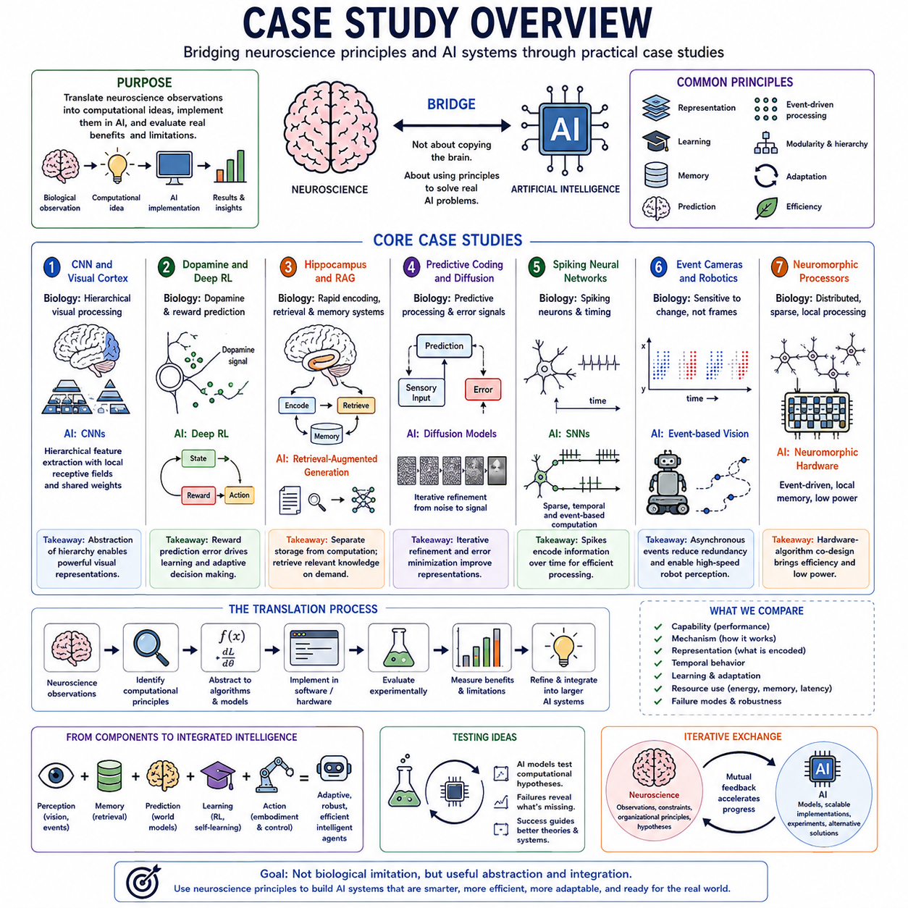
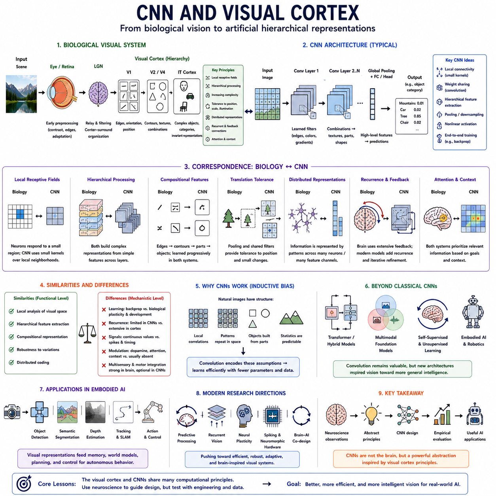
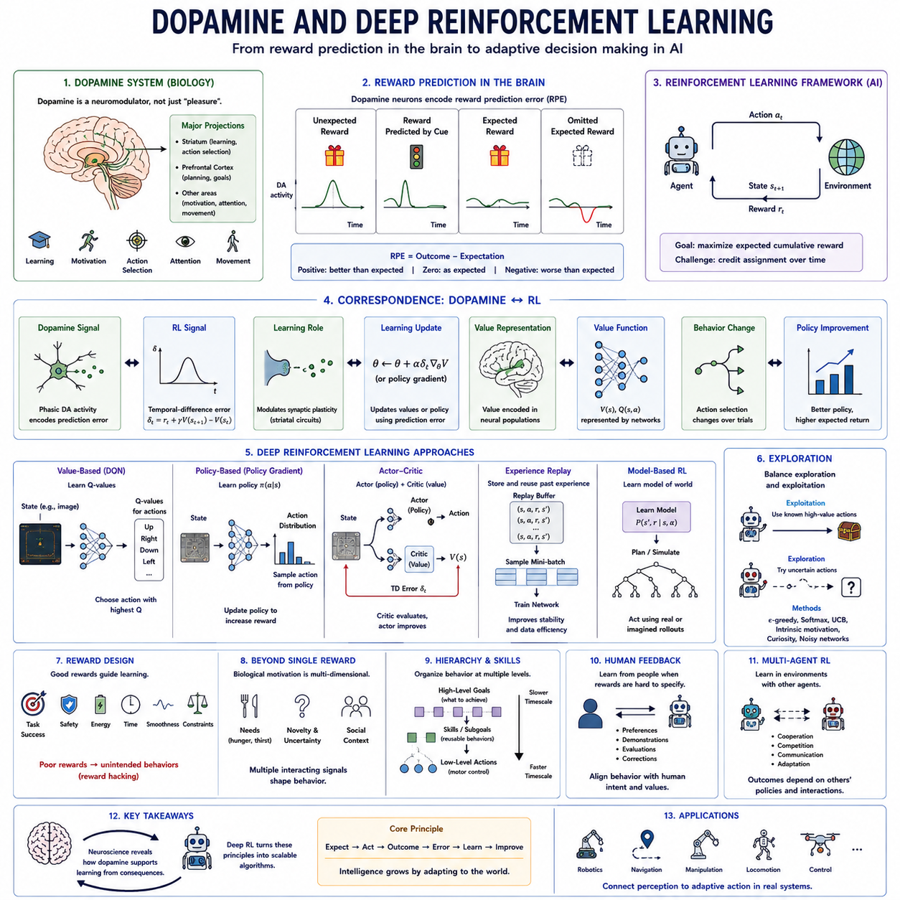
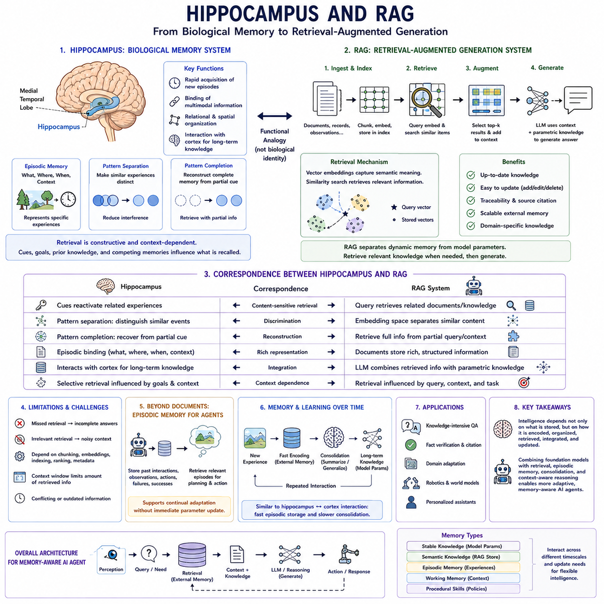
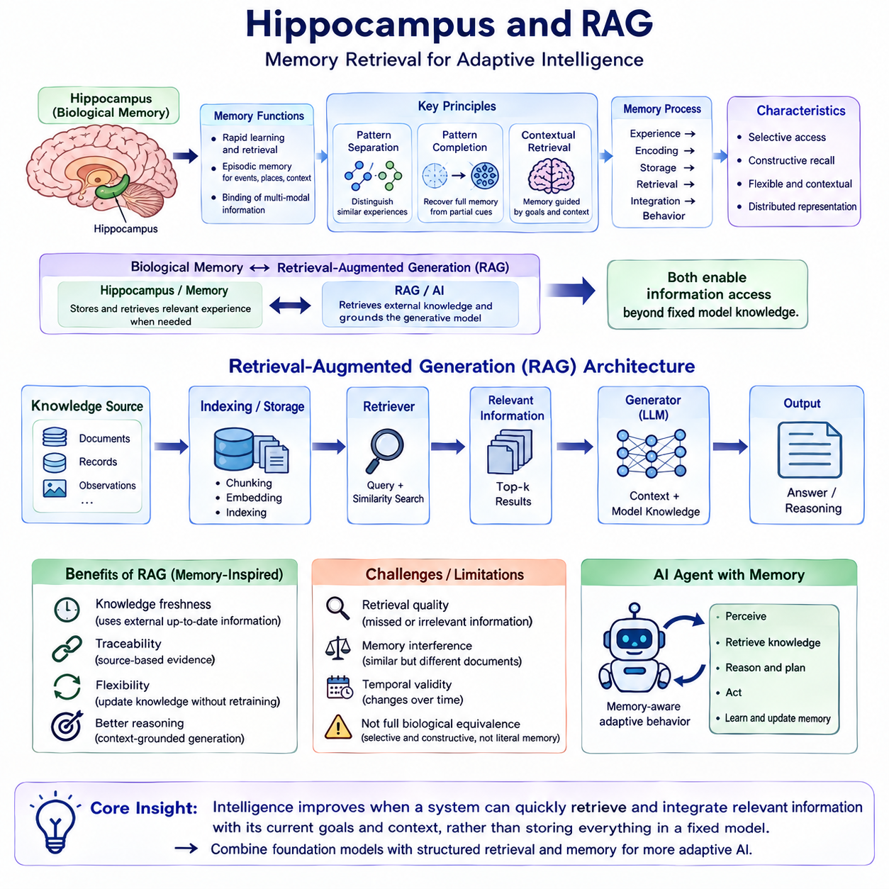
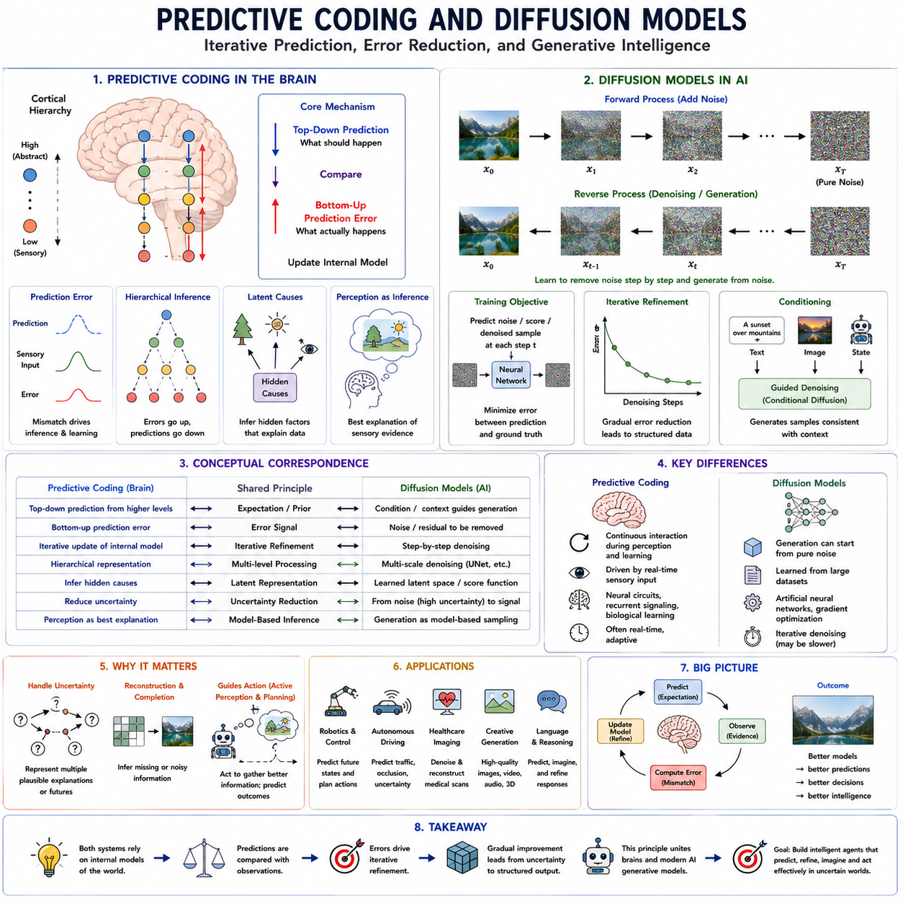
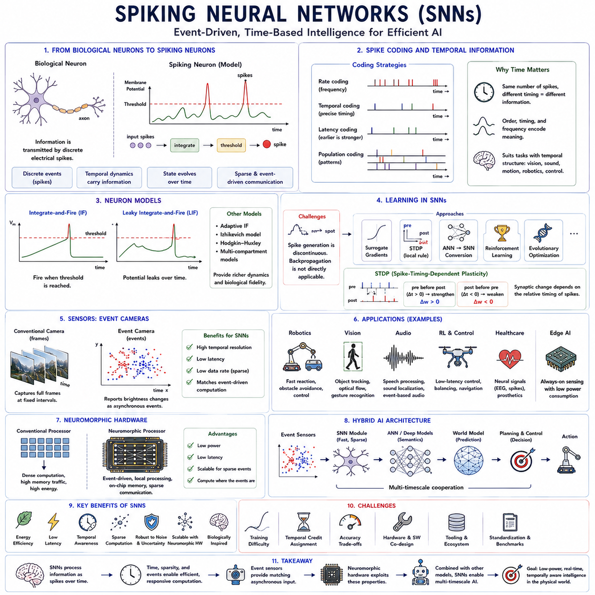
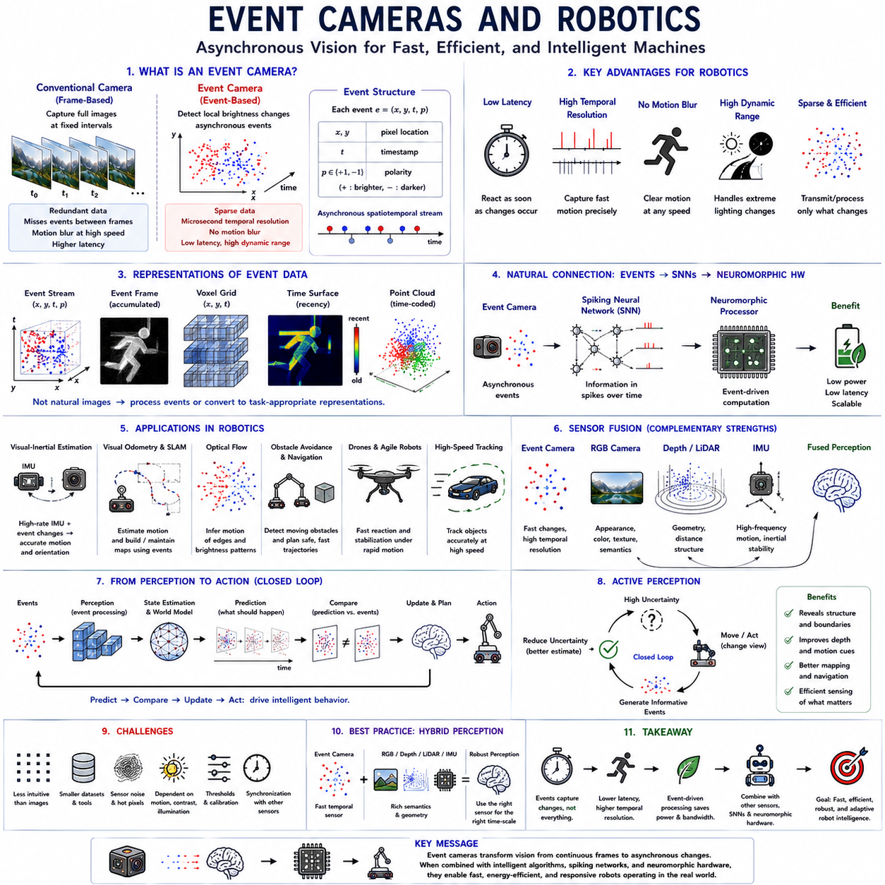
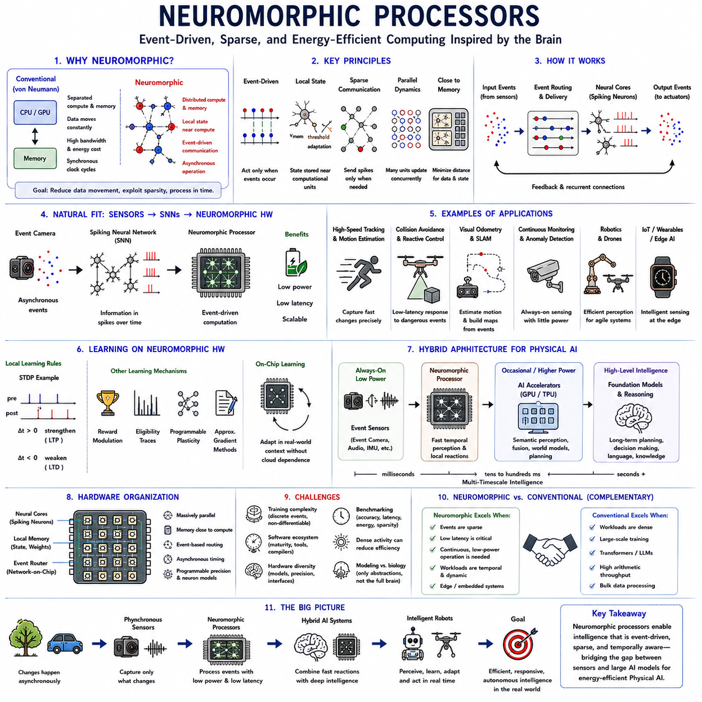

**Volume 44 Neuroscience for AI**

# Chapter 12. Case Studies

## 12.00 Case Study Overview

{width="7.268055555555556in" height="7.268055555555556in"}

Case studies provide a practical bridge between neuroscience concepts and artificial intelligence architectures. Rather than assuming that biological mechanisms should be copied directly, they examine how selected principles from perception, learning, memory, prediction, event-driven processing, and neural hardware have influenced computational systems. The chapter therefore focuses on concrete connections between biological inspiration and engineered AI.

The purpose of these case studies is not to demonstrate that modern AI reproduces the brain. Instead, each case asks a more useful question: which biological observation inspired a computational idea, how was that idea abstracted into an engineering mechanism, and what advantages or limitations emerged after implementation? This distinction separates productive neuroscience-inspired design from superficial biological analogy.

The selected cases span several levels of abstraction. Convolutional neural networks connect hierarchical visual processing with artificial feature extraction, reinforcement learning connects reward prediction with adaptive decision making, and retrieval systems provide a computational comparison with memory organization. Predictive models, spiking networks, event cameras, and neuromorphic processors extend the comparison toward temporal and hardware-level computation.

The visual cortex and convolutional neural networks form one of the best-known historical examples. Biological vision processes information through multiple stages in which neurons respond selectively to increasingly meaningful visual structure. CNNs similarly construct hierarchical feature representations using local receptive fields, shared parameters, and layered transformations, although their actual computations and learning mechanisms differ substantially from cortical processing.

This comparison demonstrates an important principle used throughout the chapter: functional inspiration does not imply mechanistic equivalence. CNNs can reproduce useful properties associated with hierarchical vision without implementing retinal circuitry, cortical cell types, biological spikes, or synaptic learning rules. The engineering value lies in identifying abstractions that solve computational problems rather than reproducing biological anatomy in unnecessary detail.

Dopamine and deep reinforcement learning provide another influential connection. Neuroscience studies associate dopaminergic activity with reward prediction and differences between expected and obtained outcomes. Reinforcement-learning algorithms use reward prediction errors to update value estimates or policies. The correspondence is computationally informative, but artificial reward signals and biological neuromodulatory systems should not be treated as identical mechanisms.

The hippocampus and retrieval-augmented generation illustrate a more conceptual comparison between biological memory and modern AI memory architectures. The hippocampus supports rapid encoding and retrieval of experiences and interacts with broader cortical memory systems. Retrieval-augmented AI similarly separates some stored information from model parameters and retrieves relevant external representations when needed, reducing the requirement that every piece of knowledge be permanently embedded in network weights.

This case highlights the importance of separating computation from storage. A large neural model can contain extensive parametric knowledge, but external or episodic memory can preserve information that is updated independently. Retrieval mechanisms then select relevant memories according to the current context. Such architectures suggest how AI systems might combine relatively stable learned representations with more flexible and dynamically accessible knowledge.

Predictive coding and diffusion models provide a more cautious comparison. Predictive processing theories emphasize iterative relationships between expectations and sensory evidence, often interpreting error signals as important drivers of representation and learning. Diffusion models also use iterative computation to transform uncertain or noisy representations into structured outputs, but their mathematical objectives and biological interpretations are fundamentally different.

The value of this comparison therefore lies at the level of computational themes rather than direct biological correspondence. Iterative refinement, uncertainty reduction, hierarchical representation, and repeated correction can appear in both neuroscience-inspired theories and generative AI. Examining where the analogy succeeds and where it breaks down helps prevent the mistaken conclusion that similar computational patterns necessarily imply identical underlying mechanisms.

Spiking neural networks move the comparison closer to neural signaling itself. Biological neurons communicate through discrete electrical events whose timing can carry information. Artificial spiking networks represent computation through event-like activations distributed over time, potentially enabling sparse and temporally structured processing. They provide a useful experimental framework for investigating alternatives to continuously activated artificial neural networks.

However, spikes alone do not provide biological intelligence. Useful spiking systems require suitable representations, learning mechanisms, network structures, temporal dynamics, and hardware support. Their advantages are particularly relevant where event-driven computation, low power consumption, continuous sensing, or precise temporal processing matters, rather than because biological resemblance automatically makes them superior to conventional deep learning.

Event cameras demonstrate how neuroscience-inspired ideas can influence sensing as well as algorithms. Conventional cameras repeatedly capture complete image frames, whereas event cameras report local brightness changes asynchronously. This resembles some principles of biological visual processing by emphasizing change rather than transmitting every pixel continuously, allowing rapid temporal response and potentially reducing redundant sensory data.

For robotics, this sensing strategy can be valuable in high-speed motion, dynamic scenes, challenging illumination, and resource-constrained systems. Event streams can support motion estimation, tracking, navigation, and rapid reaction without requiring conventional frame acquisition at extremely high rates. The case demonstrates that brain inspiration can improve the complete perception pipeline rather than only the neural network operating after sensory acquisition.

Neuromorphic processors extend these ideas into computing hardware. Conventional accelerators generally rely on dense numerical operations and substantial movement of data between memory and compute units. Neuromorphic architectures investigate event-driven communication, local memory, sparse activity, asynchronous operation, and computation located closer to stored state, attempting to reduce some costs associated with conventional computing architectures.

The relationship between spiking networks, event sensors, and neuromorphic processors is especially important because their benefits can emerge through co-design. An event camera generates sparse asynchronous data, a spiking model can process temporally structured events, and neuromorphic hardware can execute such computation efficiently. The system-level combination may therefore be more informative than evaluating each component independently.

Across all cases, the translation process follows a common pattern. Neuroscience first provides observations or hypotheses about biological computation. Researchers then identify a computational principle, abstract it into a mathematical or algorithmic mechanism, implement it using available software or hardware, and evaluate whether the resulting system provides measurable engineering benefits. Biological plausibility and engineering effectiveness remain related but distinct evaluation criteria.

Comparison should therefore include capability, mechanism, representation, temporal behavior, learning, resource requirements, and failure modes. Two systems may achieve similar performance while relying on completely different internal processes, or they may share a computational principle while producing different behavior. Case studies are most informative when they examine both similarities and differences rather than selecting only evidence that supports a preferred analogy.

These examples also reveal a progression from isolated mechanisms toward integrated intelligent systems. Visual hierarchy concerns representation, reinforcement learning concerns adaptive behavior, retrieval concerns memory, predictive processing concerns internal modeling, and neuromorphic approaches concern efficient temporal computation. Combining such mechanisms suggests architectures in which perception, memory, prediction, learning, and action cooperate rather than operating as unrelated AI components.

For embodied AI, this integration becomes particularly relevant. A robot can combine conventional visual networks with event sensors, memory retrieval, reinforcement learning, predictive world models, and resource-aware computation according to task requirements. The objective is not to maximize biological similarity but to select mechanisms that improve latency, energy efficiency, adaptation, robustness, uncertainty handling, and autonomous operation in physical environments.

Case studies also provide a method for testing neuroscience-inspired claims. A proposed biological principle becomes scientifically and technologically more useful when it can be converted into an explicit computational model and evaluated experimentally. Conversely, failures can reveal that an abstraction was incomplete, that an analogy was misleading, or that additional mechanisms are required. AI can therefore serve as an experimental testbed for computational hypotheses.

The broader lesson is that neuroscience and AI can advance through iterative exchange. Neuroscience contributes observations, constraints, organizational principles, and hypotheses, while AI provides mathematical models, scalable implementations, controlled experiments, and alternative computational solutions. The case studies defined in this chapter---CNNs, deep reinforcement learning, retrieval systems, predictive generative models, spiking networks, event cameras, and neuromorphic processors---illustrate different points along this translation pathway.

Taken together, these cases establish a practical framework for neuroscience-inspired AI without requiring literal brain replication. The central question is not whether an artificial system looks biologically realistic, but whether a neuroscience-derived principle can be abstracted, implemented, measured, and integrated usefully. This perspective prepares the transition from individual case studies toward broader practical guidelines for brain-inspired AI architecture and system design.

## 12.01 CNN and Visual Cortex [w/Code]

{width="7.268055555555556in" height="7.268055555555556in"}

The relationship between convolutional neural networks and the visual cortex is one of the clearest historical examples of neuroscience influencing artificial intelligence. CNNs were not designed as literal simulations of biological vision, but several of their central ideas reflect abstractions associated with cortical processing: local receptive fields, hierarchical feature extraction, spatial organization, and the progressive construction of complex representations from simpler visual patterns.

Biological vision begins before information reaches the cerebral cortex. Light captured by the retina is transformed through specialized neural circuits, and signals are routed through structures such as the lateral geniculate nucleus before reaching primary visual cortex. These stages perform substantial preprocessing rather than simply transmitting raw pixels, demonstrating that perception emerges from successive transformations of sensory information.

The primary visual cortex, commonly called V1, contains neurons that respond selectively to properties within restricted regions of visual space. Classical experiments revealed sensitivity to features such as edge orientation, spatial position, and local contrast. This organization introduced the influential idea that complex visual recognition can begin with populations of relatively specialized units responding to simple local structures.

A receptive field describes the region of sensory space capable of influencing the activity of a neuron. Nearby visual neurons may possess overlapping receptive fields, allowing many local measurements to collectively represent a scene. CNNs abstract this principle through convolutional kernels that operate over small spatial neighborhoods rather than connecting every image location independently to every feature detector.

Convolution adds an important engineering abstraction: the same learned filter can be applied across many spatial locations. This parameter sharing allows a feature detector learned in one part of an image to detect similar structure elsewhere. Biological visual processing does not implement mathematical convolution in precisely this form, but spatially repeated local processing provided an important conceptual foundation for efficient artificial visual architectures.

Early CNN layers typically learn relatively simple structures such as oriented edges, gradients, corners, and texture-like patterns. Deeper layers combine these responses into increasingly complex representations. Intermediate features can encode contours, motifs, textures, and object components, while later representations may become selective for structures strongly associated with object categories or task-relevant visual concepts.

This progression resembles the broad hierarchy of the ventral visual pathway. Information proceeds from early visual areas toward regions such as V2 and V4 and eventually into inferior temporal cortex, where neural responses can represent increasingly complex visual structures. The correspondence is approximate rather than one-to-one, but both systems illustrate how layered processing can progressively transform local sensory signals into more abstract representations.

Increasing receptive-field size is an important consequence of hierarchical processing. Although an early artificial neuron may depend on only a small image patch, deeper neurons indirectly receive information from increasingly large portions of the original image. This enables higher layers to integrate spatially separated features and represent relationships that cannot be recognized from isolated local measurements alone.

Pooling and related downsampling operations historically provided another important component of CNN architectures. By summarizing responses within neighborhoods, these operations reduce spatial resolution while preserving important feature information. The resulting representations can become less sensitive to small changes in feature position, supporting a degree of translation tolerance while simultaneously reducing computational and memory requirements.

Biological vision similarly demonstrates substantial tolerance to changes in position, scale, illumination, and viewpoint. Humans can recognize an object despite large variations in its retinal appearance. CNNs approximate portions of this capability through convolution, pooling, learned hierarchical representations, augmentation, and increasingly sophisticated architectural mechanisms, although robust invariance remains more complex than any single architectural operation.

The distinction between feature detection and feature integration is central to both perspectives. An isolated edge provides little information about object identity, but combinations of edges can form contours, contours can form shapes, and shapes can participate in object representations. Hierarchical composition therefore allows relatively simple computational operations to produce increasingly meaningful visual descriptions.

CNN feature maps also illustrate distributed representation. A visual concept is usually not stored in one artificial neuron corresponding to one human-interpretable category. Instead, information is distributed across activation patterns involving many channels and spatial positions. Biological visual representations likewise involve populations of neurons whose combined activity carries richer information than individual responses considered in isolation.

The success of CNNs also demonstrates why architectural inductive bias matters. Images possess strong spatial structure: neighboring pixels are related, visual patterns can recur across locations, and complex objects are constructed from local components. Convolution encodes assumptions compatible with this structure, allowing the model to learn visual representations more efficiently than architectures that initially treat every image location as completely unrelated.

Training nevertheless marks a major difference between conventional CNNs and biological visual systems. CNNs are commonly optimized using backpropagation and large labeled or self-supervised datasets, whereas biological learning involves interacting mechanisms including synaptic plasticity, development, recurrent activity, attention, multisensory experience, action, and neuromodulation. Similarities in architecture should therefore not be interpreted as evidence that the learning mechanisms are equivalent.

Another major difference concerns recurrence and feedback. A conventional feedforward CNN processes information sequentially from earlier layers toward later layers, but the visual cortex contains extensive lateral, recurrent, and top-down connections. Higher cortical regions can influence earlier processing, allowing expectations, attention, memory, task context, and previous interpretations to modify the processing of incoming sensory evidence.

This observation motivates recurrent and feedback-based extensions of artificial vision. Instead of producing a final interpretation in a single forward pass, a system can iteratively refine representations using contextual information or predictions from higher levels. Such architectures may be particularly useful when sensory evidence is ambiguous, partially occluded, noisy, or dependent on relationships that require repeated integration.

Attention provides another extension beyond the classical CNN analogy. Biological vision selectively allocates processing resources according to behavioral relevance rather than treating every visible location equally. Modern artificial vision similarly incorporates spatial, channel-wise, and feature-based attention mechanisms that dynamically emphasize information useful for the current task, supplementing the fixed local processing characteristic of convolution.

The visual system also separates partially distinct computational pathways. The ventral pathway is strongly associated with identifying what objects are, while dorsal processing contributes to spatial relationships, motion, visually guided action, and understanding where or how interaction should occur. This distinction is particularly relevant to robotics, where recognizing an object is insufficient without estimating its location, motion, geometry, and action possibilities.

For embodied AI, CNN-derived visual representations can therefore participate in a much larger perception-action architecture. Feature extraction may support object detection, semantic segmentation, depth estimation, tracking, localization, manipulation, and navigation. These representations can then interact with memory, world models, planning, and control, transforming visual recognition from an isolated classification problem into a component of autonomous behavior.

Modern computer vision has expanded beyond classical CNNs through vision transformers, hybrid architectures, multimodal foundation models, and self-supervised representation learning. Nevertheless, convolution remains important because locality, hierarchy, spatial reuse, and compositional feature construction continue to be useful computational principles. The historical connection to visual neuroscience therefore extends beyond any particular CNN architecture.

The case study ultimately demonstrates how neuroscience can contribute to AI without requiring direct biological replication. Observations about receptive fields and hierarchical visual processing inspired abstractions that became local connectivity, convolution, shared parameters, layered feature extraction, and increasingly complex representations. Engineering transformed these principles into scalable computational mechanisms whose usefulness could be evaluated independently of exact biological fidelity.

The broader lesson is methodological. Neuroscience can identify organizational principles, computational constraints, and recurring strategies, while AI can formalize selected principles and test them at scale. CNNs and the visual cortex show how a carefully chosen abstraction from biology can become a powerful engineering idea, while also demonstrating why functional inspiration must remain clearly separated from claims of mechanistic equivalence.

## 12.02 Dopamine and Deep RL [w/Code]

{width="7.268055555555556in" height="7.268055555555556in"}

Dopamine provides one of the most influential connections between neuroscience and reinforcement learning. Studies of dopaminergic systems show that neural responses can reflect differences between expected and obtained outcomes, while reinforcement learning uses related computational quantities to update predictions and behavior. This correspondence helped establish reward prediction error as a bridge between biological learning and artificial adaptive decision making.

Dopamine is a neuromodulator rather than a simple chemical representation of pleasure or reward. Dopaminergic neurons project from midbrain structures to regions including the striatum and prefrontal cortex, influencing learning, motivation, movement, attention, and action selection. Consequently, describing dopamine only as a reward signal oversimplifies a system whose effects depend on neural circuits, behavioral context, timing, and internal state.

A central finding concerns reward prediction. When an unexpected rewarding outcome occurs, some dopamine neurons show increased activity. As learning progresses and a predictive cue reliably precedes that reward, the response can shift toward the cue. If an expected reward fails to occur, activity can decrease around the expected time. This pattern suggests that learning depends strongly on deviations from expectation rather than reward magnitude alone.

This deviation is commonly described as reward prediction error. A positive error indicates that an outcome is better than expected, an error near zero indicates that the outcome approximately matches expectation, and a negative error indicates that the result is worse than expected. Prediction errors provide a directional learning signal: expectations should increase after unexpectedly favorable outcomes and decrease after unexpectedly unfavorable ones.

Reinforcement learning formalizes a related problem through interaction between an agent and an environment. At each step, the agent observes a state, selects an action according to a policy, receives a reward, and reaches a subsequent state. The objective is generally to learn behavior that maximizes expected cumulative reward rather than simply selecting whichever action produces the largest immediate reward.

This distinction introduces the problem of temporal credit assignment. An action may have little immediate benefit yet produce important consequences much later. Reinforcement-learning systems therefore use value functions to estimate expected future returns. A state-value function estimates the long-term desirability of a state, while an action-value function estimates the expected return associated with taking a particular action in a particular state.

Temporal-difference learning provides a particularly important computational connection with dopamine. Instead of waiting until an entire sequence finishes, TD methods update current predictions using the difference between successive estimates. A typical TD error compares the current value estimate with immediate reward plus the discounted estimate of the next state, allowing learning to proceed incrementally as experience unfolds.

The similarity between dopaminergic reward prediction signals and temporal-difference error became influential because both can be interpreted as signals for updating expectations. Better-than-expected outcomes support increases in predicted value, while worse-than-expected outcomes support decreases. However, this should be treated as a functional correspondence rather than evidence that the biological dopamine system literally implements one specific reinforcement-learning equation.

Deep reinforcement learning extends these ideas by replacing tables or simple function approximators with neural networks. High-dimensional observations such as images, sensor streams, proprioceptive states, or complex environment descriptions can be transformed into value estimates, policies, or both. Deep networks therefore allow reinforcement learning to operate in state spaces where explicitly storing a value for every possible situation would be impractical.

Value-based deep RL learns estimates such as Q-values that describe the expected return from state-action combinations. The agent can use these estimates to favor actions associated with higher predicted long-term value. Deep Q-learning combines this principle with neural representation learning, allowing raw or high-dimensional observations to influence decisions without requiring a manually constructed table for every state and action.

Policy-based methods take a different approach by directly parameterizing the policy that generates actions. Instead of deriving behavior only from estimated action values, policy-gradient methods adjust policy parameters in directions expected to improve cumulative reward. This approach is useful when actions are continuous, stochastic behavior is desirable, or directly representing the action distribution is more practical than maximizing over explicit action values.

Actor-critic architectures combine these perspectives. The actor represents the policy and selects actions, while the critic estimates value and evaluates the consequences of behavior. Prediction errors produced by the critic can guide updates to both components. This separation loosely resembles the broader biological distinction between evaluating outcomes and modifying action tendencies, although biological neural circuits are considerably more interconnected and complex.

Exploration creates another important connection between biological and artificial learning. An agent that always selects its currently preferred action may never discover better alternatives. Reinforcement learning therefore requires a balance between exploitation of known high-value behavior and exploration of uncertain possibilities. Biological behavior similarly reflects interactions among reward, novelty, uncertainty, motivation, and information seeking rather than reward maximization alone.

Experience replay improves deep RL by storing previous transitions and reusing them during training. Sampling past experiences can reduce correlations between consecutive observations and improve data efficiency. From a neuroscience perspective, replay has an interesting conceptual relationship with memory reactivation, but artificial replay buffers and biological memory replay should not be considered equivalent mechanisms simply because both revisit previous experience.

Model-based reinforcement learning adds predictive internal models of environmental dynamics and rewards. Instead of learning only from actions actually executed, an agent can estimate how candidate actions may change future states and use those predictions for planning. This connects reinforcement learning with world models, allowing imagined or simulated trajectories to supplement direct trial-and-error experience and potentially improve learning efficiency.

Reward design becomes especially important when reinforcement learning moves from games or simulations into real systems. A poorly specified reward can produce behavior that technically maximizes the numerical objective while violating the designer\'s actual intention. Useful rewards may need to incorporate task success, safety, energy, time, smoothness, risk, constraint satisfaction, and other factors without creating unintended optimization shortcuts.

Biological motivation demonstrates why a single scalar reward is often an incomplete description of intelligent behavior. Organisms respond to multiple interacting signals related to physiological needs, novelty, uncertainty, social context, threat, effort, and long-term goals. Dopamine itself participates in functions beyond simple reward prediction. Realistic artificial agents may therefore require richer objectives and internal regulatory mechanisms rather than one fixed reward channel.

For embodied AI and robotics, deep RL can connect perception directly with adaptive action. A robot can learn navigation, manipulation, locomotion, coordination, or control policies from interaction. Yet physical exploration is expensive and potentially dangerous, making simulation, offline datasets, demonstrations, model-based prediction, constraints, and safe fallback controllers important complements to unrestricted online trial-and-error learning.

Hierarchical reinforcement learning can improve this process by organizing behavior across different levels of abstraction. Higher levels can select goals or reusable skills, while lower levels translate those choices into detailed actions. Such organization resembles the broader hierarchical character of biological behavior, where strategic objectives, action sequences, and rapid motor control operate at different temporal and representational scales.

Human feedback can further supplement predefined reward functions. Preferences, demonstrations, evaluations, or corrections can provide information about desirable behavior when manually specifying a complete objective is difficult. This extends reinforcement learning from simple environmental rewards toward learning systems that infer or refine objectives through interaction with people, although human feedback introduces its own uncertainty and bias.

Multi-agent reinforcement learning expands the framework to environments containing multiple decision-making systems. Agents may cooperate, compete, communicate, or adapt to one another, causing the effective environment to change as other policies evolve. This creates challenges that resemble social and interactive learning, where outcomes depend not only on physical dynamics but also on predictions about the behavior of other agents.

The neuroscience-to-AI comparison must therefore remain carefully bounded. Dopamine influences many biological functions through complex neuromodulatory circuits, whereas artificial reinforcement learning typically uses simplified mathematical objects such as rewards, value functions, policies, and update rules. The scientific importance of the comparison lies in shared computational principles---prediction, error-driven updating, valuation, and adaptation---not literal equivalence.

Taken together, dopamine research and deep reinforcement learning illustrate how intelligence can improve through consequences. Experience creates expectations, actions generate outcomes, prediction errors reveal discrepancies, and learning modifies future values and policies. Deep RL transforms this principle into scalable algorithms, while neuroscience reminds AI research that adaptive behavior also depends on memory, context, motivation, uncertainty, exploration, and interacting learning systems.

## 12.03 Hippocampus and RAG [w/Code]

{width="7.268055555555556in" height="7.268055555555556in"}

{width="7.268055555555556in" height="7.268055555555556in"}

The hippocampus and retrieval-augmented generation provide a useful case study for understanding how memory can be separated from core computation. The hippocampus supports rapid acquisition and retrieval of experiences, while RAG systems allow AI models to retrieve information from external stores when needed. The comparison is functional rather than biological: both illustrate the value of dynamically accessing relevant information instead of encoding everything within one fixed computational structure.

Human memory is distributed across interacting neural systems rather than stored in a single location. The hippocampus, located within the medial temporal lobe, plays a particularly important role in forming new episodic memories and organizing relationships among events, places, objects, and contexts. It interacts extensively with cortical regions, allowing newly acquired experiences to become connected with broader and more persistent knowledge representations.

Episodic memory allows an organism to retain information about specific experiences, including what occurred, where it happened, and the context surrounding the event. Such memories differ from generalized semantic knowledge because they preserve relationships associated with particular episodes. The hippocampus contributes to binding these distributed elements into representations that can later be reactivated when relevant cues or related situations are encountered.

This binding function is important because experiences contain multiple modalities and relationships. A single event may include visual information, sounds, spatial position, actions, goals, emotional significance, and temporal order. Rather than treating these elements independently, hippocampal mechanisms can associate them into structured representations. Retrieval can subsequently use partial cues to reactivate broader patterns associated with the original experience.

Pattern separation and pattern completion describe two useful computational ideas associated with hippocampal memory. Pattern separation helps distinguish similar experiences so that overlapping events do not become indistinguishable, while pattern completion allows a partial cue to recover a more complete stored representation. Together, these mechanisms illustrate how memory systems can balance discrimination between experiences with reconstruction from incomplete information.

Memory retrieval is therefore not simply equivalent to reading an exact record from storage. Current context, goals, cues, prior knowledge, and competing memories can influence which representation becomes accessible. Retrieval is selective and constructive, allowing information from previous experiences to participate in current reasoning and behavior. This principle provides an important conceptual connection to retrieval-based artificial intelligence systems.

Retrieval-augmented generation separates part of an AI system\'s accessible knowledge from the parameters of its generative model. Instead of requiring all information to be encoded during model training, documents, records, observations, or other knowledge can be maintained in an external repository. When a query arrives, the system retrieves relevant information and supplies it as context to the generative model before producing a response.

A typical RAG architecture therefore contains several interacting stages. Source information is divided into retrievable units, transformed into representations suitable for search, and stored in an index or database. A user query is similarly represented and compared with stored information. Relevant items are selected, inserted into the model\'s context, and used together with the model\'s parametric knowledge to generate an output.

Vector embeddings provide one common mechanism for retrieval. Text, images, or other information can be transformed into high-dimensional representations in which semantically related content tends to occupy related regions. Retrieval can then identify stored representations that are similar to the current query. This enables access based on semantic relationships rather than requiring exact keyword correspondence between the query and stored information.

The comparison with hippocampal retrieval becomes especially interesting at this point. A partial or context-dependent cue can lead biological memory toward associated experiences, while a query representation can guide an artificial retrieval system toward relevant stored information. Both cases emphasize content-sensitive access, but vector similarity search should not be interpreted as a direct computational model of hippocampal memory.

RAG also demonstrates the value of separating relatively stable parametric knowledge from dynamically updateable memory. Updating the factual contents of a neural model can require additional training, whereas an external knowledge store can often be modified without changing the model parameters. New documents can be added, obsolete information removed, and domain-specific knowledge reorganized while preserving the underlying generative model.

This separation can improve knowledge freshness. A pretrained model reflects information available during its training process, but an external retrieval system can contain more recent or application-specific material. Retrieval therefore allows the model to access information that was unavailable during pretraining. For practical AI systems, this reduces the need to repeatedly retrain a large model whenever the external knowledge environment changes.

External retrieval can also improve traceability. When generated content depends on retrieved documents, the system can preserve information about which sources contributed to the response. This does not guarantee correctness, because retrieval and generation can still fail, but it creates a stronger connection between generated claims and explicit evidence than relying exclusively on knowledge implicitly encoded in model parameters.

The hippocampal analogy also highlights the distinction between storage and reasoning. Remembering relevant experience does not by itself determine what action should be taken, just as retrieving documents does not automatically produce a correct answer. Retrieved information must be integrated with current goals, context, prior knowledge, reasoning, and decision processes. Memory becomes useful when it participates effectively in a broader cognitive architecture.

Retrieval quality is consequently a critical limitation of RAG. If relevant information is not retrieved, the generative model may respond using incomplete evidence. If irrelevant information is retrieved, it can distract the model or introduce errors. Retrieval performance depends on document segmentation, representations, indexing, query formulation, ranking, metadata, context-window constraints, and the quality of the underlying knowledge source.

Memory interference provides another useful conceptual comparison. Biological memories can compete during retrieval, particularly when experiences share similar cues. Artificial retrieval systems can likewise return multiple semantically similar but contextually different documents. Effective systems therefore require mechanisms for ranking, filtering, reranking, contextual discrimination, or combining evidence so that similarity alone does not determine what information influences the final response.

Temporal information is particularly important for dynamic memory. Two documents may describe the same entity accurately at different times but contain conflicting facts because the world has changed. A retrieval system should therefore consider timestamps, versioning, provenance, and validity when appropriate. Biological memory similarly exists within temporal context, although the mechanisms by which humans represent and reconstruct temporal relationships are much richer than database metadata.

For AI agents, retrieval can extend beyond factual documents into episodic memory. An autonomous agent may store previous interactions, observations, decisions, failures, successful plans, and environmental states. When encountering a related situation, it can retrieve relevant episodes and use them to guide planning or action. This creates a closer functional analogy with experience-based memory than conventional document retrieval alone.

Such agent memory can support continual adaptation without requiring every new experience to modify neural parameters immediately. Important events can first be stored externally and retrieved when relevant. Later processes may summarize, consolidate, generalize, or selectively incorporate repeated patterns into more persistent knowledge. This suggests a computational distinction between rapid episodic storage and slower long-term learning.

The idea resembles, at a highly abstract level, interactions between hippocampal and cortical memory systems. The hippocampus supports rapid learning of particular experiences, while longer-term cortical representations can develop through repeated interaction and consolidation. Artificial systems could similarly combine fast external memory with slower parameter updates, allowing rapid knowledge acquisition while reducing continual modification of a large foundation model.

World models can benefit from this architecture as well. A robot or embodied agent may retrieve previous observations of locations, objects, people, task outcomes, or environmental conditions when constructing predictions about the current situation. Memory retrieval can provide contextual evidence that is absent from immediate sensor data, while the world model can use that evidence to predict future states and evaluate candidate actions.

However, the hippocampus-RAG analogy has clear limits. The hippocampus participates in spatial cognition, relational representation, episodic memory, navigation, imagination, and interactions with many other neural systems. RAG is an engineered architecture that typically combines information retrieval with a generative model. Similarities in selective retrieval and externalized memory organization do not establish mechanistic equivalence between the two systems.

The broader lesson is that intelligent systems do not need to place every form of knowledge inside one monolithic parameter set. Memory can be structured according to different functions, timescales, and update requirements. Stable learned representations, external semantic knowledge, episodic experiences, working context, and procedural skills can interact while remaining partially distinct, creating a more flexible architecture for learning and reasoning.

The hippocampus and RAG therefore illustrate a general neuroscience-inspired principle: intelligence depends not only on how much information a system stores, but on how effectively it encodes, organizes, retrieves, integrates, and updates relevant experience. For future AI agents, combining foundation models with structured retrieval, episodic memory, consolidation, world models, and context-sensitive reasoning may provide a practical path toward more adaptive and memory-aware intelligence.

## 12.04 Predictive Coding and Diffusion [w/Code]

{width="7.268055555555556in" height="7.268055555555556in"}

Predictive coding and diffusion models provide an instructive case study in how a broad computational principle can appear in both neuroscience and modern generative AI without implying direct mechanistic equivalence. Predictive coding describes perception in terms of predictions, sensory evidence, and prediction errors, while diffusion models generate structured data through repeated denoising. Their connection is best understood through iterative refinement and error reduction.

Predictive coding proposes that perception is not simply a bottom-up process in which sensory information travels through successive neural stages until an interpretation appears. Instead, higher levels of a processing hierarchy generate expectations about lower-level activity. Incoming sensory evidence is compared with these predictions, and discrepancies provide information that can be used to revise internal representations.

This creates a recurrent interaction between top-down prediction and bottom-up evidence. Higher levels communicate what should be observed according to the current internal model, while lower levels communicate information about mismatches between predictions and observations. Perception can therefore be interpreted as an iterative process in which internal hypotheses are repeatedly tested and refined against sensory input.

Prediction error is central to this framework. If an internal model accurately predicts incoming information, relatively little discrepancy remains to drive further revision. Unexpected observations create larger errors and indicate that the current representation does not adequately explain the sensory evidence. Error signals can consequently guide inference and learning toward representations that better capture regularities in the environment.

Hierarchical organization makes this process particularly powerful. Lower levels may represent relatively local or rapidly changing sensory properties, while higher levels can encode increasingly abstract causes, objects, contexts, or expectations. Predictions propagate downward through the hierarchy, while information related to prediction errors propagates upward, allowing representations at multiple levels to constrain one another through repeated interaction.

The concept of latent causes provides another important element. Sensory observations often result from hidden factors that cannot be directly observed, such as object identity, illumination, physical structure, intention, or environmental dynamics. A predictive system can infer internal latent representations that explain observed data and then use those representations to generate expectations about what should be perceived under particular conditions.

Generative models address a related computational problem by learning statistical structure that allows them to reconstruct, predict, transform, or generate data. Rather than learning only a boundary between predefined categories, a generative model attempts to capture aspects of how observations are distributed or produced. This capability makes generation and inference closely related: a model that captures structure can use it both to explain existing observations and to create plausible new ones.

Different generative architectures implement this principle differently. Autoencoders reconstruct inputs through compressed representations, variational autoencoders introduce probabilistic latent variables, and autoregressive models generate sequences through repeated conditional prediction. Diffusion models provide another approach by learning how to transform progressively corrupted data back toward structured samples through a sequence of denoising operations.

A diffusion model begins conceptually with a forward process in which noise is gradually added to data over multiple steps. As corruption increases, recognizable structure is progressively destroyed until the representation approaches a simple noise distribution. This forward process provides a controlled sequence connecting structured data with increasingly uncertain or noisy states.

Learning focuses on the reverse direction. The model is trained to estimate information required to remove corruption at different noise levels. During generation, it begins from noise and repeatedly applies learned denoising transformations. Each step produces a somewhat more structured representation, and after many iterations the process can produce a coherent sample consistent with the learned data distribution.

The repeated refinement characteristic of diffusion provides the strongest conceptual connection with predictive coding. Neither framework requires a complete solution to emerge in a single computational step. Instead, an imperfect state is progressively modified using information about what is inconsistent with the learned structure. The shared theme is iterative correction, although the mathematical quantities and biological interpretations involved are substantially different.

Prediction error and diffusion error should therefore not be treated as identical. Predictive coding theories describe discrepancies between internally generated expectations and sensory activity within a proposed model of neural processing. Diffusion objectives typically train artificial networks to estimate noise, denoised samples, scores, or related mathematical quantities. Similarity at the level of error-guided refinement does not establish equality between the underlying algorithms.

The direction of computation also differs. Predictive coding is commonly discussed as continuous interaction between sensory evidence and internal expectations during perception and learning. Diffusion generation can begin without an external sensory observation and progressively construct a sample from noise. Conditional diffusion can nevertheless incorporate text, images, states, or other contextual information that constrains the iterative generation process.

Conditioning demonstrates how prior information can influence generation. A text description, image, class label, sensor state, or other representation can guide the denoising trajectory toward outputs compatible with that context. At an abstract level, this resembles the role of higher-level expectations in constraining lower-level interpretations, although the implementation in artificial diffusion networks is an engineered probabilistic computation rather than cortical feedback.

Uncertainty provides another important connection. Ambiguous sensory evidence may support multiple possible interpretations, and generative models can represent distributions containing multiple plausible outcomes. Diffusion models can generate different samples from different initial noise states while respecting the same conditioning information. This property is valuable when the future or hidden state cannot be represented adequately by a single deterministic prediction.

For world models, such uncertainty is especially important. An intelligent agent may need to predict several possible future states rather than one supposedly certain future. Generative predictive models can represent alternative trajectories conditioned on current observations and candidate actions. These imagined futures can then support planning, risk estimation, exploration, and decision making before actions are executed in the physical environment.

Diffusion can also support reconstruction and completion. When sensory data are incomplete, corrupted, or noisy, learned generative structure can constrain plausible restorations. This capability connects naturally with the broader predictive idea that internal models help interpret uncertain observations. The system does not merely copy available input; it uses learned regularities to infer structures that are compatible with both observed evidence and prior knowledge.

For robotics, this principle can operate across multiple modalities. A predictive model may estimate future camera observations, depth, trajectories, object motion, robot states, or action consequences. Generative models can represent several plausible futures when environmental dynamics are uncertain. The resulting predictions can support planning by allowing the robot to evaluate possible consequences before committing to physical actions.

This creates an important connection with active perception. An agent does not have to remain a passive recipient of uncertain sensory evidence. If several interpretations remain plausible, it can move a camera, change viewpoint, manipulate an object, or navigate toward a location that provides more informative observations. Prediction and action can therefore form a closed loop in which uncertainty influences behavior and new observations refine internal models.

Predictive coding also emphasizes that context and prior knowledge influence perception. Identical sensory evidence may be interpreted differently depending on expectations, goals, or surrounding information. Modern conditional generative systems similarly combine observed information with contextual representations. However, these functional similarities should be used to identify useful design principles rather than to claim that artificial generative models reproduce biological perception.

Training mechanisms provide another major distinction. Modern diffusion models are generally optimized through large-scale gradient-based learning using artificial neural networks and extensive datasets. Biological predictive processing, if predictive-coding accounts are correct, would operate through neural circuits, recurrent signaling, synaptic plasticity, and biological dynamics. The two systems therefore differ substantially in substrate, learning rules, representations, and temporal organization.

Computational cost is also an important engineering consideration. Iterative denoising can require many neural-network evaluations, making diffusion generation slower than methods that produce outputs in one or a few passes. Research therefore explores faster samplers, reduced-step methods, latent diffusion, distillation, and alternative generative processes. Iterative refinement provides expressive power, but the number and cost of iterations matter greatly for real-time systems.

For embodied AI, latency constraints make this tradeoff particularly important. High-quality generative prediction may be useful for strategic planning over longer horizons, while rapid control loops require much faster responses. A practical architecture may therefore combine slower generative world-model reasoning with fast perception and control mechanisms operating at higher frequencies, creating a hierarchy of computational timescales.

The comparison ultimately reveals a broader principle shared by predictive and generative intelligence. Internal models capture regularities behind observations; predictions expose where those models succeed or fail; discrepancies provide information for refinement; and improved models support reconstruction, generation, forecasting, planning, and action. This progression connects predictive processing with a wider family of modern generative approaches.

Predictive coding and diffusion should therefore be viewed as conceptually related but mechanistically distinct frameworks. Their most useful correspondence lies in repeated inference, model-based expectation, uncertainty reduction, and iterative correction rather than literal algorithmic similarity. For future AI agents, these principles suggest systems that continuously predict, compare, refine, imagine alternatives, and use internal generative models to guide intelligent action in uncertain environments.

## 12.05 Spiking Neural Networks [w/Code]

{width="7.268055555555556in" height="7.268055555555556in"}

Spiking neural networks represent an approach to artificial intelligence that models computation through discrete events called spikes rather than continuously valued activations. They are inspired by the event-driven signaling of biological neurons, where information is transmitted through electrical impulses occurring over time. This makes temporal dynamics an explicit part of computation and distinguishes SNNs from conventional artificial neural networks.

In a conventional neural network, neurons usually receive numerical inputs, calculate weighted sums, apply activation functions, and transmit continuous-valued outputs to subsequent layers. A spiking neuron instead maintains an internal state that evolves over time. Incoming spikes modify this state, and when its membrane-like potential reaches a threshold, the neuron emits a spike and subsequently resets or modifies its internal dynamics.

This temporal behavior means that an SNN cannot generally be understood only from instantaneous activation values. The timing, frequency, and sequence of spikes may all carry information. Two neurons producing the same number of spikes can represent different temporal patterns if those spikes occur at different moments. Computation therefore depends simultaneously on network connectivity, neural state, and the temporal organization of events.

The integrate-and-fire neuron provides one of the simplest abstractions for spiking computation. Incoming signals accumulate within an internal membrane potential until a threshold is reached, after which a spike is emitted. The leaky integrate-and-fire model extends this principle by allowing accumulated potential to decay over time, representing the idea that earlier inputs gradually lose influence unless reinforced by subsequent activity.

These dynamics provide SNNs with an intrinsic form of temporal memory. A neuron\'s current response depends not only on the present input but also on signals received during preceding moments. This property makes spiking computation naturally relevant to temporally structured problems such as sensory streams, motion, auditory signals, robotic interaction, and other tasks in which the order and timing of events contain useful information.

Information can be represented in SNNs using several coding strategies. Rate coding represents information through the number or frequency of spikes within a time interval, while temporal coding uses precise spike timing. Other approaches rely on latency, population activity, relative timing, or combinations of these mechanisms. The appropriate representation depends strongly on the task, sensor characteristics, learning algorithm, and computing hardware.

Sparse activity is another important characteristic of many spiking systems. A neuron does not necessarily perform an output-producing operation at every computational step; instead, significant communication can occur only when a spike is generated. If activity remains sufficiently sparse, event-driven processing can avoid some unnecessary computation and data movement associated with repeatedly updating every unit in a dense artificial neural network.

This property creates an important connection between SNNs and energy-efficient computing. Conventional accelerators frequently perform large numbers of multiply-accumulate operations even when much of the represented information changes slowly. Event-driven architectures can instead concentrate computational resources on changes and significant events. The potential efficiency advantage, however, depends on the complete algorithm-hardware system rather than on spikes alone.

Learning in spiking networks presents substantial challenges because spike generation is typically discontinuous. Standard backpropagation assumes differentiable operations, whereas a threshold-triggered spike does not provide an ordinary smooth derivative. Researchers therefore use approaches such as surrogate gradients, local plasticity rules, conversion from trained conventional networks, evolutionary optimization, and other methods designed specifically for temporal and event-driven computation.

Spike-timing-dependent plasticity provides a biologically inspired example of a local learning rule. In simplified STDP models, changes in synaptic strength depend on the relative timing between presynaptic and postsynaptic spikes. Connections can be strengthened or weakened according to temporal relationships between events. This illustrates how learning can potentially emerge from locally available timing information rather than from a globally calculated error signal.

Nevertheless, STDP should not be interpreted as a complete replacement for modern deep-learning optimization. Complex tasks require mechanisms capable of assigning credit across large networks, long temporal intervals, and multiple processing stages. Practical SNN research therefore explores combinations of local plasticity, global objectives, surrogate-gradient learning, reinforcement signals, and architectural constraints rather than assuming that one biological learning rule solves every optimization problem.

Artificial neural network to SNN conversion offers another practical strategy. A conventional network can first be trained using mature deep-learning methods and then transformed into a spiking representation. Activation magnitudes may be approximated through spike rates or temporal patterns. This approach can preserve useful learned representations while enabling deployment on event-driven hardware, although conversion can introduce latency, accuracy, and calibration tradeoffs.

Direct training provides greater opportunity to exploit temporal spike structure. Instead of treating spikes primarily as an alternative representation of conventional activations, directly trained SNNs can learn from event sequences and internal dynamics. This becomes particularly attractive when input sensors already generate asynchronous events, because temporal information can flow through the system without first being converted into conventional fixed-rate image frames.

Event cameras therefore form a natural sensory interface for spiking computation. Rather than repeatedly capturing complete frames, these sensors report local brightness changes asynchronously. The resulting event stream is sparse and temporally precise. An SNN can process such events using similar event-driven principles, potentially creating a perception pipeline in which sensing, communication, and neural computation all respond primarily to environmental changes.

This combination is particularly relevant to robotics. Rapid motion, changing illumination, collision avoidance, optical flow, tracking, localization, gesture recognition, and reactive control can benefit from low-latency temporal information. A robot equipped with event-driven sensing and spiking processing may react to important changes without waiting for the next conventional frame, although practical performance depends heavily on algorithms, sensors, processors, and integration quality.

Neuromorphic processors provide hardware designed to exploit characteristics associated with spiking and event-driven computation. Instead of organizing all processing around dense synchronous matrix operations, neuromorphic architectures may place computation near local state, communicate through events, and activate resources selectively. This can reduce memory traffic and unnecessary activity for suitable workloads, which is especially important for power-constrained edge systems.

The relationship between SNNs and neuromorphic hardware demonstrates the importance of co-design. Running a spiking model inefficiently on hardware optimized for dense conventional neural networks may provide little benefit. Likewise, specialized neuromorphic hardware cannot automatically create efficient intelligence without appropriate algorithms. Advantages emerge when neural representation, learning, communication, sensor interfaces, software, and hardware are designed to complement one another.

SNNs are particularly interesting for edge AI because power and latency constraints often limit continuous high-performance computation. Mobile robots, drones, wearable devices, autonomous sensors, and embedded systems may need to operate for long periods from limited energy sources. Event-driven processing could allow selected perception and monitoring functions to remain continuously active while more computationally expensive systems are activated only when necessary.

This suggests a hybrid architecture rather than complete replacement of conventional deep learning. Spiking networks can handle continuous low-power monitoring, temporal event detection, or rapid reflex-like processing, while CNNs, transformers, generative models, or foundation models perform richer semantic interpretation and planning. Different computational mechanisms can therefore operate at different timescales according to task complexity and available resources.

Such a hierarchy resembles an important principle of biological intelligence: not every sensory event requires expensive global processing. Many signals can be filtered or handled locally, while unusual, uncertain, or behaviorally important events recruit broader processing resources. Artificial agents could similarly use lightweight event-driven modules to detect changes and selectively invoke larger models when deeper reasoning becomes necessary.

Temporal credit assignment remains a major challenge when SNNs are used for adaptive behavior. An action may depend on spike patterns occurring across extended periods, while useful feedback may arrive much later. Reinforcement learning, eligibility traces, local temporal states, and neuromodulatory learning mechanisms provide possible approaches for connecting delayed outcomes with earlier neural activity, but scalable solutions remain an active research area.

SNNs also reveal why biological similarity should not itself be treated as an engineering objective. A model does not become more intelligent merely because it emits spikes. Biological brains combine spikes with complex dendritic computation, diverse cell types, recurrent connectivity, chemical modulation, structural plasticity, development, embodiment, and continual interaction. Artificial spiking networks capture only selected abstractions from this much richer biological system.

Evaluation must therefore focus on measurable system-level benefits. Relevant metrics include accuracy, response latency, energy consumption, memory traffic, event sparsity, robustness, learning efficiency, hardware utilization, and performance under temporal uncertainty. A spiking solution is valuable when these properties improve for a particular application, not simply because its internal signals appear more biologically realistic than conventional activations.

For Physical AI, SNNs are especially promising as components of multi-timescale intelligence. Fast event-driven circuits can process immediate sensory changes, conventional perception networks can construct semantic representations, world models can predict future states, and higher-level agents can perform planning and reasoning. These layers can cooperate instead of forcing every problem through a single neural architecture operating at one computational frequency.

The broader significance of spiking neural networks therefore lies in reconsidering when computation should occur. Conventional AI commonly performs synchronized computation continuously, whereas event-driven systems can allocate computation according to changes in information. This shift from continuous processing toward activity-dependent processing may become increasingly important as intelligent systems move from data centers into robots and autonomous machines constrained by energy and real-time operation.

Spiking neural networks ultimately demonstrate how neuroscience can inspire alternative computational architectures without requiring literal replication of the brain. Spikes introduce explicit time, sparse communication, internal dynamics, and event-driven processing into artificial neural computation. Combined with event sensors and neuromorphic processors, these principles provide a potential foundation for low-power, responsive, temporally aware intelligence operating directly within the physical world.

## 12.06 Event Cameras and Robotics [w/Code]

{width="7.268055555555556in" height="7.268055555555556in"}

Event cameras provide a fundamentally different approach to visual sensing from conventional frame-based cameras. Instead of repeatedly capturing complete images at fixed intervals, they report local changes in brightness asynchronously as individual events. Each event typically indicates a pixel location, time, and polarity of intensity change, producing a sparse temporal stream that emphasizes what is changing rather than continuously recording what remains static.

This sensing principle is strongly inspired by biological vision, where retinal and neural circuits respond selectively to changes, contrasts, motion, and temporally significant signals. Biological visual systems do not transmit every element of a visual scene with equal priority at every moment. Event cameras apply a related engineering principle by reducing redundant information and allocating sensing bandwidth primarily to changes occurring within the environment.

A conventional camera samples the entire image plane according to a predefined frame rate such as 30, 60, or 120 frames per second. Events occurring between frames are not directly represented, and very rapid motion can produce blur or temporal ambiguity. Event cameras instead allow individual pixels to respond independently, creating measurements with very fine temporal resolution when local visual intensity changes significantly.

An event can conceptually be represented by spatial coordinates, a timestamp, and a polarity indicating whether brightness increased or decreased. The resulting data are therefore not naturally organized as conventional rectangular images. Algorithms must process asynchronous spatiotemporal events directly or accumulate them into representations such as event frames, voxel grids, time surfaces, point-like structures, or learned feature representations.

This asynchronous structure creates an important connection with spiking neural networks and neuromorphic computing. Event cameras generate sparse signals only when visual changes occur, while spiking networks communicate through discrete events over time. Neuromorphic processors can similarly execute computation in an event-driven manner. Combining these components can create sensing-to-computation pipelines that avoid repeatedly converting sparse temporal information into dense synchronous representations.

Low latency is one of the most important advantages for robotics. A frame-based system may need to wait until the next image is captured and processed before reacting to an environmental change. An event sensor can report relevant changes as they occur. For rapidly moving robots, drones, manipulators, vehicles, or collision-avoidance systems, reducing sensing latency can significantly improve the speed of perception and control responses.

High temporal resolution is also valuable for motion estimation. Because event streams describe changes with precise timestamps, they can preserve information about fast motion that may be difficult to recover from conventional images. Optical flow, object tracking, visual odometry, rotational motion estimation, and high-speed navigation can potentially benefit from this temporal structure when suitable event-processing algorithms are available.

Motion blur represents another area where event cameras offer advantages. Conventional cameras integrate incoming light during an exposure interval, causing rapidly moving objects or cameras to produce blurred images. Event cameras respond to brightness changes rather than integrating complete frames over comparable exposure periods. They can therefore preserve useful motion-related information under conditions where frame-based imagery becomes severely degraded.

Dynamic range is particularly important for robots operating outside controlled indoor environments. A robot may simultaneously encounter bright sunlight, deep shadows, reflective surfaces, tunnels, windows, headlights, or rapidly changing illumination. Event cameras can provide high dynamic range and respond effectively across challenging lighting transitions, making them attractive for autonomous systems that must operate across diverse visual conditions.

However, event cameras do not simply replace conventional cameras. Static regions may generate few or no events even when their appearance contains important semantic information. Color, texture, object identity, written text, and slowly changing visual structures are often more naturally captured by frame-based cameras. Consequently, many robotic systems benefit from combining event sensing with conventional RGB or other complementary sensors.

Sensor fusion can exploit the strengths of each modality. RGB cameras provide dense appearance and semantic information, event cameras provide rapid temporal changes, depth sensors provide geometric structure, LiDAR measures spatial range, and IMUs provide high-frequency inertial motion. A robotic perception system can combine these signals to obtain a richer estimate of environmental state than any individual sensor can provide alone.

Visual-inertial estimation is a particularly natural application. An IMU measures angular velocity and acceleration at high frequency, while event cameras provide temporally precise visual changes associated with motion through the environment. Combining these measurements can improve estimates of camera motion, orientation, and trajectory, especially during rapid rotations or other conditions in which conventional visual features become difficult to track.

Event-based visual odometry and SLAM extend this principle toward spatial intelligence. A robot can use event streams to estimate its movement relative to surrounding structures while constructing or maintaining representations of the environment. Because events are generated according to visual change, these methods require algorithms specifically designed to exploit temporal geometry rather than simply applying conventional frame-based SLAM unchanged.

Event-based optical flow provides another important capability. The movement of edges and brightness structures generates characteristic patterns across space and time. Algorithms can infer local motion from these patterns and use it for obstacle avoidance, tracking, navigation, or control. The fine temporal structure of events can be especially valuable when the robot itself or objects in its environment move quickly.

For drones and other agile robots, this capability can directly support high-speed control. A rapidly moving platform has very little time between sensing a potential obstacle and executing an avoidance maneuver. Event-based perception can provide low-latency motion information that feeds reactive control loops, allowing fast local responses while slower perception and planning systems maintain higher-level understanding of the environment.

This suggests a multi-timescale architecture for Physical AI. Event cameras and lightweight event-processing networks can operate at very high frequency to detect motion and sudden environmental changes. Conventional neural perception can construct semantic scene representations, while world models predict future states and higher-level agents perform planning. Each computational layer can therefore operate at a timescale appropriate to its function.

Sparse event streams may also reduce data movement. Conventional high-resolution cameras continuously generate complete images even when most of the scene remains unchanged. Event cameras primarily transmit pixels that experience significant intensity changes. In suitable environments this can substantially reduce redundant visual information, although event rates can become very high when the camera or scene undergoes extensive motion or illumination changes.

Energy efficiency therefore depends strongly on operating conditions. Event-driven sensing does not guarantee low total power consumption if downstream algorithms convert every event stream into large dense tensors and process them using computationally expensive networks. The greatest efficiency gains are more likely when sensing, representation, algorithms, communication, and hardware preserve sparsity throughout the complete processing pipeline.

Neuromorphic processors offer one possible architecture for maintaining this sparsity. Events can trigger local computation only where and when activity occurs, reducing unnecessary operations and memory transfers. Spiking neural networks can further preserve explicit temporal information across processing stages. Event camera, SNN, and neuromorphic processor co-design therefore represents a promising path toward low-power perception for continuously operating autonomous machines.

Deep learning has also expanded event-based vision beyond purely handcrafted algorithms. Neural networks can learn representations from raw events, accumulated event tensors, voxel grids, time surfaces, or combinations of events and frames. Depending on the architecture, these representations can support recognition, detection, depth estimation, motion prediction, segmentation, localization, or control while exploiting varying amounts of the original temporal structure.

Transformers and other sequence-oriented models provide another possible approach because event data naturally form temporally ordered sequences. However, directly processing every event with a large model can become computationally expensive when event rates are high. Practical architectures may therefore require temporal aggregation, sparse attention, hierarchical representations, token selection, or hybrid processing to preserve useful temporal detail without excessive computation.

World models can extend event-based perception from detecting current changes toward predicting future changes. An embodied agent can use event history together with actions, inertial information, images, and geometric observations to estimate how the visual scene may evolve. Unexpected events can then indicate differences between predicted and observed dynamics, providing information for updating the internal representation of the environment.

This creates a conceptual connection with predictive processing. If a robot predicts that its own movement should generate a particular pattern of visual change, observed events can be compared with those expectations. Large discrepancies may indicate an unexpected obstacle, moving object, surface change, external disturbance, or incorrect state estimate. Event streams can therefore become efficient carriers of prediction-relevant information in continuously changing environments.

Active perception can further exploit this relationship. A robot may deliberately change its viewpoint or motion to generate informative events when uncertainty is high. Instead of passively receiving sensory input, the robot can act to reveal object boundaries, depth relationships, motion patterns, or navigational structure. Perception and action then become coupled through a closed loop in which movement actively improves the information available for inference.

Event cameras nevertheless introduce important challenges. Their output is less intuitive to inspect than ordinary images, specialized algorithms and datasets remain less mature than the conventional vision ecosystem, and sensor noise can generate unwanted events. Performance can also depend strongly on motion, contrast, illumination changes, threshold settings, calibration, and the methods used to synchronize event data with other sensors.

Evaluation must therefore consider the complete robotic system rather than isolated sensor specifications. Relevant measures include end-to-end latency, trajectory accuracy, detection performance, robustness to rapid motion and illumination, bandwidth, power consumption, computational cost, synchronization accuracy, and failure behavior. An event camera is useful when its temporal characteristics produce measurable improvements in the task performed by the robot.

For practical robotics, hybrid perception is likely to remain particularly important. Event cameras can serve as fast temporal sensors, while RGB cameras provide dense semantic appearance, LiDAR or depth cameras provide geometry, and IMUs capture rapid body motion. The perception system can selectively combine these modalities according to uncertainty, environmental conditions, task requirements, and available computational resources.

Event cameras ultimately illustrate a broader principle for intelligent machines: sensing does not always need to sample the entire world uniformly. By emphasizing change, timing, sparsity, and asynchronous operation, event-based vision shifts perception from continuous frame collection toward information-driven sensing. Combined with neuromorphic computation, predictive world models, and multi-timescale control, this approach can contribute to faster, more energy-efficient, and more responsive robotic intelligence.

## 12.07 Neuromorphic Processors [w/Code]

{width="7.268055555555556in" height="7.268055555555556in"}

Neuromorphic processors are computing architectures designed around principles inspired by biological nervous systems rather than the conventional organization of general-purpose CPUs and GPUs. Their central goal is not to reproduce the brain literally, but to exploit properties such as event-driven computation, distributed local state, sparse communication, temporal processing, and computation close to memory. These characteristics make neuromorphic hardware particularly relevant to energy-constrained intelligent systems.

Conventional computing systems are largely based on the von Neumann architecture, in which processing and memory are functionally separated. Instructions and data must repeatedly move between memory and computational units. Modern accelerators reduce this bottleneck through caches, parallelism, high-bandwidth memory, and specialized matrix engines, but large neural networks can still require substantial energy and bandwidth simply to move parameters and intermediate representations.

Neuromorphic architectures approach this problem differently by distributing computation and state across many relatively small processing elements. Instead of continuously transferring large arrays between centralized memory and arithmetic units, local computational elements can maintain their own states and update them when relevant information arrives. This organization attempts to reduce expensive data movement while supporting highly parallel neural dynamics.

Event-driven computation is one of the defining principles of many neuromorphic processors. Conventional processors frequently execute operations according to synchronized clock cycles regardless of whether the represented information has changed significantly. In an event-driven architecture, computation can instead be triggered by activity. When no meaningful event occurs, parts of the system may remain inactive, potentially reducing unnecessary computation and energy consumption.

This principle naturally complements spiking neural networks. SNNs represent communication using discrete spikes occurring over time, and neuromorphic processors can route these events among artificial neurons or computational cores. A spike may identify its source and trigger updates only in connected destinations. Computation therefore becomes closely related to communication events rather than requiring every neuron to be evaluated continuously at every global timestep.

Local state is equally important. A spiking neuron may maintain variables representing membrane potential, thresholds, adaptation, synaptic traces, or other temporal properties. Neuromorphic hardware can store such state near the processing elements responsible for updating it. This reduces repeated movement of state information and allows large populations of artificial neurons to evolve concurrently according to local dynamics.

Sparse communication provides another potential efficiency advantage. Biological neural systems contain enormous numbers of possible connections, yet only a fraction of neurons may produce relevant events during a short interval. Neuromorphic systems can exploit similar activity sparsity by communicating primarily when events occur. The resulting efficiency depends strongly on network activity, connectivity, routing architecture, and the workload being executed.

Asynchronous operation can extend this principle further. Some neuromorphic architectures do not require every component to advance according to a single globally synchronized computation step. Different regions can respond when events arrive and operate according to local timing. This can make computation naturally compatible with irregular sensory streams and physical environments in which significant changes occur unpredictably rather than at fixed sampling intervals.

Event cameras illustrate an especially suitable input modality. These sensors report local brightness changes asynchronously instead of continuously transmitting complete image frames. Their sparse event streams can be passed to neuromorphic processors without necessarily converting them into dense images first. This creates the possibility of an end-to-end event-driven pipeline spanning sensing, communication, neural processing, and robotic response.

The combination of event cameras, spiking networks, and neuromorphic processors is therefore attractive for low-latency perception. A visual event can be detected by the sensor, transmitted through an event stream, processed by neural circuits, and converted into a control-relevant signal without waiting for an entire image frame. Such architectures may be useful for high-speed tracking, collision avoidance, motion estimation, and other rapidly changing robotic tasks.

Energy efficiency is another major motivation. Mobile robots, drones, autonomous sensors, wearable systems, and embedded intelligent devices operate under strict power budgets. Running large GPU workloads continuously can reduce operating time and increase thermal requirements. Neuromorphic processors may provide efficient always-on computation for selected workloads by activating computational resources primarily when informative events occur.

However, energy efficiency is not guaranteed simply because hardware is described as neuromorphic. If a workload produces dense activity, requires extensive communication, or repeatedly converts between event-based and conventional representations, much of the theoretical advantage can disappear. Evaluation must therefore measure complete system energy, latency, throughput, communication cost, and accuracy rather than relying only on architectural labels.

Memory organization is particularly important because data movement is often a major contributor to energy consumption in AI hardware. Neuromorphic designs may place synaptic parameters and neural states physically or logically close to computational elements. This near-memory or distributed-memory organization reduces the distance that frequently accessed information must travel and can support highly parallel updates across neural populations.

Some architectures also support learning directly on the processor. Local learning rules can modify synaptic parameters according to neural activity, timing relationships, reinforcement signals, or programmable update mechanisms. On-chip learning is potentially important for autonomous systems that must adapt after deployment because it can reduce dependence on external servers and allow learning to occur close to the sensory and behavioral context.

Spike-timing-dependent plasticity provides one example of a learning mechanism that maps naturally onto neuromorphic hardware. Synaptic updates can depend on temporal relationships between presynaptic and postsynaptic activity. More programmable architectures can implement additional learning rules, eligibility traces, reward-modulated adaptation, or approximations to gradient-based optimization, enabling researchers to explore different forms of local and continual learning.

Training remains one of the major challenges. Modern deep learning benefits from highly optimized GPU ecosystems built around differentiable tensor operations and backpropagation. Neuromorphic computation often involves discrete events, temporal states, and hardware-specific constraints that do not map as directly onto these methods. Surrogate-gradient training, ANN-to-SNN conversion, local learning, and hardware-aware optimization provide possible approaches, but the ecosystem remains less standardized.

Software maturity is consequently as important as hardware capability. Effective deployment requires programming models, compilers, simulators, debugging tools, profiling systems, neural-network libraries, and interfaces with conventional robotics software. Specialized hardware can remain difficult to use if developers cannot efficiently map models onto it or analyze performance. A mature neuromorphic ecosystem must therefore address the complete development workflow.

Hardware-software co-design becomes essential under these conditions. Neural models should exploit the processor\'s event routing, memory hierarchy, neuron dynamics, and sparsity mechanisms rather than merely reproduce conventional dense networks inefficiently. At the same time, hardware must provide sufficient programmability to support useful real-world algorithms. Performance emerges from alignment between models, representations, software, sensors, and physical hardware.

Neuromorphic processors should therefore not be viewed simply as replacements for GPUs. GPUs remain exceptionally effective for large-scale training, dense matrix computation, transformers, generative models, and foundation-model inference. Neuromorphic processors address a different region of the design space, particularly workloads involving sparse events, temporal dynamics, low-power continuous operation, and rapid local responses.

A hybrid architecture can exploit both approaches. A neuromorphic processor may continuously monitor event sensors and execute fast temporal perception using very little power, while a GPU or other AI accelerator performs semantic recognition, multimodal fusion, world-model prediction, and complex planning when required. The neuromorphic subsystem can effectively act as an always-on intelligent front end that determines when expensive computation should be activated.

This architecture is particularly relevant to Physical AI because robotic intelligence operates across multiple timescales. Reflex-like reactions may require millisecond-scale responses, perception and state estimation operate continuously, planning may occur at slower frequencies, and strategic reasoning may span seconds or longer. Using one computational architecture for every layer can be inefficient. Specialized processors can instead serve the timescale and computational pattern for which they are best suited.

For example, event-driven hardware could detect rapid approaching motion and initiate an immediate avoidance response while simultaneously informing a higher-level system. A conventional perception network could then identify the object, a world model could estimate future trajectories, and an agent could revise its plan. Fast local reaction and slower global reasoning can therefore cooperate instead of competing for the same computational pathway.

Robust autonomous operation also benefits from this separation. If communication with cloud or on-premise computing becomes unavailable, low-level perception and safety functions must continue operating locally. Neuromorphic processors can potentially support energy-efficient edge autonomy for continuous monitoring, anomaly detection, motion processing, and safety responses, while computationally intensive services remain optional higher-level resources.

Continual learning provides another long-term opportunity. A robot operating for months or years encounters changing environments, sensor characteristics, objects, users, and tasks. Local adaptive mechanisms could allow selected neural circuits to adjust without repeatedly retraining an entire foundation model. Neuromorphic hardware with programmable plasticity may therefore become useful for fast adaptation while more stable knowledge remains encoded in larger models.

Several limitations remain significant. Neuromorphic processors differ considerably in neuron models, precision, connectivity, learning capabilities, memory capacity, communication architecture, and programming interfaces. Algorithms optimized for one platform may not transfer directly to another. Benchmarking is also difficult because comparisons must account for accuracy, latency, energy, workload sparsity, hardware utilization, and differences in model representation.

The relationship with neuroscience must also be interpreted carefully. Biological brains achieve remarkable efficiency, but their capabilities arise from far more than spikes and distributed computation. Dendritic processing, diverse cell populations, recurrent circuits, neuromodulation, plasticity, development, embodiment, and continuous interaction all contribute. Neuromorphic processors abstract selected principles from biology rather than reproducing the complete computational organization of the brain.

The broader engineering lesson is that intelligence does not require every operation to occur continuously or centrally. Computation can be distributed across specialized components, activated according to events, and performed near the information that changes. This approach shifts AI hardware design from maximizing raw arithmetic throughput alone toward optimizing the relationship among information flow, temporal dynamics, memory movement, energy, and behavioral requirements.

For future robots, neuromorphic processors may therefore occupy an important layer between sensors and large AI models. Event cameras and other asynchronous sensors can provide sparse observations, neuromorphic circuits can perform rapid temporal processing, conventional accelerators can construct semantic and predictive representations, and foundation models can support higher-level reasoning. Together they form a heterogeneous architecture optimized across multiple computational scales.

Neuromorphic processing ultimately represents a transition from continuously calculating everything toward selectively computing what matters when it matters. Its strongest potential lies not in replacing conventional AI hardware, but in complementing it with sparse, event-driven, temporally aware computation. For Physical AI, this combination could enable autonomous machines that remain continuously perceptive and responsive while consuming far less energy than architectures that rely exclusively on dense computation.
