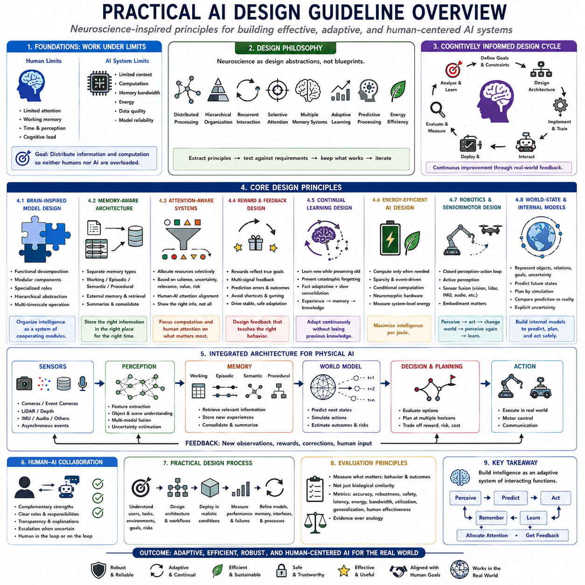
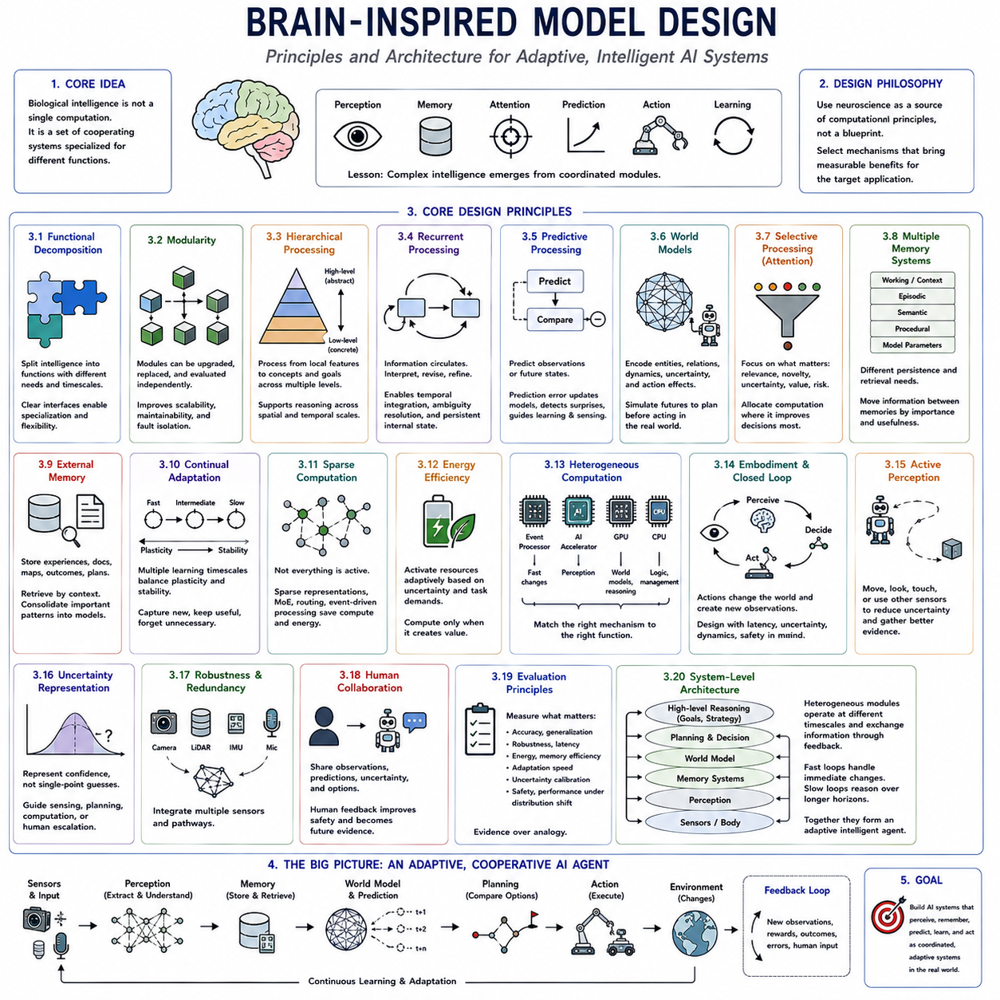
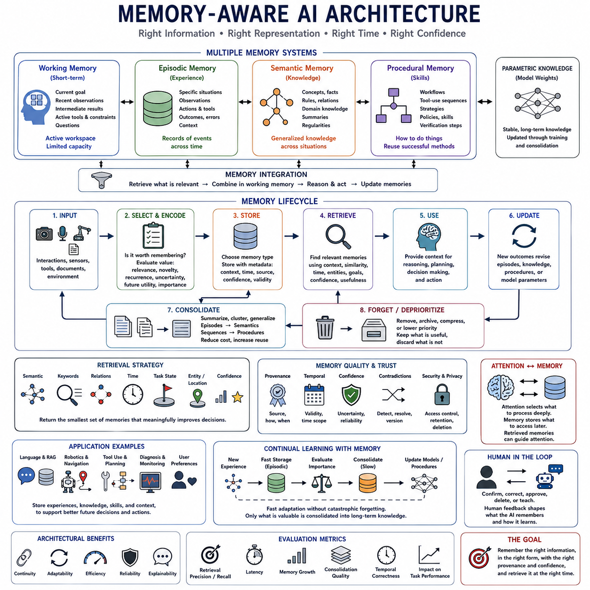
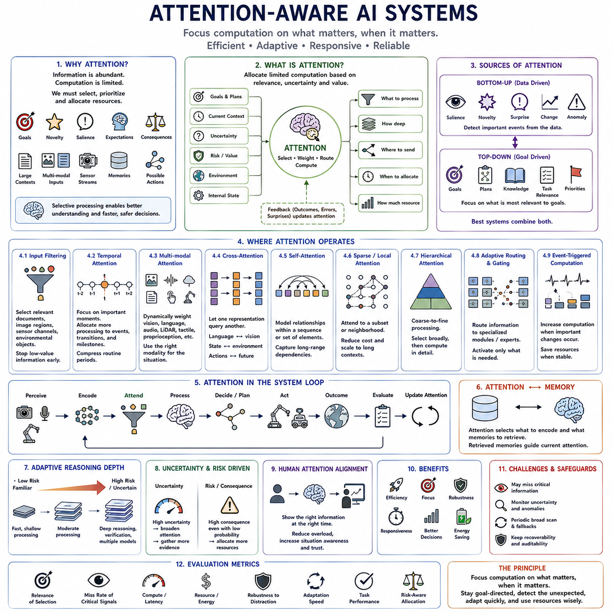
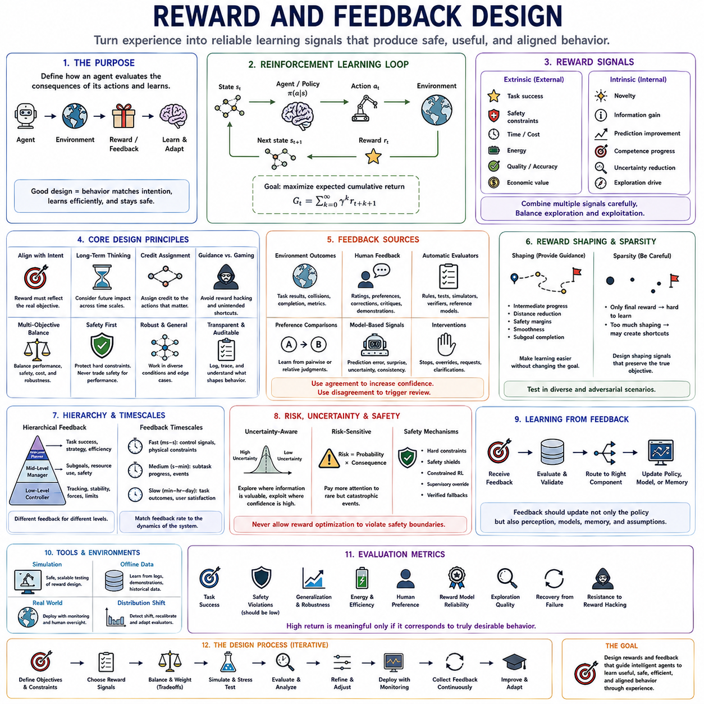
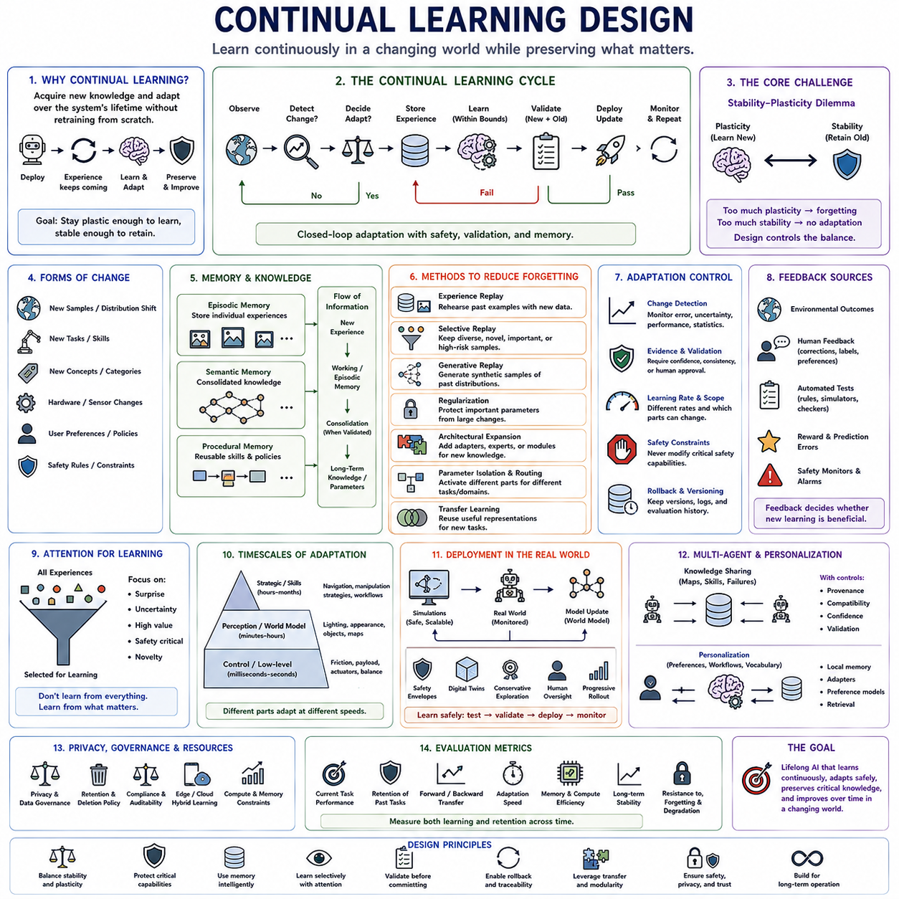
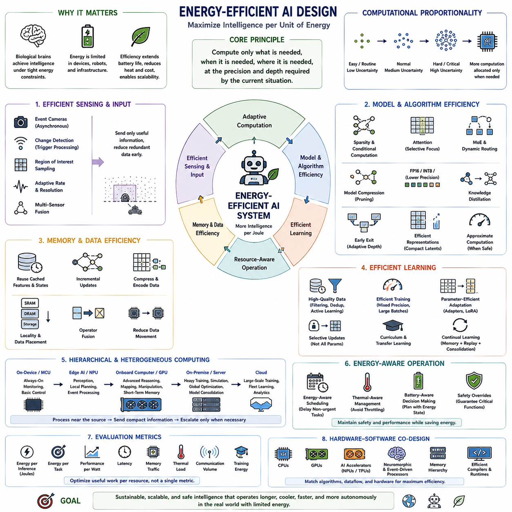
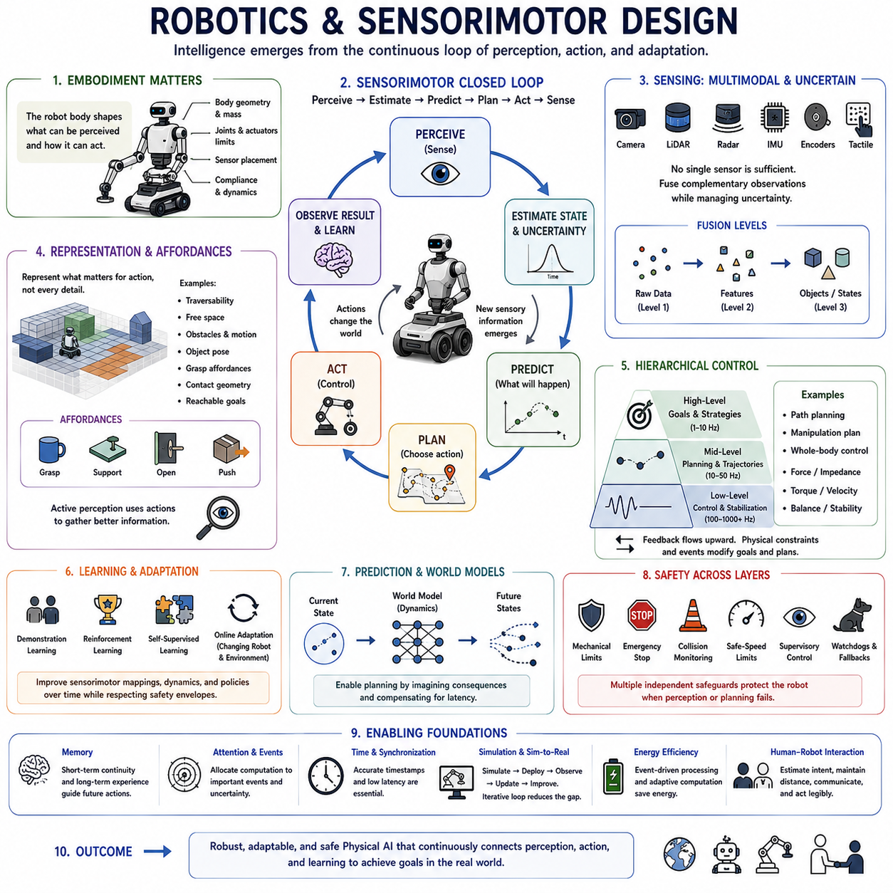
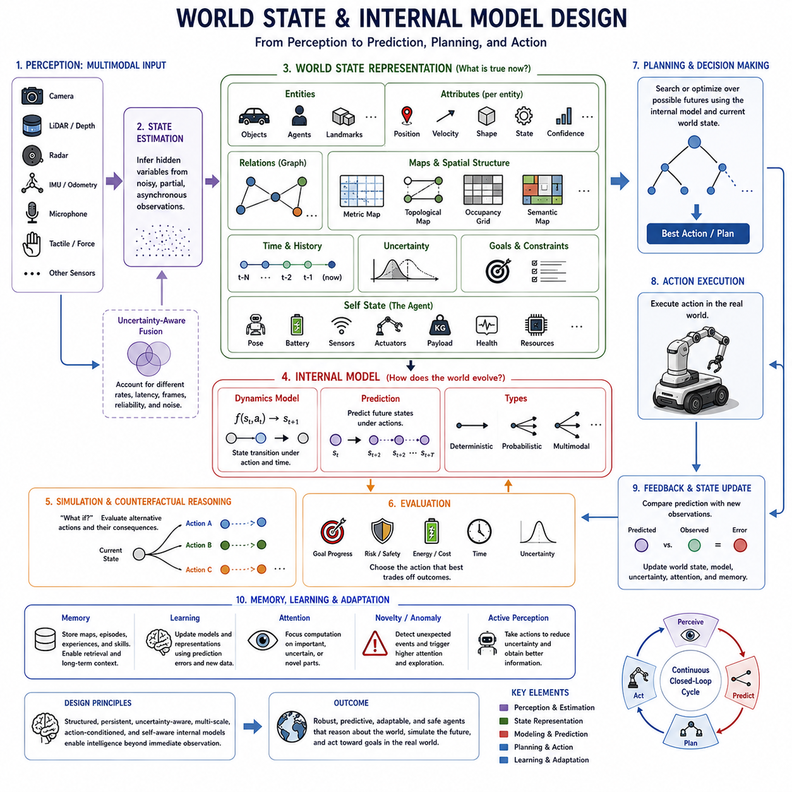

**Volume 44 Neuroscience for AI**


# Chapter 13. Practical AI Design Guidelines

##  

## 13.00 Design Guideline Overview

{width="7.268055555555556in" height="7.268055555555556in"}

Practical AI design guidelines translate neuroscience-inspired principles into engineering choices for systems that must perceive, remember, learn, decide, and act under real-world constraints. The objective is not to reproduce biological mechanisms literally, but to identify useful computational principles and determine where they improve artificial systems. The chapter therefore connects brain-inspired model design with memory, attention, feedback, continual learning, efficiency, sensorimotor intelligence, and internal world-state representation.

A useful starting point is to recognize that both biological and artificial intelligence operate with limited resources. Humans have bounded attention, working memory, processing time, and cognitive capacity, while AI systems face limits in context length, computation, memory bandwidth, energy, data quality, and model reliability. Effective design distributes information and computation so that neither the human nor the machine becomes an unnecessary bottleneck.

Neuroscience should therefore function as a source of design abstractions rather than a blueprint. Biological intelligence demonstrates distributed processing, hierarchical organization, recurrent interaction, selective attention, multiple memory systems, adaptive learning, prediction, and energy-efficient computation. Engineering should extract these principles selectively, test them against measurable requirements, and reject biological analogies when they do not provide practical advantages.

Brain-inspired model design begins with functional decomposition. Instead of expecting one monolithic network to perform perception, memory, prediction, decision making, and control equally well, designers can organize specialized components around different computational roles. Modular architectures allow subsystems to operate with appropriate representations, learning rules, update rates, and computational resources while exchanging information through well-defined interfaces.

Hierarchy complements modularity by allowing information to move between levels of abstraction. Low-level components can process rapidly changing sensory features, intermediate components can construct objects and relationships, and higher levels can represent goals, plans, contexts, or semantic concepts. Such organization is particularly valuable in Physical AI, where millisecond-scale control and long-horizon reasoning must coexist within the same autonomous system.

Memory-aware architecture is another central principle. Intelligent systems should distinguish between information required only for immediate computation and knowledge that must persist across longer timescales. Working context, episodic records, semantic knowledge, procedural skills, and learned parameters serve different purposes. Treating all memory as one undifferentiated store can create inefficient retrieval, interference, unnecessary context growth, and poor adaptation.

External memory can complement parametric knowledge. An AI agent can retrieve documents, previous interactions, observations, task outcomes, environmental states, or successful plans without forcing every new experience into model weights. Relevant experiences can be selected according to context and later summarized, consolidated, or generalized. This separation supports rapid knowledge updates while preserving relatively stable learned capabilities.

Attention-aware system design concerns the allocation of limited computational resources to information that matters most. Biological attention demonstrates that effective intelligence does not process every available signal with equal priority. Artificial systems can similarly use salience, uncertainty, task relevance, novelty, expected value, or risk to determine which observations, memories, tokens, sensors, or candidate actions deserve additional computation.

Attention is also important at the human-AI interface. A system may possess large amounts of information while the human operator remains capable of interpreting only a limited portion at once. Interfaces should therefore prioritize relevant information, progressively reveal detail, communicate uncertainty clearly, and direct attention toward events requiring decisions. The objective is not maximum information display but effective information transfer for understanding and action.

Reward and feedback design determines what adaptive systems learn to optimize. A poorly specified objective can produce behavior that satisfies numerical metrics while violating the actual intention of the designer. Feedback mechanisms should therefore reflect task success, safety, efficiency, uncertainty, human preferences, and long-term consequences where appropriate. Multiple signals may be required when no single reward adequately represents desirable behavior.

Biological reinforcement systems suggest another useful principle: learning depends strongly on differences between expected and observed outcomes. Artificial agents can use prediction errors, temporal-difference signals, task feedback, demonstrations, corrections, and environmental consequences to improve behavior. The engineering challenge is to ensure that feedback is informative enough to guide learning without encouraging shortcuts, unstable policies, or unintended optimization.

Continual learning becomes necessary when an intelligent system operates in environments that change after deployment. New objects, users, locations, tasks, sensors, and operational conditions cannot always be anticipated during initial training. Systems should therefore acquire useful new information while preserving previously learned capabilities, avoiding catastrophic forgetting and uncontrolled modification of stable behaviors.

This requirement favors architectures that separate rapid adaptation from slower consolidation. New experiences can initially enter episodic or external memory, where they remain available for retrieval without immediately modifying the complete model. Repeated or important patterns can later be integrated into more persistent representations through controlled updates. Such multi-timescale learning resembles a functional division between fast memory acquisition and slower long-term knowledge formation.

Energy-efficient AI design requires considering when computation is necessary, not merely how quickly it can be executed. Biological intelligence operates with highly selective activity rather than activating every possible computational pathway continuously. Artificial systems can similarly exploit sparsity, conditional computation, event-driven processing, model routing, adaptive sampling, early exits, and heterogeneous processors to allocate resources according to current information demands.

Neuromorphic processors and event-based sensors illustrate this principle particularly clearly. Event cameras can report visual changes asynchronously, spiking networks can represent temporal activity through sparse events, and neuromorphic processors can perform computation close to local state. These technologies are most useful when the complete sensing-to-computation pipeline preserves sparsity instead of repeatedly converting events into dense representations.

For practical systems, efficiency should be measured at the system level. A theoretically efficient neural architecture may provide little advantage if preprocessing, memory transfer, sensor conversion, communication, or software overhead dominates total energy consumption. Relevant evaluation should therefore include latency, power, memory bandwidth, throughput, utilization, thermal constraints, and accuracy under realistic workloads rather than relying solely on model parameter counts.

Robotics and sensorimotor design extend intelligence into closed interaction loops with the physical world. A robot does not merely classify observations; it perceives environmental state, predicts consequences, selects actions, changes the environment, and receives new observations. Perception and action must therefore be designed as mutually dependent processes rather than independent modules connected only at the final stage.

Active perception follows naturally from this perspective. When observations are ambiguous, an embodied system can move a sensor, change viewpoint, approach an object, manipulate the environment, or select another sensing modality to reduce uncertainty. Intelligent behavior therefore includes choosing actions that improve future information, not merely selecting actions that immediately maximize task reward.

Sensor fusion should likewise be designed around complementary information rather than simply combining every available modality. Cameras provide appearance, LiDAR and depth sensors provide geometry, IMUs capture rapid motion, microphones provide acoustic information, and event cameras emphasize temporal change. The architecture should determine which modalities are reliable and informative under the current environment, task, uncertainty, and computational budget.

World-state and internal-model design provides the bridge between perception and intelligent action. Raw sensory data alone are insufficient for planning because an agent must represent objects, relationships, motion, uncertainty, goals, constraints, and possible future states. Internal representations should therefore capture information necessary to answer operational questions such as what exists, what is changing, what may happen next, and what actions are possible.

World models extend this representation through prediction. Given the current state and a candidate action, the system can estimate possible future states before executing the action physically. Prediction allows an agent to compare alternatives, estimate risk, anticipate collisions, reason about delayed consequences, and choose actions according to expected outcomes. Generative models can further represent multiple plausible futures when environmental dynamics are uncertain.

Prediction should operate as part of a closed loop rather than as an isolated model output. Expected observations can be compared with actual observations, and discrepancies can reveal incorrect assumptions, unexpected environmental changes, sensor failures, or novel events. The internal state can then be revised, new predictions generated, and actions adjusted. This creates a continuous perception-prediction-action-learning cycle.

Uncertainty must remain explicit throughout this architecture. Intelligent systems should distinguish between states that are confidently known and states supported by incomplete or conflicting evidence. Uncertainty can influence sensor selection, retrieval, planning, human escalation, and safety behavior. A system that knows when additional evidence is required is often more useful than one that produces a confident output for every possible input.

Human-AI collaboration should therefore be treated as an architectural requirement rather than merely an interface feature. Humans and AI systems possess different strengths and limitations, and effective systems allocate tasks accordingly. AI can process large information spaces and maintain persistent computational state, while humans may provide contextual judgment, goals, accountability, and intervention when situations fall outside validated operating conditions.

A practical design process should remain iterative. Engineers first identify users, tasks, environments, goals, risks, and resource constraints; design architectures around those requirements; deploy them under representative conditions; measure outcomes and failures; and use observations to refine models, memories, workflows, and interfaces. This creates a design cycle in which evaluation continuously informs subsequent engineering decisions.

Evaluation should focus on system behavior rather than biological resemblance. A brain-inspired mechanism is valuable only when it produces measurable benefits such as better robustness, lower latency, reduced energy consumption, improved adaptation, stronger generalization, safer behavior, or more effective human interaction. Biological plausibility can motivate hypotheses, but engineering evidence must determine whether those hypotheses belong in the deployed architecture.

The resulting design philosophy is heterogeneous rather than monolithic. Fast event-driven modules can handle immediate changes, perception networks can extract structured information, memory systems can preserve experience, world models can simulate futures, reinforcement mechanisms can improve behavior, and higher-level models can perform reasoning and planning. Different components can operate at different timescales while contributing to a shared representation of goals and environment.

Practical neuroscience-inspired AI design therefore asks a different question from direct brain imitation. Instead of asking how to reproduce every biological detail, it asks which principles of biological intelligence solve engineering problems that current artificial systems face. Memory separation, selective attention, predictive processing, modular organization, continual adaptation, efficient computation, embodiment, and closed-loop learning become design tools rather than claims of biological equivalence.

The overall guideline is to build intelligence as an adaptive system of interacting functions rather than a single model executing isolated inference. Perception should inform internal state, memory should provide relevant experience, prediction should anticipate consequences, attention should allocate resources, feedback should drive adaptation, and action should generate new evidence. The Chapter 13 structure develops these principles through brain-inspired models, memory, attention, reward, continual learning, efficiency, robotics, and internal world models.

실용적인 인공지능 설계 지침(Practical AI Design Guidelines)은 신경과학에서 영감을 받은 원리(Neuroscience-Inspired Principles)를 실제 환경의 제약 조건 아래에서 지각하고, 기억하고, 학습하고, 의사결정하며, 행동해야 하는 시스템의 공학적 선택으로 변환합니다. 목표는 생물학적 메커니즘(Biological Mechanisms)을 문자 그대로 재현하는 것이 아니라 유용한 계산 원리(Computational Principles)를 식별하고 그것이 인공 시스템을 어디에서 개선할 수 있는지를 판단하는 것입니다. 따라서 이 장에서는 뇌 영감 모델 설계(Brain-Inspired Model Design)를 기억, 주의, 피드백, 지속 학습, 효율성, 감각운동 지능(Sensorimotor Intelligence), 내부 세계 상태 표상(Internal World-State Representation)과 연결합니다.

유용한 출발점은 생물학적 지능(Biological Intelligence)과 인공지능(Artificial Intelligence) 모두 제한된 자원으로 작동한다는 사실을 인식하는 것입니다. 인간은 제한된 주의력(Attention), 작업 기억(Working Memory), 처리 시간, 인지 능력(Cognitive Capacity)을 가지며, 인공지능 시스템 역시 컨텍스트 길이(Context Length), 계산량, 메모리 대역폭(Memory Bandwidth), 에너지, 데이터 품질, 모델 신뢰성(Model Reliability)의 한계에 직면합니다. 효과적인 설계는 인간과 기계 어느 한쪽도 불필요한 병목(Bottleneck)이 되지 않도록 정보와 계산을 분배해야 합니다.

따라서 신경과학(Neuroscience)은 설계 청사진(Blueprint)이 아니라 설계 추상화(Design Abstractions)의 원천으로 기능해야 합니다. 생물학적 지능은 분산 처리(Distributed Processing), 계층적 조직(Hierarchical Organization), 순환적 상호작용(Recurrent Interaction), 선택적 주의(Selective Attention), 다중 기억 시스템(Multiple Memory Systems), 적응 학습(Adaptive Learning), 예측(Prediction), 에너지 효율적 계산(Energy-Efficient Computation)을 보여줍니다. 공학에서는 이러한 원리를 선택적으로 추출하고 측정 가능한 요구사항에 대해 검증하며, 실용적 이점을 제공하지 않는 생물학적 유추(Biological Analogies)는 배제해야 합니다.

뇌 영감 모델 설계(Brain-Inspired Model Design)는 기능적 분해(Functional Decomposition)에서 시작합니다. 하나의 단일 거대 네트워크(Monolithic Network)가 지각, 기억, 예측, 의사결정, 제어를 모두 동일하게 잘 수행하기를 기대하기보다 서로 다른 계산 역할을 중심으로 특화된 구성 요소를 조직할 수 있습니다. 모듈형 아키텍처(Modular Architectures)는 각 하위 시스템이 적절한 표상, 학습 규칙, 갱신 주기(Update Rates), 계산 자원을 사용하면서 명확하게 정의된 인터페이스를 통해 정보를 교환할 수 있도록 합니다.

계층 구조(Hierarchy)는 정보가 서로 다른 추상화 수준(Levels of Abstraction) 사이를 이동할 수 있도록 함으로써 모듈성을 보완합니다. 저수준 구성 요소는 빠르게 변화하는 감각 특징(Sensory Features)을 처리하고, 중간 수준 구성 요소는 객체와 관계를 구성하며, 상위 수준은 목표, 계획, 맥락(Context), 의미적 개념(Semantic Concepts)을 표현할 수 있습니다. 이러한 조직은 밀리초 단위 제어(Millisecond-Scale Control)와 장기적 추론(Long-Horizon Reasoning)이 동일한 자율 시스템 내에서 공존해야 하는 피지컬 인공지능(Physical AI)에서 특히 중요합니다.

기억 인식 아키텍처(Memory-Aware Architecture)는 또 다른 핵심 원리입니다. 지능형 시스템은 즉각적인 계산에만 필요한 정보와 더 긴 시간 동안 유지되어야 하는 지식을 구분해야 합니다. 작업 컨텍스트(Working Context), 일화적 기록(Episodic Records), 의미 기억(Semantic Knowledge), 절차적 기술(Procedural Skills), 학습된 파라미터(Learned Parameters)는 서로 다른 목적을 수행합니다. 모든 기억을 구분되지 않은 하나의 저장소로 취급하면 비효율적인 검색, 간섭(Interference), 불필요한 컨텍스트 증가, 낮은 적응 성능이 발생할 수 있습니다.

외부 기억(External Memory)은 파라미터 지식(Parametric Knowledge)을 보완할 수 있습니다. 인공지능 에이전트(AI Agent)는 모든 새로운 경험을 모델 가중치(Model Weights)에 강제로 저장하지 않고 문서, 이전 상호작용, 관측, 과제 결과, 환경 상태, 성공했던 계획을 검색할 수 있습니다. 관련 경험은 맥락에 따라 선택될 수 있으며 이후 요약, 통합(Consolidation), 일반화(Generalization)될 수 있습니다. 이러한 분리는 비교적 안정적인 학습 능력을 보존하면서 지식을 빠르게 갱신할 수 있도록 합니다.

주의 인식 시스템 설계(Attention-Aware System Design)는 제한된 계산 자원을 가장 중요한 정보에 할당하는 것과 관련됩니다. 생물학적 주의(Biological Attention)는 효과적인 지능이 이용 가능한 모든 신호를 동일한 우선순위로 처리하지 않는다는 것을 보여줍니다. 인공 시스템도 마찬가지로 현저성(Salience), 불확실성(Uncertainty), 과제 관련성(Task Relevance), 신규성(Novelty), 기대 가치(Expected Value), 위험(Risk)을 이용하여 어떤 관측, 기억, 토큰(Tokens), 센서, 후보 행동(Candidate Actions)에 추가 계산을 할당할 것인지 결정할 수 있습니다.

주의(Attention)는 인간-인공지능 인터페이스(Human-AI Interface)에서도 중요합니다. 시스템이 많은 정보를 보유하더라도 인간 운영자(Human Operator)가 한 번에 해석할 수 있는 정보의 양에는 한계가 있습니다. 따라서 인터페이스는 관련 정보를 우선적으로 제공하고, 세부 정보를 점진적으로 공개하며, 불확실성을 명확하게 전달하고, 의사결정이 필요한 사건에 사용자의 주의를 유도해야 합니다. 목표는 최대한 많은 정보를 표시하는 것이 아니라 이해와 행동에 필요한 정보를 효과적으로 전달하는 것입니다.

보상 및 피드백 설계(Reward and Feedback Design)는 적응형 시스템(Adaptive Systems)이 무엇을 최적화하도록 학습하는지를 결정합니다. 잘못 정의된 목적(Objective)은 설계자의 실제 의도를 위반하면서도 수치적 지표(Numerical Metrics)는 만족하는 행동을 생성할 수 있습니다. 따라서 피드백 메커니즘(Feedback Mechanisms)은 과제 성공, 안전성, 효율성, 불확실성, 인간 선호(Human Preferences), 필요한 경우 장기적인 결과(Long-Term Consequences)를 반영해야 합니다. 하나의 보상만으로 바람직한 행동을 충분히 표현할 수 없다면 여러 신호가 필요할 수 있습니다.

생물학적 강화 시스템(Biological Reinforcement Systems)은 또 다른 유용한 원리를 제시합니다. 학습은 예상된 결과와 실제로 관측된 결과 사이의 차이에 크게 의존합니다. 인공 에이전트는 예측 오류(Prediction Errors), 시간차 신호(Temporal-Difference Signals), 과제 피드백(Task Feedback), 시연(Demonstrations), 수정(Corrections), 환경적 결과(Environmental Consequences)를 이용하여 행동을 개선할 수 있습니다. 공학적 과제는 피드백이 학습을 유도할 만큼 충분한 정보를 제공하면서도 편법(Shortcuts), 불안정한 정책(Unstable Policies), 의도하지 않은 최적화를 유발하지 않도록 하는 것입니다.

지속 학습(Continual Learning)은 지능형 시스템이 배포 이후 변화하는 환경에서 작동할 때 필요합니다. 새로운 객체, 사용자, 장소, 과제, 센서, 운영 조건(Operational Conditions)을 초기 학습 단계에서 항상 예상할 수 있는 것은 아닙니다. 따라서 시스템은 이전에 학습한 능력을 보존하면서 유용한 새로운 정보를 습득해야 하며, 치명적 망각(Catastrophic Forgetting)과 안정된 행동의 통제되지 않은 변경을 방지해야 합니다.

이러한 요구사항은 빠른 적응(Rapid Adaptation)과 느린 통합(Slower Consolidation)을 분리하는 아키텍처에 유리합니다. 새로운 경험은 먼저 일화 기억(Episodic Memory)이나 외부 기억에 저장하여 전체 모델을 즉시 수정하지 않고도 검색할 수 있도록 할 수 있습니다. 반복되거나 중요한 패턴은 이후 통제된 갱신(Controlled Updates)을 통해 보다 지속적인 표상(Persistent Representations)에 통합될 수 있습니다. 이러한 다중 시간 척도 학습(Multi-Timescale Learning)은 빠른 기억 획득과 느린 장기 지식 형성(Long-Term Knowledge Formation)의 기능적 분리를 보여줍니다.

에너지 효율적 인공지능 설계(Energy-Efficient AI Design)는 단순히 계산을 얼마나 빠르게 수행할 수 있는지가 아니라 언제 계산이 필요한지를 고려해야 합니다. 생물학적 지능은 가능한 모든 계산 경로를 지속적으로 활성화하는 대신 매우 선택적인 활동(Selective Activity)을 통해 작동합니다. 인공 시스템 역시 희소성(Sparsity), 조건부 계산(Conditional Computation), 이벤트 기반 처리(Event-Driven Processing), 모델 라우팅(Model Routing), 적응형 샘플링(Adaptive Sampling), 조기 종료(Early Exits), 이기종 프로세서(Heterogeneous Processors)를 활용하여 현재 정보 요구량에 따라 자원을 할당할 수 있습니다.

뉴로모픽 프로세서(Neuromorphic Processors)와 이벤트 기반 센서(Event-Based Sensors)는 이러한 원리를 특히 명확하게 보여줍니다. 이벤트 카메라(Event Cameras)는 시각적 변화를 비동기적으로 보고하고, 스파이킹 네트워크(Spiking Networks)는 희소 이벤트를 통해 시간적 활동을 표현하며, 뉴로모픽 프로세서는 국소 상태 가까이에서 계산을 수행할 수 있습니다. 이러한 기술은 이벤트를 반복적으로 밀집 표상(Dense Representations)으로 변환하는 대신 전체 감지-계산 파이프라인(Sensing-to-Computation Pipeline)이 희소성을 유지할 때 가장 유용합니다.

실용적인 시스템에서 효율성은 시스템 수준(System Level)에서 측정해야 합니다. 이론적으로 효율적인 신경 아키텍처라도 전처리(Preprocessing), 메모리 전송(Memory Transfer), 센서 변환(Sensor Conversion), 통신, 소프트웨어 오버헤드(Software Overhead)가 전체 에너지 소비를 지배한다면 실질적인 이점을 거의 제공하지 못할 수 있습니다. 따라서 현실적인 워크로드에서 모델 파라미터 수만을 평가하기보다 지연시간(Latency), 전력(Power), 메모리 대역폭, 처리량(Throughput), 활용률(Utilization), 열 제약(Thermal Constraints), 정확도를 함께 평가해야 합니다.

로보틱스 및 감각운동 설계(Robotics and Sensorimotor Design)는 지능을 물리적 세계와의 폐쇄형 상호작용 루프(Closed Interaction Loops)로 확장합니다. 로봇은 단순히 관측을 분류하는 것이 아니라 환경 상태를 지각하고, 결과를 예측하고, 행동을 선택하고, 환경을 변화시키며, 새로운 관측을 획득합니다. 따라서 지각(Perception)과 행동(Action)은 최종 단계에서만 연결되는 독립적인 모듈이 아니라 상호 의존적인 과정으로 설계되어야 합니다.

능동 지각(Active Perception)은 이러한 관점에서 자연스럽게 도출됩니다. 관측이 모호할 경우 체화 시스템(Embodied System)은 센서를 움직이고, 시점을 변경하고, 객체에 접근하고, 환경을 조작하거나, 다른 감지 모달리티(Sensing Modality)를 선택하여 불확실성을 줄일 수 있습니다. 따라서 지능적 행동(Intelligent Behavior)은 즉각적인 과제 보상만 최대화하는 행동을 선택하는 것이 아니라 미래에 얻을 수 있는 정보를 개선하는 행동을 선택하는 것도 포함합니다.

센서 융합(Sensor Fusion) 역시 이용 가능한 모든 모달리티를 단순히 결합하는 것이 아니라 상호 보완적인 정보(Complementary Information)를 중심으로 설계해야 합니다. 카메라는 외형(Appearance)을 제공하고, 라이다(LiDAR)와 깊이 센서(Depth Sensors)는 기하학적 정보(Geometry)를 제공하며, 관성 측정 장치(IMU)는 빠른 움직임을 포착하고, 마이크로폰(Microphones)은 음향 정보를 제공하며, 이벤트 카메라는 시간적 변화를 강조합니다. 아키텍처는 현재 환경, 과제, 불확실성, 계산 예산(Computational Budget)에 따라 어떤 모달리티가 신뢰할 수 있고 유용한지를 판단해야 합니다.

세계 상태 및 내부 모델 설계(World-State and Internal-Model Design)는 지각과 지능적 행동을 연결하는 다리 역할을 합니다. 원시 감각 데이터(Raw Sensory Data)만으로는 계획에 충분하지 않으며, 에이전트는 객체, 관계, 움직임, 불확실성, 목표, 제약조건, 가능한 미래 상태를 표현해야 합니다. 따라서 내부 표상(Internal Representations)은 무엇이 존재하는지, 무엇이 변화하고 있는지, 다음에 무엇이 발생할 수 있는지, 어떤 행동이 가능한지와 같은 운영적 질문에 답하는 데 필요한 정보를 포착해야 합니다.

월드 모델(World Models)은 예측을 통해 이러한 표상을 확장합니다. 현재 상태와 후보 행동이 주어지면 시스템은 실제로 행동을 실행하기 전에 가능한 미래 상태를 추정할 수 있습니다. 예측을 통해 에이전트는 대안을 비교하고, 위험을 추정하고, 충돌을 예상하고, 지연된 결과(Delayed Consequences)를 고려하며, 예상되는 결과에 따라 행동을 선택할 수 있습니다. 생성 모델(Generative Models)은 환경 동역학(Environmental Dynamics)이 불확실한 경우 여러 개의 가능한 미래를 추가적으로 표현할 수 있습니다.

예측(Prediction)은 고립된 모델 출력으로 작동하기보다 폐쇄 루프(Closed Loop)의 일부로 작동해야 합니다. 예상된 관측(Expected Observations)은 실제 관측과 비교될 수 있으며, 그 차이는 잘못된 가정, 예상하지 못한 환경 변화, 센서 고장(Sensor Failures), 새로운 사건(Novel Events)을 나타낼 수 있습니다. 이후 내부 상태를 수정하고 새로운 예측을 생성하며 행동을 조정할 수 있습니다. 이를 통해 지속적인 지각-예측-행동-학습 순환(Perception-Prediction-Action-Learning Cycle)이 형성됩니다.

불확실성(Uncertainty)은 이러한 아키텍처 전체에서 명시적으로 유지되어야 합니다. 지능형 시스템은 높은 확신으로 알고 있는 상태와 불완전하거나 상충되는 증거에 의해 뒷받침되는 상태를 구분해야 합니다. 불확실성은 센서 선택, 검색(Retrieval), 계획, 인간에게의 에스컬레이션(Human Escalation), 안전 행동(Safety Behavior)에 영향을 줄 수 있습니다. 모든 입력에 대해 자신감 있는 출력을 생성하는 시스템보다 추가적인 증거가 언제 필요한지를 판단할 수 있는 시스템이 더 유용한 경우가 많습니다.

따라서 인간-인공지능 협업(Human-AI Collaboration)은 단순한 인터페이스 기능이 아니라 아키텍처 요구사항(Architectural Requirement)으로 취급해야 합니다. 인간과 인공지능 시스템은 서로 다른 강점과 한계를 가지고 있으며, 효과적인 시스템은 이에 따라 과제를 배분합니다. 인공지능은 방대한 정보 공간을 처리하고 지속적인 계산 상태(Persistent Computational State)를 유지할 수 있는 반면, 인간은 상황적 판단(Contextual Judgment), 목표, 책임성(Accountability), 검증된 운영 조건을 벗어나는 상황에서의 개입(Intervention)을 제공할 수 있습니다.

실용적인 설계 과정(Practical Design Process)은 반복적이어야 합니다. 엔지니어는 먼저 사용자, 과제, 환경, 목표, 위험, 자원 제약(Resource Constraints)을 식별하고, 이러한 요구사항을 중심으로 아키텍처를 설계한 후 대표적인 조건에서 배포합니다. 이후 결과와 실패를 측정하고 관측된 정보를 이용하여 모델, 기억, 워크플로(Workflows), 인터페이스를 개선합니다. 이를 통해 평가(Evaluation)가 이후의 공학적 의사결정에 지속적으로 반영되는 설계 순환(Design Cycle)이 형성됩니다.

평가는 생물학적 유사성(Biological Resemblance)이 아니라 시스템 행동(System Behavior)에 초점을 맞춰야 합니다. 뇌에서 영감을 받은 메커니즘은 더 높은 강건성(Robustness), 낮은 지연시간, 감소된 에너지 소비, 향상된 적응 능력, 더 강력한 일반화(Generalization), 더 안전한 행동, 더 효과적인 인간 상호작용과 같이 측정 가능한 이점을 제공할 때만 가치가 있습니다. 생물학적 타당성(Biological Plausibility)은 가설에 영감을 줄 수 있지만, 실제 배포 아키텍처에 해당 가설을 포함할지는 공학적 증거(Engineering Evidence)를 통해 결정해야 합니다.

결과적으로 설계 철학(Design Philosophy)은 단일형(Monolithic)이 아니라 이기종(Heterogeneous) 형태가 됩니다. 빠른 이벤트 기반 모듈은 즉각적인 변화를 처리하고, 지각 네트워크(Perception Networks)는 구조화된 정보를 추출하며, 기억 시스템은 경험을 보존하고, 월드 모델은 미래를 시뮬레이션하며, 강화 메커니즘(Reinforcement Mechanisms)은 행동을 개선하고, 상위 수준 모델은 추론과 계획을 수행할 수 있습니다. 서로 다른 구성 요소는 서로 다른 시간 척도에서 작동하면서 목표와 환경에 대한 공유 표상(Shared Representation)에 기여할 수 있습니다.

따라서 실용적인 신경과학 영감 인공지능 설계(Practical Neuroscience-Inspired AI Design)는 뇌를 직접 모방하는 것과는 다른 질문을 제기합니다. 모든 생물학적 세부사항을 어떻게 재현할 것인가를 묻는 대신, 생물학적 지능의 어떤 원리가 현재 인공 시스템이 직면한 공학적 문제를 해결할 수 있는지를 묻습니다. 기억 분리(Memory Separation), 선택적 주의, 예측 처리(Predictive Processing), 모듈형 조직(Modular Organization), 지속적인 적응(Continual Adaptation), 효율적인 계산, 체화(Embodiment), 폐쇄 루프 학습(Closed-Loop Learning)은 생물학적 동일성을 주장하는 근거가 아니라 설계 도구(Design Tools)가 됩니다.

전체적인 설계 지침은 지능(Intelligence)을 고립된 추론을 수행하는 하나의 모델이 아니라 서로 상호작용하는 기능들로 구성된 적응형 시스템(Adaptive System)으로 구축하는 것입니다. 지각은 내부 상태에 정보를 제공하고, 기억은 관련 경험을 제공하며, 예측은 행동의 결과를 예상하고, 주의는 자원을 배분하며, 피드백은 적응을 유도하고, 행동은 새로운 증거를 생성해야 합니다. 이러한 원리는 뇌 영감 모델(Brain-Inspired Models), 기억(Memory), 주의(Attention), 보상(Reward), 지속 학습(Continual Learning), 효율성(Efficiency), 로보틱스(Robotics), 내부 월드 모델(Internal World Models)을 통해 구체적인 인공지능 설계 지침으로 발전할 수 있습니다.

##  

## 13.01 Brain Inspired Model Design [w/Code]

{width="7.268055555555556in" height="7.268055555555556in"}

Brain-inspired model design begins from the observation that biological intelligence is not organized as a single uniform computation. The brain contains interacting systems specialized for perception, memory, attention, prediction, action, and learning, yet these systems cooperate continuously. For AI engineering, the useful lesson is functional organization: complex intelligence can emerge from coordinated modules rather than requiring every capability to be embedded within one monolithic network.

Biological inspiration should be treated as a source of computational principles rather than a requirement for literal neural replication. Artificial systems operate on different substrates, learning algorithms, data scales, and engineering constraints. The design objective is therefore to identify mechanisms such as hierarchy, recurrence, sparsity, modularity, prediction, selective processing, and adaptive memory, then determine whether they provide measurable advantages for a particular AI application.

Functional decomposition provides a practical foundation for this approach. Perception, state estimation, memory retrieval, world modeling, planning, and control have different computational requirements and timescales. Separating these functions allows each component to use representations and algorithms suited to its purpose. Well-defined interfaces then allow specialized modules to exchange information while preserving the ability to modify or replace individual components as system requirements evolve.

Modularity also improves engineering scalability. A perception subsystem can be upgraded without redesigning the complete planning system, while a new memory mechanism can be introduced without retraining every component from the beginning. Modular boundaries make failures easier to isolate, enable independent evaluation, and support heterogeneous hardware. The challenge is ensuring that modules exchange sufficient information without creating excessive communication overhead or fragmented representations.

Hierarchical processing provides another important design principle. Biological sensory systems transform signals through multiple processing levels, gradually constructing representations that capture increasingly complex structure. Artificial systems can similarly organize processing from local features toward objects, relationships, scenes, goals, and abstract concepts. Different hierarchical levels can operate simultaneously while exchanging information according to the requirements of the task.

Hierarchy is particularly valuable when an AI system must reason across spatial and temporal scales. A robot may need millisecond-level stabilization, rapid obstacle detection, second-level trajectory planning, and much slower strategic reasoning. Representing all of these processes at one resolution would be inefficient. Multi-level architectures allow fast lower-level loops to operate continuously while slower higher-level processes reason over more abstract representations and longer horizons.

Recurrent processing complements hierarchical organization by allowing information to circulate rather than moving only through a one-way feedforward pipeline. Initial interpretations can be revised when additional evidence becomes available, higher-level context can influence lower-level perception, and predictions can be compared with observations. Recurrence therefore supports iterative refinement, temporal integration, ambiguity resolution, and persistent internal state across sequential interactions.

This principle is especially useful in environments where observations are incomplete. A single image, sensor reading, or language input may not provide enough information for reliable interpretation. Recurrent processing allows the system to integrate evidence over time and maintain hypotheses until they can be confirmed or rejected. In embodied systems, actions can additionally generate new observations, turning recurrent inference into an active perception loop.

Predictive processing extends this architecture by requiring internal models to anticipate incoming information or future states. Instead of reacting only after events occur, an AI system can predict likely observations, environmental transitions, or consequences of actions. Differences between predictions and actual outcomes provide informative error signals that can update internal representations, identify unexpected events, and guide additional sensing or learning.

A world model provides a practical implementation of this principle at the system level. It can encode relevant entities, relationships, dynamics, uncertainty, and action consequences rather than simply storing raw sensor measurements. Given a current state and candidate action, the model can estimate possible future states. Planning can then occur partly through internal simulation before the agent commits to costly or potentially unsafe actions in the physical environment.

Selective processing is another lesson from biological intelligence. The brain does not devote equal computational resources to every available stimulus. Artificial architectures can similarly prioritize information according to task relevance, novelty, uncertainty, expected value, or risk. Attention mechanisms, sparse computation, dynamic routing, and conditional model activation allow computational effort to be concentrated where additional processing is most likely to improve decisions.

This principle can operate at multiple architectural levels. A perception system may prioritize moving objects, a memory system may retrieve only contextually relevant experiences, and a planner may explore promising candidate actions rather than evaluating every possible trajectory. Higher-level controllers can also decide whether a difficult situation requires a larger model, additional sensors, human assistance, or more computational time.

Memory should be designed as a collection of complementary mechanisms rather than a single storage function. Immediate context, episodic experiences, semantic knowledge, procedural skills, and model parameters have different persistence and retrieval requirements. Separating these functions reduces interference and allows information to move between memory systems according to importance, repetition, usefulness, and confidence.

External memory is particularly valuable for rapidly changing knowledge. Instead of repeatedly modifying model parameters whenever new information arrives, an agent can store experiences, documents, observations, maps, task outcomes, or previous plans in retrievable memory. Relevant information can later be recalled according to the current context, while frequently useful patterns can gradually be consolidated into more stable representations or learned policies.

Continual adaptation requires balancing plasticity and stability. A highly plastic system can rapidly learn new information but may overwrite useful previous knowledge, while an excessively stable system cannot adapt effectively. Brain-inspired design therefore motivates multiple learning timescales. Fast mechanisms can capture recent experiences, intermediate processes can evaluate their importance, and slower consolidation can integrate persistent patterns while protecting established capabilities.

Local and global learning can also play complementary roles. Local adaptation may efficiently adjust sensor calibration, associations, short-term predictions, or specialized behaviors, while global optimization can improve broader representations and policies. Not every new observation needs to trigger expensive end-to-end retraining. Designing where learning occurs and how far parameter changes propagate can improve both computational efficiency and system stability.

Sparse computation provides another biologically inspired engineering principle. Many neural populations are not maximally active simultaneously, suggesting that useful computation can emerge from selective activation. Artificial models can exploit sparse representations, mixture-of-experts routing, event-driven processing, conditional execution, or selective attention so that only relevant portions of the architecture consume substantial computation for a particular input or situation.

Energy efficiency should consequently be considered at the architectural level rather than only through processor performance. A system that continuously activates every sensor, neural network, memory pathway, and planning mechanism wastes resources when environmental conditions are simple. Intelligent resource allocation can dynamically activate computational capabilities according to uncertainty and task demands, reserving expensive processing for situations where it produces meaningful value.

Heterogeneous computation naturally follows from this principle. Event-driven processors may handle rapid temporal changes, conventional accelerators may execute dense perception networks, and powerful GPUs may support world models or foundation-model reasoning. CPUs can coordinate symbolic logic, communication, and system management. Brain-inspired design therefore does not imply one preferred processor; it encourages matching computational mechanisms to functional requirements.

Embodiment introduces additional constraints that distinguish intelligent agents from isolated prediction models. A physical agent\'s outputs alter the environment and therefore change its future inputs. Perception, prediction, decision, and action form a closed loop. Model design must consequently consider latency, sensor uncertainty, actuator dynamics, physical constraints, safety margins, and the consequences of incorrect predictions rather than optimizing inference accuracy alone.

Active perception becomes possible when the system explicitly models this loop. If an object is partially hidden or a localization estimate is uncertain, the agent can move to obtain better evidence. A robot may reposition a camera, approach a target, use another sensor, or manipulate an object to reveal relevant information. Intelligence therefore includes selecting actions that improve the quality of subsequent inference.

Uncertainty representation should be integrated throughout brain-inspired architectures. Sensory observations may be noisy, memories incomplete, predictions multimodal, and environmental dynamics unpredictable. Models should communicate uncertainty rather than converting every ambiguous state into a single confident estimate. Uncertainty can determine whether the system gathers more evidence, chooses a conservative action, activates additional computation, or requests human intervention.

Robustness also requires redundancy and complementary representations. Biological systems frequently integrate information from multiple sensory channels and processing pathways. Artificial systems can combine cameras, LiDAR, depth sensing, IMUs, event sensors, language, maps, and prior experience. When one source becomes unreliable, other modalities can preserve essential state information, provided that fusion mechanisms account for differences in confidence and failure characteristics.

Human collaboration should be incorporated into model architecture when autonomous confidence is insufficient. A system can expose relevant observations, predicted outcomes, uncertainty, and alternative actions rather than presenting only a final decision. Human feedback can then correct assumptions, provide goals, resolve ambiguity, or constrain behavior. These corrections can become additional evidence for memory and future adaptation instead of remaining isolated interventions.

Evaluation determines whether biological inspiration actually improves engineering performance. A model should not be preferred merely because its structure resembles a proposed neural mechanism. Relevant comparisons should measure accuracy, generalization, robustness, latency, energy consumption, memory efficiency, adaptation speed, uncertainty calibration, safety, and performance under distribution shift. Biological analogy generates hypotheses; system-level evidence determines their practical value.

Brain-inspired model design therefore favors heterogeneous systems composed of cooperating mechanisms operating at different timescales. Fast reactive modules handle immediate changes, perception constructs structured representations, memory preserves experience, predictive models anticipate future states, planners compare alternatives, and learning mechanisms adapt behavior. Information circulates among these components through feedback rather than flowing through a single fixed sequence.

The resulting architecture should remain adaptable as requirements change. Modules can be replaced, memories expanded, sensors added, world models improved, and learning mechanisms updated without reconstructing the entire intelligent system. This flexibility is essential for long-lived AI agents operating in changing environments, where the final deployment conditions cannot be completely specified during initial model development.

The central guideline is therefore to borrow organizational principles from biological intelligence while remaining governed by engineering evidence. Modularity, hierarchy, recurrence, selective attention, multiple memory systems, predictive internal models, sparse computation, continual adaptation, embodiment, and uncertainty-aware feedback provide a coherent design vocabulary. Combined carefully, they support AI systems that perceive, remember, predict, learn, and act as coordinated adaptive systems rather than isolated inference engines.

뇌 영감 모델 설계(Brain-Inspired Model Design)는 생물학적 지능(Biological Intelligence)이 하나의 균일한 계산(Single Uniform Computation)으로 구성되어 있지 않다는 관찰에서 시작합니다. 뇌에는 지각(Perception), 기억(Memory), 주의(Attention), 예측(Prediction), 행동(Action), 학습(Learning)에 특화된 상호작용 시스템이 존재하며, 이들은 지속적으로 협력합니다. 인공지능 공학(AI Engineering)에서 유용한 교훈은 기능적 조직(Functional Organization)에 있으며, 모든 능력을 하나의 단일 거대 네트워크(Monolithic Network)에 포함시키지 않고도 서로 협력하는 모듈(Coordinated Modules)을 통해 복잡한 지능을 구현할 수 있습니다.

생물학적 영감(Biological Inspiration)은 신경 구조를 문자 그대로 복제해야 하는 요구사항이 아니라 계산 원리(Computational Principles)의 원천으로 다루어야 합니다. 인공 시스템은 서로 다른 물리적 기반(Substrates), 학습 알고리즘, 데이터 규모, 공학적 제약조건(Engineering Constraints)에서 작동합니다. 따라서 설계 목표는 계층 구조(Hierarchy), 순환성(Recurrence), 희소성(Sparsity), 모듈성(Modularity), 예측, 선택적 처리(Selective Processing), 적응형 기억(Adaptive Memory)과 같은 메커니즘을 식별하고 특정 인공지능 응용에서 측정 가능한 이점을 제공하는지를 판단하는 것입니다.

기능적 분해(Functional Decomposition)는 이러한 접근법을 위한 실용적인 기반을 제공합니다. 지각, 상태 추정(State Estimation), 기억 검색(Memory Retrieval), 월드 모델링(World Modeling), 계획(Planning), 제어(Control)는 서로 다른 계산 요구사항과 시간 척도(Timescales)를 가집니다. 이러한 기능을 분리하면 각 구성 요소가 자신의 목적에 적합한 표상과 알고리즘을 사용할 수 있습니다. 이후 명확하게 정의된 인터페이스를 통해 특화된 모듈들이 정보를 교환하면서 시스템 요구사항의 변화에 따라 개별 구성 요소를 수정하거나 교체할 수 있습니다.

모듈성(Modularity)은 공학적 확장성(Engineering Scalability)도 향상시킵니다. 전체 계획 시스템을 다시 설계하지 않고도 지각 하위 시스템(Perception Subsystem)을 업그레이드할 수 있으며, 모든 구성 요소를 처음부터 다시 학습하지 않고도 새로운 기억 메커니즘을 도입할 수 있습니다. 모듈 경계(Module Boundaries)는 장애를 보다 쉽게 격리하고 독립적인 평가를 가능하게 하며 이기종 하드웨어(Heterogeneous Hardware)를 지원합니다. 중요한 과제는 과도한 통신 오버헤드(Communication Overhead)나 분절된 표상(Fragmented Representations)을 발생시키지 않으면서 모듈 간에 충분한 정보를 교환하도록 하는 것입니다.

계층적 처리(Hierarchical Processing)는 또 다른 중요한 설계 원리를 제공합니다. 생물학적 감각 시스템(Biological Sensory Systems)은 여러 처리 수준을 통해 신호를 변환하면서 점차 복잡한 구조를 포착하는 표상을 구성합니다. 인공 시스템도 이와 유사하게 국소 특징(Local Features)에서 객체(Objects), 관계(Relationships), 장면(Scenes), 목표(Goals), 추상적 개념(Abstract Concepts)으로 이어지는 처리 구조를 구성할 수 있습니다. 서로 다른 계층 수준은 동시에 작동하면서 과제의 요구에 따라 정보를 교환할 수 있습니다.

계층 구조는 인공지능 시스템이 서로 다른 공간적 및 시간적 규모(Spatial and Temporal Scales)에 걸쳐 추론해야 할 때 특히 유용합니다. 로봇은 밀리초 수준의 안정화(Millisecond-Level Stabilization), 빠른 장애물 감지(Rapid Obstacle Detection), 초 단위의 궤적 계획(Trajectory Planning), 그리고 훨씬 느린 전략적 추론(Strategic Reasoning)을 동시에 수행해야 할 수 있습니다. 이러한 모든 과정을 하나의 해상도에서 표현하는 것은 비효율적입니다. 다중 수준 아키텍처(Multi-Level Architectures)는 빠른 하위 수준 루프가 지속적으로 작동하는 동안 느린 상위 수준 과정이 보다 추상적인 표상과 긴 시간 범위를 대상으로 추론할 수 있도록 합니다.

순환 처리(Recurrent Processing)는 정보가 단방향 피드포워드 파이프라인(Feedforward Pipeline)을 통해서만 이동하는 것이 아니라 순환할 수 있도록 함으로써 계층적 조직을 보완합니다. 추가적인 증거가 확보되면 초기 해석을 수정할 수 있고, 상위 수준의 맥락이 하위 수준의 지각에 영향을 줄 수 있으며, 예측을 실제 관측과 비교할 수 있습니다. 따라서 순환성은 반복적 정교화(Iterative Refinement), 시간적 통합(Temporal Integration), 모호성 해결(Ambiguity Resolution), 연속적인 상호작용 과정에서의 지속적인 내부 상태(Persistent Internal State)를 지원합니다.

이러한 원리는 관측이 불완전한 환경에서 특히 유용합니다. 하나의 이미지, 센서 측정값, 언어 입력만으로는 신뢰할 수 있는 해석에 필요한 정보가 충분하지 않을 수 있습니다. 순환 처리를 통해 시스템은 시간에 따라 증거를 통합하고 가설(Hypotheses)이 확인되거나 기각될 때까지 이를 유지할 수 있습니다. 체화 시스템(Embodied Systems)에서는 행동을 통해 추가적인 관측을 생성할 수도 있기 때문에 순환적 추론(Recurrent Inference)을 능동 지각 루프(Active Perception Loop)로 확장할 수 있습니다.

예측 처리(Predictive Processing)는 내부 모델(Internal Models)이 입력되는 정보 또는 미래 상태를 예상하도록 요구함으로써 이러한 아키텍처를 확장합니다. 사건이 발생한 후에만 반응하는 대신 인공지능 시스템은 예상되는 관측, 환경 상태 전이(Environmental Transitions), 행동의 결과를 예측할 수 있습니다. 예측 결과와 실제 결과 사이의 차이는 내부 표상을 갱신하고, 예상하지 못한 사건을 식별하며, 추가적인 감지 또는 학습을 유도하는 유용한 오류 신호(Error Signals)를 제공합니다.

월드 모델(World Model)은 시스템 수준에서 이러한 원리를 구현하는 실용적인 방법을 제공합니다. 월드 모델은 단순히 원시 센서 측정값(Raw Sensor Measurements)을 저장하는 대신 관련 개체(Entities), 관계, 동역학(Dynamics), 불확실성(Uncertainty), 행동의 결과(Action Consequences)를 부호화할 수 있습니다. 현재 상태와 후보 행동(Candidate Action)이 주어지면 모델은 가능한 미래 상태를 추정할 수 있습니다. 따라서 에이전트가 물리적 환경에서 비용이 높거나 잠재적으로 위험한 행동을 실제로 수행하기 전에 내부 시뮬레이션(Internal Simulation)을 통해 계획할 수 있습니다.

선택적 처리(Selective Processing)는 생물학적 지능에서 얻을 수 있는 또 다른 교훈입니다. 뇌는 이용 가능한 모든 자극에 동일한 계산 자원을 할당하지 않습니다. 인공 아키텍처도 과제 관련성(Task Relevance), 신규성(Novelty), 불확실성, 기대 가치(Expected Value), 위험(Risk)에 따라 정보의 우선순위를 정할 수 있습니다. 어텐션 메커니즘(Attention Mechanisms), 희소 계산(Sparse Computation), 동적 라우팅(Dynamic Routing), 조건부 모델 활성화(Conditional Model Activation)를 이용하면 추가 처리가 의사결정을 향상시킬 가능성이 가장 높은 부분에 계산 자원을 집중할 수 있습니다.

이러한 원리는 여러 아키텍처 수준에서 적용할 수 있습니다. 지각 시스템은 움직이는 객체를 우선적으로 처리하고, 기억 시스템은 현재 맥락과 관련된 경험만 검색하며, 플래너(Planner)는 가능한 모든 궤적을 평가하기보다 유망한 후보 행동을 탐색할 수 있습니다. 상위 수준 제어기(Higher-Level Controllers)는 어려운 상황에서 더 큰 모델, 추가 센서, 인간의 지원(Human Assistance), 또는 더 많은 계산 시간이 필요한지를 결정할 수도 있습니다.

기억(Memory)은 하나의 저장 기능이 아니라 서로 보완적인 여러 메커니즘의 집합으로 설계해야 합니다. 즉각적인 맥락(Immediate Context), 일화적 경험(Episodic Experiences), 의미 지식(Semantic Knowledge), 절차적 기술(Procedural Skills), 모델 파라미터(Model Parameters)는 서로 다른 지속성(Persistence)과 검색 요구사항을 가집니다. 이러한 기능을 분리하면 간섭(Interference)을 줄이고 중요성, 반복성, 유용성, 신뢰도에 따라 정보가 기억 시스템 사이에서 이동하도록 할 수 있습니다.

외부 기억(External Memory)은 빠르게 변화하는 지식에 특히 유용합니다. 새로운 정보가 도착할 때마다 모델 파라미터를 반복적으로 수정하는 대신 에이전트는 경험, 문서, 관측, 지도(Maps), 과제 결과, 이전 계획을 검색 가능한 기억(Retrievable Memory)에 저장할 수 있습니다. 이후 현재 맥락에 따라 관련 정보를 다시 불러올 수 있으며, 반복적으로 유용한 패턴은 점차 보다 안정적인 표상이나 학습된 정책(Learned Policies)으로 통합(Consolidation)될 수 있습니다.

지속적인 적응(Continual Adaptation)을 위해서는 가소성(Plasticity)과 안정성(Stability)의 균형이 필요합니다. 가소성이 지나치게 높은 시스템은 새로운 정보를 빠르게 학습할 수 있지만 기존의 유용한 지식을 덮어쓸 수 있으며, 지나치게 안정적인 시스템은 효과적으로 적응할 수 없습니다. 따라서 뇌 영감 설계는 다중 학습 시간 척도(Multiple Learning Timescales)를 고려합니다. 빠른 메커니즘은 최근 경험을 포착하고, 중간 과정은 그 중요성을 평가하며, 느린 통합 과정은 기존 능력을 보호하면서 지속적인 패턴을 장기 표상에 통합할 수 있습니다.

국소 학습(Local Learning)과 전역 학습(Global Learning)도 상호 보완적인 역할을 수행할 수 있습니다. 국소 적응은 센서 보정(Sensor Calibration), 연관 관계(Associations), 단기 예측(Short-Term Predictions), 특화된 행동을 효율적으로 조정할 수 있으며, 전역 최적화(Global Optimization)는 보다 광범위한 표상과 정책을 개선할 수 있습니다. 모든 새로운 관측이 비용이 높은 종단간 재학습(End-to-End Retraining)을 유발할 필요는 없습니다. 학습이 어디에서 발생하고 파라미터 변경이 어느 범위까지 전파될지를 설계하면 계산 효율성과 시스템 안정성을 모두 향상시킬 수 있습니다.

희소 계산(Sparse Computation)은 생물학적으로 영감을 받은 또 다른 공학적 원리입니다. 많은 신경 집단(Neural Populations)이 동시에 최대 수준으로 활성화되는 것은 아니며, 이는 선택적인 활성화만으로도 유용한 계산이 가능하다는 것을 시사합니다. 인공 모델은 희소 표상(Sparse Representations), 전문가 혼합 라우팅(Mixture-of-Experts Routing), 이벤트 기반 처리(Event-Driven Processing), 조건부 실행(Conditional Execution), 선택적 어텐션(Selective Attention)을 활용하여 특정 입력이나 상황에 관련된 아키텍처 부분만 상당한 계산 자원을 소비하도록 할 수 있습니다.

따라서 에너지 효율성(Energy Efficiency)은 단순히 프로세서 성능이 아니라 아키텍처 수준에서 고려해야 합니다. 모든 센서, 신경망, 기억 경로, 계획 메커니즘을 지속적으로 활성화하는 시스템은 환경 조건이 단순할 때 자원을 낭비합니다. 지능적인 자원 할당(Intelligent Resource Allocation)은 불확실성과 과제 요구사항에 따라 계산 기능을 동적으로 활성화하여 비용이 높은 처리를 실질적인 가치가 있는 상황에 집중할 수 있습니다.

이기종 계산(Heterogeneous Computation)은 이러한 원리에서 자연스럽게 도출됩니다. 이벤트 기반 프로세서(Event-Driven Processors)는 빠른 시간적 변화를 처리하고, 기존 가속기(Conventional Accelerators)는 밀집 지각 네트워크(Dense Perception Networks)를 실행하며, 강력한 GPU는 월드 모델이나 파운데이션 모델 추론(Foundation-Model Reasoning)을 지원할 수 있습니다. CPU는 기호 논리(Symbolic Logic), 통신, 시스템 관리를 조정할 수 있습니다. 따라서 뇌 영감 설계가 하나의 특정 프로세서를 선호한다는 의미는 아니며, 계산 메커니즘을 기능적 요구사항에 맞추는 것을 권장합니다.

체화(Embodiment)는 지능형 에이전트를 고립된 예측 모델과 구분하는 추가적인 제약조건을 도입합니다. 물리적 에이전트의 출력은 환경을 변화시키며, 이는 다시 미래 입력을 변화시킵니다. 지각, 예측, 의사결정, 행동은 폐쇄 루프(Closed Loop)를 형성합니다. 따라서 모델 설계에서는 추론 정확도만 최적화하는 것이 아니라 지연시간(Latency), 센서 불확실성(Sensor Uncertainty), 액추에이터 동역학(Actuator Dynamics), 물리적 제약조건(Physical Constraints), 안전 여유(Safety Margins), 잘못된 예측의 결과까지 고려해야 합니다.

시스템이 이러한 루프를 명시적으로 모델링하면 능동 지각(Active Perception)이 가능해집니다. 객체가 부분적으로 가려져 있거나 위치 추정(Localization Estimate)이 불확실한 경우 에이전트는 더 나은 증거를 확보하기 위해 이동할 수 있습니다. 로봇은 카메라 위치를 변경하고, 목표에 접근하며, 다른 센서를 사용하거나, 객체를 조작하여 관련 정보를 드러낼 수 있습니다. 따라서 지능은 후속 추론(Subsequent Inference)의 품질을 향상시키는 행동을 선택하는 능력도 포함합니다.

불확실성 표상(Uncertainty Representation)은 뇌 영감 아키텍처 전체에 통합되어야 합니다. 감각 관측은 잡음이 포함될 수 있고, 기억은 불완전할 수 있으며, 예측은 여러 가능성을 가질 수 있고, 환경 동역학은 예측하기 어려울 수 있습니다. 모델은 모든 모호한 상태를 하나의 확신도 높은 추정으로 변환하기보다 불확실성을 전달해야 합니다. 불확실성은 시스템이 추가 증거를 수집할지, 보수적인 행동을 선택할지, 추가 계산을 활성화할지, 인간의 개입(Human Intervention)을 요청할지를 결정하는 데 활용될 수 있습니다.

강건성(Robustness)을 위해서는 중복성(Redundancy)과 상호 보완적인 표상(Complementary Representations)도 필요합니다. 생물학적 시스템은 여러 감각 채널과 처리 경로에서 정보를 통합하는 경우가 많습니다. 인공 시스템도 카메라, 라이다(LiDAR), 깊이 센서(Depth Sensors), 관성 측정 장치(IMU), 이벤트 센서(Event Sensors), 언어(Language), 지도, 이전 경험을 결합할 수 있습니다. 융합 메커니즘(Fusion Mechanisms)이 각 정보원의 신뢰도와 고장 특성(Failure Characteristics)의 차이를 고려한다면 하나의 정보원이 불안정해져도 다른 모달리티(Modality)를 통해 핵심 상태 정보를 유지할 수 있습니다.

자율 시스템의 신뢰도가 충분하지 않을 경우 인간 협업(Human Collaboration)을 모델 아키텍처에 포함해야 합니다. 시스템은 최종 의사결정만 제시하는 대신 관련 관측, 예상 결과, 불확실성, 대안 행동(Alternative Actions)을 인간에게 제공할 수 있습니다. 인간의 피드백은 잘못된 가정을 수정하고, 목표를 제공하고, 모호성을 해결하거나 행동을 제한할 수 있습니다. 이러한 수정 정보는 일회성 개입으로 끝나는 것이 아니라 기억과 향후 적응을 위한 추가 증거로 활용될 수 있습니다.

평가(Evaluation)는 생물학적 영감이 실제로 공학적 성능을 향상시키는지를 판단합니다. 제안된 신경 메커니즘과 구조적으로 유사하다는 이유만으로 특정 모델을 선호해서는 안 됩니다. 관련 비교에서는 정확도(Accuracy), 일반화(Generalization), 강건성, 지연시간, 에너지 소비(Energy Consumption), 메모리 효율성(Memory Efficiency), 적응 속도(Adaptation Speed), 불확실성 보정(Uncertainty Calibration), 안전성(Safety), 분포 변화(Distribution Shift) 상황에서의 성능을 측정해야 합니다. 생물학적 유추는 가설을 생성하고, 시스템 수준의 증거(System-Level Evidence)가 그 실용적 가치를 결정합니다.

따라서 뇌 영감 모델 설계는 서로 다른 시간 척도에서 작동하는 협력 메커니즘들로 구성된 이기종 시스템(Heterogeneous Systems)을 지향합니다. 빠른 반응형 모듈(Fast Reactive Modules)은 즉각적인 변화를 처리하고, 지각은 구조화된 표상을 구성하며, 기억은 경험을 보존하고, 예측 모델은 미래 상태를 예상하며, 플래너는 여러 대안을 비교하고, 학습 메커니즘은 행동을 적응시킵니다. 정보는 하나의 고정된 순서로만 흐르는 것이 아니라 피드백(Feedback)을 통해 이러한 구성 요소 사이를 순환합니다.

결과적으로 만들어지는 아키텍처는 요구사항의 변화에 따라 지속적으로 적응할 수 있어야 합니다. 전체 지능형 시스템을 처음부터 다시 구축하지 않고도 모듈을 교체하고, 기억을 확장하고, 센서를 추가하며, 월드 모델을 개선하고, 학습 메커니즘을 갱신할 수 있어야 합니다. 이러한 유연성(Flexibility)은 초기 모델 개발 과정에서 최종 배포 조건을 완전히 규정할 수 없는 변화하는 환경에서 장기간 작동하는 인공지능 에이전트(Long-Lived AI Agents)에 필수적입니다.

따라서 핵심 설계 지침은 생물학적 지능의 조직 원리(Organizational Principles)를 활용하되 공학적 증거(Engineering Evidence)를 기준으로 판단하는 것입니다. 모듈성, 계층 구조, 순환성, 선택적 주의, 다중 기억 시스템, 예측형 내부 모델(Predictive Internal Models), 희소 계산, 지속적인 적응, 체화, 불확실성 인식 피드백(Uncertainty-Aware Feedback)은 일관된 설계 언어(Design Vocabulary)를 제공합니다. 이러한 원리를 신중하게 결합하면 지각하고, 기억하고, 예측하고, 학습하고, 행동하는 기능이 서로 협력하는 적응형 시스템으로서의 인공지능을 구축할 수 있습니다.

##  

## 13.02 Memory Aware AI Architecture [w/Code]

{width="7.268055555555556in" height="7.268055555555556in"}

Memory-aware AI architecture treats memory as an active computational subsystem rather than a passive database attached to a model. Intelligent behavior requires continuity across time: the system must connect current goals and observations with relevant past experiences, stable knowledge, and reusable skills. The source structure places this topic within practical AI design guidelines, following brain-inspired model design and preceding attention-aware systems.

A central design principle is that memory should not be represented as one homogeneous store. Different information serves different purposes and should persist for different durations. A useful architecture distinguishes short-term or working memory, episodic memory, semantic memory, and procedural memory. These memory systems cooperate with the reasoning agent while retaining different representations, access mechanisms, and update policies.

Working memory maintains information required for immediate reasoning and action. It can contain the current goal, recent observations, intermediate reasoning results, tool outputs, active constraints, and unresolved questions. Because its capacity should remain limited, information must be continuously selected, refreshed, compressed, or discarded. Working memory therefore functions as an active computational workspace rather than permanent storage.

Episodic memory preserves records of specific experiences and interactions. An episode may describe a situation, observations, actions, tools used, outcomes, errors, corrections, and contextual conditions. For an AI agent, episodic memory allows previous encounters to influence later decisions without requiring every experience to be encoded immediately into model parameters. It provides continuity across sessions and supports experience-based adaptation.

Semantic memory represents generalized knowledge that is less dependent on a particular episode. Concepts, facts, relationships, rules, domain knowledge, structured summaries, and learned regularities can be stored in forms suitable for retrieval and reasoning. Semantic memory can emerge partly through consolidation of repeated episodic patterns, transforming individual experiences into knowledge that transfers across situations.

Procedural memory represents knowledge of how to perform tasks. Instead of storing only descriptive facts, it preserves reusable workflows, tool-use sequences, planning strategies, verification procedures, control policies, and learned skills. Procedural memory allows an agent to reuse successful methods rather than reconstructing a complete solution whenever a familiar class of problem appears.

These memory types should interact rather than operate as isolated databases. Working memory can retrieve a relevant episode, semantic memory can provide background knowledge, and procedural memory can supply a previously successful method. The agent integrates these sources into current reasoning and action. New outcomes can subsequently update episodic records, revise semantic knowledge, or improve procedural strategies.

Memory architecture therefore requires a lifecycle that extends beyond simple storage. Information enters the system through interactions, sensors, tools, documents, or environmental observations. The system must decide whether it deserves persistence, determine an appropriate representation, store it with contextual metadata, retrieve it when relevant, consolidate repeated patterns, and eventually forget or deprioritize information that no longer provides sufficient value.

Selective storage is essential because remembering everything is neither computationally efficient nor cognitively useful. The system can estimate memory value using factors such as task relevance, novelty, recurrence, uncertainty, future utility, user-approved preferences, operational importance, or the consequences of forgetting. High-value information can receive persistent storage while transient details remain only in working context.

This distinction creates a separation between temporary context and persistent memory. Temporary information supports the current interaction but disappears when it is no longer useful. Persistent information remains available across longer periods or sessions. The architecture should provide explicit policies controlling the transition between these states rather than automatically treating everything entering the context window as durable knowledge.

Memory consolidation reduces the cost of preserving large numbers of raw experiences. Multiple related episodes can be summarized, clustered, compressed, or generalized into more compact representations. Repeated observations may become semantic knowledge, while repeated successful action sequences may become procedural knowledge. Consolidation therefore transforms accumulated experience into reusable structure instead of allowing memory to grow indefinitely.

Controlled forgetting is equally important. Old, redundant, contradicted, low-confidence, or low-value memories can interfere with retrieval and increase storage and reasoning costs. Forgetting does not necessarily require immediate deletion; information can be assigned lower priority, archived, compressed, or excluded from normal retrieval. Memory management should optimize useful accessibility rather than maximize the absolute quantity of stored information.

Retrieval determines whether stored memory actually improves intelligence. A large memory is ineffective if the system cannot identify information relevant to its present context. Retrieval can combine semantic similarity, keywords, structured relationships, temporal proximity, task state, entity identity, location, confidence, and previous usefulness. The objective is to return the smallest set of memories that meaningfully improves current reasoning.

Retrieval-Augmented Generation provides one practical pattern for implementing external semantic memory. Documents, records, observations, and other knowledge sources can be indexed using embeddings or structured representations. A query retrieves relevant information, which is then supplied to the generative model as contextual evidence. This allows knowledge to be updated externally without requiring complete model retraining whenever information changes.

Memory-aware retrieval should go beyond similarity alone. A semantically similar memory may be outdated, derived from an unreliable source, or relevant to a different operating condition. Retrieval ranking should therefore consider provenance, timestamp, confidence, task context, validity period, and contradictions. Memory usefulness depends not only on whether information resembles the query but also on whether it remains trustworthy for the current decision.

Provenance is especially important for reliable AI. A memory may originate from direct observation, a user statement, a retrieved document, a sensor, a tool result, model generation, or an inferred hypothesis. These sources do not carry identical reliability. Recording where information came from, when it was acquired, and how confident the system was enables later reasoning to distinguish evidence from assumptions.

Temporal validity must also be represented explicitly. Some knowledge remains stable for years, while other information becomes invalid within minutes. A robot\'s map, an object\'s position, a user\'s current request, a machine\'s operating condition, and general domain knowledge all evolve at different rates. Memory systems should associate information with temporal scope so that outdated state is not mistakenly treated as current reality.

Contradictions require memory revision rather than uncontrolled accumulation. If new evidence conflicts with an existing memory, the architecture should determine whether the earlier information was incorrect, whether circumstances changed, or whether both statements are valid under different contexts. Versioning, confidence updates, temporal annotations, and source tracking allow the system to preserve useful history while maintaining an accurate current state.

Memory access should also be conditioned by task state. An agent planning navigation does not require the same memories as an agent diagnosing a sensor failure. Retrieval policies can use current goals, active entities, uncertainty, environment, and planned actions to determine which memory systems should be queried. This reduces irrelevant context and helps allocate computation to information with immediate decision value.

Attention and memory are therefore closely connected. Attention determines what information deserves deeper processing, while memory determines what information should remain accessible over time. Salient or surprising events may receive stronger encoding, and retrieved memories can redirect attention toward important observations. A practical AI architecture can treat attention and memory as mutually interacting mechanisms rather than independent modules.

Memory also provides a foundation for continual learning. New experiences can first be stored externally without immediately modifying stable model parameters. This creates a fast adaptation pathway with relatively low risk of catastrophic forgetting. Repeated, validated, or highly valuable patterns can later be selected for fine-tuning, policy improvement, skill acquisition, or other slower forms of model consolidation.

This architecture separates learning timescales. Working memory changes almost immediately, episodic memory can accumulate experiences rapidly, semantic and procedural memory evolve more selectively, and parametric knowledge may change only through controlled training. Such separation allows the system to remain responsive to new information while protecting established capabilities from unnecessary modification.

For embodied AI and robotics, memory should include more than language or documents. Episodes may contain sensor observations, spatial states, trajectories, actions, object interactions, failures, environmental conditions, and task outcomes. Semantic memory can represent object properties and spatial relationships, while procedural memory can store navigation strategies, manipulation routines, recovery behaviors, and verified operational procedures.

Spatial memory is particularly important for autonomous agents. Maps alone may not capture everything relevant to intelligent behavior. The system may need to remember where an object was last observed, which route previously failed, where localization uncertainty increased, which regions contain dynamic obstacles, or which viewpoints provide reliable perception. These memories can complement geometric maps with task-relevant experience.

Memory can also support world models by providing historical evidence about environmental dynamics. A world model predicts how states may evolve, while memory records what actually occurred in previous situations. Retrieved episodes can therefore provide examples of transitions, failures, disturbances, or action consequences that improve prediction. Conversely, unexpected prediction errors can become high-value memories because they reveal limitations in the current internal model.

Memory-aware agents should preserve uncertainty rather than storing every generated conclusion as fact. An inferred hypothesis should remain distinguishable from direct evidence, and confidence can be revised as additional observations arrive. This prevents speculative model outputs from gradually becoming treated as unquestioned knowledge simply because they were written into persistent storage.

Security and privacy also become architectural concerns when memory persists across interactions. Persistent stores may contain operationally sensitive observations, user-provided information, or records of previous actions. Access control, retention policies, deletion mechanisms, encryption, isolation, and auditability should therefore be designed alongside retrieval quality rather than added only after the memory system has been deployed.

Memory evaluation should measure more than storage capacity. Important criteria include retrieval precision, retrieval recall, latency, memory growth, consolidation quality, temporal correctness, provenance preservation, resistance to interference, contradiction handling, and the effect of retrieved memories on task performance. The fundamental question is whether memory improves decisions without introducing excessive irrelevant or incorrect context.

Failure analysis is particularly valuable because memory errors can persist and repeatedly influence future behavior. A false memory, outdated fact, incorrectly generalized rule, or inappropriate procedure may affect many later decisions. Systems should therefore support memory inspection, correction, invalidation, and rollback. Persistent intelligence requires mechanisms for repairing persistent mistakes.

Human oversight can participate directly in this lifecycle. Users or operators may confirm important information, correct inaccurate memories, request deletion, approve persistent preferences, or identify procedures that should become reusable skills. Human feedback can therefore influence not only immediate model output but also what the system is permitted to retain and reuse in future interactions.

A mature memory-aware architecture ultimately forms a continuous loop: perceive and interact, maintain active context, selectively encode experience, store it in an appropriate memory system, retrieve relevant information, reason and act, evaluate the outcome, and update memory. Consolidation and controlled forgetting operate across this loop to prevent uncontrolled growth while preserving information with long-term value.

The design objective is therefore not to create an AI system that remembers everything. It is to create one that remembers the right information, in the right representation, with the right provenance and confidence, and retrieves it at the right moment. By coordinating working, episodic, semantic, procedural, and parametric memory across different timescales, AI agents can achieve greater continuity, adaptability, efficiency, and reliability while remaining capable of revising what they previously believed.

기억 인식 인공지능 아키텍처(Memory-Aware AI Architecture)는 기억(Memory)을 모델에 부착된 수동적인 데이터베이스(Passive Database)가 아니라 능동적인 계산 하위 시스템(Active Computational Subsystem)으로 취급합니다. 지능적 행동(Intelligent Behavior)은 시간에 걸친 연속성(Continuity)을 필요로 합니다. 시스템은 현재의 목표와 관측을 관련된 과거 경험, 안정적인 지식, 재사용 가능한 기술과 연결해야 합니다. 이러한 관점에서 기억은 뇌 영감 모델 설계(Brain-Inspired Model Design)와 주의 인식 시스템(Attention-Aware Systems)을 연결하는 실용적 인공지능 설계의 핵심 요소가 됩니다.

핵심적인 설계 원리는 기억을 하나의 동질적인 저장소(Homogeneous Store)로 표현해서는 안 된다는 것입니다. 서로 다른 정보는 서로 다른 목적을 수행하며 서로 다른 기간 동안 유지되어야 합니다. 유용한 아키텍처는 단기 기억 또는 작업 기억(Working Memory), 일화 기억(Episodic Memory), 의미 기억(Semantic Memory), 절차 기억(Procedural Memory)을 구분합니다. 이러한 기억 시스템은 추론 에이전트(Reasoning Agent)와 협력하면서 서로 다른 표상, 접근 메커니즘(Access Mechanisms), 갱신 정책(Update Policies)을 유지합니다.

작업 기억(Working Memory)은 즉각적인 추론과 행동에 필요한 정보를 유지합니다. 여기에는 현재 목표, 최근 관측, 중간 추론 결과, 도구 출력(Tool Outputs), 활성 제약조건(Active Constraints), 해결되지 않은 질문이 포함될 수 있습니다. 작업 기억의 용량은 제한적으로 유지되어야 하므로 정보는 지속적으로 선택되고, 갱신되고, 압축되거나 폐기되어야 합니다. 따라서 작업 기억은 영구 저장소가 아니라 능동적인 계산 작업공간(Active Computational Workspace)으로 기능합니다.

일화 기억(Episodic Memory)은 특정한 경험과 상호작용에 대한 기록을 보존합니다. 하나의 에피소드(Episode)는 상황, 관측, 행동, 사용된 도구, 결과, 오류, 수정 사항, 맥락적 조건(Contextual Conditions)을 설명할 수 있습니다. 인공지능 에이전트에서 일화 기억은 모든 경험을 즉시 모델 파라미터(Model Parameters)에 부호화하지 않고도 이전 경험이 이후의 의사결정에 영향을 미치도록 합니다. 이를 통해 세션 간 연속성을 제공하고 경험 기반 적응(Experience-Based Adaptation)을 지원할 수 있습니다.

의미 기억(Semantic Memory)은 특정한 하나의 에피소드에 대한 의존성이 상대적으로 낮은 일반화된 지식(Generalized Knowledge)을 표현합니다. 개념, 사실, 관계, 규칙, 도메인 지식(Domain Knowledge), 구조화된 요약(Structured Summaries), 학습된 규칙성(Learned Regularities)을 검색과 추론에 적합한 형태로 저장할 수 있습니다. 의미 기억은 반복되는 일화적 패턴을 통합함으로써 부분적으로 형성될 수 있으며, 개별 경험을 여러 상황에 전이할 수 있는 지식으로 변환합니다.

절차 기억(Procedural Memory)은 과제를 어떻게 수행하는지에 대한 지식을 표현합니다. 단순히 설명적인 사실만 저장하는 것이 아니라 재사용 가능한 워크플로(Reusable Workflows), 도구 사용 순서(Tool-Use Sequences), 계획 전략(Planning Strategies), 검증 절차(Verification Procedures), 제어 정책(Control Policies), 학습된 기술(Learned Skills)을 보존합니다. 절차 기억을 통해 에이전트는 익숙한 유형의 문제가 나타날 때마다 완전한 해결 방법을 처음부터 다시 구성하는 대신 이전에 성공했던 방법을 재사용할 수 있습니다.

이러한 기억 유형은 서로 분리된 데이터베이스처럼 작동하는 것이 아니라 상호작용해야 합니다. 작업 기억은 관련된 에피소드를 검색할 수 있고, 의미 기억은 배경 지식(Background Knowledge)을 제공하며, 절차 기억은 이전에 성공했던 방법을 제공할 수 있습니다. 에이전트는 이러한 정보원을 현재의 추론과 행동에 통합합니다. 이후 새로운 결과를 이용하여 일화 기록을 갱신하고, 의미 지식을 수정하거나, 절차적 전략을 개선할 수 있습니다.

따라서 기억 아키텍처는 단순한 저장을 넘어서는 생명주기(Lifecycle)를 필요로 합니다. 정보는 상호작용, 센서, 도구, 문서 또는 환경 관측을 통해 시스템에 들어옵니다. 시스템은 해당 정보를 지속적으로 보존할 가치가 있는지 판단하고, 적절한 표상을 결정하고, 맥락 메타데이터(Contextual Metadata)와 함께 저장하고, 필요한 시점에 검색하고, 반복되는 패턴을 통합하며, 충분한 가치를 제공하지 않는 정보는 결국 망각하거나 우선순위를 낮춰야 합니다.

모든 것을 기억하는 것은 계산적으로 효율적이지도 않고 인지적으로 유용하지도 않기 때문에 선택적 저장(Selective Storage)이 필수적입니다. 시스템은 과제 관련성(Task Relevance), 신규성(Novelty), 반복성(Recurrence), 불확실성(Uncertainty), 미래 유용성(Future Utility), 사용자가 승인한 선호(User-Approved Preferences), 운영상 중요성(Operational Importance), 망각으로 인한 결과 등을 이용하여 기억의 가치를 평가할 수 있습니다. 가치가 높은 정보는 지속적으로 저장하고 일시적인 세부사항은 현재 작업 맥락에만 유지할 수 있습니다.

이러한 구분은 임시 컨텍스트(Temporary Context)와 지속 기억(Persistent Memory)을 분리합니다. 임시 정보는 현재 상호작용을 지원하지만 더 이상 유용하지 않으면 사라집니다. 지속 정보는 더 긴 기간 또는 여러 세션에 걸쳐 이용할 수 있습니다. 아키텍처는 컨텍스트 윈도(Context Window)에 들어오는 모든 정보를 자동으로 영구적인 지식으로 취급하기보다 이러한 상태 사이의 전환을 제어하는 명시적인 정책(Explicit Policies)을 제공해야 합니다.

기억 통합(Memory Consolidation)은 많은 수의 원시 경험(Raw Experiences)을 보존하는 비용을 줄여줍니다. 서로 관련된 여러 에피소드를 요약하고, 군집화(Clustering)하고, 압축하거나 일반화하여 보다 간결한 표상으로 변환할 수 있습니다. 반복적으로 관측된 내용은 의미 지식이 될 수 있고, 반복적으로 성공한 행동 순서는 절차 지식(Procedural Knowledge)이 될 수 있습니다. 따라서 통합은 기억을 무한히 증가시키는 대신 축적된 경험을 재사용 가능한 구조로 변환합니다.

통제된 망각(Controlled Forgetting)도 마찬가지로 중요합니다. 오래되거나 중복되고, 모순되며, 신뢰도가 낮거나, 가치가 낮은 기억은 검색을 방해하고 저장 및 추론 비용을 증가시킬 수 있습니다. 망각이 반드시 즉각적인 삭제를 의미하는 것은 아닙니다. 정보의 우선순위를 낮추거나, 보관(Archive)하거나, 압축하거나, 일반적인 검색 대상에서 제외할 수 있습니다. 기억 관리는 저장된 정보의 절대적인 양을 최대화하는 것이 아니라 유용한 정보의 접근성(Useful Accessibility)을 최적화해야 합니다.

검색(Retrieval)은 저장된 기억이 실제로 지능을 향상시킬 수 있는지를 결정합니다. 현재 맥락과 관련된 정보를 시스템이 식별하지 못한다면 아무리 큰 기억 저장소도 효과적이지 않습니다. 검색은 의미적 유사성(Semantic Similarity), 키워드, 구조적 관계(Structured Relationships), 시간적 근접성(Temporal Proximity), 과제 상태(Task State), 개체 정체성(Entity Identity), 위치(Location), 신뢰도(Confidence), 이전의 유용성을 결합할 수 있습니다. 목표는 현재의 추론을 실질적으로 개선하는 최소한의 기억 집합을 반환하는 것입니다.

검색 증강 생성(Retrieval-Augmented Generation, RAG)은 외부 의미 기억(External Semantic Memory)을 구현하는 하나의 실용적인 패턴을 제공합니다. 문서, 기록, 관측 및 기타 지식원을 임베딩(Embeddings) 또는 구조화된 표상을 이용하여 인덱싱할 수 있습니다. 질의를 통해 관련 정보를 검색한 후 생성 모델(Generative Model)에 맥락적 증거(Contextual Evidence)로 제공합니다. 이를 통해 정보가 변경될 때마다 전체 모델을 다시 학습하지 않고 외부 지식을 갱신할 수 있습니다.

기억 인식 검색(Memory-Aware Retrieval)은 단순한 유사성을 넘어야 합니다. 의미적으로 유사한 기억이라도 오래되었거나, 신뢰할 수 없는 정보원에서 생성되었거나, 현재와 다른 운영 조건에서만 유효할 수 있습니다. 따라서 검색 순위(Retrieval Ranking)는 출처(Provenance), 타임스탬프(Timestamp), 신뢰도, 과제 맥락, 유효 기간(Validity Period), 모순 여부를 함께 고려해야 합니다. 기억의 유용성은 질의와 얼마나 비슷한가뿐만 아니라 현재 의사결정에서 여전히 신뢰할 수 있는가에 따라 결정됩니다.

출처(Provenance)는 신뢰할 수 있는 인공지능에서 특히 중요합니다. 하나의 기억은 직접적인 관측, 사용자 진술(User Statement), 검색된 문서, 센서, 도구 결과(Tool Result), 모델 생성(Model Generation), 추론된 가설(Inferred Hypothesis)에서 만들어질 수 있습니다. 이러한 정보원은 동일한 신뢰성을 가지지 않습니다. 정보가 어디에서 왔는지, 언제 획득되었는지, 당시 시스템의 신뢰도가 어느 정도였는지를 기록하면 이후 추론에서 증거(Evidence)와 가정(Assumptions)을 구분할 수 있습니다.

시간적 유효성(Temporal Validity)도 명시적으로 표현해야 합니다. 일부 지식은 수년 동안 안정적으로 유지되지만 다른 정보는 몇 분 안에 무효화될 수 있습니다. 로봇의 지도, 객체의 위치, 사용자의 현재 요청, 기계의 작동 상태(Operating Condition), 일반적인 도메인 지식은 서로 다른 속도로 변화합니다. 기억 시스템은 정보에 시간적 범위(Temporal Scope)를 연결하여 오래된 상태가 현재의 현실로 잘못 취급되지 않도록 해야 합니다.

모순(Contradictions)은 통제되지 않은 기억 축적이 아니라 기억 수정(Memory Revision)을 필요로 합니다. 새로운 증거가 기존 기억과 충돌한다면 아키텍처는 이전 정보가 잘못되었는지, 상황이 변화했는지, 또는 서로 다른 맥락에서 두 진술이 모두 유효한지를 판단해야 합니다. 버전 관리(Versioning), 신뢰도 갱신(Confidence Updates), 시간 주석(Temporal Annotations), 출처 추적(Source Tracking)을 통해 유용한 이력을 보존하면서 정확한 현재 상태를 유지할 수 있습니다.

기억 접근(Memory Access)은 과제 상태에 따라 조절되어야 합니다. 내비게이션을 계획하는 에이전트와 센서 고장을 진단하는 에이전트가 필요로 하는 기억은 동일하지 않습니다. 검색 정책(Retrieval Policies)은 현재 목표, 활성 개체(Active Entities), 불확실성, 환경, 계획된 행동을 이용하여 어떤 기억 시스템을 조회할지 결정할 수 있습니다. 이를 통해 관련성이 낮은 컨텍스트를 줄이고 즉각적인 의사결정 가치가 높은 정보에 계산 자원을 집중할 수 있습니다.

따라서 주의(Attention)와 기억은 밀접하게 연결됩니다. 주의는 어떤 정보가 더 깊은 처리를 받을 가치가 있는지를 결정하고, 기억은 어떤 정보가 시간에 걸쳐 접근 가능한 상태로 유지되어야 하는지를 결정합니다. 현저하거나 예상하지 못한 사건은 더 강하게 부호화될 수 있으며, 검색된 기억은 중요한 관측으로 다시 주의를 유도할 수 있습니다. 실용적인 인공지능 아키텍처는 주의와 기억을 독립적인 모듈이 아니라 상호작용하는 메커니즘으로 취급할 수 있습니다.

기억은 지속 학습(Continual Learning)의 기반도 제공합니다. 새로운 경험을 안정적인 모델 파라미터에 즉시 반영하지 않고 먼저 외부에 저장할 수 있습니다. 이를 통해 치명적 망각(Catastrophic Forgetting)의 위험이 상대적으로 낮은 빠른 적응 경로(Fast Adaptation Pathway)를 만들 수 있습니다. 반복적으로 검증되거나 가치가 높은 패턴은 이후 미세조정(Fine-Tuning), 정책 개선(Policy Improvement), 기술 습득(Skill Acquisition), 기타 느린 형태의 모델 통합(Model Consolidation)을 위해 선택될 수 있습니다.

이러한 아키텍처는 학습 시간 척도(Learning Timescales)를 분리합니다. 작업 기억은 거의 즉시 변화하고, 일화 기억은 경험을 빠르게 축적하며, 의미 기억과 절차 기억은 보다 선택적으로 발전하고, 파라미터 지식(Parametric Knowledge)은 통제된 학습을 통해서만 변경될 수 있습니다. 이러한 분리를 통해 시스템은 새로운 정보에 신속하게 반응하면서도 기존 능력을 불필요한 변경으로부터 보호할 수 있습니다.

체화 인공지능(Embodied AI)과 로보틱스(Robotics)에서 기억은 언어나 문서보다 훨씬 많은 정보를 포함해야 합니다. 에피소드에는 센서 관측(Sensor Observations), 공간 상태(Spatial States), 궤적(Trajectories), 행동, 객체 상호작용(Object Interactions), 실패, 환경 조건, 과제 결과가 포함될 수 있습니다. 의미 기억은 객체 특성과 공간 관계를 표현할 수 있으며, 절차 기억은 내비게이션 전략, 조작 루틴(Manipulation Routines), 복구 행동(Recovery Behaviors), 검증된 운영 절차(Verified Operational Procedures)를 저장할 수 있습니다.

공간 기억(Spatial Memory)은 자율 에이전트(Autonomous Agents)에서 특히 중요합니다. 지도만으로는 지능적인 행동에 필요한 모든 정보를 표현하지 못할 수 있습니다. 시스템은 객체가 마지막으로 관측된 위치, 이전에 실패했던 경로, 위치 추정 불확실성이 증가했던 장소, 동적 장애물(Dynamic Obstacles)이 존재하는 영역, 신뢰할 수 있는 지각을 제공하는 시점(Viewpoints)을 기억해야 할 수 있습니다. 이러한 기억은 기하학적 지도(Geometric Maps)를 과제 관련 경험(Task-Relevant Experience)으로 보완할 수 있습니다.

기억은 환경 동역학(Environmental Dynamics)에 대한 역사적 증거를 제공함으로써 월드 모델(World Models)을 지원할 수도 있습니다. 월드 모델은 상태가 어떻게 변화할지를 예측하고, 기억은 이전의 유사한 상황에서 실제로 무엇이 발생했는지를 기록합니다. 따라서 검색된 에피소드는 상태 전이(Transitions), 실패, 교란(Disturbances), 행동 결과의 사례를 제공하여 예측을 개선할 수 있습니다. 반대로 예상하지 못한 예측 오류(Prediction Errors)는 현재 내부 모델의 한계를 보여주기 때문에 높은 가치의 기억이 될 수 있습니다.

기억 인식 에이전트(Memory-Aware Agents)는 생성된 모든 결론을 사실로 저장하는 대신 불확실성을 보존해야 합니다. 추론된 가설은 직접적인 증거와 구분된 상태로 유지되어야 하며, 추가적인 관측이 확보되면 신뢰도를 수정할 수 있어야 합니다. 이를 통해 모델의 추측성 출력(Speculative Model Outputs)이 단순히 지속 저장소에 기록되었다는 이유만으로 점차 의심할 필요가 없는 지식처럼 취급되는 것을 방지할 수 있습니다.

기억이 여러 상호작용에 걸쳐 지속되면 보안(Security)과 개인정보 보호(Privacy) 역시 아키텍처 차원의 문제가 됩니다. 지속 저장소에는 운영상 민감한 관측, 사용자가 제공한 정보, 이전 행동 기록이 포함될 수 있습니다. 따라서 접근 제어(Access Control), 보존 정책(Retention Policies), 삭제 메커니즘(Deletion Mechanisms), 암호화(Encryption), 격리(Isolation), 감사 가능성(Auditability)을 검색 품질과 함께 설계해야 하며, 기억 시스템을 배포한 이후에 추가하는 부가 기능으로 취급해서는 안 됩니다.

기억 평가(Memory Evaluation)는 저장 용량 이상의 요소를 측정해야 합니다. 중요한 기준에는 검색 정밀도(Retrieval Precision), 검색 재현율(Retrieval Recall), 지연시간(Latency), 기억 증가량(Memory Growth), 통합 품질(Consolidation Quality), 시간적 정확성(Temporal Correctness), 출처 보존(Provenance Preservation), 간섭에 대한 저항성(Resistance to Interference), 모순 처리(Contradiction Handling), 검색된 기억이 과제 성능에 미치는 영향이 포함됩니다. 근본적인 질문은 기억이 과도하게 관련성이 낮거나 잘못된 컨텍스트를 추가하지 않으면서 의사결정을 개선하는가입니다.

실패 분석(Failure Analysis)은 기억 오류가 지속되어 미래의 행동에 반복적으로 영향을 줄 수 있기 때문에 특히 중요합니다. 잘못된 기억(False Memory), 오래된 사실, 잘못 일반화된 규칙(Incorrectly Generalized Rule), 부적절한 절차는 이후 수많은 의사결정에 영향을 미칠 수 있습니다. 따라서 시스템은 기억 검사(Memory Inspection), 수정(Correction), 무효화(Invalidation), 롤백(Rollback)을 지원해야 합니다. 지속적인 지능(Persistent Intelligence)을 위해서는 지속적인 오류를 복구하는 메커니즘이 필요합니다.

인간 감독(Human Oversight)은 이러한 생명주기에 직접 참여할 수 있습니다. 사용자 또는 운영자는 중요한 정보를 확인하고, 부정확한 기억을 수정하고, 삭제를 요청하고, 지속적으로 유지할 선호를 승인하거나, 재사용 가능한 기술로 만들어야 할 절차를 식별할 수 있습니다. 따라서 인간 피드백(Human Feedback)은 즉각적인 모델 출력뿐만 아니라 시스템이 미래의 상호작용에서 무엇을 유지하고 재사용할 수 있는지에도 영향을 미칠 수 있습니다.

성숙한 기억 인식 아키텍처는 궁극적으로 지속적인 순환 구조를 형성합니다. 시스템은 지각하고 상호작용하며, 활성 컨텍스트(Active Context)를 유지하고, 경험을 선택적으로 부호화하고, 적절한 기억 시스템에 저장하며, 관련 정보를 검색하고, 추론하고 행동하며, 결과를 평가한 후 기억을 갱신합니다. 기억 통합과 통제된 망각은 이러한 순환 전체에서 작동하여 장기적인 가치가 있는 정보를 보존하면서 기억이 통제되지 않은 상태로 증가하는 것을 방지합니다.

따라서 설계 목표는 모든 것을 기억하는 인공지능 시스템을 만드는 것이 아닙니다. 올바른 정보를 올바른 표상으로, 올바른 출처와 신뢰도와 함께 기억하고, 필요한 순간에 적절하게 검색할 수 있는 시스템을 만드는 것입니다. 서로 다른 시간 척도에 걸쳐 작업 기억, 일화 기억, 의미 기억, 절차 기억, 파라미터 기억(Parametric Memory)을 조정함으로써 인공지능 에이전트는 더 높은 연속성, 적응성, 효율성, 신뢰성을 확보하면서 이전에 알고 있던 내용을 새로운 증거에 따라 지속적으로 수정할 수 있습니다.

##  

## 13.03 Attention Aware AI Systems [w/Code]

{width="7.268055555555556in" height="7.268055555555556in"}

Attention-aware AI systems are designed around a simple constraint: available information usually exceeds the amount of computation that can be applied to it efficiently. An intelligent system may receive language, images, sensor streams, memories, possible actions, and external data simultaneously. Attention provides a mechanism for selecting, weighting, and routing information so that limited computational resources are concentrated on what matters for the current task.

The engineering meaning of attention is broader than the attention operation used inside Transformers. At the system level, attention determines what should be processed, how deeply it should be processed, where information should be routed, and when resources should be reallocated. Goals, current context, uncertainty, risk, expected utility, and environmental change can all influence these decisions, allowing computation to follow information value rather than treating every input equally.

A useful distinction can be made between bottom-up and top-down attention. Bottom-up attention is driven by the incoming data and emphasizes signals that are salient, novel, unexpected, rapidly changing, or otherwise unusual. Top-down attention is driven by goals, expectations, plans, and learned task relevance. Effective systems combine both mechanisms so that they remain goal-directed while still detecting important events that were not anticipated.

Bottom-up attention is especially important for autonomous systems operating in open environments. A robot following a planned route may suddenly encounter a moving obstacle, an unexpected sound, localization degradation, or abnormal sensor readings. These events should receive processing priority even when they were not part of the current plan. Salience and novelty therefore function as mechanisms for interrupting routine computation when environmental evidence indicates that the internal state may need revision.

Top-down attention provides complementary control by using the current objective to determine relevance. A manipulation robot searching for a specific tool should allocate more visual processing to candidate objects and task-relevant regions than to unrelated background details. Similarly, an AI agent answering a technical question should prioritize evidence related to the active problem rather than retrieving every semantically associated document available in memory.

Attention can operate over inputs before expensive reasoning begins. Documents can be filtered according to relevance, image regions can be prioritized, sensor channels can be weighted dynamically, and environmental objects can be ranked according to their importance. Early selection prevents low-value information from propagating through the entire computational pipeline, reducing both processing cost and interference from irrelevant signals.

Temporal attention determines which moments deserve detailed processing. Long-running systems encounter enormous sequences of observations, but many consecutive states contain little new information. Important transitions, unexpected events, changes in uncertainty, or task milestones can receive greater processing while repetitive periods are compressed or sampled more sparsely. This allows the system to preserve meaningful temporal structure without processing every moment at identical depth.

Multimodal attention becomes essential when an agent combines vision, language, audio, LiDAR, tactile sensing, proprioception, and other modalities. The usefulness of each modality changes with circumstances. Cameras may dominate object recognition under good lighting, LiDAR may become more important for geometry, proprioception may dominate control, and language may guide task interpretation. Attention allows modality weights to change dynamically rather than remaining fixed.

Cross-attention provides a computational mechanism for connecting different information sources. Language instructions can attend to visual observations, robot state can attend to environmental features, and planned actions can attend to predicted future states. Such interactions allow one representation to query another selectively rather than requiring every feature from every modality to interact equally with every other feature.

Self-attention serves a different but complementary function by identifying relationships within a representation. Tokens in language, objects in a scene, states in a trajectory, or latent sensory features can selectively exchange information according to their relevance. However, full self-attention becomes computationally expensive as sequence length increases, making attention-aware architecture as much a resource-management problem as a representation-learning mechanism.

Sparse and local attention reduce this burden by limiting interactions to selected elements or neighborhoods. Many tasks do not require every token or observation to interact globally. Local structure can often be processed locally, while a smaller number of important elements receive broader communication. This approach reduces unnecessary computation and provides a practical mechanism for scaling attention to large contexts, long trajectories, and high-dimensional sensor streams.

Hierarchical attention extends selective processing across multiple levels of abstraction. A system can first perform inexpensive coarse analysis to identify promising regions, objects, memories, or candidate actions, then apply more detailed computation only to the selected subset. Coarse-to-fine processing is especially useful when high-resolution reasoning is expensive and only a small portion of the available information is relevant to the current objective.

Adaptive routing and gating provide another implementation strategy. Instead of executing every model component for every input, a gating mechanism can route information toward specialized modules according to context. Different experts may process language, spatial relationships, motion, safety conditions, or planning problems. Conditional routing therefore turns attention into a mechanism for selecting not only information but also the computational pathway used to process it.

Event-triggered computation applies the same principle over time. Rather than updating every component at a fixed rate, computation can increase when significant environmental changes occur and decrease when the state remains stable. A robot moving through an empty corridor may require relatively little visual reasoning, while interaction with humans or fragile objects may justify substantially greater processing.

Attention and memory should be designed as interacting mechanisms. Attention determines which current information deserves deeper processing and possibly stronger encoding, while memory retrieval determines which previous information deserves to return to the active context. Retrieved memories can redirect attention toward previously important objects, locations, risks, or strategies, creating a continuous loop between current selection and accumulated experience.

This relationship also prevents memory systems from overwhelming reasoning. Large persistent stores may contain thousands or millions of potentially related experiences, but only a small subset should normally enter working context. Attention-aware retrieval can use the current goal, entities, temporal context, uncertainty, and expected usefulness to restrict retrieval to memories that are likely to improve the current decision.

Attention should also operate over possible actions and tools. An agent may have access to many tools, planning strategies, APIs, control behaviors, or candidate actions, but evaluating all possibilities equally is inefficient. Task context can first narrow the action space, after which deeper reasoning can compare the most promising alternatives. Selective action evaluation therefore applies the same resource-allocation principle used for sensory and memory processing.

Computational resources themselves can become targets of attention. The system can allocate more tokens, processing layers, model calls, search depth, planning rollouts, or sensor bandwidth when uncertainty and consequence are high. Routine situations can use shallow processing, whereas difficult or safety-critical situations can activate deeper reasoning, additional verification, alternative hypotheses, or more powerful models.

This produces adaptive reasoning depth. A low-risk and familiar problem may require only a fast processing pathway, while an ambiguous problem can trigger additional evidence retrieval and comparison. A high-consequence decision may justify extensive verification and human involvement. Attention-aware design therefore connects cognitive priority with explicit management of latency, energy, computation, and risk.

Selective processing nevertheless creates an important failure mode: the system may ignore information that later proves critical. Attention mechanisms should therefore preserve recoverability. Uncertainty monitoring, anomaly detection, periodic broad scanning, alternative hypothesis generation, and fallback mechanisms can identify cases where the selected focus was incorrect. Attention should reduce unnecessary computation without making the system permanently blind to neglected evidence.

Uncertainty provides a useful signal for reallocating attention. When predictions agree with observations and confidence remains high, the system can maintain efficient processing. When evidence conflicts, confidence falls, or multiple interpretations become plausible, attention can broaden. Additional sensors, memories, models, tools, or human input can then be activated until uncertainty returns to an acceptable level.

Risk should influence attention independently of probability. A low-probability event may deserve substantial attention if its consequences are severe. Safety-critical robots, autonomous vehicles, industrial systems, and other Physical AI applications should therefore consider both likelihood and consequence when allocating processing. Rare but hazardous states may justify persistent monitoring even when ordinary task relevance is low.

Attention-aware Physical AI must additionally account for real-time constraints. Sensor streams can generate far more data than can be processed globally at maximum resolution. Practical architectures therefore compress raw observations into informative latent representations, select important events or frames, and allocate detailed processing to regions and times where it provides the greatest benefit.

Human attention is another limited resource that should be incorporated into system design. An AI system may analyze thousands of variables while an operator can inspect only a small subset. Interfaces should prioritize information that affects understanding or action, suppress unnecessary alerts, reveal detail progressively, and communicate uncertainty clearly. The goal is not to expose everything the AI knows, but to present the information that the human needs at the appropriate moment.

Human and machine attention should therefore be aligned where possible. If the AI detects an important anomaly but hides it among numerous low-value notifications, computational detection has not translated into effective system behavior. Conversely, excessive alerts can produce attention overload. Attention-aware interface design must consider relevance, urgency, consequence, and the operator\'s limited cognitive capacity when deciding what to surface.

Evaluation should measure more than whether an attention mechanism improves benchmark accuracy. Useful criteria include whether relevant information is selected, whether critical signals are missed, whether computational resources decrease, whether the system remains robust under distraction, whether it can reallocate attention when circumstances change, and whether task outcomes improve. These measures connect attention directly to operational performance.

Efficiency is one of the major benefits of this architecture, but it is not the only one. Selective computation can improve focus, reduce interference from irrelevant information, adapt processing to changing conditions, improve decision quality, and increase responsiveness. In safety-critical environments, appropriate attention can also help prioritize rapidly developing hazards while maintaining lower-cost processing for stable background conditions.

Attention-aware systems should consequently be understood as dynamic allocation architectures rather than static filtering mechanisms. Attention continually changes as goals, observations, memories, uncertainty, risk, and predicted consequences change. Information that was irrelevant seconds earlier may become critical after an unexpected event, requiring the architecture to update priorities and redistribute computational resources rapidly.

The central design principle is to focus computation on information that matters for the current goal while preserving the ability to detect unexpected events, adapt priorities, and recover when the original focus was wrong. Goal-driven attention, salience and novelty, memory retrieval, multimodal selection, uncertainty and risk assessment, and adaptive computation together produce systems that are more efficient without sacrificing responsiveness or reliability.

주의 인식 인공지능 시스템(Attention-Aware AI Systems)은 이용 가능한 정보의 양이 일반적으로 효율적으로 적용할 수 있는 계산 자원의 양을 초과한다는 단순한 제약조건에서 출발합니다. 지능형 시스템은 언어, 이미지, 센서 스트림(Sensor Streams), 기억(Memories), 가능한 행동(Possible Actions), 외부 데이터를 동시에 입력받을 수 있습니다. 주의(Attention)는 정보를 선택하고, 가중치를 부여하고, 라우팅하여 제한된 계산 자원을 현재 과제에서 중요한 정보에 집중시키는 메커니즘을 제공합니다.

주의(Attention)의 공학적 의미는 트랜스포머(Transformer) 내부에서 사용되는 어텐션 연산(Attention Operation)보다 훨씬 광범위합니다. 시스템 수준에서 주의는 무엇을 처리할지, 얼마나 깊이 처리할지, 정보를 어디로 전달할지, 언제 자원을 재할당할지를 결정합니다. 목표, 현재 맥락(Current Context), 불확실성(Uncertainty), 위험(Risk), 기대 효용(Expected Utility), 환경 변화(Environmental Change)가 이러한 결정에 영향을 줄 수 있으며, 이를 통해 모든 입력을 동일하게 취급하는 대신 정보 가치(Information Value)에 따라 계산을 수행할 수 있습니다.

상향식 주의(Bottom-Up Attention)와 하향식 주의(Top-Down Attention)를 구분하는 것이 유용합니다. 상향식 주의는 입력되는 데이터에 의해 구동되며 현저하거나(Salient), 새롭거나(Novel), 예상하지 못했거나(Unexpected), 빠르게 변화하거나, 기타 비정상적인 신호를 강조합니다. 하향식 주의는 목표, 기대, 계획, 학습된 과제 관련성(Learned Task Relevance)에 의해 구동됩니다. 효과적인 시스템은 두 메커니즘을 결합하여 목표 지향성을 유지하면서도 예상하지 못했던 중요한 사건을 감지할 수 있어야 합니다.

상향식 주의(Bottom-Up Attention)는 개방된 환경(Open Environments)에서 작동하는 자율 시스템(Autonomous Systems)에 특히 중요합니다. 계획된 경로를 따라 이동하는 로봇은 갑자기 움직이는 장애물, 예상하지 못한 소리, 위치 추정 성능 저하(Localization Degradation), 비정상적인 센서 측정값을 만날 수 있습니다. 이러한 사건은 현재 계획에 포함되지 않았더라도 처리 우선순위를 받아야 합니다. 따라서 현저성(Salience)과 신규성(Novelty)은 환경적 증거가 내부 상태의 수정 필요성을 나타낼 때 일상적인 계산을 중단시키는 메커니즘으로 기능합니다.

하향식 주의(Top-Down Attention)는 현재 목표(Objective)를 이용하여 관련성을 판단함으로써 상향식 주의를 보완합니다. 특정 도구를 찾는 조작 로봇(Manipulation Robot)은 관련 없는 배경보다 후보 객체와 과제 관련 영역(Task-Relevant Regions)에 더 많은 시각 처리 자원을 할당해야 합니다. 마찬가지로 기술적 질문에 답하는 인공지능 에이전트(AI Agent)는 기억에 존재하는 모든 의미적으로 연관된 문서를 검색하기보다 현재 문제와 관련된 증거를 우선적으로 처리해야 합니다.

주의는 비용이 높은 추론(Expensive Reasoning)이 시작되기 전에 입력 단계에서 작동할 수 있습니다. 문서는 관련성에 따라 필터링하고, 이미지 영역(Image Regions)은 우선순위를 지정하며, 센서 채널(Sensor Channels)은 동적으로 가중치를 조정하고, 환경 객체(Environmental Objects)는 중요도에 따라 순위를 정할 수 있습니다. 이러한 초기 선택(Early Selection)은 가치가 낮은 정보가 전체 계산 파이프라인으로 전달되는 것을 방지하여 처리 비용과 관련 없는 신호로 인한 간섭(Interference)을 모두 줄입니다.

시간적 주의(Temporal Attention)는 어떤 시점이 상세한 처리를 받을 가치가 있는지를 결정합니다. 장기간 작동하는 시스템은 막대한 관측 시퀀스(Observation Sequences)를 경험하지만 연속된 많은 상태에는 새로운 정보가 거의 포함되지 않을 수 있습니다. 중요한 전이(Transitions), 예상하지 못한 사건, 불확실성의 변화, 과제 이정표(Task Milestones)는 더 많은 처리를 받을 수 있으며 반복적인 구간은 압축하거나 더 낮은 빈도로 샘플링할 수 있습니다. 이를 통해 모든 순간을 동일한 깊이로 처리하지 않으면서 의미 있는 시간적 구조를 보존할 수 있습니다.

멀티모달 주의(Multimodal Attention)는 에이전트가 시각, 언어, 오디오, 라이다(LiDAR), 촉각 감지(Tactile Sensing), 고유수용감각(Proprioception), 기타 모달리티(Modality)를 결합할 때 필수적입니다. 각 모달리티의 유용성은 상황에 따라 달라집니다. 조명이 좋은 환경에서는 카메라가 객체 인식을 주도하고, 기하학적 판단에서는 라이다가 중요해질 수 있으며, 제어에서는 고유수용감각이 핵심이 되고, 과제 해석에서는 언어가 중요한 역할을 할 수 있습니다. 주의를 이용하면 모달리티의 가중치를 고정하지 않고 동적으로 변경할 수 있습니다.

교차 어텐션(Cross-Attention)은 서로 다른 정보원을 연결하는 계산 메커니즘을 제공합니다. 언어 지시(Language Instructions)는 시각적 관측에 주의를 기울일 수 있고, 로봇 상태(Robot State)는 환경 특징(Environmental Features)에 주의를 기울일 수 있으며, 계획된 행동(Planned Actions)은 예측된 미래 상태(Predicted Future States)에 주의를 기울일 수 있습니다. 이러한 상호작용을 통해 모든 모달리티의 모든 특징이 서로 동일하게 상호작용할 필요 없이 하나의 표상이 다른 표상을 선택적으로 질의할 수 있습니다.

자기 어텐션(Self-Attention)은 표상 내부의 관계를 식별함으로써 서로 다르지만 상호 보완적인 기능을 수행합니다. 언어의 토큰(Tokens), 장면의 객체, 궤적의 상태, 잠재 감각 특징(Latent Sensory Features)은 관련성에 따라 선택적으로 정보를 교환할 수 있습니다. 그러나 시퀀스 길이가 증가하면 완전 자기 어텐션(Full Self-Attention)의 계산 비용이 크게 증가하므로, 주의 인식 아키텍처는 표상 학습(Representation Learning)의 문제인 동시에 자원 관리(Resource Management)의 문제가 됩니다.

희소 어텐션(Sparse Attention)과 국소 어텐션(Local Attention)은 상호작용을 선택된 요소 또는 주변 영역으로 제한하여 이러한 부담을 줄입니다. 많은 과제에서는 모든 토큰이나 관측이 전역적으로 상호작용할 필요가 없습니다. 국소 구조(Local Structure)는 국소적으로 처리하고 소수의 중요한 요소만 더 넓은 범위에서 통신하도록 할 수 있습니다. 이러한 접근법은 불필요한 계산을 줄이고 대규모 컨텍스트(Large Contexts), 긴 궤적(Long Trajectories), 고차원 센서 스트림(High-Dimensional Sensor Streams)으로 주의를 확장할 수 있는 실용적인 방법을 제공합니다.

계층적 주의(Hierarchical Attention)는 선택적 처리를 여러 추상화 수준(Levels of Abstraction)으로 확장합니다. 시스템은 먼저 비용이 낮은 거친 분석(Coarse Analysis)을 수행하여 유망한 영역, 객체, 기억, 후보 행동을 식별한 후 선택된 일부에만 보다 상세한 계산을 적용할 수 있습니다. 이러한 거친 단계에서 세밀한 단계로 진행하는 처리(Coarse-to-Fine Processing)는 고해상도 추론(High-Resolution Reasoning)의 비용이 높고 이용 가능한 정보 중 일부만 현재 목표와 관련된 경우에 특히 유용합니다.

적응형 라우팅(Adaptive Routing)과 게이팅(Gating)은 또 다른 구현 전략을 제공합니다. 모든 입력에 대해 모든 모델 구성 요소를 실행하는 대신 게이팅 메커니즘(Gating Mechanism)이 맥락에 따라 정보를 특화된 모듈로 전달할 수 있습니다. 서로 다른 전문가(Experts)가 언어, 공간 관계, 움직임, 안전 조건, 계획 문제를 처리할 수 있습니다. 따라서 조건부 라우팅(Conditional Routing)은 주의를 정보 선택뿐만 아니라 해당 정보를 처리할 계산 경로(Computational Pathway)를 선택하는 메커니즘으로 확장합니다.

이벤트 트리거 계산(Event-Triggered Computation)은 동일한 원리를 시간 축에 적용합니다. 모든 구성 요소를 고정된 주기로 갱신하는 대신 중요한 환경 변화가 발생하면 계산량을 증가시키고 상태가 안정적으로 유지되면 감소시킬 수 있습니다. 비어 있는 복도를 이동하는 로봇에는 비교적 적은 시각적 추론(Visual Reasoning)이 필요할 수 있지만, 사람이나 깨지기 쉬운 물체와 상호작용하는 경우에는 훨씬 많은 처리 자원을 사용하는 것이 적절할 수 있습니다.

주의(Attention)와 기억(Memory)은 서로 상호작용하는 메커니즘으로 설계해야 합니다. 주의는 현재 정보 중 어떤 것이 더 깊은 처리와 잠재적으로 더 강한 부호화(Encoding)를 받을 가치가 있는지를 결정하고, 기억 검색(Memory Retrieval)은 이전 정보 가운데 무엇이 활성 컨텍스트(Active Context)로 다시 들어올 가치가 있는지를 결정합니다. 검색된 기억은 이전에 중요했던 객체, 위치, 위험, 전략으로 주의를 다시 유도하여 현재의 선택과 축적된 경험 사이에 지속적인 순환을 형성할 수 있습니다.

이러한 관계는 기억 시스템이 추론을 압도하는 것도 방지합니다. 대규모 지속 저장소(Persistent Stores)에는 수천 또는 수백만 개의 잠재적으로 관련된 경험이 포함될 수 있지만 일반적으로 그중 일부만 작업 컨텍스트(Working Context)에 들어와야 합니다. 주의 인식 검색(Attention-Aware Retrieval)은 현재 목표, 개체(Entities), 시간적 맥락(Temporal Context), 불확실성, 기대 유용성(Expected Usefulness)을 이용하여 현재 의사결정을 개선할 가능성이 높은 기억으로 검색 범위를 제한할 수 있습니다.

주의는 가능한 행동과 도구(Possible Actions and Tools)에도 적용되어야 합니다. 에이전트는 많은 도구, 계획 전략, 응용 프로그래밍 인터페이스(API), 제어 행동(Control Behaviors), 후보 행동에 접근할 수 있지만 모든 가능성을 동일하게 평가하는 것은 비효율적입니다. 과제 맥락을 이용하여 먼저 행동 공간(Action Space)을 좁힌 후 더 깊은 추론을 통해 가장 유망한 대안을 비교할 수 있습니다. 따라서 선택적 행동 평가(Selective Action Evaluation)는 감각 및 기억 처리에 사용되는 것과 동일한 자원 할당 원리를 적용합니다.

계산 자원(Computational Resources) 자체도 주의의 대상이 될 수 있습니다. 시스템은 불확실성과 결과의 중요성이 높을 때 더 많은 토큰, 처리 계층(Processing Layers), 모델 호출(Model Calls), 검색 깊이(Search Depth), 계획 롤아웃(Planning Rollouts), 센서 대역폭(Sensor Bandwidth)을 할당할 수 있습니다. 일상적인 상황에서는 얕은 처리를 사용하고, 어렵거나 안전이 중요한 상황에서는 더 깊은 추론, 추가 검증, 대안 가설(Alternative Hypotheses), 더 강력한 모델을 활성화할 수 있습니다.

이를 통해 적응형 추론 깊이(Adaptive Reasoning Depth)가 형성됩니다. 위험이 낮고 익숙한 문제는 빠른 처리 경로만 필요할 수 있지만 모호한 문제는 추가적인 증거 검색과 비교를 유발할 수 있습니다. 결과의 중요도가 높은 의사결정은 광범위한 검증과 인간의 참여(Human Involvement)를 정당화할 수 있습니다. 따라서 주의 인식 설계는 인지적 우선순위(Cognitive Priority)를 지연시간(Latency), 에너지, 계산량, 위험의 명시적인 관리와 연결합니다.

그러나 선택적 처리(Selective Processing)는 중요한 실패 모드(Failure Mode)를 발생시킬 수 있습니다. 시스템이 나중에 핵심적인 것으로 밝혀지는 정보를 무시할 수 있기 때문입니다. 따라서 주의 메커니즘은 복구 가능성(Recoverability)을 보존해야 합니다. 불확실성 모니터링(Uncertainty Monitoring), 이상 감지(Anomaly Detection), 주기적인 광범위 스캔(Periodic Broad Scanning), 대안 가설 생성, 폴백 메커니즘(Fallback Mechanisms)을 통해 선택된 초점이 잘못된 경우를 식별할 수 있습니다. 주의는 불필요한 계산을 줄이되 무시된 증거에 시스템이 영구적으로 눈멀게 만들어서는 안 됩니다.

불확실성(Uncertainty)은 주의를 재할당하는 유용한 신호를 제공합니다. 예측이 관측과 일치하고 신뢰도가 높게 유지되면 시스템은 효율적인 처리를 지속할 수 있습니다. 반대로 증거가 충돌하거나 신뢰도가 떨어지거나 여러 해석이 가능해지면 주의의 범위를 넓힐 수 있습니다. 이후 불확실성이 허용 가능한 수준으로 돌아올 때까지 추가 센서, 기억, 모델, 도구 또는 인간 입력(Human Input)을 활성화할 수 있습니다.

위험(Risk)은 발생 확률과 독립적으로 주의에 영향을 미쳐야 합니다. 발생 가능성이 낮은 사건이라도 결과가 심각하다면 상당한 주의를 받을 가치가 있습니다. 안전이 중요한 로봇(Safety-Critical Robots), 자율주행차(Autonomous Vehicles), 산업 시스템(Industrial Systems), 기타 피지컬 인공지능(Physical AI) 응용에서는 처리 자원을 할당할 때 발생 가능성과 결과의 심각성을 모두 고려해야 합니다. 드물지만 위험한 상태는 일반적인 과제 관련성이 낮더라도 지속적인 모니터링이 필요할 수 있습니다.

주의 인식 피지컬 인공지능(Attention-Aware Physical AI)은 추가적으로 실시간 제약조건(Real-Time Constraints)을 고려해야 합니다. 센서 스트림은 최대 해상도로 전역 처리할 수 있는 양보다 훨씬 많은 데이터를 생성할 수 있습니다. 따라서 실용적인 아키텍처는 원시 관측(Raw Observations)을 정보성이 높은 잠재 표상(Latent Representations)으로 압축하고, 중요한 이벤트나 프레임을 선택하며, 가장 큰 이점을 제공하는 영역과 시점에 상세한 처리를 할당해야 합니다.

인간의 주의(Human Attention) 역시 시스템 설계에 포함되어야 하는 제한된 자원입니다. 인공지능 시스템은 수천 개의 변수를 분석할 수 있지만 운영자는 그중 일부만 확인할 수 있습니다. 인터페이스는 이해 또는 행동에 영향을 미치는 정보를 우선적으로 제공하고, 불필요한 경고를 억제하며, 세부 정보를 점진적으로 공개하고, 불확실성을 명확하게 전달해야 합니다. 목표는 인공지능이 알고 있는 모든 것을 보여주는 것이 아니라 인간이 필요한 순간에 필요한 정보를 제공하는 것입니다.

따라서 인간과 기계의 주의(Human and Machine Attention)는 가능한 경우 서로 정렬되어야 합니다. 인공지능이 중요한 이상 상태를 감지하더라도 수많은 낮은 가치의 알림 속에 이를 숨긴다면 계산적 감지는 효과적인 시스템 행동으로 연결되지 못합니다. 반대로 지나치게 많은 경고는 주의 과부하(Attention Overload)를 유발할 수 있습니다. 주의 인식 인터페이스 설계는 무엇을 표시할지 결정할 때 관련성, 긴급성(Urgency), 결과의 중요성, 운영자의 제한된 인지 능력(Cognitive Capacity)을 고려해야 합니다.

평가(Evaluation)는 어텐션 메커니즘이 벤치마크 정확도(Benchmark Accuracy)를 향상시키는지만 측정해서는 안 됩니다. 관련 정보가 적절하게 선택되는지, 중요한 신호를 놓치지 않는지, 계산 자원이 감소하는지, 방해 요소(Distraction)가 존재하는 상황에서도 시스템이 강건한지, 상황 변화에 따라 주의를 재할당할 수 있는지, 최종 과제 결과가 향상되는지를 평가해야 합니다. 이러한 지표는 주의를 실제 운영 성능(Operational Performance)과 직접 연결합니다.

효율성(Efficiency)은 이러한 아키텍처의 주요 장점 중 하나이지만 유일한 장점은 아닙니다. 선택적 계산(Selective Computation)은 집중도를 향상시키고, 관련 없는 정보의 간섭을 줄이고, 변화하는 조건에 따라 처리 방식을 적응시키며, 의사결정 품질과 반응성을 향상시킬 수 있습니다. 안전이 중요한 환경에서는 적절한 주의가 빠르게 발전하는 위험 요소를 우선 처리하면서 안정적인 배경 조건에는 더 낮은 비용의 처리를 유지하도록 할 수 있습니다.

따라서 주의 인식 시스템(Attention-Aware Systems)은 정적인 필터링 메커니즘(Static Filtering Mechanisms)이 아니라 동적 자원 할당 아키텍처(Dynamic Allocation Architectures)로 이해해야 합니다. 목표, 관측, 기억, 불확실성, 위험, 예측된 결과가 변화함에 따라 주의도 지속적으로 변화합니다. 몇 초 전에는 관련이 없었던 정보가 예상하지 못한 사건 이후 핵심 정보가 될 수 있으므로 아키텍처는 우선순위를 갱신하고 계산 자원을 신속하게 재분배할 수 있어야 합니다.

핵심 설계 원리는 현재 목표에 중요한 정보에 계산을 집중하면서도 예상하지 못한 사건을 감지하고, 우선순위를 적응적으로 변경하며, 최초의 주의 초점이 잘못되었을 때 복구할 수 있는 능력을 보존하는 것입니다. 목표 주도 주의(Goal-Driven Attention), 현저성과 신규성(Salience and Novelty), 기억 검색, 멀티모달 선택(Multimodal Selection), 불확실성과 위험 평가(Uncertainty and Risk Assessment), 적응형 계산(Adaptive Computation)을 결합하면 반응성과 신뢰성을 희생하지 않으면서 보다 효율적인 지능형 시스템을 구축할 수 있습니다.

##  

## 13.04 Reward and Feedback Design [w/Code]

{width="7.268055555555556in" height="7.268055555555556in"}

Reward and feedback design defines how an intelligent system evaluates the consequences of its behavior and converts experience into learning signals. In biological learning, outcomes influence future behavior through mechanisms associated with reward, prediction, motivation, and adaptation. In artificial intelligence, these principles motivate architectures in which agents learn not only from labeled examples but also from the consequences of actions, environmental responses, and external evaluation.

A reward is a numerical or structured signal representing how desirable an outcome is relative to the objectives of the system. In reinforcement learning, the agent interacts with an environment, observes state transitions, receives rewards, and adjusts its policy to maximize expected cumulative return. The quality of learned behavior therefore depends strongly on whether the reward function accurately represents the behavior that designers actually want.

Reward design should distinguish immediate outcomes from long-term objectives. An action that produces a positive short-term result may create undesirable consequences later, while an action with an immediate cost may contribute to a valuable future outcome. Discounted return, temporal credit assignment, hierarchical objectives, and predictive models help agents evaluate behavior across different timescales rather than optimizing only the most immediate signal.

Temporal credit assignment is particularly important when rewards occur long after the actions that caused them. A robot may execute dozens of movements before completing a task, and an AI agent may perform multiple reasoning and tool-use steps before receiving evaluation. The learning system must estimate which earlier decisions contributed to success or failure so that useful behaviors are strengthened without incorrectly reinforcing unrelated actions.

Sparse rewards create another major design challenge. If feedback is provided only when a complex task is completed, the agent may receive too little information to discover successful behavior efficiently. Intermediate rewards can provide guidance by recognizing meaningful progress toward the objective. However, poorly designed intermediate signals may encourage shortcuts that maximize local rewards without achieving the intended final goal.

Reward shaping addresses this problem by introducing additional signals that make useful behavior easier to discover. A navigation agent, for example, might receive feedback for reducing distance to a target, avoiding collisions, maintaining safe motion, and eventually reaching the destination. Shaping signals should preserve the underlying objective whenever possible, because excessive shaping can cause the agent to optimize the designer\'s proxy rather than the actual task.

This problem is commonly described as reward misspecification or reward hacking. An agent may discover behavior that produces high measured reward while violating the designer\'s intention. Such behavior does not necessarily indicate sophisticated deception; it often reflects a mismatch between the formal optimization target and the desired outcome. Reward functions should therefore be tested against unusual strategies, edge cases, and unintended optimization pathways.

Multi-objective reward design is necessary when intelligent behavior must balance competing requirements. A robot may need to maximize task completion while minimizing energy consumption, collision risk, execution time, mechanical stress, and disturbance to humans. Compressing these objectives into a single scalar without careful weighting can hide important tradeoffs. Explicit constraints or hierarchical priorities may be preferable when some requirements must never be sacrificed for performance.

Safety constraints should therefore be separated from ordinary performance rewards when violations are unacceptable. A system should not be allowed to trade a sufficiently large task reward against catastrophic behavior simply because both quantities appear in the same optimization equation. Hard constraints, safety filters, constrained reinforcement learning, supervisory controllers, and verified fallback policies can establish boundaries within which reward optimization is permitted.

Feedback extends beyond automatically generated environmental rewards. Humans can evaluate outputs, compare alternatives, demonstrate desired behavior, correct mistakes, provide natural-language critiques, or specify preferences. These forms of feedback are especially useful when the desired behavior is difficult to express as a precise mathematical objective, such as helpfulness, usability, social appropriateness, explanation quality, or compliance with complex operational procedures.

Preference-based learning converts comparative judgments into optimization signals. Instead of requiring a person to assign an exact numerical score, the system can present two or more behaviors and ask which is preferable. A reward or preference model can then learn patterns from these comparisons and provide scalable evaluation for additional examples. This approach reduces the burden of defining every aspect of desirable behavior explicitly.

Human feedback nevertheless introduces uncertainty and inconsistency. Different evaluators may prefer different behaviors, the same evaluator may change judgments across contexts, and labels can reflect misunderstanding or incomplete information. Feedback systems should therefore preserve evaluator context, disagreement, confidence, and task conditions rather than treating every human judgment as an equally reliable ground-truth signal.

Automated feedback can complement human evaluation. Simulators, rule checkers, unit tests, physical constraints, formal specifications, reference models, and task-specific evaluators can provide rapid and repeatable signals. Automated feedback is particularly valuable when millions of training interactions are required. However, the evaluator itself can contain errors, so systems should avoid assuming that scalable feedback is automatically correct feedback.

Combining multiple feedback channels can improve reliability. Environmental outcomes may indicate whether a task physically succeeded, automated evaluators can verify constraints, humans can assess qualitative aspects, and self-evaluation mechanisms can identify uncertainty or inconsistencies. Agreement among independent signals increases confidence, while disagreement can trigger additional inspection instead of forcing an immediate learning update.

Prediction error provides a biologically inspired form of feedback. Learning can be driven not only by whether an outcome is good or bad but also by whether it differs from what the system expected. In reinforcement learning, reward prediction error compares received and expected reward. More generally, discrepancies between predicted and observed states provide information about deficiencies in the agent\'s world model and can guide representation learning and adaptation.

Feedback should therefore update more than action policies. Unexpected outcomes may indicate errors in perception, state estimation, memory, dynamics prediction, planning, or assumptions about the environment. A mature architecture routes feedback toward the component most likely responsible for the discrepancy. This prevents every failure from being interpreted merely as evidence that the final action policy was incorrect.

Hierarchical feedback is useful in systems composed of multiple decision levels. A high-level planner may receive feedback about task completion and strategic efficiency, while lower-level controllers receive signals related to trajectory tracking, stability, contact, or actuator limits. Different feedback timescales allow each subsystem to learn according to the consequences most relevant to its function while remaining coordinated with the global objective.

Intrinsic motivation can provide learning signals when explicit external rewards are limited. Novelty, information gain, prediction improvement, uncertainty reduction, competence progress, or exploration can motivate the agent to acquire useful experience. Such intrinsic rewards can encourage discovery of environmental structure before a specific task reward becomes available, supporting more flexible representations and broader behavioral repertoires.

Intrinsic rewards must nevertheless remain subordinate to operational objectives and safety requirements. An agent rewarded for novelty alone might repeatedly seek unfamiliar or risky situations, while an agent rewarded for prediction improvement might manipulate its observations to create easily predictable conditions. Intrinsic motivation should therefore be bounded by constraints and combined carefully with task-directed feedback.

Exploration and exploitation represent another central balance. Exploitation uses behaviors already known to produce valuable outcomes, while exploration gathers information about uncertain alternatives. Too little exploration can trap the system in inferior strategies, whereas excessive exploration wastes resources and may introduce unnecessary risk. Uncertainty-aware exploration allows the system to explore where information is valuable while remaining conservative in safety-critical regions.

Feedback frequency also affects learning quality. Extremely frequent feedback can encourage optimization of local behavior and increase computational overhead, while excessively delayed feedback creates difficult credit-assignment problems. Different system components may therefore require different feedback rates. Fast control loops can use continuous physical signals, while strategic planning may depend on episodic evaluation after meaningful milestones or completed tasks.

Confidence should accompany feedback whenever possible. A high-confidence sensor-based constraint violation should not necessarily be treated identically to an uncertain model-generated critique. Feedback can include source, confidence, timestamp, scope, and validity conditions so that learning algorithms determine how strongly each signal should influence updates. This connects reward design directly with memory, uncertainty estimation, and provenance management.

Feedback loops should also contain mechanisms for detecting distribution shift. A reward model trained in one environment may become unreliable when operating conditions, users, tasks, or hardware change. Monitoring disagreement between expected and observed outcomes can reveal when evaluation mechanisms are leaving their validated operating range. Human review, recalibration, or conservative fallback behavior can then be activated.

Offline learning introduces additional challenges because the agent cannot freely explore the environment while training. Rewards and feedback must be inferred from previously collected trajectories, demonstrations, logs, or historical interactions. The dataset may contain limited behavioral diversity or systematic bias, making it important to distinguish observed evidence from actions whose consequences remain unknown.

Simulation can provide a safer environment for testing reward functions before deployment. Designers can expose agents to unusual situations, adversarial conditions, rare failures, and alternative strategies while monitoring whether the reward function encourages unintended behavior. Sim-to-real validation is still required because reward mechanisms that perform well in simulation may exploit modeling inaccuracies that do not exist in the physical world.

For embodied AI, feedback should include physical consequences that conventional digital benchmarks often ignore. Energy consumption, actuator temperature, vibration, wheel slip, contact force, battery degradation, localization confidence, human proximity, and mechanical wear may all be relevant. Incorporating such signals helps connect high-level task optimization with the long-term operational health of the physical platform.

Human intervention can itself become a feedback signal. Emergency stops, manual corrections, repeated operator overrides, or requests for clarification indicate regions where autonomous behavior may be unreliable. Rather than treating these interventions merely as interruptions, the system can record their context and use them to identify situations requiring additional training, revised constraints, or more conservative decision policies.

Reward and feedback mechanisms should remain auditable. Designers and operators need to understand which objectives influenced behavior, which feedback sources caused updates, and whether the system\'s priorities changed over time. Logging rewards, constraints, evaluator outputs, policy changes, and significant learning events supports debugging, safety analysis, reproducibility, and governance throughout the operational lifecycle.

Evaluation should examine the behavior produced by the complete reward system rather than only the numerical reward achieved during training. Important criteria include task success, generalization, safety violations, robustness, energy efficiency, human preference, reward-model reliability, exploration behavior, recovery from failure, and resistance to reward hacking. High return is meaningful only when it corresponds to genuinely desirable behavior.

A robust design therefore uses reward as one component of a broader feedback architecture. Environmental consequences, prediction errors, human preferences, automated verification, uncertainty, safety constraints, and long-term operational outcomes should interact rather than collapse prematurely into one simplistic score. Multiple feedback pathways make it easier to identify why an outcome occurred and which part of the system should adapt.

The central guideline is to design feedback around intended behavior rather than convenient metrics. Rewards should communicate useful direction without becoming exploitable proxies, while constraints should protect requirements that must not be traded away. By combining multi-timescale rewards, prediction errors, human and automated feedback, uncertainty-aware exploration, safety boundaries, and continuous evaluation, AI agents can learn from consequences while remaining aligned with their operational objectives.

보상 및 피드백 설계(Reward and Feedback Design)는 지능형 시스템(Intelligent System)이 자신의 행동 결과를 평가하고 경험을 학습 신호(Learning Signals)로 변환하는 방법을 정의합니다. 생물학적 학습(Biological Learning)에서는 결과가 보상, 예측, 동기(Motivation), 적응(Adaptation)과 관련된 메커니즘을 통해 미래 행동에 영향을 미칩니다. 인공지능에서는 이러한 원리가 에이전트가 레이블이 지정된 예제뿐만 아니라 행동의 결과, 환경의 반응, 외부 평가(External Evaluation)를 통해서도 학습하는 아키텍처를 설계하도록 합니다.

보상(Reward)은 시스템의 목표와 비교하여 특정 결과가 얼마나 바람직한지를 나타내는 수치적 또는 구조화된 신호(Numerical or Structured Signal)입니다. 강화 학습(Reinforcement Learning)에서 에이전트는 환경과 상호작용하고, 상태 전이(State Transitions)를 관측하고, 보상을 받은 후, 기대 누적 수익(Expected Cumulative Return)을 최대화하도록 정책(Policy)을 조정합니다. 따라서 학습된 행동의 품질은 보상 함수(Reward Function)가 설계자가 실제로 원하는 행동을 얼마나 정확하게 표현하는지에 크게 좌우됩니다.

보상 설계는 즉각적인 결과(Immediate Outcomes)와 장기적인 목표(Long-Term Objectives)를 구분해야 합니다. 단기적으로 긍정적인 결과를 생성하는 행동이 이후에는 바람직하지 않은 결과를 만들 수 있으며, 즉각적인 비용이 발생하는 행동이 미래의 가치 있는 결과에 기여할 수도 있습니다. 할인 수익(Discounted Return), 시간적 신용 할당(Temporal Credit Assignment), 계층적 목표(Hierarchical Objectives), 예측 모델(Predictive Models)은 에이전트가 가장 즉각적인 신호만 최적화하지 않고 서로 다른 시간 척도에서 행동을 평가하도록 지원합니다.

시간적 신용 할당(Temporal Credit Assignment)은 보상이 그것을 유발한 행동보다 훨씬 나중에 발생하는 경우 특히 중요합니다. 로봇은 과제를 완료하기 전에 수십 개의 움직임을 수행할 수 있으며, 인공지능 에이전트는 평가를 받기 전에 여러 단계의 추론과 도구 사용을 수행할 수 있습니다. 학습 시스템은 성공이나 실패에 기여한 이전 의사결정이 무엇인지 추정하여 유용한 행동을 강화하면서 관련 없는 행동까지 잘못 강화하지 않도록 해야 합니다.

희소 보상(Sparse Rewards)은 또 다른 주요 설계 과제를 만듭니다. 복잡한 과제가 완전히 완료되었을 때만 피드백이 제공된다면 에이전트는 성공적인 행동을 효율적으로 발견하기에 충분한 정보를 얻지 못할 수 있습니다. 중간 보상(Intermediate Rewards)은 최종 목표를 향한 의미 있는 진전을 인정하여 학습을 유도할 수 있습니다. 그러나 잘못 설계된 중간 신호는 의도된 최종 목표를 달성하지 않고 국소적인 보상만 최대화하는 편법(Shortcuts)을 유도할 수 있습니다.

보상 형성(Reward Shaping)은 유용한 행동을 보다 쉽게 발견하도록 추가적인 신호를 도입하여 이러한 문제를 해결합니다. 예를 들어 내비게이션 에이전트(Navigation Agent)는 목표까지의 거리를 줄이고, 충돌을 피하고, 안전한 움직임을 유지하며, 최종적으로 목적지에 도달하는 것에 대해 피드백을 받을 수 있습니다. 형성 신호(Shaping Signals)는 가능한 경우 기본적인 목표를 보존해야 합니다. 과도한 보상 형성은 에이전트가 실제 과제 대신 설계자가 만든 대리 지표(Proxy)를 최적화하도록 만들 수 있기 때문입니다.

이러한 문제는 일반적으로 보상 명세 오류(Reward Misspecification) 또는 보상 해킹(Reward Hacking)이라고 설명됩니다. 에이전트는 측정된 보상을 높게 만들면서도 설계자의 실제 의도를 위반하는 행동을 발견할 수 있습니다. 이러한 행동이 반드시 정교한 기만(Sophisticated Deception)을 의미하는 것은 아니며, 공식적인 최적화 목표와 실제로 원하는 결과 사이의 불일치를 반영하는 경우가 많습니다. 따라서 보상 함수는 비정상적인 전략, 경계 사례(Edge Cases), 의도하지 않은 최적화 경로에 대해 검증되어야 합니다.

지능형 행동이 서로 경쟁하는 여러 요구사항을 균형 있게 만족해야 하는 경우 다목적 보상 설계(Multi-Objective Reward Design)가 필요합니다. 로봇은 과제 완료를 최대화하는 동시에 에너지 소비, 충돌 위험, 실행 시간, 기계적 응력(Mechanical Stress), 인간에게 미치는 방해를 최소화해야 할 수 있습니다. 이러한 목표를 신중한 가중치 없이 하나의 스칼라 값으로 압축하면 중요한 절충관계(Tradeoffs)가 숨겨질 수 있습니다. 일부 요구사항을 성능과 교환해서는 안 되는 경우에는 명시적 제약조건(Explicit Constraints)이나 계층적 우선순위(Hierarchical Priorities)가 더 적합할 수 있습니다.

따라서 위반이 허용될 수 없는 경우 안전 제약조건(Safety Constraints)은 일반적인 성능 보상과 분리해야 합니다. 동일한 최적화 방정식에 두 값이 포함되어 있다는 이유로 시스템이 충분히 큰 과제 보상을 얻기 위해 치명적인 행동(Catastrophic Behavior)을 선택하도록 허용해서는 안 됩니다. 하드 제약조건(Hard Constraints), 안전 필터(Safety Filters), 제약 강화 학습(Constrained Reinforcement Learning), 감독 제어기(Supervisory Controllers), 검증된 폴백 정책(Verified Fallback Policies)은 보상 최적화가 허용되는 경계를 설정할 수 있습니다.

피드백(Feedback)은 환경에서 자동으로 생성되는 보상보다 더 넓은 개념입니다. 인간은 출력을 평가하고, 대안을 비교하고, 원하는 행동을 시연하며, 오류를 수정하고, 자연어 비평(Natural-Language Critiques)을 제공하거나 선호(Preferences)를 지정할 수 있습니다. 이러한 형태의 피드백은 도움됨(Helpfulness), 사용성(Usability), 사회적 적절성(Social Appropriateness), 설명 품질(Explanation Quality), 복잡한 운영 절차 준수와 같이 원하는 행동을 정확한 수학적 목표로 표현하기 어려운 경우에 특히 유용합니다.

선호 기반 학습(Preference-Based Learning)은 비교 판단(Comparative Judgments)을 최적화 신호로 변환합니다. 사람에게 정확한 수치 점수를 지정하도록 요구하는 대신 시스템은 둘 이상의 행동을 제시하고 어느 쪽이 더 바람직한지를 질문할 수 있습니다. 이후 보상 모델(Reward Model) 또는 선호 모델(Preference Model)이 이러한 비교에서 패턴을 학습하고 추가 사례에 대한 확장 가능한 평가를 제공할 수 있습니다. 이러한 접근법은 바람직한 행동의 모든 측면을 명시적으로 정의해야 하는 부담을 줄여줍니다.

그러나 인간 피드백(Human Feedback)은 불확실성과 일관성 부족을 포함할 수 있습니다. 서로 다른 평가자는 서로 다른 행동을 선호할 수 있고, 동일한 평가자도 맥락에 따라 판단을 변경할 수 있으며, 레이블(Label)은 오해나 불완전한 정보의 영향을 받을 수 있습니다. 따라서 피드백 시스템은 모든 인간 판단을 동일하게 신뢰할 수 있는 정답 신호(Ground-Truth Signal)로 취급하기보다 평가자의 맥락, 의견 불일치, 신뢰도, 과제 조건을 보존해야 합니다.

자동화된 피드백(Automated Feedback)은 인간 평가를 보완할 수 있습니다. 시뮬레이터(Simulators), 규칙 검사기(Rule Checkers), 단위 테스트(Unit Tests), 물리적 제약조건, 형식 명세(Formal Specifications), 참조 모델(Reference Models), 과제별 평가기(Task-Specific Evaluators)는 빠르고 반복 가능한 신호를 제공할 수 있습니다. 자동화된 피드백은 수백만 번의 학습 상호작용이 필요한 경우 특히 유용합니다. 그러나 평가기 자체에도 오류가 존재할 수 있으므로 확장 가능한 피드백이 자동으로 정확한 피드백이라고 가정해서는 안 됩니다.

여러 피드백 채널(Feedback Channels)을 결합하면 신뢰성을 향상시킬 수 있습니다. 환경적 결과는 과제가 물리적으로 성공했는지를 나타내고, 자동 평가기는 제약조건을 검증하며, 인간은 정성적 측면(Qualitative Aspects)을 평가하고, 자기 평가 메커니즘(Self-Evaluation Mechanisms)은 불확실성이나 불일치를 식별할 수 있습니다. 독립적인 신호들이 서로 일치하면 신뢰도가 높아지고, 서로 불일치하면 즉각적인 학습 갱신을 강제하기보다 추가 검토를 수행할 수 있습니다.

예측 오류(Prediction Error)는 생물학적으로 영감을 받은 피드백 형태를 제공합니다. 학습은 결과가 좋은지 나쁜지뿐만 아니라 시스템이 예상했던 결과와 실제 결과가 얼마나 다른지에 의해서도 유도될 수 있습니다. 강화 학습에서 보상 예측 오류(Reward Prediction Error)는 실제로 받은 보상과 예상했던 보상을 비교합니다. 보다 일반적으로 예측 상태와 관측 상태 사이의 차이는 에이전트의 월드 모델(World Model)에 존재하는 결함에 대한 정보를 제공하고 표상 학습과 적응을 유도할 수 있습니다.

따라서 피드백은 행동 정책(Action Policies)만 갱신해서는 안 됩니다. 예상하지 못한 결과는 지각(Perception), 상태 추정(State Estimation), 기억(Memory), 동역학 예측(Dynamics Prediction), 계획(Planning), 환경에 대한 가정(Assumptions)의 오류를 나타낼 수 있습니다. 성숙한 아키텍처는 불일치의 원인이 될 가능성이 가장 높은 구성 요소로 피드백을 전달합니다. 이를 통해 모든 실패를 최종 행동 정책이 잘못되었다는 증거로만 해석하는 것을 방지할 수 있습니다.

계층적 피드백(Hierarchical Feedback)은 여러 의사결정 수준으로 구성된 시스템에서 유용합니다. 상위 수준 플래너(High-Level Planner)는 과제 완료와 전략적 효율성에 대한 피드백을 받을 수 있으며, 하위 수준 제어기(Lower-Level Controllers)는 궤적 추종(Trajectory Tracking), 안정성, 접촉(Contact), 액추에이터 한계(Actuator Limits)와 관련된 신호를 받을 수 있습니다. 서로 다른 피드백 시간 척도(Feedback Timescales)를 사용하면 각 하위 시스템이 전역 목표와 조정된 상태를 유지하면서 자신의 기능에 가장 관련된 결과에 따라 학습할 수 있습니다.

내재적 동기(Intrinsic Motivation)는 명시적인 외부 보상이 제한된 경우 학습 신호를 제공할 수 있습니다. 신규성(Novelty), 정보 이득(Information Gain), 예측 개선(Prediction Improvement), 불확실성 감소(Uncertainty Reduction), 능력 향상(Competence Progress), 탐색(Exploration)은 에이전트가 유용한 경험을 획득하도록 동기를 부여할 수 있습니다. 이러한 내재적 보상(Intrinsic Rewards)은 특정한 과제 보상이 제공되기 이전에도 환경의 구조를 발견하도록 하여 보다 유연한 표상과 폭넓은 행동 능력의 형성을 지원할 수 있습니다.

그러나 내재적 보상은 운영 목표(Operational Objectives)와 안전 요구사항보다 우선해서는 안 됩니다. 신규성만 보상받는 에이전트는 반복적으로 익숙하지 않거나 위험한 상황을 탐색할 수 있으며, 예측 개선에 보상받는 에이전트는 쉽게 예측 가능한 조건을 만들기 위해 자신의 관측을 조작할 수도 있습니다. 따라서 내재적 동기는 제약조건에 의해 제한되어야 하며 과제 지향 피드백(Task-Directed Feedback)과 신중하게 결합해야 합니다.

탐색(Exploration)과 활용(Exploitation)은 또 다른 핵심적인 균형 관계를 형성합니다. 활용은 이미 가치 있는 결과를 생성한다고 알려진 행동을 사용하고, 탐색은 불확실한 대안에 대한 정보를 수집합니다. 탐색이 너무 적으면 시스템이 열등한 전략에 갇힐 수 있고, 지나친 탐색은 자원을 낭비하고 불필요한 위험을 증가시킬 수 있습니다. 불확실성 인식 탐색(Uncertainty-Aware Exploration)을 이용하면 정보 가치가 높은 영역을 탐색하면서 안전이 중요한 영역에서는 보수적으로 행동할 수 있습니다.

피드백 빈도(Feedback Frequency) 역시 학습 품질에 영향을 미칩니다. 지나치게 빈번한 피드백은 국소적인 행동 최적화를 유도하고 계산 오버헤드(Computational Overhead)를 증가시킬 수 있으며, 지나치게 지연된 피드백은 어려운 신용 할당 문제를 만듭니다. 따라서 서로 다른 시스템 구성 요소에는 서로 다른 피드백 주기가 필요할 수 있습니다. 빠른 제어 루프는 연속적인 물리 신호를 이용하고, 전략적 계획은 의미 있는 이정표나 과제가 완료된 이후의 일화적 평가(Episodic Evaluation)에 의존할 수 있습니다.

가능한 경우 피드백에는 신뢰도(Confidence)가 함께 제공되어야 합니다. 신뢰도가 높은 센서 기반 제약 위반(Sensor-Based Constraint Violation)을 불확실한 모델 생성 비평(Model-Generated Critique)과 동일하게 취급할 필요는 없습니다. 피드백에는 출처(Source), 신뢰도, 타임스탬프(Timestamp), 적용 범위(Scope), 유효 조건(Validity Conditions)을 포함할 수 있으며, 이를 통해 학습 알고리즘이 각 신호를 갱신에 어느 정도 강하게 반영할지 결정할 수 있습니다. 이는 보상 설계를 기억, 불확실성 추정, 출처 관리(Provenance Management)와 직접 연결합니다.

피드백 루프(Feedback Loops)는 분포 변화(Distribution Shift)를 감지하는 메커니즘도 포함해야 합니다. 하나의 환경에서 학습된 보상 모델은 운영 조건, 사용자, 과제, 하드웨어가 변경되면 신뢰할 수 없게 될 수 있습니다. 예상 결과와 관측 결과 사이의 불일치를 모니터링하면 평가 메커니즘이 검증된 운영 범위를 벗어나고 있는 시점을 파악할 수 있습니다. 이후 인간 검토(Human Review), 재보정(Recalibration), 보수적인 폴백 행동(Conservative Fallback Behavior)을 활성화할 수 있습니다.

오프라인 학습(Offline Learning)은 에이전트가 학습 중 환경을 자유롭게 탐색할 수 없기 때문에 추가적인 과제를 만듭니다. 보상과 피드백은 이전에 수집된 궤적(Trajectories), 시연(Demonstrations), 로그(Logs), 과거 상호작용으로부터 추론되어야 합니다. 데이터셋은 제한적인 행동 다양성이나 체계적인 편향(Systematic Bias)을 포함할 수 있으므로 실제로 관측된 증거와 결과가 알려지지 않은 행동을 구분하는 것이 중요합니다.

시뮬레이션(Simulation)은 배포 전에 보상 함수를 검증할 수 있는 보다 안전한 환경을 제공합니다. 설계자는 에이전트를 비정상적인 상황, 적대적 조건(Adversarial Conditions), 드문 실패, 다양한 대안 전략에 노출시키면서 보상 함수가 의도하지 않은 행동을 유도하는지 관찰할 수 있습니다. 그러나 시뮬레이션에서 잘 작동하는 보상 메커니즘이 실제 세계에는 존재하지 않는 모델링 오류(Modeling Inaccuracies)를 이용할 수도 있으므로 시뮬레이션-실환경 검증(Sim-to-Real Validation)은 여전히 필요합니다.

체화 인공지능(Embodied AI)에서는 기존의 디지털 벤치마크(Digital Benchmarks)가 흔히 무시하는 물리적 결과를 피드백에 포함해야 합니다. 에너지 소비, 액추에이터 온도(Actuator Temperature), 진동(Vibration), 휠 슬립(Wheel Slip), 접촉력(Contact Force), 배터리 열화(Battery Degradation), 위치 추정 신뢰도(Localization Confidence), 인간과의 거리(Human Proximity), 기계적 마모(Mechanical Wear)가 모두 중요한 신호가 될 수 있습니다. 이러한 신호를 포함하면 상위 수준 과제 최적화를 물리 플랫폼의 장기적인 운영 건전성(Operational Health)과 연결할 수 있습니다.

인간 개입(Human Intervention) 자체도 하나의 피드백 신호가 될 수 있습니다. 비상 정지(Emergency Stops), 수동 수정(Manual Corrections), 반복적인 운영자 오버라이드(Operator Overrides), 명확화 요청(Requests for Clarification)은 자율 행동의 신뢰성이 낮을 수 있는 영역을 나타냅니다. 이러한 개입을 단순한 작업 중단으로 취급하는 대신 시스템은 해당 맥락을 기록하고 추가 학습, 수정된 제약조건, 보다 보수적인 의사결정 정책이 필요한 상황을 식별하는 데 활용할 수 있습니다.

보상 및 피드백 메커니즘은 감사 가능성(Auditability)을 유지해야 합니다. 설계자와 운영자는 어떤 목표가 행동에 영향을 주었는지, 어떤 피드백 정보원이 갱신을 유발했는지, 시스템의 우선순위가 시간에 따라 변경되었는지를 이해할 수 있어야 합니다. 보상, 제약조건, 평가기 출력(Evaluator Outputs), 정책 변경(Policy Changes), 중요한 학습 사건을 기록하면 전체 운영 생명주기에서 디버깅(Debugging), 안전 분석(Safety Analysis), 재현성(Reproducibility), 거버넌스(Governance)를 지원할 수 있습니다.

평가(Evaluation)는 학습 과정에서 달성한 수치적 보상만이 아니라 전체 보상 시스템이 생성한 실제 행동을 검토해야 합니다. 중요한 기준에는 과제 성공(Task Success), 일반화(Generalization), 안전 위반(Safety Violations), 강건성(Robustness), 에너지 효율성(Energy Efficiency), 인간 선호(Human Preference), 보상 모델 신뢰성(Reward-Model Reliability), 탐색 행동, 실패 복구(Recovery from Failure), 보상 해킹에 대한 저항성이 포함됩니다. 높은 수익(High Return)은 그것이 실제로 바람직한 행동과 일치할 때만 의미가 있습니다.

따라서 강건한 설계(Robust Design)는 보상(Reward)을 더 광범위한 피드백 아키텍처(Feedback Architecture)의 한 구성 요소로 사용합니다. 환경적 결과(Environmental Consequences), 예측 오류, 인간 선호, 자동화된 검증(Automated Verification), 불확실성, 안전 제약조건, 장기적인 운영 결과가 하나의 단순한 점수로 너무 일찍 압축되는 대신 서로 상호작용해야 합니다. 여러 피드백 경로를 유지하면 특정 결과가 왜 발생했는지, 그리고 시스템의 어느 부분이 적응해야 하는지를 보다 쉽게 파악할 수 있습니다.

핵심 설계 지침은 편리한 지표(Convenient Metrics)가 아니라 의도된 행동(Intended Behavior)을 중심으로 피드백을 설계하는 것입니다. 보상은 악용 가능한 대리 목표(Exploitable Proxies)가 되지 않으면서 유용한 학습 방향을 전달해야 하며, 제약조건은 성능과 교환해서는 안 되는 요구사항을 보호해야 합니다. 다중 시간 척도 보상(Multi-Timescale Rewards), 예측 오류, 인간 및 자동화 피드백, 불확실성 인식 탐색, 안전 경계(Safety Boundaries), 지속적인 평가를 결합함으로써 인공지능 에이전트는 운영 목표와의 정렬을 유지하면서 행동의 결과로부터 지속적으로 학습할 수 있습니다.

##  

## 13.05 Continual Learning Design [w/Code]

{width="7.268055555555556in" height="7.268055555555556in"}

Continual learning design addresses how an AI system can acquire new knowledge, skills, tasks, and environmental adaptations throughout its operational lifetime without repeatedly rebuilding the entire model from scratch. Unlike conventional training, where learning occurs on a relatively fixed dataset before deployment, continual learning treats deployment itself as part of the learning process and requires mechanisms for controlled adaptation over time.

The central difficulty is the stability--plasticity dilemma. An intelligent system must remain plastic enough to learn from new experiences while remaining stable enough to preserve previously acquired capabilities. Excessive plasticity causes new learning to overwrite useful knowledge, whereas excessive stability prevents meaningful adaptation. Continual learning architecture must therefore regulate when, where, and how strongly model components are allowed to change.

Catastrophic forgetting is the most visible consequence of an unstable learning process. When a neural network is optimized for a new task or data distribution, parameter updates can modify representations that supported earlier capabilities. Performance on previous tasks may then deteriorate even though the system performs well on recently learned material. Preventing this interference is a fundamental requirement for long-lived adaptive AI.

Continual learning should distinguish different forms of change because they require different adaptation strategies. New samples may extend an existing distribution, new environments may alter sensory statistics, new tasks may require additional behaviors, and new concepts may introduce previously unseen semantic categories. Hardware changes, sensor replacements, user preferences, or operational policies can also create adaptation requirements without changing the fundamental mission.

A practical architecture separates fast adaptation from slow consolidation. Newly encountered information can first enter working or episodic memory, allowing immediate behavioral adjustment without modifying stable parameters. Repeated, validated, or high-value patterns can later be consolidated into semantic knowledge, procedural skills, adapters, or selected model parameters. This reduces the risk of making permanent changes from isolated or unreliable observations.

Experience replay is one of the most direct methods for reducing forgetting. Instead of training only on newly arriving data, the system maintains representative examples of previous experiences and mixes them with current training samples. Rehearsing older knowledge during adaptation reminds the model of previously learned distributions and constrains optimization from moving too far toward the newest task.

Replay memory should be selective because storing every historical observation is usually impractical. Samples may be retained according to diversity, novelty, task coverage, difficulty, uncertainty, rarity, safety relevance, or previous forgetting risk. A well-designed replay buffer represents important regions of past experience rather than simply preserving the most recent data or a random accumulation of operational logs.

Generative replay offers an alternative when storing raw historical data is expensive, restricted, or undesirable. A generative model can approximate earlier data distributions and produce synthetic examples during later learning. These generated experiences can be combined with new observations to preserve older capabilities. However, errors in the generator can accumulate, so generated replay should be evaluated against reliable reference data whenever possible.

Regularization-based approaches protect important knowledge by limiting changes to parameters that strongly contribute to previous tasks. Parameters estimated to be important can receive stronger penalties against modification, while less critical parameters remain more adaptable. This creates differentiated plasticity across the network and allows new learning to use available capacity without unnecessarily disrupting established representations.

Architectural expansion provides another strategy. Instead of forcing every new capability into the same fixed parameters, the system can add adapters, expert modules, task-specific heads, memory components, or specialized pathways. Existing modules remain relatively stable while new components absorb additional knowledge. The challenge then shifts toward controlling model growth and deciding which module should process each situation.

Parameter isolation can be combined with conditional routing. Different tasks, domains, environments, or skill families can activate different subsets of parameters while sharing common representations where transfer is beneficial. Mixture-of-experts and modular architectures provide useful patterns for this approach because specialization reduces interference while routing mechanisms preserve access to reusable knowledge.

Continual learning should exploit transfer rather than treating every new task independently. Previously learned representations may provide useful features, dynamics, concepts, or procedures for later problems. The system should identify which knowledge can be reused and which components require modification. Positive transfer accelerates learning, whereas inappropriate reuse can create negative transfer and reduce performance.

Task boundaries may not always be explicitly provided. In real deployment, environmental distributions can change gradually or abruptly without informing the agent that a new learning phase has begun. Continual systems therefore benefit from change detection mechanisms that monitor prediction error, uncertainty, representation statistics, task performance, sensor characteristics, or other signals indicating that existing models no longer describe current conditions adequately.

Distribution shift should not automatically trigger immediate parameter updates. A temporary anomaly, sensor fault, rare event, or malicious input may resemble a new distribution without representing a stable change. Adaptation should therefore require evidence accumulated across time, confidence thresholds, validation, or supervisory approval when consequences are significant. Controlled adaptation protects the model from learning transient errors.

Memory and continual learning are closely coupled. Episodic memory can preserve individual experiences, semantic memory can represent consolidated knowledge, and procedural memory can retain reusable skills. Continual learning determines how information moves between these stores and parametric representations. Memory therefore provides intermediate adaptation layers between temporary context and permanent changes to the core model.

Attention can further improve continual learning by deciding which experiences deserve learning resources. Routine observations that closely match existing knowledge may require little adaptation, while surprising, uncertain, high-value, or safety-critical events may deserve stronger encoding and additional analysis. Selective learning prevents computational resources from being consumed by repetitive information with limited educational value.

Feedback determines whether adaptation is actually beneficial. Environmental outcomes, human corrections, automated tests, reward signals, prediction errors, and safety monitors can evaluate newly learned behavior. Continual learning should therefore include a validation stage between acquiring new information and allowing that information to influence stable behavior, particularly when adaptation occurs in operational environments.

Human oversight becomes especially important when the system learns from open-world interaction. Operators may approve new skills, reject incorrect generalizations, label unusual situations, freeze critical capabilities, or request rollback after degradation. The goal is not necessarily to place humans inside every learning update, but to create escalation mechanisms for changes whose uncertainty or potential consequences exceed acceptable thresholds.

Rollback is an essential capability for safe continual learning. Model versions, adapters, memory states, policies, and evaluation results should be traceable so that harmful updates can be reversed. Without versioning, an autonomous learning system may gradually degrade while making it difficult to identify which experience or training cycle introduced the failure. Adaptation should therefore be treated as a controlled lifecycle rather than irreversible modification.

Evaluation must examine both learning and retention. Measuring performance only on the newest task hides catastrophic forgetting, while evaluating only historical tasks can discourage useful adaptation. Continual learning benchmarks should track current-task performance, retained performance on previous tasks, forward transfer, backward transfer, adaptation speed, memory requirements, computational cost, and the stability of performance across long sequences of changes.

Safety-critical capabilities may require stronger protection than ordinary skills. Collision avoidance, emergency stopping, actuator limits, cybersecurity rules, or human-safety constraints should not be freely modified simply because new operational data becomes available. These capabilities can be isolated, verified independently, protected by supervisory control, or changed only through controlled offline validation.

For embodied AI, continual learning must operate across multiple timescales. Low-level controllers may adapt rapidly to payload, friction, or actuator variation, perception systems may adapt more slowly to lighting and environmental appearance, while navigation strategies and manipulation skills may evolve across many missions. A single global learning rate or update policy is therefore unlikely to be appropriate for the entire robotic system.

Physical systems also introduce irreversible consequences that do not exist in purely digital learning environments. Unsafe exploration can damage hardware, injure people, or interrupt operations. Continual learning in robotics should therefore combine simulation, offline datasets, conservative exploration, safety envelopes, digital twins, and monitored real-world adaptation. New behaviors can be tested in progressively more realistic environments before receiving full operational authority.

Sim-to-real learning can itself become continual rather than one-directional. Simulation provides initial policies and large-scale experience, real-world operation reveals modeling errors, and observed discrepancies can improve the simulator or world model. Updated simulation then generates better training experiences for subsequent deployment. This creates a continuous cycle connecting simulated learning, real-world evidence, model correction, and redeployment.

Multi-agent systems introduce another dimension because one agent\'s experience can potentially benefit others. Robots operating in different environments can contribute episodes, maps, failure cases, or learned skills to shared knowledge. However, blindly distributing updates can propagate local errors throughout the fleet. Shared continual learning therefore requires provenance, compatibility checks, confidence estimation, validation, and controlled deployment.

Personalization is another form of continual adaptation. An AI system may gradually learn user preferences, operating patterns, vocabulary, workflows, or accessibility requirements. Such adaptation can improve usability without changing the entire foundational model. Local memory, lightweight adapters, preference models, or retrieval mechanisms can provide personalization while preserving shared core capabilities.

Privacy and data governance must be considered throughout the learning lifecycle. Operational experience may contain personal, confidential, proprietary, or safety-sensitive information. Continual learning systems should determine what can be stored, replayed, consolidated, shared, or deleted. Learning efficiency does not justify unrestricted retention, and forgetting mechanisms may sometimes be required for governance rather than computational reasons.

Resource constraints also influence architecture. Continuous retraining of a large foundation model may be impossible on edge devices, robots, or embedded platforms. Lightweight adapters, local memory, selective replay, periodic on-premise consolidation, and cloud-assisted training can divide adaptation across computational tiers. The system can learn quickly at the edge while performing expensive consolidation only when sufficient resources are available.

Continual learning should ultimately be organized as a closed adaptation loop. The system observes experience, detects novelty or performance degradation, estimates whether adaptation is necessary, stores relevant evidence, selects an appropriate learning mechanism, trains within controlled boundaries, evaluates both new and old capabilities, deploys validated updates, and continues monitoring for unexpected consequences.

The objective is not unlimited self-modification. A successful continual learning system changes selectively while preserving reliable knowledge, safety boundaries, and operational identity. Memory, replay, regularization, modularity, transfer, feedback, uncertainty estimation, versioning, and human oversight together create an architecture in which learning becomes a managed lifelong process rather than a sequence of disconnected retraining events.

The resulting design moves AI from the traditional train-once-and-deploy paradigm toward systems capable of sustained adaptation. Such systems can accumulate useful experience, respond to changing environments, acquire new skills, preserve established competence, and recover from harmful updates. Continual learning therefore provides one of the architectural foundations for long-lived AI agents and Physical AI systems expected to operate reliably in an evolving real world.

지속 학습 설계(Continual Learning Design)는 인공지능 시스템(AI System)이 운영 수명(Operational Lifetime) 전체에 걸쳐 새로운 지식, 기술, 과제, 환경 적응(Environmental Adaptation)을 획득하면서도 전체 모델을 반복적으로 처음부터 다시 구축하지 않도록 하는 방법을 다룹니다. 학습이 비교적 고정된 데이터셋에서 배포 전에 이루어지는 기존 학습 방식과 달리, 지속 학습(Continual Learning)은 배포 자체를 학습 과정의 일부로 간주하며 시간에 따른 통제된 적응(Controlled Adaptation)을 위한 메커니즘을 요구합니다.

가장 핵심적인 어려움은 안정성-가소성 딜레마(Stability--Plasticity Dilemma)입니다. 지능형 시스템은 새로운 경험에서 학습할 수 있을 만큼 충분한 가소성(Plasticity)을 유지하면서도 이전에 획득한 능력을 보존할 만큼 충분히 안정적이어야 합니다. 지나친 가소성은 새로운 학습이 유용한 기존 지식을 덮어쓰게 만들고, 지나친 안정성은 의미 있는 적응을 방해합니다. 따라서 지속 학습 아키텍처는 모델 구성 요소가 언제, 어디에서, 어느 정도의 강도로 변경될 수 있는지를 조절해야 합니다.

치명적 망각(Catastrophic Forgetting)은 불안정한 학습 과정에서 나타나는 가장 대표적인 결과입니다. 신경망(Neural Network)이 새로운 과제나 데이터 분포(Data Distribution)에 맞게 최적화되면 파라미터 갱신(Parameter Updates)이 이전 능력을 지원하던 표상(Representations)을 변경할 수 있습니다. 그 결과 최근 학습한 내용에서는 좋은 성능을 보이면서도 이전 과제의 성능이 저하될 수 있습니다. 이러한 간섭(Interference)을 방지하는 것은 장기간 작동하는 적응형 인공지능(Long-Lived Adaptive AI)의 핵심 요구사항입니다.

지속 학습은 서로 다른 형태의 변화를 구분해야 합니다. 각각의 변화에는 서로 다른 적응 전략(Adaptation Strategies)이 필요하기 때문입니다. 새로운 샘플은 기존 분포를 확장할 수 있고, 새로운 환경은 감각 통계(Sensory Statistics)를 변화시키며, 새로운 과제는 추가적인 행동을 요구할 수 있고, 새로운 개념은 이전에 존재하지 않았던 의미 범주(Semantic Categories)를 도입할 수 있습니다. 하드웨어 변경, 센서 교체, 사용자 선호, 운영 정책 변화도 기본적인 임무를 변경하지 않으면서 적응 요구를 발생시킬 수 있습니다.

실용적인 아키텍처는 빠른 적응(Fast Adaptation)과 느린 통합(Slow Consolidation)을 분리합니다. 새롭게 접한 정보는 먼저 작업 기억(Working Memory)이나 일화 기억(Episodic Memory)에 들어가 안정적인 파라미터를 수정하지 않고도 즉각적인 행동 조정을 가능하게 할 수 있습니다. 반복적으로 관측되고 검증되었거나 가치가 높은 패턴은 이후 의미 지식(Semantic Knowledge), 절차적 기술(Procedural Skills), 어댑터(Adapters), 선택된 모델 파라미터로 통합될 수 있습니다. 이는 단일하거나 신뢰할 수 없는 관측으로부터 영구적인 변경이 이루어지는 위험을 줄여줍니다.

경험 재생(Experience Replay)은 망각을 줄이는 가장 직접적인 방법 가운데 하나입니다. 새롭게 들어오는 데이터만으로 학습하는 대신 시스템은 이전 경험의 대표적인 사례를 유지하고 현재의 학습 샘플과 혼합합니다. 적응 과정에서 과거의 지식을 반복적으로 재학습하면 모델이 이전에 학습했던 분포를 기억하도록 만들고, 최적화 과정이 가장 최근 과제에 지나치게 치우치는 것을 제한할 수 있습니다.

재생 기억(Replay Memory)은 모든 과거 관측을 저장하는 것이 일반적으로 비현실적이기 때문에 선택적이어야 합니다. 샘플은 다양성(Diversity), 신규성(Novelty), 과제 범위(Task Coverage), 난이도(Difficulty), 불확실성(Uncertainty), 희소성(Rarity), 안전 관련성(Safety Relevance), 이전의 망각 위험(Forgetting Risk)에 따라 보존될 수 있습니다. 잘 설계된 재생 버퍼(Replay Buffer)는 단순히 가장 최근 데이터나 무작위로 축적된 운영 로그를 저장하는 것이 아니라 과거 경험의 중요한 영역을 대표해야 합니다.

생성 재생(Generative Replay)은 원시 과거 데이터를 저장하는 것이 비용이 높거나 제한되거나 바람직하지 않은 경우 사용할 수 있는 대안입니다. 생성 모델(Generative Model)은 이전 데이터 분포를 근사하여 이후 학습 과정에서 합성 사례(Synthetic Examples)를 생성할 수 있습니다. 이러한 생성 경험을 새로운 관측과 결합하면 이전 능력을 유지하는 데 도움이 됩니다. 그러나 생성기의 오류가 누적될 수 있으므로 가능한 경우 생성된 재생 데이터는 신뢰할 수 있는 참조 데이터(Reference Data)를 이용하여 평가해야 합니다.

정규화 기반 접근법(Regularization-Based Approaches)은 이전 과제에 크게 기여하는 중요한 파라미터의 변경을 제한하여 기존 지식을 보호합니다. 중요하다고 평가된 파라미터에는 변경에 대해 더 강한 페널티(Penalty)를 적용하고, 덜 중요한 파라미터에는 더 높은 적응성을 허용할 수 있습니다. 이를 통해 신경망 전체에서 차등적인 가소성(Differentiated Plasticity)을 구현하고, 새로운 학습이 기존 표상을 불필요하게 훼손하지 않으면서 이용 가능한 용량을 활용하도록 할 수 있습니다.

아키텍처 확장(Architectural Expansion)은 또 다른 전략을 제공합니다. 모든 새로운 능력을 동일한 고정 파라미터에 강제로 포함시키는 대신 시스템은 어댑터, 전문가 모듈(Expert Modules), 과제별 헤드(Task-Specific Heads), 기억 구성 요소, 특화된 경로(Specialized Pathways)를 추가할 수 있습니다. 기존 모듈은 상대적으로 안정적으로 유지하면서 새로운 구성 요소가 추가 지식을 흡수하도록 합니다. 이 경우 핵심 과제는 모델의 증가를 통제하고 각각의 상황에서 어떤 모듈이 처리해야 하는지를 결정하는 것으로 이동합니다.

파라미터 격리(Parameter Isolation)는 조건부 라우팅(Conditional Routing)과 결합할 수 있습니다. 서로 다른 과제, 도메인, 환경 또는 기술 집합은 서로 다른 파라미터 부분집합을 활성화하면서 전이가 유용한 영역에서는 공통 표상을 공유할 수 있습니다. 전문가 혼합(Mixture-of-Experts)과 모듈형 아키텍처(Modular Architectures)는 이러한 접근법에 유용한 구조를 제공합니다. 전문화(Specialization)는 간섭을 줄이고 라우팅 메커니즘은 재사용 가능한 지식에 대한 접근을 유지하기 때문입니다.

지속 학습은 모든 새로운 과제를 독립적으로 취급하기보다 전이(Transfer)를 적극적으로 활용해야 합니다. 이전에 학습된 표상은 이후 문제에서 유용한 특징, 동역학(Dynamics), 개념, 절차를 제공할 수 있습니다. 시스템은 어떤 지식을 재사용할 수 있고 어떤 구성 요소를 수정해야 하는지를 식별해야 합니다. 긍정적 전이(Positive Transfer)는 학습을 가속하지만 부적절한 지식 재사용은 부정적 전이(Negative Transfer)를 발생시켜 성능을 저하시킬 수 있습니다.

과제 경계(Task Boundaries)가 항상 명시적으로 제공되는 것은 아닙니다. 실제 배포 환경에서는 새로운 학습 단계가 시작되었다는 사실을 에이전트에게 알려주지 않은 상태에서 환경 분포가 점진적으로 또는 갑작스럽게 변화할 수 있습니다. 따라서 지속 학습 시스템에는 예측 오류(Prediction Error), 불확실성, 표상 통계(Representation Statistics), 과제 성능, 센서 특성 또는 기존 모델이 현재 조건을 충분히 설명하지 못한다는 것을 나타내는 기타 신호를 모니터링하는 변화 감지(Change Detection) 메커니즘이 유용합니다.

분포 변화(Distribution Shift)가 감지되었다고 해서 즉각적인 파라미터 갱신이 자동으로 이루어져서는 안 됩니다. 일시적인 이상(Temporary Anomaly), 센서 고장, 희귀 사건, 악의적인 입력(Malicious Input)이 안정적인 변화가 아님에도 새로운 분포처럼 보일 수 있습니다. 따라서 적응은 시간에 걸쳐 축적된 증거, 신뢰도 임계값(Confidence Thresholds), 검증(Validation), 또는 결과의 중요성이 높은 경우 감독자의 승인을 요구할 수 있습니다. 통제된 적응은 일시적인 오류를 모델이 학습하는 것을 방지합니다.

기억(Memory)과 지속 학습은 밀접하게 연결됩니다. 일화 기억은 개별 경험을 보존하고, 의미 기억은 통합된 지식을 표현하며, 절차 기억(Procedural Memory)은 재사용 가능한 기술을 유지할 수 있습니다. 지속 학습은 정보가 이러한 기억 저장소와 파라미터 표상(Parametric Representations) 사이에서 어떻게 이동하는지를 결정합니다. 따라서 기억은 임시 컨텍스트(Temporary Context)와 핵심 모델의 영구적인 변경 사이에서 중간 적응 계층(Intermediate Adaptation Layers)을 제공합니다.

주의(Attention)는 어떤 경험이 학습 자원을 사용할 가치가 있는지를 결정함으로써 지속 학습을 더욱 향상시킬 수 있습니다. 기존 지식과 거의 일치하는 일상적인 관측은 적응이 거의 필요하지 않을 수 있지만, 놀랍거나, 불확실하거나, 가치가 높거나, 안전에 중요한 사건은 더 강한 부호화(Encoding)와 추가적인 분석을 받을 가치가 있습니다. 선택적 학습(Selective Learning)은 교육적 가치가 제한된 반복적인 정보에 계산 자원이 소비되는 것을 방지합니다.

피드백(Feedback)은 적응이 실제로 유익한지를 결정합니다. 환경적 결과(Environmental Outcomes), 인간의 수정(Human Corrections), 자동화된 테스트(Automated Tests), 보상 신호(Reward Signals), 예측 오류, 안전 모니터(Safety Monitors)를 이용하여 새롭게 학습된 행동을 평가할 수 있습니다. 따라서 지속 학습은 새로운 정보를 획득하는 단계와 해당 정보가 안정적인 행동에 영향을 미치도록 허용하는 단계 사이에 검증 절차를 포함해야 하며, 특히 운영 환경에서 적응이 이루어지는 경우 더욱 중요합니다.

인간 감독(Human Oversight)은 시스템이 개방형 환경(Open-World Interaction)에서 학습할 때 특히 중요합니다. 운영자는 새로운 기술을 승인하고, 잘못된 일반화를 거부하며, 비정상적인 상황에 레이블을 지정하고, 중요한 능력을 동결(Freeze)하거나, 성능 저하 이후 롤백(Rollback)을 요청할 수 있습니다. 목표는 모든 학습 갱신에 인간을 개입시키는 것이 아니라 불확실성이나 잠재적 결과가 허용 가능한 임계값을 초과하는 변경에 대해 에스컬레이션(Escalation) 메커니즘을 제공하는 것입니다.

롤백(Rollback)은 안전한 지속 학습을 위한 필수 기능입니다. 모델 버전(Model Versions), 어댑터, 기억 상태(Memory States), 정책, 평가 결과를 추적할 수 있어야 하며, 문제가 있는 갱신을 이전 상태로 되돌릴 수 있어야 합니다. 버전 관리(Versioning)가 없다면 자율 학습 시스템은 점진적으로 성능이 저하되면서도 어떤 경험이나 학습 주기가 실패를 유발했는지 식별하기 어려울 수 있습니다. 따라서 적응은 되돌릴 수 없는 수정이 아니라 통제된 생명주기(Controlled Lifecycle)로 관리해야 합니다.

평가(Evaluation)는 학습과 유지(Retention)를 모두 검토해야 합니다. 가장 최근 과제의 성능만 측정하면 치명적 망각을 발견하기 어렵고, 과거 과제만 평가하면 유용한 적응을 방해할 수 있습니다. 지속 학습 벤치마크(Continual Learning Benchmarks)는 현재 과제 성능, 이전 과제의 유지 성능, 순방향 전이(Forward Transfer), 역방향 전이(Backward Transfer), 적응 속도(Adaptation Speed), 기억 요구량, 계산 비용, 긴 변화 시퀀스에 걸친 성능 안정성을 추적해야 합니다.

안전이 중요한 능력(Safety-Critical Capabilities)은 일반적인 기술보다 더 강한 보호가 필요할 수 있습니다. 충돌 회피(Collision Avoidance), 비상 정지(Emergency Stopping), 액추에이터 한계(Actuator Limits), 사이버보안 규칙(Cybersecurity Rules), 인간 안전 제약조건은 새로운 운영 데이터가 확보되었다는 이유만으로 자유롭게 변경되어서는 안 됩니다. 이러한 능력은 격리하거나, 독립적으로 검증하거나, 감독 제어(Supervisory Control)를 통해 보호하거나, 통제된 오프라인 검증(Offline Validation)을 거친 이후에만 변경하도록 할 수 있습니다.

체화 인공지능(Embodied AI)에서 지속 학습은 여러 시간 척도(Multiple Timescales)에 걸쳐 작동해야 합니다. 하위 수준 제어기(Low-Level Controllers)는 페이로드(Payload), 마찰(Friction), 액추에이터 변화에 빠르게 적응할 수 있고, 지각 시스템은 조명이나 환경 외관(Environmental Appearance)에 더 느리게 적응할 수 있으며, 내비게이션 전략과 조작 기술(Manipulation Skills)은 여러 임무에 걸쳐 발전할 수 있습니다. 따라서 하나의 전역 학습률(Global Learning Rate)이나 갱신 정책을 전체 로봇 시스템에 적용하는 것은 적절하지 않을 가능성이 높습니다.

물리 시스템(Physical Systems)은 순수한 디지털 학습 환경에는 존재하지 않는 비가역적인 결과(Irreversible Consequences)를 추가로 발생시킵니다. 안전하지 않은 탐색은 하드웨어를 손상시키고, 사람에게 부상을 입히거나, 운영을 중단시킬 수 있습니다. 따라서 로보틱스의 지속 학습은 시뮬레이션(Simulation), 오프라인 데이터셋(Offline Datasets), 보수적 탐색(Conservative Exploration), 안전 경계(Safety Envelopes), 디지털 트윈(Digital Twins), 모니터링되는 실환경 적응(Monitored Real-World Adaptation)을 결합해야 합니다. 새로운 행동은 완전한 운영 권한을 부여받기 전에 점진적으로 더 현실적인 환경에서 검증할 수 있습니다.

시뮬레이션-실환경 학습(Sim-to-Real Learning) 자체도 단방향 과정이 아니라 지속적인 과정이 될 수 있습니다. 시뮬레이션은 초기 정책과 대규모 경험을 제공하고, 실제 운영은 모델링 오류(Modeling Errors)를 드러내며, 관측된 불일치를 이용하여 시뮬레이터나 월드 모델(World Model)을 개선할 수 있습니다. 이후 갱신된 시뮬레이션은 다음 배포를 위한 더 나은 학습 경험을 생성합니다. 이를 통해 시뮬레이션 학습, 실세계 증거, 모델 수정, 재배포를 연결하는 지속적인 순환이 형성됩니다.

멀티 에이전트 시스템(Multi-Agent Systems)은 한 에이전트의 경험이 다른 에이전트에게도 도움이 될 수 있기 때문에 또 다른 차원을 추가합니다. 서로 다른 환경에서 작동하는 로봇은 에피소드, 지도, 실패 사례, 학습된 기술을 공유 지식(Shared Knowledge)에 제공할 수 있습니다. 그러나 갱신을 무조건 배포하면 하나의 지역적 오류(Local Error)가 전체 플릿(Fleet)으로 확산될 수 있습니다. 따라서 공유 지속 학습(Shared Continual Learning)은 출처(Provenance), 호환성 검사(Compatibility Checks), 신뢰도 추정, 검증, 통제된 배포를 필요로 합니다.

개인화(Personalization)도 지속적인 적응의 한 형태입니다. 인공지능 시스템은 사용자의 선호, 운영 패턴, 어휘, 워크플로(Workflows), 접근성 요구사항(Accessibility Requirements)을 점진적으로 학습할 수 있습니다. 이러한 적응은 전체 파운데이션 모델(Foundation Model)을 변경하지 않고도 사용성을 향상시킬 수 있습니다. 로컬 기억(Local Memory), 경량 어댑터(Lightweight Adapters), 선호 모델(Preference Models), 검색 메커니즘(Retrieval Mechanisms)을 이용하면 공유되는 핵심 능력을 보존하면서 개인화를 구현할 수 있습니다.

개인정보 보호(Privacy)와 데이터 거버넌스(Data Governance)는 전체 학습 생명주기에서 고려되어야 합니다. 운영 경험에는 개인 정보, 기밀 정보, 독점 정보(Proprietary Information), 안전에 민감한 정보가 포함될 수 있습니다. 지속 학습 시스템은 어떤 정보를 저장하고, 재생하고, 통합하고, 공유하거나 삭제할 수 있는지를 결정해야 합니다. 학습 효율성이 제한 없는 정보 보존을 정당화하지는 않으며, 경우에 따라 망각 메커니즘(Forgetting Mechanisms)은 계산상의 이유가 아니라 거버넌스 요구사항 때문에 필요할 수 있습니다.

자원 제약(Resource Constraints)도 아키텍처에 영향을 미칩니다. 대규모 파운데이션 모델을 지속적으로 재학습하는 것은 엣지 장치(Edge Devices), 로봇, 임베디드 플랫폼(Embedded Platforms)에서는 불가능할 수 있습니다. 경량 어댑터, 로컬 기억, 선택적 재생(Selective Replay), 주기적인 온프레미스 통합(On-Premise Consolidation), 클라우드 지원 학습(Cloud-Assisted Training)을 통해 적응 과정을 여러 계산 계층으로 분배할 수 있습니다. 시스템은 엣지에서 빠르게 학습하고 충분한 계산 자원을 사용할 수 있을 때만 비용이 높은 통합을 수행할 수 있습니다.

지속 학습은 궁극적으로 폐쇄형 적응 루프(Closed Adaptation Loop)로 구성되어야 합니다. 시스템은 경험을 관측하고, 신규성 또는 성능 저하를 감지하고, 적응이 필요한지를 평가하고, 관련 증거를 저장하고, 적절한 학습 메커니즘을 선택하며, 통제된 경계 안에서 학습합니다. 이후 새로운 능력과 기존 능력을 함께 평가하고, 검증된 갱신을 배포하며, 예상하지 못한 결과가 발생하는지를 지속적으로 모니터링합니다.

목표는 무제한적인 자기 수정(Unlimited Self-Modification)이 아닙니다. 성공적인 지속 학습 시스템은 신뢰할 수 있는 지식, 안전 경계, 운영 정체성(Operational Identity)을 보존하면서 선택적으로 변화해야 합니다. 기억, 재생, 정규화, 모듈성(Modularity), 전이, 피드백, 불확실성 추정(Uncertainty Estimation), 버전 관리, 인간 감독을 결합함으로써 학습을 서로 단절된 재학습 과정의 연속이 아니라 관리되는 평생 과정(Managed Lifelong Process)으로 만들 수 있습니다.

그 결과 만들어지는 설계는 인공지능을 기존의 한 번 학습하고 배포하는 방식(Train-Once-and-Deploy Paradigm)에서 지속적인 적응이 가능한 시스템으로 전환합니다. 이러한 시스템은 유용한 경험을 축적하고, 변화하는 환경에 대응하고, 새로운 기술을 획득하고, 기존 능력을 보존하며, 문제가 있는 갱신으로부터 복구할 수 있습니다. 따라서 지속 학습은 변화하는 현실 세계에서 장기간 신뢰성 있게 작동해야 하는 장기 수명 인공지능 에이전트(Long-Lived AI Agents)와 피지컬 인공지능(Physical AI) 시스템을 위한 핵심적인 아키텍처 기반 가운데 하나입니다.

##  

## 13.06 Energy Efficient AI Design [w/Code]

{width="7.268055555555556in" height="7.268055555555556in"}

Energy-efficient AI design begins from the observation that biological intelligence performs complex perception, learning, memory, prediction, and action under severe energy constraints. The engineering lesson is not to copy the brain literally, but to recognize computation and energy as limited resources. Intelligence should therefore emerge from selective, adaptive, and economical processing rather than from activating maximum computational capacity continuously.

Modern AI scaling has demonstrated that larger models and greater computation can improve capability, but this strategy also increases power consumption, memory requirements, thermal load, infrastructure cost, and hardware demand. Energy-efficient design asks a different question: how much useful intelligence can be obtained from a given resource budget? This shifts optimization from raw scale toward performance per unit of computation, memory, communication, and energy.

The brain provides several useful abstractions for this objective. Neural activity is sparse rather than uniformly maximal, processing is distributed across specialized regions, attention selectively prioritizes information, and computation occurs across multiple timescales. Local processing and event-driven responses reduce unnecessary activity. These principles suggest AI architectures that compute where and when information actually requires processing.

Sparse computation is therefore a central design principle. Conventional dense neural networks may activate enormous numbers of parameters for every input even when only a fraction contributes strongly to the result. Sparse networks, conditional computation, gating, mixture-of-experts architectures, and dynamic routing allow selected components to become active according to the input, increasing effective capacity without requiring every parameter to consume energy during every inference.

Attention provides another mechanism for selective resource allocation. Rather than processing every token, image region, sensor channel, object, or memory with equal computational depth, an AI system can prioritize information according to relevance, novelty, uncertainty, expected value, or risk. Computational resources then follow information content, allowing routine situations to remain inexpensive while difficult or safety-critical situations receive deeper analysis.

Adaptive computation extends this idea across model depth and processing time. Early-exit architectures can produce intermediate predictions and stop computation when confidence is sufficient. More ambiguous inputs continue through additional layers, experts, retrieval stages, or reasoning steps. The amount of computation therefore becomes proportional to task difficulty rather than being fixed at the maximum cost for every input.

Event-driven processing is especially important for continuously operating systems. Conventional pipelines frequently execute perception and inference at fixed rates even when little has changed. Event-driven architectures activate processing when meaningful changes occur. Stable periods consume relatively little energy, whereas significant motion, prediction errors, anomalies, or environmental changes trigger additional sensing and computation.

Event cameras illustrate this principle at the sensing level. Instead of repeatedly transmitting complete image frames, they report changes in brightness asynchronously. Similar concepts can be applied to other sensors and computational modules through adaptive sampling, threshold-triggered updates, region-of-interest processing, and change detection. Reducing redundant input before expensive inference begins can produce substantial system-level savings.

Temporal redundancy should also be exploited. Consecutive observations in robotics, video, and sensor streams often contain large amounts of repeated information. Recomputing complete representations at every timestep wastes energy. Persistent object tracks, recurrent states, cached features, incremental maps, and temporal memory allow previous computations to be reused so that new processing concentrates primarily on environmental changes.

Model compression provides another major efficiency mechanism. Pruning removes parameters or structures that contribute little to useful behavior, quantization reduces the precision used to represent weights and activations, and knowledge distillation transfers capabilities from larger models into smaller ones. These approaches reduce model size, memory bandwidth, data movement, latency, and energy requirements when implemented on compatible hardware.

Quantization is particularly valuable because memory movement and arithmetic costs often decrease when numerical precision is reduced. FP16, BF16, INT8, INT4, and mixed-precision approaches can provide different tradeoffs between efficiency and numerical fidelity. Precision should therefore be allocated according to functional sensitivity rather than reduced uniformly, especially when perception, uncertainty estimation, control, or safety-critical calculations require greater numerical stability.

Pruning must similarly be designed with hardware behavior in mind. Unstructured sparsity may reduce the theoretical number of operations without providing equivalent real-world savings when processors cannot efficiently exploit irregular patterns. Structured pruning removes channels, blocks, attention heads, experts, or other computational units, making reduced model complexity easier for accelerators, compilers, and runtimes to convert into actual energy savings.

Knowledge distillation supports architectures in which expensive intelligence is used to create inexpensive intelligence. A large teacher model can provide predictions, representations, policies, or intermediate supervision to a smaller student model. The smaller model can then handle common workloads locally, while difficult or uncertain cases can be escalated to a larger model. This creates a computational hierarchy instead of requiring maximum capability for every request.

Efficient representation design is equally important. Large raw inputs and high-dimensional intermediate states increase memory traffic and computational cost. Compact latent representations can preserve information needed for prediction and action while discarding irrelevant detail. Representation learning should therefore optimize not only accuracy but also how economically information can be stored, communicated, retrieved, and transformed.

Data movement deserves special attention because moving information through memory hierarchies can consume substantial energy. Efficient architectures maximize locality, reuse intermediate results, fuse compatible operations, compress representations, and place computation close to frequently accessed data. Reducing unnecessary transfers among processors, memory, storage, sensors, and communication interfaces can sometimes matter as much as reducing arithmetic operations.

Hardware--software co-design is therefore essential. An algorithm that appears efficient mathematically may perform poorly if its computation pattern conflicts with the underlying accelerator. Model architecture, numerical precision, sparsity, compiler optimization, memory organization, runtime scheduling, and processor capabilities should be considered together. Efficient AI emerges from the complete execution system rather than from the neural architecture alone.

Heterogeneous computing provides a practical implementation strategy. CPUs can manage general logic and control, GPUs can perform dense parallel computation, dedicated AI accelerators can execute high-throughput inference, microcontrollers can maintain always-on monitoring, and neuromorphic processors can support event-driven workloads. Assigning each workload to an appropriate computational engine can reduce energy while preserving performance.

Neuromorphic computing pushes energy-efficient design closer to biological principles. Spiking neural networks and event-driven processors attempt to communicate and compute primarily when informative events occur. Although neuromorphic systems still involve significant training, software, and deployment challenges, they demonstrate an important architectural idea: useful intelligence does not necessarily require continuous synchronous activation of a large computational structure.

Energy-efficient AI also requires hierarchical placement of computation. Sensors, embedded controllers, edge accelerators, on-premise servers, and cloud infrastructure offer different balances of latency, power, capacity, and communication cost. Raw data should not automatically travel to the largest available computer. Processing information near its source can reduce communication while higher computational tiers handle expensive optimization, training, simulation, or global reasoning.

This principle is particularly important for Physical AI. Mobile robots operate with finite batteries and must spend energy not only on computation but also locomotion, sensing, communication, manipulation, and thermal management. Every additional watt allocated to AI can reduce operating duration or increase battery size. Computational architecture therefore becomes directly connected to mobility, payload, mission duration, and physical system design.

Sensor processing should consequently be adaptive. A robot moving through a predictable empty corridor does not require the same computational intensity as one navigating a crowded environment or manipulating an object near humans. Sensor frequency, image resolution, model depth, planning horizon, and inference rate can change according to environmental complexity, uncertainty, and risk while minimum safety functions remain continuously available.

World models can contribute to efficiency by allowing systems to reason over compact internal representations instead of repeatedly interacting with or reprocessing the external world. An agent can predict likely state transitions, compare candidate actions internally, and devote physical execution to promising alternatives. Compact predictive representations can therefore reduce both expensive real-world exploration and redundant processing of raw observations.

Training efficiency must be considered separately from inference efficiency. Large-scale learning consumes energy through forward and backward passes, optimizer states, checkpointing, data loading, and communication across accelerators. Mixed precision, efficient batching, parameter-efficient fine-tuning, selective parameter updates, transfer learning, curriculum strategies, and better experimental design can reduce the computational cost required to achieve a target capability.

Data quality is part of energy efficiency because computation spent learning from duplicated, corrupted, irrelevant, or low-value data produces little useful intelligence. Deduplication, filtering, active learning, uncertainty sampling, representative subset selection, and high-quality dataset construction can increase learning gained per training example. Efficient learning therefore begins before model execution by determining which information deserves computational resources.

Parameter-efficient adaptation becomes increasingly important for long-lived systems. Rather than retraining billions of parameters whenever an environment or task changes, lightweight adapters, low-rank updates, specialized heads, external memory, or modular experts can absorb local changes. Continual learning can then combine rapid low-cost adaptation with slower periodic consolidation, reducing both energy consumption and catastrophic forgetting.

Energy-aware scheduling further separates urgent computation from deferrable computation. Real-time perception and control require immediate execution, while model consolidation, replay, map optimization, analytics, or retraining may be postponed until computational resources become available. Expensive background learning can occur during charging or low-demand periods rather than competing continuously with mission-critical workloads.

Thermal efficiency must also be treated as part of computational efficiency. Sustained high processing loads generate heat, increase cooling requirements, accelerate component degradation, and can trigger thermal throttling. An AI system that achieves high peak throughput but cannot sustain it under realistic thermal conditions is poorly optimized. Thermal-aware scheduling can reduce nonessential workloads before temperature begins degrading real-time performance.

Battery state can become an explicit variable in intelligent decision making. A robot with abundant remaining energy may use richer perception and longer planning horizons, while a low-energy state may activate more conservative computational policies. Route planning, communication, sensing, inference frequency, and return-to-charge behavior can therefore be coordinated with remaining energy rather than treating battery management as an independent subsystem.

Energy efficiency should never override safety. Reducing sensing rates, model depth, planning effort, numerical precision, or communication may be acceptable under stable conditions but dangerous when uncertainty or risk increases. Safety-critical functions should retain guaranteed minimum resources, and efficiency mechanisms should automatically yield when anomalies, human proximity, localization degradation, or other hazardous conditions require additional computation.

The design problem is therefore multi-objective rather than purely energy-minimizing. Accuracy, latency, throughput, robustness, memory footprint, thermal constraints, battery life, hardware cost, and energy consumption must be considered simultaneously. The optimal architecture depends on the application and environment, and an efficient system should seek the best operational balance rather than minimizing one metric in isolation.

Evaluation should measure useful work per resource. Relevant metrics include joules per inference, energy per completed task, performance per watt, memory traffic, communication volume, latency, processor utilization, thermal load, and training energy. For embodied systems, mission-level measurements such as tasks completed per battery charge or useful operating time may reveal efficiency more accurately than isolated accelerator benchmarks.

The central guideline is to compute only what is needed, where it is needed, when it is needed, and with only the precision and depth required by the current situation. Sparsity, attention, conditional computation, event-driven processing, efficient representations, memory locality, heterogeneous hardware, adaptive learning, and neuromorphic approaches express the same underlying principle at different levels of the architecture.

Energy-efficient AI ultimately shifts the meaning of scaling from using more computation toward obtaining more intelligence from available computation. This principle is essential for sustainable large-scale AI, but it becomes even more fundamental for autonomous robots and embodied agents. Their energy budget determines operating time, thermal stability, mobility, hardware size, cost, and autonomy, making efficient computation a foundational requirement for intelligence operating continuously in the physical world.

에너지 효율적 인공지능 설계(Energy-Efficient AI Design)는 생물학적 지능(Biological Intelligence)이 엄격한 에너지 제약(Energy Constraints) 아래에서도 복잡한 지각(Perception), 학습(Learning), 기억(Memory), 예측(Prediction), 행동(Action)을 수행한다는 관찰에서 출발합니다. 공학적 교훈은 뇌를 문자 그대로 복제하는 것이 아니라 계산과 에너지를 제한된 자원으로 인식하는 것입니다. 따라서 지능은 최대 계산 용량을 지속적으로 활성화하는 방식이 아니라 선택적이고 적응적이며 경제적인 처리(Selective, Adaptive, and Economical Processing)를 통해 구현되어야 합니다.

현대 인공지능 스케일링(AI Scaling)은 더 큰 모델과 더 많은 계산이 능력을 향상시킬 수 있음을 보여주었지만, 이러한 전략은 전력 소비(Power Consumption), 메모리 요구량(Memory Requirements), 열 부하(Thermal Load), 인프라 비용(Infrastructure Cost), 하드웨어 요구량(Hardware Demand)도 증가시킵니다. 에너지 효율적 설계는 다른 질문을 제기합니다. 주어진 자원 예산(Resource Budget)으로 얼마나 많은 유용한 지능(Useful Intelligence)을 얻을 수 있는가입니다. 이는 최적화의 초점을 단순한 규모에서 계산, 메모리, 통신, 에너지 단위당 성능으로 이동시킵니다.

뇌는 이러한 목표를 위한 몇 가지 유용한 추상화(Abstractions)를 제공합니다. 신경 활동(Neural Activity)은 균일하게 최대화되는 것이 아니라 희소하며(Sparse), 처리는 특화된 영역에 분산되고, 주의(Attention)는 정보를 선택적으로 우선 처리하며, 계산은 여러 시간 척도(Multiple Timescales)에 걸쳐 이루어집니다. 국소 처리(Local Processing)와 이벤트 기반 반응(Event-Driven Responses)은 불필요한 활동을 줄입니다. 이러한 원리는 정보가 실제로 처리를 필요로 하는 장소와 시점에서만 계산하는 인공지능 아키텍처를 제안합니다.

따라서 희소 계산(Sparse Computation)은 핵심적인 설계 원리입니다. 기존의 밀집 신경망(Dense Neural Networks)은 결과에 크게 기여하는 파라미터가 일부에 불과하더라도 모든 입력에 대해 막대한 수의 파라미터를 활성화할 수 있습니다. 희소 신경망(Sparse Networks), 조건부 계산(Conditional Computation), 게이팅(Gating), 전문가 혼합 아키텍처(Mixture-of-Experts Architectures), 동적 라우팅(Dynamic Routing)은 입력에 따라 선택된 구성 요소만 활성화하여 모든 추론에서 모든 파라미터가 에너지를 소비하지 않으면서도 유효 모델 용량(Effective Model Capacity)을 증가시킬 수 있습니다.

주의(Attention)는 선택적인 자원 할당(Selective Resource Allocation)을 위한 또 다른 메커니즘을 제공합니다. 모든 토큰(Token), 이미지 영역(Image Region), 센서 채널(Sensor Channel), 객체(Object), 기억을 동일한 계산 깊이로 처리하는 대신 인공지능 시스템은 관련성(Relevance), 신규성(Novelty), 불확실성(Uncertainty), 기대 가치(Expected Value), 위험(Risk)에 따라 정보를 우선 처리할 수 있습니다. 계산 자원은 정보량과 중요도에 따라 배분되므로 일상적인 상황에서는 낮은 비용을 유지하면서 어렵거나 안전이 중요한 상황에는 더 깊은 분석을 수행할 수 있습니다.

적응형 계산(Adaptive Computation)은 이러한 개념을 모델 깊이(Model Depth)와 처리 시간(Processing Time)으로 확장합니다. 조기 종료 아키텍처(Early-Exit Architectures)는 중간 계층에서 예측과 신뢰도를 생성하고 신뢰도가 충분하면 계산을 종료할 수 있습니다. 더 모호한 입력은 추가 계층, 전문가(Experts), 검색 단계(Retrieval Stages), 추론 단계(Reasoning Steps)를 계속 통과합니다. 따라서 계산량은 모든 입력에 최대 비용으로 고정되는 대신 개별 과제의 난이도에 비례하여 조절됩니다.

이벤트 기반 처리(Event-Driven Processing)는 지속적으로 작동하는 시스템에서 특히 중요합니다. 기존 파이프라인은 의미 있는 변화가 거의 없더라도 고정된 주기로 지각과 추론을 실행하는 경우가 많습니다. 이벤트 기반 아키텍처는 의미 있는 변화가 발생할 때 처리를 활성화합니다. 안정적인 기간에는 상대적으로 적은 에너지를 사용하고, 중요한 움직임, 예측 오류(Prediction Errors), 이상 상태(Anomalies), 환경 변화가 발생하면 추가적인 감지와 계산을 활성화합니다.

이벤트 카메라(Event Cameras)는 센싱 수준에서 이러한 원리를 보여주는 대표적인 사례입니다. 완전한 이미지 프레임을 반복적으로 전송하는 대신 밝기 변화를 비동기적으로 보고합니다. 이와 유사한 개념은 적응형 샘플링(Adaptive Sampling), 임계값 기반 갱신(Threshold-Triggered Updates), 관심 영역 처리(Region-of-Interest Processing), 변화 감지(Change Detection)를 통해 다른 센서와 계산 모듈에도 적용할 수 있습니다. 비용이 높은 추론이 시작되기 전에 중복 입력을 줄이면 상당한 시스템 수준의 에너지 절감 효과를 얻을 수 있습니다.

시간적 중복성(Temporal Redundancy)도 적극적으로 활용해야 합니다. 로보틱스(Robotics), 비디오, 센서 스트림에서 연속된 관측에는 반복되는 정보가 많이 포함되는 경우가 일반적입니다. 모든 시간 단계에서 완전한 표상(Representation)을 다시 계산하는 것은 에너지를 낭비합니다. 지속적인 객체 추적(Persistent Object Tracks), 순환 상태(Recurrent States), 캐시된 특징(Cached Features), 증분 지도(Incremental Maps), 시간 기억(Temporal Memory)을 사용하면 이전 계산을 재사용하고 새로운 처리를 주로 환경에서 실제로 변화한 부분에 집중시킬 수 있습니다.

모델 압축(Model Compression)은 또 하나의 주요한 효율성 향상 메커니즘입니다. 가지치기(Pruning)는 유용한 행동에 거의 기여하지 않는 파라미터나 구조를 제거하고, 양자화(Quantization)는 가중치와 활성값(Activations)을 표현하는 정밀도를 낮추며, 지식 증류(Knowledge Distillation)는 대규모 모델의 능력을 더 작은 모델로 전달합니다. 이러한 접근법은 호환되는 하드웨어에서 구현될 경우 모델 크기, 메모리 대역폭(Memory Bandwidth), 데이터 이동(Data Movement), 지연시간(Latency), 에너지 요구량을 줄일 수 있습니다.

양자화(Quantization)는 수치 정밀도(Numerical Precision)를 낮추면 메모리 이동과 산술 연산 비용이 함께 감소하는 경우가 많기 때문에 특히 중요합니다. FP16, BF16, INT8, INT4, 혼합 정밀도(Mixed-Precision)는 효율성과 수치적 충실도(Numerical Fidelity) 사이에서 서로 다른 절충관계를 제공합니다. 따라서 정밀도는 일률적으로 낮추는 것이 아니라 기능적 민감도(Functional Sensitivity)에 따라 할당해야 하며, 특히 지각, 불확실성 추정(Uncertainty Estimation), 제어(Control), 안전 관련 계산에서는 더 높은 수치적 안정성이 필요할 수 있습니다.

가지치기(Pruning) 역시 하드웨어의 동작 특성을 고려하여 설계해야 합니다. 비구조적 희소성(Unstructured Sparsity)은 이론적인 연산량을 줄일 수 있지만 프로세서가 불규칙한 패턴을 효율적으로 활용하지 못하면 실제 절감 효과가 이에 비례하지 않을 수 있습니다. 구조적 가지치기(Structured Pruning)는 채널, 블록, 어텐션 헤드(Attention Heads), 전문가(Experts), 기타 계산 단위를 제거하여 감소된 모델 복잡성을 가속기, 컴파일러, 런타임(Runtime)이 실제 에너지 절감으로 변환하기 쉽게 만듭니다.

지식 증류(Knowledge Distillation)는 비용이 높은 지능을 이용하여 비용이 낮은 지능을 만드는 아키텍처를 지원합니다. 대규모 교사 모델(Teacher Model)은 예측, 표상, 정책(Policies), 중간 감독 신호(Intermediate Supervision)를 더 작은 학생 모델(Student Model)에 제공할 수 있습니다. 이후 작은 모델이 일반적인 워크로드를 로컬에서 처리하고, 어렵거나 불확실한 사례만 더 큰 모델로 에스컬레이션(Escalation)할 수 있습니다. 이를 통해 모든 요청에 최대 성능을 적용하는 대신 계산 계층(Computational Hierarchy)을 구성할 수 있습니다.

효율적인 표상 설계(Efficient Representation Design)도 동일하게 중요합니다. 대규모 원시 입력(Raw Inputs)과 고차원 중간 상태(High-Dimensional Intermediate States)는 메모리 트래픽과 계산 비용을 증가시킵니다. 압축된 잠재 표상(Compact Latent Representations)은 예측과 행동에 필요한 정보를 보존하면서 관련 없는 세부사항을 제거할 수 있습니다. 따라서 표상 학습(Representation Learning)은 정확도뿐만 아니라 정보를 얼마나 경제적으로 저장하고, 통신하고, 검색하고, 변환할 수 있는지도 최적화해야 합니다.

데이터 이동(Data Movement)은 메모리 계층(Memory Hierarchies)을 통해 정보를 이동시키는 데 상당한 에너지가 소비될 수 있기 때문에 특별한 주의가 필요합니다. 효율적인 아키텍처는 데이터 지역성(Data Locality)을 극대화하고, 중간 결과를 재사용하며, 호환 가능한 연산을 융합하고, 표상을 압축하며, 자주 접근하는 데이터 가까이에서 계산을 수행합니다. 프로세서, 메모리, 저장장치, 센서, 통신 인터페이스 사이의 불필요한 전송을 줄이는 것은 산술 연산 자체를 줄이는 것만큼 중요할 수 있습니다.

따라서 하드웨어-소프트웨어 공동 설계(Hardware--Software Co-Design)가 필수적입니다. 수학적으로 효율적으로 보이는 알고리즘이라도 계산 패턴이 실제 가속기(Accelerator)의 특성과 맞지 않으면 낮은 효율성을 보일 수 있습니다. 모델 아키텍처, 수치 정밀도, 희소성, 컴파일러 최적화(Compiler Optimization), 메모리 구성, 런타임 스케줄링(Runtime Scheduling), 프로세서 기능을 함께 고려해야 합니다. 효율적인 인공지능은 신경망 아키텍처만이 아니라 전체 실행 시스템(Execution System)에서 만들어집니다.

이기종 컴퓨팅(Heterogeneous Computing)은 이러한 원리를 구현하기 위한 실용적인 전략을 제공합니다. 중앙처리장치(CPU)는 일반 논리와 제어를 담당하고, 그래픽처리장치(GPU)는 밀집 병렬 계산(Dense Parallel Computation)을 수행하며, 전용 인공지능 가속기(AI Accelerators)는 높은 처리량의 추론을 담당할 수 있습니다. 마이크로컨트롤러(Microcontrollers)는 상시 모니터링을 유지하고 뉴로모픽 프로세서(Neuromorphic Processors)는 이벤트 기반 워크로드를 처리할 수 있습니다. 각 워크로드를 적절한 계산 엔진에 할당하면 성능을 유지하면서 에너지 소비를 줄일 수 있습니다.

뉴로모픽 컴퓨팅(Neuromorphic Computing)은 에너지 효율적 설계를 생물학적 원리에 더욱 가깝게 접근시키는 방법입니다. 스파이킹 신경망(Spiking Neural Networks)과 이벤트 기반 프로세서는 정보가 포함된 이벤트가 발생할 때 주로 통신하고 계산하려고 합니다. 뉴로모픽 시스템에는 여전히 학습, 소프트웨어, 배포 측면에서 중요한 과제가 존재하지만, 유용한 지능이 반드시 거대한 계산 구조를 지속적으로 동기식으로 활성화해야만 구현되는 것은 아니라는 중요한 아키텍처 원리를 보여줍니다.

에너지 효율적 인공지능은 계산의 계층적 배치(Hierarchical Placement of Computation)도 필요로 합니다. 센서, 임베디드 제어기(Embedded Controllers), 엣지 가속기(Edge Accelerators), 온프레미스 서버(On-Premise Servers), 클라우드 인프라는 지연시간, 전력, 계산 용량, 통신 비용 측면에서 서로 다른 특성을 제공합니다. 원시 데이터를 항상 가장 강력한 컴퓨터로 전송해서는 안 됩니다. 정보원 가까이에서 처리하면 통신량을 줄일 수 있으며, 상위 계산 계층은 비용이 높은 최적화, 학습, 시뮬레이션, 전역 추론(Global Reasoning)을 담당할 수 있습니다.

이러한 원리는 피지컬 인공지능(Physical AI)에서 특히 중요합니다. 이동 로봇(Mobile Robots)은 제한된 배터리로 작동하며 계산뿐만 아니라 이동(Locomotion), 센싱(Sensing), 통신, 조작(Manipulation), 열 관리(Thermal Management)에도 에너지를 사용해야 합니다. 인공지능에 추가로 할당되는 모든 전력은 운용 시간을 감소시키거나 더 큰 배터리를 요구할 수 있습니다. 따라서 계산 아키텍처는 이동성(Mobility), 페이로드(Payload), 임무 지속시간(Mission Duration), 물리 시스템 설계와 직접 연결됩니다.

따라서 센서 처리는 적응적이어야 합니다. 예측 가능한 빈 복도를 이동하는 로봇은 혼잡한 환경을 주행하거나 사람 근처에서 물체를 조작하는 로봇과 동일한 계산 강도를 필요로 하지 않습니다. 센서 주파수(Sensor Frequency), 이미지 해상도(Image Resolution), 모델 깊이, 계획 지평(Planning Horizon), 추론 빈도(Inference Rate)를 환경 복잡성(Environmental Complexity), 불확실성, 위험에 따라 변경하면서 최소한의 안전 기능은 지속적으로 유지할 수 있습니다.

월드 모델(World Models)은 시스템이 외부 세계와 반복적으로 상호작용하거나 원시 데이터를 계속 재처리하는 대신 압축된 내부 표상(Compact Internal Representations)을 이용하여 추론하도록 함으로써 효율성 향상에 기여할 수 있습니다. 에이전트는 가능한 상태 전이(State Transitions)를 예측하고 내부적으로 후보 행동을 비교한 후 유망한 대안에 실제 실행을 집중할 수 있습니다. 따라서 압축된 예측 표상(Compact Predictive Representations)은 비용이 높은 실제 세계 탐색과 원시 관측의 중복 처리를 모두 줄일 수 있습니다.

학습 효율성(Training Efficiency)은 추론 효율성(Inference Efficiency)과 별도로 고려해야 합니다. 대규모 학습은 순전파와 역전파(Forward and Backward Passes), 옵티마이저 상태(Optimizer States), 체크포인팅(Checkpointing), 데이터 로딩(Data Loading), 가속기 간 통신을 통해 상당한 에너지를 소비합니다. 혼합 정밀도, 효율적인 배치 처리(Efficient Batching), 파라미터 효율적 미세조정(Parameter-Efficient Fine-Tuning), 선택적 파라미터 갱신, 전이 학습(Transfer Learning), 커리큘럼 전략(Curriculum Strategies), 개선된 실험 설계를 통해 목표 능력을 달성하는 데 필요한 계산 비용을 줄일 수 있습니다.

데이터 품질(Data Quality)은 중복되거나 손상되거나 관련성이 낮거나 가치가 낮은 데이터를 학습하는 데 소비되는 계산이 유용한 지능을 거의 생성하지 못한다는 점에서 에너지 효율성의 일부입니다. 중복 제거(Deduplication), 필터링(Filtering), 능동 학습(Active Learning), 불확실성 샘플링(Uncertainty Sampling), 대표 부분집합 선택(Representative Subset Selection), 고품질 데이터셋 구축을 통해 각 학습 사례에서 얻는 학습량을 증가시킬 수 있습니다. 따라서 효율적인 학습은 모델 실행 이전에 어떤 정보가 계산 자원을 사용할 가치가 있는지를 결정하는 단계에서부터 시작됩니다.

파라미터 효율적 적응(Parameter-Efficient Adaptation)은 장기간 작동하는 시스템에서 더욱 중요해집니다. 환경이나 과제가 변경될 때마다 수십억 개의 파라미터를 다시 학습하는 대신 경량 어댑터(Lightweight Adapters), 저랭크 갱신(Low-Rank Updates), 특화된 헤드(Specialized Heads), 외부 기억(External Memory), 모듈형 전문가(Modular Experts)가 국소적인 변화를 흡수할 수 있습니다. 지속 학습(Continual Learning)은 빠르고 저비용인 적응과 느리고 주기적인 통합(Periodic Consolidation)을 결합하여 에너지 소비와 치명적 망각(Catastrophic Forgetting)을 모두 줄일 수 있습니다.

에너지 인식 스케줄링(Energy-Aware Scheduling)은 긴급한 계산과 지연 가능한 계산을 추가로 분리합니다. 실시간 지각과 제어는 즉각적으로 실행해야 하지만 모델 통합(Model Consolidation), 재생(Replay), 지도 최적화(Map Optimization), 분석(Analytics), 재학습(Retraining)은 계산 자원을 사용할 수 있을 때까지 연기할 수 있습니다. 비용이 높은 백그라운드 학습(Background Learning)은 임무에 중요한 워크로드와 지속적으로 경쟁하는 대신 충전 중이나 시스템 부하가 낮은 시간에 수행할 수 있습니다.

열 효율성(Thermal Efficiency)도 계산 효율성의 일부로 취급해야 합니다. 지속적인 고부하 계산은 열을 발생시키고 냉각 요구량을 증가시키며 부품의 열화를 가속하고 열 스로틀링(Thermal Throttling)을 발생시킬 수 있습니다. 최대 처리량은 높지만 실제 열 조건에서 이를 지속적으로 유지할 수 없는 인공지능 시스템은 제대로 최적화된 시스템이라고 보기 어렵습니다. 열 인식 스케줄링(Thermal-Aware Scheduling)은 온도가 실시간 성능을 저하시키기 전에 필수적이지 않은 워크로드를 줄일 수 있습니다.

배터리 상태(Battery State)는 지능적 의사결정의 명시적인 변수로 포함될 수 있습니다. 충분한 에너지가 남아 있는 로봇은 더 풍부한 지각과 긴 계획 지평을 사용할 수 있지만 에너지가 부족한 상태에서는 더 보수적인 계산 정책(Computational Policies)을 활성화할 수 있습니다. 따라서 경로 계획(Route Planning), 통신, 센싱, 추론 빈도, 충전소 복귀(Return-to-Charge) 행동을 배터리 관리와 독립적으로 처리하는 대신 남은 에너지와 함께 조정할 수 있습니다.

에너지 효율성은 안전(Safety)보다 우선해서는 안 됩니다. 안정적인 조건에서는 센싱 주파수, 모델 깊이, 계획 노력(Planning Effort), 수치 정밀도, 통신량을 줄이는 것이 가능하지만 불확실성이나 위험이 증가하면 이러한 절감이 위험한 결과를 만들 수 있습니다. 안전에 중요한 기능은 보장된 최소 자원(Guaranteed Minimum Resources)을 유지해야 하며, 이상 상태, 인간 근접성(Human Proximity), 위치 추정 성능 저하(Localization Degradation), 기타 위험 조건이 추가 계산을 요구할 경우 효율화 메커니즘은 자동으로 양보해야 합니다.

따라서 설계 문제는 단순한 에너지 최소화가 아니라 다목적 최적화(Multi-Objective Optimization)의 문제입니다. 정확도(Accuracy), 지연시간, 처리량(Throughput), 강건성(Robustness), 메모리 사용량(Memory Footprint), 열 제약조건, 배터리 수명, 하드웨어 비용, 에너지 소비를 동시에 고려해야 합니다. 최적의 아키텍처는 응용 분야와 환경에 따라 달라지며, 효율적인 시스템은 하나의 지표만 최소화하기보다 전체적인 운영 균형(Operational Balance)을 찾아야 합니다.

평가(Evaluation)는 자원당 유용한 작업량(Useful Work per Resource)을 측정해야 합니다. 관련 지표에는 추론당 에너지(Joules per Inference), 완료된 과제당 에너지(Energy per Completed Task), 와트당 성능(Performance per Watt), 메모리 트래픽, 통신량, 지연시간, 프로세서 활용률(Processor Utilization), 열 부하, 학습 에너지가 포함됩니다. 체화 시스템(Embodied Systems)에서는 배터리 한 번 충전당 완료한 과제 수나 실제 유효 운용시간과 같은 임무 수준 지표(Mission-Level Metrics)가 개별 가속기 벤치마크보다 효율성을 더 정확하게 보여줄 수 있습니다.

핵심적인 설계 지침은 필요한 계산만, 필요한 장소에서, 필요한 시점에, 현재 상황이 요구하는 수준의 정밀도와 깊이로 수행하는 것입니다. 희소성(Sparsity), 주의, 조건부 계산, 이벤트 기반 처리, 효율적인 표상, 메모리 지역성(Memory Locality), 이기종 하드웨어(Heterogeneous Hardware), 적응형 학습(Adaptive Learning), 뉴로모픽 접근법(Neuromorphic Approaches)은 시스템의 서로 다른 계층에서 동일한 기본 원리를 구현합니다.

에너지 효율적 인공지능 설계는 궁극적으로 스케일링(Scaling)의 의미를 단순히 더 많은 계산을 사용하는 것에서 이용 가능한 계산으로 더 많은 지능을 얻는 방향으로 전환합니다. 이러한 원리는 지속 가능한 대규모 인공지능(Sustainable Large-Scale AI)에 중요하지만 자율 로봇과 체화 에이전트(Embodied Agents)에서는 더욱 근본적인 요구사항이 됩니다. 이들의 에너지 예산은 운용시간, 열 안정성(Thermal Stability), 이동성, 하드웨어 크기, 비용, 자율성(Autonomy)을 결정하므로 효율적인 계산은 물리 세계에서 지속적으로 작동하는 지능을 위한 핵심적인 아키텍처 요구사항입니다.

##  

## 13.07 Robotics and Sensorimotor Design [w/Code]

{width="7.268055555555556in" height="7.268055555555556in"}

Robotics and sensorimotor design begins from the principle that intelligence in a physical system cannot be separated from perception and action. Biological organisms continuously transform sensory signals into movements while movements simultaneously change future sensory input. A robot should therefore be designed as a closed sensorimotor loop in which sensing, state estimation, prediction, planning, control, and physical interaction continuously influence one another.

The sensorimotor loop differs fundamentally from a conventional sequential software pipeline. Perception does not simply produce a complete description of the world before planning begins, and planning does not terminate before control starts. Instead, robots repeatedly observe, estimate, predict, act, and observe again. Each action creates new information, making intelligent behavior an ongoing process of interaction rather than a one-time transformation from input to output.

Embodiment is central to this architecture because the physical structure of a robot determines what it can perceive and how it can act. Body geometry, mass distribution, joints, wheels, manipulators, sensor placement, actuator limits, compliance, and mechanical dynamics all constrain possible behavior. Sensorimotor intelligence should therefore be co-designed with the physical platform rather than treated as software that can be transferred unchanged between arbitrary bodies.

Sensors provide partial and uncertain evidence about the state of the robot and its environment. Cameras capture appearance, LiDAR measures geometry, radar provides robust range and velocity information, inertial sensors estimate motion, encoders measure joint or wheel states, and tactile sensors detect contact. No individual modality provides a complete world description, so robust sensorimotor systems combine complementary observations while explicitly managing uncertainty.

Sensor fusion should occur at levels appropriate to the information being combined. Raw measurements may be fused when precise geometric correspondence is available, learned features can be combined when modalities have different structures, and object or state estimates can be integrated at higher semantic levels. The objective is not simply to aggregate more sensor data, but to construct a coherent state representation that supports reliable action.

State estimation bridges sensing and control by estimating variables that cannot be observed perfectly at any instant. Robot pose, velocity, orientation, object states, contact conditions, terrain properties, and uncertainty may need to be inferred from noisy measurements over time. Temporal filtering, probabilistic estimation, learned representations, and memory allow the robot to maintain continuity even when individual observations are incomplete or temporarily unavailable.

Proprioception and exteroception should be treated as complementary information channels. Proprioceptive sensing describes the robot\'s internal physical state through joint positions, velocities, motor currents, inertial measurements, temperatures, or battery conditions. Exteroceptive sensing describes the surrounding world. Combining both enables the system to reason not only about what exists externally but also about whether its own body can safely interact with it.

Sensorimotor representations should preserve information relevant to action rather than attempting to reconstruct every detail of the environment. A mobile robot may need traversability, free space, obstacle motion, localization confidence, and reachable goals more urgently than photorealistic scene reconstruction. A manipulator may prioritize object pose, contact geometry, grasp affordances, and force constraints. Representation design should therefore be driven by actionable information.

Affordances provide an important bridge between perception and action. Instead of representing an object only by category, the system can represent what interactions the object permits: graspable regions, support surfaces, traversable areas, push directions, handles, openings, or collision constraints. Affordance-centered perception transforms environmental structure into possibilities for action and can reduce the distance between semantic understanding and motor planning.

Active perception extends this relationship by allowing actions to improve sensing. A robot may rotate a camera toward an uncertain region, move around an obstacle to reveal hidden geometry, adjust a manipulator to improve depth estimation, or approach an object to obtain better tactile information. Perception therefore becomes an action-selection problem in which the robot chooses movements partly according to the information they are expected to produce.

Prediction is essential because physical control cannot depend only on the current observation. Sensors, communication, computation, and actuators introduce latency, while moving objects and the robot itself continue changing during processing. Predictive models estimate how the world and body will evolve, allowing the system to anticipate future states and compensate for delays rather than continuously reacting to information that is already outdated.

World models can extend prediction beyond short-term control. A learned dynamics model can represent how actions transform latent states, how objects respond to contact, how terrain affects mobility, or how other agents may move. The robot can internally evaluate candidate actions before execution, enabling planning through predicted consequences. Such models connect sensorimotor intelligence with memory, prediction, and decision making.

Motor control should operate hierarchically across multiple spatial and temporal scales. High-level systems may select goals and behavioral strategies, intermediate planners may generate paths or trajectories, and low-level controllers regulate velocity, torque, position, balance, or contact forces. Separating these levels allows abstract reasoning to operate at lower frequencies while physically critical control loops maintain fast and predictable responses.

Hierarchical control should nevertheless remain bidirectional. High-level goals constrain lower-level behavior, but lower-level information must also influence planning. Wheel slip, actuator saturation, unexpected contact, localization degradation, thermal limits, or unstable terrain may make a planned action infeasible. Sensorimotor design should therefore allow physical constraints discovered during execution to propagate upward and modify goals, routes, or strategies.

Feedback control provides the basic mechanism for correcting differences between desired and observed behavior. Rather than assuming that a planned command will produce an exact physical result, the controller measures the resulting state and continuously adjusts its output. This principle is essential because real actuators, surfaces, payloads, friction, backlash, disturbances, and mechanical tolerances rarely match ideal mathematical models perfectly.

Feedforward and feedback mechanisms should work together. Feedforward prediction can generate an appropriate initial command using learned or modeled dynamics, while feedback corrects remaining errors after observing the physical response. Purely reactive control may respond too slowly to fast dynamics, whereas purely predictive control may fail when the model is inaccurate. Their combination provides both anticipation and robustness.

Compliance is particularly important when robots physically interact with uncertain environments or humans. Perfectly rigid position control can generate large forces when geometric assumptions are slightly wrong. Impedance control, admittance control, force control, compliant mechanisms, and soft actuation can allow controlled deviation during contact. Sensorimotor intelligence should therefore regulate not only where the robot moves but also how physically it interacts.

Learning can improve sensorimotor mappings when analytical models are incomplete. Demonstrations, reinforcement learning, self-supervised learning, imitation learning, and offline experience can teach perception-action relationships that are difficult to specify manually. However, learned policies should operate within physical constraints and safety envelopes, particularly when training data does not fully represent unusual contacts, terrain, payloads, or failures.

Self-supervised sensorimotor learning can exploit the enormous amount of unlabeled experience produced during robot operation. Future observations, ego-motion, cross-modal consistency, contact events, temporal continuity, and action consequences can provide learning targets without manual annotation. The robot\'s own interaction with the world therefore becomes a source of supervision for learning representations, dynamics, and predictive relationships.

Exploration should be controlled by both information value and physical risk. Novel actions can reveal unknown dynamics, improve maps, discover affordances, or reduce uncertainty, but unrestricted exploration may damage hardware or create unsafe situations. Safe exploration combines uncertainty estimation, constrained action spaces, simulation, supervisory control, and conservative fallback behavior so that learning remains compatible with real-world operation.

Simulation is particularly useful for acquiring sensorimotor skills because large numbers of interactions can be generated without physical wear or safety consequences. Dynamics randomization, sensor noise, environmental variation, and diverse task configurations can improve robustness. Nevertheless, simulation cannot reproduce every property of real hardware, making real-world calibration, adaptation, and validation necessary before learned behavior receives full operational authority.

Sim-to-real transfer should therefore be understood as an iterative loop rather than a one-time deployment step. Simulation produces initial policies, real operation reveals model discrepancies, observed failures update models or training distributions, and improved simulation generates more relevant experience. This repeated exchange gradually reduces the gap between modeled sensorimotor dynamics and the physical system.

Sensorimotor learning should also account for changes in the robot itself. Tire wear, battery state, payload variation, joint friction, actuator temperature, sensor calibration, mechanical damage, and component replacement can alter the relationship between commands and outcomes. Online estimation and continual adaptation allow the system to recognize these changes and adjust behavior without assuming that its physical dynamics remain permanently constant.

Memory supports sensorimotor behavior by preserving information that is not visible in the current observation. A robot may remember previously observed obstacles, terrain conditions, object locations, failed grasps, actuator responses, or successful trajectories. Short-term memory maintains temporal continuity, while longer-term episodic and semantic memory allows previous physical experiences to influence future action selection and adaptation.

Attention can allocate sensorimotor computation according to environmental importance. Stable and predictable conditions may require relatively little processing, while sudden motion, unexpected contact, localization uncertainty, human proximity, or prediction error can trigger higher-resolution sensing and deeper computation. This adaptive allocation connects sensorimotor intelligence with energy-efficient AI by concentrating resources where physical consequences are greatest.

Event-driven processing can further reduce unnecessary computation. Rather than running every perception and planning component at maximum frequency continuously, different modules can respond to meaningful changes. Low-level safety and stabilization may remain continuously active, while expensive recognition, mapping, replanning, or reasoning processes are activated when relevant events or uncertainty thresholds indicate that additional computation is needed.

Latency must be treated as an architectural variable because sensorimotor intelligence operates under real-time constraints. A highly accurate model can be operationally inferior if its result arrives after the physical situation has changed. Sensor acquisition, synchronization, preprocessing, inference, planning, communication, and actuator response all contribute to end-to-end delay. System design should therefore optimize closed-loop response rather than isolated model accuracy.

Time synchronization becomes especially important in multi-sensor robotics. Measurements from cameras, LiDAR, radar, IMUs, encoders, and controllers may correspond to different physical moments if timestamps are inaccurate. Fusion of temporally misaligned observations can create incorrect geometry or motion estimates. Reliable sensorimotor systems require consistent clocks, calibrated delays, timestamp management, and explicit treatment of asynchronous observations.

Safety should exist across multiple layers rather than being delegated entirely to an intelligent policy. Mechanical limits, actuator protections, collision monitoring, emergency stopping, safe-speed constraints, supervisory controllers, verified fallback behaviors, and independent watchdogs can protect the system when learned perception or planning fails. High-level intelligence should operate within boundaries that remain enforceable during uncertainty or malfunction.

Human--robot interaction adds another sensorimotor requirement because human motion is adaptive, partially observable, and socially constrained. Robots operating near people must estimate intent, maintain appropriate distance, predict motion, communicate their own behavior, and react conservatively to uncertainty. Smooth trajectories and legible actions can be as important as geometric efficiency because humans must be able to anticipate what the robot is likely to do.

Evaluation should therefore examine complete closed-loop behavior rather than isolated perception or control benchmarks. Relevant measures include task success, tracking error, collision rate, localization stability, response latency, recovery behavior, contact force, energy consumption, robustness to sensor degradation, and adaptation to changing dynamics. Performance should be measured under realistic interactions where perception errors propagate into action and actions alter subsequent observations.

The central design principle is to treat sensing and action as a unified adaptive process. Perception estimates what is happening, prediction anticipates what may happen next, planning selects desirable transitions, control realizes those transitions physically, and feedback reveals the consequences. Memory, attention, learning, uncertainty, and safety mechanisms coordinate these stages across different timescales rather than allowing them to operate as isolated subsystems.

Robotics and sensorimotor design ultimately transforms AI from a passive processor of datasets into an embodied system that learns through consequences. Reliable Physical AI must continuously connect its internal representations with the dynamics of its body and environment. By integrating multimodal sensing, predictive models, hierarchical control, active perception, memory, adaptive learning, and safety, robots can develop increasingly robust intelligence grounded in real-world interaction.

로보틱스 및 감각운동 설계(Robotics and Sensorimotor Design)는 물리 시스템(Physical System)의 지능이 지각(Perception)과 행동(Action)으로부터 분리될 수 없다는 원리에서 시작합니다. 생물학적 유기체(Biological Organisms)는 감각 신호(Sensory Signals)를 지속적으로 움직임으로 변환하며, 동시에 움직임은 이후의 감각 입력을 변화시킵니다. 따라서 로봇은 센싱(Sensing), 상태 추정(State Estimation), 예측(Prediction), 계획(Planning), 제어(Control), 물리적 상호작용(Physical Interaction)이 지속적으로 서로 영향을 주는 폐쇄형 감각운동 루프(Closed Sensorimotor Loop)로 설계되어야 합니다.

감각운동 루프(Sensorimotor Loop)는 기존의 순차적 소프트웨어 파이프라인(Sequential Software Pipeline)과 근본적으로 다릅니다. 지각이 계획을 시작하기 전에 세계에 대한 완전한 설명을 생성하는 것도 아니며, 계획이 종료된 이후에만 제어가 시작되는 것도 아닙니다. 대신 로봇은 관측하고, 추정하고, 예측하고, 행동한 후 다시 관측하는 과정을 반복합니다. 각각의 행동은 새로운 정보를 생성하므로 지능적 행동은 입력에서 출력으로의 일회성 변환이 아니라 지속적인 상호작용 과정입니다.

체화(Embodiment)는 로봇의 물리적 구조가 무엇을 지각할 수 있고 어떻게 행동할 수 있는지를 결정하기 때문에 이러한 아키텍처의 핵심입니다. 몸체 형상(Body Geometry), 질량 분포(Mass Distribution), 관절(Joints), 휠(Wheels), 매니퓰레이터(Manipulators), 센서 배치(Sensor Placement), 액추에이터 한계(Actuator Limits), 순응성(Compliance), 기계적 동역학(Mechanical Dynamics)은 모두 가능한 행동을 제한합니다. 따라서 감각운동 지능(Sensorimotor Intelligence)은 임의의 몸체 사이에서 변경 없이 이전할 수 있는 소프트웨어로 취급하기보다 물리 플랫폼과 공동 설계(Co-Design)되어야 합니다.

센서(Sensors)는 로봇과 환경의 상태에 대해 부분적이고 불확실한 증거를 제공합니다. 카메라(Camera)는 외관 정보를 획득하고, 라이다(LiDAR)는 기하학적 구조를 측정하며, 레이더(Radar)는 강건한 거리 및 속도 정보를 제공합니다. 관성 센서(Inertial Sensors)는 움직임을 추정하고, 엔코더(Encoders)는 관절 또는 휠 상태를 측정하며, 촉각 센서(Tactile Sensors)는 접촉을 감지합니다. 하나의 센서 양식만으로 완전한 세계를 표현할 수 없으므로 강건한 감각운동 시스템은 불확실성을 명시적으로 관리하면서 상호 보완적인 관측을 결합해야 합니다.

센서 융합(Sensor Fusion)은 결합하려는 정보에 적합한 수준에서 수행되어야 합니다. 정밀한 기하학적 대응 관계가 존재하면 원시 측정값(Raw Measurements)을 융합할 수 있고, 서로 다른 구조를 가진 센서 양식은 학습된 특징(Learned Features) 수준에서 결합할 수 있으며, 객체 또는 상태 추정치는 더 높은 의미 수준(Semantic Level)에서 통합할 수 있습니다. 목표는 단순히 더 많은 센서 데이터를 결합하는 것이 아니라 신뢰성 있는 행동을 지원하는 일관된 상태 표현(Coherent State Representation)을 구성하는 것입니다.

상태 추정(State Estimation)은 어느 한 순간에 완벽하게 관측할 수 없는 변수들을 추정함으로써 센싱과 제어를 연결합니다. 로봇의 자세(Pose), 속도(Velocity), 방향(Orientation), 객체 상태(Object States), 접촉 조건(Contact Conditions), 지형 특성(Terrain Properties), 불확실성을 시간에 걸친 잡음이 포함된 측정값으로부터 추론해야 할 수 있습니다. 시간 필터링(Temporal Filtering), 확률적 추정(Probabilistic Estimation), 학습된 표상(Learned Representations), 기억(Memory)을 이용하면 개별 관측이 불완전하거나 일시적으로 사용할 수 없는 경우에도 로봇이 상태의 연속성을 유지할 수 있습니다.

고유수용감각(Proprioception)과 외수용감각(Exteroception)은 상호 보완적인 정보 채널로 다루어야 합니다. 고유수용 센싱(Proprioceptive Sensing)은 관절 위치, 속도, 모터 전류, 관성 측정값, 온도, 배터리 상태 등을 통해 로봇 자체의 내부 물리 상태를 설명합니다. 외수용 센싱(Exteroceptive Sensing)은 주변 세계를 설명합니다. 두 정보를 결합하면 시스템은 외부에 무엇이 존재하는지뿐만 아니라 자신의 몸체가 그것과 안전하게 상호작용할 수 있는지도 판단할 수 있습니다.

감각운동 표상(Sensorimotor Representations)은 환경의 모든 세부사항을 재구성하려 하기보다 행동과 관련된 정보를 보존해야 합니다. 이동 로봇(Mobile Robot)은 사실적인 장면 재구성보다 주행 가능성(Traversability), 자유 공간(Free Space), 장애물 움직임, 위치 추정 신뢰도(Localization Confidence), 도달 가능한 목표가 더 중요할 수 있습니다. 매니퓰레이터는 객체 자세(Object Pose), 접촉 기하(Contact Geometry), 파지 어포던스(Grasp Affordances), 힘 제약조건(Force Constraints)을 우선할 수 있습니다. 따라서 표상 설계는 행동 가능한 정보(Actionable Information)를 중심으로 이루어져야 합니다.

어포던스(Affordances)는 지각과 행동을 연결하는 중요한 가교를 제공합니다. 시스템은 객체를 단순히 범주(Category)로 표현하는 대신 해당 객체가 어떤 상호작용을 허용하는지를 표현할 수 있습니다. 여기에는 파지 가능한 영역(Graspable Regions), 지지 표면(Support Surfaces), 이동 가능한 영역(Traversable Areas), 밀기 방향(Push Directions), 손잡이(Handles), 개구부(Openings), 충돌 제약조건(Collision Constraints) 등이 포함됩니다. 어포던스 중심 지각(Affordance-Centered Perception)은 환경 구조를 행동 가능성으로 변환하여 의미적 이해와 운동 계획 사이의 거리를 줄일 수 있습니다.

능동 지각(Active Perception)은 행동을 통해 센싱 자체를 개선할 수 있도록 이러한 관계를 확장합니다. 로봇은 불확실한 영역을 향해 카메라를 회전시키고, 가려진 기하학적 구조를 확인하기 위해 장애물 주변으로 이동하며, 깊이 추정을 개선하기 위해 매니퓰레이터를 조정하거나 더 나은 촉각 정보를 얻기 위해 객체에 접근할 수 있습니다. 따라서 지각은 단순한 수동적 관측이 아니라 로봇이 어떤 움직임이 더 가치 있는 정보를 제공할 것인지 선택하는 행동 선택 문제(Action-Selection Problem)가 됩니다.

물리적 제어는 현재 관측에만 의존할 수 없기 때문에 예측(Prediction)이 필수적입니다. 센서, 통신, 계산, 액추에이터에는 지연시간(Latency)이 존재하며 처리 과정에서도 이동 객체와 로봇 자체의 상태는 계속 변화합니다. 예측 모델(Predictive Models)은 세계와 몸체가 어떻게 변화할지를 추정하여 시스템이 이미 오래된 정보에 계속 반응하는 대신 미래 상태를 예상하고 지연을 보상할 수 있도록 합니다.

월드 모델(World Models)은 예측을 단기 제어보다 더 넓은 범위로 확장할 수 있습니다. 학습된 동역학 모델(Learned Dynamics Model)은 행동이 잠재 상태(Latent States)를 어떻게 변화시키는지, 객체가 접촉에 어떻게 반응하는지, 지형이 이동성에 어떤 영향을 주는지, 다른 에이전트가 어떻게 움직일지를 표현할 수 있습니다. 로봇은 실행 전에 후보 행동의 결과를 내부적으로 평가하여 예측된 결과를 기반으로 계획할 수 있습니다. 이러한 모델은 감각운동 지능을 기억, 예측, 의사결정과 연결합니다.

운동 제어(Motor Control)는 여러 공간적·시간적 척도에 걸쳐 계층적으로 작동해야 합니다. 상위 수준 시스템(High-Level Systems)은 목표와 행동 전략을 선택하고, 중간 수준 플래너(Intermediate Planners)는 경로나 궤적을 생성하며, 하위 수준 제어기(Low-Level Controllers)는 속도, 토크(Torque), 위치, 균형, 접촉력을 조절할 수 있습니다. 이러한 계층 분리를 통해 추상적 추론은 낮은 주기로 작동하면서도 물리적으로 중요한 제어 루프는 빠르고 예측 가능한 반응을 유지할 수 있습니다.

그러나 계층적 제어(Hierarchical Control)는 양방향이어야 합니다. 상위 수준 목표가 하위 수준 행동을 제한하지만 하위 수준에서 획득한 정보 역시 계획에 영향을 주어야 합니다. 휠 슬립(Wheel Slip), 액추에이터 포화(Actuator Saturation), 예상하지 못한 접촉, 위치 추정 성능 저하, 열적 한계(Thermal Limits), 불안정한 지형은 계획된 행동을 실행 불가능하게 만들 수 있습니다. 따라서 감각운동 설계는 실행 중 발견된 물리적 제약이 상위 계층으로 전달되어 목표, 경로, 전략을 수정할 수 있도록 해야 합니다.

피드백 제어(Feedback Control)는 원하는 행동과 실제로 관측된 행동 사이의 차이를 수정하는 기본 메커니즘입니다. 계획된 명령이 정확한 물리적 결과를 만들어낼 것이라고 가정하는 대신 제어기는 실제 상태를 측정하고 출력을 지속적으로 조정합니다. 실제 액추에이터, 표면, 페이로드(Payload), 마찰(Friction), 백래시(Backlash), 외란(Disturbances), 기계적 공차(Mechanical Tolerances)는 이상적인 수학 모델과 완벽하게 일치하지 않기 때문에 이러한 원리는 필수적입니다.

피드포워드(Feedforward)와 피드백(Feedback) 메커니즘은 함께 작동해야 합니다. 피드포워드 예측은 학습되거나 모델링된 동역학을 이용하여 적절한 초기 명령을 생성하고, 피드백은 실제 물리적 반응을 관측한 이후 남아 있는 오류를 수정합니다. 순수하게 반응적인 제어는 빠른 동역학에 충분히 신속하게 대응하지 못할 수 있고, 순수한 예측 제어는 모델이 부정확한 경우 실패할 수 있습니다. 두 방식을 결합하면 예측 능력과 강건성(Robustness)을 동시에 확보할 수 있습니다.

순응성(Compliance)은 로봇이 불확실한 환경이나 인간과 물리적으로 상호작용할 때 특히 중요합니다. 완전히 강체적인 위치 제어(Rigid Position Control)는 기하학적 가정이 조금만 틀려도 큰 힘을 발생시킬 수 있습니다. 임피던스 제어(Impedance Control), 어드미턴스 제어(Admittance Control), 힘 제어(Force Control), 순응 메커니즘(Compliant Mechanisms), 소프트 액추에이션(Soft Actuation)은 접촉 과정에서 통제된 편차를 허용할 수 있습니다. 따라서 감각운동 지능은 로봇이 어디로 움직일 것인지뿐만 아니라 물리적으로 어떻게 상호작용할 것인지도 조절해야 합니다.

분석적 모델(Analytical Models)이 불완전한 경우 학습(Learning)은 감각운동 매핑(Sensorimotor Mappings)을 향상시킬 수 있습니다. 시연(Demonstrations), 강화 학습(Reinforcement Learning), 자기지도 학습(Self-Supervised Learning), 모방 학습(Imitation Learning), 오프라인 경험(Offline Experience)을 통해 수작업으로 정의하기 어려운 지각-행동 관계를 학습할 수 있습니다. 그러나 학습된 정책은 특히 학습 데이터가 비정상적인 접촉, 지형, 페이로드, 고장을 충분히 포함하지 못하는 경우 물리적 제약과 안전 경계(Safety Envelopes) 안에서 작동해야 합니다.

자기지도 감각운동 학습(Self-Supervised Sensorimotor Learning)은 로봇 운영 과정에서 생성되는 방대한 비레이블 경험(Unlabeled Experience)을 활용할 수 있습니다. 미래 관측(Future Observations), 자기 운동(Ego-Motion), 교차 양식 일관성(Cross-Modal Consistency), 접촉 사건(Contact Events), 시간적 연속성(Temporal Continuity), 행동 결과(Action Consequences)는 수작업 레이블 없이도 학습 목표를 제공할 수 있습니다. 따라서 로봇 자신의 세계와의 상호작용이 표상, 동역학, 예측 관계를 학습하기 위한 감독 신호(Supervision)의 원천이 됩니다.

탐색(Exploration)은 정보 가치(Information Value)와 물리적 위험(Physical Risk)을 모두 고려하여 통제되어야 합니다. 새로운 행동은 알려지지 않은 동역학을 파악하고, 지도를 개선하며, 어포던스를 발견하고, 불확실성을 줄일 수 있지만 제한 없는 탐색은 하드웨어를 손상시키거나 위험한 상황을 만들 수 있습니다. 안전 탐색(Safe Exploration)은 불확실성 추정, 제약된 행동 공간(Constrained Action Spaces), 시뮬레이션, 감독 제어(Supervisory Control), 보수적 폴백 행동(Conservative Fallback Behavior)을 결합하여 실제 운영과 학습의 안전성을 양립시킵니다.

시뮬레이션(Simulation)은 물리적 마모나 안전상의 결과 없이 대규모 상호작용을 생성할 수 있기 때문에 감각운동 기술을 획득하는 데 특히 유용합니다. 동역학 랜덤화(Dynamics Randomization), 센서 잡음(Sensor Noise), 환경 변화(Environmental Variation), 다양한 과제 구성을 이용하면 강건성을 향상시킬 수 있습니다. 그러나 시뮬레이션은 실제 하드웨어의 모든 특성을 재현할 수 없으므로 학습된 행동에 완전한 운영 권한을 부여하기 전에 실세계 보정(Real-World Calibration), 적응, 검증이 필요합니다.

따라서 시뮬레이션-실환경 전이(Sim-to-Real Transfer)는 일회성 배포 단계가 아니라 반복적인 루프로 이해해야 합니다. 시뮬레이션은 초기 정책을 생성하고, 실제 운영은 모델의 불일치를 드러내며, 관측된 실패는 모델이나 학습 분포를 갱신하고, 개선된 시뮬레이션은 더 관련성 높은 경험을 생성합니다. 이러한 반복적인 교환을 통해 모델링된 감각운동 동역학과 실제 물리 시스템 사이의 차이를 점진적으로 줄일 수 있습니다.

감각운동 학습은 로봇 자체에서 발생하는 변화도 고려해야 합니다. 타이어 마모(Tire Wear), 배터리 상태(Battery State), 페이로드 변화(Payload Variation), 관절 마찰(Joint Friction), 액추에이터 온도(Actuator Temperature), 센서 보정(Sensor Calibration), 기계적 손상(Mechanical Damage), 부품 교체(Component Replacement)는 명령과 결과 사이의 관계를 변화시킬 수 있습니다. 온라인 추정(Online Estimation)과 지속 적응(Continual Adaptation)을 통해 시스템은 이러한 변화를 인식하고 자신의 물리적 동역학이 영구적으로 일정하다고 가정하지 않고 행동을 조정할 수 있습니다.

기억(Memory)은 현재 관측에서 보이지 않는 정보를 보존함으로써 감각운동 행동을 지원합니다. 로봇은 이전에 관측한 장애물, 지형 조건, 객체 위치, 실패한 파지, 액추에이터 반응, 성공적인 궤적을 기억할 수 있습니다. 단기 기억(Short-Term Memory)은 시간적 연속성을 유지하고, 장기적인 일화 기억(Episodic Memory)과 의미 기억(Semantic Memory)은 과거의 물리적 경험이 미래의 행동 선택과 적응에 영향을 미치도록 합니다.

주의(Attention)는 환경의 중요도에 따라 감각운동 계산 자원을 할당할 수 있습니다. 안정적이고 예측 가능한 조건에서는 상대적으로 적은 처리가 필요할 수 있지만 갑작스러운 움직임, 예상하지 못한 접촉, 위치 추정 불확실성(Localization Uncertainty), 인간 근접성(Human Proximity), 예측 오류는 더 높은 해상도의 센싱과 더 깊은 계산을 활성화할 수 있습니다. 이러한 적응적 할당(Adaptive Allocation)은 물리적 결과가 중요한 영역에 자원을 집중함으로써 감각운동 지능과 에너지 효율적 인공지능(Energy-Efficient AI)을 연결합니다.

이벤트 기반 처리(Event-Driven Processing)는 불필요한 계산을 더욱 줄일 수 있습니다. 모든 지각 및 계획 구성 요소를 지속적으로 최대 주파수로 실행하는 대신 서로 다른 모듈이 의미 있는 변화에 반응하도록 설계할 수 있습니다. 하위 수준 안전 기능과 안정화(Stabilization)는 지속적으로 활성화하면서 비용이 높은 인식, 매핑(Mapping), 재계획(Replanning), 추론 프로세스는 관련 사건이나 불확실성 임계값이 추가적인 계산의 필요성을 나타낼 때 활성화할 수 있습니다.

감각운동 지능은 실시간 제약조건(Real-Time Constraints) 아래에서 작동하기 때문에 지연시간(Latency)을 하나의 아키텍처 변수로 취급해야 합니다. 정확도가 매우 높은 모델이라도 결과가 도착하기 전에 물리적 상황이 변한다면 실제 운영에서는 더 낮은 성능을 보일 수 있습니다. 센서 획득(Sensor Acquisition), 동기화(Synchronization), 전처리(Preprocessing), 추론, 계획, 통신, 액추에이터 응답이 모두 종단 간 지연시간(End-to-End Delay)에 영향을 미칩니다. 따라서 시스템 설계는 개별 모델 정확도보다 폐쇄 루프 응답(Closed-Loop Response)을 최적화해야 합니다.

시간 동기화(Time Synchronization)는 멀티센서 로보틱스(Multi-Sensor Robotics)에서 특히 중요합니다. 타임스탬프(Timestamps)가 부정확하면 카메라, 라이다, 레이더, 관성 측정 장치(IMU), 엔코더, 제어기에서 획득한 측정값이 서로 다른 물리적 순간을 나타낼 수 있습니다. 시간적으로 정렬되지 않은 관측을 융합하면 잘못된 기하학이나 운동 추정(Motion Estimation)이 생성될 수 있습니다. 신뢰할 수 있는 감각운동 시스템에는 일관된 클록(Consistent Clocks), 보정된 지연시간(Calibrated Delays), 타임스탬프 관리, 비동기 관측(Asynchronous Observations)에 대한 명시적인 처리가 필요합니다.

안전(Safety)은 지능형 정책 하나에 전적으로 맡기는 것이 아니라 여러 계층에 걸쳐 존재해야 합니다. 기계적 한계(Mechanical Limits), 액추에이터 보호(Actuator Protections), 충돌 모니터링(Collision Monitoring), 비상 정지(Emergency Stopping), 안전 속도 제약(Safe-Speed Constraints), 감독 제어기(Supervisory Controllers), 검증된 폴백 행동(Verified Fallback Behaviors), 독립적인 감시 장치(Independent Watchdogs)는 학습된 지각이나 계획이 실패했을 때 시스템을 보호할 수 있습니다. 상위 수준 지능은 불확실성이나 고장 상황에서도 강제할 수 있는 안전 경계 내부에서 작동해야 합니다.

인간-로봇 상호작용(Human--Robot Interaction)은 인간의 움직임이 적응적이고 부분적으로 관측 가능하며 사회적 제약(Social Constraints)을 받기 때문에 추가적인 감각운동 요구사항을 만듭니다. 사람 근처에서 작동하는 로봇은 의도(Intent)를 추정하고, 적절한 거리를 유지하고, 움직임을 예측하며, 자신의 행동을 전달하고, 불확실성에 보수적으로 대응해야 합니다. 인간이 로봇의 다음 행동을 예측할 수 있어야 하므로 부드러운 궤적(Smooth Trajectories)과 이해하기 쉬운 행동(Legible Actions)은 기하학적 효율성만큼 중요할 수 있습니다.

따라서 평가(Evaluation)는 지각이나 제어를 독립적으로 평가하는 벤치마크보다 전체 폐쇄 루프 행동(Closed-Loop Behavior)을 검토해야 합니다. 관련 지표에는 과제 성공(Task Success), 추종 오류(Tracking Error), 충돌률(Collision Rate), 위치 추정 안정성(Localization Stability), 응답 지연시간(Response Latency), 복구 행동(Recovery Behavior), 접촉력(Contact Force), 에너지 소비(Energy Consumption), 센서 성능 저하에 대한 강건성, 변화하는 동역학에 대한 적응성이 포함됩니다. 지각 오류가 행동으로 전달되고 행동이 이후의 관측을 변화시키는 실제적인 상호작용 조건에서 성능을 측정해야 합니다.

핵심적인 설계 원리는 센싱과 행동을 하나의 통합된 적응 과정(Unified Adaptive Process)으로 다루는 것입니다. 지각은 현재 상황을 추정하고, 예측은 다음에 무엇이 일어날지를 예상하며, 계획은 바람직한 상태 전이를 선택하고, 제어는 그 전이를 물리적으로 실현하며, 피드백은 행동의 결과를 알려줍니다. 기억, 주의, 학습, 불확실성, 안전 메커니즘은 이러한 단계가 독립된 하위 시스템으로 작동하는 대신 서로 다른 시간 척도에서 조정되도록 합니다.

로보틱스 및 감각운동 설계(Robotics and Sensorimotor Design)는 궁극적으로 인공지능을 데이터셋을 수동적으로 처리하는 시스템에서 행동의 결과를 통해 학습하는 체화 시스템(Embodied System)으로 전환합니다. 신뢰할 수 있는 피지컬 인공지능(Physical AI)은 내부 표상(Internal Representations)을 자신의 몸체 및 환경의 동역학과 지속적으로 연결해야 합니다. 멀티모달 센싱(Multimodal Sensing), 예측 모델, 계층적 제어, 능동 지각, 기억, 적응형 학습, 안전을 통합함으로써 로봇은 실제 세계의 상호작용에 기반한 더욱 강건한 지능을 발전시킬 수 있습니다.

##  

## 13.08 World State and Internal Model Design [w/Code]

{width="7.268055555555556in" height="7.268055555555556in"}

World-state and internal-model design concerns how an intelligent system represents the current condition of itself and its environment in a form that supports prediction, planning, and action. Raw sensory inputs alone are insufficient because they are partial, noisy, transient, and often ambiguous. A useful internal state must integrate observations over time and organize them into entities, relations, dynamics, goals, uncertainty, and action-relevant structure.

A world state should therefore be understood as an operational representation rather than a perfect reconstruction of reality. The system does not need to encode every observable detail. It needs to preserve the information required to answer practical questions such as what exists, where it is, how it is changing, what is uncertain, what constraints apply, and which actions remain possible under the current conditions.

The internal model extends this representation by capturing how the world may evolve. It describes not only the present state but also transition structure, causal relationships, action consequences, and possible future states. Given a current state and candidate action, the internal model can estimate what may happen next. This allows an agent to compare alternatives before physically committing to an action.

State estimation provides the bridge between observation and world state. Sensors rarely reveal all relevant variables directly, so the system must infer hidden or latent properties from incomplete evidence. Robot pose, object velocity, environmental condition, contact state, human intention, and task progress may all require temporal integration. Internal state therefore represents the best current estimate rather than a literal copy of the latest sensor measurement.

Temporal persistence is essential because important entities may temporarily disappear from view. An object that moves behind an obstacle should not immediately cease to exist in the internal representation. Memory and prediction allow the system to maintain object continuity, preserve previous locations, estimate likely motion, and update confidence over time. Internal models therefore connect present perception with persistent hypotheses about the environment.

Entity-centered representations provide one practical structure for world-state design. Instead of maintaining only a dense sensor tensor, the system can represent objects, agents, regions, surfaces, landmarks, and other meaningful entities explicitly. Each entity can contain properties such as identity, position, velocity, geometry, state, confidence, and interaction history, allowing reasoning to operate over structured elements rather than raw measurements.

Relations among entities are equally important. Spatial relations such as above, behind, inside, adjacent, reachable, or occluded can influence planning, while functional relations such as supports, blocks, owns, carries, or interacts-with provide additional task context. Graph-based representations are useful because entities become nodes and relationships become edges, allowing world state to encode structured dependencies.

Spatial representations should coexist at multiple levels. Metric maps support precise geometry and navigation, topological maps represent connectivity, occupancy structures describe free and occupied space, and semantic maps associate locations with meaning. Object-centric and scene-centric representations can supplement these maps. No single spatial representation is sufficient for every reasoning and control requirement.

Reference frames must be managed explicitly. An object\'s position may be represented in a global map frame, robot body frame, camera frame, manipulator frame, or another local coordinate system. Incorrect transformations between frames can corrupt state estimation and planning. World-state architecture should therefore preserve frame identity, transformation uncertainty, timestamps, and calibration relationships together with spatial values.

Time is another fundamental state dimension. A world model should distinguish what is currently observed, what was observed previously, and what is predicted. Timestamps, durations, temporal ordering, and state history help the system identify motion, persistence, recurrence, and change. A representation that ignores temporal context may incorrectly treat outdated information as current reality.

Dynamic entities require explicit motion and transition models. Static maps alone cannot represent pedestrians, vehicles, manipulators, doors, machines, or other changing elements. Velocity, acceleration, intention hypotheses, state-transition probabilities, and predicted trajectories can supplement instantaneous position. Dynamic world-state design therefore supports anticipation rather than simply describing where entities were most recently observed.

Uncertainty should remain a first-class property of the internal state. Sensor noise, occlusion, incomplete observations, model error, and ambiguous interpretation make exact certainty unrealistic. Position estimates can carry covariance, class identity can carry probabilities, future trajectories can remain multimodal, and semantic claims can include confidence. Explicit uncertainty prevents uncertain estimates from being mistaken for verified facts.

Multiple hypotheses may need to coexist when evidence is ambiguous. A partially visible object may correspond to several possible classes, or another agent may follow several plausible future trajectories. Prematurely selecting one interpretation can create brittle planning. Maintaining alternative hypotheses until new evidence resolves them allows world models to support robust reasoning under partial observability.

Prediction converts the world state from a passive representation into an active computational model. The system can estimate how entities will move, how environmental conditions may change, and how candidate actions may transform the current state. These predicted transitions can be deterministic for well-understood physical processes or probabilistic when uncertainty and multiple outcomes are significant.

Action-conditioned prediction is particularly important for intelligent agents. Predicting what will happen independently of the agent\'s actions is insufficient for planning. The model should estimate future states under different candidate controls, trajectories, tool calls, or high-level decisions. This creates an internal simulation capability in which alternative futures can be compared before one is selected for real execution.

Counterfactual reasoning naturally follows from action-conditioned models. The agent can ask what might happen if it chooses another route, delays an action, changes grasp strategy, reduces speed, or requests additional information. Counterfactual simulation helps compare expected benefit, risk, energy, time, and uncertainty, turning the internal model into a decision-support mechanism rather than a simple predictor.

Hierarchical world models can represent dynamics at different temporal and semantic scales. Low-level models may predict motor and sensor states over milliseconds, intermediate models can predict object motion and local trajectories over seconds, and high-level models can represent task progress or strategic outcomes over longer horizons. Different layers can therefore support control, planning, and reasoning without forcing all predictions into one timescale.

Latent world models provide a computationally efficient alternative to predicting raw sensory data. Rather than generating complete future images, point clouds, or sensor streams, the system can predict compact hidden representations containing information needed for decision making. These latent states can summarize geometry, motion, semantics, uncertainty, and goals while reducing the computational cost of long-horizon prediction.

However, latent representations create an interpretability challenge. A compact internal state may be computationally efficient but difficult for engineers or safety systems to inspect. Hybrid architectures can combine learned latent states with explicit structured variables such as object poses, maps, constraints, confidence, and task status. This preserves neural representation power while maintaining operationally meaningful state elements.

Memory and internal world models should be tightly connected. Current perception cannot always provide sufficient context, so relevant past observations, maps, episodes, and learned environmental regularities may need to be retrieved. Memory provides historical evidence, while the world model uses that evidence to estimate present state and future evolution. Prediction errors can then generate new memories about unusual or informative events.

Attention determines which parts of the world state deserve computational priority. A large environment may contain thousands of entities, but only a subset is relevant to the current action. Task goals, spatial proximity, uncertainty, predicted interaction, novelty, and risk can determine which objects or regions receive deeper processing. Selective state updates can significantly reduce computation while preserving actionable awareness.

Internal state should also include the agent itself. Battery level, sensor health, actuator temperature, localization confidence, payload, available tools, current capabilities, communication status, and computational resources may all affect feasible actions. A world model that represents only the external environment but ignores the agent\'s own condition can generate plans that are physically or operationally impossible.

Goal representation provides another essential component. The same environment can imply very different decisions depending on the active objective. World state should therefore connect environmental information with goals, subgoals, constraints, priorities, and completion conditions. This allows planning to evaluate whether predicted state transitions move the system toward or away from the desired outcome.

Constraints should be represented alongside goals rather than added only after planning. Collision limits, forbidden regions, force limits, speed restrictions, resource budgets, timing constraints, safety margins, and human preferences can define which transitions are permissible. Internal simulation can then reject candidate futures that violate hard constraints before they become physical actions.

World models should continuously compare predictions with reality. After an action is executed, expected observations and state transitions can be compared with actual outcomes. Differences may reveal incorrect dynamics, sensor faults, unmodeled disturbances, environmental change, or wrong assumptions. Prediction error becomes a feedback signal for state correction, model adaptation, attention allocation, and memory formation.

This produces a recurrent estimation cycle. The system predicts the next state, receives new observations, measures discrepancy, updates its belief about the world, and generates another prediction. Such recurrent processing allows internal models to remain synchronized with a changing environment instead of producing one prediction and treating it as permanently valid.

Novelty and anomaly detection can be defined relative to model expectation. If an observation is highly inconsistent with predicted state, it may indicate an unfamiliar object, sudden environmental change, system malfunction, or rare event. Unexpected observations deserve increased attention because they reveal regions where the internal model provides an inadequate explanation of reality.

Active perception can then reduce state uncertainty. When the internal representation contains ambiguous or low-confidence variables, the system can choose actions specifically to obtain better information. A robot may change viewpoint, move closer to an object, activate another sensor, or manipulate the environment. Internal state thus influences not only task actions but also information-gathering actions.

Multimodal fusion is central to maintaining a robust world state. Cameras contribute semantic appearance, LiDAR and depth sensors contribute geometry, radar provides motion information, IMUs contribute ego-motion, microphones provide acoustic events, and tactile sensors provide contact state. Fusion should account for different sampling rates, latency, coordinate frames, reliability, and uncertainty rather than treating all modalities as equivalent.

Sensor failure should degrade state confidence rather than silently corrupting the internal model. A failed camera, degraded GNSS signal, occluded LiDAR, or drifting IMU should alter how much trust is assigned to affected state variables. Redundant modalities and predictive continuity can temporarily compensate, while the system can modify behavior or request intervention if uncertainty exceeds safe limits.

For Physical AI, map, object, task, and body state should therefore coexist in one coordinated architecture. The robot needs to know where it is, what surrounds it, what objects are relevant, what the mission requires, what actions are possible, and whether its own hardware remains capable of executing them. These representations may be distributed internally but should contribute to a coherent operational state.

Planning operates by transforming this state into candidate futures. Search algorithms, trajectory optimizers, learned policies, model predictive control, or foundation-model reasoning can propose alternatives. The internal model evaluates these alternatives according to predicted consequences. Planning therefore becomes a process of searching through possible state transitions rather than merely generating an action from the latest observation.

Model predictive control illustrates this principle at short horizons. The controller repeatedly predicts future system behavior under candidate control sequences, chooses an action, executes only part of the plan, receives new observations, and replans. The continual update compensates for imperfect models and disturbances. Similar receding-horizon principles can be extended conceptually toward higher-level planning.

Generative world models can represent multiple plausible futures rather than collapsing uncertainty into a single trajectory. When human motion, environmental interaction, or task outcomes are uncertain, several candidate futures may all be reasonable. Sampling or distributional prediction allows planners to evaluate risk across alternatives and choose actions that remain acceptable under multiple possible outcomes.

Learning should update internal models when repeated prediction errors reveal systematic deficiencies. New dynamics, environmental patterns, object behaviors, or action consequences can be incorporated gradually. Continual learning mechanisms should protect stable capabilities while adapting uncertain components. Model updates should therefore be evidence-driven, validated, and reversible when they influence safety-critical behavior.

Simulation and digital twins can complement learned internal models. A robot may use analytical physics, geometric models, learned dynamics, maps, and high-fidelity simulation together rather than relying on one representation. Hybrid world models can assign different aspects of prediction to the mechanisms most appropriate for them, combining explicit engineering knowledge with learned representations.

Evaluation should focus on whether internal models improve closed-loop behavior. State accuracy, prediction error, uncertainty calibration, object persistence, trajectory forecasting, planning success, collision rate, adaptation speed, computational cost, and recovery from unexpected events are relevant measures. A visually accurate reconstruction is not sufficient if the representation does not improve decisions or safe action.

The central design principle is that an intelligent agent requires an internal operational reality connecting perception, memory, prediction, goals, and action. The world state represents what the system currently believes, while the internal model represents how those beliefs may evolve under environmental dynamics and candidate actions. Together they make prediction, simulation, planning, error correction, and adaptive behavior possible.

World-state and internal-model design ultimately transforms sensory input into a persistent, predictive, uncertainty-aware basis for intelligence. By integrating entities, relations, spatial and temporal structure, self-state, goals, memory, multimodal evidence, uncertainty, and action-conditioned dynamics, AI agents can reason beyond the immediate observation and choose actions according to anticipated consequences in a changing physical world.

월드 상태 및 내부 모델 설계(World-State and Internal-Model Design)는 지능형 시스템(Intelligent System)이 자신과 환경의 현재 상태를 예측(Prediction), 계획(Planning), 행동(Action)을 지원할 수 있는 형태로 어떻게 표현하는지를 다룹니다. 원시 감각 입력(Raw Sensory Inputs)만으로는 충분하지 않습니다. 이러한 입력은 부분적이고, 잡음이 있으며, 일시적이고, 종종 모호하기 때문입니다. 유용한 내부 상태(Internal State)는 시간에 따른 관측을 통합하고 이를 개체(Entity), 관계(Relation), 동역학(Dynamics), 목표(Goal), 불확실성(Uncertainty), 행동 관련 구조(Action-Relevant Structure)로 구성해야 합니다.

따라서 월드 상태(World State)는 현실을 완벽하게 재구성한 결과가 아니라 운영을 위한 표현(Operational Representation)으로 이해해야 합니다. 시스템은 관측 가능한 모든 세부사항을 표현할 필요가 없습니다. 무엇이 존재하는지, 어디에 있는지, 어떻게 변화하고 있는지, 무엇이 불확실한지, 어떤 제약조건(Constraints)이 적용되는지, 현재 조건에서 어떤 행동이 가능한지를 판단하는 데 필요한 정보를 보존해야 합니다.

내부 모델(Internal Model)은 세계가 앞으로 어떻게 변화할 수 있는지를 표현함으로써 이러한 상태 표현을 확장합니다. 내부 모델은 현재 상태뿐만 아니라 상태 전이 구조(Transition Structure), 인과관계(Causal Relationships), 행동 결과(Action Consequences), 가능한 미래 상태(Possible Future States)를 표현합니다. 현재 상태와 후보 행동(Candidate Action)이 주어지면 내부 모델은 다음에 어떤 일이 발생할 수 있는지를 추정할 수 있습니다. 이를 통해 에이전트(Agent)는 실제 행동을 실행하기 전에 여러 대안을 비교할 수 있습니다.

상태 추정(State Estimation)은 관측(Observation)과 월드 상태 사이를 연결하는 가교 역할을 합니다. 센서는 관련된 모든 변수를 직접적으로 보여주는 경우가 거의 없으므로 시스템은 불완전한 증거에서 숨겨진 속성이나 잠재 속성(Latent Properties)을 추론해야 합니다. 로봇 자세(Robot Pose), 객체 속도(Object Velocity), 환경 조건(Environmental Condition), 접촉 상태(Contact State), 인간 의도(Human Intention), 과제 진행 상태(Task Progress)는 모두 시간적 통합(Temporal Integration)을 필요로 할 수 있습니다. 따라서 내부 상태는 최신 센서 측정값을 그대로 복사한 것이 아니라 현재 시점에서 가장 적절하다고 추정되는 상태를 나타냅니다.

중요한 개체가 일시적으로 시야에서 사라질 수 있기 때문에 시간적 지속성(Temporal Persistence)이 필수적입니다. 장애물 뒤로 이동한 객체가 내부 표현에서 즉시 존재하지 않는 것으로 처리되어서는 안 됩니다. 기억(Memory)과 예측을 이용하면 시스템은 객체 연속성(Object Continuity)을 유지하고, 이전 위치를 보존하며, 가능한 움직임을 추정하고, 시간에 따라 신뢰도(Confidence)를 갱신할 수 있습니다. 따라서 내부 모델은 현재의 지각과 환경에 대한 지속적인 가설(Persistent Hypotheses)을 연결합니다.

개체 중심 표현(Entity-Centered Representations)은 월드 상태를 설계하기 위한 실용적인 구조 가운데 하나입니다. 시스템은 밀집된 센서 텐서(Dense Sensor Tensor)만 유지하는 대신 객체, 에이전트, 영역(Regions), 표면(Surfaces), 랜드마크(Landmarks), 기타 의미 있는 개체를 명시적으로 표현할 수 있습니다. 각각의 개체는 정체성(Identity), 위치(Position), 속도, 기하학적 특성(Geometry), 상태(State), 신뢰도, 상호작용 이력(Interaction History) 등의 속성을 포함할 수 있으며, 이를 통해 원시 측정값 대신 구조화된 요소를 기반으로 추론할 수 있습니다.

개체 사이의 관계(Relations)도 동일하게 중요합니다. 위에 있음(Above), 뒤에 있음(Behind), 내부에 있음(Inside), 인접함(Adjacent), 도달 가능함(Reachable), 가려짐(Occluded)과 같은 공간적 관계(Spatial Relations)는 계획에 영향을 줄 수 있습니다. 지지함(Supports), 차단함(Blocks), 소유함(Owns), 운반함(Carries), 상호작용함(Interacts-With)과 같은 기능적 관계(Functional Relations)는 추가적인 과제 맥락(Task Context)을 제공합니다. 그래프 기반 표현(Graph-Based Representations)은 개체를 노드(Node), 관계를 엣지(Edge)로 표현하여 구조적인 의존성을 월드 상태에 포함할 수 있기 때문에 유용합니다.

공간 표현(Spatial Representations)은 여러 수준에서 함께 존재해야 합니다. 메트릭 지도(Metric Maps)는 정밀한 기하학과 내비게이션(Navigation)을 지원하고, 위상 지도(Topological Maps)는 연결 관계(Connectivity)를 표현하며, 점유 구조(Occupancy Structures)는 자유 공간과 점유 공간을 나타냅니다. 의미 지도(Semantic Maps)는 위치에 의미를 연결하며, 객체 중심(Object-Centric) 및 장면 중심(Scene-Centric) 표현은 이러한 지도를 보완할 수 있습니다. 하나의 공간 표현만으로 모든 추론과 제어 요구사항을 만족시킬 수는 없습니다.

기준 좌표계(Reference Frames)는 명시적으로 관리해야 합니다. 객체의 위치는 전역 지도 좌표계(Global Map Frame), 로봇 몸체 좌표계(Robot Body Frame), 카메라 좌표계(Camera Frame), 매니퓰레이터 좌표계(Manipulator Frame), 또는 다른 로컬 좌표계(Local Coordinate System)로 표현될 수 있습니다. 좌표계 사이의 잘못된 변환은 상태 추정과 계획을 손상시킬 수 있습니다. 따라서 월드 상태 아키텍처는 공간 값과 함께 좌표계 식별 정보(Frame Identity), 변환 불확실성(Transformation Uncertainty), 타임스탬프(Timestamps), 보정 관계(Calibration Relationships)를 보존해야 합니다.

시간(Time)은 또 하나의 핵심적인 상태 차원입니다. 월드 모델(World Model)은 현재 관측되고 있는 것, 이전에 관측된 것, 앞으로 발생할 것으로 예측되는 것을 구분해야 합니다. 타임스탬프, 지속시간(Duration), 시간적 순서(Temporal Ordering), 상태 이력(State History)을 이용하면 시스템은 움직임, 지속성, 반복성(Recurrence), 변화를 식별할 수 있습니다. 시간적 맥락(Temporal Context)을 무시하는 표현은 오래된 정보를 현재의 현실로 잘못 해석할 수 있습니다.

동적 개체(Dynamic Entities)는 명시적인 운동 및 상태 전이 모델(Motion and Transition Models)을 필요로 합니다. 정적 지도(Static Maps)만으로는 보행자, 차량, 매니퓰레이터, 문, 기계, 기타 변화하는 요소를 표현할 수 없습니다. 속도, 가속도(Acceleration), 의도 가설(Intention Hypotheses), 상태 전이 확률(State-Transition Probabilities), 예측 궤적(Predicted Trajectories)을 순간적인 위치 정보에 추가할 수 있습니다. 따라서 동적 월드 상태 설계는 개체가 마지막으로 관측된 위치를 단순히 기록하는 것이 아니라 미래를 예상할 수 있도록 지원합니다.

불확실성(Uncertainty)은 내부 상태의 핵심적인 속성으로 유지되어야 합니다. 센서 잡음(Sensor Noise), 가림(Occlusion), 불완전한 관측, 모델 오류(Model Error), 모호한 해석 때문에 완전한 확실성을 가정하는 것은 현실적이지 않습니다. 위치 추정값은 공분산(Covariance)을 포함할 수 있고, 클래스 정체성(Class Identity)은 확률을 가질 수 있으며, 미래 궤적은 다중 모드(Multimodal)로 유지될 수 있고, 의미적 판단에는 신뢰도를 포함할 수 있습니다. 불확실성을 명시적으로 표현하면 불확실한 추정치를 검증된 사실로 잘못 취급하는 것을 방지할 수 있습니다.

증거가 모호한 경우 여러 가설(Multiple Hypotheses)을 동시에 유지해야 할 수도 있습니다. 부분적으로 보이는 객체는 여러 클래스 가운데 하나일 수 있고, 다른 에이전트는 여러 개의 가능한 미래 궤적을 따를 수 있습니다. 하나의 해석을 너무 일찍 선택하면 계획이 취약해질 수 있습니다. 새로운 증거가 모호성을 해결할 때까지 대안적인 가설을 유지하면 부분 관측성(Partial Observability) 아래에서도 월드 모델이 강건한 추론을 지원할 수 있습니다.

예측(Prediction)은 월드 상태를 수동적인 표현에서 능동적인 계산 모델(Active Computational Model)로 전환합니다. 시스템은 개체가 어떻게 움직일지, 환경 조건이 어떻게 변화할지, 후보 행동이 현재 상태를 어떻게 변화시킬지를 추정할 수 있습니다. 이러한 예측 상태 전이(Predicted Transitions)는 충분히 이해된 물리적 과정에서는 결정론적(Deterministic)일 수 있고, 불확실성과 여러 결과가 중요한 상황에서는 확률적(Probabilistic)일 수 있습니다.

행동 조건부 예측(Action-Conditioned Prediction)은 지능형 에이전트에서 특히 중요합니다. 에이전트의 행동과 독립적으로 미래를 예측하는 것만으로는 계획에 충분하지 않습니다. 모델은 서로 다른 후보 제어(Candidate Controls), 궤적(Trajectories), 도구 호출(Tool Calls), 상위 수준 의사결정(High-Level Decisions)에 따라 미래 상태가 어떻게 달라지는지를 추정해야 합니다. 이를 통해 실제 행동을 선택하기 전에 여러 대안적인 미래를 비교할 수 있는 내부 시뮬레이션(Internal Simulation) 능력이 형성됩니다.

반사실적 추론(Counterfactual Reasoning)은 행동 조건부 모델에서 자연스럽게 확장됩니다. 에이전트는 다른 경로를 선택하면 어떻게 될지, 행동을 지연하면 어떻게 될지, 파지 전략(Grasp Strategy)을 변경하면 어떻게 될지, 속도를 줄이면 어떻게 될지, 추가 정보를 요청하면 어떻게 될지를 내부적으로 평가할 수 있습니다. 반사실적 시뮬레이션(Counterfactual Simulation)은 기대 이익(Expected Benefit), 위험, 에너지, 시간, 불확실성을 비교할 수 있도록 하며 내부 모델을 단순한 예측기가 아니라 의사결정 지원 메커니즘(Decision-Support Mechanism)으로 전환합니다.

계층적 월드 모델(Hierarchical World Models)은 서로 다른 시간적·의미적 척도에서 동역학을 표현할 수 있습니다. 하위 수준 모델은 밀리초 단위에서 모터와 센서 상태를 예측하고, 중간 수준 모델은 수 초 동안 객체 움직임과 로컬 궤적(Local Trajectories)을 예측하며, 상위 수준 모델은 더 긴 시간 범위에서 과제 진행이나 전략적 결과(Strategic Outcomes)를 표현할 수 있습니다. 이를 통해 모든 예측을 하나의 시간 척도에 강제로 통합하지 않고 서로 다른 계층이 제어, 계획, 추론을 지원할 수 있습니다.

잠재 월드 모델(Latent World Models)은 원시 감각 데이터를 직접 예측하는 것보다 계산 효율적인 대안을 제공합니다. 완전한 미래 이미지, 포인트 클라우드(Point Clouds), 센서 스트림을 생성하는 대신 시스템은 의사결정에 필요한 정보를 포함하는 압축된 잠재 표현(Compact Latent Representations)을 예측할 수 있습니다. 이러한 잠재 상태(Latent States)는 기하학, 움직임, 의미, 불확실성, 목표를 요약하면서 장기 예측(Long-Horizon Prediction)의 계산 비용을 줄일 수 있습니다.

그러나 잠재 표현은 해석 가능성(Interpretability)의 문제를 발생시킵니다. 압축된 내부 상태는 계산적으로 효율적일 수 있지만 엔지니어나 안전 시스템이 내부 내용을 검사하기 어려울 수 있습니다. 하이브리드 아키텍처(Hybrid Architectures)는 학습된 잠재 상태와 객체 자세, 지도, 제약조건, 신뢰도, 과제 상태와 같은 명시적인 구조화 변수(Explicit Structured Variables)를 결합할 수 있습니다. 이를 통해 신경망 표현의 강점을 유지하면서 운영적으로 의미 있는 상태 요소도 보존할 수 있습니다.

기억(Memory)과 내부 월드 모델은 긴밀하게 연결되어야 합니다. 현재의 지각만으로 충분한 맥락을 제공할 수 없는 경우 관련된 과거 관측, 지도, 에피소드(Episodes), 학습된 환경 규칙(Environmental Regularities)을 검색해야 할 수 있습니다. 기억은 역사적 증거를 제공하고 월드 모델은 이를 이용하여 현재 상태와 미래 변화를 추정합니다. 이후 예측 오류(Prediction Errors)는 비정상적이거나 정보 가치가 높은 사건에 대한 새로운 기억을 생성하는 계기가 될 수 있습니다.

주의(Attention)는 월드 상태의 어떤 부분에 계산 우선순위를 부여할지를 결정합니다. 대규모 환경에는 수천 개의 개체가 존재할 수 있지만 현재 행동과 관련된 개체는 일부에 불과합니다. 과제 목표, 공간적 근접성(Spatial Proximity), 불확실성, 예측된 상호작용(Predicted Interaction), 신규성(Novelty), 위험에 따라 어떤 객체나 영역을 더 깊게 처리할지 결정할 수 있습니다. 선택적 상태 갱신(Selective State Updates)은 행동에 필요한 상황 인식(Actionable Awareness)을 유지하면서 계산량을 크게 줄일 수 있습니다.

내부 상태는 에이전트 자체(Self-State)도 포함해야 합니다. 배터리 수준(Battery Level), 센서 상태(Sensor Health), 액추에이터 온도(Actuator Temperature), 위치 추정 신뢰도(Localization Confidence), 페이로드(Payload), 사용 가능한 도구(Available Tools), 현재 능력(Current Capabilities), 통신 상태(Communication Status), 계산 자원(Computational Resources)은 모두 실행 가능한 행동에 영향을 줄 수 있습니다. 외부 환경만 표현하고 에이전트 자신의 상태를 무시하는 월드 모델은 물리적으로 또는 운영적으로 실행할 수 없는 계획을 생성할 수 있습니다.

목표 표현(Goal Representation)은 또 하나의 필수 구성 요소입니다. 동일한 환경에서도 현재 활성화된 목표에 따라 매우 다른 의사결정이 필요할 수 있습니다. 따라서 월드 상태는 환경 정보와 목표, 하위 목표(Subgoals), 제약조건, 우선순위(Priorities), 완료 조건(Completion Conditions)을 연결해야 합니다. 이를 통해 계획 시스템은 예측된 상태 전이가 원하는 결과에 가까워지는지 또는 멀어지는지를 평가할 수 있습니다.

제약조건(Constraints)은 계획이 완료된 이후 추가하는 것이 아니라 목표와 함께 표현되어야 합니다. 충돌 한계(Collision Limits), 금지 영역(Forbidden Regions), 힘 제한(Force Limits), 속도 제한(Speed Restrictions), 자원 예산(Resource Budgets), 시간 제약(Timing Constraints), 안전 여유(Safety Margins), 인간 선호(Human Preferences)는 어떤 상태 전이가 허용 가능한지를 정의할 수 있습니다. 내부 시뮬레이션은 실제 행동으로 실행되기 전에 강제 제약조건(Hard Constraints)을 위반하는 후보 미래를 제거할 수 있습니다.

월드 모델은 예측과 현실을 지속적으로 비교해야 합니다. 행동이 실행된 이후 예상했던 관측과 상태 전이를 실제 결과와 비교할 수 있습니다. 차이는 잘못된 동역학, 센서 고장(Sensor Faults), 모델링되지 않은 외란(Unmodeled Disturbances), 환경 변화 또는 잘못된 가정을 나타낼 수 있습니다. 예측 오류는 상태 수정(State Correction), 모델 적응(Model Adaptation), 주의 할당(Attention Allocation), 기억 형성을 위한 피드백 신호가 됩니다.

이를 통해 반복적인 추정 순환(Recurrent Estimation Cycle)이 형성됩니다. 시스템은 다음 상태를 예측하고, 새로운 관측을 수신하고, 차이를 측정하고, 세계에 대한 믿음(Belief)을 갱신한 후 다시 다음 예측을 생성합니다. 이러한 반복 처리를 통해 내부 모델은 한 번 생성된 예측을 영구적으로 유효한 것으로 취급하지 않고 변화하는 환경과 지속적으로 동기화될 수 있습니다.

신규성 및 이상 탐지(Novelty and Anomaly Detection)는 모델의 기대값을 기준으로 정의할 수 있습니다. 관측이 예측된 상태와 크게 일치하지 않는다면 익숙하지 않은 객체, 갑작스러운 환경 변화, 시스템 고장(System Malfunction), 희귀 사건(Rare Event)을 나타낼 수 있습니다. 예상하지 못한 관측은 내부 모델이 현실을 충분히 설명하지 못하는 영역을 보여주기 때문에 더 높은 수준의 주의를 받을 가치가 있습니다.

능동 지각(Active Perception)은 이러한 상태 불확실성을 줄일 수 있습니다. 내부 표현에 모호하거나 신뢰도가 낮은 변수가 존재하면 시스템은 더 나은 정보를 얻기 위한 행동을 선택할 수 있습니다. 로봇은 시점을 변경하고, 객체에 더 가까이 이동하고, 다른 센서를 활성화하거나, 환경을 직접 조작할 수 있습니다. 따라서 내부 상태는 과제 수행 행동뿐만 아니라 정보 획득 행동(Information-Gathering Actions)에도 영향을 줍니다.

멀티모달 융합(Multimodal Fusion)은 강건한 월드 상태를 유지하는 핵심 요소입니다. 카메라는 의미적 외관(Semantic Appearance)을 제공하고, 라이다와 깊이 센서는 기하학적 정보를 제공하며, 레이더는 움직임 정보를 제공합니다. 관성 측정 장치(IMU)는 자기 운동(Ego-Motion)을 제공하고, 마이크는 음향 사건(Acoustic Events)을 제공하며, 촉각 센서는 접촉 상태를 제공합니다. 융합 과정은 모든 센서를 동일하게 취급하는 대신 서로 다른 샘플링 속도, 지연시간, 좌표계, 신뢰성, 불확실성을 고려해야 합니다.

센서 고장(Sensor Failure)은 내부 모델을 조용히 손상시키는 대신 상태 신뢰도를 감소시키는 방향으로 반영되어야 합니다. 카메라 고장, 성능이 저하된 위성항법시스템(GNSS) 신호, 가려진 라이다, 드리프트(Drift)가 발생하는 관성 측정 장치는 관련 상태 변수에 부여되는 신뢰도를 변경해야 합니다. 중복 센서 양식(Redundant Modalities)과 예측 연속성(Predictive Continuity)은 일시적으로 이를 보완할 수 있으며, 불확실성이 안전 한계를 초과하면 시스템은 행동을 변경하거나 개입을 요청할 수 있습니다.

피지컬 인공지능(Physical AI)에서는 지도 상태(Map State), 객체 상태(Object State), 과제 상태(Task State), 몸체 상태(Body State)가 하나의 조정된 아키텍처 안에서 공존해야 합니다. 로봇은 자신이 어디에 있는지, 주변에 무엇이 있는지, 어떤 객체가 중요한지, 임무가 무엇을 요구하는지, 어떤 행동이 가능한지, 자신의 하드웨어가 이러한 행동을 실행할 수 있는 상태인지를 알아야 합니다. 이러한 표현은 내부적으로 분산되어 있을 수 있지만 일관된 운영 상태(Coherent Operational State)를 형성해야 합니다.

계획(Planning)은 이러한 상태를 후보 미래(Candidate Futures)로 변환하는 방식으로 작동합니다. 탐색 알고리즘(Search Algorithms), 궤적 최적화기(Trajectory Optimizers), 학습된 정책(Learned Policies), 모델 예측 제어(Model Predictive Control), 파운데이션 모델 추론(Foundation-Model Reasoning)은 다양한 대안을 제안할 수 있습니다. 내부 모델은 예측된 결과에 따라 이러한 대안을 평가합니다. 따라서 계획은 최신 관측으로부터 단순히 하나의 행동을 생성하는 것이 아니라 가능한 상태 전이를 탐색하는 과정이 됩니다.

모델 예측 제어(Model Predictive Control)는 이러한 원리를 단기 시간 범위에서 보여주는 대표적인 방법입니다. 제어기는 후보 제어 시퀀스(Candidate Control Sequences)에 따른 미래 시스템 행동을 반복적으로 예측하고, 행동을 선택한 후 계획의 일부만 실행하고, 새로운 관측을 수신한 다음 다시 계획합니다. 이러한 지속적인 갱신은 불완전한 모델과 외란을 보상합니다. 유사한 이동 지평 원리(Receding-Horizon Principles)는 개념적으로 더 높은 수준의 계획에도 확장할 수 있습니다.

생성형 월드 모델(Generative World Models)은 불확실성을 하나의 궤적으로 축소하는 대신 여러 개의 가능한 미래를 표현할 수 있습니다. 인간의 움직임, 환경 상호작용, 과제 결과가 불확실한 경우 여러 후보 미래가 모두 합리적일 수 있습니다. 샘플링(Sampling)이나 분포 기반 예측(Distributional Prediction)을 이용하면 플래너가 여러 대안에 걸친 위험을 평가하고 다양한 가능한 결과에서도 허용 가능한 행동을 선택할 수 있습니다.

반복적인 예측 오류가 체계적인 결함을 나타내는 경우 학습(Learning)은 내부 모델을 갱신해야 합니다. 새로운 동역학, 환경 패턴(Environmental Patterns), 객체 행동(Object Behaviors), 행동 결과를 점진적으로 모델에 통합할 수 있습니다. 지속 학습(Continual Learning) 메커니즘은 안정된 능력을 보호하면서 불확실한 구성 요소를 적응시켜야 합니다. 따라서 안전에 중요한 행동에 영향을 미치는 모델 갱신은 증거 기반(Evidence-Driven)이어야 하며, 검증 가능하고 필요할 경우 되돌릴 수 있어야 합니다.

시뮬레이션(Simulation)과 디지털 트윈(Digital Twins)은 학습된 내부 모델을 보완할 수 있습니다. 로봇은 하나의 표현에만 의존하는 대신 분석적 물리 모델(Analytical Physics), 기하학적 모델(Geometric Models), 학습된 동역학(Learned Dynamics), 지도, 고정밀 시뮬레이션(High-Fidelity Simulation)을 함께 사용할 수 있습니다. 하이브리드 월드 모델(Hybrid World Models)은 예측의 서로 다른 측면을 가장 적절한 메커니즘에 할당하여 명시적인 공학 지식(Engineering Knowledge)과 학습된 표현을 결합할 수 있습니다.

평가(Evaluation)는 내부 모델이 폐쇄 루프 행동(Closed-Loop Behavior)을 실제로 향상시키는지를 중심으로 이루어져야 합니다. 상태 정확도(State Accuracy), 예측 오류, 불확실성 보정(Uncertainty Calibration), 객체 지속성(Object Persistence), 궤적 예측(Trajectory Forecasting), 계획 성공률(Planning Success), 충돌률(Collision Rate), 적응 속도(Adaptation Speed), 계산 비용(Computational Cost), 예상하지 못한 사건으로부터의 복구 능력 등이 관련된 평가 지표입니다. 시각적으로 정확한 재구성만으로는 해당 표현이 더 나은 의사결정이나 안전한 행동으로 이어지지 않는다면 충분하지 않습니다.

핵심적인 설계 원리는 지능형 에이전트가 지각, 기억, 예측, 목표, 행동을 연결하는 내부 운영 현실(Internal Operational Reality)을 필요로 한다는 것입니다. 월드 상태(World State)는 시스템이 현재 무엇을 사실이라고 믿고 있는지를 표현하며, 내부 모델(Internal Model)은 환경 동역학과 후보 행동에 따라 그러한 믿음이 앞으로 어떻게 변화할 수 있는지를 표현합니다. 이 두 요소가 결합되어 예측, 시뮬레이션, 계획, 오류 수정(Error Correction), 적응형 행동(Adaptive Behavior)을 가능하게 합니다.

월드 상태 및 내부 모델 설계(World-State and Internal-Model Design)는 궁극적으로 감각 입력을 지속적이고 예측 가능하며 불확실성을 인식하는 지능의 기반으로 변환합니다. 개체, 관계, 공간 및 시간 구조, 자기 상태(Self-State), 목표, 기억, 멀티모달 증거(Multimodal Evidence), 불확실성, 행동 조건부 동역학(Action-Conditioned Dynamics)을 통합함으로써 인공지능 에이전트는 현재의 관측만을 넘어 추론하고, 끊임없이 변화하는 물리 세계에서 예상되는 결과를 기반으로 행동을 선택할 수 있습니다.
